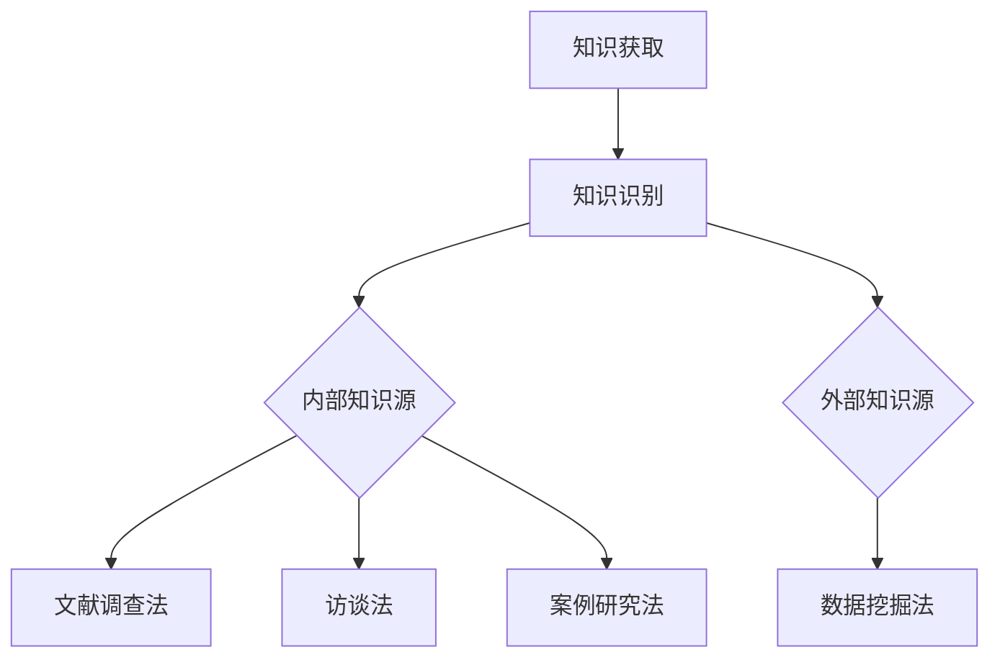
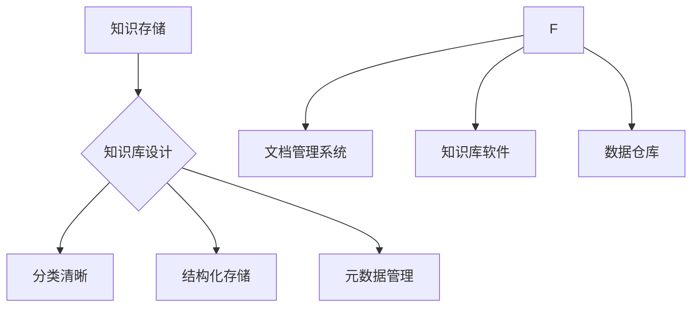
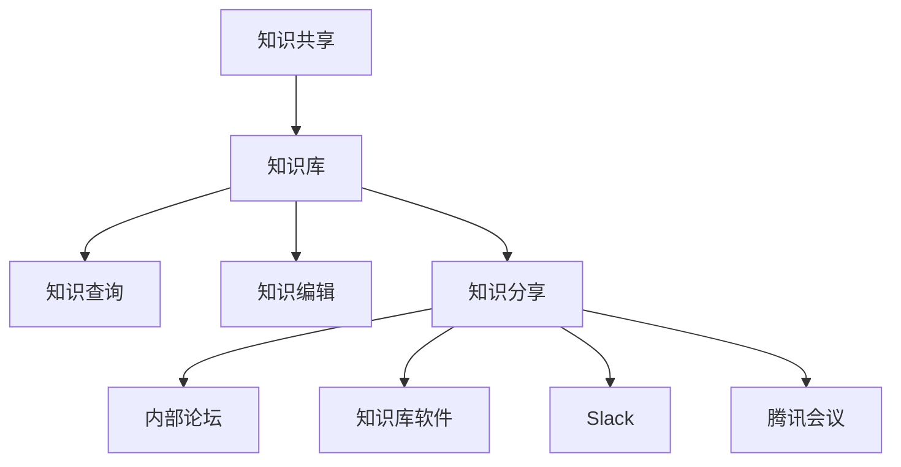
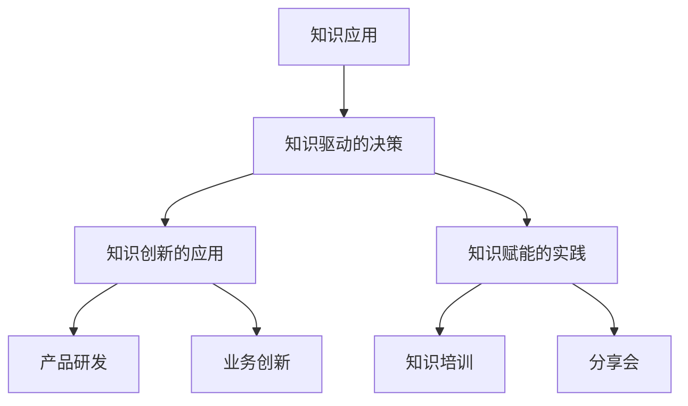
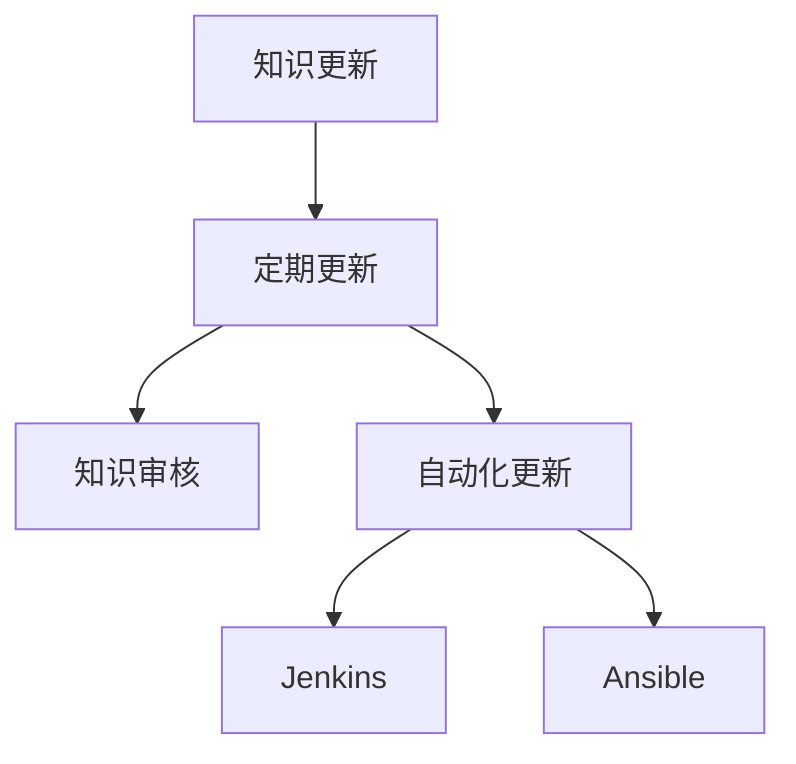

                 

# 信息过载与知识管理策略与实践：管理和组织信息

> **关键词：** 信息过载、知识管理、策略、实践、信息组织

**摘要：** 在当今信息爆炸的时代，信息过载已经成为影响个人和企业效率的普遍问题。本文旨在探讨信息过载的现状及其危害，并深入分析知识管理的概念、原则、策略和实践，以提供有效的信息管理和组织方法。通过介绍知识管理的基本策略和工具，本文希望能够帮助读者理解和应对信息过载，实现知识的高效管理和利用。

## 目录大纲

### 第一部分：信息过载与知识管理的背景与概念

1. **信息过载的现状与挑战**
   1.1 信息过载的定义
   1.2 信息过载的主要表现
   1.3 信息过载的危害

2. **知识管理的概念与作用**
   2.1 知识管理的定义
   2.2 知识管理的重要性
   2.3 知识管理与信息管理的区别

3. **知识管理的基本原则与框架**
   3.1 知识管理的基本原则
   3.2 知识管理的框架

4. **知识管理的发展趋势**
   4.1 知识管理的技术发展
   4.2 知识管理的社会发展趋势

### 第二部分：知识管理的策略与实践

1. **知识获取策略**
   1.1 知识源的选择
   1.2 知识获取的方法与技术
   1.3 知识获取的案例分析

2. **知识存储策略**
   2.1 知识库的设计
   2.2 知识存储的方法与工具
   2.3 知识存储的案例分析

3. **知识共享策略**
   3.1 知识共享的重要性
   3.2 知识共享的障碍与对策
   3.3 知识共享的案例分析

4. **知识应用策略**
   4.1 知识应用的模式
   4.2 知识应用的价值创造
   4.3 知识应用的案例分析

5. **知识更新策略**
   5.1 知识更新的必要性
   5.2 知识更新的方法与工具
   5.3 知识更新的案例分析

6. **知识管理项目的实施与管理**
   6.1 知识管理项目的生命周期
   6.2 知识管理项目的关键成功因素
   6.3 知识管理项目的案例分析

### 第三部分：知识管理工具与技术

1. **知识管理工具概述**
   1.1 知识管理工具的分类
   1.2 知识管理工具的功能特点

2. **知识管理软件介绍**
   2.1 知识库软件
   2.2 知识共享软件
   2.3 知识应用软件
   2.4 知识更新软件

3. **知识管理技术的应用**
   3.1 数据挖掘技术在知识管理中的应用
   3.2 人工智能在知识管理中的应用
   3.3 大数据技术在知识管理中的应用

4. **知识管理案例研究**
   4.1 国内外知识管理典型案例
   4.2 知识管理案例分析与启示

### 第四部分：知识管理与企业发展

1. **知识管理对企业的影响**
   1.1 知识管理对组织结构的影响
   1.2 知识管理对员工能力的影响
   1.3 知识管理对企业战略的影响

2. **知识管理与企业竞争力**
   2.1 知识管理对企业竞争力的提升
   2.2 知识管理在竞争环境中的作用
   2.3 知识管理与企业持续发展的关系

3. **知识管理与企业文化建设**
   3.1 知识管理与企业文化的关系
   3.2 知识管理在企业文化中的应用
   3.3 知识管理对企业文化建设的影响

### 第五部分：知识管理实践与未来展望

1. **知识管理实践分享**
   1.1 知识管理实践案例分享
   1.2 知识管理实践中的挑战与应对
   1.3 知识管理实践的经验与启示

2. **知识管理发展趋势**
   2.1 知识管理技术的发展趋势
   2.2 知识管理在未来的应用前景
   2.3 知识管理面临的挑战与机遇

3. **知识管理在中国的发展**
   3.1 中国知识管理的发展现状
   3.2 中国知识管理的优势与挑战
   3.3 中国知识管理的未来发展

### 附录

1. **附录A：知识管理相关资源**
   1.1 知识管理书籍推荐
   1.2 知识管理期刊与网站
   1.3 知识管理工具资源

2. **附录B：知识管理流程图**
   2.1 知识获取流程图
   2.2 知识存储流程图
   2.3 知识共享流程图
   2.4 知识应用流程图
   2.5 知识更新流程图

3. **附录C：核心算法原理与数学模型**
   3.1 数据挖掘算法原理
   3.2 机器学习算法原理
   3.3 大数据算法原理

4. **附录D：知识管理项目案例**
   4.1 案例一：企业知识管理系统实施
   4.2 案例二：政府知识管理平台建设
   4.3 案例三：教育行业知识管理实践

5. **附录E：知识管理工具使用指南**
   4.1 知识库软件使用指南
   4.2 知识共享软件使用指南
   4.3 知识应用软件使用指南
   4.4 知识更新软件使用指南

## 信息过载与知识管理的背景与概念

### 1.1 信息过载的现状与挑战

#### 1.1.1 信息过载的定义

信息过载是指在信息爆炸的时代，人们面对大量信息时，无法有效地处理和利用这些信息，导致认知负担增加，工作效率下降的现象。信息过载不仅仅体现在个人层面，也普遍存在于企业和组织中。

#### 1.1.2 信息过载的主要表现

1. **信息获取困难：** 在海量的信息中，找到有价值的信息变得异常困难。
2. **信息处理能力有限：** 人们处理信息的速度和能力有限，容易陷入信息处理的困境。
3. **决策困难：** 信息过载会导致决策者难以准确判断，影响决策的质量和效率。
4. **心理压力增加：** 面对大量信息，人们常常感到焦虑和压力，影响心理健康。

#### 1.1.3 信息过载的危害

1. **工作效率降低：** 信息过载使得人们无法集中精力处理任务，工作效率下降。
2. **创新能力受限：** 过多的信息干扰会限制人们的创新思维，影响创造力的发挥。
3. **知识贬值：** 海量信息中，有价值的信息往往被大量无关的信息淹没，导致知识贬值。
4. **心理健康问题：** 长期处于信息过载的状态，容易导致焦虑、抑郁等心理健康问题。

### 1.2 知识管理的概念与作用

#### 1.2.1 知识管理的定义

知识管理是一种系统地识别、获取、存储、共享和应用知识的过程，旨在提高组织和个人对知识的获取、利用和创造能力。

#### 1.2.2 知识管理的重要性

1. **提高组织竞争力：** 知识管理能够帮助企业积累和利用知识，提高创新能力和市场竞争力。
2. **提升工作效率：** 通过有效的知识管理，可以减少重复劳动，提高工作效率。
3. **促进知识共享：** 知识管理有助于组织内部的知识共享和协作，提高团队协作效率。
4. **支持决策制定：** 知识管理提供了丰富的信息资源，支持决策者做出更加科学的决策。

#### 1.2.3 知识管理与信息管理的区别

1. **管理对象不同：** 知识管理关注的是知识本身，包括知识的获取、共享和应用；信息管理关注的是信息，包括信息的收集、处理和存储。
2. **目标不同：** 知识管理的目标是提高知识利用效率，创造价值；信息管理的目标是确保信息的准确性和可用性。
3. **方法不同：** 知识管理强调知识的创造和共享，通过建立知识社区和知识库来实现；信息管理强调信息的标准化和规范化，通过建立信息标准和流程来实现。

### 1.3 知识管理的基本原则与框架

#### 1.3.1 知识管理的基本原则

1. **知识共享原则：** 知识的共享是知识管理的核心，鼓励员工共享知识和经验，提高整体知识水平。
2. **知识创新原则：** 鼓励员工在知识的基础上进行创新，推动组织发展。
3. **知识识别原则：** 确保组织内的知识和经验被正确识别和记录，以便后续利用。
4. **知识应用原则：** 知识管理要确保知识能够被有效应用，产生实际效益。

#### 1.3.2 知识管理的框架

1. **知识识别：** 通过培训、调查、访谈等方式，识别组织内的知识资源。
2. **知识获取：** 通过学习、研究、交流等方式，获取外部和内部的知识。
3. **知识存储：** 将获取到的知识存储在知识库中，便于管理和检索。
4. **知识共享：** 建立知识共享机制，促进组织内部的知识流动和共享。
5. **知识应用：** 将知识应用于实际工作中，创造价值。

### 1.4 知识管理的发展趋势

#### 1.4.1 知识管理的技术发展

1. **大数据技术：** 大数据技术为知识管理提供了强大的数据支持，通过分析海量数据，发现潜在的知识价值。
2. **人工智能技术：** 人工智能技术能够自动化知识识别、获取、共享和应用，提高知识管理的效率和准确性。
3. **云计算技术：** 云计算技术为知识管理提供了弹性、可扩展的计算资源，降低知识管理的成本。

#### 1.4.2 知识管理的社会发展趋势

1. **知识共享文化：** 随着知识经济时代的到来，知识共享已经成为组织和社会的重要价值观。
2. **知识创新环境：** 政府和企业纷纷建立知识创新环境，鼓励员工进行知识创新。
3. **知识管理标准化：** 各国政府和企业纷纷制定知识管理的标准和规范，推动知识管理的发展。

## 知识管理的策略与实践

### 2.1 知识获取策略

#### 2.1.1 知识源的选择

知识源的选择是知识获取的首要环节。有效的知识源选择能够确保获取到的知识具有价值性和准确性。

1. **内部知识源：** 包括组织内部员工的实践经验、知识库、文档等。
2. **外部知识源：** 包括学术期刊、图书、网络资源、行业报告等。

#### 2.1.2 知识获取的方法与技术

1. **文献调查法：** 通过查阅文献，获取相关领域的知识。
2. **访谈法：** 通过与专家、同行等进行访谈，获取内部和外部知识。
3. **案例研究法：** 通过研究典型案例，获取知识应用的经验。
4. **数据挖掘法：** 通过分析大量数据，发现潜在的知识价值。

#### 2.1.3 知识获取的案例分析

例如，一家企业为了提升研发效率，采用文献调查法和数据挖掘法获取行业内的最新技术动态和研发案例。通过这种方式，企业能够迅速了解市场趋势，优化研发方向。

### 2.2 知识存储策略

#### 2.2.1 知识库的设计

知识库是知识存储的核心，设计一个高效、易用的知识库能够确保知识的可获取性和可用性。

1. **分类清晰：** 根据知识类型和用途，对知识进行分类，便于检索。
2. **结构化存储：** 使用数据库等技术，对知识进行结构化存储，提高查询效率。
3. **元数据管理：** 为每个知识条目添加元数据，方便知识管理和检索。

#### 2.2.2 知识存储的方法与工具

1. **文档管理系统（DMS）：** 用于存储和管理的文档、报告等。
2. **知识库软件：** 如IBM Watson、Confluence等，用于存储和共享知识。
3. **数据仓库：** 用于存储和整合大量的结构化数据。

#### 2.2.3 知识存储的案例分析

例如，一家公司采用IBM Watson作为知识库软件，通过结构化存储和元数据管理，实现了知识的有效存储和快速检索，提高了工作效率。

### 2.3 知识共享策略

#### 2.3.1 知识共享的重要性

知识共享是知识管理的核心目标之一，通过知识共享，可以实现知识的传递和扩散，提高组织整体知识水平。

1. **提高知识利用率：** 知识共享能够将闲置的知识转化为实际生产力。
2. **促进知识创新：** 通过知识共享，激发员工的创新思维，推动知识创新。
3. **提高员工技能：** 知识共享有助于员工学习新知识，提高个人技能。

#### 2.3.2 知识共享的障碍与对策

1. **知识共享的障碍：**
   - 文化障碍：组织内部缺乏知识共享的文化。
   - 技术障碍：知识共享工具不完善，不便使用。
   - 知识保密：部分员工担心知识共享可能导致知识泄露。

2. **对策：**
   - 建立知识共享文化：通过培训、宣传等方式，提高员工对知识共享的认识。
   - 提供便捷的知识共享工具：优化知识共享平台，提高用户体验。
   - 制定知识共享激励机制：对知识共享者进行奖励，激励员工积极参与。

#### 2.3.3 知识共享的案例分析

例如，一家企业通过建立内部论坛和知识库，鼓励员工分享工作经验和最佳实践。通过这种方式，企业实现了知识的快速传递和共享，提高了员工技能和工作效率。

### 2.4 知识应用策略

#### 2.4.1 知识应用的模式

1. **知识驱动的决策：** 通过知识库和数据分析，支持决策者做出科学决策。
2. **知识创新的应用：** 将知识应用于产品研发、业务创新等方面，推动组织发展。
3. **知识赋能的实践：** 通过知识培训、分享会等方式，提高员工知识水平和技能。

#### 2.4.2 知识应用的价值创造

1. **提高工作效率：** 通过知识应用，减少重复劳动，提高工作效率。
2. **降低成本：** 通过知识应用，优化流程，降低运营成本。
3. **提升竞争力：** 通过知识应用，推动产品创新，提高市场竞争力。

#### 2.4.3 知识应用的案例分析

例如，一家企业通过数据挖掘技术，分析客户数据，发现潜在客户需求，从而优化产品研发和市场策略，实现了业务增长。

### 2.5 知识更新策略

#### 2.5.1 知识更新的必要性

1. **知识更新是知识管理的重要环节：** 随着外部环境和内部需求的变化，知识需要不断更新以保持其价值。
2. **知识陈旧影响知识管理效果：** 陈旧的知识会影响决策的准确性，降低知识管理的效率。

#### 2.5.2 知识更新的方法与工具

1. **定期更新：** 制定知识更新计划，定期对知识库进行审核和更新。
2. **自动化更新：** 使用自动化工具，如机器人流程自动化（RPA），对知识库进行实时更新。
3. **知识审核：** 建立知识审核机制，确保知识库中的知识准确、可靠。

#### 2.5.3 知识更新的案例分析

例如，一家公司采用自动化工具，通过定期更新和实时审核，确保知识库中的知识始终处于最新状态，提高了知识管理的效率和准确性。

### 2.6 知识管理项目的实施与管理

#### 2.6.1 知识管理项目的生命周期

1. **项目启动：** 明确项目目标、范围和团队组成。
2. **项目规划：** 制定项目计划、预算和资源分配。
3. **项目执行：** 实施知识管理策略，包括知识获取、存储、共享、应用和更新。
4. **项目监控：** 监控项目进度和质量，确保项目按计划进行。
5. **项目收尾：** 对项目进行总结和评估，为后续项目提供经验教训。

#### 2.6.2 知识管理项目的关键成功因素

1. **领导支持：** 高层领导的支持是知识管理项目成功的关键。
2. **团队协作：** 知识管理项目需要跨部门的协作，建立有效的沟通机制。
3. **技术保障：** 知识管理项目需要可靠的技术支持，确保系统稳定运行。
4. **用户参与：** 用户积极参与，提供反馈，有助于改进知识管理策略。

#### 2.6.3 知识管理项目的案例分析

例如，一家公司成功实施了知识管理项目，通过建立知识库、优化知识共享平台和开展知识培训，提高了员工的知识水平和团队协作效率。

## 知识管理工具与技术

### 3.1 知识管理工具概述

#### 3.1.1 知识管理工具的分类

1. **知识库工具：** 如Confluence、SharePoint等，用于存储和共享知识。
2. **知识共享工具：** 如Slack、腾讯会议等，用于促进知识交流和协作。
3. **知识应用工具：** 如Tableau、Power BI等，用于分析和展示知识。
4. **知识更新工具：** 如Jenkins、Ansible等，用于自动化知识更新。

#### 3.1.2 知识管理工具的功能特点

1. **易于使用：** 知识管理工具应具备友好的用户界面，便于员工使用。
2. **高度可定制：** 知识管理工具应支持定制，满足不同组织的需求。
3. **安全性：** 知识管理工具应具备数据安全保护功能，确保知识安全。

### 3.2 知识管理软件介绍

#### 3.2.1 知识库软件

1. **Confluence：** 康威公司开发的一款知识库软件，支持文档、表格、图片等多种形式的知识存储和共享。
2. **SharePoint：** 微软公司开发的一款知识库软件，集成在Office 365中，支持企业级知识管理。

#### 3.2.2 知识共享软件

1. **Slack：** 一款团队协作工具，支持即时通讯、文件共享和任务管理。
2. **腾讯会议：** 腾讯公司开发的一款视频会议软件，支持多人实时沟通和协作。

#### 3.2.3 知识应用软件

1. **Tableau：** 一款数据可视化工具，支持将数据转化为易于理解的图表和报表。
2. **Power BI：** 微软公司开发的一款商业智能工具，支持数据分析、报告生成和可视化。

#### 3.2.4 知识更新软件

1. **Jenkins：** 一款自动化构建工具，支持自动化知识库更新。
2. **Ansible：** 一款自动化部署工具，支持自动化知识库维护。

### 3.3 知识管理技术的应用

#### 3.3.1 数据挖掘技术在知识管理中的应用

1. **数据预处理：** 通过数据清洗、数据转换等技术，将原始数据转化为适合挖掘的形式。
2. **特征提取：** 从原始数据中提取关键特征，用于后续分析。
3. **模式识别：** 通过机器学习算法，发现数据中的潜在规律和关联。

#### 3.3.2 人工智能在知识管理中的应用

1. **自然语言处理：** 通过人工智能技术，实现文本的自动分类、摘要和语义分析。
2. **推荐系统：** 基于用户行为和兴趣，推荐相关的知识和资源。
3. **自动化决策：** 通过人工智能技术，实现自动化的知识管理和决策。

#### 3.3.3 大数据技术在知识管理中的应用

1. **分布式存储：** 使用大数据技术，实现海量知识的分布式存储和管理。
2. **实时分析：** 通过实时数据流处理，实现知识的实时分析和应用。
3. **深度学习：** 通过深度学习算法，实现知识的自动化挖掘和应用。

### 3.4 知识管理案例研究

#### 3.4.1 国内外知识管理典型案例

1. **谷歌：** 谷歌通过内部知识共享平台，实现员工之间的知识交流和创新。
2. **IBM：** IBM通过知识管理工具，提高员工的知识获取和应用能力。

#### 3.4.2 知识管理案例分析与启示

通过对国内外知识管理案例的分析，可以得出以下启示：

1. **建立知识共享文化：** 知识共享是知识管理的核心，组织需要建立知识共享的文化和机制。
2. **利用技术手段：** 技术手段是实现知识管理的重要工具，组织需要利用大数据、人工智能等先进技术提高知识管理效率。
3. **关注用户体验：** 知识管理工具需要注重用户体验，确保员工能够方便地获取和应用知识。

## 知识管理与企业发展

### 4.1 知识管理对企业的影响

#### 4.1.1 知识管理对组织结构的影响

知识管理能够促进组织结构的优化和变革。通过知识共享和协作，组织可以实现扁平化和网络化结构，提高组织内部的沟通效率和协作能力。

1. **减少层次：** 知识管理减少了信息传递的层次，缩短了决策链。
2. **促进协作：** 知识管理鼓励跨部门、跨团队的协作，提高了团队的整体效能。

#### 4.1.2 知识管理对员工能力的影响

知识管理能够提高员工的知识水平和技能，促进员工的专业成长。

1. **知识获取：** 知识管理提供了丰富的知识资源，员工可以方便地获取所需知识。
2. **知识共享：** 知识管理鼓励员工共享知识和经验，促进知识的传递和扩散。
3. **知识应用：** 知识管理支持员工将知识应用于实际工作中，提高工作效率和质量。

#### 4.1.3 知识管理对企业战略的影响

知识管理是企业战略的重要组成部分，能够提高企业的创新能力和竞争力。

1. **创新驱动：** 知识管理鼓励员工进行知识创新，推动企业的技术创新和产品创新。
2. **战略规划：** 知识管理提供了丰富的信息资源，支持企业制定科学、合理的战略规划。
3. **风险管理：** 知识管理通过风险识别和评估，帮助企业规避潜在风险，实现可持续发展。

### 4.2 知识管理与企业竞争力

#### 4.2.1 知识管理对企业竞争力的提升

知识管理能够提高企业的核心竞争力，实现可持续发展。

1. **知识创新：** 知识管理鼓励员工进行知识创新，推动企业的技术创新和产品创新。
2. **知识共享：** 知识管理促进知识的传递和扩散，提高组织的整体知识水平。
3. **知识应用：** 知识管理支持员工将知识应用于实际工作中，提高工作效率和质量。

#### 4.2.2 知识管理在竞争环境中的作用

在竞争激烈的市场环境中，知识管理能够帮助企业在创新和决策方面取得优势。

1. **快速响应：** 知识管理支持企业快速获取和传递信息，提高市场响应速度。
2. **科学决策：** 知识管理提供了丰富的信息资源，支持企业做出更加科学的决策。
3. **创新能力：** 知识管理鼓励员工进行知识创新，推动企业的持续创新和发展。

#### 4.2.3 知识管理与企业持续发展的关系

知识管理是企业持续发展的重要保障，能够提高企业的核心竞争力和创新能力。

1. **知识积累：** 知识管理能够帮助企业积累和传承知识，为企业的可持续发展奠定基础。
2. **创新能力：** 知识管理鼓励员工进行知识创新，推动企业的持续创新和发展。
3. **竞争优势：** 知识管理能够提高企业的核心竞争力，实现企业的长期发展。

### 4.3 知识管理与企业文化建设

#### 4.3.1 知识管理与企业文化的关系

知识管理是企业文化建设的重要组成部分，良好的企业文化能够促进知识管理的实施和发展。

1. **共享文化：** 知识管理需要建立共享文化，鼓励员工分享知识和经验。
2. **学习文化：** 知识管理需要建立学习文化，鼓励员工不断学习和进步。
3. **创新文化：** 知识管理需要建立创新文化，鼓励员工进行知识创新。

#### 4.3.2 知识管理在企业文化中的应用

1. **培训与分享：** 通过培训和学习分享会，提高员工的知识水平和技能。
2. **知识竞赛：** 通过知识竞赛，激发员工的学习兴趣和创新能力。
3. **知识库建设：** 通过建立知识库，实现知识的系统化管理和共享。

#### 4.3.3 知识管理对企业文化建设的影响

知识管理能够促进企业文化建设，提高企业的凝聚力和竞争力。

1. **共享文化：** 知识管理促进了企业共享文化的建立，提高了员工的团队协作意识。
2. **学习文化：** 知识管理推动了学习文化的建设，提高了员工的学习能力和创新能力。
3. **创新文化：** 知识管理促进了创新文化的形成，推动了企业的持续创新和发展。

## 知识管理实践与未来展望

### 5.1 知识管理实践分享

#### 5.1.1 知识管理实践案例分享

1. **案例一：** 一家大型企业通过建立内部知识库和培训体系，提高了员工的知识水平和技能，实现了知识的有效共享和应用。
2. **案例二：** 一家科技公司将人工智能技术应用于知识管理，实现了知识的自动化挖掘和应用，提高了企业的创新能力和市场竞争力。

#### 5.1.2 知识管理实践中的挑战与应对

1. **挑战：** 知识共享文化难以建立，员工缺乏知识共享的意愿。
   - 应对：通过激励措施和培训，提高员工对知识共享的认识，建立共享文化。

2. **挑战：** 知识管理工具复杂，难以操作。
   - 应对：提供培训和技术支持，降低工具的使用门槛，提高员工的使用体验。

3. **挑战：** 知识管理项目的实施和管理难度较大。
   - 应对：制定详细的项目计划和风险管理措施，确保项目的顺利进行。

#### 5.1.3 知识管理实践的经验与启示

1. **经验：** 知识管理需要高层领导的支持和推动，建立有效的组织保障。
2. **经验：** 知识管理需要建立良好的沟通和协作机制，提高知识共享和应用的效率。
3. **经验：** 知识管理需要注重用户体验，提供便捷、易用的知识管理工具。

### 5.2 知识管理发展趋势

#### 5.2.1 知识管理技术的发展趋势

1. **人工智能技术的应用：** 人工智能技术将为知识管理带来新的机遇和挑战，如自然语言处理、推荐系统、自动化决策等。
2. **大数据技术的应用：** 大数据技术将提供更加丰富的数据资源，支持知识挖掘和应用。
3. **云计算技术的应用：** 云计算技术将提供弹性、高效、安全的计算资源，支持知识管理的实施。

#### 5.2.2 知识管理在未来的应用前景

1. **智慧城市建设：** 知识管理将应用于智慧城市建设，提高城市的管理和服务水平。
2. **医疗健康领域：** 知识管理将应用于医疗健康领域，提高医疗服务的质量和效率。
3. **企业数字化转型：** 知识管理将助力企业实现数字化转型，提高企业的核心竞争力和创新能力。

#### 5.2.3 知识管理面临的挑战与机遇

1. **挑战：** 知识共享文化难以建立，员工缺乏知识共享的意愿。
   - 机遇：通过激励机制和培训，提高员工对知识共享的认识，建立共享文化。

2. **挑战：** 知识管理工具复杂，难以操作。
   - 机遇：提供培训和技术支持，降低工具的使用门槛，提高员工的使用体验。

3. **挑战：** 知识管理项目的实施和管理难度较大。
   - 机遇：制定详细的项目计划和风险管理措施，确保项目的顺利进行。

### 5.3 知识管理在中国的发展

#### 5.3.1 中国知识管理的发展现状

1. **政策支持：** 中国政府高度重视知识管理，制定了一系列政策和规划，推动知识管理的发展。
2. **企业实践：** 中国企业逐渐认识到知识管理的重要性，积极开展知识管理实践。
3. **技术进步：** 中国在人工智能、大数据等领域取得了重要突破，为知识管理提供了强大的技术支持。

#### 5.3.2 中国知识管理的优势与挑战

1. **优势：**
   - 政策支持：中国政府为知识管理提供了良好的政策环境。
   - 技术进步：中国在人工智能、大数据等领域取得了重要突破，为知识管理提供了技术支持。

2. **挑战：**
   - 文化观念：中国传统文化中缺乏知识共享的观念，需要加强知识共享文化的建设。
   - 人才短缺：知识管理需要专业人才的支持，中国在这一领域存在一定的人才短缺问题。

#### 5.3.3 中国知识管理的未来发展

1. **政策推动：** 中国政府将继续加大对知识管理政策的支持力度，推动知识管理的发展。
2. **技术创新：** 中国将在人工智能、大数据等领域继续加大研发投入，为知识管理提供技术支持。
3. **企业实践：** 中国企业将加强知识管理实践，推动知识管理在企业的广泛应用。

## 附录

### 附录A：知识管理相关资源

#### A.1 知识管理书籍推荐

1. 《知识管理：战略、过程和实践》
2. 《知识管理技术》
3. 《企业知识管理》

#### A.2 知识管理期刊与网站

1. 《知识管理杂志》
2. 知识管理网（www.knowledgemanagement.org.cn）
3. 知识管理论坛（www.knowledgemanagement.net）

#### A.3 知识管理工具资源

1. Confluence（https://www.atlassian.com/software/confluence）
2. SharePoint（https://www.microsoft.com/en-us/microsoft-365/sharepoint/knowledge-management）
3. Tableau（https://www.tableau.com/products/knowledge-management）

### 附录B：知识管理流程图

#### B.1 知识获取流程图



#### B.2 知识存储流程图



#### B.3 知识共享流程图



#### B.4 知识应用流程图



#### B.5 知识更新流程图



### 附录C：核心算法原理与数学模型

#### C.1 数据挖掘算法原理

##### C.1.1 决策树算法

```latex
\text{决策树算法原理：}
设 $D$ 为数据集，$A$ 为属性集，$V_a$ 为属性 $a$ 的取值集合，对于每个属性 $a \in A$，在 $D$ 上定义划分函数 $D(a)$，用于划分数据集 $D$。

\text{算法步骤：}
1. 选择最优属性 $a^*$；
2. 对 $D$ 进行划分，得到子集 $D_1, D_2, ..., D_v$，其中 $D_i = D(D(a^*), v_i)$；
3. 对每个子集 $D_i$，递归地执行步骤 1 和 2，直到满足停止条件。

\text{停止条件：}
1. 子集 $D_i$ 中不存在可划分的属性；
2. 子集 $D_i$ 中的数据满足同一类别；
3. 子集 $D_i$ 的大小小于预设阈值。
```

##### C.1.2 支持向量机算法

```latex
\text{支持向量机算法原理：}
设 $D$ 为训练数据集，$x$ 为输入特征向量，$y$ 为输出标签，$w$ 为权重向量，$b$ 为偏置。

\text{目标函数：}
\text{最小化目标函数：} J(w, b) = \frac{1}{2} ||w||^2 + C \sum_{i=1}^n \max(0, 1 - y_i (w \cdot x_i + b))

\text{算法步骤：}
1. 构建损失函数：$L(w, b, \alpha, \beta) = \frac{1}{2} ||w||^2 + C \sum_{i=1}^n \max(0, 1 - y_i (w \cdot x_i + b))$；
2. 对 $L$ 进行求导，得到梯度：$g(w, b, \alpha, \beta) = \frac{\partial L}{\partial w} = w - C y \odot (x \odot y)$；
3. 使用梯度下降法更新权重：$w \leftarrow w - \alpha \cdot g(w, b, \alpha, \beta)$；
4. 更新偏置：$b \leftarrow b - \alpha \cdot \frac{\partial L}{\partial b}$；
5. 更新超参数：$\alpha, \beta$。

\text{停止条件：}
1. 达到预设的迭代次数；
2. 权重变化小于预设阈值。
```

##### C.1.3 贝叶斯算法

```latex
\text{贝叶斯算法原理：}
设 $D$ 为训练数据集，$x$ 为输入特征向量，$y$ 为输出标签，$P(y)$ 为先验概率，$P(x|y)$ 为特征条件概率，$P(y|x)$ 为后验概率。

\text{算法步骤：}
1. 计算先验概率：$P(y)$；
2. 计算特征条件概率：$P(x|y)$；
3. 计算后验概率：$P(y|x) = \frac{P(x|y)P(y)}{P(x)}$；
4. 根据后验概率选择标签：$y = \arg\max_y P(y|x)$。

\text{分类算法：}
\text{朴素贝叶斯分类器：} P(y|x) = \frac{P(x|y)P(y)}{P(x)}，其中 $P(x|y)$ 为特征条件概率，$P(y)$ 为先验概率。

\text{回归算法：}
\text{贝叶斯回归：} y = \arg\max_y P(y|x) = \arg\max_y \log P(x|y) + \log P(y) - \log P(x)。
```

#### C.2 机器学习算法原理

##### C.2.1 回归算法

```latex
\text{回归算法原理：}
设 $D$ 为训练数据集，$x$ 为输入特征向量，$y$ 为输出标签，$f(x)$ 为回归函数。

\text{目标函数：}
\text{最小化目标函数：} J(\theta) = \frac{1}{2m} \sum_{i=1}^m (h_\theta(x^{(i)}) - y^{(i)})^2

\text{算法步骤：}
1. 选择损失函数：$J(\theta) = \frac{1}{2m} \sum_{i=1}^m (h_\theta(x^{(i)}) - y^{(i)})^2$；
2. 对 $J(\theta)$ 求导，得到梯度：$g(\theta) = \frac{\partial J(\theta)}{\partial \theta}$；
3. 使用梯度下降法更新参数：$\theta \leftarrow \theta - \alpha \cdot g(\theta)$；
4. 重复步骤 2 和 3，直到满足停止条件。

\text{停止条件：}
1. 达到预设的迭代次数；
2. 梯度变化小于预设阈值。
```

##### C.2.2 分类算法

```latex
\text{分类算法原理：}
设 $D$ 为训练数据集，$x$ 为输入特征向量，$y$ 为输出标签，$f(x)$ 为分类函数。

\text{目标函数：}
\text{最小化目标函数：} J(\theta) = -\frac{1}{m} \sum_{i=1}^m [y^{(i)} \log(h_\theta(x^{(i)})) + (1 - y^{(i)}) \log(1 - h_\theta(x^{(i)}))]，其中 $h_\theta(x) = \sigma(\theta^T x)$，$\sigma(z) = \frac{1}{1 + e^{-z}}$。

\text{算法步骤：}
1. 选择损失函数：$J(\theta) = -\frac{1}{m} \sum_{i=1}^m [y^{(i)} \log(h_\theta(x^{(i)})) + (1 - y^{(i)}) \log(1 - h_\theta(x^{(i)}))]$；
2. 对 $J(\theta)$ 求导，得到梯度：$g(\theta) = \frac{\partial J(\theta)}{\partial \theta}$；
3. 使用梯度下降法更新参数：$\theta \leftarrow \theta - \alpha \cdot g(\theta)$；
4. 重复步骤 2 和 3，直到满足停止条件。

\text{停止条件：}
1. 达到预设的迭代次数；
2. 梯度变化小于预设阈值。
```

##### C.2.3 聚类算法

```latex
\text{聚类算法原理：}
设 $D$ 为数据集，$x$ 为数据点，$c$ 为聚类中心。

\text{目标函数：}
\text{最小化目标函数：} J(c) = \frac{1}{2} \sum_{i=1}^m ||x^{(i)} - c||^2

\text{算法步骤：}
1. 随机初始化聚类中心 $c$；
2. 对于每个数据点 $x^{(i)}$，计算与聚类中心 $c$ 的距离：$d(x^{(i)}, c)$；
3. 根据距离计算，将数据点分配到相应的聚类中心；
4. 更新聚类中心：$c \leftarrow \frac{1}{m} \sum_{i=1}^m x^{(i)}$；
5. 重复步骤 2 到 4，直到聚类中心不再发生变化。

\text{停止条件：}
1. 达到预设的迭代次数；
2. 聚类中心的变化小于预设阈值。
```

#### C.3 大数据算法原理

##### C.3.1 Hadoop生态系统

```latex
\text{Hadoop生态系统原理：}
\text{Hadoop是一个分布式数据存储和处理框架，由以下几个核心组件组成：}

1. **Hadoop分布式文件系统（HDFS）：**
   - 用于存储大量数据，提供高吞吐量的数据访问；
   - 数据存储分为数据块，默认大小为 128MB 或 256MB；
   - 数据块在多个节点上存储，提供高可用性和容错性。

2. **Hadoop YARN：**
   - 用于资源管理和任务调度；
   - 提供了资源隔离和高效的任务调度；
   - 支持多种计算框架，如MapReduce、Spark等。

3. **Hadoop MapReduce：**
   - 用于大规模数据集的分布式计算；
   - 数据处理过程分为“Map”和“Reduce”两个阶段；
   - “Map”阶段对数据进行映射，生成中间结果；
   - “Reduce”阶段对中间结果进行聚合，生成最终结果。

4. **Hadoop HBase：**
   - 用于海量数据的存储和访问；
   - 提供随机实时读写访问；
   - 基于HDFS，提供高吞吐量和低延迟的数据访问。

5. **Hadoop Hive：**
   - 用于数据仓库，提供数据分析和查询；
   - 提供SQL-like查询语言，如HiveQL；
   - 将查询转化为MapReduce任务，执行数据分析和查询。

6. **Hadoop Spark：**
   - 用于大数据处理，提供高性能的分布式计算；
   - 支持多种编程语言，如Scala、Python、Java等；
   - 提供丰富的API，支持数据清洗、数据处理、机器学习等。

##### C.3.2 Spark生态系统

```latex
\text{Spark生态系统原理：}
\text{Spark是一个开源的大数据处理框架，由以下几个核心组件组成：}

1. **Spark Core：**
   - 提供了Spark的基本功能，如内存计算、任务调度、存储管理等；
   - 支持多种编程语言，如Scala、Python、Java等；
   - 提供了Spark的核心API，如SparkContext、RDD（弹性分布式数据集）等。

2. **Spark SQL：**
   - 提供了结构化数据处理和分析功能；
   - 支持SQL-like查询语言，如SparkSQL；
   - 提供了DataFrame和Dataset API，支持结构化和半结构化数据。

3. **Spark Streaming：**
   - 用于实时数据流处理；
   - 支持微批处理和连续处理，提供高吞吐量和低延迟的数据处理；
   - 支持多种数据源，如Kafka、Flume等。

4. **Spark MLlib：**
   - 提供了机器学习算法和库；
   - 支持分类、回归、聚类、协同过滤等算法；
   - 提供了易用的API，如Pipeline、Transformer等。

5. **Spark GraphX：**
   - 用于大规模图处理；
   - 提供了图算法和库，如PageRank、Community Detection等；
   - 支持图计算优化，如图并行处理、图存储等。

##### C.3.3 Flink生态系统

```latex
\text{Flink生态系统原理：}
\text{Apache Flink是一个开源的大数据处理框架，由以下几个核心组件组成：}

1. **Flink Core：**
   - 提供了Flink的基本功能，如流处理、批处理、任务调度、存储管理等；
   - 支持实时数据流处理和批处理，提供高吞吐量和低延迟的数据处理；
   - 支持多种编程语言，如Java、Scala等。

2. **Flink SQL：**
   - 提供了Flink的SQL查询接口；
   - 支持实时SQL查询，如流SQL和批SQL；
   - 提供了结构化和半结构化数据的查询和分析。

3. **Flink Streaming：**
   - 用于实时数据流处理；
   - 支持事件驱动和窗口处理，提供高效的数据流处理能力；
   - 提供了丰富的API，如DataStream API和Window API。

4. **Flink ML：**
   - 提供了Flink的机器学习库；
   - 支持多种机器学习算法，如分类、回归、聚类等；
   - 提供了易用的API，如MLContext、Pipeline等。

5. **Flink Gelly：**
   - 用于大规模图处理；
   - 提供了图算法和库，如PageRank、Shortest Paths等；
   - 支持图并行处理和复杂图计算。

### 附录D：知识管理项目案例

#### D.1 案例一：企业知识管理系统实施

**背景：** 一家大型企业面临着知识分散、共享困难、创新不足等问题，为了提高知识管理效率，决定实施知识管理系统。

**目标：** 
- 构建一个集成的知识库，实现知识的集中管理和共享；
- 提高员工的知识获取和应用能力，促进知识创新；
- 建立知识共享文化，提高员工的协作和沟通效率。

**实施步骤：**
1. **需求分析：** 对企业内部进行调研，了解各部门的知识需求和痛点；
2. **系统设计：** 制定知识管理系统的架构和功能模块，选择合适的知识管理工具；
3. **知识库建设：** 建立知识库，收集和整理企业内部的知识资源，进行分类和标签化管理；
4. **知识共享平台搭建：** 搭建知识共享平台，提供知识检索、共享、应用等功能；
5. **培训与推广：** 对员工进行知识管理培训和推广，提高员工的参与度和使用率。

**效果评估：**
- 知识库中的知识条目数量显著增加，知识的共享和利用效率提高；
- 员工的知识获取和应用能力增强，创新项目数量和质量提升；
- 企业内部的协作和沟通效率提高，团队凝聚力增强。

#### D.2 案例二：政府知识管理平台建设

**背景：** 一家政府部门面临着信息分散、决策效率低下、知识无法充分利用等问题，为了提高行政效率和决策质量，决定建设知识管理平台。

**目标：**
- 构建一个集中化的知识管理平台，实现政务知识的集成和共享；
- 提高政务决策的科学性和准确性，增强政府的决策能力；
- 促进政务创新的开展，提高公共服务质量。

**实施步骤：**
1. **需求调研：** 对政府部门进行调研，了解各部门的知识需求和业务流程；
2. **系统设计：** 制定知识管理平台的架构和功能模块，选择合适的知识管理工具；
3. **知识资源整合：** 整合各部门的知识资源，建立知识库，进行分类和标签化管理；
4. **知识共享平台搭建：** 搭建知识共享平台，提供知识检索、共享、应用等功能；
5. **数据治理：** 建立数据治理体系，确保知识库中的数据准确、可靠和可用；
6. **培训与推广：** 对政府部门的工作人员进行知识管理培训和推广，提高知识管理平台的利用效率。

**效果评估：**
- 政务知识的集成和共享效果显著，提高了政务决策的效率和准确性；
- 政府部门的决策能力和创新能力得到提升，公共服务质量得到改善；
- 政府部门之间的协作和沟通效率提高，整体行政效能得到提升。

#### D.3 案例三：教育行业知识管理实践

**背景：** 一家教育机构面临着教育资源分散、教学研究水平不均衡等问题，为了提高教育质量和教学研究水平，决定开展知识管理实践。

**目标：**
- 构建一个教育知识管理平台，实现教育资源的集中管理和共享；
- 促进教学研究的发展，提高教学质量和科研水平；
- 建立教师之间的知识共享和协作机制，提高教师团队的整体素质。

**实施步骤：**
1. **需求调研：** 对教育机构进行调研，了解教师和学生的知识需求和学习特点；
2. **系统设计：** 制定教育知识管理平台的架构和功能模块，选择合适的知识管理工具；
3. **教育资源整合：** 整合教育机构内的教学资源、科研成果等，建立知识库，进行分类和标签化管理；
4. **知识共享平台搭建：** 搭建知识共享平台，提供知识检索、共享、应用等功能；
5. **在线教学与科研协作：** 利用知识管理平台，开展在线教学和科研协作，提高教学和科研效率；
6. **培训与推广：** 对教师和学生进行知识管理培训和推广，提高知识管理平台的利用效率。

**效果评估：**
- 教育资源的集成和共享效果显著，提高了教学质量和科研水平；
- 教师之间的知识共享和协作机制得到建立，教学研究项目数量和质量提升；
- 教师和学生的知识获取和应用能力增强，学习效果和学习兴趣得到提高。

### 附录E：知识管理工具使用指南

#### E.1 知识库软件使用指南

**Confluence**

1. **安装与配置：**
   - 下载并安装Confluence服务器版本；
   - 配置数据库连接，如MySQL、PostgreSQL等；
   - 配置邮件服务器，用于发送通知和提醒。

2. **基本功能：**
   - 创建页面：使用Markdown或HTML语言创建和编辑页面；
   - 知识搜索：通过搜索功能快速找到所需知识；
   - 版本控制：支持页面版本控制，方便跟踪修改历史。

3. **高级功能：**
   - 知识分类：使用标签和分类功能，对知识进行分类和管理；
   - 用户权限：设置用户权限，控制知识访问和编辑权限；
   - 知识库扩展：通过插件和集成，扩展知识库功能，如文档管理、任务管理等。

**SharePoint**

1. **安装与配置：**
   - 下载并安装SharePoint服务器版本；
   - 配置Web应用和站点集合；
   - 配置权限和访问控制。

2. **基本功能：**
   - 文档库：用于存储和共享文档；
   - 视频库：用于存储和共享视频文件；
   - 知识搜索：通过搜索功能快速找到所需知识。

3. **高级功能：**
   - 工作流：创建自定义工作流，实现文档审批和任务分配；
   - 公告板：发布公告和新闻，提高内部沟通效率；
   - 知识库扩展：通过自定义Web部件和功能模块，扩展SharePoint的知识管理功能。

#### E.2 知识共享软件使用指南

**Slack**

1. **安装与配置：**
   - 下载并安装Slack客户端；
   - 创建团队和工作空间；
   - 邀请团队成员加入。

2. **基本功能：**
   - 文本聊天：实时进行文本聊天，支持私聊和群聊；
   - 文件共享：上传和共享文件，支持多种文件格式；
   - 钩子：通过集成其他应用程序，如GitHub、JIRA等，实现自动化工作流。

3. **高级功能：**
   - 消息机器人：创建自定义消息机器人，实现自动化回复和任务提醒；
   - 针对性聊天：创建针对性聊天室，提高沟通效率；
   - 工作流自动化：使用Slack机器人实现工作流自动化，提高工作效率。

**腾讯会议**

1. **安装与配置：**
   - 下载并安装腾讯会议客户端；
   - 登录账号，创建会议；
   - 邀请参会人员。

2. **基本功能：**
   - 视频会议：支持多人视频会议，实时沟通和交流；
   - 屏幕共享：共享屏幕，展示演示内容；
   - 云录制：自动录制会议，便于后续回顾和分享。

3. **高级功能：**
   - 多人互动：支持多人实时互动，如提问、评论等；
   - 会议回放：录制会议并回放，方便参会人员回顾；
   - 虚拟背景：添加虚拟背景，提高会议体验。

#### E.3 知识应用软件使用指南

**Tableau**

1. **安装与配置：**
   - 下载并安装Tableau Desktop；
   - 配置数据连接，如数据库、数据仓库等；
   - 创建数据源，进行数据连接。

2. **基本功能：**
   - 数据可视化：将数据转化为易于理解的图表和报表；
   - 数据分析：支持基本的统计分析，如聚合、过滤、排序等；
   - 数据仪表板：创建自定义数据仪表板，展示关键指标和实时数据。

3. **高级功能：**
   - 数据集成：集成多个数据源，实现数据融合；
   - 交互式分析：提供交互式分析功能，如筛选、过滤、钻取等；
   - 自动化报表：通过自动化工具，定期生成和分发报表。

**Power BI**

1. **安装与配置：**
   - 下载并安装Power BI Desktop；
   - 配置数据连接，如数据库、数据仓库等；
   - 创建数据源，进行数据连接。

2. **基本功能：**
   - 数据可视化：将数据转化为易于理解的图表和报表；
   - 数据分析：支持基本的统计分析，如聚合、过滤、排序等；
   - 数据仪表板：创建自定义数据仪表板，展示关键指标和实时数据。

3. **高级功能：**
   - 数据集成：集成多个数据源，实现数据融合；
   - 交互式分析：提供交互式分析功能，如筛选、过滤、钻取等；
   - 自动化报表：通过自动化工具，定期生成和分发报表。

#### E.4 知识更新软件使用指南

**Jenkins**

1. **安装与配置：**
   - 下载并安装Jenkins服务器；
   - 配置Jenkins插件，如Git、Maven等；
   - 配置Jenkins管道，实现自动化构建和部署。

2. **基本功能：**
   - 自动化构建：支持自动化构建和编译；
   - 自动化部署：支持自动化部署和发布；
   - 持续集成：实现持续集成和持续交付。

3. **高级功能：**
   - 扩展性：支持自定义插件，扩展Jenkins功能；
   - 集成测试：支持集成测试和代码质量检查；
   - 云支持：支持在云环境中部署和使用Jenkins。

**Ansible**

1. **安装与配置：**
   - 下载并安装Ansible；
   - 配置Ansible主机清单，定义服务器；
   - 编写Ansible剧本，实现自动化任务。

2. **基本功能：**
   - 自动化部署：支持自动化安装和配置软件；
   - 自动化运维：支持自动化运维任务，如监控、备份等；
   - 自动化测试：支持自动化测试和验证。

3. **高级功能：**
   - 模块化：支持自定义模块，实现复用和扩展；
   - 扩展性：支持与其他工具集成，如Jenkins、Puppet等；
   - 安全性：支持安全传输和加密，确保数据安全。

