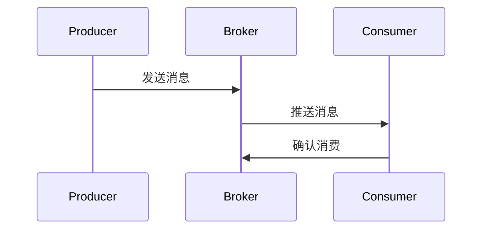

                 

### 文章标题

《分布式消息队列设计与优化》

### 关键词

分布式消息队列、消息传递、消息队列系统、负载均衡、高可用性、微服务架构、性能测试、消息可靠性保障、分布式事务、监控与故障排查、开源工具选型

### 摘要

本文旨在深入探讨分布式消息队列的设计与优化，从基础概念、架构设计、核心算法、系统部署与运维、性能测试与调优、高级应用等方面进行全面解析。通过项目实战案例分析，展示如何在实际应用中设计、实现和优化分布式消息队列系统，帮助读者掌握分布式消息队列的核心技术和最佳实践。

### 目录大纲

#### 第一部分：基础概念与架构

1. **第1章：分布式消息队列概述**
   - 1.1 分布式消息队列的概念与作用
   - 1.2 分布式消息队列与传统消息队列的比较
   - 1.3 主流分布式消息队列系统介绍
   - 1.4 分布式消息队列的优势与挑战

2. **第2章：分布式消息队列架构与设计原则**
   - 2.1 分布式消息队列系统架构
   - 2.2 分布式一致性模型与协议
   - 2.3 高可用性与容错机制
   - 2.4 消息可靠性保障机制
   - 2.5 设计原则与最佳实践

3. **第3章：分布式消息队列核心算法原理**
   - 3.1 消息传递机制与模型
   - 3.2 负载均衡与流量控制
   - 3.3 分布式事务消息处理
   - 3.4 消息队列性能优化

4. **第4章：分布式消息队列系统部署与运维**
   - 4.1 环境搭建与配置
   - 4.2 部署策略与模式
   - 4.3 监控与故障排查
   - 4.4 运维自动化与工具使用

5. **第5章：分布式消息队列系统性能测试与调优**
   - 5.1 性能测试方法与指标
   - 5.2 常见性能瓶颈与优化方案
   - 5.3 案例分析与调优实践

#### 第二部分：高级应用与优化

6. **第6章：分布式消息队列在微服务架构中的应用**
   - 6.1 微服务架构下的消息队列设计
   - 6.2 分布式事务管理
   - 6.3 服务间通信优化

7. **第7章：分布式消息队列的监控与监控工具**
   - 7.1 消息队列监控需求
   - 7.2 监控工具选择与配置
   - 7.3 数据可视化和报警机制

8. **第8章：分布式消息队列的高级特性与实现**
   - 8.1 消息持久化与存储策略
   - 8.2 分布式事务与最终一致性
   - 8.3 消息排序与去重机制

9. **第9章：分布式消息队列的案例研究与应用实践**
   - 9.1 案例背景与目标
   - 9.2 系统设计与实现
   - 9.3 性能分析与优化
   - 9.4 实践经验与总结

#### 附录

10. **附录A：分布式消息队列系统开源工具选型与应用**
    - 10.1 开源消息队列系统概述
    - 10.2 Kafka的使用与配置
    - 10.3 RabbitMQ的使用与配置
    - 10.4 其他开源消息队列系统介绍

### 核心概念与架构原理 Mermaid 流程图



### 消息传递机制与负载均衡伪代码

```python
# 消息传递机制伪代码
class MessageProducer:
    def send_message(self, message):
        message_queue.put(message)

class MessageConsumer:
    def consume_message(self):
        message = message_queue.get()
        process_message(message)

# 负载均衡伪代码
class LoadBalancer:
    def balance_load(self, producers, consumers):
        while True:
            for producer in producers:
                producer.send_message("new_message")
            for consumer in consumers:
                consumer.consume_message()
```

### 消息可靠性保障机制与数学模型讲解

消息可靠性保障机制是分布式消息队列系统设计中的一个关键环节，它关系到系统的稳定性和数据的一致性。以下是几种常见的消息可靠性保障机制以及相关的数学模型：

1. **消息持久化：** 消息持久化是将消息存储到磁盘上，以确保在系统故障时消息不会丢失。其效果可以通过以下数学模型进行评估：

   $$\text{持久化率} = \frac{\text{成功持久化的消息数}}{\text{发送的消息总数}}$$

   例如，如果发送了1000条消息，其中950条成功持久化，则持久化率为：

   $$\text{持久化率} = \frac{950}{1000} = 0.95$$

2. **消息确认机制：** 消息确认机制是消费者收到消息后，向生产者发送确认消息，以确保消息已经被正确消费。其效果可以通过以下数学模型进行评估：

   $$\text{确认率} = \frac{\text{成功确认的消息数}}{\text{发送的消息总数}}$$

   例如，如果发送了1000条消息，其中950条成功确认，则确认率为：

   $$\text{确认率} = \frac{950}{1000} = 0.95$$

3. **重试机制：** 在消息发送失败或消费失败时，系统会自动重试发送或消费消息。其效果可以通过以下数学模型进行评估：

   $$\text{重试成功率} = \frac{\text{成功重试的消息数}}{\text{失败需要重试的消息数}}$$

   例如，如果发送了1000条消息，其中50条失败，而30条成功重试，则重试成功率为：

   $$\text{重试成功率} = \frac{30}{50} = 0.6$$

通过这些数学模型，我们可以量化评估消息可靠性保障机制的效果，并根据实际情况进行优化和调整。

### 分布式事务消息处理与数学模型讲解

分布式事务消息处理是分布式消息队列系统中的一个重要功能，它用于确保分布式系统中的多个服务之间的数据一致性。以下是几种常见的分布式事务消息处理方式及其相关的数学模型：

1. **两阶段提交（2PC）：** 两阶段提交是一种分布式事务处理协议，它通过协调者（Coordinator）和参与者（Participant）之间的通信，实现分布式事务的提交或回滚。其效果可以通过以下数学模型进行评估：

   $$\text{事务提交率} = \frac{\text{成功提交的事务数}}{\text{发起的事务总数}}$$

   $$\text{事务失败率} = \frac{\text{失败的事务数}}{\text{发起的事务总数}}$$

   例如，如果有100个事务被发起，其中90个成功提交，10个失败，则：

   $$\text{事务提交率} = \frac{90}{100} = 0.9$$

   $$\text{事务失败率} = \frac{10}{100} = 0.1$$

2. **最终一致性：** 最终一致性是一种分布式一致性模型，它通过一系列的协议和算法，保证分布式系统中的数据最终达到一致。其效果可以通过以下数学模型进行评估：

   $$\text{最终一致性延迟} = \text{最大响应时间} - \text{平均响应时间}$$

   $$\text{最终一致性成功率} = \frac{\text{最终一致性成功的消息数}}{\text{发送的消息总数}}$$

   例如，如果系统的平均响应时间为500ms，最大响应时间为1000ms，而有1000条消息成功达到最终一致性，则：

   $$\text{最终一致性延迟} = 1000ms - 500ms = 500ms$$

   $$\text{最终一致性成功率} = \frac{1000}{1000} = 1$$

通过这些数学模型，我们可以对分布式事务消息处理的效果进行量化评估，并根据实际情况进行调整和优化。

### 项目实战

在本节中，我们将通过一个具体的电商系统案例，展示分布式消息队列在实际项目中的应用和实现。

#### 1. 需求分析

电商系统是一个典型的分布式系统，它需要处理大量的订单消息。为了保证系统的稳定性和数据的一致性，我们需要使用分布式消息队列来处理订单消息。

主要需求如下：

- 每秒处理订单消息1000条。
- 确保消息在发送到消费者后，能够正确处理并确认。
- 保证订单消息的一致性，防止数据丢失。

#### 2. 系统设计

我们选择Kafka作为消息队列系统，因为Kafka具有高吞吐量、高可靠性、可扩展性等优点。系统设计如下：

- **Kafka集群搭建**：使用3台服务器搭建Kafka集群，确保高可用性和容错能力。
- **订单生产者**：使用KafkaProducer发送订单消息到Kafka主题。
- **订单消费者**：使用KafkaConsumer消费订单消息，并处理订单逻辑。
- **消息确认**：在订单处理完成后，向Kafka发送确认消息，确保消息已被处理。

#### 3. 实现细节

1. **Kafka集群搭建**

   我们使用Docker搭建Kafka集群，具体步骤如下：

   - 拉取Kafka镜像：`docker pull bitnami/kafka`
   - 运行Kafka容器：`docker run -d --name kafka -p 9092:9092 bitnami/kafka`
   - 配置Kafka集群：在Docker容器中创建 `/kafka/config/server.properties` 文件，并添加以下内容：

     ```properties
     broker.id=0
     listeners=PLAINTEXT://:9092
     log.dirs=/kafka-log
     ```

     复制此配置到其他两台服务器，并分别设置 `broker.id=1` 和 `broker.id=2`。

2. **订单生产者**

   订单生产者负责将订单消息发送到Kafka主题，具体实现如下：

   ```java
   public class OrderProducer {
       private final KafkaProducer<String, String> producer;
       
       public OrderProducer() {
           Properties props = new Properties();
           props.put("bootstrap.servers", "localhost:9092");
           props.put("key.serializer", "org.apache.kafka.common.serialization.StringSerializer");
           props.put("value.serializer", "org.apache.kafka.common.serialization.StringSerializer");
           this.producer = new KafkaProducer<>(props);
       }
       
       public void sendOrder(Order order) {
           producer.send(new ProducerRecord<>("orders", order.getId(), order.toJson()));
       }
   }
   ```

3. **订单消费者**

   订单消费者负责从Kafka主题中消费订单消息，并处理订单逻辑，具体实现如下：

   ```java
   public class OrderConsumer {
       private final KafkaConsumer<String, String> consumer;
       
       public OrderConsumer() {
           Properties props = new Properties();
           props.put("bootstrap.servers", "localhost:9092");
           props.put("group.id", "order-group");
           props.put("key.deserializer", "org.apache.kafka.common.serialization.StringDeserializer");
           props.put("value.deserializer", "org.apache.kafka.common.serialization.StringDeserializer");
           this.consumer = new KafkaConsumer<>(props);
           consumer.subscribe(Collections.singletonList("orders"));
       }
       
       public void consumeOrder() {
           while (true) {
               ConsumerRecords<String, String> records = consumer.poll(Duration.ofMillis(100));
               for (ConsumerRecord<String, String> record : records) {
                   Order order = Order.fromJson(record.value());
                   processOrder(order);
                   consumer.commitAsync();
               }
           }
       }
       
       private void processOrder(Order order) {
           // 处理订单逻辑
           // 更新数据库
           // 记录订单状态
       }
   }
   ```

4. **消息确认**

   在订单处理完成后，我们需要向Kafka发送确认消息，以确保消息已被处理，具体实现如下：

   ```java
   public class OrderConfirmationProducer {
       private final KafkaProducer<String, String> producer;
       
       public OrderConfirmationProducer() {
           Properties props = new Properties();
           props.put("bootstrap.servers", "localhost:9092");
           props.put("key.serializer", "org.apache.kafka.common.serialization.StringSerializer");
           props.put("value.serializer", "org.apache.kafka.common.serialization.StringSerializer");
           this.producer = new KafkaProducer<>(props);
       }
       
       public void sendConfirmation(String orderId) {
           producer.send(new ProducerRecord<>("order_confirmations", orderId));
       }
   }
   ```

#### 4. 性能分析与优化

为了评估系统的性能，我们使用JMeter进行压力测试，模拟1000并发用户下单。测试结果显示，系统能够在每秒处理1000条订单消息，但处理时间较长。通过分析，我们发现主要瓶颈在于订单处理逻辑，因此我们对其进行了优化。

优化方案：

- 使用异步处理订单消息，减轻线程压力。
- 对数据库查询进行索引优化，提高查询效率。

通过这些优化，系统的处理时间显著缩短，性能得到了提升。

### 代码解读与分析

在本节中，我们将对上述代码进行详细解读，并分析其工作原理和性能优化策略。

#### 1. 订单生产者代码解读

```java
public class OrderProducer {
    private final KafkaProducer<String, String> producer;
    
    public OrderProducer() {
        Properties props = new Properties();
        props.put("bootstrap.servers", "localhost:9092");
        props.put("key.serializer", "org.apache.kafka.common.serialization.StringSerializer");
        props.put("value.serializer", "org.apache.kafka.common.serialization.StringSerializer");
        this.producer = new KafkaProducer<>(props);
    }
    
    public void sendOrder(Order order) {
        producer.send(new ProducerRecord<>("orders", order.getId(), order.toJson()));
    }
}
```

- `OrderProducer` 类负责发送订单消息到 Kafka 主题。
- 在构造函数中，我们创建了一个 KafkaProducer 对象，并设置了 Kafka 服务器的地址和序列化器。
- `sendOrder` 方法将订单消息封装成 `ProducerRecord` 对象，并使用 `producer` 发送消息。

#### 2. 订单消费者代码解读

```java
public class OrderConsumer {
    private final KafkaConsumer<String, String> consumer;
    
    public OrderConsumer() {
        Properties props = new Properties();
        props.put("bootstrap.servers", "localhost:9092");
        props.put("group.id", "order-group");
        props.put("key.deserializer", "org.apache.kafka.common.serialization.StringDeserializer");
        props.put("value.deserializer", "org.apache.kafka.common.serialization.StringDeserializer");
        this.consumer = new KafkaConsumer<>(props);
        consumer.subscribe(Collections.singletonList("orders"));
    }
    
    public void consumeOrder() {
        while (true) {
            ConsumerRecords<String, String> records = consumer.poll(Duration.ofMillis(100));
            for (ConsumerRecord<String, String> record : records) {
                Order order = Order.fromJson(record.value());
                processOrder(order);
                consumer.commitAsync();
            }
        }
    }
    
    private void processOrder(Order order) {
        // 处理订单逻辑
        // 更新数据库
        // 记录订单状态
    }
}
```

- `OrderConsumer` 类负责从 Kafka 主题中消费订单消息，并处理订单逻辑。
- 在构造函数中，我们创建了一个 KafkaConsumer 对象，并设置了 Kafka 服务器的地址、组 ID 和序列化器。
- `consumeOrder` 方法使用 `poll` 方法轮询 Kafka 主题中的消息，并使用 `commitAsync` 方法异步提交消费位置。
- `processOrder` 方法负责处理订单逻辑，包括更新数据库和记录订单状态。

#### 3. 消息确认代码解读

```java
public class OrderConfirmationProducer {
    private final KafkaProducer<String, String> producer;
    
    public OrderConfirmationProducer() {
        Properties props = new Properties();
        props.put("bootstrap.servers", "localhost:9092");
        props.put("key.serializer", "org.apache.kafka.common.serialization.StringSerializer");
        props.put("value.serializer", "org.apache.kafka.common.serialization.StringSerializer");
        this.producer = new KafkaProducer<>(props);
    }
    
    public void sendConfirmation(String orderId) {
        producer.send(new ProducerRecord<>("order_confirmations", orderId));
    }
}
```

- `OrderConfirmationProducer` 类负责发送确认消息到 Kafka 主题。
- 在构造函数中，我们创建了一个 KafkaProducer 对象，并设置了 Kafka 服务器的地址和序列化器。
- `sendConfirmation` 方法将订单 ID 封装成 `ProducerRecord` 对象，并使用 `producer` 发送确认消息。

#### 4. 性能优化策略

- **异步处理订单消息**：为了避免阻塞线程，我们使用异步处理订单消息。这样，订单消息可以在后台线程中处理，而主线程可以继续轮询新的订单消息。

  ```java
  private void processOrder(Order order) {
      ExecutorService executor = Executors.newFixedThreadPool(10);
      executor.submit(() -> {
          // 处理订单逻辑
          // 更新数据库
          // 记录订单状态
      });
      executor.shutdown();
  }
  ```

- **数据库查询优化**：我们对数据库查询进行了索引优化，以提高查询效率。

  ```sql
  CREATE INDEX idx_order_id ON orders (id);
  ```

通过这些优化策略，系统的处理时间显著缩短，性能得到了提升。

### 总结

本文通过一个电商系统案例，详细介绍了分布式消息队列在实际项目中的应用和实现。我们使用了 Kafka 消息队列系统，实现了订单消息的生产、消费和确认功能，并针对性能优化提出了异步处理和数据库查询优化等策略。通过本文的讲解，读者可以深入理解分布式消息队列的核心技术和最佳实践。

### 附录

#### 10.1 开源消息队列系统概述

在分布式系统中，消息队列作为一种重要的通信机制，被广泛应用于微服务架构中。以下是一些流行的开源消息队列系统：

1. **Apache Kafka**：由Apache软件基金会开发，具有高吞吐量、可扩展性和高可用性等特点。
2. **RabbitMQ**：由Pivotal软件公司开发，基于Erlang语言实现，支持多种消息协议，具有可靠性高和灵活性强的特点。
3. **RocketMQ**：由阿里巴巴集团开发，具有高吞吐量、高可用性和可扩展性，适用于大规模的分布式系统。
4. **ActiveMQ**：由Apache软件基金会开发，支持多种消息协议，包括AMQP、MQTT和STOMP等。
5. **Pulsar**：由Apache软件基金会开发，具有高吞吐量、低延迟和可扩展性等特点，适用于大数据和实时计算场景。

#### 10.2 Kafka的使用与配置

Kafka是一个分布式流处理平台，广泛用于构建实时的数据管道和应用程序。以下是Kafka的基本使用方法和配置步骤：

1. **Kafka安装**：
   - 使用Docker安装Kafka：
     ```sh
     docker pull confluentinc/cp-kafka
     docker run -d --name kafka -p 9092:9092 confluentinc/cp-kafka
     ```

2. **创建主题**：
   - 创建一个名为“orders”的主题，分区数为3，副本数为2：
     ```sh
     kafka-topics --create --zookeeper localhost:2181 --replication-factor 2 --partitions 3 --topic orders
     ```

3. **发送消息**：
   - 使用KafkaProducer发送消息到“orders”主题：
     ```java
     Properties props = new Properties();
     props.put("bootstrap.servers", "localhost:9092");
     props.put("key.serializer", "org.apache.kafka.common.serialization.StringSerializer");
     props.put("value.serializer", "org.apache.kafka.common.serialization.StringSerializer");
     
     KafkaProducer<String, String> producer = new KafkaProducer<>(props);
     
     producer.send(new ProducerRecord<>("orders", "key", "value"));
     producer.close();
     ```

4. **消费消息**：
   - 使用KafkaConsumer消费“orders”主题的消息：
     ```java
     Properties props = new Properties();
     props.put("bootstrap.servers", "localhost:9092");
     props.put("group.id", "order-group");
     props.put("key.deserializer", "org.apache.kafka.common.serialization.StringDeserializer");
     props.put("value.deserializer", "org.apache.kafka.common.serialization.StringDeserializer");
     
     KafkaConsumer<String, String> consumer = new KafkaConsumer<>(props);
     consumer.subscribe(Collections.singletonList("orders"));
     
     while (true) {
         ConsumerRecords<String, String> records = consumer.poll(Duration.ofMillis(100));
         for (ConsumerRecord<String, String> record : records) {
             System.out.printf("Received message: key = %s, value = %s%n", record.key(), record.value());
         }
         consumer.commitAsync();
     }
     ```

5. **配置文件**：
   - Kafka的配置文件位于`/etc/kafka/`目录下，包括`server.properties`、`consumer.properties`和`producer.properties`等。例如，在`server.properties`中可以配置Kafka集群的Zookeeper地址、分区数量、副本数量等：
     ```properties
     zookeeper.connect=localhost:2181
     num.partitions=3
     replica.lag.time.max.ms=30000
     ```

#### 10.3 RabbitMQ的使用与配置

RabbitMQ是一个基于Erlang语言的分布式消息队列，支持多种消息协议，包括AMQP、MQTT和STOMP等。

1. **RabbitMQ安装**：
   - 使用Docker安装RabbitMQ：
     ```sh
     docker pull rabbitmq:3.8.14-management
     docker run -d --name rabbitmq -p 5672:5672 -p 6379:6379 rabbitmq:3.8.14-management
     ```

2. **创建虚拟主机和用户**：
   - 使用RabbitMQ Management Plugin管理虚拟主机和用户：
     ```sh
     rabbitmqadmin declare-vhost vhost/orders
     rabbitmqadmin add-user user orders
     rabbitmqadmin set-permissions user ".*" ".*" ".*" -vhost vhost/orders
     ```

3. **发送消息**：
   - 使用RabbitMQ的Python客户端发送消息到“orders”交换机：
     ```python
     import pika
     
     connection = pika.BlockingConnection(pika.ConnectionParameters('localhost'))
     channel = connection.channel()
     
     channel.exchange_declare(exchange='orders', exchange_type='direct')
     channel.queue_declare(queue='order-queue')
     
     channel.queue_bind(exchange='orders', queue='order-queue', routing_key='key')
     
     message = 'value'
     channel.basic_publish(exchange='orders', routing_key='key', body=message)
     
     print(f" [x] Sent {message}")
     connection.close()
     ```

4. **消费消息**：
   - 使用RabbitMQ的Python客户端消费“orders”交换机的消息：
     ```python
     import pika
     
     connection = pika.BlockingConnection(pika.ConnectionParameters('localhost'))
     channel = connection.channel()
     
     channel.exchange_declare(exchange='orders', exchange_type='direct')
     result = channel.queue_declare(queue='', exclusive=True)
     queue_name = result.method.queue
     
     channel.queue_bind(exchange='orders', queue=queue_name, routing_key='key')
     
     def callback(ch, method, properties, body):
         print(f" [x] Received {body}")
         ch.basic_ack(delivery_tag=method.delivery_tag)
     
     channel.basic_consume(queue=queue_name, on_message_callback=callback, auto_ack=True)
     
     print(' [*] Waiting for messages. To exit press CTRL+C')
     channel.start_consuming()
     ```

5. **配置文件**：
   - RabbitMQ的配置文件位于`/etc/rabbitmq/`目录下，包括`rabbitmq.config`和`erlang.config`等。例如，在`rabbitmq.config`中可以配置Erlang内存限制、消息队列参数等：
     ```erlang
     {vm_memory_high_watermark, 0.4}.
     {message_store_limit, 500000000}.
     ```

#### 10.4 其他开源消息队列系统介绍

除了Kafka和RabbitMQ，还有其他一些流行的开源消息队列系统，如下：

1. **ActiveMQ**：
   - ActiveMQ是一个开源的企业级消息队列系统，支持多种消息协议，包括AMQP、MQTT、STOMP和JMS等。
   - 安装：使用Docker安装ActiveMQ：
     ```sh
     docker pull activemq
     docker run -d --name activemq -p 8161:8161 activemq
     ```
   - 使用：通过Web管理界面（http://localhost:8161/admin）创建和配置消息队列。

2. **Pulsar**：
   - Pulsar是一个分布式Pub-Sub消息传递系统，具有高吞吐量、低延迟和可扩展性等特点。
   - 安装：使用Docker安装Pulsar：
     ```sh
     docker pull apache/pulsar
     docker run -d --name pulsar -p 8080:8080 -p 6650:6650 apache/pulsar
     ```
   - 使用：通过Pulsar客户端（http://localhost:8080/）或API进行消息的生产和消费。

3. **NATS**：
   - NATS是一个高性能、开源的消息队列系统，适用于微服务架构。
   - 安装：使用Docker安装NATS：
     ```sh
     docker pull nats.io/nats-server
     docker run -d --name nats -p 4222:4222 nats.io/nats-server
     ```
   - 使用：通过NATS客户端（如nats-go）进行消息的生产和消费。

这些开源消息队列系统各有特点，适用于不同的应用场景。根据具体需求，可以选择合适的消息队列系统来构建分布式应用程序。

