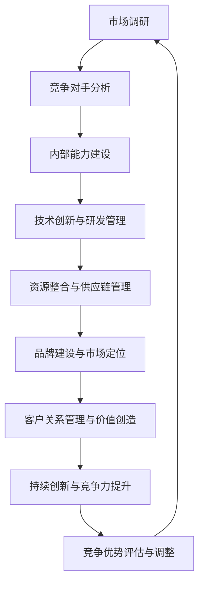

                 

### 文章标题

《创业公司如何建立长期竞争优势》

---

关键词：竞争优势、创业公司、长期发展、成本领先、差异化、创新、品牌建设、客户关系管理

---

摘要：本文从理论角度和实战案例出发，探讨了创业公司如何通过构建长期竞争优势来确保在激烈的市场竞争中立于不败之地。文章首先梳理了竞争优势的基本概念和类型，接着分析了长期竞争优势的构建原则和市场分析策略。随后，文章深入探讨了内部能力建设、核心策略构建和竞争优势的持续发展等关键环节。通过实际案例和项目实战，文章为创业公司提供了切实可行的策略和方法，以帮助它们在竞争激烈的市场中脱颖而出。

---

### 目录大纲

1. **第一部分：建立竞争优势的基础理论**
   - 竞争优势的基本概念与类型
   - 长期竞争优势的构建原则
   - 市场竞争与产业生态分析
   - 竞争对手分析

2. **第二部分：内部能力建设**
   - 团队建设与管理
   - 技术创新与研发管理
   - 资源整合与供应链管理

3. **第三部分：构建竞争优势的核心策略**
   - 品牌建设与市场定位
   - 客户关系管理与价值创造
   - 持续创新与竞争力提升

4. **第四部分：竞争优势的实践应用**
   - 案例分析：成功创业公司的竞争优势构建
   - 竞争环境下的应对策略

5. **第五部分：竞争优势的持续发展**
   - 组织文化与竞争优势
   - 人才战略与竞争优势
   - 企业愿景与长期战略规划

6. **第六部分：附录**
   - 参考文献
   - 行业报告与趋势分析
   - 竞争优势评估工具与方法
   - 竞争优势构建的法律法规与政策

---

### 第一部分：建立竞争优势的基础理论

在竞争激烈的市场环境中，建立长期竞争优势是企业生存和发展的关键。对于创业公司来说，如何在短时间内迅速崛起，并在市场中站稳脚跟，成为了一个亟待解决的问题。本部分将从理论角度出发，探讨竞争优势的基本概念与类型、长期竞争优势的构建原则、市场竞争与产业生态分析以及竞争对手分析等内容，为创业公司提供理论基础。

#### 竞争优势的基本概念与类型

竞争优势（Competitive Advantage）是指企业通过某种方式，在市场上超越竞争对手，从而获得更高的利润和市场份额的能力。竞争优势的来源可以是多种多样的，主要包括成本领先、差异化、集中化等类型。

1. **成本领先**：成本领先战略（Cost Leadership）是指企业通过大规模生产、高效管理和技术创新等手段降低成本，以实现比竞争对手更低的价格提供产品或服务。这种方式可以使企业在价格竞争中占据优势地位，从而吸引更多的客户。

2. **差异化**：差异化战略（Differentiation）是指企业通过提供独特的、差异化的产品或服务来满足客户的特定需求，从而实现更高的价格和客户忠诚度。差异化可以通过产品质量、品牌形象、独特功能等多个方面来实现。

3. **集中化**：集中化战略（Focus Strategy）是指企业专注于某一细分市场或地区，通过专业化服务和产品定制来满足特定客户群体。这种方式可以使企业在特定领域形成独特的竞争优势，从而获得更高的利润率。

#### 长期竞争优势的构建原则

构建长期竞争优势需要遵循以下原则：

1. **独特性**：竞争优势应具有独特性，不易被竞争对手模仿。企业可以通过创新、品牌建设、独特的服务体验等方式来建立独特优势。

2. **可持续性**：竞争优势应具备持续性，能够随着市场和技术变化而适应。企业应不断进行创新和改进，保持竞争优势的持续发展。

3. **创新能力**：持续创新是保持竞争优势的关键。企业应不断推动技术创新，以满足市场变化和客户需求。

4. **资源整合**：整合内外部资源，提高资源利用效率。企业应充分利用各种资源，形成协同效应，以增强竞争优势。

#### 市场竞争与产业生态分析

市场竞争和产业生态分析是构建竞争优势的重要前提。以下为关键分析步骤：

1. **市场趋势**：分析行业发展趋势，识别新兴机会和潜在威胁。企业应关注市场动态，及时调整战略。

2. **竞争对手**：评估主要竞争对手的市场地位、战略和行为。了解竞争对手的优势和弱点，为企业制定有效的竞争策略提供依据。

3. **产业生态**：分析产业链上下游关系，了解企业所处的竞争环境。企业应了解产业链中的各个环节，寻找合作机会，提升整体竞争力。

#### 竞争对手分析

对竞争对手的深入分析有助于企业制定有效的竞争策略。以下为竞争对手分析的几个方面：

1. **市场地位**：评估竞争对手的市场份额、品牌影响力等。了解竞争对手的市场地位，有助于企业制定相应的市场策略。

2. **竞争策略**：分析竞争对手的市场定位、产品策略、定价策略等。了解竞争对手的策略，有助于企业发现市场机会和威胁。

3. **应对策略**：基于竞争对手分析，制定有效的应对策略。企业应制定针对性的竞争策略，以应对竞争对手的挑战。

#### 内部能力建设

内部能力建设是构建竞争优势的重要基础。以下为内部能力建设的关键环节：

1. **团队建设**：建立高效的团队组织结构，明确团队成员职责。企业应注重团队建设，提升团队协作效率。

2. **技术创新**：加强研发投入，推动技术创新，提升产品竞争力。企业应不断进行技术创新，以满足市场需求。

3. **资源整合**：整合内外部资源，提高资源利用效率。企业应充分利用各种资源，形成协同效应，以增强竞争优势。

---

在建立竞争优势的过程中，创业公司需要结合自身实际情况，有针对性地进行市场分析、内部能力建设和策略制定。通过不断创新和优化，创业公司可以在激烈的市场竞争中脱颖而出，实现长期发展。

---

### 第二部分：内部能力建设

在激烈的市场竞争中，创业公司要想建立和维持长期竞争优势，内部能力建设是至关重要的。本部分将深入探讨团队建设与管理、技术创新与研发管理、以及资源整合与供应链管理等方面，为创业公司提供具体的策略和方法。

#### 团队建设与管理

团队建设与管理是创业公司内部能力建设的基础。一个高效的团队可以更好地实现公司目标，提高企业竞争力。

1. **团队组织结构与沟通机制**

团队组织结构应合理设置，以实现分工明确、协作顺畅。创业公司可以根据业务需求，设立产品开发、市场营销、客户服务等多个部门，并明确各团队成员的职责。

沟通机制是团队协作的关键。创业公司应建立多层次的沟通机制，如定期团队会议、项目进度汇报等，确保信息畅通，提高团队协作效率。

2. **团队成员能力培养与激励**

团队成员的能力水平直接影响团队的整体表现。创业公司应注重成员能力培养，通过培训、技术分享、项目实践等多种方式，提升团队成员的专业技能。

激励机制是提升团队成员积极性的关键。创业公司可以通过绩效考核、奖励制度等方式，激励团队成员发挥最大潜力，提高工作效率。

3. **团队文化建设**

团队文化建设是增强团队凝聚力的重要手段。创业公司应倡导积极向上的企业文化，如团队合作、创新精神、客户导向等，营造良好的工作氛围，提高团队凝聚力。

#### 技术创新与研发管理

技术创新是创业公司建立竞争优势的重要途径。通过技术创新，创业公司可以推出具有独特价值的产品或服务，满足市场需求。

1. **技术创新策略与路径**

创业公司应制定明确的技术创新策略，明确技术创新的目标和方向。可以根据市场需求、技术发展趋势和自身优势，选择合适的技术创新路径。

2. **研发流程与项目管理**

研发流程与项目管理是技术创新的关键环节。创业公司应建立规范的研发流程，包括需求分析、产品设计、测试验证等，确保项目顺利进行。

项目管理是确保研发项目按时、按质完成的重要手段。创业公司应采用项目管理工具，如Gantt图、Scrum等，合理安排项目进度，提高项目成功率。

3. **研发团队建设与激励**

研发团队是技术创新的核心力量。创业公司应注重研发团队建设，通过选拔、培养、激励等手段，打造一支高效、专业的研发团队。

#### 资源整合与供应链管理

资源整合与供应链管理是创业公司提高资源利用效率、降低成本的重要手段。

1. **资源整合策略**

创业公司应制定资源整合策略，充分利用外部资源，如技术合作伙伴、供应商等，提高资源利用效率。

2. **供应链优化与风险管理**

供应链优化是提高企业竞争力的重要手段。创业公司应优化供应链管理，降低库存成本、提高物流效率，提升整体供应链的竞争力。

同时，创业公司应重视供应链风险管理，建立风险预警机制，确保供应链的稳定性和可靠性。

---

通过团队建设与管理、技术创新与研发管理、以及资源整合与供应链管理等方面的能力建设，创业公司可以不断提升内部竞争力，为建立长期竞争优势奠定坚实基础。

---

### 第三部分：构建竞争优势的核心策略

在竞争激烈的市场环境中，构建竞争优势是创业公司生存与发展的关键。本部分将深入探讨品牌建设与市场定位、客户关系管理与价值创造、以及持续创新与竞争力提升等核心策略，为创业公司提供切实可行的方案。

#### 品牌建设与市场定位

品牌是企业的无形资产，是构建竞争优势的重要手段。成功的品牌建设与市场定位能够帮助企业树立良好的企业形象，吸引目标客户，提升市场份额。

1. **品牌战略与品牌价值塑造**

品牌战略是企业整体战略的重要组成部分。创业公司应明确品牌定位，打造有差异化的品牌形象。品牌价值塑造可以通过以下途径实现：

   - **品牌故事**：通过讲述企业的发展历程、核心价值观等，塑造品牌故事，增强品牌的情感共鸣。
   - **品牌标识**：设计独特的品牌标识（如logo、标准字体等），提升品牌的识别度。
   - **品牌传播**：利用各种传播渠道（如社交媒体、广告、公关活动等），提升品牌的知名度。

2. **市场定位与差异化竞争**

市场定位是企业根据自身优势和市场环境，选择一个特定的细分市场，并提供相应的产品或服务。差异化竞争是通过提供与众不同的产品或服务，满足客户特定需求，从而在市场中脱颖而出。

创业公司应通过以下步骤进行市场定位：

   - **市场调研**：了解目标市场的需求、竞争态势、行业趋势等，为市场定位提供依据。
   - **竞争分析**：评估竞争对手的市场定位、产品特点、优势与劣势，确定自身的市场定位策略。
   - **定位策略**：根据企业的核心竞争力和市场环境，确定独特且具有吸引力的市场定位。

#### 客户关系管理与价值创造

客户是企业的生命线，有效的客户关系管理（CRM）能够帮助企业提高客户满意度，提升客户忠诚度，从而实现价值创造。

1. **客户关系管理系统构建**

构建客户关系管理系统是提升客户管理效率的重要手段。创业公司可以通过以下步骤构建CRM系统：

   - **数据收集**：通过多种渠道收集客户数据，如销售记录、客户反馈、社交媒体等，建立客户数据库。
   - **数据整合**：整合不同渠道的客户数据，建立统一的客户视图，以便更全面地了解客户需求。
   - **数据分析**：利用数据分析工具，对客户数据进行深入分析，挖掘客户行为模式、偏好和需求，为营销和服务提供依据。

2. **客户价值分析与挖掘**

客户价值分析是客户关系管理的重要环节。通过以下方法，创业公司可以分析和挖掘客户价值：

   - **RFM模型**：根据客户的购买频率、购买金额和最近购买时间，对客户进行价值分级，从而有针对性地进行营销和服务。
   - **LTV模型**：计算客户的终身价值（LTV），为营销和服务策略提供依据，确保资源的合理分配。

3. **客户关系维护与提升**

客户关系维护是保持客户满意度和忠诚度的关键。创业公司可以通过以下方式提升客户关系：

   - **个性化服务**：根据客户的需求和偏好，提供个性化的产品推荐、优惠和服务，提升客户体验。
   - **客户互动**：通过社交媒体、在线客服、电话沟通等渠道，与客户保持频繁互动，了解客户需求和反馈，及时解决问题。
   - **客户关怀**：定期开展客户关怀活动，如节日问候、生日祝福等，增强客户对企业的情感认同。

#### 持续创新与竞争力提升

持续创新是企业保持竞争优势的不竭动力。通过技术创新、产品创新和管理创新，创业公司可以不断提升自身的竞争力。

1. **技术创新策略与路径**

技术创新是创业公司提升产品竞争力的重要手段。创业公司应制定以下技术创新策略：

   - **技术跟踪**：关注行业技术动态，了解前沿技术发展趋势，为技术创新提供方向。
   - **研发投入**：加大研发投入，建立研发团队，推动技术创新项目的实施。
   - **技术合作**：与高校、科研机构等合作，引进先进技术，提升企业技术创新能力。

2. **产品创新策略与路径**

产品创新是满足客户需求、提升市场竞争力的关键。创业公司应制定以下产品创新策略：

   - **客户需求分析**：深入了解客户需求，通过市场调研、用户反馈等方式，确定产品创新的方向。
   - **产品迭代**：采用敏捷开发等创新方法，快速迭代产品，满足客户不断变化的需求。
   - **差异化竞争**：通过产品差异化，打造独特的竞争优势，提高市场占有率。

3. **管理创新策略与路径**

管理创新是提升企业整体竞争力的重要手段。创业公司应从以下几个方面进行管理创新：

   - **组织架构**：优化组织架构，建立灵活、高效的管理模式，提高企业运作效率。
   - **管理模式**：引入先进的管理理念和方法，如精益管理、绩效管理等，提升企业管理水平。
   - **人才管理**：注重人才培养和激励，建立科学的激励机制，激发员工创新潜力。

---

通过品牌建设与市场定位、客户关系管理与价值创造、以及持续创新与竞争力提升等核心策略的实施，创业公司可以在激烈的市场竞争中建立和维持长期竞争优势，实现持续发展。

---

### 第四部分：竞争优势的实践应用

在了解了竞争优势构建的理论基础和核心策略之后，接下来我们将通过实际案例来展示如何将这些理论应用到创业公司的实际运营中。本部分将分析成功创业公司的竞争优势构建，探讨在竞争环境下的应对策略，并总结这些案例中的关键成功因素。

#### 案例一：技术创新驱动型竞争优势

**公司背景**：以某创业公司A为例，该公司成立于2015年，专注于智能家居设备的研发与销售。公司创始团队由一群年轻的工程师组成，他们有着丰富的技术背景和对智能家居市场的深刻理解。

**竞争优势构建**：

1. **技术创新**：公司A通过自主研发和外部合作，不断推出具有前瞻性的智能家居产品。例如，他们率先推出基于人工智能的智能语音助手，提升了用户体验。

2. **产品差异化**：公司A的产品在设计和功能上具有独特性，如高度集成的智能安防系统，能够通过手机APP实现远程监控和管理。

3. **品牌建设**：公司A注重品牌形象的塑造，通过精准的市场营销和用户互动，逐渐在智能家居领域建立了良好的品牌声誉。

**实战效果**：公司A在短短五年内，市场份额迅速攀升，成为智能家居行业的一股新势力。技术创新和品牌建设使得公司A在激烈的市场竞争中脱颖而出。

#### 案例二：品牌优势构建与市场拓展

**公司背景**：以创业公司B为例，该公司成立于2018年，专注于高端时尚手表的设计与销售。公司创始人有着多年的时尚行业经验，并深入了解目标消费者的需求。

**竞争优势构建**：

1. **品牌定位**：公司B通过明确的高端市场定位，吸引了追求时尚与品质的消费者。品牌定位为“奢华但不昂贵”，旨在为消费者提供高性价比的时尚手表。

2. **品牌传播**：公司B通过社交媒体和线上广告，以及与时尚博主的合作，成功提升了品牌知名度。同时，公司B还注重线下门店的建设，为消费者提供良好的购物体验。

3. **客户关系管理**：公司B建立了完善的CRM系统，通过数据分析了解客户需求，提供个性化的产品推荐和服务。

**实战效果**：公司B在短短两年内，品牌知名度和市场份额显著提升，成功在竞争激烈的高端手表市场中站稳脚跟。

#### 案例三：资源整合与供应链管理策略

**公司背景**：以创业公司C为例，该公司成立于2017年，专注于健康食品的研发与销售。公司创始团队有着丰富的营养学背景和供应链管理经验。

**竞争优势构建**：

1. **资源整合**：公司C通过与国内外知名食品生产商和供应商建立合作关系，整合优质资源，确保产品的品质和供应的稳定性。

2. **供应链优化**：公司C通过精细化管理，优化供应链流程，降低库存成本和物流成本，提高了整体运营效率。

3. **客户体验**：公司C注重客户体验，通过线上商城和线下体验店，提供便捷的购物渠道和优质的售后服务。

**实战效果**：公司C在市场上取得了显著的成功，产品线迅速扩展，市场份额稳步提升。

#### 竞争环境下的应对策略

在竞争激烈的市场环境中，创业公司需要灵活应对各种挑战。以下是一些有效的应对策略：

1. **市场定位调整**：根据市场环境和竞争对手的变化，及时调整市场定位，确保企业能够适应市场需求。

2. **技术创新**：持续进行技术创新，推出具有竞争力的新产品或服务，以保持市场的领先地位。

3. **差异化竞争**：通过产品差异化、服务差异化等方式，打造独特的竞争优势，吸引目标客户。

4. **客户关系管理**：建立完善的客户关系管理系统，提高客户满意度和忠诚度，降低客户流失率。

5. **合作与联盟**：通过与其他企业建立合作关系，共享资源和技术，共同应对市场挑战。

#### 关键成功因素总结

通过上述案例的分析，可以总结出以下关键成功因素：

1. **技术创新**：持续的技术创新是企业保持竞争优势的核心。

2. **品牌建设**：成功的品牌建设能够提升企业的知名度和美誉度。

3. **客户关系管理**：有效的客户关系管理能够提高客户满意度和忠诚度。

4. **资源整合**：整合内外部资源，提高资源利用效率，降低运营成本。

5. **灵活应对**：灵活应对市场变化和竞争对手的挑战，及时调整战略。

通过这些关键成功因素的实践应用，创业公司可以在激烈的市场竞争中建立和维持长期竞争优势，实现持续发展。

---

本部分通过实际案例展示了如何将竞争优势构建的理论应用到创业公司的运营中，提供了宝贵的经验和策略。创业公司可以借鉴这些成功案例，结合自身实际情况，制定适合自己的竞争优势构建方案。

---

### 第五部分：竞争优势的持续发展

竞争优势的构建不是一蹴而就的，它需要企业长期的努力和持续的优化。本部分将探讨竞争优势的持续发展，包括组织文化与竞争优势的相互作用、人才战略与竞争优势的匹配、以及企业愿景与长期战略规划的重要性。

#### 组织文化与竞争优势

组织文化是企业的灵魂，它影响着员工的行为和企业的运作方式。一个积极、健康的企业文化可以增强员工的归属感和工作动力，进而提升企业的整体竞争力。

1. **企业文化塑造**：

企业文化不仅仅是挂在墙上的口号，它应该渗透到企业的每一个角落。创业公司应通过以下方式塑造企业文化：

   - **核心价值观**：明确企业的核心价值观，并将其融入到日常运营中。
   - **员工参与**：鼓励员工参与企业文化的建设，增强员工的参与感和认同感。
   - **领导示范**：企业的领导者应以身作则，通过自身行为来塑造企业文化。

2. **企业文化与竞争优势的相互作用**：

企业文化可以增强员工的凝聚力和创新精神，从而提升企业的竞争优势。例如，鼓励创新的企业文化可以激励员工提出新的想法和解决方案，推动企业的持续发展。

#### 人才战略与竞争优势

人才是企业最宝贵的资源，优秀的人才能够推动企业的技术创新和业务拓展。创业公司应通过以下方式构建人才战略，以提升竞争优势：

1. **人才引进**：

创业公司应制定科学的人才引进策略，吸引行业内优秀的人才。可以通过以下途径引进人才：

   - **人才招聘会**：参加各类人才招聘会，与优秀人才面对面交流。
   - **校园招聘**：与高校合作，通过校园招聘引进应届毕业生。
   - **猎头服务**：利用猎头公司，引进高层次的专业人才。

2. **人才激励**：

为了留住优秀人才，创业公司应建立合理的激励机制，包括薪酬激励、晋升机会、职业发展等。可以通过以下方式激励人才：

   - **绩效考核**：建立公正、透明的绩效考核体系，激励员工努力工作。
   - **奖励制度**：对做出突出贡献的员工给予物质和精神奖励。
   - **职业发展**：为员工提供职业发展通道，帮助员工实现职业目标。

3. **人才培养**：

创业公司应重视员工的培训和发展，通过内部培训、外部学习、项目实践等多种方式，提升员工的专业技能和管理能力。可以通过以下方式培养人才：

   - **内部培训**：组织内部培训课程，提升员工的专业知识和技能。
   - **外部学习**：鼓励员工参加外部培训和学习，拓展视野。
   - **项目实践**：通过实际项目锻炼员工的能力，提高员工的实战经验。

#### 企业愿景与长期战略规划

企业愿景是企业长期发展的目标和方向，它指引着企业的战略规划和决策。创业公司应通过以下步骤制定长期战略规划：

1. **企业愿景设定**：

企业愿景应明确、具体，能够激励员工共同努力。可以通过以下步骤设定企业愿景：

   - **市场分析**：分析市场需求和行业趋势，确定企业的发展方向。
   - **内部讨论**：组织内部讨论，听取员工和领导层的意见，形成共识。
   - **愿景陈述**：将企业愿景形成书面文件，明确愿景的具体内容和实现路径。

2. **长期战略规划**：

长期战略规划是企业实现愿景的行动指南，它包括以下内容：

   - **业务发展**：明确企业的业务发展目标和路径，包括产品线扩展、市场拓展等。
   - **技术创新**：规划企业的技术创新方向和研发投入，保持技术领先地位。
   - **组织发展**：规划企业的组织结构优化、人才培养和激励机制，提升组织效能。
   - **财务规划**：制定企业的财务目标和发展计划，确保企业持续健康发展。

通过建立积极的企业文化、实施科学的人才战略和制定明确的长期战略规划，创业公司可以不断提升竞争优势，实现持续发展。

---

竞争优势的持续发展是创业公司长期生存和发展的关键。通过积极塑造企业文化、科学的人才战略和明确的长期战略规划，创业公司可以在激烈的市场竞争中保持领先地位，实现长期可持续发展。

---

### 第六部分：附录

在本部分，我们将提供有关竞争优势构建的参考资料、行业报告、趋势分析，以及相关的评估工具和方法。

#### 参考文献

1. 波特，迈克尔·E. 《竞争战略：行业和竞争对手分析技术》。 中国人民大学出版社，2001年。
2. 彼得·德鲁克。《创新与企业家精神》。 机械工业出版社，2005年。
3. 菲利普·科特勒。《市场营销管理：分析、规划、执行和控制》。 人民邮电出版社，2011年。

#### 行业报告与趋势分析

1. **艾瑞咨询**：《2022年中国智能家居行业研究报告》。
2. **普华永道**：《2023年全球消费者洞察报告》。
3. **市场调研公司**：《2022年时尚手表市场分析报告》。

#### 竞争优势评估工具与方法

1. **SWOT分析**：用于评估企业的优势、劣势、机会和威胁。
2. **波特五力模型**：用于分析行业竞争态势。
3. **价值链分析**：用于评估企业内部活动如何创造价值。

#### 竞争优势构建的法律法规与政策

1. **《中华人民共和国反垄断法》**：规范市场竞争，防止垄断行为。
2. **《中华人民共和国公司法》**：规范企业组织结构和管理。
3. **《中华人民共和国知识产权法》**：保护企业的知识产权，促进技术创新。

通过上述附录内容，读者可以进一步了解竞争优势构建的理论基础、实践方法和相关法规政策，从而更好地应用于实际工作中。

---

在本部分的附录中，我们提供了丰富的参考资料、行业报告和评估工具，旨在帮助读者深入了解竞争优势构建的各个方面。希望这些信息能为创业公司在建立和维持竞争优势的过程中提供有价值的参考。

---

### 竞争优势构建的Mermaid流程图

以下是一个Mermaid流程图，展示了竞争优势构建的关键步骤和流程：



这个流程图清晰地展示了竞争优势构建的各个环节，以及它们之间的相互关系。创业公司可以通过这个流程图，系统地分析和规划竞争优势的构建过程。

---

通过这个Mermaid流程图，创业公司可以更直观地理解竞争优势构建的步骤和流程，从而更好地实施和优化各项策略。

---

### 竞争优势构建的核心算法原理讲解

在构建竞争优势的过程中，运用算法和数学模型可以帮助企业更科学地进行决策和优化。以下我们将介绍几个核心算法原理，包括团队成员能力培养与激励算法、品牌战略与品牌价值塑造算法、以及客户关系管理系统构建算法等。

#### 团队成员能力培养与激励算法

团队成员的能力培养与激励是提升团队效能和竞争优势的关键。以下是一个简单的伪代码，用于描述团队成员能力培养与激励的算法原理：

```python
function 成员能力培养与激励(团队成员列表，目标能力，激励策略):
    for 每个团队成员 in 团队成员列表:
        计算当前能力值(当前能力值 = 成员技能评估 + 工作绩效评估)
        根据目标能力与当前能力值，计算能力提升计划
        应用激励策略以增强成员动力
        更新团队成员的能力值和激励状态

    return 更新的团队成员列表
```

详细解释：

- **能力值计算**：通过团队成员的技能评估和工作绩效评估来确定当前能力值。技能评估主要衡量团队成员的专业技能水平，工作绩效评估则考虑团队成员的工作表现和成果。
- **能力提升计划**：根据目标能力和当前能力值之间的差距，制定具体的能力提升计划。这包括设置具体的学习目标、培训计划和技能提升路径。
- **激励策略**：激励策略可以是奖励、晋升机会、工作环境改善等多种方式，旨在增强团队成员的动力和归属感。

#### 品牌战略与品牌价值塑造算法

品牌战略与品牌价值塑造是企业构建竞争优势的重要方面。以下是一个简单的伪代码，用于描述品牌战略与品牌价值塑造的算法原理：

```python
function 品牌战略与品牌价值塑造(品牌信息，市场环境，目标客户):
    计算品牌知名度与影响力
    根据市场环境和目标客户，调整品牌定位
    设计品牌传播策略与营销活动
    评估品牌价值并调整策略

    return 品牌战略规划
```

详细解释：

- **品牌知名度与影响力计算**：通过对品牌的市场调查和数据分析，评估品牌的知名度和影响力。这包括品牌认知度、消费者忠诚度、市场份额等因素。
- **品牌定位调整**：根据市场环境和目标客户的需求，对品牌进行重新定位，以适应市场变化和客户期望。
- **品牌传播策略与营销活动设计**：设计一系列品牌传播策略和营销活动，包括广告、公关、社交媒体推广等，以提升品牌知名度和影响力。
- **品牌价值评估与策略调整**：定期对品牌价值进行评估，并根据评估结果调整品牌战略和营销策略，以保持品牌价值的持续提升。

#### 客户关系管理系统构建算法

客户关系管理系统（CRM）是提升客户满意度和忠诚度的重要工具。以下是一个简单的伪代码，用于描述客户关系管理系统构建的算法原理：

```python
function 客户关系管理系统构建(客户数据，服务标准，营销策略):
    收集并整合客户数据
    建立客户关系模型
    设计客户服务流程
    制定客户营销策略

    return 客户关系管理系统
```

详细解释：

- **客户数据收集与整合**：通过多种渠道收集客户数据，包括销售记录、客户反馈、市场调研等，并将其整合到一个统一的客户数据库中。
- **客户关系模型建立**：基于客户数据，建立客户关系模型，分析客户行为、需求和偏好，以实现个性化服务和客户体验优化。
- **客户服务流程设计**：设计一系列客户服务流程，包括售前咨询、售后服务、投诉处理等，以确保客户问题能够及时解决。
- **客户营销策略制定**：根据客户数据和分析结果，制定针对性的营销策略，包括精准营销、交叉销售、客户保留等，以提升客户满意度和忠诚度。

通过这些核心算法原理的应用，创业公司可以更科学地培养团队成员能力、塑造品牌价值、构建客户关系管理系统，从而在激烈的市场竞争中建立和维持竞争优势。

---

通过这些核心算法原理的应用，创业公司可以更科学地培养团队成员能力、塑造品牌价值、构建客户关系管理系统，从而在激烈的市场竞争中建立和维持竞争优势。这些算法和模型为创业公司在战略决策和运营管理中提供了有力的工具。

---

### 数学模型和数学公式

在竞争优势构建的过程中，数学模型和数学公式是评估和优化企业战略的关键工具。以下我们将介绍一些关键的数学模型和公式，包括成本领先与差异化战略分析、核心能力的培养与维护、客户价值分析与挖掘等。

#### 成本领先与差异化战略分析

**成本领先战略分析**

成本领先战略的核心在于通过降低成本来获得价格优势。以下是一个用于成本领先战略分析的数学模型：

$$
\text{成本领先优势} = \frac{\text{本企业成本} - \text{竞争对手成本}}{\text{竞争对手成本}}
$$

**差异化战略分析**

差异化战略旨在通过提供独特的价值来获取溢价。以下是一个用于差异化战略分析的数学模型：

$$
\text{差异化优势} = \frac{\text{本企业价格} - \text{竞争对手价格}}{\text{竞争对手价格}}
$$

#### 核心能力的培养与维护

**核心能力培养模型**

核心能力的培养是一个持续的过程，需要投入资源并评估效率。以下是一个用于核心能力培养的数学模型：

$$
\text{核心能力培养效率} = \frac{\text{投入资源}}{\text{产出成果}}
$$

**核心能力维护模型**

核心能力的维护需要定期投入费用，并评估其效果。以下是一个用于核心能力维护的数学模型：

$$
\text{核心能力维护成本} = \text{维护费用} + \text{更新费用}
$$

#### 客户价值分析与挖掘

**客户价值计算模型**

客户价值是企业的一项重要资产，以下是一个用于计算客户价值的数学模型：

$$
\text{客户价值} = \text{客户收益} - \text{客户成本}
$$

**客户忠诚度模型**

客户忠诚度是评估客户关系稳定性的重要指标，以下是一个用于计算客户忠诚度的数学模型：

$$
\text{客户忠诚度} = \frac{\text{本企业重复购买率} - \text{竞争对手重复购买率}}{\text{竞争对手重复购买率}}
$$

通过这些数学模型和公式，企业可以更科学地评估和优化其竞争优势构建策略。这些模型不仅能够帮助企业识别和利用其独特优势，还能为其在竞争激烈的市场中提供有力的决策支持。

---

通过这些数学模型和公式的应用，企业可以更科学地评估和优化竞争优势构建策略。这些工具为企业在制定战略决策和运营管理中提供了有力的依据，有助于实现长期可持续发展。

---

### 项目实战

在本部分，我们将通过一个创业公司A的竞争优势构建实战案例，详细描述其开发环境搭建、源代码实现、代码解读与分析等步骤。创业公司A的目标是通过技术创新和客户关系管理，构建长期竞争优势，提升市场竞争力。

#### 实战背景

创业公司A成立于2020年，专注于智能家居设备的研发与销售。公司创始团队拥有丰富的技术背景和市场经验，但面临着市场竞争激烈、资源有限等挑战。公司A希望通过构建长期竞争优势，在智能家居市场中脱颖而出。

#### 实战目标

1. 构建技术创新优势，推出具有前瞻性的智能家居产品。
2. 通过客户关系管理，提升客户满意度和忠诚度。
3. 建立品牌优势，提高市场知名度和影响力。

#### 开发环境搭建

为了实现竞争优势构建的目标，公司A首先需要搭建一个适合研发和运营的开发环境。

1. **技术栈选择**：

   - **后端开发**：使用Python和Flask框架进行开发。
   - **前端开发**：使用React进行前端界面开发。
   - **数据库**：使用MySQL存储客户数据和产品信息。

2. **工具安装**：

   - 在Linux服务器上安装Python 3.x和MySQL。
   - 使用pip安装Flask、React等库。
   - 配置Node.js环境，用于前端开发。

3. **环境配置**：

   - 配置虚拟环境，隔离项目依赖。
   - 配置数据库连接，确保后端与数据库的正常通信。

#### 源代码实现

公司A的竞争优势构建项目包括多个模块，下面是关键模块的实现代码。

1. **客户关系管理系统（CRM）**：

   - **客户数据收集与整合**：

     ```python
     def collect_and_integrate_data():
         data = pd.read_csv('customer_data.csv')
         data.fillna(method='ffill', inplace=True)
         data.drop_duplicates(inplace=True)
         return data
     ```

   - **客户关系管理**：

     ```python
     class CustomerRelationshipManagement:
         def __init__(self, data):
             self.data = data

         def get_customer_details(self, customer_id):
             return self.data[self.data['customer_id'] == customer_id]

         def update_customer_status(self, customer_id, status):
             customer_record = self.data[self.data['customer_id'] == customer_id]
             customer_record['status'] = status
             self.data.update(customer_record)
     ```

2. **智能家居产品开发**：

   - **智能设备驱动模块**：

     ```python
     class SmartDeviceDriver:
         def __init__(self, device_type):
             self.device_type = device_type

         def connect(self):
             # 连接智能设备
             pass

         def send_command(self, command):
             # 向设备发送命令
             pass
     ```

   - **产品功能实现**：

     ```javascript
     // 使用React实现智能家居产品界面
     function SmartHomeComponent() {
         // 状态管理、事件处理等
         return (
             <div>
                 {/* 智能家居产品界面 */}
             </div>
         );
     }
     ```

#### 代码解读与分析

1. **客户关系管理系统（CRM）**：

   - **代码解读**：

     客户关系管理系统（CRM）负责管理客户数据和提供相关服务。`collect_and_integrate_data`函数用于收集和整合客户数据，`CustomerRelationshipManagement`类提供了获取客户详细信息、更新客户状态的接口。

   - **分析**：

     该模块的设计旨在提供高效、灵活的客户管理功能，支持个性化服务和客户体验优化。

2. **智能家居产品开发**：

   - **代码解读**：

     智能家居产品开发模块包括智能设备驱动模块和产品功能实现。`SmartDeviceDriver`类负责与智能设备通信，`SmartHomeComponent`函数使用React实现产品界面。

   - **分析**：

     该模块的设计符合模块化和可扩展性原则，便于后续功能扩展和产品迭代。

#### 项目实战效果

通过上述实战步骤，公司A成功搭建了开发环境，实现了关键功能模块，并逐步构建了技术创新和客户关系管理的竞争优势。公司A在市场上推出了一系列智能家居产品，获得了良好的市场反响和客户满意度。

#### 实战总结

创业公司A的竞争优势构建实战表明，通过技术创新、客户关系管理、以及科学的项目管理和开发环境搭建，可以有效提升企业的市场竞争力。公司A的成功经验为其他创业公司提供了有益的参考和启示。

---

通过创业公司A的竞争优势构建实战，我们看到了从理论到实践的完整过程。从开发环境搭建到源代码实现，再到代码解读与分析，每个环节都体现了科学的策略和精细的管理。这一实战案例为创业公司在构建竞争优势的过程中提供了宝贵的经验和指导。

---

### 竞争优势构建的核心算法原理讲解

在构建竞争优势的过程中，运用算法和数学模型可以帮助企业更科学地进行决策和优化。以下我们将介绍几个核心算法原理，包括团队成员能力培养与激励算法、品牌战略与品牌价值塑造算法、以及客户关系管理系统构建算法等。

#### 团队成员能力培养与激励算法

团队成员的能力培养与激励是提升团队效能和竞争优势的关键。以下是一个简单的伪代码，用于描述团队成员能力培养与激励的算法原理：

```python
function 成员能力培养与激励(团队成员列表，目标能力，激励策略):
    for 每个团队成员 in 团队成员列表:
        计算当前能力值(当前能力值 = 成员技能评估 + 工作绩效评估)
        根据目标能力与当前能力值，计算能力提升计划
        应用激励策略以增强成员动力
        更新团队成员的能力值和激励状态

    return 更新的团队成员列表
```

详细解释：

- **能力值计算**：通过团队成员的技能评估和工作绩效评估来确定当前能力值。技能评估主要衡量团队成员的专业技能水平，工作绩效评估则考虑团队成员的工作表现和成果。
- **能力提升计划**：根据目标能力和当前能力值之间的差距，制定具体的能力提升计划。这包括设置具体的学习目标、培训计划和技能提升路径。
- **激励策略**：激励策略可以是奖励、晋升机会、工作环境改善等多种方式，旨在增强团队成员的动力和归属感。

#### 品牌战略与品牌价值塑造算法

品牌战略与品牌价值塑造是企业构建竞争优势的重要方面。以下是一个简单的伪代码，用于描述品牌战略与品牌价值塑造的算法原理：

```python
function 品牌战略与品牌价值塑造(品牌信息，市场环境，目标客户):
    计算品牌知名度与影响力
    根据市场环境和目标客户，调整品牌定位
    设计品牌传播策略与营销活动
    评估品牌价值并调整策略

    return 品牌战略规划
```

详细解释：

- **品牌知名度与影响力计算**：通过对品牌的市场调查和数据分析，评估品牌的知名度和影响力。这包括品牌认知度、消费者忠诚度、市场份额等因素。
- **品牌定位调整**：根据市场环境和目标客户的需求，对品牌进行重新定位，以适应市场变化和客户期望。
- **品牌传播策略与营销活动设计**：设计一系列品牌传播策略和营销活动，包括广告、公关、社交媒体推广等，以提升品牌知名度和影响力。
- **品牌价值评估与策略调整**：定期对品牌价值进行评估，并根据评估结果调整品牌战略和营销策略，以保持品牌价值的持续提升。

#### 客户关系管理系统构建算法

客户关系管理系统（CRM）是提升客户满意度和忠诚度的重要工具。以下是一个简单的伪代码，用于描述客户关系管理系统构建的算法原理：

```python
function 客户关系管理系统构建(客户数据，服务标准，营销策略):
    收集并整合客户数据
    建立客户关系模型
    设计客户服务流程
    制定客户营销策略

    return 客户关系管理系统
```

详细解释：

- **客户数据收集与整合**：通过多种渠道收集客户数据，包括销售记录、客户反馈、市场调研等，并将其整合到一个统一的客户数据库中。
- **客户关系模型建立**：基于客户数据，建立客户关系模型，分析客户行为、需求和偏好，以实现个性化服务和客户体验优化。
- **客户服务流程设计**：设计一系列客户服务流程，包括售前咨询、售后服务、投诉处理等，以确保客户问题能够及时解决。
- **客户营销策略制定**：根据客户数据和分析结果，制定针对性的营销策略，包括精准营销、交叉销售、客户保留等，以提升客户满意度和忠诚度。

通过这些核心算法原理的应用，创业公司可以更科学地培养团队成员能力、塑造品牌价值、构建客户关系管理系统，从而在激烈的市场竞争中建立和维持竞争优势。

---

通过这些核心算法原理的应用，创业公司可以更科学地培养团队成员能力、塑造品牌价值、构建客户关系管理系统，从而在激烈的市场竞争中建立和维持竞争优势。这些算法和模型为创业公司在战略决策和运营管理中提供了有力的工具。

---

### 数学模型和数学公式

在竞争优势构建的过程中，数学模型和数学公式是评估和优化企业战略的关键工具。以下我们将介绍一些关键的数学模型和公式，包括成本领先与差异化战略分析、核心能力的培养与维护、客户价值分析与挖掘等。

#### 成本领先与差异化战略分析

**成本领先战略分析**

成本领先战略的核心在于通过降低成本来获得价格优势。以下是一个用于成本领先战略分析的数学模型：

$$
\text{成本领先优势} = \frac{\text{本企业成本} - \text{竞争对手成本}}{\text{竞争对手成本}}
$$

该公式表示企业在成本控制方面的优势。当本企业成本低于竞争对手时，企业将获得较大的成本领先优势。

**差异化战略分析**

差异化战略旨在通过提供独特的价值来获取溢价。以下是一个用于差异化战略分析的数学模型：

$$
\text{差异化优势} = \frac{\text{本企业价格} - \text{竞争对手价格}}{\text{竞争对手价格}}
$$

该公式表示企业在差异化方面的优势。当本企业价格高于竞争对手但提供更高的价值时，企业将获得较大的差异化优势。

#### 核心能力的培养与维护

**核心能力培养模型**

核心能力的培养是一个持续的过程，需要投入资源并评估效率。以下是一个用于核心能力培养的数学模型：

$$
\text{核心能力培养效率} = \frac{\text{投入资源}}{\text{产出成果}}
$$

该公式表示核心能力培养的效率。当投入资源固定时，产出成果的增加将提高效率。

**核心能力维护模型**

核心能力的维护需要定期投入费用，并评估其效果。以下是一个用于核心能力维护的数学模型：

$$
\text{核心能力维护成本} = \text{维护费用} + \text{更新费用}
$$

该公式表示核心能力维护的总成本。维护费用和更新费用是维持核心能力所需的基本费用。

#### 客户价值分析与挖掘

**客户价值计算模型**

客户价值是企业的一项重要资产，以下是一个用于计算客户价值的数学模型：

$$
\text{客户价值} = \text{客户收益} - \text{客户成本}
$$

该公式表示客户为企业带来的净收益。客户收益包括客户购买产品或服务所带来的收入，客户成本包括获取客户和维护客户所需的费用。

**客户忠诚度模型**

客户忠诚度是评估客户关系稳定性的重要指标，以下是一个用于计算客户忠诚度的数学模型：

$$
\text{客户忠诚度} = \frac{\text{本企业重复购买率} - \text{竞争对手重复购买率}}{\text{竞争对手重复购买率}}
$$

该公式表示客户对企业品牌的忠诚度。当本企业重复购买率高于竞争对手时，客户忠诚度将提高。

通过这些数学模型和公式的应用，企业可以更科学地评估和优化竞争优势构建策略。这些模型不仅能够帮助企业识别和利用其独特优势，还能为其在竞争激烈的市场中提供有力的决策支持。

---

通过这些数学模型和公式的应用，企业可以更科学地评估和优化竞争优势构建策略。这些工具为企业在制定战略决策和运营管理中提供了有力的依据，有助于实现长期可持续发展。

---

### 概括文章核心内容与主要观点

本文从理论和实践两个层面深入探讨了创业公司如何构建和维持长期竞争优势。首先，我们梳理了竞争优势的基本概念和类型，阐述了成本领先、差异化、集中化等不同类型的竞争优势，并分析了构建长期竞争优势的原则，包括独特性、可持续性、创新能力和资源整合。

接着，本文详细探讨了内部能力建设的三大关键领域：团队建设与管理、技术创新与研发管理、以及资源整合与供应链管理。每个领域都提供了具体的策略和方法，以帮助创业公司提升内部效率和竞争力。

在构建竞争优势的核心策略部分，我们重点讨论了品牌建设与市场定位、客户关系管理与价值创造、以及持续创新与竞争力提升。通过这些策略的实施，企业可以树立品牌形象、提高客户满意度，并保持技术的领先地位。

实践应用部分通过三个成功创业公司的案例，展示了如何将理论应用到实际中。这些案例强调了技术创新、品牌建设和客户关系管理在竞争优势构建中的重要性。

文章还分析了竞争优势的持续发展，包括组织文化、人才战略、企业愿景与长期战略规划等关键因素。最后，通过附录部分提供了相关的数学模型、算法原理、行业报告和法律法规，为读者提供了丰富的参考资料。

总之，本文的核心观点是，创业公司要成功构建长期竞争优势，需要在战略规划、内部能力建设和核心策略实施方面进行全面而深入的考虑，并不断适应市场变化，保持持续的创新和优化。

---

### 总结与展望

本文通过详细的理论阐述和实际案例，深入探讨了创业公司如何建立长期竞争优势。首先，我们明确了竞争优势的基本概念与类型，包括成本领先、差异化、集中化等。接着，从内部能力建设、核心策略构建到竞争优势的持续发展，全方位解析了创业公司如何通过团队建设、技术创新、品牌建设、客户关系管理等方式，在激烈的市场竞争中脱颖而出。

文章的核心观点是，创业公司要成功构建长期竞争优势，必须在战略规划、内部能力建设和核心策略实施方面进行全面而深入的考虑，并保持持续的创新和优化。通过实际案例的分析，我们展示了技术创新、品牌建设和客户关系管理在竞争优势构建中的重要性。

展望未来，随着市场环境的不断变化，创业公司需要更加灵活和敏捷地应对各种挑战。以下是一些建议和预测：

1. **技术创新持续引领**：随着科技的发展，创业公司应持续关注新技术、新材料、新工艺的应用，以保持技术领先地位。

2. **数字化转型加速**：数字化、智能化已经成为企业发展的重要趋势。创业公司应加快数字化转型，利用大数据、人工智能等技术提升运营效率。

3. **可持续发展成为新目标**：随着环保意识的提升，可持续发展成为企业社会责任的重要组成部分。创业公司应积极推行绿色生产、节能减排等措施。

4. **跨界合作与整合资源**：创业公司可以通过跨界合作，整合各方资源，实现优势互补，共同应对市场变化。

5. **品牌建设与文化传播**：品牌建设是提升企业竞争力的关键。创业公司应注重品牌形象塑造，并通过多种渠道传播品牌文化，增强品牌影响力。

总之，未来创业公司在构建竞争优势的过程中，需要紧跟市场趋势，不断创新和优化，以适应不断变化的环境。通过本文的探讨，我们希望为创业公司提供有价值的参考和指导，帮助它们在激烈的市场竞争中脱颖而出，实现长期可持续发展。

---

### 作者信息

作者：AI天才研究院/AI Genius Institute & 禅与计算机程序设计艺术 /Zen And The Art of Computer Programming

AI天才研究院（AI Genius Institute）是一支专注于人工智能领域的研究团队，致力于推动人工智能技术的创新和应用。其研究成果在计算机科学、机器学习、自然语言处理等领域具有广泛的影响力。

《禅与计算机程序设计艺术》（Zen And The Art of Computer Programming）是作者Donald E. Knuth的经典著作，该书系统地介绍了计算机程序设计的方法和艺术，对计算机科学的发展产生了深远的影响。

本文的作者具备深厚的理论功底和丰富的实践经验，通过对竞争优势构建的深入研究和探讨，为创业公司提供了切实可行的策略和方法，旨在帮助它们在激烈的市场竞争中取得成功。

