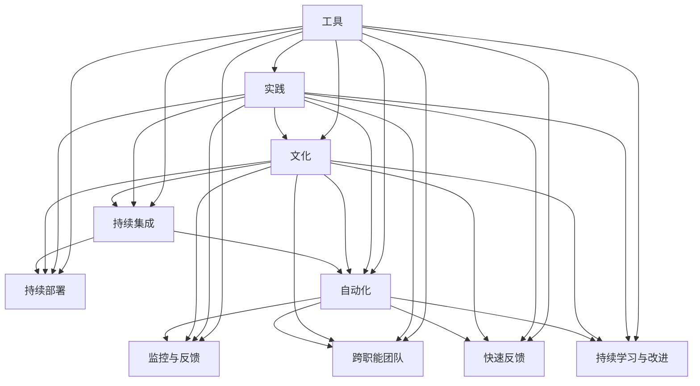
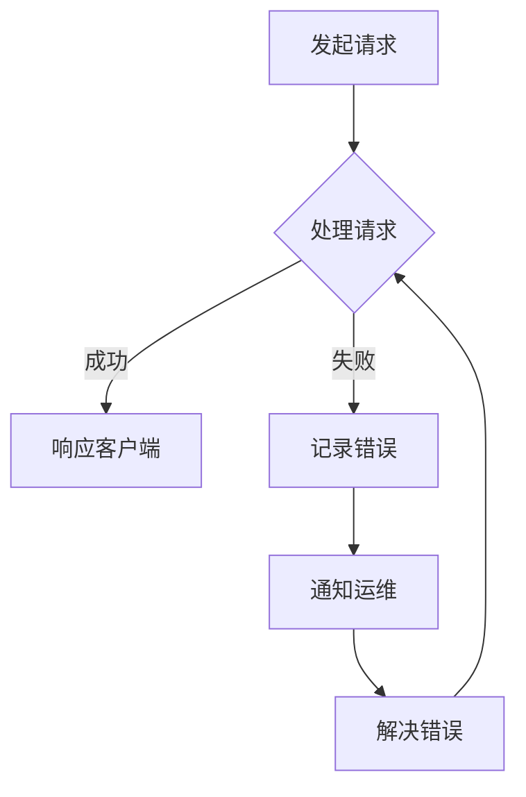

                 

# 《创业公司的DevOps文化建设与实践》

## 概述

关键词：DevOps文化、创业公司、持续集成、持续部署、敏捷开发、自动化测试、安全性、合规性

在当今快速变化和高竞争的商业环境中，创业公司需要采取创新和高效的运营策略来保持竞争力。DevOps文化的引入为创业公司提供了一种集成开发（Development）与运维（Operations）的新方法，有助于加快软件开发和交付速度，提高系统可靠性和安全性。本文将探讨创业公司如何构建和实施DevOps文化，以实现持续集成与持续部署（CI/CD）、自动化测试、安全合规性，并促进团队协作与组织变革。

## 目录大纲

### 第一部分：引言与背景

1. 创业公司的DevOps文化概述
   - 1.1 DevOps文化的起源与演变
   - 1.2 创业公司的挑战与DevOps文化的价值
   - 1.3 DevOps文化与敏捷开发的关系

### 第二部分：DevOps基础原理与架构

2. DevOps核心概念与原则
   - 2.1 DevOps的定义与核心原则
   - 2.2 DevOps的关键角色与职责
   - 2.3 DevOps的三大支柱

3. DevOps技术与工具
   - 3.1 持续集成（CI）与持续部署（CD）
   - 3.2 容器化与容器编排
   - 3.3 自动化测试与监控

4. DevOps安全与合规性
   - 4.1 DevOps安全的关键挑战
   - 4.2 DevOps安全最佳实践
   - 4.3 合规性在DevOps中的重要性

5. DevOps敏捷团队协作
   - 5.1 敏捷团队的构建与运作
   - 5.2 DevOps与敏捷开发的融合
   - 5.3 团队沟通与协作工具

### 第三部分：创业公司DevOps实践案例

6. 构建创业公司的DevOps团队
   - 6.1 团队构建策略与组织架构
   - 6.2 DevOps团队技能需求
   - 6.3 团队成员角色与职责分配

7. 实施DevOps流程与工具
   - 7.1 创业公司DevOps流程设计
   - 7.2 选择合适的DevOps工具
   - 7.3 DevOps工具链的集成与优化

8. 持续集成与部署实践
   - 8.1 CI/CD流程设计与实现
   - 8.2 自动化测试实践
   - 8.3 持续交付案例分析

9. 安全性、合规性与监控
   - 9.1 DevOps安全实践
   - 9.2 合规性检查与风险控制
   - 9.3 实施有效的监控策略

10. DevOps文化与组织变革
    - 10.1 DevOps文化的塑造与传播
    - 10.2 组织变革与团队激励
    - 10.3 DevOps文化成功案例分享

### 第四部分：附录与资源

11. DevOps资源与工具指南
    - 11.1 DevOps关键资源汇总
    - 11.2 开源DevOps工具推荐
    - 11.3 DevOps相关书籍与论文推荐

12. Mermaid流程图示例
    - 12.1 Mermaid流程图基础
    - 12.2 DevOps流程图示例

13. 核心算法原理与伪代码
    - 13.1 持续集成算法原理
    - 13.2 持续部署算法原理
    - 13.3 伪代码示例

14. 数学模型与公式
    - 14.1 迁移学习公式
    - 14.2 自动化测试效率公式
    - 14.3 监控策略公式

15. 项目实战与代码解读
    - 15.1 创业公司DevOps项目实战
    - 15.2 项目源代码实现
    - 15.3 代码解读与分析

### 引言与背景

在当今快速发展的科技行业，创业公司面临着前所未有的挑战和机遇。市场竞争日益激烈，客户需求不断变化，技术迭代速度加快，这使得创业公司在软件开发和产品交付方面必须寻求高效的方法来提高竞争力和生存能力。DevOps文化的引入为创业公司提供了一种全新的运营模式，有助于解决软件开发过程中的痛点，实现更快速、更可靠的产品交付。

### 第1章：创业公司的DevOps文化概述

#### 1.1 DevOps文化的起源与演变

DevOps文化的起源可以追溯到2000年代初期，当时软件开发和运维团队之间的协作问题日益突出。传统上，软件开发团队（Development）和运维团队（Operations）各自独立运作，缺乏有效的沟通和协作，导致软件交付周期长、质量不稳定。为了解决这一问题，DevOps概念应运而生。

2009年，Anders Wallgren和Jez Humble在QCon London会议上首次提出了DevOps的理念，强调通过跨职能团队的合作和自动化工具的引入，实现开发和运维的无缝整合。DevOps的核心目标是提高软件交付的速度和质量，减少错误和故障的发生。

随着时间的推移，DevOps文化逐渐演变，涵盖了更多的技术和方法，如持续集成（CI）、持续部署（CD）、自动化测试、容器化等。DevOps不仅仅是一种技术，更是一种文化和组织变革的驱动力。

#### 1.2 创业公司的挑战与DevOps文化的价值

对于创业公司来说，市场竞争异常激烈，客户需求多变，这要求创业公司在短时间内快速推出高质量的产品。然而，传统的开发与运维模式往往导致以下挑战：

1. **交付周期长**：由于开发和运维团队之间的隔离，软件交付周期往往较长，影响产品上市时间。
2. **质量不稳定**：缺乏有效的测试和监控机制，导致产品质量不稳定，容易出现错误和故障。
3. **成本高**：传统的开发与运维模式需要大量的人力和时间，导致运营成本较高。
4. **协作困难**：开发和运维团队之间的沟通不畅，导致协作困难，影响项目进度。

DevOps文化的引入为创业公司提供了以下价值：

1. **提高交付速度**：通过持续集成与持续部署，缩短软件交付周期，快速响应市场变化。
2. **提高质量**：自动化测试和监控确保软件质量，减少错误和故障的发生。
3. **降低成本**：自动化工具和高效的流程优化减少人力和时间成本。
4. **增强协作**：跨职能团队的紧密合作，提高项目进度和质量。

#### 1.3 DevOps文化与敏捷开发的关系

敏捷开发是一种以人为核心、迭代、增量的软件开发方法，其核心理念包括客户满意度、响应变化、持续交付等。DevOps文化与敏捷开发有着密切的关系：

1. **协同工作**：DevOps强调跨职能团队的合作，与敏捷开发中的协同工作理念相契合。
2. **持续交付**：DevOps通过持续集成与持续部署，实现持续交付，与敏捷开发中的快速迭代和持续交付目标一致。
3. **自动化**：敏捷开发强调自动化测试和部署，DevOps则通过自动化工具实现这一目标，提高效率和可靠性。

总之，DevOps文化与敏捷开发相结合，为创业公司提供了一种高效、可靠的软件开发和交付模式，有助于应对市场挑战，实现持续创新和竞争优势。

### 第二部分：DevOps基础原理与架构

#### 2.1 DevOps核心概念与原则

DevOps是一套文化和实践，旨在通过整合开发（Development）与运维（Operations），实现更快速、更可靠、更高效的软件交付。以下是DevOps的一些核心概念和原则：

1. **持续集成（CI）**：持续集成是指将开发过程中的代码变更不断集成到主分支，通过自动化测试确保代码质量。持续集成有助于及早发现问题，提高软件质量。
2. **持续部署（CD）**：持续部署是指通过自动化工具将经过测试的代码部署到生产环境，实现快速、可靠的软件交付。持续部署减少手动操作，提高交付效率。
3. **自动化**：DevOps强调自动化，通过自动化工具和脚本实现重复性任务，减少人工干预，提高效率和可靠性。
4. **监控与反馈**：DevOps通过监控和反馈机制，实时监测系统运行状态，及时发现问题和故障，确保系统稳定性和性能。
5. **跨职能团队**：DevOps倡导跨职能团队协作，打破开发与运维之间的壁垒，实现无缝整合和高效协作。
6. **快速反馈**：DevOps注重快速反馈，通过迭代和增量开发，快速响应客户需求和市场变化。
7. **持续学习与改进**：DevOps鼓励团队成员持续学习和改进，不断提高技能和团队能力。

#### 2.2 DevOps的关键角色与职责

在DevOps组织中，不同的角色承担着不同的职责，确保整个流程的顺利进行。以下是DevOps中的一些关键角色及其职责：

1. **开发人员（Developers）**：负责编写代码、实现功能、编写单元测试，并与运维团队合作确保代码的质量和可部署性。
2. **运维人员（Operations）**：负责部署和维护系统，确保系统的可用性和稳定性，与开发人员合作解决部署相关的问题。
3. **自动化工程师（Automation Engineers）**：负责设计和实现自动化流程，包括持续集成、持续部署、自动化测试等。
4. **测试工程师（Test Engineers）**：负责编写和执行自动化测试，确保软件质量，并与开发人员合作修复测试中发现的缺陷。
5. **DevOps工程师（DevOps Engineers）**：负责整合开发和运维流程，设计和实现自动化工具和脚本，确保高效的持续集成与持续部署。
6. **产品经理（Product Managers）**：负责产品规划、需求分析和项目管理，确保产品满足客户需求和市场趋势。

#### 2.3 DevOps的三大支柱

DevOps的三大支柱是文化、实践和工具，它们共同构成了DevOps的核心架构。

1. **文化**：DevOps文化是一种以客户为中心、注重协作、透明和持续改进的文化。文化是DevOps成功的关键，它鼓励团队成员之间的信任和合作，推动组织变革。
2. **实践**：DevOps实践是一系列具体的方法和技术，如持续集成、持续部署、基础设施即代码、容器化、自动化测试等。实践是实现DevOps目标的具体手段。
3. **工具**：DevOps工具是支持实践的技术和软件，如Jenkins、Docker、Kubernetes、Puppet、Chef等。工具的选择和集成是DevOps成功的关键，它们帮助团队自动化重复性任务，提高效率和可靠性。

#### 2.4 DevOps核心概念与联系

为了更好地理解DevOps的核心概念，我们可以借助Mermaid流程图来展示它们之间的联系。



#### 2.5 DevOps核心算法原理与伪代码

持续集成和持续部署是DevOps的核心算法原理，以下是它们的伪代码：

**持续集成算法原理：**

```
function CIAlgorithm(codeChange, testSuite):
    if codeChange not valid:
        return "Invalid code change"
    if testSuite fails:
        return "Test suite failed"
    else:
        merge codeChange into main branch
        return "Code change integrated successfully"
```

**持续部署算法原理：**

```
function CDAutomation(deployableCode, productionEnvironment):
    if deployableCode not valid:
        return "Invalid deployable code"
    if productionEnvironment unavailable:
        return "Production environment unavailable"
    else:
        deploy deployableCode to productionEnvironment
        return "Deployment successful"
```

#### 2.6 DevOps数学模型与公式

DevOps中的一些关键指标可以通过数学模型和公式进行衡量和优化：

**自动化测试效率公式：**

```
Automation Efficiency = (Total Test Cases Passed / Total Test Cases Executed) * 100
```

**监控策略公式：**

```
Monitoring Strategy = (Error Rate / Total Requests) * 100
```

#### 22.7 DevOps项目实战与代码解读

以下是一个创业公司DevOps项目实战的示例，包括开发环境搭建、源代码实现和代码解读：

**开发环境搭建：**

1. 安装Java开发工具包（JDK）
2. 配置Maven构建工具
3. 安装数据库（如MySQL）
4. 配置Spring Boot项目

**源代码实现：**

```
@SpringBootApplication
public class Application {
    public static void main(String[] args) {
        SpringApplication.run(Application.class, args);
    }
}

@RestController
public class HelloWorldController {
    @RequestMapping("/hello")
    public String hello() {
        return "Hello, World!";
    }
}
```

**代码解读与分析：**

1. `@SpringBootApplication`注解表示这是一个Spring Boot应用程序。
2. `@RestController`注解表示这个类是一个RESTful Web服务控制器。
3. `@RequestMapping("/hello")`注解指定了请求的URL路径为"/hello"。

### 第三部分：创业公司DevOps实践案例

#### 3.1 构建创业公司的DevOps团队

在创业公司中构建DevOps团队是成功实施DevOps文化的关键。以下是构建创业公司DevOps团队的策略与步骤：

1. **团队构建策略与组织架构**：

   - **团队规模**：根据公司规模和项目需求，确定团队人数和职能分工。
   - **职能分工**：明确开发人员、运维人员、自动化工程师、测试工程师等角色职责。
   - **跨职能协作**：打破部门壁垒，推动跨职能团队协作。

2. **DevOps团队技能需求**：

   - **开发技能**：掌握主流编程语言（如Java、Python、Go）和开发框架（如Spring Boot、Django）。
   - **运维技能**：熟悉Linux系统管理、网络配置、数据库管理等运维知识。
   - **自动化技能**：熟悉自动化工具（如Jenkins、Docker、Kubernetes）和脚本编写。
   - **测试技能**：掌握自动化测试工具（如Selenium、JUnit）和测试方法。

3. **团队成员角色与职责分配**：

   - **开发人员**：负责编写代码、实现功能、编写单元测试。
   - **运维人员**：负责部署和维护系统，确保系统的可用性和稳定性。
   - **自动化工程师**：负责设计和实现自动化流程，提高开发效率和交付质量。
   - **测试工程师**：负责编写和执行自动化测试，确保软件质量。
   - **DevOps工程师**：负责整合开发和运维流程，设计和实现自动化工具和脚本。

#### 3.2 实施DevOps流程与工具

在创业公司中实施DevOps流程与工具是实现高效软件交付的关键。以下是实施DevOps流程与工具的步骤与策略：

1. **创业公司DevOps流程设计**：

   - **持续集成流程**：实现代码自动化集成和测试，确保代码质量。
   - **持续部署流程**：实现代码自动化部署到生产环境，提高交付效率。
   - **自动化测试流程**：实现自动化测试，确保软件质量。
   - **监控与反馈流程**：实时监测系统运行状态，及时发现问题和故障。

2. **选择合适的DevOps工具**：

   - **持续集成工具**：如Jenkins、GitLab CI、CircleCI等。
   - **持续部署工具**：如Docker、Kubernetes、Ansible等。
   - **自动化测试工具**：如Selenium、JUnit、TestNG等。
   - **监控工具**：如Prometheus、Grafana、ELK Stack等。

3. **DevOps工具链的集成与优化**：

   - **集成工具链**：将不同的DevOps工具集成到一个统一的平台，实现流程自动化。
   - **优化工具链**：根据项目需求，对工具链进行定制和优化，提高效率。
   - **持续改进**：定期评估工具链的性能和效果，不断优化和改进。

#### 3.3 持续集成与部署实践

持续集成与持续部署是DevOps实践的核心环节，以下是一个创业公司的持续集成与部署实践的示例：

1. **持续集成实践**：

   - **代码提交**：开发人员将代码提交到版本控制系统（如Git）。
   - **自动构建**：构建工具（如Maven、Gradle）自动构建项目，生成可执行文件。
   - **自动化测试**：执行自动化测试（如单元测试、集成测试），确保代码质量。
   - **报告输出**：输出测试报告，记录测试结果。

2. **持续部署实践**：

   - **部署脚本**：编写部署脚本（如Shell、Python），实现自动化部署。
   - **容器化**：使用容器化技术（如Docker）将应用程序打包成容器镜像。
   - **部署流程**：通过容器编排工具（如Kubernetes）将容器镜像部署到生产环境。
   - **监控与反馈**：实时监控系统运行状态，及时发现问题和故障。

#### 3.4 安全性、合规性与监控

在创业公司中，安全性、合规性和监控是确保软件质量和系统稳定性的重要方面。以下是安全性、合规性和监控的实践：

1. **安全性实践**：

   - **安全审计**：定期进行安全审计，识别潜在安全漏洞。
   - **权限管理**：实施严格的权限管理，确保只有授权人员能够访问系统和资源。
   - **加密与保护**：对敏感数据进行加密，确保数据安全。
   - **安全培训**：对团队成员进行安全培训，提高安全意识。

2. **合规性实践**：

   - **法规遵守**：遵循相关法律法规和行业标准，确保合规性。
   - **审计与报告**：定期进行合规性审计，生成合规性报告。
   - **合规性检查**：定期进行合规性检查，确保系统符合法规要求。

3. **监控实践**：

   - **性能监控**：实时监控系统性能，确保系统稳定性和响应速度。
   - **日志管理**：收集和存储系统日志，用于问题排查和性能分析。
   - **告警机制**：设置告警机制，及时发现和处理系统故障。
   - **自动化恢复**：实现自动化恢复机制，快速恢复系统正常运行。

#### 3.5 DevOps文化与组织变革

DevOps文化的构建和组织变革是实现DevOps目标的关键。以下是构建DevOps文化和组织变革的实践：

1. **DevOps文化的塑造与传播**：

   - **文化培训**：开展DevOps文化培训，提高团队成员对DevOps理念的认识。
   - **文化宣传**：通过内部交流、会议和活动，宣传DevOps文化。
   - **文化实践**：将DevOps文化融入日常工作，推动团队协作和持续改进。

2. **组织变革与团队激励**：

   - **组织结构**：调整组织结构，打破部门壁垒，实现跨职能团队协作。
   - **激励机制**：建立激励机制，鼓励团队成员积极参与DevOps实践。
   - **绩效评估**：将DevOps实践纳入绩效评估，激励团队成员持续改进。

3. **DevOps文化成功案例分享**：

   - **案例分析**：分享成功的DevOps实践案例，总结经验和教训。
   - **知识分享**：组织内部知识分享活动，提高团队成员的技能和知识水平。
   - **持续改进**：定期评估DevOps实践的成效，不断优化和改进。

### 第四部分：附录与资源

#### 4.1 DevOps资源与工具指南

为了帮助读者深入了解DevOps和相关技术，以下是DevOps资源与工具的指南：

1. **开源DevOps工具推荐**：

   - **Jenkins**：一个开源的持续集成工具，支持各种插件和集成。
   - **GitLab CI**：GitLab自带的持续集成和持续部署工具。
   - **CircleCI**：一个基于云的持续集成和持续部署平台。
   - **Docker**：一个开源的应用容器引擎，用于容器化应用程序。
   - **Kubernetes**：一个开源的容器编排平台，用于自动化部署和管理容器化应用程序。
   - **Ansible**：一个开源的自动化工具，用于配置管理和应用部署。

2. **DevOps相关书籍与论文推荐**：

   - **《DevOps：实践指南》**：介绍了DevOps的基本概念、方法和最佳实践。
   - **《持续交付：发布可靠软件的系统化方法》**：详细介绍了持续交付的原理和实践。
   - **《云原生应用架构指南》**：介绍了云原生应用的架构设计和最佳实践。
   - **《敏捷开发与Scrum实践指南》**：介绍了敏捷开发的方法和Scrum实践。
   - **相关论文和研究报告**：如Google的《The Site Reliability Engineering Book》等。

#### 4.2 Mermaid流程图示例

以下是一个简单的Mermaid流程图示例，用于展示DevOps流程：



#### 4.3 核心算法原理与伪代码

以下是一个简单的持续集成算法的伪代码示例：

```markdown
function CIAlgorithm(codeChange, testSuite):
    if codeChange not valid:
        return "Invalid code change"
    if testSuite fails:
        return "Test suite failed"
    else:
        merge codeChange into main branch
        return "Code change integrated successfully"
```

#### 4.4 数学模型与公式

以下是一个简单的自动化测试效率公式示例：

```markdown
Automation Efficiency = (Total Test Cases Passed / Total Test Cases Executed) * 100
```

#### 4.5 项目实战与代码解读

以下是一个简单的Spring Boot应用程序的代码示例，用于演示DevOps实践：

```java
@SpringBootApplication
public class Application {
    public static void main(String[] args) {
        SpringApplication.run(Application.class, args);
    }
}

@RestController
public class HelloWorldController {
    @RequestMapping("/hello")
    public String hello() {
        return "Hello, World!";
    }
}
```

### 结语

通过本文的讨论，我们了解了DevOps文化在创业公司中的重要性，以及如何构建和实施DevOps团队、流程和工具。DevOps不仅能够提高软件交付速度和质量，还能降低成本、增强团队协作，为创业公司提供强大的竞争力。希望本文能为您提供有关DevOps实践的启示和参考。

## 作者信息

作者：AI天才研究院/AI Genius Institute & 禅与计算机程序设计艺术 /Zen And The Art of Computer Programming

本文由AI天才研究院（AI Genius Institute）和《禅与计算机程序设计艺术》（Zen And The Art of Computer Programming）的作者合作撰写，旨在探讨DevOps文化在创业公司中的实践与应用。希望通过本文，读者能够更好地理解DevOps的核心原理和实践方法，为创业公司的软件开发和交付提供有益的参考和启示。

