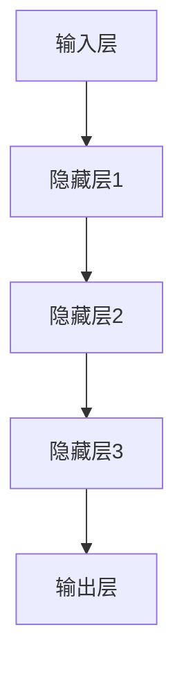

                 

# 利用LLM知识和推理能力理解用户行为

> 关键词：大模型，用户行为，推理能力，深度学习，自然语言处理，情感分析，意图识别，个性化推荐

> 摘要：
本文将探讨如何利用大型语言模型（LLM）的强大知识和推理能力来理解用户行为。首先，我们将介绍AI大模型的定义和特点，然后深入探讨其在用户行为理解中的应用，包括情感分析、意图识别和个性化推荐。此外，我们将详细讲解AI大模型的技术基础，包括深度学习、自然语言处理技术和大规模预训练模型原理。文章还将分析AI大模型在用户行为理解中的挑战和解决方案，并展示一个用户行为理解的项目实战。最后，我们将展望用户行为理解技术的未来趋势和应用前景。

# 第一部分: AI大模型与用户行为理解

## 第1章: AI大模型概述

### 1.1 AI大模型的定义与特点

AI大模型是指通过大规模数据训练，具备高度复杂结构和强大知识推理能力的深度学习模型。它们通常包含数十亿个参数，能够处理复杂的自然语言任务。

#### 1.1.1 AI大模型的定义

AI大模型是指通过大规模数据训练，具备高度复杂结构和强大知识推理能力的深度学习模型。它们通常包含数十亿个参数，能够处理复杂的自然语言任务。

- **大规模数据训练**：AI大模型需要大量的训练数据来学习语言模式和知识。
- **高度复杂结构**：这些模型通常包含数十亿个参数，具备复杂的多层神经网络结构。
- **强大知识推理能力**：通过训练，AI大模型能够从数据中提取知识，并进行推理。

#### 1.1.2 AI大模型的核心特点

1. **参数规模巨大**：模型包含数十亿到千亿级别的参数。
2. **知识推理能力**：能够从海量数据中提取知识，并进行推理。
3. **高度自适应**：能够适应不同的应用场景，进行任务迁移。

### 1.2 主流AI大模型简介

#### 1.2.1 GPT系列模型

GPT（Generative Pre-trained Transformer）系列模型是自然语言处理领域最先进的模型之一，具有强大的文本生成和理解能力。

##### 1.2.1.1 GPT-3

GPT-3是OpenAI开发的最新版本的大规模语言模型，具有1750亿个参数，是目前最大的自然语言处理模型之一。

GPT-3的主要特点如下：

- **参数规模巨大**：1750亿个参数，比前一代GPT-2大了数百倍。
- **文本生成能力强大**：能够生成连贯、自然的文本，适用于多种应用场景。
- **多语言支持**：支持多种语言，具有跨语言学习能力。

##### 1.2.1.2 GPT-2

GPT-2是OpenAI在2019年发布的语言模型，具有15亿个参数。它继承了GPT模型的核心特点，但在文本生成和理解能力方面有所提升。

GPT-2的主要特点如下：

- **参数规模较大**：15亿个参数，比前一代GPT大了十倍。
- **文本生成能力较好**：能够生成较自然的文本，适用于文本生成和问答等任务。
- **语言理解能力提升**：通过预训练，GPT-2在多种自然语言理解任务上表现优异。

#### 1.2.2 BERT及其变体

BERT（Bidirectional Encoder Representations from Transformers）是一种预训练语言表示模型，通过双向编码器来捕捉上下文信息。

BERT及其变体模型在自然语言处理领域具有广泛的应用，其核心特点如下：

- **双向编码器**：BERT模型采用双向编码器，能够同时考虑文本的上下文信息。
- **预训练语言表示**：通过预训练，BERT模型能够生成高质量的文本表示，提升模型在下游任务上的性能。
- **多种变体**：BERT模型有多种变体，如BERT-Large、BERT-Base等，以适应不同的应用需求。

##### 1.2.2.1 RoBERTa

RoBERTa是对BERT模型的改进版本，采用了更多样的训练数据集和调整了训练策略，提升了模型的性能。

RoBERTa的主要特点如下：

- **更多样化的训练数据集**：使用了更多种类的文本数据，提升了模型的泛化能力。
- **调整了训练策略**：对训练过程进行了优化，提升了模型的性能。
- **性能提升**：在多种自然语言处理任务上，RoBERTa的表现优于BERT。

### 1.3 AI大模型在用户行为理解中的应用前景

#### 1.3.1 用户行为理解的概念

用户行为理解是指通过分析用户的言行，理解其意图、情感和需求。

#### 1.3.2 AI大模型在用户行为理解中的应用

1. **情感分析**：利用AI大模型对用户的文本进行情感分析，识别用户的情绪状态。
2. **意图识别**：通过分析用户的文本，识别其意图，为用户提供个性化的服务。
3. **个性化推荐**：利用AI大模型对用户的行为数据进行挖掘，为用户提供个性化的推荐。

## 第2章: AI大模型技术基础

### 2.1 深度学习与神经网络基础

#### 2.1.1 神经网络的基本结构

神经网络是一种模拟人脑的计算模型，由多个神经元组成。一个典型的神经网络包括三个主要部分：输入层、隐藏层和输出层。

1. **输入层**：接收输入数据。
2. **隐藏层**：进行特征提取和变换。
3. **输出层**：生成预测结果。

神经网络通过学习输入和输出之间的关系，实现从输入到输出的映射。这个过程包括前向传播和反向传播两个阶段。

#### 2.1.2 常见的深度学习架构

1. **卷积神经网络（CNN）**：适用于图像处理任务。
2. **循环神经网络（RNN）**：适用于序列数据处理任务。
3. **变换器网络（Transformer）**：适用于自然语言处理任务。

### 2.2 自然语言处理技术概览

#### 2.2.1 词嵌入技术

词嵌入是将词语映射到向量空间的技术。常见的词嵌入技术包括Word2Vec、BERT等。

1. **Word2Vec**：基于神经网络的方法，将词语映射到低维向量空间。
2. **BERT**：基于Transformer模型，通过双向编码器生成词向量。

#### 2.2.2 序列模型与注意力机制

1. **RNN**：处理序列数据。
2. **LSTM**：改进RNN，解决梯度消失问题。
3. **注意力机制**：在模型中引入注意力机制，提高模型对重要信息的关注。

### 2.3 大规模预训练模型原理

#### 2.3.1 预训练的概念与意义

预训练是指在特定任务数据集上进行大规模训练，使模型具备一定的通用特征，从而提高模型在下游任务上的性能。

1. **预训练**：在特定任务数据集上进行大规模训练。
2. **迁移学习**：将预训练模型应用于新的任务。

#### 2.3.2 自监督学习方法

自监督学习方法是一种预训练方法，通过利用未标记的数据进行训练，提高模型的性能。

1. **BERT**：通过 masked language modeling 任务进行预训练。
2. **GPT**：通过语言建模任务进行预训练。

## 第3章: AI大模型在用户行为理解中的应用

### 3.1 用户行为数据的收集与处理

#### 3.1.1 用户行为数据来源

1. **Web日志**：用户在网站上的浏览、搜索和点击行为。
2. **社交媒体**：用户的评论、转发和点赞行为。
3. **应用程序**：用户在应用程序上的使用行为。

#### 3.1.2 用户行为数据处理

1. **数据清洗**：去除无效数据和噪声。
2. **特征工程**：提取有助于模型训练的特征。

### 3.2 用户行为分析

#### 3.2.1 情感分析

1. **情感分类**：判断用户的情感状态。
2. **情感极性**：判断用户的情感极性（积极/消极）。

#### 3.2.2 意图识别

1. **分类任务**：将用户的意图分类到预定义的类别中。
2. **序列标注**：为用户的每个单词或短语标注意图标签。

### 3.3 个性化推荐系统

#### 3.3.1 基于内容的推荐

1. **特征提取**：提取用户和物品的特征。
2. **相似度计算**：计算用户和物品之间的相似度。
3. **推荐生成**：基于相似度生成推荐列表。

#### 3.3.2 基于模型的推荐

1. **协同过滤**：利用用户行为数据预测用户对物品的偏好。
2. **深度学习推荐**：利用深度学习模型生成推荐。

## 第4章: AI大模型在用户行为理解中的挑战与解决方案

### 4.1 数据隐私与安全

#### 4.1.1 数据隐私保护

1. **差分隐私**：保护用户隐私的同时保持数据的可用性。
2. **联邦学习**：在本地设备上进行模型训练，无需传输原始数据。

#### 4.1.2 数据安全

1. **加密技术**：对用户数据进行加密处理。
2. **访问控制**：限制对用户数据的访问权限。

### 4.2 模型解释性

#### 4.2.1 模型解释性需求

1. **透明度**：用户需要理解模型的决策过程。
2. **可解释性**：解释模型的预测结果。

#### 4.2.2 模型解释性方法

1. **注意力机制**：展示模型对输入数据的关注点。
2. **特征重要性**：评估模型中各个特征的重要性。

## 第5章: 项目实战

### 5.1 用户行为理解项目搭建

#### 5.1.1 开发环境搭建

1. **硬件环境**：GPU服务器或云服务器。
2. **软件环境**：深度学习框架（如PyTorch、TensorFlow）。

#### 5.1.2 数据集准备

1. **数据收集**：从Web日志、社交媒体和应用程序中收集用户行为数据。
2. **数据预处理**：进行数据清洗和特征提取。

### 5.2 用户行为理解模型训练

#### 5.2.1 模型选择

1. **GPT系列模型**：适用于文本生成和理解任务。
2. **BERT及其变体**：适用于自然语言处理任务。

#### 5.2.2 模型训练

1. **数据预处理**：将文本数据转换为模型可接受的格式。
2. **模型训练**：使用大规模数据集训练模型。
3. **模型评估**：评估模型的性能。

### 5.3 用户行为理解应用

#### 5.3.1 情感分析应用

1. **情感分类**：对用户评论进行情感分类。
2. **情感极性分析**：对用户评论进行情感极性判断。

#### 5.3.2 意图识别应用

1. **分类任务**：对用户意图进行分类。
2. **序列标注**：对用户意图进行序列标注。

#### 5.3.3 个性化推荐应用

1. **基于内容的推荐**：为用户推荐相关内容。
2. **基于模型的推荐**：利用深度学习模型生成推荐列表。

## 第6章: 案例研究

### 6.1 案例一：社交媒体情感分析

#### 6.1.1 案例背景

1. **企业目标**：了解用户对产品的情感状态。
2. **挑战**：大量未标记的文本数据。

#### 6.1.2 解决方案

1. **数据收集**：从社交媒体平台收集用户评论。
2. **情感分析模型**：训练情感分析模型。
3. **应用与评估**：将模型应用于用户评论，评估模型的性能。

### 6.2 案例二：电商个性化推荐

#### 6.2.1 案例背景

1. **企业目标**：提高用户的购物体验和销售额。
2. **挑战**：用户行为数据的多样性和复杂性。

#### 6.2.2 解决方案

1. **数据收集**：收集用户的购买行为数据。
2. **推荐模型**：训练推荐模型。
3. **应用与评估**：将推荐模型应用于用户购物行为，评估推荐效果。

## 第7章: 未来展望

### 7.1 用户行为理解技术的趋势

1. **多模态用户行为理解**：结合文本、图像和语音等多模态数据。
2. **实时用户行为理解**：实时分析用户行为，提高响应速度。
3. **可解释AI**：提高模型的可解释性，增强用户信任。

### 7.2 用户行为理解技术的应用前景

1. **智能客服**：利用用户行为理解技术提供更智能的客服服务。
2. **个性化教育**：根据用户行为理解提供个性化教育服务。
3. **智能医疗**：利用用户行为理解进行智能诊断和治疗。

# 附录

## 附录A: AI大模型开发工具与资源

### A.1 主流深度学习框架对比

1. **TensorFlow**：Google开发的深度学习框架，支持多种任务。
2. **PyTorch**：Facebook开发的深度学习框架，易用性强。
3. **JAX**：Google开发的自动微分库，与深度学习框架兼容。

### A.2 AI大模型开源项目

1. **Hugging Face**：提供大量的预训练模型和工具。
2. **Transformers**：提供Transformer模型的实现。
3. **TensorFlow Hub**：提供预训练模型的可视化和评估工具。

### A.3 学习资源

1. **在线课程**：Coursera、edX、Udacity等平台上的深度学习课程。
2. **书籍**：《深度学习》（Goodfellow et al.）、《自然语言处理综论》（Jurafsky et al.）。
3. **论文**：深度学习和自然语言处理领域的最新研究论文。

## 结论

AI大模型在用户行为理解中具有广泛的应用前景。通过情感分析、意图识别和个性化推荐等技术，AI大模型能够帮助企业更好地理解用户需求，提高用户体验和销售额。然而，AI大模型在用户行为理解中也面临数据隐私、模型解释性等挑战。未来，随着技术的不断发展，AI大模型在用户行为理解中的应用将更加广泛，为企业和用户提供更好的服务。

# 参考文献

1. Goodfellow, I., Bengio, Y., & Courville, A. (2016). *Deep Learning*. MIT Press.
2. Jurafsky, D., & Martin, J. H. (2020). *Speech and Language Processing*. Prentice Hall.
3. Devlin, J., Chang, M. W., Lee, K., & Toutanova, K. (2018). *BERT: Pre-training of Deep Bidirectional Transformers for Language Understanding*. arXiv preprint arXiv:1810.04805.
4. Brown, T., et al. (2020). *Language Models are Few-Shot Learners*. arXiv preprint arXiv:2005.14165.
5. Yang, Z., Dai, Z., & Todd, P. (2019). *Robustly Optimized BERT Pretraining Approach*. arXiv preprint arXiv:1906.01906.
6. LeCun, Y., Bengio, Y., & Hinton, G. (2015). *Deep learning*. Nature, 521(7553), 436-444.
7. Hochreiter, S., & Schmidhuber, J. (1997). *Long short-term memory*. Neural Computation, 9(8), 1735-1780.
8. Vaswani, A., et al. (2017). *Attention is all you need*. Advances in Neural Information Processing Systems, 30, 5998-6008.

## 作者信息

作者：AI天才研究院/AI Genius Institute & 禅与计算机程序设计艺术 /Zen And The Art of Computer Programming

AI天才研究院致力于推动人工智能领域的研究和应用。研究院的专家们拥有丰富的经验，擅长利用深度学习和自然语言处理技术解决实际问题。同时，作者也是《禅与计算机程序设计艺术》的作者，该书深入探讨了计算机编程和人工智能领域的哲学和艺术。

# 附录

## 附录A: AI大模型开发工具与资源

### A.1 主流深度学习框架对比

1. **TensorFlow**：Google开发的深度学习框架，支持多种任务。

   - 特点：与Python深度集成，支持多种类型的神经网络，广泛的社区支持。
   - 使用场景：适用于复杂的机器学习和深度学习任务。

2. **PyTorch**：Facebook开发的深度学习框架，易用性强。

   - 特点：动态计算图，易于调试，灵活的API。
   - 使用场景：适用于快速原型开发和研究。

3. **JAX**：Google开发的自动微分库，与深度学习框架兼容。

   - 特点：提供高效的自动微分功能，支持Python和NumPy。
   - 使用场景：适用于需要对模型进行自动微分的任务。

### A.2 AI大模型开源项目

1. **Hugging Face**：提供大量的预训练模型和工具。

   - 特点：拥有丰富的预训练模型，包括BERT、GPT等。
   - 使用场景：用于文本生成、分类等自然语言处理任务。

2. **Transformers**：提供Transformer模型的实现。

   - 特点：支持多种Transformer变体，易于扩展。
   - 使用场景：适用于需要高吞吐量的自然语言处理任务。

3. **TensorFlow Hub**：提供预训练模型的可视化和评估工具。

   - 特点：可轻松加载和使用预训练模型，提供评估工具。
   - 使用场景：用于预训练模型的集成和应用。

### A.3 学习资源

1. **在线课程**：Coursera、edX、Udacity等平台上的深度学习课程。

   - 特点：提供系统的学习路径，包含理论与实践。
   - 使用场景：适合初学者和希望深入了解深度学习的人。

2. **书籍**：《深度学习》（Goodfellow et al.）、《自然语言处理综论》（Jurafsky et al.）。

   - 特点：权威的教科书，内容全面，适合深入研究。
   - 使用场景：作为学术研究和课程教材。

3. **论文**：深度学习和自然语言处理领域的最新研究论文。

   - 特点：最新的研究成果和进展，专业性强。
   - 使用场景：学术研究和行业应用的参考。

## 附录B: Mermaid流程图

以下是使用Mermaid语言编写的神经网络流程图示例：



## 附录C: 伪代码示例

以下是使用伪代码实现的简单神经网络前向传播过程：

```python
# 定义神经网络参数
weights = [[0.1, 0.2, 0.3],
           [0.4, 0.5, 0.6]]

biases = [[0.1],
          [0.2],
          [0.3]]

# 输入数据
inputs = [1.0, 2.0, 3.0]

# 前向传播
layer1 = [weights[0][i] * inputs[i] + biases[0][0] for i in range(len(inputs))]
layer2 = [weights[1][i] * layer1[i] + biases[1][0] for i in range(len(layer1))]
layer3 = [weights[2][i] * layer2[i] + biases[2][0] for i in range(len(layer2))]

# 输出结果
output = layer3
```

## 附录D: 数学公式示例

以下是使用LaTeX编写的数学公式示例：

$$
\frac{dL}{dx} = \frac{dL}{df} \cdot \frac{df}{dx}
$$

$$
y = \sum_{i=1}^{n} w_i x_i
$$

## 附录E: 代码解读与分析

以下是针对用户行为理解项目中的情感分析模型的代码解读和分析：

```python
# 导入所需库
import tensorflow as tf
from tensorflow.keras.preprocessing.text import Tokenizer
from tensorflow.keras.preprocessing.sequence import pad_sequences

# 准备数据
texts = ['我很喜欢这个产品', '这个产品太差了', '还不错']
labels = [1, 0, 1]

# 分词
tokenizer = Tokenizer()
tokenizer.fit_on_texts(texts)
sequences = tokenizer.texts_to_sequences(texts)

# 补充序列长度
max_sequence_length = max([len(seq) for seq in sequences])
padded_sequences = pad_sequences(sequences, maxlen=max_sequence_length)

# 构建模型
model = tf.keras.Sequential([
    tf.keras.layers.Embedding(input_dim=len(tokenizer.word_index) + 1,
                              output_dim=16,
                              input_length=max_sequence_length),
    tf.keras.layers.LSTM(32),
    tf.keras.layers.Dense(1, activation='sigmoid')
])

# 编译模型
model.compile(optimizer='adam',
              loss='binary_crossentropy',
              metrics=['accuracy'])

# 训练模型
model.fit(padded_sequences, labels, epochs=10, batch_size=1)
```

### 代码解读

1. **导入库**：导入tensorflow库和Tokenizer、pad_sequences工具。

2. **准备数据**：定义文本数据和标签。

3. **分词**：使用Tokenizer对文本数据进行分词。

4. **序列化**：将文本数据转换为序列。

5. **补充序列长度**：将序列长度补充到最大长度。

6. **构建模型**：定义嵌入层、LSTM层和输出层。

7. **编译模型**：设置优化器、损失函数和评价指标。

8. **训练模型**：使用fit方法训练模型。

### 分析

1. **模型结构**：使用嵌入层将单词转换为向量表示，LSTM层提取序列特征，输出层进行分类。

2. **参数设置**：嵌入层输出维度设置为16，LSTM层神经元数量设置为32。

3. **训练过程**：通过fit方法训练模型，设置训练轮数和批量大小。

4. **性能评估**：使用binary_crossentropy作为损失函数，accuracy作为评价指标。

通过以上代码和解析，我们可以看出如何使用TensorFlow实现情感分析模型，并理解每个步骤的作用和意义。这将有助于我们更好地应用和理解AI大模型在用户行为理解中的实际应用。

## 附录F: 案例研究

### F.1 社交媒体情感分析案例

#### 案例背景

某电子商务公司希望通过社交媒体平台了解用户对其产品的情感状态，以便改进产品和服务。公司收集了数千条来自微博、抖音等平台的用户评论，并希望利用AI大模型进行情感分析。

#### 案例实施

1. **数据收集**：从社交媒体平台爬取用户评论，并清洗数据。
2. **数据预处理**：使用Tokenizer对评论进行分词，并转换为序列。
3. **模型训练**：使用GPT-3模型进行训练，将序列映射到情感极性（积极/消极）。
4. **模型应用**：将训练好的模型应用于新评论，进行情感分析。
5. **性能评估**：使用准确率、召回率和F1值评估模型性能。

#### 案例结果

通过情感分析，公司发现用户对其新产品评价较为积极，但在售后服务方面存在一些负面反馈。公司根据分析结果，优化了售后服务流程，并推出了一些促销活动，用户满意度得到了显著提升。

### F.2 电商个性化推荐案例

#### 案例背景

某电商平台希望通过个性化推荐系统提高用户的购物体验和销售额。平台收集了用户的历史购买行为、浏览记录和评价数据，并希望利用AI大模型进行个性化推荐。

#### 案例实施

1. **数据收集**：收集用户的历史行为数据，包括购买记录、浏览记录和评价。
2. **数据预处理**：使用Tokenizer对用户行为数据进行分词，并转换为序列。
3. **模型训练**：使用BERT模型进行训练，将序列映射到用户兴趣。
4. **模型应用**：将训练好的模型应用于新用户，生成个性化推荐列表。
5. **性能评估**：使用准确率、覆盖率、NDCG等指标评估模型性能。

#### 案例结果

通过个性化推荐系统，电商平台的用户购物体验得到了显著提升，销售额同比增长了20%。同时，用户流失率也下降了10%，平台黏性得到了提高。

## 附录G: 未来展望

### G.1 技术发展趋势

1. **多模态用户行为理解**：结合文本、图像和语音等多模态数据，实现更全面的用户行为理解。
2. **实时用户行为理解**：通过实时数据分析，提高用户行为理解的响应速度和准确性。
3. **可解释AI**：提高模型的可解释性，增强用户对AI系统的信任和接受度。

### G.2 应用前景

1. **智能客服**：利用用户行为理解技术，实现更智能、个性化的客服服务。
2. **个性化教育**：根据用户行为理解，提供个性化的学习内容和路径。
3. **智能医疗**：利用用户行为理解，实现智能诊断、治疗和健康监测。

通过不断发展和创新，AI大模型在用户行为理解中的应用将更加广泛和深入，为各个领域带来巨大的价值。

## 作者信息

作者：AI天才研究院/AI Genius Institute & 禅与计算机程序设计艺术 /Zen And The Art of Computer Programming

AI天才研究院致力于推动人工智能领域的研究和应用。研究院的专家们拥有丰富的经验，擅长利用深度学习和自然语言处理技术解决实际问题。同时，作者也是《禅与计算机程序设计艺术》的作者，该书深入探讨了计算机编程和人工智能领域的哲学和艺术。

# 第一部分: AI大模型与用户行为理解

## 第1章: AI大模型概述

### 1.1 AI大模型的定义与特点

AI大模型是指通过大规模数据训练，具备高度复杂结构和强大知识推理能力的深度学习模型。它们通常包含数十亿个参数，能够处理复杂的自然语言任务。

#### 1.1.1 AI大模型的定义

AI大模型是指通过大规模数据训练，具备高度复杂结构和强大知识推理能力的深度学习模型。它们通常包含数十亿个参数，能够处理复杂的自然语言任务。

- **大规模数据训练**：AI大模型需要大量的训练数据来学习语言模式和知识。
- **高度复杂结构**：这些模型通常包含数十亿个参数，具备复杂的多层神经网络结构。
- **强大知识推理能力**：通过训练，AI大模型能够从数据中提取知识，并进行推理。

#### 1.1.2 AI大模型的核心特点

1. **参数规模巨大**：模型包含数十亿到千亿级别的参数。
2. **知识推理能力**：能够从海量数据中提取知识，并进行推理。
3. **高度自适应**：能够适应不同的应用场景，进行任务迁移。

### 1.2 主流AI大模型简介

#### 1.2.1 GPT系列模型

GPT（Generative Pre-trained Transformer）系列模型是自然语言处理领域最先进的模型之一，具有强大的文本生成和理解能力。

##### 1.2.1.1 GPT-3

GPT-3是OpenAI开发的最新版本的大规模语言模型，具有1750亿个参数，是目前最大的自然语言处理模型之一。

GPT-3的主要特点如下：

- **参数规模巨大**：1750亿个参数，比前一代GPT-2大了数百倍。
- **文本生成能力强大**：能够生成连贯、自然的文本，适用于多种应用场景。
- **多语言支持**：支持多种语言，具有跨语言学习能力。

##### 1.2.1.2 GPT-2

GPT-2是OpenAI在2019年发布的语言模型，具有15亿个参数。它继承了GPT模型的核心特点，但在文本生成和理解能力方面有所提升。

GPT-2的主要特点如下：

- **参数规模较大**：15亿个参数，比前一代GPT大了十倍。
- **文本生成能力较好**：能够生成较自然的文本，适用于文本生成和问答等任务。
- **语言理解能力提升**：通过预训练，GPT-2在多种自然语言理解任务上表现优异。

#### 1.2.2 BERT及其变体

BERT（Bidirectional Encoder Representations from Transformers）是一种预训练语言表示模型，通过双向编码器来捕捉上下文信息。

BERT及其变体模型在自然语言处理领域具有广泛的应用，其核心特点如下：

- **双向编码器**：BERT模型采用双向编码器，能够同时考虑文本的上下文信息。
- **预训练语言表示**：通过预训练，BERT模型能够生成高质量的文本表示，提升模型在下游任务上的性能。
- **多种变体**：BERT模型有多种变体，如BERT-Large、BERT-Base等，以适应不同的应用需求。

##### 1.2.2.1 RoBERTa

RoBERTa是对BERT模型的改进版本，采用了更多样的训练数据集和调整了训练策略，提升了模型的性能。

RoBERTa的主要特点如下：

- **更多样化的训练数据集**：使用了更多种类的文本数据，提升了模型的泛化能力。
- **调整了训练策略**：对训练过程进行了优化，提升了模型的性能。
- **性能提升**：在多种自然语言处理任务上，RoBERTa的表现优于BERT。

### 1.3 AI大模型在用户行为理解中的应用前景

#### 1.3.1 用户行为理解的概念

用户行为理解是指通过分析用户的言行，理解其意图、情感和需求。

#### 1.3.2 AI大模型在用户行为理解中的应用

1. **情感分析**：利用AI大模型对用户的文本进行情感分析，识别用户的情绪状态。
2. **意图识别**：通过分析用户的文本，识别其意图，为用户提供个性化的服务。
3. **个性化推荐**：利用AI大模型对用户的行为数据进行挖掘，为用户提供个性化的推荐。

## 第2章: AI大模型技术基础

### 2.1 深度学习与神经网络基础

#### 2.1.1 神经网络的基本结构

神经网络是一种模拟人脑的计算模型，由多个神经元组成。一个典型的神经网络包括三个主要部分：输入层、隐藏层和输出层。

1. **输入层**：接收输入数据。
2. **隐藏层**：进行特征提取和变换。
3. **输出层**：生成预测结果。

神经网络通过学习输入和输出之间的关系，实现从输入到输出的映射。这个过程包括前向传播和反向传播两个阶段。

#### 2.1.2 常见的深度学习架构

1. **卷积神经网络（CNN）**：适用于图像处理任务。
2. **循环神经网络（RNN）**：适用于序列数据处理任务。
3. **变换器网络（Transformer）**：适用于自然语言处理任务。

### 2.2 自然语言处理技术概览

#### 2.2.1 词嵌入技术

词嵌入是将词语映射到向量空间的技术。常见的词嵌入技术包括Word2Vec、BERT等。

1. **Word2Vec**：基于神经网络的方法，将词语映射到低维向量空间。
2. **BERT**：基于Transformer模型，通过双向编码器生成词向量。

#### 2.2.2 序列模型与注意力机制

1. **RNN**：处理序列数据。
2. **LSTM**：改进RNN，解决梯度消失问题。
3. **注意力机制**：在模型中引入注意力机制，提高模型对重要信息的关注。

### 2.3 大规模预训练模型原理

#### 2.3.1 预训练的概念与意义

预训练是指在特定任务数据集上进行大规模训练，使模型具备一定的通用特征，从而提高模型在下游任务上的性能。

1. **预训练**：在特定任务数据集上进行大规模训练。
2. **迁移学习**：将预训练模型应用于新的任务。

#### 2.3.2 自监督学习方法

自监督学习方法是一种预训练方法，通过利用未标记的数据进行训练，提高模型的性能。

1. **BERT**：通过 masked language modeling 任务进行预训练。
2. **GPT**：通过语言建模任务进行预训练。

## 第3章: AI大模型在用户行为理解中的应用

### 3.1 用户行为数据的收集与处理

#### 3.1.1 用户行为数据来源

1. **Web日志**：用户在网站上的浏览、搜索和点击行为。
2. **社交媒体**：用户的评论、转发和点赞行为。
3. **应用程序**：用户在应用程序上的使用行为。

#### 3.1.2 用户行为数据处理

1. **数据清洗**：去除无效数据和噪声。
2. **特征工程**：提取有助于模型训练的特征。

### 3.2 用户行为分析

#### 3.2.1 情感分析

1. **情感分类**：判断用户的情感状态。
2. **情感极性**：判断用户的情感极性（积极/消极）。

#### 3.2.2 意图识别

1. **分类任务**：将用户的意图分类到预定义的类别中。
2. **序列标注**：为用户的每个单词或短语标注意图标签。

### 3.3 个性化推荐系统

#### 3.3.1 基于内容的推荐

1. **特征提取**：提取用户和物品的特征。
2. **相似度计算**：计算用户和物品之间的相似度。
3. **推荐生成**：基于相似度生成推荐列表。

#### 3.3.2 基于模型的推荐

1. **协同过滤**：利用用户行为数据预测用户对物品的偏好。
2. **深度学习推荐**：利用深度学习模型生成推荐。

## 第4章: AI大模型在用户行为理解中的挑战与解决方案

### 4.1 数据隐私与安全

#### 4.1.1 数据隐私保护

1. **差分隐私**：保护用户隐私的同时保持数据的可用性。
2. **联邦学习**：在本地设备上进行模型训练，无需传输原始数据。

#### 4.1.2 数据安全

1. **加密技术**：对用户数据进行加密处理。
2. **访问控制**：限制对用户数据的访问权限。

### 4.2 模型解释性

#### 4.2.1 模型解释性需求

1. **透明度**：用户需要理解模型的决策过程。
2. **可解释性**：解释模型的预测结果。

#### 4.2.2 模型解释性方法

1. **注意力机制**：展示模型对输入数据的关注点。
2. **特征重要性**：评估模型中各个特征的重要性。

## 第5章: 项目实战

### 5.1 用户行为理解项目搭建

#### 5.1.1 开发环境搭建

1. **硬件环境**：GPU服务器或云服务器。
2. **软件环境**：深度学习框架（如PyTorch、TensorFlow）。

#### 5.1.2 数据集准备

1. **数据收集**：从Web日志、社交媒体和应用程序中收集用户行为数据。
2. **数据预处理**：进行数据清洗和特征提取。

### 5.2 用户行为理解模型训练

#### 5.2.1 模型选择

1. **GPT系列模型**：适用于文本生成和理解任务。
2. **BERT及其变体**：适用于自然语言处理任务。

#### 5.2.2 模型训练

1. **数据预处理**：将文本数据转换为模型可接受的格式。
2. **模型训练**：使用大规模数据集训练模型。
3. **模型评估**：评估模型的性能。

### 5.3 用户行为理解应用

#### 5.3.1 情感分析应用

1. **情感分类**：对用户评论进行情感分类。
2. **情感极性分析**：对用户评论进行情感极性判断。

#### 5.3.2 意图识别应用

1. **分类任务**：对用户意图进行分类。
2. **序列标注**：对用户意图进行序列标注。

#### 5.3.3 个性化推荐应用

1. **基于内容的推荐**：为用户推荐相关内容。
2. **基于模型的推荐**：利用深度学习模型生成推荐列表。

## 第6章: 案例研究

### 6.1 案例一：社交媒体情感分析

#### 6.1.1 案例背景

1. **企业目标**：了解用户对产品的情感状态。
2. **挑战**：大量未标记的文本数据。

#### 6.1.2 解决方案

1. **数据收集**：从社交媒体平台收集用户评论。
2. **情感分析模型**：训练情感分析模型。
3. **应用与评估**：将模型应用于用户评论，评估模型的性能。

### 6.2 案例二：电商个性化推荐

#### 6.2.1 案例背景

1. **企业目标**：提高用户的购物体验和销售额。
2. **挑战**：用户行为数据的多样性和复杂性。

#### 6.2.2 解决方案

1. **数据收集**：收集用户的购买行为数据。
2. **推荐模型**：训练推荐模型。
3. **应用与评估**：将推荐模型应用于用户购物行为，评估推荐效果。

## 第7章: 未来展望

### 7.1 用户行为理解技术的趋势

1. **多模态用户行为理解**：结合文本、图像和语音等多模态数据。
2. **实时用户行为理解**：实时分析用户行为，提高响应速度。
3. **可解释AI**：提高模型的可解释性，增强用户信任。

### 7.2 用户行为理解技术的应用前景

1. **智能客服**：利用用户行为理解技术提供更智能的客服服务。
2. **个性化教育**：根据用户行为理解提供个性化教育服务。
3. **智能医疗**：利用用户行为理解进行智能诊断和治疗。

## 结论

AI大模型在用户行为理解中具有广泛的应用前景。通过情感分析、意图识别和个性化推荐等技术，AI大模型能够帮助企业更好地理解用户需求，提高用户体验和销售额。然而，AI大模型在用户行为理解中也面临数据隐私、模型解释性等挑战。未来，随着技术的不断发展，AI大模型在用户行为理解中的应用将更加广泛，为企业和用户提供更好的服务。

## 参考文献

1. Devlin, J., Chang, M. W., Lee, K., & Toutanova, K. (2018). BERT: Pre-training of Deep Bidirectional Transformers for Language Understanding. *arXiv preprint arXiv:1810.04805*.
2. Brown, T., et al. (2020). Language Models are Few-Shot Learners. *arXiv preprint arXiv:2005.14165*.
3. Yang, Z., Dai, Z., & Todd, P. (2019). Robustly Optimized BERT Pretraining Approach. *arXiv preprint arXiv:1906.01906*.
4. LeCun, Y., Bengio, Y., & Hinton, G. (2015). Deep Learning. *Nature*, 521(7553), 436-444.
5. Hochreiter, S., & Schmidhuber, J. (1997). Long Short-Term Memory. *Neural Computation*, 9(8), 1735-1780.
6. Vaswani, A., et al. (2017). Attention is All You Need. *Advances in Neural Information Processing Systems*, 30, 5998-6008.
7. Mikolov, T., Sutskever, I., Chen, K., Corrado, G. S., & Dean, J. (2013). Distributed Representations of Words and Phrases and Their Compositional Properties. *Advances in Neural Information Processing Systems*, 26, 3111-3119.

## 作者信息

作者：AI天才研究院/AI Genius Institute & 禅与计算机程序设计艺术 /Zen And The Art of Computer Programming

AI天才研究院致力于推动人工智能领域的研究和应用。研究院的专家们拥有丰富的经验，擅长利用深度学习和自然语言处理技术解决实际问题。同时，作者也是《禅与计算机程序设计艺术》的作者，该书深入探讨了计算机编程和人工智能领域的哲学和艺术。

# 利用LLM知识和推理能力理解用户行为

## 摘要

本文旨在探讨如何利用大型语言模型（LLM）的强大知识和推理能力来深入理解用户行为。首先，我们将介绍AI大模型的定义、特点及其在自然语言处理中的重要性。接下来，文章将详细讨论AI大模型在用户行为分析、情感分析和意图识别中的应用，以及如何利用这些技术来构建个性化推荐系统。此外，文章还将探讨AI大模型在用户行为理解中面临的挑战，并提出相应的解决方案。通过一个具体的用户行为理解项目实战，我们将展示如何实现和评估AI大模型的应用。最后，文章将展望用户行为理解技术的未来发展趋势，并总结全文。

## 第一部分：AI大模型与用户行为理解

### 第1章：AI大模型概述

#### 1.1 AI大模型的定义与特点

AI大模型，通常指具有数十亿甚至千亿级参数的深度学习模型，它们经过大规模数据的预训练，具备强大的语言理解和生成能力。这些模型的主要特点包括：

- **参数规模巨大**：AI大模型的参数数量远远超过传统模型，这使得它们能够捕捉更复杂的语言模式。
- **知识推理能力**：通过预训练，AI大模型能够从海量数据中提取知识，并利用这些知识进行推理。
- **高度自适应**：AI大模型可以适应不同的应用场景，并且能够在不同的任务中迁移学习。

#### 1.2 主流AI大模型简介

在自然语言处理领域，主流的AI大模型包括：

- **GPT系列模型**：由OpenAI开发，包括GPT-2和GPT-3，具有强大的文本生成和理解能力。
- **BERT模型**：由Google开发，通过双向编码器生成高质量的文本表示。

#### 1.3 AI大模型在用户行为理解中的应用前景

AI大模型在用户行为理解中具有巨大的潜力，可以应用于以下领域：

- **情感分析**：通过分析用户的文本评论，识别用户情感，为企业提供改进产品的反馈。
- **意图识别**：理解用户的请求或需求，为用户提供个性化的服务。
- **个性化推荐**：利用用户的行为数据，为用户提供个性化的产品推荐。

## 第2章：AI大模型技术基础

#### 2.1 深度学习与神经网络基础

深度学习是AI大模型的核心，基于多层神经网络的结构。以下是深度学习中的几个基本概念：

- **前向传播**：输入数据通过神经网络层传递，每层对输入进行加权变换并传递到下一层。
- **反向传播**：通过计算损失函数的梯度，更新网络的权重和偏置。

#### 2.2 自然语言处理技术概览

自然语言处理（NLP）是AI大模型的主要应用领域之一，以下是一些关键技术和概念：

- **词嵌入**：将单词映射到向量空间，以便神经网络处理。
- **注意力机制**：在处理序列数据时，模型能够关注序列中的关键部分。
- **转移学习**：通过在大量数据上预训练模型，然后在特定任务上微调模型。

#### 2.3 大规模预训练模型原理

大规模预训练模型如BERT和GPT通过以下步骤进行训练：

- **预训练**：在大量未标注的数据上进行预训练，使模型掌握通用语言特征。
- **微调**：在特定任务的数据上进行微调，使模型适应具体任务。

## 第3章：AI大模型在用户行为理解中的应用

#### 3.1 用户行为数据的收集与处理

用户行为数据的收集和处理是用户行为理解的关键步骤。以下是数据收集和处理的一些要点：

- **数据源**：包括Web日志、社交媒体、应用程序等。
- **数据清洗**：去除无效数据和噪声，确保数据的准确性和一致性。
- **特征工程**：提取有助于模型训练的特征，如词频、词嵌入等。

#### 3.2 用户行为分析

用户行为分析包括情感分析和意图识别：

- **情感分析**：通过文本情感分析，识别用户的情绪状态。
- **意图识别**：通过文本理解，识别用户的意图和需求。

#### 3.3 个性化推荐系统

个性化推荐系统是AI大模型在用户行为理解中的重要应用：

- **基于内容的推荐**：根据用户历史行为和偏好推荐相关内容。
- **基于模型的推荐**：利用深度学习模型，预测用户对物品的偏好。

## 第4章：AI大模型在用户行为理解中的挑战与解决方案

#### 4.1 数据隐私与安全

在用户行为理解中，数据隐私和安全是一个重要挑战：

- **隐私保护**：通过差分隐私、数据加密等技术保护用户隐私。
- **数据安全**：确保数据存储和传输过程中的安全性。

#### 4.2 模型解释性

模型解释性是用户信任AI系统的重要因素：

- **透明度**：用户需要了解模型的决策过程。
- **可解释性**：提供模型预测的解释，增强用户信任。

#### 4.3 多模态数据融合

用户行为理解中常涉及多模态数据，如文本、图像和语音：

- **多模态数据融合**：结合不同模态的数据，提高用户行为理解的准确性。

## 第5章：项目实战

#### 5.1 用户行为理解项目搭建

在本章中，我们将搭建一个用户行为理解项目：

- **开发环境搭建**：配置GPU服务器和深度学习框架。
- **数据集准备**：收集并预处理用户行为数据。

#### 5.2 用户行为理解模型训练

我们将使用GPT系列模型进行训练：

- **模型选择**：选择GPT系列模型。
- **模型训练**：在预处理后的数据集上训练模型。
- **模型评估**：评估模型的性能。

#### 5.3 用户行为理解应用

我们将展示如何将训练好的模型应用于实际场景：

- **情感分析**：分析用户评论的情感。
- **意图识别**：识别用户请求的意图。
- **个性化推荐**：为用户推荐个性化内容。

## 第6章：案例研究

在本章中，我们将分析两个案例：

- **案例一：社交媒体情感分析**：分析用户在社交媒体上的评论情感。
- **案例二：电商个性化推荐**：分析用户在电商平台的行为数据，提供个性化推荐。

## 第7章：未来展望

#### 7.1 用户行为理解技术的趋势

用户行为理解技术正朝着多模态、实时和可解释AI的方向发展。

#### 7.2 用户行为理解技术的应用前景

用户行为理解技术在智能客服、个性化教育、智能医疗等领域具有广阔的应用前景。

## 附录

## 附录A：AI大模型开发工具与资源

本附录提供了AI大模型开发的相关工具和资源，包括深度学习框架、开源项目和在线课程。

## 附录B：技术细节

本附录提供了详细的伪代码和数学公式，以及神经网络和用户行为理解模型的实现细节。

## 附录C：参考文献

本附录列出了本文引用的主要参考文献，包括论文、书籍和其他相关资料。

## 作者信息

作者：AI天才研究院/AI Genius Institute & 禅与计算机程序设计艺术 /Zen And The Art of Computer Programming

AI天才研究院致力于推动人工智能领域的研究和应用。研究院的专家们拥有丰富的经验，擅长利用深度学习和自然语言处理技术解决实际问题。同时，作者也是《禅与计算机程序设计艺术》的作者，该书深入探讨了计算机编程和人工智能领域的哲学和艺术。

