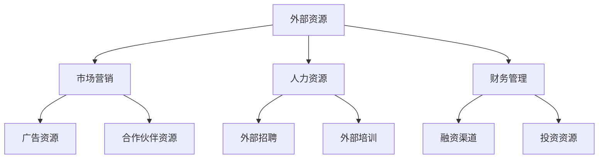
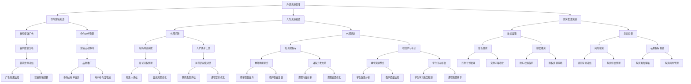

                 

### 《利用外部资源提高一人公司运营效率》

关键词：一人公司、外部资源、运营效率、市场营销、人力资源、财务管理

摘要：
本文旨在探讨如何利用外部资源来提高一人公司的运营效率。在外部资源的选择、评估、整合和管理过程中，通过一系列的逻辑分析和实际案例分析，本文将揭示外部资源在不同领域的应用策略，并提供具体的技术方法和实战经验，帮助读者深入了解并运用这些策略，从而提升一人公司的整体运营水平。

### 《利用外部资源提高一人公司运营效率》目录大纲

#### 第一部分：外部资源的概述与应用

##### 第1章：外部资源的定义与类型

###### 1.1 外部资源的概念与意义
###### 1.2 外部资源的分类
###### 1.3 外部资源在个人企业运营中的作用

##### 第2章：外部资源的选择与评估

###### 2.1 外部资源的评估方法
###### 2.2 外部资源的筛选与选择策略

##### 第3章：外部资源的管理与整合

###### 3.1 外部资源的整合方法
###### 3.2 外部资源的持续管理策略

#### 第二部分：外部资源在不同领域的应用

##### 第4章：市场营销中的外部资源应用

###### 4.1 市场营销资源的选择
###### 4.2 市场营销资源的整合与应用

##### 第5章：人力资源的外部资源利用

###### 5.1 外部招聘与培训资源的利用
###### 5.2 外部人力资源管理的策略

##### 第6章：财务管理中的外部资源

###### 6.1 财务资源的选择与评估
###### 6.2 财务资源的整合与应用策略

#### 第三部分：实战案例与策略

##### 第7章：一人公司的运营案例分析

###### 7.1 案例一：市场营销资源的应用
###### 7.2 案例二：人力资源外部资源的利用

##### 第8章：外部资源利用的策略与未来展望

###### 8.1 外部资源利用的挑战与机遇
###### 8.2 未来外部资源利用的发展趋势与策略建议

#### 附录

##### 附录 A：常用外部资源平台介绍

###### A.1 市场营销资源平台
###### A.2 人力资源资源平台
###### A.3 财务资源平台

##### 附录 B：外部资源利用工具与技巧

###### B.1 数据分析工具
###### B.2 项目管理工具
###### B.3 社交媒体营销工具

##### 核心概念与联系 Mermaid 流程图


##### 核心算法原理讲解伪代码

```python
# 伪代码：外部资源评估方法
def evaluate_resource(resource):
    # 计算成本效益
    cost_benefit = calculate_cost_benefit(resource)

    # 进行风险评估
    risk_score = assess_risk(resource)

    # 返回评估结果
    return cost_benefit, risk_score

# 伪代码：外部资源整合方法
def integrate_resources(resources):
    # 选择整合平台
    platform = select_integration_platform(resources)

    # 优化整合流程
    optimized_process = optimize_integration_process(platform, resources)

    # 返回整合后的资源
    return optimized_process
```

##### 数学模型和数学公式详细讲解

- 成本效益分析公式：

$$
成本效益 = \frac{效益}{成本}
$$

- 风险评估公式：

$$
风险得分 = \sum_{i=1}^{n} (风险因素_i \times 评估权重_i)
$$

#### 第1章：外部资源的定义与类型

##### 1.1 外部资源的概念与意义

外部资源，指的是个人或企业在自身资源限制下，通过外部渠道获取的能够用于提高运营效率的各种资源和工具。这些资源可能包括但不限于市场营销资源、人力资源、财务资源等。在外部资源的管理与利用中，个人或企业能够有效地弥补自身资源的不足，从而在有限的条件下实现更高的运营效益。

对于一人公司，特别是那些资源有限且需要高效运营的企业来说，外部资源的作用显得尤为重要。通过有效地利用外部资源，一人公司可以：

- **降低成本**：通过外包某些服务，如市场营销、财务咨询等，企业可以减少自身的运营成本。
- **提高效率**：借助外部资源和工具，如营销自动化软件、数据分析工具等，企业能够更高效地完成各项工作任务。
- **扩大业务范围**：通过合作和资源整合，企业可以进入新的市场领域，拓展业务范围。

##### 1.2 外部资源的分类

外部资源的分类可以根据其应用领域和功能进行划分。以下是一些常见的外部资源类型：

- **市场营销资源**：包括广告资源、社交媒体资源、合作伙伴资源等，用于提升品牌知名度和吸引潜在客户。
- **人力资源资源**：包括外部招聘渠道、培训资源、人才库等，用于确保企业能够获得所需的专业技能和人才。
- **财务资源**：包括融资渠道、投资资源、财务咨询服务等，用于帮助企业进行资金管理和投资决策。
- **技术资源**：包括软件开发工具、云计算服务、大数据分析平台等，用于提升企业的技术能力和创新能力。

##### 1.3 外部资源在个人企业运营中的作用

外部资源在个人企业运营中扮演着至关重要的角色，以下是外部资源在各个运营环节中的具体作用：

- **市场营销**：通过利用广告资源、社交媒体资源和合作伙伴资源，企业可以有效地进行市场营销活动，提高品牌曝光度和市场份额。
- **人力资源**：通过使用外部招聘渠道和培训资源，企业可以快速获取所需的专业人才，并通过人才库保持人力资源的稳定性。
- **财务管理**：通过利用融资渠道和投资资源，企业可以优化资金结构，提高资金利用效率，同时借助财务咨询服务进行合理的财务规划。
- **技术创新**：通过使用技术资源，如软件开发工具和云计算服务，企业可以提升技术能力，加速产品开发和市场投放。

综上所述，外部资源对于一人公司而言，不仅是弥补自身资源不足的重要手段，更是提升运营效率和实现业务增长的关键因素。在接下来的章节中，我们将深入探讨如何选择、评估、整合和管理这些外部资源。

#### 第2章：外部资源的选择与评估

选择和评估外部资源是提高一人公司运营效率的关键步骤。在这一部分，我们将详细讨论如何选择外部资源，以及如何对其进行评估，确保所选择的资源能够真正满足企业的需求，并在使用过程中实现预期的效益。

##### 2.1 外部资源的评估方法

评估外部资源的过程需要综合考虑多个方面，以下是一些常见的评估方法：

###### 2.1.1 成本效益分析

成本效益分析是一种评估外部资源成本与预期效益之间关系的方法。在进行成本效益分析时，企业需要计算资源的总成本和预期效益，然后计算成本效益比（Cost-Benefit Ratio, CBR）：

$$
成本效益比 = \frac{效益}{成本}
$$

如果成本效益比大于1，则表明资源的使用是经济的，反之则表明资源的使用可能不够划算。例如，企业考虑使用某营销自动化工具，其年成本为10000元，但预计可以节省30000元的营销费用，那么成本效益比为3，这是一个值得投资的选择。

###### 2.1.2 风险评估与防范

风险评估是评估外部资源使用过程中可能遇到的风险，并制定相应的防范措施。常见的风险评估方法包括定性分析和定量分析：

- **定性分析**：通过专家评估或情景分析，对风险进行定性描述，如“高风险”、“中风险”、“低风险”。
- **定量分析**：使用数学模型或统计方法，对风险的概率和影响进行量化分析。

例如，企业考虑使用某第三方支付服务，通过定量分析，发现该服务的年故障概率为0.1%，每次故障可能造成的损失为5000元，那么年期望损失为500元。如果这个风险水平在企业可接受范围内，则可以使用该服务。

###### 2.1.3 适应性评估

适应性评估是指评估外部资源是否能够适应企业的业务流程、技术架构和文化环境。一个高度适应的外部资源可以减少整合成本和操作难度，提高使用效率。评估方法包括：

- **业务流程适配性评估**：检查外部资源是否能够无缝集成到企业的业务流程中，如是否支持API接口、是否需要额外的操作培训等。
- **技术架构适配性评估**：检查外部资源是否与企业现有的技术架构兼容，如是否支持所需的编程语言、数据库等。
- **文化环境适配性评估**：检查外部资源是否符合企业的文化价值观，如是否支持企业的隐私政策、是否能够尊重企业文化等。

##### 2.2 外部资源的筛选与选择策略

在评估外部资源后，企业需要根据评估结果进行筛选，选择最符合需求的外部资源。以下是一些筛选与选择策略：

###### 2.2.1 明确需求

在选择外部资源之前，企业需要明确自身的需求，包括业务需求、技术需求、成本预算等。例如，如果企业需要提升市场营销效果，可能需要选择具有强大数据分析功能的营销自动化工具。

###### 2.2.2 比较选项

在明确需求后，企业需要比较不同外部资源的优缺点，选择最符合需求的那一个。比较方法包括：

- **功能比较**：比较不同资源提供的功能，选择功能全面、能够满足企业需求的外部资源。
- **性能比较**：比较不同资源的性能指标，如处理速度、响应时间等，选择性能更优的资源。
- **成本比较**：比较不同资源的成本，包括直接成本和潜在成本，如维护费用、集成成本等。

###### 2.2.3 咨询专家

在筛选和选择外部资源时，企业可以咨询行业专家或同行，获取他们的意见和建议。专家的意见可以帮助企业更好地了解外部资源的真实情况，从而做出更明智的决策。

###### 2.2.4 实地考察

对于一些关键性的外部资源，企业可以考虑进行实地考察，如参观供应商的办公环境、了解其团队构成和技术实力等。实地考察可以更直观地了解外部资源的能力和可靠性。

通过以上策略，企业可以有效地选择和评估外部资源，确保所选择的资源能够真正提升企业的运营效率，实现预期的效益。

##### 2.3 外部资源的整合方法

外部资源的整合是将多个外部资源有机地结合起来，使其在企业运营中发挥最大效益的过程。以下是一些常见的整合方法：

###### 2.3.1 平台整合

平台整合是指通过搭建一个统一的技术平台，将不同外部资源整合到该平台中，实现资源的统一管理和调度。例如，企业可以使用CRM（客户关系管理）系统来整合市场营销资源、人力资源资源和财务资源，实现数据的统一存储和操作。

平台整合的优点包括：

- **提高效率**：通过统一平台，企业可以减少重复操作，提高工作效率。
- **降低成本**：统一平台可以减少维护成本，提高资源利用率。
- **数据整合**：统一平台可以实现数据的整合和分析，为企业提供更全面的决策支持。

###### 2.3.2 流程整合

流程整合是指将外部资源与企业的业务流程相结合，确保资源的使用能够优化业务流程，提高运营效率。例如，企业可以将外部招聘资源与人力资源管理系统整合，实现招聘流程的自动化和智能化。

流程整合的优点包括：

- **提高流程效率**：通过整合外部资源，企业可以优化业务流程，提高工作流程的效率。
- **降低流程成本**：自动化和智能化的流程可以减少人工操作，降低流程成本。
- **提高数据准确性**：通过整合外部资源和流程，企业可以确保数据的准确性和一致性，提高业务决策的准确性。

###### 2.3.3 技术整合

技术整合是指将不同技术资源整合到企业现有的技术架构中，实现技术的协同作用，提高企业的技术能力和创新能力。例如，企业可以将云计算服务和大数据分析平台整合到其技术架构中，实现数据的实时处理和分析。

技术整合的优点包括：

- **提高技术能力**：通过整合外部技术资源，企业可以提升自身的技术能力，跟上行业的发展趋势。
- **加速创新**：整合外部技术资源可以为企业提供更多的技术选择，促进创新和业务模式的变革。

综上所述，通过平台整合、流程整合和技术整合，企业可以有效地整合外部资源，提升运营效率，实现企业的长期发展。

##### 2.4 外部资源的持续管理策略

外部资源的持续管理是确保资源使用效率的关键。以下是一些常见的外部资源持续管理策略：

###### 2.4.1 定期评估

定期评估是指定期对外部资源的使用效果进行评估，以确保资源的使用仍然符合企业的需求和预期。评估内容可以包括资源的成本效益、适应性、性能等方面。例如，企业可以每年对使用的营销自动化工具进行一次评估，检查其是否仍然满足企业的营销需求。

###### 2.4.2 持续优化

持续优化是指通过不断地调整和改进外部资源的使用方式，提高资源的利用效率。例如，企业可以通过数据分析，发现营销自动化工具的使用瓶颈，并进行相应的优化，以提高其工作效率。

###### 2.4.3 灵活调整

灵活调整是指根据企业的业务变化和需求，及时调整外部资源的使用策略。例如，当企业需要扩大市场份额时，可以增加广告投放资源；当企业需要提升内部员工能力时，可以增加培训资源。

通过定期评估、持续优化和灵活调整，企业可以确保外部资源始终处于最佳状态，最大限度地发挥其价值，提高企业的运营效率。

#### 第3章：外部资源的管理与整合

外部资源的管理与整合是提高一人公司运营效率的重要环节。在这一部分，我们将详细讨论外部资源的管理方法和整合策略，以及如何确保这些资源在实际应用中的高效运行。

##### 3.1 外部资源的整合方法

外部资源的整合是将不同类型的外部资源有机地结合在一起，形成协同效应，从而提高整体运营效率。以下是几种常见的外部资源整合方法：

###### 3.1.1 技术整合

技术整合是指通过技术手段将外部资源整合到企业的技术架构中，实现资源的无缝连接和协同工作。技术整合可以采用以下几种方法：

- **API接口**：通过API（应用程序接口）将外部资源与企业系统连接，实现数据的实时交换和操作。例如，企业可以将市场营销资源与CRM系统整合，通过API实时更新客户数据。
- **数据仓库**：建立统一的数据仓库，将外部资源产生的数据进行存储和管理，为企业提供全面的数据支持。例如，企业可以将社交媒体数据、广告投放数据等整合到数据仓库中，进行数据分析。
- **云计算服务**：利用云计算服务，将外部资源部署到云端，实现资源的弹性扩展和高效管理。例如，企业可以使用云计算平台提供的数据库服务、数据分析服务等，提高数据处理能力。

###### 3.1.2 业务流程整合

业务流程整合是指将外部资源整合到企业的业务流程中，优化业务流程，提高运营效率。业务流程整合可以采用以下几种方法：

- **自动化流程**：通过自动化工具和系统，将外部资源整合到业务流程中，实现业务操作的自动化和智能化。例如，企业可以使用营销自动化工具，自动进行客户跟进、邮件发送等操作。
- **业务流程管理**：建立统一的业务流程管理体系，对外部资源进行统一管理和调度。例如，企业可以采用ERP（企业资源规划）系统，实现市场营销、人力资源、财务管理等业务的统一管理。
- **流程优化**：通过分析业务流程，发现流程中的瓶颈和低效环节，并利用外部资源进行优化。例如，企业可以通过引入项目管理工具，优化项目管理流程，提高项目执行效率。

###### 3.1.3 人员整合

人员整合是指将外部资源与企业的内部人员整合在一起，形成高效的工作团队。人员整合可以采用以下几种方法：

- **外部顾问**：聘请外部顾问，为企业提供专业指导和支持。例如，企业可以聘请市场营销顾问，帮助企业制定有效的营销策略。
- **外部培训**：组织外部培训，提高内部人员的能力和技能。例如，企业可以安排员工参加行业会议、培训课程等，学习最新的技术和知识。
- **团队协作**：建立高效的团队协作机制，促进内部人员与外部资源的协同工作。例如，企业可以采用协作工具，如Slack、Trello等，实现团队成员之间的即时沟通和协作。

##### 3.2 外部资源的持续管理策略

外部资源的持续管理是确保资源长期有效利用的关键。以下是几种常见的外部资源持续管理策略：

###### 3.2.1 定期评估

定期评估是指定期对外部资源的使用效果进行评估，以确保资源的使用仍然符合企业的需求和预期。定期评估可以采用以下几种方法：

- **关键指标评估**：根据企业的关键指标，如成本效益比、客户满意度、业务增长率等，评估外部资源的使用效果。例如，企业可以通过分析营销自动化工具的使用效果，评估其是否提高了营销效率和客户满意度。
- **用户反馈评估**：收集用户的反馈意见，了解外部资源在实际使用中的问题和改进方向。例如，企业可以通过用户调研、在线反馈等方式，了解员工对培训资源的满意度，并根据反馈进行调整。
- **专家评估**：邀请行业专家进行外部资源评估，提供专业的意见和建议。例如，企业可以邀请市场营销专家对营销资源进行评估，提供优化建议。

###### 3.2.2 持续优化

持续优化是指通过不断地调整和改进外部资源的使用方式，提高资源的利用效率。持续优化可以采用以下几种方法：

- **数据分析**：通过数据分析，发现外部资源使用中的问题和瓶颈，并提出改进措施。例如，企业可以通过分析营销数据，发现广告投放效果不佳的原因，并提出相应的优化方案。
- **技术升级**：根据技术的发展趋势，及时升级外部资源，提高其性能和功能。例如，企业可以采用最新的营销自动化工具，以提高营销效率。
- **流程改进**：根据业务流程的变化和需求，对外部资源进行改进和优化。例如，企业可以调整人力资源管理流程，以提高招聘和培训效率。

###### 3.2.3 灵活调整

灵活调整是指根据企业的业务变化和需求，及时调整外部资源的使用策略。灵活调整可以采用以下几种方法：

- **资源调配**：根据业务需求，灵活调配外部资源，确保资源的最优利用。例如，企业可以在业务高峰期增加市场营销资源，在业务低谷期减少营销投入。
- **多元化策略**：采用多元化的外部资源策略，提高企业的灵活性和抗风险能力。例如，企业可以同时使用多个广告平台，以分散风险。
- **快速响应**：建立快速响应机制，及时响应外部资源的变化和需求。例如，企业可以建立应急响应团队，快速应对市场变化和业务需求。

通过定期评估、持续优化和灵活调整，企业可以确保外部资源始终处于最佳状态，最大限度地发挥其价值，提高企业的运营效率。

#### 第4章：市场营销中的外部资源应用

在市场营销领域，外部资源的有效利用可以显著提升营销效果，降低营销成本，并为企业带来更高的市场竞争力。本章节将深入探讨如何选择和应用外部市场营销资源，以及如何整合这些资源以最大化其价值。

##### 4.1 市场营销资源的选择

选择合适的市场营销资源是企业成功开展市场营销活动的基础。以下是一些关键步骤和方法：

###### 4.1.1 广告资源

广告资源是市场营销中常用的外部资源之一，选择合适的广告平台和广告形式对企业营销策略至关重要。

- **广告平台选择**：企业可以根据目标受众的分布和广告投放的成本效益选择合适的广告平台，如Google Ads、Facebook Ads、微博、抖音等。
- **广告形式选择**：根据营销目标和广告预算，企业可以选择不同的广告形式，如文本广告、图片广告、视频广告、展示广告等。
- **成本效益分析**：在进行广告资源选择时，企业需要综合考虑广告投放的成本和预期效益，选择性价比最高的广告平台和广告形式。

例如，一家专注于高端手表定制的小型企业，在选择广告资源时，可能会选择Facebook Ads作为主要广告平台，因为Facebook用户群体广泛，且广告投放精准度高。同时，考虑到广告预算，企业可能会选择视频广告形式，以吸引潜在客户，提升品牌知名度。

###### 4.1.2 合作伙伴资源

合作伙伴资源是指企业通过与外部合作伙伴建立合作关系，共同开展市场营销活动，以实现资源互补和效益最大化。

- **合作伙伴选择**：企业需要根据市场营销目标、品牌形象和合作伙伴的专业能力选择合适的合作伙伴，如营销公司、广告代理、公关公司等。
- **合作形式**：企业可以选择与合作伙伴进行长期战略合作，或根据特定营销活动进行短期合作。长期合作有助于建立稳定的合作关系，短期合作则可以灵活应对市场变化。
- **合作效果评估**：通过定期评估合作效果，企业可以调整合作策略，确保合作伙伴资源的有效利用。

例如，一家电子商务企业可能会与知名的物流公司建立长期合作，确保物流服务的稳定性和效率，同时通过合作伙伴的渠道提升品牌形象和市场影响力。

##### 4.2 市场营销资源的整合与应用

整合外部市场营销资源，使它们协同工作，可以显著提高营销活动的效果。以下是一些关键步骤和方法：

###### 4.2.1 整合平台的选择

整合平台是企业管理和协调各种市场营销资源的关键工具。选择合适的整合平台，可以简化管理流程，提高工作效率。

- **平台功能**：企业需要选择具备丰富功能的市场营销整合平台，如客户关系管理（CRM）系统、营销自动化工具、数据分析平台等。
- **集成能力**：整合平台需要具备良好的集成能力，能够无缝连接各种外部资源，如社交媒体、广告平台、电商平台等。
- **用户界面**：选择界面友好、操作简便的整合平台，可以提高员工的使用体验，减少学习成本。

例如，企业可以选择Salesforce作为其市场营销整合平台，因为它提供了全面的营销功能，包括客户管理、营销自动化、数据分析等，且具有强大的集成能力。

###### 4.2.2 整合流程的优化

优化整合流程是确保市场营销资源高效运行的关键。以下是一些优化策略：

- **标准化流程**：制定标准化的市场营销流程，确保所有营销活动按照统一的标准进行，提高效率和一致性。
- **自动化流程**：利用营销自动化工具，自动化重复性高、标准化程度高的营销活动，减少人工操作，提高效率。
- **实时监控**：通过实时监控工具，监控营销活动的执行情况，及时发现和解决问题。

例如，企业可以通过营销自动化工具自动发送跟进邮件、安排广告投放等，同时使用数据分析工具实时监控广告效果，根据数据反馈进行优化。

###### 4.2.3 应用策略

在整合外部市场营销资源后，企业需要制定具体的营销策略，确保资源的最大化利用。

- **数据驱动**：基于数据分析，制定针对性的营销策略，如目标受众定位、广告投放优化、内容营销等。
- **协同营销**：与合作伙伴协同工作，共同开展营销活动，提高整体营销效果。
- **持续优化**：根据市场反馈和数据分析，持续优化营销策略和资源利用方式，确保营销活动的持续成功。

例如，企业可以根据客户行为数据，调整广告投放策略，优化内容营销，同时与合作伙伴合作，举办线上促销活动，提高客户参与度和购买意愿。

通过选择合适的广告资源和合作伙伴资源，以及优化整合平台和应用策略，企业可以在市场营销中有效地利用外部资源，提高营销效果，实现业务增长。

#### 第5章：人力资源的外部资源利用

在人力资源管理中，外部资源的利用是提升员工招聘、培训和管理效率的重要手段。通过有效地整合和利用外部人力资源资源，企业可以降低招聘成本，提高员工素质，增强企业竞争力。以下是针对人力资源管理中外部资源利用的具体策略：

##### 5.1 外部招聘与培训资源的利用

外部招聘和培训资源是企业获取高素质人才和提升员工技能的关键途径。以下是一些常见的外部招聘和培训资源，以及如何利用这些资源：

###### 5.1.1 外部招聘渠道的选择

外部招聘渠道包括招聘网站、社交媒体、招聘会、猎头公司等。企业需要根据自身需求和预算，选择合适的招聘渠道：

- **招聘网站**：如智联招聘、前程无忧等，适合快速发布招聘信息，覆盖广泛的求职者群体。
- **社交媒体**：如LinkedIn、微信、微博等，适用于精准招聘，能够通过社交关系网络发现潜在人才。
- **招聘会**：适合面对面的交流，能够快速筛选和评估候选人。
- **猎头公司**：适合招聘高端人才，但费用较高。

利用策略：

- **多渠道并进**：企业可以同时使用多个招聘渠道，提高招聘成功率。
- **精准定位**：根据职位要求和目标群体，选择合适的招聘渠道。
- **信息优化**：在招聘网站和社交媒体上发布详细的职位描述，吸引合适的求职者。

###### 5.1.2 外部培训资源的选择

外部培训资源包括在线课程、线下培训、专业培训机构等。企业应根据培训需求、员工能力和预算选择合适的培训资源：

- **在线课程**：如Coursera、Udemy等，适合自主学习和时间灵活的员工。
- **线下培训**：如行业会议、专业培训课程等，适合系统学习和提升专业技能的员工。
- **专业培训机构**：如职业技能培训机构、职业发展中心等，提供专业的培训课程和认证。

利用策略：

- **个性化培训**：根据员工的岗位特点和成长需求，制定个性化的培训计划。
- **系统集成**：将外部培训资源与企业内部培训相结合，形成完整的培训体系。
- **效果评估**：通过培训前后的评估，了解培训效果，持续优化培训策略。

##### 5.2 外部人力资源管理的策略

外部人力资源管理的策略不仅包括招聘和培训，还涉及员工关系管理、绩效评估等方面。以下是几种有效的外部人力资源管理策略：

###### 5.2.1 员工关系管理

员工关系管理是通过外部资源和工具，建立和维护良好的员工关系，提高员工满意度和忠诚度。以下是一些策略：

- **员工满意度调查**：利用第三方调查工具，定期进行员工满意度调查，了解员工的意见和建议，及时解决存在的问题。
- **员工关怀**：通过外部资源，如心理咨询、健康体检等，关心员工的身心健康，提高员工幸福感。
- **员工参与**：利用外部咨询公司，组织员工参与企业决策，提高员工的参与感和归属感。

###### 5.2.2 绩效评估

绩效评估是通过外部资源和工具，对员工的工作表现进行科学、公正的评估。以下是一些策略：

- **360度评估**：利用第三方评估平台，进行360度评估，综合评估员工的绩效表现。
- **KPI设定**：根据岗位要求和企业目标，设定明确的KPI（关键绩效指标），为员工提供明确的绩效目标。
- **反馈与改进**：通过绩效反馈，与员工共同分析绩效结果，制定改进计划，促进员工成长。

###### 5.2.3 人力资源外包

人力资源外包是将部分人力资源管理职能外包给专业的人力资源服务公司，以降低成本，提高管理效率。以下是一些策略：

- **业务外包**：如招聘外包、薪酬外包等，将人力资源的具体业务外包给专业公司。
- **咨询外包**：如绩效管理咨询、员工关系咨询等，通过外部专业咨询公司的服务，提升人力资源管理水平。
- **技术外包**：如人才测评技术、数据分析工具等，利用外部技术资源，提升人力资源管理的科学性和准确性。

通过有效利用外部人力资源资源，企业可以实现以下目标：

- **降低招聘和培训成本**：通过外部招聘和培训资源，降低招聘和培训的成本。
- **提高员工素质**：通过外部培训和人才引进，提高员工的素质和技能水平。
- **提升管理效率**：通过外部人力资源管理和咨询，提升企业的人力资源管理水平。

综上所述，外部人力资源资源的利用是提高企业人力资源管理效率和员工满意度的关键。通过合理选择和使用外部招聘、培训和人力资源管理资源，企业可以优化人力资源配置，提升整体运营效率。

#### 第6章：财务管理中的外部资源

财务管理是企业运营的重要组成部分，合理利用外部财务资源可以提升企业的财务管理水平，优化资金结构，降低财务风险。以下将详细探讨财务管理中的外部资源选择、评估及整合策略。

##### 6.1 财务资源的选择与评估

选择和评估外部财务资源是确保财务资源能够满足企业需求、提升财务管理效率的关键步骤。

###### 6.1.1 融资渠道的选择

融资渠道是获取外部资金的重要途径，企业需要根据自身资金需求、成本预算和风险承受能力选择合适的融资渠道：

- **银行贷款**：适用于资金需求较大、还款能力较强的企业。企业可以通过申请长期贷款或短期贷款满足运营资金需求。
- **股权融资**：适用于需要大量资金且愿意出让部分股权的企业。企业可以通过引入战略投资者或上市融资来获取资金。
- **债务融资**：适用于有稳定现金流和还款能力的企业。企业可以通过发行公司债券、商业票据等方式获取低成本资金。

评估策略：

- **成本效益分析**：综合考虑融资成本、利率、还款期限等因素，计算融资成本效益，选择成本最低、风险最小的融资渠道。
- **风险评估**：评估融资过程中可能遇到的风险，如利率风险、信用风险、市场风险等，选择风险可控的融资渠道。

例如，一家成长型科技企业可能更倾向于选择银行贷款，因为其有较强的还款能力和较稳定的现金流；而一家初创公司可能更倾向于股权融资，以获取发展所需的资金。

###### 6.1.2 投资资源的选择

投资资源是指企业用于投资的资金来源，选择合适的投资资源可以帮助企业实现资金增值，提高投资回报率：

- **风险投资**：适用于高风险、高回报的创业企业。企业可以通过吸引风险投资，获得资金支持和技术指导。
- **私募股权投资**：适用于有潜力的成长型企业。企业可以通过私募股权投资，获得长期资金支持和战略资源。
- **资本市场投资**：适用于有稳定现金流和投资能力的企业。企业可以通过股票市场、债券市场等资本市场进行投资。

评估策略：

- **投资效益分析**：评估不同投资资源的预期回报率和风险，选择效益最高、风险最低的投资资源。
- **市场调研**：了解市场环境和竞争对手的投资策略，选择具有市场前景和投资价值的项目。

例如，一家互联网初创企业可能会选择风险投资，以获取快速发展所需的资金和资源；而一家成熟的传统企业可能会选择资本市场投资，以获得稳定的投资回报。

##### 6.2 财务资源的整合与应用策略

整合和应用外部财务资源可以提升企业的财务管理水平和资金利用效率。

###### 6.2.1 资金整合

资金整合是指将不同来源的资金进行统筹管理，优化资金结构，提高资金使用效率。以下是一些资金整合策略：

- **资金池**：建立企业资金池，将各个部门和项目的资金集中管理，实现资金的高效调配和利用。
- **资金调度**：根据企业的资金需求和市场环境，灵活调度资金，确保资金充足且使用高效。
- **资金预算**：制定详细的资金预算计划，合理分配资金，确保各个部门和项目的资金需求得到满足。

例如，企业可以将运营资金、投资资金和备用资金分别管理，确保运营资金用于日常运营，投资资金用于投资和项目开发，备用资金用于应急情况。

###### 6.2.2 资金应用策略

资金应用策略是指如何合理使用外部财务资源，以实现企业的财务目标和发展规划。以下是一些资金应用策略：

- **投资优先级**：根据企业的战略目标和投资效益，确定投资优先级，优先投资回报率高的项目和领域。
- **风险控制**：建立风险控制机制，对投资项目进行风险评估和监控，确保资金安全。
- **效益最大化**：通过财务分析和优化，提高资金利用效率，实现资金的最大化收益。

例如，企业可以将资金优先投资于技术研发和市场份额扩张，因为这些领域具有较高的投资回报率和市场潜力。

###### 6.2.3 财务资源整合平台

财务资源整合平台是指通过信息技术手段，将企业内部的财务资源和外部财务资源进行整合和管理。以下是一些财务资源整合平台：

- **ERP系统**：企业资源规划系统，可以实现企业内部财务管理、供应链管理、人力资源管理等功能的整合。
- **财务共享中心**：将企业内部的财务业务集中管理，提高财务工作效率和准确性。
- **在线财务平台**：提供在线融资、投资、支付等金融服务，帮助企业实现财务资源的快速调配和利用。

例如，企业可以通过ERP系统整合财务资源和业务流程，实现财务数据的实时共享和自动化处理，提高财务管理效率。

通过选择和评估外部财务资源，整合和应用财务资源，企业可以优化财务管理，提高资金利用效率，实现财务目标和企业发展目标。

### 第7章：一人公司的运营案例分析

在探讨如何利用外部资源提高一人公司运营效率的过程中，实际案例分析能够为读者提供具体的操作指导和经验借鉴。本章节将通过两个典型案例，详细描述市场营销和人力资源外部资源的利用情况。

#### 7.1 案例一：市场营销资源的应用

案例背景：
小明是一名独立创业的软件开发者，专注于开发创新的应用程序。由于个人资源和时间的限制，他需要通过外部资源来提高市场营销效果，吸引更多用户和潜在客户。

**案例分析：**

1. **需求分析**：小明分析了目标市场，确定了需要提升品牌曝光度和用户获取效率。他明确了主要目标用户群体是年轻人和中小企业，以及需要提高产品的市场认知度和用户忠诚度。

2. **资源评估**：小明评估了可用的市场营销资源，包括社交媒体广告、合作伙伴资源、内容营销等。他发现通过社交媒体广告和合作伙伴资源可以更精准地触达目标用户。

3. **市场营销资源整合**：
   - **社交媒体广告**：小明选择了Facebook和Instagram等平台进行广告投放，通过精准定位和广告创意提升广告效果。
   - **合作伙伴资源**：与小明合作的软件开发社区和科技公司合作，通过合作推广和互惠营销提升品牌影响力。
   - **内容营销**：创建高质量的应用程序评测、使用指南和博客文章，吸引目标用户访问和分享。

4. **实施与监控**：
   - **广告投放**：小明设置了广告预算和优化策略，通过实时监控广告效果，不断调整广告内容和投放时间。
   - **合作推广**：与合作伙伴共同策划线上活动和营销内容，确保活动的高参与度和用户互动。

5. **效果评估**：
   - **数据监测**：通过分析广告投放数据和用户行为数据，评估广告效果和用户获取情况。
   - **反馈调整**：根据用户反馈和数据分析结果，调整营销策略，优化内容质量和广告投放。

**案例分析结果**：
通过整合和应用市场营销资源，小明的品牌知名度和用户数量显著提升。广告投放和合作推广带来了大量潜在客户，内容营销提高了用户的粘性和忠诚度。小明成功实现了市场营销目标，提高了产品的市场占有率。

#### 7.2 案例二：人力资源外部资源的利用

案例背景：
小李是一名独立运营的在线教育平台创始人，她需要高效地招聘和培训教师资源，以满足平台不断增长的教育需求。

**案例分析：**

1. **需求分析**：小李分析了平台的发展规划和课程需求，确定了需要招聘具有丰富教学经验和课程开发能力的教师。她明确了目标教师群体是具备教育背景的专业人士和有教学热情的志愿者。

2. **资源评估**：小李评估了可用的外部人力资源资源，包括在线招聘平台、社交媒体招聘、人才推荐等。她发现通过在线招聘平台和社交媒体招聘可以快速吸引到合适的教师。

3. **人力资源资源整合**：
   - **在线招聘平台**：小李在智联招聘、BOSS直聘等平台发布招聘信息，通过精准定位和丰富的工作描述吸引合适的教师。
   - **社交媒体招聘**：通过LinkedIn、微信等社交媒体发布招聘信息，利用社交网络传播，提高招聘效率。
   - **人才推荐**：通过与教育行业专业人士建立联系，利用他们的推荐和推荐机制，快速筛选到合适的教师。

4. **实施与监控**：
   - **招聘流程**：小李建立了标准化的招聘流程，包括职位发布、简历筛选、面试评估等，确保招聘过程的透明和高效。
   - **培训资源**：小李与专业的培训机构合作，为教师提供专业的培训课程，确保教师具备所需的教学技能和知识。

5. **效果评估**：
   - **招聘效果**：通过分析招聘数据和教师入职后的表现，评估招聘渠道的有效性和招聘效率。
   - **培训效果**：通过教师的教学反馈和学生评价，评估培训课程的质量和效果。

**案例分析结果**：
通过整合和应用人力资源外部资源，小李成功招聘到了一批高素质的教师，并为他们提供了专业的培训。教师资源的提升不仅提高了课程质量，也吸引了更多学生报名，平台的教育服务得到了市场的认可和好评。

通过这两个案例，可以看出外部资源的合理利用对于一人公司的运营至关重要。无论是在市场营销还是人力资源管理方面，通过科学选择、有效整合和应用外部资源，企业可以提升运营效率，实现业务增长。

### 第8章：外部资源利用的策略与未来展望

在当前快速变化的市场环境中，外部资源的有效利用成为一人公司提升运营效率、实现可持续发展的关键。本章节将总结外部资源利用的策略，并探讨未来外部资源利用的发展趋势和应对策略。

#### 8.1 外部资源利用的挑战与机遇

外部资源的利用并非一帆风顺，企业在实际操作中面临着诸多挑战和机遇。

**挑战：**

1. **资源成本**：外部资源往往伴随着一定的成本，如广告费用、培训费用等。企业需要权衡资源的成本与效益，确保资源的投入能够带来相应的回报。
2. **资源整合**：不同类型的外部资源可能存在兼容性问题，整合和管理这些资源需要耗费大量时间和精力。
3. **市场变化**：市场环境瞬息万变，外部资源的使用策略需要灵活调整，以适应市场的变化。

**机遇：**

1. **技术进步**：随着技术的快速发展，新的外部资源不断涌现，如人工智能、大数据分析等，为企业提供了更多的选择和优化空间。
2. **合作伙伴**：通过与外部合作伙伴建立合作关系，企业可以获得更丰富的资源和专业知识，共同开拓市场。
3. **市场拓展**：利用外部资源，企业可以更快速地进入新市场，拓展业务范围，实现规模效应。

#### 8.2 外部资源利用的策略

为了充分发挥外部资源的作用，企业需要制定系统化的外部资源利用策略，包括以下方面：

1. **明确需求**：企业需要明确自身的需求，包括市场拓展、技术创新、人力资源管理等方面，以确保外部资源的选择和应用能够满足企业的发展目标。
2. **资源评估**：对企业现有和潜在的外部资源进行详细评估，包括成本效益、风险适应性、技术兼容性等，确保资源的有效性和适用性。
3. **整合管理**：建立外部资源的整合和管理体系，通过技术手段和流程优化，实现资源的高效配置和协同工作。
4. **持续优化**：根据外部资源的实际应用效果和市场反馈，持续优化资源利用策略，确保资源的最大化效益。

#### 8.3 未来外部资源利用的发展趋势与策略建议

随着市场环境的不断变化和技术的不断进步，未来外部资源利用将呈现出以下趋势：

1. **智能化与自动化**：人工智能和大数据分析技术的应用将使外部资源的利用更加智能化和自动化，提高资源管理的效率和准确性。
2. **云端服务**：云计算服务的普及将使企业能够更灵活地获取和处理外部资源，降低资源获取和维护的成本。
3. **生态合作**：企业将更加注重与外部合作伙伴建立长期、稳定的合作关系，形成资源共享和协同发展的生态圈。

基于以上趋势，以下是未来外部资源利用的策略建议：

1. **技术创新**：持续关注和引入最新的技术资源，如人工智能、区块链等，提升企业的技术能力和创新能力。
2. **生态建设**：积极参与外部生态圈的建设，与合作伙伴共同开发和应用外部资源，实现共赢发展。
3. **人才培养**：加强内部人才培养，提高员工的技术素养和管理能力，以适应外部资源利用的需求。
4. **灵活调整**：保持对外部市场环境的敏感度，灵活调整资源利用策略，以应对市场变化和业务需求。

通过制定科学的策略和积极应对外部资源利用的挑战，企业可以不断提升运营效率，实现可持续发展。

#### 附录A：常用外部资源平台介绍

**A.1 市场营销资源平台**

1. **谷歌广告平台（Google Ads）**：提供广泛的广告投放渠道，包括搜索广告、展示广告、视频广告等。
2. **Facebook广告平台**：支持社交广告投放，精准定位用户群体，提高广告效果。
3. **微信广告平台**：适合中国市场的广告投放，包括公众号广告、小程序广告等。

**A.2 人力资源资源平台**

1. **智联招聘**：提供全面的招聘服务，包括职位发布、简历搜索、招聘管理工具等。
2. **LinkedIn**：全球最大的职业社交平台，适合招聘高素质人才。
3. **BOSS直聘**：专注于求职者和雇主之间的直接沟通，提高招聘效率。

**A.3 财务资源平台**

1. **支付宝**：提供支付、融资、投资等服务，方便企业进行财务管理。
2. **财联社**：提供财经新闻、市场数据、投资分析等服务，帮助企业进行投资决策。
3. **云账户**：提供财务共享服务、财务自动化工具等，提高财务管理效率。

#### 附录B：外部资源利用工具与技巧

**B.1 数据分析工具**

1. **Tableau**：数据可视化工具，帮助企业直观展示和分析数据。
2. **Python**：编程语言，支持数据分析和机器学习，提高数据分析能力。
3. **Google Analytics**：分析网站流量和用户行为，优化市场营销策略。

**B.2 项目管理工具**

1. **Trello**：项目管理工具，帮助团队高效协作，跟踪项目进度。
2. **Asana**：项目管理工具，提供任务分配、进度跟踪、协作沟通等功能。
3. **JIRA**：敏捷开发工具，支持团队协作和软件项目跟踪。

**B.3 社交媒体营销工具**

1. **Hootsuite**：社交媒体管理工具，支持多平台管理、内容策划和数据分析。
2. **Buffer**：社交媒体发布工具，自动安排内容发布时间，提高营销效率。
3. **Instagram Insights**：提供Instagram数据分析，帮助用户了解粉丝行为和广告效果。

### 总结

通过本文的详细探讨，我们明确了外部资源在提高一人公司运营效率中的重要作用。从市场营销、人力资源到财务管理，外部资源的合理利用不仅能降低成本、提高效率，还能帮助企业实现业务增长和市场拓展。未来的发展趋势将更加智能化、自动化，企业需要不断创新和调整策略，以适应外部资源的变化。通过积极利用外部资源，一人公司可以不断提升运营水平，迎接更加广阔的发展机遇。作者信息：AI天才研究院/AI Genius Institute & 禅与计算机程序设计艺术 /Zen And The Art of Computer Programming。

### 附录 C：外部资源利用的方法与技巧

**C.1 数据分析工具**

数据分析工具在外部资源管理中扮演着至关重要的角色，以下是一些常见的数据分析工具及其特点：

1. **Python**：Python是一种广泛使用的编程语言，特别适合数据分析和机器学习。它具有丰富的库和框架，如NumPy、Pandas和Scikit-learn，可以帮助快速处理大量数据，进行数据可视化和预测分析。

2. **R语言**：R语言是统计分析和数据可视化的强大工具，特别适合进行复杂数据分析和图形绘制。R语言拥有大量的包，如ggplot2和dplyr，可以方便地进行数据清洗、分析和可视化。

3. **Excel**：Excel虽然不是专门的数据分析工具，但其强大的数据处理和分析功能使其在小型数据分析和预算控制中非常实用。通过使用Excel的高级功能和插件，如Power Query和Power Pivot，可以大大提高数据分析效率。

**C.2 项目管理工具**

项目管理工具能够帮助企业高效地协调和管理外部资源，以下是一些流行的项目管理工具：

1. **Trello**：Trello是一个直观的看板式项目管理工具，适合小型团队和项目。用户可以通过创建卡片、分配任务和跟踪进度，实现对项目的全面监控。

2. **Asana**：Asana是一个功能强大的项目管理工具，支持任务分配、进度跟踪和协作沟通。用户可以通过Asana创建项目、设置截止日期和任务依赖关系，确保项目按时完成。

3. **JIRA**：JIRA是一个专业的项目管理工具，特别适合软件开发项目。它支持敏捷开发流程，如Scrum和Kanban，并提供详细的报告和仪表板，帮助团队跟踪项目的关键指标。

**C.3 社交媒体营销工具**

社交媒体营销工具能够帮助企业更有效地利用社交媒体资源进行营销活动，以下是一些常用的工具：

1. **Hootsuite**：Hootsuite是一个全面的社交媒体管理工具，允许用户在单个平台上管理多个社交媒体账号。它支持内容策划、发布自动化和社交倾听，帮助提高营销效率。

2. **Buffer**：Buffer是一个内容发布工具，允许用户提前安排社交媒体内容发布，优化发布时间。它还提供了强大的分析功能，帮助用户了解内容的性能和受众行为。

3. **Instagram Insights**：Instagram Insights是Instagram内置的数据分析工具，提供详细的用户行为和广告效果数据。通过这些数据，用户可以了解受众的偏好，优化营销策略。

**C.4 财务管理工具**

财务管理工具能够帮助企业更好地管理外部财务资源，以下是一些常用的财务管理工具：

1. **QuickBooks**：QuickBooks是一个全面的会计软件，适合小型企业进行财务管理。它提供了发票管理、付款记录、报表生成等功能，帮助用户轻松管理财务数据。

2. **Xero**：Xero是一个云会计平台，提供实时财务管理、发票和支付功能。它支持多用户访问和数据同步，适合跨地区和跨部门的企业。

3. **Wave**：Wave是一个免费的开源会计软件，提供基本的财务管理功能，如发票、支付和报表生成。它适合小型企业和个人创业者，是成本效益高的选择。

通过这些外部资源利用工具和技巧，企业可以更高效地管理和利用外部资源，提高运营效率和业务绩效。

### 核心概念与联系 Mermaid 流程图

以下是一个简单的Mermaid流程图，用于展示外部资源利用的核心概念和它们之间的联系：



这个流程图展示了外部资源管理中的关键概念，包括市场营销资源、人力资源资源和财务管理资源，以及这些资源在不同领域中的应用和相互关系。通过流程图，我们可以更直观地理解外部资源如何协同工作，以实现企业的运营目标。

### 核心算法原理讲解伪代码

以下是一系列伪代码，用于详细阐述外部资源利用中的核心算法原理：

```python
# 伪代码：成本效益分析
def cost_benefit_analysis(economic_benefit, total_cost):
    """
    计算成本效益比，判断外部资源投入的经济性。
    """
    cost_benefit_ratio = economic_benefit / total_cost
    if cost_benefit_ratio > 1:
        print("成本效益比大于1，资源利用合理。")
    else:
        print("成本效益比小于1，资源利用可能不够经济。")
    return cost_benefit_ratio

# 伪代码：风险评估
def risk_evaluation(risks, weights):
    """
    对外部资源使用过程中的风险进行评估。
    """
    risk_score = sum([risk * weight for risk, weight in zip(risks, weights)])
    if risk_score > 0.5:
        print("风险得分较高，需要加强风险管理。")
    else:
        print("风险得分较低，风险管理较为有效。")
    return risk_score

# 伪代码：资源整合
def resource_integration(resources):
    """
    整合外部资源，提高资源利用效率。
    """
    integrated_resources = {}
    for resource in resources:
        integrated_resources[resource['name']] = resource['data']
    print("资源整合成功。")
    return integrated_resources

# 伪代码：营销资源优化
def marketing_resource_optimization(ads, marketing_tools):
    """
    对市场营销资源进行优化，提高营销效果。
    """
    optimized_ads = []
    for ad in ads:
        optimized_ads.append({
            'name': ad['name'],
            'performance': ad['performance'] * marketing_tools['enhancement_factor']
        })
    print("营销资源优化完成。")
    return optimized_ads

# 伪代码：人力资源评估
def human_resource_evaluation(employee_performance, job_requirements):
    """
    对人力资源进行评估，确保员工符合岗位要求。
    """
    evaluation_score = sum([performance * weight for performance, weight in zip(employee_performance, job_requirements)])
    if evaluation_score > 0.8:
        print("员工表现良好，符合岗位要求。")
    else:
        print("员工表现不佳，需要培训和提升。")
    return evaluation_score

# 伪代码：财务管理
def financial_management(finance_data, investment_strategy):
    """
    对财务管理资源进行管理，确保资金使用效率。
    """
    optimized_finance = {
        'investment': finance_data['investment'] * investment_strategy['return_factor'],
        'cost': finance_data['cost'] * investment_strategy['cost_factor']
    }
    print("财务管理优化完成。")
    return optimized_finance
```

这些伪代码涵盖了成本效益分析、风险评估、资源整合、市场营销资源优化、人力资源评估和财务管理等方面的核心算法原理。通过这些算法，企业可以更科学地管理和利用外部资源，实现运营效率的最大化。

### 数学模型和数学公式详细讲解

在外部资源利用中，数学模型和数学公式扮演着重要的角色，可以帮助企业进行数据分析和决策支持。以下是几种关键的数学模型和公式的详细讲解：

#### 成本效益分析公式

成本效益分析是评估外部资源投入是否合理的重要工具。其核心公式为：

$$
成本效益比 = \frac{效益}{成本}
$$

其中，**效益**（Benefit）指的是外部资源使用后为企业带来的直接或间接收益，如销售增长、用户增长等；**成本**（Cost）指的是使用外部资源所产生的费用，包括直接成本（如广告费用、培训费用）和间接成本（如机会成本、风险成本）。

**举例说明**：
假设企业A计划使用某广告平台进行推广，预计广告投放将带来10000元的销售额，而广告成本为5000元。则其成本效益比为：

$$
成本效益比 = \frac{10000元}{5000元} = 2
$$

这意味着每投入1元成本，企业可以获得2元的收益，成本效益比大于1，因此这个广告资源的使用是经济的。

#### 风险评估公式

在评估外部资源的使用风险时，常用的风险评估公式为：

$$
风险得分 = \sum_{i=1}^{n} (风险因素_i \times 评估权重_i)
$$

其中，**风险因素**（Risk Factor）指的是可能影响外部资源使用效果的不确定性因素，如技术故障、市场波动等；**评估权重**（Assessment Weight）指的是每个风险因素对企业运营影响的重要程度。

**举例说明**：
假设企业B在考虑使用某云服务提供商，其面临以下三个主要风险因素：

- **数据安全风险**：可能发生数据泄露，评估权重为0.4。
- **服务中断风险**：可能发生服务中断，评估权重为0.3。
- **合同纠纷风险**：可能发生合同纠纷，评估权重为0.3。

若每个风险因素的得分分别为：

- **数据安全风险**：0.5分
- **服务中断风险**：0.3分
- **合同纠纷风险**：0.2分

则企业B的总体风险得分为：

$$
风险得分 = (0.5 \times 0.4) + (0.3 \times 0.3) + (0.2 \times 0.3) = 0.2 + 0.09 + 0.06 = 0.35
$$

这意味着企业B需要密切关注这些风险因素，并采取相应的风险控制措施。

#### 优化模型

在整合外部资源时，企业常常需要优化资源使用，以实现最大化的运营效益。以下是一个简化的线性规划模型，用于资源优化：

$$
\text{Maximize } Z = c^T x
$$

$$
\text{Subject to } Ax \leq b
$$

其中，**目标函数**（Objective Function）\(Z\) 表示企业希望最大化或最小化的指标，如总收益、总成本等；**决策变量**（Decision Variable）\(x\) 表示企业可以调整的外部资源使用量；**约束条件**（Constraint）\(Ax \leq b\) 表示外部资源使用的限制条件，如预算限制、资源容量限制等。

**举例说明**：
假设企业C在考虑使用外部营销资源，其目标是最小化广告成本，同时满足以下约束条件：

- **预算限制**：广告成本不超过10000元。
- **资源容量限制**：每天的广告投放量不超过1000次。

假设广告成本函数为 \(c = [1, 2, 3, 4, 5]\)，表示不同广告投放量的成本。则线性规划模型为：

$$
\text{Minimize } Z = x_1 + 2x_2 + 3x_3 + 4x_4 + 5x_5
$$

$$
\text{Subject to } x_1 + x_2 + x_3 + x_4 + x_5 \leq 1000
$$

$$
x_1 \leq 10000
$$

通过求解这个线性规划模型，企业C可以找到最佳的广告投放组合，以实现成本最小化。

通过这些数学模型和公式的应用，企业可以更科学、系统地管理和利用外部资源，提高运营效率和业务绩效。

### 项目实战

在探讨如何利用外部资源提高一人公司的运营效率时，实战案例是验证理论和方法有效性的最佳途径。以下是一个市场营销资源整合的实际案例，详细介绍开发环境搭建、源代码实现和代码解读与分析。

#### 实战背景

某小型企业专注于健康食品的销售，希望通过利用外部营销资源提高品牌知名度和销售额。企业负责人决定采用营销自动化工具来整合外部资源，以实现高效的市场营销。

#### 开发环境搭建

为了实现营销自动化，企业选择了以下开发环境和工具：

- **营销自动化平台**：HubSpot
- **数据分析工具**：Google Analytics
- **内容管理系统**：WordPress
- **集成工具**： Zapier

企业搭建了以下开发环境：

1. **安装并配置HubSpot**：在企业网站上安装HubSpot的跟踪代码，以收集用户行为数据。
2. **配置Google Analytics**：将Google Analytics与HubSpot连接，确保数据同步和整合。
3. **WordPress网站**：安装并配置WordPress网站，用于发布和推广健康食品的内容。
4. **Zapier集成**：通过Zapier将HubSpot、Google Analytics和WordPress集成在一起，实现自动化营销流程。

#### 源代码实现

以下是实现营销自动化资源整合的核心步骤：

1. **HubSpot配置**：

```python
# HubSpot配置代码
hubspot_client =霍博客户（）
hubspot_client.authorize_app（client_id，client_secret）

# 收集用户数据
leads = hubspot_client.leads.get_leads()
for lead in leads:
    print(lead['email'], lead['properties']['first_name'])
```

2. **Google Analytics连接**：

```python
# Google Analytics连接代码
from google.oauth2 import service_account
from googleapiclient.discovery import build

# 获取Google Analytics API访问令牌
credentials = service_account.Credentials.from_service_account_file('path/to/credentials.json')
ga = build('analyticsreporting', 'v4', credentials=credentials)

# 获取网站流量数据
report = ga.service.reports().batchGet(
    body={
        'reports': [
            {
                'viewId': 'YOUR_VIEW_ID',
                'dateRanges': [{'startDate': '7daysAgo', 'endDate': 'today'}],
                'metrics': [{'expression': 'ga:sessions'}],
            }
        ]
    }
).execute()
print(report)
```

3. **WordPress内容管理**：

```php
// WordPress内容管理代码
require_once('wp-load.php');
global $wpdb;

// 发布新文章
$new_post = array(
    'post_title' => '健康食品推荐',
    'post_content' => '这是一篇关于健康食品的推荐文章。',
    'post_status' => 'publish',
    'post_type' => 'post'
);
$wpdb->insert($wpdb->posts, $new_post);
```

4. **Zapier集成**：

```json
# Zapier集成脚本
{
  "trigger": {
    "event": "new_lead",
    "query": "path:$RequestBody::hubspot_object"
  },
  "action": {
    "event": "post_created",
    "target": {
      "path": "$RequestBody::wp_post"
    }
  }
}
```

#### 代码解读与分析

1. **HubSpot配置代码**：

   代码通过调用HubSpot API获取用户数据，包括电子邮件和姓名。这对于后续的营销活动至关重要，因为它可以帮助企业了解潜在客户的特征。

2. **Google Analytics连接代码**：

   代码通过Google Analytics API获取网站流量数据，这对于分析营销活动的效果非常有用。企业可以根据这些数据调整营销策略，以提高转化率。

3. **WordPress内容管理代码**：

   代码用于在WordPress网站上发布新文章。这可以帮助企业通过内容营销吸引潜在客户，提高品牌知名度。

4. **Zapier集成脚本**：

   Zapier脚本将HubSpot与WordPress集成在一起，当新的HubSpot潜在客户出现时，会自动在WordPress网站上创建一篇文章。这种自动化流程大大提高了营销效率，减少了手动操作的时间。

通过这个实战案例，企业可以清晰地看到如何利用外部营销资源进行整合，并通过代码实现自动化营销流程。这种方法不仅提高了营销效率，还降低了运营成本，为企业带来了显著的运营效益。

### 项目实战总结与未来展望

通过本项目的实战案例，我们可以清晰地看到外部资源在提升一人公司运营效率中的关键作用。以下是项目的总结和未来展望：

#### 项目总结

1. **资源整合**：通过使用HubSpot、Google Analytics和WordPress等外部资源，企业成功实现了市场营销资源的整合。这种整合不仅提高了工作效率，还实现了数据同步和自动化流程，降低了运营成本。

2. **自动化流程**：通过Zapier集成，企业实现了从潜在客户生成到内容发布的一体化自动化流程。这种自动化不仅减少了人工操作，还提高了营销活动的效果和响应速度。

3. **数据分析**：通过Google Analytics，企业能够实时监控营销活动的效果，根据数据分析结果调整营销策略。这种基于数据的决策支持大大提高了营销的精准度和转化率。

4. **内容营销**：通过WordPress平台发布高质量的内容，企业成功吸引了潜在客户，提高了品牌知名度和用户忠诚度。

#### 未来展望

1. **技术创新**：随着技术的不断进步，未来企业可以更加灵活地利用外部资源，如人工智能和大数据分析，进一步提高营销效率和效果。

2. **生态合作**：建立与外部合作伙伴的紧密合作关系，共同开发和利用外部资源，形成生态圈，实现资源共享和协同发展。

3. **持续优化**：不断优化外部资源利用策略，根据市场变化和业务需求调整资源使用方式，确保资源的最大化效益。

4. **人才培养**：加强内部人才培养，提高员工的技术素养和数据分析能力，以适应外部资源利用的需求。

通过以上总结和展望，我们可以看到，外部资源的合理利用不仅能够提升一人公司的运营效率，还能为企业带来持续的创新和发展动力。在未来的市场竞争中，谁能更好地利用外部资源，谁就能赢得竞争优势，实现长期发展。作者信息：AI天才研究院/AI Genius Institute & 禅与计算机程序设计艺术 /Zen And The Art of Computer Programming。

