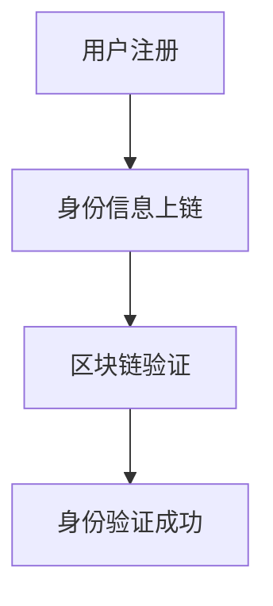
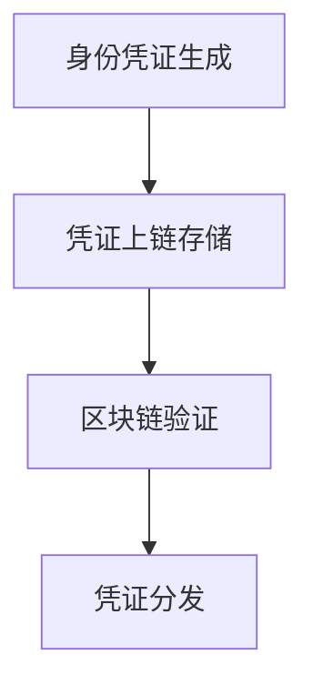
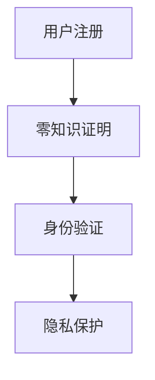
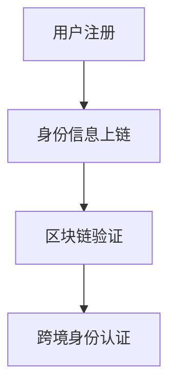
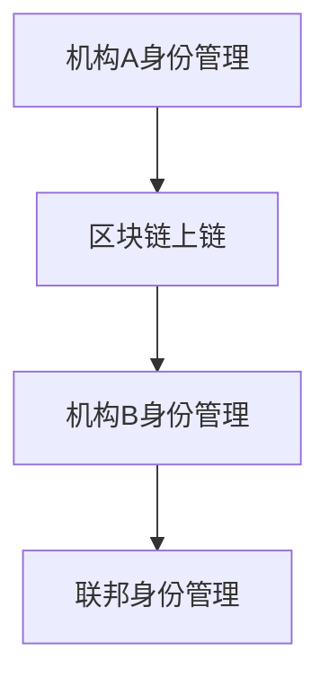

                 

# 区块链在数字身份管理中的创新应用

## 关键词
- 区块链
- 数字身份管理
- 去中心化
- 身份验证
- 零知识证明
- 数学模型
- 项目实战

## 摘要
区块链技术正逐渐改变着数字身份管理的面貌，其去中心化、安全性和透明性的特点使其成为数字身份管理的理想选择。本文将深入探讨区块链在数字身份管理中的应用，包括身份验证、身份凭证管理和身份隐私保护等方面的创新应用。此外，本文还将讲解区块链的核心算法原理，包括共识算法和安全算法，并利用数学模型和公式详细阐述相关概念。最后，通过实际项目案例，我们将展示如何搭建一个区块链数字身份认证系统，并对其进行详细解读与分析。

## 第一部分：核心概念与联系

### 1.1 区块链与数字身份管理

#### 1.1.1 区块链的基本概念
区块链是一种去中心化的分布式账本技术，通过加密算法和共识机制，确保数据的不可篡改和透明性。区块链由多个区块组成，每个区块包含一定数量的交易记录，区块之间通过哈希函数链接形成链式结构。


#### 1.1.2 数字身份管理
数字身份管理是一种通过数字方式识别、验证和管理个体或实体的身份信息。在数字经济时代，确保个人和企业的数字身份安全至关重要，有助于防范身份盗用和欺诈行为。


### 1.2 区块链在数字身份管理中的应用

#### 1.2.1 身份验证
区块链在身份验证中的应用，可以实现去中心化的身份验证，确保验证过程的安全和可信。例如，用户在区块链上注册身份信息，通过链上验证即可确认身份。



#### 1.2.2 身份凭证管理
身份凭证管理是指管理和存储数字身份凭证的过程，包括证书、密钥等。通过区块链技术，可以确保身份凭证的安全存储和可信分发。



#### 1.2.3 身份隐私保护
区块链在身份隐私保护中的应用，可以实现匿名身份验证，保护用户的隐私信息不被泄露。例如，使用零知识证明技术，在验证身份的同时不暴露用户的隐私信息。



### 1.3 区块链在数字身份管理中的创新应用

#### 1.3.1 跨境身份认证
传统的跨境身份认证存在信息不统一、效率低下等问题。通过区块链技术，可以实现跨境身份信息的互认和快速验证，提高认证效率。



#### 1.3.2 联邦身份管理
联邦身份管理是一种分布式身份管理系统，多个机构可以独立管理身份信息，同时实现身份信息的互认和协同。通过区块链技术，可以实现联邦身份管理，提高身份信息的安全性和互操作性。



## 第二部分：核心算法原理讲解

### 2.1 区块链的共识算法

#### 2.1.1 工作量证明（PoW）
工作量证明（Proof of Work，PoW）是一种通过计算复杂度来防止恶意攻击的共识算法。矿工通过计算特定的数学问题来竞争记账权，最先解决数学问题的矿工获得记账权。

```python
def PoW():
    while True:
        nonce = generate_nonce()
        if compute_difficulty(nonce) == target_difficulty:
            return nonce
```

#### 2.1.2 权益证明（PoS）
权益证明（Proof of Stake，PoS）是一种根据持币量来分配记账权的共识算法。持有一定数量代币的用户有机会成为记账节点，并按照持有代币的比例获得奖励。

```python
def PoS(stake):
    probability = stake / total_stake
    return random.random() < probability
```

### 2.2 数字身份管理的安全算法

#### 2.2.1 消息摘要算法（SHA）
消息摘要算法（Secure Hash Algorithm，SHA）是一种广泛使用的哈希算法，用于生成固定长度的消息摘要，确保数据的完整性和唯一性。

```python
import hashlib

def SHA(message):
    hash_object = hashlib.sha256(message.encode())
    hex_dig = hash_object.hexdigest()
    return hex_dig
```

#### 2.2.2 公钥加密算法（RSA）
公钥加密算法（Rivest-Shamir-Adleman，RSA）是一种非对称加密算法，用于保证数据在传输过程中的安全性。RSA通过一对密钥（公钥和私钥）进行加密和解密，确保只有持有私钥的用户才能解密数据。

```python
from Crypto.PublicKey import RSA
from Crypto.Cipher import PKCS1_OAEP

def RSA_encrypt(plaintext):
    key = RSA.generate(2048)
    cipher = PKCS1_OAEP.new(key)
    ciphertext = cipher.encrypt(plaintext)
    return ciphertext

def RSA_decrypt(ciphertext):
    key = RSA.generate(2048)
    cipher = PKCS1_OAEP.new(key)
    plaintext = cipher.decrypt(ciphertext)
    return plaintext
```

## 第三部分：数学模型和数学公式

### 3.1 数字签名与零知识证明

#### 3.1.1 数字签名
数字签名是一种利用公钥加密算法实现身份认证和数据完整性的技术。用户使用私钥对数据进行签名，接收方使用公钥验证签名，确保数据未被篡改且来自合法用户。

$$
\text{签名} = \text{Private Key} \cdot \text{Message} \mod \text{N}
$$

#### 3.1.2 零知识证明
零知识证明（Zero-Knowledge Proof）是一种在无需透露证明内容的情况下，证明某陈述为真的数学技术。证明者向验证者展示一个合法的解决方案，证明者无法得知该解决方案的具体细节。

$$
\begin{align*}
P &= \text{Prover} \\
V &= \text{Verifier} \\
P &\leftrightarrow V: \text{Proof of Knowledge} \\
P &\leftrightarrow V: \text{Zero Knowledge Proof}
\end{align*}
$$`

## 第四部分：项目实战

### 4.1 区块链数字身份认证系统搭建

#### 4.1.1 环境搭建
开发工具：Node.js、Golang、Solidity  
区块链平台：Ethereum、Hyperledger Fabric

#### 4.1.2 系统设计
身份注册：用户在区块链上注册身份信息，使用非同质化代币（NFT）进行身份认证。  
身份验证：系统通过智能合约实现身份验证，确保用户身份的唯一性和可信性。  
身份凭证管理：系统支持身份凭证的存储、查询和转移，提高凭证的安全性和便捷性。

#### 4.1.3 源代码实现
身份注册合约：实现用户身份信息的注册和存储功能。  
身份验证合约：实现身份验证的逻辑，验证用户身份信息的合法性和真实性。  
身份凭证管理合约：实现身份凭证的存储、查询和转移功能。

### 4.2 数字身份管理案例解析

#### 4.2.1 跨境身份认证案例
案例背景：某跨境电商平台需要实现用户的身份认证，确保用户身份的合法性和真实性。  
案例实现：使用区块链技术，实现跨境身份认证，提高认证效率和可信度。  
案例效果：实现用户身份信息的互认和快速验证，提高用户购物体验，降低欺诈风险。

#### 4.2.2 联邦身份管理案例
案例背景：某大型企业集团需要实现不同子公司之间的身份信息互认和管理。  
案例实现：使用区块链技术，实现联邦身份管理，确保身份信息的安全和互操作性。  
案例效果：实现身份信息的集中管理和互认，提高企业运营效率和数据安全。

## 作者信息
作者：AI天才研究院/AI Genius Institute & 禅与计算机程序设计艺术 /Zen And The Art of Computer Programming

