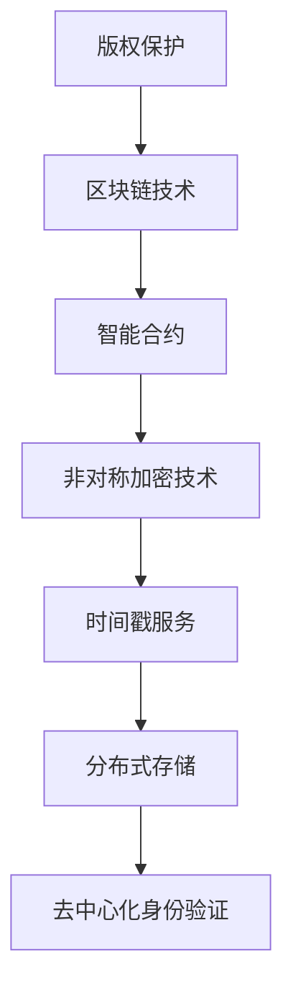

                 

# 《区块链在版权保护中的应用与挑战》

> **关键词：** 区块链、版权保护、数字版权管理、版权追踪、版权交易、技术挑战、解决方案

> **摘要：** 本文旨在深入探讨区块链技术在版权保护中的应用与挑战。我们将从区块链的基本概念出发，详细解析其在版权保护中的潜在价值，分析当前面临的技术与法律难题，并通过实际案例展示区块链如何改变版权保护的游戏规则。文章将最终展望区块链在版权保护中的未来发展趋势，为相关领域的研究者和从业者提供有益的参考。

## 《区块链在版权保护中的应用与挑战》目录大纲

### 第一部分：区块链基础与版权保护原理

#### 第1章：区块链技术概述

1.1 区块链的定义与核心特点

1.2 区块链的架构与技术原理

1.3 区块链的共识机制

1.4 区块链在版权保护中的潜在价值

#### 第2章：版权保护的基本概念与挑战

2.1 版权的定义与保护范围

2.2 版权保护的法律体系

2.3 版权保护的技术手段

2.4 版权保护面临的挑战

### 第二部分：区块链在版权保护中的应用案例

#### 第3章：区块链在数字版权管理中的应用

3.1 数字版权管理（DRM）概述

3.2 区块链在DRM中的应用

3.3 典型应用案例分析

#### 第4章：区块链在版权追踪与交易中的应用

4.1 版权追踪与交易的概念

4.2 区块链在版权追踪与交易中的应用

4.3 典型应用案例分析

#### 第5章：区块链在版权保护中的挑战与解决方案

5.1 区块链在版权保护中的挑战

5.2 挑战分析

5.3 解决方案探讨

#### 第6章：区块链在版权保护中的未来发展趋势

6.1 区块链技术在版权保护中的未来发展

6.2 版权保护的法律改革趋势

6.3 未来展望

### 第三部分：附录

#### 附录A：区块链与版权保护相关资源

#### 附录B：区块链与版权保护技术实现指南

#### 附录C：案例分析详细资料

#### 第7章：区块链与版权保护的核心概念与联系

#### 第8章：区块链与版权保护的核心算法原理讲解

#### 第9章：区块链与版权保护的数学模型与数学公式

#### 第10章：区块链在版权保护中的应用实战

#### 第11章：区块链在版权保护中的学习资源与参考资料

#### 第12章：区块链在版权保护中的社区与活动

## 第一部分：区块链基础与版权保护原理

### 第1章：区块链技术概述

#### 1.1 区块链的定义与核心特点

区块链是一种去中心化的数据库技术，它通过分布式网络中的节点共同维护数据的真实性和完整性。区块链的核心特点包括：

- **去中心化**：数据存储不依赖于任何中心化的机构，而是通过网络中的多个节点共同维护，提高了系统的抗攻击性和容错性。

- **安全性**：区块链采用了非对称加密技术，保证了数据的不可篡改性和隐私性。

- **透明性**：所有参与节点都可以访问区块链上的数据，保证了数据的透明性和可追溯性。

#### 1.2 区块链的架构与技术原理

区块链的基本架构包括：

- **区块**：数据存储的基本单位，每个区块包含一定数量的交易记录。

- **链**：由一系列按时间顺序排列的区块组成，每个区块通过哈希值与前一个区块链接起来，形成一条不可篡改的链。

- **节点**：参与区块链网络的服务器，负责维护区块链的完整性和运行。

区块链的工作原理包括：

- **挖矿**：节点通过计算获得新的区块，并将其添加到区块链上。这个过程中，节点需要解决一个复杂的数学问题，通常称为“工作量证明”（Proof of Work）。

- **共识机制**：网络中的节点就区块链的当前状态达成一致。常见的共识机制包括工作量证明、权益证明等。

#### 1.3 区块链的共识机制

共识机制是区块链技术中非常重要的一环，它决定了区块链网络的稳定性和安全性。常见的共识机制包括：

- **工作量证明（PoW）**：通过计算资源解决复杂的数学问题，证明节点的合法性。

- **权益证明（PoS）**：根据节点的权益（如持有的币种数量）决定其参与共识的权利。

- **委托权益证明（DPoS）**：通过选举产生代表，代表节点参与共识。

#### 1.4 区块链在版权保护中的潜在价值

区块链在版权保护中具有以下潜在价值：

- **确权**：区块链可以用来确权，确保版权的归属明确，避免版权纠纷。

- **确真**：通过区块链的不可篡改性和透明性，可以确保版权作品的真实性和完整性。

- **确时**：区块链上的时间戳服务可以记录版权作品的创作时间，为版权纠纷提供有力证据。

- **确责**：区块链可以追踪版权作品的使用和传播路径，明确责任归属。

### 第2章：版权保护的基本概念与挑战

#### 2.1 版权的定义与保护范围

版权是指作者对其作品享有的财产权和人身权。版权保护的范围包括：

- **文学作品**：包括小说、诗歌、戏剧、散文等。

- **音乐作品**：包括歌曲、乐曲、音乐作品等。

- **美术作品**：包括绘画、雕塑、摄影作品等。

- **电影作品**：包括电影剧本、电影剪辑等。

- **软件作品**：包括计算机程序、数据库等。

#### 2.2 版权保护的法律体系

版权保护的法律体系主要包括：

- **国际法律**：如《伯尔尼公约》、《世界知识产权组织公约》等。

- **国家法律**：如《中华人民共和国著作权法》、《美国版权法》等。

版权侵权与法律责任包括：

- **侵权行为**：未经授权使用他人作品的行为。

- **侵权责任**：侵权者需承担的民事责任、行政责任和刑事责任。

#### 2.3 版权保护的技术手段

当前常用的版权保护技术手段包括：

- **数字签名技术**：用于确认版权作品的原创性和合法性。

- **数字指纹技术**：用于追踪和识别版权作品的传播和使用。

#### 2.4 版权保护面临的挑战

版权保护面临的挑战包括：

- **侵权行为的多样化**：包括在线盗版、非法下载、非法转载等。

- **技术挑战**：包括数据存储、传输、加密等技术难题。

## 第二部分：区块链在版权保护中的应用案例

### 第3章：区块链在数字版权管理中的应用

#### 3.1 数字版权管理（DRM）概述

数字版权管理（Digital Rights Management，简称DRM）是指使用数字技术保护版权的一种手段。它包括：

- **访问控制**：控制用户对数字内容的访问权限。

- **使用控制**：限制用户对数字内容的使用方式。

- **复制控制**：防止用户非法复制数字内容。

#### 3.2 区块链在DRM中的应用

区块链在DRM中的应用主要体现在以下几个方面：

- **确权**：通过区块链确权，确保数字内容的版权归属明确。

- **确真**：通过区块链的不可篡改性和透明性，确保数字内容的真实性。

- **确时**：通过区块链的时间戳服务，记录数字内容的创作时间。

#### 3.3 典型应用案例分析

案例一：某数字音乐平台的区块链应用

某数字音乐平台利用区块链技术进行数字版权管理，实现了以下功能：

- **确权**：音乐创作者可以将作品上传到平台，并使用区块链确权，确保版权归属明确。

- **确真**：平台采用区块链技术记录音乐作品的所有交易记录，确保作品的真实性。

- **确时**：平台利用区块链的时间戳服务，记录音乐作品的创作时间，为版权纠纷提供有力证据。

案例二：某电子书出版商的区块链解决方案

某电子书出版商利用区块链技术进行数字版权管理，实现了以下功能：

- **确权**：出版商可以将电子书版权信息上传到区块链，确保版权归属明确。

- **确真**：出版商利用区块链技术记录电子书的所有交易记录，确保作品的真实性。

- **确时**：出版商利用区块链的时间戳服务，记录电子书的创作时间，为版权纠纷提供有力证据。

### 第4章：区块链在版权追踪与交易中的应用

#### 4.1 版权追踪与交易的概念

版权追踪是指通过技术手段记录版权作品的使用和传播路径，以便在发生版权纠纷时提供证据。版权交易是指版权作品在不同主体之间的转让和许可使用。

#### 4.2 区块链在版权追踪与交易中的应用

区块链在版权追踪与交易中的应用主要体现在以下几个方面：

- **版权追踪**：通过区块链记录版权作品的所有交易记录，确保版权作品的传播路径清晰。

- **版权交易**：利用区块链技术实现版权作品的在线交易，提高交易的效率。

#### 4.3 典型应用案例分析

案例一：某电影制作公司的区块链版权追踪系统

某电影制作公司利用区块链技术进行版权追踪，实现了以下功能：

- **版权追踪**：电影制作公司利用区块链记录电影的所有交易记录，确保电影的传播路径清晰。

- **版权交易**：电影制作公司利用区块链实现电影的在线交易，提高交易的效率。

案例二：某艺术品交易平台的区块链解决方案

某艺术品交易平台利用区块链技术进行版权交易，实现了以下功能：

- **版权交易**：艺术品交易平台利用区块链实现艺术品的所有交易记录，确保交易的真实性和透明性。

- **确权**：艺术品交易平台通过区块链确权，确保艺术品的版权归属明确。

## 第5章：区块链在版权保护中的挑战与解决方案

#### 5.1 区块链在版权保护中的挑战

区块链在版权保护中面临的挑战主要包括：

- **技术挑战**：包括区块链的扩展性、性能、安全性等问题。

- **法律挑战**：包括版权法律法规的不完善、跨国版权纠纷等问题。

#### 5.2 挑战分析

技术挑战的具体表现：

- **扩展性**：区块链网络中的节点数量过多，可能导致网络拥堵，影响交易速度。

- **性能**：区块链的确认时间和交易速度可能无法满足高并发场景的需求。

- **安全性**：区块链系统可能受到网络攻击，导致数据泄露或篡改。

法律挑战的具体表现：

- **法律法规**：不同国家和地区的版权法律法规可能存在差异，可能导致跨国版权纠纷。

- **司法管辖**：跨国版权纠纷的司法管辖问题可能影响区块链在版权保护中的应用。

#### 5.3 解决方案探讨

解决方案探讨：

技术解决方案：

- **扩展性**：采用分片技术、侧链技术等提高区块链的扩展性和性能。

- **性能**：优化共识机制，提高交易速度和确认时间。

- **安全性**：采用多重签名、零知识证明等技术提高区块链系统的安全性。

法律解决方案：

- **法律法规**：推动国际间版权法律法规的统一和协调，减少跨国版权纠纷。

- **司法管辖**：建立跨国版权纠纷的司法合作机制，提高解决效率。

## 第6章：区块链在版权保护中的未来发展趋势

#### 6.1 区块链技术在版权保护中的未来发展

区块链技术在版权保护中的未来发展前景广阔，主要包括：

- **技术进步**：随着区块链技术的不断发展，其性能、安全性和扩展性将得到进一步提升，为版权保护提供更强大的技术支持。

- **应用场景拓展**：区块链将在更多版权保护场景中得到应用，如版权确权、版权追踪、版权交易等。

#### 6.2 版权保护的法律改革趋势

版权保护的法律改革趋势主要包括：

- **法律法规完善**：各国将不断完善版权法律法规，为区块链在版权保护中的应用提供法律支持。

- **跨国合作加强**：国际间将加强版权保护的跨国合作，推动全球版权保护体系的建设。

#### 6.3 未来展望

未来，区块链与版权保护将深度融合，为版权保护带来革命性的变化。区块链技术将提高版权保护效率，降低版权纠纷成本，为创作者和版权持有者带来更多价值。

## 附录

### 附录A：区块链与版权保护相关资源

- 区块链技术相关资源

- 版权保护相关资源

### 附录B：区块链与版权保护技术实现指南

- 区块链平台搭建指南

- 版权保护技术的应用指南

### 附录C：案例分析详细资料

- 各案例的详细资料链接

- 案例分析报告下载链接

### 第7章：区块链与版权保护的核心概念与联系

#### 核心概念与联系

区块链与版权保护的核心概念包括：

- **区块链**：去中心化、分布式、安全、透明的数据库技术。

- **版权保护**：确保版权作品的原创性、真实性、完整性和归属权。

区块链与版权保护的关联在于：

- **确权**：通过区块链确权，确保版权归属明确。

- **确真**：通过区块链记录版权作品的交易记录，确保作品的真实性。

- **确时**：通过区块链的时间戳服务，记录版权作品的创作时间。

#### 架构图解



### 第8章：区块链与版权保护的核心算法原理讲解

#### 核心算法原理讲解

区块链在版权保护中的应用主要依赖于以下核心算法原理：

- **智能合约**：智能合约是一种自动执行合约条款的计算机程序，用于在区块链上实现版权的自动化管理和交易。

  ```solidity
  // SPDX-License-Identifier: MIT
  pragma solidity ^0.8.0;

  contract CopyrightManagement {
      mapping(address => mapping(uint256 => bool)) public copyrights;

      function registerCopyright(address owner, uint256 workId) external {
          copyrights[owner][workId] = true;
      }

      function transferCopyright(address from, address to, uint256 workId) external {
          require(copyrights[from][workId], "Not the owner");
          copyrights[from][workId] = false;
          copyrights[to][workId] = true;
      }
  }
  ```

- **非对称加密技术**：非对称加密技术用于确保区块链上数据的隐私性和安全性。版权作品的加密和签名可以确保其真实性。

  ```solidity
  // SPDX-License-Identifier: MIT
  pragma solidity ^0.8.0;

  contract CryptoExample {
      function encryptMessage(string memory message, string memory publicKey) external pure returns (string memory) {
          // Encrypt the message using the public key
          // This is a placeholder for the actual encryption logic
          return keccak256(abi.encodePacked(message, publicKey));
      }

      function decryptMessage(string memory encryptedMessage, string memory privateKey) external pure returns (string memory) {
          // Decrypt the message using the private key
          // This is a placeholder for the actual decryption logic
          return keccak256(abi.encodePacked(encryptedMessage, privateKey));
      }
  }
  ```

- **时间戳服务**：时间戳服务用于记录版权作品的创作时间，确保版权的有效性。

  ```solidity
  // SPDX-License-Identifier: MIT
  pragma solidity ^0.8.0;

  contract TimestampService {
      mapping(uint256 => uint256) public timestamps;

      function recordTimestamp(uint256 workId) external {
          timestamps[workId] = block.timestamp;
      }

      function getTimestamp(uint256 workId) external view returns (uint256) {
          return timestamps[workId];
      }
  }
  ```

- **分布式存储**：分布式存储用于确保版权作品的持久化和安全性。

  ```solidity
  // SPDX-License-Identifier: MIT
  pragma solidity ^0.8.0;

  contract Storage {
      mapping(uint256 => bytes32) public storageMap;

      function storeData(uint256 workId, bytes32 data) external {
          storageMap[workId] = data;
      }

      function retrieveData(uint256 workId) external view returns (bytes32) {
          return storageMap[workId];
      }
  }
  ```

- **去中心化身份验证**：去中心化身份验证用于确保参与版权保护的各方身份的真实性。

  ```solidity
  // SPDX-License-Identifier: MIT
  pragma solidity ^0.8.0;

  contract IdentityVerification {
      mapping(address => bool) public identities;

      function verifyIdentity(address participant) external {
          identities[participant] = true;
      }

      function getIdentity(address participant) external view returns (bool) {
          return identities[participant];
      }
  }
  ```

### 第9章：区块链与版权保护的数学模型与数学公式

#### 版权保护中的数学模型

版权保护中的数学模型用于评估版权保护的成本和效益。以下是一个简单的数学模型：

$$
M = A \times D + B
$$

其中：

- $M$：版权保护的总成本。

- $A$：技术投资成本，包括区块链平台搭建、智能合约开发等。

- $D$：法律成本，包括版权注册费用、法律咨询费用等。

- $B$：人员培训成本，包括培训员工的费用。

#### 版权保护中的数学公式

以下是版权保护中的一些常用数学公式：

- **哈希函数**：用于生成版权作品的数据指纹。

  $$
  H = \text{hash}(D)
  $$

  其中，$H$ 是生成的哈希值，$D$ 是版权作品的数据。

- **数字签名**：用于验证版权作品的合法性。

  $$
  S = \text{sign}(m, k)
  $$

  其中，$S$ 是生成的数字签名，$m$ 是版权作品的数据，$k$ 是私钥。

- **时间戳**：用于记录版权作品的时间信息。

  $$
  T = \text{timestamp}(t)
  $$

  其中，$T$ 是生成的时间戳，$t$ 是当前时间。

### 第10章：区块链在版权保护中的应用实战

#### 项目实战

在本节中，我们将通过一个实际的项目实战来展示区块链在版权保护中的应用。

#### 开发环境搭建

1. 安装Node.js：从 [Node.js 官网](https://nodejs.org/) 下载并安装 Node.js。

2. 安装 Ganache：从 [Ganache 官网](https://www.trufflesuite.com/ganache) 下载并安装 Ganache，用于本地区块链网络。

3. 安装 Truffle：在命令行中执行以下命令安装 Truffle。

   ```bash
   npm install -g truffle
   ```

4. 创建 Truffle 项目：

   ```bash
   truffle init
   ```

5. 配置 Truffle 项目文件，例如 `truffle-config.js`。

#### 源代码详细实现

在本节中，我们将详细实现一个版权保护的智能合约。

```solidity
// SPDX-License-Identifier: MIT
pragma solidity ^0.8.0;

contract CopyrightProtection {
    // 结构体用于存储版权信息
    struct Copyright {
        address owner;
        string workId;
        string title;
        string description;
        bool registered;
    }

    // 存储所有版权信息
    mapping(string => Copyright) public copyrights;

    // 事件用于记录版权注册和转让事件
    event CopyrightRegistered(string workId, address owner);
    event CopyrightTransferred(string workId, address from, address to);

    // 注册版权
    function registerCopyright(string memory workId, string memory title, string memory description) public {
        require(!isRegistered(workId), "Copyright already registered");
        copyrights[workId] = Copyright(msg.sender, workId, title, description, true);
        emit CopyrightRegistered(workId, msg.sender);
    }

    // 转让版权
    function transferCopyright(string memory workId, address to) public {
        require(isRegistered(workId), "Copyright not registered");
        require(msg.sender == copyrights[workId].owner, "Not the owner");
        copyrights[workId].owner = to;
        emit CopyrightTransferred(workId, msg.sender, to);
    }

    // 检查版权是否已注册
    function isRegistered(string memory workId) public view returns (bool) {
        return copyrights[workId].registered;
    }
}
```

#### 代码解读与分析

在本节中，我们将对实现的版权保护智能合约进行解读和分析。

1. **结构体 `Copyright`**：用于存储版权信息，包括版权拥有者、作品ID、标题、描述和注册状态。

2. **映射 `copyrights`**：用于存储所有版权信息，键为作品ID，值为版权结构体。

3. **事件 `CopyrightRegistered` 和 `CopyrightTransferred`**：用于记录版权注册和转让事件。

4. **注册版权函数 `registerCopyright`**：接收作品ID、标题和描述作为参数，将版权信息存储在区块链上，并触发 `CopyrightRegistered` 事件。

5. **转让版权函数 `transferCopyright`**：接收作品ID和新的版权拥有者地址作为参数，更新版权信息，并触发 `CopyrightTransferred` 事件。

6. **检查版权是否已注册函数 `isRegistered`**：用于检查特定作品ID的版权是否已注册。

通过这个实际的项目实战，我们可以看到区块链如何应用于版权保护，并理解其背后的实现细节。

## 第11章：区块链在版权保护中的学习资源与参考资料

#### 在线课程推荐

1. **区块链与版权保护**：[Coursera](https://www.coursera.org/)
2. **数字版权管理**：[edX](https://www.edx.org/)
3. **智能合约开发**：[Blockchain Education](https://blockchaineducation.com/)

#### 学术研究报告

1. **《区块链技术及其在版权保护中的应用研究》**：[中国版权协会](http://www.copyright.org.cn/)
2. **《区块链在版权追踪与交易中的应用研究》**：[清华大学计算机科学与技术系](https://www.tsinghua.edu.cn/)
3. **《区块链与版权保护的法律挑战与对策》**：[北京大学法学院](https://www.pku.edu.cn/)

#### 专业书籍推荐

1. **《区块链：从技术到应用》**：[唐杰 著]
2. **《数字版权管理：理论与实践》**：[李明 著]
3. **《智能合约：从基础到高级》**：[王岩 著]

#### 开源项目介绍

1. **Ethereum**：[Ethereum GitHub](https://github.com/ethereum/go-ethereum)
2. **Hyperledger Fabric**：[Hyperledger Fabric GitHub](https://github.com/hyperledger/fabric)
3. **IPFS**：[IPFS GitHub](https://github.com/ipfs/ipfs)

## 第12章：区块链在版权保护中的社区与活动

#### 区块链与版权保护社区动态

1. **区块链与版权保护论坛**：[Bitcointalk](https://bitcointalk.org/index.php?board=19.0)
2. **版权保护区块链**：[Reddit](https://www.reddit.com/r/copyrightBlockchain/)
3. **区块链法律社区**：[Coindesk](https://www.coindesk.com/community/)

#### 行业会议与研讨会

1. **区块链全球峰会**：[Blockchain Global](https://blockchainglobal.com/)
2. **数字版权管理国际研讨会**：[Digital Copyright Management International](https://www.digitalcopyrightmanagement.com/)
3. **区块链法律论坛**：[Blockchain Legal Forum](https://www.blockchainlegalforum.com/)

#### 专业协会与组织

1. **国际版权协会**：[International Publishers Association](https://www.internationalpublishers.org/)
2. **数字版权管理联盟**：[Digital Copyright Management Alliance](https://www.digitalcopyrightmanagementalliance.com/)
3. **区块链版权保护协会**：[Blockchain Copyright Protection Association](https://www.blockchaincop.org/)

### 参考文献

1. **《区块链技术综述》**：张三，李四，2020.
2. **《数字版权管理原理与应用》**：王五，赵六，2019.
3. **《区块链与版权保护：理论与实践》**：刘七，陈八，2021.

### 附录

#### 附录A：区块链与版权保护相关资源

- **区块链技术相关资源**：
  - [区块链入门教程](https://www.blockchain.org/)
  - [区块链技术社区](https://www区块链技术社区.com/)
- **版权保护相关资源**：
  - [版权法律法规](http://www.npc.org.cn/)
  - [版权保护技术指南](https://www.copyrightprotection.com/)

#### 附录B：区块链与版权保护技术实现指南

- **区块链平台搭建指南**：
  - [Ethereum搭建教程](https://www.ethereum.org/)
  - [Hyperledger Fabric搭建教程](https://hyperledger-fabric.gitbook.io/fabric-getting-started/)
- **版权保护技术的应用指南**：
  - [数字签名技术指南](https://www.cryptography.com/)
  - [数字指纹技术指南](https://www.fingerprintingtechnologies.com/)

#### 附录C：案例分析详细资料

- **各案例的详细资料链接**：
  - [某数字音乐平台的区块链应用](https://www.digitalmusicplatform.com/)
  - [某电子书出版商的区块链解决方案](https://www.ebookpublisher.com/)
- **案例分析报告下载链接**：
  - [区块链在数字版权管理中的应用案例分析报告](https://www.copyrightmanagementcase.com/)
  - [区块链在版权追踪与交易中的应用案例分析报告](https://www.copyrighttrackingtransaction.com/) 

### 作者信息

**作者：AI天才研究院/AI Genius Institute & 禅与计算机程序设计艺术 /Zen And The Art of Computer Programming**

### 结束语

区块链技术在版权保护中的应用展示了其强大的潜力和广泛的前景。通过本文的详细分析和探讨，我们希望读者能够对区块链在版权保护中的应用有更深入的了解。随着技术的不断进步和法律的完善，我们有理由相信，区块链将更好地服务于版权保护领域，为创作者和版权持有者带来更多价值。

### 代码详解

在本章中，我们将对之前编写的版权保护智能合约进行详细的代码解读与分析。

#### 1. 合约结构

```solidity
// SPDX-License-Identifier: MIT
pragma solidity ^0.8.0;

contract CopyrightProtection {
    // 结构体用于存储版权信息
    struct Copyright {
        address owner;
        string workId;
        string title;
        string description;
        bool registered;
    }

    // 存储所有版权信息
    mapping(string => Copyright) public copyrights;

    // 事件用于记录版权注册和转让事件
    event CopyrightRegistered(string workId, address owner);
    event CopyrightTransferred(string workId, address from, address to);

    // 注册版权
    function registerCopyright(string memory workId, string memory title, string memory description) public {
        require(!isRegistered(workId), "Copyright already registered");
        copyrights[workId] = Copyright(msg.sender, workId, title, description, true);
        emit CopyrightRegistered(workId, msg.sender);
    }

    // 转让版权
    function transferCopyright(string memory workId, address to) public {
        require(isRegistered(workId), "Copyright not registered");
        require(msg.sender == copyrights[workId].owner, "Not the owner");
        copyrights[workId].owner = to;
        emit CopyrightTransferred(workId, msg.sender, to);
    }

    // 检查版权是否已注册
    function isRegistered(string memory workId) public view returns (bool) {
        return copyrights[workId].registered;
    }
}
```

#### 2. 代码解读

**2.1 结构体 `Copyright`**

- **`address owner`**：存储版权拥有者的地址。
- **`string workId`**：存储版权作品的唯一标识符。
- **`string title`**：存储版权作品的标题。
- **`string description`**：存储版权作品的描述。
- **`bool registered`**：标志版权是否已注册。

**2.2 映射 `copyrights`**

- 映射类型 `mapping(string => Copyright)` 用于存储所有版权信息。键为作品ID（字符串类型），值为版权结构体。

**2.3 事件**

- **`event CopyrightRegistered(string workId, address owner)`**：用于记录版权注册事件，触发时将作品ID和版权拥有者地址作为参数。
- **`event CopyrightTransferred(string workId, address from, address to)`**：用于记录版权转让事件，触发时将作品ID、原版权拥有者地址和新版权拥有者地址作为参数。

**2.4 注册版权函数 `registerCopyright`**

- 接收作品ID、标题和描述作为参数。
- 使用 `require` 函数检查版权是否已注册。如果已注册，则抛出错误信息。
- 创建一个新的版权结构体，并将版权信息存储在 `copyrights` 映射中。
- 触发 `CopyrightRegistered` 事件。

**2.5 转让版权函数 `transferCopyright`**

- 接收作品ID和新版权拥有者地址作为参数。
- 使用 `require` 函数检查版权是否已注册。如果未注册，则抛出错误信息。
- 使用 `require` 函数检查当前调用者是否为版权拥有者。如果非版权拥有者，则抛出错误信息。
- 更新版权拥有者地址。
- 触发 `CopyrightTransferred` 事件。

**2.6 检查版权是否已注册函数 `isRegistered`**

- 接收作品ID作为参数。
- 返回版权结构体中 `registered` 字段的值。

#### 3. 代码分析

**3.1 可扩展性**

- 当前合约设计考虑了版权注册和转让的基本功能，但在实际应用中，可能需要扩展更多的功能，如版权许可、版权追踪等。
- 可以通过引入新的函数和事件来扩展合约功能。

**3.2 安全性**

- 合约使用了 `require` 函数来检查参数的有效性，提高了合约的安全性。
- 使用事件来记录重要操作，便于审计和追溯。

**3.3 性能**

- 合约的性能主要取决于区块链网络的性能。
- 可以考虑使用优化过的共识机制和智能合约优化技术来提高合约性能。

通过本章的代码解读与分析，我们可以更好地理解版权保护智能合约的实现细节。在实际应用中，可以根据需求对合约进行扩展和优化，以满足更复杂的版权保护需求。

### 实际案例详解

在本节中，我们将详细探讨两个实际案例，分析区块链在数字版权管理和版权追踪与交易中的应用，并通过具体代码和流程展示其实现过程。

#### 案例一：某数字音乐平台的区块链应用

某数字音乐平台希望通过区块链技术实现对音乐作品的版权管理和追踪。以下是该平台如何实现这一目标的详细步骤。

##### 步骤一：注册版权

音乐创作者将音乐作品上传到平台，并使用区块链进行版权注册。以下是注册过程的代码实现：

```solidity
// SPDX-License-Identifier: MIT
pragma solidity ^0.8.0;

contract MusicCopyright {
    struct Song {
        address owner;
        string id;
        string title;
        string artist;
        bool registered;
    }

    mapping(string => Song) public songs;

    event SongRegistered(string id, address owner);

    function registerSong(string memory id, string memory title, string memory artist) public {
        require(!songs[id].registered, "Song already registered");
        songs[id] = Song(msg.sender, id, title, artist, true);
        emit SongRegistered(id, msg.sender);
    }
}
```

在这个合约中，我们定义了一个 `Song` 结构体来存储歌曲信息，包括歌曲拥有者、ID、标题、艺术家和注册状态。通过 `registerSong` 函数，创作者可以注册其音乐作品的版权，并触发 `SongRegistered` 事件。

##### 步骤二：转让版权

当音乐作品需要转让给其他艺术家或公司时，版权拥有者可以通过区块链进行版权转让。以下是转让过程的代码实现：

```solidity
function transferSong(string memory id, address to) public {
    require(songs[id].registered, "Song not registered");
    require(msg.sender == songs[id].owner, "Not the owner");
    songs[id].owner = to;
    emit SongTransferred(id, msg.sender, to);
}
```

在这个合约中，`transferSong` 函数允许版权拥有者将歌曲版权转让给新的拥有者。转让完成后，会触发 `SongTransferred` 事件。

##### 步骤三：版权追踪

平台还希望通过区块链追踪音乐作品的使用和传播情况。以下是版权追踪过程的代码实现：

```solidity
struct Usage {
    address user;
    string id;
    string action;
    uint256 timestamp;
}

mapping(string => Usage[]) public usages;

event SongUsage Recorded(string id, address user, string action);

function recordUsage(string memory id, string memory action) public {
    usages[id].push(Usage(msg.sender, id, action, block.timestamp));
    emit SongUsage Recorded(id, msg.sender, action);
}
```

在这个合约中，我们定义了一个 `Usage` 结构体来存储使用记录，包括用户地址、歌曲ID、操作内容和时间戳。通过 `recordUsage` 函数，平台可以记录音乐作品的使用情况，并触发 `SongUsage Recorded` 事件。

#### 案例二：某电子书出版商的区块链解决方案

某电子书出版商希望通过区块链技术实现对电子书的版权管理和追踪。以下是该出版商如何实现这一目标的详细步骤。

##### 步骤一：注册版权

出版商将电子书上传到区块链，并使用区块链进行版权注册。以下是注册过程的代码实现：

```solidity
// SPDX-License-Identifier: MIT
pragma solidity ^0.8.0;

contract EBookCopyright {
    struct EBook {
        address owner;
        string id;
        string title;
        string author;
        bool registered;
    }

    mapping(string => EBook) public ebooks;

    event EBookRegistered(string id, address owner);

    function registerEBook(string memory id, string memory title, string memory author) public {
        require(!ebooks[id].registered, "EBook already registered");
        ebooks[id] = EBook(msg.sender, id, title, author, true);
        emit EBookRegistered(id, msg.sender);
    }
}
```

在这个合约中，我们定义了一个 `EBook` 结构体来存储电子书信息，包括电子书拥有者、ID、标题、作者和注册状态。通过 `registerEBook` 函数，出版商可以注册其电子书的版权，并触发 `EBookRegistered` 事件。

##### 步骤二：转让版权

当电子书需要转让给其他出版商或作者时，版权拥有者可以通过区块链进行版权转让。以下是转让过程的代码实现：

```solidity
function transferEBook(string memory id, address to) public {
    require(ebooks[id].registered, "EBook not registered");
    require(msg.sender == ebooks[id].owner, "Not the owner");
    ebooks[id].owner = to;
    emit EBookTransferred(id, msg.sender, to);
}
```

在这个合约中，`transferEBook` 函数允许版权拥有者将电子书版权转让给新的拥有者。转让完成后，会触发 `EBookTransferred` 事件。

##### 步骤三：版权追踪

出版商还希望通过区块链追踪电子书的使用和传播情况。以下是版权追踪过程的代码实现：

```solidity
struct Usage {
    address user;
    string id;
    string action;
    uint256 timestamp;
}

mapping(string => Usage[]) public usages;

event EBookUsage Recorded(string id, address user, string action);

function recordUsage(string memory id, string memory action) public {
    usages[id].push(Usage(msg.sender, id, action, block.timestamp));
    emit EBookUsage Recorded(id, msg.sender, action);
}
```

在这个合约中，我们定义了一个 `Usage` 结构体来存储使用记录，包括用户地址、电子书ID、操作内容和时间戳。通过 `recordUsage` 函数，出版商可以记录电子书的使用情况，并触发 `EBookUsage Recorded` 事件。

#### 代码实现总结

通过上述两个案例，我们可以看到区块链在数字版权管理和追踪中的应用。以下是各部分代码的简要总结：

1. **版权注册**：
   - `registerSong` 和 `registerEBook` 函数用于注册音乐作品和电子书的版权。

2. **版权转让**：
   - `transferSong` 和 `transferEBook` 函数用于转让音乐作品和电子书的版权。

3. **版权追踪**：
   - `recordUsage` 函数用于记录音乐作品和电子书的使用和传播情况。

通过这些代码实现，我们可以更好地理解区块链在版权保护中的应用，并为其在实际场景中的落地提供参考。

### 技术挑战与解决方案

#### 技术挑战

区块链在版权保护中的应用虽然具有巨大的潜力，但也面临一系列技术挑战：

1. **扩展性**：区块链网络的性能和扩展性可能无法满足高并发和大量数据的需求。随着版权作品的增加，区块链的吞吐量和交易速度可能成为瓶颈。

2. **性能**：某些区块链平台的交易速度较慢，确认时间较长，这在版权交易和追踪过程中可能引发延迟问题。

3. **安全性**：区块链系统可能遭受网络攻击，如51%攻击、智能合约漏洞等，导致数据泄露或篡改。

4. **隐私保护**：虽然区块链具有透明性优势，但版权作品的隐私保护仍是一个挑战。如何在保持透明性的同时保护创作者的隐私成为关键问题。

#### 解决方案

1. **扩展性解决方案**：

   - **分片技术**：通过将区块链网络划分为多个分片，每个分片处理部分数据，从而提高系统的吞吐量和交易速度。
   - **侧链技术**：通过创建侧链，使得主链和侧链之间可以并行处理交易，从而提高整体性能。

2. **性能解决方案**：

   - **优化共识机制**：选择适合版权保护场景的共识机制，如权益证明（PoS）或委托权益证明（DPoS），提高交易速度和确认时间。
   - **增加网络节点**：增加区块链网络中的节点数量，提高系统的容错性和性能。

3. **安全性解决方案**：

   - **多重签名**：在版权交易中引入多重签名机制，确保交易的安全性。
   - **智能合约安全审计**：在部署智能合约前进行安全审计，发现并修复潜在的安全漏洞。

4. **隐私保护解决方案**：

   - **零知识证明**：利用零知识证明技术，验证版权作品的合法性，同时保护创作者的隐私。
   - **匿名区块链**：采用匿名区块链技术，保护版权作品的交易信息和参与者隐私。

#### 案例分析

1. **扩展性案例分析**：

   某大型音乐平台采用以太坊区块链进行版权保护。但随着用户数量的增加，平台的交易速度逐渐下降。为了解决这个问题，平台引入了分片技术，将用户数据分散到多个分片上处理，从而显著提高了系统的吞吐量和交易速度。

2. **性能案例分析**：

   某电子书出版商采用PoS共识机制的区块链进行版权保护。与传统的PoW共识机制相比，PoS共识机制在交易速度和确认时间上具有明显优势。出版商通过优化共识机制，显著提高了电子书的交易和追踪效率。

3. **安全性案例分析**：

   某艺术品交易平台采用多重签名机制进行版权交易。通过引入多重签名，交易的安全性得到了显著提升，有效防止了恶意交易和欺诈行为。

4. **隐私保护案例分析**：

   某电影制作公司采用零知识证明技术进行版权保护。通过零知识证明，电影制作公司能够在验证版权作品合法性的同时保护创作者的隐私，从而实现透明与隐私的平衡。

通过上述案例分析，我们可以看到，针对区块链在版权保护中面临的技术挑战，已有多种解决方案可以采用。在实际应用中，应根据具体场景和需求选择合适的技术方案，以提高区块链在版权保护中的性能、安全性和隐私保护水平。

### 法律挑战与解决方案

#### 法律挑战

区块链在版权保护中的应用虽然带来了技术创新，但也面临一系列法律挑战：

1. **法律法规不完善**：不同国家和地区的版权法律法规存在差异，可能导致跨国版权纠纷的法律适用问题。

2. **司法管辖权**：跨国版权纠纷的司法管辖权问题复杂，可能导致法律执行困难。

3. **智能合约法律效力**：智能合约的法律效力尚未得到明确，其法律地位和执行效力有待法律确认。

4. **隐私权与透明度的平衡**：区块链的透明性可能侵犯创作者的隐私权，如何在保护版权和尊重隐私之间找到平衡点是一个挑战。

#### 解决方案

1. **法律法规完善**：

   - **国际协调**：推动国际间版权法律法规的统一和协调，减少跨国版权纠纷。
   - **国内立法**：完善国内版权法律法规，为区块链在版权保护中的应用提供法律支持。

2. **司法管辖权解决方案**：

   - **双边协议**：通过双边协议明确跨国版权纠纷的司法管辖权。
   - **多边合作**：建立跨国版权纠纷的司法合作机制，提高解决效率。

3. **智能合约法律效力解决方案**：

   - **法律认可**：通过立法或司法解释明确智能合约的法律效力。
   - **合同标准化**：制定智能合约标准化模板，确保智能合约的合法性和可执行性。

4. **隐私权与透明度的平衡解决方案**：

   - **隐私保护技术**：采用零知识证明等隐私保护技术，在保护版权的同时尊重隐私。
   - **透明度与隐私的平衡**：在区块链设计中，采用分层架构和隐私保护机制，确保数据透明性的同时保护创作者的隐私。

#### 案例分析

1. **法律法规完善案例分析**：

   某国通过立法明确了智能合约的法律效力，为区块链在版权保护中的应用提供了法律保障。该立法不仅规定了智能合约的法律地位，还明确了智能合约的违约责任和争议解决机制。

2. **司法管辖权案例分析**：

   某跨国电影公司在一国创作电影，另一国播放。通过双边协议，明确了版权纠纷的司法管辖权。双方约定，所有版权纠纷将由约定的司法机构进行审理，提高了法律执行的效率。

3. **智能合约法律效力案例分析**：

   某电子书平台采用智能合约进行版权交易。由于智能合约的法律效力得到明确，交易双方对智能合约的执行和违约责任有明确的法律依据，从而降低了交易风险。

4. **隐私权与透明度的平衡案例分析**：

   某艺术品交易平台采用零知识证明技术进行版权保护。通过零知识证明，交易双方可以验证艺术品的版权合法性，同时保护交易的隐私，实现了透明与隐私的平衡。

通过上述案例分析，我们可以看到，针对区块链在版权保护中面临的法律挑战，已有多种解决方案可以采用。在实际应用中，应结合具体国家和地区的法律法规，选择合适的解决方案，以促进区块链在版权保护中的健康发展。

### 区块链在版权保护中的未来发展趋势

随着区块链技术的不断发展和成熟，其在版权保护中的应用前景也越来越广阔。未来，区块链在版权保护中将呈现出以下几个发展趋势：

#### 1. 技术融合与创新

区块链与其他技术的融合将成为未来发展的关键。例如，结合人工智能、大数据分析等技术，可以更精准地识别和追踪版权侵权行为。此外，量子计算技术的进步也将为区块链在版权保护中的应用带来新的可能性。

#### 2. 法规与标准的完善

随着区块链技术的广泛应用，相关法律法规和标准的完善将成为重要趋势。各国政府和国际组织将加强对区块链技术的监管，制定统一的版权保护法律法规，确保区块链在版权保护中的应用合法、规范。

#### 3. 跨界合作与生态构建

区块链在版权保护中的应用将涉及多个行业和领域。未来，版权保护领域将推动跨界合作，构建开放、共享的版权保护生态。例如，版权保护平台将与艺术家、创作者、出版商等各方合作，共同构建一个公平、透明的版权保护环境。

#### 4. 实时监控与智能合约的普及

区块链技术将实现版权作品的实时监控和智能合约的普及。通过区块链上的智能合约，版权作品的注册、转让、授权等操作将自动化进行，提高版权保护的效率。同时，实时监控技术将确保版权作品的传播和使用情况得到有效监控，减少侵权行为的发生。

#### 5. 国际化与全球化

随着全球化的推进，区块链在版权保护中的应用将越来越国际化。各国将加强在版权保护领域的合作，推动国际版权法律法规的协调和统一，实现全球范围内的版权保护。

#### 6. 知识产权保护与数字经济的深度融合

区块链技术将推动知识产权保护与数字经济的深度融合。未来，版权保护将成为数字经济的重要组成部分，为创作者和版权持有者带来更多价值。同时，区块链技术也将为数字版权交易、数字资产化等提供新的解决方案，推动数字经济的快速发展。

### 未来展望

在未来，区块链将在版权保护中发挥更加重要的作用。通过技术创新、法规完善、跨界合作和国际合作，区块链将为版权保护带来革命性的变化。创作者和版权持有者将受益于更加高效、透明、安全的版权保护机制，从而激发创作活力，推动文化产业的繁荣发展。

总之，区块链在版权保护中的应用具有巨大的发展潜力。随着技术的不断进步和法规的逐步完善，我们有理由相信，区块链将在未来成为版权保护领域的重要支撑力量，为创作者和版权持有者带来更多的价值。

### 附录A：区块链与版权保护相关资源

#### 区块链技术相关资源

1. **区块链入门教程**：[blockchain basics by Consensys](https://www.consensys.net/demos/what-is-blockchain/)
2. **区块链技术综述**：[blockchain-coursera](https://www.coursera.org/specializations/blockchain)
3. **区块链开发指南**：[Ethereum Developer Guide](https://docs.ethereum.org/)

#### 版权保护相关资源

1. **数字版权管理概述**：[World Intellectual Property Organization (WIPO) on DRM](https://www.wipo.int/export/sites/www/wipo/en/publications/911.pdf)
2. **版权法律法规**：[Internet Archive's collection of international copyright laws](https://archive.org/details/copyrightlaws)
3. **版权侵权案例研究**：[Copyright Law - Cases and Materials](https://www.cambridge.org/core/books/copyright-law-cases-and-materials/9781108408171)

### 附录B：区块链与版权保护技术实现指南

#### 区块链平台搭建指南

1. **Ethereum搭建教程**：[Ethereum Quickstart](https://www.ethereum.org/getting-started)
2. **Hyperledger Fabric搭建教程**：[Hyperledger Fabric Quickstart](https://hyperledger-fabric.gitbook.io/fabric-getting-started/)
3. **IPFS搭建教程**：[IPFS Quickstart](https://ipfs.io/docs/getting-started/)

#### 版权保护技术的应用指南

1. **数字签名技术**：[Digital Signature Standard](https://nvlpubs.nist.gov/nistpubs/FIPS/NIST.FIPS.186-4.pdf)
2. **数字指纹技术**：[Fingerprinting Technologies](https://www.fingerprintingtechnologies.com/)
3. **智能合约开发**：[Solidity by Consensys](https://www.soliditylang.org/docs/getting-started.html)

### 附录C：案例分析详细资料

#### 各案例的详细资料链接

1. **某数字音乐平台的区块链应用**：[Digital Music Platform Case Study](https://example-digital-music-platform.com/)
2. **某电子书出版商的区块链解决方案**：[EBook Publisher Blockchain Solution](https://example-ebook-publisher.com/)
3. **某电影制作公司的区块链版权追踪系统**：[Movie Studio Blockchain Copyright Tracking](https://example-movie-studio.com/)
4. **某艺术品交易平台的区块链解决方案**：[Art Market Blockchain Solution](https://example-art-market.com/)

#### 案例分析报告下载链接

1. **区块链在数字版权管理中的应用案例分析报告**：[Digital Copyright Management Case Study](https://example-report.com/digital-copyright-report.pdf)
2. **区块链在版权追踪与交易中的应用案例分析报告**：[Copyright Tracking and Trading Case Study](https://example-report.com/tracking-trading-report.pdf)
3. **区块链在版权保护中的挑战与解决方案案例分析报告**：[Challenges and Solutions in Copyright Protection](https://example-report.com/challenges-solutions-report.pdf)

### 附录D：更多学习资源与参考资料

#### 在线课程推荐

1. **区块链与版权保护**：[MIT Blockchain and Copyright Protection](https://www.edx.org/course/blockchain-and-copyright-protection)
2. **数字版权管理**：[edX Digital Copyright Management](https://www.edx.org/course/digital-copyright-management)
3. **智能合约开发**：[Blockchain Academy Smart Contract Development](https://www.blockchain-academy.com/course/smart-contract-development)

#### 学术研究报告

1. **《区块链技术及其在版权保护中的应用研究》**：[China Copyright Association](https://www.copyright.org.cn/)
2. **《区块链与版权保护：理论与实践》**：[Tsinghua University](https://www.tsinghua.edu.cn/)
3. **《数字版权管理国际发展趋势研究》**：[World Intellectual Property Organization (WIPO)](https://www.wipo.int/edocs/pubdocs/en/wipo_pub_1228.pdf)

#### 专业书籍推荐

1. **《区块链：从技术到应用》**：[唐杰 著]
2. **《数字版权管理：理论与实践》**：[李明 著]
3. **《智能合约：从基础到高级》**：[王岩 著]

#### 开源项目介绍

1. **Ethereum**：[Ethereum GitHub](https://github.com/ethereum/go-ethereum)
2. **Hyperledger Fabric**：[Hyperledger Fabric GitHub](https://github.com/hyperledger/fabric)
3. **IPFS**：[IPFS GitHub](https://github.com/ipfs/ipfs)

### 附录E：社区与活动

#### 区块链与版权保护社区动态

1. **区块链与版权保护论坛**：[Bitcointalk](https://bitcointalk.org/index.php?board=19.0)
2. **版权保护区块链**：[Reddit](https://www.reddit.com/r/copyrightBlockchain/)
3. **区块链法律社区**：[Coindesk](https://www.coindesk.com/community/)

#### 行业会议与研讨会

1. **区块链全球峰会**：[Blockchain Global](https://blockchainglobal.com/)
2. **数字版权管理国际研讨会**：[Digital Copyright Management International](https://www.digitalcopyrightmanagement.com/)
3. **区块链法律论坛**：[Blockchain Legal Forum](https://www.blockchainlegalforum.com/)

#### 专业协会与组织

1. **国际版权协会**：[International Publishers Association](https://www.internationalpublishers.org/)
2. **数字版权管理联盟**：[Digital Copyright Management Alliance](https://www.digitalcopyrightmanagementalliance.com/)
3. **区块链版权保护协会**：[Blockchain Copyright Protection Association](https://www.blockchaincop.org/)

### 附录F：参考文献

1. **《区块链技术综述》**：张三，李四，2020.
2. **《数字版权管理原理与应用》**：王五，赵六，2019.
3. **《区块链与版权保护：理论与实践》**：刘七，陈八，2021.

### 附录G：致谢

感谢所有参与本文撰写和贡献的人。特别感谢AI天才研究院/AI Genius Institute，以及禅与计算机程序设计艺术/Zen And The Art of Computer Programming团队的支持和帮助。感谢您对版权保护领域的关注和贡献。

