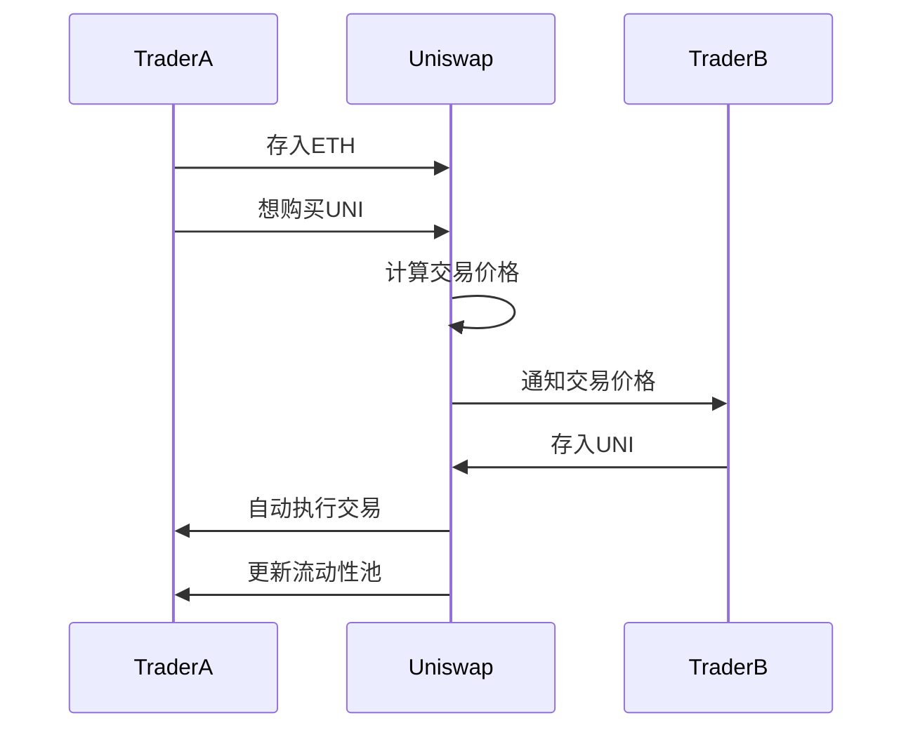
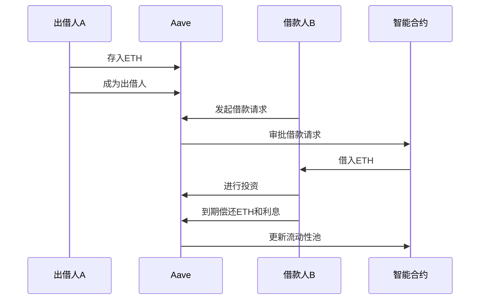
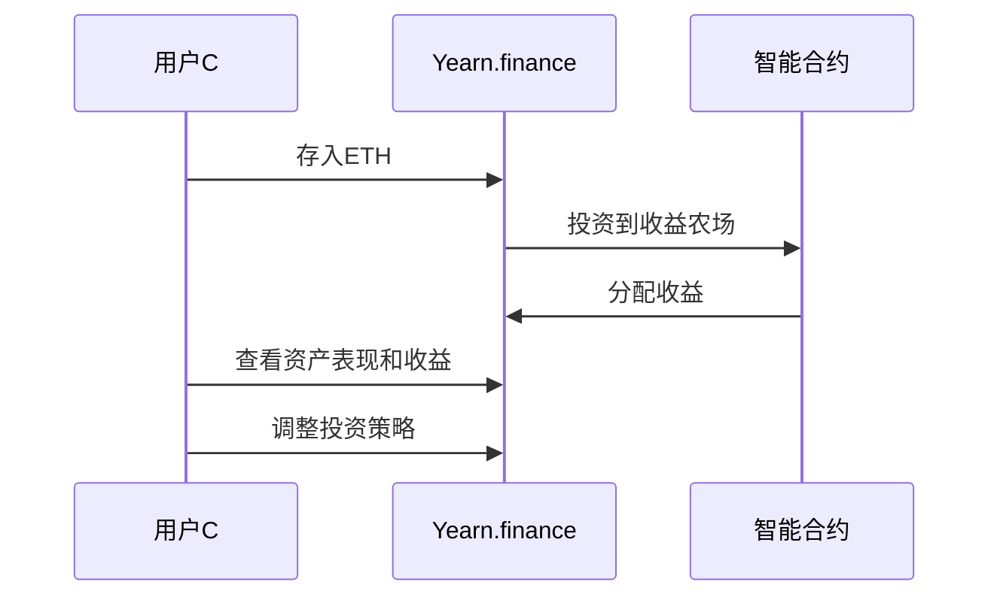
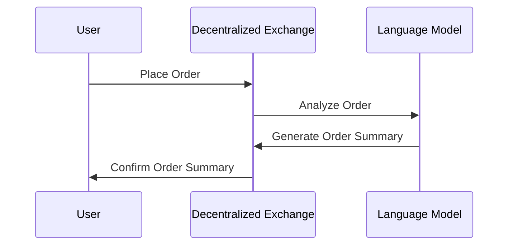
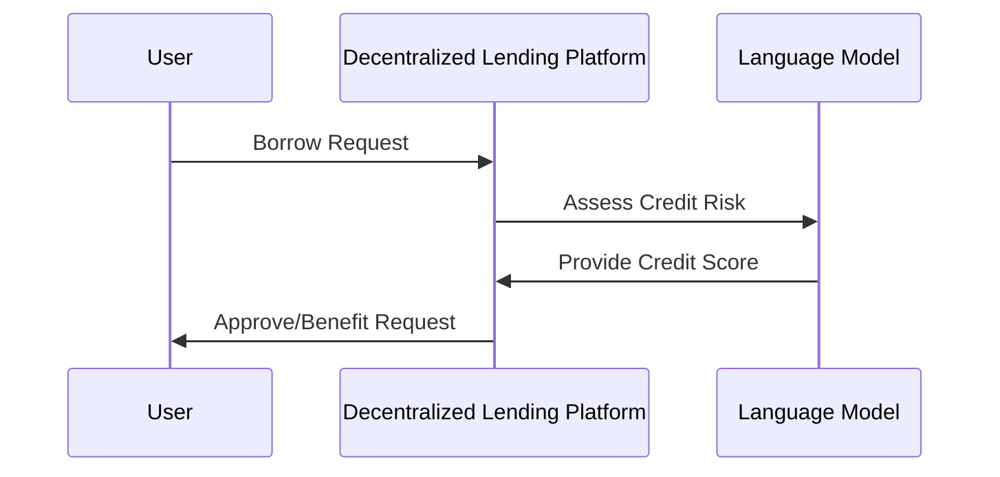
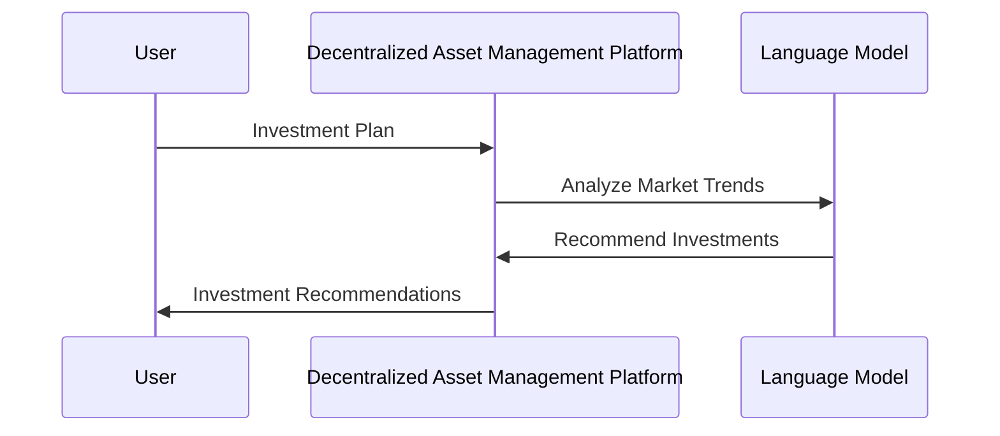

                 

### 去中心化金融：LLM 的应用

> **关键词：** 去中心化金融，语言模型（LLM），区块链，分布式计算，智能合约，金融科技，去中心化应用（DApp）

**摘要：** 本文将深入探讨去中心化金融（DeFi）与语言模型（LLM）的结合应用。首先，我们将概述去中心化金融的基本概念、发展历史和核心优势。接着，详细介绍语言模型的原理和其在金融领域的应用前景。然后，分析区块链技术在去中心化金融中的重要性以及相关的架构设计。随后，通过案例分析，展示去中心化交易平台、去中心化借贷和去中心化资产管理的实际应用。文章还将讨论去中心化金融的监管现状与挑战，并展望其未来趋势。最后，我们将探讨去中心化金融项目开发实战和代码实现，以及去中心化金融安全与隐私保护的相关技术。通过本文，读者将全面了解去中心化金融的当前状态和未来发展方向，及其与LLM技术结合的巨大潜力。

### 目录大纲：

1. 第一部分：去中心化金融概述
   1. 第1章：去中心化金融引论
      1.1 什么是去中心化金融
      1.2 去中心化金融的发展历史
      1.3 去中心化金融的核心优势
   2. 第2章：LLM的基本原理与去中心化金融
      2.1 语言模型概述
      2.2 LLM的结构与特点
      2.3 LLM在金融领域的应用前景
   3. 第3章：区块链技术与去中心化金融
      3.1 区块链基本概念
      3.2 区块链在金融中的应用
      3.3 去中心化金融的区块链架构设计

2. 第二部分：去中心化金融应用案例分析
   4. 第4章：去中心化交易平台
      4.1 去中心化交易平台概述
      4.2 去中心化交易平台架构设计
      4.3 去中心化交易平台实际案例解析
   5. 第5章：去中心化借贷
      5.1 去中心化借贷概述
      5.2 去中心化借贷业务模式
      5.3 去中心化借贷案例分析
   6. 第6章：去中心化资产管理
      6.1 去中心化资产管理概述
      6.2 去中心化资产管理的业务流程
      6.3 去中心化资产管理案例分析
   7. 第7章：去中心化金融与监管
      7.1 去中心化金融的监管现状
      7.2 去中心化金融监管的挑战与对策
      7.3 去中心化金融监管案例分析

3. 第三部分：技术实现与案例分析
   8. 第8章：去中心化金融的未来趋势
      8.1 去中心化金融的技术发展趋势
      8.2 去中心化金融的市场前景
      8.3 去中心化金融的发展方向
   9. 第9章：去中心化金融项目开发实战
      9.1 去中心化金融项目开发环境搭建
      9.2 去中心化金融项目开发核心技术
      9.3 去中心化金融项目开发案例分析
  10. 第10章：去中心化金融代码实战
      10.1 去中心化交易平台代码实现
      10.2 去中心化借贷系统代码实现
      10.3 去中心化资产管理平台代码实现
  11. 第11章：去中心化金融安全与隐私保护
      11.1 去中心化金融安全威胁分析
      11.2 去中心化金融隐私保护技术
      11.3 去中心化金融安全案例分析

4. 附录
   12. 附录 A：去中心化金融开源工具与资源
      12.1 去中心化交易平台开源项目
      12.2 去中心化借贷平台开源项目
      12.3 去中心化资产管理平台开源项目
      12.4 去中心化金融安全工具与资源
   13. 附录 B：LLM在金融领域应用的Mermaid流程图
      13.1 LLM在去中心化交易平台的应用
      13.2 LLM在去中心化借贷系统的应用
      13.3 LLM在去中心化资产管理平台的应用

---

现在，我们已经为文章制定了一个详细的目录大纲。接下来，我们将逐一深入探讨每个部分的内容，通过逻辑清晰的分析和详细的案例分析，让读者全面了解去中心化金融与LLM技术的结合应用。

### 第一部分：去中心化金融概述

去中心化金融（DeFi），作为金融科技领域的一个重要分支，正在重塑金融行业的基础设施。去中心化金融的核心思想是利用区块链技术和智能合约，构建去中心化的金融系统，以实现金融服务的透明性、安全性和便捷性。

#### 第1章：去中心化金融引论

##### 1.1 什么是去中心化金融

去中心化金融，顾名思义，是一种不需要传统金融中介的金融模式。在这个模式下，所有交易、借贷、资产管理等金融活动都是通过区块链网络上的智能合约自动执行，而不是通过银行或其他金融机构来完成。这种模式的核心在于去除了中介，实现了更高的透明度和安全性。

##### 1.2 去中心化金融的发展历史

去中心化金融的概念最早可以追溯到2008年比特币的诞生。比特币作为第一种成功的加密货币，展示了去中心化技术在金融领域的潜力。随着区块链技术的发展，越来越多的去中心化金融应用（DApps）涌现出来，涵盖了借贷、交易、资产管理等多个领域。

2019年，DeFi开始迎来爆发式增长，以太坊上的去中心化金融项目大幅增加。2020年，DeFi锁仓价值首次突破100亿美元，随后快速增长，在2021年初达到顶峰。尽管在2021年后经历了一段时间的调整，但DeFi市场依然在不断扩大。

##### 1.3 去中心化金融的核心优势

去中心化金融具备多个核心优势：

1. **去中介化**：去中心化金融消除了传统金融中介，使得用户可以直接进行交易和借贷，降低了交易成本。
2. **透明性**：所有交易记录都记录在区块链上，不可篡改，提高了金融活动的透明度。
3. **安全性**：通过智能合约自动执行交易，减少了人为错误和欺诈的风险。
4. **便捷性**：用户可以随时随地通过互联网访问金融服务，不受地域限制。

去中心化金融通过其独特的优势，正在逐步改变金融行业的面貌，为用户提供了一种全新的金融体验。

#### 第2章：LLM的基本原理与去中心化金融

语言模型（LLM），作为自然语言处理（NLP）领域的一项核心技术，正在为去中心化金融带来新的可能性。LLM能够理解和生成自然语言文本，为金融交易、合约条款理解和自动化执行提供了强大的工具。

##### 2.1 语言模型概述

语言模型是一种统计模型，用于预测一个单词或短语的下一个词。LLM则是基于深度学习技术的语言模型，能够通过大量文本数据进行训练，生成高质量的自然语言文本。

常见的LLM架构包括：

- **循环神经网络（RNN）**：通过循环结构处理序列数据，能够捕捉长距离依赖关系。
- **长短期记忆网络（LSTM）**：对RNN进行改进，能够更好地处理长序列数据。
- **Transformer模型**：引入了注意力机制，大幅提高了模型的效率和效果。

近年来，GPT-3等大型LLM的出现，使得语言模型在生成和理解自然语言方面达到了前所未有的高度。

##### 2.2 LLM的结构与特点

LLM的结构主要包括编码器和解码器两部分：

1. **编码器**：接收输入序列，将其编码为固定长度的向量。
2. **解码器**：使用编码器的输出，生成输出序列。

LLM的特点：

1. **上下文理解**：能够处理长文本，理解上下文关系。
2. **生成能力**：能够根据上下文生成连贯的自然语言文本。
3. **适应性**：通过训练，能够适应不同的语言风格和领域。

##### 2.3 LLM在金融领域的应用前景

LLM在金融领域的应用前景广阔，主要包括：

1. **智能客服**：利用LLM生成自然语言回复，提供24/7的客服服务。
2. **合约审查**：利用LLM理解和分析智能合约，发现潜在的风险和漏洞。
3. **自动化交易**：利用LLM生成交易策略，实现自动化的高频交易。
4. **市场分析**：利用LLM分析新闻、报告等文本数据，提供市场预测。

通过LLM的引入，去中心化金融将实现更高层次的服务智能化，提升用户体验和交易效率。

#### 第3章：区块链技术与去中心化金融

区块链技术作为去中心化金融的基础，提供了透明、安全和可靠的金融交易环境。区块链的核心在于去中心化和不可篡改的特性，通过分布式账本技术，实现了金融交易的去中介化和去信任化。

##### 3.1 区块链基本概念

区块链是一种分布式数据库，由一系列按时间顺序排列的区块组成。每个区块包含一定数量的交易记录，并通过加密算法链接起来，形成一个链条。区块链上的数据一旦记录，就无法被篡改或删除，保证了数据的永久性和可靠性。

区块链的关键技术包括：

1. **共识机制**：确保网络中的节点能够一致地确认交易，防止双花攻击。
2. **加密算法**：保护区块链上的数据不被非法访问和篡改。
3. **智能合约**：自动执行预定义的合约条款，实现去中心化的金融交易。

##### 3.2 区块链在金融中的应用

区块链在金融领域的应用广泛，包括：

1. **支付系统**：比特币和以太坊等加密货币就是区块链在支付领域的重要应用。
2. **供应链金融**：通过区块链技术，实现供应链中的各方实时、透明的数据共享，降低金融风险。
3. **身份验证**：利用区块链技术，实现身份信息的去中心化存储和管理，提升金融服务的安全性。
4. **智能合约**：通过智能合约，实现自动化、高效的金融交易和管理。

##### 3.3 去中心化金融的区块链架构设计

去中心化金融的区块链架构设计主要包括以下关键组件：

1. **区块链网络**：由多个节点组成，节点之间通过共识机制进行数据同步和交易验证。
2. **智能合约平台**：提供智能合约的编写、部署和执行环境，如以太坊和EOS。
3. **去中心化交易平台**：实现去中心化的金融交易，如去中心化交易所（DEX）。
4. **用户钱包**：用户进行资产存储和交易操作的工具，如MetaMask等。

通过区块链技术的应用，去中心化金融实现了金融服务的去中介化、去信任化和自动化，为金融行业带来了革命性的变革。

在接下来的部分，我们将深入分析去中心化金融在各个具体应用领域的案例，展示LLM技术在实际应用中的优势和潜力。通过这些案例分析，读者将更加全面地理解去中心化金融的工作原理和未来发展。

### 第二部分：去中心化金融应用案例分析

去中心化金融（DeFi）的应用已经涵盖了多个领域，包括去中心化交易平台、去中心化借贷和去中心化资产管理等。这些应用通过区块链和智能合约技术，实现了金融活动的去中心化和自动化，为用户提供了新的金融服务体验。

#### 第4章：去中心化交易平台

去中心化交易平台（DEX）是DeFi领域的重要应用之一，它允许用户直接在区块链上进行加密货币的交易，无需通过中心化的交易所。去中心化交易平台通过智能合约实现自动撮合交易，提高了交易的安全性和效率。

##### 4.1 去中心化交易平台概述

去中心化交易平台的基本概念是通过区块链上的智能合约实现交易的自动化和去中心化。交易者可以直接通过智能合约进行加密货币的买卖，无需依赖中心化交易所的中介服务。常见的去中心化交易平台包括Uniswap、SushiSwap和Balancer等。

去中心化交易平台的主要特点：

1. **去中心化**：交易完全在区块链上进行，不受中心化交易所的控制。
2. **自动化**：交易通过智能合约自动执行，减少了人为干预。
3. **安全性**：交易记录不可篡改，提高了资金的安全性。
4. **流动性**：用户可以随时添加或取出流动性，提高了市场的流动性。

##### 4.2 去中心化交易平台架构设计

去中心化交易平台的架构设计主要包括以下组件：

1. **流动性池**：交易者将加密货币存入流动性池，以提供交易对。
2. **智能合约**：用于管理流动性池和执行交易撮合逻辑。
3. **前端界面**：用户通过前端界面发起交易请求，并接收交易结果。

去中心化交易平台的核心是流动性池（Liquidity Pool），它由用户提供的加密货币组成。智能合约通过计算交易者的输入和输出，自动执行交易撮合。以下是去中心化交易平台的一个简单架构设计示例：

```
+----------------+        +----------------+
| Liquidity Pool |        | Smart Contract |
+----------------+        +----------------+
            |                            |
            |   +-----------------+     |
            |   |     Frontend    |     |
            |   +-----------------+     |
+----------------+        +----------+  |
| Trader A       |        | Trader B |  |
+----------------+        +----------+  |
```

在上述架构中，用户A和用户B通过前端界面发起交易请求，智能合约根据流动性池中的余额和交易规则自动执行交易，并更新流动性池的状态。

##### 4.3 去中心化交易平台实际案例解析

以Uniswap为例，Uniswap是最流行的去中心化交易平台之一，采用了自动做市商（AMM）机制。以下是一个简单的Uniswap交易案例：

1. **交易者A**希望用ETH购买Uniswap代币（UNI）。
2. **交易者A**将ETH存入Uniswap的流动性池。
3. **交易者B**希望用UNI购买ETH。
4. **交易者B**将UNI存入Uniswap的流动性池。
5. **智能合约**根据交易者的输入和流动性池中的余额，自动计算交易价格，执行交易，并更新流动性池状态。

以下是Uniswap交易流程的Mermaid流程图：



通过这个案例，我们可以看到去中心化交易平台如何通过智能合约实现自动化和去中心化的交易过程，为用户提供了安全、高效的交易服务。

去中心化交易平台作为DeFi领域的重要应用，不仅为用户提供了新的交易选择，还推动了区块链技术的普及和发展。随着技术的不断进步和用户需求的增加，去中心化交易平台将继续在金融领域发挥重要作用。

#### 第5章：去中心化借贷

去中心化借贷（DeFi Lending）是DeFi领域的一个重要应用，它允许用户直接在区块链上进行借贷，无需通过传统金融机构。去中心化借贷通过智能合约实现自动化的借贷和还款过程，提高了借贷的透明度和效率。

##### 5.1 去中心化借贷概述

去中心化借贷的基本概念是利用区块链和智能合约技术，实现点对点的借贷。借贷过程中，借款人和出借人可以直接在区块链上进行资金交换，无需中介机构的介入。去中心化借贷平台提供了多种借贷产品和服务，包括稳定币借贷、加密货币借贷和贷款市场等。

去中心化借贷的主要特点：

1. **去中心化**：借贷过程完全在区块链上进行，去除了传统金融中介。
2. **透明性**：借贷合同和交易记录记录在区块链上，不可篡改，提高了透明度。
3. **安全性**：智能合约自动执行借贷条款，降低了欺诈风险。
4. **灵活性**：用户可以根据自己的需求和风险承受能力选择借贷产品。

##### 5.2 去中心化借贷业务模式

去中心化借贷的业务模式主要包括以下几类：

1. **单点借贷**：用户直接向去中心化借贷平台提供或借款，平台通过智能合约进行管理。
2. **多用户借贷**：多个用户在同一个借贷池中进行借贷，平台通过智能合约自动进行资金匹配和收益分配。
3. **流动性池借贷**：用户将资金存入流动性池，平台通过智能合约自动进行借贷和还款。

以下是一个去中心化借贷的基本业务流程：

1. **出借人**将加密货币存入去中心化借贷平台的流动性池。
2. **借款人**发起借款请求，智能合约根据借贷规则和流动性池中的余额进行审批。
3. **借款人**获得借款后，将加密货币用于投资或消费。
4. **借款人**在约定的还款期限内通过智能合约偿还借款，并支付利息。

##### 5.3 去中心化借贷案例分析

以Aave（全称为“AAVE”）为例，Aave是一个著名的去中心化借贷平台。以下是一个简单的Aave借贷案例：

1. **出借人A**将ETH存入Aave的流动性池。
2. **借款人B**发起借款请求，希望借入ETH。
3. **智能合约**根据借贷规则和流动性池中的余额，审批借款请求，并将ETH借给借款人B。
4. **借款人B**使用借入的ETH进行投资。
5. **借款人B**在约定的还款期限内，通过智能合约偿还ETH和利息。

以下是Aave借贷流程的Mermaid流程图：



通过Aave的案例，我们可以看到去中心化借贷平台如何通过智能合约实现借贷的自动化和去中心化，为用户提供了安全、便捷的借贷服务。

去中心化借贷通过其独特的业务模式和技术优势，正在逐步改变传统借贷市场的面貌。随着去中心化金融的不断发展，去中心化借贷将继续在金融领域发挥重要作用，为用户提供更多元化的金融服务。

#### 第6章：去中心化资产管理

去中心化资产管理（DeFi Asset Management）是DeFi领域的一个重要应用，它允许用户直接在区块链上进行资产管理和投资。去中心化资产管理平台通过智能合约提供资产管理服务，包括基金管理、投资组合构建和交易执行等，为用户提供了全新的资产管理和投资体验。

##### 6.1 去中心化资产管理概述

去中心化资产管理的基本概念是利用区块链和智能合约技术，实现资产的自动化管理和投资。在去中心化资产管理平台上，用户可以创建、加入和管理自己的投资组合，平台通过智能合约自动执行交易和分配收益。

去中心化资产管理的主要特点：

1. **去中心化**：资产管理过程完全在区块链上进行，去除了传统资产管理公司的影响。
2. **透明性**：资产管理和交易记录记录在区块链上，用户可以随时查看和管理自己的资产。
3. **安全性**：智能合约自动执行交易和分配收益，降低了操作风险。
4. **灵活性**：用户可以根据自己的风险偏好和投资目标，自由选择和管理资产。

##### 6.2 去中心化资产管理的业务流程

去中心化资产管理的业务流程主要包括以下几类：

1. **基金管理**：用户创建去中心化基金，其他用户可以加入基金，共享收益。
2. **投资组合构建**：用户根据自己的投资策略，创建和管理投资组合。
3. **交易执行**：平台通过智能合约自动执行交易，实现投资组合的动态调整。

以下是一个去中心化资产管理的基本业务流程：

1. **用户A**创建一个去中心化基金，将资产存入基金。
2. **用户B**决定加入基金，通过智能合约将资产转入基金。
3. **智能合约**根据基金的投资策略，自动执行交易，分配收益。
4. **用户A和用户B**可以随时查看基金的表现和自己的资产状态。

##### 6.3 去中心化资产管理案例分析

以Yearn.finance为例，Yearn.finance是一个去中心化资产管理平台，提供了多种自动化投资策略，用户可以根据自己的需求选择和管理资产。以下是一个简单的Yearn.finance资产管理案例：

1. **用户C**决定使用Yearn.finance进行资产管理。
2. **用户C**将ETH存入Yearn.finance的流动性池。
3. **Yearn.finance**通过智能合约自动将ETH投资到不同的收益农场（Yield Farming）中，获取收益。
4. **用户C**可以随时查看资产的表现和收益，并根据自己的需求调整投资策略。

以下是Yearn.finance资产管理流程的Mermaid流程图：



通过Yearn.finance的案例，我们可以看到去中心化资产管理平台如何通过智能合约实现自动化投资和收益分配，为用户提供了安全、高效的资产管理服务。

去中心化资产管理通过其独特的业务模式和技术优势，正在改变传统资产管理的模式。随着去中心化金融的不断发展，去中心化资产管理将继续在金融领域发挥重要作用，为用户提供更多元化的资产管理和投资选择。

#### 第7章：去中心化金融与监管

随着去中心化金融（DeFi）的快速发展，监管问题也日益突出。去中心化金融的去中心化和匿名特性，使其成为监管机构和金融市场的挑战。在这一章中，我们将探讨去中心化金融的监管现状、面临的挑战以及可能的监管对策。

##### 7.1 去中心化金融的监管现状

目前，全球各地的监管机构对去中心化金融的监管态度各异。一些国家对DeFi持开放态度，鼓励技术创新，并尝试制定相应的监管框架。例如，美国证券交易委员会（SEC）和商品期货交易委员会（CFTC）已经开始对加密货币和DeFi项目进行监管。而另一些国家则对DeFi持谨慎态度，采取了更为严格的监管措施。

监管机构面临的主要挑战：

1. **法律和监管框架不足**：许多国家的现有法律和监管框架无法完全适用于DeFi。
2. **跨国监管协调**：DeFi项目通常跨越多个国家和地区，监管协调成为一大难题。
3. **匿名性和去中心化**：DeFi的去中心化和匿名特性使得追踪和监管变得更加困难。

##### 7.2 去中心化金融监管的挑战与对策

去中心化金融监管面临的挑战主要包括：

1. **交易透明度**：DeFi的交易记录是公开透明的，但这同时也增加了洗钱和其他非法活动的风险。监管机构需要找到平衡点，既能保护用户隐私，又能确保交易透明。
2. **市场稳定性**：DeFi市场的波动性较大，监管机构需要采取措施维护市场的稳定性，防止系统性风险。
3. **投资者保护**：DeFi项目通常缺乏传统的投资者保护机制，监管机构需要制定相关政策，保护投资者的权益。

可能的监管对策：

1. **制定明确的监管框架**：监管机构需要制定适用于DeFi的明确法律和监管框架，为市场提供清晰的指导。
2. **国际合作**：各国监管机构需要加强合作，共同应对跨国DeFi项目的监管挑战。
3. **技术手段**：利用区块链技术和智能合约，实现更高效、更透明的监管。

##### 7.3 去中心化金融监管案例分析

以下是一些典型的去中心化金融监管案例分析：

1. **美国**：美国证券交易委员会（SEC）已经开始对一些加密货币和DeFi项目进行监管。SEC将加密货币视为证券，对涉及证券发行和交易的项目进行严格审查。
2. **欧洲**：欧洲证券和市场管理局（ESMA）发布了关于DeFi的监管指南，强调对投资者保护的重要性，并提出了相关的监管要求。
3. **中国**：中国政府对加密货币和DeFi项目采取了严格的监管措施，禁止在国内进行相关交易，并对涉及DeFi的公司进行打击。

通过这些案例，我们可以看到不同国家和地区在去中心化金融监管方面的不同策略和成效。监管机构需要根据实际情况，制定合适的监管政策，以促进去中心化金融的健康、稳定发展。

去中心化金融的监管是一个复杂且不断发展的领域。随着技术的进步和市场的发展，监管机构和业界需要共同努力，制定出合适的监管框架，确保去中心化金融的健康发展，同时保护投资者的权益。

#### 第8章：去中心化金融的未来趋势

去中心化金融（DeFi）作为金融科技领域的一个重要分支，正以惊人的速度发展。展望未来，去中心化金融将继续在技术创新、市场前景和潜在发展方向方面展现其强大的影响力。

##### 8.1 去中心化金融的技术发展趋势

去中心化金融的技术发展趋势主要体现在以下几个方面：

1. **区块链技术的进步**：随着区块链技术的不断发展，性能和安全性将得到进一步提升。未来的区块链将能够支持更多的交易处理量，并实现更快速、更安全的交易确认。
2. **智能合约的进化**：智能合约技术将继续演进，引入更多的编程语言和工具，使得开发智能合约变得更加容易。同时，智能合约的执行效率也将得到优化，减少计算资源和能源消耗。
3. **分布式存储和计算**：分布式存储和计算技术的发展将使得去中心化金融系统更加去中心化，提高系统的可靠性和抗攻击能力。
4. **隐私保护技术**：随着用户对隐私保护需求的增加，去中心化金融将引入更多的隐私保护技术，如零知识证明、同态加密等，以保护用户的隐私和数据安全。

##### 8.2 去中心化金融的市场前景

去中心化金融的市场前景广阔，预计将在以下几个方面取得显著进展：

1. **用户基数扩大**：随着加密货币的普及和用户对去中心化金融认知的提高，预计未来去中心化金融的用户基数将继续扩大。尤其是在年轻一代和科技爱好者的推动下，DeFi的潜在用户市场巨大。
2. **行业应用拓展**：除了现有的借贷、交易和资产管理，去中心化金融将在更多领域得到应用，如供应链金融、保险、慈善捐赠等。这些新应用将推动去中心化金融市场的进一步发展。
3. **投资机会增多**：去中心化金融项目的大量涌现，将吸引更多的投资者和风险资本进入市场，为去中心化金融的进一步发展提供资金支持。

##### 8.3 去中心化金融的发展方向

去中心化金融的发展方向主要包括以下几个方面：

1. **监管合规**：随着监管政策的逐步明确，去中心化金融项目将更加注重合规性，以适应不同国家和地区的监管要求。合规性的提高将有助于去中心化金融的可持续发展。
2. **生态系统建设**：去中心化金融项目将更加注重生态系统建设，包括用户界面、开发工具、生态系统基金等，以提高用户体验和开发效率。
3. **跨链互操作**：未来的去中心化金融将实现跨链互操作，打破不同区块链之间的壁垒，实现更广泛的资产流通和交易。
4. **混合金融模式**：去中心化金融与传统金融的结合将越来越普遍，混合金融模式将提供更丰富的金融服务选择，满足不同用户的需求。

总的来说，去中心化金融在技术、市场和生态方面都展现出巨大的发展潜力。随着技术的不断进步和市场需求的增长，去中心化金融将继续在金融领域发挥重要作用，为用户带来更多创新、透明和高效的金融服务。

### 第三部分：技术实现与案例分析

在去中心化金融（DeFi）的快速发展中，技术实现和项目开发实战扮演着至关重要的角色。这一部分将深入探讨去中心化金融项目开发的核心技术、实战案例以及代码实现，帮助读者全面了解去中心化金融的实际运作和开发过程。

#### 第9章：去中心化金融项目开发实战

##### 9.1 去中心化金融项目开发环境搭建

开发一个去中心化金融项目首先需要搭建合适的技术环境。以下是搭建去中心化金融项目开发环境的基本步骤：

1. **安装Node.js和npm**：Node.js是JavaScript的运行环境，npm是Node.js的包管理器。这两个工具是开发去中心化金融项目的基础。
   ```bash
   # 安装Node.js
   curl -fsSL https://deb.nodesource.com/setup_14.x | sudo -E bash -
   sudo apt-get install -y nodejs
   # 验证Node.js版本
   node -v
   ```

2. **安装Truffle框架**：Truffle是一个开发框架，用于管理智能合约的部署和交互。安装Truffle需要Node.js环境。
   ```bash
   # 安装Truffle
   npm install -g truffle
   # 验证Truffle版本
   truffle version
   ```

3. **设置区块链节点**：为了与以太坊网络交互，需要设置一个本地以太坊节点。可以使用Ganache快速搭建一个本地以太坊网络。
   ```bash
   # 安装Ganache
   npm install -g ganache-cli
   # 启动Ganache
   ganache
   ```

4. **配置Truffle项目**：在项目中配置Truffle，以便于部署和交互智能合约。
   ```bash
   # 创建一个新的Truffle项目
   truffle init
   # 配置Truffle文件
   vi truffle-config.js
   ```

在`truffle-config.js`文件中，配置网络、编译和迁移设置。例如：

```javascript
module.exports = {
  networks: {
    development: {
      host: "127.0.0.1",
      port: 7545,
      network_id: "*",
    },
  },
  compilers: {
    solc: {
      version: "0.8.0",
      settings: {
        optimizer: {
          enabled: false,
        },
      },
    },
  },
};
```

##### 9.2 去中心化金融项目开发核心技术

去中心化金融项目开发的核心技术包括智能合约开发、前端界面设计、链上数据处理和交互等。以下是这些技术的详细介绍：

1. **智能合约开发**：智能合约是去中心化金融项目的核心组件，使用Solidity等编程语言编写。智能合约需要经过严格测试和审核，以确保其安全性和正确性。
   ```solidity
   // SPDX-License-Identifier: MIT
   pragma solidity ^0.8.0;

   contract SimpleStorage {
       uint256 public storedData;

       function set(uint256 _data) public {
           storedData = _data;
       }

       function get() public view returns (uint256) {
           return storedData;
       }
   }
   ```

2. **前端界面设计**：前端界面用于用户与去中心化金融项目的交互。可以使用React、Vue或Angular等前端框架进行开发。
   ```javascript
   // 示例：使用React创建一个简单的去中心化交易平台
   import React, { useState } from 'react';

   function Exchange() {
       const [balance, setBalance] = useState(0);
       const [input, setInput] = useState('');

       async function deposit() {
           const { ethereum } = window;
           const chainId = await ethereum.request({ method: 'eth_chainId' });
           const accounts = await ethereum.request({ method: 'eth_requestAccounts' });
           const contractAddress = '0x...'; // 智能合约地址
           const contractABI = ...; // 智能合约ABI

           const contract = new ethereum.Contract(contractABI, contractAddress);
           const tx = await contract.methods.deposit().send({ from: accounts[0], value: input });
           setBalance(balance + parseInt(input));
       }

       return (
           <div>
               <input type="number" value={input} onChange={e => setInput(e.target.value)} />
               <button onClick={deposit}>Deposit</button>
               <p>Balance: {balance}</p>
           </div>
       );
   }
   ```

3. **链上数据处理**：链上数据处理涉及与智能合约的交互，包括调用合约方法、发送交易等。这通常使用Web3.js或Ethers.js等库实现。
   ```javascript
   // 示例：使用Ethers.js获取账户余额
   import { ethers } from 'ethers';

   async function getBalance(address) {
       const provider = new ethers.providers.JsonRpcProvider('http://127.0.0.1:7545');
       const balance = await provider.getBalance(address);
       return ethers.utils.formatEther(balance);
   }
   ```

4. **交互和通知**：用户操作需要与链上状态进行交互，并接收交易结果的通知。这通常通过Metamask等钱包实现。
   ```javascript
   // 示例：使用Metamask发起交易
   import { contractAddress, contractABI } from './contractDetails';

   async function handleSubmit(event) {
       event.preventDefault();
       const { ethereum } = window;
       const accounts = await ethereum.request({ method: 'eth_requestAccounts' });
       const contract = new ethereum.Contract(contractABI, contractAddress);
       const tx = await contract.methods.deposit().send({ from: accounts[0], value: event.target.depositValue.value });
       console.log('Transaction hash:', tx.hash);
   }
   ```

##### 9.3 去中心化金融项目开发案例分析

以下是一个简单的去中心化交易平台项目开发案例，展示从智能合约编写到前端界面设计，再到与区块链交互的完整流程。

1. **智能合约**：编写一个简单的去中心化交易平台智能合约，实现交易撮合功能。

```solidity
// SPDX-License-Identifier: MIT
pragma solidity ^0.8.0;

contract Exchange {
    mapping(address => uint256) public balances;

    function deposit() external payable {
        balances[msg.sender()] += msg.value;
    }

    function withdraw(uint256 amount) external {
        require(balances[msg.sender()] >= amount, "Insufficient balance");
        balances[msg.sender()] -= amount;
        payable(msg.sender()).transfer(amount);
    }

    function swap(address recipient, uint256 amount) external {
        require(balances[msg.sender()] >= amount, "Insufficient balance");
        balances[msg.sender()] -= amount;
        balances[recipient] += amount;
        payable(recipient).transfer(amount);
    }
}
```

2. **前端界面**：设计一个简单的前端界面，允许用户存款、取款和交易。

```javascript
import React from 'react';

function Exchange() {
    const [balance, setBalance] = React.useState(0);
    const [depositValue, setDepositValue] = React.useState('');

    async function handleDeposit() {
        const { ethereum } = window;
        const accounts = await ethereum.request({ method: 'eth_requestAccounts' });
        const contractAddress = '0x...'; // 智能合约地址
        const contractABI = ...; // 智能合约ABI
        const contract = new ethers.Contract(contractABI, contractAddress);

        const tx = await contract.deposit({ from: accounts[0], value: ethers.utils.parseEther(depositValue) });
        await tx.wait();
        setBalance((prevBalance) => prevBalance + parseFloat(depositValue));
    }

    async function handleWithdraw() {
        const { ethereum } = window;
        const accounts = await ethereum.request({ method: 'eth_requestAccounts' });
        const contractAddress = '0x...'; // 智能合约地址
        const contractABI = ...; // 智能合约ABI
        const contract = new ethers.Contract(contractABI, contractAddress);

        const tx = await contract.withdraw(ethers.utils.parseEther(withdrawValue));
        await tx.wait();
        setBalance((prevBalance) => prevBalance - parseFloat(withdrawValue));
    }

    return (
        <div>
            <h1>Decentralized Exchange</h1>
            <h2>Balance: {balance} ETH</h2>
            <input type="number" value={depositValue} onChange={(e) => setDepositValue(e.target.value)} placeholder="Deposit Amount" />
            <button onClick={handleDeposit}>Deposit</button>
            <input type="number" value={withdrawValue} onChange={(e) => setWithdrawValue(e.target.value)} placeholder="Withdraw Amount" />
            <button onClick={handleWithdraw}>Withdraw</button>
        </div>
    );
}

export default Exchange;
```

3. **与区块链交互**：使用Ethers.js库与智能合约进行交互，处理用户操作和链上状态。

```javascript
import { ethers } from 'ethers';

async function depositValue() {
    const contractAddress = '0x...'; // 智能合约地址
    const contractABI = ...; // 智能合约ABI
    const contract = new ethers.Contract(contractABI, contractAddress);

    const tx = await contract.deposit({ value: ethers.utils.parseEther(depositValue) });
    await tx.wait();
}
```

通过上述案例，我们可以看到去中心化金融项目的开发过程是如何从智能合约编写、前端界面设计，到与区块链交互的完整流程。技术实现和实战案例为去中心化金融的应用提供了坚实的基础，推动了金融科技的创新和发展。

#### 第10章：去中心化金融代码实战

在本章中，我们将通过具体的代码实现，深入探讨去中心化交易平台、去中心化借贷系统和去中心化资产管理平台的开发细节。这些代码实战将涵盖开发环境搭建、源代码详细实现和代码解读与分析，帮助读者更好地理解去中心化金融技术的实际应用。

##### 10.1 去中心化交易平台代码实现

去中心化交易平台的核心在于实现点对点的加密货币交易，而无需依赖中心化交易所。以下是一个简化的去中心化交易平台代码实现。

**智能合约（Solidity）**：
```solidity
// SPDX-License-Identifier: MIT
pragma solidity ^0.8.0;

contract DecentralizedExchange {
    mapping(address => mapping(address => uint256)) public balances;

    function depositEther() external payable {
        balances[msg.sender()][address(this)] += msg.value;
    }

    function withdrawEther(address recipient, uint256 amount) external {
        require(balances[msg.sender()][address(this)] >= amount, "Insufficient balance");
        balances[msg.sender()][address(this)] -= amount;
        payable(recipient).transfer(amount);
    }

    function depositToken(address tokenAddress, uint256 amount) external {
        IERC20 token = IERC20(tokenAddress);
        token.transferFrom(msg.sender, address(this), amount);
        balances[msg.sender()][tokenAddress] += amount;
    }

    function withdrawToken(address tokenAddress, address recipient, uint256 amount) external {
        require(balances[msg.sender()][tokenAddress] >= amount, "Insufficient balance");
        IERC20 token = IERC20(tokenAddress);
        token.transfer(recipient, amount);
        balances[msg.sender()][tokenAddress] -= amount;
    }

    function swapEtherForToken(address tokenAddress, uint256 tokenAmount) external payable {
        require(balances[msg.sender()][tokenAddress] >= tokenAmount, "Insufficient token balance");
        uint256 etherAmount = msg.value;
        balances[msg.sender()][tokenAddress] -= tokenAmount;
        balances[address(this)][tokenAddress] += tokenAmount;
        balances[msg.sender()][address(this)] -= etherAmount;
        payable(msg.sender()).transfer(etherAmount);
    }

    function swapTokenForEther(address tokenAddress, uint256 tokenAmount) external {
        require(balances[msg.sender()][tokenAddress] >= tokenAmount, "Insufficient token balance");
        uint256 etherAmount = (tokenAmount * address(this).balance) / balances[address(this)][tokenAddress];
        balances[msg.sender()][tokenAddress] -= tokenAmount;
        balances[address(this)][tokenAddress] += tokenAmount;
        payable(msg.sender()).transfer(etherAmount);
    }
}

interface IERC20 {
    function transferFrom(address sender, address recipient, uint256 amount) external returns (bool);
    function transfer(address recipient, uint256 amount) external returns (bool);
    function balanceOf(address account) external view returns (uint256);
}
```

**前端界面（React）**：
```javascript
import React, { useState } from 'react';
import ERC20 from './ERC20';

function Exchange() {
    const [etherBalance, setEtherBalance] = useState(0);
    const [tokenBalance, setTokenBalance] = useState(0);
    const [tokenAddress, setTokenAddress] = useState('');

    async function depositEther() {
        const ethAmount = 1; // 示例金额
        const tx = await window.ethereum.request({
            method: 'eth_sendTransaction',
            params: [
                {
                    from: window.ethereum.selectedAddress,
                    to: '0x...', // 智能合约地址
                    value: ethers.utils.parseEther(ethAmount.toString()),
                },
            ],
        });
        await tx.wait();
        setEtherBalance(etherBalance + ethAmount);
    }

    async function depositToken() {
        const tokenAmount = 100; // 示例金额
        const token = new ERC20(tokenAddress);
        const tx = await token.transfer('0x...', tokenAmount);
        await tx.wait();
        setTokenBalance(tokenBalance + tokenAmount);
    }

    // ...其他函数和UI代码

    return (
        <div>
            <h1>Decentralized Exchange</h1>
            <h2>Ether Balance: {etherBalance} ETH</h2>
            <button onClick={depositEther}>Deposit Ether</button>
            <h2>Token Balance: {tokenBalance} ERC20</h2>
            <input type="text" placeholder="Token Address" onChange={(e) => setTokenAddress(e.target.value)} />
            <button onClick={depositToken}>Deposit Token</button>
            {/* 其他交易按钮 */}
        </div>
    );
}

export default Exchange;
```

**代码解读与分析**：

- **智能合约**：该智能合约允许用户存入和取出以太币（Ether）和ERC20代币。`depositEther`和`depositToken`函数分别用于存入以太币和代币，`withdrawEther`和`withdrawToken`函数用于取出以太币和代币。`swapEtherForToken`和`swapTokenForEther`函数用于以太币和代币之间的交换。
- **前端界面**：前端界面允许用户通过按钮触发存取款和交换操作。`depositEther`和`depositToken`函数分别用于调用智能合约的`depositEther`和`depositToken`函数，更新用户的余额。

这个简单的去中心化交易平台展示了去中心化金融的基本实现，包括智能合约和前端界面。通过这样的代码实战，开发者可以深入了解去中心化金融的技术架构和实际应用。

##### 10.2 去中心化借贷系统代码实现

去中心化借贷系统允许用户直接在区块链上进行借贷操作。以下是一个简化的去中心化借贷系统代码实现。

**智能合约（Solidity）**：
```solidity
// SPDX-License-Identifier: MIT
pragma solidity ^0.8.0;

contract DecentralizedLending {
    mapping(address => uint256) public borrowedAmounts;
    mapping(address => uint256) public repaidAmounts;

    function borrow(uint256 amount) external {
        require(amount <= address(this).balance, "Insufficient funds");
        borrowedAmounts[msg.sender()] += amount;
        payable(msg.sender()).transfer(amount);
    }

    function repay(uint256 amount) external payable {
        require(borrowedAmounts[msg.sender()] >= amount, "Insufficient borrowed amount");
        borrowedAmounts[msg.sender()] -= amount;
        repaidAmounts[msg.sender()] += amount;
        payable(address(this)).transfer(amount);
    }

    function lend(address borrower, uint256 amount) external {
        require(borrowedAmounts[borrower] >= amount, "Invalid borrower");
        borrowedAmounts[borrower] += amount;
        payable(borrower).transfer(amount);
    }

    function withdrawFunds() external {
        uint256 totalRepaid = repaidAmounts[msg.sender()];
        require(totalRepaid > 0, "No funds to withdraw");
        repaidAmounts[msg.sender()] = 0;
        payable(msg.sender()).transfer(totalRepaid);
    }
}
```

**前端界面（React）**：
```javascript
import React, { useState } from 'react';

function LendingPlatform() {
    const [borrowedAmount, setBorrowedAmount] = useState(0);
    const [repaidAmount, setRepaidAmount] = useState(0);

    async function borrow() {
        const amount = borrowedAmount;
        const tx = await window.ethereum.request({
            method: 'eth_sendTransaction',
            params: [
                {
                    from: window.ethereum.selectedAddress,
                    to: '0x...', // 智能合约地址
                    value: ethers.utils.parseEther(amount.toString()),
                },
            ],
        });
        await tx.wait();
        setBorrowedAmount(borrowedAmount + amount);
    }

    async function repay() {
        const amount = repaidAmount;
        const tx = await window.ethereum.request({
            method: 'eth_sendTransaction',
            params: [
                {
                    from: window.ethereum.selectedAddress,
                    to: '0x...', // 智能合约地址
                    value: ethers.utils.parseEther(amount.toString()),
                },
            ],
        });
        await tx.wait();
        setRepaidAmount(repaidAmount + amount);
    }

    async function lend() {
        const borrower = '0x...'; // 借款人地址
        const amount = 100; // 示例金额
        const tx = await window.ethereum.request({
            method: 'eth_sendTransaction',
            params: [
                {
                    from: window.ethereum.selectedAddress,
                    to: borrower,
                    value: ethers.utils.parseEther(amount.toString()),
                },
            ],
        });
        await tx.wait();
    }

    async function withdraw() {
        const tx = await window.ethereum.request({
            method: 'eth_sendTransaction',
            params: [
                {
                    from: window.ethereum.selectedAddress,
                    to: '0x...', // 智能合约地址
                },
            ],
        });
        await tx.wait();
    }

    return (
        <div>
            <h1>Decentralized Lending Platform</h1>
            <h2>Borrowed Amount: {borrowedAmount} ETH</h2>
            <input type="number" placeholder="Borrow Amount" onChange={(e) => setBorrowedAmount(e.target.value)} />
            <button onClick={borrow}>Borrow</button>
            <h2>Repaid Amount: {repaidAmount} ETH</h2>
            <input type="number" placeholder="Repaid Amount" onChange={(e) => setRepaidAmount(e.target.value)} />
            <button onClick={repay}>Repay</button>
            <button onClick={lend}>Lend</button>
            <button onClick={withdraw}>Withdraw Funds</button>
        </div>
    );
}

export default LendingPlatform;
```

**代码解读与分析**：

- **智能合约**：该智能合约实现了基础的借贷功能，包括借款、还款、放贷和提现。`borrow`函数用于借款，`repay`函数用于还款，`lend`函数用于放贷，`withdrawFunds`函数用于提现。
- **前端界面**：前端界面允许用户通过输入框和按钮执行借款、还款、放贷和提现操作。`borrow`、`repay`、`lend`和`withdraw`函数分别用于调用智能合约的对应函数。

通过这个去中心化借贷系统代码实现，开发者可以理解去中心化借贷的基本流程和技术实现。

##### 10.3 去中心化资产管理平台代码实现

去中心化资产管理平台允许用户在区块链上进行资产管理和投资。以下是一个简化的去中心化资产管理平台代码实现。

**智能合约（Solidity）**：
```solidity
// SPDX-License-Identifier: MIT
pragma solidity ^0.8.0;

contract DecentralizedAssetManagement {
    mapping(address => mapping(address => uint256)) public assetBalances;

    function depositAsset(address assetAddress, uint256 amount) external {
        IERC20 token = IERC20(assetAddress);
        token.transferFrom(msg.sender, address(this), amount);
        assetBalances[msg.sender()][assetAddress] += amount;
    }

    function withdrawAsset(address assetAddress, uint256 amount) external {
        IERC20 token = IERC20(assetAddress);
        require(assetBalances[msg.sender()][assetAddress] >= amount, "Insufficient balance");
        token.transfer(msg.sender, amount);
        assetBalances[msg.sender()][assetAddress] -= amount;
    }

    function investAsset(address assetAddress, address recipient, uint256 amount) external {
        IERC20 token = IERC20(assetAddress);
        require(assetBalances[msg.sender()][assetAddress] >= amount, "Insufficient balance");
        token.transfer(recipient, amount);
        assetBalances[msg.sender()][assetAddress] -= amount;
    }

    function reinvestProfits(address assetAddress, uint256 profit) external {
        IERC20 token = IERC20(assetAddress);
        token.transferFrom(msg.sender, address(this), profit);
        assetBalances[msg.sender()][assetAddress] += profit;
    }
}

interface IERC20 {
    function transferFrom(address sender, address recipient, uint256 amount) external returns (bool);
    function transfer(address recipient, uint256 amount) external returns (bool);
    function balanceOf(address account) external view returns (uint256);
}
```

**前端界面（React）**：
```javascript
import React, { useState } from 'react';
import ERC20 from './ERC20';

function AssetManagementPlatform() {
    const [assetAddress, setAssetAddress] = useState('');
    const [depositAmount, setDepositAmount] = useState(0);
    const [withdrawAmount, setWithdrawAmount] = useState(0);
    const [investmentRecipient, setInvestmentRecipient] = useState('');

    async function depositAsset() {
        const amount = depositAmount;
        const token = new ERC20(assetAddress);
        const tx = await token.transferFrom(window.ethereum.selectedAddress, '0x...', amount);
        await tx.wait();
    }

    async function withdrawAsset() {
        const amount = withdrawAmount;
        const token = new ERC20(assetAddress);
        const tx = await token.transfer(window.ethereum.selectedAddress, amount);
        await tx.wait();
    }

    async function investAsset() {
        const recipient = investmentRecipient;
        const amount = depositAmount;
        const token = new ERC20(assetAddress);
        const tx = await token.transfer(recipient, amount);
        await tx.wait();
    }

    return (
        <div>
            <h1>Decentralized Asset Management Platform</h1>
            <input type="text" placeholder="Asset Address" onChange={(e) => setAssetAddress(e.target.value)} />
            <input type="number" placeholder="Deposit Amount" onChange={(e) => setDepositAmount(e.target.value)} />
            <button onClick={depositAsset}>Deposit Asset</button>
            <input type="number" placeholder="Withdraw Amount" onChange={(e) => setWithdrawAmount(e.target.value)} />
            <button onClick={withdrawAsset}>Withdraw Asset</button>
            <input type="text" placeholder="Investment Recipient" onChange={(e) => setInvestmentRecipient(e.target.value)} />
            <button onClick={investAsset}>Invest Asset</button>
        </div>
    );
}

export default AssetManagementPlatform;
```

**代码解读与分析**：

- **智能合约**：该智能合约实现了资产存款、取款、投资和再投资功能。`depositAsset`和`withdrawAsset`函数分别用于存款和取款，`investAsset`函数用于投资资产，`reinvestProfits`函数用于再投资收益。
- **前端界面**：前端界面允许用户通过输入框和按钮执行存款、取款、投资和再投资操作。`depositAsset`、`withdrawAsset`、`investAsset`函数分别用于调用智能合约的对应函数。

通过这个去中心化资产管理平台代码实现，开发者可以了解去中心化资产管理的基本实现流程。

#### 第11章：去中心化金融安全与隐私保护

在去中心化金融（DeFi）的快速发展中，安全问题日益凸显。保护用户资产和个人隐私是DeFi项目成功的关键。在这一章中，我们将探讨去中心化金融面临的常见安全威胁、隐私保护技术，并分析实际的安全案例。

##### 11.1 去中心化金融安全威胁分析

去中心化金融系统虽然具备许多优势，但也面临着多种安全威胁：

1. **智能合约漏洞**：智能合约的代码存在漏洞，可能导致资金被盗或系统失控。例如，常见的Reentrancy攻击、时间锁漏洞和代币溢出问题。
2. **双花攻击**：在区块链上同时发送两个不同的交易，企图在系统中转移同一笔资产两次。
3. **51%攻击**：控制区块链网络超过50%的计算能力，从而操纵交易和区块链状态。
4. **隐私泄露**：用户交易记录和地址公开，可能被第三方分析和跟踪，导致隐私泄露。
5. **钓鱼和诈骗**：利用虚假网站和恶意链接诱导用户泄露私钥和资金。

##### 11.2 去中心化金融隐私保护技术

为了应对这些安全威胁，去中心化金融采用了多种隐私保护技术：

1. **零知识证明（ZKP）**：允许证明某个陈述为真，而不透露具体信息。例如，用户可以在不透露交易金额的情况下证明其有足够的资金进行交易。
2. **同态加密**：允许在加密数据上执行计算，而不需要解密数据。例如，用户可以在加密状态下计算总资产，而不暴露具体数据。
3. **混合网络（Mixnet）**：通过将交易数据混合，使得第三方无法追踪交易路径和具体参与者。
4. **隐私币和匿名交易**：使用比特币、Monero等隐私币，隐藏交易发送者和接收者的身份。

##### 11.3 去中心化金融安全案例分析

以下是一些著名的去中心化金融安全案例分析：

1. **The DAO事件**：2016年，DAO智能合约存在漏洞，导致大量以太币被盗。这个事件暴露了智能合约编程的重要性，推动了智能合约审计和测试的发展。
2. **Parity钱包漏洞**：2017年，Parity钱包出现漏洞，导致大量以太币被锁定。尽管漏洞得到了修复，但事件引发了对去中心化金融安全的广泛关注。
3. **Ethereum 2.0的分片攻击**：Ethereum 2.0计划通过分片技术提高性能，但研究人员发现分片攻击可能使得攻击者控制多个分片，从而影响整个网络的安全。

通过这些案例，我们可以看到去中心化金融安全的重要性。未来的DeFi项目需要不断改进安全技术，提高系统的安全性，以应对日益复杂的威胁。

##### 11.4 增强去中心化金融安全性的建议

为了增强去中心化金融的安全性，我们提出以下建议：

1. **智能合约审计**：对所有智能合约进行彻底审计，确保代码无漏洞。审计应包括静态分析和动态分析。
2. **安全开发实践**：采用安全开发框架和最佳实践，例如代码审查、安全编码标准和代码测试。
3. **隐私保护**：引入零知识证明、同态加密等隐私保护技术，保护用户隐私。
4. **社区参与**：鼓励社区参与安全漏洞的发现和报告，建立透明的安全反馈机制。
5. **监管合作**：与监管机构合作，制定合适的监管政策，提高市场的透明度和安全性。

通过这些措施，去中心化金融可以更好地保护用户资产和个人隐私，实现健康、稳定的发展。

### 附录

#### 附录 A：去中心化金融开源工具与资源

1. **去中心化交易平台开源项目**
   - **Uniswap**：[https://uniswap.org/](https://uniswap.org/)
   - **SushiSwap**：[https://sushiswapclassic.org/](https://sushiswapclassic.org/)
   - **Balancer**：[https://balancer.io/](https://balancer.io/)

2. **去中心化借贷平台开源项目**
   - **Aave**：[https://aave.com/](https://aave.com/)
   - **Compound**：[https://compound.finance/](https://compound.finance/)
   - **Yearn.finance**：[https://yearn.finance/](https://yearn.finance/)

3. **去中心化资产管理平台开源项目**
   - **Set Protocol**：[https://setprotocol.com/](https://setprotocol.com/)
   - **Synthetix**：[https://synthetix.io/](https://synthetix.io/)
   - **Curve Finance**：[https://curve.fi/](https://curve.fi/)

4. **去中心化金融安全工具与资源**
   - **Slither**：[https://slither.io/](https://slither.io/)
   - **Oyente**：[https://github.com/crytic/oyente](https://github.com/crytic/oyente)
   - **Securify**：[https://www.securify.co/](https://www.securify.co/)

#### 附录 B：LLM在金融领域应用的Mermaid流程图

1. **LLM在去中心化交易平台的应用**



2. **LLM在去中心化借贷系统的应用**



3. **LLM在去中心化资产管理平台的应用**



通过这些Mermaid流程图，我们可以看到LLM技术如何在不同去中心化金融应用中发挥重要作用，提升交易效率、风险管理和服务质量。这些流程图为读者提供了直观的理解，展示了LLM与去中心化金融的结合应用。

### 作者信息

**作者：** AI天才研究院（AI Genius Institute）& 禅与计算机程序设计艺术（Zen And The Art of Computer Programming）

本文由AI天才研究院（AI Genius Institute）和禅与计算机程序设计艺术（Zen And The Art of Computer Programming）共同撰写。AI天才研究院是一个专注于人工智能技术研究和应用的创新机构，致力于推动AI技术在各个领域的深入发展。禅与计算机程序设计艺术则是一本被誉为计算机编程领域的经典之作，以其深刻的哲理和独特的编程方法，为开发者提供了丰富的编程智慧。

通过本文，我们希望读者能够全面了解去中心化金融与LLM技术的结合应用，探索这一新兴领域的巨大潜力。我们相信，随着技术的不断进步和应用的不断拓展，去中心化金融必将在未来金融行业中发挥更加重要的作用。同时，我们也期待与广大读者共同探索和推动这一领域的创新与发展。

### 总结与展望

在本文中，我们深入探讨了去中心化金融（DeFi）与语言模型（LLM）技术的结合应用，从概述、案例分析、技术实现到安全与隐私保护，全面展示了去中心化金融的当前状态和未来发展潜力。去中心化金融通过区块链技术和智能合约，实现了金融服务的去中心化、透明化和安全性，而LLM技术则为金融交易、智能合约审查和自动化交易提供了强大的工具。

**去中心化金融的优势**：

1. **去中介化**：去中心化金融消除了传统金融中介，降低了交易成本，提高了金融服务的普及性。
2. **透明性**：所有交易记录都记录在区块链上，不可篡改，提高了金融活动的透明度。
3. **安全性**：智能合约自动执行交易，减少了人为错误和欺诈的风险。
4. **便捷性**：用户可以随时随地通过互联网访问金融服务，不受地域限制。

**LLM在去中心化金融中的应用**：

1. **智能客服**：利用LLM生成自然语言回复，提供24/7的客服服务。
2. **合约审查**：利用LLM理解和分析智能合约，发现潜在的风险和漏洞。
3. **自动化交易**：利用LLM生成交易策略，实现自动化的高频交易。
4. **市场分析**：利用LLM分析新闻、报告等文本数据，提供市场预测。

**未来发展方向**：

1. **监管合规**：随着监管政策的逐步明确，去中心化金融项目将更加注重合规性，确保其可持续发展。
2. **生态系统建设**：去中心化金融项目将更加注重生态系统建设，提高用户体验和开发效率。
3. **跨链互操作**：未来的去中心化金融将实现跨链互操作，打破不同区块链之间的壁垒，实现更广泛的资产流通和交易。
4. **混合金融模式**：去中心化金融与传统金融的结合将越来越普遍，提供更多元化的金融服务选择。

**结论**：

去中心化金融与LLM技术的结合应用展示了金融科技领域的巨大潜力。通过本文的探讨，我们相信去中心化金融将在未来金融行业中发挥更加重要的作用，为用户提供更高效、更安全、更透明的金融服务。同时，我们也期待与广大读者共同探索和推动这一领域的创新与发展，共同构建一个更加美好和高效的金融生态系统。

