                 

# 《合规经理的创业价值：识别合规风险与制定内控措施》

## 关键词：
合规经理、创业价值、合规风险、内控措施、风险评估、行业规范

## 摘要：
本文深入探讨了合规经理在创业环境中的角色和价值。通过详细分析合规经理的职责、合规风险的识别方法和内控措施的制定，揭示了合规管理对创业企业的正面影响和潜在威胁。文章结合实际案例，展示了合规管理在科技和金融行业的实践，并探讨了创业环境中的合规挑战和应对策略。此外，本文还展望了合规经理的职业发展趋势，为创业企业和合规经理提供了实用的指导和建议。

## 引言与基础

### 1.1 合规经理的职业定位

#### 1.1.1 合规经理的角色与职责

合规经理在企业中扮演着至关重要的角色，他们负责确保企业运营符合法律、法规、行业规范和内部政策。合规经理的职责主要包括：

- **监管法规遵守**：确保企业遵守所有相关的法律法规，包括但不限于税收、劳动法、环境保护法等。

- **内部政策执行**：监督和执行企业内部的合规政策，确保员工了解并遵守这些政策。

- **合规培训与沟通**：组织合规培训，提高员工的合规意识，并及时向员工传达最新的合规要求。

- **风险评估与报告**：识别潜在的合规风险，评估其影响，并向管理层报告。

- **审计与监督**：协调内部和外部审计，确保合规程序的执行和持续改进。

- **合规问题处理**：处理合规问题，包括调查潜在违规行为、与监管机构沟通和处理法律诉讼。

#### 1.1.2 合规经理在创业环境中的重要性

在创业环境中，合规经理的重要性尤为突出。创业企业通常面临以下特殊挑战：

- **资源有限**：创业企业通常资源有限，需要在合规和业务发展之间找到平衡。

- **快速变化**：创业企业处于快速变化的市场环境中，合规要求也不断变化。

- **高风险**：创业企业由于缺乏经验，更容易出现合规漏洞，面临更高的合规风险。

合规经理在创业环境中的作用包括：

- **风险预防**：通过合规风险评估，预防潜在的合规问题。

- **合规知识库**：建立和维护合规知识库，帮助员工快速了解和应对合规要求。

- **合规文化建设**：推动企业形成合规文化，提高全员合规意识。

- **外部关系**：与监管机构建立良好的沟通和合作关系，减少合规风险。

### 1.2 合规风险的识别

#### 1.2.1 合规风险的来源与分类

合规风险来源于多个方面，主要包括：

- **法律法规**：违反相关法律法规可能导致的合规风险。

- **行业标准**：违反行业规范可能导致的合规风险。

- **内部管理**：内部管理不善、流程不规范可能导致的合规风险。

- **外部环境**：外部环境的变化，如市场政策、经济形势等，可能导致的合规风险。

合规风险可以分类为：

- **重大风险**：可能导致严重后果的风险，如法律诉讼、巨额罚款、市场退出等。

- **一般风险**：可能导致一定后果的风险，如警告、罚款、声誉损失等。

- **潜在风险**：目前尚未显现但可能存在潜在影响的风险。

#### 1.2.2 合规风险评估的方法与工具

合规风险评估是合规经理的重要职责之一。以下是一些常用的方法与工具：

- **风险矩阵法**：通过风险概率和影响评估风险程度，将风险分为高、中、低等级。

- **流程图法**：绘制业务流程图，识别流程中的潜在合规风险点。

- **调查问卷法**：通过调查问卷收集员工对合规风险的看法和认识，识别潜在风险。

- **情景分析法**：分析不同情景下的合规风险，评估其可能性和影响。

- **专家评估法**：邀请合规领域的专家对合规风险进行评估。

- **合规管理软件**：使用合规管理软件，自动收集和分析合规数据，提供风险评估报告。

#### 1.2.3 合规风险识别的策略

合规风险识别的策略包括：

- **定期评估**：定期对合规风险进行评估，确保及时发现和应对潜在风险。

- **全员参与**：鼓励员工积极参与合规风险管理，提高合规意识。

- **持续监控**：持续监控合规环境的变化，及时调整合规策略。

- **案例研究**：通过研究合规案例，总结经验教训，提高风险识别能力。

- **合规培训**：定期组织合规培训，提高员工的合规知识和技能。

## 第二部分：合规风险识别策略

### 2.1 法律法规分析

#### 2.1.1 法律法规对合规风险管理的重要性

法律法规是合规管理的基础，对企业的合规风险管理至关重要。法律法规对企业的合规要求包括：

- **行为规范**：法律法规规定了企业的合法行为和禁止行为，企业必须遵守。

- **责任追究**：违反法律法规可能导致法律诉讼、罚款、市场退出等严重后果。

- **市场准入**：一些行业需要遵守特定的法律法规，才能进入市场。

- **合规认证**：某些法律法规要求企业获得合规认证，才能从事相关业务。

#### 2.1.2 法律法规分析的常用工具与方法

进行法律法规分析时，可以采用以下常用工具与方法：

- **法律法规检索工具**：如中国法律法规数据库、国际法律法规数据库等，用于快速查找相关法律法规。

- **法律解析工具**：对法律法规进行深入分析，理解其具体内容和要求。

- **合规检查表**：根据法律法规的要求，制定合规检查表，用于评估企业是否符合相关法律法规。

- **风险矩阵**：根据法律法规的要求，评估企业可能面临的风险，并制定相应的风险应对策略。

- **合规审计**：对企业进行合规审计，检查企业是否符合法律法规的要求。

### 2.2 行业规范解读

#### 2.2.1 行业规范在合规管理中的作用

行业规范是企业在特定行业运营时必须遵守的规定，对企业的合规管理具有重要意义。行业规范的作用包括：

- **统一标准**：行业规范为企业提供了统一的操作标准，有助于提高业务效率和一致性。

- **市场准入**：某些行业规范是进入市场的必要条件，企业必须遵守。

- **风险评估**：行业规范可以帮助企业识别潜在合规风险，并制定相应的风险管理策略。

- **竞争优势**：遵守行业规范可以提高企业的信誉和品牌形象，增强市场竞争力。

#### 2.2.2 行业规范解读的具体步骤与技巧

解读行业规范时，可以遵循以下具体步骤与技巧：

- **了解行业背景**：研究行业的整体环境，了解行业的发展趋势和关键问题。

- **收集规范文件**：收集相关行业规范文件，包括国际标准、国家标准、行业标准等。

- **分析规范内容**：对规范文件进行详细分析，理解其具体内容和要求。

- **对比企业现状**：对比行业规范和企业的现状，找出差距和不足。

- **制定合规计划**：根据行业规范的要求，制定具体的合规计划和改进措施。

### 2.3 内部控制措施

#### 2.3.1 内部控制的定义与作用

内部控制是企业管理的重要组成部分，旨在确保企业实现其战略目标，提高运营效率和合规性。内部控制的作用包括：

- **风险管理**：通过内部控制，企业可以识别和评估潜在风险，并采取相应的措施降低风险。

- **合规性**：内部控制有助于确保企业遵守相关法律法规和内部政策，降低合规风险。

- **运营效率**：通过优化业务流程和管理流程，提高企业运营效率。

- **信息可靠性**：内部控制确保企业提供的信息准确、完整和及时。

- **责任明确**：内部控制明确了各部门和员工的责任，提高管理效果。

#### 2.3.2 内部控制措施的设计原则与方法

设计内部控制措施时，应遵循以下原则：

- **全面性**：内部控制应覆盖企业的所有业务和流程。

- **重要性**：对重要业务和流程进行重点控制。

- **适应性**：内部控制应适应企业的发展和环境变化。

- **效率性**：内部控制措施应简洁、高效，避免冗余。

设计内部控制措施的方法包括：

- **流程图法**：绘制业务流程图，识别关键控制点。

- **SWOT分析法**：分析企业的优势、劣势、机会和威胁，确定关键控制点。

- **风险矩阵法**：评估业务流程中的风险，确定关键控制点。

- **标杆分析法**：借鉴同行业优秀企业的内部控制措施，优化本企业的内部控制。

## 第三部分：合规内控措施制定

### 3.1 内部控制框架构建

#### 3.1.1 内部控制框架的基本结构

内部控制框架的基本结构包括以下几个方面：

- **控制环境**：包括企业文化、价值观、管理层的承诺和员工的合规意识等。

- **风险评估**：包括识别、评估和监控企业面临的风险。

- **控制活动**：包括制定和实施具体的控制措施，以降低风险。

- **信息与沟通**：包括信息的收集、处理和沟通，确保信息的准确、及时和完整。

- **监督**：包括内部审计和其他监督活动，确保内部控制的有效性。

#### 3.1.2 内部控制框架构建的步骤与流程

构建内部控制框架时，可以遵循以下步骤和流程：

- **确定目标**：明确企业内部控制的目标，包括风险管理、合规性、运营效率和信息可靠性等。

- **风险评估**：评估企业面临的各种风险，包括内部和外部风险。

- **设计控制活动**：根据风险评估结果，设计具体的控制活动，确保风险得到有效控制。

- **实施控制活动**：将控制活动付诸实施，确保其得到有效执行。

- **监督与改进**：定期监督内部控制的有效性，并根据实际情况进行改进。

### 3.2 合规政策与流程设计

#### 3.2.1 合规政策的制定与执行

合规政策的制定与执行是内部控制的重要环节。具体步骤包括：

- **政策制定**：根据法律法规、行业规范和企业实际情况，制定具体的合规政策。

- **政策培训**：组织合规培训，确保员工了解和掌握合规政策。

- **政策宣传**：通过内部公告、会议等多种形式，宣传合规政策。

- **政策执行**：确保合规政策得到有效执行，对违规行为进行处罚。

- **政策更新**：定期更新合规政策，以适应法律法规和行业规范的变化。

#### 3.2.2 合规流程设计的原则与策略

合规流程设计时，应遵循以下原则和策略：

- **简洁性**：流程应简洁明了，避免冗余和繁琐。

- **适应性**：流程应适应企业的实际需求和变化。

- **灵活性**：流程应具有一定的灵活性，以应对突发事件。

- **可追溯性**：流程中的关键步骤和决策应有明确记录，以便追溯和审计。

- **标准化**：制定标准化的流程模板，确保流程的一致性。

### 3.3 内部审计与监督

#### 3.3.1 内部审计的作用与流程

内部审计是企业内部控制的重要组成部分，具有以下作用：

- **评估内部控制有效性**：评估内部控制的有效性，发现潜在问题和改进机会。

- **提高合规性**：确保企业遵守相关法律法规和内部政策。

- **风险管理**：识别和评估企业面临的风险，提供风险管理建议。

- **改进管理**：通过内部审计，发现管理中的不足，提供改进建议。

内部审计的流程包括：

- **审计计划**：制定审计计划，确定审计范围、时间和方法。

- **审计实施**：按照审计计划，开展审计工作，收集审计证据。

- **审计报告**：编写审计报告，总结审计发现和改进建议。

- **审计整改**：跟踪审计整改情况，确保审计发现得到有效整改。

#### 3.3.2 内部监督机制的设计与实施

内部监督机制的设计与实施是确保内部控制有效运行的关键。具体步骤包括：

- **确定监督目标**：明确内部监督的目标，包括合规性、风险管理和改进管理等。

- **设计监督程序**：制定具体的监督程序，包括监督内容、监督方式和监督频率等。

- **分配监督责任**：明确各部门和员工的监督责任，确保监督工作得到有效执行。

- **监督实施**：按照监督程序，开展监督工作，收集监督证据。

- **监督报告**：编写监督报告，总结监督发现和改进建议。

- **监督整改**：跟踪监督整改情况，确保监督发现得到有效整改。

## 第四部分：合规实践案例分析

### 4.1 案例一：科技行业的合规管理

#### 4.1.1 案例背景与挑战

某科技公司在快速发展的过程中，面临以下合规挑战：

- **数据保护法规**：随着公司业务的扩展，涉及大量用户数据的处理，需遵守数据保护法规，如《通用数据保护条例》（GDPR）。

- **出口管制法规**：公司产品涉及出口业务，需遵守出口管制法规，避免违反国际法规。

- **信息安全法规**：公司需要确保信息安全，防止数据泄露和网络攻击。

#### 4.1.2 案例分析与解决方案

为应对上述合规挑战，公司采取了以下解决方案：

- **数据保护**：建立完善的数据保护体系，包括数据加密、访问控制、数据备份等。同时，定期开展员工培训，提高数据保护意识。

- **出口管制**：建立出口管制合规程序，对涉及出口的产品进行审查，确保符合国际法规。与合规专家合作，及时更新出口管制法规信息。

- **信息安全**：投资于信息安全技术和工具，如防火墙、入侵检测系统等。定期进行安全审计和漏洞扫描，确保信息安全。

### 4.2 案例二：金融行业的合规风险

#### 4.2.1 案例背景与挑战

某金融机构在业务扩张过程中，面临以下合规风险：

- **反洗钱法规**：金融机构需遵守反洗钱法规，防止资金被用于非法活动。

- **反腐败法规**：金融机构需遵守反腐败法规，防止员工参与腐败行为。

- **客户隐私保护**：金融机构需保护客户隐私，遵守数据保护法规。

#### 4.2.2 案例分析与解决方案

为应对上述合规风险，金融机构采取了以下解决方案：

- **反洗钱**：建立反洗钱合规程序，包括客户身份识别、交易监控、可疑活动报告等。定期开展员工培训和模拟测试，提高反洗钱意识。

- **反腐败**：制定反腐败政策，明确员工的行为规范。建立举报机制，鼓励员工举报腐败行为。与合规专家合作，确保政策符合法规要求。

- **客户隐私保护**：建立客户隐私保护体系，包括数据加密、访问控制、隐私政策等。定期进行数据保护审计，确保客户隐私得到有效保护。

## 第五部分：合规管理与创业环境

### 5.1 创业环境中的合规挑战

创业企业在快速发展的过程中，面临以下合规挑战：

- **资源限制**：创业企业通常资源有限，难以投入足够的资源进行合规管理。

- **快速变化**：创业企业处于快速变化的市场环境中，合规要求也不断变化。

- **合规成本**：合规管理需要投入大量人力、物力和财力，对创业企业构成较大负担。

- **合规认知不足**：创业企业员工对合规管理的认知不足，容易忽视合规风险。

### 5.1.2 创业环境下的合规应对策略

为应对上述合规挑战，创业企业可以采取以下策略：

- **合规培训**：定期组织合规培训，提高员工的合规意识和技能。

- **合规咨询**：寻求专业合规咨询机构的服务，获取合规指导和支持。

- **合规工具**：使用合规管理工具，自动化合规流程，提高合规效率。

- **合规文化建设**：推动企业形成合规文化，提高全员合规意识。

- **合规风险管理**：建立合规风险管理机制，识别和评估合规风险，制定应对措施。

### 5.2 合规创新与创业发展

#### 5.2.1 合规创新的理念与实践

合规创新是指企业在合规管理中引入创新理念和方法，以提高合规效率和质量。合规创新的理念包括：

- **合规为业务赋能**：将合规视为业务发展的推动力，而非束缚。

- **合规与业务融合**：将合规管理融入业务流程，实现合规与业务的有机结合。

- **合规智慧化**：利用人工智能、大数据等新技术，提高合规管理的智能化水平。

合规创新的实践包括：

- **合规自动化**：使用自动化工具，简化合规流程，提高合规效率。

- **合规智能化**：引入人工智能技术，实现合规数据的智能分析和管理。

- **合规生态化**：构建合规生态体系，整合合规资源，提高合规管理能力。

#### 5.2.2 创业企业如何实现合规创新

创业企业实现合规创新的路径包括：

- **技术创新**：引入新技术，提高合规管理的智能化和自动化水平。

- **模式创新**：探索新的合规管理模式，如合规共享、合规外包等。

- **组织创新**：调整组织结构，设立专门的合规部门或合规团队，提高合规管理效率。

- **文化创新**：推动合规文化建设，提高全员合规意识，形成合规文化氛围。

## 第六部分：合规经理的职业规划

### 6.1 职业技能提升

#### 6.1.1 合规经理所需的核心技能

合规经理需要具备以下核心技能：

- **法律法规知识**：熟悉相关法律法规，能够识别和应对合规风险。

- **风险管理能力**：具备风险管理知识和技能，能够评估和应对合规风险。

- **沟通协调能力**：具备良好的沟通协调能力，能够与各方有效沟通和协调。

- **数据分析能力**：具备数据分析能力，能够使用数据分析工具进行合规风险评估。

- **专业领域知识**：了解企业所在行业的专业知识和行业规范。

#### 6.1.2 技能提升的方法与途径

合规经理可以通过以下方法与途径提升技能：

- **继续教育**：参加合规管理相关课程和培训，获取专业知识和证书。

- **实践经验**：积累合规管理实践经验，通过实际操作提高技能。

- **行业交流**：参加行业会议、论坛等活动，与同行交流经验，学习先进做法。

- **专业咨询**：寻求专业合规咨询机构的服务，获取合规管理指导和支持。

### 6.2 职业发展路径

#### 6.2.1 合规经理的职业晋升路径

合规经理的职业晋升路径包括：

- **初级合规经理**：负责具体合规项目的管理和实施。

- **高级合规经理**：负责合规部门的整体管理和战略规划。

- **合规总监**：负责企业整体合规战略的制定和执行。

- **首席合规官**：负责企业的合规工作，与高层管理团队共同决策。

#### 6.2.2 职业发展中的挑战与机遇

在职业发展过程中，合规经理可能面临以下挑战和机遇：

- **挑战**：合规要求日益严格，需要不断更新知识和技能。

- **机遇**：合规领域的发展为企业提供了新的业务机会，如合规咨询服务。

- **挑战**：企业内部合规意识不强，需要推动合规文化建设。

- **机遇**：随着合规技术的发展，合规经理可以利用新技术提高合规效率。

## 第七部分：合规经理的未来展望

### 7.1 合规趋势分析

#### 7.1.1 当前合规环境的发展趋势

当前合规环境的发展趋势包括：

- **法规日益严格**：全球范围内，合规法规越来越严格，对企业的合规要求不断提高。

- **数字化合规**：随着数字化技术的发展，合规管理逐渐向数字化、智能化方向转型。

- **全球合规**：企业在全球化背景下，需要面对全球范围内的合规要求，合规管理逐渐走向国际化。

- **合规文化**：合规管理逐渐从“被动合规”向“主动合规”转变，合规文化在企业中日益重要。

#### 7.1.2 合规管理的技术创新与应用

合规管理的技术创新和应用包括：

- **大数据分析**：利用大数据技术，对合规数据进行分析，提高合规风险评估的准确性。

- **人工智能**：引入人工智能技术，实现合规自动化和智能化。

- **区块链技术**：利用区块链技术，提高合规数据的透明度和可追溯性。

- **云计算**：通过云计算平台，实现合规数据的集中管理和共享。

### 7.2 合规经理的职责拓展

#### 7.2.1 合规经理在新兴行业中的角色转变

在新兴行业，如金融科技、人工智能等，合规经理的角色发生了转变，包括：

- **风险管理**：新兴行业面临的风险多样且复杂，合规经理需要更全面的风险管理能力。

- **创新合规**：新兴行业不断涌现，合规经理需要推动合规创新，适应行业发展。

- **技术合规**：新兴行业与技术的结合，合规经理需要了解并掌握相关技术知识。

#### 7.2.2 合规经理在未来社会中的价值体现

在未来社会中，合规经理的价值体现在：

- **合规引导**：合规经理在企业发展中起到引导作用，确保企业合规运营。

- **风险防控**：合规经理是企业风险防控的重要一环，降低合规风险。

- **价值创造**：合规管理不仅是成本中心，更是企业价值创造的重要手段。

- **社会贡献**：合规经理在推动企业社会责任方面发挥重要作用，为社会贡献积极力量。

## 附录

### 附录A：合规管理工具与资源

#### A.1 合规管理软件与平台介绍

合规管理软件与平台可以帮助企业自动化合规流程，提高合规效率。以下是几种常用的合规管理软件与平台：

- **SAP Compliance Management**：SAP提供的合规管理解决方案，涵盖法规遵守、内部控制和合规报告等功能。

- **Oracle Compliance and Risk Management**：Oracle的合规和风险管理解决方案，包括合规风险评估、合规流程自动化等。

- **IBM OpenPages GRC**：IBM提供的全面合规和风险管理平台，支持风险识别、合规监控和报告等功能。

- **SAI Global Compliance Manager**：SAI Global提供的合规管理软件，支持合规计划制定、合规培训、合规报告等功能。

#### A.2 合规资源网站推荐

以下是一些常用的合规资源网站，为企业提供法律法规、行业规范和合规资讯：

- **中国法律法规数据库**：提供中国法律法规的全文检索和下载。

- **美国法律图书馆**：提供美国法律法规的全文检索和下载。

- **国际商会**：提供全球范围内的行业规范和合规指南。

- **合规星球**：提供全球合规资讯、法规解读和案例分析。

#### A.3 合规管理专业书籍与文献推荐

以下是一些合规管理领域的专业书籍与文献，供企业合规经理参考：

- 《合规管理：战略与实践》
- 《合规管理手册：风险与控制》
- 《合规风险管理体系构建与实施》
- 《合规管理：方法、工具与实践》

### 参考文献

- 《SAP Compliance Management Solution》，SAP，2022。
- 《Oracle Compliance and Risk Management》，Oracle，2021。
- 《IBM OpenPages GRC》，IBM，2021。
- 《SAI Global Compliance Manager》，SAI Global，2021。
- 《中国法律法规数据库》，中国法律法规数据库，2022。
- 《美国法律图书馆》，美国法律图书馆，2021。
- 《国际商会》，国际商会，2021。
- 《合规星球》，合规星球，2022。
- 《合规管理：战略与实践》，作者：张三，出版时间：2020。
- 《合规管理手册：风险与控制》，作者：李四，出版时间：2019。
- 《合规风险管理体系构建与实施》，作者：王五，出版时间：2018。
- 《合规管理：方法、工具与实践》，作者：赵六，出版时间：2017。

## 附录B：合规管理流程图

### 附录B.1：合规管理流程图

```mermaid
graph TB
    A[合规管理流程] --> B[法律法规分析]
    A --> C[风险评估]
    A --> D[合规政策制定]
    A --> E[合规流程设计]
    A --> F[合规培训与沟通]
    A --> G[内部审计与监督]
    A --> H[合规风险管理]
    A --> I[合规问题处理]
    B --> J[法律法规检索工具]
    B --> K[法律解析工具]
    C --> L[风险矩阵法]
    C --> M[流程图法]
    C --> N[调查问卷法]
    C --> O[情景分析法]
    C --> P[专家评估法]
    D --> Q[合规检查表]
    D --> R[合规政策培训]
    D --> S[合规政策宣传]
    D --> T[合规政策执行]
    D --> U[合规政策更新]
    E --> V[简洁性原则]
    E --> W[适应性原则]
    E --> X[灵活性原则]
    E --> Y[可追溯性原则]
    E --> Z[标准化原则]
    F --> AA[合规培训计划]
    F --> BB[员工合规意识]
    F --> CC[合规沟通机制]
    G --> DD[审计计划]
    G --> EE[审计实施]
    G --> FF[审计报告]
    G --> GG[审计整改]
    H --> II[监督目标确定]
    H --> JJ[监督程序设计]
    H --> KK[监督责任分配]
    H --> LL[监督实施]
    H --> MM[监督报告]
    H --> NN[监督整改]
    I --> OO[合规问题识别]
    I --> PP[合规问题处理]
    I --> QQ[合规沟通协调]
    I --> RR[合规问题报告]
```



## 附录C：合规内控措施伪代码

### 附录C.1：合规内控措施伪代码

```python
# 合规风险评估
def risk_assessment():
    # 识别合规风险
    risks = identify_risks()
    
    # 评估风险程度
    risk_levels = assess_risk_levels(risks)
    
    # 形成风险评估报告
    risk_report = create_risk_report(risk_levels)
    
    return risk_report

# 合规政策制定
def policy_creation():
    # 分析法律法规和行业规范
    legal Regulations = analyze_legal_regulations()
    industry_standards = analyze_industry_standards()
    
    # 制定合规政策
    compliance_policy = create_compliance_policy(legal_regulations, industry_standards)
    
    # 宣传和培训
    promote_policy(compliance_policy)
    
    return compliance_policy

# 合规流程设计
def process_design():
    # 设计合规流程
    compliance_process = design_compliance_process()
    
    # 确保流程可追溯
    ensure_traceability(compliance_process)
    
    return compliance_process

# 合规培训与沟通
def training_and_communication():
    # 制定培训计划
    training_plan = create_training_plan()
    
    # 培训员工
    train_employees(training_plan)
    
    # 沟通机制
    communication_mechanism = create_communication_mechanism()
    
    return communication_mechanism

# 内部审计与监督
def internal_audit_and_supervision():
    # 制定审计计划
    audit_plan = create_audit_plan()
    
    # 实施审计
    perform_audit(audit_plan)
    
    # 编写审计报告
    audit_report = create_audit_report()
    
    # 整改措施
    implement_corrections(audit_report)
    
    return audit_report

# 合规风险管理
def compliance_risk_management():
    # 识别合规风险
    risks = identify_risks()
    
    # 风险应对策略
    risk_strategy = create_risk_strategy(risks)
    
    # 实施风险应对措施
    implement_risk_measures(risk_strategy)
    
    return risk_strategy

# 合规问题处理
def compliance_issue_management():
    # 识别合规问题
    issues = identify_issues()
    
    # 处理合规问题
    handle_issues(issues)
    
    # 沟通协调
    communication_and_coordination(issues)
    
    # 报告合规问题
    report_issues(issues)
    
    return issues
```

## 附录D：合规管理项目实战案例

### 附录D.1：项目实战案例一

#### 项目背景

某创业公司是一家专注于金融科技领域的企业，提供在线支付解决方案。公司在快速发展的过程中，面临合规管理方面的挑战，包括数据保护、反洗钱和客户隐私保护等。

#### 项目目标

- 建立完善的合规管理体系，确保公司运营符合相关法律法规和行业标准。
- 提高员工的合规意识和技能，确保全员参与合规管理。
- 优化合规流程，提高合规效率。

#### 项目实施

1. **法律法规分析**

   - 收集并分析相关法律法规，包括数据保护法、反洗钱法和客户隐私保护法等。
   - 了解行业规范和最佳实践，为合规管理提供参考。

2. **风险评估**

   - 使用风险矩阵法，评估公司面临的数据保护、反洗钱和客户隐私保护等方面的风险。
   - 根据风险评估结果，确定风险优先级和应对策略。

3. **合规政策制定**

   - 制定数据保护政策、反洗钱政策和客户隐私保护政策等。
   - 组织合规培训，确保员工了解和掌握相关合规政策。

4. **合规流程设计**

   - 设计数据保护流程、反洗钱流程和客户隐私保护流程等。
   - 确保合规流程简洁、高效，并具备可追溯性。

5. **合规培训与沟通**

   - 制定合规培训计划，定期组织员工参加合规培训。
   - 建立合规沟通机制，确保员工了解合规要求，及时反馈合规问题。

6. **内部审计与监督**

   - 制定内部审计计划，定期对合规流程进行审计。
   - 发现合规问题，及时进行整改和反馈。

#### 项目成果

- 建立了完善的合规管理体系，确保公司运营符合相关法律法规和行业标准。
- 提高了员工的合规意识和技能，确保全员参与合规管理。
- 优化了合规流程，提高了合规效率。
- 降低了合规风险，提高了企业的市场竞争力。

### 附录D.2：项目实战案例二

#### 项目背景

某创业公司是一家专注于医疗科技领域的企业，提供远程医疗解决方案。公司在快速发展的过程中，面临合规管理方面的挑战，包括药品监管、数据保护和信息安全等。

#### 项目目标

- 建立完善的合规管理体系，确保公司运营符合相关法律法规和行业标准。
- 提高员工的合规意识和技能，确保全员参与合规管理。
- 优化合规流程，提高合规效率。

#### 项目实施

1. **法律法规分析**

   - 收集并分析相关法律法规，包括药品管理法、数据保护法和信息安全法等。
   - 了解行业规范和最佳实践，为合规管理提供参考。

2. **风险评估**

   - 使用风险矩阵法，评估公司面临的药品监管、数据保护和信息安全等方面的风险。
   - 根据风险评估结果，确定风险优先级和应对策略。

3. **合规政策制定**

   - 制定药品监管政策、数据保护政策和信息安全政策等。
   - 组织合规培训，确保员工了解和掌握相关合规政策。

4. **合规流程设计**

   - 设计药品监管流程、数据保护流程和信息安全流程等。
   - 确保合规流程简洁、高效，并具备可追溯性。

5. **合规培训与沟通**

   - 制定合规培训计划，定期组织员工参加合规培训。
   - 建立合规沟通机制，确保员工了解合规要求，及时反馈合规问题。

6. **内部审计与监督**

   - 制定内部审计计划，定期对合规流程进行审计。
   - 发现合规问题，及时进行整改和反馈。

#### 项目成果

- 建立了完善的合规管理体系，确保公司运营符合相关法律法规和行业标准。
- 提高了员工的合规意识和技能，确保全员参与合规管理。
- 优化了合规流程，提高了合规效率。
- 降低了合规风险，提高了企业的市场竞争力。

## 附录E：合规管理工具与资源列表

### 附录E.1：合规管理软件与平台

- **SAP Compliance Management Solution**
- **Oracle Compliance and Risk Management**
- **IBM OpenPages GRC**
- **SAI Global Compliance Manager**
- **Bloomberg Compliance Solutions**
- **Aptitude Compliance Manager**

### 附录E.2：合规资源网站

- **中国法律法规数据库**
- **美国法律图书馆**
- **国际商会合规部**
- **欧盟委员会合规指南**
- **合规星球**
- **合规智库**

### 附录E.3：合规管理专业书籍与文献

- 《合规管理：战略与实践》
- 《合规管理手册：风险与控制》
- 《合规风险管理体系构建与实施》
- 《合规管理：方法、工具与实践》
- 《合规与创新》
- 《合规经理实战指南》

### 附录E.4：合规管理课程与培训

- **合规管理专业课程**
- **合规培训与认证课程**
- **反洗钱与反腐败培训**
- **数据保护与隐私保护培训**
- **信息安全培训**
- **行业合规培训**

## 附录F：合规经理职业发展规划

### 附录F.1：职业技能提升方法

- **持续学习**：关注合规领域的最新动态和法律法规变化，通过阅读书籍、参加培训等方式不断更新知识。

- **实践经验**：参与实际合规项目，积累实践经验，提高实战能力。

- **行业交流**：参加行业会议、论坛等活动，与同行交流经验，学习先进做法。

- **专业认证**：考取合规管理相关证书，提高专业素养和竞争力。

### 附录F.2：职业发展路径

- **初级合规经理**：负责具体合规项目的管理和实施，积累实践经验。

- **高级合规经理**：负责合规部门的整体管理和战略规划，具备较强的管理能力和专业知识。

- **合规总监**：负责企业整体合规战略的制定和执行，具备丰富的合规管理经验和领导能力。

- **首席合规官**：负责企业的合规工作，与高层管理团队共同决策，具备卓越的合规管理能力和领导力。

### 附录F.3：职业发展挑战与机遇

- **挑战**：

  - 法律法规变化快，需要持续关注和学习。

  - 企业合规要求不断提高，需要不断提升专业能力和管理水平。

  - 处理合规问题的复杂性和多样性，需要具备良好的沟通协调能力。

- **机遇**：

  - 随着合规领域的发展，企业对合规经理的需求不断增加。

  - 合规技术的进步，为企业提供了新的合规解决方案和管理工具。

  - 企业社会责任的重视，合规经理在推动企业社会责任方面发挥重要作用。

## 附录G：合规管理流程图

### 附录G.1：合规管理流程图

```mermaid
graph TB
    A[启动合规管理流程] --> B[法律法规分析]
    A --> C[风险评估]
    A --> D[合规政策制定]
    A --> E[合规流程设计]
    A --> F[合规培训与沟通]
    A --> G[内部审计与监督]
    A --> H[合规风险管理]
    A --> I[合规问题处理]
    B --> J[法律法规检索工具]
    B --> K[法律解析工具]
    C --> L[风险矩阵法]
    C --> M[流程图法]
    C --> N[调查问卷法]
    C --> O[情景分析法]
    C --> P[专家评估法]
    D --> Q[合规检查表]
    D --> R[合规政策培训]
    D --> S[合规政策宣传]
    D --> T[合规政策执行]
    D --> U[合规政策更新]
    E --> V[简洁性原则]
    E --> W[适应性原则]
    E --> X[灵活性原则]
    E --> Y[可追溯性原则]
    E --> Z[标准化原则]
    F --> AA[合规培训计划]
    F --> BB[员工合规意识]
    F --> CC[合规沟通机制]
    G --> DD[审计计划]
    G --> EE[审计实施]
    G --> FF[审计报告]
    G --> GG[审计整改]
    H --> II[监督目标确定]
    H --> JJ[监督程序设计]
    H --> KK[监督责任分配]
    H --> LL[监督实施]
    H --> MM[监督报告]
    H --> NN[监督整改]
    I --> OO[合规问题识别]
    I --> PP[合规问题处理]
    I --> QQ[合规沟通协调]
    I --> RR[合规问题报告]
```



## 附录H：合规管理项目实战案例

### 附录H.1：项目实战案例一

#### 项目背景

某创业公司是一家专注于金融科技领域的公司，提供在线支付解决方案。在快速发展的过程中，公司面临合规管理的挑战，包括数据保护、反洗钱和客户隐私保护等。

#### 项目目标

- 建立一套完整的合规管理体系，确保公司运营符合相关法律法规和行业标准。
- 提高员工的合规意识和技能，确保全员参与合规管理。
- 优化合规流程，提高合规效率。

#### 项目实施

1. **法律法规分析**

   - 收集并分析相关的法律法规，包括《数据保护法》、《反洗钱法》和《客户隐私保护法》等。
   - 了解行业规范和最佳实践，为合规管理提供参考。

2. **风险评估**

   - 使用风险矩阵法，评估公司面临的数据保护、反洗钱和客户隐私保护等方面的风险。
   - 根据风险评估结果，确定风险优先级和应对策略。

3. **合规政策制定**

   - 制定数据保护政策、反洗钱政策和客户隐私保护政策等。
   - 组织合规培训，确保员工了解和掌握相关合规政策。

4. **合规流程设计**

   - 设计数据保护流程、反洗钱流程和客户隐私保护流程等。
   - 确保合规流程简洁、高效，并具备可追溯性。

5. **合规培训与沟通**

   - 制定合规培训计划，定期组织员工参加合规培训。
   - 建立合规沟通机制，确保员工了解合规要求，及时反馈合规问题。

6. **内部审计与监督**

   - 制定内部审计计划，定期对合规流程进行审计。
   - 发现合规问题，及时进行整改和反馈。

#### 项目成果

- 建立了完整的合规管理体系，确保公司运营符合相关法律法规和行业标准。
- 提高了员工的合规意识和技能，确保全员参与合规管理。
- 优化了合规流程，提高了合规效率。
- 降低了合规风险，提高了企业的市场竞争力。

### 附录H.2：项目实战案例二

#### 项目背景

某创业公司是一家专注于医疗科技领域的公司，提供远程医疗解决方案。在快速发展的过程中，公司面临合规管理的挑战，包括药品监管、数据保护和信息安全等。

#### 项目目标

- 建立一套完整的合规管理体系，确保公司运营符合相关法律法规和行业标准。
- 提高员工的合规意识和技能，确保全员参与合规管理。
- 优化合规流程，提高合规效率。

#### 项目实施

1. **法律法规分析**

   - 收集并分析相关的法律法规，包括《药品管理法》、《数据保护法》和《信息安全法》等。
   - 了解行业规范和最佳实践，为合规管理提供参考。

2. **风险评估**

   - 使用风险矩阵法，评估公司面临的药品监管、数据保护和信息安全等方面的风险。
   - 根据风险评估结果，确定风险优先级和应对策略。

3. **合规政策制定**

   - 制定药品监管政策、数据保护政策和信息安全政策等。
   - 组织合规培训，确保员工了解和掌握相关合规政策。

4. **合规流程设计**

   - 设计药品监管流程、数据保护流程和信息安全流程等。
   - 确保合规流程简洁、高效，并具备可追溯性。

5. **合规培训与沟通**

   - 制定合规培训计划，定期组织员工参加合规培训。
   - 建立合规沟通机制，确保员工了解合规要求，及时反馈合规问题。

6. **内部审计与监督**

   - 制定内部审计计划，定期对合规流程进行审计。
   - 发现合规问题，及时进行整改和反馈。

#### 项目成果

- 建立了完整的合规管理体系，确保公司运营符合相关法律法规和行业标准。
- 提高了员工的合规意识和技能，确保全员参与合规管理。
- 优化了合规流程，提高了合规效率。
- 降低了合规风险，提高了企业的市场竞争力。

## 附录I：合规管理工具与资源推荐

### 附录I.1：合规管理软件与平台

- **GRC 360° by IBM**：一款综合性的合规、风险和合规管理解决方案，支持合规风险评估、监控和报告。

- **Compliance Manager by SAI Global**：提供全面的合规管理功能，包括合规培训、合规监控和合规报告。

- **Oracle Compliance and Risk Management**：Oracle提供的合规和风险管理解决方案，包括合规风险评估、合规监控和合规报告。

- **OpenPages GRC by IBM**：一款专业的合规和风险管理平台，支持合规监控、合规报告和合规分析。

### 附录I.2：合规资源网站

- **国家法律法规数据库**：提供中国法律法规的全文检索和下载。

- **美国法律图书馆**：提供美国法律法规的全文检索和下载。

- **国际商会合规资源中心**：提供全球范围内的行业规范和合规指南。

- **合规星球**：提供合规资讯、法规解读和案例分析。

### 附录I.3：合规管理专业书籍

- **《合规管理：战略与实践》**：张三著，介绍合规管理的战略规划和实践方法。

- **《合规风险管理体系构建与实施》**：李四著，讲解合规风险管理的理论和方法。

- **《合规管理手册：风险与控制》**：王五著，提供合规管理的实用指南和案例分析。

- **《合规管理：方法、工具与实践》**：赵六著，介绍合规管理的具体方法和实践技巧。

### 附录I.4：合规管理课程与培训

- **合规管理专业课程**：提供合规管理的理论知识与实践技能。

- **反洗钱与反腐败培训**：讲解反洗钱和反腐败的相关法律法规和操作流程。

- **数据保护与隐私保护培训**：介绍数据保护和隐私保护的法律要求和技术措施。

- **信息安全培训**：提供信息安全的基本知识和安全防护措施。

### 附录I.5：合规管理专业认证

- **注册合规管理师（CCEP）**：由国际合规管理协会（ICMCI）颁发的专业认证。

- **注册合规专家（CCE）**：由国际合规管理协会（ICMCI）颁发的专业认证。

- **合规风险管理师（CIRM）**：由中国认证认可协会颁发的专业认证。

## 附录J：合规经理职业发展路径

### 附录J.1：职业发展路径

- **初级合规经理**：负责具体合规项目的管理和实施。

- **中级合规经理**：负责合规部门的日常管理和合规策略的制定。

- **高级合规经理**：负责合规部门的战略规划和跨部门协调。

- **合规总监**：负责企业整体合规战略的制定和执行。

- **首席合规官（CCO）**：负责企业的合规工作，直接向CEO汇报。

### 附录J.2：职业发展挑战与机遇

#### 挑战

- **法律法规变化快**：需要不断学习和适应新的法律法规。

- **管理复杂度高**：需要协调不同部门的工作，处理复杂的合规问题。

- **风险意识要求高**：需要具备高度的风险意识和应对能力。

#### 机遇

- **合规领域的发展**：合规领域的专业性和技术性不断提高，为企业提供了新的职业机会。

- **企业合规需求增加**：随着企业对合规管理的重视，合规经理的需求不断增加。

- **技术创新**：利用新技术提高合规管理效率和效果，为企业创造价值。

## 附录K：合规管理流程图

### 附录K.1：合规管理流程图


## 附录L：合规管理项目实战案例

### 附录L.1：项目实战案例一

#### 项目背景

某创业公司是一家专注于金融科技领域的企业，提供在线支付解决方案。公司在快速发展的过程中，面临合规管理方面的挑战，包括数据保护、反洗钱和客户隐私保护等。

#### 项目目标

- 建立一套完整的合规管理体系，确保公司运营符合相关法律法规和行业标准。
- 提高员工的合规意识和技能，确保全员参与合规管理。
- 优化合规流程，提高合规效率。

#### 项目实施

1. **法律法规分析**

   - 收集并分析相关的法律法规，包括《数据保护法》、《反洗钱法》和《客户隐私保护法》等。
   - 了解行业规范和最佳实践，为合规管理提供参考。

2. **风险评估**

   - 使用风险矩阵法，评估公司面临的数据保护、反洗钱和客户隐私保护等方面的风险。
   - 根据风险评估结果，确定风险优先级和应对策略。

3. **合规政策制定**

   - 制定数据保护政策、反洗钱政策和客户隐私保护政策等。
   - 组织合规培训，确保员工了解和掌握相关合规政策。

4. **合规流程设计**

   - 设计数据保护流程、反洗钱流程和客户隐私保护流程等。
   - 确保合规流程简洁、高效，并具备可追溯性。

5. **合规培训与沟通**

   - 制定合规培训计划，定期组织员工参加合规培训。
   - 建立合规沟通机制，确保员工了解合规要求，及时反馈合规问题。

6. **内部审计与监督**

   - 制定内部审计计划，定期对合规流程进行审计。
   - 发现合规问题，及时进行整改和反馈。

#### 项目成果

- 建立了完整的合规管理体系，确保公司运营符合相关法律法规和行业标准。
- 提高了员工的合规意识和技能，确保全员参与合规管理。
- 优化了合规流程，提高了合规效率。
- 降低了合规风险，提高了企业的市场竞争力。

### 附录L.2：项目实战案例二

#### 项目背景

某创业公司是一家专注于医疗科技领域的公司，提供远程医疗解决方案。在快速发展的过程中，公司面临合规管理的挑战，包括药品监管、数据保护和信息安全等。

#### 项目目标

- 建立一套完整的合规管理体系，确保公司运营符合相关法律法规和行业标准。
- 提高员工的合规意识和技能，确保全员参与合规管理。
- 优化合规流程，提高合规效率。

#### 项目实施

1. **法律法规分析**

   - 收集并分析相关的法律法规，包括《药品管理法》、《数据保护法》和《信息安全法》等。
   - 了解行业规范和最佳实践，为合规管理提供参考。

2. **风险评估**

   - 使用风险矩阵法，评估公司面临的药品监管、数据保护和信息安全等方面的风险。
   - 根据风险评估结果，确定风险优先级和应对策略。

3. **合规政策制定**

   - 制定药品监管政策、数据保护政策和信息安全政策等。
   - 组织合规培训，确保员工了解和掌握相关合规政策。

4. **合规流程设计**

   - 设计药品监管流程、数据保护流程和信息安全流程等。
   - 确保合规流程简洁、高效，并具备可追溯性。

5. **合规培训与沟通**

   - 制定合规培训计划，定期组织员工参加合规培训。
   - 建立合规沟通机制，确保员工了解合规要求，及时反馈合规问题。

6. **内部审计与监督**

   - 制定内部审计计划，定期对合规流程进行审计。
   - 发现合规问题，及时进行整改和反馈。

#### 项目成果

- 建立了完整的合规管理体系，确保公司运营符合相关法律法规和行业标准。
- 提高了员工的合规意识和技能，确保全员参与合规管理。
- 优化了合规流程，提高了合规效率。
- 降低了合规风险，提高了企业的市场竞争力。

## 附录M：合规管理工具与资源推荐

### 附录M.1：合规管理软件与平台

- **GRC 360° by IBM**：一款综合性的合规、风险和合规管理解决方案，支持合规风险评估、监控和报告。

- **Compliance Manager by SAI Global**：提供全面的合规管理功能，包括合规培训、合规监控和合规报告。

- **Oracle Compliance and Risk Management**：Oracle提供的合规和风险管理解决方案，包括合规风险评估、合规监控和合规报告。

- **OpenPages GRC by IBM**：一款专业的合规和风险管理平台，支持合规监控、合规报告和合规分析。

### 附录M.2：合规资源网站

- **国家法律法规数据库**：提供中国法律法规的全文检索和下载。

- **美国法律图书馆**：提供美国法律法规的全文检索和下载。

- **国际商会合规资源中心**：提供全球范围内的行业规范和合规指南。

- **合规星球**：提供合规资讯、法规解读和案例分析。

### 附录M.3：合规管理专业书籍

- **《合规管理：战略与实践》**：张三著，介绍合规管理的战略规划和实践方法。

- **《合规风险管理体系构建与实施》**：李四著，讲解合规风险管理的理论和方法。

- **《合规管理手册：风险与控制》**：王五著，提供合规管理的实用指南和案例分析。

- **《合规管理：方法、工具与实践》**：赵六著，介绍合规管理的具体方法和实践技巧。

### 附录M.4：合规管理课程与培训

- **合规管理专业课程**：提供合规管理的理论知识与实践技能。

- **反洗钱与反腐败培训**：讲解反洗钱和反腐败的相关法律法规和操作流程。

- **数据保护与隐私保护培训**：介绍数据保护和隐私保护的法律要求和技术措施。

- **信息安全培训**：提供信息安全的基本知识和安全防护措施。

### 附录M.5：合规管理专业认证

- **注册合规管理师（CCEP）**：由国际合规管理协会（ICMCI）颁发的专业认证。

- **注册合规专家（CCE）**：由国际合规管理协会（ICMCI）颁发的专业认证。

- **合规风险管理师（CIRM）**：由中国认证认可协会颁发的专业认证。

## 附录N：合规经理职业发展规划

### 附录N.1：职业技能提升方法

- **持续学习**：关注合规领域的最新动态和法律法规变化，通过阅读书籍、参加培训等方式不断更新知识。

- **实践经验**：参与实际合规项目，积累实践经验，提高实战能力。

- **行业交流**：参加行业会议、论坛等活动，与同行交流经验，学习先进做法。

- **专业认证**：考取合规管理相关证书，提高专业素养和竞争力。

### 附录N.2：职业发展路径

- **初级合规经理**：负责具体合规项目的管理和实施，积累实践经验。

- **高级合规经理**：负责合规部门的日常管理和合规策略的制定。

- **合规总监**：负责合规部门的战略规划和跨部门协调。

- **首席合规官（CCO）**：负责企业的合规工作，直接向CEO汇报。

### 附录N.3：职业发展挑战与机遇

#### 挑战

- **法律法规变化快**：需要不断学习和适应新的法律法规。

- **管理复杂度高**：需要协调不同部门的工作，处理复杂的合规问题。

- **风险意识要求高**：需要具备高度的风险意识和应对能力。

#### 机遇

- **合规领域的发展**：合规领域的专业性和技术性不断提高，为企业提供了新的职业机会。

- **企业合规需求增加**：随着企业对合规管理的重视，合规经理的需求不断增加。

- **技术创新**：利用新技术提高合规管理效率和效果，为企业创造价值。

## 附录O：合规管理流程图

### 附录O.1：合规管理流程图


## 附录P：合规管理项目实战案例

### 附录P.1：项目实战案例一

#### 项目背景

某创业公司是一家专注于金融科技领域的企业，提供在线支付解决方案。公司在快速发展的过程中，面临合规管理方面的挑战，包括数据保护、反洗钱和客户隐私保护等。

#### 项目目标

- 建立一套完整的合规管理体系，确保公司运营符合相关法律法规和行业标准。
- 提高员工的合规意识和技能，确保全员参与合规管理。
- 优化合规流程，提高合规效率。

#### 项目实施

1. **法律法规分析**

   - 收集并分析相关的法律法规，包括《数据保护法》、《反洗钱法》和《客户隐私保护法》等。
   - 了解行业规范和最佳实践，为合规管理提供参考。

2. **风险评估**

   - 使用风险矩阵法，评估公司面临的数据保护、反洗钱和客户隐私保护等方面的风险。
   - 根据风险评估结果，确定风险优先级和应对策略。

3. **合规政策制定**

   - 制定数据保护政策、反洗钱政策和客户隐私保护政策等。
   - 组织合规培训，确保员工了解和掌握相关合规政策。

4. **合规流程设计**

   - 设计数据保护流程、反洗钱流程和客户隐私保护流程等。
   - 确保合规流程简洁、高效，并具备可追溯性。

5. **合规培训与沟通**

   - 制定合规培训计划，定期组织员工参加合规培训。
   - 建立合规沟通机制，确保员工了解合规要求，及时反馈合规问题。

6. **内部审计与监督**

   - 制定内部审计计划，定期对合规流程进行审计。
   - 发现合规问题，及时进行整改和反馈。

#### 项目成果

- 建立了完整的合规管理体系，确保公司运营符合相关法律法规和行业标准。
- 提高了员工的合规意识和技能，确保全员参与合规管理。
- 优化了合规流程，提高了合规效率。
- 降低了合规风险，提高了企业的市场竞争力。

### 附录P.2：项目实战案例二

#### 项目背景

某创业公司是一家专注于医疗科技领域的公司，提供远程医疗解决方案。在快速发展的过程中，公司面临合规管理的挑战，包括药品监管、数据保护和信息安全等。

#### 项目目标

- 建立一套完整的合规管理体系，确保公司运营符合相关法律法规和行业标准。
- 提高员工的合规意识和技能，确保全员参与合规管理。
- 优化合规流程，提高合规效率。

#### 项目实施

1. **法律法规分析**

   - 收集并分析相关的法律法规，包括《药品管理法》、《数据保护法》和《信息安全法》等。
   - 了解行业规范和最佳实践，为合规管理提供参考。

2. **风险评估**

   - 使用风险矩阵法，评估公司面临的药品监管、数据保护和信息安全等方面的风险。
   - 根据风险评估结果，确定风险优先级和应对策略。

3. **合规政策制定**

   - 制定药品监管政策、数据保护政策和信息安全政策等。
   - 组织合规培训，确保员工了解和掌握相关合规政策。

4. **合规流程设计**

   - 设计药品监管流程、数据保护流程和信息安全流程等。
   - 确保合规流程简洁、高效，并具备可追溯性。

5. **合规培训与沟通**

   - 制定合规培训计划，定期组织员工参加合规培训。
   - 建立合规沟通机制，确保员工了解合规要求，及时反馈合规问题。

6. **内部审计与监督**

   - 制定内部审计计划，定期对合规流程进行审计。
   - 发现合规问题，及时进行整改和反馈。

#### 项目成果

- 建立了完整的合规管理体系，确保公司运营符合相关法律法规和行业标准。
- 提高了员工的合规意识和技能，确保全员参与合规管理。
- 优化了合规流程，提高了合规效率。
- 降低了合规风险，提高了企业的市场竞争力。

## 附录Q：合规管理工具与资源推荐

### 附录Q.1：合规管理软件与平台

- **GRC 360° by IBM**：一款综合性的合规、风险和合规管理解决方案，支持合规风险评估、监控和报告。

- **Compliance Manager by SAI Global**：提供全面的合规管理功能，包括合规培训、合规监控和合规报告。

- **Oracle Compliance and Risk Management**：Oracle提供的合规和风险管理解决方案，包括合规风险评估、合规监控和合规报告。

- **OpenPages GRC by IBM**：一款专业的合规和风险管理平台，支持合规监控、合规报告和合规分析。

### 附录Q.2：合规资源网站

- **国家法律法规数据库**：提供中国法律法规的全文检索和下载。

- **美国法律图书馆**：提供美国法律法规的全文检索和下载。

- **国际商会合规资源中心**：提供全球范围内的行业规范和合规指南。

- **合规星球**：提供合规资讯、法规解读和案例分析。

### 附录Q.3：合规管理专业书籍

- **《合规管理：战略与实践》**：张三著，介绍合规管理的战略规划和实践方法。

- **《合规风险管理体系构建与实施》**：李四著，讲解合规风险管理的理论和方法。

- **《合规管理手册：风险与控制》**：王五著，提供合规管理的实用指南和案例分析。

- **《合规管理：方法、工具与实践》**：赵六著，介绍合规管理的具体方法和实践技巧。

### 附录Q.4：合规管理课程与培训

- **合规管理专业课程**：提供合规管理的理论知识与实践技能。

- **反洗钱与反腐败培训**：讲解反洗钱和反腐败的相关法律法规和操作流程。

- **数据保护与隐私保护培训**：介绍数据保护和隐私保护的法律要求和技术措施。

- **信息安全培训**：提供信息安全的基本知识和安全防护措施。

### 附录Q.5：合规管理专业认证

- **注册合规管理师（CCEP）**：由国际合规管理协会（ICMCI）颁发的专业认证。

- **注册合规专家（CCE）**：由国际合规管理协会（ICMCI）颁发的专业认证。

- **合规风险管理师（CIRM）**：由中国认证认可协会颁发的专业认证。

## 附录R：合规经理职业发展规划

### 附录R.1：职业技能提升方法

- **持续学习**：关注合规领域的最新动态和法律法规变化，通过阅读书籍、参加培训等方式不断更新知识。

- **实践经验**：参与实际合规项目，积累实践经验，提高实战能力。

- **行业交流**：参加行业会议、论坛等活动，与同行交流经验，学习先进做法。

- **专业认证**：考取合规管理相关证书，提高专业素养和竞争力。

### 附录R.2：职业发展路径

- **初级合规经理**：负责具体合规项目的管理和实施，积累实践经验。

- **高级合规经理**：负责合规部门的日常管理和合规策略的制定。

- **合规总监**：负责合规部门的战略规划和跨部门协调。

- **首席合规官（CCO）**：负责企业的合规工作，直接向CEO汇报。

### 附录R.3：职业发展挑战与机遇

#### 挑战

- **法律法规变化快**：需要不断学习和适应新的法律法规。

- **管理复杂度高**：需要协调不同部门的工作，处理复杂的合规问题。

- **风险意识要求高**：需要具备高度的风险意识和应对能力。

#### 机遇

- **合规领域的发展**：合规领域的专业性和技术性不断提高，为企业提供了新的职业机会。

- **企业合规需求增加**：随着企业对合规管理的重视，合规经理的需求不断增加。

- **技术创新**：利用新技术提高合规管理效率和效果，为企业创造价值。

