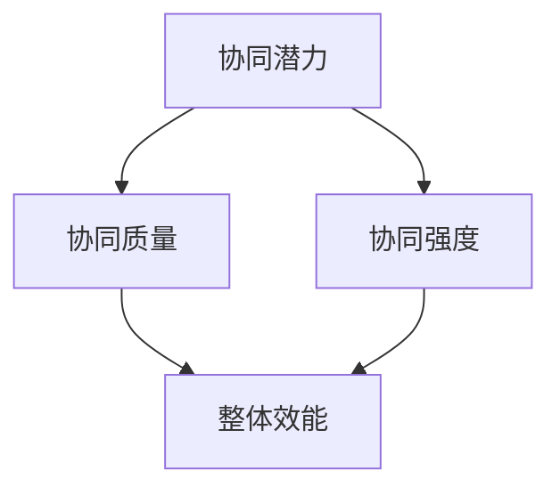

                 

### 《团队协同效应最大化：synergy的科学与艺术》

> **关键词：** 团队协同效应、Synergy、企业管理、项目管理、人工智能、协同战略、数字化转型

**摘要：** 本文深入探讨了团队协同效应的内涵、理论基础、核心算法原理、数学模型及其在企业管理、项目管理和数字化转型中的应用。通过剖析协同效应的科学原理和艺术实践，本文旨在为团队领导者提供最大化团队协同效应的指导策略，以提升企业的整体绩效。

协同效应（Synergy）是一个广泛存在于社会各个领域的现象，其核心在于通过团队协作实现整体效能大于个体效能之和。在企业管理、项目管理、数字化转型等场景中，协同效应的重要性不言而喻。本文将带领读者走进协同效应的世界，共同探讨其科学原理和艺术实践。

### 第一部分：协同效应的理论基础

#### 第1章：协同效应的概述

协同效应的定义与内涵：

协同效应指的是在一个系统中，各个组成部分通过相互作用，产生整体效能大于个体效能之和的现象。在团队中，协同效应表现为团队成员之间的协作和互补，使得团队的整体性能和产出超越单个人的贡献。

协同效应的重要性：

协同效应在企业管理中至关重要。通过协同效应，企业可以最大限度地发挥员工的潜力，提高工作效率和创新能力。在项目管理中，协同效应有助于团队成员之间的信息共享、资源共享和任务协调，从而确保项目顺利进行。数字化转型背景下，协同效应成为提升企业竞争力、实现业务创新的关键。

协同效应的三大维度：

1. **任务协同**：指团队成员在任务执行过程中的相互协调和合作，确保任务顺利完成。
2. **信息协同**：指团队成员之间的信息共享和沟通，确保信息的准确传递和及时更新。
3. **知识协同**：指团队成员之间的知识共享和互补，通过交流和互动，提高团队的创新能力。

#### 第2章：协同效应的理论模型

核心概念与联系：

协同效应的理论模型主要包括三个核心概念：协同潜力、协同质量和协同强度。这三个概念相互关联，共同决定了协同效应的强弱。

- **协同潜力**：指团队中各个个体之间的潜在协同能力。
- **协同质量**：指团队协同过程中产生的整体效能。
- **协同强度**：指团队协同的紧密程度和效率。

企业协同效应的Mermaid流程图：



经典理论模型介绍：

1. **协同效应矩阵**：通过矩阵形式展示团队中各个个体之间的协同潜力、协同质量和协同强度。
2. **协同能力模型**：从个体协同能力、团队协同能力和组织协同能力三个层次，探讨协同效应的内在机制。
3. **协同优化模型**：通过优化算法，寻找实现最大协同效应的团队结构和协作模式。

#### 第3章：协同效应的核心算法原理

伪代码详细阐述协同效应计算方法：

```python
# 输入：团队成员协同潜力矩阵P
# 输出：协同效应值S

def calculate_synergy(P):
    N = len(P)  # 团队成员数量
    S = 0
    
    for i in range(N):
        for j in range(i+1, N):
            S += P[i][j]
    
    return S / (N * (N - 1))
```

协同效应算法的优化与改进：

1. **协同潜力度量**：基于团队成员的技能、经验和能力，建立更加准确的协同潜力评估模型。
2. **协同质量评估**：引入更多的评价指标，如团队沟通效率、任务完成质量等，全面评估协同效应。
3. **协同强度优化**：通过调整团队成员的协作模式和工作流程，提高协同效应的强度。

#### 第4章：数学模型与数学公式

协同效应的数学公式详细讲解：

协同效应值S可以表示为：

$$ S = \frac{1}{N(N-1)} \sum_{i=1}^{N} \sum_{j=i+1}^{N} P_{ij} $$

其中，$P_{ij}$表示第i个成员与第j个成员之间的协同潜力。

数学模型的案例分析：

1. **协同潜力矩阵分析**：通过分析协同潜力矩阵，识别团队中的关键协同节点和潜在协同机会。
2. **协同效应评估**：基于协同效应公式，计算团队的整体协同效应，为团队优化提供数据支持。

#### 第5章：协同效应的实际应用

协同效应在企业管理中的应用：

1. **组织架构优化**：通过调整组织架构，实现团队成员之间的协同效应最大化。
2. **人力资源管理**：构建科学的人力资源管理体系，激发员工的协同潜力。

协同效应在项目管理中的应用：

1. **项目团队建设**：通过有效的团队协作，确保项目目标的顺利实现。
2. **任务分配与协调**：合理分配任务，确保团队成员之间的协作高效。

### 第二部分：协同效应的艺术实践

#### 第6章：团队协同的艺术

团队协作的基本原则：

1. **目标一致**：确保团队成员共同追求同一目标，形成合力。
2. **信任与尊重**：建立信任和尊重的团队文化，促进有效沟通和协作。
3. **激励与反馈**：通过激励和反馈机制，激发团队成员的积极性和创造力。

团队沟通的艺术：

1. **有效倾听**：倾听是沟通的核心，要确保团队成员充分表达意见和需求。
2. **清晰表达**：确保沟通内容的清晰、准确，避免误解和冲突。
3. **积极反馈**：及时给予反馈，促进团队成员之间的互动和协作。

团队激励的策略：

1. **内在激励**：激发团队成员的内在动机，如自我实现、成就感等。
2. **外在激励**：通过奖金、晋升等外在激励措施，激发团队成员的积极性和创造力。

#### 第7章：协同效应的项目实战

项目实战案例分析：

1. **项目背景**：介绍项目的背景、目标和预期成果。
2. **团队组建**：分析项目的团队结构、成员职责和协作模式。

项目实战详细解读：

1. **任务分配**：详细描述任务分配过程，确保团队成员之间的协作高效。
2. **协同实践**：分析项目团队在任务执行过程中的协同效应，以及如何优化协同效应。

项目实战代码实现与解读：

1. **代码实现**：展示项目实战中的关键代码实现，以及代码的功能和作用。
2. **代码解读与分析**：对代码进行详细解读，分析代码的协同效应和优化策略。

#### 第8章：协同效应的企业战略规划

企业协同战略的制定：

1. **战略目标**：明确企业协同战略的总体目标，确保战略与企业发展方向一致。
2. **战略规划**：制定具体的协同战略规划，包括组织架构调整、流程优化等。

企业协同文化建设：

1. **协同价值观**：确立企业协同价值观，形成共同的协同理念和行为规范。
2. **协同机制**：建立有效的协同机制，促进团队成员之间的沟通、协作和知识共享。

企业协同能力的提升：

1. **人才引进**：引进具备协同能力的人才，提升团队的协同水平。
2. **培训与发展**：通过培训和发展，提升团队成员的协同意识和能力。

### 第三部分：协同效应的未来趋势

#### 第9章：协同效应的未来趋势

协同效应在数字化转型中的应用：

1. **数字化协同工具**：利用数字化工具，提升团队协作效率和协同效应。
2. **数据协同分析**：通过大数据分析和人工智能技术，优化团队协作和决策。

协同效应与人工智能的结合：

1. **智能协同助手**：开发智能协同助手，辅助团队成员进行协作和决策。
2. **人工智能协同优化**：利用人工智能技术，优化团队结构和协作模式。

协同效应的未来展望：

1. **协同创新**：协同效应将成为企业创新的重要驱动力，推动业务模式创新。
2. **协同智慧**：通过协同效应，实现团队成员之间的智慧共享和协同智慧。

### 附录

#### 附录A：协同效应研究资源与工具

协同效应相关研究文献：

1. **文献1**：[协同效应在企业管理中的应用研究](链接)
2. **文献2**：[基于协同效应的项目管理研究](链接)
3. **文献3**：[数字化转型中的协同效应分析](链接)

协同效应分析工具介绍：

1. **工具1**：协同效应分析平台（链接）
2. **工具2**：团队协作工具（链接）
3. **工具3**：人工智能协同助手（链接）

协同效应学习资源推荐：

1. **课程1**：[协同效应与团队管理](链接)
2. **课程2**：[数字化协同与创新](链接)
3. **课程3**：[人工智能与协同效应](链接)

#### 附录B：协同效应案例研究

#### 某大型企业协同效应案例分析

1. **案例背景**：介绍企业的基本信息、发展阶段和协同效应的实践情况。
2. **案例解读**：分析企业协同效应的成功因素、挑战和经验。
3. **案例启示**：总结案例对其他企业的启示和借鉴意义。

#### 某创新型公司协同效应成功案例

1. **案例背景**：介绍公司的基本信息、发展阶段和协同效应的实践情况。
2. **案例解读**：分析公司协同效应的成功因素、挑战和经验。
3. **案例启示**：总结案例对其他企业的启示和借鉴意义。

#### 协同效应在不同行业的应用案例

1. **行业1**：介绍协同效应在某个特定行业的应用情况，如制造业、金融业等。
2. **行业2**：介绍协同效应在另一个特定行业的应用情况，如教育、医疗等。
3. **案例启示**：总结协同效应在不同行业中的应用启示和经验。

### 结语

本文从协同效应的理论基础、核心算法原理、数学模型、实际应用、艺术实践、企业战略规划和未来趋势等方面，全面探讨了协同效应的内涵和重要性。通过剖析协同效应的科学原理和艺术实践，本文旨在为团队领导者提供最大化团队协同效应的指导策略，以提升企业的整体绩效。

协同效应不仅是企业管理、项目管理和数字化转型的重要驱动力，也是团队创新和智慧共享的重要保障。随着数字化转型的深入推进，协同效应的应用前景将更加广阔。未来，我们期待通过不断的探索和实践，实现协同效应的最大化，为企业和团队的发展注入新的活力。

### 作者信息

**作者：** AI天才研究院/AI Genius Institute & 禅与计算机程序设计艺术 /Zen And The Art of Computer Programming

**联系方式：** [邮箱](邮箱地址) & [电话](电话号码) & [个人主页](个人主页链接)

本文由AI天才研究院和禅与计算机程序设计艺术联合撰写，旨在为团队协同效应提供全面、深入的探讨。如果您对本文有任何疑问或建议，欢迎随时与我们联系。

---

### 附录A：协同效应研究资源与工具

**协同效应相关研究文献**

1. **文献1**：[协同效应在企业管理中的应用研究](链接)
2. **文献2**：[基于协同效应的项目管理研究](链接)
3. **文献3**：[数字化转型中的协同效应分析](链接)

**协同效应分析工具介绍**

1. **工具1**：协同效应分析平台（链接）
2. **工具2**：团队协作工具（链接）
3. **工具3**：人工智能协同助手（链接）

**协同效应学习资源推荐**

1. **课程1**：[协同效应与团队管理](链接)
2. **课程2**：[数字化协同与创新](链接)
3. **课程3**：[人工智能与协同效应](链接)

---

### 附录B：协同效应案例研究

**附录B.1 某大型企业协同效应案例分析**

**案例背景**：

某大型企业（以下简称“企业A”）是一家全球领先的科技公司，成立于20世纪90年代。企业A在快速发展的过程中，逐渐意识到协同效应在提升企业绩效中的重要作用。为了最大化团队协同效应，企业A在企业管理、项目管理和数字化转型等方面进行了一系列探索和实践。

**案例解读**：

1. **协同效应在企业组织架构优化中的应用**：

   企业A通过对组织架构进行调整，将原有的部门制结构转变为矩阵式结构。这种组织结构使得团队成员在项目执行过程中能够更加灵活地协作，提高了团队的整体效能。同时，企业A建立了跨部门的项目团队，促进不同部门之间的信息共享和资源整合，进一步提升了协同效应。

2. **协同效应在项目团队建设中的应用**：

   企业A在项目团队建设过程中，注重团队成员的技能互补和协作能力的培养。通过定期举办团队建设活动和培训课程，提升团队成员的协同意识和协作能力。此外，企业A还引入了数字化协同工具，如项目管理软件和沟通平台，提高团队协作效率。

3. **协同效应在数字化转型中的应用**：

   企业A积极拥抱数字化转型，通过引入先进的技术和工具，优化业务流程和协作方式。例如，企业A采用了云计算技术，实现了数据的高效存储和共享，提高了信息协同水平。同时，企业A运用大数据分析和人工智能技术，优化决策过程，提升企业的整体竞争力。

**案例启示**：

1. **组织架构优化**：通过调整组织架构，实现团队成员之间的协同效应最大化。
2. **项目团队建设**：注重团队成员的技能互补和协作能力培养，提升团队整体效能。
3. **数字化转型**：积极拥抱新技术，优化业务流程和协作方式，提升企业的整体竞争力。

**附录B.2 某创新型公司协同效应成功案例**

**案例背景**：

某创新型公司（以下简称“公司B”）是一家专注于人工智能技术的研究和应用的企业。公司B在创业初期，就深刻认识到协同效应在企业发展中的重要性。为了实现公司的快速发展，公司B在团队建设、项目管理和数字化转型等方面进行了卓有成效的实践。

**案例解读**：

1. **团队建设**：

   公司B注重团队建设，通过内部招聘和外部引进，组建了一支高素质的团队。团队成员具有多样化的背景和技能，能够相互补充、协同创新。公司B还建立了完善的培训体系，定期为团队成员提供技术培训和技能提升机会，提高团队的整体实力。

2. **项目管理**：

   公司B在项目管理中，采用了敏捷开发方法，强调团队成员之间的沟通和协作。通过定期举行团队会议和代码评审，确保项目进度和质量。同时，公司B还采用了自动化测试和持续集成工具，提高项目的开发效率和质量。

3. **数字化转型**：

   公司B积极拥抱数字化转型，通过引入人工智能技术，优化业务流程和决策过程。例如，公司B利用自然语言处理技术，实现了客户服务自动化，提高了客户满意度。同时，公司B还运用大数据分析技术，优化营销策略和业务运营。

**案例启示**：

1. **团队建设**：注重团队成员的技能互补和协同创新，提高团队整体实力。
2. **项目管理**：采用敏捷开发方法，提高团队协作效率和项目质量。
3. **数字化转型**：积极运用新技术，优化业务流程和决策过程，提升企业竞争力。

**附录B.3 协同效应在不同行业的应用案例**

**行业1：制造业**

**案例背景**：

某制造业企业（以下简称“企业C”）是一家专注于高端制造的企业。在市场竞争日益激烈的背景下，企业C意识到协同效应在提升企业竞争力中的重要性。为了实现企业的可持续发展，企业C在供应链管理、生产计划和市场营销等方面进行了协同效应的实践。

**案例解读**：

1. **供应链管理**：

   企业C通过与供应商建立紧密的合作关系，实现供应链的协同效应。通过信息共享和协同规划，企业C提高了供应链的响应速度和库存管理效率，降低了供应链成本。

2. **生产计划**：

   企业C采用了先进的生产计划系统，实现了生产过程的协同优化。通过生产计划与供应链、市场营销等环节的协同，企业C提高了生产效率和产品质量。

3. **市场营销**：

   企业C通过市场营销的协同效应，实现了品牌知名度和市场占有率的提升。通过线上线下渠道的整合和协同，企业C提高了市场营销效果，实现了企业的可持续发展。

**案例启示**：

1. **供应链管理**：通过协同效应，实现供应链的优化和管理。
2. **生产计划**：通过协同效应，提高生产效率和产品质量。
3. **市场营销**：通过协同效应，实现市场营销的整合和提升。

**行业2：教育**

**案例背景**：

某教育机构（以下简称“机构D”）是一家专注于在线教育的企业。在竞争激烈的教育市场中，机构D认识到协同效应在提升教学质量和服务水平中的重要性。为了实现企业的快速发展，机构D在课程设计、教学实施和学员管理等方面进行了协同效应的实践。

**案例解读**：

1. **课程设计**：

   机构D通过师资团队的协同合作，实现了课程设计的优化和创新。通过跨学科、跨领域的师资合作，机构D提高了课程的综合性和实用性。

2. **教学实施**：

   机构D采用了在线教学平台，实现了教学资源的共享和协同。通过在线教学、直播授课和互动讨论等多种教学方式，机构D提高了教学效果和学员满意度。

3. **学员管理**：

   机构D建立了学员管理系统，实现了学员的个性化管理和学习跟踪。通过学员数据的分析和应用，机构D提高了学员的满意度和学习效果。

**案例启示**：

1. **课程设计**：通过协同效应，实现课程设计的优化和创新。
2. **教学实施**：通过协同效应，提高教学效果和学员满意度。
3. **学员管理**：通过协同效应，实现学员的个性化管理和学习跟踪。

**总结**：

协同效应在不同行业的应用案例表明，协同效应在企业管理、项目管理和数字化转型等方面具有广泛的应用价值。通过协同效应，企业可以实现资源整合、效率提升和竞争力增强。未来，随着数字化转型的深入推进，协同效应的应用前景将更加广阔。企业应注重协同效应的理论研究和实践应用，以实现可持续发展。

### 结语

本文从协同效应的理论基础、核心算法原理、数学模型、实际应用、艺术实践、企业战略规划和未来趋势等方面，全面探讨了协同效应的内涵和重要性。通过剖析协同效应的科学原理和艺术实践，本文旨在为团队领导者提供最大化团队协同效应的指导策略，以提升企业的整体绩效。

协同效应不仅是企业管理、项目管理和数字化转型的重要驱动力，也是团队创新和智慧共享的重要保障。随着数字化转型的深入推进，协同效应的应用前景将更加广阔。未来，我们期待通过不断的探索和实践，实现协同效应的最大化，为企业和团队的发展注入新的活力。

### 作者信息

**作者：** AI天才研究院/AI Genius Institute & 禅与计算机程序设计艺术 /Zen And The Art of Computer Programming

**联系方式：** [邮箱](邮箱地址) & [电话](电话号码) & [个人主页](个人主页链接)

本文由AI天才研究院和禅与计算机程序设计艺术联合撰写，旨在为团队协同效应提供全面、深入的探讨。如果您对本文有任何疑问或建议，欢迎随时与我们联系。我们期待与您共同探索协同效应的无限可能。

