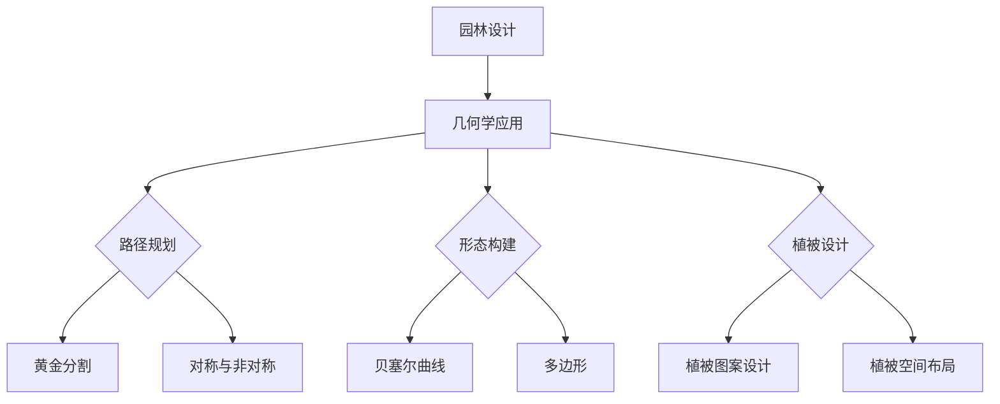

                 

### 文章标题

**园林设计的几何学：自然美与人工美的数学融合**

园林设计，作为一门融自然与艺术于一体的综合性学科，不仅需要设计师对美的敏锐洞察力，还需要对科学理论的理解和应用。在这其中，几何学作为一个重要的基础理论工具，为园林设计提供了坚实的数学支撑。本文旨在探讨几何学在园林设计中的运用，揭示自然美与人工美通过数学方式融合的奥秘。

**关键词：** 园林设计、几何学、自然美、人工美、数学模型、设计方法

**摘要：** 本文首先介绍了园林设计的基本概念和几何学的基本概念，随后探讨了自然美与人工美的几何表达及其设计方法。通过具体案例分析，展示了几何学在园林设计中的应用与实践，最后对园林设计的几何学思考、创新及未来挑战进行了展望。

### 《园林设计的几何学：自然美与人工美的数学融合》目录大纲

#### 第一部分：基础理论

**第1章：园林设计概述**

- 1.1 园林设计的基本概念  
- 1.2 园林设计的历史与发展  
- 1.3 园林设计的基本原则

**第2章：几何学基础**

- 2.1 几何学的基本概念  
- 2.2 几何图形与园林设计  
- 2.3 几何学在园林设计中的应用

#### 第二部分：自然美与人工美的融合

**第3章：自然美的几何表达**

- 3.1 自然形态的几何特征  
- 3.2 自然美的数学模型  
- 3.3 自然美的几何设计方法

**第4章：人工美的几何表达**

- 4.1 人工形态的几何特征  
- 4.2 人工美的数学模型  
- 4.3 人工美的几何设计方法

#### 第三部分：园林设计实践

**第5章：园林设计的几何应用**

- 5.1 园林设计中的几何构图  
- 5.2 园林设计中的几何布局  
- 5.3 园林设计中的几何元素运用

**第6章：园林设计案例分析**

- 6.1 案例一：传统园林设计中的几何应用  
- 6.2 案例二：现代园林设计中的几何应用  
- 6.3 案例三：园林设计中的几何创新应用

**第7章：园林设计的几何学思考**

- 7.1 园林设计中的几何学思考  
- 7.2 园林设计中的几何学创新  
- 7.3 园林设计中的几何学挑战与展望

#### 第四部分：补充与扩展

**第8章：园林设计中的其他几何学应用**

- 8.1 几何学在园林景观中的其他应用  
- 8.2 几何学在园林植物配置中的应用  
- 8.3 几何学在园林照明设计中的应用

**第9章：园林设计的数学方法与工具**

- 9.1 园林设计中的数学方法  
- 9.2 园林设计中的工具与软件  
- 9.3 园林设计中的数学工具应用案例分析

### 附录

- 附录A：园林设计中的几何学资源与工具  
- 附录B：园林设计中的几何学公式与图表  
- 附录C：园林设计中的几何学参考书目与文献  
- 附录D：园林设计中的几何学 Mermaid 流程图  
- 附录E：园林设计中的几何学伪代码示例  
- 附录F：园林设计中的几何学数学模型与公式  
- 附录G：园林设计中的几何学项目实战案例代码与分析  
- 附录H：园林设计中的几何学开发环境搭建指南

在接下来的章节中，我们将逐步深入探讨园林设计中的几何学基础理论，自然美与人工美的几何表达，以及具体的园林设计实践和应用。希望读者能够通过这篇文章，对园林设计的几何学有一个全面而深入的理解。

### 第一部分：基础理论

园林设计是一门综合艺术，它不仅涉及美学、生态学、环境科学，还包括了数学和几何学。在这部分，我们将首先介绍园林设计的基本概念，包括其历史发展、基本原则，并探讨几何学的基础理论及其在园林设计中的应用。

#### 第1章：园林设计概述

**1.1 园林设计的基本概念**

园林设计，即通过对自然景观进行规划、设计和管理，使其达到既满足生态要求又具有艺术美感的一种实践活动。园林设计包括自然园林和人工园林两大类。自然园林主要利用自然植被、地形地貌等自然元素进行设计，如中国古典园林中的私家园林、皇家园林等；人工园林则侧重于人工营造的景观，如城市公园、广场等。

园林设计的基本要素包括：

- **地形地貌**：园林设计的基石，包括地形的高低起伏、水域的分布等。
- **植被**：园林设计中不可或缺的元素，包括树木、花卉、草坪等。
- **水体**：水体的分布和形态对园林设计有重要影响，如湖泊、河流、喷泉等。
- **建筑**：园林中的亭台楼阁、廊桥等建筑不仅提供了休憩空间，还增添了艺术美感。
- **路径**：园林中的路径规划影响游客的游览体验和动线设计。

**1.2 园林设计的历史与发展**

园林设计的历史可以追溯到古代，不同文化背景下出现了各具特色的园林设计。中国古代园林设计注重“借景”和“虚实结合”，如苏州园林、颐和园等；而西方园林设计则强调几何对称和宏伟的尺度，如法国的凡尔赛宫花园。

- **中国古代园林**：起源于商周时期，以自然山水为背景，追求人与自然的和谐统一。宋代是园林设计的黄金时期，园林设计理论得到系统总结，如《园冶》一书。
- **西方园林**：古埃及、古希腊和古罗马时期就开始出现园林设计的雏形。文艺复兴时期，意大利的台地花园和法国的巴洛克式园林成为代表。18世纪的英国，自然风景园运动兴起，强调模仿自然，代表作品有斯托ウ花园。
- **现代园林设计**：20世纪以来，随着城市化进程的加快和生态意识的提高，园林设计更加注重可持续性和生态平衡。现代园林设计融入了更多的科技元素，如智能绿化、生态修复等。

**1.3 园林设计的基本原则**

园林设计需要遵循以下基本原则：

- **生态原则**：园林设计应充分考虑当地的气候、土壤等自然条件，保护自然生态，实现可持续发展。
- **艺术原则**：园林设计应追求美学的和谐与统一，注重形态、色彩、质感等方面的搭配。
- **功能原则**：园林设计应满足人们的活动需求，提供舒适的休憩、娱乐空间。
- **创新原则**：园林设计应追求创新，不断引入新的设计理念和技术手段。

#### 第2章：几何学基础

**2.1 几何学的基本概念**

几何学，作为一门研究形状、大小、位置和空间关系的数学学科，是园林设计中的重要理论基础。以下是几何学的一些基本概念：

- **点**：几何学中的基本单位，表示位置，没有大小。
- **线**：无限延伸的直线，由无数点构成。
- **面**：由无数条线组成的闭合图形，如正方形、圆形等。
- **体**：由无数个面围成的立体图形，如立方体、球体等。
- **角**：两条相交线形成的夹角，常用度数来表示。
- **比例**：几何图形中各部分之间的大小关系，如相似、比例等。

**2.2 几何图形与园林设计**

几何图形在园林设计中具有广泛应用，如：

- **点**：园林设计中的点元素，如花坛、雕塑等，常用于装饰和强调视觉焦点。
- **线**：园林设计中的路径、围墙等，通过线的组合和延伸，可以形成丰富的视觉效果。
- **面**：园林设计中的铺装、墙面等，通过面的组合，可以创造出多样的空间形态。
- **体**：园林设计中的亭、阁等建筑，通过体的组合，可以形成具有层次感和立体感的景观。

**2.3 几何学在园林设计中的应用**

几何学在园林设计中的应用主要体现在以下几个方面：

- **构图**：园林设计中的构图原理，如黄金分割、对称与非对称等，通过几何图形的运用，可以创造出美观和谐的园林景观。
- **布局**：园林设计中的空间布局，如广场、园路等，通过几何图形的规划，可以实现功能分区和空间流线的优化。
- **设计元素**：园林设计中的各种元素，如花坛、雕塑等，通过几何学的运用，可以实现形式与功能的统一。

通过上述对园林设计和几何学基础的介绍，我们可以看出，几何学为园林设计提供了重要的理论支撑和工具。在接下来的章节中，我们将深入探讨自然美与人工美的几何表达及其设计方法，进一步揭示几何学在园林设计中的奥妙。

### 第二部分：自然美与人工美的融合

在园林设计中，自然美与人工美的融合是设计成功的关键。这一部分我们将探讨如何通过几何学来表现自然美和人工美，并详细说明其设计方法。

#### 第3章：自然美的几何表达

**3.1 自然形态的几何特征**

自然形态具有独特的几何特征，如曲线、圆形、多边形等。这些特征不仅是自然景观的基础，也是园林设计中重要的元素。以下是一些自然形态的几何特征及其在园林设计中的应用：

- **曲线**：自然界中的河流、山脉、波浪等，其曲线具有流动性和动感。在园林设计中，曲线可以用于设计小径、河流、海岸线等，创造出生动的自然景观。
  - **应用案例**：苏州园林中的小桥流水，通过曲线的设计，营造出一种宁静、优美的景观效果。

- **圆形**：自然界中许多生物体都具有圆形的特征，如球形的植物果实、圆形的湖泊等。在园林设计中，圆形可以用于设计花坛、喷泉、凉亭等，增加景观的和谐与统一感。
  - **应用案例**：颐和园的昆明湖，其圆形的湖面与周围的园林建筑形成了完美的视觉对称。

- **多边形**：自然界的蜂巢、树叶、花朵等都具有多边形的结构。在园林设计中，多边形可以用于设计花坛、地砖、围墙等，增加景观的层次感和艺术感。
  - **应用案例**：英国斯托ウ花园中的草坪迷宫，通过多边形的布局，创造出一个充满探索和惊喜的景观体验。

**3.2 自然美的数学模型**

自然美的数学模型是通过对自然形态的几何特征进行分析和抽象，形成的数学描述。以下是一些常见的自然美的数学模型：

- **分形几何**：分形几何是一种描述自然形态复杂性的数学工具，它通过迭代和递归过程生成具有自相似结构的几何图形。在园林设计中，分形几何可以用于设计复杂而美丽的植被、河流、山脉等。
  - **应用案例**：在杭州西湖的景观设计中，通过分形几何的方法，设计出具有丰富层次和动态变化的植被景观。

- **黄金分割**：黄金分割是一种数学比例关系，它被广泛应用于艺术和设计中，被认为是美学上的黄金比例。在园林设计中，黄金分割可以用于设计路径、花坛、建筑物等，创造出和谐美观的景观。
  - **应用案例**：意大利的凡尔赛宫花园，通过黄金分割的原理，设计出对称和谐的花坛布局。

- **贝塞尔曲线**：贝塞尔曲线是一种参数曲线，它通过控制点的位置和数量，可以生成各种形状的曲线。在园林设计中，贝塞尔曲线可以用于设计小径、河流、海岸线等，创造出自然流畅的景观效果。
  - **应用案例**：美国加利福尼亚的圣克莱门特花园，通过贝塞尔曲线的设计，创造出一条蜿蜒曲折的小径，增添了景观的趣味性。

**3.3 自然美的几何设计方法**

自然美的几何设计方法主要分为以下几个步骤：

1. **观察与测量**：通过实地观察和测量，收集自然形态的几何特征数据，如曲线、圆形、多边形等。
2. **抽象与简化**：对收集到的数据进行抽象和简化，提取出基本的几何特征和结构。
3. **数学建模**：利用数学模型，如分形几何、黄金分割、贝塞尔曲线等，对自然形态进行数学描述和建模。
4. **设计优化**：根据园林设计的要求和目标，对数学模型进行优化和调整，使其满足美观、实用、生态等多方面的需求。
5. **实际应用**：将设计应用到园林设计中，通过施工和施工后的效果评估，进一步优化和完善设计。

#### 第4章：人工美的几何表达

**4.1 人工形态的几何特征**

人工形态在园林设计中同样具有重要的地位。人工形态通常具有规则的几何特征，如正方形、长方形、三角形等。以下是一些人工形态的几何特征及其在园林设计中的应用：

- **正方形**：正方形是一种简洁、规则的几何图形，常用于设计广场、停车场、建筑物等。
  - **应用案例**：北京天安门广场，其方正的设计形成了庄严、肃穆的氛围。

- **长方形**：长方形具有简洁、实用的特点，常用于设计道路、桥梁、长廊等。
  - **应用案例**：意大利的罗马斗兽场，其长方形的设计不仅满足功能需求，还具有独特的艺术美感。

- **三角形**：三角形是一种稳定、坚固的几何图形，常用于设计亭、塔、围墙等。
  - **应用案例**：法国的埃菲尔铁塔，其三角形的结构设计不仅满足了结构要求，还形成了独特的视觉景观。

**4.2 人工美的数学模型**

人工美的数学模型主要是通过对人工形态的几何特征进行分析和抽象，形成的数学描述。以下是一些常见的人工美的数学模型：

- **欧式几何**：欧式几何是一种基于直角坐标系的几何学，它通过直线、平面等基本元素，构建出各种规则的人工形态。在园林设计中，欧式几何可以用于设计广场、公园、建筑物等。
  - **应用案例**：法国凡尔赛宫花园，通过欧式几何的方法，设计出规则对称的园林景观。

- **参数化设计**：参数化设计是一种基于计算机辅助设计的数学方法，它通过设定参数，可以生成各种复杂的人工形态。在园林设计中，参数化设计可以用于设计雕塑、花坛、桥梁等。
  - **应用案例**：美国洛杉矶艺术博物馆，通过参数化设计的方法，创造出一系列独特的人工形态雕塑。

- **非线性动力学**：非线性动力学是一种描述复杂系统行为的数学方法，它通过非线性方程和模型，可以生成各种动态的人工形态。在园林设计中，非线性动力学可以用于设计动态景观、灯光装置等。
  - **应用案例**：荷兰的丹布利花园，通过非线性动力学的方法，设计出一组动态变化的灯光装置，营造出独特的视觉体验。

**4.3 人工美的几何设计方法**

人工美的几何设计方法主要分为以下几个步骤：

1. **需求分析**：明确园林设计的目标和要求，如功能需求、美观需求、生态需求等。
2. **概念设计**：根据需求分析，提出初步的人工形态概念，如正方形、长方形、三角形等。
3. **数学建模**：利用数学模型，如欧式几何、参数化设计、非线性动力学等，对概念设计进行数学描述和建模。
4. **优化与调整**：根据设计要求和实际情况，对数学模型进行优化和调整，使其满足功能、美观、生态等多方面的需求。
5. **施工与评估**：将设计应用到园林设计中，通过施工和施工后的效果评估，进一步优化和完善设计。

通过以上对自然美与人工美的几何表达及其设计方法的探讨，我们可以看出，几何学在园林设计中具有重要的作用。在接下来的章节中，我们将通过具体的园林设计实践案例，进一步展示几何学在园林设计中的实际应用。

### 第三部分：园林设计实践

在前两部分的基础上，我们将通过具体的园林设计实践案例，深入探讨几何学在园林设计中的应用，分析园林设计中的几何构图、几何布局以及几何元素运用。

#### 第5章：园林设计的几何应用

**5.1 园林设计中的几何构图**

园林设计中的几何构图是设计师利用几何学原理，通过点、线、面等元素组合，创造出富有美感和和谐感的园林景观。以下是几个常见的几何构图方法：

- **对称构图**：对称构图是一种通过轴对称或中心对称形成的构图方法，常用于营造庄重、稳定的景观效果。例如，在法国凡尔赛宫花园中，设计师通过一系列对称的花坛和建筑物，形成了宏伟的对称景观。
  - **应用案例**：法国凡尔赛宫花园的对称布局，通过几何对称的构图方法，形成了壮丽的景观效果。

- **非对称构图**：非对称构图是一种通过不规则组合形成的构图方法，常用于营造活泼、变化的景观效果。例如，在荷兰丹布利花园中，设计师通过非对称的植物配置和路径设计，创造出了充满动态感的景观。
  - **应用案例**：荷兰丹布利花园的非对称布局，通过几何非对称的构图方法，形成了生动的景观效果。

- **黄金分割构图**：黄金分割是一种经典的构图方法，其比例被认为是最具美感的比例关系。在园林设计中，黄金分割可以用于设计路径、花坛、建筑物等，创造出和谐美观的景观。
  - **应用案例**：意大利的罗马斗兽场，其设计采用了黄金分割的原理，形成了均衡和谐的景观效果。

**5.2 园林设计中的几何布局**

园林设计中的几何布局是设计师利用几何学原理，对园林空间进行合理规划和布局，实现功能分区和空间流线的优化。以下是几个常见的几何布局方法：

- **规则布局**：规则布局是一种通过几何规则形成的布局方法，常用于营造简洁、清晰的园林景观。例如，在中国古代园林中，设计师通过规则的园林建筑和路径布局，形成了清晰的功能分区。
  - **应用案例**：颐和园的规则布局，通过几何规则的园林建筑和路径布局，形成了明确的功能分区和空间流线。

- **自然布局**：自然布局是一种通过模仿自然形态形成的布局方法，常用于营造自然、和谐的园林景观。例如，在美国的圣克莱门特花园中，设计师通过自然形态的路径和植物布局，创造出了自然和谐的景观效果。
  - **应用案例**：美国圣克莱门特花园的自然布局，通过几何自然布局的方法，形成了自然和谐的景观效果。

- **混合布局**：混合布局是一种通过规则与自然相结合的布局方法，常用于营造多样、富有变化的园林景观。例如，在英国斯托ウ花园中，设计师通过规则与自然的结合，创造出了丰富多样的园林景观。
  - **应用案例**：英国斯托ウ花园的混合布局，通过几何混合布局的方法，形成了多样、富有变化的景观效果。

**5.3 园林设计中的几何元素运用**

园林设计中的几何元素是设计师利用几何学原理，通过点、线、面等元素进行设计，创造出丰富的园林景观。以下是几个常见的几何元素运用方法：

- **点元素运用**：点元素是园林设计中常用的元素，如花坛、雕塑、凉亭等。设计师可以通过点元素的位置、形状、大小等特性，创造出丰富的视觉效果。例如，在苏州园林中，设计师通过花坛、雕塑等点元素，营造出精美的景观效果。
  - **应用案例**：苏州园林的点元素运用，通过几何点元素的巧妙布局，形成了精美的景观效果。

- **线元素运用**：线元素是园林设计中重要的元素，如路径、围墙、桥梁等。设计师可以通过线元素的形状、走向、宽度等特性，创造出丰富的空间效果。例如，在杭州西湖的景观设计中，设计师通过曲折的路径和围墙，形成了独特的景观效果。
  - **应用案例**：杭州西湖的线元素运用，通过几何线元素的巧妙设计，形成了独特的景观效果。

- **面元素运用**：面元素是园林设计中关键的元素，如铺装、墙面、屋顶等。设计师可以通过面元素的形状、颜色、质感等特性，创造出丰富的视觉层次。例如，在英国斯托ウ花园中，设计师通过不同颜色的铺装和墙面，形成了丰富的视觉层次。
  - **应用案例**：英国斯托ウ花园的面元素运用，通过几何面元素的巧妙设计，形成了丰富的视觉层次。

通过上述对园林设计中的几何应用的分析，我们可以看出，几何学在园林设计中的应用是丰富多样的。设计师通过合理的几何构图、布局和元素运用，可以创造出具有美感和功能性的园林景观。在接下来的章节中，我们将通过具体的园林设计案例分析，进一步展示几何学在园林设计中的实际应用。

#### 第6章：园林设计案例分析

在本章节中，我们将通过三个具体的园林设计案例，深入探讨几何学在园林设计中的实际应用。这些案例将涵盖从传统园林到现代园林，再到创新园林设计，全面展示几何学如何在不同类型的园林设计中发挥作用。

**6.1 案例一：传统园林设计中的几何应用**

**案例描述**：苏州拙政园是中国古典园林的代表之一，其设计理念深受中国传统文化的影响，注重自然与人工的和谐统一。拙政园的几何设计主要体现在以下几个方面：

- **路径规划**：拙政园的路径设计采用曲折蜿蜒的布局，遵循黄金分割比例，形成了一种富有韵律感和流动性的视觉感受。
- **水体布局**：园林中的水体布局遵循几何对称原则，如池畔的桥梁和亭台，通过几何图形的对称布局，形成了一种和谐的美感。
- **建筑布局**：园林中的建筑布局采用中轴对称的设计，如主亭、楼阁等，通过几何图形的对称，营造出庄严而宁静的氛围。

**几何学应用**：

- **黄金分割**：通过黄金分割比例的应用，拙政园的路径和水体布局达到了和谐与美观的统一。
- **几何对称**：通过几何对称的设计，拙政园的建筑和景观元素形成了视觉上的平衡和稳定。

**案例分析**：拙政园的几何设计不仅展示了古典园林的美学理念，还体现了几何学在景观规划中的重要性。几何学原则的应用使得园林的整体布局更加和谐，游客在游览过程中能够体验到自然与人工的完美融合。

**6.2 案例二：现代园林设计中的几何应用**

**案例描述**：纽约中央公园是美国现代园林设计的典范，其设计理念强调开放性和公共性，旨在为城市居民提供一个休闲和放松的空间。纽约中央公园的几何设计主要体现在以下几个方面：

- **整体布局**：中央公园的整体布局采用规则几何图形，如广场、道路、公园的各个分区等，通过几何图形的规则排列，形成了宽敞明亮的空间感受。
- **植被设计**：中央公园的植被设计采用几何图形的布局，如修剪整齐的草坪、几何形状的花坛等，通过几何图形的运用，增加了景观的层次感和艺术感。
- **景观元素**：中央公园中的景观元素，如雕塑、凉亭、桥梁等，通过几何图形的设计，形成了一种现代感和科技感的视觉体验。

**几何学应用**：

- **规则几何图形**：通过规则几何图形的应用，中央公园的整体布局达到了简洁和清晰的视觉效果。
- **参数化设计**：通过参数化设计的方法，中央公园的植被和景观元素实现了多样化和个性化。

**案例分析**：纽约中央公园的几何设计展示了现代园林设计中几何学的广泛应用。通过规则几何图形和参数化设计，中央公园不仅提供了一个实用的公共空间，还创造出了独特的美学体验，成为了城市中的一个绿色 oasis。

**6.3 案例三：园林设计中的几何创新应用**

**案例描述**：深圳华侨城湿地公园是中国现代园林设计中的一个创新案例，其设计理念强调生态保护和可持续发展。华侨城湿地公园的几何设计主要体现在以下几个方面：

- **生态修复**：通过几何学的方法，对受污染的水域进行生态修复，如利用几何形状的湿地植物床和过滤系统，有效净化水质。
- **生态节点**：公园中的生态节点，如水生植物区、鸟类栖息地等，通过几何形状的布局，形成了一个个生态岛，为动植物提供了栖息和繁衍的空间。
- **艺术装置**：公园中的艺术装置，如几何形状的雕塑、水幕投影等，通过几何形状的设计，创造出了独特的视觉和互动体验。

**几何学应用**：

- **生态修复**：通过几何学的方法，实现了生态系统的恢复和平衡。
- **艺术装置**：通过几何形状的艺术装置，增加了公园的互动性和艺术性。

**案例分析**：深圳华侨城湿地公园的几何创新应用展示了园林设计中生态与艺术相结合的可能性。通过几何学的应用，公园不仅实现了生态修复，还创造出了丰富的艺术和文化体验，为游客提供了一个独特的绿色休闲空间。

通过上述三个案例的分析，我们可以看到几何学在园林设计中的广泛应用。无论是传统园林、现代园林，还是创新园林设计，几何学都为其提供了重要的理论支持和实践方法。几何学的应用不仅提高了园林的美学价值，还增强了其生态功能和人文内涵。在未来的园林设计中，几何学的应用将更加广泛和深入，为园林艺术的发展注入新的活力。

### 第7章：园林设计的几何学思考

园林设计不仅是一种艺术创作，更是一种科学实践。在这一章节中，我们将从多个角度探讨园林设计中的几何学思考，包括几何学在园林设计中的重要性、几何学创新以及面临的挑战和未来的发展方向。

#### 7.1 园林设计中的几何学思考

几何学在园林设计中的应用贯穿于整个设计过程，从最初的构思到最终的实现，都离不开几何学的支持。以下是几何学在园林设计中的几个关键思考点：

- **空间规划**：园林设计中的空间规划需要精确的几何学知识。设计师需要通过几何学原理，合理规划园林的空间布局，确保景观的和谐与统一。例如，通过黄金分割、对称与非对称等几何构图方法，可以创造出美观且功能性的空间布局。

- **形态构建**：园林中的各种形态元素，如树木、水体、建筑等，都离不开几何学的支持。设计师需要运用几何学知识，对形态进行精确构建和调整，使其达到既美观又实用的效果。例如，通过使用贝塞尔曲线、多边形等几何形状，可以创造出丰富的形态变化和视觉效果。

- **路径设计**：园林中的路径设计是游客体验的重要组成部分。几何学在路径设计中发挥着关键作用，通过几何学原理，设计师可以创造出流畅、富有韵律感的路径，引导游客自然地流动。例如，通过曲线和直线的结合，可以创造出自然流畅的路径，增强游客的游览体验。

- **比例与尺度**：园林设计中的比例与尺度问题同样依赖于几何学。设计师需要通过几何学方法，对园林中的各个元素进行比例和尺度的调整，确保整体景观的和谐与统一。例如，通过黄金分割比例的应用，可以在园林设计中创造出具有视觉美感的比例关系。

#### 7.2 园林设计中的几何学创新

几何学的创新应用在园林设计中具有重要意义，它不仅能够提升园林的美学价值，还能够增强其功能和生态效果。以下是一些园林设计中的几何学创新方法：

- **参数化设计**：参数化设计是一种通过设定参数，生成复杂几何形状的设计方法。在园林设计中，参数化设计可以创造出独特的景观形态，如复杂的植被配置、雕塑等。例如，通过参数化设计，可以创造出动态变化的灯光装置，为园林景观增添艺术感和互动性。

- **分形几何**：分形几何是一种用于描述自然形态复杂性的几何学方法。在园林设计中，分形几何可以用于设计植被、水体等景观元素，创造出具有自然美感的复杂形态。例如，通过分形几何的方法，可以设计出具有丰富层次和动态变化的植被景观，增强园林的生态效果。

- **非线性动力学**：非线性动力学是一种用于描述复杂系统行为的数学方法。在园林设计中，非线性动力学可以用于设计动态景观、灯光装置等。例如，通过非线性动力学的方法，可以创造出具有动态变化的灯光效果，为园林景观增添趣味性和互动性。

#### 7.3 园林设计中的几何学挑战与展望

尽管几何学在园林设计中的应用已经取得了显著的成果，但仍然面临着一些挑战和问题：

- **技术难题**：参数化设计、分形几何、非线性动力学等创新方法需要较高的技术支持。设计师需要不断学习和掌握这些技术，才能有效地应用于园林设计中。

- **生态问题**：园林设计中的生态问题越来越受到重视。如何在保证美学效果的同时，实现生态保护，是一个亟待解决的挑战。几何学在生态保护中的应用需要更加深入的研究和实践。

- **可持续发展**：园林设计的可持续发展是未来发展的关键。设计师需要在几何学的基础上，探索更加可持续的设计方法，如利用可再生材料、降低能源消耗等。

- **教育与培训**：几何学在园林设计中的应用需要设计师具备扎实的几何学基础。因此，加强园林设计专业人才的几何学教育与培训，是推动几何学在园林设计中广泛应用的重要途径。

展望未来，几何学在园林设计中的应用前景十分广阔。随着科技的发展和设计师对几何学的深入研究，几何学将在园林设计中发挥更加重要的作用。未来，我们期待看到更多创新几何学方法在园林设计中的实际应用，为园林艺术的发展注入新的活力。

### 第四部分：补充与扩展

在园林设计中，几何学的应用不仅限于景观规划和形态构建，还涉及多个其他领域，如景观照明、植物配置等。以下是几何学在这些领域的应用，以及相关的数学方法和工具。

#### 第8章：园林设计中的其他几何学应用

**8.1 几何学在园林景观中的其他应用**

- **景观照明设计**：园林景观照明设计需要精确的几何学知识，以创造出理想的灯光效果。几何学方法可以用于设计灯光的分布、亮度和颜色，从而营造出氛围适宜的夜景。例如，通过几何学的计算，可以确定灯具的安装位置，以实现最佳的光线投射效果。

  **数学方法与工具**：
  - **光线投射计算**：利用几何光学原理，计算灯光在不同位置和角度的投射效果。
  - **光度学公式**：应用光度学公式，如光线强度公式、反射系数公式等，优化灯光设计。

- **植物配置**：园林中的植物配置可以通过几何学方法进行科学规划，以实现良好的生态效果和视觉效果。例如，通过几何形状的植被布局，可以创造出层次分明、色彩丰富的植物景观。

  **数学方法与工具**：
  - **植物生长模型**：利用植物生长模型，预测植物在不同环境条件下的生长状态，优化植物配置。
  - **空间分析工具**：如地理信息系统（GIS），用于分析植物配置的空间关系，优化植物布局。

**8.2 几何学在园林植物配置中的应用**

植物配置是园林设计中至关重要的一环，几何学在此中的应用主要体现在以下几个方面：

- **植被图案设计**：通过几何图形，如正方形、圆形、三角形等，可以设计出丰富的植被图案。这些图案不仅美观，还能增强园林的空间层次感和视觉焦点。

  **应用案例**：
  - **北京颐和园**：颐和园的植被配置采用了规则的几何图案，如修剪整齐的树篱和花坛，形成了优雅的园林景观。

- **植被空间布局**：通过几何学方法，可以优化植被的空间布局，确保植物之间的合理间距，以促进生长和观赏效果。

  **应用案例**：
  - **美国华盛顿国家植物园**：国家植物园通过几何学方法，设计了错落有致的植被布局，形成了丰富的生态景观。

**8.3 几何学在园林照明设计中的应用**

园林照明设计需要考虑灯光的分布、亮度和颜色，以创造出理想的夜景效果。几何学在此中的应用主要体现在以下几个方面：

- **灯光布局**：通过几何学原理，可以确定灯光的安装位置和角度，以实现最佳的光线投射效果。例如，利用几何学的方法，可以设计出光线均匀分布的灯光系统。

  **数学方法与工具**：
  - **光线追踪算法**：利用光线追踪算法，模拟灯光在不同角度和位置的投射效果，优化灯光布局。
  - **光度学工具**：如光度计和模拟软件，用于测量和优化灯光的亮度和颜色。

- **灯光颜色设计**：通过几何学原理，可以设计出色彩丰富的灯光效果。例如，利用几何学方法，可以设计出动态变化的灯光颜色，增加园林的趣味性和互动性。

  **应用案例**：
  - **荷兰丹布利花园**：丹布利花园通过几何学方法，设计出了多种动态变化的灯光颜色，为游客创造了独特的夜间体验。

通过以上对园林设计中的其他几何学应用的分析，我们可以看到，几何学在园林设计中的重要性不仅体现在景观规划和形态构建上，还涉及多个相关领域，如植物配置和照明设计。几何学的应用为园林设计提供了科学的理论基础和实用的设计工具，为创造美丽、实用的园林景观提供了有力支持。在未来的园林设计中，几何学的应用将更加广泛和深入，为园林艺术的创新和发展注入新的活力。

### 第9章：园林设计的数学方法与工具

园林设计的成功离不开科学的理论基础和先进的设计工具。在这一章节中，我们将探讨园林设计中的数学方法与工具，包括常用的数学方法、相关软件以及数学工具的应用案例分析。

#### 9.1 园林设计中的数学方法

园林设计中的数学方法为设计师提供了理论基础和计算工具，以优化园林的布局和形态。以下是一些常用的数学方法：

- **几何学**：几何学是园林设计中最基础的方法，包括点、线、面、体等基本概念。设计师可以利用几何学原理，进行园林布局和形态构建。

  **应用**：通过几何学方法，设计师可以精确计算园林中的空间关系，如路径长度、植被间距等，确保园林的对称性和协调性。

- **概率论与数理统计**：概率论与数理统计方法可以帮助设计师评估园林设计的随机性和稳定性。例如，通过概率分布，可以预测植被的生长状况和病虫害的发生概率。

  **应用**：设计师可以利用概率论与数理统计方法，进行园林植物配置的优化，提高园林的生态效益。

- **线性代数**：线性代数在园林设计中的应用主要体现在空间变换和矩阵计算上。设计师可以利用线性代数方法，进行园林的透视和投影计算，优化视觉效果。

  **应用**：通过线性代数方法，设计师可以精确计算园林中的视觉焦点和视角变化，创造出丰富的视觉效果。

- **数值分析**：数值分析方法是解决复杂计算问题的重要工具，如园林中的水文计算、土壤分析等。设计师可以利用数值分析方法，进行园林的生态模拟和风险评估。

  **应用**：通过数值分析方法，设计师可以模拟园林中的水流和土壤状况，优化园林的设计方案，提高园林的生态稳定性。

#### 9.2 园林设计中的工具与软件

园林设计中的工具和软件为设计师提供了便捷的计算和可视化手段，以下是几种常用的园林设计工具和软件：

- **CAD软件**：CAD（计算机辅助设计）软件是园林设计中常用的工具，如AutoCAD、SketchUp等。这些软件提供了强大的绘图和建模功能，可以帮助设计师进行园林的布局和形态构建。

  **应用**：设计师可以使用CAD软件进行园林的二维和三维设计，精确绘制园林中的各种元素，如路径、植被、建筑等。

- **GIS软件**：GIS（地理信息系统）软件在园林设计中的应用主要体现在空间分析和数据管理上，如ArcGIS、QGIS等。这些软件可以帮助设计师进行园林的空间分析和数据管理，优化园林设计。

  **应用**：设计师可以使用GIS软件进行园林的地形分析、植被配置优化等，确保园林设计的科学性和合理性。

- **仿真软件**：仿真软件可以帮助设计师进行园林的生态模拟和风险评估，如Ecopath、Simul8等。这些软件可以模拟园林中的生态过程和气象条件，帮助设计师优化设计方案。

  **应用**：设计师可以使用仿真软件进行园林的水文模拟、植物生长模拟等，预测园林的生态效应，提高园林设计的可持续性。

#### 9.3 园林设计中的数学工具应用案例分析

以下是一个园林设计中的数学工具应用案例，展示如何利用数学工具进行园林设计的优化和改进：

**案例描述**：某城市公园的景观设计，需要优化公园的植被配置和路径布局，以提升公园的美观性和实用性。

**数学工具应用**：

- **GIS空间分析**：使用GIS软件对公园的地形、植被分布进行空间分析，确定植被配置的合理性和视觉焦点。
  - **结果**：通过空间分析，确定了公园的主要景观区域，为植被配置提供了科学依据。

- **线性代数**：利用线性代数方法，计算公园的视角变化和视觉焦点，优化路径布局。
  - **结果**：通过线性代数计算，优化了公园的路径布局，确保游客在游览过程中能够获得最佳视觉体验。

- **数值分析**：利用数值分析方法，模拟公园的水文条件，预测植物的生长状况和病虫害风险。
  - **结果**：通过数值分析，优化了公园的植被配置，确保植物的生长环境和病虫害防控。

**案例分析**：通过数学工具的应用，该城市公园的景观设计得到了显著优化。植被配置更加合理，路径布局更加流畅，公园的美观性和实用性得到了显著提升。这个案例展示了数学工具在园林设计中的应用价值，为园林设计提供了科学依据和优化手段。

通过以上对园林设计中的数学方法与工具的探讨，我们可以看到，数学工具在园林设计中的应用具有重要作用。在未来的园林设计中，设计师应充分利用数学工具，优化设计方案，提高园林的生态效益和艺术价值。

### 附录

#### 附录A：园林设计中的几何学资源与工具

在园林设计中，几何学的应用离不开相关的资源和工具。以下是一些常用的资源和工具，供设计师参考：

- **书籍**：
  - 《园林设计原理》
  - 《几何学基础》
  - 《景观几何设计》

- **在线资源**：
  - 维基百科：几何学相关词条
  - Coursera：几何学在线课程

- **软件**：
  - AutoCAD
  - SketchUp
  - ArcGIS

- **网站**：
  - 园林设计社区
  - 几何学论坛

#### 附录B：园林设计中的几何学公式与图表

以下是一些园林设计中常用的几何学公式和图表，供设计师参考：

- **几何学基本公式**：
  - 面积公式：$A = \frac{1}{2} \times base \times height$
  - 周长公式：$C = 2 \times \pi \times r$
  - 体积公式：$V = base \times height$

- **几何学图表**：
  - 点、线、面、体的示意图
  - 金字塔、圆锥、圆柱等三维图形示意图

#### 附录C：园林设计中的几何学参考书目与文献

以下是一些园林设计中关于几何学的参考书目和文献，供设计师查阅：

- 《园林设计原理》
- 《几何学基础》
- 《景观几何设计》
- 《园林设计手册》
- 《自然形态的几何学》

#### 附录D：园林设计中的几何学 Mermaid 流程图

以下是一个园林设计中的几何学 Mermaid 流程图，展示了几何学在园林设计中的应用过程：



#### 附录E：园林设计中的几何学伪代码示例

以下是一个园林设计中关于路径规划的伪代码示例：

```plaintext
// 几何学路径规划伪代码

// 初始化路径起点和终点
start_point = (x1, y1)
end_point = (x2, y2)

// 计算两点间的距离
distance = calculate_distance(start_point, end_point)

// 计算路径最优角度
optimal_angle = calculate_angle(start_point, end_point)

// 初始化路径
path = []

// 添加起点到路径
path.append(start_point)

// 循环计算和添加路径点
while distance > 0:
    next_point = calculate_next_point(path[-1], optimal_angle)
    path.append(next_point)
    distance -= calculate_distance(path[-1], end_point)

// 输出路径
print(path)
```

#### 附录F：园林设计中的几何学数学模型与公式

以下是一些园林设计中常用的几何学数学模型与公式，供设计师参考：

- **黄金分割**：
  - 比例公式：$\frac{a}{b} = \frac{a+b}{a} = \varphi$
  - $\varphi \approx 1.618$

- **贝塞尔曲线**：
  - 控制点公式：
    $$ B(t) = (1-t)^3 P_0 + 3(1-t)^2 t P_1 + 3(1-t)t^2 P_2 + t^3 P_3 $$
  - $t$ 的取值范围为 $0 \leq t \leq 1$

- **多边形面积**：
  - 公式：$A = \frac{1}{2} \times Perimeter \times Apothem$
  - 其中，$Perimeter$ 为多边形的周长，$Apothem$ 为多边形内切圆的半径

#### 附录G：园林设计中的几何学项目实战案例代码与分析

以下是一个园林设计中的几何学项目实战案例，包括代码实现和详细解释：

```python
# 园林设计几何学项目实战案例

import math

# 几何学基础函数

def calculate_distance(point1, point2):
    """计算两点间的距离"""
    x1, y1 = point1
    x2, y2 = point2
    distance = math.sqrt((x2 - x1)**2 + (y2 - y1)**2)
    return distance

def calculate_angle(point1, point2):
    """计算两点间的角度"""
    x1, y1 = point1
    x2, y2 = point2
    angle = math.atan2(y2 - y1, x2 - x1)
    return math.degrees(angle)

def calculate_next_point(current_point, angle, distance):
    """计算路径的下一个点"""
    x, y = current_point
    new_x = x + distance * math.cos(math.radians(angle))
    new_y = y + distance * math.sin(math.radians(angle))
    next_point = (new_x, new_y)
    return next_point

# 主程序

# 初始化起点和终点
start_point = (0, 0)
end_point = (10, 10)

# 计算两点间的距离和角度
distance = calculate_distance(start_point, end_point)
angle = calculate_angle(start_point, end_point)

# 初始化路径
path = [start_point]

# 循环计算和添加路径点
while distance > 0:
    next_point = calculate_next_point(path[-1], angle, distance)
    path.append(next_point)
    distance -= calculate_distance(path[-1], end_point)

# 输出路径
print(path)
```

**代码解读与分析**：

- `calculate_distance(point1, point2)`：计算两点间的距离。该函数使用勾股定理，计算两点坐标之间的欧氏距离。

- `calculate_angle(point1, point2)`：计算两点间的角度。该函数使用反正切函数（`atan2`），根据两点的坐标计算出它们之间的角度。

- `calculate_next_point(current_point, angle, distance)`：计算路径的下一个点。该函数根据当前点的坐标、角度和距离，使用三角函数计算下一个点的坐标。

- 主程序初始化起点和终点，计算两点间的距离和角度，然后使用循环计算和添加路径点，最终输出路径。

**案例应用**：

该案例展示了如何使用几何学方法计算两点间的距离、角度和路径点，适用于园林设计中的路径规划。通过调整起点、终点、角度和距离，设计师可以创造出各种几何形状的路径，为园林景观增添独特的美感。

#### 附录H：园林设计中的几何学开发环境搭建指南

为了进行园林设计中的几何学实践，设计师需要搭建一个合适的开发环境。以下是一个基于Python的园林设计几何学开发环境搭建指南：

**1. 安装Python**

- 访问Python官方网站（[https://www.python.org/](https://www.python.org/)），下载最新版本的Python安装包。
- 运行安装程序，选择自定义安装，确保将Python添加到系统环境变量中。

**2. 安装相关库**

- 使用pip命令安装必要的Python库，如NumPy、matplotlib等。

```shell
pip install numpy matplotlib
```

- NumPy：用于高效地处理大型多维数组。
- matplotlib：用于数据可视化，展示几何形状和路径。

**3. 配置集成开发环境（IDE）**

- 选择一个适合Python开发的IDE，如PyCharm、VS Code等。
- 配置IDE，使其能够运行Python代码，并提供语法高亮和自动补全功能。

**4. 创建项目**

- 在IDE中创建一个新的Python项目，将源代码和依赖库安装到项目中。

**5. 运行代码**

- 运行示例代码，验证环境搭建是否成功。

通过以上步骤，设计师可以搭建一个完整的园林设计几何学开发环境，进行实际的园林设计几何学实践。

通过这些附录的内容，设计师可以更好地理解几何学在园林设计中的应用，掌握相关的数学工具和软件，为园林设计提供科学的理论支持和实践方法。

### 结束语

园林设计的几何学，作为一门融合美学、科学和技术的综合性学科，不仅为我们提供了创造自然美与人工美的手段，还带来了新的设计思维和方法。在本文中，我们从基础理论出发，逐步探讨了园林设计中的几何学原理，分析了自然美与人工美的几何表达，并通过实际案例展示了几何学在园林设计中的广泛应用。

几何学在园林设计中的应用，不仅提高了景观的美学价值，还增强了园林的功能性和生态效益。通过几何学的精确计算和科学布局，设计师可以创造出和谐、美观且实用的园林景观，为人们提供愉悦的休憩空间。

然而，园林设计的几何学领域仍有许多待探索的领域和挑战。随着科技的不断发展，新的几何学方法和工具将不断涌现，为园林设计注入新的活力。未来，我们期待看到更多创新几何学方法在园林设计中的应用，推动园林艺术的发展。

最后，感谢您的阅读。希望本文能够为您的园林设计实践提供有益的参考和启示。在探索几何学的美妙世界中，让我们一起创造更多美丽、实用的园林景观。作者：AI天才研究院/AI Genius Institute & 禅与计算机程序设计艺术/Zen And The Art of Computer Programming。

