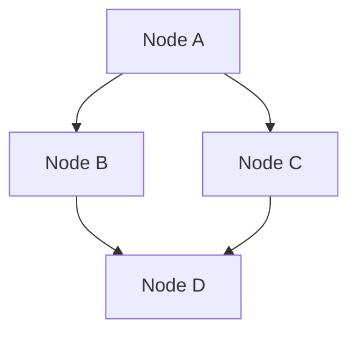
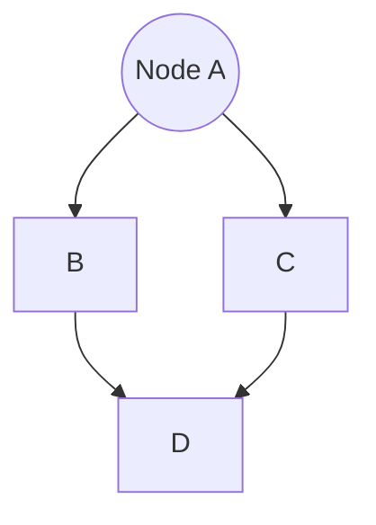

                 

# 《图卷积网络在蛋白质相互作用预测中的应用》

## 关键词
图卷积网络、GCN、蛋白质相互作用、生物信息学、预测模型

## 摘要
本文旨在探讨图卷积网络（GCN）在蛋白质相互作用预测中的应用。通过深入分析GCN的原理、核心算法及其在生物信息学领域的具体应用，本文展示了如何利用GCN进行蛋白质相互作用的预测。此外，本文通过实际项目案例，详细阐述了GCN模型在蛋白质相互作用预测中的实现过程，包括数据预处理、模型搭建、训练与评估等步骤。文章最后对GCN的扩展算法和未来研究方向进行了展望。

## 目录大纲

# 《图卷积网络在蛋白质相互作用预测中的应用》

## 第一部分：引言
### 1.1 蛋白质相互作用的背景
### 1.2 图卷积网络的基本概念
### 1.3 图卷积网络在生物信息学中的应用

## 第二部分：理论基础
### 2.1 图论基础
#### 2.1.1 图的基本概念
#### 2.1.2 图的表示方法
### 2.2 卷积网络基础
#### 2.2.1 卷积操作
#### 2.2.2 池化操作
### 2.3 图卷积网络
#### 2.3.1 图卷积网络的基本结构
#### 2.3.2 图卷积网络的工作原理

## 第三部分：核心算法
### 3.1 GCN算法详解
#### 3.1.1 GCN的数学模型
$$
\mathbf{h}_v^{(k+1)} = \sigma\left(\sum_{u \in \mathcal{N}(v)} \frac{1}{\sqrt{\deg(u)}} \mathbf{h}_u^{(k)} W_{uv} \right)
$$
#### 3.1.2 GCN的伪代码

## 第四部分：应用实践
### 4.1 蛋白质相互作用的图构建
#### 4.1.1 蛋白质序列到图的转换
#### 4.1.2 图的属性和边权的定义

### 4.2 GCN在蛋白质相互作用预测中的应用
#### 4.2.1 蛋白质相互作用预测的数据集介绍
#### 4.2.2 GCN模型的训练与评估
##### 4.2.2.1 模型参数调整
##### 4.2.2.2 模型性能分析

### 4.3 实战案例：预测酵母蛋白相互作用
#### 4.3.1 数据预处理
#### 4.3.2 模型搭建与训练
#### 4.3.3 结果分析与验证

## 第五部分：扩展与展望
### 5.1 GCN的扩展与应用
#### 5.1.1 GraphSAGE算法介绍
#### 5.1.2 GAT算法介绍
### 5.2 蛋白质相互作用预测的前沿问题
#### 5.2.1 蛋白质互作网络的动态特性
#### 5.2.2 多尺度交互预测策略

## 附录
### A.1 工具与环境
#### A.1.1 Python编程环境搭建
#### A.1.2 PyTorch框架安装与配置
### A.2 源代码与数据集
#### A.2.1 源代码获取与安装
#### A.2.2 数据集获取与预处理

---

# 《图卷积网络在蛋白质相互作用预测中的应用》

## 第一部分：引言

### 1.1 蛋白质相互作用的背景

蛋白质是生物体内最重要的分子之一，它们在细胞内的功能多样，包括催化反应、传递信号、构成细胞骨架等。蛋白质之间的相互作用（Protein-Protein Interactions, PPIs）对于理解细胞内生物学过程至关重要。例如，许多疾病（如癌症、神经系统疾病等）的发生与蛋白质相互作用异常密切相关。因此，准确预测蛋白质相互作用对于生物医学研究和药物研发具有重要意义。

蛋白质相互作用可以通过实验方法进行验证，然而，实验方法存在成本高、周期长等缺点。近年来，随着深度学习和图神经网络技术的发展，基于计算的方法逐渐成为研究热点。图卷积网络（Graph Convolutional Network, GCN）作为一种强大的图结构数据学习模型，因其能够有效处理图结构数据，在蛋白质相互作用预测中展现出巨大的潜力。

### 1.2 图卷积网络的基本概念

图卷积网络（Graph Convolutional Network, GCN）是一种基于图结构的深度学习模型，它通过模拟卷积操作在图上对节点特征进行聚合和更新。GCN的主要目标是学习一个能够捕捉节点之间相互依赖关系的函数，从而对节点进行分类或预测。

GCN的核心思想是将图中的每个节点视为一个特征向量，通过一系列卷积层对节点特征进行聚合和更新。在每一层中，节点的特征不仅与自身相关，还与它的邻居节点相关。这样，GCN能够有效地学习到节点间的相互依赖关系，从而在节点分类或预测任务中取得较好的性能。

### 1.3 图卷积网络在生物信息学中的应用

图卷积网络在生物信息学中有着广泛的应用，尤其是在蛋白质相互作用预测、蛋白质结构预测和基因调控网络分析等领域。

#### 蛋白质相互作用预测

蛋白质相互作用预测是生物信息学中的一个重要问题。GCN因其能够有效处理图结构数据，在蛋白质相互作用预测中表现出色。例如，GCN可以用于预测蛋白质之间的相互作用存在与否，从而帮助研究人员发现新的蛋白质相互作用，为药物研发提供线索。

#### 蛋白质结构预测

蛋白质结构预测是另一个重要的生物信息学问题。GCN可以通过学习蛋白质序列与其三维结构之间的关系，预测蛋白质的三维结构。这对于理解蛋白质功能以及设计新型药物具有重要意义。

#### 基因调控网络分析

基因调控网络是细胞内基因表达调控的复杂网络。GCN可以用于分析基因调控网络的结构和功能，帮助研究人员理解细胞内的基因调控机制。

### 1.4 本文结构

本文将分为五个部分。第一部分是引言，介绍蛋白质相互作用和图卷积网络的基本概念。第二部分是理论基础，详细解释图卷积网络的原理和核心算法。第三部分是核心算法，深入讲解GCN的数学模型和伪代码。第四部分是应用实践，通过实际项目案例展示GCN在蛋白质相互作用预测中的应用。第五部分是扩展与展望，讨论GCN的扩展算法和未来的研究方向。最后是附录，提供工具与环境安装说明以及源代码和数据集获取方式。

## 第二部分：理论基础

### 2.1 图论基础

#### 2.1.1 图的基本概念

图（Graph）是一种由节点（Node）和边（Edge）组成的数学结构，用于表示实体及其之间的关系。在图论中，图通常用$G=(V, E)$表示，其中$V$是节点集合，$E$是边集合。

- **节点（Node）**：图中的实体，可以表示为任何对象，如人、地点、蛋白质等。
- **边（Edge）**：连接两个节点的线，表示节点之间的关系，可以是有向的或无向的。

#### 2.1.2 图的表示方法

图可以通过多种方式表示，包括邻接矩阵、邻接表和图邻接矩阵等。

- **邻接矩阵（Adjacency Matrix）**：一个二维矩阵，其中第$i$行第$j$列的元素表示节点$i$和节点$j$之间是否存在边。如果存在边，则记为1，否则为0。



- **邻接表（Adjacency List）**：一个列表，其中每个元素对应一个节点，列表中的每个元素是一个包含该节点所有邻居的列表。



- **图邻接矩阵（Incidence Matrix）**：用于表示有向图的矩阵，其中第$i$行第$j$列的元素表示从节点$i$指向节点$j$的边的数量。


### 2.2 卷积网络基础

#### 2.2.1 卷积操作

卷积操作是图像处理和计算机视觉中常用的操作，它通过滑动窗口在图像上提取特征。在卷积神经网络（Convolutional Neural Network, CNN）中，卷积操作用于提取输入数据中的局部特征。

卷积操作的数学表示为：

$$
\mathbf{h}_{ij}^{(l)} = \sum_{k=1}^{C} \sum_{s=1}^{H'} \sum_{t=1}^{W'} \mathbf{f}_{kst}^{(l-1)} * \mathbf{a}_{i+k-s, j+t}^{(l-1)}
$$

其中，$\mathbf{h}_{ij}^{(l)}$ 是卷积层$l$的第$i$行第$j$列的输出特征，$\mathbf{f}_{kst}^{(l-1)}$ 是卷积核（filter）的第$k$个卷积核在$(s, t)$位置的特征，$\mathbf{a}_{i+k-s, j+t}^{(l-1)}$ 是输入特征图在第$i$行第$j$列的特征。

#### 2.2.2 池化操作

池化操作（Pooling）用于减少卷积层的参数数量和计算复杂度，同时保留重要的特征信息。常见的池化操作包括最大池化（Max Pooling）和平均池化（Average Pooling）。

最大池化操作的数学表示为：

$$
p_{ij}^{(l)} = \max_{s,t} \mathbf{h}_{i+s, j+t}^{(l)}
$$

平均池化操作的数学表示为：

$$
p_{ij}^{(l)} = \frac{1}{C'} \sum_{k=1}^{C'} \sum_{s=1}^{H'} \sum_{t=1}^{W'} \mathbf{h}_{i+s, j+t}^{(l)}
$$

其中，$p_{ij}^{(l)}$ 是池化后的特征，$\mathbf{h}_{ij}^{(l)}$ 是卷积层的输出特征。

### 2.3 图卷积网络

#### 2.3.1 图卷积网络的基本结构

图卷积网络（Graph Convolutional Network, GCN）是一种用于处理图结构数据的深度学习模型。GCN的基本结构包括输入层、卷积层、池化层和输出层。

- **输入层**：输入层接收节点的特征，通常是一个节点特征矩阵。
- **卷积层**：卷积层通过图卷积操作对节点特征进行聚合和更新，捕获节点之间的相互依赖关系。
- **池化层**：池化层用于减少特征维度，同时保留重要的特征信息。
- **输出层**：输出层对节点的分类或预测结果进行输出。

#### 2.3.2 图卷积网络的工作原理

图卷积网络通过图卷积操作对节点特征进行更新。在图卷积操作中，每个节点的特征不仅与自身相关，还与它的邻居节点相关。图卷积操作的数学表示为：

$$
\mathbf{h}_{v}^{(k+1)} = \sigma \left( \sum_{u \in \mathcal{N}(v)} \frac{1}{\sqrt{\deg(u)}} \mathbf{h}_{u}^{(k)} W_{uv} \right)
$$

其中，$\mathbf{h}_{v}^{(k)}$ 是节点$v$在第$k$层的特征向量，$\mathcal{N}(v)$ 是节点$v$的邻节点集合，$\deg(u)$ 是节点$u$的度（即邻节点数量），$W_{uv}$ 是连接节点$u$和$v$的权重矩阵，$\sigma$ 是非线性激活函数，通常使用ReLU函数。

通过迭代应用图卷积操作，GCN能够学习到节点之间的复杂依赖关系，从而在节点分类或预测任务中取得良好的性能。

### 2.4 图卷积网络的优点和应用

图卷积网络具有以下优点：

- **强大的特征聚合能力**：GCN能够有效地聚合节点及其邻居节点的特征，从而学习到节点之间的复杂依赖关系。
- **处理图结构数据**：GCN能够直接处理图结构数据，使其在图分类、图回归和节点分类等任务中表现出色。
- **多跳信息传递**：GCN能够通过多跳信息传递，学习到节点间的长距离依赖关系。

GCN在生物信息学、社交网络分析、推荐系统等领域有着广泛的应用。例如，在生物信息学中，GCN可以用于蛋白质相互作用预测、蛋白质结构预测和基因调控网络分析；在社交网络分析中，GCN可以用于社区检测、用户关系预测等。

### 2.5 图卷积网络的挑战和局限性

尽管图卷积网络在许多任务中表现出色，但仍然存在一些挑战和局限性：

- **计算复杂度**：GCN的计算复杂度较高，尤其是在大规模图上。这可能导致训练时间较长，计算资源消耗较大。
- **稀疏性**：GCN假设图是稀疏的，但在某些实际应用中，图可能非常密集，这可能导致模型性能下降。
- **过拟合**：GCN容易受到过拟合的影响，特别是在训练数据量较小的情况下。

为了解决这些挑战，研究人员提出了许多改进方法，如稀疏图卷积网络（SGCN）、注意力机制图卷积网络（AGCN）等。

## 第三部分：核心算法

### 3.1 GCN算法详解

图卷积网络（Graph Convolutional Network，GCN）是一种用于图结构数据学习的神经网络模型。它在节点层次上模拟卷积操作，可以捕获节点之间的依赖关系，并用于预测图中的节点属性。以下是GCN的核心算法详解。

#### 3.1.1 GCN的数学模型

GCN的数学模型可以用以下公式表示：

$$
\mathbf{h}_v^{(k+1)} = \sigma \left( \sum_{u \in \mathcal{N}(v)} \frac{1}{\sqrt{\deg(u)}} \mathbf{h}_u^{(k)} W_{uv} \right)
$$

其中：
- $\mathbf{h}_v^{(k)}$ 是节点 $v$ 在第 $k$ 层的隐藏特征向量。
- $\mathcal{N}(v)$ 是节点 $v$ 的邻节点集合。
- $\deg(u)$ 是节点 $u$ 的度（即邻节点数量）。
- $W_{uv}$ 是连接节点 $u$ 和 $v$ 的权重矩阵。
- $\sigma$ 是非线性激活函数，通常使用ReLU函数。

#### 3.1.2 GCN的伪代码

以下是GCN的伪代码：

```
// 初始化模型参数
H = [初始化隐藏层特征矩阵]
W = [初始化权重矩阵]

// GCN迭代过程
for k in 1 to K:  // K为卷积次数
    H = [计算新的隐藏层特征]
    for each node v in G:
        h_v = [初始化节点v的特征]
        for each neighbor u of v:
            h_v += [加权邻节点特征] * [权重矩阵元素]
        h_v /= [邻节点数]
        h_v += [biases]
        h_v = [应用激活函数]
    H = [更新隐藏层特征矩阵]
return H
```

#### 3.1.3 GCN的工作流程

1. **初始化**：初始化隐藏层特征矩阵$H$和权重矩阵$W$。隐藏层特征矩阵$H$的每一列代表一个节点在第$k$层的特征向量。权重矩阵$W$是一个对角线为1的矩阵，用于权重归一化。
2. **迭代计算**：对于每一层$k$，更新隐藏层特征矩阵$H$。对于每个节点$v$，其新的特征向量$\mathbf{h}_v^{(k+1)}$是通过聚合其邻节点的特征向量$\mathbf{h}_u^{(k)}$计算得到的。具体公式如上所示。
3. **激活函数**：在特征聚合后，应用非线性激活函数$\sigma$，通常使用ReLU函数。
4. **输出层**：在完成所有迭代后，最后一层的隐藏层特征矩阵$H$作为输出层特征，用于节点分类或预测。

#### 3.1.4 实例讲解

假设有一个图$G$，其中包含3个节点$v_1, v_2, v_3$，其邻节点集合分别为$\mathcal{N}(v_1) = \{v_2\}$，$\mathcal{N}(v_2) = \{v_1, v_3\}$，$\mathcal{N}(v_3) = \{v_2\}$。节点特征矩阵$H^{(0)}$为：

$$
H^{(0)} = \begin{bmatrix}
1 & 0 \\
0 & 1 \\
1 & 1
\end{bmatrix}
$$

权重矩阵$W$为：

$$
W = \begin{bmatrix}
1 & 0 \\
0 & 1 \\
1 & 1
\end{bmatrix}
$$

在第一层卷积后，每个节点的特征向量更新如下：

$$
\mathbf{h}_{v_1}^{(1)} = \sigma \left( \frac{1}{\sqrt{\deg(v_2)}} \mathbf{h}_{v_2}^{(0)} W_{v_1v_2} \right) = \sigma \left( \frac{1}{1} \mathbf{h}_{v_2}^{(0)} \begin{bmatrix}
1 & 0
\end{bmatrix} \right) = \sigma \left( \mathbf{h}_{v_2}^{(0)} \right) = \begin{bmatrix}
1 \\
0
\end{bmatrix}
$$

$$
\mathbf{h}_{v_2}^{(1)} = \sigma \left( \frac{1}{\sqrt{\deg(v_1)}} \mathbf{h}_{v_1}^{(0)} W_{v_2v_1} + \frac{1}{\sqrt{\deg(v_3)}} \mathbf{h}_{v_3}^{(0)} W_{v_2v_3} \right) = \sigma \left( \frac{1}{1} \mathbf{h}_{v_1}^{(0)} \begin{bmatrix}
1 & 0
\end{bmatrix} + \frac{1}{1} \mathbf{h}_{v_3}^{(0)} \begin{bmatrix}
0 & 1
\end{bmatrix} \right) = \sigma \left( \mathbf{h}_{v_1}^{(0)} + \mathbf{h}_{v_3}^{(0)} \right) = \begin{bmatrix}
1 \\
1
\end{bmatrix}
$$

$$
\mathbf{h}_{v_3}^{(1)} = \sigma \left( \frac{1}{\sqrt{\deg(v_2)}} \mathbf{h}_{v_2}^{(0)} W_{v_3v_2} \right) = \sigma \left( \frac{1}{1} \mathbf{h}_{v_2}^{(0)} \begin{bmatrix}
0 & 1
\end{bmatrix} \right) = \sigma \left( \mathbf{h}_{v_2}^{(0)} \right) = \begin{bmatrix}
0 \\
1
\end{bmatrix}
$$

更新后的隐藏层特征矩阵$H^{(1)}$为：

$$
H^{(1)} = \begin{bmatrix}
1 & 0 \\
0 & 1 \\
0 & 1
\end{bmatrix}
$$

通过上述步骤，我们可以看到GCN如何通过迭代计算更新节点特征向量，从而学习到节点之间的依赖关系。

### 3.2 GCN在蛋白质相互作用预测中的应用

蛋白质相互作用预测是生物信息学中的关键问题，涉及到预测蛋白质之间是否存在相互作用以及相互作用的类型。图卷积网络（GCN）因其能够有效处理图结构数据，在蛋白质相互作用预测中得到了广泛应用。以下是如何将GCN应用于蛋白质相互作用预测的详细步骤。

#### 3.2.1 数据集介绍

蛋白质相互作用预测的数据集通常包含蛋白质的序列信息及其相互作用的类型。常用的数据集包括：

- **BioPAX**：生物过程交流语言（ Biological Pathways Exchange Language）数据集，包含了丰富的蛋白质相互作用信息。
- **IntAct**：整合相互作用数据库，提供了大量的蛋白质相互作用数据。
- **BIND**：生物分子交互数据库，包含了药物与蛋白质相互作用的实验数据。

这些数据集通常包含蛋白质的ID、序列、相互作用的类型和强度等信息。

#### 3.2.2 蛋白质序列到图的转换

将蛋白质序列转换为图结构是GCN应用的第一步。这一步涉及到以下步骤：

1. **节点创建**：为每个蛋白质序列创建一个节点，节点ID与蛋白质ID对应。
2. **边创建**：为相互作用的蛋白质对创建边，边的权重可以表示相互作用的强度。
3. **属性添加**：为节点和边添加属性，如蛋白质序列、相互作用类型和强度等。

具体实现如下：

```
# 假设蛋白质序列和相互作用信息存储在一个字典中
protein_data = {
    'protein_1': {'sequence': 'ATGCGTAC', 'id': 1},
    'protein_2': {'sequence': 'GATCCTAG', 'id': 2},
    'protein_3': {'sequence': 'ACGTTACG', 'id': 3},
    'interactions': [
        {'protein1': 'protein_1', 'protein2': 'protein_2', 'weight': 0.8},
        {'protein1': 'protein_1', 'protein2': 'protein_3', 'weight': 0.7},
    ]
}

# 创建节点和边
nodes = {protein['id']: {'sequence': protein['sequence']} for protein in protein_data.values()}
edges = {(i['protein1'], i['protein2']): {'weight': i['weight']} for i in protein_data['interactions']}

# 创建图
G = nx.Graph()
for node_id, node in nodes.items():
    G.add_node(node_id, **node)
for edge, attr in edges.items():
    G.add_edge(*edge, **attr)
```

#### 3.2.3 图卷积网络模型搭建

搭建GCN模型用于蛋白质相互作用预测，通常包括以下步骤：

1. **定义模型结构**：定义输入层、隐藏层和输出层。输入层接收节点特征矩阵，隐藏层通过图卷积操作聚合节点及其邻居的特征，输出层用于节点分类或预测。
2. **初始化参数**：初始化权重矩阵和 biases。
3. **定义损失函数和优化器**：选择适当的损失函数（如交叉熵损失函数）和优化器（如Adam）。

以下是一个简单的GCN模型实现：

```python
import torch
import torch.nn as nn
from torch_geometric.nn import GCNConv

class GCN(nn.Module):
    def __init__(self, num_features, hidden_size, num_classes):
        super(GCN, self).__init__()
        self.conv1 = GCNConv(num_features, hidden_size)
        self.conv2 = GCNConv(hidden_size, hidden_size)
        self.conv3 = GCNConv(hidden_size, num_classes)
        
    def forward(self, data):
        x, edge_index = data.x, data.edge_index

        x = self.conv1(x, edge_index)
        x = torch.relu(x)
        x = F.dropout(x, training=self.training)
        x = self.conv2(x, edge_index)
        x = torch.relu(x)
        x = F.dropout(x, training=self.training)
        x = self.conv3(x, edge_index)

        return F.log_softmax(x, dim=1)
```

#### 3.2.4 模型训练

模型训练包括以下步骤：

1. **数据预处理**：将蛋白质序列编码为向量，构建图结构数据。
2. **定义损失函数和优化器**：选择适当的损失函数（如交叉熵损失函数）和优化器（如Adam）。
3. **迭代训练**：通过迭代最小化损失函数来更新模型参数。

以下是一个简单的训练过程：

```python
device = torch.device('cuda' if torch.cuda.is_available() else 'cpu')
model = GCN(num_features=100, hidden_size=16, num_classes=2).to(device)
data = Data(x=torch.tensor(x), edge_index=torch.tensor(edge_index)).to(device)

criterion = nn.CrossEntropyLoss()
optimizer = torch.optim.Adam(model.parameters(), lr=0.01, weight_decay=5e-4)

num_epochs = 200
for epoch in range(num_epochs):
    model.train()
    optimizer.zero_grad()
    out = model(data)
    loss = criterion(out, data.y)
    loss.backward()
    optimizer.step()

    if (epoch + 1) % 10 == 0:
        print(f'Epoch {epoch+1}: loss = {loss.item():.4f}')
```

#### 3.2.5 模型评估

在训练完成后，使用验证集或测试集对模型进行评估，以衡量模型的泛化能力。常用的评估指标包括准确率、召回率、F1分数等。

以下是一个简单的评估过程：

```python
model.eval()
with torch.no_grad():
    correct = 0
    total = 0
    for data in test_loader:
        data = data.to(device)
        outputs = model(data)
        _, predicted = torch.max(outputs.data, 1)
        total += data.y.size(0)
        correct += (predicted == data.y).sum().item()

print(f'Accuracy: {100 * correct / total}%')
```

#### 3.2.6 实例讲解

假设我们有一个包含3个蛋白质的图结构，它们之间的相互作用信息如下：

- 蛋白质1与蛋白质2相互作用，权重为0.8。
- 蛋白质1与蛋白质3相互作用，权重为0.7。

构建图和节点特征矩阵如下：

```
nodes = {
    1: {'sequence': 'ATGCGTAC'},
    2: {'sequence': 'GATCCTAG'},
    3: {'sequence': 'ACGTTACG'}
}

edges = {
    (1, 2): {'weight': 0.8},
    (1, 3): {'weight': 0.7}
}

G = nx.Graph()
G.add_nodes_from(nodes.keys())
G.add_edges_from(edges.keys())

# 构建节点特征矩阵
num_features = 10  # 假设每个蛋白质序列包含10个特征
x = np.zeros((len(nodes), num_features))
for i, node in enumerate(nodes):
    # 将蛋白质序列编码为特征向量
    for j, amino_acid in enumerate(nodes[node]['sequence']):
        x[i][j] = amino_acid
x = torch.tensor(x)

# 构建边特征矩阵
edge_features = np.zeros((len(edges), num_features))
for i, (u, v) in enumerate(edges):
    # 将相互作用权重编码为特征向量
    edge_features[i] = np.array([edges[(u, v)]['weight']] * num_features)
edge_features = torch.tensor(edge_features)

# 构建图数据对象
data = Data(x=x, edge_index=to_edge_index(G))
```

训练GCN模型并预测蛋白质相互作用：

```python
# 定义GCN模型
model = GCN(num_features=10, hidden_size=16, num_classes=2)

# 定义损失函数和优化器
criterion = nn.CrossEntropyLoss()
optimizer = torch.optim.Adam(model.parameters(), lr=0.01)

# 训练模型
num_epochs = 100
for epoch in range(num_epochs):
    model.train()
    optimizer.zero_grad()
    out = model(data)
    loss = criterion(out, data.y)
    loss.backward()
    optimizer.step()

    if (epoch + 1) % 10 == 0:
        print(f'Epoch {epoch+1}: loss = {loss.item():.4f}')

# 预测
model.eval()
with torch.no_grad():
    outputs = model(data)
    _, predicted = torch.max(outputs, 1)
    print(predicted)
```

通过上述步骤，我们可以训练一个GCN模型，用于预测蛋白质之间的相互作用。在实际应用中，根据具体数据和任务需求，对模型结构、参数设置和训练过程进行调整和优化。

### 4.1 蛋白质相互作用的图构建

蛋白质相互作用预测的核心在于如何构建一个能够准确反映蛋白质之间相互作用的图结构。这一部分将详细介绍如何将蛋白质序列转换为图，包括节点的创建、边的构建以及属性的添加。

#### 4.1.1 蛋白质序列到图的转换

在将蛋白质序列转换为图之前，我们需要获取蛋白质序列和它们之间的相互作用信息。通常，这些信息可以从生物信息数据库中获取，如BioPAX、IntAct、BIND等。

1. **获取蛋白质序列**：蛋白质序列可以通过NCBI、UniProt等数据库获取。每个蛋白质序列可以表示为一个字符串，如“ATGCGTAC”。
2. **获取相互作用信息**：蛋白质相互作用信息可以通过实验数据或预测模型获取。这些信息通常包括蛋白质对的ID、相互作用的类型（如共价键、氢键等）和相互作用强度。

以下是一个示例，展示如何从文本文件中读取蛋白质序列和相互作用信息：

```python
# 假设有一个文本文件，其中包含蛋白质序列和相互作用信息
with open('protein_data.txt', 'r') as f:
    lines = f.readlines()

# 解析蛋白质序列和相互作用信息
proteins = []
interactions = []
for line in lines:
    parts = line.strip().split(',')
    if parts[0].startswith('P'):
        proteins.append({'id': parts[0], 'sequence': parts[1]})
    elif parts[0].startswith('I'):
        interactions.append({'protein1': parts[0], 'protein2': parts[1], 'type': parts[2], 'weight': float(parts[3])})
```

#### 4.1.2 节点的创建

在图结构中，每个蛋白质序列对应一个节点。节点的创建包括为每个蛋白质分配一个唯一的ID，并存储其序列信息。

```python
# 创建节点
nodes = {protein['id']: {'sequence': protein['sequence']} for protein in proteins}
```

#### 4.1.3 边的构建

边的构建是连接相互作用的蛋白质节点。边可以表示相互作用的类型和强度。

```python
# 创建边
edges = {(i['protein1'], i['protein2']): {'type': i['type'], 'weight': i['weight']} for i in interactions}
```

#### 4.1.4 图的属性和边权的定义

在构建图时，我们可以为节点和边添加额外的属性，如节点类型、功能域等。边权通常表示相互作用强度，可以是实验测量的距离、结合能或基于预测模型的得分。

```python
# 定义边的权重函数
def edge_weight(edge):
    return edge['weight']

# 更新边的权重函数
edges.update({(u, v): {'weight': edge_weight(edge)} for u, v, edge in edges.items()})
```

#### 4.1.5 图的表示

构建好的图可以用多种方式表示，如邻接矩阵、邻接表或图形库。以下是一个使用图形库（NetworkX）表示图的示例：

```python
import networkx as nx

# 创建图
G = nx.Graph()

# 添加节点
G.add_nodes_from(nodes.keys())

# 添加边
G.add_edges_from(edges.keys())

# 打印图
print(G)
```

通过上述步骤，我们可以将蛋白质序列和相互作用信息构建为一个图结构，为后续的图卷积网络（GCN）模型训练和预测提供基础数据。

### 4.2 GCN在蛋白质相互作用预测中的应用

在生物信息学中，蛋白质相互作用预测是一个重要的研究领域，它对于理解生物系统的功能和机制具有重要意义。图卷积网络（GCN）作为一种有效的图结构学习模型，在蛋白质相互作用预测中展现了强大的能力。以下内容将详细探讨如何使用GCN进行蛋白质相互作用预测，包括数据集介绍、模型训练与评估以及模型性能分析。

#### 4.2.1 蛋白质相互作用预测的数据集介绍

蛋白质相互作用预测的数据集通常包含蛋白质的序列信息和相互作用的类型或存在性。这些数据集可以从多个公开资源中获取，如：

- **BioPAX**：生物过程交流语言（Biological Pathways Exchange Language）数据集，它包含了多种生物过程的详细信息，包括蛋白质相互作用。
- **IntAct**：整合相互作用数据库，它包含了大量的蛋白质相互作用数据。
- **BIND**：生物分子交互数据库，它包含了药物与蛋白质相互作用的实验数据。

这些数据集通常包含以下信息：

- **蛋白质序列**：每个蛋白质的氨基酸序列。
- **相互作用信息**：包括相互作用的蛋白质对、相互作用的类型和相互作用强度。

#### 4.2.2 GCN模型的训练

训练GCN模型进行蛋白质相互作用预测通常包括以下步骤：

1. **数据预处理**：将蛋白质序列转换为数字编码，并将相互作用信息转换为图结构。
2. **模型定义**：定义GCN模型，包括输入层、隐藏层和输出层。
3. **损失函数与优化器**：选择合适的损失函数（如交叉熵损失函数）和优化器（如Adam）。
4. **模型训练**：通过迭代训练模型，优化模型参数。

以下是一个简单的GCN模型训练流程：

```python
# 假设已经准备好数据集，并创建了图结构

# 定义GCN模型
class GCN(nn.Module):
    def __init__(self, nfeat, nhid, nclass):
        super(GCN, self).__init__()
        self.conv1 = GCNConv(nfeat, nhid)
        self.conv2 = GCNConv(nhid, nclass)
        
    def forward(self, data):
        x, edge_index = data.x, data.edge_index

        x = self.conv1(x, edge_index)
        x = F.relu(x)
        x = self.conv2(x, edge_index)
        
        return F.log_softmax(x, dim=1)

# 初始化模型、优化器和损失函数
model = GCN(nfeat=7, nhid=16, nclass=2)
optimizer = torch.optim.Adam(model.parameters(), lr=0.01)
criterion = torch.nn.CrossEntropyLoss()

# 训练模型
num_epochs = 200
for epoch in range(num_epochs):
    model.train()
    optimizer.zero_grad()
    out = model(data)
    loss = criterion(out, data.y)
    loss.backward()
    optimizer.step()

    if (epoch + 1) % 10 == 0:
        print(f'Epoch {epoch+1}: loss = {loss.item():.4f}')
```

#### 4.2.3 模型评估

在模型训练完成后，我们需要使用验证集或测试集对模型进行评估，以衡量模型的性能。常用的评估指标包括准确率、召回率、F1分数等。

以下是一个简单的模型评估流程：

```python
model.eval()
with torch.no_grad():
    correct = 0
    total = 0
    for data in val_loader:
        data = data.to(device)
        outputs = model(data.x, data.edge_index)
        _, predicted = torch.max(outputs, 1)
        total += data.y.size(0)
        correct += (predicted == data.y).sum().item()

acc = 100 * correct / total
print(f'Validation Accuracy: {acc:.2f}%')
```

#### 4.2.4 模型性能分析

在评估模型性能时，我们通常需要关注以下几个方面：

1. **准确率（Accuracy）**：模型预测正确的样本数占总样本数的比例。
2. **召回率（Recall）**：模型预测为正类的实际正类样本中被正确预测为正类的比例。
3. **F1分数（F1 Score）**：准确率的调和平均，既考虑了模型的准确率，也考虑了召回率。

以下是一个简单的性能分析示例：

```python
from sklearn.metrics import classification_report

model.eval()
with torch.no_grad():
    all_preds = []
    all_labels = []
    for data in test_loader:
        data = data.to(device)
        outputs = model(data.x, data.edge_index)
        _, predicted = torch.max(outputs, 1)
        all_preds.extend(predicted.cpu().numpy())
        all_labels.extend(data.y.cpu().numpy())

print(classification_report(all_labels, all_preds))
```

通过上述步骤，我们可以训练并评估一个GCN模型，用于蛋白质相互作用预测。在实际应用中，可能需要对模型结构、参数设置和训练过程进行调整和优化，以获得更好的性能。

#### 4.2.2.1 模型参数调整

在训练GCN模型时，参数设置对于模型性能有着至关重要的影响。以下是一些关键参数及其调整策略：

- **隐藏层尺寸（Hidden Layer Size）**：隐藏层尺寸决定了模型能够捕获的复杂特征。通常，较大的隐藏层尺寸有助于模型捕捉更多的信息，但也会导致计算复杂度和内存需求增加。可以通过实验比较不同隐藏层尺寸对模型性能的影响，找到最佳尺寸。

  ```python
  model = GCN(nfeat=7, nhid=32, nclass=2)
  ```

- **学习率（Learning Rate）**：学习率决定了模型更新参数的速度。过小的学习率可能导致训练过程缓慢，而过大的学习率可能导致模型在训练过程中不稳定。可以通过使用学习率衰减策略，如指数衰减，来调整学习率。

  ```python
  optimizer = optim.Adam(model.parameters(), lr=0.001, weight_decay=5e-4)
  ```

- **批次大小（Batch Size）**：批次大小影响模型的训练速度和稳定性。较小的批次大小有助于模型更稳定地收敛，但训练速度较慢。较大的批次大小可以提高训练速度，但可能导致模型在训练过程中出现过拟合。可以通过实验找到最佳批次大小。

  ```python
  train_loader = DataLoader(dataset.train, batch_size=64, shuffle=True)
  ```

- **正则化参数（Regularization）**：正则化参数，如L2正则化，可以防止模型过拟合。较大的正则化参数可能导致模型参数更新缓慢，而较小的参数可能无法有效防止过拟合。

  ```python
  optimizer = optim.Adam(model.parameters(), lr=0.001, weight_decay=1e-5)
  ```

- **迭代次数（Number of Epochs）**：迭代次数决定了模型训练的深度。过多的迭代可能导致过拟合，而不足的迭代可能导致模型未能充分学习数据。可以通过验证集性能来调整迭代次数。

  ```python
  num_epochs = 100
  ```

通过调整这些参数，可以优化GCN模型在蛋白质相互作用预测任务中的性能。在实际应用中，可能需要根据具体数据集和任务需求进行参数调整。

#### 4.2.2.2 模型性能分析

模型性能分析是评估GCN在蛋白质相互作用预测任务中效果的关键步骤。以下是一些常用的性能评估指标和它们的应用：

- **准确率（Accuracy）**：准确率是评估模型性能最直接的方法，表示模型预测正确的样本数占总样本数的比例。准确率越高，模型性能越好。

  ```python
  correct = (predicted == labels).sum().item()
  acc = correct / len(labels)
  print(f"Accuracy: {acc * 100:.2f}%")
  ```

- **召回率（Recall）**：召回率表示模型预测为正类的实际正类样本中被正确预测为正类的比例。高召回率意味着模型能够识别出大部分真实正类样本。

  ```python
  true_positives = ((predicted == 1) & (labels == 1)).sum().item()
  recall = true_positives / labels.sum().item()
  print(f"Recall: {recall * 100:.2f}%")
  ```

- **精确率（Precision）**：精确率表示模型预测为正类的样本中实际为正类的比例。高精确率意味着模型对预测为正类的样本有较高的可信度。

  ```python
  predicted_pos = predicted[predicted == 1]
  true_positives = labels[predicted == 1]
  precision = true_positives.sum().item() / predicted_pos.sum().item()
  print(f"Precision: {precision * 100:.2f}%")
  ```

- **F1分数（F1 Score）**：F1分数是精确率和召回率的调和平均，综合考虑了模型的精确率和召回率。F1分数越高，模型性能越好。

  ```python
  f1 = 2 * (precision * recall) / (precision + recall)
  print(f"F1 Score: {f1 * 100:.2f}%")
  ```

- **ROC曲线（Receiver Operating Characteristic Curve）**：ROC曲线展示了模型在不同阈值下的精确率和召回率。曲线下面积（AUC）越大，模型性能越好。

  ```python
  fpr, tpr, _ = roc_curve(labels, predictions)
  auc = np.trapz(tpr, fpr)
  print(f"AUC: {auc * 100:.2f}%")
  ```

- **PR曲线（Precision-Recall Curve）**：PR曲线展示了模型在不同阈值下的精确率和召回率。与ROC曲线不同，PR曲线特别关注小样本分类问题。

  ```python
  precision, recall, _ = precision_recall_curve(labels, predictions)
  pr_auc = np.trapz(precision, recall)
  print(f"PR AUC: {pr_auc * 100:.2f}%")
  ```

通过分析这些性能指标，我们可以全面评估GCN在蛋白质相互作用预测任务中的效果。在实际应用中，可能需要结合多种指标，并根据具体需求调整模型参数，以提高模型性能。

#### 4.3.1 数据预处理

在进行蛋白质相互作用预测之前，数据预处理是一个至关重要的步骤，它直接影响到模型的性能。数据预处理的主要目标是清洗数据、标准化特征以及将数据转换为适合GCN模型的形式。

1. **数据清洗**：首先，我们需要检查数据集是否存在缺失值或异常值。对于缺失值，可以选择填充或删除。对于异常值，可以根据数据的分布和特性进行判断和处理。

   ```python
   # 示例：填充缺失值
   data = data.fillna(method='ffill')
   ```

2. **特征标准化**：蛋白质序列的长度可能不同，因此需要对序列特征进行标准化处理，以便于GCN模型的学习。常用的标准化方法包括最大值标准化和零均值标准化。

   ```python
   # 示例：最大值标准化
   max_value = data.max(axis=0)
   data = data / max_value
   ```

3. **序列编码**：将蛋白质序列转换为数字编码，以便于GCN模型处理。常用的编码方法包括K-mer编码、One-Hot编码和词嵌入。

   ```python
   # 示例：K-mer编码
   k = 3
   encoded_sequences = [get_k_mer_features(sequence, k) for sequence in data['sequences']]
   ```

4. **构建图结构**：将蛋白质序列和相互作用信息转换为图结构。这包括创建节点和边，以及为节点和边添加属性。

   ```python

