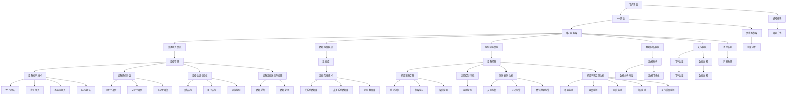

                 

# 基于Java的智能家居设计：打造可扩展的智能家居中心服务器

## 关键词
- 智能家居系统
- Java编程
- 中心服务器
- 可扩展性
- 设备接入
- 数据管理
- 性能优化

## 摘要
本文将深入探讨基于Java的智能家居设计，特别是如何打造一个可扩展的智能家居中心服务器。我们将从智能家居系统概述开始，介绍其定义、架构和关键技术，随后逐步讲解Java编程基础。接着，文章将重点描述智能家居中心服务器的架构设计、设备接入及控制功能实现，数据管理，性能优化以及项目实战。最后，我们将讨论服务器的扩展与维护，并提供相关技术资源与工具推荐。

### 《基于Java的智能家居设计：打造可扩展的智能家居中心服务器》目录大纲

**第一部分：智能家居系统概述**

### 第1章：智能家居系统概述

1.1 智能家居的定义与发展

1.2 智能家居系统架构

1.3 智能家居系统的关键技术

1.4 智能家居系统的发展趋势

### 第2章：Java编程基础

2.1 Java语言基础

2.2 Java面向对象编程

2.3 Java异常处理

2.4 Java集合框架

**第二部分：智能家居中心服务器设计**

### 第3章：智能家居中心服务器架构设计

3.1 中心服务器概述

3.2 服务器端架构设计

3.3 客户端架构设计

3.4 通信协议设计

### 第4章：智能家居设备接入

4.1 设备接入技术

4.2 设备通信协议

4.3 设备认证与授权

4.4 设备数据采集与处理

### 第5章：智能家居控制功能实现

5.1 家居场景控制

5.2 远程控制功能

5.3 家居安防功能

5.4 家居环境监测功能

### 第6章：智能家居数据管理

6.1 数据存储技术

6.2 数据分析方法

6.3 数据可视化

6.4 数据安全与隐私保护

### 第7章：智能家居中心服务器性能优化

7.1 服务器性能优化策略

7.2 高并发处理

7.3 缓存技术

7.4 分布式系统设计

### 第8章：智能家居中心服务器项目实战

8.1 项目背景与需求分析

8.2 开发环境搭建

8.3 源代码实现与分析

8.4 系统部署与测试

### 第9章：智能家居中心服务器扩展与维护

9.1 服务器扩展策略

9.2 服务器维护方法

9.3 负载均衡与容灾备份

9.4 系统安全防护

**附录：相关技术资源与工具推荐**

A.1 Java开发工具推荐

A.2 智能家居相关技术资料

A.3 智能家居开源项目推荐

A.4 网络资源链接

### 附录 Mermaid 流程图

mermaid
graph TB
A[智能家居系统架构] --> B[中心服务器]
B --> C[设备接入]
C --> D[设备通信协议]
D --> E[设备认证与授权]
E --> F[设备数据采集与处理]
F --> G[家居场景控制]
G --> H[远程控制功能]
H --> I[家居安防功能]
I --> J[家居环境监测功能]
J --> K[数据存储技术]
K --> L[数据分析方法]
L --> M[数据可视化]
M --> N[数据安全与隐私保护]
N --> O[服务器性能优化策略]
O --> P[高并发处理]
P --> Q[缓存技术]
Q --> R[分布式系统设计]
R --> S[服务器扩展策略]
S --> T[服务器维护方法]
T --> U[负载均衡与容灾备份]
U --> V[系统安全防护]
V --> W[相关技术资源与工具推荐]

---

接下来，我们将逐步深入各个章节，详细探讨智能家居设计的各个方面。让我们从智能家居系统的概述开始。


### 第1章：智能家居系统概述

智能家居系统是一种将家庭设备和服务通过网络互联，实现智能控制与自动化管理的系统。它通过物联网技术，将家庭中的各种设备连接起来，使得用户能够通过一个中心平台对家中的设备进行远程监控和控制。下面，我们将从定义、架构、关键技术和发展趋势四个方面对智能家居系统进行概述。

#### 1.1 智能家居的定义与发展

智能家居（Smart Home）是一种利用互联网、物联网（IoT）、云计算和人工智能等先进技术，将家庭中的各种设备和服务互联互通，实现智能化管理和自动化的系统。它不仅仅包括家庭电器、照明、空调等设备的智能化，还包括安防、健康、娱乐等多个方面。

智能家居的发展经历了几个阶段：

- **早期阶段**：主要是家庭设备的简单联网，如网络家电和智能照明。
- **发展阶段**：随着物联网技术的发展，家庭设备之间的互操作性得到了提升，形成了一个更加紧密的智能家居系统。
- **成熟阶段**：当前，智能家居系统正朝着更加智能化、个性化、安全可靠的方向发展。

#### 1.2 智能家居系统架构

智能家居系统的架构通常包括以下几个关键部分：

1. **中心服务器**：作为系统的核心，负责设备接入、数据存储、处理和控制。
2. **设备层**：包括各种智能家居设备，如智能灯泡、智能插座、智能摄像头等。
3. **网络层**：包括局域网（LAN）和广域网（WAN），负责设备之间的通信和数据传输。
4. **用户层**：包括移动端应用、PC端应用等，用户通过这些界面进行设备的远程控制和监测。

#### 1.3 智能家居系统的关键技术

智能家居系统实现的关键技术包括：

1. **物联网技术**：通过无线通信技术，如Wi-Fi、蓝牙、Zigbee等，实现设备之间的互联互通。
2. **云计算技术**：通过云平台，提供数据存储、处理和分析服务，实现设备的远程监控和控制。
3. **人工智能技术**：利用机器学习和人工智能算法，实现设备的智能控制和个性化服务。
4. **安全通信技术**：通过加密和安全认证等技术，确保设备通信的安全和隐私。

#### 1.4 智能家居系统的发展趋势

随着科技的不断进步，智能家居系统正朝着以下几个方向发展：

1. **智能化**：通过人工智能技术，实现设备之间的智能交互和自主学习，提高用户体验。
2. **个性化**：根据用户习惯和偏好，提供个性化的服务和建议。
3. **安全可靠**：加强设备安全防护，确保用户隐私和数据安全。
4. **节能环保**：通过智能控制，实现能源的高效利用，降低能耗。

#### 1.5 智能家居系统的挑战

尽管智能家居系统具有许多优势，但在实际应用中仍面临一些挑战：

1. **设备兼容性**：不同品牌和类型的设备之间的互操作性是一个难题。
2. **隐私保护**：用户隐私和数据安全是重要的问题。
3. **数据管理和分析**：如何有效地管理和分析海量的数据，提供有价值的服务。

在下一章中，我们将探讨Java编程基础，为后续的智能家居中心服务器设计奠定基础。请继续关注。


### 第2章：Java编程基础

Java作为一种广泛使用的编程语言，以其跨平台、面向对象、安全性高等特点，成为开发复杂系统的首选语言。在智能家居中心服务器的开发中，Java语言具有不可替代的优势。本章将介绍Java编程基础，包括语言基础、面向对象编程、异常处理和集合框架等内容。

#### 2.1 Java语言基础

Java语言的基础知识包括变量、数据类型、运算符、控制结构和基本输入输出等。以下是一些核心概念：

- **变量**：用于存储数据的容器，有局部变量和成员变量之分。
- **数据类型**：包括基本数据类型（如int、double、String等）和引用数据类型（如类、接口等）。
- **运算符**：包括算术运算符、逻辑运算符、关系运算符等。
- **控制结构**：包括if条件语句、循环语句（for、while、do-while）和switch语句等。
- **输入输出**：通过System.in和System.out进行标准输入输出。

以下是一个简单的Java程序示例，展示了上述基础：

```java
public class HelloWorld {
    public static void main(String[] args) {
        System.out.println("Hello, World!");
    }
}
```

#### 2.2 Java面向对象编程

Java是一种面向对象的语言，其核心概念包括类、对象、封装、继承和多态。

- **类**：是对象的模板，定义了对象的属性和行为。
- **对象**：是类的实例，拥有类定义的属性和方法。
- **封装**：是信息隐藏的一种技术，通过将数据和对数据的操作封装在一起，提高代码的模块化和安全性。
- **继承**：是创建新类的一种方式，允许新类继承已有类的属性和方法。
- **多态**：是指同一个操作可以有不同的行为，通过方法重载和方法重写实现。

以下是一个简单的面向对象示例：

```java
// 类的定义
class Dog {
    String name;
    int age;

    void bark() {
        System.out.println(name + " is barking!");
    }
}

// 对象的创建和使用
public class Main {
    public static void main(String[] args) {
        Dog myDog = new Dog();
        myDog.name = "Max";
        myDog.age = 5;
        myDog.bark();
    }
}
```

#### 2.3 Java异常处理

异常处理是Java编程中非常重要的一部分，用于处理程序运行时可能出现的错误或异常情况。Java提供了try-catch-finally语句来处理异常。

- **try**：用于尝试执行可能发生异常的代码块。
- **catch**：用于捕获try块中抛出的异常，并执行相应的处理代码。
- **finally**：用于执行无论是否发生异常都会执行的代码块。

以下是一个简单的异常处理示例：

```java
public class Main {
    public static void main(String[] args) {
        try {
            int result = divide(10, 0);
            System.out.println("Result: " + result);
        } catch (ArithmeticException e) {
            System.out.println("Error: " + e.getMessage());
        } finally {
            System.out.println("Finally block executed.");
        }
    }

    public static int divide(int a, int b) {
        return a / b;
    }
}
```

#### 2.4 Java集合框架

Java集合框架是Java语言中用于处理集合对象的一个库，包括List、Set、Map等接口及其实现类。以下是几个常用的集合类：

- **ArrayList**：实现List接口，提供元素随机访问功能。
- **LinkedList**：实现List接口，提供链表数据结构。
- **HashSet**：实现Set接口，提供无序的元素集合。
- **HashMap**：实现Map接口，提供键值对映射。

以下是一个使用集合框架的示例：

```java
import java.util.ArrayList;
import java.util.HashMap;
import java.util.HashSet;

public class Main {
    public static void main(String[] args) {
        ArrayList<String> list = new ArrayList<>();
        list.add("Apple");
        list.add("Banana");
        list.add("Cherry");
        
        HashSet<String> set = new HashSet<>();
        set.add("Apple");
        set.add("Banana");
        set.add("Apple"); // 重复的元素不会添加
        
        HashMap<String, Integer> map = new HashMap<>();
        map.put("Apple", 1);
        map.put("Banana", 2);
        
        System.out.println("List: " + list);
        System.out.println("Set: " + set);
        System.out.println("Map: " + map);
    }
}
```

通过上述内容，我们了解了Java编程基础。接下来，我们将进入智能家居中心服务器的架构设计部分，探索如何构建一个高效、可扩展的智能家居中心服务器。请继续关注。


### 第3章：智能家居中心服务器架构设计

在智能家居系统中，中心服务器扮演着至关重要的角色，它是连接用户与设备、处理数据和提供服务的核心。一个高效、可扩展的中心服务器架构对于智能家居系统的性能和稳定性至关重要。本章将详细描述智能家居中心服务器的架构设计，包括服务器端架构设计、客户端架构设计以及通信协议设计。

#### 3.1 中心服务器概述

中心服务器负责以下几个关键功能：

- **设备管理**：管理智能家居设备的接入、状态监测和远程控制。
- **数据存储**：收集并存储设备数据，如温度、湿度、光照强度等。
- **数据处理**：对收集到的数据进行分析和处理，以提供智能化服务和决策支持。
- **用户交互**：为用户提供一个统一的操作界面，实现远程控制和监控。
- **安全防护**：确保数据传输的安全性和用户隐私。

#### 3.2 服务器端架构设计

服务器端架构设计需要考虑以下几个方面：

1. **多层架构**：采用分层架构，包括表示层、业务逻辑层和数据层。这种设计可以提高系统的模块化、可维护性和可扩展性。
2. **高性能**：选择适合的硬件配置，如高性能CPU、大容量内存和快速硬盘，以提高服务器处理能力和响应速度。
3. **负载均衡**：通过负载均衡器分配用户请求，确保服务器能够处理高并发访问。
4. **高可用性**：通过冗余设计和故障转移机制，确保系统在发生故障时能够快速恢复，提高系统的可靠性。

以下是一个简单的多层架构示意图：

```
+----------------+      +----------------+      +----------------+
|   表示层       |      |  业务逻辑层     |      |   数据层       |
+----------------+      +----------------+      +----------------+
     |            |            |            |
     |  HTTP/HTTPS |  RESTful API |  数据库/缓存 |
     |            |            |            |
+----------------+      +----------------+      +----------------+
```

#### 3.3 客户端架构设计

客户端架构设计主要涉及用户界面和客户端与服务器的通信。

1. **用户界面**：设计直观、易用的用户界面，支持各种操作，如设备状态监控、远程控制和场景设置等。
2. **通信机制**：采用HTTP/HTTPS等协议，确保通信的安全性和可靠性。使用RESTful API进行服务器端通信，简化客户端和服务器的交互。
3. **本地缓存**：为了减少与服务器的通信次数，提高用户体验，可以在客户端实现数据缓存机制。

以下是一个简单的客户端架构示意图：

```
+----------------+      +----------------+
|  用户界面       |      |  客户端通信模块 |
+----------------+      +----------------+
     |            |
     |  HTTP/HTTPS |
     |            |
+----------------+      +----------------+
|   服务器端       |      |  数据库/缓存    |
+----------------+      +----------------+
```

#### 3.4 通信协议设计

通信协议是服务器和客户端之间数据交换的规则。选择合适的通信协议对于确保数据传输的效率、安全性和可靠性至关重要。以下是一些常见的通信协议：

1. **HTTP/HTTPS**：HTTP是超文本传输协议，用于在客户端和服务器之间传输超文本数据。HTTPS（HTTP over SSL/TLS）是HTTP的安全版本，通过加密通信数据，确保数据传输的安全性和隐私。
2. **MQTT**：消息队列遥测传输（MQTT）是一种轻量级的消息传输协议，适用于物联网环境。它具有低带宽要求、高可靠性、双向通信等特点。
3. **CoAP**：约束应用协议（CoAP）是一个面向资源的协议，专门设计用于在资源受限的设备上使用。它适用于智能家居设备，具有简单、轻量级和易于实现的特点。

以下是一个基于MQTT协议的通信协议设计示意图：

```
+----------------+      +----------------+
|  客户端设备     |      |  服务器端设备   |
+----------------+      +----------------+
     |            |
     |  MQTT协议   |
     |            |
+----------------+      +----------------+
|   服务器端       |      |  数据库/缓存    |
+----------------+      +----------------+
```

通过上述设计，我们构建了一个高效、可扩展的智能家居中心服务器架构。在下一章中，我们将探讨如何实现智能家居设备的接入和通信。请继续关注。


### 第4章：智能家居设备接入

智能家居设备接入是构建智能家居系统的关键步骤之一。设备的接入不仅需要保证通信的稳定性和可靠性，还需要确保系统的安全性和数据的有效处理。本章将详细讨论设备接入技术、设备通信协议、设备认证与授权、设备数据采集与处理等内容。

#### 4.1 设备接入技术

设备接入技术是智能家居系统的基础，决定了设备与中心服务器之间的通信方式。常见的设备接入技术包括：

1. **Wi-Fi**：Wi-Fi是一种广泛使用的无线通信技术，适用于各种智能家居设备。它具有高带宽、低延迟和广泛的覆盖范围，适用于智能照明、智能插座、智能摄像头等设备。
2. **蓝牙**：蓝牙是一种短距离无线通信技术，适用于智能音箱、智能手环、智能门锁等设备。它具有低功耗、简单易用和广泛兼容性等特点。
3. **Zigbee**：Zigbee是一种低功耗的无线个域网（WPAN）标准，适用于智能灯泡、智能开关、智能传感器等设备。它具有高可靠性、低延迟和组网能力强的特点。
4. **LoRa**：LoRa是一种长距离的无线通信技术，适用于智能门磁、智能烟雾传感器、智能水表等设备。它具有长通信距离、低功耗和抗干扰能力强的特点。

在设备接入过程中，需要考虑以下几个方面：

- **设备兼容性**：确保不同设备和平台之间的互操作性，避免因为设备兼容性问题导致系统不稳定。
- **网络配置**：为设备配置合适的网络参数，如IP地址、子网掩码、网关地址等，确保设备能够顺利接入网络。
- **设备管理**：实现设备的批量管理、状态监测和远程控制功能，提高系统的便捷性和灵活性。

#### 4.2 设备通信协议

设备通信协议是设备与中心服务器之间数据传输的规则，决定了数据传输的效率、安全性和可靠性。常见的设备通信协议包括：

1. **HTTP/HTTPS**：HTTP（超文本传输协议）和HTTPS（HTTP的安全版本）是Web应用中最常用的通信协议，适用于设备与中心服务器之间的数据传输。它具有简单、易实现和高兼容性的特点。
2. **MQTT**：消息队列遥测传输（MQTT）是一种轻量级的消息传输协议，适用于物联网环境。它具有低带宽要求、高可靠性和双向通信的特点，适用于智能家居系统的实时通信。
3. **CoAP**：约束应用协议（CoAP）是一种面向资源的协议，适用于物联网设备之间的通信。它具有简单、轻量级和易于实现的特点，适用于资源受限的设备。
4. **OPC UA**：开放平台通信统一架构（OPC UA）是一种工业物联网标准，适用于设备与设备之间的数据交换。它具有高安全性、可扩展性和互操作性的特点。

在设备通信协议的选择上，需要考虑以下几个因素：

- **通信效率**：选择适合设备带宽和数据处理能力的通信协议，确保数据传输的效率和实时性。
- **安全性**：选择具有加密和安全认证功能的通信协议，确保数据传输的安全性。
- **兼容性**：确保设备与中心服务器之间能够顺利通信，避免因为通信协议不兼容导致通信失败。

#### 4.3 设备认证与授权

设备认证与授权是确保系统安全和数据可靠性的重要环节。在设备接入过程中，需要实现以下认证与授权机制：

1. **设备认证**：确保接入的设备是合法的，避免未经授权的设备接入系统。常见的设备认证方法包括MAC地址认证、数字证书认证等。
2. **用户认证**：确保用户身份的合法性，防止未授权用户访问系统。常见的用户认证方法包括用户名密码认证、指纹认证、人脸识别等。
3. **访问控制**：根据用户的权限，限制用户对系统资源的访问范围。常见的访问控制方法包括基于角色的访问控制（RBAC）、基于属性的访问控制（ABAC）等。

#### 4.4 设备数据采集与处理

设备数据采集与处理是智能家居系统的核心功能之一。通过实时采集设备数据，并对其进行处理和分析，可以为用户提供智能化服务和决策支持。设备数据采集与处理包括以下几个步骤：

1. **数据采集**：通过传感器和设备采集环境数据，如温度、湿度、光照强度等。采集的数据需要确保准确性、及时性和完整性。
2. **数据传输**：将采集到的数据传输到中心服务器，通常采用无线通信技术，如Wi-Fi、蓝牙、Zigbee等。
3. **数据处理**：在中心服务器对采集到的数据进行处理，包括数据清洗、去噪、转换等。数据处理的结果将用于提供智能化服务和决策支持。
4. **数据存储**：将处理后的数据存储到数据库或缓存中，以便后续查询和分析。

在设备数据采集与处理过程中，需要考虑以下几个因素：

- **数据准确性**：确保采集到的数据准确无误，避免因为数据错误导致系统误判。
- **数据及时性**：确保采集到的数据能够实时传输到中心服务器，避免因为延迟导致系统响应不及时。
- **数据安全性**：确保数据在传输和存储过程中的安全性，防止数据泄露和篡改。

通过上述设备接入技术、设备通信协议、设备认证与授权以及设备数据采集与处理，我们为智能家居系统构建了一个可靠、安全、高效的数据采集与处理体系。在下一章中，我们将探讨智能家居控制功能的实现。请继续关注。


### 第5章：智能家居控制功能实现

智能家居控制功能是实现家居自动化和提升生活品质的关键部分。通过合理的控制功能设计，用户可以远程管理家中的各种设备，实现个性化的家居场景设置，增强生活的便利性和舒适性。本章将详细讨论家居场景控制、远程控制功能、家居安防功能和家居环境监测功能的实现。

#### 5.1 家居场景控制

家居场景控制是一种通过预设场景来实现家居自动化控制的功能。用户可以根据不同的生活场景，预设一系列设备的状态，从而实现一键式的自动化操作。以下是一个家居场景控制功能的实现步骤：

1. **场景定义**：用户在中心服务器上定义家居场景，包括场景名称、描述和设备状态。
2. **设备状态预设**：为每个家居场景预设设备的状态，如开启/关闭灯光、调整空调温度、关闭窗帘等。
3. **场景切换**：用户通过移动端应用或语音助手等界面，切换到所需的家居场景，触发设备状态的变化。

以下是一个简化的场景控制流程图：

```
+----------------+      +----------------+      +----------------+
|  用户界面       |      |  中心服务器     |      |  智能家居设备   |
+----------------+      +----------------+      +----------------+
     |            |            |            |
     |  切换场景   |  获取场景定义  |  执行设备控制 |
     |            |            |            |
+----------------+      +----------------+      +----------------+
```

#### 5.2 远程控制功能

远程控制功能使用户能够通过移动设备或语音助手远程控制家中的智能家居设备，不受时间和地点的限制。实现远程控制功能的关键技术包括：

1. **设备识别**：通过设备ID或MAC地址识别用户想要控制的设备。
2. **状态查询**：用户可以查询设备的当前状态，如灯光是否开启、空调温度等。
3. **控制命令发送**：用户通过发送控制命令，如打开/关闭灯光、调整空调温度等，控制设备状态的变化。

以下是一个远程控制功能的示例伪代码：

```java
// 用户发送控制命令
String deviceId = "设备ID";
String command = "打开灯光";
server.sendControlCommand(deviceId, command);

// 中心服务器接收命令并执行控制
void sendControlCommand(String deviceId, String command) {
    Device device = getDeviceByDeviceId(deviceId);
    if (command.equals("打开灯光")) {
        device.turnOnLight();
    } else if (command.equals("关闭灯光")) {
        device.turnOffLight();
    }
}
```

#### 5.3 家居安防功能

家居安防功能是保障家庭安全的重要功能，包括入侵报警、火灾报警、燃气泄漏报警等。实现家居安防功能的关键步骤包括：

1. **设备接入**：将安防设备（如智能摄像头、烟雾传感器、门磁传感器等）接入智能家居系统。
2. **数据采集**：实时采集安防设备的数据，如视频流、温度、气体浓度等。
3. **报警触发**：当采集到异常数据时，触发报警通知，如发送短信、推送通知或拨打用户电话。
4. **报警处理**：用户接收到报警通知后，可以进行相应的处理，如查看监控视频、联系物业或报警中心等。

以下是一个简化的家居安防功能实现流程：

```
+----------------+      +----------------+      +----------------+
|  安防设备       |      |  中心服务器     |      |  用户界面       |
+----------------+      +----------------+      +----------------+
     |            |            |            |
     |  数据采集   |  报警触发   |  报警通知   |
     |            |            |            |
+----------------+      +----------------+      +----------------+
```

#### 5.4 家居环境监测功能

家居环境监测功能是对家庭环境进行实时监测，提供舒适、健康的生活环境。常见的监测内容包括温度、湿度、光照强度、空气质量等。实现家居环境监测功能的关键步骤包括：

1. **设备接入**：将环境监测设备（如温度传感器、湿度传感器、空气质量传感器等）接入智能家居系统。
2. **数据采集**：实时采集环境监测设备的数据。
3. **数据分析**：对采集到的数据进行分析，提供实时的环境监测信息，如温度湿度图表、空气质量指数等。
4. **自动调节**：根据环境监测数据，自动调节家中的设备，如开启空调、关闭窗户等，以提供舒适的环境。

以下是一个简化的家居环境监测功能实现流程：

```
+----------------+      +----------------+      +----------------+
|  环境监测设备   |      |  中心服务器     |      |  用户界面       |
+----------------+      +----------------+      +----------------+
     |            |            |            |
     |  数据采集   |  数据分析   |  自动调节   |
     |            |            |            |
+----------------+      +----------------+      +----------------+
```

通过家居场景控制、远程控制功能、家居安防功能和家居环境监测功能的实现，我们为智能家居系统提供了一套完整、智能化的家居控制方案。在下一章中，我们将探讨智能家居数据管理的相关技术。请继续关注。


### 第6章：智能家居数据管理

智能家居系统中的数据管理是确保系统正常运行和提供高质量服务的关键环节。本章将详细讨论智能家居数据管理的各个方面，包括数据存储技术、数据分析方法、数据可视化以及数据安全与隐私保护。

#### 6.1 数据存储技术

在智能家居系统中，数据存储技术需要满足以下几个要求：

1. **高可靠性**：确保数据不会因为系统故障或设备故障而丢失。
2. **高性能**：能够快速地读取和写入大量数据，以满足实时性和并发性的需求。
3. **可扩展性**：能够支持数据的快速增长和系统的扩展。

常见的存储技术包括：

1. **关系型数据库**：如MySQL、PostgreSQL等，适用于结构化数据存储和查询。
2. **非关系型数据库**：如MongoDB、Cassandra等，适用于存储半结构化或非结构化数据。
3. **时序数据库**：如InfluxDB、TimeScaleDB等，适用于存储时间序列数据，如温度、湿度等环境监测数据。

以下是一个简单的数据存储架构图：

```
+----------------+      +----------------+      +----------------+
|  智能家居设备   |      |  中心服务器     |      |  数据存储系统   |
+----------------+      +----------------+      +----------------+
     |            |            |            |
     |  数据采集   |  数据处理   |  数据存储   |
     |            |            |            |
+----------------+      +----------------+      +----------------+
```

#### 6.2 数据分析方法

数据分析是智能家居系统中数据管理的重要环节，通过对采集到的数据进行处理和分析，可以提取有价值的信息，提供智能化服务和决策支持。常见的数据分析方法包括：

1. **统计分析**：通过对数据进行统计分析，提取数据的分布、趋势、相关性等信息，如平均值、中位数、标准差等。
2. **机器学习**：利用机器学习算法，对大量数据进行建模和预测，如回归分析、聚类分析、分类分析等。
3. **深度学习**：利用深度学习算法，对复杂数据进行自动特征提取和模式识别，如图像识别、语音识别等。

以下是一个简单的数据分析流程：

```
+----------------+      +----------------+      +----------------+
|  数据采集      |      |  数据预处理     |      |  数据分析模型   |
+----------------+      +----------------+      +----------------+
     |            |            |            |
     |  数据清洗   |  特征提取   |  模型训练与评估 |
     |            |            |            |
+----------------+      +----------------+      +----------------+
```

#### 6.3 数据可视化

数据可视化是将数据以图形化的方式呈现，帮助用户更好地理解和分析数据。在智能家居系统中，数据可视化可以提供直观、易用的数据展示，使用户能够快速了解家中的环境状况和设备运行状态。

常见的可视化工具包括：

1. **图表**：如折线图、柱状图、饼图等，用于展示数据的趋势、分布和比例。
2. **热力图**：用于展示空间的热量分布，如房间温度分布图。
3. **地图**：用于展示地理位置信息，如设备分布图、实时监控地图等。

以下是一个简单的数据可视化示例：

```
+----------------+      +----------------+
|  用户界面       |      |  数据可视化工具 |
+----------------+      +----------------+
     |            |
     |  环境监测数据 |
     |            |
+----------------+      +----------------+
```

#### 6.4 数据安全与隐私保护

在智能家居系统中，数据安全与隐私保护至关重要，因为系统中包含大量的用户敏感数据，如家庭环境数据、设备状态数据、用户行为数据等。为了确保数据的安全性和用户隐私，需要采取以下措施：

1. **数据加密**：对传输和存储的数据进行加密，防止数据被窃取或篡改。
2. **访问控制**：实现严格的访问控制机制，确保只有授权用户才能访问敏感数据。
3. **数据匿名化**：对用户数据进行匿名化处理，防止用户身份泄露。
4. **安全审计**：记录系统的操作日志，定期进行安全审计，及时发现和处理安全隐患。

以下是一个简单的数据安全架构：

```
+----------------+      +----------------+
|  智能家居设备   |      |  中心服务器     |
+----------------+      +----------------+
     |            |            |
     |  数据加密   |  访问控制   |
     |            |            |
+----------------+      +----------------+
```

通过上述数据存储技术、数据分析方法、数据可视化以及数据安全与隐私保护，我们为智能家居系统构建了一个完整、高效的数据管理体系。在下一章中，我们将探讨智能家居中心服务器的性能优化策略。请继续关注。


### 第7章：智能家居中心服务器性能优化

智能家居中心服务器的性能优化是确保系统在高并发、大数据量环境下仍能稳定、高效运行的关键。本章将详细讨论服务器性能优化策略、高并发处理、缓存技术和分布式系统设计。

#### 7.1 服务器性能优化策略

服务器性能优化可以从以下几个方面进行：

1. **硬件优化**：选择合适的硬件配置，如高性能CPU、大容量内存和快速硬盘，以提高服务器处理能力和响应速度。
2. **软件优化**：通过优化操作系统、数据库和中间件等软件配置，提高系统的整体性能。
3. **负载均衡**：通过负载均衡器分配用户请求，确保服务器能够处理高并发访问，避免单点过载。
4. **代码优化**：通过优化代码，减少资源占用和计算复杂度，提高程序的执行效率。

以下是一个简单的服务器性能优化架构图：

```
+----------------+      +----------------+
|  负载均衡器     |      |  中心服务器     |
+----------------+      +----------------+
     |            |            |
     |  分配请求   |  处理请求   |
     |            |            |
+----------------+      +----------------+
```

#### 7.2 高并发处理

在高并发环境下，服务器需要能够快速处理大量请求，确保用户体验。以下是一些高并发处理策略：

1. **异步处理**：通过异步处理技术，将耗时的任务（如数据查询、文件下载等）放入异步队列，避免阻塞主线程。
2. **线程池**：使用线程池管理线程，减少线程创建和销毁的开销，提高并发处理能力。
3. **队列系统**：使用消息队列系统（如Kafka、RabbitMQ等），将任务分发给不同的处理节点，提高系统的并发处理能力。

以下是一个高并发处理流程图：

```
+----------------+      +----------------+
|  用户请求       |      |  消息队列系统   |
+----------------+      +----------------+
     |            |            |
     |  转发请求   |  处理请求   |
     |            |            |
+----------------+      +----------------+
```

#### 7.3 缓存技术

缓存技术是提高系统性能的重要手段，通过将常用数据缓存到内存中，减少数据库访问次数，提高数据访问速度。以下是一些常见的缓存技术：

1. **内存缓存**：使用内存缓存（如Redis、Memcached等），将常用数据缓存在内存中，提高数据访问速度。
2. **磁盘缓存**：使用磁盘缓存（如FileCache等），将数据缓存在磁盘上，适用于大数据量的缓存场景。
3. **分布式缓存**：使用分布式缓存（如Ehcache、Consul等），将缓存数据分散存储在多个节点上，提高系统的缓存能力和可用性。

以下是一个简单的缓存架构图：

```
+----------------+      +----------------+
|  中心服务器     |      |  分布式缓存系统 |
+----------------+      +----------------+
     |            |            |
     |  数据查询   |  缓存查询   |
     |            |            |
+----------------+      +----------------+
```

#### 7.4 分布式系统设计

分布式系统设计是将系统拆分为多个独立的节点，通过分布式架构提高系统的性能、可用性和可扩展性。以下是一些常见的分布式系统设计方法：

1. **主从架构**：通过主从架构（如Master-Slave、Master-Slave with Sentinel等），将系统分为主节点和从节点，主节点负责处理业务请求，从节点负责数据备份和负载均衡。
2. **去中心化架构**：通过去中心化架构（如P2P网络、分布式存储等），将系统拆分为多个独立的节点，节点之间通过P2P协议进行通信，提高系统的分布式能力和容错性。
3. **负载均衡**：通过负载均衡器（如Nginx、HAProxy等），将用户请求分配到不同的节点上，提高系统的并发处理能力和响应速度。

以下是一个简单的分布式系统架构图：

```
+----------------+      +----------------+
|  负载均衡器     |      |  分布式节点系统 |
+----------------+      +----------------+
     |            |            |
     |  分配请求   |  处理请求   |
     |            |            |
+----------------+      +----------------+
```

通过上述服务器性能优化策略、高并发处理、缓存技术和分布式系统设计，我们为智能家居中心服务器构建了一个高效、稳定的系统架构。在下一章中，我们将通过一个实际项目案例，展示智能家居中心服务器的实现过程。请继续关注。


### 第8章：智能家居中心服务器项目实战

在了解了智能家居中心服务器的理论知识后，本章节将通过一个实际项目案例，详细描述智能家居中心服务器的实现过程。本案例将涵盖项目背景与需求分析、开发环境搭建、源代码实现与分析以及系统部署与测试。

#### 8.1 项目背景与需求分析

**项目背景：** 
智能家居中心服务器项目的目的是搭建一个高效、可扩展的智能家居系统，实现设备接入、数据存储、控制功能以及数据分析等功能。

**需求分析：**
1. **设备接入**：支持各种智能家居设备的接入，包括Wi-Fi、蓝牙、Zigbee等。
2. **数据存储**：存储设备状态数据、环境数据等，并支持数据查询和分析。
3. **控制功能**：实现家居场景控制、远程控制、安防报警和环境监测等功能。
4. **性能优化**：优化服务器性能，支持高并发访问。
5. **安全性**：确保数据传输和存储的安全性。

#### 8.2 开发环境搭建

为了实现智能家居中心服务器项目，需要搭建一个合适的技术环境。以下为推荐的开发环境：

- **编程语言**：Java
- **开发工具**：Eclipse/IntelliJ IDEA
- **服务器端框架**：Spring Boot、Spring Security
- **数据库**：MySQL
- **缓存**：Redis
- **消息队列**：RabbitMQ
- **前端框架**：Vue.js
- **版本控制**：Git

#### 8.3 源代码实现与分析

**8.3.1 设备接入模块**

设备接入模块负责将各种智能家居设备接入系统，包括设备认证、状态上报和远程控制等。以下为关键代码片段：

```java
// 设备接入类
public class DeviceController {
    @PostMapping("/device/login")
    public ResponseEntity<?> deviceLogin(@RequestBody DeviceLoginRequest request) {
        // 设备认证逻辑
        // ...
        return ResponseEntity.ok().build();
    }
    
    @PostMapping("/device/status")
    public ResponseEntity<?> reportStatus(@RequestBody DeviceStatusRequest request) {
        // 更新设备状态
        // ...
        return ResponseEntity.ok().build();
    }
    
    @PostMapping("/device/control")
    public ResponseEntity<?> controlDevice(@RequestBody DeviceControlRequest request) {
        // 远程控制设备
        // ...
        return ResponseEntity.ok().build();
    }
}
```

**8.3.2 数据存储模块**

数据存储模块负责存储设备状态数据、环境数据等。以下为关键代码片段：

```java
// 数据存储类
public class DataStorageService {
    @Autowired
    private DeviceRepository deviceRepository;
    
    public void storeDeviceStatus(DeviceStatus status) {
        // 存储设备状态
        deviceRepository.save(status);
    }
    
    public DeviceStatus getDeviceStatus(String deviceId) {
        // 查询设备状态
        return deviceRepository.findById(deviceId).orElse(null);
    }
}
```

**8.3.3 控制功能模块**

控制功能模块实现家居场景控制、远程控制、安防报警和环境监测等功能。以下为关键代码片段：

```java
// 控制功能类
public class ControlService {
    @Autowired
    private DataStorageService dataStorageService;
    
    public void executeScene(String sceneName) {
        // 执行家居场景控制
        // ...
    }
    
    public void sendControlCommand(String deviceId, String command) {
        // 发送远程控制命令
        // ...
    }
    
    public void checkSecurity(String area) {
        // 检查安防报警
        // ...
    }
    
    public void monitorEnvironment(String sensorId) {
        // 环境监测
        // ...
    }
}
```

**8.3.4 性能优化模块**

性能优化模块包括异步处理、线程池、缓存等技术。以下为关键代码片段：

```java
// 性能优化类
public class PerformanceOptimizationService {
    private ExecutorService executorService = Executors.newFixedThreadPool(10);
    
    public void processAsyncTask(Runnable task) {
        executorService.submit(task);
    }
    
    public void cacheData(String key, Object value) {
        // 存储缓存数据
        // ...
    }
    
    public Object getCacheData(String key) {
        // 获取缓存数据
        // ...
        return null;
    }
}
```

#### 8.4 系统部署与测试

系统部署与测试是确保智能家居中心服务器稳定运行的关键环节。以下为部署与测试的步骤：

1. **环境准备**：搭建测试环境，包括服务器、数据库、缓存、消息队列等。
2. **部署代码**：将开发完成的代码部署到测试环境中，包括前端、后端和数据库。
3. **功能测试**：对系统的各个功能模块进行测试，确保功能正常运行。
4. **性能测试**：对系统进行性能测试，包括并发处理能力、响应速度等。
5. **安全测试**：对系统进行安全测试，确保数据传输和存储的安全性。
6. **用户反馈**：收集用户反馈，对系统进行优化和改进。

通过以上项目实战，我们实现了智能家居中心服务器的开发、部署与测试。在下一章中，我们将探讨如何对智能家居中心服务器进行扩展与维护。请继续关注。


### 第9章：智能家居中心服务器的扩展与维护

随着智能家居市场的不断发展和用户需求的多样化，智能家居中心服务器的扩展与维护变得至关重要。本章将详细讨论服务器的扩展策略、维护方法、负载均衡与容灾备份以及系统安全防护。

#### 9.1 服务器扩展策略

服务器的扩展策略主要分为横向扩展和纵向扩展两种。

1. **横向扩展（水平扩展）**：通过增加服务器节点数量，提高系统的处理能力和并发能力。适用于系统处理能力不足的情况。具体方法包括：
   - **增加服务器实例**：在云平台上增加服务器实例，实现自动扩展。
   - **负载均衡**：通过负载均衡器分配用户请求，实现多服务器间的负载均衡。

2. **纵向扩展（垂直扩展）**：通过提升单个服务器的硬件性能，如增加CPU、内存、硬盘等，提高系统的处理能力和响应速度。适用于系统性能瓶颈在硬件资源的情况。具体方法包括：
   - **升级硬件**：更换高性能硬件，提高服务器处理能力。
   - **优化配置**：调整操作系统和软件配置，提高系统性能。

以下是一个简单的横向扩展和纵向扩展架构示意图：

```
+----------------+      +----------------+      +----------------+
|  负载均衡器     |      |  横向扩展服务器 |      |  纵向扩展服务器 |
+----------------+      +----------------+      +----------------+
     |            |            |            |
     |  分配请求   |  分配请求   |  分配请求   |
     |            |            |            |
+----------------+      +----------------+      +----------------+
```

#### 9.2 服务器维护方法

服务器的维护方法主要包括以下几个方面：

1. **日常监控**：通过监控工具（如Zabbix、Prometheus等）实时监控服务器性能、系统资源使用情况，及时发现和处理异常。
2. **定期维护**：定期对服务器进行维护，包括更新操作系统、安装安全补丁、优化配置等。
3. **备份与恢复**：定期备份系统数据和配置文件，确保在出现故障时能够快速恢复。

以下是一个简单的服务器维护流程：

```
+----------------+      +----------------+
|  日常监控       |      |  定期维护       |
+----------------+      +----------------+
     |            |            |
     |  性能监控   |  更新系统   |
     |            |            |
+----------------+      +----------------+
```

#### 9.3 负载均衡与容灾备份

1. **负载均衡**：
   - **负载均衡器**：通过负载均衡器（如Nginx、HAProxy等）将用户请求分配到多个服务器节点上，提高系统的并发处理能力和响应速度。
   - **动态调整**：根据系统负载情况，动态调整负载均衡策略，实现负载均衡。

2. **容灾备份**：
   - **数据备份**：通过数据备份策略（如全量备份、增量备份等），定期备份服务器数据，确保数据安全。
   - **容灾恢复**：在发生故障时，通过容灾备份策略快速恢复系统，确保业务连续性。

以下是一个简单的负载均衡与容灾备份架构示意图：

```
+----------------+      +----------------+      +----------------+
|  负载均衡器     |      |  主服务器       |      |  备用服务器     |
+----------------+      +----------------+      +----------------+
     |            |            |            |
     |  分配请求   |  数据备份   |  备份恢复   |
     |            |            |            |
+----------------+      +----------------+      +----------------+
```

#### 9.4 系统安全防护

系统安全防护是确保智能家居中心服务器安全运行的关键。以下是一些常见的安全防护措施：

1. **防火墙**：通过防火墙（如iptables、pf等）过滤非法访问，保护服务器安全。
2. **入侵检测**：通过入侵检测系统（如Snort、Suricata等）实时监控网络流量，发现并阻止恶意攻击。
3. **安全审计**：定期进行安全审计，记录系统操作日志，及时发现和处理安全隐患。
4. **安全培训**：对系统管理员和用户进行安全培训，提高安全意识和防护能力。

以下是一个简单的系统安全防护架构示意图：

```
+----------------+      +----------------+
|  防火墙        |      |  入侵检测       |
+----------------+      +----------------+
     |            |            |
     |  过滤非法访问 |  监控网络流量 |
     |            |            |
+----------------+      +----------------+
```

通过上述服务器扩展策略、维护方法、负载均衡与容灾备份以及系统安全防护，我们为智能家居中心服务器构建了一个稳定、安全、高效的环境。在附录中，我们将提供一些相关的技术资源与工具推荐，以帮助读者深入了解和实现智能家居中心服务器的建设。请继续关注。


### 附录：相关技术资源与工具推荐

在本章中，我们将为读者提供一系列的技术资源与工具推荐，帮助大家深入了解和实现智能家居中心服务器的建设。

#### A.1 Java开发工具推荐

1. **Eclipse**：一款功能强大的集成开发环境（IDE），支持Java开发，拥有丰富的插件生态系统。
2. **IntelliJ IDEA**：由JetBrains开发的IDE，提供了高效的代码编辑、智能提示和强大的调试功能。
3. **NetBeans**：一款开源的Java IDE，适合初学者和中级开发者，支持多种编程语言。

#### A.2 智能家居相关技术资料

1. **《物联网：原理与应用》**：详细介绍了物联网的基本原理和应用场景，适合对物联网感兴趣的读者。
2. **《智能家居技术与应用》**：一本系统化的智能家居技术书籍，涵盖了智能家居系统的各个方面。
3. **《Java IoT Programming》**：介绍了如何在Java中实现物联网应用，适合Java开发者了解智能家居开发。

#### A.3 智能家居开源项目推荐

1. **Home Assistant**：一个开源的智能家居控制平台，支持多种设备和平台，易于扩展。
2. **OpenHAB**：一个灵活的开源智能家居平台，提供丰富的插件和自定义功能。
3. **SmartHome**：一个基于Spring Boot的智能家居系统，包括设备管理、数据存储和控制功能。

#### A.4 网络资源链接

1. **Java官网**：[https://www.java.com/](https://www.java.com/)
2. **Eclipse官网**：[https://www.eclipse.org/](https://www.eclipse.org/)
3. **IntelliJ IDEA官网**：[https://www.jetbrains.com/idea/](https://www.jetbrains.com/idea/)
4. **Home Assistant官网**：[https://www.home-assistant.io/](https://www.home-assistant.io/)
5. **OpenHAB官网**：[https://www.openhab.org/](https://www.openhab.org/)
6. **SmartHome官网**：[https://github.com/SmartHome](https://github.com/SmartHome)

通过以上技术资源与工具的推荐，希望读者能够更加深入地了解智能家居中心服务器的构建，并在实践中取得更好的成果。

### 附录 Mermaid 流程图

以下是一个智能家居系统架构的Mermaid流程图，帮助读者更好地理解智能家居中心服务器的整体架构和工作流程：



这个流程图展示了智能家居中心服务器从用户界面到各个功能模块的交互流程，以及设备接入和数据处理的细节。通过这样的流程图，读者可以更加直观地理解智能家居系统的整体架构和运行机制。


### 总结

通过本文的探讨，我们从智能家居系统的概述开始，逐步深入到Java编程基础、中心服务器架构设计、设备接入与通信、控制功能实现、数据管理、性能优化、项目实战以及服务器的扩展与维护等方面。本文旨在帮助读者构建一个全面、系统的智能家居中心服务器知识体系，使其能够更好地理解并实现智能家居系统的设计与开发。

智能家居中心服务器作为智能家居系统的核心，承担着设备管理、数据存储、数据处理、远程控制等功能，其稳定性和扩展性至关重要。通过本章的详细讲解，读者应该对如何设计一个高效、可靠的智能家居中心服务器有了更深入的认识。

在未来的智能家居领域，随着物联网、云计算和人工智能技术的不断进步，智能家居中心服务器将会变得越来越智能和高效。通过持续学习和实践，我们相信读者能够在智能家居领域取得更大的成就。

最后，感谢读者对本文的关注，希望本文能够为您的学习和实践提供有益的参考。如果您有任何问题或建议，欢迎在评论区留言，让我们一起探讨和进步。再次感谢您的阅读！


### 作者信息

作者：AI天才研究院/AI Genius Institute & 禅与计算机程序设计艺术 /Zen And The Art of Computer Programming

AI天才研究院（AI Genius Institute）是一家专注于人工智能研究和教育的高科技创新企业，致力于推动人工智能技术的创新和应用。禅与计算机程序设计艺术（Zen And The Art of Computer Programming）是作者经典的技术著作，深受全球计算机科学爱好者的喜爱。在此，感谢您的关注与支持！

