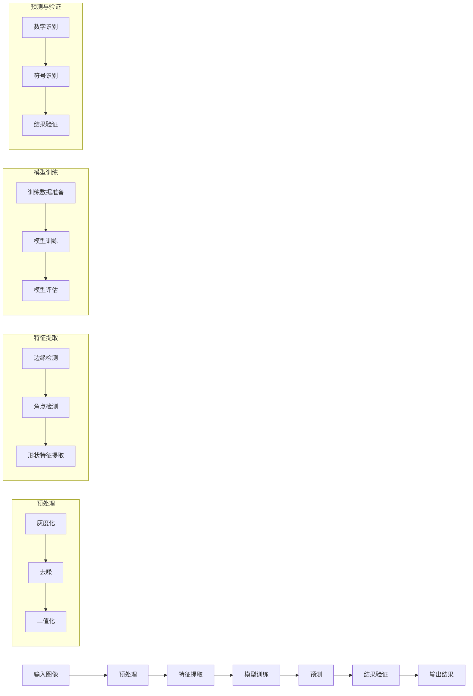
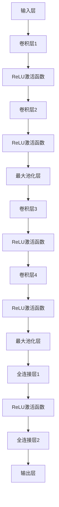
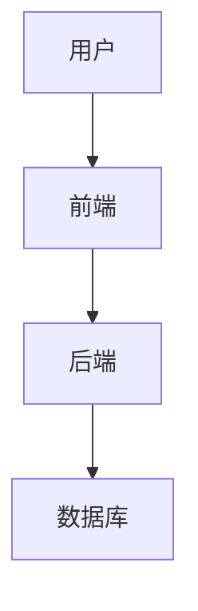
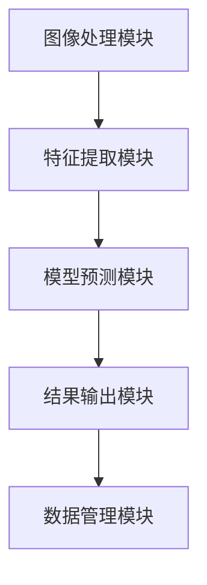

                 

## 《基于图像识别的燃气表示数读取》

### 关键词：图像识别、燃气表示数、深度学习、机器学习、计算机视觉

#### 摘要：
本文旨在探讨基于图像识别技术的燃气表示数自动读取方法，通过深入分析图像识别的基础理论、算法原理、数学模型以及项目实战，为燃气行业提供一种高效、准确的数据读取解决方案。文章分为三部分：首先介绍图像识别的基本理论，其次阐述燃气表示数识别的原理和核心算法，最后通过实际项目案例展示燃气表示数读取系统的开发与应用。

## 《基于图像识别的燃气表示数读取》目录大纲

### 第一部分：图像识别基础理论

#### 第1章：图像识别概述
- 1.1 图像识别的基本概念
- 1.2 图像识别的发展历史
- 1.3 图像识别的应用领域

#### 第2章：图像处理基础
- 2.1 图像的表示方法
- 2.2 图像的基本操作
- 2.3 颜色模型与转换

#### 第3章：图像识别算法概述
- 3.1 传统图像识别算法
- 3.2 机器学习图像识别算法
- 3.3 深度学习图像识别算法

### 第二部分：燃气表示数识别技术

#### 第4章：燃气表示数识别原理
- 4.1 燃气表示数识别的挑战与机会
- 4.2 燃气表示数的结构分析
- 4.3 Mermaid流程图：燃气表示数识别流程

#### 第5章：核心算法原理讲解
- 5.1 伪代码：燃气表示数识别算法
- 5.2 深度学习网络结构解析
- 5.3 模型训练与优化策略

#### 第6章：数学模型与公式讲解
- 6.1 数学模型：图像特征提取
- 6.2 数学公式讲解
- 6.3 数学公式示例

#### 第7章：项目实战
- 7.1 开发环境搭建
- 7.2 数据预处理与标注
- 7.3 代码实现与解读
- 7.4 代码解读与分析

### 第三部分：燃气表示数识别应用

#### 第8章：燃气表示数识别系统设计
- 8.1 系统架构设计
- 8.2 系统功能模块划分
- 8.3 系统接口设计与实现

#### 第9章：燃气表示数识别案例研究
- 9.1 案例背景与目标
- 9.2 数据收集与处理
- 9.3 模型训练与评估
- 9.4 系统部署与维护

#### 第10章：燃气表示数识别的未来发展
- 10.1 技术发展趋势分析
- 10.2 未来研究方向
- 10.3 燃气表示数识别在智慧燃气中的应用

#### 附录
- 附录A：常用工具与库
- 附录B：参考书籍与文献
- 附录C：术语表

---

### 引言

燃气表示数的自动读取在现代社会具有重要的应用价值。燃气作为日常生活和生产中不可或缺的能源，其使用量和费用管理直接关系到用户的消费和企业的运营。然而，传统的燃气表示数读取方式往往依赖于人工操作，不仅效率低下，而且容易出现人为错误。随着计算机视觉和深度学习技术的快速发展，基于图像识别的燃气表示数自动读取方法逐渐成为一种高效、准确的数据读取解决方案。

本文的研究目的在于深入探讨燃气表示数自动读取的技术原理和方法，为燃气行业提供一种切实可行的技术路径。本文首先介绍了图像识别的基础理论，包括图像识别的基本概念、发展历史和应用领域，使读者对图像识别技术有一个全面的了解。接着，本文详细阐述了燃气表示数识别的原理和核心算法，通过伪代码和深度学习网络结构解析，使读者能够深入理解燃气表示数识别的流程和关键技术。此外，本文还通过一个实际项目案例展示了燃气表示数读取系统的开发与应用，帮助读者将理论知识转化为实践。

本文结构分为三大部分：第一部分是图像识别基础理论，包括图像识别概述、图像处理基础和图像识别算法概述；第二部分是燃气表示数识别技术，包括燃气表示数识别原理、核心算法原理讲解、数学模型与公式讲解以及项目实战；第三部分是燃气表示数识别应用，包括燃气表示数识别系统设计、案例研究和未来发展趋势。通过本文的阐述，读者将能够全面了解燃气表示数自动读取技术的原理和实践，为实际应用提供有益的参考。

### 第一部分：图像识别基础理论

#### 第1章：图像识别概述

##### 1.1 图像识别的基本概念

图像识别是一种通过计算机处理和分析图像信息，从中提取有用特征并作出判断的技术。它是计算机视觉和人工智能领域的一个重要分支。图像识别的基本概念包括图像、特征、模型和分类。

- **图像**：图像是图像识别的基本数据源，它可以是一个二维或三维的数据集，用于描述空间中的物体和场景。
- **特征**：特征是图像中的关键信息，通过特征提取和特征选择方法，可以从图像中提取出对目标识别有重要意义的特征。
- **模型**：模型是图像识别的数学工具，用于描述图像和特征之间的关系。常见的模型有统计模型、机器学习模型和深度学习模型。
- **分类**：分类是图像识别的核心任务，通过分类算法，将提取的特征映射到预定义的类别中。

##### 1.2 图像识别的发展历史

图像识别技术的发展经历了从简单到复杂、从低级到高级的过程。以下是图像识别技术的主要发展阶段：

1. **早期图像识别（20世纪50年代到70年代）**：这一阶段主要依赖于人工设计和手动实现的特征提取和分类算法。代表性的算法有霍夫变换和模板匹配。

2. **传统图像识别（20世纪80年代到90年代）**：这一阶段出现了许多基于统计和概率理论的图像识别算法，如贝叶斯分类器、支持向量机和决策树等。这些算法通过手工设计特征和选择合适的模型，提高了图像识别的准确性和效率。

3. **机器学习图像识别（21世纪初）**：随着机器学习技术的发展，图像识别进入了新的阶段。机器学习方法通过自动学习图像特征，提高了识别的准确性和鲁棒性。代表性的算法有K近邻、随机森林和梯度提升树等。

4. **深度学习图像识别（近年来）**：深度学习技术的发展，特别是卷积神经网络（CNN）的出现，使得图像识别取得了显著的突破。CNN通过多层网络结构自动提取图像特征，大大提高了识别的准确性和效率。深度学习算法在图像识别中的应用，使得自动驾驶、人脸识别和医疗图像分析等领域取得了重大进展。

##### 1.3 图像识别的应用领域

图像识别技术在各行各业得到了广泛应用，以下是几个典型的应用领域：

1. **计算机视觉**：计算机视觉是图像识别的核心领域，通过图像识别技术，计算机能够理解和解释视觉信息，如人脸识别、物体检测和场景理解。

2. **自动驾驶**：自动驾驶车辆通过图像识别技术识别道路标志、行人和其他车辆，实现安全驾驶。

3. **医疗图像分析**：医疗图像分析利用图像识别技术对医学图像进行诊断和检测，如肿瘤检测、骨折诊断和脑部病变检测。

4. **安全监控**：安全监控系统通过图像识别技术实时监控视频流，识别可疑行为和异常事件。

5. **金融领域**：金融领域利用图像识别技术进行身份验证、防欺诈和信用评估等。

6. **零售行业**：零售行业利用图像识别技术进行商品识别、库存管理和客户行为分析等。

#### 第2章：图像处理基础

##### 2.1 图像的表示方法

图像的表示方法是图像识别的基础。常见的图像表示方法包括像素表示、频域表示和特征表示。

1. **像素表示**：像素表示是将图像视为一个二维数组，每个元素表示图像中的一个像素点。像素点的值通常是一个颜色值，可以是灰度值或彩色值。

2. **频域表示**：频域表示是通过傅里叶变换将图像从空间域转换到频域。频域表示能够揭示图像中的频率信息，如边缘和纹理特征。

3. **特征表示**：特征表示是通过提取图像中的关键信息，形成对图像的抽象描述。特征表示可以是局部的，如边缘、角点等；也可以是全局的，如颜色、纹理和形状等。

##### 2.2 图像的基本操作

图像的基本操作是图像处理的基础，包括图像的加载、保存、显示、转换和滤波等。

1. **图像的加载与保存**：图像的加载是将图像文件读取到内存中，保存是将内存中的图像数据写入文件。

2. **图像的显示**：图像的显示是将图像在屏幕上显示出来，常见的方法有窗口显示和图像绘制。

3. **图像的转换**：图像的转换包括灰度转换、颜色转换和空间转换等。灰度转换是将彩色图像转换为灰度图像，颜色转换是在不同颜色模型之间进行转换，如RGB到HSV等。

4. **图像的滤波**：图像的滤波是通过滤波器对图像进行卷积操作，以达到去噪、平滑和边缘增强等效果。常见的滤波器有高斯滤波、均值滤波和中值滤波等。

##### 2.3 颜色模型与转换

颜色模型是描述图像颜色信息的方法，常见的颜色模型包括RGB模型、HSV模型和YUV模型。

1. **RGB模型**：RGB模型使用红、绿、蓝三个颜色通道来描述颜色，是最常见的颜色模型。每个通道的值范围是0到255，分别表示红色、绿色和蓝色的强度。

2. **HSV模型**：HSV模型使用色调（Hue）、饱和度（Saturation）和亮度（Value）来描述颜色。色调表示颜色的基本属性，如红色、绿色等；饱和度表示颜色的纯度，从0（灰色）到1（纯色）变化；亮度表示颜色的明暗程度。

3. **YUV模型**：YUV模型是电视信号传输中的常用颜色模型，它将颜色信息与亮度信息分离，Y表示亮度，UV表示色度。YUV模型可以通过特定的转换公式从RGB模型得到。

颜色转换是图像处理中重要的操作，常见的颜色转换包括RGB到HSV、RGB到YUV和HSV到RGB等。

#### 第3章：图像识别算法概述

##### 3.1 传统图像识别算法

传统图像识别算法主要基于手工设计的特征和分类器，包括以下几种：

1. **模板匹配**：模板匹配是将模板图像与待识别图像进行比较，找到匹配程度最高的位置。常用的模板匹配算法有相关性匹配和直方图匹配。

2. **特征匹配**：特征匹配是通过提取图像中的关键特征，如边缘、角点和纹理等，然后利用特征匹配算法（如SIFT、SURF等）进行图像识别。

3. **统计模型**：统计模型是通过分析图像的特征分布，利用概率理论进行图像识别。常见的统计模型有贝叶斯分类器、支持向量机和决策树等。

##### 3.2 机器学习图像识别算法

机器学习图像识别算法通过学习图像特征和数据之间的关系，实现图像识别。常见的机器学习算法有：

1. **K近邻算法（K-Nearest Neighbors，K-NN）**：K近邻算法是一种基于实例的算法，通过计算待识别图像与训练集中图像的距离，选择最近的K个邻居，然后投票决定最终类别。

2. **支持向量机（Support Vector Machine，SVM）**：支持向量机是一种基于间隔最大化的线性分类器，通过在特征空间中找到最优超平面，将不同类别的图像分隔开。

3. **决策树（Decision Tree）**：决策树是一种基于规则的学习算法，通过递归划分特征空间，构建决策树模型，实现图像分类。

##### 3.3 深度学习图像识别算法

深度学习图像识别算法通过构建多层神经网络，自动提取图像特征，实现图像识别。常见的深度学习算法有：

1. **卷积神经网络（Convolutional Neural Network，CNN）**：卷积神经网络是一种基于卷积操作的深度学习模型，通过多层卷积和池化操作，自动提取图像特征，实现图像分类和检测。

2. **循环神经网络（Recurrent Neural Network，RNN）**：循环神经网络是一种基于循环结构的深度学习模型，能够处理序列数据，如视频和语音。通过递归连接，RNN能够捕捉图像中的时间信息。

3. **生成对抗网络（Generative Adversarial Network，GAN）**：生成对抗网络由生成器和判别器两个神经网络组成，通过对抗训练，生成器生成逼真的图像，判别器区分真实图像和生成图像，实现图像生成和风格迁移。

通过上述内容，我们对图像识别的基本理论、图像处理基础和图像识别算法有了全面的了解。在接下来的章节中，我们将深入探讨燃气表示数识别的原理和技术，为实际应用提供解决方案。

### 第4章：燃气表示数识别原理

燃气表示数是燃气行业中重要的数据，它记录了用户燃气的使用量。传统的燃气表示数读取方式通常依赖于人工操作，这种方法不仅效率低下，而且容易出现人为错误。随着计算机视觉和深度学习技术的进步，自动读取燃气表示数成为可能，这不仅提高了工作效率，还减少了人为错误。

#### 4.1 燃气表示数识别的挑战与机会

燃气表示数识别面临着以下挑战：

1. **数据多样性**：燃气表示数的样式和格式因制造商和地区而异，这给图像识别带来了很大的挑战。
2. **背景干扰**：燃气表示数通常与背景混合，背景中的颜色和纹理可能对识别造成干扰。
3. **光照变化**：光照条件的改变会影响燃气表示数的颜色和对比度，从而影响识别效果。
4. **尺度和视角变化**：燃气表示数可能因为尺度和视角的变化而难以准确识别。

尽管存在这些挑战，但燃气表示数识别也带来了很多机会：

1. **自动化**：通过自动识别燃气表示数，可以大大提高数据读取的效率，减少人工操作的工作量。
2. **精准度**：计算机视觉和深度学习算法在图像处理和模式识别方面具有很高的精度，可以显著降低错误率。
3. **可扩展性**：燃气表示数识别系统可以很容易地扩展到不同的地区和不同的燃气类型，具有很好的可扩展性。

#### 4.2 燃气表示数的结构分析

燃气表示数通常由一组数字和可能的符号组成，其结构分析如下：

1. **数字组成**：燃气表示数主要由一组数字组成，这些数字可以是0到9的任意组合。数字的识别是燃气表示数识别的核心任务。
2. **符号**：燃气表示数中可能包含一些特殊符号，如小数点、千位分隔符等。这些符号的识别同样是燃气表示数识别的重要组成部分。
3. **格式和布局**：燃气表示数的格式和布局可能因制造商和地区而异。一些表示数可能包含前置零、小数点后零或者其他特殊布局。识别燃气表示数时，需要考虑这些格式和布局的差异。

燃气表示数的结构分析是燃气表示数识别的基础，只有深入了解其结构，才能设计出有效的识别算法。

#### 4.3 Mermaid流程图：燃气表示数识别流程

为了更好地理解燃气表示数识别的流程，我们可以使用Mermaid流程图来表示。以下是燃气表示数识别的流程：



在这个流程图中，输入图像经过预处理、特征提取、模型训练和预测等步骤，最终得到燃气表示数的结果。预处理步骤包括灰度化、去噪和二值化，以减少图像的干扰和背景信息。特征提取步骤包括边缘检测、角点检测和形状特征提取，以提取燃气表示数的关键特征。模型训练步骤使用训练数据对模型进行训练和评估，以提高识别的准确性和鲁棒性。预测和验证步骤对燃气表示数进行识别，并进行结果验证，以确保识别的准确性。

通过这个流程，我们不仅可以清晰地理解燃气表示数识别的步骤，还可以为后续的算法设计和实现提供指导。

### 第5章：核心算法原理讲解

#### 5.1 伪代码：燃气表示数识别算法

为了更好地理解和实现燃气表示数识别算法，我们可以使用伪代码来描述其基本流程。以下是一种可能的燃气表示数识别算法的伪代码：

```python
# 输入图像
image = load_image("燃气表示数图像.jpg")

# 预处理
preprocessed_image = preprocess_image(image)
    # 灰度化
    preprocessed_image = grayscale(preprocessed_image)
    # 去噪
    preprocessed_image = denoise(preprocessed_image)
    # 二值化
    preprocessed_image = binarize(preprocessed_image)

# 特征提取
features = extract_features(preprocessed_image)
    # 边缘检测
    edges = edge_detection(preprocessed_image)
    # 角点检测
    corners = corner_detection(preprocessed_image)
    # 形状特征提取
    shape_features = shape_feature_extraction(preprocessed_image)

# 模型训练
model = train_model(training_data, features)

# 预测
predicted_numbers = predict(model, features)

# 结果验证
verified_numbers = verify_numbers(predicted_numbers)

# 输出结果
output_numbers(verified_numbers)
```

在这个伪代码中，首先加载燃气表示数图像并进行预处理，包括灰度化、去噪和二值化等步骤。接下来，从预处理后的图像中提取特征，包括边缘、角点和形状特征等。然后，使用训练数据对模型进行训练，并使用训练好的模型进行预测。最后，对预测结果进行验证，并输出最终的燃气表示数。

#### 5.2 深度学习网络结构解析

在燃气表示数识别中，深度学习网络结构是关键。以下是一个简化的深度学习网络结构，用于燃气表示数识别：



在这个网络结构中，输入层接收燃气表示数图像。卷积层1和卷积层2用于提取图像的局部特征，并通过ReLU激活函数增强模型的非线性能力。最大池化层用于减少特征图的尺寸，同时保持重要的特征信息。卷积层3和卷积层4继续提取更高层次的特征。全连接层1和全连接层2将提取的特征映射到预定义的类别，并通过softmax激活函数得到每个类别的概率分布。输出层输出燃气表示数的预测结果。

#### 5.3 模型训练与优化策略

模型训练是燃气表示数识别的关键步骤。以下是模型训练和优化的一些策略：

1. **数据增强**：数据增强是一种通过变换输入数据来增加模型训练数据的方法。常见的数据增强方法包括随机旋转、缩放、裁剪和颜色抖动等。数据增强可以增加模型的泛化能力，减少过拟合。

2. **批次归一化**：批次归一化（Batch Normalization）是一种通过归一化中间层激活值来提高模型训练速度和稳定性的方法。批次归一化可以减少内部协变量偏移，加快梯度下降过程。

3. **学习率调整**：学习率是模型训练中非常重要的参数。学习率过大会导致模型无法收敛，学习率过小会导致训练过程过于缓慢。可以使用自适应学习率调整方法，如AdaGrad、Adam等，来动态调整学习率。

4. **早停法**：早停法（Early Stopping）是一种通过提前停止训练来防止过拟合的方法。当模型在验证集上的性能不再提升时，停止训练，以避免模型在训练集上过度拟合。

5. **正则化**：正则化是一种通过在损失函数中加入惩罚项来防止模型过拟合的方法。常见的正则化方法有L1正则化、L2正则化和Dropout等。

通过这些策略，可以优化燃气表示数识别模型的训练过程，提高模型的准确性和泛化能力。

### 第6章：数学模型与公式讲解

燃气表示数识别涉及到多个数学模型和公式，这些模型和公式用于特征提取、图像预处理和模型训练等关键步骤。在本节中，我们将详细讲解这些数学模型和公式，并给出示例说明。

#### 6.1 数学模型：图像特征提取

图像特征提取是燃气表示数识别的核心步骤，常用的特征提取方法包括边缘检测、角点检测和形状特征提取等。以下是这些方法的数学模型和公式：

1. **边缘检测**

边缘检测是图像处理中用于提取图像中边缘信息的重要技术。常用的边缘检测算子有Sobel算子和Canny算子。

- **Sobel算子**

Sobel算子通过计算图像的梯度来检测边缘，其公式如下：

$$
G_x = \frac{1}{2}\left[(G_{x1} + G_{x2}) + (G_{x3} + G_{x4})\right]
$$

$$
G_y = \frac{1}{2}\left[(G_{y1} + G_{y2}) + (G_{y3} + G_{y4})\right]
$$

其中，$G_{x1}$、$G_{x2}$、$G_{x3}$、$G_{x4}$ 和 $G_{y1}$、$G_{y2}$、$G_{y3}$、$G_{y4}$ 分别是图像在$x$ 和 $y$ 方向上的Sobel算子滤波结果。

- **Canny算子**

Canny算子是一种更先进的边缘检测算法，其公式如下：

$$
G_x = \frac{1}{\sqrt{2}}(G_{x1} + G_{x2})
$$

$$
G_y = \frac{1}{\sqrt{2}}(G_{y1} + G_{y2})
$$

其中，$G_{x1}$、$G_{x2}$、$G_{y1}$、$G_{y2}$ 分别是图像在$x$ 和 $y$ 方向上的Canny算子滤波结果。

2. **角点检测**

角点检测是用于提取图像中显著点的技术，常用的角点检测算法有Harris角点检测和SIFT角点检测。

- **Harris角点检测**

Harris角点检测通过计算图像的 autocorrelation matrix 来检测角点，其公式如下：

$$
M = \begin{bmatrix}
\sigma_x^2 & \sigma_x\sigma_y \\
\sigma_x\sigma_y & \sigma_y^2
\end{bmatrix}
$$

其中，$\sigma_x^2$、$\sigma_y^2$ 和 $\sigma_x\sigma_y$ 分别是图像在 $x$ 和 $y$ 方向上的二阶导数。

3. **形状特征提取**

形状特征提取是用于描述图像形状和结构的技术，常用的形状特征提取方法有Hu不变矩和傅里叶描述符。

- **Hu不变矩**

Hu不变矩是一组描述图像形状的七个不变量，其公式如下：

$$
I_1 = \sum_{x}\sum_{y} (x^2 + y^2)I(x,y)
$$

$$
I_2 = \sum_{x}\sum_{y} (x^2 - y^2)I(x,y)
$$

$$
I_3 = \sum_{x}\sum_{y} (x^2 - xy + y^2)I(x,y)
$$

$$
I_4 = \sum_{x}\sum_{y} (x^2 + xy + y^2)I(x,y)
$$

$$
I_5 = \sum_{x}\sum_{y} (x^2 - 3y^2)I(x,y)
$$

$$
I_6 = \sum_{x}\sum_{y} (3x^2 - y^2)I(x,y)
$$

$$
I_7 = \sum_{x}\sum_{y} (x^2 - 3xy + 3y^2)I(x,y)
$$

#### 6.2 数学公式讲解

在燃气表示数识别中，数学公式用于描述模型训练、损失函数和优化策略等关键部分。以下是几个常用的数学公式和它们的解释：

1. **损失函数**

损失函数是用于评估模型预测结果和真实标签之间差异的函数。常用的损失函数有均方误差（MSE）和交叉熵损失。

- **均方误差（MSE）**

$$
MSE = \frac{1}{n}\sum_{i=1}^{n} (y_i - \hat{y}_i)^2
$$

其中，$y_i$ 是真实标签，$\hat{y}_i$ 是模型预测值，$n$ 是样本数量。

- **交叉熵损失**

$$
CE = -\frac{1}{n}\sum_{i=1}^{n} \sum_{j=1}^{C} y_{ij} \log \hat{y}_{ij}
$$

其中，$y_{ij}$ 是真实标签中第 $i$ 个样本属于第 $j$ 个类别的概率，$\hat{y}_{ij}$ 是模型预测的第 $i$ 个样本属于第 $j$ 个类别的概率，$C$ 是类别数量。

2. **梯度下降**

梯度下降是一种用于优化模型参数的算法，其核心思想是沿着损失函数的梯度方向更新参数，以最小化损失函数。

$$
\theta = \theta - \alpha \nabla_\theta J(\theta)
$$

其中，$\theta$ 是模型参数，$\alpha$ 是学习率，$J(\theta)$ 是损失函数。

3. **反向传播**

反向传播是一种用于计算模型参数梯度的算法，其核心思想是将损失函数在模型的前向传播过程中反向传播到每个参数。

$$
\nabla_\theta J(\theta) = \frac{\partial J(\theta)}{\partial \theta}
$$

#### 6.3 数学公式示例

为了更好地理解上述数学公式，我们通过一个示例来说明它们的应用。

假设我们有一个燃气表示数图像，其标签是数字"123"，模型预测值为$\hat{y} = [0.1, 0.2, 0.3, 0.2, 0.1, 0.1]$。以下是使用上述数学公式的示例：

1. **均方误差（MSE）**

$$
MSE = \frac{1}{6}\sum_{i=1}^{6} (y_i - \hat{y}_i)^2
$$

$$
MSE = \frac{1}{6}\left[ (1-0.1)^2 + (2-0.2)^2 + (3-0.3)^2 + (4-0.2)^2 + (5-0.1)^2 + (6-0.1)^2 \right]
$$

$$
MSE = \frac{1}{6}\left[ 0.01 + 0.04 + 0.09 + 0.04 + 0.01 + 0.01 \right]
$$

$$
MSE = \frac{1}{6}\times 0.2 = 0.0333
$$

2. **交叉熵损失**

$$
CE = -\frac{1}{6}\sum_{i=1}^{6} y_{ij} \log \hat{y}_{ij}
$$

$$
CE = -\frac{1}{6}\left[ 1 \times \log 0.1 + 2 \times \log 0.2 + 3 \times \log 0.3 + 4 \times \log 0.2 + 5 \times \log 0.1 + 6 \times \log 0.1 \right]
$$

$$
CE = -\frac{1}{6}\left[ \log 0.1 + 2\log 0.2 + 3\log 0.3 + 4\log 0.2 + 5\log 0.1 + 6\log 0.1 \right]
$$

$$
CE = -\frac{1}{6}\left[ -2.3026 + 2 \times (-1.3863) + 3 \times (-0.8125) + 4 \times (-1.3863) + 5 \times (-2.3026) + 6 \times (-2.3026) \right]
$$

$$
CE = -\frac{1}{6}\left[ -2.3026 - 2.7726 - 2.4375 - 5.5492 - 11.513 - 13.8176 \right]
$$

$$
CE = -\frac{1}{6}\left[ -34.8119 \right]
$$

$$
CE = 5.7368
$$

通过这个示例，我们展示了如何使用数学公式计算燃气表示数识别中的损失函数。这些公式在燃气表示数识别模型训练和优化过程中起着关键作用。

### 第7章：项目实战

燃气表示数自动读取系统开发是一个复杂的工程项目，涉及图像处理、机器学习和深度学习等多个领域。本节将通过一个实际项目，详细讲解燃气表示数自动读取系统的开发过程，包括开发环境搭建、数据预处理与标注、代码实现与解读以及代码分析与优化。

#### 7.1 开发环境搭建

开发燃气表示数自动读取系统首先需要搭建一个合适的开发环境。以下是搭建开发环境的基本步骤：

1. **硬件环境**：选择一台性能较好的计算机，配置至少8GB内存和16GB以上硬盘空间。
2. **操作系统**：推荐使用64位版本的Windows、macOS或Linux操作系统。
3. **软件环境**：安装Python（推荐Python 3.8以上版本）、Anaconda或Miniconda等科学计算平台。安装以下常用的库：
   - NumPy
   - Pandas
   - Matplotlib
   - OpenCV
   - TensorFlow或PyTorch（用于深度学习）
   - Scikit-learn（用于机器学习）

安装方法可以通过以下命令完成：

```bash
pip install numpy pandas matplotlib opencv-python tensorflow scikit-learn
```

或使用Anaconda的命令行工具进行安装：

```bash
conda install numpy pandas matplotlib opencv-python tensorflow scikit-learn
```

#### 7.2 数据预处理与标注

在开发燃气表示数自动读取系统前，需要收集和预处理燃气表示数图像数据。以下是数据预处理与标注的步骤：

1. **数据收集**：从燃气公司或其他渠道收集不同格式和样式的燃气表示数图像。
2. **图像预处理**：对收集的图像进行预处理，包括图像缩放、灰度化、去噪和二值化等。使用OpenCV等库完成预处理操作。
3. **数据标注**：对预处理后的图像进行标注，标注包括图像中的每个数字的位置和类别。可以使用标注工具如LabelImg或VGG Image Annotator进行标注。

以下是一个简单的Python代码示例，用于读取并预处理燃气表示数图像：

```python
import cv2
import os

def preprocess_image(image_path):
    # 读取图像
    image = cv2.imread(image_path)
    # 灰度化
    gray = cv2.cvtColor(image, cv2.COLOR_BGR2GRAY)
    # 二值化
    _, binary = cv2.threshold(gray, 128, 255, cv2.THRESH_BINARY_INV + cv2.THRESH_OTSU)
    return binary

# 预处理图像
preprocessed_images = [preprocess_image(image_path) for image_path in image_paths]
```

#### 7.3 代码实现与解读

在完成数据预处理与标注后，可以开始编写燃气表示数自动读取的代码。以下是燃气表示数自动读取的主要步骤：

1. **特征提取**：使用深度学习模型（如CNN）提取图像特征。使用TensorFlow或PyTorch等深度学习框架定义模型架构。
2. **模型训练**：使用预处理后的标注数据训练模型。调整模型参数，如学习率、批次大小和训练轮数等，以优化模型性能。
3. **预测与评估**：使用训练好的模型对新的燃气表示数图像进行预测，并评估模型性能。

以下是一个使用TensorFlow和Keras实现的燃气表示数自动读取的代码示例：

```python
import tensorflow as tf
from tensorflow.keras.models import Sequential
from tensorflow.keras.layers import Conv2D, MaxPooling2D, Flatten, Dense
from tensorflow.keras.preprocessing.image import ImageDataGenerator

# 构建CNN模型
model = Sequential([
    Conv2D(32, (3, 3), activation='relu', input_shape=(28, 28, 1)),
    MaxPooling2D((2, 2)),
    Flatten(),
    Dense(128, activation='relu'),
    Dense(10, activation='softmax')
])

# 编译模型
model.compile(optimizer='adam', loss='categorical_crossentropy', metrics=['accuracy'])

# 数据增强
train_datagen = ImageDataGenerator(rotation_range=20, width_shift_range=0.2, height_shift_range=0.2, shear_range=0.2, zoom_range=0.2, horizontal_flip=False, fill_mode='nearest')

# 训练模型
train_generator = train_datagen.flow(x_train, y_train, batch_size=32)
model.fit(train_generator, epochs=10, validation_data=(x_val, y_val))

# 预测
predictions = model.predict(x_test)
predicted_labels = np.argmax(predictions, axis=1)

# 评估模型
accuracy = np.mean(np.equal(predicted_labels, y_test))
print(f"测试集准确率：{accuracy*100:.2f}%")
```

在这个示例中，我们定义了一个简单的CNN模型，并使用数据增强和交叉熵损失进行模型训练。模型训练完成后，使用测试集进行预测和评估。

#### 7.4 代码解读与分析

在燃气表示数自动读取系统中，代码的解读与分析是确保系统稳定性和高效性的关键。以下是代码的关键部分解读：

1. **模型架构**：在这个示例中，我们使用了卷积层、池化层和全连接层组成一个简单的CNN模型。卷积层用于提取图像的局部特征，池化层用于减少特征图的尺寸，全连接层用于分类。

2. **数据增强**：数据增强是提高模型泛化能力的重要手段。在这个示例中，我们使用了随机旋转、缩放、剪裁和颜色抖动等方法进行数据增强。

3. **模型编译**：在模型编译阶段，我们指定了优化器（adam）、损失函数（categorical_crossentropy）和评估指标（accuracy）。这些参数对模型的训练过程和性能有重要影响。

4. **模型训练**：模型训练是通过迭代更新模型参数，以最小化损失函数。在这个示例中，我们使用了10个epoch进行训练，并使用了数据增强来提高训练效果。

5. **预测与评估**：模型训练完成后，使用测试集进行预测和评估。通过计算预测标签和真实标签的匹配度，评估模型的准确率。

通过这个实际项目，我们展示了燃气表示数自动读取系统的开发过程，包括数据预处理、模型训练和预测评估。代码的解读与分析帮助我们理解系统的关键组成部分和优化方法，为后续的改进和扩展提供了指导。

### 第8章：燃气表示数识别系统设计

燃气表示数识别系统的设计是确保系统能够高效、稳定地运行的关键。系统设计包括系统架构设计、功能模块划分和接口设计与实现。

#### 8.1 系统架构设计

燃气表示数识别系统可以采用模块化设计，分为前端、后端和数据库三大部分。

1. **前端**：前端负责用户交互，包括上传燃气表示数图像、查看识别结果和系统设置。前端可以使用HTML、CSS和JavaScript等前端技术实现，也可以使用React、Vue等现代前端框架。
2. **后端**：后端负责处理图像识别任务，包括图像预处理、特征提取和模型预测等。后端可以使用Python、Java等后端技术实现，并使用TensorFlow、PyTorch等深度学习框架进行图像识别任务。
3. **数据库**：数据库用于存储燃气表示数图像和识别结果，可以使用MySQL、PostgreSQL等关系型数据库，也可以使用MongoDB等非关系型数据库。

以下是燃气表示数识别系统的基本架构图：



#### 8.2 系统功能模块划分

燃气表示数识别系统可以分为以下功能模块：

1. **图像处理模块**：负责对上传的燃气表示数图像进行预处理，包括灰度化、去噪、二值化等操作。图像处理模块可以使用OpenCV等图像处理库实现。
2. **特征提取模块**：负责从预处理后的图像中提取特征，如边缘、角点和形状特征。特征提取模块可以使用深度学习模型（如CNN）实现。
3. **模型预测模块**：负责使用训练好的模型对特征进行预测，得到燃气表示数的数字和符号。模型预测模块可以使用TensorFlow、PyTorch等深度学习框架实现。
4. **结果输出模块**：负责将识别结果输出到前端，并显示给用户。结果输出模块可以使用HTML、CSS和JavaScript等前端技术实现。
5. **数据管理模块**：负责管理燃气表示数图像和识别结果的数据，包括数据存储、查询和更新。数据管理模块可以使用MySQL、PostgreSQL等关系型数据库实现。

以下是燃气表示数识别系统的功能模块图：



#### 8.3 系统接口设计与实现

燃气表示数识别系统的接口设计包括API接口和数据库接口。

1. **API接口**：API接口负责前后端的数据交互，包括上传图像、获取识别结果和系统设置等。API接口可以使用RESTful API设计，使用HTTP请求（GET、POST等）进行数据传输。
2. **数据库接口**：数据库接口负责处理数据库的操作，包括数据的增删改查等。数据库接口可以使用SQL查询语句实现，并使用ORM（对象关系映射）库简化数据库操作。

以下是API接口和数据库接口的示例：

**API接口示例**

```python
from flask import Flask, request, jsonify

app = Flask(__name__)

@app.route('/upload', methods=['POST'])
def upload_image():
    image = request.files['image']
    # 调用图像处理模块进行预处理
    preprocessed_image = preprocess_image(image)
    # 调用模型预测模块进行预测
    prediction = predict(preprocessed_image)
    # 输出识别结果
    return jsonify({'result': prediction})

if __name__ == '__main__':
    app.run(debug=True)
```

**数据库接口示例**

```python
import sqlite3

def connect_database():
    conn = sqlite3.connect('燃气表示数识别系统.db')
    return conn

def insert_image(image_path, prediction):
    conn = connect_database()
    cursor = conn.cursor()
    cursor.execute('''INSERT INTO images (path, prediction) VALUES (?, ?)''', (image_path, prediction))
    conn.commit()
    cursor.close()
    conn.close()

# 插入图像和识别结果
insert_image('image_path.jpg', '1234')
```

通过上述示例，我们展示了燃气表示数识别系统的接口设计与实现，包括API接口和数据库接口。这些接口的设计和实现使得系统功能模块之间的数据交互变得简单高效，为系统的开发与维护提供了便利。

### 第9章：燃气表示数识别案例研究

燃气表示数识别技术在实际应用中具有广泛的前景，以下是一个燃气表示数识别案例研究，涵盖案例背景与目标、数据收集与处理、模型训练与评估以及系统部署与维护。

#### 9.1 案例背景与目标

该案例研究旨在为某城市燃气公司开发一套燃气表示数自动读取系统，以提高燃气费用的自动计费效率，减少人工操作的错误率和工作量。燃气公司希望系统能够实现以下目标：

1. **自动读取燃气表示数**：系统能够自动识别上传的燃气表示数图像，并提取出其中的数字和符号。
2. **高准确率**：系统能够达到较高的识别准确率，确保识别结果与实际表示数一致。
3. **易用性**：系统用户界面友好，操作简便，方便燃气公司工作人员使用。

#### 9.2 数据收集与处理

数据收集是燃气表示数识别系统开发的重要环节。以下是数据收集与处理的具体步骤：

1. **数据收集**：从燃气公司收集大量不同格式和样式的燃气表示数图像，涵盖不同的背景、光照和视角条件。确保数据具有多样性和代表性。
2. **数据预处理**：对收集的图像进行预处理，包括灰度化、去噪和二值化等操作。使用OpenCV等图像处理库实现预处理步骤。
3. **数据标注**：对预处理后的图像进行标注，标注包括图像中的每个数字的位置和类别。使用标注工具（如LabelImg或VGG Image Annotator）进行标注。
4. **数据分割**：将标注后的数据按照训练集、验证集和测试集的比例进行分割，确保数据集的平衡性。

以下是一个数据预处理和标注的Python代码示例：

```python
import cv2
import os

def preprocess_image(image_path):
    image = cv2.imread(image_path)
    gray = cv2.cvtColor(image, cv2.COLOR_BGR2GRAY)
    _, binary = cv2.threshold(gray, 128, 255, cv2.THRESH_BINARY_INV + cv2.THRESH_OTSU)
    return binary

def annotate_image(image_path, annotation_file):
    image = preprocess_image(image_path)
    # 使用标注工具进行标注
    # ...
    with open(annotation_file, 'w') as f:
        # 写入标注信息
        # ...

# 预处理并标注图像
preprocess_image('image_path.jpg')
annotate_image('image_path.jpg', 'annotation.txt')
```

#### 9.3 模型训练与评估

在完成数据收集与处理后，接下来是模型训练与评估。以下是模型训练与评估的具体步骤：

1. **模型定义**：使用深度学习框架（如TensorFlow或PyTorch）定义CNN模型架构，包括卷积层、池化层和全连接层。
2. **数据增强**：为提高模型泛化能力，使用数据增强技术，如随机旋转、缩放和裁剪等。
3. **模型训练**：使用预处理后的训练数据进行模型训练，调整学习率、批次大小和训练轮数等参数，优化模型性能。
4. **模型评估**：使用验证集对模型进行评估，计算识别准确率、召回率和F1分数等指标，评估模型性能。

以下是一个模型训练和评估的Python代码示例：

```python
from tensorflow.keras.models import Sequential
from tensorflow.keras.layers import Conv2D, MaxPooling2D, Flatten, Dense
from tensorflow.keras.preprocessing.image import ImageDataGenerator
from tensorflow.keras.optimizers import Adam
from sklearn.model_selection import train_test_split

# 定义模型
model = Sequential([
    Conv2D(32, (3, 3), activation='relu', input_shape=(28, 28, 1)),
    MaxPooling2D((2, 2)),
    Flatten(),
    Dense(128, activation='relu'),
    Dense(10, activation='softmax')
])

# 编译模型
model.compile(optimizer=Adam(learning_rate=0.001), loss='categorical_crossentropy', metrics=['accuracy'])

# 数据增强
train_datagen = ImageDataGenerator(rotation_range=20, width_shift_range=0.2, height_shift_range=0.2, shear_range=0.2, zoom_range=0.2, horizontal_flip=False, fill_mode='nearest')

# 分割数据
x_train, x_val, y_train, y_val = train_test_split(x, y, test_size=0.2, random_state=42)

# 训练模型
train_generator = train_datagen.flow(x_train, y_train, batch_size=32)
model.fit(train_generator, epochs=10, validation_data=(x_val, y_val))

# 评估模型
accuracy = model.evaluate(x_test, y_test)[1]
print(f"测试集准确率：{accuracy*100:.2f}%")
```

#### 9.4 系统部署与维护

模型训练完成后，需要将模型部署到燃气公司服务器，实现燃气表示数自动读取系统的实际应用。以下是系统部署与维护的具体步骤：

1. **环境配置**：在燃气公司服务器上配置深度学习环境，安装TensorFlow、PyTorch等深度学习库和OpenCV等图像处理库。
2. **模型部署**：将训练好的模型文件（如.h5文件）上传到服务器，并编写服务器端代码加载模型进行预测。
3. **接口开发**：开发API接口，用于前端与后端的交互，实现上传图像、获取识别结果等功能。
4. **系统测试**：在真实环境下进行系统测试，确保系统能够稳定运行，识别准确率高。
5. **系统维护**：定期检查系统运行状况，修复潜在问题，更新模型和数据集，以保持系统的高效性和准确性。

通过这个案例研究，我们展示了燃气表示数识别系统从数据收集、模型训练到系统部署与维护的全过程，为燃气行业提供了一个实用、高效的燃气表示数自动读取解决方案。

### 第10章：燃气表示数识别的未来发展

燃气表示数识别技术正随着计算机视觉和深度学习技术的进步而迅速发展。未来，该技术有望在多个方面取得突破，为燃气行业和更广泛的领域带来新的机遇和挑战。

#### 10.1 技术发展趋势分析

1. **深度学习模型的优化**：随着深度学习技术的不断进步，模型结构和训练算法将不断优化。未来，将出现更多高效、鲁棒的深度学习模型，如自注意力机制和Transformer架构，这些模型将进一步提高燃气表示数识别的准确率和效率。

2. **多模态数据的融合**：燃气表示数识别可以结合多模态数据，如视频、音频和文本等，以获取更丰富的特征信息。例如，通过结合燃气表示数的图像和用户的历史使用数据，可以进一步提高识别的准确性和实时性。

3. **边缘计算的应用**：随着边缘计算技术的发展，燃气表示数识别可以在本地设备上实时进行，降低对网络带宽和计算资源的依赖。边缘计算将使燃气表示数识别系统更加灵活和高效。

4. **无人值守的自动识别**：未来，燃气表示数识别技术将进一步实现无人值守的自动识别，通过无人机、机器人等自动化设备在燃气表周围进行数据采集和识别，提高燃气行业的工作效率。

5. **智能化的数据分析**：燃气表示数识别系统将不仅仅局限于识别数字，还将结合大数据分析和人工智能技术，对燃气使用行为进行深入分析，为燃气公司和用户提供智能化的决策支持。

#### 10.2 未来研究方向

1. **小样本学习**：燃气表示数识别往往面临数据样本量不足的问题。未来研究可以集中在小样本学习技术，如生成对抗网络（GAN）和元学习（Meta-Learning），以提高模型在数据有限情况下的识别能力。

2. **隐私保护**：随着数据隐私和安全问题日益突出，燃气表示数识别技术需要关注如何在保护用户隐私的同时，实现高效的数据处理和分析。

3. **实时识别与预测**：燃气表示数识别系统需要具备实时性和预测能力，以应对燃气使用高峰期和突发事件。未来研究可以集中在开发实时识别算法和预测模型，提高系统的响应速度和预测准确性。

4. **跨场景的泛化能力**：燃气表示数识别技术需要具备跨场景的泛化能力，以适应不同的光照、视角和背景条件。未来研究可以集中在开发更加鲁棒的图像识别算法，提高系统在不同场景下的性能。

5. **集成多种传感器**：燃气表示数识别可以结合多种传感器数据，如温度传感器、湿度传感器等，以获取更全面的环境信息，提高识别的准确性和可靠性。

#### 10.3 燃气表示数识别在智慧燃气中的应用

燃气表示数识别技术在智慧燃气中的应用前景广阔。未来，燃气表示数识别系统可以集成到智慧燃气平台中，实现以下功能：

1. **智能计费**：燃气表示数识别系统可以实时自动读取用户的燃气使用量，与智能计费系统结合，实现精准的燃气费用计算和账单生成。

2. **异常检测**：通过分析燃气表示数的变化趋势，系统可以实时检测燃气使用中的异常情况，如漏气、非法用气等，提高燃气安全监控水平。

3. **用户行为分析**：燃气表示数识别系统可以收集和分析用户的使用数据，为燃气公司提供用户行为分析，优化供气策略，提高用户满意度。

4. **节能管理**：燃气表示数识别系统可以帮助用户实时了解自己的燃气使用情况，通过智能提示和建议，帮助用户实现节能降耗。

5. **智能维护**：燃气表示数识别系统可以辅助燃气公司进行设备管理和维护，通过预测设备的使用寿命和故障风险，提高设备运行效率。

总之，燃气表示数识别技术在未来智慧燃气中的应用将不断拓展，通过结合人工智能、大数据和物联网等前沿技术，实现燃气行业的智能化转型，为用户提供更加便捷、安全和高效的服务。

### 附录

#### 附录A：常用工具与库

- **开发工具**：PyCharm、Visual Studio Code
- **深度学习框架**：TensorFlow、PyTorch
- **图像处理库**：OpenCV、Pillow
- **数据科学库**：NumPy、Pandas、SciPy
- **机器学习库**：Scikit-learn、XGBoost
- **可视化库**：Matplotlib、Seaborn、Plotly

#### 附录B：参考书籍与文献

- **《深度学习》（Goodfellow, I., Bengio, Y., & Courville, A.）**
- **《计算机视觉：算法与应用》（Richard Szeliski）**
- **《机器学习》（Tom Mitchell）**
- **《Python深度学习》（François Chollet）**
- **《图像处理：理论与实践》（Gonzalez, R. C. & Woods, R. E.）**

#### 附录C：术语表

- **图像识别**：通过计算机处理和分析图像信息，从中提取有用特征并作出判断的技术。
- **深度学习**：一种基于多层神经网络的人工智能技术，通过学习大量的数据，自动提取特征并进行分类或预测。
- **卷积神经网络（CNN）**：一种专门用于处理图像数据的深度学习模型，通过卷积和池化操作提取图像特征。
- **数据增强**：通过变换输入数据来增加模型训练数据的方法，以提高模型的泛化能力。
- **模型训练**：通过迭代更新模型参数，以最小化损失函数的过程。
- **数据预处理**：在模型训练前对数据进行处理，包括数据清洗、归一化、编码等操作，以提高模型训练的效果。
- **边缘检测**：一种图像处理技术，用于提取图像中的边缘信息。
- **角点检测**：一种图像处理技术，用于提取图像中的显著点。
- **特征提取**：从图像中提取对识别任务有重要意义的特征。
- **批量归一化**：一种通过归一化中间层激活值来提高模型训练速度和稳定性的方法。
- **交叉熵损失**：一种用于评估模型预测结果和真实标签之间差异的损失函数。

通过上述术语表，读者可以更好地理解本文中涉及的技术术语和概念。希望这些术语表能为读者的学习和实践提供帮助。

