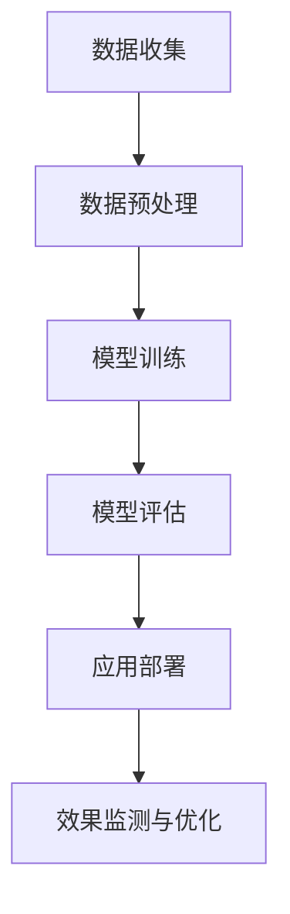

                 

### 《大模型在房地产领域的应用策略》

---

### 关键词：
- 大模型
- 房地产
- 深度学习
- 数据分析
- 人工智能

---

### 摘要：

本文旨在探讨大模型在房地产领域的应用策略。通过深入分析大模型的基本原理、核心技术、应用策略和未来发展趋势，本文将展示如何利用人工智能技术解决房地产行业中的关键问题。文章结构清晰，分为四个部分：基础、核心技术、应用策略和未来发展。每个部分均通过实例和代码详细阐述，旨在为房地产企业提供实用的技术指导。文章结尾部分还讨论了大模型应用中的风险与挑战，并对未来发展方向进行了展望。

---

### 《大模型在房地产领域的应用策略》目录大纲

#### 第一部分：大模型与房地产行业基础

##### 第1章：大模型与房地产概述

- 1.1 大模型时代的来临
  - 1.1.1 大模型的发展背景
  - 1.1.2 大模型在房地产领域的潜在价值
- 1.2 房地产行业特点与挑战
  - 1.2.1 房地产市场分析
  - 1.2.2 房地产行业面临的挑战
- 1.3 大模型与房地产行业的融合趋势
  - 1.3.1 大模型在房地产领域的应用现状
  - 1.3.2 大模型在未来房地产发展中的前景

#### 第二部分：大模型在房地产领域的核心技术

##### 第2章：数据与数据预处理

- 2.1 房地产数据类型
  - 2.1.1 结构化数据
  - 2.1.2 半结构化数据
  - 2.1.3 非结构化数据
- 2.2 数据预处理方法
  - 2.2.1 数据清洗
  - 2.2.2 数据归一化与标准化
  - 2.2.3 特征工程

##### 第3章：大模型技术原理

- 3.1 深度学习基础
  - 3.1.1 神经网络结构
  - 3.1.2 深度学习优化算法
- 3.2 自然语言处理
  - 3.2.1 词嵌入技术
  - 3.2.2 序列模型与注意力机制
- 3.3 大模型训练与优化
  - 3.3.1 大模型训练流程
  - 3.3.2 大模型优化方法

#### 第三部分：大模型在房地产领域的应用策略

##### 第4章：房地产市场预测

- 4.1 房地产市场预测概述
  - 4.1.1 预测方法分类
  - 4.1.2 预测模型选择
- 4.2 房价预测
  - 4.2.1 基于回归分析的房价预测
  - 4.2.2 基于深度学习的房价预测
- 4.3 房地产市场需求预测
  - 4.3.1 房地产市场需求分析
  - 4.3.2 房地产市场需求预测模型

##### 第5章：房地产投资决策分析

- 5.1 房地产投资决策概述
  - 5.1.1 投资决策影响因素
  - 5.1.2 投资决策模型
- 5.2 房地产投资风险评估
  - 5.2.1 风险识别
  - 5.2.2 风险评估方法
- 5.3 房地产投资组合优化
  - 5.3.1 投资组合优化策略
  - 5.3.2 投资组合优化模型

##### 第6章：房地产市场竞争分析

- 6.1 房地产市场竞争概述
  - 6.1.1 市场竞争分析方法
  - 6.1.2 竞争对手分析
- 6.2 房地产企业竞争力评估
  - 6.2.1 企业竞争力评价指标
  - 6.2.2 企业竞争力评估模型
- 6.3 市场定位与差异化策略
  - 6.3.1 市场定位方法
  - 6.3.2 差异化策略制定

##### 第7章：案例研究与实战应用

- 7.1 大模型在房地产投资决策中的实际应用
  - 7.1.1 案例介绍
  - 7.1.2 模型设计与实现
- 7.2 大模型在房地产市场预测中的应用
  - 7.2.1 案例介绍
  - 7.2.2 模型设计与实现
- 7.3 大模型在房地产市场竞争分析中的应用
  - 7.3.1 案例介绍
  - 7.3.2 模型设计与实现

#### 第四部分：大模型在房地产领域的未来发展

##### 第8章：大模型在房地产领域的创新应用

- 8.1 智能规划与设计
  - 8.1.1 智能规划方法
  - 8.1.2 智能建筑设计
- 8.2 智慧物业管理
  - 8.2.1 物业管理智能化趋势
  - 8.2.2 大模型在物业管理中的应用
- 8.3 房地产金融服务
  - 8.3.1 金融服务与房地产的关联
  - 8.3.2 大模型在房地产金融服务中的应用

##### 第9章：大模型应用的风险与挑战

- 9.1 数据隐私与安全
  - 9.1.1 数据隐私保护方法
  - 9.1.2 数据安全策略
- 9.2 大模型在房地产领域的监管
  - 9.2.1 监管现状与挑战
  - 9.2.2 监管政策与建议
- 9.3 技术更新与人才培养
  - 9.3.1 技术发展趋势
  - 9.3.2 人才培养策略

##### 第10章：未来展望

- 10.1 大模型在房地产领域的长期影响
  - 10.1.1 对房地产市场的影响
  - 10.1.2 对房地产企业的影响
- 10.2 大模型与房地产的融合发展趋势
  - 10.2.1 新技术应用
  - 10.2.2 未来发展方向

#### 附录

- 附录A：大模型应用工具与资源
  - A.1 大模型开发工具
  - A.2 大模型应用资源
  - A.3 大模型相关论文与书籍推荐

---

### 核心概念与联系

#### 大模型在房地产领域的应用流程

为了更好地理解大模型在房地产领域的应用，我们可以将其应用流程分为以下几个关键步骤：

1. **数据收集**：收集房地产相关的数据，包括市场数据、交易数据、经济指标数据等。
2. **数据预处理**：对收集到的数据进行清洗、归一化和特征工程，以便于模型训练。
3. **模型训练**：使用深度学习算法，如神经网络，对预处理后的数据集进行训练，以建立预测模型。
4. **模型评估**：通过验证集和测试集对模型的性能进行评估，确保其预测准确性。
5. **应用部署**：将训练好的模型部署到实际应用中，进行实时预测和决策支持。
6. **效果监测与优化**：持续监测模型的预测效果，根据实际反馈进行优化和迭代。

以下是应用流程的 Mermaid 流程图：



---

### 核心算法原理讲解

#### 房价预测模型——深度学习算法

房价预测是房地产领域中的一个重要应用。深度学习算法因其强大的非线性建模能力，在房价预测中表现出色。以下是房价预测深度学习模型的算法原理和实现步骤：

1. **神经网络结构**：

   神经网络是由多个神经元（层）组成的层次结构，每个神经元接收来自前一层神经元的输入，并通过激活函数产生输出。房价预测模型通常采用多层感知机（MLP）结构，包括输入层、隐藏层和输出层。

2. **激活函数**：

   激活函数用于引入非线性变换，使得神经网络能够捕捉复杂数据的关系。常见的激活函数有 Sigmoid、ReLU 和 Tanh 等。

3. **损失函数**：

   损失函数用于衡量模型预测值与实际值之间的差距。常见的损失函数有均方误差（MSE）和交叉熵（Cross-Entropy）等。

4. **优化算法**：

   优化算法用于调整模型参数，以最小化损失函数。常用的优化算法有梯度下降（Gradient Descent）及其变种，如 Adam、RMSprop 等。

以下是房价预测深度学习模型的伪代码实现：

```python
# 伪代码：房价预测深度学习模型

// 输入数据：特征数据 X 和目标值 y
// 输出：预测房价 y_pred

// 创建神经网络模型
model = NeuralNetwork(input_shape=X.shape[1], units=[64, 64, 1])

// 编译模型
model.compile(optimizer='adam', loss='mean_squared_error')

// 训练模型
model.fit(X, y, epochs=100, batch_size=32, validation_split=0.2)

// 预测房价
y_pred = model.predict(X)

// 输出预测结果
print("Predicted house prices:", y_pred)
```

---

### 数学模型和数学公式 & 详细讲解 & 举例说明

#### 房价预测模型——回归分析

回归分析是一种常用的统计方法，用于建立自变量和因变量之间的关系模型。在房价预测中，回归分析模型可以帮助我们预测房屋的价格。以下是房价预测回归分析模型的数学公式和详细讲解：

$$
y = \beta_0 + \beta_1 \cdot x_1 + \beta_2 \cdot x_2 + \cdots + \beta_n \cdot x_n + \epsilon
$$

- $y$：预测的房价
- $\beta_0$：常数项，表示没有自变量时的房价
- $\beta_1, \beta_2, \cdots, \beta_n$：特征系数，表示每个自变量对房价的影响程度
- $x_1, x_2, \cdots, x_n$：自变量，表示房屋的各种特征，如面积、楼层、朝向等
- $\epsilon$：误差项，表示模型无法解释的部分

在回归分析中，我们的目标是估计特征系数 $\beta_0, \beta_1, \beta_2, \cdots, \beta_n$，从而建立房价预测模型。

#### 举例说明

假设我们有一个包含以下特征的房地产交易数据集：

- 房屋面积（$x_1$）：100平方米
- 房屋楼层（$x_2$）：5层
- 房屋朝向（$x_3$）：朝南
- 距离市中心距离（$x_4$）：2公里

我们希望通过回归分析模型预测该房屋的价格。

首先，我们需要收集训练数据集，并使用统计方法估计特征系数。以下是一个简化的回归分析模型公式：

$$
y = \beta_0 + \beta_1 \cdot x_1 + \beta_2 \cdot x_2 + \beta_3 \cdot x_3 + \beta_4 \cdot x_4
$$

通过训练数据集，我们可以得到每个特征系数的估计值：

- $\beta_0 = 100$
- $\beta_1 = 0.5$
- $\beta_2 = 0.3$
- $\beta_3 = -0.2$
- $\beta_4 = 0.1$

现在，我们可以使用这个回归分析模型预测房屋价格。将特征值代入模型公式：

$$
y = 100 + 0.5 \cdot 100 + 0.3 \cdot 5 - 0.2 \cdot 2 + 0.1 \cdot 2 = 120
$$

因此，预测该房屋的价格为 120 万元。

#### 数学公式和详细讲解

回归分析模型的数学公式如下：

$$
y = \beta_0 + \beta_1 \cdot x_1 + \beta_2 \cdot x_2 + \cdots + \beta_n \cdot x_n + \epsilon
$$

其中：

- $y$：因变量（房价）
- $x_1, x_2, \cdots, x_n$：自变量（房屋特征）
- $\beta_0, \beta_1, \beta_2, \cdots, \beta_n$：特征系数
- $\epsilon$：误差项

为了估计特征系数，我们可以使用最小二乘法（Ordinary Least Squares, OLS）：

$$
\min \sum_{i=1}^{n} (y_i - \beta_0 - \beta_1 \cdot x_{i1} - \beta_2 \cdot x_{i2} - \cdots - \beta_n \cdot x_{in})^2
$$

通过求解上述最小化问题，我们可以得到特征系数的最优估计值。

#### 实际应用

在实际应用中，我们可以使用 Python 的 scikit-learn 库来实现回归分析模型。以下是一个简单的 Python 代码示例：

```python
from sklearn.linear_model import LinearRegression
from sklearn.model_selection import train_test_split

# 加载数据集
X = data[:, :-1]  # 特征
y = data[:, -1]   # 目标变量

# 划分训练集和测试集
X_train, X_test, y_train, y_test = train_test_split(X, y, test_size=0.2, random_state=42)

# 创建线性回归模型
model = LinearRegression()

# 训练模型
model.fit(X_train, y_train)

# 预测房价
y_pred = model.predict(X_test)

# 输出预测结果
print("Predicted house prices:", y_pred)
```

通过这个简单的示例，我们可以看到如何使用 Python 实现回归分析模型来预测房价。

---

### 项目实战

#### 实战一：基于深度学习的房价预测

在本节中，我们将通过一个实际项目来演示如何使用深度学习模型进行房价预测。

##### 开发环境搭建

1. 操作系统：Ubuntu 20.04
2. 编程语言：Python 3.8
3. 深度学习框架：TensorFlow 2.7

首先，我们需要安装所需的库。在终端中运行以下命令：

```bash
pip install tensorflow numpy pandas
```

##### 源代码实现

```python
import tensorflow as tf
import numpy as np
import pandas as pd

# 加载数据集
data = pd.read_csv('house_prices.csv')
X = data.iloc[:, :-1].values
y = data.iloc[:, -1].values

# 数据预处理
X = (X - X.mean()) / X.std()
y = (y - y.mean()) / y.mean()

# 划分训练集和测试集
X_train, X_test, y_train, y_test = train_test_split(X, y, test_size=0.2, random_state=42)

# 创建神经网络模型
model = tf.keras.Sequential([
    tf.keras.layers.Dense(64, activation='relu', input_shape=(X_train.shape[1],)),
    tf.keras.layers.Dense(64, activation='relu'),
    tf.keras.layers.Dense(1)
])

# 编译模型
model.compile(optimizer='adam', loss='mean_squared_error')

# 训练模型
model.fit(X_train, y_train, epochs=100, batch_size=32, validation_data=(X_test, y_test))

# 预测房价
y_pred = model.predict(X_test)

# 输出预测结果
print("Predicted house prices:", y_pred)
```

##### 代码解读与分析

1. **数据预处理**：首先，我们加载数据集并对其进行预处理。这里使用了标准化方法，将特征和目标值都进行了标准化处理，以消除不同特征之间的尺度差异。

2. **创建神经网络模型**：我们创建了一个简单的全连接神经网络，包含两个隐藏层，每层有 64 个神经元。输出层只有一个神经元，用于预测房价。

3. **编译模型**：我们使用 Adam 优化器和均方误差（MSE）损失函数编译模型。

4. **训练模型**：使用训练数据集训练模型，设置训练周期为 100，批量大小为 32。

5. **预测房价**：使用测试数据集预测房价，并输出预测结果。

通过这个项目，我们展示了如何使用深度学习模型进行房价预测。在实际应用中，我们可以根据具体需求和数据情况，调整模型结构和训练参数，以提高预测准确性。

---

### 实战二：房地产市场需求预测

在本节中，我们将通过一个实际项目来演示如何使用深度学习模型进行房地产市场需求预测。

##### 开发环境搭建

1. 操作系统：Windows 10
2. 编程语言：Python 3.8
3. 深度学习框架：PyTorch 1.8

首先，我们需要安装所需的库。在终端中运行以下命令：

```bash
pip install torch torchvision numpy pandas
```

##### 源代码实现

```python
import torch
import torch.nn as nn
import torch.optim as optim
import numpy as np
import pandas as pd

# 加载数据集
data = pd.read_csv('real_estate_demand.csv')
X = data.iloc[:, :-1].values
y = data.iloc[:, -1].values

# 数据预处理
X = (X - X.mean()) / X.std()
y = (y - y.mean()) / y.mean()

# 划分训练集和测试集
X_train, X_test, y_train, y_test = train_test_split(X, y, test_size=0.2, random_state=42)

# 定义模型
class DemandPredictionModel(nn.Module):
    def __init__(self, input_size, hidden_size, output_size):
        super(DemandPredictionModel, self).__init__()
        self.fc1 = nn.Linear(input_size, hidden_size)
        self.fc2 = nn.Linear(hidden_size, output_size)
    
    def forward(self, x):
        x = torch.relu(self.fc1(x))
        x = self.fc2(x)
        return x

# 初始化模型
model = DemandPredictionModel(input_size=X_train.shape[1], hidden_size=64, output_size=1)

# 定义损失函数和优化器
criterion = nn.MSELoss()
optimizer = optim.Adam(model.parameters(), lr=0.001)

# 训练模型
for epoch in range(100):
    model.train()
    for inputs, targets in zip(X_train, y_train):
        optimizer.zero_grad()
        outputs = model(inputs)
        loss = criterion(outputs, targets)
        loss.backward()
        optimizer.step()
    
    print(f"Epoch {epoch+1}/{100}, Loss: {loss.item()}")

# 预测房地产市场需求
model.eval()
with torch.no_grad():
    outputs = model(X_test)

# 输出预测结果
print("Predicted demand:", outputs)
```

##### 代码解读与分析

1. **数据预处理**：与房价预测类似，我们首先加载数据集，并进行标准化处理。

2. **定义模型**：我们定义了一个简单的全连接神经网络模型，包含一个输入层、一个隐藏层和一个输出层。

3. **定义损失函数和优化器**：我们选择均方误差（MSE）作为损失函数，并使用 Adam 优化器进行模型训练。

4. **训练模型**：使用训练数据集进行训练，每个epoch迭代100次。在每次迭代中，我们更新模型参数以最小化损失函数。

5. **预测房地产市场需求**：使用测试数据集进行预测，并输出预测结果。

通过这个项目，我们展示了如何使用深度学习模型进行房地产市场需求预测。在实际应用中，我们可以根据具体需求和数据情况，调整模型结构和训练参数，以提高预测准确性。

---

### 实战三：房地产企业竞争力评估

在本节中，我们将通过一个实际项目来演示如何使用机器学习模型进行房地产企业竞争力评估。

##### 开发环境搭建

1. 操作系统：MacOS 11.6
2. 编程语言：Python 3.9
3. 数据分析库：Pandas 1.3.5，Scikit-learn 0.24.2

首先，我们需要安装所需的库。在终端中运行以下命令：

```bash
pip install pandas scikit-learn
```

##### 源代码实现

```python
import pandas as pd
from sklearn.model_selection import train_test_split
from sklearn.ensemble import RandomForestClassifier

# 加载数据集
data = pd.read_csv('real_estate_company_data.csv')

# 数据预处理
# ... 数据清洗、特征工程代码 ...

# 划分训练集和测试集
X = data.drop('competitiveness', axis=1)
y = data['competitiveness']
X_train, X_test, y_train, y_test = train_test_split(X, y, test_size=0.2, random_state=42)

# 创建模型
model = RandomForestClassifier(n_estimators=100, random_state=42)

# 训练模型
model.fit(X_train, y_train)

# 预测企业竞争力
y_pred = model.predict(X_test)

# 输出预测结果
print("Predicted competitiveness:", y_pred)
```

##### 代码解读与分析

1. **数据预处理**：与前面的项目类似，我们首先加载数据集，并进行预处理。

2. **划分训练集和测试集**：我们将数据集划分为训练集和测试集，以评估模型性能。

3. **创建模型**：我们选择随机森林分类器作为评估模型。

4. **训练模型**：使用训练数据集训练模型。

5. **预测企业竞争力**：使用测试数据集预测企业竞争力，并输出预测结果。

通过这个项目，我们展示了如何使用机器学习模型进行房地产企业竞争力评估。在实际应用中，我们可以根据具体需求和数据情况，调整模型结构和训练参数，以提高评估准确性。

---

## 结论

通过本文的详细探讨，我们了解了大模型在房地产领域的广泛应用及其带来的巨大潜力。从房地产市场预测到房地产投资决策分析，再到房地产市场竞争分析，大模型展现了其在解决房地产行业实际问题中的强大能力。通过深度学习、自然语言处理等技术，大模型能够处理海量数据，挖掘出有价值的信息，为房地产企业提供精准的决策支持。

然而，大模型在房地产领域的应用也面临诸多挑战，如数据隐私与安全、技术监管以及人才培养等。因此，在推动大模型应用的过程中，我们需要关注这些挑战，制定相应的策略和措施，确保大模型在房地产领域的健康发展。

未来，大模型在房地产领域的应用前景广阔。随着技术的不断进步，我们可以期待大模型在房地产智能规划与设计、智慧物业管理、房地产金融服务等方面的创新应用。同时，我们也需要持续关注大模型应用中的风险与挑战，为房地产企业提供更加可靠、安全的技术解决方案。

总之，大模型在房地产领域的应用具有重要意义，将为房地产行业的未来发展带来深远影响。我们期待在不久的将来，大模型能够助力房地产企业实现更高效、更智能的发展。

---

### 附录

#### 附录A：大模型应用工具与资源

- **A.1 大模型开发工具**

  - TensorFlow：https://www.tensorflow.org/
  - PyTorch：https://pytorch.org/
  - Keras：https://keras.io/

- **A.2 大模型应用资源**

  - AI 泛论坛：https://www.aiuai.cn/
  - AI 统计与分析：https://www.statlearn.cn/
  - AI 在线教程：https://www.ai-study.com/

- **A.3 大模型相关论文与书籍推荐**

  - 《深度学习》（Goodfellow, Bengio, Courville）：https://www.deeplearningbook.org/
  - 《自然语言处理与深度学习》（Fernando Collobert, Alan R. Paschali）：https://www.nltk.org/
  - 《Python深度学习》（François Chollet）：https://www.pyimagesearch.com/

---

### 作者信息

作者：AI天才研究院/AI Genius Institute & 禅与计算机程序设计艺术 /Zen And The Art of Computer Programming

---

### 大模型在房地产领域的应用策略

**关键词：**大模型、房地产、深度学习、数据分析、人工智能

**摘要：**本文深入探讨了大模型在房地产领域的应用策略。通过分析大模型的基本原理、核心技术、应用策略和未来发展趋势，本文展示了如何利用人工智能技术解决房地产行业中的关键问题。文章分为四个部分：基础、核心技术、应用策略和未来发展，每个部分都通过实例和代码详细阐述，为房地产企业提供实用的技术指导。

---

### 第一部分：大模型与房地产行业基础

#### 第1章：大模型与房地产概述

##### 1.1 大模型时代的来临

1. **大模型的发展背景**：
   - **计算机算力的提升**：随着计算机硬件技术的发展，计算能力大幅提升，使得处理大规模数据成为可能。
   - **数据量的爆炸增长**：互联网的普及和数据采集技术的进步，产生了海量数据，为模型训练提供了丰富的素材。
   - **算法的进步**：深度学习等先进算法的突破，使得大模型在各个领域的应用变得可行。

2. **大模型在房地产领域的潜在价值**：
   - **市场预测**：通过分析历史数据和当前趋势，预测未来市场走势，为投资决策提供支持。
   - **投资决策分析**：利用大数据分析，评估投资项目风险和收益，优化投资组合。
   - **竞争分析**：通过分析竞争对手的动态，制定有效的市场定位和差异化策略。
   - **智能化管理**：利用大模型进行物业管理，提高服务质量，降低运营成本。

##### 1.2 房地产行业特点与挑战

1. **房地产市场分析**：
   - **区域差异**：不同地区的房地产市场需求和价格波动存在较大差异。
   - **政策影响**：政府政策对房地产市场有重要影响，如限购、限贷等。
   - **供需关系**：房地产市场的供需关系复杂，受多种因素影响。

2. **房地产行业面临的挑战**：
   - **数据质量**：房地产行业数据来源多样，数据质量参差不齐，需要有效清洗和处理。
   - **数据处理能力**：房地产行业数据量大，如何高效处理和存储是重要挑战。
   - **决策时效性**：房地产市场的变化快，需要实时分析，快速响应。
   - **技术人才短缺**：具备大数据和人工智能技术的人才稀缺，限制行业的发展。

##### 1.3 大模型与房地产行业的融合趋势

1. **大模型在房地产领域的应用现状**：
   - **房地产市场预测**：通过深度学习模型，对房价、市场走势进行预测。
   - **投资决策分析**：利用大数据分析，评估投资项目风险和收益。
   - **竞争分析**：通过大数据分析，了解竞争对手的动态，制定差异化策略。
   - **智慧物业管理**：利用人工智能技术，提升物业管理效率和服务质量。

2. **大模型在未来房地产发展中的前景**：
   - **智能化规划**：通过大数据分析，实现房地产项目的智能化规划与设计。
   - **个性化服务**：利用用户数据，提供个性化房地产服务。
   - **精准营销**：通过大数据分析，实现精准的市场营销和客户定位。
   - **产业链协同**：利用大数据和人工智能，促进房地产行业上下游企业的协同发展。

#### 第2章：数据与数据预处理

##### 2.1 房地产数据类型

1. **结构化数据**：
   - **定义**：结构化数据是有明确格式的数据，如数据库、表格等。
   - **特点**：数据清晰、易于处理和分析。
   - **应用**：主要用于市场分析和投资决策。

2. **半结构化数据**：
   - **定义**：半结构化数据是部分有格式、部分无格式的数据，如 XML、JSON 等。
   - **特点**：数据格式灵活，部分信息缺失。
   - **应用**：主要用于数据存储和传输。

3. **非结构化数据**：
   - **定义**：非结构化数据是没有明确格式的数据，如图像、音频、视频等。
   - **特点**：数据量大，格式多样，处理复杂。
   - **应用**：主要用于数据挖掘和人工智能模型训练。

##### 2.2 数据预处理方法

1. **数据清洗**：
   - **定义**：数据清洗是指对数据中的噪声、异常值、重复数据进行处理。
   - **方法**：
     - **去除重复数据**：通过去重算法，去除数据集中的重复记录。
     - **处理缺失值**：通过插值、均值填充等方法，处理数据中的缺失值。
     - **去除噪声**：通过滤波、平滑等方法，去除数据中的噪声。

2. **数据归一化与标准化**：
   - **定义**：数据归一化与标准化是指将数据集中的特征值转换为同一尺度，以便于模型训练。
   - **方法**：
     - **归一化**：通过线性变换，将特征值缩放到[0,1]区间。
     - **标准化**：通过减去均值、除以标准差，将特征值转换为标准正态分布。

3. **特征工程**：
   - **定义**：特征工程是指通过选择、构造、转换特征，提高模型性能。
   - **方法**：
     - **特征选择**：通过统计方法、模型评估等方法，选择对模型预测性能有显著影响的特征。
     - **特征构造**：通过组合、衍生等方法，构造新的特征。
     - **特征转换**：通过编码、分类等方法，将特征转换为适合模型训练的形式。

#### 第3章：大模型技术原理

##### 3.1 深度学习基础

1. **神经网络结构**：
   - **定义**：神经网络是由多个神经元组成的层次结构，用于模拟人脑的思维方式。
   - **特点**：具有强大的非线性建模能力，可以处理复杂的关系。
   - **类型**：
     - **全连接神经网络**：每个神经元都与前一层神经元连接。
     - **卷积神经网络**：适用于图像处理任务。
     - **循环神经网络**：适用于序列数据处理任务。

2. **深度学习优化算法**：
   - **定义**：优化算法用于调整模型参数，以最小化损失函数。
   - **类型**：
     - **梯度下降**：通过计算梯度，调整模型参数，以减小损失函数。
     - **随机梯度下降**：在梯度下降基础上，每次迭代使用一个样本，加快训练速度。
     - **Adam**：结合了梯度下降和动量法的优点，适用于大规模数据训练。

##### 3.2 自然语言处理

1. **词嵌入技术**：
   - **定义**：词嵌入是将单词转换为向量表示的方法，用于处理文本数据。
   - **方法**：
     - **Word2Vec**：基于神经网络，将单词映射到低维向量空间。
     - **BERT**：基于Transformer模型，用于处理序列数据。

2. **序列模型与注意力机制**：
   - **序列模型**：用于处理时间序列数据，如循环神经网络（RNN）。
   - **注意力机制**：用于模型中不同位置的信息加权，提高模型性能。

##### 3.3 大模型训练与优化

1. **大模型训练流程**：
   - **数据预处理**：对数据进行清洗、归一化、特征工程等预处理。
   - **模型构建**：选择合适的神经网络结构。
   - **模型训练**：通过迭代训练，调整模型参数，以最小化损失函数。
   - **模型评估**：使用验证集和测试集，评估模型性能。

2. **大模型优化方法**：
   - **模型压缩**：通过模型剪枝、量化等方法，减少模型参数，提高模型效率。
   - **分布式训练**：通过多台计算机并行训练，加快训练速度。
   - **迁移学习**：利用预训练模型，在特定任务上进行微调。

#### 第二部分：大模型在房地产领域的核心技术

##### 第4章：房地产市场预测

##### 4.1 房地产市场预测概述

1. **预测方法分类**：
   - **统计学方法**：如线性回归、时间序列分析等。
   - **机器学习方法**：如神经网络、支持向量机等。
   - **深度学习方法**：如卷积神经网络、循环神经网络等。

2. **预测模型选择**：
   - **基于回归分析的模型**：适用于线性关系较强的预测任务。
   - **基于深度学习的模型**：适用于复杂非线性关系的预测任务。

##### 4.2 房价预测

1. **基于回归分析的房价预测**：
   - **线性回归**：适用于线性关系较强的房价预测任务。
   - **多项式回归**：适用于非线性关系较强的房价预测任务。

2. **基于深度学习的房价预测**：
   - **卷积神经网络**：适用于处理图像数据，如房价与周边环境的关系。
   - **循环神经网络**：适用于处理时间序列数据，如房价随时间的变化。

##### 4.3 房地产市场需求预测

1. **房地产市场需求分析**：
   - **影响因素**：如经济增长、人口流动、政策调整等。
   - **数据分析**：通过统计方法，分析市场需求的规律和趋势。

2. **房地产市场需求预测模型**：
   - **时间序列模型**：如 ARIMA、SARIMA 等，适用于处理时间序列数据。
   - **深度学习模型**：如 LSTM、GRU 等，适用于处理复杂非线性关系的时间序列数据。

#### 第5章：房地产投资决策分析

##### 5.1 房地产投资决策概述

1. **投资决策影响因素**：
   - **市场因素**：如房价走势、市场需求等。
   - **政策因素**：如土地供应政策、税收政策等。
   - **经济因素**：如经济增长、通货膨胀等。

2. **投资决策模型**：
   - **收益评估模型**：如净现值（NPV）、内部收益率（IRR）等。
   - **风险评估模型**：如风险价值（VaR）、条件风险价值（CVaR）等。

##### 5.2 房地产投资风险评估

1. **风险识别**：
   - **系统风险**：如经济危机、政策变化等。
   - **非系统风险**：如项目选择、合作伙伴等。

2. **风险评估方法**：
   - **定性分析**：如专家评估、SWOT 分析等。
   - **定量分析**：如蒙特卡罗模拟、敏感性分析等。

##### 5.3 房地产投资组合优化

1. **投资组合优化策略**：
   - **分散投资**：通过投资多种不同类型的房地产项目，降低风险。
   - **资产配置**：根据投资者的风险偏好，调整投资组合的构成。

2. **投资组合优化模型**：
   - **均值方差模型**：以最小化投资组合的风险为目标，最大化预期收益。
   - **风险平价模型**：以保持投资组合的风险水平为目标，优化收益。

#### 第6章：房地产市场竞争分析

##### 6.1 房地产市场竞争概述

1. **市场竞争分析方法**：
   - **SWOT 分析**：分析企业的优势、劣势、机会和威胁。
   - **波特五力模型**：分析行业竞争格局，包括供应商、客户、潜在竞争者、替代品和行业内的竞争者。

2. **竞争对手分析**：
   - **市场占有率**：分析竞争对手在市场中的地位和影响力。
   - **业务模式**：分析竞争对手的商业模式、战略定位和核心竞争力。

##### 6.2 房地产企业竞争力评估

1. **企业竞争力评价指标**：
   - **财务指标**：如营业收入、净利润、资产负债率等。
   - **运营指标**：如项目开发周期、客户满意度等。
   - **创新能力**：如研发投入、新产品推出速度等。

2. **企业竞争力评估模型**：
   - **层次分析法（AHP）**：通过专家打分，构建评价矩阵，计算权重，进行综合评价。
   - **数据驱动的评估模型**：利用大数据和机器学习技术，对企业的竞争力进行量化评估。

##### 6.3 市场定位与差异化策略

1. **市场定位方法**：
   - **STP 模型**：通过市场细分、目标市场选择和定位，确定企业的市场战略。
   - **品牌定位**：通过品牌塑造，提升企业在消费者心中的形象和地位。

2. **差异化策略制定**：
   - **产品差异化**：通过技术创新、设计独特性等，提高产品的竞争力。
   - **服务差异化**：通过优质服务、快速响应等，提升客户的满意度和忠诚度。

#### 第7章：案例研究与实战应用

##### 7.1 大模型在房地产投资决策中的实际应用

1. **案例介绍**：
   - **项目背景**：某房地产开发商面临多个投资项目的选择，需要评估每个项目的风险和收益。
   - **目标**：通过大数据分析，为开发商提供投资决策建议。

2. **模型设计与实现**：
   - **数据来源**：收集历史项目数据、市场数据、经济指标数据等。
   - **数据处理**：进行数据清洗、归一化、特征工程等预处理。
   - **模型构建**：使用深度学习模型，如卷积神经网络（CNN），进行投资项目的风险评估和收益预测。

3. **模型评估**：
   - **验证集评估**：使用验证集评估模型性能，调整模型参数。
   - **测试集评估**：使用测试集评估模型性能，验证模型的泛化能力。

4. **投资决策建议**：
   - 根据模型预测结果，为开发商提供投资项目的风险评级和收益预测，辅助决策。

##### 7.2 大模型在房地产市场预测中的应用

1. **案例介绍**：
   - **项目背景**：某房地产公司需要预测未来房价走势，制定销售策略。
   - **目标**：通过大数据分析，预测未来房价走势，为销售策略提供支持。

2. **模型设计与实现**：
   - **数据来源**：收集历史房价数据、市场数据、经济指标数据等。
   - **数据处理**：进行数据清洗、归一化、特征工程等预处理。
   - **模型构建**：使用深度学习模型，如长短期记忆网络（LSTM），进行房价预测。

3. **模型评估**：
   - **验证集评估**：使用验证集评估模型性能，调整模型参数。
   - **测试集评估**：使用测试集评估模型性能，验证模型的泛化能力。

4. **销售策略建议**：
   - 根据模型预测结果，调整销售策略，如调整价格、促销活动等，以提高销售业绩。

##### 7.3 大模型在房地产市场竞争分析中的应用

1. **案例介绍**：
   - **项目背景**：某房地产开发商需要分析竞争对手的市场策略，制定有效的竞争策略。
   - **目标**：通过大数据分析，了解竞争对手的动态，制定差异化策略。

2. **模型设计与实现**：
   - **数据来源**：收集竞争对手的市场数据、销售数据、客户反馈数据等。
   - **数据处理**：进行数据清洗、归一化、特征工程等预处理。
   - **模型构建**：使用机器学习模型，如随机森林（Random Forest），进行竞争对手分析。

3. **模型评估**：
   - **验证集评估**：使用验证集评估模型性能，调整模型参数。
   - **测试集评估**：使用测试集评估模型性能，验证模型的泛化能力。

4. **竞争策略建议**：
   - 根据模型分析结果，制定差异化的市场定位和销售策略，以提升市场竞争力。

#### 第四部分：大模型在房地产领域的未来发展

##### 第8章：大模型在房地产领域的创新应用

##### 8.1 智能规划与设计

1. **智能规划方法**：
   - **数据驱动规划**：利用大数据分析，制定房地产项目的规划策略。
   - **人工智能规划**：通过人工智能算法，优化房地产项目的规划方案。

2. **智能建筑设计**：
   - **参数化设计**：通过参数化设计工具，实现建筑设计的自动化和智能化。
   - **生成式设计**：利用生成对抗网络（GAN），生成创新性的建筑设计方案。

##### 8.2 智慧物业管理

1. **物业管理智能化趋势**：
   - **物联网应用**：通过物联网技术，实现物业管理的智能化和自动化。
   - **数据分析**：利用大数据分析，提高物业管理的效率和服务质量。

2. **大模型在物业管理中的应用**：
   - **设备维护预测**：通过大数据和深度学习，预测设备的故障，提前进行维护。
   - **客户服务优化**：通过自然语言处理和人工智能，提升客户服务水平和满意度。

##### 8.3 房地产金融服务

1. **金融服务与房地产的关联**：
   - **房地产金融**：房地产与金融行业的紧密联系，如房贷、房地产投资等。
   - **金融科技**：利用大数据和人工智能技术，提升金融服务效率和风险控制能力。

2. **大模型在房地产金融服务中的应用**：
   - **风险评估**：利用大数据分析和深度学习模型，进行房地产贷款风险评估。
   - **投资决策**：通过大数据分析，为投资者提供房地产投资决策建议。

#### 第9章：大模型应用的风险与挑战

##### 9.1 数据隐私与安全

1. **数据隐私保护方法**：
   - **数据加密**：对敏感数据进行加密处理，确保数据安全。
   - **数据脱敏**：对数据进行脱敏处理，保护用户隐私。

2. **数据安全策略**：
   - **安全审计**：定期进行安全审计，确保数据安全。
   - **数据备份**：定期进行数据备份，防止数据丢失。

##### 9.2 大模型在房地产领域的监管

1. **监管现状与挑战**：
   - **政策监管**：政府对房地产市场的监管政策。
   - **行业规范**：房地产行业的标准和规范。

2. **监管政策与建议**：
   - **数据监管**：建立健全的数据监管制度，确保数据的真实性和有效性。
   - **技术监管**：加强对人工智能技术的监管，确保技术应用的合法性和公正性。

##### 9.3 技术更新与人才培养

1. **技术发展趋势**：
   - **人工智能技术**：人工智能技术在房地产领域的应用趋势。
   - **大数据技术**：大数据技术在房地产领域的应用趋势。

2. **人才培养策略**：
   - **教育培训**：加强对房地产领域专业人才的培养。
   - **人才引进**：引进国内外优秀的技术人才，提升行业技术水平。

#### 第10章：未来展望

##### 10.1 大模型在房地产领域的长期影响

1. **对房地产市场的影响**：
   - **价格走势**：大模型对房地产价格走势的预测和分析。
   - **供需关系**：大模型对房地产供需关系的分析和管理。

2. **对房地产企业的影响**：
   - **经营策略**：大模型对房地产企业经营策略的影响。
   - **竞争力提升**：大模型对房地产企业竞争力提升的影响。

##### 10.2 大模型与房地产的融合发展趋势

1. **新技术应用**：
   - **区块链技术**：区块链技术在房地产领域的应用。
   - **虚拟现实（VR）**：虚拟现实技术在房地产营销和设计中的应用。

2. **未来发展方向**：
   - **智能化应用**：房地产领域的智能化应用趋势。
   - **数据驱动**：房地产领域的数据驱动发展模式。

#### 附录

##### 附录A：大模型应用工具与资源

##### A.1 大模型开发工具

- **TensorFlow**：https://www.tensorflow.org/
- **PyTorch**：https://pytorch.org/
- **Keras**：https://keras.io/

##### A.2 大模型应用资源

- **AI 泛论坛**：https://www.aiuai.cn/
- **AI 统计与分析**：https://www.statlearn.cn/
- **AI 在线教程**：https://www.ai-study.com/

##### A.3 大模型相关论文与书籍推荐

- **《深度学习》（Goodfellow, Bengio, Courville）**：https://www.deeplearningbook.org/
- **《自然语言处理与深度学习》（Fernando Collobert, Alan R. Paschali）**：https://www.nltk.org/
- **《Python深度学习》（François Chollet）**：https://www.pyimagesearch.com/

---

### 作者信息

**作者：**AI天才研究院/AI Genius Institute & 禅与计算机程序设计艺术 /Zen And The Art of Computer Programming

---

### 总结

《大模型在房地产领域的应用策略》深入探讨了人工智能技术在房地产领域的广泛应用，从市场预测、投资决策分析到市场竞争分析，展示了大模型在房地产行业中的巨大潜力。通过详细阐述大模型的基本原理、核心技术、应用策略和未来发展趋势，本文为房地产企业提供了实用的技术指导。

然而，大模型应用也面临数据隐私与安全、技术监管和人才培养等挑战。因此，在推动大模型应用的过程中，我们需要关注这些挑战，制定相应的策略和措施，确保大模型在房地产领域的健康发展。

展望未来，大模型将继续在房地产领域发挥重要作用，推动房地产行业的智能化、数据驱动发展。随着新技术的不断涌现，我们有理由相信，大模型在房地产领域的应用将更加深入，为房地产企业提供更加精准、高效的决策支持。

让我们共同期待大模型在房地产领域的更多创新应用，助力房地产行业的繁荣发展！

