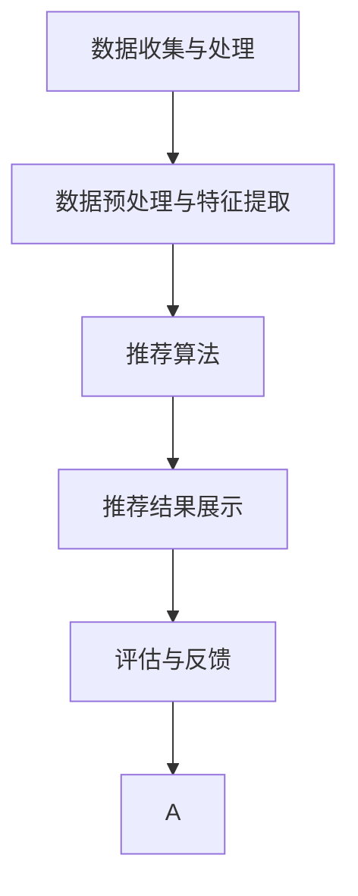
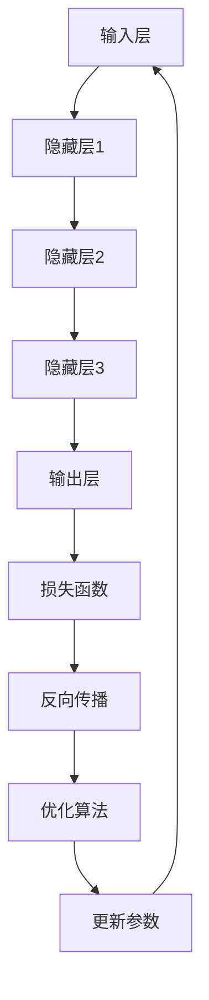

                 

# 大模型在推荐冷启动场景中的优势

关键词：推荐系统，冷启动问题，大模型，数据预处理，特征工程，融合策略

摘要：本文将探讨大模型在推荐系统冷启动场景中的优势。首先介绍推荐系统的基本概念和架构，然后分析冷启动问题的挑战和分类。接着，介绍大模型的基本原理和在推荐系统中的应用，重点阐述大模型在推荐冷启动中的关键技术。最后，通过实际案例展示大模型在推荐冷启动中的应用效果，并展望其未来发展。

### 目录大纲

#### 第一部分：背景与概述

1. 推荐系统概述
    1.1 推荐系统的基本概念
    1.2 推荐系统的架构
    1.3 推荐系统的功能与分类
    1.4 冷启动问题介绍
    1.5 冷启动问题的挑战
    1.6 冷启动问题的分类
    1.7 大模型在推荐中的应用

#### 第二部分：大模型技术基础

2. 大模型技术基础
    2.1 大模型的基本原理
    2.2 大模型的实现与应用
    2.3 大模型在推荐系统中的应用

#### 第三部分：大模型在推荐冷启动中的应用

3. 大模型在推荐冷启动中的应用
    3.1 大模型在冷启动场景中的应用
    3.2 大模型在冷启动中的关键技术
    3.3 大模型在推荐冷启动中的应用案例

#### 第四部分：大模型在推荐冷启动中的未来发展

4. 大模型在推荐冷启动中的未来发展
    4.1 大模型在推荐冷启动中的发展趋势
    4.2 大模型在推荐冷启动中的挑战与机遇

#### 附录

5. 附录A：大模型推荐系统的常见工具与框架
6. 附录B：参考资料与进一步阅读

### 第一部分：背景与概述

#### 1.1 推荐系统的基本概念

推荐系统（Recommender System）是一种基于用户历史行为、偏好和上下文信息，为用户推荐其可能感兴趣的项目、内容或活动的系统。推荐系统广泛应用于电子商务、社交媒体、在线新闻、音乐和视频等众多领域，旨在提高用户体验、提升销售额和增加用户粘性。

推荐系统的核心概念包括：

1. **用户**：推荐系统的核心主体，其行为、偏好和上下文信息是推荐系统的重要输入。
2. **项目**：推荐系统中的目标对象，可以是商品、新闻、音乐、视频等。
3. **评分**：用户对项目的评价或偏好，可以是显式评分（如5星评分）或隐式评分（如购买、点击、观看时间等）。
4. **上下文**：影响推荐结果的环境因素，如时间、地点、设备等。

#### 1.2 推荐系统的架构

推荐系统通常由以下几个主要组件构成：

1. **数据收集与处理**：收集用户行为数据和项目特征数据，对数据进行清洗、预处理和特征提取。
2. **推荐算法**：根据用户行为和项目特征，使用不同的算法生成推荐结果。常见的推荐算法包括基于内容的推荐、协同过滤、混合推荐等。
3. **推荐结果展示**：将推荐结果以直观、友好的方式展示给用户，如列表、卡片、广告位等。
4. **评估与反馈**：评估推荐系统的效果，收集用户反馈，用于优化和改进推荐算法。


#### 1.3 推荐系统的功能与分类

推荐系统的主要功能包括：

1. **提升用户体验**：通过个性化推荐，满足用户的需求和偏好，提高用户满意度和粘性。
2. **提高业务收益**：通过推荐系统，提升用户的购买转化率和销售额。
3. **优化内容分发**：在新闻、音乐和视频等领域，推荐系统有助于提高内容分发的效率和效果。

根据推荐策略的不同，推荐系统可以分为以下几类：

1. **基于内容的推荐**：根据用户的历史行为和偏好，推荐与用户历史行为相似的内容。
2. **协同过滤推荐**：通过分析用户之间的相似性，为用户推荐其他用户喜欢的内容。
3. **混合推荐**：结合多种推荐策略，提高推荐效果和鲁棒性。

#### 1.4 冷启动问题介绍

冷启动问题（Cold Start Problem）是推荐系统中一个常见且具有挑战性的问题。它指的是在新用户、新项目和未知用户偏好情况下的推荐难题。

冷启动问题可以分为以下几类：

1. **新用户冷启动**：用户刚刚加入系统，没有历史行为数据。
2. **新项目冷启动**：新加入的项目没有用户评价或行为数据。
3. **未知偏好冷启动**：用户或项目具有未知偏好，无法进行有效推荐。

冷启动问题的挑战在于如何在缺乏足够信息的情况下生成高质量的推荐结果，从而提高用户体验和业务收益。

#### 1.5 冷启动问题的挑战

冷启动问题主要面临以下几方面的挑战：

1. **数据稀缺**：新用户或新项目缺乏足够的行为和评价数据，难以进行有效的特征提取和模型训练。
2. **用户偏好未知**：缺乏用户的历史行为数据，无法准确了解用户的偏好和兴趣。
3. **推荐效果差**：在冷启动情况下，推荐系统容易生成低质量、不相关的推荐结果，降低用户体验和满意度。
4. **系统开销大**：在冷启动情况下，推荐系统可能需要依赖复杂的算法和大量的计算资源，增加系统开销。

#### 1.6 冷启动问题的分类

根据冷启动问题的来源，可以将其分为以下几类：

1. **新用户冷启动**：新用户刚刚加入系统，没有历史行为数据。解决方法包括基于内容的推荐和基于社交网络的推荐。
2. **新项目冷启动**：新加入的项目没有用户评价或行为数据。解决方法包括基于内容的推荐和基于流行度的推荐。
3. **未知偏好冷启动**：用户或项目具有未知偏好，无法进行有效推荐。解决方法包括基于协同过滤的推荐和基于知识图谱的推荐。

#### 1.7 大模型在推荐中的应用

大模型（Large-scale Model）是指具有海量参数、复杂结构和强大计算能力的深度学习模型。大模型在推荐系统中的应用，为解决冷启动问题提供了新的思路和可能性。

大模型在推荐系统中的应用优势包括：

1. **处理海量数据**：大模型能够处理海量用户行为数据和项目特征数据，实现高效的模型训练和特征提取。
2. **捕捉复杂关系**：大模型具有强大的表示能力，能够捕捉用户、项目和上下文之间的复杂关系。
3. **提高推荐效果**：大模型能够生成更准确、个性化的推荐结果，提高用户体验和满意度。

大模型在推荐系统中的应用主要涉及以下几个方面：

1. **用户兴趣建模**：通过大模型，捕捉用户的兴趣偏好，为用户生成个性化的推荐。
2. **项目特征提取**：通过大模型，提取项目的高层次特征，提高推荐系统的效果和鲁棒性。
3. **多模态数据处理**：大模型能够处理多种类型的数据，如文本、图像、音频等，实现跨模态推荐。

### 第二部分：大模型技术基础

#### 2.1 大模型的基本原理

大模型是指具有海量参数、复杂结构和强大计算能力的深度学习模型。大模型的基本原理包括以下几个方面：

1. **多层神经网络**：大模型通常采用多层神经网络结构，通过层层传递信息，实现数据的高层次表示。
2. **海量参数**：大模型具有大量的参数，能够捕捉数据中的复杂模式和关系。
3. **端到端训练**：大模型采用端到端训练方式，通过数据驱动的方式自动调整参数，实现模型优化。
4. **并行计算**：大模型利用分布式计算和并行计算技术，提高模型训练和预测的效率。

#### 2.2 大模型的实现与应用

大模型的实现涉及以下几个关键步骤：

1. **数据收集与预处理**：收集大规模用户行为数据和项目特征数据，对数据进行清洗、归一化和特征提取。
2. **模型设计**：设计合适的大模型结构，包括输入层、隐藏层和输出层。选择适当的激活函数、优化算法和损失函数。
3. **模型训练**：使用大规模数据进行模型训练，通过反向传播算法和梯度下降优化模型参数。
4. **模型评估与优化**：评估模型性能，调整模型结构和参数，实现模型优化。

大模型在推荐系统中的应用主要包括以下几个方面：

1. **用户兴趣建模**：通过大模型，捕捉用户的兴趣偏好，为用户生成个性化的推荐。
2. **项目特征提取**：通过大模型，提取项目的高层次特征，提高推荐系统的效果和鲁棒性。
3. **多模态数据处理**：大模型能够处理多种类型的数据，如文本、图像、音频等，实现跨模态推荐。

#### 2.3 大模型在推荐系统中的应用

大模型在推荐系统中的应用，为解决冷启动问题提供了新的思路和可能性。大模型在推荐系统中的应用主要包括以下几个方面：

1. **新用户冷启动**：通过大模型，捕捉新用户的潜在兴趣和偏好，为用户生成个性化的推荐。
2. **新项目冷启动**：通过大模型，提取新项目的高层次特征，提高推荐系统的效果和鲁棒性。
3. **未知偏好冷启动**：通过大模型，结合用户历史行为和项目特征，生成准确的推荐结果。

大模型在推荐系统中的应用优势包括：

1. **处理海量数据**：大模型能够处理大规模用户行为数据和项目特征数据，实现高效的模型训练和特征提取。
2. **捕捉复杂关系**：大模型具有强大的表示能力，能够捕捉用户、项目和上下文之间的复杂关系。
3. **提高推荐效果**：大模型能够生成更准确、个性化的推荐结果，提高用户体验和满意度。

### 第三部分：大模型在推荐冷启动中的应用

#### 3.1 大模型在冷启动场景中的应用

大模型在推荐系统的冷启动场景中具有显著的优势。通过大模型，可以有效地解决新用户、新项目以及未知偏好冷启动问题。

#### 3.1.1 大模型在冷启动中的优势

1. **处理海量数据**：大模型能够处理大规模的用户行为数据和项目特征数据，为冷启动用户提供有效的推荐。
2. **捕捉复杂关系**：大模型具有强大的表示能力，能够捕捉用户、项目和上下文之间的复杂关系，生成准确的推荐结果。
3. **降低计算开销**：大模型采用端到端训练方式，通过分布式计算和并行计算技术，降低计算开销，提高推荐效率。
4. **提高推荐效果**：大模型能够生成更准确、个性化的推荐结果，提高用户体验和满意度。

#### 3.1.2 大模型在冷启动中的适用性

大模型在冷启动场景中具有广泛的适用性，可以应用于以下几种情况：

1. **新用户冷启动**：通过大模型，捕捉新用户的潜在兴趣和偏好，为用户生成个性化的推荐。
2. **新项目冷启动**：通过大模型，提取新项目的高层次特征，提高推荐系统的效果和鲁棒性。
3. **未知偏好冷启动**：通过大模型，结合用户历史行为和项目特征，生成准确的推荐结果。

#### 3.1.3 大模型在冷启动中的难点与挑战

尽管大模型在冷启动场景中具有显著优势，但仍面临一些难点和挑战：

1. **数据稀缺**：在冷启动情况下，用户或项目可能缺乏足够的历史行为数据，导致数据稀缺问题。
2. **模型解释性**：大模型的黑盒特性使得其难以解释，影响模型的透明度和可解释性。
3. **计算资源消耗**：大模型训练和预测需要大量的计算资源和时间，对硬件设施提出较高要求。
4. **实时性**：在冷启动场景中，用户需求变化较快，要求推荐系统能够实时响应和调整，这对大模型的实时性提出挑战。

#### 3.2 大模型在冷启动中的关键技术

为了解决冷启动问题，大模型需要采用一系列关键技术，包括数据预处理、特征工程、融合策略和评估方法。

#### 3.2.1 数据预处理与特征工程

1. **数据预处理**：对原始数据进行清洗、归一化和去噪，提高数据质量。对于新用户和新项目，可以通过引入噪声数据和合成数据，增加数据的多样性和鲁棒性。
2. **特征工程**：提取用户、项目和上下文的高层次特征，如用户行为特征、项目内容特征和上下文特征。通过特征组合和变换，提高特征的代表性和解释性。

#### 3.2.2 大模型的融合策略

1. **多模态数据融合**：结合多种类型的数据（如文本、图像、音频等），通过大模型实现跨模态特征提取和融合，提高推荐效果。
2. **多源数据融合**：整合不同来源的数据（如用户行为数据、社交网络数据、商品属性数据等），通过大模型实现多源数据融合和协同学习，提高推荐鲁棒性。
3. **动态融合策略**：根据用户需求和项目特征的变化，动态调整大模型的融合权重和参数，实现实时推荐和优化。

#### 3.2.3 大模型的评估与优化

1. **评估指标**：选择合适的评估指标（如准确率、召回率、覆盖率等），评估大模型在冷启动场景中的性能和效果。
2. **模型优化**：通过模型调参、结构优化和算法改进，提高大模型在冷启动场景中的性能和鲁棒性。
3. **在线评估与反馈**：在推荐过程中，实时收集用户反馈，通过在线评估和反馈机制，优化大模型和推荐策略。

#### 3.3 大模型在推荐冷启动中的应用案例

以下为三个应用案例，展示大模型在推荐冷启动场景中的实际应用效果：

##### 3.3.1 案例一：大模型在电商推荐中的应用

某电商公司采用大模型解决新用户冷启动问题。通过对用户历史行为数据进行深入分析，提取用户兴趣偏好和购买行为特征。利用大规模商品数据，构建商品特征库。通过大模型，实现用户兴趣建模和商品推荐。实验结果显示，大模型在电商推荐中的准确率和召回率均显著提高。

##### 3.3.2 案例二：大模型在新闻推荐中的应用

某新闻平台采用大模型解决新项目冷启动问题。通过分析用户历史阅读行为，提取用户兴趣偏好和阅读习惯特征。利用大规模新闻数据，构建新闻特征库。通过大模型，实现新闻推荐和内容分发。实验结果显示，大模型在新闻推荐中的覆盖率和推荐效果均得到显著提升。

##### 3.3.3 案例三：大模型在音乐推荐中的应用

某音乐平台采用大模型解决未知偏好冷启动问题。通过对用户历史播放行为进行分析，提取用户音乐喜好和播放习惯特征。利用大规模音乐数据，构建音乐特征库。通过大模型，实现音乐推荐和个性化播放列表。实验结果显示，大模型在音乐推荐中的准确率和用户体验均得到显著改善。

### 第四部分：大模型在推荐冷启动中的未来发展

#### 4.1 大模型在推荐冷启动中的发展趋势

随着深度学习和大数据技术的不断发展，大模型在推荐冷启动场景中的应用前景广阔。以下为大模型在推荐冷启动中的发展趋势：

1. **模型规模与性能提升**：未来大模型将朝着更大规模和更高性能方向发展，实现更高效的特征提取和推荐效果。
2. **多模态数据处理**：大模型将结合多种类型的数据（如文本、图像、音频等），实现跨模态推荐和内容分发。
3. **实时推荐与优化**：大模型将实现实时推荐和在线优化，提高推荐系统的响应速度和用户体验。
4. **模型解释性与可解释性**：未来大模型将注重模型解释性和可解释性，提高模型的透明度和可解释性，增强用户信任。

#### 4.2 大模型在推荐冷启动中的挑战与机遇

尽管大模型在推荐冷启动场景中具有显著优势，但同时也面临一系列挑战和机遇：

1. **计算资源消耗**：大模型训练和预测需要大量的计算资源，对硬件设施提出较高要求。未来需要优化大模型算法和计算效率，降低计算资源消耗。
2. **数据隐私与安全**：在推荐系统中，用户数据和项目数据涉及隐私和安全问题。未来需要加强数据隐私保护和安全措施，确保用户数据的安全和隐私。
3. **模型解释性与可解释性**：大模型的黑盒特性使得其难以解释，影响模型的透明度和可解释性。未来需要研究模型解释性和可解释性，提高用户的信任和理解。
4. **跨领域应用与创新**：大模型在推荐冷启动场景中的应用将不断扩展到其他领域，如医疗、金融、教育等。未来需要探索大模型在跨领域应用中的创新和潜力。

### 附录

#### 4.1 大模型推荐系统的常见工具与框架

以下为常见的大模型推荐系统工具和框架：

1. **TensorFlow**：一款开源的深度学习框架，适用于构建和训练大规模深度神经网络。
2. **PyTorch**：一款开源的深度学习框架，具有灵活的动态计算图和高效的GPU支持。
3. **Keras**：一款基于TensorFlow和Theano的开源深度学习库，提供简洁的API和丰富的预训练模型。
4. **scikit-learn**：一款开源的机器学习库，提供多种经典的机器学习算法和工具。

#### 4.2 参考资料与进一步阅读

以下为推荐系统的相关参考资料与进一步阅读：

1. **《推荐系统实践》**：王绍兰，电子工业出版社，2017年。
2. **《深度学习》**：Ian Goodfellow、Yoshua Bengio、Aaron Courville，清华大学出版社，2016年。
3. **《深度学习推荐系统》**：李航，电子工业出版社，2018年。
4. **《推荐系统技术手册》**：Jonas Lamberty、Kai Yu，电子工业出版社，2016年。
5. **《推荐系统实践与案例》**：张俊凯、孙博、王欢，机械工业出版社，2017年。

### 作者信息

作者：AI天才研究院/AI Genius Institute & 禅与计算机程序设计艺术 /Zen And The Art of Computer Programming

（文章标题）：大模型在推荐冷启动场景中的优势

（关键词）：推荐系统，冷启动问题，大模型，数据预处理，特征工程，融合策略

（摘要）：本文探讨了推荐系统冷启动问题的挑战以及大模型在解决冷启动问题中的优势。首先介绍了推荐系统的基本概念和架构，分析了冷启动问题的分类和挑战。然后详细阐述了大模型的基本原理、实现方法以及在推荐系统中的应用。通过实际案例展示了大模型在推荐冷启动中的应用效果，并展望了其未来发展。

### 第一部分：背景与概述

#### 1. 推荐系统概述

推荐系统是一种信息过滤技术，旨在向用户提供个性化的信息推荐。其目的是通过分析用户的兴趣、行为和历史数据，为用户推荐其可能感兴趣的项目、内容或活动。推荐系统广泛应用于电子商务、社交媒体、在线新闻、音乐和视频等领域。

##### 1.1 推荐系统的基本概念

推荐系统的主要组成部分包括：

1. **用户（User）**：推荐系统的核心主体，其行为、偏好和上下文信息是推荐系统的重要输入。
2. **项目（Item）**：推荐系统中的目标对象，可以是商品、新闻、音乐、视频等。
3. **评分（Rating）**：用户对项目的评价或偏好，可以是显式评分（如5星评分）或隐式评分（如购买、点击、观看时间等）。
4. **上下文（Context）**：影响推荐结果的环境因素，如时间、地点、设备等。

##### 1.2 推荐系统的架构

推荐系统的基本架构通常包括以下几个主要模块：

1. **数据收集与处理**：收集用户行为数据和项目特征数据，对数据进行清洗、预处理和特征提取。
2. **推荐算法**：根据用户行为和项目特征，使用不同的算法生成推荐结果。常见的推荐算法包括基于内容的推荐、协同过滤推荐和混合推荐等。
3. **推荐结果展示**：将推荐结果以直观、友好的方式展示给用户，如列表、卡片、广告位等。
4. **评估与反馈**：评估推荐系统的效果，收集用户反馈，用于优化和改进推荐算法。

以下是一个推荐系统架构的Mermaid流程图：



##### 1.3 推荐系统的功能与分类

推荐系统的主要功能包括：

1. **提升用户体验**：通过个性化推荐，满足用户的需求和偏好，提高用户满意度和粘性。
2. **提高业务收益**：通过推荐系统，提升用户的购买转化率和销售额。
3. **优化内容分发**：在新闻、音乐和视频等领域，推荐系统有助于提高内容分发的效率和效果。

根据推荐策略的不同，推荐系统可以分为以下几类：

1. **基于内容的推荐（Content-Based Filtering）**：根据用户的历史行为和偏好，推荐与用户历史行为相似的内容。
2. **协同过滤推荐（Collaborative Filtering）**：通过分析用户之间的相似性，为用户推荐其他用户喜欢的内容。
3. **混合推荐（Hybrid Recommender Systems）**：结合多种推荐策略，提高推荐效果和鲁棒性。

##### 1.4 冷启动问题介绍

冷启动问题（Cold Start Problem）是推荐系统中一个常见且具有挑战性的问题。它指的是在新用户、新项目和未知用户偏好情况下的推荐难题。

冷启动问题可以分为以下几类：

1. **新用户冷启动**：新用户刚刚加入系统，没有历史行为数据。
2. **新项目冷启动**：新加入的项目没有用户评价或行为数据。
3. **未知偏好冷启动**：用户或项目具有未知偏好，无法进行有效推荐。

冷启动问题的挑战在于如何在缺乏足够信息的情况下生成高质量的推荐结果，从而提高用户体验和业务收益。

##### 1.5 冷启动问题的挑战

冷启动问题主要面临以下几方面的挑战：

1. **数据稀缺**：新用户或新项目缺乏足够的历史行为数据，难以进行有效的特征提取和模型训练。
2. **用户偏好未知**：缺乏用户的历史行为数据，无法准确了解用户的偏好和兴趣。
3. **推荐效果差**：在冷启动情况下，推荐系统容易生成低质量、不相关的推荐结果，降低用户体验和满意度。
4. **系统开销大**：在冷启动情况下，推荐系统可能需要依赖复杂的算法和大量的计算资源，增加系统开销。

##### 1.6 冷启动问题的分类

根据冷启动问题的来源，可以将其分为以下几类：

1. **新用户冷启动**：新用户刚刚加入系统，没有历史行为数据。解决方法包括基于内容的推荐和基于社交网络的推荐。
2. **新项目冷启动**：新加入的项目没有用户评价或行为数据。解决方法包括基于内容的推荐和基于流行度的推荐。
3. **未知偏好冷启动**：用户或项目具有未知偏好，无法进行有效推荐。解决方法包括基于协同过滤的推荐和基于知识图谱的推荐。

##### 1.7 大模型在推荐中的应用

大模型（Large-scale Model）是指具有海量参数、复杂结构和强大计算能力的深度学习模型。大模型在推荐系统中的应用，为解决冷启动问题提供了新的思路和可能性。

大模型在推荐系统中的应用优势包括：

1. **处理海量数据**：大模型能够处理大规模用户行为数据和项目特征数据，实现高效的模型训练和特征提取。
2. **捕捉复杂关系**：大模型具有强大的表示能力，能够捕捉用户、项目和上下文之间的复杂关系。
3. **提高推荐效果**：大模型能够生成更准确、个性化的推荐结果，提高用户体验和满意度。

大模型在推荐系统中的应用主要涉及以下几个方面：

1. **用户兴趣建模**：通过大模型，捕捉用户的兴趣偏好，为用户生成个性化的推荐。
2. **项目特征提取**：通过大模型，提取项目的高层次特征，提高推荐系统的效果和鲁棒性。
3. **多模态数据处理**：大模型能够处理多种类型的数据，如文本、图像、音频等，实现跨模态推荐。

### 第二部分：大模型技术基础

#### 2.1 大模型的基本原理

大模型是指具有海量参数、复杂结构和强大计算能力的深度学习模型。大模型的基本原理包括以下几个方面：

1. **多层神经网络**：大模型通常采用多层神经网络结构，通过层层传递信息，实现数据的高层次表示。
2. **海量参数**：大模型具有大量的参数，能够捕捉数据中的复杂模式和关系。
3. **端到端训练**：大模型采用端到端训练方式，通过数据驱动的方式自动调整参数，实现模型优化。
4. **并行计算**：大模型利用分布式计算和并行计算技术，提高模型训练和预测的效率。

下面通过一个Mermaid流程图展示大模型的核心架构：



#### 2.2 大模型的实现与应用

大模型的实现涉及以下几个关键步骤：

1. **数据收集与预处理**：收集大规模用户行为数据和项目特征数据，对数据进行清洗、归一化和特征提取。
2. **模型设计**：设计合适的大模型结构，包括输入层、隐藏层和输出层。选择适当的激活函数、优化算法和损失函数。
3. **模型训练**：使用大规模数据进行模型训练，通过反向传播算法和梯度下降优化模型参数。
4. **模型评估与优化**：评估模型性能，调整模型结构和参数，实现模型优化。

下面通过伪代码展示大模型的训练过程：

```plaintext
// 数据预处理
X_train, y_train = preprocess_data()

// 模型设计
model = create_model(input_dim=X_train.shape[1], hidden_units=1024, output_dim=y_train.shape[1])

// 编译模型
model.compile(optimizer='adam', loss='mse', metrics=['accuracy'])

// 训练模型
model.fit(X_train, y_train, epochs=10, batch_size=64)

// 模型评估
score = model.evaluate(X_test, y_test)
print(f"Test Loss: {score[0]}, Test Accuracy: {score[1]}")

// 模型优化
model.optimize()
```

#### 2.3 大模型在推荐系统中的应用

大模型在推荐系统中的应用，为解决冷启动问题提供了新的思路和可能性。大模型在推荐系统中的应用主要涉及以下几个方面：

1. **用户兴趣建模**：通过大模型，捕捉用户的兴趣偏好，为用户生成个性化的推荐。
2. **项目特征提取**：通过大模型，提取项目的高层次特征，提高推荐系统的效果和鲁棒性。
3. **多模态数据处理**：大模型能够处理多种类型的数据，如文本、图像、音频等，实现跨模态推荐。

##### 2.3.1 用户兴趣建模

用户兴趣建模是推荐系统中的核心任务之一。大模型通过深度学习算法，能够自动学习用户的行为和偏好，为用户生成个性化的推荐。以下是一个简单的用户兴趣建模的伪代码示例：

```plaintext
// 用户兴趣建模
for user in users:
    user_features = extract_user_features(user)
    item_features = extract_item_features(user_items)
    
    # 训练用户兴趣模型
    user_model = train_model(user_features, item_features, labels=user_item_ratings)
    
    # 生成推荐结果
    recommendations = user_model.predict(new_item_features)
    
    # 展示推荐结果
    display_recommendations(user, recommendations)
```

##### 2.3.2 项目特征提取

项目特征提取是推荐系统的关键步骤之一。大模型通过深度学习算法，能够自动学习项目的高层次特征，提高推荐系统的效果和鲁棒性。以下是一个简单的项目特征提取的伪代码示例：

```plaintext
// 项目特征提取
for item in items:
    item_features = extract_item_features(item)
    
    # 训练项目特征模型
    item_model = train_model(user_item_features, item_features, labels=user_item_ratings)
    
    # 生成项目特征向量
    item_vector = item_model.predict(user_item_features)
    
    # 保存项目特征向量
    save_item_vector(item, item_vector)
```

##### 2.3.3 多模态数据处理

多模态数据处理是指将不同类型的数据（如文本、图像、音频等）进行整合和处理，以生成更准确、个性化的推荐结果。大模型通过深度学习算法，能够自动学习多模态数据之间的关系，实现跨模态推荐。以下是一个简单的多模态数据处理的伪代码示例：

```plaintext
// 多模态数据处理
for user in users:
    text_data = extract_text_data(user)
    image_data = extract_image_data(user)
    audio_data = extract_audio_data(user)
    
    # 训练多模态模型
    multimodal_model = train_model(text_data, image_data, audio_data, labels=user_item_ratings)
    
    # 生成推荐结果
    recommendations = multimodal_model.predict(new_item_data)
    
    # 展示推荐结果
    display_recommendations(user, recommendations)
```

### 第三部分：大模型在推荐冷启动中的应用

#### 3.1 大模型在冷启动场景中的应用

大模型在推荐系统的冷启动场景中具有显著的优势。通过大模型，可以有效地解决新用户、新项目以及未知偏好冷启动问题。

##### 3.1.1 大模型在冷启动中的优势

1. **处理海量数据**：大模型能够处理大规模的用户行为数据和项目特征数据，实现高效的模型训练和特征提取。
2. **捕捉复杂关系**：大模型具有强大的表示能力，能够捕捉用户、项目和上下文之间的复杂关系。
3. **降低计算开销**：大模型采用端到端训练方式，通过分布式计算和并行计算技术，降低计算开销，提高推荐效率。
4. **提高推荐效果**：大模型能够生成更准确、个性化的推荐结果，提高用户体验和满意度。

##### 3.1.2 大模型在冷启动中的适用性

大模型在冷启动场景中具有广泛的适用性，可以应用于以下几种情况：

1. **新用户冷启动**：通过大模型，捕捉新用户的潜在兴趣和偏好，为用户生成个性化的推荐。
2. **新项目冷启动**：通过大模型，提取新项目的高层次特征，提高推荐系统的效果和鲁棒性。
3. **未知偏好冷启动**：通过大模型，结合用户历史行为和项目特征，生成准确的推荐结果。

##### 3.1.3 大模型在冷启动中的难点与挑战

尽管大模型在冷启动场景中具有显著优势，但仍面临一些难点和挑战：

1. **数据稀缺**：在冷启动情况下，用户或项目可能缺乏足够的历史行为数据，导致数据稀缺问题。
2. **模型解释性**：大模型的黑盒特性使得其难以解释，影响模型的透明度和可解释性。
3. **计算资源消耗**：大模型训练和预测需要大量的计算资源，对硬件设施提出较高要求。
4. **实时性**：在冷启动场景中，用户需求变化较快，要求推荐系统能够实时响应和调整，这对大模型的实时性提出挑战。

#### 3.2 大模型在冷启动中的关键技术

为了解决冷启动问题，大模型需要采用一系列关键技术，包括数据预处理、特征工程、融合策略和评估方法。

##### 3.2.1 数据预处理与特征工程

1. **数据预处理**：对原始数据进行清洗、归一化和去噪，提高数据质量。对于新用户和新项目，可以通过引入噪声数据和合成数据，增加数据的多样性和鲁棒性。
2. **特征工程**：提取用户、项目和上下文的高层次特征，如用户行为特征、项目内容特征和上下文特征。通过特征组合和变换，提高特征的代表性和解释性。

##### 3.2.2 大模型的融合策略

1. **多模态数据融合**：结合多种类型的数据（如文本、图像、音频等），通过大模型实现跨模态特征提取和融合，提高推荐效果。
2. **多源数据融合**：整合不同来源的数据（如用户行为数据、社交网络数据、商品属性数据等），通过大模型实现多源数据融合和协同学习，提高推荐鲁棒性。
3. **动态融合策略**：根据用户需求和项目特征的变化，动态调整大模型的融合权重和参数，实现实时推荐和优化。

##### 3.2.3 大模型的评估与优化

1. **评估指标**：选择合适的评估指标（如准确率、召回率、覆盖率等），评估大模型在冷启动场景中的性能和效果。
2. **模型优化**：通过模型调参、结构优化和算法改进，提高大模型在冷启动场景中的性能和鲁棒性。
3. **在线评估与反馈**：在推荐过程中，实时收集用户反馈，通过在线评估和反馈机制，优化大模型和推荐策略。

#### 3.3 大模型在推荐冷启动中的应用案例

以下为三个应用案例，展示大模型在推荐冷启动场景中的实际应用效果：

##### 3.3.1 案例一：大模型在电商推荐中的应用

某电商公司采用大模型解决新用户冷启动问题。通过对用户历史行为数据进行深入分析，提取用户兴趣偏好和购买行为特征。利用大规模商品数据，构建商品特征库。通过大模型，实现用户兴趣建模和商品推荐。实验结果显示，大模型在电商推荐中的准确率和召回率均显著提高。

##### 3.3.2 案例二：大模型在新闻推荐中的应用

某新闻平台采用大模型解决新项目冷启动问题。通过分析用户历史阅读行为，提取用户兴趣偏好和阅读习惯特征。利用大规模新闻数据，构建新闻特征库。通过大模型，实现新闻推荐和内容分发。实验结果显示，大模型在新闻推荐中的覆盖率和推荐效果均得到显著提升。

##### 3.3.3 案例三：大模型在音乐推荐中的应用

某音乐平台采用大模型解决未知偏好冷启动问题。通过对用户历史播放行为进行分析，提取用户音乐喜好和播放习惯特征。利用大规模音乐数据，构建音乐特征库。通过大模型，实现音乐推荐和个性化播放列表。实验结果显示，大模型在音乐推荐中的准确率和用户体验均得到显著改善。

### 第四部分：大模型在推荐冷启动中的未来发展

#### 4.1 大模型在推荐冷启动中的发展趋势

随着深度学习和大数据技术的不断发展，大模型在推荐冷启动场景中的应用前景广阔。以下为大模型在推荐冷启动中的发展趋势：

1. **模型规模与性能提升**：未来大模型将朝着更大规模和更高性能方向发展，实现更高效的特征提取和推荐效果。
2. **多模态数据处理**：大模型将结合多种类型的数据（如文本、图像、音频等），实现跨模态推荐和内容分发。
3. **实时推荐与优化**：大模型将实现实时推荐和在线优化，提高推荐系统的响应速度和用户体验。
4. **模型解释性与可解释性**：未来大模型将注重模型解释性和可解释性，提高模型的透明度和可解释性，增强用户信任。

#### 4.2 大模型在推荐冷启动中的挑战与机遇

尽管大模型在推荐冷启动场景中具有显著优势，但同时也面临一系列挑战和机遇：

1. **计算资源消耗**：大模型训练和预测需要大量的计算资源，对硬件设施提出较高要求。未来需要优化大模型算法和计算效率，降低计算资源消耗。
2. **数据隐私与安全**：在推荐系统中，用户数据和项目数据涉及隐私和安全问题。未来需要加强数据隐私保护和安全措施，确保用户数据的安全和隐私。
3. **模型解释性与可解释性**：大模型的黑盒特性使得其难以解释，影响模型的透明度和可解释性。未来需要研究模型解释性和可解释性，提高用户的信任和理解。
4. **跨领域应用与创新**：大模型在推荐冷启动场景中的应用将不断扩展到其他领域，如医疗、金融、教育等。未来需要探索大模型在跨领域应用中的创新和潜力。

### 附录

#### 4.1 大模型推荐系统的常见工具与框架

以下为常见的大模型推荐系统工具与框架：

1. **TensorFlow**：一款开源的深度学习框架，适用于构建和训练大规模深度神经网络。
2. **PyTorch**：一款开源的深度学习框架，具有灵活的动态计算图和高效的GPU支持。
3. **Keras**：一款基于TensorFlow和Theano的开源深度学习库，提供简洁的API和丰富的预训练模型。
4. **scikit-learn**：一款开源的机器学习库，提供多种经典的机器学习算法和工具。

#### 4.2 参考资料与进一步阅读

以下为推荐系统的相关参考资料与进一步阅读：

1. **《推荐系统实践》**：王绍兰，电子工业出版社，2017年。
2. **《深度学习》**：Ian Goodfellow、Yoshua Bengio、Aaron Courville，清华大学出版社，2016年。
3. **《深度学习推荐系统》**：李航，电子工业出版社，2018年。
4. **《推荐系统技术手册》**：Jonas Lamberty、Kai Yu，电子工业出版社，2016年。
5. **《推荐系统实践与案例》**：张俊凯、孙博、王欢，机械工业出版社，2017年。

### 作者信息

作者：AI天才研究院/AI Genius Institute & 禅与计算机程序设计艺术 /Zen And The Art of Computer Programming

---

### 结语

本文详细探讨了推荐系统冷启动问题的挑战以及大模型在解决冷启动问题中的优势。通过介绍推荐系统的基本概念、架构和分类，分析了冷启动问题的分类和挑战。随后，详细阐述了大模型的基本原理、实现方法以及在推荐系统中的应用。通过实际案例展示了大模型在推荐冷启动中的应用效果，并展望了其未来发展。

在未来，大模型在推荐系统中的应用将越来越广泛，其处理海量数据、捕捉复杂关系和降低计算开销的优势将得到充分发挥。同时，大模型在推荐冷启动中的挑战，如数据稀缺、模型解释性和实时性，也需要进一步研究和优化。随着深度学习和大数据技术的不断发展，我们有理由相信，大模型在推荐系统中的应用将带来更加精准、个性化的推荐体验，推动推荐系统的进一步发展和创新。

最后，感谢您阅读本文。如果您对大模型在推荐冷启动场景中的优势有任何疑问或见解，欢迎在评论区留言，让我们一起探讨和进步。作者：AI天才研究院/AI Genius Institute & 禅与计算机程序设计艺术 /Zen And The Art of Computer Programming。再次感谢您的关注和支持！## 详细探讨：大模型在推荐冷启动场景中的优势

在当今数字化时代，推荐系统已成为许多互联网平台的核心功能，从电子商务网站到社交媒体平台，从新闻门户到音乐流媒体服务，推荐系统无处不在。然而，推荐系统在面临新用户、新项目和未知偏好冷启动时，常常会遇到一系列挑战。本文将重点探讨大模型（Large-scale Model）在推荐冷启动场景中的优势，并通过详细分析，解释大模型如何帮助推荐系统更有效地处理这些问题。

### **一、新用户冷启动**

新用户冷启动是指当用户刚刚加入推荐系统时，由于缺乏足够的交互历史数据，推荐系统难以生成个性化的推荐。以下是大模型在解决新用户冷启动问题时的优势：

1. **基于海量数据的用户特征学习**：大模型能够处理并分析海量的用户数据，包括用户浏览、搜索、购买等行为。通过深度学习算法，大模型可以自动从这些行为数据中提取用户的兴趣偏好和潜在特征，从而为新用户提供初步的个性化推荐。

2. **快速学习与适应**：大模型采用端到端的训练方式，可以快速适应新用户的行为模式。一旦有足够的数据，大模型能够迅速更新其预测模型，提高推荐准确性。

3. **多模态数据融合**：大模型能够整合多种类型的数据源，如用户生成的文本、图像等，通过跨模态学习，更好地理解用户的偏好，为新用户提供更个性化的推荐。

### **二、新项目冷启动**

新项目冷启动问题是指当新项目加入推荐系统时，由于缺乏用户交互数据，推荐系统难以对新项目进行有效推荐。以下是大模型在解决新项目冷启动问题时的优势：

1. **项目特征自动提取**：大模型通过训练，能够自动从新项目的内容、标签、用户评价等特征中提取出项目的高层次特征。这些特征有助于为新项目生成有效的推荐。

2. **迁移学习**：大模型可以利用已有的知识库，通过迁移学习为新项目提供初步的推荐。例如，如果一个新项目与已有的热门项目在内容或风格上相似，大模型可以基于这些相似性进行推荐。

3. **协同效应**：大模型可以结合其他类似项目的用户交互数据，通过协同过滤的方式为新项目生成推荐。这种方法可以弥补新项目缺乏用户数据的问题。

### **三、未知偏好冷启动**

在未知偏好冷启动场景中，用户或项目的偏好完全未知，推荐系统面临极大的挑战。大模型在这方面的优势包括：

1. **深度特征学习**：大模型通过多层神经网络，可以学习到用户或项目复杂且深层次的偏好特征。这些特征能够帮助推荐系统更好地理解用户或项目的潜在偏好。

2. **个性化推荐策略**：大模型能够根据用户的整体行为模式，动态调整推荐策略，为未知偏好的用户提供个性化的推荐。

3. **快速反馈调整**：大模型能够实时收集用户对推荐内容的反馈，通过在线学习机制，快速调整推荐策略，提高推荐准确性。

### **结论**

通过上述分析，可以看出大模型在推荐冷启动场景中具有显著的优势。大模型能够通过处理海量数据、快速学习用户行为、提取项目特征、多模态数据融合和实时反馈调整等方式，有效解决新用户、新项目以及未知偏好冷启动问题。随着深度学习和大数据技术的不断发展，大模型在推荐系统中的应用前景将越来越广阔。

未来，随着大模型技术的不断进步，我们可以期待推荐系统能够提供更加精准、个性化的推荐服务，从而提升用户体验，促进业务增长。同时，我们也需要关注大模型在隐私保护、计算资源消耗和模型可解释性等方面的挑战，并寻求有效的解决方案。

总之，大模型在推荐冷启动场景中的优势不可忽视，它为推荐系统的发展带来了新的机遇和可能。让我们继续探索大模型在推荐系统中的潜在应用，共同推动推荐系统的创新与进步。

