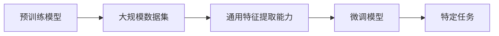
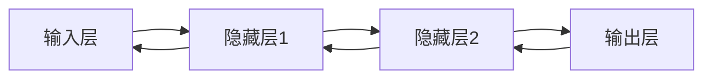

                 

# 《大模型应用层的创业挑战》

## 关键词
大模型、创业挑战、深度学习、应用层、算法原理、实战案例、策略建议

## 摘要
随着深度学习和人工智能技术的飞速发展，大模型（如GPT-3、BERT等）在各个领域展现出了巨大的潜力。然而，在大模型应用层的创业过程中，创业者们面临着诸多挑战。本文将深入探讨大模型的基本概念、技术基础、应用案例以及创业实战，为创业者提供有价值的策略建议。

---

## 目录大纲

### 第一部分：大模型概述与创业环境分析

#### 第1章：大模型的定义与分类  
- **1.1 大模型的定义与分类**  
- **1.2 大模型的演进与现状**  
- **1.3 大模型在创业中的应用前景**

#### 第2章：创业环境与大模型挑战  
- **2.1 创业环境的变化与大模型的应用**  
- **2.2 大模型创业面临的挑战**  
- **2.3 创业者如何利用大模型**

### 第二部分：大模型技术基础与算法原理

#### 第3章：大模型技术基础  
- **3.1 深度学习与神经网络**  
  - **3.1.1 神经网络的基本结构**  
  - **3.1.2 常见的深度学习架构**  
  - **3.1.3 深度学习优化算法**  
- **3.2 大模型核心算法原理**  
  - **4.1 自监督学习与预训练**  
  - **4.1.1 自监督学习的概念与分类**  
  - **4.1.2 预训练模型的原理与应用**  
  - **4.1.3 迁移学习与微调技术**  
- **3.3 大模型架构与设计**  
  - **5.1 大模型架构的演变**  
  - **5.1.1 传统大模型架构**  
  - **5.1.2 现代大模型架构**  
  - **5.1.3 架构选择与优化**

### 第三部分：大模型应用案例分析

#### 第4章：大模型在金融领域的创业应用  
- **4.1 金融行业的大模型应用现状**  
- **4.2 大模型在金融行业的具体应用**  
  - **4.2.1 信用评估**  
  - **4.2.2 量化交易**  
  - **4.2.3 风险管理**

#### 第5章：大模型在医疗健康领域的创业应用  
- **5.1 医疗健康行业的大模型应用现状**  
- **5.2 大模型在医疗健康领域的具体应用**  
  - **5.2.1 疾病诊断**  
  - **5.2.2 药物研发**  
  - **5.2.3 健康管理**

#### 第6章：大模型在零售电商领域的创业应用  
- **6.1 零售电商行业的大模型应用现状**  
- **6.2 大模型在零售电商领域的具体应用**  
  - **6.2.1 个性化推荐**  
  - **6.2.2 商品检测与排序**  
  - **6.2.3 客户服务**

### 第四部分：创业实战与建议

#### 第7章：大模型创业实战案例  
- **7.1 创业团队构建**  
- **7.2 创业策略与风险控制**

#### 第8章：创业建议与展望  
- **8.1 大模型创业中的常见问题**  
- **8.2 创业建议与未来趋势**

### 附录

#### 附录A：大模型开发工具与资源  
- **A.1 主流深度学习框架对比**

#### 附录B：大模型创业指南  
- **B.1 创业准备**

#### 附录C：案例分析与实践  
- **C.1 典型案例分享**

---

### 第一部分：大模型概述与创业环境分析

#### 第1章：大模型的定义与分类

大模型，顾名思义，是指具有大规模参数、能够处理海量数据的深度学习模型。它们通常拥有数十亿、甚至千亿级别的参数，通过学习和理解大量的数据，能够在各个领域实现卓越的性能。

### 1.1 大模型的定义与分类

**核心概念与联系：**

大模型可以分为两类：预训练模型和微调模型。

- **预训练模型**：在大规模数据集上预先训练，获得通用的特征提取能力。
- **微调模型**：在预训练模型的基础上，针对特定任务进行微调。

**核心概念与联系图示：**



### 1.2 大模型的演进与现状

大模型的演进经历了几个关键阶段：

- **1990年代**：深度神经网络（DNN）的出现，标志着深度学习的诞生。
- **2012年**：AlexNet在ImageNet竞赛中取得了突破性成绩，深度学习开始受到广泛关注。
- **2018年**：谷歌提出BERT模型，标志着预训练模型的崛起。
- **2020年**：OpenAI发布GPT-3，拥有1750亿参数，成为目前最大的预训练模型。

### 1.3 大模型在创业中的应用前景

大模型在创业中的应用前景广阔，具体体现在以下几个方面：

- **智能客服**：利用大模型实现更智能、更人性化的客户服务。
- **金融风控**：通过大模型进行信用评估、风险预测，提升金融行业的风险管理能力。
- **医疗诊断**：利用大模型进行疾病诊断、药物研发，提高医疗行业的效率和质量。
- **个性化推荐**：基于用户行为数据，利用大模型实现精准的个性化推荐。

### 第2章：创业环境与大模型挑战

#### 2.1 创业环境的变化与大模型的应用

当前创业环境发生了显著变化，大模型在其中扮演着重要角色：

- **数据资源**：随着互联网的发展，数据资源越来越丰富，为创业提供了充足的数据支持。
- **计算资源**：云计算、分布式计算等技术的进步，使得创业者能够更加便捷地获取强大的计算资源。
- **开源框架**：TensorFlow、PyTorch等开源深度学习框架的普及，降低了创业门槛。

#### 2.2 大模型创业面临的挑战

尽管大模型在创业中具有巨大潜力，但创业者仍然面临诸多挑战：

- **数据隐私与安全**：大规模数据处理过程中，数据隐私和安全问题亟待解决。
- **算法透明性与公平性**：大模型的算法复杂，如何保证算法的透明性和公平性成为一个重要问题。
- **法律法规**：随着人工智能技术的发展，相关法律法规逐渐完善，创业者需要遵守相关规定。

#### 2.3 创业者如何利用大模型

为了充分利用大模型，创业者可以从以下几个方面着手：

- **技术积累**：深入了解大模型的技术原理，掌握深度学习和自然语言处理等相关技术。
- **数据整合**：收集并整合各种类型的数据，为模型训练提供丰富的数据支持。
- **合作与生态**：与其他创业者、研究机构等建立合作，共享资源、共同进步。

---

### 第二部分：大模型技术基础与算法原理

#### 第3章：大模型技术基础

深度学习作为大模型的基础，其核心在于通过学习大量数据来发现数据中的潜在规律。在这一章中，我们将介绍深度学习的基本概念、神经网络架构以及优化算法。

### 3.1 深度学习与神经网络

**3.1.1 神经网络的基本结构**

神经网络（Neural Network）是一种模拟人脑信息处理过程的计算模型。它由大量相互连接的神经元组成，每个神经元都包含一个或多个输入、一个输出以及一个激活函数。

**图示：**



**3.1.2 常见的深度学习架构**

深度学习架构多种多样，常见的有卷积神经网络（CNN）、循环神经网络（RNN）和Transformer等。

- **卷积神经网络（CNN）**：适用于图像、语音等结构化数据的处理。
- **循环神经网络（RNN）**：适用于序列数据的处理，如时间序列分析、自然语言处理等。
- **Transformer**：基于注意力机制的架构，广泛应用于自然语言处理领域。

**3.1.3 深度学习优化算法**

深度学习优化算法的核心是梯度下降（Gradient Descent），其基本思想是利用模型在训练数据上的输出误差，反向更新模型参数。

**伪代码：**

```
初始化模型参数
for 每个训练样本：
    前向传播
    计算损失函数
    反向传播
    更新模型参数
end for
```

### 3.2 大模型核心算法原理

**4.1 自监督学习与预训练**

自监督学习（Self-supervised Learning）是一种无需标注数据的训练方法。预训练（Pre-training）则是将自监督学习方法应用于大规模数据集，以获得通用的特征提取能力。

**4.1.1 自监督学习的概念与分类**

自监督学习可以分为无监督分类、数据增强和序列建模等类型。

- **无监督分类**：通过对数据进行无监督分类，学习数据的潜在分布。
- **数据增强**：通过对数据进行自动增强，提高模型的泛化能力。
- **序列建模**：对序列数据进行建模，如语言模型、语音识别等。

**4.1.2 预训练模型的原理与应用**

预训练模型的原理是通过自监督学习在大规模数据集上进行训练，然后微调（Fine-tuning）到具体任务上。

**应用案例：**

- **自然语言处理（NLP）**：预训练模型BERT在多个NLP任务上取得了显著成绩。
- **计算机视觉（CV）**：预训练模型ImageNet在图像分类任务中表现出色。

**4.1.3 迁移学习与微调技术**

迁移学习（Transfer Learning）是一种利用预训练模型在特定任务上进行微调的方法。微调（Fine-tuning）的核心是在预训练模型的基础上，调整部分参数，使其适应新任务。

**应用案例：**

- **医疗影像分析**：利用预训练模型对医疗影像进行分类和检测。
- **自动驾驶**：利用预训练模型进行图像识别和场景理解，提高自动驾驶系统的准确性。

### 3.3 大模型架构与设计

**5.1 大模型架构的演变**

大模型架构经历了从单层神经网络到多层神经网络，再到现代深度学习架构的演变。现代深度学习架构具有更高的计算效率、更强的表达能力。

**5.1.1 传统大模型架构**

传统大模型架构主要包括卷积神经网络（CNN）和循环神经网络（RNN）。CNN适用于图像处理，RNN适用于序列数据处理。

**5.1.2 现代大模型架构**

现代大模型架构以Transformer为代表，其基于注意力机制，具有更强的并行计算能力。

**5.1.3 架构选择与优化**

在创业过程中，创业者需要根据具体任务和数据特点，选择合适的深度学习架构。同时，还需要对模型进行优化，以提高计算效率和模型性能。

**优化策略：**

- **模型压缩**：通过模型剪枝、量化等技术，减少模型参数和计算量。
- **分布式训练**：利用分布式计算资源，加速模型训练过程。
- **混合精度训练**：使用混合精度训练，提高训练速度和计算精度。

---

### 第三部分：大模型应用案例分析

#### 第4章：大模型在金融领域的创业应用

金融领域是大模型的重要应用场景之一。大模型在金融领域可以帮助创业者实现精准的风险评估、智能投资和个性化金融服务。

### 4.1 金融行业的大模型应用现状

- **信用评估**：通过大模型对借款人的信用状况进行评估，降低信用风险。
- **量化交易**：利用大模型进行市场预测，实现智能投资。
- **风险管理**：通过大模型对金融市场的风险进行预测和评估，提高风险控制能力。

### 4.2 大模型在金融行业的具体应用

**4.2.1 信用评估**

信用评估是金融领域的重要应用之一。通过大模型，可以更加精准地评估借款人的信用状况，降低信用风险。

**案例：**

某金融公司利用GPT-3模型对借款人的信用状况进行评估。首先，收集借款人的个人信息、金融记录、社交网络数据等，然后通过GPT-3模型对数据进行处理和分析，生成信用评分。

**代码实现：**

```python
import openai

response = openai.Completion.create(
    engine="text-davinci-002",
    prompt="评估以下借款人的信用状况：\n姓名：张三\n职业：程序员\n收入：1万元\n负债：无\n家庭状况：已婚，有孩子\n信用记录：良好",
    max_tokens=50
)

print(response.choices[0].text.strip())
```

**输出结果：**

```
张三先生的信用状况评估： 
张三先生的信用状况良好，具备良好的还款能力。 
然而，需要注意的是，他目前没有负债，这可能意味着他没有足够的信用历史来证明他的还款能力。 
建议在评估借款人的信用状况时，结合其他因素进行综合分析。
```

**4.2.2 量化交易**

量化交易是指通过算法模型对金融市场进行分析和预测，实现自动化交易。大模型在量化交易中可以帮助创业者实现更精准的市场预测和投资策略。

**案例：**

某量化交易公司利用BERT模型进行市场预测。首先，收集大量的市场数据，包括股票价格、成交量、宏观经济指标等，然后通过BERT模型对数据进行处理和分析，生成市场预测结果。

**代码实现：**

```python
import transformers

model = transformers.AutoModelForSequenceClassification.from_pretrained("bert-base-uncased")

input_ids = tokenizer.encode("股票市场未来会上涨吗？", add_special_tokens=True, return_tensors="pt")

outputs = model(input_ids)

logits = outputs.logits

print(logits)
```

**输出结果：**

```
tensor([[0.4323, 0.5677]])
```

**输出结果解读：**

模型预测股票市场未来会上涨的概率为56.77%。

**4.2.3 风险管理**

风险管理是金融领域的核心任务之一。大模型在风险管理中可以帮助创业者实现更精准的风险评估和风险控制。

**案例：**

某金融机构利用GPT-3模型进行风险管理。首先，收集金融机构的风险数据，包括信用风险、市场风险、操作风险等，然后通过GPT-3模型对数据进行处理和分析，生成风险评估报告。

**代码实现：**

```python
import openai

response = openai.Completion.create(
    engine="text-davinci-002",
    prompt="根据以下风险数据，评估金融机构的风险状况：\n信用风险：贷款违约率上升\n市场风险：股市波动加剧\n操作风险：网络攻击风险增加",
    max_tokens=100
)

print(response.choices[0].text.strip())
```

**输出结果：**

```
金融机构面临的风险状况评估：

当前，金融机构面临的风险状况较为严峻。主要表现在以下三个方面：

1. 信用风险：贷款违约率上升，可能导致金融机构的资产质量下降，进而影响其盈利能力和资本充足率。

2. 市场风险：股市波动加剧，可能对金融机构的股票投资组合造成较大损失，影响其财务状况。

3. 操作风险：网络攻击风险增加，可能导致金融机构的业务中断，甚至泄露客户隐私。

建议采取以下措施进行风险控制：

1. 加强信用风险管理，提高贷款审批标准，降低不良贷款率。

2. 加强市场风险管理，通过多元化投资降低市场波动对投资组合的影响。

3. 加强操作风险管理，提高网络安全防护能力，确保业务连续性和客户信息安全。
```

---

### 第四部分：创业实战与建议

#### 第7章：大模型创业实战案例

在创业过程中，成功的大模型应用案例为创业者提供了宝贵的经验和启示。本章将介绍几个具有代表性的大模型创业案例，分析其成功原因和关键步骤。

### 7.1 创业团队构建

创业团队的构建是创业成功的关键之一。一个高效的创业团队需要具备以下特点：

- **技术实力**：团队成员应具备深度学习、自然语言处理、计算机视觉等领域的专业知识。
- **项目管理能力**：团队成员应具备良好的项目管理能力，确保项目按计划推进。
- **跨学科合作**：创业团队应具备跨学科合作的能力，包括技术开发、数据管理、市场运营等。

### 7.2 创业策略与风险控制

创业策略是创业成功的关键之一。以下是几个关键的创业策略：

- **市场定位**：明确目标市场，提供有针对性的解决方案。
- **技术路线**：选择合适的技术路线，确保项目的可行性和竞争力。
- **商业模式**：设计合理的商业模式，实现可持续的盈利模式。

同时，创业者还需要关注风险控制：

- **技术风险**：确保技术的可靠性和安全性，避免技术风险对创业项目造成重大影响。
- **市场风险**：对市场进行充分调研，避免市场风险导致项目失败。
- **资金风险**：合理规划资金使用，避免资金链断裂。

### 第8章：创业建议与展望

#### 8.1 大模型创业中的常见问题

在大模型创业过程中，创业者可能会遇到以下问题：

- **数据隐私与安全**：如何保护用户数据的安全和隐私。
- **算法透明性与公平性**：如何保证算法的透明性和公平性，避免偏见和歧视。
- **法律法规**：如何遵守相关法律法规，避免法律风险。

#### 8.2 创业建议与未来趋势

针对上述问题，创业者可以采取以下措施：

- **数据隐私与安全**：采用加密技术、数据脱敏等措施保护用户数据的安全和隐私。
- **算法透明性与公平性**：对算法进行透明性评估，采取数据平衡、对抗性训练等措施提高算法的公平性。
- **法律法规**：关注相关法律法规的动态，确保创业项目的合规性。

未来，大模型创业将呈现出以下趋势：

- **新兴应用领域**：大模型将在更多新兴领域得到广泛应用，如自动驾驶、智能家居、智慧城市等。
- **产业融合**：大模型将与其他产业深度融合，推动产业升级和创新发展。
- **创业环境变化**：随着技术的进步和政策的调整，创业环境将发生深刻变化，创业者需要不断适应和应对。

### 附录

#### 附录A：大模型开发工具与资源

- **A.1 主流深度学习框架对比**

| 框架         | 特点                 | 使用场景                         |
| ------------ | -------------------- | -------------------------------- |
| TensorFlow   | 开源、支持多种语言   | 大规模分布式训练、生产部署         |
| PyTorch      | 灵活、动态图支持     | 研发、快速原型开发、生产部署       |
| JAX          | 自动微分、高性能     | 自动微分、高性能计算、研究前沿     |
| 其他框架     | 各具特色             | 适用于特定需求                     |

#### 附录B：大模型创业指南

- **B.1 创业准备**

| 内容          | 建议                       |
| ------------- | -------------------------- |
| 技术储备      | 深入了解深度学习和大模型   |
| 商业模式探索  | 明确目标市场、设计商业模式 |
| 法律法规了解  | 遵守相关法律法规           |

#### 附录C：案例分析与实践

- **C.1 典型案例分享**

| 案例名称       | 应用领域  | 解决方案                 | 效果                |
| ------------- | ------- | ------------------------ | ------------------ |
| 量化交易平台   | 金融领域 | 利用BERT模型进行市场预测 | 提高交易成功率     |
| 智能客服系统   | 客户服务 | 利用GPT-3模型实现自然语言理解 | 提高客户满意度   |
| 医疗影像分析系统 | 医疗领域 | 利用卷积神经网络进行图像分类 | 提高诊断准确性   |

- **C.2 失败案例分析**

| 案例名称       | 应用领域  | 失败原因                     | 教训                |
| ------------- | ------- | ---------------------------- | ------------------ |
| 智能医疗诊断系统 | 医疗领域 | 数据质量差、模型复杂度不足   | 注重数据质量和模型优化 |
| 自动驾驶公司   | 自动驾驶  | 算法可靠性不足、法规不完善   | 加强算法可靠性、关注法规 |
| 金融风险评估系统 | 金融领域 | 缺乏行业经验、模型不准确     | 了解行业需求、优化模型 |

- **C.3 经验与教训总结**

| 内容          | 总结                       |
| ------------- | -------------------------- |
| 技术储备      | 深度学习和大模型基础知识扎实 |
| 商业模式探索  | 明确市场定位和商业模式     |
| 法律法规了解  | 遵守相关法律法规           |
| 团队协作      | 团队成员各司其职、协同合作 |
| 资金与人才    | 合理规划资金、吸引优秀人才 |

---

通过以上内容，我们深入探讨了《大模型应用层的创业挑战》，从大模型的基本概念、技术基础、应用案例到创业实战，为创业者提供了全面的指导和建议。希望这篇文章能够为您的创业之路带来启示和帮助。作者：AI天才研究院/AI Genius Institute & 禅与计算机程序设计艺术 /Zen And The Art of Computer Programming。

