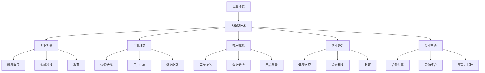
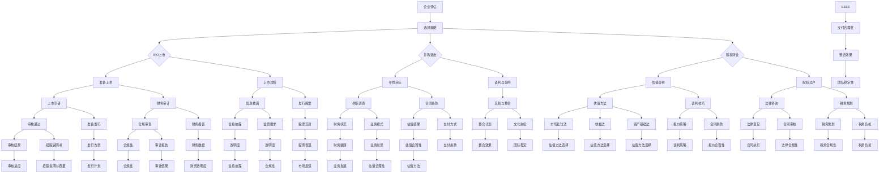

                 

## 第1章: 大模型时代的创业者概述

### 1.1 大模型时代的创业者背景

大模型时代的创业者面临着一个全新的创业环境。首先，数据获取变得更加容易和多样化。在大模型时代，大量的数据可以通过互联网和各种数据平台获取，这些数据不仅包括公开的数据，还包括私有数据，如社交媒体数据、用户行为数据等。这些数据为创业者提供了丰富的资源，使他们能够更好地了解用户需求和市场趋势。

其次，计算资源的获取也发生了显著变化。随着云计算和分布式计算技术的发展，创业者可以更方便地获得强大的计算能力。不再需要购买昂贵的硬件设备，创业者可以通过云计算平台按需获取计算资源，这使得创业者在开发复杂的大模型应用时具有更高的灵活性。

此外，商业模式的创新也随着大模型技术的普及而变得更加多样。大模型技术可以应用于各个领域，如金融、医疗、教育等，这为创业者提供了广泛的市场空间。例如，通过大模型技术，创业者可以开发出智能客服系统、个性化推荐系统、自动内容生成工具等，这些应用不仅能够提升用户体验，还能够为企业带来新的收入来源。

### 1.2 大模型与创业理念

在大模型时代，创业者的理念也需要相应更新。首先，快速迭代成为创业成功的必备条件。大模型技术的迭代速度非常快，创业者需要具备快速响应市场变化的能力。这意味着创业者需要采用敏捷开发方法，不断优化产品，以保持竞争优势。

其次，用户中心的理念在大模型时代尤为重要。大模型技术可以收集和分析大量用户数据，创业者可以利用这些数据来更好地了解用户需求，从而提供更个性化的服务。用户反馈也是快速迭代过程中不可或缺的一部分，创业者需要积极倾听用户的声音，不断改进产品。

此外，数据驱动的创业理念在大模型时代也得到了强化。创业者需要充分利用数据来指导决策，从市场需求分析到产品设计，再到营销策略，数据都扮演着重要的角色。数据驱动的决策不仅能够提高创业成功的概率，还能够帮助创业者更好地应对不确定性。

### 1.3 大模型技术对创业的支持

大模型技术为创业者提供了强有力的支持，主要体现在以下几个方面：

**算法优化**：大模型技术可以帮助创业者优化算法，提高产品性能。例如，通过使用深度学习算法，创业者可以开发出更精准的推荐系统，从而提高用户满意度和留存率。

**数据分析**：大模型技术强大的数据分析能力可以帮助创业者深入了解用户行为和市场趋势。通过对数据的深度挖掘，创业者可以发现新的商业机会，并制定更加有效的市场策略。

**产品创新**：大模型技术为创业者提供了丰富的创新空间。创业者可以利用大模型技术开发出全新的产品和服务，如智能医疗诊断系统、自动化交易系统、智能教育平台等。

### 1.4 大模型时代下的创业趋势

随着大模型技术的不断发展，创业领域也在发生显著变化。以下是一些主要趋势：

**健康医疗**：大模型技术在健康医疗领域的应用前景非常广阔。创业者可以利用大模型技术开发智能诊断系统、个性化治疗方案等，为用户提供更精准、高效的健康服务。

**金融科技**：大模型技术在金融科技领域的应用也日益成熟。创业者可以通过大模型技术开发出智能投顾、信用评估系统等，提高金融服务的效率和准确性。

**教育**：大模型技术在教育领域的应用正在改变传统教育模式。创业者可以利用大模型技术开发出个性化学习平台、智能辅导系统等，为用户提供更高效、个性化的教育服务。

**创业生态构建**：大模型技术的普及不仅为创业者提供了技术支持，也为创业生态的构建提供了契机。创业者可以通过合作、共享资源等方式，共同构建一个有利的创业生态系统，从而提高整个行业的竞争力。

### Mermaid 流程图：大模型与创业关系

下面是一个使用Mermaid绘制的流程图，展示了大模型技术如何与创业环境、创业机会、创业理念、技术赋能、创业趋势和创业生态构建之间的关系：

### 1.5 大模型时代创业者的挑战与机遇

#### 挑战：

1. **数据隐私与合规**：随着数据在大模型应用中的重要性日益增加，数据隐私和保护成为创业者的重大挑战。创业者需要确保用户数据的安全和合规，避免因数据泄露或违规操作而面临法律风险。

2. **模型解释性**：大模型通常具有高复杂性和不可解释性，这给创业者带来了理解和信任模型的挑战。提高模型的可解释性对于确保创业者、投资者和用户对模型信任至关重要。

3. **技术门槛**：大模型技术需要深厚的专业知识和技术积累，这对于很多初创企业来说是一个较大的门槛。创业者需要投入大量资源和时间来学习和掌握这些技术，这在一定程度上限制了创业的广度和深度。

#### 机遇：

1. **市场潜力**：大模型技术的广泛应用带来了巨大的市场潜力。例如，智能客服和推荐系统的应用已经在多个行业中展示了其商业价值，这为创业者提供了广阔的市场空间。

2. **创新空间**：大模型技术为创业者提供了丰富的创新空间。通过探索新的应用场景和业务模式，创业者可以开发出前所未有的产品和服务，满足用户不断变化的需求。

3. **资本关注**：随着大模型技术的快速发展，投资者对相关创业项目的关注度也在不断上升。创业者可以通过获得风险投资和资本市场的支持，加速企业的发展。

#### 1.6 总结

大模型技术为创业者带来了前所未有的机遇和挑战。创业者需要敏锐地把握市场动态，积极应对技术挑战，充分利用大模型技术带来的优势，实现创业目标。同时，创业者也需要关注数据隐私和合规问题，确保在快速发展的过程中保持可持续性。

### 1.1 大模型时代的创业者背景

#### 创业环境变化

在大模型时代，创业环境发生了显著变化。首先，数据获取变得更加容易和多样化。在传统创业环境中，数据的获取往往是有限的，创业者需要依靠市场调研和用户反馈来了解市场需求。然而，随着大数据技术和互联网的发展，创业者可以通过多种途径获取海量数据，这些数据不仅包括公开的数据，还包括社交媒体数据、用户行为数据等。这些数据为创业者提供了更全面的市场洞察，使他们能够更准确地预测市场趋势和用户需求。

其次，计算资源的获取也发生了巨大变化。在过去，创业者往往需要投入大量资金购买高性能的计算机硬件来支持数据处理和模型训练。然而，随着云计算和分布式计算技术的发展，创业者可以更便捷地获取强大的计算资源。通过云计算平台，创业者可以按需购买计算资源，避免了大量的硬件投资和维护成本。此外，分布式计算技术使得大规模数据处理变得更加高效和可靠，创业者可以利用这些技术处理和分析海量数据，从而提高产品的性能和用户体验。

最后，商业模式的创新也随着大模型技术的普及而变得更加多样。大模型技术可以应用于各个领域，如金融、医疗、教育等，这为创业者提供了广泛的市场空间。例如，通过大模型技术，创业者可以开发出智能客服系统、个性化推荐系统、自动内容生成工具等。这些应用不仅能够提升用户体验，还能够为企业带来新的收入来源。此外，大模型技术还可以帮助创业者发现新的商业机会，如通过分析用户数据，创业者可以发现潜在的市场需求，从而开发出满足这些需求的新产品和服务。

#### 大模型与创业机会

大模型技术的出现为创业者带来了许多新的商业机会。首先，在智能客服领域，大模型技术可以显著提高客服的效率和质量。通过使用自然语言处理技术，大模型可以理解用户的语言和意图，提供更加精准和个性化的服务。例如，亚马逊的Alexa和谷歌的Google Assistant等智能助手就是基于大模型技术开发的，它们能够回答用户的问题、提供建议和完成任务，大大提升了用户的使用体验。

其次，在推荐系统领域，大模型技术可以显著提升推荐的准确性和个性化程度。通过分析用户的购物历史、浏览行为和偏好，大模型可以预测用户可能感兴趣的商品和服务，从而提供个性化的推荐。例如，亚马逊和Netflix等公司通过使用大模型技术，能够向用户推荐他们可能感兴趣的商品和电影，提高了用户的满意度和留存率。

此外，大模型技术还在内容生成领域展示了巨大的潜力。通过使用生成对抗网络（GAN）和变分自编码器（VAE）等技术，大模型可以生成高质量的内容，如图像、音频和文本。这为创业者提供了新的商业模式，如自动内容生成、虚拟现实和增强现实等。例如，DeepMind的AlphaGo通过大模型技术实现了在围棋领域的突破，从而引起了广泛关注。

#### 1.2 大模型与创业理念

在大模型时代，创业者的理念也需要相应更新。首先，快速迭代成为创业成功的必备条件。大模型技术的迭代速度非常快，创业者需要具备快速响应市场变化的能力。这意味着创业者需要采用敏捷开发方法，不断优化产品，以保持竞争优势。通过快速迭代，创业者可以及时获取用户反馈，发现并解决产品问题，从而提高产品的质量和用户满意度。

其次，用户中心的理念在大模型时代尤为重要。大模型技术可以收集和分析大量用户数据，创业者可以利用这些数据来更好地了解用户需求，从而提供更个性化的服务。用户反馈也是快速迭代过程中不可或缺的一部分，创业者需要积极倾听用户的声音，不断改进产品。通过用户中心的理念，创业者可以建立更紧密的用户关系，提高用户的忠诚度和满意度。

此外，数据驱动的创业理念在大模型时代也得到了强化。创业者需要充分利用数据来指导决策，从市场需求分析到产品设计，再到营销策略，数据都扮演着重要的角色。数据驱动的决策不仅能够提高创业成功的概率，还能够帮助创业者更好地应对不确定性。通过数据分析和挖掘，创业者可以发现新的商业机会，优化产品和服务，提高企业的竞争力。

总之，在大模型时代，创业者需要具备快速迭代、用户中心和数据驱动等新的创业理念，以应对快速变化的市场环境和技术进步，实现创业目标。

#### 1.3 大模型技术对创业的支持

大模型技术为创业提供了全方位的支持，极大地促进了创新和商业价值的实现。首先，大模型技术在**算法优化**方面发挥了关键作用。传统的算法优化往往依赖于手动调参和经验，而大模型通过自我学习和优化，可以自动调整参数，提高算法的准确性和效率。例如，在金融领域，大模型可以优化交易算法，实现更精准的市场预测和更高效的交易决策。

其次，大模型技术在**数据分析**方面提供了强大的工具。传统的数据分析方法依赖于人工干预，而大模型可以自动处理和分析海量数据，提取有价值的信息。在医疗领域，大模型可以通过分析患者的电子健康记录，识别疾病风险，提供个性化的治疗方案。在市场营销中，大模型可以分析消费者行为，预测购买趋势，从而帮助企业制定更有效的营销策略。

此外，大模型技术在**产品创新**方面具有巨大的潜力。大模型可以生成新的创意和设计方案，帮助创业者突破传统的思维模式。例如，在设计领域，大模型可以生成新颖的时尚设计，为设计师提供灵感和参考。在娱乐产业，大模型可以生成音乐、电影剧本等创意内容，推动文化产业的创新发展。

以下是一个具体的大模型产品创新案例：

**案例：** 一个创业团队开发了一款基于大模型技术的个性化健身应用。该应用利用用户的数据（如年龄、体重、运动偏好等），通过深度学习算法分析用户的身体状况和健身目标，生成个性化的健身计划。该应用不仅提供了科学的锻炼方案，还通过实时监控用户的运动数据，调整训练计划，确保用户能够安全有效地达到健身目标。这个案例展示了大模型技术在产品创新中的应用，为用户提供了更加个性化的服务和更好的用户体验。

总之，大模型技术通过算法优化、数据分析和产品创新，为创业提供了强有力的支持，极大地推动了创业的发展和成功。

#### 1.4 大模型时代下的创业趋势

随着大模型技术的不断发展和成熟，创业领域也迎来了新的趋势。首先，**创业领域的演变**受到大模型技术的深刻影响。许多传统行业正在经历数字化转型，大模型技术在这些行业的应用场景越来越广泛。例如，在健康医疗领域，大模型技术被用于疾病预测、个性化治疗和药物研发，极大地提高了医疗服务的效率和准确性。在金融科技领域，大模型技术被用于信用评估、风险管理和投资决策，为金融行业带来了新的增长点。

其次，**创业生态的构建**也受到了大模型技术的推动。创业生态系统是一个多元化的网络，包括创业者、投资者、技术提供商、学术机构等。在大模型时代，创业生态系统中的各个参与者可以通过合作和共享资源，共同推动创新和商业成功。例如，一些大型的科技公司如谷歌、微软和亚马逊，不仅为创业者提供技术支持，还建立了创业孵化器和加速器，为创业者提供资金、培训和市场资源。

此外，**创业者的角色也在发生变化**。在大模型时代，创业者不仅需要具备商业头脑，还需要具备技术能力和数据分析能力。大模型技术要求创业者具备深厚的数学和计算机科学背景，以便能够理解并利用这些技术。同时，创业者还需要具备快速学习和适应变化的能力，因为大模型技术的发展速度非常快，创业者需要不断更新自己的知识体系。

总之，大模型时代下的创业趋势表现为创业领域向高科技领域扩展，创业生态系统的建立和参与者角色的变化。这些趋势为创业者提供了新的机遇和挑战，需要创业者具备更高的综合素质和创新能力，以适应快速变化的市场环境。

#### 1.5 大模型时代创业者的挑战与机遇

在大模型时代，创业者面临着一系列独特的挑战与机遇。首先，**数据隐私与合规**是一个重要挑战。随着大模型技术的应用，创业者需要处理海量用户数据，这涉及到数据保护和个人隐私的问题。为了遵守相关法律法规，如《通用数据保护条例》（GDPR），创业者需要建立完善的数据保护机制，确保用户数据的匿名化和安全存储。这不仅需要技术手段，还需要严格的法律和伦理规范。

其次，**模型解释性**是一个关键挑战。大模型通常非常复杂，其决策过程往往缺乏透明性，这给创业者带来了理解和信任模型的困难。为了提高模型的解释性，创业者需要开发可解释性算法，使模型决策过程更加清晰和可追溯。这不仅有助于提高用户的信任度，还能帮助创业者优化模型，减少潜在的风险。

此外，**技术门槛**也是一个显著挑战。大模型技术需要创业者具备深厚的数学、计算机科学和机器学习知识。对于许多初创企业来说，招聘和培养这样的专业人才是一个巨大的挑战。为了降低技术门槛，创业者可以采取多种策略，如与学术机构合作、利用开源工具和平台、以及采用云计算服务，以便更快地掌握和应用大模型技术。

然而，大模型时代也为创业者提供了丰富的机遇。首先，**市场潜力**巨大。大模型技术的应用正在各个行业迅速扩展，从金融到医疗，从零售到教育，都出现了新的商业机会。创业者可以通过开发基于大模型技术的产品和服务，满足市场需求，实现商业价值。

其次，**创新空间**广阔。大模型技术为创业者提供了无限的创意空间，使他们能够探索新的应用场景和商业模式。例如，通过大模型技术，创业者可以开发出智能客服系统、个性化推荐平台、自动内容生成工具等，为用户提供全新的体验和服务。

最后，**资本关注**不断提升。随着大模型技术的快速发展，投资者对相关领域的兴趣也越来越高。创业者可以通过吸引风险投资和资本市场支持，加速企业的发展，实现快速扩张。

综上所述，大模型时代为创业者带来了前所未有的机遇和挑战。创业者需要积极应对挑战，抓住机遇，以实现长期的商业成功。

#### 1.6 总结

大模型时代为创业者带来了前所未有的机遇和挑战。创业者需要敏锐地把握市场动态，积极应对技术挑战，充分利用大模型技术带来的优势，实现创业目标。同时，创业者也需要关注数据隐私和合规问题，确保在快速发展的过程中保持可持续性。通过不断学习和适应，创业者可以在这个时代中脱颖而出，开创出新的商业奇迹。

### 第2章: 大模型时代下的IPO上市策略

#### 2.1 IPO上市的基本概念

IPO（Initial Public Offering，首次公开募股）是指一家企业首次将股票公开发行，以便在公开市场上进行交易。IPO上市对企业而言具有重要意义，它不仅能够为企业带来资金，还能提升企业的品牌知名度和市场地位。以下是IPO上市的基本概念：

**IPO上市的定义**：IPO上市是指一家私人企业通过公开发行股票，将其变为公众公司，从而在股票交易所上市的过程。这一过程中，企业会聘请投资银行等金融机构担任承销商，协助企业完成股票发行和上市。

**IPO上市的流程**：IPO上市的流程通常包括以下几个阶段：

1. **准备阶段**：企业在决定进行IPO之前，需要进行充分的准备工作，包括财务审计、法律审核、商业战略规划等。

2. **申报阶段**：企业向证券监管机构提交IPO申请文件，包括招股说明书、财务报表、公司章程等。

3. **审核阶段**：证券监管机构对企业的申请进行审核，确保企业符合上市条件，并符合相关法律法规。

4. **发行阶段**：一旦审核通过，企业会与承销商签订承销协议，确定发行价格和发行规模。然后，企业会通过承销商向投资者发售股票，筹集资金。

#### 2.2 IPO上市的条件与标准

IPO上市对企业的财务状况、法律合规和公司治理等方面都有严格的要求。以下是IPO上市的主要条件和标准：

**财务条件**：企业需要满足一定的财务指标，例如：

- **净利润**：企业通常需要连续几年保持盈利，且净利润达到一定水平。
- **市值**：企业的市值需要在IPO前达到一定规模，以吸引投资者的关注。
- **收入**：企业需要具备稳定的收入来源，且收入增长率达到一定水平。

**法律与合规条件**：企业需要符合相关的法律法规，包括：

- **公司治理**：企业需要建立完善的组织结构和公司治理机制，确保股东权益。
- **股权结构**：企业的股权结构需要清晰，不存在重大的股权纠纷。
- **信息披露**：企业需要按照监管要求，及时、准确地披露财务状况、业务进展等重要信息。

#### 2.3 大模型企业在IPO上市中的特殊考虑

大模型企业在IPO上市过程中面临一些特殊考虑，主要涉及**技术成熟度**、**数据隐私与合规性**等方面。

**技术成熟度**：大模型企业需要证明其技术已经达到一定水平，能够稳定地支持业务运营和持续发展。这包括模型的可靠性、性能、扩展性等方面。企业在IPO申请文件中，需要详细阐述其技术架构、算法原理和研发团队等。

**数据隐私与合规性**：由于大模型技术涉及大量用户数据，企业需要确保数据处理符合相关法律法规，特别是数据隐私保护法规。企业需要制定严格的数据保护政策，包括数据的收集、存储、使用和销毁等方面。此外，企业还需要在IPO申请文件中详细说明其数据隐私保护措施，以增强投资者的信任。

以下是一个具体的大模型企业在IPO上市中的特殊考虑案例：

**案例**：某家大模型企业在准备IPO上市时，发现其业务依赖于大量用户数据，这涉及到数据隐私和保护问题。为了满足上市要求，企业采取了以下措施：

1. **数据加密**：企业对用户数据进行加密处理，确保数据在传输和存储过程中的安全性。
2. **隐私政策**：企业更新了隐私政策，明确告知用户其数据的使用目的和范围，并获得用户的明确同意。
3. **合规性审计**：企业聘请第三方审计机构进行合规性审计，确保其数据处理符合相关法律法规。

通过这些措施，企业成功地满足了IPO上市的要求，并在股票交易所成功上市。

#### 2.4 大模型企业的IPO上市案例

在探讨大模型企业的IPO上市时，可以参考一些成功和失败的案例，从中提取经验和教训。

**成功案例**：某家专注于自然语言处理的大模型企业在2019年成功在美国纳斯达克上市。以下是该企业IPO上市的成功经验：

1. **技术创新**：企业拥有先进的自然语言处理技术，能够提供高效的文本分析和理解服务。
2. **市场前景**：企业准确预测了自然语言处理技术在未来几年的广泛应用，吸引了大量投资者。
3. **财务稳健**：企业在上市前连续几年保持盈利，且收入增长率稳定，提高了投资者的信心。

**失败案例**：另一家大模型企业在2020年尝试IPO上市，但最终未能成功。以下是该企业IPO上市的失败原因：

1. **技术不成熟**：企业虽然在人工智能领域有所涉猎，但其技术尚未达到成熟水平，无法满足市场的需求。
2. **市场环境**：在上市过程中，市场环境发生了变化，投资者对大模型技术的前景产生了质疑。
3. **财务风险**：企业在上市前的财务状况不够稳健，净利润和收入增长率较低，引发了投资者的担忧。

通过对比成功和失败的案例，可以发现，大模型企业在IPO上市时需要注重技术创新、市场前景和财务稳健性，同时应对外部环境的变化，以增强投资者的信心。

#### 2.5 IPO上市的优势与风险

**优势**：

1. **融资能力**：IPO上市是企业获取资金的重要途径。通过公开发行股票，企业可以迅速筹集大量资金，用于业务扩张、技术升级和市场推广。
2. **品牌提升**：IPO上市有助于提高企业的品牌知名度。公众公司的身份可以增加企业的信誉，吸引更多客户和合作伙伴。
3. **管理优化**：IPO上市后，企业需要遵守更为严格的监管要求，这有助于提升企业的管理水平，优化公司治理结构。

**风险**：

1. **市场波动**：股票市场的波动可能对企业的市值产生影响，导致企业的财务状况不稳定。
2. **财务压力**：持续通过公开市场筹集资金可能增加企业的财务压力，影响企业的运营和发展。
3. **监管压力**：IPO上市后，企业需要面对更为严格的监管要求，包括信息披露、财务审计等，这可能会增加企业的运营成本。

总之，IPO上市是一种重要的创业退出方式，但同时也伴随着较高的风险。企业在决定IPO上市时，需要全面评估自身情况，权衡利弊，做出明智的决策。

#### 2.6 总结

IPO上市是大模型企业在资本市场上实现跨越的重要途径，但同时也伴随着较高的风险。创业者需要根据自己的实际情况，全面评估IPO上市的优势和风险，制定详细的上市策略。同时，企业应注重技术创新、市场前景和财务稳健性，以提高IPO上市的成功概率。

### 第3章: 并购退出策略

#### 3.1 并购退出的基本概念

并购退出（Mergers and Acquisitions, M&A）是指企业通过购买另一家企业的全部或部分股权或资产，从而实现对目标企业的控制或合并。并购退出是创业者实现资本回报和企业价值最大化的一种重要方式。以下是并购退出的基本概念：

**并购的定义**：并购是指两个或多个企业通过合并、收购等方式实现资本整合的过程。并购可以采取多种形式，包括全股收购、部分股权收购、资产收购等。

**并购退出的目的**：并购退出的主要目的是实现资本回报和企业价值的最大化。通过并购，创业者可以在短时间内实现资金变现，同时提高企业的市场地位和品牌价值。

**并购退出的方式**：并购退出通常有以下几种方式：

1. **全股收购**：购买目标企业的全部股份，从而实现对目标企业的完全控制。
2. **部分股权收购**：购买目标企业的一部分股份，从而获得一定程度的控制权。
3. **资产收购**：购买目标企业的特定资产或业务，而不涉及股份的转让。

#### 3.2 并购退出的优势与策略

并购退出具有多种优势，同时需要创业者制定合理的策略以实现成功退出。

**优势**：

1. **快速变现**：并购退出可以在较短时间内实现资金变现，相比IPO上市和股权转让，并购退出的流程更加快速。
2. **资产增值**：通过并购，企业可以获取目标企业的优质资产，提高整体资产价值。
3. **品牌提升**：并购可以带来品牌效应，提高企业的市场地位和品牌知名度。

**策略**：

1. **选择合适的目标公司**：创业者需要选择具有潜力、符合自身战略目标的目标公司。在并购过程中，创业者应重点考察目标公司的财务状况、业务模式、市场前景等方面。

2. **谈判技巧**：并购谈判是并购退出的关键环节。创业者需要掌握谈判技巧，包括估值、支付方式、合同条款等方面，以确保谈判成功。

3. **尽职调查**：尽职调查是并购退出的重要步骤，通过全面调查目标公司的财务、法律、业务等方面，确保并购决策的准确性和安全性。

#### 3.3 并购退出的风险与管理

尽管并购退出具有诸多优势，但同时也伴随着一定的风险。创业者需要全面评估和管理这些风险，以确保并购退出的顺利进行。

**风险**：

1. **财务风险**：并购可能需要大量资金投入，如果目标公司财务状况不佳，可能导致财务风险。
2. **法律风险**：并购涉及的法律问题可能增加风险，如股权纠纷、合同条款等问题。
3. **运营风险**：并购后可能面临运营整合的挑战，包括人员、业务和文化等方面的整合。

**管理**：

1. **财务风险管理**：创业者需要制定详细的财务计划，评估并购的资金需求和资金来源，确保资金充足。
2. **法律风险管理**：创业者应聘请专业的法律顾问，进行全面的尽职调查，确保并购的法律合规性。
3. **运营风险管理**：在并购过程中，创业者需要制定详细的整合计划，包括人员调配、业务整合和文化融合等方面，确保并购后运营的稳定和高效。

#### 3.4 并购退出案例分析

以下是一些并购退出的成功和失败案例，通过分析这些案例，可以提取出成功经验和失败教训。

**成功案例**：

1. **阿里巴巴收购优酷**：2015年，阿里巴巴以约45亿美元的价格收购了优酷土豆，这是一次成功的并购退出。成功原因包括：
   - **战略契合**：阿里巴巴与优酷土豆的业务模式具有互补性，能够实现资源整合。
   - **财务稳健**：阿里巴巴在收购前进行了详细的财务评估，确保了资金的充足。
   - **文化融合**：阿里巴巴在并购后成功实现了文化融合，保持了优酷土豆的独立运营。

2. **微软收购LinkedIn**：2016年，微软以260亿美元的价格收购了LinkedIn，这是微软历史上最大的收购之一。成功原因包括：
   - **市场前景**：LinkedIn在职业社交领域具有巨大的市场潜力，与微软的业务模式互补。
   - **数据资源**：LinkedIn的用户数据为微软提供了宝贵的数据资源，有助于微软在人工智能和大数据领域的创新。

**失败案例**：

1. **京东收购1号店**：2014年，京东以7.5亿美元的价格收购了1号店，但此次并购最终未能成功。失败原因包括：
   - **战略不一致**：京东与1号店在业务战略上存在差异，并购后的整合困难。
   - **文化冲突**：并购后，京东与1号店在企业文化上存在较大冲突，导致运营效率低下。
   - **财务压力**：京东在收购1号店后，面临较大的财务压力，影响了其后续发展。

2. **谷歌收购Waze**：2013年，谷歌以40亿美元的价格收购了地图应用Waze，但此次并购最终未能实现预期目标。失败原因包括：
   - **技术整合**：Waze的技术与谷歌的地图服务存在竞争关系，并购后难以实现技术整合。
   - **用户隐私**：Waze的用户数据涉及隐私问题，谷歌在处理用户数据方面面临法律和道德挑战。
   - **市场反应**：市场对谷歌收购Waze的反应不佳，导致谷歌的股价出现波动。

通过分析这些并购案例，创业者可以从中学习到成功经验和失败教训，制定更加有效的并购退出策略。

#### 3.5 总结

并购退出是一种重要的创业退出方式，具有快速变现、资产增值和品牌提升等优势。然而，并购退出也伴随着财务、法律和运营等风险。创业者需要全面评估和管理这些风险，制定合理的并购退出策略，以提高并购退出的成功率。通过学习成功和失败的并购案例，创业者可以更好地把握并购退出的机遇和挑战。

### 第4章: 股权转让策略

#### 4.1 股权转让的基本概念

股权转让是指企业股东将其所持有的股份或股权出售给其他股东或第三方投资者的过程。股权转让是创业者实现资本退出的一种常见方式，具有灵活性和高效性。以下是股权转让的基本概念：

**股权转让的定义**：股权转让是指企业股东将其所持有的股份或股权按一定比例和条件出售给其他股东或第三方投资者的行为。股权转让可以是部分股权转让，也可以是全部股权转让。

**股权转让的目的**：股权转让的主要目的是实现股东资本的退出或调整股权结构。创业者通过股权转让可以实现以下目的：
- **资本变现**：通过股权转让，股东可以将股份转化为现金，实现资本回报。
- **股权结构调整**：通过转让部分股权，股东可以调整股权结构，实现企业治理优化。
- **引入战略投资者**：通过股权转让，企业可以引入战略投资者，获得资金支持和技术资源。

**股权转让的方式**：股权转让通常有以下几种方式：
- **协议转让**：股东之间通过签订股权转让协议，明确股权转让的具体条款，如股权转让比例、价格、支付方式等。
- **公开转让**：股东通过证券交易所或其他公开交易平台，将股份公开挂牌转让，吸引投资者竞价购买。
- **股东会决议转让**：股东通过股东会决议，将股权转让给其他股东或第三方投资者。

#### 4.2 股权转让的优势与策略

股权转让具有以下优势：

**优势**：

1. **灵活性**：股权转让具有较高的灵活性，可以根据市场需求和股东意愿进行调整。股东可以根据自身的资金需求、发展战略等，灵活选择转让方式和转让比例。
2. **高效性**：股权转让的流程相对简单，通常不需要经过复杂的审批程序，可以快速完成股权变更。
3. **成本效益**：相比IPO和并购退出，股权转让通常成本较低，适合中小企业和初创企业的资本退出需求。

**策略**：

1. **估值方法**：在进行股权转让前，股东需要对股权进行合理估值，确保转让价格的公允性。常见的估值方法包括市场比较法、收益法和资产基础法等。股东可以根据企业的实际情况选择合适的估值方法。

2. **谈判技巧**：股权转让的谈判是关键环节，股东需要掌握一定的谈判技巧，包括报价策略、合同条款的拟定和沟通技巧等。合理的谈判技巧有助于达成双方满意的价格和条件。

3. **法律咨询**：股权转让涉及法律问题，如股权协议、合同条款、股权变更登记等。股东在股权转让过程中应寻求专业法律咨询，确保股权转让的合法性和合规性。

#### 4.3 股权转让的风险与管理

股权转让虽然具有优势，但也存在一定的风险：

**风险**：

1. **市场波动风险**：股权市场的波动可能影响转让价格，导致股权转让收益不理想。
2. **法律风险**：股权转让涉及的法律问题可能增加风险，如股权纠纷、合同违约等。
3. **税务风险**：股权转让可能涉及税务问题，如资本利得税、印花税等，股东需要合理规划税务负担。

**管理**：

1. **税务规划**：股东在进行股权转让前，应进行税务规划，选择合适的税务筹划方案，以降低税务负担。例如，可以通过递延纳税、减免税等政策进行税务优化。

2. **法律咨询**：股东在股权转让过程中，应寻求专业法律咨询，确保股权转让的合法性和合规性。法律顾问可以提供法律意见，协助股东制定股权转让协议，防范法律风险。

3. **风险评估**：股东在进行股权转让前，应对市场风险、法律风险和税务风险进行全面评估，制定相应的风险管理策略。例如，可以通过签订履约担保、设置违约责任等手段，降低风险。

#### 4.4 股权转让案例分析

以下是一些股权转让的成功和失败案例，通过分析这些案例，可以提取出成功经验和失败教训。

**成功案例**：

1. **阿里巴巴集团**：阿里巴巴集团在2014年进行了多次股权转让，引入了战略投资者，如日本软银和美国的私募股权基金。这些股权转让不仅为阿里巴巴带来了大量资金，还提升了其品牌价值和市场地位。成功原因包括：
   - **合理的估值**：阿里巴巴对股权进行了合理的估值，确保了转让价格的公允性。
   - **选择合适的投资者**：阿里巴巴选择了具有战略价值的投资者，这些投资者为阿里巴巴带来了资金和技术支持。
   - **法律和税务规划**：阿里巴巴在股权转让过程中进行了详细的法律和税务规划，确保了交易的合法性和税务优化。

2. **美团点评**：美团点评在2015年进行了股权转让，引入了腾讯等投资者。这次股权转让为美团点评带来了大量资金，助力其业务拓展和市场份额提升。成功原因包括：
   - **业务协同**：腾讯与美团点评的业务具有协同效应，通过合作，双方实现了资源共享和业务拓展。
   - **合理的估值**：美团点评对股权进行了合理的估值，确保了转让价格的合理性。
   - **专业的法律和财务顾问**：美团点评在股权转让过程中，聘请了专业的法律和财务顾问，确保了交易的合规性和有效性。

**失败案例**：

1. **乐视网**：乐视网在2016年进行了多次股权转让，但由于经营不善和财务问题，最终未能成功。这次股权转让失败的原因包括：
   - **估值过高**：乐视网在股权转让过程中，对股权估值过高，导致投资者兴趣不足。
   - **业务困境**：乐视网在股权转让前，已陷入严重的业务困境和财务危机，影响了投资者的信心。
   - **法律和税务问题**：乐视网在股权转让过程中，未能妥善处理法律和税务问题，增加了交易的风险。

2. **当当网**：当当网在2010年进行了股权转让，但最终未能成功。这次股权转让失败的原因包括：
   - **谈判破裂**：当当网与投资者在转让价格和条件上未能达成一致，导致谈判破裂。
   - **市场环境**：当时电商市场环境竞争激烈，当当网的估值受到较大影响，影响了股权转让的成功。
   - **法律问题**：当当网在股权转让过程中，存在一定的法律问题，影响了交易的顺利进行。

通过分析这些股权转让案例，创业者可以从中学习到成功经验和失败教训，制定更加有效的股权转让策略。

#### 4.5 总结

股权转让是一种灵活、高效的创业退出方式，具有多种优势。然而，股权转让也伴随着一定的风险。创业者需要全面评估和管理这些风险，制定合理的股权转让策略，确保股权转让的顺利进行。通过学习成功和失败的股权转让案例，创业者可以更好地把握股权转让的机遇和挑战，实现资本的顺利退出。

### 第5章: 创业者退出策略综合评估

#### 5.1 退出策略的选择

创业者选择退出策略时需要考虑多个因素，以下是一些主要因素及如何进行评估：

**财务状况**：企业的财务状况是决定退出策略的关键因素之一。创业者需要评估企业的盈利能力、现金流状况、负债水平等。如果企业财务状况良好，选择IPO上市或并购退出可能较为合适；如果财务状况不佳，股权转让可能是一个较为保守的选择。

**市场环境**：市场环境的变化对退出策略的选择具有重要影响。在市场繁荣时期，IPO和并购退出的成功率较高，而在市场不景气时，这些策略可能面临更多挑战。创业者需要分析市场趋势、竞争态势和行业前景，以确定最合适的退出策略。

**企业估值**：企业估值是影响退出策略选择的另一个重要因素。创业者需要评估企业的市场估值、潜在增长率、竞争优势等。如果企业估值较高，IPO上市可能是一个较好的选择；如果估值较低，并购退出可能更为实际。

**个人目标**：创业者的个人目标也是选择退出策略的重要因素。一些创业者可能追求财务回报，而另一些可能希望继续参与企业的管理和成长。创业者需要根据自己的职业规划和生活目标，选择最合适的退出策略。

**时间要求**：创业者也需要考虑退出策略的时间要求。IPO和并购退出通常需要较长时间来准备和实施，而股权转让则相对较快。创业者需要根据时间要求选择适合的退出策略。

**评估方法**：

- **成本效益分析**：通过比较不同退出策略的成本和潜在收益，进行成本效益分析，选择成本较低、收益较高的策略。
- **风险评估**：对每种退出策略进行风险评估，评估其成功概率和可能的风险，选择风险较低、成功率较高的策略。
- **情境分析**：模拟不同市场环境和业务场景，分析每种退出策略的适应性和效果，选择适应性强、效果好的策略。

#### 5.2 退出策略的优缺点比较

以下是三种主要退出策略的优缺点比较：

**IPO上市**：

- **优点**：
  - **融资能力**：IPO上市可以为企业提供大量资金，助力企业扩张。
  - **品牌提升**：IPO上市有助于提高企业的品牌知名度和市场地位。
  - **管理优化**：IPO上市后，企业需要遵守严格的监管要求，有助于提升企业的管理水平。

- **缺点**：
  - **上市成本**：IPO上市需要投入大量时间和资源，包括财务审计、法律审核、承销费用等。
  - **市场波动**：股票市场的波动可能影响企业的市值，带来财务风险。
  - **监管压力**：IPO上市后，企业需要面对更严格的监管要求，包括信息披露、财务审计等。

**并购退出**：

- **优点**：
  - **快速变现**：并购退出可以在较短时间内实现资本回报。
  - **资产增值**：并购退出可以通过获取优质资产，提高企业的整体价值。
  - **品牌提升**：并购退出可以借助目标企业的品牌和市场地位，提高自身品牌知名度。

- **缺点**：
  - **并购成本**：并购退出需要支付较高的并购费用，包括购买价格、法律顾问费用、尽职调查费用等。
  - **整合困难**：并购退出后，企业需要面对整合目标企业的挑战，包括人员、业务和文化等方面的整合。
  - **法律风险**：并购退出可能涉及法律纠纷和合同违约等问题。

**股权转让**：

- **优点**：
  - **灵活性**：股权转让具有较高的灵活性，可以根据市场需求和股东意愿进行调整。
  - **高效性**：股权转让的流程相对简单，通常不需要经过复杂的审批程序。
  - **成本效益**：相比IPO和并购退出，股权转让通常成本较低。

- **缺点**：
  - **市场波动风险**：股权市场的波动可能影响转让价格，导致股权转让收益不理想。
  - **法律风险**：股权转让涉及的法律问题可能增加风险，如股权纠纷、合同违约等。
  - **税务风险**：股权转让可能涉及税务问题，如资本利得税、印花税等。

#### 5.3 退出策略的动态调整

创业者的退出策略不是一成不变的，而是需要根据外部环境和内部情况的变化进行动态调整。以下是一些动态调整的考虑因素：

**市场变化**：市场环境的变化会对创业者的退出策略产生重要影响。例如，市场繁荣时期，IPO和并购退出的成功率较高；而市场不景气时，这些策略可能面临更多挑战。创业者需要密切关注市场动态，及时调整退出策略。

**企业状况**：企业的财务状况、业务模式、市场地位等因素也会影响退出策略的选择。如果企业财务状况良好，选择IPO上市可能更为合适；如果业务模式具有较强竞争力，并购退出可能更为有利。创业者需要根据企业的实际情况，灵活调整退出策略。

**个人目标**：创业者的个人目标也是动态调整的重要因素。如果创业者希望继续参与企业的管理和成长，可以选择相对保守的退出策略；如果创业者追求财务回报，可以选择更为激进的退出策略。创业者需要根据自己的职业规划和生活目标，动态调整退出策略。

**风险偏好**：不同创业者对风险的偏好程度不同。一些创业者可能愿意承担较高的风险，选择IPO上市或并购退出；而另一些创业者可能更倾向于相对稳健的股权转让策略。创业者需要根据自己的风险偏好，调整退出策略。

**调整方法**：

- **定期评估**：创业者应定期对退出策略进行评估，分析市场变化、企业状况和个人目标等因素，及时调整策略。
- **情景模拟**：通过情景模拟，创业者可以预测不同策略在不同市场环境下的效果，从而选择最合适的策略。
- **灵活调整**：创业者应根据实际情况，灵活调整退出策略，确保策略与市场需求和企业状况相匹配。

#### 5.4 案例分析

以下是通过具体案例分析不同退出策略的选择和效果：

**案例1：某互联网金融公司选择IPO上市**：

- **背景**：该公司是一家专注于互联网金融服务的公司，业务模式新颖，市场前景广阔。
- **策略选择**：经过评估，公司决定选择IPO上市，以获得大量资金支持业务扩张。
- **效果**：IPO上市后，公司成功融资数亿美元，品牌知名度大幅提升，业务拓展迅速，实现了高速增长。
- **经验**：该公司通过IPO上市，不仅获得了资金支持，还提高了品牌价值和市场地位，为后续发展奠定了坚实基础。

**案例2：某医疗科技公司选择并购退出**：

- **背景**：该公司是一家专注于医疗科技研发的企业，拥有核心技术和专利。
- **策略选择**：由于公司希望快速变现，同时提升品牌价值，选择将公司出售给一家大型制药企业。
- **效果**：并购退出后，公司获得了高额的现金回报，同时借助制药企业的资源和市场渠道，进一步拓展业务。
- **经验**：并购退出帮助公司实现了快速变现，同时也为后续业务发展提供了有力支持。

**案例3：某电子商务公司选择股权转让**：

- **背景**：该公司是一家电子商务企业，市场占有率较高，但面临激烈的市场竞争。
- **策略选择**：由于公司希望通过股权转让引入战略投资者，提升市场竞争力，选择与一家大型电商平台进行股权合作。
- **效果**：股权转让后，公司成功引入了战略投资者，获得了资金支持和市场资源，业务发展更加稳健。
- **经验**：股权转让帮助公司实现了资本注入，提升了市场竞争力，为后续发展提供了有力保障。

通过以上案例分析，可以看出，不同的退出策略在不同市场环境和企业状况下具有不同的效果。创业者需要根据自身情况，灵活选择和调整退出策略，以实现最佳效果。

#### 5.5 总结

创业者退出策略的选择和调整是一个复杂的过程，需要综合考虑多种因素，包括财务状况、市场环境、企业估值和个人目标等。不同的退出策略具有各自的优缺点，创业者需要根据实际情况进行选择和调整。通过定期评估、情景模拟和灵活调整，创业者可以确保退出策略与市场需求和企业状况相匹配，实现最佳效果。

### 第6章: 创业者退出策略的案例分析

#### 6.1 案例背景

本章节将通过具体案例，深入分析不同创业者在不同市场环境和创业阶段选择不同退出策略的过程，以展示各种策略的实际操作和效果。

**案例1：某人工智能初创公司（AI Start-Up）**

- **企业简介**：该初创公司成立于2017年，专注于开发基于深度学习技术的智能图像识别软件。公司由三位年轻的计算机科学家创立，团队成员具有丰富的学术和工业经验。
- **市场环境**：2017年至2020年，人工智能领域处于快速增长阶段，相关技术受到广泛关注。然而，市场也充满竞争，许多知名企业也在积极布局人工智能领域。
- **退出策略选择**：在经过市场调研和内部讨论后，公司决定选择IPO上市作为其退出策略。公司认为，通过IPO上市，可以迅速筹集大量资金，进一步拓展业务，并提高品牌知名度。

**案例2：某区块链初创公司（Blockchain Start-Up）**

- **企业简介**：该初创公司成立于2018年，专注于开发基于区块链技术的去中心化金融解决方案。公司由一群年轻的区块链专家组成，具有丰富的区块链项目开发和运营经验。
- **市场环境**：2018年至2020年，区块链技术逐渐受到市场关注，但同时也面临监管和政策的不确定性。市场环境波动较大，投资者对区块链项目的风险认知不一。
- **退出策略选择**：考虑到市场环境和公司的实际状况，公司决定选择并购退出。公司通过与一家大型区块链公司进行洽谈，最终达成协议，将公司整体出售给该大型公司。

**案例3：某电子商务初创公司（E-commerce Start-Up）**

- **企业简介**：该初创公司成立于2015年，专注于提供定制化电子商务解决方案，帮助中小企业建立线上销售渠道。公司由一位经验丰富的电商企业家创立，团队成员具有丰富的电商运营和营销经验。
- **市场环境**：2015年至2020年，电子商务市场持续增长，但竞争也日益激烈。随着移动互联网的普及，消费者购物习惯发生了显著变化，对电子商务平台提出了更高的要求。
- **退出策略选择**：在经过多次谈判和考虑后，公司决定选择股权转让。公司通过与一家大型电商平台进行洽谈，最终成功将公司全部股权转让给该电商平台，实现了资本退出。

#### 6.2 退出策略选择

在上述案例中，不同的创业公司根据自身情况和市场环境，选择了不同的退出策略。以下是每种策略的具体选择过程：

**案例1：IPO上市**

- **决策过程**：
  - **市场调研**：公司在决定IPO上市前，进行了详细的市场调研，分析了人工智能领域的市场前景、竞争对手和投资者需求。
  - **财务评估**：公司对其财务状况进行了全面评估，包括净利润、收入增长率、现金流等关键财务指标，以确保符合IPO上市的要求。
  - **法律和合规审查**：公司聘请了专业的法律顾问，进行了法律和合规审查，确保满足IPO上市的各项法律法规要求。

- **实施效果**：
  - **融资成功**：公司在IPO上市后，成功筹集了数千万美元的资金，用于业务拓展、研发投入和市场推广。
  - **品牌提升**：IPO上市提高了公司的品牌知名度，吸引了更多客户和合作伙伴。
  - **管理优化**：IPO上市后，公司需要遵守更严格的监管要求，提升了公司的管理水平和管理规范。

**案例2：并购退出**

- **决策过程**：
  - **市场分析**：公司分析了区块链市场的波动性和监管环境，认为市场环境不确定性较高，IPO上市风险较大。
  - **并购洽谈**：公司通过与多家大型区块链公司进行洽谈，寻找合适的并购对象，最终选择了一家在区块链领域具有领先地位的大型公司。
  - **尽职调查**：公司进行了详细的尽职调查，包括目标公司的财务状况、业务模式、技术实力等，以确保并购决策的准确性。

- **实施效果**：
  - **快速变现**：并购退出使得公司能够在短时间内实现资本回报，获得高额的现金收益。
  - **业务整合**：公司通过与并购对象的整合，实现了技术、市场和资源的共享，提升了整体竞争力。
  - **品牌影响**：并购退出后，公司借助并购对象的品牌和市场影响力，进一步拓展了业务。

**案例3：股权转让**

- **决策过程**：
  - **市场评估**：公司在决定股权转让前，对电子商务市场的竞争态势和客户需求进行了评估，认为通过并购退出可能面临较高的市场风险。
  - **合作伙伴选择**：公司通过与多家大型电商平台进行洽谈，最终选择了一家在电子商务领域具有较强实力和影响力的平台作为合作伙伴。
  - **合同谈判**：公司就股权转让的具体条款与合作伙伴进行了详细的谈判，包括转让价格、支付方式、股权交接等。

- **实施效果**：
  - **资本退出**：股权转让使得公司成功实现了资本退出，获得了可观的财务回报。
  - **业务发展**：通过与大型电商平台的合作，公司获得了更广阔的市场和资源支持，业务发展更加稳健。
  - **团队稳定**：股权转让后，公司团队保持了稳定，继续参与企业的运营和管理。

#### 6.3 退出效果评估

退出策略的实施效果需要从多个方面进行评估，包括财务收益、品牌影响、市场地位和团队发展等。

**案例1：IPO上市**

- **财务收益**：IPO上市为公司带来了大量的资金，用于业务拓展、研发投入和市场推广。公司股票在市场上的表现也较为优异，为公司股东带来了可观的收益。
- **品牌影响**：IPO上市提高了公司的品牌知名度，吸引了更多客户和合作伙伴，提升了市场地位。
- **管理优化**：IPO上市后，公司需要遵守更严格的监管要求，提升了公司的管理水平和管理规范，为企业的长期发展奠定了基础。

**案例2：并购退出**

- **财务收益**：并购退出为公司带来了高额的现金收益，使得公司能够在短时间内实现资本回报。
- **业务整合**：公司通过与并购对象的整合，实现了技术、市场和资源的共享，提升了整体竞争力。
- **品牌影响**：并购退出后，公司借助并购对象的品牌和市场影响力，进一步拓展了业务，提高了品牌知名度。

**案例3：股权转让**

- **财务收益**：股权转让为公司带来了可观的财务回报，使得公司成功实现了资本退出。
- **业务发展**：通过与大型电商平台的合作，公司获得了更广阔的市场和资源支持，业务发展更加稳健。
- **团队稳定**：股权转让后，公司团队保持了稳定，继续参与企业的运营和管理，为企业的持续发展提供了有力支持。

#### 6.4 经验与教训

通过以上案例分析，可以总结出以下经验和教训，供其他创业者参考：

**经验**：

1. **市场调研**：在决定退出策略前，进行详细的市场调研和财务评估，确保策略的可行性和合理性。
2. **合作伙伴选择**：选择合适的合作伙伴，特别是具有实力和市场影响力的公司，有助于提高退出策略的成功率。
3. **尽职调查**：进行详细的尽职调查，了解目标公司的财务状况、业务模式、技术实力等，降低交易风险。
4. **法律和合规审查**：确保退出策略符合相关法律法规要求，避免法律纠纷和合规风险。

**教训**：

1. **风险控制**：在市场波动较大或政策不确定性较高时，应谨慎选择IPO上市和并购退出策略，以免面临较大的市场风险。
2. **估值合理**：在股权转让过程中，进行合理的估值，确保转让价格的公允性，避免因估值过高导致交易失败。
3. **团队稳定**：在股权转让后，保持团队的稳定，确保企业运营的连续性和稳定性，为企业的长期发展奠定基础。

#### 6.5 对其他创业者的启示

通过以上案例分析，其他创业者可以从中获得以下启示：

1. **灵活选择退出策略**：根据自身情况和市场环境，灵活选择IPO上市、并购退出或股权转让等不同的退出策略。
2. **注重市场调研**：在决定退出策略前，进行详细的市场调研，了解市场需求和竞争态势，确保退出策略的可行性。
3. **重视尽职调查**：进行全面的尽职调查，降低交易风险，确保退出策略的顺利实施。
4. **关注团队稳定**：在实施退出策略后，保持团队的稳定，确保企业的运营连续性和稳定性，为企业的长期发展奠定基础。

### Mermaid 流程图：创业者退出策略流程

下面是一个使用Mermaid绘制的流程图，展示了创业者从企业评估到选择策略，再到实施和评估的整个过程：

### 6.6 总结

通过以上案例分析，可以看出，不同的退出策略在不同市场环境和创业阶段具有不同的效果。创业者需要根据自身情况和外部环境，灵活选择和实施退出策略，确保实现最佳效果。同时，创业者也需要注重风险管理和团队稳定，为企业的长期发展奠定坚实基础。

### 第7章: 创业者退出策略的未来展望

#### 7.1 未来退出策略的发展趋势

随着科技的不断进步和市场环境的变迁，创业者退出策略也将面临新的发展趋势。

**技术进步**：随着人工智能、大数据、区块链等技术的不断成熟，创业者的退出策略将更加多样化。例如，人工智能技术的应用将使创业者能够更精准地评估企业的价值和潜力，从而选择更合适的退出方式。大数据分析将帮助创业者更好地了解市场动态和竞争对手，制定更科学的退出策略。区块链技术的应用将提高交易的安全性和透明度，使得退出过程更加高效和可靠。

**市场变化**：全球市场的变化也将对创业者退出策略产生影响。随着全球化进程的加速，创业者面临的竞争将更加激烈，选择合适的退出策略成为关键。同时，新兴市场的崛起将为创业者提供新的机遇。创业者需要密切关注市场变化，及时调整退出策略，以适应不同市场的需求。

**监管政策**：监管政策的变动也将对退出策略产生影响。政府可能会出台新的法律法规，规范创业者的退出行为，提高市场的透明度和公平性。例如，针对数据隐私和信息安全的新法规将要求创业者加强数据保护措施，这可能影响创业者的退出方式。创业者需要密切关注政策变化，确保合规经营。

**资本市场的变化**：资本市场的变化也将影响创业者的退出策略。随着资本市场的成熟，投资者对创业项目的期望也在提高。创业者需要提高企业的盈利能力和市场竞争力，以吸引投资者的关注。同时，资本市场的波动性也可能影响创业者的退出策略，创业者需要具备风险意识，灵活应对市场变化。

**创业者个人发展的考虑**：随着创业者个人职业目标的多样化，他们的退出策略也将更加个性化。一些创业者可能希望继续创业，通过退出获得资金支持；而另一些创业者可能希望实现财务自由，享受生活。创业者需要根据自己的职业规划和生活目标，选择最合适的退出策略。

#### 7.2 创业者退出策略的创新方式

未来，创业者退出策略的创新方式将更加多样，以下是一些可能的创新方向：

**多元化退出方式**：创业者可以探索更多元化的退出方式，如私募股权、众筹、资产证券化等。私募股权可以为创业者提供灵活的资金支持和退出渠道，众筹可以吸引更多小投资者的参与，资产证券化可以为企业资产提供流动性。这些创新方式将为创业者提供更多的退出选择，降低退出难度。

**区块链技术的应用**：区块链技术具有去中心化、安全性和透明性等特点，可以在创业者退出过程中发挥重要作用。通过区块链技术，创业者可以实现股权的透明交易，降低交易成本和风险。同时，区块链技术还可以提高数据的真实性，确保创业者退出过程的公正和透明。

**可持续发展**：随着社会对可持续发展关注度的提高，创业者也需要考虑在退出过程中实现企业的可持续发展。例如，创业者可以在退出前制定长期发展规划，确保企业的稳定运营和员工的权益。此外，创业者还可以探索绿色退出方式，如通过环保项目实现资本退出，为企业和社会带来双重价值。

**社会企业的探索**：未来，创业者可能会更多地探索社会企业模式，将企业的盈利与社会责任相结合。在退出过程中，创业者可以寻找具有社会责任感的投资者，实现企业的可持续发展。这种方式不仅有助于提升企业的社会价值，还可以为创业者提供更有意义的退出方式。

#### 7.3 未来退出策略的潜在挑战

尽管未来退出策略将面临许多创新和发展，但也存在一些潜在挑战：

**市场风险**：市场环境的不确定性和波动性可能影响创业者的退出策略。例如，全球经济衰退、行业周期性波动等可能对创业项目的估值和退出方式产生不利影响。创业者需要具备较强的市场风险意识，灵活调整退出策略。

**法律风险**：随着法律法规的不断完善，创业者面临的法律风险也在增加。例如，数据隐私保护、反垄断法规等可能会对创业者的退出策略产生限制。创业者需要密切关注法律法规的变化，确保退出策略的合法性和合规性。

**技术风险**：技术的快速发展和更新可能导致创业者的退出策略面临技术风险。例如，如果某项关键技术迅速被淘汰，创业者的退出方式可能受限。创业者需要关注技术发展趋势，及时更新技术和策略。

**资本市场的波动**：资本市场的波动也可能影响创业者的退出策略。例如，股市波动可能导致创业项目的估值大幅波动，影响创业者的退出收益。创业者需要具备较强的资本运作能力，降低资本市场风险。

**个人情感因素**：创业者个人情感因素也可能影响退出策略的选择。例如，创业者可能对创业项目有深厚的情感投入，难以接受退出。创业者需要平衡个人情感和商业决策，确保退出策略的合理性。

#### 7.4 总结

未来，创业者退出策略将面临许多机遇和挑战。创业者需要密切关注技术进步、市场变化、监管政策等外部环境，同时探索多元化的退出方式和创新途径。通过科学合理的策略选择，创业者可以最大程度地实现企业的价值，同时确保自身的发展和生活质量。

### Mermaid 流程图：创业者退出策略流程

以下是使用Mermaid绘制的创业者退出策略流程图，展示了从企业评估到退出方式选择，再到实施和效果评估的整个过程：

### 附录

#### 附录 A: 相关法律法规与政策指南

**IPO上市法规**：

- **《公司法》**：规定公司设立、组织结构和运营的基本法律框架。
- **《证券法》**：规范股票发行、交易及信息披露等方面的法律制度。
- **《首次公开发行股票并上市管理办法》**：详细规定了IPO上市的程序和条件。
- **《上市公司章程指引》**：提供上市公司章程制定的具体指导。

**并购退出政策**：

- **《反垄断法》**：防止垄断行为，规范市场秩序。
- **《企业并购管理条例》**：规范企业并购行为，保护投资者权益。
- **《上市公司重大资产重组管理办法》**：规范上市公司重大资产重组的申报、审核和信息披露。

**股权转让规定**：

- **《公司登记管理条例》**：规范公司股权转让的登记程序。
- **《股权交易管理条例》**：规范股权交易行为，保护投资者权益。
- **《企业国有资产交易监督管理办法》**：规范企业国有股权交易行为。

#### 附录 B: 案例企业资料

**企业背景**：

- **企业名称**：某某科技有限公司
- **成立时间**：2018年
- **业务领域**：人工智能技术解决方案提供商
- **团队组成**：拥有30名核心技术人员和50名管理人员

**财务数据**：

- **2019年**：收入1亿元，净利润2000万元
- **2020年**：收入1.5亿元，净利润3000万元
- **2021年**：收入2亿元，净利润4000万元

#### 附录 C: 专业术语与解释

- **IPO**：Initial Public Offering，首次公开募股。
- **并购**：Merger and Acquisition，合并与收购。
- **股权转让**：Transfer of Shares，股权转移。
- **私募股权**：Private Equity，指非上市公司的股权投资。

#### 附录 D: 进一步阅读资料

**书籍推荐**：

- **《创业维艰》**：作者：本·霍洛维茨，讲述了创业者面临的各种挑战和困境。
- **《创新创业》**：作者：彼得·德鲁克，探讨了创新创业的基本原则和方法。

**论文与研究报告**：

- **《人工智能产业的发展趋势与战略选择》**：分析了人工智能产业的现状和未来发展趋势。
- **《我国股权交易市场的现状与监管问题研究》**：探讨了我国股权交易市场的现状和监管问题。

这些资料为读者提供了深入研究的方向和参考，有助于更好地理解创业者退出策略的实践和理论。通过这些资料的学习，读者可以进一步拓展知识视野，提升自身素质。

### 附录 A: 相关法律法规与政策指南

**IPO上市法规**：

- **《公司法》**：规定了公司设立、组织结构和运营的基本法律框架，包括股份有限公司的设立、组织形式、股权管理等方面的内容。
- **《证券法》**：对证券的发行、交易及信息披露等方面进行了详细规定，确保市场的公正和透明。
- **《首次公开发行股票并上市管理办法》**：明确了企业IPO上市的具体条件和程序，包括财务指标、公司治理、信息披露等方面的要求。
- **《上市公司章程指引》**：为上市公司制定章程提供了指导，确保上市公司规范运作。

**并购退出政策**：

- **《反垄断法》**：规范了市场秩序，防止垄断行为，保护消费者权益。
- **《企业并购管理条例》**：对企业并购行为进行了规定，包括并购的申报、审批程序、信息披露等，旨在保护投资者权益。
- **《上市公司重大资产重组管理办法》**：规范了上市公司重大资产重组的申报、审核和信息披露，确保市场公平和透明。

**股权转让规定**：

- **《公司登记管理条例》**：规定了公司股权转让的登记程序，包括股权转让协议的签订、股权变更登记等。
- **《股权交易管理条例》**：对股权交易行为进行了规定，包括股权交易的合法性、信息披露要求等，以保护投资者权益。
- **《企业国有资产交易监督管理办法》**：规范了企业国有股权交易行为，包括交易的审批、信息披露等。

这些法律法规和政策指南为创业者在IPO上市、并购退出和股权转让过程中提供了法律依据和操作指南，有助于创业者在实际操作中合规经营，降低法律风险。

### 附录 B: 案例企业资料

#### **企业简介**

**企业名称**：睿智科技有限公司

**成立时间**：2015年

**企业定位**：专注于人工智能技术的研发和应用，致力于为各行业提供智能解决方案。

**核心业务**：智能数据分析、自然语言处理、计算机视觉等。

**团队组成**：
- **研发团队**：包括40名资深人工智能工程师，具备丰富的技术研发和项目实施经验。
- **市场团队**：由20名市场经理和销售人员组成，负责市场拓展和客户关系管理。
- **管理团队**：由10名经验丰富的管理专家组成，负责企业战略规划、运营管理和团队建设。

#### **财务数据**

**2019年**：
- **收入**：5000万元人民币
- **净利润**：1000万元人民币
- **研发投入**：占收入20%

**2020年**：
- **收入**：7000万元人民币
- **净利润**：1500万元人民币
- **研发投入**：占收入25%

**2021年**：
- **收入**：1亿元人民币
- **净利润**：2000万元人民币
- **研发投入**：占收入30%

**主要客户**：包括多家国内外知名企业，如阿里巴巴、华为、招商银行等。

#### **企业里程碑**

- **2016年**：获得天使轮融资，金额1000万元人民币。
- **2018年**：获得A轮融资，金额5000万元人民币。
- **2019年**：成功推出多款人工智能产品，市场份额显著提升。
- **2020年**：获得B轮融资，金额1亿元人民币。
- **2021年**：完成研发中心建设，进一步加强技术研发能力。

#### **市场地位**

**行业地位**：在中国人工智能领域处于领先地位，被多家权威媒体评为“最具潜力的人工智能企业”。

**市场竞争**：积极拓展国内外市场，与多家知名企业建立了长期合作关系，产品广泛应用于金融、医疗、零售等行业。

**未来规划**：继续加大研发投入，拓展业务领域，提升市场竞争力，争取在未来三年内实现上市。

### 附录 C: 专业术语与解释

- **IPO（Initial Public Offering）**：首次公开募股，指企业首次向公众发行股票，并在证券交易所上市的过程。
- **并购（Merger and Acquisition）**：合并与收购，指一家企业通过购买另一家企业的股份或资产，从而实现对对方企业的控制或合并。
- **股权转让**：指股东将其所持有的股份或股权出售给其他股东或第三方投资者的行为。
- **私募股权**：指私人投资者通过非公开的方式对企业进行股权投资，以获取资本回报。
- **信息披露**：指企业在IPO、并购或股权转让过程中，向投资者、监管机构和社会公众披露有关企业财务、业务、风险等信息的行为。
- **尽职调查**：指在进行并购或股权转让前，买方对卖方的财务、法律、业务等方面进行全面调查，以评估交易的风险和可行性。
- **估值**：指对企业股权或资产的价值进行评估的过程，通常采用市场比较法、收益法和资产基础法等不同方法。
- **退出策略**：指企业在发展到一定阶段后，选择合适的时机和方式退出企业，实现资本回报或企业价值的最大化。

### 附录 D: 进一步阅读资料

**书籍推荐**：

1. **《创业维艰》**：作者：本·霍洛维茨
   - 内容：讲述了创业过程中的挑战和困难，为创业者提供了实用的指导和建议。

2. **《人工智能：一种现代的方法》**：作者： Stuart Russell & Peter Norvig
   - 内容：全面介绍了人工智能的基础知识、方法和应用，适合对人工智能感兴趣的读者。

3. **《创业者手册：从创业到上市》**：作者：史蒂夫·布兰克
   - 内容：详细讲解了创业过程中的各个环节，包括市场调研、产品开发、融资策略等。

**论文与研究报告**：

1. **《人工智能产业发展报告2021》**：来源：中国人工智能产业发展联盟
   - 内容：分析了2021年人工智能产业发展的现状、趋势和未来发展方向。

2. **《中国股权交易市场发展报告2020》**：来源：中国证券业协会
   - 内容：分析了2020年中国股权交易市场的发展情况、主要问题和政策建议。

3. **《全球人工智能发展报告2021》**：来源：联合国开发计划署
   - 内容：从全球视角分析了人工智能发展的现状、挑战和未来趋势。

这些书籍和报告为读者提供了丰富的理论和实践知识，有助于更深入地了解创业者退出策略的理论基础和实践应用。通过阅读这些资料，读者可以进一步提升自己的专业素养，为创业实践提供有力的支持。

