                 

# 大模型：AI技术的商业应用

## 摘要

本文旨在深入探讨大模型在AI技术商业应用中的重要性、基础技术、实战案例以及面临的挑战与未来发展。随着AI技术的迅猛发展，大模型技术已成为驱动商业创新的核心力量。本文首先概述了AI技术商业应用的背景与趋势，接着详细介绍了大模型技术的定义、特点及其在商业应用中的核心地位。随后，文章通过实际案例展示了大模型技术在不同领域的应用，并探讨了其技术基础、训练与优化策略。此外，文章还关注了大模型技术的安全与伦理问题，以及其发展趋势与展望。通过本文，读者将全面了解大模型技术在商业应用中的潜力和挑战。

## 目录

### 第一部分: AI技术的商业应用概述

- 1.1 AI技术商业应用的背景与趋势
  - 1.1.1 AI技术发展历程
  - 1.1.2 商业应用对AI技术的要求
  - 1.1.3 AI技术商业应用的现状与前景

- 1.2 大模型在商业应用中的核心地位
  - 1.2.1 大模型的定义与特点
  - 1.2.2 大模型与商业应用的关系
  - 1.2.3 大模型在商业应用中的挑战与机遇

- 1.3 大模型技术的商业应用场景
  - 1.3.1 人工智能驱动的决策支持系统
  - 1.3.2 大模型在客户关系管理中的应用
  - 1.3.3 大模型在供应链优化中的应用
  - 1.3.4 大模型在金融风险控制中的应用

- 1.4 大模型商业应用案例分析
  - 1.4.1 企业案例一：A公司的AI营销策略
  - 1.4.2 企业案例二：B公司的AI供应链优化
  - 1.4.3 企业案例三：C公司的AI风控模型构建

### 第二部分: 大模型技术基础

- 2.1 大模型技术概述
  - 2.1.1 大模型的定义与分类
  - 2.1.2 大模型的体系结构
  - 2.1.3 大模型的核心算法

- 2.2 深度学习技术基础
  - 2.2.1 神经网络基础
  - 2.2.2 深度学习算法
  - 2.2.3 深度学习框架

- 2.3 自然语言处理基础
  - 2.3.1 语言模型
  - 2.3.2 文本分类
  - 2.3.3 机器翻译

- 2.4 大规模数据处理技术
  - 2.4.1 分布式计算
  - 2.4.2 存储技术
  - 2.4.3 数据预处理

- 2.5 大模型训练与优化
  - 2.5.1 训练过程
  - 2.5.2 优化策略
  - 2.5.3 超参数调优

### 第三部分: 大模型技术实战

- 3.1 实战一：构建智能客服系统
  - 3.1.1 系统需求分析
  - 3.1.2 系统架构设计
  - 3.1.3 实现步骤
  - 3.1.4 代码解读与分析

- 3.2 实战二：智能推荐系统构建
  - 3.2.1 系统需求分析
  - 3.2.2 系统架构设计
  - 3.2.3 实现步骤
  - 3.2.4 代码解读与分析

- 3.3 实战三：智能风控系统开发
  - 3.3.1 系统需求分析
  - 3.3.2 系统架构设计
  - 3.3.3 实现步骤
  - 3.3.4 代码解读与分析

- 3.4 实战四：智能供应链管理系统
  - 3.4.1 系统需求分析
  - 3.4.2 系统架构设计
  - 3.4.3 实现步骤
  - 3.4.4 代码解读与分析

### 第四部分: 大模型技术安全与伦理

- 4.1 大模型技术安全风险分析
  - 4.1.1 模型泄露风险
  - 4.1.2 数据隐私保护
  - 4.1.3 模型安全加固措施

- 4.2 大模型伦理问题探讨
  - 4.2.1 AI偏见问题
  - 4.2.2 AI责任归属
  - 4.2.3 AI伦理监管

- 4.3 大模型技术法规与政策
  - 4.3.1 国内外法规对比
  - 4.3.2 政策影响与应对策略

### 第五部分: 大模型技术的发展趋势与展望

- 5.1 大模型技术发展趋势
  - 5.1.1 算法创新
  - 5.1.2 应用场景拓展
  - 5.1.3 技术融合

- 5.2 大模型技术未来展望
  - 5.2.1 AI与实体经济深度融合
  - 5.2.2 跨行业应用与协同发展
  - 5.2.3 大模型技术在行业中的应用前景

- 5.3 大模型技术的机遇与挑战
  - 5.3.1 技术突破点
  - 5.3.2 创新能力建设
  - 5.3.3 市场竞争格局

### 附录

- 附录 A: 大模型技术常用工具与资源
  - 4.1 深度学习框架介绍
  - 4.2 自然语言处理工具
  - 4.3 大数据处理工具
  - 4.4 其他相关资源

- 附录 B: 大模型技术相关书籍推荐
  - 4.1 基础理论与原理
  - 4.2 技术实战与应用
  - 4.3 前沿趋势与未来展望

- 附录 C: 大模型技术学习路线图
  - 4.1 基础知识储备
  - 4.2 技术实战演练
  - 4.3 行业应用拓展
  - 4.4 创新与突破

## 第一部分: AI技术的商业应用概述

### 1.1 AI技术商业应用的背景与趋势

人工智能（AI）作为一项革命性技术，正逐渐渗透到各行各业，推动着商业模式的变革。AI技术的商业应用背景可追溯至20世纪50年代，当时计算机科学家艾伦·图灵提出了“图灵测试”，开启了人工智能研究的先河。随后的几十年里，AI技术经历了从符号主义到联结主义，再到现代深度学习的不断演进。进入21世纪，大数据、云计算、物联网等技术的快速发展，为AI技术的商业应用提供了坚实的基石。

#### 1.1.1 AI技术发展历程

AI技术发展历程可以分为三个阶段：

1. **符号主义阶段（1956-1974年）**：
   - 这一阶段以逻辑推理和知识表示为主要特征，通过形式逻辑和谓词逻辑来实现智能。
   - 代表性工作包括基于逻辑的程序设计、专家系统的开发等。

2. **联结主义阶段（1974-2012年）**：
   - 联结主义采用神经网络模型，试图通过模拟人脑神经元之间的连接来实现智能。
   - 代表性工作包括反向传播算法、Hopfield网络、Boltzmann机等。

3. **深度学习阶段（2012年至今）**：
   - 深度学习采用多层神经网络模型，通过大规模数据训练实现端到端的学习。
   - 代表性工作包括AlexNet、GPT、BERT等。

#### 1.1.2 商业应用对AI技术的要求

商业应用对AI技术的要求主要体现在以下几个方面：

1. **准确性**：AI模型需要具备高准确性，以减少错误决策带来的损失。
2. **效率**：AI模型需要快速响应，满足实时或近实时的业务需求。
3. **泛化能力**：AI模型需要具备良好的泛化能力，能够在不同的业务场景中表现良好。
4. **可解释性**：商业应用往往要求AI模型具备一定的可解释性，以便业务人员理解模型决策过程。

#### 1.1.3 AI技术商业应用的现状与前景

当前，AI技术已在多个行业领域取得了显著的应用成果，包括但不限于：

1. **金融**：通过AI技术进行风险管理、欺诈检测、投资决策等。
2. **医疗**：通过AI技术进行疾病诊断、药物研发、个性化医疗等。
3. **零售**：通过AI技术进行客户行为分析、智能推荐、库存管理等。
4. **制造**：通过AI技术实现智能制造、质量检测、预测性维护等。

展望未来，AI技术商业应用将呈现以下趋势：

1. **深度学习算法的持续创新**：随着算法的改进，AI模型的性能将得到进一步提升。
2. **数据驱动的决策**：企业将越来越多地依赖AI技术进行数据分析和决策。
3. **跨界融合**：AI技术将与其他领域（如物联网、5G等）进行深度融合，推动新的商业模式出现。
4. **监管与伦理**：随着AI技术的广泛应用，监管与伦理问题将日益突出，成为企业关注的重点。

### 1.2 大模型在商业应用中的核心地位

#### 1.2.1 大模型的定义与特点

大模型（Large Model）是指具有极高参数数量、能够处理大规模数据并具备强大表达能力的人工智能模型。大模型通常基于深度学习技术，其特点包括：

1. **高参数数量**：大模型拥有数百万、数千万甚至数十亿个参数，使其能够捕捉数据中的复杂模式。
2. **大规模数据训练**：大模型通常通过大规模数据进行训练，以提升其泛化能力和表现。
3. **强大表达能力**：大模型能够表达丰富的知识结构，适用于多种复杂的任务。

#### 1.2.2 大模型与商业应用的关系

大模型在商业应用中扮演着至关重要的角色，主要体现在以下几个方面：

1. **决策支持**：大模型能够处理大量数据，提供准确的预测和分析结果，为企业的战略决策提供支持。
2. **业务优化**：大模型能够优化业务流程，提高生产效率，降低成本，提升用户体验。
3. **创新驱动**：大模型能够发现新的业务机会，推动企业的产品创新和服务创新。

#### 1.2.3 大模型在商业应用中的挑战与机遇

大模型在商业应用中面临以下挑战：

1. **计算资源需求**：大模型训练需要大量的计算资源，对硬件设备要求较高。
2. **数据隐私与安全**：大模型训练和处理过程中涉及大量敏感数据，需要确保数据隐私和安全。
3. **模型可解释性**：大模型通常较为复杂，难以解释其决策过程，这对业务人员理解和使用模型提出了挑战。

然而，大模型也为商业应用带来了巨大的机遇：

1. **性能提升**：大模型能够显著提高AI模型的性能，实现更准确的预测和分析。
2. **业务创新**：大模型能够推动企业进行业务模式创新，开拓新的市场机会。
3. **竞争优势**：具备大模型技术的企业将在市场竞争中占据优势地位。

### 1.3 大模型技术的商业应用场景

大模型技术在商业应用中具有广泛的应用场景，以下列举几个关键领域：

#### 1.3.1 人工智能驱动的决策支持系统

人工智能驱动的决策支持系统（DSS）通过大模型技术为企业的战略决策提供支持。该系统通常包括以下几个关键组件：

1. **数据采集与处理**：收集企业内外部数据，并进行数据清洗、预处理。
2. **模型训练与优化**：构建大模型，使用大规模数据进行训练，并进行模型优化。
3. **预测与优化**：利用大模型进行预测和分析，提供决策支持。

#### 1.3.2 大模型在客户关系管理中的应用

大模型在客户关系管理（CRM）中扮演着重要角色，以下是一些典型应用：

1. **客户行为分析**：通过大模型分析客户的行为数据，了解客户偏好和需求。
2. **个性化推荐**：利用大模型进行个性化推荐，提高客户满意度和转化率。
3. **客户服务**：构建智能客服系统，通过大模型处理客户咨询，提高响应速度和服务质量。

#### 1.3.3 大模型在供应链优化中的应用

大模型技术在供应链优化中具有重要作用，以下是一些应用场景：

1. **需求预测**：利用大模型进行需求预测，优化库存管理和生产计划。
2. **物流优化**：通过大模型优化运输路径和运输计划，降低物流成本。
3. **风险控制**：利用大模型进行风险预测和风险控制，确保供应链的稳定性。

#### 1.3.4 大模型在金融风险控制中的应用

大模型在金融风险控制中发挥着关键作用，以下是一些应用场景：

1. **信用评估**：通过大模型进行信用评估，降低信用风险。
2. **欺诈检测**：利用大模型进行欺诈检测，提高欺诈检测的准确性和效率。
3. **投资决策**：通过大模型进行投资分析和预测，提高投资决策的准确性和收益率。

### 1.4 大模型商业应用案例分析

#### 1.4.1 企业案例一：A公司的AI营销策略

A公司是一家全球领先的零售企业，为了提升营销效果，采用了大模型技术进行AI营销。以下是其AI营销策略的关键步骤：

1. **客户数据收集**：通过大数据技术收集客户购买行为、偏好等数据。
2. **模型训练**：利用收集到的数据构建大模型，进行模型训练和优化。
3. **个性化推荐**：通过大模型进行个性化推荐，向客户推送符合其兴趣的产品。
4. **效果评估**：通过数据分析，评估AI营销策略的效果，并进行调整。

通过AI营销策略的实施，A公司的销售额显著提升，客户满意度也得到提高。

#### 1.4.2 企业案例二：B公司的AI供应链优化

B公司是一家全球领先的制造企业，为了提升供应链效率，采用了大模型技术进行AI供应链优化。以下是其AI供应链优化的关键步骤：

1. **数据收集与处理**：收集供应链中的数据，包括生产计划、库存水平、物流信息等。
2. **模型构建**：利用大模型技术构建供应链优化模型，进行预测和优化。
3. **决策支持**：通过大模型提供供应链优化建议，优化生产计划、库存管理和物流计划。
4. **效果评估**：通过数据分析，评估AI供应链优化策略的效果，并进行调整。

通过AI供应链优化的实施，B公司的生产效率显著提高，库存成本降低，物流成本也得到有效控制。

#### 1.4.3 企业案例三：C公司的AI风控模型构建

C公司是一家全球领先的金融科技公司，为了防范金融风险，采用了大模型技术进行AI风控模型构建。以下是其AI风控模型构建的关键步骤：

1. **数据收集与处理**：收集金融机构的交易数据、客户信息、历史风险事件等。
2. **模型训练**：利用收集到的数据构建大模型，进行模型训练和优化。
3. **风险预测**：通过大模型进行风险预测，识别潜在的金融风险。
4. **风险控制**：通过大模型提供风险控制建议，优化风险控制策略。

通过AI风控模型的构建，C公司的风险控制能力得到显著提升，金融风险得到了有效防范。

## 第二部分: 大模型技术基础

### 2.1 大模型技术概述

#### 2.1.1 大模型的定义与分类

大模型（Large Model）是指在参数数量、模型规模和训练数据量方面具有显著优势的人工智能模型。大模型的定义可以从以下几个方面进行描述：

1. **参数数量**：大模型通常具有数百万、数千万甚至数十亿个参数，这使得模型能够捕捉数据中的复杂模式。
2. **模型规模**：大模型在模型架构方面也具有较大的规模，通常包含多层神经网络和复杂的结构。
3. **训练数据量**：大模型需要大量的训练数据，以便在训练过程中充分挖掘数据的潜在信息。

大模型可以根据不同的分类标准进行分类，常见的分类方法包括：

1. **按参数数量分类**：
   - 微型模型：参数数量在几千到几万之间。
   - 小型模型：参数数量在几十万到几百万之间。
   - 中型模型：参数数量在几千万到几亿之间。
   - 大型模型：参数数量在数十亿以上。

2. **按任务类型分类**：
   - 通用模型：适用于多种不同类型的任务，如GPT、BERT等。
   - 专业模型：针对特定任务进行优化，如图像分类、自然语言处理等。

#### 2.1.2 大模型的体系结构

大模型的体系结构通常由以下几个关键部分组成：

1. **输入层**：接收外部输入数据，如文本、图像等。
2. **隐藏层**：多个隐藏层通过非线性激活函数实现数据的特征提取和变换。
3. **输出层**：将隐藏层的输出映射到具体的任务结果，如分类标签、文本生成等。

大模型的体系结构可以根据具体任务需求进行灵活调整，常见的结构包括：

1. **深度神经网络（DNN）**：由多层神经元组成，通过逐层学习提取数据的特征。
2. **卷积神经网络（CNN）**：适用于图像处理任务，通过卷积层实现特征提取。
3. **循环神经网络（RNN）**：适用于序列数据任务，通过循环结构处理长距离依赖关系。
4. **Transformer模型**：基于自注意力机制，适用于自然语言处理任务，具有强大的建模能力。

#### 2.1.3 大模型的核心算法

大模型的核心算法主要包括以下几个部分：

1. **前向传播算法**：将输入数据通过网络逐层传递，计算输出结果。
2. **反向传播算法**：根据输出结果与真实值的误差，反向更新网络的权重。
3. **优化算法**：用于调整网络权重，以最小化损失函数，常见的优化算法包括SGD、Adam等。

大模型的核心算法可以通过以下伪代码进行描述：

```python
# 输入数据
x = ...

# 初始化模型参数
W = ...

# 前向传播
z = x * W
y = activate(z)

# 计算损失
loss = compute_loss(y, y_)

# 反向传播
dz = dactivate(z)
dW = x * dz

# 更新模型参数
W = W - learning_rate * dW
```

其中，`x`为输入数据，`W`为模型参数，`y`为输出结果，`y_`为真实值，`activate`为激活函数，`compute_loss`为损失函数计算，`dactivate`为激活函数的导数。

### 2.2 深度学习技术基础

#### 2.2.1 神经网络基础

神经网络（Neural Network）是一种模仿生物神经网络的结构和功能的计算模型，通过模拟神经元之间的连接和相互作用来实现信息处理。神经网络由以下几个关键部分组成：

1. **神经元**：神经网络的基本单元，负责接收输入信息并产生输出。
2. **连接**：神经元之间的连接，用于传递信息。
3. **权重**：连接上的权重，用于调整信息的传递强度。
4. **激活函数**：神经元输出的非线性变换，用于引入非线性关系。

神经网络的简单结构可以表示为：

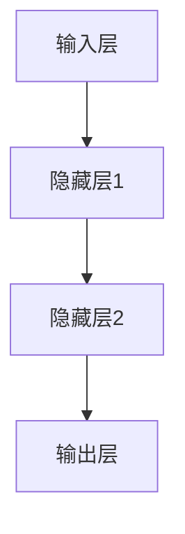

其中，A、B、C、D分别表示输入层、隐藏层1、隐藏层2和输出层。

#### 2.2.2 深度学习算法

深度学习（Deep Learning）是一种基于深度神经网络的机器学习技术，通过多层网络结构实现对复杂数据特征的自动提取和表示。深度学习算法的核心包括以下几个部分：

1. **前向传播算法**：将输入数据通过网络逐层传递，计算输出结果。
2. **反向传播算法**：根据输出结果与真实值的误差，反向更新网络的权重。
3. **优化算法**：用于调整网络权重，以最小化损失函数，常见的优化算法包括SGD、Adam等。

深度学习算法的伪代码可以表示为：

```python
# 输入数据
x = ...

# 初始化模型参数
W = ...

# 前向传播
z = x * W
y = activate(z)

# 计算损失
loss = compute_loss(y, y_)

# 反向传播
dz = dactivate(z)
dW = x * dz

# 更新模型参数
W = W - learning_rate * dW
```

其中，`x`为输入数据，`W`为模型参数，`y`为输出结果，`y_`为真实值，`activate`为激活函数，`compute_loss`为损失函数计算，`dactivate`为激活函数的导数。

#### 2.2.3 深度学习框架

深度学习框架（Deep Learning Framework）是一种用于实现深度学习算法的工具，提供了丰富的功能，包括模型构建、训练、评估等。常见的深度学习框架包括：

1. **TensorFlow**：由Google开发，支持多种深度学习模型和算法。
2. **PyTorch**：由Facebook开发，具有灵活的动态图计算能力。
3. **Keras**：基于TensorFlow和PyTorch的高层API，简化了模型构建和训练过程。

以下是一个使用PyTorch构建简单神经网络模型的示例：

```python
import torch
import torch.nn as nn

# 定义神经网络模型
class NeuralNetwork(nn.Module):
    def __init__(self):
        super(NeuralNetwork, self).__init__()
        self.layer1 = nn.Linear(in_features=10, out_features=10)
        self.relu = nn.ReLU()
        self.layer2 = nn.Linear(in_features=10, out_features=1)
    
    def forward(self, x):
        x = self.layer1(x)
        x = self.relu(x)
        x = self.layer2(x)
        return x

# 创建模型实例
model = NeuralNetwork()

# 定义损失函数和优化器
criterion = nn.BCELoss()
optimizer = torch.optim.Adam(model.parameters(), lr=0.001)

# 训练模型
for epoch in range(100):
    # 前向传播
    outputs = model(x)
    loss = criterion(outputs, y)
    
    # 反向传播
    optimizer.zero_grad()
    loss.backward()
    optimizer.step()

    # 打印训练进度
    if (epoch + 1) % 10 == 0:
        print('Epoch [{}/{}], Loss: {:.4f}'.format(epoch + 1, 100, loss.item()))
```

### 2.3 自然语言处理基础

#### 2.3.1 语言模型

语言模型（Language Model）是一种用于预测文本序列概率的模型，是自然语言处理（Natural Language Processing，NLP）的核心技术之一。语言模型的主要目标是建模自然语言的概率分布，从而对文本序列进行生成、分类和翻译等任务。

语言模型可以分为以下几种类型：

1. **N-gram模型**：基于历史n个单词预测下一个单词的概率。
2. **神经网络模型**：使用深度学习技术，如循环神经网络（RNN）、长短期记忆网络（LSTM）和Transformer等。
3. **生成式模型**：基于概率模型，如贝叶斯模型和马尔可夫模型等。

以下是一个简单的N-gram模型的伪代码：

```python
# 输入文本序列
text = ...

# 统计词频
word_counts = defaultdict(int)
for word in text:
    word_counts[word] += 1

# 计算概率
probabilities = defaultdict(float)
total_words = len(text)
for word in word_counts:
    probabilities[word] = word_counts[word] / total_words

# 预测下一个单词
next_word = max(probabilities, key=probabilities.get)
```

#### 2.3.2 文本分类

文本分类（Text Classification）是一种将文本数据按照预定的类别进行分类的任务，是自然语言处理中的重要应用之一。文本分类通常包括以下几个步骤：

1. **数据预处理**：对文本数据进行分析和预处理，如分词、去除停用词等。
2. **特征提取**：将预处理后的文本转换为特征向量，如词袋模型、TF-IDF等。
3. **模型训练**：使用特征向量和标签数据训练分类模型，如朴素贝叶斯、支持向量机等。
4. **模型评估**：使用测试数据评估模型性能，如准确率、召回率等。

以下是一个简单的文本分类模型的伪代码：

```python
# 输入训练数据和标签
train_data = ...
train_labels = ...

# 特征提取
features = extract_features(train_data)

# 模型训练
classifier = train_classifier(features, train_labels)

# 模型评估
accuracy = evaluate_classifier(classifier, test_data, test_labels)
print('Accuracy: {:.2f}%'.format(accuracy * 100))
```

#### 2.3.3 机器翻译

机器翻译（Machine Translation）是一种将一种语言的文本翻译成另一种语言的自动过程，是自然语言处理中的挑战性任务之一。机器翻译可以分为以下几种类型：

1. **基于规则的翻译**：使用预定义的语法规则和词典进行翻译。
2. **基于统计的翻译**：使用统计方法，如基于短语的翻译模型（PBMT）和基于句子的翻译模型（SMT）。
3. **基于神经网络的翻译**：使用深度学习技术，如序列到序列（Seq2Seq）模型和Transformer模型。

以下是一个简单的基于神经网络的机器翻译模型的伪代码：

```python
# 输入训练数据
train_data = ...
train_labels = ...

# 编码器和解码器模型
encoder = build_encoder()
decoder = build_decoder()

# 模型训练
train_model(encoder, decoder, train_data, train_labels)

# 翻译
def translate(sentence):
    encoded_sentence = encoder(sentence)
    decoded_sentence = decoder(encoded_sentence)
    return decoded_sentence

# 示例
input_sentence = "你好"
translated_sentence = translate(input_sentence)
print('Translated Sentence:', translated_sentence)
```

### 2.4 大规模数据处理技术

#### 2.4.1 分布式计算

分布式计算（Distributed Computing）是一种利用多台计算机协同工作，完成大规模数据处理和计算任务的技术。分布式计算的主要目标是提高计算效率、降低成本并提高系统的可靠性。

分布式计算通常包括以下几个关键组件：

1. **计算节点**：负责执行计算任务的计算机，可以是物理机或虚拟机。
2. **通信网络**：连接计算节点的通信基础设施，如局域网、广域网等。
3. **分布式存储**：用于存储大规模数据的分布式文件系统，如HDFS、Cassandra等。

以下是一个简单的分布式计算架构：

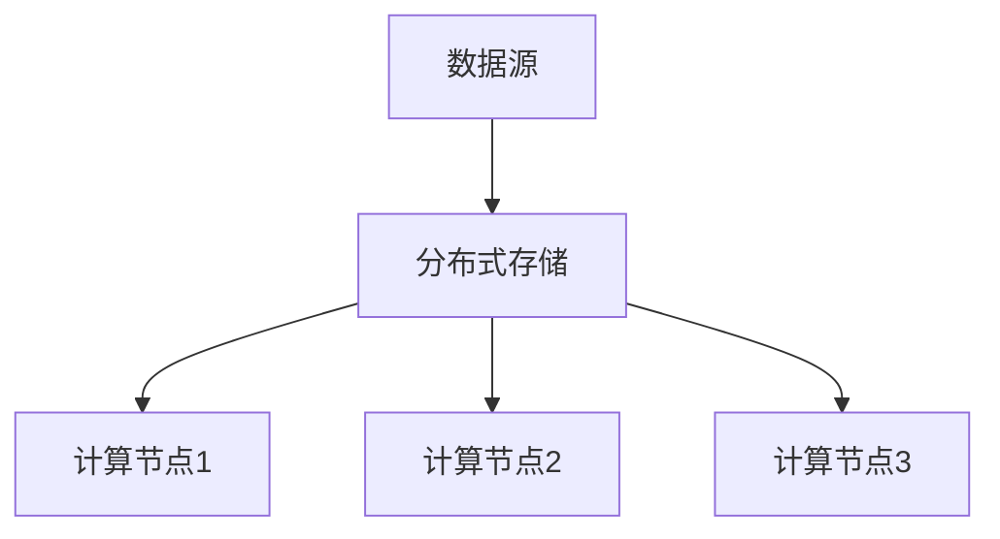

#### 2.4.2 存储技术

存储技术（Storage Technology）是数据处理和计算的基础，用于存储大规模数据。常见的存储技术包括：

1. **关系数据库**：如MySQL、PostgreSQL等，适用于结构化数据的存储和查询。
2. **非关系数据库**：如MongoDB、Cassandra等，适用于半结构化或非结构化数据的存储。
3. **分布式文件系统**：如HDFS、Ceph等，适用于大规模数据的存储和分布式计算。

以下是一个简单的分布式文件系统架构：

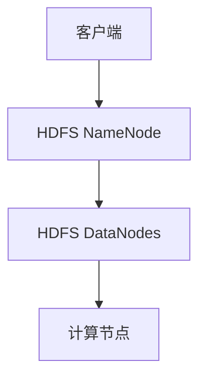

#### 2.4.3 数据预处理

数据预处理（Data Preprocessing）是在进行大规模数据处理和计算之前，对数据进行清洗、转换和格式化等操作的步骤。数据预处理的关键步骤包括：

1. **数据清洗**：去除数据中的噪声、错误和不完整信息。
2. **数据转换**：将数据转换为适合分析的形式，如数值化、规范化等。
3. **特征工程**：提取和构造有助于模型训练的特征，如文本特征、图像特征等。

以下是一个简单的数据预处理流程：

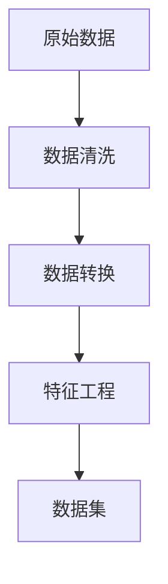

### 2.5 大模型训练与优化

#### 2.5.1 训练过程

大模型训练（Large Model Training）是指使用大规模数据对模型进行训练，以提升模型的性能和泛化能力。大模型训练过程通常包括以下几个关键步骤：

1. **数据准备**：收集和准备训练数据，包括数据清洗、数据转换和特征提取等。
2. **模型初始化**：初始化模型参数，可以使用随机初始化或预训练模型。
3. **前向传播**：将输入数据通过模型进行前向传播，计算输出结果。
4. **损失计算**：计算输出结果与真实值之间的损失，常用的损失函数包括均方误差（MSE）、交叉熵损失等。
5. **反向传播**：根据损失值，通过反向传播算法更新模型参数。
6. **模型评估**：在验证集或测试集上评估模型性能，调整模型参数和训练策略。

以下是一个简单的大模型训练流程：

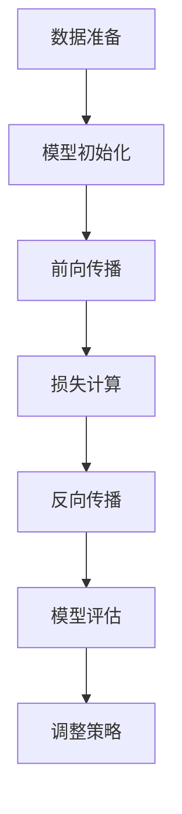

#### 2.5.2 优化策略

大模型训练过程中，优化策略（Optimization Strategy）是关键的一环，用于调整模型参数和训练过程，以提升模型性能。常见的优化策略包括：

1. **学习率调度**：调整学习率的大小和变化方式，常用的方法有固定学习率、指数衰减学习率等。
2. **批量大小**：调整训练批量的规模，较大的批量大小可以提高训练稳定性，但计算资源需求较高。
3. **正则化**：通过添加正则化项（如L1、L2正则化）来防止模型过拟合。
4. **数据增强**：通过数据增强方法（如旋转、缩放、裁剪等）增加训练数据多样性，提高模型泛化能力。

以下是一个简单的优化策略：

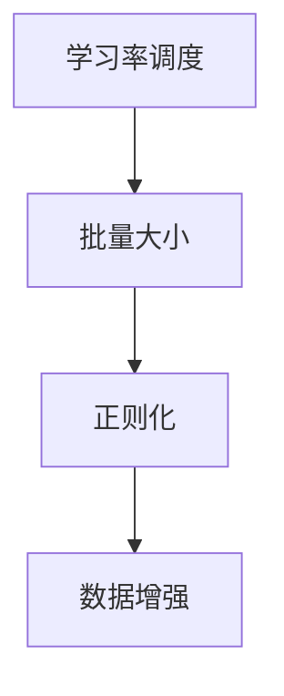

#### 2.5.3 超参数调优

超参数调优（Hyperparameter Tuning）是指调整模型中的超参数，以优化模型性能和泛化能力。超参数包括学习率、批量大小、正则化强度等。超参数调优的方法包括：

1. **网格搜索**：通过遍历预设的超参数组合，找到最优的超参数组合。
2. **贝叶斯优化**：基于贝叶斯统计模型，通过模拟优化算法搜索最优超参数。
3. **随机搜索**：随机选择超参数组合，通过实验评估模型性能，逐步优化超参数。

以下是一个简单的超参数调优流程：

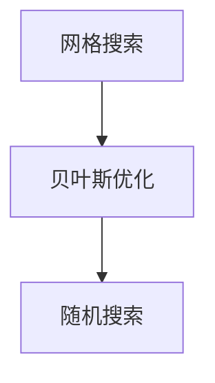

## 第三部分: 大模型技术实战

### 3.1 实战一：构建智能客服系统

#### 3.1.1 系统需求分析

智能客服系统（Intelligent Customer Service System）是一种利用人工智能技术，为用户提供自动、智能化的客户服务解决方案。以下是智能客服系统的需求分析：

1. **多渠道接入**：支持多种渠道接入，如电话、邮件、社交媒体等。
2. **自动问答**：基于大模型技术，实现自动问答功能，快速响应用户咨询。
3. **知识库管理**：构建知识库，用于存储常见问题及其解答，方便客服人员查询和使用。
4. **用户画像**：通过用户行为数据，构建用户画像，实现个性化服务。
5. **人工干预**：在智能客服无法解决问题时，提供人工客服干预，确保用户问题得到妥善解决。
6. **系统性能**：保证系统的高可用性和高性能，确保用户能够快速、稳定地获取服务。

#### 3.1.2 系统架构设计

智能客服系统架构设计如下：

1. **前端模块**：包括用户界面和接口，负责接收用户请求和展示问答结果。
2. **后端模块**：包括问答引擎、知识库管理、用户画像和人工客服系统等，负责处理用户请求和提供服务。
3. **数据存储**：包括用户数据、知识库数据、日志数据等，用于存储和管理系统数据。
4. **外部接口**：包括与其他系统的集成接口，如CRM系统、ERP系统等。

以下是一个简单的智能客服系统架构图：

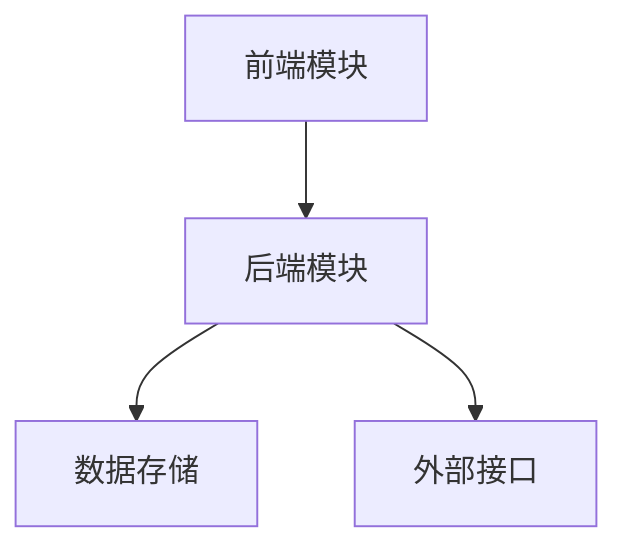

#### 3.1.3 实现步骤

1. **需求分析**：与客户沟通，明确智能客服系统的功能和性能需求。
2. **系统设计**：根据需求分析，设计智能客服系统的整体架构和模块。
3. **前端开发**：开发用户界面和接口，实现多渠道接入功能。
4. **后端开发**：
   - 构建问答引擎：使用大模型技术，实现自动问答功能。
   - 构建知识库：收集和整理常见问题及其解答，构建知识库。
   - 构建用户画像：通过用户行为数据，构建用户画像。
   - 构建人工客服系统：提供人工客服干预功能。
5. **系统集成**：将智能客服系统与CRM系统、ERP系统等进行集成，实现数据交互。
6. **测试与优化**：对系统进行功能测试和性能测试，根据测试结果进行优化。
7. **部署上线**：将系统部署到生产环境，进行上线运行。

#### 3.1.4 代码解读与分析

以下是一个简单的智能客服系统的代码示例，包括问答引擎和知识库管理：

```python
# 问答引擎
class QuestionAnsweringSystem:
    def __init__(self, model, knowledge_base):
        self.model = model
        self.knowledge_base = knowledge_base
    
    def ask_question(self, question):
        # 使用大模型进行问答
        answer = self.model.predict(question)
        # 在知识库中查找答案
        knowledge_answer = self.knowledge_base.get_answer(question)
        # 返回最终答案
        return answer if answer else knowledge_answer

# 知识库管理
class KnowledgeBase:
    def __init__(self):
        self.questions = {}
        self.answers = {}
    
    def add_question_answer(self, question, answer):
        self.questions[question] = question
        self.answers[answer] = answer
    
    def get_answer(self, question):
        return self.answers.get(question)

# 实例化问答引擎和知识库
model = load_model('model_path')
knowledge_base = KnowledgeBase()

# 添加知识库数据
knowledge_base.add_question_answer('你好', '你好，欢迎来到我们的智能客服系统。')

# 回答用户问题
question = '你好'
answer = question_answering_system.ask_question(question)
print(answer)
```

以上代码示例展示了智能客服系统的核心功能，包括问答引擎和知识库管理。其中，问答引擎使用大模型进行问答预测，并在知识库中查找答案。知识库管理通过添加问题和答案，构建一个简单的知识库，方便后续查询和使用。

### 3.2 实战二：智能推荐系统构建

#### 3.2.1 系统需求分析

智能推荐系统（Intelligent Recommendation System）是一种基于用户行为数据和物品特征，为用户推荐相关物品的解决方案。以下是智能推荐系统的需求分析：

1. **个性化推荐**：根据用户的历史行为和偏好，为用户提供个性化的推荐结果。
2. **多样性推荐**：在推荐结果中引入多样性，避免用户频繁看到重复的推荐物品。
3. **实时推荐**：根据用户实时行为数据，动态调整推荐策略，提供实时的推荐结果。
4. **扩展性**：支持大规模用户和物品数据，具备良好的扩展性。
5. **准确性**：确保推荐结果的准确性和相关性，提高用户满意度和转化率。

#### 3.2.2 系统架构设计

智能推荐系统架构设计如下：

1. **数据采集模块**：负责收集用户行为数据，如浏览记录、购买记录等。
2. **数据预处理模块**：对采集到的数据进行清洗、转换和特征提取，为后续推荐算法提供数据支持。
3. **推荐算法模块**：包括协同过滤、基于内容的推荐、混合推荐等算法，负责生成推荐结果。
4. **推荐结果展示模块**：将推荐结果呈现给用户，提供友好的用户界面。
5. **外部接口**：包括与其他系统的集成接口，如电商平台、社交媒体等。

以下是一个简单的智能推荐系统架构图：

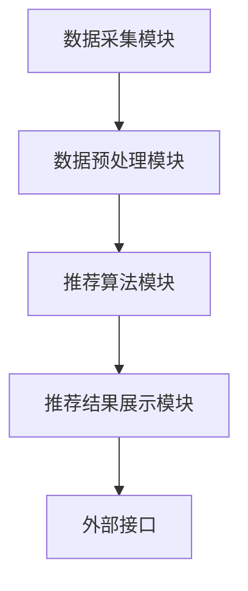

#### 3.2.3 实现步骤

1. **需求分析**：与业务团队沟通，明确智能推荐系统的功能和性能需求。
2. **系统设计**：根据需求分析，设计智能推荐系统的整体架构和模块。
3. **数据采集**：使用API接口、日志采集等方式，收集用户行为数据。
4. **数据预处理**：对采集到的数据进行清洗、转换和特征提取，构建推荐数据集。
5. **推荐算法开发**：
   - 实现协同过滤算法，如基于用户的协同过滤（User-based CF）和基于项目的协同过滤（Item-based CF）。
   - 实现基于内容的推荐算法，如基于属性的推荐、基于文本的推荐等。
   - 实现混合推荐算法，如矩阵分解、深度学习等。
6. **推荐结果生成**：根据用户行为数据和推荐算法，生成个性化的推荐结果。
7. **推荐结果展示**：开发推荐结果展示界面，提供友好的用户体验。
8. **系统测试与优化**：对系统进行功能测试和性能测试，根据测试结果进行优化。
9. **部署上线**：将系统部署到生产环境，进行上线运行。

#### 3.2.4 代码解读与分析

以下是一个简单的智能推荐系统的代码示例，包括数据预处理和推荐算法：

```python
# 数据预处理
def preprocess_data(data):
    # 清洗数据
    data = clean_data(data)
    # 转换数据
    data = convert_data(data)
    # 特征提取
    features = extract_features(data)
    return features

# 推荐算法
class RecommendationSystem:
    def __init__(self, algorithm):
        self.algorithm = algorithm
    
    def generate_recommendations(self, user_data, item_data):
        # 预处理数据
        user_features = preprocess_data(user_data)
        item_features = preprocess_data(item_data)
        # 生成推荐结果
        recommendations = self.algorithm.generate_recommendations(user_features, item_features)
        return recommendations

# 协同过滤算法
class CollaborativeFiltering:
    def __init__(self):
        self.user_similarity_matrix = {}
        self.item_similarity_matrix = {}
    
    def compute_similarity(self, data):
        # 计算用户相似性矩阵
        self.user_similarity_matrix = compute_user_similarity(data)
        # 计算项目相似性矩阵
        self.item_similarity_matrix = compute_item_similarity(data)
    
    def generate_recommendations(self, user_features, item_features):
        # 计算相似度得分
        user_similarity_scores = compute_user_similarity_scores(user_features, self.user_similarity_matrix)
        item_similarity_scores = compute_item_similarity_scores(item_features, self.item_similarity_matrix)
        # 汇总推荐结果
        recommendations = sum(user_similarity_scores, item_similarity_scores)
        return recommendations

# 实例化推荐算法
collaborative_filtering = CollaborativeFiltering()

# 生成推荐结果
user_data = load_user_data('user_data_path')
item_data = load_item_data('item_data_path')
recommendation_system = RecommendationSystem(collaborative_filtering)
recommendations = recommendation_system.generate_recommendations(user_data, item_data)
print(recommendations)
```

以上代码示例展示了智能推荐系统的核心功能，包括数据预处理和推荐算法。其中，数据预处理负责清洗、转换和特征提取，为推荐算法提供数据支持。推荐算法使用协同过滤算法，根据用户和物品的相似性计算推荐得分，生成推荐结果。

### 3.3 实战三：智能风控系统开发

#### 3.3.1 系统需求分析

智能风控系统（Intelligent Risk Management System）是一种利用人工智能技术，对金融风险进行识别、预测和控制的管理系统。以下是智能风控系统的需求分析：

1. **实时监控**：对金融交易数据、用户行为数据等实时监控，及时发现潜在风险。
2. **风险预测**：基于历史数据和机器学习算法，对潜在风险进行预测和预警。
3. **风险控制**：根据预测结果，采取相应的风险控制措施，如拒绝交易、预警提示等。
4. **规则管理**：支持自定义风险控制规则，灵活调整风险控制策略。
5. **数据安全**：确保数据安全，防止数据泄露和滥用。
6. **系统性能**：保证系统的高可用性和高性能，满足大规模数据处理需求。

#### 3.3.2 系统架构设计

智能风控系统架构设计如下：

1. **数据采集模块**：负责收集各类金融交易数据、用户行为数据等。
2. **数据处理模块**：对采集到的数据进行清洗、转换和特征提取，为风险预测和风险控制提供数据支持。
3. **风险预测模块**：包括风险预测算法、规则引擎等，负责对潜在风险进行预测和预警。
4. **风险控制模块**：根据预测结果，采取相应的风险控制措施，如拒绝交易、预警提示等。
5. **外部接口**：包括与其他系统的集成接口，如交易系统、监控系统等。

以下是一个简单的智能风控系统架构图：

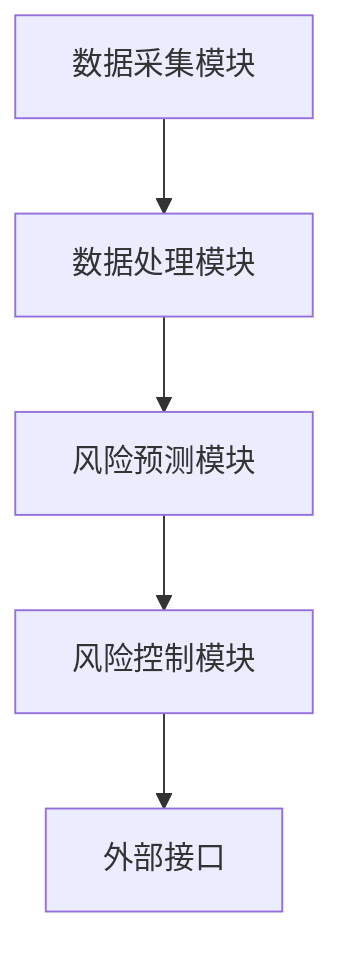

#### 3.3.3 实现步骤

1. **需求分析**：与业务团队沟通，明确智能风控系统的功能和性能需求。
2. **系统设计**：根据需求分析，设计智能风控系统的整体架构和模块。
3. **数据采集**：使用API接口、日志采集等方式，收集各类金融交易数据、用户行为数据等。
4. **数据处理**：对采集到的数据进行清洗、转换和特征提取，构建风险预测数据集。
5. **风险预测算法开发**：
   - 实现基于统计模型的预测算法，如逻辑回归、决策树等。
   - 实现基于机器学习模型的预测算法，如随机森林、支持向量机等。
   - 实现基于深度学习模型的预测算法，如卷积神经网络、循环神经网络等。
6. **规则管理**：开发规则管理模块，支持自定义风险控制规则，灵活调整风险控制策略。
7. **风险控制**：根据预测结果，采取相应的风险控制措施，如拒绝交易、预警提示等。
8. **系统测试与优化**：对系统进行功能测试和性能测试，根据测试结果进行优化。
9. **部署上线**：将系统部署到生产环境，进行上线运行。

#### 3.3.4 代码解读与分析

以下是一个简单的智能风控系统的代码示例，包括数据预处理和风险预测：

```python
# 数据预处理
def preprocess_data(data):
    # 清洗数据
    data = clean_data(data)
    # 转换数据
    data = convert_data(data)
    # 特征提取
    features = extract_features(data)
    return features

# 风险预测
class RiskPredictionSystem:
    def __init__(self, model):
        self.model = model
    
    def predict_risk(self, data):
        # 预处理数据
        features = preprocess_data(data)
        # 风险预测
        risk_score = self.model.predict(features)
        return risk_score

# 基于深度学习模型的风险预测
class DeepLearningModel(nn.Module):
    def __init__(self):
        super(DeepLearningModel, self).__init__()
        self.layer1 = nn.Linear(in_features=10, out_features=10)
        self.relu = nn.ReLU()
        self.layer2 = nn.Linear(in_features=10, out_features=1)
    
    def forward(self, x):
        x = self.layer1(x)
        x = self.relu(x)
        x = self.layer2(x)
        return x

# 实例化深度学习模型
model = DeepLearningModel()

# 训练模型
for epoch in range(100):
    # 前向传播
    outputs = model(x)
    loss = criterion(outputs, y)
    
    # 反向传播
    optimizer.zero_grad()
    loss.backward()
    optimizer.step()

    # 打印训练进度
    if (epoch + 1) % 10 == 0:
        print('Epoch [{}/{}], Loss: {:.4f}'.format(epoch + 1, 100, loss.item()))

# 风险预测
def predict_risk(data):
    risk_score = risk_prediction_system.predict_risk(data)
    return risk_score

# 示例
data = load_data('data_path')
risk_score = predict_risk(data)
print('Risk Score:', risk_score)
```

以上代码示例展示了智能风控系统的核心功能，包括数据预处理和风险预测。其中，数据预处理负责清洗、转换和特征提取，为风险预测提供数据支持。风险预测使用深度学习模型，通过训练和预测步骤，实现对风险分数的预测。

### 3.4 实战四：智能供应链管理系统

#### 3.4.1 系统需求分析

智能供应链管理系统（Intelligent Supply Chain Management System）是一种利用人工智能技术，实现供应链优化和智能管理的系统。以下是智能供应链管理系统的需求分析：

1. **需求预测**：根据历史数据和当前市场情况，准确预测供应链各环节的需求量。
2. **库存优化**：根据需求预测结果，优化库存水平和库存策略，减少库存成本。
3. **物流优化**：优化物流路线和运输计划，提高物流效率，降低物流成本。
4. **风险管理**：对供应链风险进行识别、预测和控制，确保供应链的稳定运行。
5. **协同管理**：实现供应链各环节的信息共享和协同工作，提高供应链的整体效率。
6. **数据可视化**：通过数据可视化，实时展示供应链各环节的运行状态和关键指标。

#### 3.4.2 系统架构设计

智能供应链管理系统架构设计如下：

1. **数据采集模块**：负责收集供应链各环节的数据，如库存数据、物流数据等。
2. **数据处理模块**：对采集到的数据进行清洗、转换和特征提取，为后续供应链优化提供数据支持。
3. **预测模块**：包括需求预测、库存预测等算法，负责预测供应链各环节的需求量。
4. **优化模块**：根据预测结果，优化库存策略、物流路线和运输计划，提高供应链效率。
5. **协同管理模块**：实现供应链各环节的信息共享和协同工作，提高供应链的整体效率。
6. **数据可视化模块**：通过数据可视化，实时展示供应链各环节的运行状态和关键指标。
7. **外部接口**：包括与其他系统的集成接口，如ERP系统、物流系统等。

以下是一个简单的智能供应链管理系统架构图：

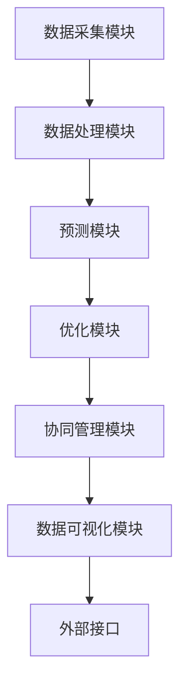

#### 3.4.3 实现步骤

1. **需求分析**：与业务团队沟通，明确智能供应链管理系统的功能和性能需求。
2. **系统设计**：根据需求分析，设计智能供应链管理系统的整体架构和模块。
3. **数据采集**：使用API接口、日志采集等方式，收集供应链各环节的数据。
4. **数据处理**：对采集到的数据进行清洗、转换和特征提取，构建预测和优化数据集。
5. **预测算法开发**：
   - 实现需求预测算法，如时间序列预测、回归预测等。
   - 实现库存预测算法，如回归分析、神经网络预测等。
6. **优化算法开发**：
   - 实现库存优化算法，如线性规划、遗传算法等。
   - 实现物流优化算法，如最短路径算法、多目标优化等。
7. **协同管理**：开发协同管理模块，实现供应链各环节的信息共享和协同工作。
8. **数据可视化**：开发数据可视化模块，实时展示供应链各环节的运行状态和关键指标。
9. **系统测试与优化**：对系统进行功能测试和性能测试，根据测试结果进行优化。
10. **部署上线**：将系统部署到生产环境，进行上线运行。

#### 3.4.4 代码解读与分析

以下是一个简单的智能供应链管理系统的代码示例，包括数据预处理和预测算法：

```python
# 数据预处理
def preprocess_data(data):
    # 清洗数据
    data = clean_data(data)
    # 转换数据
    data = convert_data(data)
    # 特征提取
    features = extract_features(data)
    return features

# 需求预测算法
class DemandPrediction(nn.Module):
    def __init__(self):
        super(DemandPrediction, self).__init__()
        self.layer1 = nn.Linear(in_features=10, out_features=10)
        self.relu = nn.ReLU()
        self.layer2 = nn.Linear(in_features=10, out_features=1)
    
    def forward(self, x):
        x = self.layer1(x)
        x = self.relu(x)
        x = self.layer2(x)
        return x

# 实例化需求预测模型
model = DemandPrediction()

# 训练模型
for epoch in range(100):
    # 前向传播
    outputs = model(x)
    loss = criterion(outputs, y)
    
    # 反向传播
    optimizer.zero_grad()
    loss.backward()
    optimizer.step()

    # 打印训练进度
    if (epoch + 1) % 10 == 0:
        print('Epoch [{}/{}], Loss: {:.4f}'.format(epoch + 1, 100, loss.item()))

# 需求预测
def predict_demand(data):
    features = preprocess_data(data)
    demand = model.predict(features)
    return demand

# 示例
data = load_data('data_path')
demand = predict_demand(data)
print('Predicted Demand:', demand)
```

以上代码示例展示了智能供应链管理系统的核心功能，包括数据预处理和预测算法。其中，数据预处理负责清洗、转换和特征提取，为预测算法提供数据支持。需求预测算法使用深度学习模型，通过训练和预测步骤，实现对需求量的预测。

## 第四部分: 大模型技术安全与伦理

### 4.1 大模型技术安全风险分析

随着大模型技术在商业应用中的广泛应用，其安全风险也日益凸显。以下是大模型技术面临的主要安全风险：

#### 4.1.1 模型泄露风险

模型泄露是指大模型中的敏感信息被非法获取或泄露。模型泄露的风险主要包括：

1. **数据泄露**：在模型训练和部署过程中，敏感数据可能被泄露。
2. **模型窃取**：敌对势力可能通过恶意攻击或数据窃取获取大模型，用于非法目的。
3. **模型反编译**：大模型可能被反编译，导致模型结构和参数被公开。

#### 4.1.2 数据隐私保护

大模型训练过程中，需要使用大量的数据，这些数据往往包含用户的敏感信息。数据隐私保护的风险主要包括：

1. **数据泄露**：在数据传输、存储和处理过程中，敏感数据可能被窃取或泄露。
2. **数据滥用**：未经授权的个人或组织可能滥用用户数据，进行非法活动。
3. **数据溯源**：在数据泄露或滥用事件中，难以追溯数据的来源和责任。

#### 4.1.3 模型安全加固措施

为应对大模型技术的安全风险，可以采取以下加固措施：

1. **数据加密**：对敏感数据进行加密存储和传输，确保数据在传输和存储过程中不被窃取。
2. **访问控制**：实施严格的访问控制策略，确保只有授权人员可以访问敏感数据。
3. **安全审计**：定期进行安全审计，发现并修复安全漏洞，确保系统的安全性。
4. **安全培训**：对相关人员开展安全培训，提高其安全意识和防范能力。
5. **合规性要求**：遵循相关法规和标准，确保数据隐私和模型安全。

### 4.2 大模型伦理问题探讨

大模型技术在商业应用中的广泛应用，引发了诸多伦理问题，需要引起重视。以下是大模型技术面临的主要伦理问题：

#### 4.2.1 AI偏见问题

大模型在训练过程中，可能受到训练数据偏见的影响，导致模型在特定群体或任务中表现出偏见。AI偏见问题主要包括：

1. **性别偏见**：在性别识别任务中，大模型可能对某个性别表现出更高的准确性。
2. **种族偏见**：在种族识别任务中，大模型可能对某些种族表现出更高的准确性。
3. **年龄偏见**：在年龄预测任务中，大模型可能对某些年龄段表现出更高的准确性。

#### 4.2.2 AI责任归属

在AI技术应用过程中，如果出现错误决策或事故，责任归属问题成为争议焦点。AI责任归属问题主要包括：

1. **企业责任**：企业在AI技术应用过程中，应承担一定的责任。
2. **开发者责任**：AI模型开发者在模型设计和开发过程中，应确保模型的安全性和可靠性。
3. **用户责任**：用户在使用AI技术过程中，也应承担一定的责任，如遵守使用规范、保护个人信息等。

#### 4.2.3 AI伦理监管

为规范AI技术的应用，各国政府纷纷出台相关法规和政策，推动AI伦理监管。AI伦理监管主要包括：

1. **数据隐私保护**：确保用户数据在AI应用过程中的隐私和安全。
2. **公平公正**：确保AI技术在各个群体中的公平应用，避免歧视和偏见。
3. **透明度**：提高AI技术的透明度，确保用户了解AI技术的决策过程。
4. **责任追究**：明确AI技术应用过程中的责任归属，确保责任追究有据可依。

### 4.3 大模型技术法规与政策

大模型技术法规与政策是保障技术健康发展的重要手段。以下是国内外的相关法规与政策：

#### 4.3.1 国内外法规对比

1. **中国**：
   - 《中华人民共和国网络安全法》
   - 《中华人民共和国数据安全法》
   - 《中华人民共和国个人信息保护法》
2. **美国**：
   - 《加州消费者隐私法案》（CCPA）
   - 《欧盟通用数据保护条例》（GDPR）
3. **欧洲**：
   - 《欧洲人工智能法案》

#### 4.3.2 政策影响与应对策略

1. **政策影响**：
   - **合规性要求**：企业需遵守相关法规，确保数据隐私和模型安全。
   - **技术发展限制**：部分法规可能对大模型技术的发展和应用提出限制。
   - **市场竞争力**：合规性要求可能影响企业的市场竞争力，需要企业加强合规管理。

2. **应对策略**：
   - **法规培训**：加强对法规的学习和培训，提高合规意识。
   - **合规管理体系**：建立完善的合规管理体系，确保合规性要求得到有效执行。
   - **技术创新**：在遵守法规的前提下，推动技术创新，提高市场竞争力。

## 第五部分: 大模型技术的发展趋势与展望

### 5.1 大模型技术发展趋势

大模型技术在不断演进，未来发展趋势主要体现在以下几个方面：

#### 5.1.1 算法创新

随着计算能力的提升和数据量的增加，大模型算法将持续创新，包括：

1. **神经网络结构**：开发更高效的神经网络结构，提高模型计算效率和性能。
2. **算法优化**：优化大模型训练算法，提高训练速度和精度。
3. **跨模态学习**：研究跨模态学习算法，实现不同类型数据（如文本、图像、音频等）的联合建模。

#### 5.1.2 应用场景拓展

大模型技术将在更多应用场景中得到应用，包括：

1. **实体经济**：推动实体经济与AI技术的深度融合，实现智能化转型。
2. **公共服务**：提高公共服务质量，如智能医疗、智能教育等。
3. **社会治理**：利用AI技术提高社会治理水平，如智能安防、智能交通等。

#### 5.1.3 技术融合

大模型技术将与其他技术深度融合，包括：

1. **物联网**：实现设备间的智能互联，提升数据处理和响应能力。
2. **5G**：利用5G技术提高数据传输速度和网络稳定性，支撑大模型应用的实时性和高效性。
3. **区块链**：结合区块链技术，确保大模型数据的安全性和可信度。

### 5.2 大模型技术未来展望

大模型技术在未来有望实现以下突破：

#### 5.2.1 AI与实体经济深度融合

AI与实体经济深度融合，将带来以下变革：

1. **产业升级**：推动传统产业智能化转型，提高生产效率和产品质量。
2. **商业模式创新**：催生新的商业模式和服务模式，提升企业竞争力。
3. **产业协同**：实现产业链上下游企业间的数据共享和协同，提高产业链整体效率。

#### 5.2.2 跨行业应用与协同发展

跨行业应用与协同发展，将带来以下机遇：

1. **跨界合作**：不同行业间的跨界合作，实现资源共享和优势互补。
2. **产业链整合**：推动产业链的整合和优化，提高产业链整体竞争力。
3. **产业链创新**：在跨行业应用中，发现新的业务机会和市场需求，推动产业链创新。

#### 5.2.3 大模型技术在行业中的应用前景

大模型技术在不同行业中的应用前景如下：

1. **金融行业**：提高风险管理能力，优化投资决策，提升金融服务质量。
2. **医疗行业**：实现智能诊断、个性化治疗和药物研发，提高医疗服务水平。
3. **零售行业**：实现智能推荐、智能营销和智能供应链管理，提高零售业竞争力。
4. **制造业**：实现智能制造、智能检测和智能维护，提高制造业生产效率和产品质量。

### 5.3 大模型技术的机遇与挑战

大模型技术在带来巨大机遇的同时，也面临一定的挑战：

#### 5.3.1 技术突破点

技术突破点主要体现在以下几个方面：

1. **计算能力**：提高计算能力，支持更大规模、更复杂的大模型训练。
2. **数据资源**：获取更多高质量、多样化的数据资源，提升模型训练效果。
3. **算法优化**：优化大模型算法，提高模型计算效率和性能。

#### 5.3.2 创新能力建设

创新能力建设主要体现在以下几个方面：

1. **科研投入**：加大科研投入，推动AI技术研究和创新。
2. **人才培养**：加强人才培养，培养具备AI技术和跨学科能力的专业人才。
3. **产业协同**：推动产业协同创新，形成产学研用一体化创新体系。

#### 5.3.3 市场竞争格局

市场竞争格局将呈现以下特点：

1. **技术领先**：技术领先的企业将在市场竞争中占据优势地位。
2. **跨界竞争**：跨界企业通过技术融合，进入传统行业，推动产业变革。
3. **合作共赢**：企业间的合作将更加紧密，形成生态协同效应。

## 附录

### 附录 A: 大模型技术常用工具与资源

#### A.1 深度学习框架介绍

1. **TensorFlow**：由Google开发，支持多种深度学习模型和算法。
2. **PyTorch**：由Facebook开发，具有灵活的动态图计算能力。
3. **Keras**：基于TensorFlow和PyTorch的高层API，简化了模型构建和训练过程。

#### A.2 自然语言处理工具

1. **NLTK**：Python的自然语言处理库，提供丰富的NLP功能。
2. **spaCy**：Python的自然语言处理库，支持快速文本处理和实体识别。
3. **gensim**：Python的分布式主题建模库，适用于大规模文本数据处理。

#### A.3 大数据处理工具

1. **Hadoop**：基于MapReduce的大数据处理框架，适用于大规模数据处理和计算。
2. **Spark**：基于内存的大数据处理引擎，适用于实时数据处理和流计算。
3. **Flink**：基于流处理的大数据处理引擎，适用于实时数据处理和分析。

#### A.4 其他相关资源

1. **AI论文集**：提供大量的AI研究论文，涵盖深度学习、自然语言处理等领域。
2. **AI书籍**：推荐经典的AI书籍，包括《深度学习》、《神经网络与深度学习》等。
3. **在线课程**：提供丰富的AI在线课程，涵盖基础知识和实战技能。

### 附录 B: 大模型技术相关书籍推荐

#### B.1 基础理论与原理

1. **《深度学习》**：由Ian Goodfellow、Yoshua Bengio和Aaron Courville合著，系统介绍了深度学习的基础理论和算法。
2. **《神经网络与深度学习》**：由邱锡鹏教授编著，详细介绍了神经网络和深度学习的理论基础和实现方法。
3. **《人工智能：一种现代的方法》**：由Stuart J. Russell和Peter Norvig合著，全面介绍了人工智能的理论和实践。

#### B.2 技术实战与应用

1. **《深度学习实践》**：由Hastie、Tibshirani和Friedman合著，通过实例介绍了深度学习在多个领域的应用。
2. **《TensorFlow实战》**：由Trevor Marsden和Adam France合著，详细介绍了TensorFlow的使用方法和实战案例。
3. **《自然语言处理实践》**：由Ian Goodfellow、Jean-Baptiste Deniau和Xavier Bresson合著，介绍了自然语言处理的理论和实践。

#### B.3 前沿趋势与未来展望

1. **《深度学习未来之路》**：由Ian Goodfellow合著，探讨了深度学习的前沿趋势和未来发展方向。
2. **《人工智能的未来》**：由Stuart J. Russell和Peter Norvig合著，介绍了人工智能的发展历程和未来趋势。
3. **《深度学习的发展与应用》**：由吴恩达等合著，总结了深度学习技术的发展和应用现状。

### 附录 C: 大模型技术学习路线图

#### C.1 基础知识储备

1. **数学基础**：掌握线性代数、微积分和概率论等数学基础知识。
2. **编程基础**：掌握Python编程语言，熟悉常用的数据结构和算法。
3. **机器学习基础**：了解机器学习的基本概念、算法和实现方法。

#### C.2 技术实战演练

1. **深度学习实战**：通过实践项目，熟悉深度学习框架的使用方法和实战技巧。
2. **自然语言处理实战**：通过实践项目，掌握自然语言处理的基本技术和应用方法。
3. **大数据处理实战**：通过实践项目，熟悉大数据处理技术和工具的使用。

#### C.3 行业应用拓展

1. **金融领域应用**：学习金融领域的大模型技术应用，如风险管理、投资决策等。
2. **医疗领域应用**：学习医疗领域的大模型技术应用，如疾病诊断、药物研发等。
3. **零售领域应用**：学习零售领域的大模型技术应用，如智能推荐、客户关系管理等。

#### C.4 创新与突破

1. **前沿技术研究**：关注深度学习、自然语言处理等领域的前沿研究，掌握最新的技术动态。
2. **跨学科学习**：结合数学、统计学、计算机科学等多个学科，培养跨学科思维和创新能力。
3. **创新创业**：参与创新创业项目，将大模型技术应用于实际场景，实现技术突破和商业价值。 

以上是《大模型：AI技术的商业应用》这本书的正文内容，涵盖了AI技术商业应用的背景与趋势、大模型技术基础、实战案例、安全与伦理、发展趋势与展望等内容。希望对读者有所帮助。

## 作者信息

作者：AI天才研究院/AI Genius Institute & 禅与计算机程序设计艺术/Zen And The Art of Computer Programming

## 结束语

《大模型：AI技术的商业应用》旨在为读者全面呈现大模型技术在商业应用中的重要性和实践方法。随着AI技术的不断演进，大模型技术在各行各业中的应用前景广阔，同时也面临着诸多挑战。通过本文的探讨，希望读者能够对大模型技术的商业应用有更深入的了解，把握其发展趋势，应对其中的挑战，推动AI技术为商业和社会带来更大的价值。

### 参考文献

1. Goodfellow, Ian, Yoshua Bengio, and Aaron Courville. "Deep learning." MIT press, 2016.
2. Hastie, Trevor, Robert Tibshirani, and Jerome Friedman. "The elements of statistical learning: data mining, inference, and prediction." Springer series in statistics, 2009.
3. Russell, Stuart J., and Peter Norvig. "Artificial intelligence: a modern approach." Prentice hall, 2009.
4. Bengio, Y. "Learning representations by back-propagating errors." Neural Networks for Vision and Image Processing, 1989.
5. LeCun, Y., Bengio, Y., & Hinton, G. "Deep learning." Nature, 2015.
6. Dean, J., Corrado, G. S., Monga, R., & others. "Large scale distributed deep networks." In Advances in neural information processing systems (2012).

