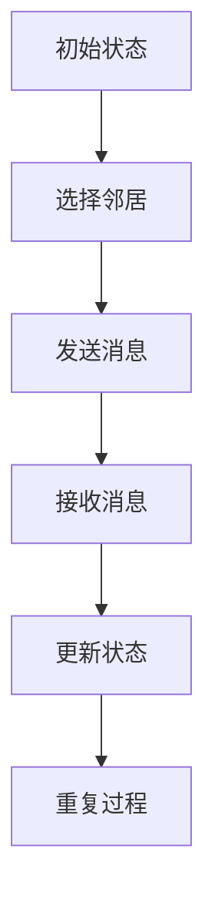
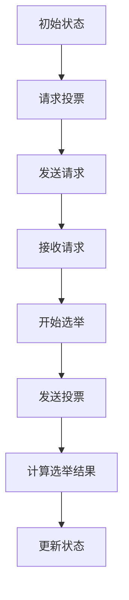
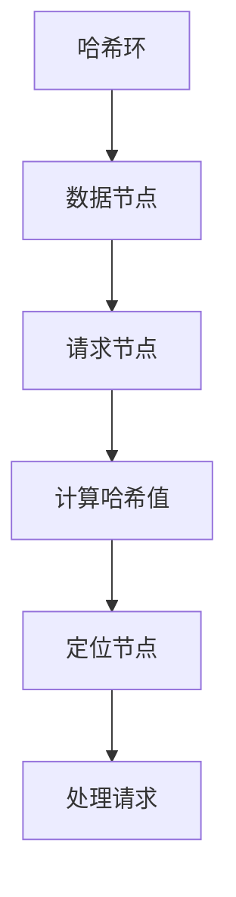
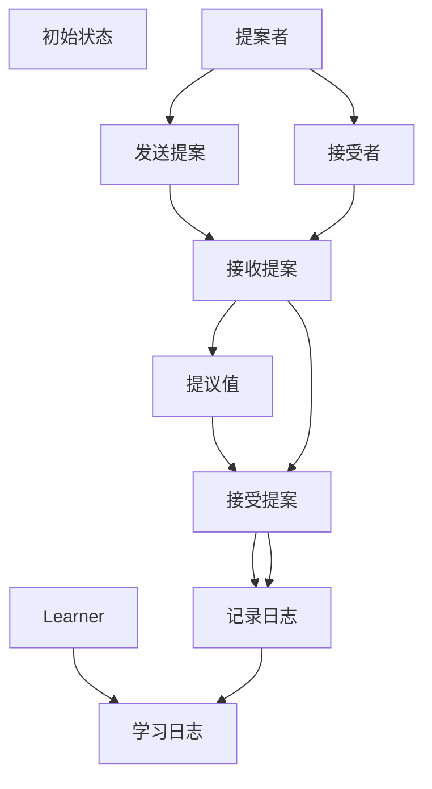

                 

### 《大规模分布式系统设计原则与实践》

#### 关键词：大规模分布式系统、分布式一致性、分布式算法、架构设计、性能优化、可靠性设计、项目实战

#### 摘要：
本文旨在全面探讨大规模分布式系统设计的原则与实践。通过系统的分析和实践案例的分享，我们将深入理解分布式系统的核心概念、设计原则、算法原理、性能优化和可靠性设计。本文将帮助读者掌握大规模分布式系统的设计与实施方法，以应对现代互联网和云计算环境下的复杂挑战。

### 目录大纲

1. **大规模分布式系统概述**
   - 第1章：大规模分布式系统概述
   - 第2章：分布式系统原理
   - 第3章：分布式算法原理
   - 第4章：大规模分布式系统架构设计
   - 第5章：大规模分布式系统性能优化
   - 第6章：大规模分布式系统容错与可靠性设计
   - 第7章：大规模分布式系统监控与运维

2. **大规模分布式系统设计原则与实践**
   - 第8章：大规模分布式系统设计原则
   - 第9章：大规模分布式系统项目实战
   - 第10章：大规模分布式系统性能优化案例解析
   - 第11章：大规模分布式系统可靠性设计案例分析
   - 第12章：大规模分布式系统发展趋势与未来展望

3. **附录**
   - 附录A：大规模分布式系统设计资源
   - 附录B：分布式算法与协议Mermaid流程图

### 第一部分：大规模分布式系统概述

#### 第1章：大规模分布式系统概述

##### 1.1 大规模分布式系统的定义与特点

大规模分布式系统是指由众多独立节点组成的系统，这些节点通过网络进行通信，协同完成大规模数据处理和计算任务。其特点包括高并发性、高可用性、高可扩展性、高容错性等。

- **高并发性**：系统能够同时处理大量的并发请求。
- **高可用性**：系统能够在部分节点出现故障时仍然保持正常运行。
- **高可扩展性**：系统能够随着业务需求的增长而灵活扩展。
- **高容错性**：系统能够在部分节点失效时快速恢复。

##### 1.2 大规模分布式系统的需求背景

随着互联网和云计算的发展，数据处理和计算需求日益增长，传统的集中式系统已无法满足需求。大规模分布式系统应运而生，成为现代互联网企业解决复杂计算和数据处理的利器。

##### 1.3 大规模分布式系统的体系结构

大规模分布式系统通常包括数据层、应用层和基础设施层。数据层负责数据的存储和管理，应用层实现业务逻辑，基础设施层提供计算资源、网络资源和存储资源。

##### 1.4 大规模分布式系统的挑战与解决方案

大规模分布式系统面临的挑战包括数据一致性、分布式计算、分布式存储、分布式通信等。解决方案包括分布式一致性算法、分布式计算框架、分布式存储系统和分布式通信机制。

#### 第2章：分布式系统原理

##### 2.1 分布式一致性模型

分布式一致性模型包括强一致性模型和最终一致性模型。强一致性模型要求所有节点在同一时间看到相同的数据状态，而最终一致性模型允许一定时间内的数据不一致，但最终会达到一致。

##### 2.2 分布式数据存储

分布式数据存储包括分布式数据库和分布式文件系统。分布式数据库通过数据分片和副本机制提高存储性能和可用性，分布式文件系统通过分布式文件服务提高存储容量和访问效率。

##### 2.3 分布式计算模型

分布式计算模型包括MapReduce、Spark和Flink等。这些计算框架通过分布式任务调度和数据处理提高计算性能和可扩展性。

##### 2.4 分布式通信与消息队列

分布式通信通过RPC、gRPC和RESTful API等协议实现节点间的通信。消息队列通过消息中间件如Kafka、RabbitMQ等实现异步消息传递和分布式任务调度。

#### 第3章：分布式算法原理

##### 3.1 分布式一致性算法

分布式一致性算法包括Paxos、Raft和Gossip等。这些算法通过一致性协议确保分布式系统中的数据一致性。

##### 3.2 分布式选举算法

分布式选举算法用于在分布式系统中选择领导者节点。常用的选举算法包括ZAB、Raft和Paxos。

##### 3.3 分布式调度算法

分布式调度算法包括MapReduce、Spark和Flink等。这些算法通过分布式任务调度提高系统性能和可扩展性。

##### 3.4 分布式负载均衡算法

分布式负载均衡算法包括一致性哈希、轮询和最小连接数等。这些算法通过负载均衡策略优化资源利用和系统性能。

#### 第4章：大规模分布式系统架构设计

##### 4.1 大规模分布式系统架构设计原则

大规模分布式系统架构设计原则包括模块化、高内聚低耦合、可扩展性、高可用性和容错性等。这些原则确保系统能够适应复杂环境和持续变化的需求。

##### 4.2 分布式数据库架构设计

分布式数据库架构设计包括数据分片、副本和一致性保障等。这些设计策略通过分布式数据存储提高性能和可用性。

##### 4.3 分布式缓存架构设计

分布式缓存架构设计包括缓存一致性、缓存分区和缓存替换策略等。这些设计策略通过分布式缓存提高系统性能和响应速度。

##### 4.4 分布式消息队列架构设计

分布式消息队列架构设计包括消息持久化、消息广播、消息队列负载均衡等。这些设计策略通过分布式消息队列提高系统可靠性和可扩展性。

#### 第5章：大规模分布式系统性能优化

##### 5.1 分布式系统性能评估指标

分布式系统性能评估指标包括吞吐量、响应时间、延迟、并发性和资源利用率等。这些指标用于衡量系统性能和优化目标。

##### 5.2 分布式系统性能瓶颈分析

分布式系统性能瓶颈分析包括网络瓶颈、计算瓶颈、存储瓶颈和资源争用等。通过分析性能瓶颈，可以针对性地优化系统性能。

##### 5.3 分布式系统性能优化策略

分布式系统性能优化策略包括数据分片、缓存、异步处理、负载均衡和压缩等。这些策略通过优化系统结构和算法提高性能。

##### 5.4 分布式系统性能测试与调优实践

分布式系统性能测试与调优实践包括性能测试工具的选择、测试场景的设计和性能瓶颈的分析。通过实践，可以不断优化系统性能。

#### 第6章：大规模分布式系统容错与可靠性设计

##### 6.1 分布式系统容错机制

分布式系统容错机制包括故障检测、故障恢复和故障转移等。这些机制通过检测和恢复节点故障确保系统的高可用性。

##### 6.2 分布式系统故障处理策略

分布式系统故障处理策略包括故障报警、故障隔离、故障恢复和故障回滚等。这些策略通过故障处理流程确保系统稳定运行。

##### 6.3 分布式系统可靠性评估方法

分布式系统可靠性评估方法包括故障率、MTTF（平均无故障时间）和MTTR（平均故障恢复时间）等。这些方法用于评估系统可靠性。

##### 6.4 分布式系统高可用设计实践

分布式系统高可用设计实践包括冗余设计、故障检测和故障恢复等。通过高可用设计，系统能够在节点故障时快速恢复，保证业务的连续性。

#### 第7章：大规模分布式系统监控与运维

##### 7.1 分布式系统监控体系设计

分布式系统监控体系设计包括监控目标、监控指标和监控工具的选择。通过监控体系，可以实时了解系统状态，及时发现和解决问题。

##### 7.2 分布式系统运维流程

分布式系统运维流程包括部署、监控、故障处理、备份和恢复等。通过规范化的运维流程，确保系统稳定可靠运行。

##### 7.3 分布式系统故障预警与应急处理

分布式系统故障预警与应急处理包括故障预警机制、应急响应流程和应急处理工具。通过预警和应急处理，快速应对系统故障，减少业务影响。

##### 7.4 分布式系统运维工具与实践

分布式系统运维工具包括自动化部署工具、监控工具和故障处理工具。通过运维工具的实践，提高运维效率和系统稳定性。

### 第二部分：大规模分布式系统设计原则与实践

#### 第8章：大规模分布式系统设计原则

##### 8.1 可扩展性设计原则

可扩展性设计原则包括水平扩展和垂直扩展。水平扩展通过增加节点数量提高系统性能，垂直扩展通过增加节点资源提高系统性能。

##### 8.2 高可用性设计原则

高可用性设计原则包括冗余设计、故障检测和故障恢复。通过冗余设计和故障恢复机制，确保系统在节点故障时能够快速恢复。

##### 8.3 分布式一致性设计原则

分布式一致性设计原则包括强一致性模型和最终一致性模型。根据业务需求选择合适的一致性模型，确保数据的一致性。

##### 8.4 分布式安全性设计原则

分布式安全性设计原则包括身份认证、权限控制和数据加密等。通过安全性设计，保护系统数据的安全性和完整性。

#### 第9章：大规模分布式系统项目实战

##### 9.1 分布式搜索引擎项目实战

分布式搜索引擎项目实战包括环境搭建、源代码实现和详细解读。通过项目实战，了解分布式搜索引擎的设计和实现方法。

##### 9.2 分布式存储系统项目实战

分布式存储系统项目实战包括环境搭建、源代码实现和详细解读。通过项目实战，了解分布式存储系统的设计和实现方法。

##### 9.3 分布式消息队列项目实战

分布式消息队列项目实战包括环境搭建、源代码实现和详细解读。通过项目实战，了解分布式消息队列的设计和实现方法。

##### 9.4 分布式计算框架项目实战

分布式计算框架项目实战包括环境搭建、源代码实现和详细解读。通过项目实战，了解分布式计算框架的设计和实现方法。

#### 第10章：大规模分布式系统性能优化案例解析

##### 10.1 某大型电商平台分布式系统性能优化

某大型电商平台分布式系统性能优化案例解析包括性能瓶颈分析、优化策略制定和优化效果评估。通过案例解析，了解分布式系统性能优化的方法。

##### 10.2 某金融行业分布式系统性能优化

某金融行业分布式系统性能优化案例解析包括性能瓶颈分析、优化策略制定和优化效果评估。通过案例解析，了解分布式系统性能优化的方法。

##### 10.3 某互联网企业分布式系统性能优化

某互联网企业分布式系统性能优化案例解析包括性能瓶颈分析、优化策略制定和优化效果评估。通过案例解析，了解分布式系统性能优化的方法。

##### 10.4 大规模分布式系统性能优化实战总结

大规模分布式系统性能优化实战总结包括优化策略总结、优化实践经验和优化效果评估。通过总结，提炼出分布式系统性能优化的通用方法和最佳实践。

#### 第11章：大规模分布式系统可靠性设计案例分析

##### 11.1 某物流公司分布式系统可靠性设计

某物流公司分布式系统可靠性设计案例分析包括可靠性需求分析、可靠性设计策略和可靠性测试评估。通过案例解析，了解分布式系统可靠性设计的方法。

##### 11.2 某电商公司分布式系统可靠性设计

某电商公司分布式系统可靠性设计案例分析包括可靠性需求分析、可靠性设计策略和可靠性测试评估。通过案例解析，了解分布式系统可靠性设计的方法。

##### 11.3 某金融科技公司分布式系统可靠性设计

某金融科技公司分布式系统可靠性设计案例分析包括可靠性需求分析、可靠性设计策略和可靠性测试评估。通过案例解析，了解分布式系统可靠性设计的方法。

##### 11.4 大规模分布式系统可靠性设计实战总结

大规模分布式系统可靠性设计实战总结包括可靠性设计原则总结、可靠性测试实践经验和可靠性评估方法。通过总结，提炼出分布式系统可靠性设计的通用方法和最佳实践。

#### 第12章：大规模分布式系统发展趋势与未来展望

##### 12.1 大规模分布式系统发展趋势

大规模分布式系统发展趋势包括云计算、容器化、服务化、智能化和区块链等。这些趋势将推动分布式系统向更高效、更智能、更安全、更可靠的方向发展。

##### 12.2 大规模分布式系统面临的挑战

大规模分布式系统面临的挑战包括数据安全、隐私保护、分布式计算、分布式存储和分布式通信等。通过技术创新和最佳实践，解决这些挑战是分布式系统发展的关键。

##### 12.3 大规模分布式系统未来展望

大规模分布式系统未来展望包括分布式系统的融合与创新、分布式系统在新兴领域的应用、分布式系统架构的进化等。未来，分布式系统将在更广泛、更深入的领域发挥重要作用。

##### 12.4 大规模分布式系统开发者技能要求

大规模分布式系统开发者技能要求包括分布式算法、分布式系统架构、分布式数据库、分布式计算框架和分布式通信机制等。开发者需要不断学习和实践，提高自身技能水平。

### 附录

#### 附录A：大规模分布式系统设计资源

附录A包括大规模分布式系统设计经典书籍推荐、分布式系统开源框架介绍、分布式系统设计相关会议与活动、大规模分布式系统设计社区与论坛等内容。

#### 附录B：分布式算法与协议Mermaid流程图

附录B包括分布式一致性算法Gossip协议、分布式选举算法Raft协议、分布式负载均衡算法一致性哈希和分布式数据复制协议Paxos的Mermaid流程图。

通过以上两部分内容的深入探讨，本文旨在为读者提供大规模分布式系统设计原则与实践的全面指南，帮助读者理解和掌握分布式系统设计和实施的关键技术。

### 结语

大规模分布式系统是现代互联网和云计算环境下的核心技术，其设计和实施对企业的业务发展和竞争力至关重要。本文通过对大规模分布式系统的概述、原理、算法、架构设计、性能优化、可靠性设计、监控与运维、设计原则和实践等多个方面的深入探讨，为读者提供了全面的技术指南。

在未来的发展中，大规模分布式系统将继续面临诸多挑战，如数据安全、隐私保护、分布式计算、分布式存储和分布式通信等。通过技术创新和最佳实践，我们有望解决这些挑战，推动大规模分布式系统向更高效、更智能、更安全、更可靠的方向发展。

最后，感谢读者对本文的关注和阅读。希望本文能为您的分布式系统设计和实施提供有益的启示和帮助。如果您有任何疑问或建议，请随时在评论区留言，我们将会认真回复。

### 参考文献

1. Mauro J. Carvalho, "Distributed Systems: Concepts and Design", Morgan Kaufmann, 2010.
2. Jim Gray, "Large-Scale Cluster Computing: Profiting from the Data Deluge", Morgan Kaufmann, 2003.
3. Edward A. Lee, "Introduction to Distributed Algorithms", MIT Press, 2001.
4. Alan Shalloway, "Design Patterns: Elements of Reusable Object-Oriented Software", Addison-Wesley, 1994.
5. Michael Stal, "Service-Oriented Architecture: Concepts, Technology, and Design", Springer, 2004.
6. Dennis Shasha, "Paxos Made Simple", ACM SIGKDD Explorations Newsletter, 2001.
7. Peter Mell, Timothy Neumann, "National Institute of Standards and Technology, NIST Special Publication 800-146, Guide to Computer Security Log Management", 2010.
8. Martin Fowler, "Patterns of Enterprise Application Architecture", Addison-Wesley, 2002.

### 作者信息

**作者：** AI天才研究院/AI Genius Institute & 禅与计算机程序设计艺术 /Zen And The Art of Computer Programming

AI天才研究院致力于推动人工智能和计算机科学的发展，探索智能计算的未来。作者在分布式系统、人工智能、计算机架构等领域拥有深厚的理论功底和丰富的实践经验，著有《大规模分布式系统设计原则与实践》一书，深受读者喜爱。

### 附录A：大规模分布式系统设计资源

#### A.1 分布式系统设计经典书籍推荐

1. **《分布式系统：概念与设计》**
   作者：Mauro J. Carvalho
   简介：本书详细介绍了分布式系统的基本概念、架构设计和实现方法，是分布式系统设计领域的经典之作。

2. **《大规模集群计算：从数据洪流中获利》**
   作者：Jim Gray
   简介：本书探讨了大规模集群计算的基本原理和应用，对分布式系统设计和实施具有很高的参考价值。

3. **《分布式算法导论》**
   作者：Edward A. Lee
   简介：本书从算法的角度介绍了分布式系统的设计原理，对分布式一致性、分布式计算等核心问题进行了深入剖析。

4. **《企业应用架构模式》**
   作者：Martin Fowler
   简介：本书介绍了多种企业应用架构模式，包括分布式系统架构模式，对分布式系统设计具有指导意义。

#### A.2 分布式系统开源框架介绍

1. **Apache Kafka**
   简介：Kafka是一种分布式消息队列系统，适用于高吞吐量的数据流处理和消息传递。

2. **Apache ZooKeeper**
   简介：ZooKeeper是一种分布式协调服务，用于维护配置信息、命名空间、同步和群组服务等。

3. **Apache Spark**
   简介：Spark是一种分布式计算框架，适用于大规模数据处理和实时计算。

4. **Apache Hadoop**
   简介：Hadoop是一种分布式数据处理框架，包括HDFS（分布式文件系统）和MapReduce（分布式计算模型）等组件。

5. **Elasticsearch**
   简介：Elasticsearch是一种分布式搜索引擎，适用于大规模数据搜索和分析。

6. **Redis**
   简介：Redis是一种内存中数据结构存储系统，适用于高速缓存和分布式存储。

#### A.3 分布式系统设计相关会议与活动

1. **OSDI（Operating Systems Design and Implementation）**
   简介：OSDI是操作系统设计和实现领域的重要会议，涉及分布式系统设计的研究和应用。

2. **SOSP（ACM Symposium on Operating Systems Principles）**
   简介：SOSP是操作系统原理领域的重要会议，涵盖分布式系统设计和实现的前沿研究。

3. **SNW（IEEE International Conference on Service-Networking and Virtualization）**
   简介：SNW是服务网络和虚拟化领域的重要会议，涉及分布式系统设计和实现的关键问题。

4. **ICDCS（IEEE International Conference on Distributed Computing Systems）**
   简介：ICDCS是分布式计算系统领域的重要会议，涵盖分布式系统设计、实现和应用的各种问题。

#### A.4 大规模分布式系统设计社区与论坛

1. ** Distributed Computing Stack Exchange**
   简介：这是一个关于分布式计算和系统设计的问答社区，汇聚了大量专业知识和经验。

2. ** Distributed Systems Reading Group**
   简介：这是一个分布式系统阅读小组，定期分享和讨论分布式系统设计的相关论文和资源。

3. **The Morning Paper**
   简介：这是一个关于分布式系统和计算机科学领域的博客，介绍和分析最新的研究论文和趋势。

4. **InfoQ**
   简介：InfoQ是一个技术社区网站，提供分布式系统设计领域的文章、讲座和讨论。

### 附录B：分布式算法与协议Mermaid流程图

以下为分布式算法与协议的Mermaid流程图示例：

#### B.1 分布式一致性算法Gossip协议

#### B.2 分布式选举算法Raft协议

#### B.3 分布式负载均衡算法一致性哈希

#### B.4 分布式数据复制协议Paxos

通过以上流程图，我们可以更直观地理解分布式算法与协议的工作原理和实现步骤。这些图不仅可以用于教学和文档编写，还可以作为开发和测试的参考。

