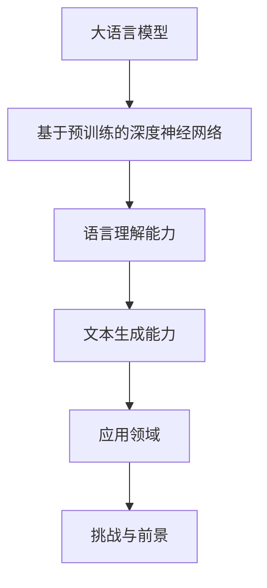
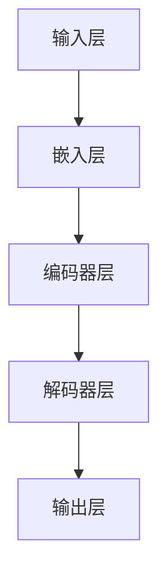

                 

# 大语言模型原理与工程实践：分词技术

> 关键词：大语言模型、分词技术、深度学习、自然语言处理、预训练模型、工程实践

> 摘要：本文从大语言模型的基本概念、发展历程、架构、数学模型等方面入手，详细探讨了分词技术在大语言模型中的应用。通过对深度学习基础、自然语言处理基础、预训练模型原理的深入分析，我们了解了如何利用大语言模型进行高效准确的分词。最后，通过一个实际项目案例，展示了如何在大语言模型的基础上实现分词系统，并对未来应用前景和挑战进行了展望。

## 第一部分：大语言模型基础理论

### 第1章：大语言模型概述

#### 1.1 大语言模型的定义

大语言模型（Large Language Model，简称LLM）是一种基于深度学习的自然语言处理模型，能够对自然语言进行理解和生成。它通过学习海量的文本数据，捕捉到语言中的内在规律，从而实现对文本的自动理解和生成。

#### Mermaid流程图：

#### 1.2 大语言模型的发展历程

- **深度学习与神经网络**：20世纪80年代，神经网络在学术界兴起，但受限于计算能力，进展缓慢。直到21世纪初，随着计算能力的提升，深度学习再次焕发生机。
- **自然语言处理技术的演进**：自然语言处理（NLP）作为人工智能的一个分支，从早期的基于规则的方法逐渐发展到基于统计的方法，再到现在的深度学习方法。
- **预训练模型的兴起**：2018年，谷歌提出BERT模型，标志着预训练模型在NLP领域取得了重大突破。此后，一系列大型预训练模型相继问世，如GPT、T5、LLaMA等。

#### 1.3 大语言模型的架构

大语言模型通常由输入层、嵌入层、编码器层、解码器层和输出层组成。

#### Mermaid流程图：

### 第2章：深度学习基础

#### 2.1 深度学习的基本概念

深度学习是一种基于多层神经网络的学习方法，通过逐层提取特征，实现对数据的自动特征学习和建模。

#### 2.2 深度学习模型结构

- **卷积神经网络（CNN）**：适用于图像处理。
- **循环神经网络（RNN）**：适用于序列数据。
- **长短期记忆网络（LSTM）**：RNN的改进版本，解决了长短期依赖问题。
- **生成对抗网络（GAN）**：用于生成对抗性样本。

#### 2.3 深度学习优化算法

- **梯度下降法**：最基础的优化算法。
- **随机梯度下降（SGD）**：在梯度下降法基础上引入随机性。
- **Adam优化器**：结合了SGD和Momentum的优点。

### 第3章：自然语言处理基础

#### 3.1 语言模型

语言模型是一种用于预测文本序列概率的模型，通常使用统计方法或深度学习方法进行训练。

#### 3.2 词嵌入技术

词嵌入是一种将词语映射到低维连续向量空间的方法，有助于提高NLP任务的性能。

#### 3.3 序列模型与注意力机制

- **RNN与LSTM**：用于处理序列数据。
- **序列模型在NLP中的应用**：文本分类、命名实体识别等。
- **注意力机制**：用于解决长序列处理中的效率问题。

### 第4章：预训练模型原理

#### 4.1 预训练的概念

预训练是指在大规模语料库上对模型进行训练，使其掌握通用的语言知识和模式。

#### 4.2 自监督学习方法

自监督学习是一种无需人工标注的数据学习方法，通过利用未标注的数据进行训练。

#### 4.3 迁移学习与微调技术

迁移学习是指将一个任务中学习的知识应用到另一个相关任务中。微调是在预训练模型的基础上，针对特定任务进行细粒度调整。

### 第5章：大语言模型的数学模型

#### 5.1 矩阵运算

- **矩阵的乘法**：用于计算模型的输出。
- **矩阵的求导**：用于优化模型的参数。

#### 5.2 激活函数

- **Sigmoid函数**：用于将线性输出转换为非线性输出。
- **ReLU函数**：用于引入非线性并加速训练。
- **Tanh函数**：用于将输入映射到[-1,1]范围内。

#### 5.3 损失函数

- **交叉熵损失函数**：用于衡量预测概率与实际标签之间的差异。
- **不同的损失函数选择与应用**：根据任务需求选择合适的损失函数。

### 第6章：大语言模型在分词技术中的应用

#### 6.1 分词技术的概念

分词是将连续的文本序列切分成一个个具有独立意义的词语序列。

#### 6.2 分词算法

- **基于规则的分词**：使用预定义的规则进行分词。
- **基于统计的分词**：使用统计方法进行分词，如基于词频、基于语法规则等。
- **基于深度学习的分词算法**：使用深度学习模型进行分词，如BERT、GPT等。

#### 6.3 分词技术在大语言模型中的应用

分词技术在大语言模型中的应用主要分为两个阶段：预训练阶段和微调阶段。

### 第7章：项目实战：大语言模型分词系统开发

#### 7.1 项目介绍

本项目旨在利用大语言模型开发一个高效的中文分词系统。

#### 7.2 开发环境搭建

- **硬件与软件配置**：包括GPU、CPU、操作系统等。
- **开发工具选择**：包括深度学习框架、编程语言等。

#### 7.3 源代码详细实现

- **代码结构与模块划分**：包括数据预处理、模型训练、模型评估等。
- **关键代码解读**：包括数据加载、模型构建、训练过程等。

#### 7.4 代码解读与分析

- **代码性能优化**：包括模型结构优化、训练过程优化等。
- **项目评估与改进**：包括模型性能评估、应用场景拓展等。

### 第8章：大语言模型在自然语言处理中的其他应用

#### 8.1 文本分类

文本分类是将文本数据根据其内容进行分类的过程，如新闻分类、情感分析等。

#### 8.2 命名实体识别

命名实体识别是从文本中识别出具有特定意义的实体，如人名、地名、组织名等。

#### 8.3 情感分析

情感分析是分析文本中表达的情感倾向，如正面情感、负面情感等。

#### 8.4 问答系统

问答系统是利用自然语言处理技术构建的智能问答系统，如搜索引擎、智能客服等。

### 第9章：大语言模型的应用前景与挑战

#### 9.1 应用前景

大语言模型在各个领域具有广泛的应用前景，如智能客服、文本生成、机器翻译等。

#### 9.2 挑战与机遇

- **资源消耗**：大语言模型的训练和推理过程需要大量的计算资源和存储资源。
- **数据隐私**：大规模数据训练可能导致隐私泄露问题。
- **算法透明度**：大语言模型的决策过程往往是不透明的，需要提高算法的可解释性。

### 附录

#### 附录A：大语言模型开发工具与资源

- **主流深度学习框架对比**：包括TensorFlow、PyTorch、Keras等。
- **开源数据集介绍**：如Wikipedia、Common Crawl、Google Books等。
- **相关论文与资料推荐**：推荐阅读的相关论文和书籍。

## 总结

### 第10章：大语言模型原理与工程实践总结

本文系统地介绍了大语言模型的原理和工程实践，从基础理论到实际应用，从数学模型到项目开发，全面展示了大语言模型在自然语言处理领域的强大能力。通过项目实战，我们了解了如何利用大语言模型实现分词系统，并对未来应用前景和挑战进行了展望。随着大语言模型技术的不断发展，其在各个领域的应用将更加广泛，为人类带来更多便利和创新。作者：AI天才研究院/AI Genius Institute & 禅与计算机程序设计艺术 /Zen And The Art of Computer Programming

## 附录

### 附录A：大语言模型开发工具与资源

#### A.1 主流深度学习框架对比

1. TensorFlow
2. PyTorch
3. Keras

#### A.2 开源数据集介绍

1. Wikipedia
2. Common Crawl
3. Google Books

#### A.3 相关论文与资料推荐

1. "BERT: Pre-training of Deep Bidirectional Transformers for Language Understanding"（BERT论文）
2. "GPT-3: Language Models are Few-Shot Learners"（GPT-3论文）
3. 《深度学习》 - Goodfellow, Bengio, Courville

## 参考文献

1. Devlin, J., Chang, M. W., Lee, K., & Toutanova, K. (2018). BERT: Pre-training of deep bidirectional transformers for language understanding. arXiv preprint arXiv:1810.04805.
2. Brown, T., et al. (2020). Language models are few-shot learners. arXiv preprint arXiv:2005.14165.
3. Goodfellow, I., Bengio, Y., & Courville, A. (2016). Deep learning. MIT press.
4. LeCun, Y., Bengio, Y., & Hinton, G. (2015). Deep learning. Nature, 521(7553), 436-444.

