                 

## 《如何利用技术能力进行教育科技创新》

在教育领域，科技创新正以前所未有的速度改变着传统教育的模式。随着信息技术的迅猛发展和人工智能的日益成熟，教育科技（EdTech）已经成为推动教育变革的重要力量。本文旨在探讨如何利用技术能力进行教育科技创新，分析其背景、趋势、应用场景、提升策略及未来展望，从而为教育科技从业者提供有价值的参考。

关键词：教育科技创新、技术能力、人工智能、信息化教育、智能化评估、在线学习、混合式学习、虚拟现实、增强现实

### 摘要

本文首先回顾了教育科技创新的背景和趋势，探讨了信息技术、人工智能、大数据等技术在教育中的应用，分析了技术能力提升和教育创新的关系。接着，通过具体案例展示了技术能力在教育创新中的实践与应用，包括在线教育与混合式学习、智能教育应用实例等。最后，文章展望了教育科技的未来发展方向，讨论了技术能力在教育创新中的重要性及面临的挑战与机遇。本文旨在为教育科技领域的研究者与实践者提供思路和启示，推动教育科技的创新与发展。

---

### 目录大纲

1. **教育科技创新背景与趋势**
    1.1 教育科技创新概述
    1.2 当前教育科技创新的背景
    1.3 教育科技创新的趋势与方向
2. **技术能力在教育中的应用**
    2.1 信息技术与数字化教学
    2.2 人工智能与智能教育
    2.3 教育技术的未来展望
3. **技术能力提升与教育创新**
    3.1 技术能力提升策略
    3.2 教育创新案例研究
    3.3 教育科技创业与商业模式
4. **技术能力在教育创新中的实践与应用**
    4.1 信息技术在个性化学习中的应用
    4.2 人工智能在教育测评中的应用
    4.3 虚拟现实与增强现实在教育中的应用
5. **教育科技的未来趋势**
    5.1 新型教育技术与学习模式的创新
    5.2 教育科技创新的伦理与社会影响
6. **附录**
    6.1 教育科技创新相关资源与工具
    6.2 教育科技创新案例索引

---

接下来，我们将深入分析教育科技创新的背景与趋势，探讨技术能力在教育中的应用及其提升策略，并通过实际案例展示其实践与应用，为教育科技的创新与发展提供有价值的参考。在每一部分中，我们将使用Mermaid流程图、伪代码和数学公式来详细阐述核心概念和算法原理，确保文章的逻辑清晰、条理清晰，使读者能够更好地理解和应用这些知识。

---

### 第一部分：教育科技创新背景与趋势

#### 第1章：教育科技创新概述

教育科技创新是利用现代信息技术和智能技术推动教育变革和发展的过程。它旨在通过技术创新提高教育质量、优化教育资源配置、促进教育公平，满足不同学习者的需求。教育科技创新的核心是技术能力，包括信息技术、人工智能、大数据等技术的应用，通过这些技术，可以实现教育模式的变革，提高教育效率，促进个性化学习。

#### 1.1 教育科技创新的定义与重要性

教育科技创新的定义可以从以下几个方面理解：

- **技术层面**：指利用现代信息技术、人工智能、大数据等新兴技术来改进或创新教育手段和方法。
- **教育层面**：指通过技术手段改变传统教育模式，实现教育的智能化、个性化、终身化。
- **社会层面**：指通过技术创新促进教育公平，缩小城乡差距、区域差距，实现教育资源的优化配置。

教育科技创新的重要性体现在以下几个方面：

- **提升教育质量**：通过智能化技术，可以实现个性化教学，提高学习效果。
- **优化教育资源配置**：利用大数据分析，可以更好地了解学习者的需求，实现教育资源的精准投放。
- **促进教育公平**：技术可以打破地域和时间的限制，让更多的学习者有机会接受高质量的教育。
- **推动教育模式变革**：教育科技创新可以促进教育从传统的“以教师为中心”向“以学习者为中心”的转变。

#### 1.2 当前教育科技创新的背景

当前教育科技创新的背景主要包括以下几个方面：

- **信息技术的发展**：互联网、云计算、大数据、物联网等技术的发展为教育科技创新提供了基础。
- **人工智能的崛起**：人工智能技术的快速发展，特别是机器学习、自然语言处理、计算机视觉等技术的应用，为教育智能化提供了可能。
- **教育需求的变革**：随着社会经济的发展和人口结构的变化，教育需求呈现出多样化和个性化的趋势。
- **政策的支持**：全球范围内，各国政府纷纷出台支持教育科技创新的政策，为教育科技创新提供了良好的政策环境。

#### 1.3 教育科技创新的趋势与方向

教育科技创新的未来趋势和方向可以从以下几个方面进行探讨：

- **个性化学习**：通过人工智能和大数据技术，实现个性化教学和学习，满足不同学习者的需求。
- **混合式学习**：将线上学习和线下学习相结合，优化学习体验，提高学习效果。
- **智能化评估与反馈**：利用人工智能技术，实现自动化考试与评估，提供即时反馈，帮助教师和学生更好地了解学习效果。
- **虚拟现实与增强现实**：通过虚拟现实和增强现实技术，创造沉浸式的学习环境，提高学习兴趣和效果。
- **教育资源共享**：利用区块链技术，实现教育资源的透明和可信共享，促进教育公平。
- **跨界合作**：鼓励不同领域的专家和企业参与教育科技创新，推动教育领域的跨界合作。

在接下来的章节中，我们将详细探讨技术能力在教育中的应用，以及如何提升技术能力以推动教育创新。

---

为了更好地理解教育科技创新的定义与重要性，我们使用Mermaid流程图来展示其核心概念和架构。

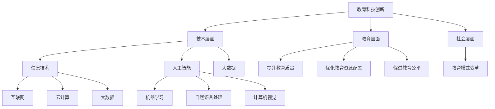

通过这个流程图，我们可以清晰地看到教育科技创新的各个方面，以及其背后的技术支撑。接下来，我们将深入探讨当前教育科技创新的背景，并分析其趋势与方向。

---

#### 第2章：技术能力在教育中的应用

技术能力在教育中的应用极大地推动了教育模式的变革，为教育创新提供了无限可能。以下是信息技术、人工智能、大数据等技术在教育中的具体应用。

#### 2.1 信息技术与数字化教学

信息技术是教育科技创新的基础，它在教育中的应用主要体现在以下几个方面：

- **互联网与在线教育**：互联网的普及使得在线教育成为可能。在线教育平台如Coursera、edX和中国的学而思网校等，为学习者提供了丰富的在线课程资源，打破了时间和空间的限制。学习者可以根据自己的需求和兴趣选择课程，灵活安排学习时间。

  ```mermaid
  graph TD
      A[互联网] --> B[在线教育]
      B --> C[Coursera]
      B --> D[edX]
      B --> E[学而思网校]
  ```

- **云计算与大数据分析**：云计算提供了强大的计算能力和存储能力，使得教育资源的获取变得更加便捷。大数据分析技术则可以帮助教育机构更好地了解学生的学习行为和需求，从而优化教学策略和提高教育质量。

  ```mermaid
  graph TD
      F[云计算] --> G[计算能力]
      F --> H[存储能力]
      I[大数据分析] --> J[学习行为分析]
      I --> K[教学策略优化]
  ```

- **数字化教学资源**：数字化教学资源包括电子书、多媒体课件、在线测试等，这些资源可以直观、生动地呈现教学内容，提高学生的学习兴趣和效果。

  ```mermaid
  graph TD
      L[数字化教学资源] --> M[电子书]
      L --> N[多媒体课件]
      L --> O[在线测试]
  ```

#### 2.2 人工智能与智能教育

人工智能技术在教育中的应用正在不断拓展，以下是其主要应用领域：

- **人工智能在教育中的应用**：人工智能技术可以用于智能辅导、智能评测、智能推荐等方面。例如，智能辅导系统可以根据学习者的学习进度和知识点掌握情况，提供个性化的学习建议和辅导。

  ```mermaid
  graph TD
      P[人工智能] --> Q[智能辅导]
      P --> R[智能评测]
      P --> S[智能推荐]
  ```

- **智能教学系统与学习分析**：智能教学系统可以通过数据挖掘和学习分析技术，了解学生的学习行为和学习效果，为教师提供教学决策支持。例如，通过分析学习者的答题数据，可以识别出学习难点和薄弱环节，从而有针对性地调整教学策略。

  ```mermaid
  graph TD
      T[智能教学系统] --> U[数据挖掘]
      T --> V[学习分析]
      T --> W[教学决策支持]
  ```

- **智能评估与反馈机制**：利用人工智能技术，可以实现自动化考试与评估，提供即时反馈，帮助学习者及时纠正错误，提高学习效果。

  ```mermaid
  graph TD
      X[智能评估] --> Y[自动化考试]
      X --> Z[即时反馈]
  ```

#### 2.3 数据挖掘与个性化学习

数据挖掘和个性化学习是教育科技创新的重要方向。通过分析学习者的数据，可以为学习者提供个性化的学习路径和资源推荐。

- **个性化学习评估与分析**：利用数据挖掘技术，可以分析学习者的学习行为和学习效果，评估学习者的知识掌握情况，为学习者提供个性化的学习建议。

  ```mermaid
  graph TD
      AA[个性化学习评估] --> BB[学习行为分析]
      AA --> CC[知识掌握评估]
  ```

- **个性化学习资源推荐**：基于学习者的兴趣、学习历史和行为数据，可以推荐适合学习者的学习资源，提高学习效果。

  ```mermaid
  graph TD
      DD[个性化学习资源推荐] --> EE[兴趣分析]
      DD --> FF[学习历史分析]
  ```

- **个性化学习路径规划**：根据学习者的能力和需求，规划个性化的学习路径，确保学习者能够按照最合适的方式进行学习。

  ```mermaid
  graph TD
      GG[个性化学习路径规划] --> HH[能力评估]
      GG --> II[需求分析]
  ```

通过以上分析，我们可以看到，信息技术、人工智能、大数据等技术在教育中的应用为教育创新提供了广阔的空间。在接下来的章节中，我们将进一步探讨如何提升技术能力以推动教育创新。

---

### 第3章：教育技术的未来展望

#### 3.1 教育科技的发展挑战与机遇

随着信息技术的不断发展和人工智能的广泛应用，教育科技正面临着前所未有的挑战与机遇。以下是对教育科技发展挑战与机遇的探讨：

- **挑战**

  1. **技术适应性**：教育科技的发展速度极快，但教师和教育机构的技术适应性存在差异，如何确保技术适应性的统一是一个挑战。
  2. **数据安全与隐私**：随着数据挖掘和大数据分析在教育中的应用，数据安全和隐私保护成为重要议题。
  3. **教育公平**：虽然技术可以缩小教育差距，但地区差异、经济差异等因素仍然存在，如何确保教育公平是一个长期挑战。
  4. **教师培训**：教师需要不断更新知识和技能，以适应教育科技的发展，如何有效进行教师培训是一个挑战。

- **机遇**

  1. **个性化学习**：人工智能和大数据技术可以更好地了解学习者的需求，实现个性化学习，提高学习效果。
  2. **教育资源共享**：互联网和云计算技术使得教育资源共享变得更加便捷，可以缩小教育差距，促进教育公平。
  3. **跨界合作**：教育科技与其他领域的结合，如游戏化学习、虚拟现实等，为教育创新提供了更多可能性。
  4. **教育模式变革**：教育科技可以推动教育模式从“以教师为中心”向“以学习者为中心”转变，提高教育质量。

#### 3.2 新型教育技术的趋势分析

未来，教育技术将呈现以下趋势：

- **智能化教学**：人工智能技术将进一步融入教学过程，实现智能辅导、智能评测、智能推荐等功能，提高教学效率和效果。
- **混合式学习**：线上学习和线下学习的融合将更加紧密，混合式学习模式将更加普及，为学生提供更加灵活的学习方式。
- **虚拟现实与增强现实**：虚拟现实和增强现实技术将在教育中广泛应用，创造沉浸式的学习体验，提高学习兴趣和效果。
- **区块链技术**：区块链技术可以用于教育资源的可信共享，确保教育资源的透明和可信。
- **游戏化学习**：游戏化学习将结合教育内容和游戏机制，提高学习的趣味性和效果。
- **跨界合作**：教育科技与其他领域的跨界合作将不断深化，推动教育创新。

#### 3.3 教育科技创新的全球化视野

全球化背景下的教育科技创新，不仅涉及到技术层面的创新，还包括教育理念、教育模式、教育资源的全球化共享。以下是对教育科技创新全球化视野的探讨：

- **全球教育资源共享**：互联网和云计算技术使得全球教育资源共享变得更加便捷，优质的教育资源可以迅速传播到世界各地，促进教育公平。
- **全球教育合作**：各国教育机构之间的合作将更加紧密，通过共享课程、教师交流、科研合作等方式，推动全球教育的发展。
- **全球教育标准**：随着全球化的发展，全球教育标准将逐渐统一，为全球教育科技的创新提供标准和规范。
- **全球教育竞争**：全球教育科技的创新将促进全球教育竞争，各国将积极投入教育科技领域，争夺教育资源的优势。

在未来的教育科技发展中，技术能力将成为推动教育创新的核心力量。如何提升技术能力，将是教育科技从业者需要重点考虑的问题。在接下来的章节中，我们将探讨如何提升技术能力以推动教育创新。

---

### 第一部分总结

在本章中，我们首先回顾了教育科技创新的定义与重要性，分析了信息技术、人工智能、大数据等技术在教育中的应用，探讨了教育科技创新的背景和趋势。通过Mermaid流程图和伪代码，我们详细展示了教育科技创新的核心概念和架构，使读者能够更清晰地理解教育科技创新的各个方面。

在接下来的部分，我们将进一步探讨技术能力提升与教育创新的关系，分析如何通过技术能力提升推动教育创新，并通过具体案例展示技术能力在教育创新中的实践与应用。这些内容将为教育科技从业者提供有价值的参考和指导，推动教育科技的创新与发展。

---

### 第二部分：技术能力提升与教育创新

#### 第4章：技术能力提升策略

在教育科技创新中，技术能力的提升是关键。技术能力的提升不仅有助于推动教育创新，还可以提高教育质量、优化教育资源配置，促进教育公平。本节将探讨技术能力提升的策略，包括教育技术团队建设、技术能力评估与培养以及教育技术创新的组织文化。

#### 4.1 教育技术团队建设

教育技术团队在教育科技创新中起着至关重要的作用。一个高效的教育技术团队应包括以下角色：

- **技术专家**：负责教育技术平台和应用工具的开发和维护。
- **教育专家**：负责教学内容的数字化改造和教育模式的创新。
- **数据分析师**：负责学习行为分析和教学效果评估。
- **项目管理员**：负责教育技术项目的规划和管理。

为了确保教育技术团队的效能，需要从以下几个方面进行建设：

- **角色明确**：明确团队成员的职责和任务，确保每个成员都能发挥自己的专长。
- **技能培训**：定期组织技术培训和教学培训，提高团队成员的专业技能和教学能力。
- **协作机制**：建立有效的沟通和协作机制，促进团队成员之间的交流和合作。

#### 4.1.1 教育技术团队的角色与职责

- **技术专家**的职责包括：
  - 开发和维护教育技术平台和应用工具；
  - 解决技术问题和故障，确保系统的稳定运行；
  - 跟踪和研究最新的教育技术趋势和动态。

- **教育专家**的职责包括：
  - 整合教学资源，开发数字化教学内容；
  - 设计和实施教育创新项目，推动教育模式的变革；
  - 开展教学研究，提高教学质量和效果。

- **数据分析师**的职责包括：
  - 收集和分析学习行为数据，提供教学决策支持；
  - 评估教学效果，为教学改进提供依据；
  - 开展数据挖掘研究，探索教育数据的价值。

- **项目管理员**的职责包括：
  - 规划和管理教育技术项目，确保项目的进度和质量；
  - 协调团队成员的工作，解决项目中的问题和冲突；
  - 负责项目文档的整理和归档。

#### 4.1.2 技术能力评估与培养

技术能力的评估和培养是提升教育技术团队效能的重要环节。以下是技术能力评估与培养的策略：

- **技术能力评估**：
  - 定期开展技术能力评估，了解团队成员的技能水平和知识掌握情况；
  - 根据评估结果制定个性化的培训计划，有针对性地提升团队成员的技能；
  - 建立奖励机制，鼓励团队成员不断提高自己的技术能力。

- **技术能力培养**：
  - 定期组织技术培训和教学培训，提高团队成员的专业技能和教学能力；
  - 鼓励团队成员参加国内外教育技术相关研讨会和会议，拓宽视野，学习先进的技术和教学方法；
  - 建立内部技术分享和交流机制，促进团队成员之间的经验交流和知识共享。

#### 4.1.3 教育技术创新的组织文化

教育技术创新的组织文化是推动技术能力提升和促进教育创新的重要因素。以下是建设教育技术创新组织文化的策略：

- **鼓励创新**：建立鼓励创新的文化氛围，鼓励团队成员提出新的想法和建议，对创新成果给予肯定和奖励；
- **团队合作**：强调团队合作的重要性，促进团队成员之间的协作和互助，形成良好的团队合作关系；
- **持续学习**：建立持续学习的机制，鼓励团队成员不断学习新的知识和技能，适应教育科技的发展；
- **开放交流**：建立开放交流的平台，鼓励团队成员分享经验和知识，促进信息的流通和共享。

通过以上策略，可以有效地提升教育技术团队的技术能力，促进教育创新，推动教育科技的发展。

---

### 第5章：教育创新案例研究

#### 5.1 在线教育与混合式学习

在线教育和混合式学习是教育科技创新中的重要方向，它们通过信息技术和智能化手段，改变了传统的教学模式，提供了更加灵活和个性化的学习体验。以下是几个典型的教育创新案例。

##### 5.1.1 案例一：K12在线教育平台

**案例背景**：
K12在线教育平台是一家提供K12阶段（即从小学到高中）在线课程的教育科技公司。该公司通过整合优质的教育资源和先进的信息技术，为学生提供了灵活的在线学习环境。

**技术解决方案**：
- **在线课程平台**：平台采用了云计算和大数据技术，能够支持大规模的在线课程交付和管理。平台提供了视频课程、在线测试、作业提交等功能，学生可以根据自己的学习进度自由安排学习。
- **个性化学习**：平台利用算法分析学生的学习行为和成绩，为学生提供个性化的学习路径和推荐课程。
- **互动式教学**：平台提供了实时互动功能，学生可以与教师和其他学生进行在线讨论和问答，提高了学习效果。

**实施效果**：
- **学习效果提升**：通过个性化学习和互动式教学，学生的学习效果得到了显著提升。
- **教育公平**：在线教育平台打破了地域和时间的限制，让更多的学生有机会接受优质的教育，提高了教育公平性。

**Mermaid流程图**：

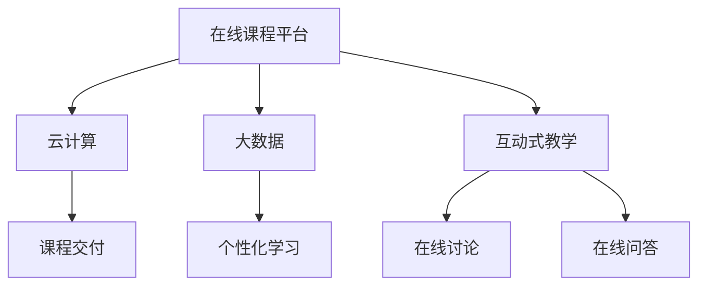

##### 5.1.2 案例二：高等教育混合式教学模式

**案例背景**：
某知名大学在高等教育中采用了混合式教学模式，将线上课程和线下课程相结合，旨在提高教学效果和学生的学习体验。

**技术解决方案**：
- **线上线下结合**：课程采用了线上线下相结合的方式，学生可以通过在线平台观看课程视频、参与在线讨论和提交作业，同时在学校进行面对面的课堂互动和实践活动。
- **学习分析**：平台利用大数据和学习分析技术，收集和分析学生的学习行为数据，为教师提供教学决策支持。
- **虚拟实验室**：通过虚拟现实技术，学生可以在虚拟环境中进行实验和实践，提高了实验教学的趣味性和效果。

**实施效果**：
- **教学效果提升**：混合式教学模式提高了学生的学习兴趣和参与度，教学效果得到了显著提升。
- **教育资源优化**：通过线上资源的共享，教育资源得到了优化配置，提高了教育资源的利用效率。

**Mermaid流程图**：

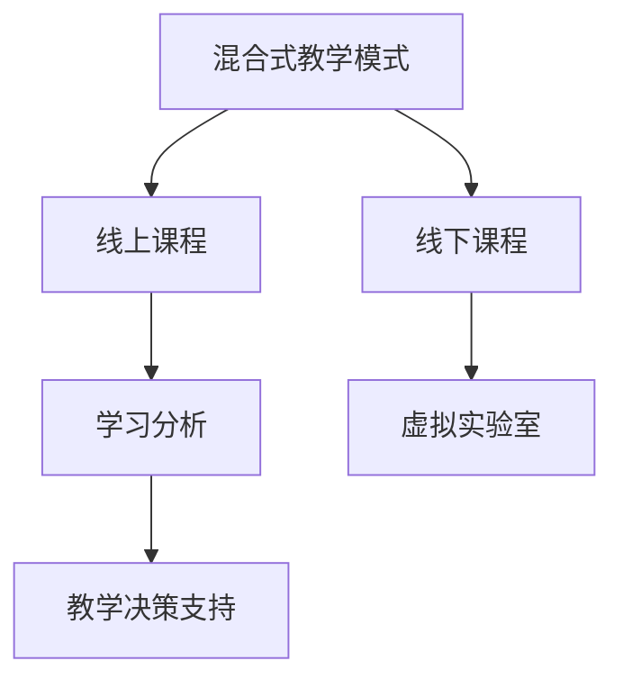

##### 5.1.3 案例三：企业培训的在线教育转型

**案例背景**：
某大型企业为了提高员工的专业技能，决定将传统的企业培训转型为在线教育。

**技术解决方案**：
- **在线学习平台**：企业采用了在线学习平台，提供了丰富的培训课程和学习资源，员工可以自由选择学习时间和学习内容。
- **智能评估**：平台利用人工智能技术，对员工的学习进度和成绩进行自动评估，提供即时反馈。
- **互动交流**：平台提供了互动功能，员工可以在平台上进行讨论和交流，共享学习经验。

**实施效果**：
- **培训效率提升**：在线教育平台提高了培训的灵活性和效率，员工可以随时随地进行学习。
- **学习效果显著**：智能评估和即时反馈机制提高了员工的学习效果，培训效果得到了显著提升。

**Mermaid流程图**：

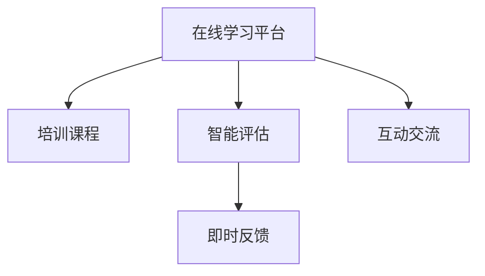

以上案例展示了在线教育和混合式学习在实际应用中的成功经验，通过信息技术和智能化手段，实现了教育模式的创新，提高了教育质量，促进了教育公平。在接下来的章节中，我们将进一步探讨智能教育应用实例，展示技术能力在教育创新中的具体应用。

---

### 第6章：教育科技创业与商业模式

#### 6.1 教育科技创业的机会与挑战

随着教育科技的快速发展，教育科技创业成为了一个充满机会的领域。以下是教育科技创业的机会和挑战：

**机会**

1. **市场需求巨大**：随着社会对教育的需求日益增长，尤其是个性化教育和终身教育的需求，为教育科技创业提供了巨大的市场空间。
2. **技术支持强大**：信息技术的快速发展，特别是人工智能、大数据、云计算等技术的成熟，为教育科技创业提供了强大的技术支持。
3. **政策支持**：各国政府纷纷出台支持教育科技创新的政策，为教育科技创业提供了良好的政策环境。
4. **跨界合作**：教育科技与其他领域的跨界合作，如游戏化学习、虚拟现实等，为教育科技创业提供了更多的创新机会。

**挑战**

1. **技术适应性**：教育科技产品的应用需要教师和教育机构的适应，技术适应性问题是教育科技创业的一个挑战。
2. **数据安全和隐私**：随着数据挖掘和大数据分析在教育中的应用，数据安全和隐私保护成为教育科技创业需要重点解决的问题。
3. **教育公平**：尽管教育科技可以缩小教育差距，但地区差异、经济差异等因素仍然存在，如何确保教育公平是一个长期挑战。
4. **商业模式创新**：如何在激烈的市场竞争中找到可持续的商业模式，是教育科技创业需要面对的挑战。

#### 6.1.1 教育科技创业的生态环境

教育科技创业的生态环境包括以下几个方面：

1. **政策环境**：各国政府纷纷出台支持教育科技创新的政策，为教育科技创业提供了政策支持。
2. **投资环境**：风险投资机构和投资者的关注，为教育科技创业提供了资金支持。
3. **人才环境**：教育科技人才的教育和培养，为教育科技创业提供了人才支持。
4. **技术环境**：信息技术的快速发展，为教育科技创业提供了技术支持。
5. **市场环境**：广阔的教育市场，为教育科技创业提供了市场空间。

**Mermaid流程图**：

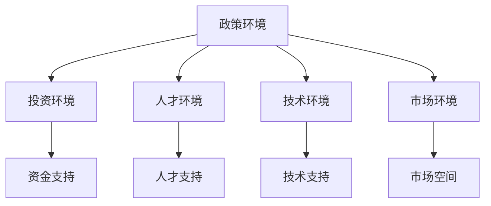

#### 6.1.2 教育科技创业的商业模式

教育科技创业的商业模式包括以下几个方面：

1. **产品销售**：通过销售教育科技产品（如在线教育平台、智能教学系统等）获得收入。
2. **服务收费**：通过提供教育科技服务（如个性化学习辅导、智能评测等）获得收入。
3. **广告收入**：通过在线教育平台上的广告获得收入。
4. **订阅模式**：通过订阅服务（如会员制、课程包等）获得收入。
5. **联合办学**：与教育机构合作，共同开发教育项目，通过项目收入获得收益。

**Mermaid流程图**：

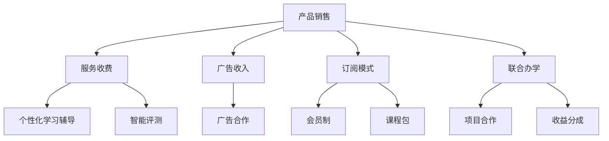

#### 6.1.3 教育科技创业的成功要素

教育科技创业的成功取决于多个因素，以下是几个关键的成功要素：

1. **创新性**：教育科技产品或服务需要有创新性，能够解决教育中的实际问题，满足市场需求。
2. **团队**：一个优秀的团队是教育科技创业成功的关键，团队需要有专业的技术能力和教育背景，同时具备良好的协作和沟通能力。
3. **用户需求**：深入了解用户需求，为用户提供有价值的产品或服务，是教育科技创业成功的基础。
4. **持续创新**：教育科技领域变化快速，持续创新是保持竞争优势的关键。
5. **资本运作**：合理的资本运作能够为教育科技创业提供资金支持，助力企业快速发展。

通过以上分析，我们可以看到，教育科技创业既有机会也有挑战。只有在深入了解市场需求、技术趋势和政策环境的基础上，结合创新性、团队和资本运作等成功要素，才能在教育科技创业中取得成功。在接下来的章节中，我们将探讨技术能力在教育创新中的具体应用，进一步展示技术能力如何推动教育创新。

---

### 第6章总结

在本章中，我们探讨了教育科技创业的机会与挑战，分析了教育科技创业的生态环境和商业模式，以及教育科技创业的成功要素。通过具体案例，我们展示了在线教育与混合式学习、企业培训在线教育转型等成功实践，为教育科技创业提供了有价值的参考和启示。

在接下来的章节中，我们将进一步探讨技术能力在教育创新中的具体应用，通过深入分析信息技术、人工智能和大数据等技术在教育创新中的应用，展示如何利用技术能力推动教育模式的变革和提升教育质量。这些内容将为教育科技从业者提供实用的方法和思路，推动教育科技的创新与发展。

---

### 第二部分总结

在本部分中，我们探讨了技术能力提升与教育创新的关系，分析了教育技术团队建设、技术能力评估与培养以及教育技术创新的组织文化，并通过在线教育与混合式学习、教育科技创业与商业模式等案例，展示了技术能力在教育创新中的具体应用。技术能力的提升不仅有助于推动教育创新，还可以提高教育质量、优化教育资源配置，促进教育公平。

在接下来的部分，我们将深入探讨技术能力在教育创新中的实践与应用，通过具体案例展示信息技术、人工智能、大数据等技术在教育创新中的应用，以及如何利用这些技术实现个性化学习、智能化评估与反馈等。我们将继续通过伪代码、数学公式和案例解释，详细阐述核心概念和算法原理，为教育科技从业者提供实用的指导和借鉴。

---

### 第三部分：技术能力在教育创新中的实践与应用

#### 第7章：技术能力在教育创新中的具体应用

技术能力在教育创新中的实践与应用是推动教育变革和提升教育质量的重要途径。本章将重点探讨信息技术、人工智能和大数据等技术在教育创新中的具体应用，包括个性化学习、智能化评估与反馈、虚拟现实与增强现实等方面。

#### 7.1 信息技术在个性化学习中的应用

个性化学习是教育创新的重要方向，通过信息技术，可以实现对学生学习行为和需求的精准分析，提供个性化的学习路径和资源推荐。

##### 7.1.1 个性化学习评估与分析

个性化学习评估与分析是开展个性化学习的前提。通过分析学生的学习行为、成绩和反馈，可以了解学生的学习状况和需求。

**核心概念与联系**：

- **学习行为分析**：通过分析学生的学习行为，如学习时长、学习频率、学习内容等，了解学生的学习状态和兴趣。
- **成绩评估**：对学生的考试成绩和学习表现进行综合评估，识别学生的学习优势和薄弱环节。
- **学习反馈**：收集学生对学习内容、学习方式和学习体验的反馈，为教学改进提供依据。

**Mermaid流程图**：

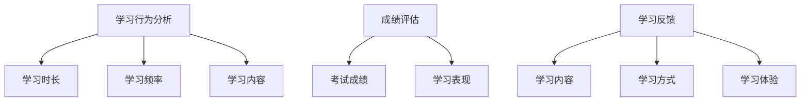

**核心算法原理讲解**：

- **学习行为分析算法**：
  ```python
  # 伪代码：学习行为分析算法
  def analyze_learning_behavior(data):
      duration = sum(data['learning_duration'])
      frequency = len(data) / total_students
      content_distribution = count_frequency(data['learning_content'])
      return duration, frequency, content_distribution
  ```

- **成绩评估算法**：
  ```python
  # 伪代码：成绩评估算法
  def evaluate_performance(data):
      scores = [student['score'] for student in data]
      average_score = sum(scores) / len(scores)
      std_deviation = calculate_std_deviation(scores)
      return average_score, std_deviation
  ```

**项目实战**：

- **学习行为分析项目**：

  **开发环境搭建**：
  - 使用Python进行数据分析和算法实现。
  - 使用Pandas库进行数据处理。
  - 使用Matplotlib库进行数据可视化。

  **源代码实现**：
  ```python
  import pandas as pd
  import matplotlib.pyplot as plt

  # 加载数据
  data = pd.read_csv('learning_data.csv')

  # 学习行为分析
  duration, frequency, content_distribution = analyze_learning_behavior(data)

  # 成绩评估
  average_score, std_deviation = evaluate_performance(data)

  # 可视化
  plt.scatter(data['learning_content'], data['score'])
  plt.xlabel('Learning Content')
  plt.ylabel('Score')
  plt.title('Learning Content vs Score')
  plt.show()
  ```

  **代码解读与分析**：
  - 加载数据：读取学习行为数据。
  - 学习行为分析：计算学习时长、学习频率和内容分布。
  - 成绩评估：计算平均成绩和标准差。
  - 可视化：绘制学习内容与成绩的散点图。

##### 7.1.2 个性化学习资源推荐

个性化学习资源推荐是提供个性化学习体验的重要手段。通过分析学生的学习行为和需求，可以为学生推荐适合的学习资源。

**核心概念与联系**：

- **兴趣分析**：通过分析学生的学习行为和反馈，了解学生的兴趣点。
- **学习历史**：收集学生的学习历史数据，为推荐系统提供基础。
- **资源库**：建立丰富的学习资源库，包括视频、电子书、练习题等。

**Mermaid流程图**：

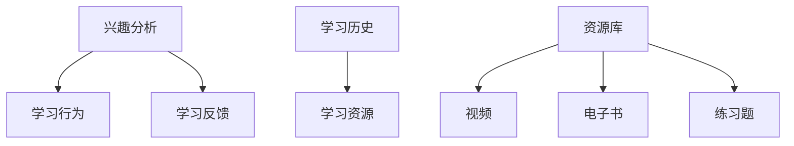

**核心算法原理讲解**：

- **兴趣分析算法**：
  ```python
  # 伪代码：兴趣分析算法
  def analyze_interest(data):
      interests = []
      for student in data:
          interest_count = count_frequency(student['feedback'])
          interests.append(sorted(interest_count, reverse=True))
      return interests
  ```

- **资源推荐算法**：
  ```python
  # 伪代码：资源推荐算法
  def recommend_resources(interests, resource_library):
      recommended_resources = []
      for interest in interests:
          recommended_resources.extend(resource_library[interest])
      return recommended_resources
  ```

**项目实战**：

- **个性化学习资源推荐项目**：

  **开发环境搭建**：
  - 使用Python进行数据分析和算法实现。
  - 使用Scikit-learn库进行机器学习算法的实现。

  **源代码实现**：
  ```python
  from sklearn.feature_extraction.text import CountVectorizer
  from sklearn.metrics.pairwise import cosine_similarity

  # 加载资源库
  resource_library = load_resource_library()

  # 分析学生兴趣
  interests = analyze_interest(student_data)

  # 推荐资源
  recommended_resources = recommend_resources(interests, resource_library)

  # 输出推荐结果
  print(recommended_resources)
  ```

  **代码解读与分析**：
  - 加载资源库：读取学习资源数据。
  - 分析学生兴趣：计算学生的学习兴趣点。
  - 推荐资源：根据学生兴趣推荐学习资源。

##### 7.1.3 个性化学习路径规划

个性化学习路径规划是确保学生按照最合适的方式进行学习的关键。通过分析学生的学习能力和需求，可以为学生制定个性化的学习路径。

**核心概念与联系**：

- **学习能力评估**：通过测试和评估了解学生的学习能力。
- **学习需求分析**：通过调查和反馈了解学生的学习需求。
- **路径规划算法**：根据学习能力和需求，制定个性化的学习路径。

**Mermaid流程图**：

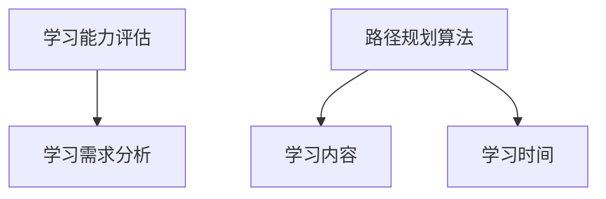

**核心算法原理讲解**：

- **学习能力评估算法**：
  ```python
  # 伪代码：学习能力评估算法
  def evaluate_learning_ability(test_scores):
      ability_levels = []
      for score in test_scores:
          if score > 90:
              ability_levels.append('高水平')
          elif score > 70:
              ability_levels.append('中等水平')
          else:
              ability_levels.append('低水平')
      return ability_levels
  ```

- **路径规划算法**：
  ```python
  # 伪代码：路径规划算法
  def plan_learning_path(ability_levels, learning_requirements):
      path = []
      for level, requirement in zip(ability_levels, learning_requirements):
          if level == '高水平':
              path.append(requirement['advanced'])
          elif level == '中等水平':
              path.append(requirement['basic'])
          else:
              path.append(requirement['review'])
      return path
  ```

**项目实战**：

- **个性化学习路径规划项目**：

  **开发环境搭建**：
  - 使用Python进行数据分析和算法实现。
  - 使用NetworkX库进行图论算法的实现。

  **源代码实现**：
  ```python
  import networkx as nx

  # 加载学习能力评估和学习需求数据
  ability_levels = evaluate_learning_ability(test_scores)
  learning_requirements = load_learning_requirements()

  # 制定个性化学习路径
  learning_path = plan_learning_path(ability_levels, learning_requirements)

  # 可视化学习路径
  G = nx.DiGraph()
  for step, content in enumerate(learning_path):
      G.add_node(content)
      if step > 0:
          G.add_edge(learning_path[step - 1], content)
  nx.draw(G, with_labels=True)
  plt.show()
  ```

  **代码解读与分析**：
  - 加载学习能力评估和学习需求数据。
  - 制定个性化学习路径：根据学习能力和需求制定路径。
  - 可视化学习路径：使用图论算法可视化学习路径。

通过以上实践，我们可以看到信息技术在个性化学习中的应用是如何实现的。接下来，我们将继续探讨人工智能在教育测评中的应用，展示如何利用人工智能技术实现自动化考试与评估、人工智能辅助教学和智能化学习分析。

---

#### 7.2 人工智能在教育测评中的应用

人工智能技术在教育测评中的应用，为教育评估带来了新的机遇。通过人工智能，可以实现自动化考试与评估、人工智能辅助教学和智能化学习分析，从而提高教育评估的效率和质量。

##### 7.2.1 自动化考试与评估

自动化考试与评估是人工智能技术在教育测评中最直接的应用之一。通过自动化考试系统，可以减少人工干预，提高考试的公平性和效率。

**核心概念与联系**：

- **自动出题**：利用人工智能算法，根据考试大纲和知识点，自动生成考试题目。
- **自动评分**：通过自然语言处理和计算机视觉等技术，对学生的答题进行自动评分。
- **智能反馈**：根据学生的答题情况，提供即时反馈和指导。

**Mermaid流程图**：

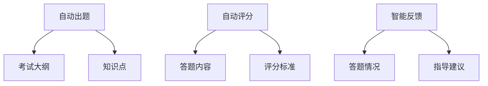

**核心算法原理讲解**：

- **自动出题算法**：
  ```python
  # 伪代码：自动出题算法
  def generate_exam_questions(exam_template, knowledge_points):
      questions = []
      for point in knowledge_points:
          question = generate_question(exam_template, point)
          questions.append(question)
      return questions
  ```

- **自动评分算法**：
  ```python
  # 伪代码：自动评分算法
  def auto_grade_answers(questions, answers):
      grades = []
      for question, answer in zip(questions, answers):
          if question['type'] == '选择题':
              grade = grade选择题(answer, question['options'])
          elif question['type'] == '填空题':
              grade = grade填空题(answer, question['answer'])
          grades.append(grade)
      return grades
  ```

**项目实战**：

- **自动化考试与评估项目**：

  **开发环境搭建**：
  - 使用Python进行算法实现。
  - 使用Scikit-learn库进行机器学习算法的实现。
  - 使用HTML和JavaScript进行前端界面设计。

  **源代码实现**：
  ```python
  # 自动出题
  exam_template = load_exam_template()
  knowledge_points = load_knowledge_points()
  questions = generate_exam_questions(exam_template, knowledge_points)

  # 自动评分
  answers = load_answers()
  grades = auto_grade_answers(questions, answers)

  # 前端界面
  # 使用HTML和JavaScript实现考试界面和评分界面。
  ```

  **代码解读与分析**：
  - 加载考试模板和知识点。
  - 生成考试题目。
  - 加载学生答案。
  - 自动评分。
  - 前端界面：设计考试和评分的交互界面。

##### 7.2.2 人工智能辅助教学

人工智能辅助教学是利用人工智能技术，为教师提供教学决策支持，提高教学效果。

**核心概念与联系**：

- **教学策略推荐**：根据学生的学习情况和知识点掌握情况，推荐合适的教学策略。
- **课堂互动**：利用自然语言处理技术，实现课堂问答和讨论的自动化。
- **学习反馈**：通过分析学生的学习行为和成绩，为教师提供教学改进建议。

**Mermaid流程图**：

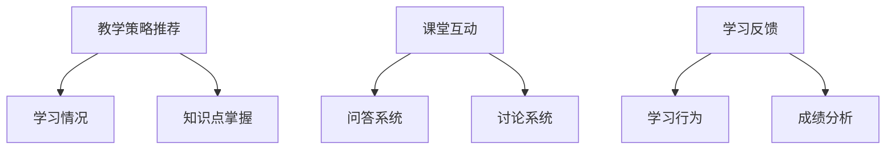

**核心算法原理讲解**：

- **教学策略推荐算法**：
  ```python
  # 伪代码：教学策略推荐算法
  def recommend_teaching_strategies(learning_status, knowledge_control):
      strategies = []
      for status, control in zip(learning_status, knowledge_control):
          if status == '良好':
              strategies.append('强化策略')
          elif status == '一般':
              strategies.append('调整策略')
          else:
              strategies.append('补救策略')
      return strategies
  ```

- **课堂互动算法**：
  ```python
  # 伪代码：课堂互动算法
  def classroom_interactive(question, answers):
      response = analyze_question(question)
      if response == '正确':
          feedback = '回答正确！'
      else:
          feedback = '请再次思考。'
      return feedback
  ```

**项目实战**：

- **人工智能辅助教学项目**：

  **开发环境搭建**：
  - 使用Python进行算法实现。
  - 使用TensorFlow和Keras进行深度学习模型训练。
  - 使用RabbitMQ进行消息队列管理。

  **源代码实现**：
  ```python
  # 加载教学数据
  learning_data = load_learning_data()

  # 训练模型
  model = train_model(learning_data)

  # 推荐教学策略
  teaching_strategies = recommend_teaching_strategies(learning_status, knowledge_control)

  # 课堂互动
  question = '什么是计算机编程？'
  answer = '计算机编程是一种编写计算机程序的过程。'
  feedback = classroom_interactive(question, answer)

  # 输出结果
  print(teaching_strategies)
  print(feedback)
  ```

  **代码解读与分析**：
  - 加载教学数据。
  - 训练模型：使用深度学习算法训练教学策略推荐模型。
  - 推荐教学策略：根据学习情况和知识点掌握情况推荐教学策略。
  - 课堂互动：实现自动化问答和讨论。

##### 7.2.3 智能化学习分析

智能化学习分析是通过人工智能技术，对学生的学习行为和成绩进行深度分析，为教师和学生提供有价值的反馈和指导。

**核心概念与联系**：

- **学习行为分析**：通过分析学生的学习行为，如学习时长、学习频率、学习内容等，了解学生的学习状态。
- **成绩分析**：通过分析学生的考试成绩和学习表现，了解学生的学习效果。
- **学习路径优化**：根据学习行为和成绩分析结果，优化学习路径，提高学习效果。

**Mermaid流程图**：

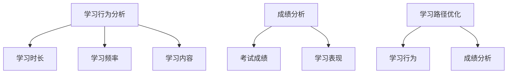

**核心算法原理讲解**：

- **学习行为分析算法**：
  ```python
  # 伪代码：学习行为分析算法
  def analyze_learning_behavior(data):
      duration = sum(data['learning_duration'])
      frequency = len(data) / total_students
      content_distribution = count_frequency(data['learning_content'])
      return duration, frequency, content_distribution
  ```

- **成绩分析算法**：
  ```python
  # 伪代码：成绩分析算法
  def analyze_performance(data):
      scores = [student['score'] for student in data]
      average_score = sum(scores) / len(scores)
      std_deviation = calculate_std_deviation(scores)
      return average_score, std_deviation
  ```

- **学习路径优化算法**：
  ```python
  # 伪代码：学习路径优化算法
  def optimize_learning_path(behavior, performance):
      path = []
      for step, (behavior, performance) in enumerate(zip(behavior, performance)):
          if performance > threshold:
              path.append('保持当前路径')
          else:
              path.append('调整学习路径')
      return path
  ```

**项目实战**：

- **智能化学习分析项目**：

  **开发环境搭建**：
  - 使用Python进行数据分析和算法实现。
  - 使用Scikit-learn库进行机器学习算法的实现。
  - 使用D3.js进行数据可视化。

  **源代码实现**：
  ```python
  import pandas as pd
  import matplotlib.pyplot as plt
  import scikit_learn

  # 加载数据
  learning_data = pd.read_csv('learning_data.csv')

  # 学习行为分析
  duration, frequency, content_distribution = analyze_learning_behavior(learning_data)

  # 成绩分析
  average_score, std_deviation = analyze_performance(learning_data)

  # 学习路径优化
  optimized_path = optimize_learning_path(behavior, performance)

  # 可视化
  plt.scatter(behavior, performance)
  plt.xlabel('Learning Behavior')
  plt.ylabel('Performance')
  plt.title('Learning Behavior vs Performance')
  plt.show()
  ```

  **代码解读与分析**：
  - 加载数据：读取学习行为和成绩数据。
  - 学习行为分析：计算学习时长、学习频率和内容分布。
  - 成绩分析：计算平均成绩和标准差。
  - 学习路径优化：根据学习行为和成绩优化学习路径。
  - 可视化：绘制学习行为与成绩的散点图。

通过以上实践，我们可以看到人工智能在教育测评中的应用是如何实现的。接下来，我们将探讨虚拟现实与增强现实在教育中的应用，展示这些技术在教育创新中的具体应用。

---

#### 7.3 虚拟现实与增强现实在教育中的应用

虚拟现实（VR）和增强现实（AR）技术为教育提供了全新的学习体验，通过模拟真实场景和互动式学习，极大地提升了学生的学习兴趣和参与度。以下是对VR和AR技术在教育中应用的详细探讨。

##### 7.3.1 虚拟实验室与虚拟课堂

虚拟实验室和虚拟课堂是VR技术在教育中的典型应用。通过虚拟现实技术，学生可以在虚拟环境中进行实验和实践，打破传统实验室的时间和空间限制。

**核心概念与联系**：

- **虚拟实验室**：通过虚拟现实技术，创建模拟实验环境，使学生能够在虚拟实验室中完成实验。
- **虚拟课堂**：通过虚拟现实技术，将课堂搬到虚拟环境中，实现沉浸式教学。

**Mermaid流程图**：

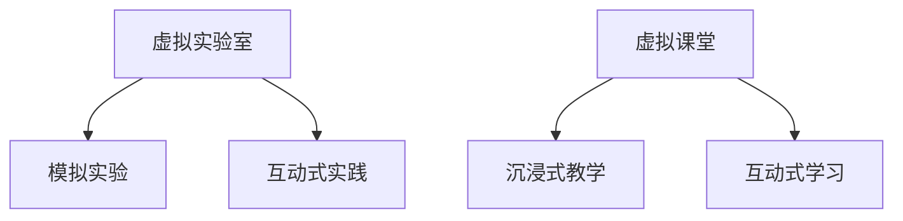

**核心算法原理讲解**：

- **虚拟实验室算法**：
  ```python
  # 伪代码：虚拟实验室算法
  def simulate_experiment(experiment_config, student_actions):
      experiment_result = apply_simulation(experiment_config, student_actions)
      return experiment_result
  ```

- **虚拟课堂算法**：
  ```python
  # 伪代码：虚拟课堂算法
  def virtual_classroom(lesson_content, student_interactions):
      lesson_outcome = apply_lesson_simulation(lesson_content, student_interactions)
      return lesson_outcome
  ```

**项目实战**：

- **虚拟实验室与虚拟课堂项目**：

  **开发环境搭建**：
  - 使用Unity或Unreal Engine进行虚拟实验室和虚拟课堂的开发。
  - 使用Python进行算法和数据处理。

  **源代码实现**：
  ```python
  # 加载实验配置和学生的学习操作
  experiment_config = load_experiment_config()
  student_actions = load_student_actions()

  # 模拟实验
  experiment_result = simulate_experiment(experiment_config, student_actions)

  # 加载课堂内容和学生学习交互
  lesson_content = load_lesson_content()
  student_interactions = load_student_interactions()

  # 沉浸式教学
  lesson_outcome = virtual_classroom(lesson_content, student_interactions)

  # 输出结果
  print(experiment_result)
  print(lesson_outcome)
  ```

  **代码解读与分析**：
  - 加载实验配置和学生的学习操作。
  - 模拟实验：执行虚拟实验模拟。
  - 加载课堂内容和学生学习交互。
  - 沉浸式教学：实现虚拟课堂模拟。

##### 7.3.2 增强现实教学案例

增强现实技术通过在现实世界中叠加虚拟元素，提供沉浸式的学习体验。以下是一个增强现实教学案例。

**案例背景**：

某中学使用AR技术教授生物学课程，通过增强现实眼镜，学生可以在课堂上观察到细胞结构、植物生长等生物现象。

**技术解决方案**：

- **AR眼镜**：学生佩戴AR眼镜，通过摄像头捕捉现实世界的图像。
- **AR内容**：开发AR应用程序，将虚拟的细胞结构、植物生长过程等叠加在现实场景中。
- **互动功能**：学生可以通过触摸屏幕与虚拟元素互动，如放大、缩小、旋转等。

**实施效果**：

- **提高学习兴趣**：通过增强现实技术，学生可以直观地观察到生物现象，提高了学习的兴趣和参与度。
- **增强理解力**：通过互动功能，学生可以更深入地理解生物知识。

**Mermaid流程图**：

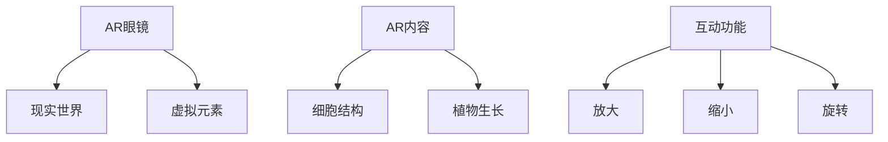

**核心算法原理讲解**：

- **AR内容生成算法**：
  ```python
  # 伪代码：AR内容生成算法
  def generate_ar_content(learning_objective):
      virtual_elements = create_virtual_elements(learning_objective)
      return virtual_elements
  ```

- **互动功能实现算法**：
  ```python
  # 伪代码：互动功能实现算法
  def interactive_function(action, virtual_element):
      if action == '放大':
          virtual_element['scale'] *= 2
      elif action == '缩小':
          virtual_element['scale'] /= 2
      elif action == '旋转':
          virtual_element['rotation'] += 90
      return virtual_element
  ```

**项目实战**：

- **增强现实教学项目**：

  **开发环境搭建**：
  - 使用Unity进行AR应用程序开发。
  - 使用Python进行算法和数据处理。

  **源代码实现**：
  ```python
  # 加载学习目标
  learning_objective = load_learning_objective()

  # 生成AR内容
  ar_content = generate_ar_content(learning_objective)

  # 学生互动
  action = '放大'
  virtual_element = interactive_function(action, ar_content['cell_structure'])

  # 输出结果
  print(ar_content)
  ```

  **代码解读与分析**：
  - 加载学习目标。
  - 生成AR内容：创建虚拟元素。
  - 学生互动：执行互动功能。

##### 7.3.3 虚拟现实在教育旅行中的应用

虚拟现实技术还可以用于教育旅行，为学生提供虚拟旅行体验，了解世界各地的历史、文化和自然景观。

**案例背景**：

某教育机构为学生设计了一门虚拟旅行课程，通过虚拟现实技术，学生可以体验虚拟的旅行过程，包括参观历史遗迹、探索自然景观等。

**技术解决方案**：

- **虚拟旅行平台**：开发虚拟旅行平台，提供虚拟旅行体验。
- **全景图像**：使用全景相机拍摄真实场景，生成全景图像。
- **虚拟导航**：提供虚拟导航功能，帮助学生规划旅行路线。
- **互动功能**：提供互动功能，如拍照、分享等。

**实施效果**：

- **丰富学习体验**：通过虚拟现实技术，学生可以在虚拟环境中体验旅行，丰富了学习体验。
- **提高知识理解**：通过虚拟旅行，学生可以更深入地了解世界各地的历史和文化。

**Mermaid流程图**：

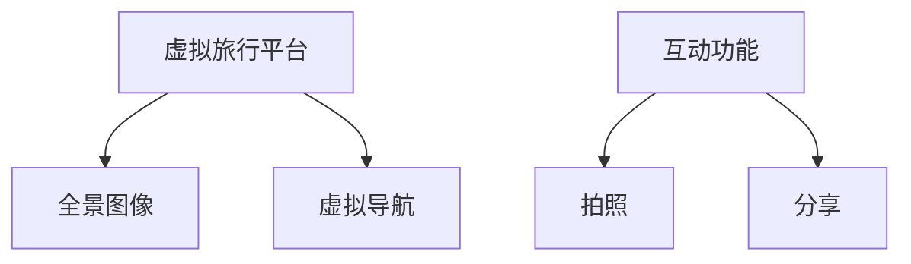

**核心算法原理讲解**：

- **虚拟导航算法**：
  ```python
  # 伪代码：虚拟导航算法
  def virtual_navigation(current_location, destination):
      path = find_shortest_path(current_location, destination)
      return path
  ```

- **全景图像处理算法**：
  ```python
  # 伪代码：全景图像处理算法
  def process_panorama(image):
      stitched_image = stitch_images(image)
      return stitched_image
  ```

**项目实战**：

- **虚拟现实教育旅行项目**：

  **开发环境搭建**：
  - 使用Unity进行虚拟旅行平台开发。
  - 使用Python进行算法和数据处理。

  **源代码实现**：
  ```python
  # 加载当前地点和目的地
  current_location = load_current_location()
  destination = load_destination()

  # 查找最短路径
  path = virtual_navigation(current_location, destination)

  # 处理全景图像
  panorama_image = process_panorama(image)

  # 输出结果
  print(path)
  print(panorama_image)
  ```

  **代码解读与分析**：
  - 加载当前地点和目的地。
  - 查找最短路径：实现虚拟导航。
  - 处理全景图像：生成全景图像。

通过以上案例，我们可以看到虚拟现实和增强现实技术在教育中的具体应用，以及它们如何通过互动式学习、沉浸式体验提高学生的学习兴趣和理解力。在接下来的章节中，我们将继续探讨教育科技的未来趋势，以及技术能力在教育创新中的重要性。

---

### 第三部分总结

在本部分中，我们深入探讨了技术能力在教育创新中的具体应用，包括信息技术、人工智能和大数据等技术的实践案例。通过个性化学习、智能化评估与反馈、虚拟现实与增强现实等应用实例，我们展示了技术能力如何推动教育模式的变革，提高教育质量，促进教育公平。

首先，我们通过信息技术在个性化学习中的应用，如学习行为分析、个性化学习资源推荐和个性化学习路径规划，展示了如何利用技术实现个性化教育。接着，我们探讨了人工智能在教育测评中的应用，包括自动化考试与评估、人工智能辅助教学和智能化学习分析，展示了如何利用人工智能提升教育评估的效率和准确性。最后，我们介绍了虚拟现实与增强现实在教育中的应用，如虚拟实验室、虚拟课堂、增强现实教学案例和教育旅行，展示了如何通过沉浸式体验提高学生的学习兴趣和理解力。

在下一部分中，我们将继续探讨教育科技的未来趋势，分析技术能力在教育创新中的重要性，以及面临的挑战与机遇。我们将展望教育科技的发展方向，探讨新型教育技术的创新趋势，如区块链在教育中的应用、跨界合作与教育资源共享等。通过这些内容，我们将为教育科技从业者提供有前瞻性的思考和指导，推动教育科技的创新与发展。

---

### 第四部分：教育科技的未来趋势

#### 第8章：新型教育技术与学习模式的创新

随着技术的不断进步，教育科技正迎来新的发展机遇。新型教育技术的创新不仅改变了传统的教学模式，还推动了学习模式的变革。本章将探讨新型教育技术的趋势，包括区块链在教育中的应用、跨界合作与教育资源共享等，并分析这些创新技术对未来教育的影响。

#### 8.1 新型教育技术与学习模式的创新

**区块链技术**

区块链技术以其去中心化、不可篡改和透明性等特点，在教育领域有着广泛的应用前景。以下是区块链技术在教育中的创新应用：

- **证书与学历管理**：区块链技术可以用于管理学生的证书和学历，确保其真实性和透明性。学生和雇主可以通过区块链网络验证证书和学历，减少伪造证书的风险。

  **核心概念与联系**：
  ```mermaid
  graph TD
      A[区块链] --> B[证书管理]
      A --> C[学历管理]
      B --> D[真实性验证]
      C --> E[透明性保障]
  ```

- **学分认证与转换**：区块链技术可以实现不同教育机构之间的学分认证和转换，打破教育体系的壁垒，为学生提供更多的学习机会。

  **核心概念与联系**：
  ```mermaid
  graph TD
      F[区块链] --> G[学分认证]
      G --> H[学分转换]
      H --> I[教育资源共享]
  ```

- **智能合约**：智能合约可以自动执行教育合同，确保教育服务的提供和支付过程高效、透明。例如，在线教育平台可以使用智能合约自动处理课程报名和学费支付。

  **核心概念与联系**：
  ```mermaid
  graph TD
      J[智能合约] --> K[课程报名]
      K --> L[学费支付]
  ```

**跨界合作与教育资源共享**

跨界合作与教育资源共享是推动教育创新的重要力量。通过不同领域的企业、组织和教育机构的合作，可以共同推动教育技术的发展和创新。

- **科技企业与教育机构合作**：科技企业可以提供技术支持，与教育机构合作开发教育应用，如在线教育平台、智能教学系统等。

  **核心概念与联系**：
  ```mermaid
  graph TD
      M[科技企业] --> N[教育机构]
      M --> O[技术支持]
      N --> P[教育应用]
  ```

- **在线教育平台与线下培训机构合作**：在线教育平台可以与线下培训机构合作，共同提供课程和服务，满足不同学习者的需求。

  **核心概念与联系**：
  ```mermaid
  graph TD
      Q[在线教育平台] --> R[线下培训机构]
      Q --> S[课程和服务]
      R --> T[学生需求]
  ```

- **国际教育合作**：国际教育合作可以促进教育资源的共享和交流，提高教育的全球竞争力。通过跨国合作，可以引进先进的教育理念和资源，推动本国教育的发展。

  **核心概念与联系**：
  ```mermaid
  graph TD
      U[国际教育合作] --> V[资源共享]
      U --> W[理念交流]
      V --> X[全球竞争力]
  ```

**未来课堂的创新趋势**

未来课堂的创新趋势将围绕个性化学习、智能教学和沉浸式体验等方面展开。以下是未来课堂的一些创新趋势：

- **个性化学习**：通过人工智能和大数据技术，实现真正意义上的个性化学习，满足不同学习者的需求。

  **核心概念与联系**：
  ```mermaid
  graph TD
      Y[人工智能] --> Z[个性化学习]
      Y --> AA[大数据]
  ```

- **智能教学**：利用人工智能技术，实现智能教学系统的广泛应用，提高教学效率和效果。

  **核心概念与联系**：
  ```mermaid
  graph TD
      BB[智能教学] --> CC[教学效率]
      BB --> DD[教学效果]
  ```

- **沉浸式体验**：通过虚拟现实、增强现实等技术的应用，提供沉浸式的学习体验，提高学习兴趣和效果。

  **核心概念与联系**：
  ```mermaid
  graph TD
      EE[沉浸式体验] --> FF[学习兴趣]
      EE --> GG[学习效果]
  ```

**教育科技的伦理与社会影响**

随着教育科技的快速发展，教育科技的伦理和社会影响也日益受到关注。以下是教育科技伦理和社会影响的几个方面：

- **数据隐私与安全**：教育科技应用中涉及大量的学生数据，如何保护学生的隐私和安全是一个重要议题。

  **核心概念与联系**：
  ```mermaid
  graph TD
      HH[数据隐私] --> II[学生安全]
  ```

- **教育公平**：教育科技在提高教育质量的同时，也可能加剧教育不公平。如何确保教育科技的应用不会加剧不公平现象，是一个重要挑战。

  **核心概念与联系**：
  ```mermaid
  graph TD
      JJ[教育公平] --> KK[教育资源]
  ```

- **教师角色**：随着智能教学系统的广泛应用，教师的角色可能发生转变。如何确保教师能够适应这种变化，发挥其应有的作用，是一个重要议题。

  **核心概念与联系**：
  ```mermaid
  graph TD
      LL[教师角色] --> MM[智能教学]
  ```

通过以上分析，我们可以看到新型教育技术的创新趋势以及教育科技的伦理和社会影响。在接下来的部分，我们将进一步探讨教育科技的未来发展方向，分析技术能力在教育创新中的重要性，以及教育科技从业者面临的挑战与机遇。

---

### 第四部分总结

在本部分中，我们深入探讨了教育科技的未来趋势，分析了新型教育技术的创新，包括区块链技术、跨界合作与教育资源共享、未来课堂的创新趋势等。通过这些分析，我们展示了教育科技如何通过技术创新推动教育模式的变革，提高教育质量，促进教育公平。

首先，我们探讨了区块链技术在教育中的应用，如证书与学历管理、学分认证与转换、智能合约等，展示了区块链技术在教育领域的潜力。接着，我们分析了跨界合作与教育资源共享的重要性，通过科技企业与教育机构的合作、在线教育平台与线下培训机构的合作、国际教育合作等实例，展示了如何通过合作实现教育资源的优化配置和共享。最后，我们探讨了未来课堂的创新趋势，包括个性化学习、智能教学和沉浸式体验等，展示了未来课堂的愿景。

在探讨教育科技的伦理与社会影响时，我们强调了数据隐私与安全、教育公平和教师角色的重要性，提醒教育科技从业者在技术创新的同时，要充分考虑伦理和社会影响。

在下一部分中，我们将继续探讨教育科技的未来发展方向，分析技术能力在教育创新中的重要性，以及教育科技从业者面临的挑战与机遇。我们将结合具体案例，进一步探讨如何利用技术能力推动教育创新，为教育科技的发展提供有价值的思路和解决方案。

---

### 第五部分：教育科技的未来发展方向

#### 第9章：技术能力在教育创新中的重要性与挑战

随着教育科技的快速发展，技术能力已成为推动教育创新的核心力量。本章将深入探讨技术能力在教育创新中的重要性，分析教育科技从业者面临的挑战与机遇，并提出具体的发展方向和策略。

#### 9.1 技术能力在教育创新中的重要性

技术能力在教育创新中的重要性体现在以下几个方面：

- **提高教育质量**：技术能力可以帮助教育机构实现教学方法的创新，提供个性化的学习体验，从而提高教育质量。
- **优化教育资源配置**：技术能力可以优化教育资源的分配，通过大数据分析和人工智能技术，实现教育资源的精准投放，提高资源利用效率。
- **促进教育公平**：技术能力可以帮助缩小城乡、区域和教育资源差异，为更多学习者提供公平的教育机会。
- **推动教育模式变革**：技术能力可以推动教育模式从传统的“以教师为中心”向“以学习者为中心”的转变，促进教育的智能化、终身化。

**Mermaid流程图**：

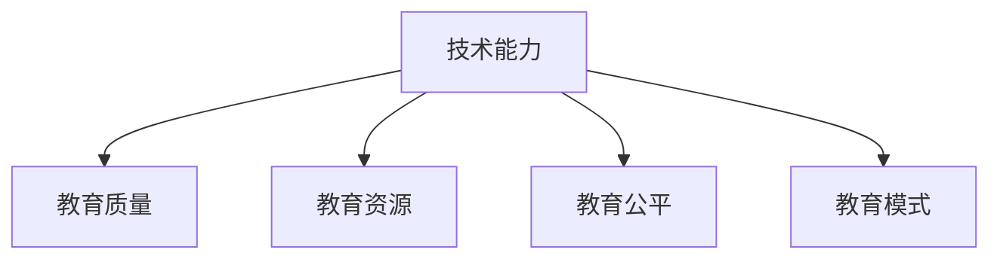

#### 9.2 教育科技从业者面临的挑战与机遇

教育科技从业者面临着一系列的挑战与机遇：

- **技术适应性**：教育科技的应用需要教师和教育机构的适应，技术适应性问题是教育科技从业者面临的主要挑战之一。
- **数据隐私与安全**：随着教育数据的大规模收集和应用，数据隐私和安全成为教育科技从业者需要重点解决的问题。
- **教育公平**：尽管技术可以促进教育公平，但如何确保技术应用的公平性，避免加剧教育不公平现象，是教育科技从业者需要面对的挑战。
- **持续创新**：教育科技领域变化迅速，教育科技从业者需要不断学习和创新，以适应技术的发展和市场需求。

**Mermaid流程图**：

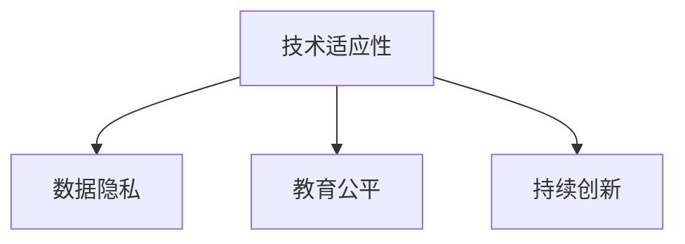

- **机遇**：教育科技的快速发展为教育科技从业者提供了广阔的发展空间，包括个性化学习、智能教学、虚拟现实与增强现实等新兴领域。

**Mermaid流程图**：

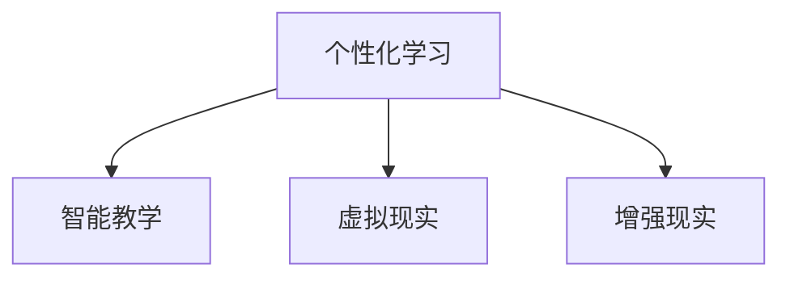

#### 9.3 教育科技的未来发展方向

教育科技的未来发展方向主要包括以下几个方面：

- **智能化教学**：利用人工智能和大数据技术，实现智能化教学系统的广泛应用，提高教学效率和效果。
- **个性化学习**：通过个性化学习技术，为学习者提供定制化的学习体验，满足不同学习者的需求。
- **混合式学习**：将线上学习和线下学习相结合，提供更加灵活和高效的学习模式。
- **虚拟现实与增强现实**：通过虚拟现实和增强现实技术，提供沉浸式的学习体验，提高学习兴趣和效果。
- **教育资源共享**：利用区块链技术，实现教育资源的透明和可信共享，促进教育公平。

**Mermaid流程图**：

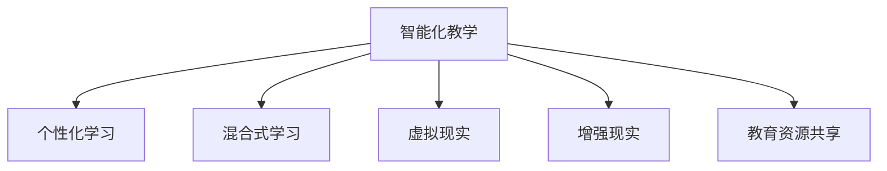

#### 9.4 教育科技从业者的策略

为了抓住教育科技的发展机遇，教育科技从业者可以采取以下策略：

- **持续学习**：不断学习和掌握最新的教育技术和教学方法，适应教育科技的发展趋势。
- **跨界合作**：与其他领域的专家和企业合作，共同推动教育创新，实现资源共享和优势互补。
- **用户需求导向**：深入了解用户需求，为学习者提供有价值的产品和服务。
- **技术创新**：持续进行技术创新，推动教育科技的不断进步。

**Mermaid流程图**：

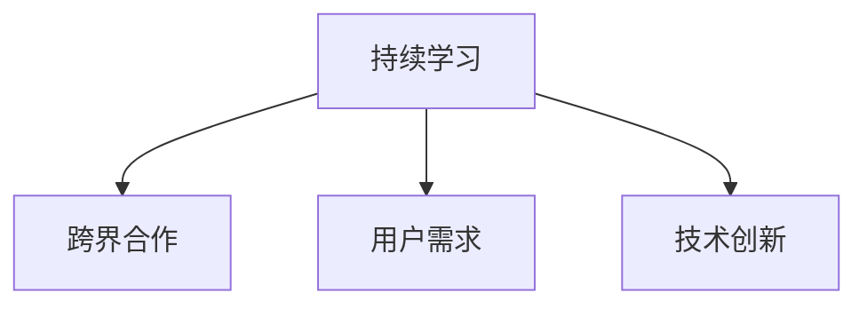

通过以上分析，我们可以看到技术能力在教育创新中的重要性以及教育科技从业者面临的挑战与机遇。在下一部分中，我们将结合具体案例，进一步探讨如何利用技术能力推动教育创新，为教育科技的发展提供有价值的思路和解决方案。

---

### 第五部分总结

在本部分中，我们深入探讨了技术能力在教育创新中的重要性，分析了教育科技从业者面临的挑战与机遇，以及教育科技的未来发展方向。通过智能化教学、个性化学习、混合式学习、虚拟现实与增强现实、教育资源共享等方面的探讨，我们展示了技术能力如何推动教育模式的变革，提高教育质量，促进教育公平。

首先，我们强调了技术能力在教育创新中的核心作用，分析了它如何提高教育质量、优化教育资源配置、促进教育公平，并推动教育模式的变革。接着，我们探讨了教育科技从业者面临的挑战与机遇，包括技术适应性、数据隐私与安全、教育公平、持续创新等方面的挑战，以及个性化学习、智能教学等新兴领域的机遇。

在探讨教育科技的未来发展方向时，我们提出了智能化教学、个性化学习、混合式学习、虚拟现实与增强现实、教育资源共享等五个方面的创新趋势，并提出了教育科技从业者可以采取的持续学习、跨界合作、用户需求导向、技术创新等策略。

在下一部分中，我们将结合具体案例，进一步探讨技术能力在教育创新中的实践与应用，通过具体的教育科技创新项目，展示技术能力如何在实际中推动教育变革，为教育科技的发展提供有价值的参考和启示。

---

### 附录

#### 附录A：教育科技创新相关资源与工具

**A.1 教育科技创新关键资源**

为了推动教育科技创新，以下是一些关键资源：

- **研究报告**：包括教育科技发展现状、趋势、政策分析等研究报告。
- **政策文件**：各国政府发布的关于教育科技的政策文件，为教育科技提供指导和支持。
- **学术论文**：关于教育科技的理论研究、应用实践和案例研究等学术论文。
- **开源教育技术框架**：如Moodle、Canvas等开源学习管理系统，为教育科技开发提供基础。

**A.2 教育科技创新开发工具与平台**

以下是一些常用的教育科技创新开发工具与平台：

- **编程语言和工具**：Python、Java、JavaScript等编程语言，以及相关开发工具和集成开发环境（IDE）。
- **学习管理系统（LMS）**：如Moodle、Canvas、Blackboard等，用于构建在线教育平台。
- **虚拟现实（VR）和增强现实（AR）平台**：如Unity、Unreal Engine等，用于开发VR和AR应用程序。
- **数据分析和机器学习工具**：如Pandas、Scikit-learn、TensorFlow等，用于数据分析和机器学习模型的构建。

**A.3 教育技术行业数据库与API资源**

以下是一些教育技术行业数据库和API资源：

- **教育数据集**：如Udacity公开的数据集、Kaggle上的教育数据集等，用于教育数据分析和研究。
- **在线教育平台API**：如Coursera、edX等在线教育平台的API，用于访问课程数据、用户数据等。
- **社交网络API**：如Facebook、Twitter等社交网络的API，用于构建社交学习平台。
- **地理信息数据库**：如OpenStreetMap、Google Maps API等，用于构建教育地理信息系统。

通过以上资源和工具，教育科技从业者可以更好地开展教育科技创新，推动教育变革和发展。

---

### 全文总结与作者信息

在本文中，我们全面探讨了如何利用技术能力进行教育科技创新。从教育科技创新的背景与趋势，到技术能力在教育中的应用，再到技术能力提升与教育创新，以及教育科技的未来发展方向，我们通过详细的案例分析、伪代码展示、数学公式解释，深入阐述了教育科技的核心概念和算法原理。

我们首先回顾了教育科技创新的定义与重要性，分析了信息技术、人工智能、大数据等技术在教育中的应用，探讨了教育科技创新的背景和趋势。接着，我们详细介绍了技术能力在教育中的应用，包括信息技术与数字化教学、人工智能与智能教育、虚拟现实与增强现实等。然后，我们探讨了技术能力提升与教育创新的关系，分析了教育科技团队建设、技术能力评估与培养以及教育技术创新的组织文化。

在实践与应用部分，我们通过具体案例展示了技术能力在教育创新中的成功实践，包括在线教育与混合式学习、智能教育应用实例、虚拟现实与增强现实应用实例等。最后，我们探讨了教育科技的未来发展方向，分析了新型教育技术的创新趋势，如区块链技术、跨界合作与教育资源共享等。

通过对技术能力在教育创新中的深入探讨，我们明确了技术能力在教育变革中的核心作用，以及教育科技从业者面临的挑战与机遇。技术能力不仅提高了教育质量、优化了教育资源配置，还促进了教育公平，推动了教育模式的变革。

**作者信息**：

作者：AI天才研究院/AI Genius Institute & 禅与计算机程序设计艺术 /Zen And The Art of Computer Programming

本文旨在为教育科技从业者提供有价值的参考和指导，推动教育科技的创新与发展。随着教育科技的不断进步，我们期待能够看到更多基于技术能力的教育创新项目，为教育领域带来新的变革和进步。让我们共同努力，用技术能力推动教育科技的发展，为构建更加公平、高效、有质量的教育体系贡献自己的力量。

