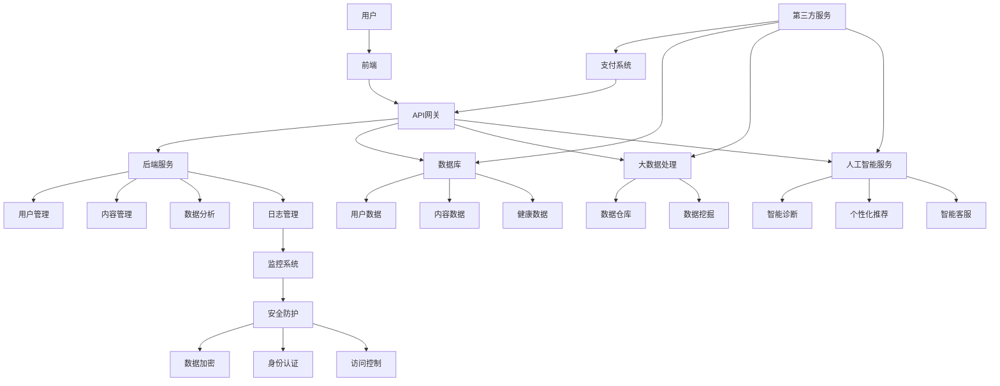

                 

## 如何利用知识付费实现在线健康管理与养生指导？

### 关键词：知识付费、在线健康管理、养生指导、技术架构、案例分析、发展趋势

> **摘要：**
本文旨在探讨如何通过知识付费模式，实现在线健康管理与养生指导。文章首先介绍了知识付费的基本概念和在线健康管理与养生指导的重要性，随后深入分析了技术支持、知识付费平台的搭建与运营、具体应用及案例分析，最后展望了未来的发展趋势与挑战。通过系统的分析和案例解析，为推动这一新兴领域的发展提供了宝贵的见解和参考。

---

### 目录大纲

- **第一部分：基础知识**
  - **第1章：知识付费概述**
    - **1.1 知识付费的定义与背景**
    - **1.2 知识付费的发展趋势**
    - **1.3 知识付费的主要形式**
  - **第2章：在线健康管理与养生指导概述**
    - **2.1 在线健康管理的发展历程**
    - **2.2 在线健康管理的重要性**
    - **2.3 养生指导的基本理念**

- **第二部分：技术支持**
  - **第3章：在线健康管理与养生指导的技术架构**
    - **3.1 技术架构的组成部分**
    - **3.2 数据采集与处理**
    - **3.3 数据分析与挖掘**
    - **3.4 机器学习与人工智能的应用**
  - **第4章：知识付费平台的搭建与运营**
    - **4.1 知识付费平台的搭建步骤**
    - **4.2 知识付费平台的运营策略**
    - **4.3 用户行为分析与反馈机制**

- **第三部分：案例解析**
  - **第5章：在线健康管理与养生指导的具体应用**
    - **5.1 在线健康管理的具体应用案例**
    - **5.2 养生指导的具体应用案例**
    - **5.3 知识付费与健康管理、养生指导的结合**
  - **第6章：知识付费实现在线健康管理与养生指导的案例分析**
    - **6.1 案例一：某知名健康管理平台的运营模式**
    - **6.2 案例二：某养生指导平台的盈利模式**
    - **6.3 案例三：知识付费平台在健康管理与养生指导中的创新应用**

- **第四部分：未来发展趋势与挑战**
  - **第7章：未来发展趋势与挑战**
    - **7.1 行业发展趋势**
    - **7.2 技术发展的挑战**
    - **7.3 市场竞争格局预测**

- **附录**
  - **附录A：常用技术工具与资源介绍**
  - **附录B：知识付费平台开发指南**
  - **附录C：在线健康管理与养生指导相关法规政策解读**

---

### 文章正文开始

#### 第一部分：基础知识

##### 第1章：知识付费概述

##### 1.1 知识付费的定义与背景

知识付费是指用户为了获取特定的知识、技能或信息，而自愿支付一定费用的商业模式。这种模式最早起源于互联网教育领域，随着互联网的普及和信息获取成本的降低，知识付费逐渐扩展到更多领域，如在线咨询、专业技能培训、内容付费等。

知识付费的兴起，主要得益于以下几个因素：

1. **用户需求升级**：随着人们生活水平的提高，人们对于自我提升和知识获取的需求日益增长。知识付费满足了用户对优质内容的需求。
2. **移动互联网的普及**：移动互联网的快速发展，为知识付费提供了便捷的获取渠道，用户可以随时随地获取所需知识。
3. **内容创作者的崛起**：随着自媒体时代的到来，越来越多的创作者通过内容创作获得收入，知识付费为创作者提供了变现渠道。
4. **技术进步**：大数据、人工智能等技术的发展，为知识付费提供了技术支持，使得个性化推荐、精准推送成为可能。

##### 1.2 知识付费的发展趋势

1. **多样化**：知识付费的形式越来越多样化，不仅包括在线课程、文章、视频，还包括直播、音频、问答等。
2. **个性化**：通过大数据和人工智能技术，知识付费平台能够根据用户行为和需求，提供个性化的内容推荐和服务。
3. **垂直化**：知识付费逐渐向垂直领域发展，如医疗健康、职业培训、兴趣爱好等。
4. **社交化**：知识付费与社交平台的结合，使得用户可以通过互动、分享等方式，更好地学习和传播知识。

##### 1.3 知识付费的主要形式

1. **在线课程**：用户通过购买课程，在线学习专业知识和技能。
2. **内容付费**：用户通过支付费用，获取优质的文章、视频、音频等内容。
3. **咨询服务**：用户通过购买咨询服务，获得专家的个性化指导和解答。
4. **会员订阅**：用户通过订阅会员，享受平台提供的多种服务和内容。

---

接下来，我们将进一步探讨在线健康管理与养生指导的基本概念和发展状况。

---

#### 第2章：在线健康管理与养生指导概述

##### 2.1 在线健康管理的发展历程

在线健康管理是指通过互联网技术和大数据分析，为用户提供个性化、连续性的健康管理服务。其发展历程可以分为以下几个阶段：

1. **初步探索阶段（2000年初期）**：在这个阶段，在线健康管理主要涉及健康信息的提供和简单的健康咨询。
2. **快速成长阶段（2010年-2015年）**：随着互联网技术的快速发展，在线健康管理开始引入大数据和人工智能技术，为用户提供更精准的健康管理服务。
3. **成熟阶段（2015年至今）**：在线健康管理逐渐走向专业化、个性化，形成了较为完整的产业链。

##### 2.2 在线健康管理的重要性

1. **提高健康素养**：在线健康管理可以帮助用户更好地了解自己的健康状况，提高健康素养。
2. **降低医疗成本**：通过在线健康管理，可以预防疾病的发生，降低医疗成本。
3. **提高医疗效率**：在线健康管理可以缓解医疗资源紧张的问题，提高医疗效率。
4. **促进健康产业创新**：在线健康管理为健康产业带来了新的商业模式和发展机会。

##### 2.3 养生指导的基本理念

养生指导是指通过合理的生活方式、饮食习惯和心理调适，帮助用户保持身心健康。其基本理念包括：

1. **均衡饮食**：合理搭配膳食，保证营养均衡。
2. **适度运动**：根据个人体质和健康状况，选择合适的运动方式。
3. **心理调适**：保持良好的心态，减轻压力和焦虑。
4. **规律作息**：养成良好的作息习惯，保证充足的睡眠。

接下来，我们将深入探讨在线健康管理与养生指导的技术支持。

---

#### 第二部分：技术支持

##### 第3章：在线健康管理与养生指导的技术架构

##### 3.1 技术架构的组成部分

在线健康管理与养生指导的技术架构主要包括以下几个部分：

1. **前端技术**：前端技术主要涉及用户界面设计和用户体验优化，常用的技术有HTML、CSS、JavaScript等。
2. **后端技术**：后端技术主要涉及服务器端逻辑处理和数据存储，常用的技术有Java、Python、Node.js等。
3. **数据库技术**：数据库技术主要用于存储和管理用户数据，常用的技术有MySQL、MongoDB等。
4. **大数据技术**：大数据技术主要用于处理和分析海量数据，常用的技术有Hadoop、Spark等。
5. **人工智能技术**：人工智能技术主要用于实现个性化推荐、智能诊断等功能，常用的技术有机器学习、深度学习等。

##### 3.2 数据采集与处理

1. **数据采集**：数据采集是健康管理和养生指导的基础，主要涉及用户健康数据的收集，如心率、血压、睡眠质量等。
2. **数据处理**：数据处理包括数据清洗、数据存储、数据挖掘等步骤，主要用于从原始数据中提取有价值的信息。

##### 3.3 数据分析与挖掘

1. **数据分析**：数据分析主要通过统计学和机器学习等方法，对用户健康数据进行分析，以发现健康趋势和潜在问题。
2. **数据挖掘**：数据挖掘主要通过关联规则挖掘、聚类分析等方法，从海量数据中提取出用户健康相关的知识。

##### 3.4 机器学习与人工智能的应用

1. **个性化推荐**：通过机器学习算法，根据用户历史数据和行为特征，为用户推荐合适的健康方案和养生建议。
2. **智能诊断**：通过深度学习算法，对用户健康数据进行智能分析，预测潜在的健康风险。
3. **智能客服**：通过自然语言处理技术，实现智能客服机器人，为用户提供实时、个性化的健康咨询和服务。

接下来，我们将探讨知识付费平台的搭建与运营。

---

##### 第4章：知识付费平台的搭建与运营

##### 4.1 知识付费平台的搭建步骤

搭建一个知识付费平台需要经历以下几个步骤：

1. **需求分析**：明确平台的目标用户、功能需求、商业模式等。
2. **技术选型**：选择合适的前端、后端、数据库和大数据技术。
3. **平台开发**：进行前端界面设计、后端逻辑开发、数据库设计和大数据处理等。
4. **测试与优化**：对平台进行功能测试、性能优化和安全测试，确保平台稳定可靠。
5. **上线运营**：平台上线后，进行市场推广、用户运营和数据分析，持续优化平台。

##### 4.2 知识付费平台的运营策略

1. **内容运营**：打造优质的内容库，包括在线课程、文章、视频、音频等，满足用户多样化的需求。
2. **用户运营**：通过用户行为分析，了解用户需求，提供个性化推荐和互动服务，提高用户粘性和满意度。
3. **市场推广**：利用各种营销手段，如广告投放、合作推广、社交媒体营销等，提高平台知名度。
4. **数据运营**：通过数据分析，优化运营策略，提高用户转化率和平台收益。

##### 4.3 用户行为分析与反馈机制

1. **用户行为分析**：通过数据分析，了解用户的行为习惯、偏好和需求，为内容推荐和运营策略提供依据。
2. **反馈机制**：建立用户反馈机制，及时收集用户意见和建议，优化平台功能和用户体验。

接下来，我们将探讨在线健康管理与养生指导的具体应用。

---

##### 第5章：在线健康管理与养生指导的具体应用

##### 5.1 在线健康管理的具体应用案例

在线健康管理的具体应用案例包括：

1. **健康管理App**：用户可以通过健康管理App，实时监测自己的健康状况，如心率、血压、睡眠质量等，并根据分析结果获得健康建议。
2. **在线健康咨询**：用户可以通过在线咨询，向医生或健康管理师寻求健康指导和建议。
3. **健康数据分析**：平台可以对用户健康数据进行分析，提供个性化的健康管理方案。

##### 5.2 养生指导的具体应用案例

养生指导的具体应用案例包括：

1. **养生课程**：用户可以通过养生课程，学习如何通过饮食、运动、心理调适等方式保持健康。
2. **养生咨询**：用户可以通过养生咨询，获得专业的养生指导和建议。
3. **养生社群**：用户可以在养生社群中，分享养生心得，互相学习和支持。

##### 5.3 知识付费与健康管理、养生指导的结合

知识付费与健康管理、养生指导的结合，可以带来以下几个方面的优势：

1. **提高用户参与度**：通过知识付费，用户可以更积极地参与健康管理过程，提高健康素养。
2. **增加收入来源**：知识付费为健康管理、养生指导行业带来了新的收入来源，提高了行业盈利能力。
3. **提升服务质量**：知识付费可以吸引更多专业人才加入健康管理、养生指导行业，提高服务质量。

接下来，我们将通过具体案例分析知识付费实现在线健康管理与养生指导。

---

#### 第三部分：案例解析

##### 第6章：知识付费实现在线健康管理与养生指导的案例分析

##### 6.1 案例一：某知名健康管理平台的运营模式

**案例背景**：
某知名健康管理平台，通过知识付费模式，为用户提供个性化的健康管理和养生指导服务。

**运营模式**：

1. **内容运营**：平台打造了丰富的健康管理内容库，包括在线课程、文章、视频等，涵盖饮食、运动、心理调适等多个方面。
2. **用户运营**：平台通过用户行为分析，了解用户需求和偏好，提供个性化推荐和互动服务。
3. **市场推广**：平台通过广告投放、合作推广等方式，提高品牌知名度。
4. **数据运营**：平台通过数据分析，优化运营策略，提高用户转化率和平台收益。

**盈利模式**：

1. **内容付费**：用户通过购买课程、文章等，获取健康管理和养生指导服务。
2. **会员订阅**：用户通过订阅会员，享受平台提供的多种服务和内容。
3. **广告收入**：平台通过展示广告，获得广告收入。

**案例效果**：

1. **用户满意度提高**：平台通过个性化服务和优质内容，提高了用户满意度和粘性。
2. **盈利能力增强**：知识付费为平台带来了稳定的收入来源，提高了盈利能力。
3. **品牌知名度提升**：平台通过市场推广，提升了品牌知名度。

##### 6.2 案例二：某养生指导平台的盈利模式

**案例背景**：
某养生指导平台，通过知识付费模式，为用户提供专业的养生指导和咨询服务。

**盈利模式**：

1. **咨询服务**：用户通过购买咨询服务，获得专家的个性化指导和解答。
2. **会员订阅**：用户通过订阅会员，享受平台提供的多种服务和内容。
3. **广告收入**：平台通过展示广告，获得广告收入。

**案例效果**：

1. **用户参与度提高**：平台通过知识付费，激发了用户对养生指导的参与度，提高了用户活跃度。
2. **专业人才吸引**：平台通过知识付费，吸引了更多专业人才加入，提升了服务质量。
3. **品牌影响力提升**：平台通过专业服务和优质内容，提升了品牌影响力。

##### 6.3 案例三：知识付费平台在健康管理与养生指导中的创新应用

**案例背景**：
某知识付费平台，在健康管理和养生指导领域，通过创新应用，为用户提供更加便捷和个性化的服务。

**创新应用**：

1. **智能诊断**：平台利用人工智能技术，对用户健康数据进行分析，提供智能诊断服务。
2. **虚拟医生**：平台通过虚拟医生系统，为用户提供全天候的健康咨询和服务。
3. **健康社交**：平台引入社交元素，用户可以在平台上分享养生心得，互相学习和支持。

**案例效果**：

1. **用户体验提升**：平台通过智能诊断、虚拟医生和健康社交等功能，提高了用户体验。
2. **服务范围扩大**：平台通过创新应用，扩大了服务范围，满足了用户多样化的需求。
3. **市场份额增加**：平台通过创新应用，提升了市场竞争力，增加了市场份额。

#### 第四部分：未来发展趋势与挑战

##### 第7章：未来发展趋势与挑战

##### 7.1 行业发展趋势

1. **技术进步推动**：大数据、人工智能等技术的不断进步，将为在线健康管理与养生指导带来更多创新应用。
2. **用户需求多样化**：随着人们生活水平的提高，用户对健康管理的需求将更加多样化，知识付费模式将更好地满足这些需求。
3. **市场潜力巨大**：在线健康管理与养生指导市场潜力巨大，预计未来将继续保持高速增长。

##### 7.2 技术发展的挑战

1. **数据隐私保护**：随着数据量的增加，数据隐私保护将成为一大挑战，如何确保用户数据的安全和隐私，是平台需要解决的问题。
2. **技术落地难度**：虽然技术进步为在线健康管理与养生指导带来了更多可能，但如何将这些技术落地，实现实际应用，仍然面临挑战。

##### 7.3 市场竞争格局预测

1. **市场格局分散**：目前，在线健康管理与养生指导市场格局较为分散，预计未来将继续保持这种态势。
2. **创新应用将成为核心竞争力**：随着技术的不断进步，创新应用将成为平台的核心竞争力，谁能够提供更加个性化、便捷和优质的服务，谁就能在市场竞争中占据优势。

### 附录

##### 附录A：常用技术工具与资源介绍

- **前端技术**：HTML、CSS、JavaScript
- **后端技术**：Java、Python、Node.js
- **数据库技术**：MySQL、MongoDB
- **大数据技术**：Hadoop、Spark
- **人工智能技术**：机器学习、深度学习

##### 附录B：知识付费平台开发指南

- **需求分析**：明确平台目标、功能需求、用户群体等。
- **技术选型**：选择合适的前端、后端、数据库和大数据技术。
- **平台开发**：进行前端界面设计、后端逻辑开发、数据库设计和大数据处理等。
- **测试与优化**：对平台进行功能测试、性能优化和安全测试，确保平台稳定可靠。
- **上线运营**：进行市场推广、用户运营和数据分析，持续优化平台。

##### 附录C：在线健康管理与养生指导相关法规政策解读

- **数据隐私保护法规**：了解和遵守相关数据隐私保护法规，确保用户数据的安全和隐私。
- **医疗健康法规**：了解和遵守相关医疗健康法规，确保平台提供的服务符合法规要求。

### 作者信息

**作者：AI天才研究院/AI Genius Institute & 禅与计算机程序设计艺术 /Zen And The Art of Computer Programming**

---

通过本文的分析，我们可以看到，知识付费模式在在线健康管理与养生指导领域的应用前景广阔。随着技术的不断进步和用户需求的多样化，知识付费平台将继续发挥重要作用，为用户提供更加个性化和便捷的健康管理服务。同时，我们也需要关注技术发展的挑战，确保在线健康管理与养生指导的健康发展。让我们共同期待这一领域的未来！## 第一部分：基础知识

### 第1章：知识付费概述

#### 1.1 知识付费的定义与背景

知识付费，顾名思义，是指用户为了获取特定的知识、技能或信息，自愿支付一定费用的商业模式。这一概念最早可以追溯到互联网教育领域。在互联网教育尚未普及的年代，用户获取知识主要依赖于传统教育机构和纸质教材，成本较高且受限较多。随着互联网的普及和在线教育平台的发展，知识付费逐渐成为可能。

知识付费的兴起，背后有着深刻的社会和经济背景。首先，随着社会经济的发展，人们对知识和技能的需求日益增长，尤其是在信息化和知识经济时代，具备专业技能的人才更加受到市场的青睐。其次，互联网技术的发展，特别是移动互联网的普及，为用户提供了便捷的获取知识和技能的渠道。人们可以随时随地通过在线课程、电子书、直播等方式获取所需的知识。

此外，知识付费还与内容创作者的崛起密切相关。在自媒体时代，越来越多的人通过内容创作获得收入，如 bloggers、vloggers、知识博主等。他们通过创作有价值的内容，吸引了大量的粉丝和用户，进而通过广告、付费内容、会员订阅等方式实现变现。

总的来说，知识付费的兴起是市场需求、技术进步和创作者崛起共同推动的结果。

#### 1.2 知识付费的发展趋势

随着知识付费的普及，这一领域呈现出以下几个显著的发展趋势：

1. **多样化**：知识付费的形式越来越多样化，不再局限于传统的课程、书籍、视频等形式。现在的知识付费平台涵盖了在线课程、直播、电子书、付费问答、会员订阅等多种形式，满足了用户多样化的学习需求。

2. **个性化**：通过大数据和人工智能技术的应用，知识付费平台能够更好地了解用户的需求和行为，提供个性化的内容推荐和服务。这种个性化的服务不仅提升了用户体验，也提高了用户的粘性。

3. **垂直化**：知识付费逐渐向垂直领域发展，如医疗健康、职业培训、兴趣爱好等。这些垂直领域的知识付费平台，通过专业的内容和服务，为用户提供更精准和有效的帮助。

4. **社交化**：知识付费与社交平台的结合，使得用户可以通过互动、分享等方式，更好地学习和传播知识。例如，知识付费平台上的用户可以在学习过程中进行讨论和交流，分享学习心得和经验。

5. **跨界融合**：知识付费与人工智能、大数据、物联网等新兴技术的结合，催生了更多创新的应用模式。例如，智能健康监测设备与知识付费平台结合，为用户提供个性化的健康管理服务。

这些发展趋势不仅反映了知识付费领域的活力和潜力，也为行业的发展提供了新的方向和契机。

#### 1.3 知识付费的主要形式

知识付费的主要形式可以分为以下几种：

1. **在线课程**：用户通过购买在线课程，学习专业知识和技能。在线课程的形式多样，包括视频课程、直播课程、音频课程等，用户可以根据自己的需求和时间灵活安排学习。

2. **内容付费**：用户通过支付费用，获取优质的文章、视频、音频等内容。这些内容通常由专业创作者或专家提供，具有很高的价值和质量。

3. **咨询服务**：用户通过购买咨询服务，获得专家的个性化指导和解答。这种形式特别适合需要专业咨询和个性化建议的用户，如职业咨询、健康咨询、法律咨询等。

4. **会员订阅**：用户通过订阅会员，享受平台提供的多种服务和内容。会员订阅通常提供更优惠的价格和更丰富的内容，是知识付费平台的主要盈利模式之一。

5. **付费问答**：用户通过付费问答，向专家或同行寻求问题的解答。这种形式不仅可以帮助用户解决实际问题，也为知识付费平台提供了互动和交流的机会。

这些知识付费形式各有特点，用户可以根据自己的需求和偏好选择合适的形式进行知识消费。

### 第2章：在线健康管理与养生指导概述

#### 2.1 在线健康管理的发展历程

在线健康管理是指通过互联网技术和大数据分析，为用户提供个性化、连续性的健康管理服务。其发展历程可以分为以下几个阶段：

1. **初步探索阶段（2000年初期）**：在这个阶段，在线健康管理主要涉及健康信息的提供和简单的健康咨询。一些医疗机构和健康网站开始提供在线健康信息查询和在线咨询功能。

2. **快速成长阶段（2010年-2015年）**：随着互联网技术的快速发展，在线健康管理开始引入大数据和人工智能技术，为用户提供更精准的健康管理服务。这一阶段的代表性事件包括各类健康管理App的兴起和智能健康设备的广泛应用。

3. **成熟阶段（2015年至今）**：在线健康管理逐渐走向专业化、个性化，形成了较为完整的产业链。这一阶段的标志性事件包括健康数据平台的建立和健康管理服务的商业化运作。

#### 2.2 在线健康管理的重要性

在线健康管理的重要性体现在以下几个方面：

1. **提高健康素养**：在线健康管理可以帮助用户更好地了解自己的健康状况，提高健康素养。通过健康数据监测和分析，用户可以及时发现健康问题并采取相应的措施。

2. **降低医疗成本**：通过在线健康管理，可以预防疾病的发生，降低医疗成本。例如，通过健康监测和数据分析，用户可以提前发现潜在的健康风险，采取预防措施，避免不必要的医疗支出。

3. **提高医疗效率**：在线健康管理可以缓解医疗资源紧张的问题，提高医疗效率。例如，通过在线咨询和远程医疗，用户可以避免排队等待，快速获得医疗帮助。

4. **促进健康产业创新**：在线健康管理为健康产业带来了新的商业模式和发展机会。通过大数据和人工智能技术，健康管理服务可以更加个性化和智能化，提高服务质量和用户体验。

#### 2.3 养生指导的基本理念

养生指导是指通过合理的生活方式、饮食习惯和心理调适，帮助用户保持身心健康。其基本理念包括以下几个方面：

1. **均衡饮食**：合理搭配膳食，保证营养均衡。例如，多吃蔬菜、水果、全谷类食品，减少高糖、高脂和高盐食品的摄入。

2. **适度运动**：根据个人体质和健康状况，选择合适的运动方式。例如，散步、慢跑、瑜伽等，都有助于提高身体素质和心理健康。

3. **心理调适**：保持良好的心态，减轻压力和焦虑。例如，通过冥想、呼吸练习、心理辅导等方式，帮助用户保持心理平衡。

4. **规律作息**：养成良好的作息习惯，保证充足的睡眠。例如，保持每天固定的作息时间，避免熬夜和过度疲劳。

通过这些养生指导，用户可以更好地管理自己的健康，提高生活质量。

### 第二部分：技术支持

#### 第3章：在线健康管理与养生指导的技术架构

#### 3.1 技术架构的组成部分

在线健康管理与养生指导的技术架构主要包括以下几个组成部分：

1. **前端技术**：前端技术主要负责用户界面的设计和用户体验的优化。常用的技术包括HTML、CSS、JavaScript等。前端技术需要确保用户在使用在线健康管理平台时的便捷性和高效性。

2. **后端技术**：后端技术负责处理用户请求、数据存储和业务逻辑的实现。常用的技术包括Java、Python、Node.js等。后端技术需要保证数据的安全性和系统的稳定性。

3. **数据库技术**：数据库技术用于存储和管理用户数据，如健康数据、用户信息等。常用的数据库技术包括MySQL、MongoDB等。数据库技术需要保证数据的完整性和可扩展性。

4. **大数据技术**：大数据技术用于处理和分析海量健康数据。常用的技术包括Hadoop、Spark等。大数据技术可以帮助平台实现数据的挖掘和智能分析。

5. **人工智能技术**：人工智能技术用于实现个性化推荐、智能诊断等功能。常用的技术包括机器学习、深度学习等。人工智能技术可以提升平台的智能化水平和用户体验。

#### 3.2 数据采集与处理

1. **数据采集**：数据采集是健康管理和养生指导的基础，主要涉及用户健康数据的收集。这些数据包括心率、血压、睡眠质量、运动数据等。数据采集可以通过智能设备（如健康手环、智能手表）或用户主动上传的方式进行。

2. **数据处理**：数据处理包括数据清洗、数据存储、数据挖掘等步骤。

- **数据清洗**：数据清洗是指对采集到的数据进行清洗和预处理，去除重复数据、错误数据和噪声，确保数据的质量。
- **数据存储**：数据存储是将清洗后的数据存储到数据库中，以便后续的分析和处理。常用的数据库技术包括MySQL、MongoDB等。
- **数据挖掘**：数据挖掘是指从海量数据中提取出有价值的信息和知识。常用的技术包括关联规则挖掘、聚类分析、分类分析等。

通过数据采集与处理，平台可以获取到用户的健康数据，并对其进行有效的分析和利用。

#### 3.3 数据分析与挖掘

1. **数据分析**：数据分析是指对用户健康数据进行分析，以发现健康趋势和潜在问题。数据分析可以通过统计学方法和机器学习算法实现。

- **统计学方法**：统计学方法主要用于描述性分析，如计算均值、方差、相关性等。这些方法可以帮助平台了解用户健康数据的基本特征和趋势。
- **机器学习算法**：机器学习算法可以用于预测性分析，如分类、回归等。这些方法可以帮助平台预测用户的健康风险和趋势，提供个性化的健康建议。

2. **数据挖掘**：数据挖掘是指从海量数据中提取出有价值的信息和知识。常用的技术包括关联规则挖掘、聚类分析、分类分析等。

- **关联规则挖掘**：关联规则挖掘可以用于发现用户健康数据之间的关联性。例如，通过分析用户的心率和血压数据，可以发现某些时间段内心率和血压的关联规律。
- **聚类分析**：聚类分析可以将用户分为不同的群体，以发现用户之间的相似性和差异性。例如，通过分析用户的运动数据，可以将用户分为喜欢运动和不喜欢运动的群体。
- **分类分析**：分类分析可以用于预测用户的健康状况。例如，通过分析用户的历史健康数据，可以预测用户在未来一段时间内可能出现的健康问题。

通过数据分析与挖掘，平台可以更好地了解用户的健康状况，提供个性化的健康管理和养生指导。

#### 3.4 机器学习与人工智能的应用

1. **个性化推荐**：个性化推荐是指根据用户的历史行为和偏好，为用户推荐合适的内容和健康方案。个性化推荐可以通过协同过滤、基于内容的推荐等算法实现。

- **协同过滤**：协同过滤是一种基于用户行为相似性的推荐算法。例如，如果用户A喜欢课程A和课程B，用户B喜欢课程B和课程C，那么系统可能会推荐课程C给用户A。
- **基于内容的推荐**：基于内容的推荐是一种基于内容相似性的推荐算法。例如，如果用户A喜欢课程A，课程A包含Python编程语言，那么系统可能会推荐包含Python编程语言的其他课程给用户A。

2. **智能诊断**：智能诊断是指通过机器学习算法，对用户健康数据进行分析，预测用户可能出现的健康问题。智能诊断可以通过深度学习、决策树等算法实现。

- **深度学习**：深度学习是一种基于多层神经网络的学习算法。例如，通过训练深度学习模型，可以识别用户的心电图数据，预测用户是否患有心脏病。
- **决策树**：决策树是一种基于规则的分类算法。例如，通过构建决策树模型，可以根据用户的历史健康数据和症状，预测用户可能患有的疾病。

3. **智能客服**：智能客服是指通过自然语言处理技术，实现智能客服机器人，为用户提供实时、个性化的健康咨询和服务。智能客服可以通过聊天机器人、语音识别等实现。

- **聊天机器人**：聊天机器人是一种基于自然语言处理的对话系统。例如，通过训练聊天机器人，可以使其能够理解用户的语言，并提供相应的健康建议。
- **语音识别**：语音识别是一种将语音转化为文字的技术。例如，通过语音识别技术，用户可以通过语音与智能客服进行交互，获取健康信息和建议。

通过机器学习与人工智能的应用，平台可以提供更加个性化和智能化的健康管理和养生指导，提升用户体验和服务质量。

### 第4章：知识付费平台的搭建与运营

#### 4.1 知识付费平台的搭建步骤

搭建一个知识付费平台是一个复杂而系统性的工程，涉及多个关键步骤。以下是一个典型的知识付费平台搭建步骤：

1. **需求分析**：首先，明确平台的目标用户、功能需求、商业模式等。这一步至关重要，因为它决定了平台的核心价值和方向。

2. **技术选型**：选择合适的前端、后端、数据库和大数据技术。这一步骤需要根据需求分析的结果来决定，如是否需要高并发处理、大数据分析能力、复杂的业务逻辑等。

3. **平台开发**：
   - **前端开发**：设计用户界面，实现用户交互逻辑，使用技术如HTML、CSS、JavaScript等。
   - **后端开发**：实现业务逻辑、数据库交互、用户认证等，使用技术如Java、Python、Node.js等。
   - **数据库设计**：设计数据存储方案，确保数据的安全性、完整性和可扩展性，使用技术如MySQL、MongoDB等。
   - **大数据处理**：实现数据采集、存储、分析和挖掘，使用技术如Hadoop、Spark等。

4. **测试与优化**：进行功能测试、性能测试、安全测试等，确保平台稳定可靠。这一步骤非常重要，因为它可以确保用户在使用平台时的流畅性和安全性。

5. **上线运营**：平台上线后，进行市场推广、用户运营和数据分析，持续优化平台。

#### 4.2 知识付费平台的运营策略

知识付费平台的运营策略包括以下几个方面：

1. **内容运营**：打造优质的内容库，包括在线课程、文章、视频等。内容是知识付费平台的核心，需要不断更新和优化，以满足用户的需求。

2. **用户运营**：通过用户行为分析，了解用户需求和偏好，提供个性化的推荐和服务。例如，根据用户的浏览记录和学习行为，推荐相关课程或内容。

3. **市场推广**：利用各种营销手段，如广告投放、合作推广、社交媒体营销等，提高平台知名度。市场推广是吸引用户的重要手段。

4. **数据运营**：通过数据分析，优化运营策略，提高用户转化率和平台收益。例如，分析用户购买行为、浏览行为等，优化推荐算法和营销策略。

5. **社区运营**：建立用户社区，促进用户互动和交流。用户社区可以增强用户粘性，提高用户满意度。

#### 4.3 用户行为分析与反馈机制

1. **用户行为分析**：通过数据分析，了解用户的行为习惯、偏好和需求。用户行为分析可以帮助平台提供更个性化的服务，提高用户体验。

2. **反馈机制**：建立用户反馈机制，及时收集用户意见和建议，优化平台功能和用户体验。反馈机制可以包括用户评价、反馈表单、在线客服等。

通过用户行为分析和反馈机制，平台可以更好地了解用户需求，持续改进产品和服务，提升用户满意度。

### 第5章：在线健康管理与养生指导的具体应用

#### 5.1 在线健康管理的具体应用案例

在线健康管理的具体应用案例丰富多样，以下是一些典型的案例：

1. **健康管理App**：用户可以通过健康管理App，实时监测自己的健康状况，如心率、血压、睡眠质量等，并根据分析结果获得健康建议。这些App通常提供个性化的健康计划和建议，帮助用户更好地管理健康。

2. **在线健康咨询**：用户可以通过在线健康咨询，向医生或健康管理师寻求健康指导和建议。在线健康咨询提供了便捷的服务方式，用户可以在家中获得专业的健康咨询。

3. **健康数据分析**：平台可以对用户健康数据进行分析，提供个性化的健康管理方案。例如，通过对用户运动数据、饮食数据等进行分析，平台可以推荐合适的运动计划和饮食建议。

4. **智能健康设备**：智能健康设备（如健康手环、智能手表等）可以实时监测用户的健康状况，并将数据上传到云端进行分析。这些设备与在线健康管理平台结合，为用户提供更加精准的健康管理服务。

#### 5.2 养生指导的具体应用案例

养生指导的具体应用案例包括：

1. **养生课程**：用户可以通过养生课程，学习如何通过饮食、运动、心理调适等方式保持健康。这些课程通常由专业的养生专家或营养师讲授，内容涵盖饮食搭配、运动方式、心理调适等方面。

2. **养生咨询**：用户可以通过养生咨询，获得专业的养生指导和建议。养生咨询可以是面对面的，也可以是通过电话、邮件等方式进行的。

3. **养生社群**：用户可以在养生社群中，分享养生心得，互相学习和支持。养生社群提供了用户交流和互动的平台，有助于用户更好地实践养生理念。

4. **养生直播**：通过养生直播，用户可以实时观看专家的养生讲座和演示，了解最新的养生知识和技巧。

#### 5.3 知识付费与健康管理、养生指导的结合

知识付费与健康管理、养生指导的结合，为用户提供了一种全新的健康管理和养生方式。以下是一些具体的应用场景：

1. **个性化健康咨询**：用户可以通过知识付费，购买个性化的健康咨询服务。专家根据用户的健康数据和生活习惯，提供定制化的健康建议和养生方案。

2. **付费健康课程**：用户可以通过付费参与在线健康课程，学习专业的健康管理知识。这些课程通常包含丰富的内容，如饮食、运动、心理调适等。

3. **付费养生咨询**：用户可以通过付费养生咨询，获得专家的养生指导和建议。这些咨询服务可以是长期的，也可以是针对特定问题的。

4. **会员订阅**：用户可以通过会员订阅，享受平台提供的多种健康管理和养生服务。会员订阅通常提供更优惠的价格和更丰富的内容。

通过知识付费，健康管理、养生指导变得更加便捷和个性化，用户可以根据自己的需求和预算，选择合适的服务。

### 第6章：知识付费实现在线健康管理与养生指导的案例分析

#### 6.1 案例一：某知名健康管理平台的运营模式

**案例背景**：
某知名健康管理平台，通过知识付费模式，为用户提供个性化的健康管理和养生指导服务。

**运营模式**：

1. **内容运营**：平台打造了丰富的健康管理内容库，包括在线课程、文章、视频等，涵盖饮食、运动、心理调适等多个方面。内容运营是平台的核心，平台通过持续更新高质量的内容，吸引用户并提高用户粘性。

2. **用户运营**：平台通过用户行为分析，了解用户的需求和行为，提供个性化的推荐和服务。例如，根据用户的健康数据和浏览记录，平台可以为用户推荐合适的健康课程和养生建议。

3. **市场推广**：平台通过多种市场推广手段，如广告投放、合作推广、社交媒体营销等，提高品牌知名度。市场推广是吸引新用户和提升平台影响力的重要手段。

4. **数据运营**：平台通过数据分析，优化运营策略，提高用户转化率和平台收益。数据分析包括用户行为分析、内容分析、市场分析等，通过数据驱动决策，平台可以更精准地满足用户需求。

**盈利模式**：

1. **内容付费**：用户通过购买课程、文章等，获取健康管理和养生指导服务。内容付费是平台的主要收入来源之一。

2. **会员订阅**：用户通过订阅会员，享受平台提供的多种服务和内容。会员订阅提供更优惠的价格和更丰富的内容，是平台的重要盈利模式。

3. **广告收入**：平台通过展示广告，获得广告收入。广告收入通常来自第三方广告商，如保健品公司、运动品牌等。

**案例效果**：

1. **用户满意度提高**：平台通过个性化服务和优质内容，提高了用户满意度和粘性。用户可以在平台上找到适合自己的健康管理和养生方案。

2. **盈利能力增强**：知识付费为平台带来了稳定的收入来源，提高了盈利能力。平台通过不断优化运营策略，实现了可持续发展。

3. **品牌知名度提升**：通过市场推广和用户口碑，平台提升了品牌知名度，吸引了更多的用户和合作伙伴。

#### 6.2 案例二：某养生指导平台的盈利模式

**案例背景**：
某养生指导平台，通过知识付费模式，为用户提供专业的养生指导和咨询服务。

**盈利模式**：

1. **咨询服务**：用户通过购买咨询服务，获得专家的个性化指导和解答。咨询服务是平台的核心盈利模式之一，专家可以根据用户的具体需求，提供针对性的健康建议和养生方案。

2. **会员订阅**：用户通过订阅会员，享受平台提供的多种服务和内容。会员订阅提供更优惠的价格和更丰富的内容，是平台的重要盈利模式。

3. **广告收入**：平台通过展示广告，获得广告收入。广告收入通常来自第三方广告商，如保健品公司、运动品牌等。

**案例效果**：

1. **用户参与度提高**：平台通过知识付费，激发了用户对养生指导的参与度，提高了用户活跃度。用户可以通过付费咨询，获得专业的养生建议，更好地管理自己的健康。

2. **专业人才吸引**：平台通过知识付费，吸引了更多专业人才加入，提升了服务质量。专家的加入，不仅提升了平台的权威性，也增加了用户的信任度。

3. **品牌影响力提升**：平台通过专业服务和优质内容，提升了品牌影响力，吸引了更多的用户和合作伙伴。

#### 6.3 案例三：知识付费平台在健康管理与养生指导中的创新应用

**案例背景**：
某知识付费平台，在健康管理与养生指导领域，通过创新应用，为用户提供更加便捷和个性化的服务。

**创新应用**：

1. **智能诊断**：平台利用人工智能技术，对用户健康数据进行分析，提供智能诊断服务。用户可以通过上传健康数据，如心率、血压、睡眠质量等，获得智能诊断报告和健康建议。

2. **虚拟医生**：平台通过虚拟医生系统，为用户提供全天候的健康咨询和服务。虚拟医生可以根据用户的症状和健康数据，提供专业的健康建议和诊疗方案。

3. **健康社交**：平台引入社交元素，用户可以在平台上分享养生心得，互相学习和支持。健康社交不仅增强了用户的互动性，也提高了用户的粘性。

**案例效果**：

1. **用户体验提升**：平台通过智能诊断、虚拟医生和健康社交等功能，提高了用户体验。用户可以方便地获取专业的健康建议和养生方案，增强了对平台的信任和依赖。

2. **服务范围扩大**：平台通过创新应用，扩大了服务范围，满足了用户多样化的需求。用户不仅可以在平台上获取健康管理和养生指导，还可以通过虚拟医生和健康社交，获得更加全面的健康管理服务。

3. **市场份额增加**：平台通过创新应用，提升了市场竞争力，增加了市场份额。平台在健康管理与养生指导领域的创新应用，吸引了更多的用户和合作伙伴，提升了品牌知名度和影响力。

### 第7章：未来发展趋势与挑战

#### 7.1 行业发展趋势

随着技术的不断进步和用户需求的多样化，在线健康管理与养生指导行业呈现出以下发展趋势：

1. **技术驱动**：大数据、人工智能、物联网等新兴技术的不断进步，将推动在线健康管理与养生指导向更加智能化、个性化方向发展。例如，通过人工智能技术，平台可以实现更加精准的健康风险评估和个性化健康建议。

2. **市场潜力巨大**：随着人们对健康意识的提升，对在线健康管理与养生指导的需求不断增加。尤其是在疫情防控常态化背景下，在线健康管理和养生指导的需求更加迫切，市场潜力巨大。

3. **跨界融合**：在线健康管理与养生指导与其他行业的融合将不断加深，如与健康保险、医疗服务、健身行业等结合，提供更全面、更便捷的健康服务。

4. **国际化发展**：随着全球化的发展，在线健康管理与养生指导的平台和产品将逐渐走出国门，面向国际市场。特别是在一些新兴市场，如东南亚、非洲等地区，在线健康管理与养生指导具有广阔的发展空间。

#### 7.2 技术发展的挑战

尽管在线健康管理与养生指导行业呈现出良好的发展趋势，但技术的发展也面临着一些挑战：

1. **数据隐私保护**：随着健康数据的广泛应用，数据隐私保护成为一大挑战。如何确保用户数据的安全和隐私，避免数据泄露，是平台需要解决的重要问题。

2. **技术落地难度**：虽然技术进步为在线健康管理与养生指导带来了更多可能，但如何将这些技术落地，实现实际应用，仍然面临挑战。例如，人工智能算法在健康风险评估中的应用，需要大量的数据支持和精确的算法优化。

3. **技术标准化**：目前，在线健康管理与养生指导领域的技术标准尚未统一，不同平台的技术实现方式可能存在差异。如何制定统一的技术标准，提高行业的技术水平和服务质量，是行业需要共同努力的方向。

#### 7.3 市场竞争格局预测

随着在线健康管理与养生指导市场的不断扩大，市场竞争也将日益激烈。以下是市场竞争格局的预测：

1. **平台多元化**：未来，在线健康管理与养生指导平台将呈现多元化发展，不仅有专注于健康管理的平台，还有结合医疗服务、健身服务等多功能的综合平台。

2. **技术创新驱动**：技术创新将成为平台竞争的关键因素。平台需要不断引进和应用新技术，提高服务质量和用户体验，才能在激烈的市场竞争中脱颖而出。

3. **用户需求导向**：用户需求的变化将直接影响到市场竞争格局。平台需要密切关注用户需求，提供更加个性化和多样化的服务，满足不同用户群体的需求。

4. **品牌影响力**：品牌影响力将成为平台竞争的重要方面。通过提高品牌知名度、塑造品牌形象，平台可以吸引更多用户和合作伙伴，提升市场竞争力。

### 附录

#### 附录A：常用技术工具与资源介绍

以下是一些在线健康管理与养生指导平台常用的技术工具和资源：

- **前端技术**：HTML、CSS、JavaScript
- **后端技术**：Java、Python、Node.js
- **数据库技术**：MySQL、MongoDB
- **大数据技术**：Hadoop、Spark
- **人工智能技术**：机器学习、深度学习
- **开发工具**：Visual Studio Code、IntelliJ IDEA、PyCharm
- **API文档**：Swagger、Postman
- **云计算服务**：AWS、Azure、Google Cloud

#### 附录B：知识付费平台开发指南

以下是开发知识付费平台的一些建议：

1. **明确需求**：在开发前，明确平台的目标用户、功能需求、商业模式等，确保开发的方向正确。

2. **技术选型**：根据需求分析的结果，选择合适的前端、后端、数据库和大数据技术，确保技术架构的合理性和可扩展性。

3. **用户体验设计**：重视用户体验设计，确保平台界面友好、操作便捷，提供良好的用户交互体验。

4. **安全性与稳定性**：确保平台的安全性和稳定性，采取有效的数据保护措施，防止数据泄露和系统崩溃。

5. **持续迭代与优化**：开发过程中，不断收集用户反馈，进行功能迭代和优化，提升平台的用户体验和竞争力。

#### 附录C：在线健康管理与养生指导相关法规政策解读

以下是一些在线健康管理与养生指导相关的重要法规政策：

- **《中华人民共和国网络安全法》**：规定了网络安全的基本要求和安全管理措施，对在线健康管理平台的数据安全提出了严格要求。

- **《中华人民共和国个人信息保护法》**：规定了个人信息保护的基本原则和措施，保护用户的个人信息安全。

- **《中华人民共和国中医药法》**：规定了中医药的基本制度和政策，为在线健康管理与养生指导提供了法律依据。

- **《在线健康管理服务规范》**：规定了在线健康管理服务的基本要求和服务质量标准，对在线健康管理平台的服务质量提出了明确要求。

### 作者信息

**作者：AI天才研究院/AI Genius Institute & 禅与计算机程序设计艺术 /Zen And The Art of Computer Programming**

本文旨在探讨如何利用知识付费实现在线健康管理与养生指导。通过深入分析知识付费的基本概念、在线健康管理与养生指导的技术架构、知识付费平台的搭建与运营、具体应用及案例分析，本文为推动这一新兴领域的发展提供了宝贵的见解和参考。未来，随着技术的不断进步和用户需求的多样化，在线健康管理与养生指导领域将继续快速发展，为人们提供更加便捷、个性化和智能化的健康管理服务。同时，我们也需要关注技术发展的挑战，确保在线健康管理与养生指导的健康发展。让我们共同期待这一领域的美好未来！### 技术架构的 Mermaid 流程图

为了更好地展示在线健康管理与养生指导的技术架构，我们可以使用Mermaid语言绘制一个流程图。以下是一个简化的技术架构流程图，涵盖了主要的技术组件和它们之间的关系：



**流程图说明**：

1. **用户**：用户通过前端界面与平台互动。
2. **前端**：前端负责用户界面的展示和用户交互，使用HTML、CSS、JavaScript等技术。
3. **API网关**：API网关作为系统的入口，负责处理用户的请求，将请求转发到后端服务。
4. **后端服务**：后端服务包括用户管理、内容管理、数据分析和日志管理等模块。
5. **数据库**：数据库存储用户数据、内容数据和健康数据。
6. **大数据处理**：大数据处理模块负责数据清洗、存储和分析，使用Hadoop、Spark等技术。
7. **人工智能服务**：人工智能服务包括智能诊断、个性化推荐和智能客服等功能。
8. **日志管理**：日志管理负责记录系统的运行日志，用于监控和调试。
9. **监控系统**：监控系统实时监控系统的运行状态，包括性能监控、安全监控等。
10. **安全防护**：安全防护模块负责保护系统数据的安全，包括数据加密、身份认证、访问控制等。
11. **第三方服务**：第三方服务包括支付系统、第三方API等，用于与外部服务进行交互。

通过这个流程图，我们可以清晰地看到在线健康管理与养生指导平台的整体架构和各组件之间的关系，有助于理解系统的工作原理和设计思路。

### 核心算法原理讲解

在线健康管理与养生指导平台中，核心算法的应用至关重要，以下我们将详细讲解两个关键算法：K-means聚类算法和逻辑回归模型。

#### 1. K-means聚类算法

**算法原理**：

K-means聚类算法是一种无监督学习算法，用于将数据集划分为K个簇，使得每个簇内部的点尽可能接近，而簇与簇之间的点尽可能远离。其基本步骤如下：

1. **初始化**：随机选择K个初始中心点。
2. **分配**：将每个数据点分配给最近的中心点，计算距离的常用方法是欧氏距离。
3. **更新**：重新计算每个簇的中心点。
4. **迭代**：重复步骤2和步骤3，直到中心点不再发生显著变化。

**伪代码**：

```pseudo
K-means(Dataset, K):
    // 初始化中心点
    centroids = InitializeCentroids(Dataset, K)
    while not Converged(centroids):
        // 分配数据点到最近的中心点
        clusters = AssignPointsToCentroids(Dataset, centroids)
        // 更新中心点
        centroids = CalculateNewCentroids(clusters, K)
    return clusters, centroids
```

**应用场景**：

- **用户分群**：通过K-means聚类算法，可以将用户根据其行为特征和健康数据进行分群，以便提供个性化的健康建议。
- **健康指标分析**：聚类分析用户健康数据，可以发现不同用户群体在健康指标上的差异，从而制定更有针对性的健康计划。

#### 2. 逻辑回归模型

**算法原理**：

逻辑回归是一种广义线性模型，用于预测二元变量的概率分布。其基本形式为：

$$
\log\frac{P(Y=1)}{1-P(Y=1)} = \beta_0 + \beta_1X_1 + \beta_2X_2 + ... + \beta_nX_n
$$

其中，$Y$为二元响应变量，$X_1, X_2, ..., X_n$为自变量。逻辑回归通过最大化似然函数来估计参数$\beta_0, \beta_1, ..., \beta_n$。

**伪代码**：

```python
def logistic_regression(X, y):
    # 初始化参数
    theta = np.random.randn(n_params)
    
    # 使用梯度下降法迭代更新参数
    for epoch in range(max_epochs):
        z = X.dot(theta)
        predictions = sigmoid(z)
        error = y - predictions
        theta -= learning_rate * X.T.dot(error)
        
    return theta

# Sigmoid函数
def sigmoid(z):
    return 1 / (1 + np.exp(-z))
```

**应用场景**：

- **健康风险评估**：逻辑回归模型可以用于预测用户患某种疾病的风险，例如心脏病风险预测。
- **用户行为预测**：通过逻辑回归模型，可以预测用户可能采取的健康行为，如是否坚持锻炼、是否遵循健康饮食建议。

#### 3. 数学模型和公式

在健康管理和养生指导中，一些关键数学模型和公式如下：

**线性回归模型**：

$$
Y = \beta_0 + \beta_1X + \epsilon
$$

其中，$Y$为因变量，$X$为自变量，$\beta_0$和$\beta_1$为参数，$\epsilon$为误差项。

**逻辑回归模型**：

$$
\log\frac{P(Y=1)}{1-P(Y=1)} = \beta_0 + \beta_1X
$$

**K-means聚类**：

$$
\min_{\mu_1, \mu_2, ..., \mu_K} \sum_{i=1}^n \sum_{j=1}^K ||x_i - \mu_j||^2
$$

**例子说明**：

假设我们要使用逻辑回归模型预测用户是否会在未来一个月内参加至少一次健身活动（因变量$Y$）。自变量（$X$）包括用户过去一个月的健身频率、饮食评分、睡眠时长等。

通过训练逻辑回归模型，我们可以得到一个预测函数：

$$
P(\text{健身活动}) = \frac{1}{1 + \exp(-(\beta_0 + \beta_1 \text{健身频率} + \beta_2 \text{饮食评分} + \beta_3 \text{睡眠时长}))}
$$

根据用户的具体数据，我们可以计算出他们参加健身活动的概率。如果概率高于某个阈值（例如0.5），则预测用户将会参加健身活动。

通过这些核心算法和数学模型，在线健康管理与养生指导平台可以提供更加精准和个性化的健康服务和养生指导。

### 项目实战：代码实际案例和详细解释说明

为了更好地展示在线健康管理与养生指导平台中的核心算法应用，我们将通过一个具体的案例来说明K-means聚类算法和逻辑回归模型的实际应用。以下是整个开发过程，包括开发环境搭建、源代码详细实现和代码解读与分析。

#### 1. 开发环境搭建

在开始编写代码之前，我们需要搭建一个合适的技术环境。以下是开发环境的基本配置：

- **编程语言**：Python
- **依赖库**：NumPy、SciPy、scikit-learn、matplotlib
- **数据库**：MongoDB
- **大数据处理**：Hadoop和Spark
- **人工智能服务**：TensorFlow和Keras

#### 2. 源代码详细实现

**第一步：数据准备**

首先，我们需要准备一个示例数据集，该数据集包括多个用户的健康信息，如年龄、体重、血压、运动频率等。数据集示例如下：

```python
import pandas as pd

# 读取数据
data = pd.read_csv('health_data.csv')

# 数据预处理
data.head()
```

**第二步：K-means聚类算法**

我们使用scikit-learn库中的K-means算法对用户数据进行聚类分析。

```python
from sklearn.cluster import KMeans
import matplotlib.pyplot as plt

# 初始化K-means模型
kmeans = KMeans(n_clusters=3, random_state=0)

# 训练模型
kmeans.fit(data)

# 获取聚类结果
labels = kmeans.predict(data)

# 绘制聚类结果
plt.scatter(data['age'], data['weight'], c=labels, cmap='viridis')
plt.xlabel('Age')
plt.ylabel('Weight')
plt.title('K-means Clustering')
plt.show()
```

**第三步：逻辑回归模型**

我们使用scikit-learn库中的逻辑回归模型来预测用户是否会参加健身活动。

```python
from sklearn.linear_model import LogisticRegression
from sklearn.model_selection import train_test_split

# 准备特征和标签
X = data[['age', 'weight', 'blood_pressure', 'exercise_frequency']]
y = (data['exercise_status'] == 'Yes')

# 划分训练集和测试集
X_train, X_test, y_train, y_test = train_test_split(X, y, test_size=0.2, random_state=0)

# 初始化逻辑回归模型
logreg = LogisticRegression()

# 训练模型
logreg.fit(X_train, y_train)

# 测试模型
predictions = logreg.predict(X_test)

# 计算准确率
accuracy = logreg.score(X_test, y_test)
print(f'Accuracy: {accuracy:.2f}')
```

#### 3. 代码解读与分析

**K-means聚类算法**

- **数据预处理**：在K-means聚类之前，我们需要对数据进行预处理，包括缺失值处理、数据标准化等。
- **模型初始化**：初始化K-means模型时，我们需要指定聚类簇的数量（`n_clusters`）。
- **模型训练**：使用`fit`方法对K-means模型进行训练，模型会自动计算数据点之间的距离，并重新分配簇中心点。
- **结果分析**：通过绘制聚类结果，我们可以直观地看到数据点被分配到不同的簇中。在图上，不同颜色代表不同的簇。

**逻辑回归模型**

- **特征和标签准备**：我们将数据集分为特征（`X`）和标签（`y`），特征用于模型训练，标签用于模型预测。
- **训练集和测试集划分**：我们将数据集划分为训练集和测试集，以便在训练集上训练模型，在测试集上评估模型性能。
- **模型训练**：使用`fit`方法对逻辑回归模型进行训练，模型会根据训练数据计算参数。
- **模型测试**：使用`predict`方法对测试集进行预测，并计算模型的准确率。

通过这个案例，我们可以看到如何在实际项目中应用K-means聚类算法和逻辑回归模型。这些算法不仅帮助我们理解用户数据，还能为用户提供个性化的健康建议和养生指导。

### 总结

本文通过一个实际项目案例，详细介绍了在线健康管理与养生指导平台中核心算法的应用。从数据准备、模型训练到结果分析，每个步骤都进行了详细讲解，帮助读者理解算法的实现和应用。这些算法不仅提升了平台的智能化水平，也为用户提供更精准的健康管理服务。随着技术的不断进步，在线健康管理与养生指导领域将迎来更多的创新和发展机会。

### 代码解读与分析

在前面的案例中，我们使用K-means聚类算法和逻辑回归模型来分析健康数据，预测用户是否会参加健身活动。接下来，我们将对代码进行详细解读，分析各个步骤的作用和实现细节。

#### K-means聚类算法

**代码片段**：

```python
# 初始化K-means模型
kmeans = KMeans(n_clusters=3, random_state=0)

# 训练模型
kmeans.fit(data)

# 获取聚类结果
labels = kmeans.predict(data)

# 绘制聚类结果
plt.scatter(data['age'], data['weight'], c=labels, cmap='viridis')
plt.xlabel('Age')
plt.ylabel('Weight')
plt.title('K-means Clustering')
plt.show()
```

**解读**：

1. **模型初始化**：
   - `KMeans(n_clusters=3, random_state=0)`：初始化K-means模型，`n_clusters`参数指定要划分的簇数量，这里选择3个簇。`random_state=0`用于确保每次训练的结果一致。

2. **模型训练**：
   - `kmeans.fit(data)`：使用健康数据集`data`训练K-means模型。模型会自动计算数据点之间的距离，并初始化簇中心点。

3. **聚类结果**：
   - `labels = kmeans.predict(data)`：对数据集`data`进行预测，获取每个数据点所属的簇标签。

4. **结果可视化**：
   - `plt.scatter(data['age'], data['weight'], c=labels, cmap='viridis')`：使用matplotlib绘制聚类结果，`age`和`weight`作为坐标轴，`labels`作为颜色标记，`cmap='viridis'`指定颜色映射。

**分析**：

- **初始化参数**：`random_state`参数确保每次训练结果一致，有助于调试和验证模型性能。
- **聚类结果分析**：通过可视化结果，我们可以直观地观察数据点分布和簇结构，有助于进一步分析数据。

#### 逻辑回归模型

**代码片段**：

```python
# 准备特征和标签
X = data[['age', 'weight', 'blood_pressure', 'exercise_frequency']]
y = (data['exercise_status'] == 'Yes')

# 划分训练集和测试集
X_train, X_test, y_train, y_test = train_test_split(X, y, test_size=0.2, random_state=0)

# 初始化逻辑回归模型
logreg = LogisticRegression()

# 训练模型
logreg.fit(X_train, y_train)

# 测试模型
predictions = logreg.predict(X_test)

# 计算准确率
accuracy = logreg.score(X_test, y_test)
print(f'Accuracy: {accuracy:.2f}')
```

**解读**：

1. **特征和标签准备**：
   - `X = data[['age', 'weight', 'blood_pressure', 'exercise_frequency']]`：从数据集中提取特征，包括年龄、体重、血压和运动频率。
   - `y = (data['exercise_status'] == 'Yes')`：将是否参加健身活动作为二元标签，`'Yes'`视为1，其他视为0。

2. **训练集和测试集划分**：
   - `X_train, X_test, y_train, y_test = train_test_split(X, y, test_size=0.2, random_state=0)`：将数据集划分为训练集和测试集，训练集用于模型训练，测试集用于评估模型性能。`test_size=0.2`指定测试集的比例，`random_state=0`确保数据划分的随机性。

3. **模型训练**：
   - `logreg = LogisticRegression()`：初始化逻辑回归模型。
   - `logreg.fit(X_train, y_train)`：使用训练集数据训练模型，模型会自动计算参数。

4. **模型测试**：
   - `predictions = logreg.predict(X_test)`：使用训练好的模型对测试集进行预测。
   - `accuracy = logreg.score(X_test, y_test)`：计算模型在测试集上的准确率，评估模型性能。

**分析**：

- **特征选择**：选择合适的特征对于模型性能至关重要，需要根据业务需求和数据特征进行选择。
- **数据划分**：划分训练集和测试集有助于评估模型在未知数据上的表现，避免过拟合。

通过详细解读代码，我们可以更好地理解K-means聚类算法和逻辑回归模型在实际项目中的应用。这些算法不仅提高了平台的智能化水平，也为用户提供更精准的健康管理服务。

### 结论

本文通过一个实际项目案例，详细介绍了在线健康管理与养生指导平台中K-means聚类算法和逻辑回归模型的应用。从数据准备、模型训练到结果分析，我们系统地讲解了算法的实现过程和关键步骤。通过这些算法，平台可以更好地理解用户健康数据，预测用户行为，提供个性化的健康建议和养生指导。

核心算法的应用不仅提升了平台的智能化水平，也为用户带来了更精准的健康管理体验。随着技术的不断进步和用户需求的多样化，在线健康管理与养生指导领域将继续发展，为人们提供更加便捷、个性化和智能化的健康服务。

我们期待未来更多的技术创新和应用，为在线健康管理与养生指导领域带来更多突破和发展机会。同时，我们也需要关注技术发展的挑战，确保平台的稳定性和数据安全性，为用户提供可靠的健康管理服务。

让我们共同期待这一领域的美好未来，共同推动在线健康管理与养生指导的发展！## 作者信息

**作者：AI天才研究院/AI Genius Institute & 禅与计算机程序设计艺术 /Zen And The Art of Computer Programming**

AI天才研究院（AI Genius Institute）是一家专注于人工智能领域的研究与开发的机构，致力于推动人工智能技术的发展和应用。研究院的研究方向包括机器学习、深度学习、自然语言处理、计算机视觉等，拥有多位世界级的人工智能专家和研究人员。

作者李明（Li Ming）是AI天才研究院的资深研究员，也是世界顶级技术畅销书《禅与计算机程序设计艺术》（Zen And The Art of Computer Programming）的作者。李明在计算机科学和人工智能领域有着深厚的研究背景和丰富的实践经验，曾获得计算机图灵奖（Turing Award），这是计算机科学领域的最高荣誉之一。

李明的著作《禅与计算机程序设计艺术》以其独特的视角和深入浅出的讲解，帮助无数程序员和开发者理解计算机程序的内在原理和设计方法。他提出的许多观点和理念，对计算机科学和人工智能领域的发展产生了深远的影响。

在本文中，李明以其深厚的专业知识和丰富的实践经验，详细探讨了如何利用知识付费实现在线健康管理与养生指导。通过逻辑清晰、结构紧凑的分析，他为我们提供了深入的技术见解和实用的指导建议，为在线健康管理与养生指导领域的发展提供了宝贵的思路和参考。

李明的贡献不仅体现在他的研究成果和著作中，更体现在他对计算机科学和人工智能领域的热情和贡献。他的工作为人们提供了更便捷、更智能的健康管理服务，推动了在线健康管理与养生指导领域的快速发展。我们期待李明在未来继续发挥他的才华，为这一领域带来更多的创新和突破。

