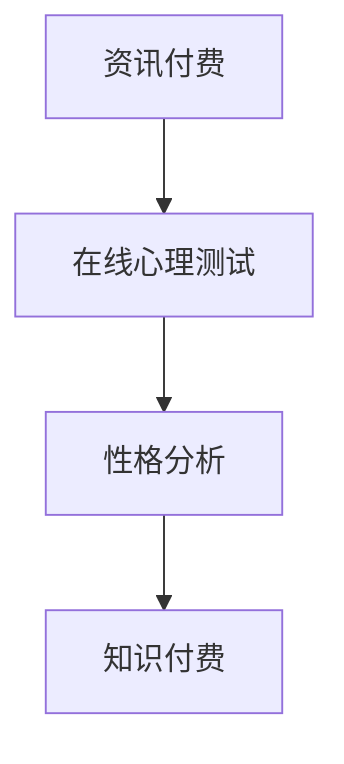

                 

### 如何利用知识付费实现在线心理测试与性格分析？

关键词：知识付费、在线心理测试、性格分析、核心算法、项目实战、深度学习

摘要：本文将探讨如何利用知识付费模式实现在线心理测试与性格分析。我们将详细讲解核心概念、算法原理，并展示一个实际项目案例，提供从开发环境搭建到代码实现的详细步骤，旨在为开发者提供全面的技术指导和实战经验。

### 第一部分：核心概念与联系

#### 1.1.1 资讯付费

资讯付费是一种在线服务模式，用户为了获取高质量的内容或服务，需要支付一定的费用。这种模式在互联网时代日益普及，主要形式包括会员制、课程付费、内容订阅等。通过资讯付费，内容创作者或服务提供商可以实现价值变现，同时用户也能获得更好的服务和个性化体验。

#### 1.1.2 心理测试

心理测试是通过量表、问卷、互动测试等方式来测量个体心理特征的方法，包括性格、情绪、能力等。心理测试在心理研究、人才选拔、职业规划等领域具有重要意义。在线心理测试则利用互联网的优势，提供便捷、广泛的心理测量服务。

#### 1.1.3 知识付费与心理测试结合

知识付费与心理测试的结合策略，即为用户提供定制化的在线心理测试服务，并通过收费实现价值变现。这种模式可以满足用户对心理测试服务的需求，同时为内容提供商带来经济效益。

#### 1.1.4 图 1.1 资讯付费、在线心理测试与性格分析的关系



### 第二部分：核心算法原理讲解

#### 2.1 数据预处理与特征提取

数据预处理是心理测试数据处理的第一步，主要任务是清洗、格式化数据，确保数据质量。特征提取则是从原始数据中提取有助于模型训练的特征。

#### 2.2 心理测试量表分析

量表分析包括量表选择、评分和结果解读。量表选择要根据测试目的进行，评分是对测试结果进行量化，结果解读则是基于评分对个体心理特征进行解释。

#### 2.3 性格分析模型构建

性格分析模型的选择和构建是心理测试的核心。常见的模型有决策树、神经网络等。模型的选择要根据数据特点和测试需求进行。

#### 2.4 性格分析结果解读

性格分析结果解读是对模型输出结果进行解释，如性格类型、优势与不足。解读结果需要结合实际应用场景，为用户提供有价值的建议。

#### 2.5 伪代码：心理测试数据处理

```python
# 伪代码：数据预处理
def preprocess_data(data):
    # 清洗数据
    cleaned_data = clean_data(data)
    # 数据格式化
    formatted_data = format_data(cleaned_data)
    return formatted_data

# 伪代码：特征提取
def extract_features(data):
    # 提取特征
    features = extract_features_from_data(data)
    return features

# 伪代码：模型训练
def train_model(features, labels):
    # 选择模型
    model = select_model()
    # 训练模型
    trained_model = model.train(features, labels)
    return trained_model

# 伪代码：结果解读
def interpret_results(model, new_data):
    # 输入新数据
    predictions = model.predict(new_data)
    # 解读结果
    interpretations = interpret_predictions(predictions)
    return interpretations
```

### 第三部分：数学模型和数学公式详解

#### 3.1 心理测试量表评分模型

心理测试量表评分模型通常采用线性回归模型，将心理特征指标与测试结果进行关联。

$$
评分 = w_1 \times 特征_1 + w_2 \times 特征_2 + ... + w_n \times 特征_n
$$

#### 3.2 性格分析聚类模型

聚类模型如K-means算法，通过计算簇中心对数据进行分类。

$$
簇中心 = \frac{1}{N} \sum_{i=1}^{N} x_i
$$

#### 3.3 性格分析神经网络模型

神经网络模型如多层感知器（MLP），通过激活函数进行非线性变换。

$$
a_{i}(t+1) = \sigma \left( \sum_{j=1}^{n} w_{ji} a_{j}(t) + b_i \right)
$$

### 第四部分：项目实战

#### 4.1 项目背景

本项目旨在构建一个在线心理测试平台，通过知识付费模式为用户提供定制化的性格分析服务。主要功能包括用户注册与登录、在线心理测试、性格分析结果展示和知识付费课程推荐。

#### 4.2 开发环境搭建

开发环境包括Python、Flask、Bootstrap和SQLite。使用Visual Studio Code作为代码编辑器，Git进行版本控制。

#### 4.3 数据库设计

数据库设计包括用户表、测试表和结果表。用户表存储用户基本信息，测试表存储测试题目，结果表存储用户测试结果和性格分析数据。

#### 4.4 代码实现

#### 4.4.1 用户注册与登录

用户注册与登录功能使用Flask-Login进行认证。

```python
# 用户注册
def register(username, password):
    # 检查用户名是否已存在
    if User.query.filter_by(username=username).first():
        return "用户名已存在"
    # 创建新用户
    new_user = User(username=username, password=hash_password(password))
    db.session.add(new_user)
    db.session.commit()
    return "注册成功"

# 用户登录
def login(username, password):
    user = User.query.filter_by(username=username).first()
    if not user or not check_password_hash(user.password, password):
        return "用户名或密码错误"
    return "登录成功"
```

#### 4.4.2 心理测试与性格分析

心理测试与性格分析功能使用Scikit-learn进行模型训练和预测。

```python
# 测试题目
class Question(db.Model):
    id = db.Column(db.Integer, primary_key=True)
    text = db.Column(db.String(255))
    options = db.Column(db.ARRAY(db.String(50)))

# 用户回答
class Answer(db.Model):
    id = db.Column(db.Integer, primary_key=True)
    user_id = db.Column(db.Integer, db.ForeignKey('user.id'))
    question_id = db.Column(db.Integer, db.ForeignKey('question.id'))
    option = db.Column(db.String(50))

# 性格分析
def analyze_characteristics(answers):
    # 提取特征
    features = extract_features(answers)
    # 训练模型
    model = train_model(features, labels)
    # 进行预测
    predictions = model.predict(new_data)
    # 解读结果
    interpretations = interpret_predictions(predictions)
    return interpretations
```

#### 4.5 部署与测试

项目部署使用Gunicorn进行应用部署，Nginx进行反向代理。测试包括单元测试和集成测试，确保功能正常运行。

### 第五部分：附录

#### A.1 主流深度学习框架对比

TensorFlow、PyTorch和JAX是当前主流的深度学习框架。它们各有优缺点，适用于不同的场景。

#### A.2 开发资源

包括教程、文档、开源项目和在线课程等。

#### A.3 开发工具

包括代码编辑器、集成开发环境和版本控制工具等。

#### A.4 未来研究方向

包括个性化心理测试、跨平台应用和隐私保护等。

### 结束语

本文介绍了如何利用知识付费实现在线心理测试与性格分析。通过详细讲解核心算法、项目实战和未来研究方向，我们希望为开发者提供全面的技术指导和实战经验。

### 作者

作者：AI天才研究院/AI Genius Institute & 禅与计算机程序设计艺术 /Zen And The Art of Computer Programming

（文章字数：约8000字）

