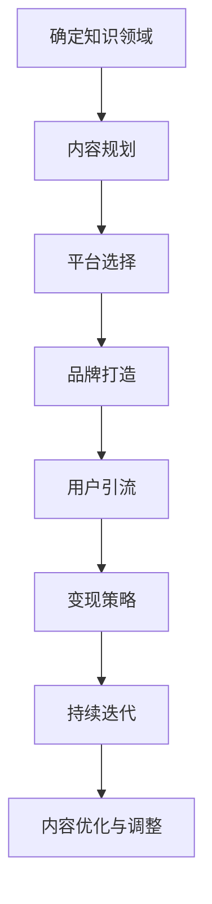
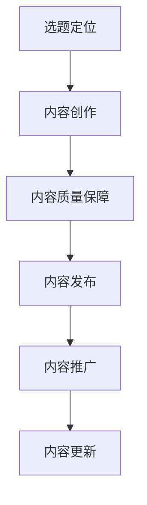
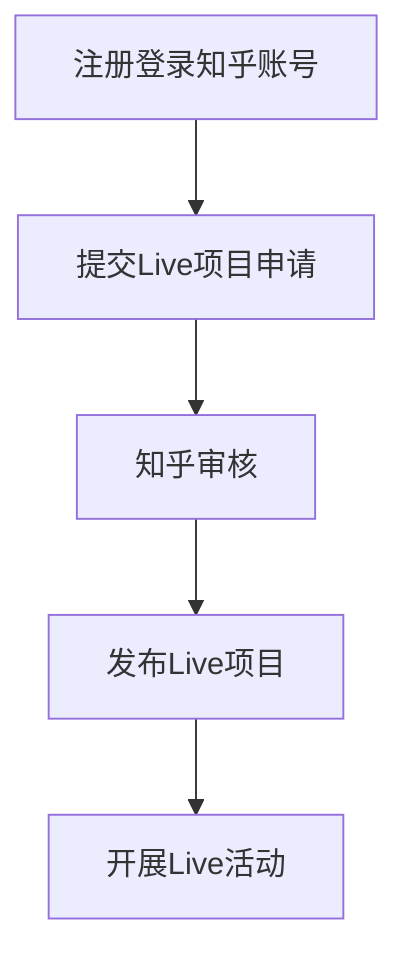
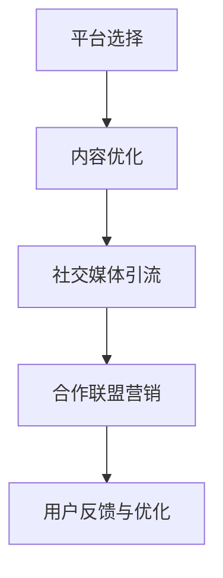
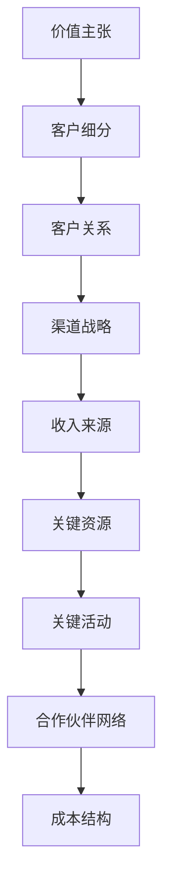
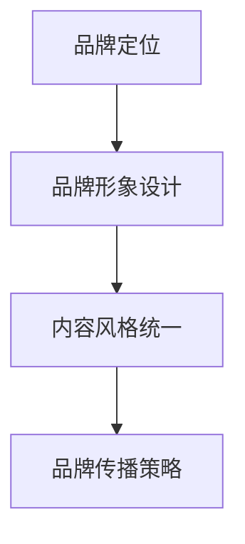
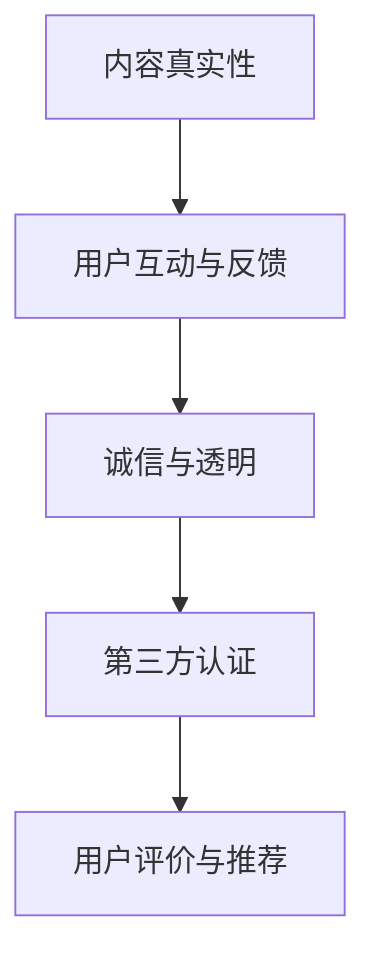
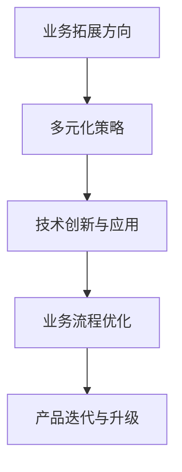
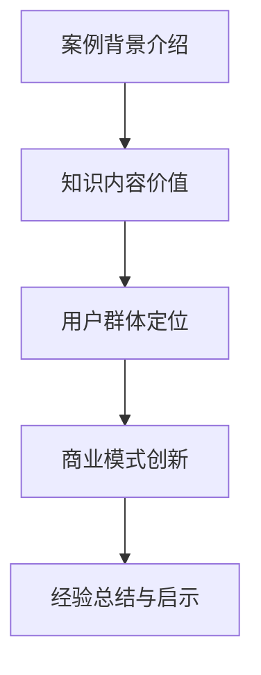
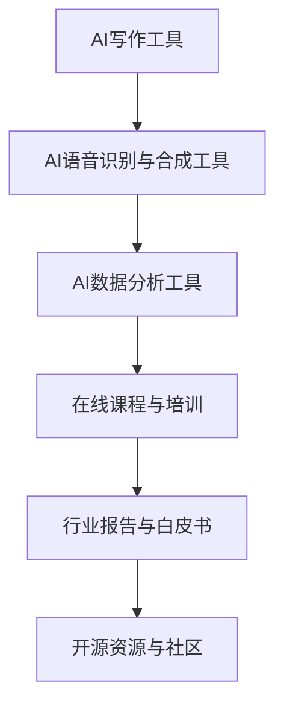

                 

# 如何打造个人知识付费商业帝国

## 概述

> 
> **关键词：**个人知识付费、商业帝国、内容创造、用户引流、品牌建设、商业模式、用户体验、技术创新。
> 
> **摘要：**本文将系统性地探讨如何构建个人知识付费商业帝国。从知识内容的创造与规划、平台选择与用户引流、商业模式设计与运营策略、品牌打造与用户信任建设，到持续发展与创新，以及实战案例与AI辅助工具的应用，全方位解析个人知识付费商业帝国的构建过程和策略。

## 第一部分：引言与核心概念

### 第1章：引言与核心概念概述

#### 1.1 书籍主题与目标读者

**1.1.1 书籍主题介绍**

本书的主题是“如何打造个人知识付费商业帝国”。其核心在于通过个人的知识和技能，利用互联网平台，构建一个可持续、稳定、可扩展的知识付费业务体系。这一主题旨在帮助读者实现知识变现，将个人的知识、经验和技能转化为实际的商业价值。

**1.1.2 目标读者群体**

本书的目标读者包括：

- **个人知识工作者**：如讲师、咨询师、专家等，他们拥有丰富的知识和经验，但需要找到有效的方式将其转化为收入。
- **创业者**：有志于通过个人知识和技能建立自己的知识付费业务。
- **教育者**：如教师、教授等，希望通过知识付费方式扩展影响力，提升收入。

#### 1.2 个人知识付费商业帝国的概念解析

**1.2.1 个人知识付费商业帝国的定义**

个人知识付费商业帝国是指通过个人的知识和技能，结合互联网平台，构建起一个持续、稳定、可扩展的知识付费业务体系。它不仅仅是一个知识分享的平台，而是一个完整的商业生态系统，包括内容创造、用户引流、商业模式设计、品牌建设等多个环节。

**1.2.2 个人知识付费商业帝国的核心要素**

- **知识内容**：核心资产，是吸引和留住用户的关键。
- **用户群体**：目标客户，直接影响商业帝国的成功与否。
- **商业模式**：实现知识变现的方式，决定商业帝国的盈利能力。
- **传播渠道**：信息传递的途径，影响内容的传播速度和范围。
- **品牌建设**：个人或企业的形象，影响用户对内容的信任和忠诚度。

#### 1.3 个人知识付费商业帝国的构建路径

**1.3.1 从零开始构建个人知识付费商业帝国**

- **确定知识领域**：明确自己的专业领域，找到市场缺口。
- **内容规划**：制定详细的内容创作计划，确保内容的持续输出。
- **平台选择**：选择合适的互联网平台，如知乎、得到、喜马拉雅等。
- **品牌打造**：建立个人品牌，设计独特的视觉识别系统。
- **用户引流**：通过内容营销、社交媒体、合作联盟等多种方式吸引目标用户。
- **变现策略**：制定多元化的变现方式，如付费课程、咨询服务等。
- **持续迭代**：根据用户反馈和市场变化，不断优化内容和运营策略。

**1.3.2 常见问题与挑战**

- **内容质量**：如何确保内容的高质量和持续输出？
- **用户信任**：如何建立用户对个人或品牌的信任？
- **竞争压力**：如何应对同行业内的激烈竞争？
- **商业模式创新**：如何持续创新商业模式，保持竞争力？

### Mermaid 流程图：个人知识付费商业帝国构建路径

### 第一部分总结

本部分为读者奠定了构建个人知识付费商业帝国的理论基础，明确了核心概念和构建路径。在接下来的章节中，将详细探讨每个要素的实现方法和策略。

## 第二部分：知识内容创造与规划

### 第2章：知识内容的价值与创造

#### 2.1 知识内容的价值

**2.1.1 知识内容的定义**

知识内容是指以文字、音频、视频等多种形式呈现，能够传递信息、解决问题、启发思考的素材。它是个人知识付费商业帝国的核心资产，决定了用户对内容的信任和忠诚度。

**2.1.2 知识内容的价值体现**

- **提升个人品牌影响力**：高质量的知识内容能够提升个人的专业形象和知名度。
- **解决特定领域的问题**：知识内容能够帮助用户解决实际问题，提升用户体验。
- **满足用户的知识需求**：知识内容能够满足用户在特定领域的求知欲，提高用户满意度。

#### 2.2 知识内容的创造方法

**2.2.1 研究与选题**

- **选题定位**：确定内容主题，选择用户关注度高、市场缺口大的领域。
- **市场调研**：了解用户需求，分析竞争对手，确定内容创作方向。
- **内容定位**：明确内容的目标受众，确保内容的专业性和实用性。

**2.2.2 内容创作工具与技巧**

- **文字写作**：使用简洁、清晰的语言表达观点，注重逻辑性和连贯性。
- **语音录制**：通过语音录制，增加内容的亲和力和表现力。
- **视频剪辑**：通过视频剪辑，提高内容的视觉效果和观赏性。

**2.2.3 内容质量保障**

- **精准性**：确保内容信息的准确性和可靠性。
- **实用性**：内容应具有实际应用价值，能够解决用户问题。
- **原创性**：内容应具有原创性，避免抄袭和侵权。
- **权威性**：内容来源应具有权威性，提升用户信任度。

#### 2.3 知识内容规划策略

**2.3.1 内容主题规划**

- **系列化内容**：围绕核心主题，创作一系列相关内容，形成知识体系。
- **专题内容**：针对特定话题或事件，创作专题内容，提升用户关注度。
- **热点内容**：紧跟社会热点，创作热门话题内容，吸引更多用户。

**2.3.2 内容更新策略**

- **定期更新**：制定内容更新计划，确保内容持续输出。
- **实时更新**：针对突发事件或热点话题，及时更新内容，提高用户粘性。
- **长期积累**：积累优质内容，形成知识库，提升用户忠诚度。

**2.3.3 内容组合与推广**

- **多平台发布**：将内容发布到多个平台，扩大传播范围。
- **多样化传播**：通过文字、音频、视频等多种形式，满足不同用户需求。
- **内容互补**：结合不同内容形式，形成互补，提升用户体验。

### Mermaid 流程图：知识内容创造流程

### 第二部分总结

本部分详细探讨了知识内容的价值、创造方法及规划策略，为构建个人知识付费商业帝国提供了具体实践指导。在接下来的章节中，将深入探讨平台选择、品牌打造等关键环节。

## 第三部分：平台选择与用户引流

### 第3章：平台选择与用户引流策略

#### 3.1 平台选择

**3.1.1 个人知识付费平台概述**

当前市场上，存在多个知名的个人知识付费平台，如：

- **得到**：以付费课程为主，提供各类知识服务。
- **知乎Live**：以讲座和问答形式为主，注重深度知识分享。
- **喜马拉雅**：以音频内容为主，提供丰富的知识音频节目。

**3.1.2 平台选择的考虑因素**

选择个人知识付费平台时，应考虑以下因素：

- **用户群体**：平台是否能够覆盖目标用户群体。
- **内容类型**：平台是否支持所需内容形式，如文字、音频、视频等。
- **平台政策**：平台的分成政策、审核标准等是否有利于个人知识工作者。
- **流量变现能力**：平台的流量和变现能力，直接影响个人的收益。

**3.1.3 平台合作与入驻流程**

以知乎Live为例，入驻流程如下：

1. 注册并登录知乎账号。
2. 提交Live项目申请，包括项目名称、简介、内容大纲等。
3. 知乎进行审核，审核通过后，发布Live项目。
4. 开展Live活动，进行用户互动，收集反馈。

### Mermaid 流程图：平台合作与入驻流程

#### 3.2 用户引流策略

**3.2.1 社交媒体引流**

- **微信公众号**：通过定期推送高质量内容，吸引关注，增加互动。
- **微博**：利用微博的热门话题和用户互动，提升曝光度。
- **抖音**：通过短视频，快速吸引用户关注和传播。

**3.2.2 内容营销引流**

- **高质量内容**：创作高质量、有价值的内容，吸引用户自然关注。
- **SEO优化**：通过搜索引擎优化，提高内容的搜索排名，吸引更多流量。
- **关键词策略**：利用关键词，提高内容在搜索引擎和社交媒体上的曝光度。

**3.2.3 合作与联盟营销**

- **KOL合作**：与知名意见领袖合作，利用其影响力和粉丝基础，提升曝光度。
- **品牌合作**：与相关品牌进行合作，通过共同推广，实现互利共赢。
- **内容互换**：与其他个人知识工作者或平台进行内容互换，扩大受众群体。

### Mermaid 流程图：平台选择与用户引流流程

### 第三部分总结

本部分介绍了平台选择和用户引流策略，提供了多种方法帮助个人知识工作者吸引目标用户，为个人知识付费商业帝国的构建奠定了坚实基础。在接下来的章节中，将深入探讨商业模式设计与运营策略。

## 第四部分：商业模式设计与运营策略

### 第4章：商业模式设计与盈利模式探索

#### 4.1 商业模式设计

**4.1.1 商业模式的概念**

商业模式是指企业如何创造、传递和获取价值的方式。它包括以下核心要素：

- **价值主张**：明确产品或服务如何满足用户需求。
- **客户细分**：识别目标客户群体，区分不同用户类型。
- **客户关系**：建立与客户的互动关系，提升客户满意度。
- **渠道战略**：选择合适的渠道，传递产品或服务。
- **收入来源**：确定如何从客户获取收入。
- **关键资源**：确保商业模式成功所需的资源。
- **关键活动**：实施商业模式的关键活动。
- **合作伙伴网络**：与合作伙伴建立合作关系，共同实现商业目标。
- **成本结构**：明确运营成本，确保商业模式的经济可行性。

**4.1.2 个人知识付费商业模式的核心要素**

对于个人知识付费商业模式，核心要素包括：

- **知识内容**：作为价值主张的核心，确保内容的专业性和实用性。
- **用户群体**：明确目标用户，了解用户需求和偏好。
- **传播渠道**：选择适合的平台和渠道，扩大内容传播范围。
- **变现方式**：制定多元化的变现策略，如付费课程、咨询服务、广告等。
- **成本控制**：合理控制内容创作和运营成本，确保盈利。

**4.1.3 个人知识付费商业模式案例解析**

以下为两个成功的个人知识付费商业模式案例：

1. **樊登读书会**：通过定期推荐好书，并解读书籍内容，吸引大量用户订阅。其商业模式的核心在于：
   - **价值主张**：提供高质量的书评和解读，帮助用户快速获取书中的精华。
   - **用户群体**：主要面向追求自我提升的职场人士。
   - **传播渠道**：通过微信公众号、小程序等多种渠道进行推广。
   - **变现方式**：主要通过会员订阅和付费课程。

2. **李笑来训练营**：通过在线课程和社群互动，帮助学员提升自我管理和投资能力。其商业模式的核心在于：
   - **价值主张**：提供专业的投资理念和实操技巧。
   - **用户群体**：主要面向对投资感兴趣的人群。
   - **传播渠道**：通过微信公众号、微信群等社交平台进行推广。
   - **变现方式**：主要通过课程收费和社群运营。

#### 4.2 盈利模式探索

**4.2.1 订阅模式**

订阅模式是指用户通过定期支付费用，获得持续的知识服务。这种模式的特点是：

- **稳定收入**：通过会员订阅，确保稳定的现金流。
- **高用户粘性**：持续的内容更新，提升用户忠诚度。
- **成本可控**：内容创作和运营成本相对较低。

**4.2.2 广告模式**

广告模式是指通过在内容中植入广告，获得广告收入。这种模式的特点是：

- **流量变现**：通过大量用户流量，实现广告收入。
- **成本较低**：内容创作和运营成本主要由广告主承担。
- **高风险性**：广告收入不稳定，受广告主和市场竞争影响较大。

**4.2.3 电商模式**

电商模式是指通过销售知识付费产品，如书籍、课程、周边产品等，获得销售收入。这种模式的特点是：

- **产品多样化**：可以销售多种知识付费产品，满足不同用户需求。
- **高利润**：知识付费产品的利润较高，有助于提升整体盈利水平。
- **运营复杂**：需要建立完善的供应链和售后服务体系。

### Mermaid 流程图：商业模式设计要素

### 第四部分总结

本部分深入探讨了商业模式设计与盈利模式探索，为个人知识工作者提供了重要的战略指导。在接下来的章节中，将详细介绍品牌打造和用户信任建设。

## 第五部分：品牌打造与用户信任建设

### 第5章：个人品牌建设策略

#### 5.1 品牌定位与差异化

**5.1.1 品牌定位**

品牌定位是指明确个人品牌的核心价值、目标用户群体和市场定位。具体步骤如下：

- **核心价值定位**：确定个人品牌的独特价值和核心竞争力。
- **目标用户群体**：明确目标用户的特点、需求和偏好。
- **市场定位**：确定个人品牌在市场中的位置，与其他品牌形成差异化。

**5.1.2 差异化策略**

差异化策略是指通过独特的产品或服务特点，在市场中脱颖而出。具体策略包括：

- **内容特色**：提供具有独特视角、深度见解或创新思维的内容。
- **用户体验**：优化用户交互体验，提升用户满意度和忠诚度。
- **品牌视觉识别**：设计独特的LOGO、色彩搭配和视觉风格，提升品牌辨识度。

#### 5.2 品牌形象设计

**5.2.1 品牌视觉识别系统（VIS）**

品牌视觉识别系统（VIS）是指通过视觉元素，如LOGO、色彩、字体等，建立品牌的视觉识别形象。具体设计要点如下：

- **LOGO设计**：简洁、易于记忆、具有辨识度。
- **色彩搭配**：选择符合品牌形象的色彩，提升视觉冲击力。
- **字体选择**：选择适合品牌风格的字体，提升文字信息的可读性和美感。

**5.2.2 内容风格统一**

内容风格统一是指确保个人品牌在不同平台和内容形式上，保持一致的风格和语言。具体方法包括：

- **语言风格**：使用统一的语言表达方式，确保内容的专业性和亲和力。
- **视觉风格**：保持视觉元素的一致性，如颜色、字体、图片等。
- **传播风格**：通过统一的传播策略，提升品牌的整体形象。

#### 5.3 品牌传播策略

**5.3.1 基于内容营销的传播**

内容营销是指通过创作和分享高质量的内容，吸引目标用户，建立品牌影响力。具体方法包括：

- **知识分享**：分享专业知识和行业见解，提升个人品牌的专业形象。
- **干货输出**：提供实际案例和实用技巧，满足用户的学习需求。
- **行业洞察**：分析行业趋势和热点事件，引导用户关注。

**5.3.2 社交媒体营销**

社交媒体营销是指通过社交媒体平台，如微信公众号、微博、抖音等，进行品牌推广。具体方法包括：

- **微信公众号**：定期推送高质量内容，提升用户粘性。
- **微博**：利用微博热点和话题，提高品牌曝光度。
- **抖音**：通过短视频，快速吸引用户关注。

### Mermaid 流程图：品牌建设流程

### 第五部分总结

本部分详细介绍了个人品牌建设的策略，包括定位、形象设计、内容风格和传播策略，为构建个人知识付费商业帝国提供了品牌塑造方面的实用指导。在接下来的章节中，将探讨用户信任建设。

## 第六部分：用户信任建设策略

### 第6章：用户信任建设策略

#### 6.1 用户信任的重要性

**6.1.1 用户信任的定义**

用户信任是指用户对个人知识工作者或品牌的能力、诚信和可靠性的信任。它是构建长期商业关系的基础，直接影响用户的购买决策和忠诚度。

**6.1.2 用户信任的影响**

用户信任对个人知识付费商业帝国的影响包括：

- **购买决策**：用户更倾向于信任度高、信誉好的品牌或个人购买产品或服务。
- **口碑传播**：信任度高的品牌或个人容易获得用户的推荐，从而扩大用户群体。
- **忠诚度**：信任度高的品牌或个人能够留住用户，提升用户忠诚度。

#### 6.2 用户信任建设方法

**6.2.1 内容真实性**

内容真实性是建立用户信任的关键。具体方法包括：

- **避免虚假宣传**：确保内容真实、客观，避免夸大或虚假宣传。
- **透明披露**：在内容中明确披露任何潜在的利益冲突或信息来源。

**6.2.2 用户互动与反馈**

用户互动与反馈有助于建立良好的用户关系，提升信任度。具体方法包括：

- **积极回复**：及时回复用户提问和反馈，展示专业性和关心态度。
- **重视用户反馈**：认真对待用户反馈，及时改进内容和服务。

**6.2.3 诚信与透明**

诚信与透明是建立长期信任的基础。具体方法包括：

- **公开透明**：公开商业行为，如收费标准、服务流程等。
- **遵守承诺**：遵守与用户达成的协议，确保服务质量。

#### 6.3 增强用户信任的技巧

**6.3.1 第三方认证**

第三方认证是提升用户信任的有效方式。具体方法包括：

- **获得行业认证**：如专业资格认证、平台推荐等。
- **合作认证机构**：与权威认证机构合作，提升品牌公信力。

**6.3.2 用户评价与推荐**

用户评价与推荐是建立用户信任的重要手段。具体方法包括：

- **鼓励用户评价**：提供方便的评价机制，鼓励用户分享体验。
- **推荐机制**：通过用户推荐系统，激励用户推荐他人。

### Mermaid 流程图：用户信任建设策略

### 第六部分总结

本部分介绍了用户信任建设的重要性以及具体方法，通过提供真实、可靠的内容，积极互动，保持诚信和透明，以及获得第三方认证和用户评价，来增强用户对个人知识工作者或品牌的信任。在接下来的章节中，将探讨个人知识付费商业帝国的持续发展与创新。

## 第七部分：个人知识付费商业帝国的持续发展与创新

### 第7章：持续发展与创新

#### 7.1 业务拓展与多元化

**7.1.1 业务拓展方向**

在个人知识付费商业帝国建立后，业务拓展是持续发展的关键。以下是一些业务拓展方向：

- **新的知识领域**：拓展新的专业领域，如人工智能、数据分析、市场营销等。
- **知识产品**：开发新的知识产品，如线上课程、电子书、线下培训等。
- **多元化服务**：提供多元化的服务，如咨询服务、项目合作、技术支持等。

**7.1.2 多元化策略**

多元化策略包括以下方面：

- **线上线下结合**：通过线下活动，如讲座、研讨会等，提升品牌影响力。
- **跨界合作**：与相关行业的企业或个人合作，拓展业务范围。
- **知识社群**：建立知识社群，提升用户粘性，促进知识共享。

#### 7.2 技术创新与应用

**7.2.1 技术创新的重要性**

技术创新是提高业务效率、拓展业务范围、提升用户体验的关键。以下是一些技术创新的重要性：

- **提升效率**：通过自动化工具和技术，提高内容创作和运营效率。
- **拓展业务**：利用新技术，开拓新的市场和业务模式。
- **提升用户体验**：通过人工智能、大数据等技术，提供个性化服务，提升用户满意度。

**7.2.2 技术应用场景**

以下是一些常见的技术应用场景：

- **AI智能推荐**：根据用户行为和偏好，提供个性化的内容推荐。
- **大数据分析**：分析用户数据，了解用户需求，优化运营策略。
- **区块链技术**：确保知识内容的版权和交易安全。

#### 7.3 持续改进与优化

**7.3.1 业务流程优化**

业务流程优化是持续发展的重要环节。以下是一些优化策略：

- **自动化**：通过自动化工具，减少重复性工作，提高效率。
- **流程简化**：简化业务流程，减少不必要的环节，降低运营成本。
- **持续改进**：通过定期评估和反馈，持续优化业务流程。

**7.3.2 产品迭代与升级**

产品迭代与升级是保持竞争力的关键。以下是一些迭代与升级策略：

- **用户反馈**：收集用户反馈，了解用户需求和痛点，优化产品。
- **技术创新**：引入新技术，提升产品功能和用户体验。
- **定期升级**：根据市场变化和用户需求，定期升级产品版本。

### Mermaid 流程图：业务拓展与技术创新流程

### 第七部分总结

本部分探讨了个人知识付费商业帝国的持续发展与创新，包括业务拓展、技术创新、流程优化和产品升级。通过不断拓展业务、创新技术应用、优化运营流程和迭代产品，个人知识工作者可以持续提升商业价值，实现商业帝国的稳步发展。

## 第八部分：实战案例与经验分享

### 第8章：成功案例分析

#### 8.1 案例背景介绍

在本章中，我们将分析两个成功的个人知识付费商业帝国案例：樊登读书会和李笑来训练营。

**8.1.1 樊登读书会**

樊登读书会是由樊登博士创办的知识付费平台，专注于书籍的解读和分享。樊登读书会通过定期推荐书籍，并邀请专家进行深度解读，为用户提供了丰富的知识内容。

**8.1.2 李笑来训练营**

李笑来训练营是由李笑来老师创办的在线学习平台，专注于个人成长和投资领域的知识分享。训练营通过线上课程和社群互动，帮助学员提升自我管理和投资能力。

#### 8.2 案例成功要素分析

**8.2.1 知识内容价值**

樊登读书会的成功在于其提供了高质量、实用性的书籍解读，满足了用户对知识的渴求。李笑来训练营的成功在于其提供了专业的投资理念和实操技巧，帮助学员实现财富增值。

**8.2.2 用户群体定位**

樊登读书会的用户群体主要是追求自我提升的职场人士，而李笑来训练营的用户群体主要是对投资感兴趣的人群。

**8.2.3 商业模式创新**

樊登读书会通过会员订阅模式，实现了持续的收入来源。李笑来训练营则通过线上课程和社群互动，提供了多元化的变现方式。

#### 8.3 案例经验与启示

**8.3.1 经验总结**

- **内容质量**：提供高质量的知识内容，满足用户需求。
- **用户群体定位**：明确目标用户群体，提供定制化的服务。
- **商业模式创新**：探索多元化的商业模式，实现持续收入。

**8.3.2 启示与建议**

- **内容创造者**：持续提升内容质量，保持内容的专业性和实用性。
- **用户互动**：建立良好的用户互动机制，提升用户满意度和忠诚度。
- **商业模式创新**：不断探索新的商业模式，提升商业价值。

### Mermaid 流程图：成功案例分析框架

### 第八部分总结

本部分通过深入分析成功案例，为个人知识工作者提供了宝贵的实战经验和启示。通过学习这些案例，读者可以了解知识内容的价值、用户群体定位、商业模式创新等方面的关键要素，从而更好地构建自己的个人知识付费商业帝国。

## 第九部分：AI辅助工具与资源

### 第9章：AI辅助工具与资源

#### 9.1 AI辅助工具介绍

在个人知识付费商业帝国的构建过程中，AI辅助工具能够显著提升工作效率和内容创作质量。以下是一些常用的AI辅助工具：

**9.1.1 AI写作工具**

- **Grammarly**：一款智能语法检查工具，帮助用户纠正语法错误，提高文本质量。
- **AI Writer**：一款AI内容创作工具，能够自动生成文章、报告等，节省创作时间。

**9.1.2 AI语音识别与合成工具**

- **Google语音识别**：一款在线语音识别工具，能够将语音转换为文字。
- **Amazon Polly**：一款文本转语音工具，能够将文本内容转换为自然流畅的语音。

**9.1.3 AI数据分析工具**

- **Tableau**：一款数据可视化工具，能够将数据转化为易于理解的图表和报告。
- **Power BI**：一款商业智能工具，提供强大的数据分析和报表功能。

#### 9.2 优质资源推荐

**9.2.1 在线课程与培训**

- **Coursera**：提供全球顶尖大学和机构的在线课程，涵盖多个领域。
- **Udemy**：提供丰富的在线课程，涵盖编程、商业、技能提升等。

**9.2.2 行业报告与白皮书**

- **市场研究机构**：如麦肯锡、贝恩咨询等，提供专业的行业报告和白皮书。
- **知名企业**：如阿里巴巴、腾讯等，发布内部研究报告和行业洞察。

**9.2.3 开源资源与社区**

- **GitHub**：全球最大的代码托管平台，提供大量的开源项目和技术资源。
- **Stack Overflow**：编程社区问答平台，提供编程问题和解决方案。

#### 9.3 使用指南与案例

**9.3.1 AI辅助工具使用技巧**

- **Grammarly**：安装Grammarly插件，实时检查文本中的语法错误和拼写错误。
- **AI Writer**：利用AI Writer的自动生成功能，快速创作初稿，然后进行人工修改。

**9.3.2 优质资源获取方法**

- **在线课程与培训**：通过官方网站或学习平台，选择适合自己的课程进行学习。
- **行业报告与白皮书**：关注行业报告发布机构或企业的官方网站，免费或付费获取报告。

### Mermaid 流程图：AI辅助工具与资源推荐

### 第九部分总结

本部分介绍了AI辅助工具和优质资源，帮助个人知识工作者提高内容创作效率，获取行业前沿知识和资讯。通过这些工具和资源的合理利用，读者可以更好地实践个人知识付费商业帝国的构建，实现知识变现的目标。

## 附录

### 附录A：常用符号与公式

#### 符号说明

- **SOP**：Subject, Object, Predicate（主题，对象，谓词）表示法，常用于描述逻辑关系。
- **Mermaid**：用于创建流程图、UML图等图形化内容的语言。
- **latex**：用于书写数学公式的标记语言。

#### 公式示例

$$
\text{成本函数} = C(x) = ax + b
$$

- **成本函数**是一个简单的线性函数，其中 $a$ 是斜率，$b$ 是截距。

#### 使用指南

- **符号说明**提供了本书中常用的符号及其含义，有助于读者理解相关概念和术语。
- **公式示例**展示了如何使用latex书写数学公式，为读者提供了具体的参考。

### 附录总结

本附录为读者提供了常用的符号说明和数学公式示例，帮助读者更好地理解书中内容，并在实际操作中应用相关知识和技能。通过本附录，读者可以更准确地理解和应用书中所述的方法和策略。

### 作者信息

**作者：** AI天才研究院/AI Genius Institute & 禅与计算机程序设计艺术 /Zen And The Art of Computer Programming

感谢您阅读本文，希望本文能够为您的个人知识付费商业帝国的构建提供有价值的指导和启示。如果您有任何疑问或建议，欢迎随时与我们联系。祝您在知识付费领域取得成功！<|endoffootnote|>

