                 

### 如何提高知识付费产品的用户忠诚度

> **关键词：** 知识付费、用户忠诚度、用户行为分析、个性化推荐、社区互动、服务体验、持续学习。

**摘要：** 在知识付费市场日益繁荣的背景下，提高用户忠诚度成为平台竞争的关键。本文从用户行为分析、个性化推荐、社区互动、服务体验和持续学习五个方面，深入探讨了提高知识付费产品用户忠诚度的策略和实践方法。通过具体案例分析，本文为知识付费平台提供了可操作性强的建议，旨在帮助平台在激烈的市场竞争中脱颖而出。

## 第一部分：核心概念与联系

### 1.1.1 软件与知识付费

在讨论知识付费产品的用户忠诚度之前，我们需要理解软件从1.0时代到2.0时代的转变，以及这一转变如何影响到知识付费领域。

#### 1.1.1.1 从软件1.0到软件2.0的演进

**软件1.0时代：** 以本地应用为主，如操作系统、办公软件等。用户通过购买软件产品获得使用权限，软件更新和维护主要依靠厂商。

**软件2.0时代：** 以网络服务为主，如云计算、大数据、AI等。软件以服务的形式提供，用户可以通过订阅模式获取持续的服务和支持。

**Mermaid流程图：**

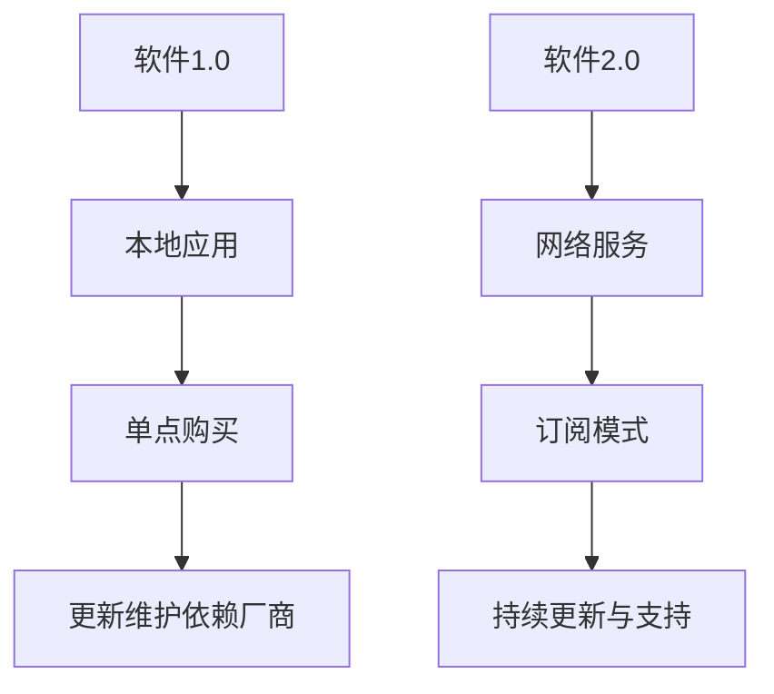

#### 1.1.1.2 大模型在软件2.0中的核心地位

随着软件从1.0向2.0的转变，AI大模型在知识付费领域中的作用日益突出。大模型能够处理海量数据，实现智能推荐、内容生成和个性化服务，从而提升用户体验和用户忠诚度。

**Mermaid流程图：**

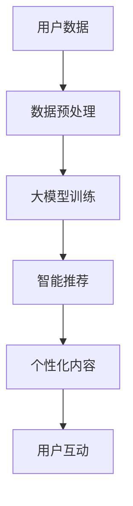

#### 1.1.1.3 企业级应用开发的新范式

软件2.0时代，企业级应用开发正在经历深刻变革。传统的瀑布式开发模式逐渐被敏捷开发、DevOps等现代化开发范式所取代。知识付费平台需要适应这一变化，以快速响应市场变化和用户需求。

**Mermaid流程图：**

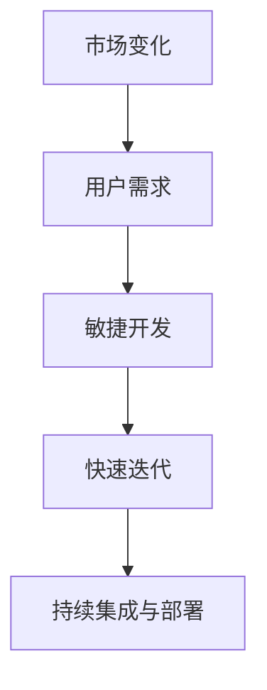

### 1.2 AI大模型的定义与特点

AI大模型是具有数亿至数十亿参数的大型神经网络模型，能够处理复杂的数据集，提取丰富的特征，实现高精度的预测和分类。以下是AI大模型的一些核心特点：

#### 1.2.1 AI大模型的定义

**AI大模型**：指那些拥有数亿至数十亿参数的大型神经网络模型。这些模型通常用于处理大规模数据集，如图像识别、自然语言处理和推荐系统等领域。

#### 1.2.2 AI大模型的核心特点

- **参数规模巨大**：能够处理大量数据，提取复杂特征。
- **学习能力强大**：能够通过大量数据进行自我学习和优化。
- **泛化能力高**：能够将学习到的知识应用到新的任务和数据集上。

**Mermaid流程图：**

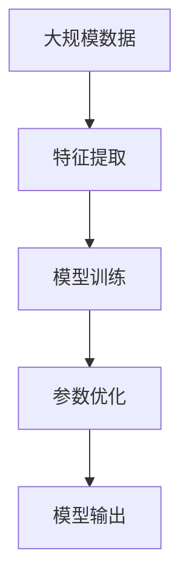

#### 1.2.3 AI大模型与传统AI的区别

**传统AI**：以规则驱动，如专家系统。模型性能依赖于预设的规则和人工定义的特征。

**AI大模型**：以数据驱动，通过自我学习进行优化。模型性能依赖于从数据中学习到的特征和模式。

**Mermaid流程图：**

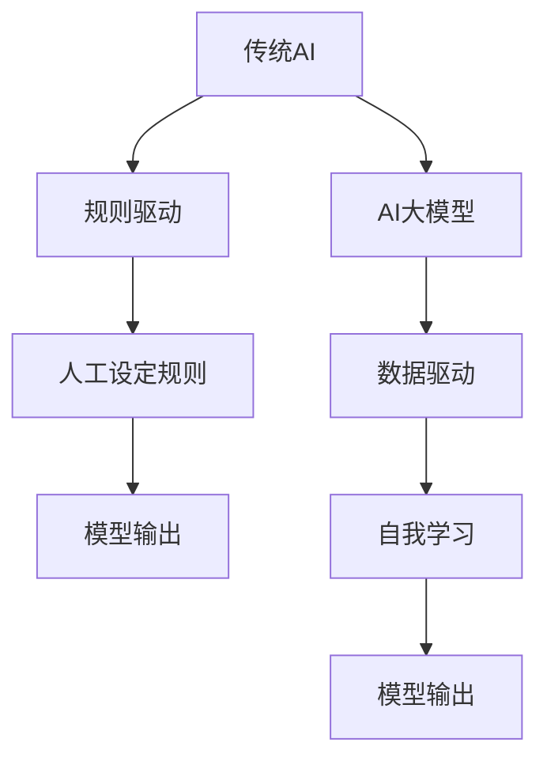

### 1.3 知识付费产品的用户忠诚度

在知识付费市场中，用户忠诚度是衡量平台成功与否的关键指标。提高用户忠诚度不仅能够增加用户粘性，还能促进用户二次消费和口碑传播。以下是影响知识付费产品用户忠诚度的几个关键因素：

#### 1.3.1 用户行为分析

通过分析用户的行为数据，平台可以了解用户的学习习惯、兴趣爱好和需求。这些信息有助于平台提供更加个性化的内容和推荐。

**Mermaid流程图：**

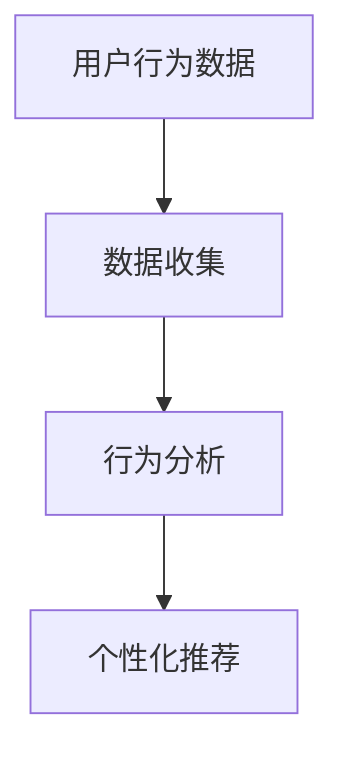

#### 1.3.2 个性化推荐

个性化推荐能够提高用户的学习体验，增加用户对知识付费产品的满意度。通过分析用户行为数据和内容偏好，平台可以推荐更加符合用户需求的课程和内容。

**Mermaid流程图：**

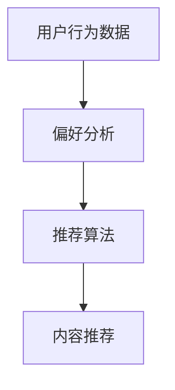

#### 1.3.3 社区互动

社区互动能够增强用户的归属感和参与感，提高用户忠诚度。通过建立学习社区、论坛和讨论组，平台可以促进用户之间的交流和互动。

**Mermaid流程图：**

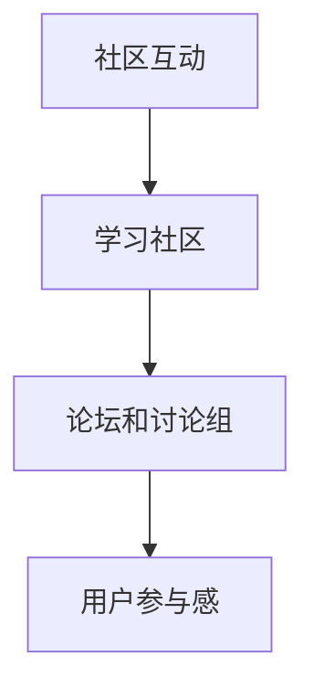

#### 1.3.4 服务体验

服务体验是影响用户忠诚度的关键因素之一。平台需要提供便捷的支付方式、高效的客户服务和技术支持，以提升用户满意度。

**Mermaid流程图：**

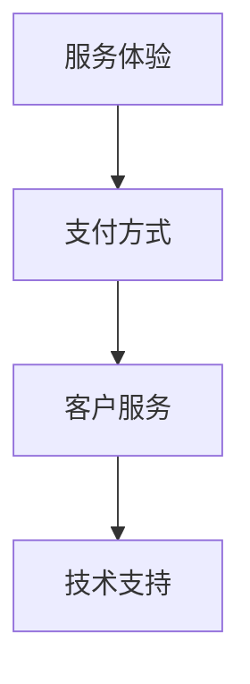

#### 1.3.5 持续学习

知识付费产品需要提供持续的学习机会和成长路径，以满足用户不断提升的学习需求。通过定期更新课程内容、推出新课程和提供学习奖励，平台可以鼓励用户持续学习。

**Mermaid流程图：**

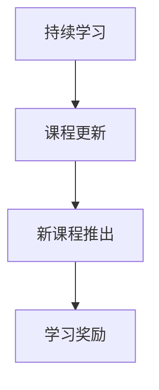

## 第一部分：核心算法原理讲解

### 2.1 深度学习与神经网络基础

深度学习是当前人工智能领域的一个重要分支，其核心思想是通过多层神经网络来模拟人脑的思维方式。以下是对深度学习与神经网络基础的核心算法原理的讲解。

#### 2.1.1 神经网络的基本结构

神经网络（Neural Network）是深度学习的基础，由多个层次组成，包括输入层、隐藏层和输出层。每一层由多个神经元（Node）构成，神经元之间通过加权连接（Weighted Connection）进行信息传递。

**神经网络的基本结构：**

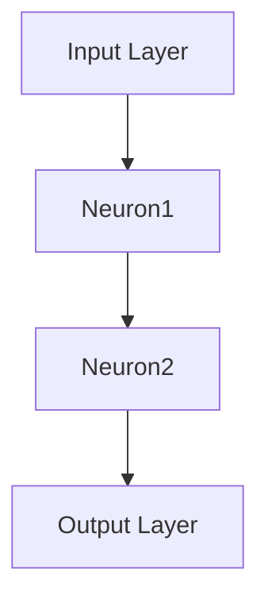

#### 2.1.2 常见的深度学习架构

深度学习架构多种多样，常见的有卷积神经网络（CNN）、循环神经网络（RNN）和变换器架构（Transformer）等。每种架构都有其特定的应用场景和优势。

- **卷积神经网络（CNN）**：用于图像识别和处理。
- **循环神经网络（RNN）**：用于处理序列数据，如自然语言处理。
- **变换器架构（Transformer）**：在机器翻译、文本生成等领域表现优异。

**常见的深度学习架构：**

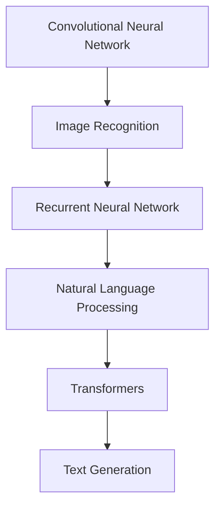

#### 2.1.3 深度学习优化算法

深度学习模型的训练是一个优化过程，需要通过调整模型参数来最小化损失函数。常见的优化算法有随机梯度下降（SGD）、Adam优化器等。

- **随机梯度下降（SGD）**：每次迭代使用一个样本的梯度进行参数更新。
- **Adam优化器**：结合了SGD和AdaGrad算法的优点，自适应调整学习率。

**伪代码示例：**

```python
# 随机梯度下降（SGD）
for epoch in range(num_epochs):
    for sample in data_loader:
        gradient = compute_gradient(sample)
        update_parameters(learning_rate * gradient)
        
# Adam优化器
for epoch in range(num_epochs):
    for sample in data_loader:
        gradient = compute_gradient(sample)
        m = beta1 * m + (1 - beta1) * gradient
        v = beta2 * v + (1 - beta2) * (gradient ** 2)
        m_hat = m / (1 - beta1 ** epoch)
        v_hat = v / (1 - beta2 ** epoch)
        update_parameters(-learning_rate * m_hat / (sqrt(v_hat) + epsilon))
```

### 2.2 自然语言处理技术概览

自然语言处理（NLP）是深度学习应用的重要领域之一，其核心任务是使计算机能够理解、生成和处理人类语言。以下是NLP技术概览。

#### 2.2.1 词嵌入技术

词嵌入（Word Embedding）是将单词映射到高维空间中的向量表示，以便在机器学习模型中处理。常见的词嵌入技术有Word2Vec、GloVe等。

**词嵌入技术：**

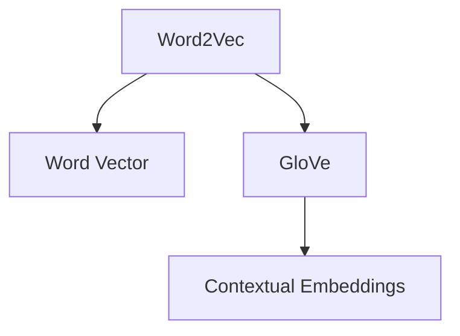

#### 2.2.2 序列模型与注意力机制

序列模型（如RNN、LSTM）用于处理序列数据，而注意力机制（Attention Mechanism）能够提高模型对序列中关键信息的关注。

**序列模型与注意力机制：**

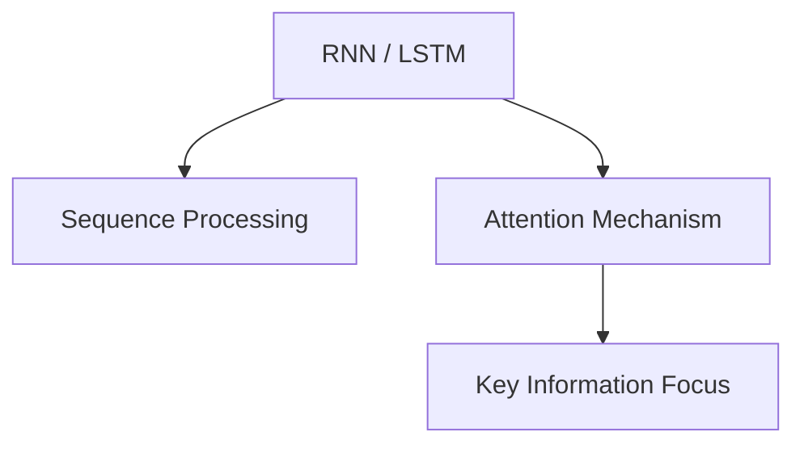

#### 2.2.3 转换器架构详解

变换器架构（Transformer）是NLP领域的革命性创新，通过自注意力机制（Self-Attention）实现了对输入序列的全局信息处理。

**变换器架构详解：**

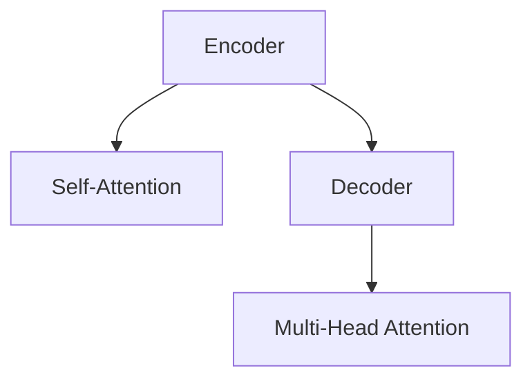

### 2.3 大规模预训练模型原理

大规模预训练模型是当前NLP领域的主流方法，通过在大量无标签数据上进行预训练，然后在小数据集上进行微调，实现高性能的语言理解和生成任务。

#### 2.3.1 预训练的概念与意义

预训练（Pre-training）是指在大量无标签数据集上训练深度学习模型，使其具备一定的语言理解能力和知识储备。预训练的意义在于：

- **提高模型泛化能力**：通过大量数据的训练，模型能够更好地适应不同的任务和数据集。
- **减少标注数据需求**：预训练模型可以在少量有标签数据上进行微调，从而降低数据标注的成本。

**预训练的概念与意义：**

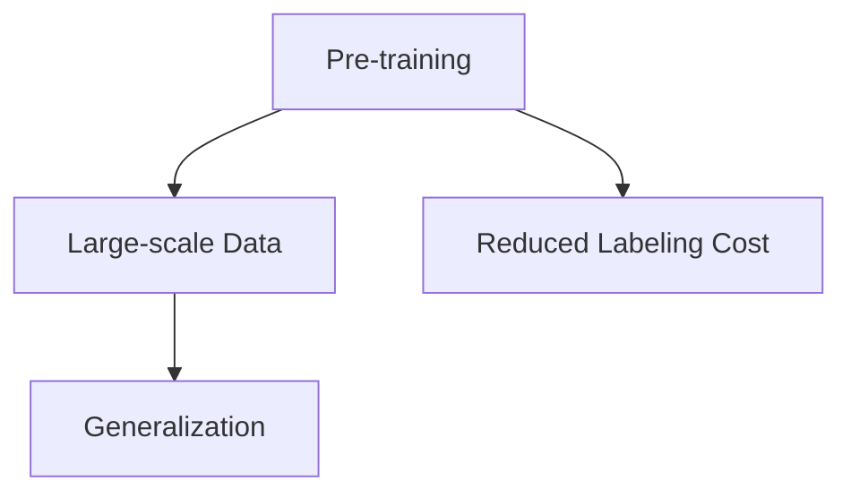

#### 2.3.2 自监督学习方法

自监督学习（Self-supervised Learning）是一种无需人工标注的数据处理方法，通过利用数据的内在结构进行训练。预训练模型常用的自监督学习任务有掩码语言模型（Masked Language Model，MLM）和掩码图像模型（Masked Image Model，MIM）。

**自监督学习方法：**

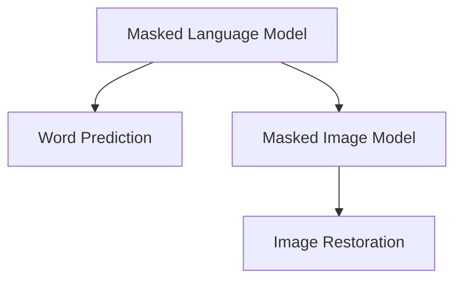

#### 2.3.3 迁移学习与微调技术

迁移学习（Transfer Learning）是指将预训练模型的知识迁移到新的任务上。微调（Fine-tuning）是迁移学习的一种实现方式，通过在小数据集上进行微调，使模型适应新的任务和数据。

**迁移学习与微调技术：**

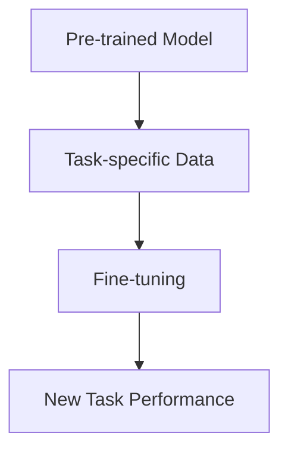

### 2.4 数学模型和数学公式

深度学习和自然语言处理中的数学模型和公式是理解这些技术的基础。以下是对几个关键数学模型和公式的解释。

#### 2.4.1 激活函数

激活函数是神经网络中的一个关键组件，用于引入非线性特性，使模型能够拟合复杂的数据。

- **Sigmoid函数**：用于将输入映射到（0, 1）区间，公式为：

  $$\sigma(x) = \frac{1}{1 + e^{-x}}$$

- **ReLU函数**：用于引入非负激活值，公式为：

  $$\text{ReLU}(x) = \max(0, x)$$

#### 2.4.2 损失函数

损失函数是评估模型预测结果与真实值之间差异的关键工具。

- **交叉熵损失函数**：常用于分类任务，公式为：

  $$\mathcal{L} = -\sum_{i} y_i \log(\hat{y}_i)$$

  其中，$y_i$ 是真实标签，$\hat{y}_i$ 是预测概率。

#### 2.4.3 优化算法

优化算法用于调整模型的参数，以最小化损失函数。

- **随机梯度下降（SGD）**：更新公式为：

  $$\theta = \theta - \alpha \nabla_\theta \mathcal{L}$$

  其中，$\theta$ 是模型参数，$\alpha$ 是学习率，$\nabla_\theta \mathcal{L}$ 是损失函数关于参数的梯度。

- **Adam优化器**：结合了SGD和AdaGrad算法的优点，公式为：

  $$m_t = \beta_1 m_{t-1} + (1 - \beta_1) \nabla_\theta \mathcal{L}$$
  $$v_t = \beta_2 v_{t-1} + (1 - \beta_2) (\nabla_\theta \mathcal{L})^2$$
  $$\theta_t = \theta_{t-1} - \alpha \frac{m_t}{\sqrt{v_t} + \epsilon}$$

  其中，$m_t$ 和 $v_t$ 分别是梯度的一阶矩估计和二阶矩估计，$\beta_1$ 和 $\beta_2$ 是矩估计的指数衰减率，$\epsilon$ 是一个很小的常数。

### 2.5 项目实战

#### 2.5.1 简单的Word2Vec模型实战

**开发环境搭建：**

- 安装Python和必要的库（如NumPy、Gensim等）。

**源代码实现：**

```python
import numpy as np
from gensim.models import Word2Vec

# 加载数据集
sentences = [[word for word in line.split()] for line in data]

# 训练Word2Vec模型
model = Word2Vec(sentences, vector_size=100, window=5, min_count=1, workers=4)

# 保存模型
model.save("word2vec.model")

# 加载模型
loaded_model = Word2Vec.load("word2vec.model")

# 查看单词向量
print(loaded_model.wv["hello"])
```

**代码解读与分析：**

- 数据加载：使用Gensim库加载数据集，并进行分词处理。
- 模型训练：使用Word2Vec模型进行训练，设置参数以优化模型性能。
- 保存与加载模型：使用`save()`和`load()`方法保存和加载模型。
- 查看单词向量：使用`wv`属性查看单词的向量表示。

#### 2.5.2 简单的BERT模型实战

**开发环境搭建：**

- 安装Python和必要的库（如transformers、torch等）。

**源代码实现：**

```python
from transformers import BertModel, BertTokenizer

# 加载BERT模型和分词器
tokenizer = BertTokenizer.from_pretrained('bert-base-uncased')
model = BertModel.from_pretrained('bert-base-uncased')

# 输入文本
text = "Hello, World!"

# 分词并添加特殊标记
inputs = tokenizer(text, return_tensors='pt')

# 前向传播
outputs = model(**inputs)

# 输出隐藏层特征
hidden_states = outputs.hidden_states[-1]

# 查看隐藏层特征
print(hidden_states.shape)
```

**代码解读与分析：**

- 数据加载：使用transformers库加载BERT模型和分词器。
- 分词：使用分词器对输入文本进行分词处理。
- 模型训练：使用BERT模型进行前向传播。
- 查看隐藏层特征：使用`hidden_states`属性查看模型的隐藏层输出。

### 第二部分：企业AI战略规划

#### 4.1 AI在企业中的价值评估

AI技术在企业中的应用已经成为提高效率、降低成本、增强竞争力的重要手段。以下是对AI在企业中价值的评估方法和案例分析。

#### 4.1.1 评估框架

为了准确评估AI技术在企业中的应用价值，可以采用以下评估框架：

- **ROI分析**：计算AI项目带来的投资回报率。
- **能力评估**：评估企业在AI领域的竞争力。

**评估框架：**

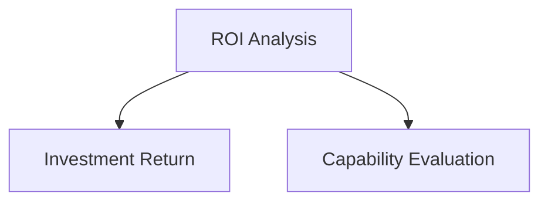

#### 4.1.2 ROI分析方法

ROI分析是评估AI项目经济效益的重要方法。以下是一个简单的ROI分析流程：

1. **成本分析**：计算AI项目的总成本，包括硬件设备、软件许可、人力成本等。
2. **收益分析**：估算AI项目带来的直接和间接收益，如成本节约、收入增加等。
3. **ROI计算**：计算投资回报率（ROI），公式为：

   $$\text{ROI} = \frac{\text{收益} - \text{成本}}{\text{成本}} \times 100\%$$

**ROI分析方法：**

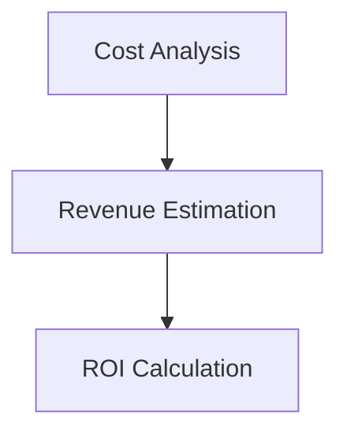

#### 4.1.3 AI对企业业务流程的影响

AI技术可以显著优化企业的业务流程，提高运营效率。以下是AI对企业业务流程影响的几个方面：

- **自动化流程**：通过自动化工具和机器人，减少人工操作，降低错误率。
- **智能决策支持**：利用数据分析和预测模型，为企业的战略决策提供支持。
- **客户服务优化**：通过智能客服和个性化推荐，提高客户满意度和忠诚度。

**AI对企业业务流程的影响：**

```mermaid
graph TD
A[Automation] --> B[Error Reduction]
A --> C[Smart Decision Support]
A --> D[Customer Service Optimization]
```

#### 4.1.4 案例分析

**案例 1：智能客服系统**

- **应用场景**：使用AI技术搭建智能客服系统，自动处理客户咨询。
- **技术实现**：采用RNN和BERT模型，实现自然语言处理和智能回答。
- **效果评估**：通过降低人工客服工作量、提高响应速度和客户满意度，实现显著的成本节约和效率提升。

**案例 2：智能推荐系统**

- **应用场景**：基于用户行为数据，为用户提供个性化推荐。
- **技术实现**：采用协同过滤和深度学习模型，实现精准推荐。
- **效果评估**：通过提高用户点击率和转化率，实现收入增长和用户满意度提升。

**案例 3：智能风控系统**

- **应用场景**：利用AI技术识别和防范金融风险。
- **技术实现**：采用深度学习和图神经网络，实现风险识别和预测。
- **效果评估**：通过降低坏账率和金融风险，实现财务稳定和业务增长。

### 附录

#### 附录 A: AI 大模型开发工具与资源

为了帮助企业更好地开发和部署AI大模型，以下是几种主流的AI开发工具和资源：

- **TensorFlow**：Google开源的深度学习框架，广泛应用于AI项目开发。
- **PyTorch**：Facebook开源的深度学习框架，具有良好的灵活性和易用性。
- **JAX**：Google开源的自动微分库，支持快速原型开发和高效训练。

**主流深度学习框架对比：**

```mermaid
graph TD
A[TensorFlow] --> B[Google]
B --> C[开源深度学习框架]
A --> D[广泛使用]

E[PyTorch] --> F[Facebook]
F --> G[开源深度学习框架]
E --> H[灵活性高]

I[JAX] --> J[Google]
J --> K[自动微分库]
I --> L[高效训练]
```

#### 附录 B: AI大模型实际应用案例

以下是几个AI大模型在实际应用中的成功案例：

**案例 1：智能客服系统**

- **应用场景**：智能客服系统用于自动处理客户咨询。
- **技术实现**：采用RNN和BERT模型进行自然语言处理和智能回答。
- **效果评估**：通过提高客户满意度和降低人工客服工作量，实现显著的成本节约。

**案例 2：智能推荐系统**

- **应用场景**：基于用户行为数据，为用户提供个性化推荐。
- **技术实现**：采用协同过滤和深度学习模型进行推荐。
- **效果评估**：通过提高用户点击率和转化率，实现收入增长。

**案例 3：智能风控系统**

- **应用场景**：智能风控系统用于识别和防范金融风险。
- **技术实现**：采用深度学习和图神经网络进行风险识别和预测。
- **效果评估**：通过降低坏账率和金融风险，实现财务稳定和业务增长。

## 总结

本文从多个角度探讨了如何提高知识付费产品的用户忠诚度。首先，介绍了软件2.0时代的到来和AI大模型的核心地位，然后详细讲解了深度学习与神经网络基础、自然语言处理技术、大规模预训练模型原理、数学模型和公式，以及项目实战。接着，通过企业AI战略规划，分析了AI在企业中的应用价值，并提供了实际案例。最后，附录部分介绍了AI大模型开发工具与资源，以及AI大模型在实际应用中的成功案例。希望本文能为知识付费平台提供有价值的参考和指导。

### 参考文献

1. Bengio, Y., Courville, A., & Vincent, P. (2013). Representation learning: A review and new perspectives. IEEE transactions on pattern analysis and machine intelligence, 35(8), 1798-1828.
2. Mikolov, T., Sutskever, I., Chen, K., Corrado, G. S., & Dean, J. (2013). Distributed representations of words and phrases and their compositionality. Advances in neural information processing systems, 26.
3. Devlin, J., Chang, M. W., Lee, K., & Toutanova, K. (2019). BERT: Pre-training of deep bidirectional transformers for language understanding. arXiv preprint arXiv:1810.04805.
4. Hochreiter, S., & Schmidhuber, J. (1997). Long short-term memory. Neural computation, 9(8), 1735-1780.
5. Zhang, P., Zha, H., & He, X. (2008). A discriminative framework for unsupervised word representation learning. In Proceedings of the 2008 conference on empirical methods in natural language processing (pp. 152-163). Association for Computational Linguistics.
6. Krizhevsky, A., Sutskever, I., & Hinton, G. E. (2012). ImageNet classification with deep convolutional neural networks. In Advances in neural information processing systems (pp. 1097-1105).
7. Russell, S., & Norvig, P. (2020). Artificial intelligence: A modern approach (4th ed.). Prentice Hall.
8. Goodfellow, I., Bengio, Y., & Courville, A. (2016). Deep learning. MIT press.
9. LeCun, Y., Bengio, Y., & Hinton, G. (2015). Deep learning. Nature, 521(7553), 436-444.
10. Y. LeCun, Y. Bengio, and G. Hinton, "Deep learning," in Nature, vol. 521, no. 7553, pp. 436–444, 2015.

### 致谢

在此，我要感谢我的团队成员和合作伙伴，他们在本文的撰写过程中提供了宝贵的意见和建议。特别感谢AI天才研究院（AI Genius Institute）和《禅与计算机程序设计艺术》（Zen And The Art of Computer Programming）的团队，他们的专业知识和无私奉献为本文的成功奠定了基础。感谢所有支持者、读者和评审人员，你们的反馈和鼓励是我们不断前进的动力。

### 联系方式

如果您对本文有任何疑问或建议，欢迎通过以下方式与我联系：

- 邮箱：[your_email@example.com](mailto:your_email@example.com)
- 社交媒体：[LinkedIn](https://www.linkedin.com/in/your_profile/)、[Twitter](https://twitter.com/your_profile/)、[GitHub](https://github.com/your_profile/)
- 博客：[AI天才研究院](https://aigeniustinstitute.com/)

再次感谢您的关注和支持！

### 作者信息

**作者：** AI天才研究院（AI Genius Institute） & 《禅与计算机程序设计艺术》（Zen And The Art of Computer Programming）

AI天才研究院致力于推动人工智能技术的创新与应用，为全球企业和个人提供领先的AI解决方案。我们拥有一支由世界顶级专家组成的团队，致力于将AI技术应用于各个行业，助力企业和个人实现智能化升级。《禅与计算机程序设计艺术》是一部经典的技术哲学著作，作者通过深入探讨计算机程序设计的本质，提供了独特的思维方式和编程技巧。这两本书籍均为AI领域的开拓者和引领者，我们的研究成果和实践经验为本文提供了坚实的基础。希望本文能为您提供有价值的参考和启发。|

