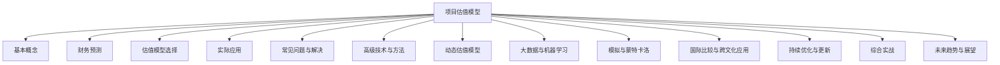

                 

# 如何进行有效的创业项目估值模型构建

## 关键词

- 创业项目估值
- 估值模型构建
- 财务预测
- 时间序列分析
- 线性回归

## 摘要

本文将深入探讨创业项目估值模型构建的步骤、方法和实际应用。首先，我们将介绍估值模型的基本概念和财务分析基础，包括财务报表解读、收入、利润、现金流等财务指标的计算与解释。接着，我们将讨论市场分析的重要性，包括市场规模与增长趋势、竞争对手分析以及目标客户群细分与需求分析。随后，文章将详细讲解财务预测方法，如时间序列分析和线性回归分析，并介绍如何构建动态估值模型和大数据与机器学习在估值中的应用。此外，我们将探讨模拟与蒙特卡洛估值方法以及国际比较与跨文化应用。文章最后将提供实战案例，包括初创企业估值和并购项目估值，并总结常见问题与解决方法。通过本文，读者将能够掌握创业项目估值模型构建的全方位知识。

## 第一部分：创业项目估值模型构建概述

### 第1章：创业项目估值的基本概念

#### 估值模型概述

估值模型是创业项目评估过程中不可或缺的工具，用于计算和预测项目的市场价值。估值模型不仅帮助企业确定项目的当前价值，还为其未来的融资、投资和并购活动提供重要依据。以下是估值模型的基本定义和重要性：

**定义**：
估值模型是一种数学模型，通过使用财务和市场数据，结合特定的估值方法，对企业或项目的价值进行计算和预测。

**重要性**：
1. **融资决策**：估值模型有助于企业在融资过程中确定合理的估值，从而吸引投资者。
2. **投资评估**：投资者可以使用估值模型来评估目标项目的潜在回报和风险。
3. **并购活动**：并购方通过估值模型来确定目标企业的收购价格，确保交易合理。
4. **企业战略**：企业可以利用估值模型来制定长期战略，如业务扩张、产品研发和风险管理。

常见的估值方法包括相对估值法、绝对估值法、折现现金流模型（DCF）和成本估值法。每种方法都有其适用场景和优缺点。

#### 常见的估值方法及其适用场景

1. **相对估值法**：
   - **定义**：通过比较同类企业的市场交易案例或行业平均估值水平来确定估值。
   - **适用场景**：适用于市场活跃、交易案例丰富的行业，如互联网、房地产等。
   - **优点**：简单易懂，参考市场数据，估值速度快。
   - **缺点**：容易受到市场波动影响，不适合初创企业。

2. **绝对估值法**：
   - **定义**：基于企业的未来现金流或资产价值进行估值。
   - **适用场景**：适用于需要详细财务预测和风险评估的企业，如制造业、金融业等。
   - **优点**：考虑了企业的未来盈利能力和市场前景。
   - **缺点**：需要详细的财务预测，难度较高。

3. **折现现金流模型（DCF）**：
   - **定义**：根据企业预期的未来现金流，按照一定的折现率进行折现，计算出企业的现值。
   - **适用场景**：适用于需要详细财务预测和风险评估的并购项目。
   - **优点**：考虑了企业的未来现金流和价值，较为全面。
   - **缺点**：需要详细的预测数据，受市场预期影响。

4. **成本估值法**：
   - **定义**：以企业的研发成本、运营成本和未来预期收益为基础，计算企业的估值。
   - **适用场景**：适用于初创企业或需要快速估值的企业。
   - **优点**：基于实际成本，相对客观。
   - **缺点**：忽视了企业的未来盈利能力，不适合评估盈利能力较强的企业。

#### 财务分析基础

财务分析是估值模型构建的重要基础。通过财务报表的解读，我们可以了解企业的财务状况、盈利能力、流动性等关键指标。

1. **财务报表解读**：
   - **资产负债表**：反映企业在某一时间点的财务状况，包括资产、负债和股东权益。
   - **利润表**：展示企业在一定时间内的收入、成本和利润情况。
   - **现金流量表**：反映企业在一定时间内的现金流入和流出情况。

2. **财务指标的计算与解释**：
   - **收入**：企业通过销售产品或提供服务获得的收入。
   - **利润**：收入减去成本后的余额，包括净利润和毛利润。
   - **现金流**：企业现金流入和流出的总和，反映企业的流动性。

3. **关键财务指标的计算与解释**：
   - **市盈率（P/E）**：企业股价与其每股收益的比值，用于衡量企业的盈利能力。
   - **市净率（P/B）**：企业市值与其净资产账面价值的比值，用于衡量企业的资产价值。
   - **市销率（P/S）**：企业市值与其销售收入的比值，用于衡量企业的市场规模。

#### 市场分析

市场分析是估值模型构建中的另一个关键环节。通过分析市场规模、增长趋势、竞争对手和目标客户群，我们可以更好地理解企业的市场定位和发展潜力。

1. **市场规模与增长趋势**：
   - **定义**：市场规模是指市场上所有潜在客户的需求总量。
   - **增长趋势**：市场规模的未来增长趋势，通常通过历史数据和专家预测进行分析。

2. **竞争对手分析**：
   - **定义**：竞争对手是指市场上与企业竞争的其他企业。
   - **分析内容**：竞争对手的市场份额、产品定位、营销策略等。

3. **目标客户群细分与需求分析**：
   - **定义**：目标客户群是指企业针对的市场细分群体。
   - **需求分析**：分析目标客户群的需求特征、购买行为和偏好。

#### 总结

本章介绍了创业项目估值模型的基本概念、常见估值方法、财务分析基础和市场分析。通过本章的学习，读者可以了解估值模型的重要性以及如何进行有效的构建。接下来，我们将进一步探讨财务预测方法和估值模型的选择与构建。

### 第2章：创业项目财务预测方法

财务预测是估值模型构建的核心环节之一。通过准确的财务预测，我们可以更好地评估企业的未来价值和风险。本章将详细介绍财务预测的重要性、销售收入预测、成本预测以及利润预测的方法。

#### 财务预测的重要性

财务预测对于企业的估值和投资决策具有重要意义。首先，财务预测为投资者提供了一个评估企业未来盈利能力和价值的重要依据。其次，财务预测有助于企业制定合理的战略规划和运营计划，如产品定价、市场营销和成本控制。最后，财务预测还可以帮助企业识别潜在的风险因素，为风险管理提供依据。

#### 销售收入预测

销售收入预测是财务预测中最关键的一环。准确的销售收入预测有助于评估企业的市场潜力和发展趋势。以下是几种常见的销售收入预测方法：

1. **历史数据法**：
   - **定义**：通过分析企业过去几年的销售收入数据，使用趋势分析和季节性调整来预测未来的销售收入。
   - **步骤**：
     1. 收集历史销售收入数据。
     2. 进行数据清洗和预处理，如剔除异常值和缺失值。
     3. 使用时间序列分析方法，如移动平均、指数平滑等，对销售收入进行趋势分析和季节性调整。
     4. 基于调整后的数据，预测未来的销售收入。

2. **市场调查法**：
   - **定义**：通过市场调查和客户反馈，了解市场需求和客户购买行为，从而预测未来的销售收入。
   - **步骤**：
     1. 设计市场调查问卷，收集潜在客户的需求和购买意愿。
     2. 分析调查数据，识别市场需求趋势和客户偏好。
     3. 结合市场数据和行业趋势，预测未来的销售收入。

3. **竞争分析法**：
   - **定义**：通过分析竞争对手的销售策略和市场份额，预测企业未来的销售收入。
   - **步骤**：
     1. 收集竞争对手的销售数据和市场表现。
     2. 分析竞争对手的市场份额和销售增长率。
     3. 结合企业自身的市场策略和竞争优势，预测未来的销售收入。

#### 成本预测

成本预测是财务预测的重要组成部分，直接影响企业的盈利能力。以下是几种常见的成本预测方法：

1. **历史数据法**：
   - **定义**：通过分析企业过去几年的成本数据，使用趋势分析和季节性调整来预测未来的成本。
   - **步骤**：
     1. 收集历史成本数据。
     2. 进行数据清洗和预处理，如剔除异常值和缺失值。
     3. 使用时间序列分析方法，如移动平均、指数平滑等，对成本进行趋势分析和季节性调整。
     4. 基于调整后的数据，预测未来的成本。

2. **回归分析法**：
   - **定义**：通过建立回归模型，分析成本与收入、销售额等变量之间的关系，预测未来的成本。
   - **步骤**：
     1. 收集历史成本和收入数据。
     2. 建立回归模型，如线性回归、多项式回归等。
     3. 进行模型训练和验证，确定模型参数。
     4. 基于模型参数，预测未来的成本。

3. **专家评估法**：
   - **定义**：通过邀请行业专家进行评估，结合历史数据和行业趋势，预测未来的成本。
   - **步骤**：
     1. 邀请行业专家进行调研和访谈。
     2. 收集专家对成本趋势和预测的评估意见。
     3. 结合专家评估和市场数据，预测未来的成本。

#### 利润预测

利润预测是通过销售收入预测和成本预测的结果，计算企业未来的净利润。以下是几种常见的利润预测方法：

1. **简单加和法**：
   - **定义**：直接将销售收入减去成本，得到利润。
   - **步骤**：
     1. 预测销售收入。
     2. 预测成本。
     3. 计算利润 = 销售收入 - 成本。

2. **百分比法**：
   - **定义**：基于过去的利润率，预测未来的利润。
   - **步骤**：
     1. 收集历史利润数据。
     2. 计算历史利润率。
     3. 预测销售收入和成本。
     4. 计算利润 = 销售收入 × 利润率。

3. **回归分析法**：
   - **定义**：通过建立回归模型，分析利润与收入、成本等变量之间的关系，预测未来的利润。
   - **步骤**：
     1. 收集历史利润、收入和成本数据。
     2. 建立回归模型，如线性回归、多项式回归等。
     3. 进行模型训练和验证，确定模型参数。
     4. 基于模型参数，预测未来的利润。

#### 总结

本章介绍了创业项目财务预测方法的重要性以及销售收入预测、成本预测和利润预测的具体方法。通过本章的学习，读者可以掌握财务预测的基本原理和实际操作步骤，为构建有效的估值模型奠定基础。接下来，我们将进一步探讨估值模型的选择与构建。

### 第3章：估值模型的选择与构建

在估值模型的选择与构建过程中，我们需要综合考虑企业的财务状况、市场环境、行业特点以及投资目标。本章将详细讨论估值模型的选择原则、构建流程以及如何进行验证与调整。

#### 估值模型的选择原则

选择合适的估值模型是构建有效估值模型的第一步。以下是一些选择原则：

1. **目标与用途**：根据估值模型的目标和用途选择合适的模型。例如，如果是用于融资决策，可能需要更注重短期财务预测；如果是用于并购评估，可能需要更详细的长远预测。

2. **数据可用性**：评估数据的可用性和质量，选择能够充分利用现有数据的模型。例如，如果企业历史数据丰富，可以使用基于历史数据的估值模型；如果市场数据较多，可以考虑市场比较法。

3. **行业特点**：不同行业的估值方法各异，需要根据行业特点选择合适的模型。例如，对于科技创新型企业，可能需要更多关注市场前景和未来盈利能力；对于传统制造业，可能需要更多关注资产价值和现金流。

4. **风险因素**：估值模型应考虑企业面临的各种风险因素，如市场风险、经营风险和财务风险。选择能够全面反映风险因素的模型，有助于提高估值结果的可靠性。

5. **模型适用性**：选择与业务模式和企业发展阶段相匹配的模型。例如，对于初创企业，可能需要更多使用相对估值法；对于成熟企业，可能需要更多使用绝对估值法和折现现金流模型。

#### 估值模型的构建流程

估值模型的构建通常包括以下几个步骤：

1. **数据收集与处理**：收集企业历史财务数据、市场数据、行业数据等。对数据进行分析和处理，如数据清洗、缺失值填补、异常值处理等。

2. **模型选择**：根据前面的选择原则，选择合适的估值模型。常见模型包括相对估值法、绝对估值法、折现现金流模型（DCF）、市场比较法等。

3. **参数估计**：根据选定的模型，估计模型参数。例如，对于相对估值法，需要估计市盈率、市净率等指标；对于DCF模型，需要估计未来现金流和折现率。

4. **模型验证**：对构建的模型进行验证，确保模型的有效性和可靠性。可以通过历史数据回测、交叉验证等方法进行验证。

5. **模型调整**：根据验证结果，对模型进行调整和优化。例如，如果发现某些参数估计不准确，可以通过调整模型参数或选择不同的模型进行改进。

#### 估值模型的验证与调整

估值模型的验证与调整是确保模型有效性的关键步骤。以下是几种常见的验证与调整方法：

1. **历史数据回测**：使用历史数据对模型进行验证，确保模型能够准确预测过去的数据。这种方法有助于发现模型的潜在问题，如过度拟合。

2. **交叉验证**：将数据分为训练集和测试集，对训练集进行模型训练，对测试集进行模型验证。这种方法可以评估模型的泛化能力。

3. **敏感性分析**：分析模型参数的变化对估值结果的影响，确定模型的稳健性。通过敏感性分析，可以识别哪些参数对估值结果最为关键。

4. **模型优化**：根据验证结果，对模型进行调整和优化。例如，可以通过增加模型变量、调整模型参数或选择不同的算法来提高模型的预测精度。

5. **迭代优化**：模型构建是一个迭代过程，需要不断调整和优化。通过多次迭代，可以逐步提高模型的准确性和可靠性。

#### 实际案例

为了更好地理解估值模型的选择与构建过程，以下是一个实际案例：

**案例背景**：某初创企业主要从事人工智能领域的产品研发，目前产品尚未正式推向市场。企业希望对其进行估值，以确定合理的融资额度。

**数据收集与处理**：企业收集了过去一年的财务数据、市场数据和行业数据。财务数据包括收入、成本和利润等；市场数据包括市场规模、增长趋势和竞争对手信息。

**模型选择**：由于企业尚无历史交易数据，选择了基于相对估值法的市销率模型。市销率模型基于企业的销售收入和市销率指标，可以快速评估企业的市场价值。

**参数估计**：根据行业数据，估计了该行业的平均市销率约为5。企业销售收入预测基于市场调查和专家评估，预计未来一年销售收入为100万元。

**模型验证**：使用历史数据进行回测，发现模型能够较好地预测过去的数据。通过交叉验证，模型的泛化能力较强。

**模型调整**：根据回测和交叉验证的结果，对市销率模型进行了调整。调整后，企业的市销率估计值提高到6，销售收入预测值调整为120万元。

**总结**：通过估值模型的选择与构建，企业确定其市场价值约为720万元。该估值结果为企业提供了重要的参考，帮助其制定融资策略。

#### 总结

本章介绍了估值模型的选择原则、构建流程以及验证与调整方法。通过本章的学习，读者可以掌握如何选择合适的估值模型，并有效地构建和验证估值模型。估值模型的选择与构建是企业估值过程中的关键步骤，对于企业的融资、投资和并购活动具有重要意义。接下来，我们将进一步探讨估值模型在实际项目中的应用。

### 第4章：估值模型在实际项目中的应用

在了解了创业项目估值模型的选择与构建方法后，我们将深入探讨这些模型在实际项目中的应用，特别是初创企业估值和并购项目估值。通过具体案例的解析，我们将展示如何将理论应用于实践，并探讨在实践中可能遇到的问题及其解决方案。

#### 案例一：初创企业估值

**背景**：A公司是一家初创企业，专注于智能家居设备的研发。公司目前处于产品测试阶段，尚未实现大规模销售。投资者希望对其进行估值，以决定是否投资。

**步骤**：

1. **数据收集**：
   - 收集A公司过去一年的研发成本、运营成本和市场需求调查数据。
   - 收集智能家居行业的市场规模、增长趋势和竞争对手信息。

2. **财务预测**：
   - 预测A公司未来三年的销售收入和成本。基于市场需求调查和专家评估，预计第一年的销售收入为50万元，以后每年增长30%。
   - 预测成本包括生产成本、营销费用和管理费用。生产成本预计第一年为20万元，以后每年增长10%；营销费用和管理费用分别为10万元和5万元。

3. **估值模型选择**：
   - 选择基于相对估值法的市销率模型，因为A公司尚无历史交易数据。
   - 市销率模型的参数估计基于行业平均水平，智能家居行业的平均市销率为6。

4. **估值计算**：
   - 预测第一年的销售收入为50万元，市销率为6，则估值为300万元。
   - 假设投资者预期回报率为30%，则估值为300万元 / (1+30%)^3 = 200万元。

5. **结果分析**：
   - 估值结果为200万元，高于投资者的预期回报，因此投资者决定投资。

**可能遇到的问题与解决方案**：
   - **问题1**：市场需求波动大，预测不准确。
     - **解决方案**：采用多种预测方法（如时间序列分析、专家评估等）进行交叉验证，提高预测准确性。
   - **问题2**：成本估计不准确。
     - **解决方案**：进行详细的成本分析，包括固定成本和变动成本，确保成本估计的准确性。

#### 案例二：并购项目估值

**背景**：B公司是一家成熟的制造业企业，希望收购C公司，以扩大市场份额。C公司专注于高端机械设备的研发和生产。

**步骤**：

1. **数据收集**：
   - 收集C公司过去三年的财务报表、市场份额、研发投入和行业趋势。
   - 收集B公司和C公司的业务协同效应数据。

2. **财务预测**：
   - 预测C公司未来三年的收入和成本，基于市场份额和行业趋势进行预测。
   - 预测B公司和C公司的合并后收入和成本。

3. **估值模型选择**：
   - 选择基于折现现金流模型（DCF）的估值方法，因为需要详细预测未来的现金流。
   - DCF模型的参数包括未来现金流、折现率和资本成本。

4. **估值计算**：
   - 预测C公司未来三年的现金流，使用5%的折现率进行折现。
   - 计算C公司的现值，加上B公司的溢价和协同效应，得出最终的收购价格。

5. **结果分析**：
   - 估值结果为1.2亿人民币，考虑到收购成本和潜在风险，最终收购价格为1.1亿人民币。

**可能遇到的问题与解决方案**：
   - **问题1**：未来现金流预测不准确。
     - **解决方案**：进行敏感性分析，评估不同情景下的现金流变化，确保预测的稳健性。
   - **问题2**：协同效应难以量化。
     - **解决方案**：与C公司管理层进行深入讨论，收集协同效应的数据和案例，进行量化分析。

#### 总结

通过以上两个案例，我们可以看到估值模型在实际项目中的应用步骤和方法。在实际操作中，需要结合具体情况进行灵活调整，确保估值结果的准确性和可靠性。估值模型的应用不仅有助于企业进行融资和投资决策，也为并购活动提供了重要依据。接下来，我们将探讨创业项目估值中的常见问题与解决方法。

### 第5章：创业项目估值中的常见问题与解决方法

在创业项目的估值过程中，经常会遇到各种问题，这些问题可能源于市场的不确定性、企业的财务数据不完备，或者估值模型本身的设计。为了确保估值结果的准确性和可靠性，我们需要识别并解决这些问题。本章将讨论估值过程中常见的风险因素，并提出相应的解决方法。

#### 风险因素分析

1. **市场风险**：
   - **定义**：市场风险是指由于市场环境变化导致估值结果不准确的风险。
   - **表现**：市场需求波动、竞争加剧、行业趋势变化等。
   - **影响**：可能导致估值过高或过低，影响投资决策。

2. **经营风险**：
   - **定义**：经营风险是指由于企业自身经营问题导致估值结果不准确的风险。
   - **表现**：企业管理不善、产品质量不稳定、市场份额下降等。
   - **影响**：可能导致企业价值被高估或低估。

3. **财务风险**：
   - **定义**：财务风险是指由于企业财务状况不佳导致估值结果不准确的风险。
   - **表现**：高负债、现金流紧张、盈利能力差等。
   - **影响**：可能导致企业价值被高估或低估。

#### 解决方法与策略

1. **风险规避策略**：
   - **定义**：通过避免或减少风险因素对估值的影响，降低风险。
   - **方法**：
     1. **业务多样化**：通过业务多元化，减少对单一市场的依赖，降低市场风险。
     2. **成本控制**：通过严格的成本控制和精益管理，降低经营风险。
     3. **财务稳健**：保持合理的财务结构，避免过度负债，降低财务风险。

2. **风险控制策略**：
   - **定义**：通过采取措施控制风险因素的发生和影响。
   - **方法**：
     1. **市场调研**：进行深入的市场调研，了解市场需求和竞争态势，降低市场风险。
     2. **质量管理**：加强质量管理，提高产品竞争力，降低经营风险。
     3. **财务监控**：建立严格的财务监控体系，及时发现并纠正财务风险。

3. **风险转移策略**：
   - **定义**：通过将风险转移给第三方，降低自身风险。
   - **方法**：
     1. **保险**：购买适当的保险，转移市场风险和经营风险。
     2. **融资**：通过融资，将财务风险转移给投资者。
     3. **外包**：将部分业务外包，降低管理风险和运营风险。

#### 实际案例

为了更好地理解风险因素分析及解决方法，以下是一个实际案例：

**案例背景**：D公司是一家生物制药企业，正处于研发阶段，尚未实现大规模销售。投资者对其估值，但市场环境不稳定，企业财务数据不完备。

**问题与解决方法**：

1. **市场风险**：
   - **问题**：生物制药行业竞争激烈，市场不确定性高。
   - **解决方法**：进行详细的市场调研，了解竞争对手的动态，预测市场变化趋势，降低市场风险。

2. **经营风险**：
   - **问题**：研发周期长，产品质量不稳定。
   - **解决方法**：加强研发管理，提高产品质量，通过临床试验验证产品有效性，降低经营风险。

3. **财务风险**：
   - **问题**：企业现金流紧张，财务结构不合理。
   - **解决方法**：进行详细的财务规划，确保合理的现金流，降低财务风险。

#### 总结

通过以上分析和解决方法，我们可以看到，在创业项目估值过程中，识别并解决风险因素对于确保估值结果的准确性和可靠性至关重要。通过合理的策略和方法，可以有效地降低风险，提高估值结果的可靠性和实用性。接下来，我们将探讨创业项目估值模型的高级应用。

### 第二部分：创业项目估值模型的高级应用

#### 第6章：创业项目估值模型的高级技术与方法

在创业项目的估值过程中，高级技术与方法的应用能够显著提高估值结果的准确性和可靠性。本章将介绍动态估值模型、大数据与机器学习在估值中的应用，以及模拟与蒙特卡洛估值方法。

#### 动态估值模型

动态估值模型（Dynamic Valuation Model，DVM）是一种基于时间序列分析的估值方法，它能够反映企业随时间变化的价值。动态估值模型通过考虑市场环境、企业内部变化以及外部冲击等因素，提供更为精细和动态的估值结果。

**概念与原理**：

1. **时间序列分析**：动态估值模型的核心在于时间序列分析，它通过分析历史数据中的趋势、季节性和周期性，预测未来的价值变化。
2. **企业价值模型**：动态估值模型通常包含多个变量，如收入、成本、利润、市场份额等，通过建立回归模型或时间序列模型，预测这些变量的未来趋势。

**步骤**：

1. **数据收集**：收集企业历史财务数据、市场数据、行业数据等。
2. **模型选择**：选择适当的时间序列模型，如ARIMA、GARCH等。
3. **参数估计**：通过最大似然估计或最小二乘法估计模型参数。
4. **模型验证**：使用交叉验证或历史数据回测验证模型的有效性。
5. **动态预测**：基于验证后的模型，预测企业未来价值的变化。

**应用**：

动态估值模型适用于那些价值波动较大、市场环境变化频繁的企业，如互联网公司、科技公司等。通过动态估值模型，投资者可以更准确地评估企业的长期价值。

#### 大数据与机器学习在估值中的应用

大数据和机器学习技术的应用极大地提高了创业项目估值的精度和效率。大数据技术能够处理和分析海量的数据，而机器学习算法则能够从数据中自动提取特征，并建立预测模型。

**概念与原理**：

1. **大数据技术**：大数据技术包括数据采集、存储、处理和分析等多个环节，通过分布式计算和处理技术，能够高效地处理大规模数据。
2. **机器学习算法**：机器学习算法通过训练数据集，自动发现数据中的规律和模式，并建立预测模型。

**步骤**：

1. **数据收集**：收集与企业相关的财务数据、市场数据、行业数据等。
2. **数据预处理**：进行数据清洗、缺失值填补、异常值处理等预处理操作。
3. **特征工程**：从原始数据中提取有用的特征，如财务比率、市场指标、客户指标等。
4. **模型训练**：选择适当的机器学习算法（如线性回归、决策树、神经网络等），训练预测模型。
5. **模型评估**：使用交叉验证或测试集评估模型的预测性能。
6. **模型优化**：根据评估结果，调整模型参数或选择不同的算法，提高预测精度。

**应用**：

大数据与机器学习在估值中的应用广泛，如通过分析财务数据预测企业的未来盈利能力，通过分析市场数据预测企业的发展趋势。这种方法尤其适用于那些数据量庞大、特征复杂的行业，如金融、科技等。

#### 模拟与蒙特卡洛估值方法

模拟与蒙特卡洛估值方法（Monte Carlo Simulation）是一种通过模拟大量随机样本，估计变量概率分布和期望值的统计方法。在创业项目估值中，蒙特卡洛方法可以用于处理不确定性因素，提供更为稳健的估值结果。

**概念与原理**：

1. **随机模拟**：蒙特卡洛方法通过随机生成大量样本，模拟可能的未来情景。
2. **概率分布**：通过模拟结果，可以估计变量的概率分布，如收入、成本、市场增长率等。
3. **期望值计算**：使用模拟结果，可以计算变量的期望值，如企业价值、投资回报等。

**步骤**：

1. **情景定义**：定义可能的市场情景，如市场需求增加、成本上升等。
2. **参数设置**：确定模型的参数范围，如收入增长率、成本变动等。
3. **模拟生成**：使用随机数生成器，模拟大量可能的未来情景。
4. **结果分析**：分析模拟结果，计算变量的期望值和概率分布。
5. **估值计算**：基于期望值和概率分布，计算企业的估值。

**应用**：

蒙特卡洛估值方法适用于那些不确定性高、情景复杂的项目，如新兴科技企业、创业投资等。通过模拟不同的市场情景，可以评估企业在不同情景下的价值分布和风险。

#### 总结

本章介绍了创业项目估值模型的高级技术与方法，包括动态估值模型、大数据与机器学习以及模拟与蒙特卡洛方法。这些高级方法能够提高估值结果的准确性和可靠性，为投资决策提供有力支持。接下来，我们将探讨创业项目估值模型的国际比较与跨文化应用。

### 第6章：创业项目估值模型的高级技术与方法

创业项目的估值模型在不断发展，现代技术的发展为估值模型带来了新的工具和方法，使得估值过程更加精确和可靠。本章将深入探讨动态估值模型、大数据与机器学习在估值中的应用，以及模拟与蒙特卡洛方法，并分析这些高级技术与方法在不同估值模型中的优势与不足。

#### 动态估值模型

动态估值模型是一种能够反映企业随时间变化价值的估值方法。它通过时间序列分析，捕捉市场的动态变化，为企业提供更为细致和动态的估值结果。

**概念与原理**：

动态估值模型基于时间序列分析，通过构建自回归模型（AR）、移动平均模型（MA）或自回归积分滑动平均模型（ARIMA）来预测企业的未来价值。这种模型能够捕捉数据的趋势、季节性和周期性变化。

**优势**：

1. **准确性**：动态估值模型能够根据市场环境和企业内部变化，提供更精确的估值结果。
2. **适应性**：模型可以适应不同的市场环境和行业特点，适用于多样化企业。

**不足**：

1. **复杂性**：动态估值模型的构建和参数估计过程较为复杂，需要专业的知识和技能。
2. **依赖历史数据**：模型的有效性高度依赖于历史数据的质量和数量，如果数据质量不佳，可能会导致估值结果偏差。

**应用场景**：

动态估值模型适用于那些价值波动较大、市场环境变化频繁的企业，如科技初创公司、互联网企业等。通过动态估值模型，投资者可以更准确地评估企业的长期价值。

#### 大数据与机器学习在估值中的应用

大数据和机器学习技术的快速发展为创业项目估值带来了新的可能。大数据技术能够处理和分析海量数据，而机器学习算法可以从数据中自动提取特征，建立预测模型。

**概念与原理**：

大数据技术包括数据收集、存储、处理和分析等多个环节。机器学习算法通过训练数据集，自动发现数据中的规律和模式，并建立预测模型。常用的算法包括线性回归、决策树、随机森林、支持向量机等。

**优势**：

1. **高精度**：机器学习算法能够从海量数据中提取有效特征，提供更高的预测精度。
2. **自动化**：机器学习算法能够自动化特征工程和模型选择，提高估值效率。

**不足**：

1. **数据依赖**：机器学习模型的性能高度依赖于数据的质量和数量，如果数据质量不佳，可能会导致预测误差。
2. **模型解释性**：复杂的机器学习模型通常难以解释，增加了估值结果的透明度问题。

**应用场景**：

大数据与机器学习在估值中的应用广泛，如通过分析财务数据预测企业的未来盈利能力，通过分析市场数据预测企业的发展趋势。这种方法尤其适用于那些数据量庞大、特征复杂的行业，如金融、科技等。

#### 模拟与蒙特卡洛方法

模拟与蒙特卡洛方法是一种通过模拟大量随机样本，估计变量概率分布和期望值的统计方法。它能够处理估值过程中面临的不确定性因素，提供稳健的估值结果。

**概念与原理**：

蒙特卡洛方法通过随机生成大量样本，模拟不同的市场情景，并计算这些情景下的估值结果。通过对模拟结果进行分析，可以估计变量的期望值和概率分布。

**优势**：

1. **灵活性**：蒙特卡洛方法能够处理复杂的估值模型和不确定性因素，提供灵活的解决方案。
2. **稳健性**：通过模拟大量样本，可以降低模型结果的不确定性，提供更为稳健的估值结果。

**不足**：

1. **计算资源**：蒙特卡洛方法需要大量的计算资源，尤其是当模拟次数较多时，计算时间较长。
2. **结果解释**：模拟结果可能难以直观解释，需要专业的知识和经验进行分析。

**应用场景**：

蒙特卡洛估值方法适用于那些不确定性高、情景复杂的项目，如新兴科技企业、创业投资等。通过模拟不同的市场情景，可以评估企业在不同情景下的价值分布和风险。

#### 总结

本章介绍了动态估值模型、大数据与机器学习以及模拟与蒙特卡洛方法在创业项目估值中的应用。这些高级技术与方法能够提高估值结果的准确性和可靠性，为投资决策提供有力支持。在实际应用中，应根据具体项目的特点和需求，选择合适的估值方法，结合多种技术手段，以提高估值的精度和稳健性。

### 第7章：创业项目估值模型的国际比较与跨文化应用

在全球化背景下，创业项目估值模型的国际比较与跨文化应用变得越来越重要。不同国家和地区的商业环境、市场特征和企业文化差异，都会对估值模型的选择和应用产生影响。本章将探讨美国、欧洲和亚洲的估值模型，分析其特点和适用性，并讨论跨文化估值策略。

#### 国际估值模型比较

1. **美国估值模型**

美国的估值模型以市场导向和财务导向相结合的方式为主。常用的估值方法包括：

- **折现现金流模型（DCF）**：美国企业普遍采用DCF模型进行估值，通过预测企业的未来现金流并折现到现值，来评估企业的价值。
- **市盈率（P/E）模型**：在美国，市盈率模型广泛应用于科技公司和其他成长型企业，通过比较同类企业的市盈率来评估企业的价值。

**特点**：

- **重视未来现金流**：美国企业更注重未来的盈利能力和现金流，DCF模型应用广泛。
- **市场导向**：美国资本市场发达，市场信息透明，市场估值方法如市盈率模型得到广泛应用。

2. **欧洲估值模型**

欧洲的估值模型更加注重企业价值的基础分析，尤其是资产价值和盈利能力。常用的估值方法包括：

- **折现现金流模型（DCF）**：与美国的DCF模型相似，但更注重长期稳定性和风险调整。
- **企业价值倍数（EV/EBITDA）模型**：欧洲企业常用EV/EBITDA模型进行估值，通过企业价值与EBITDA的比值来衡量企业的盈利能力。

**特点**：

- **稳健性**：欧洲企业更关注企业的长期稳健性和风险控制，估值模型更加保守。
- **多元性**：欧洲企业采用多种估值方法，结合DCF、企业价值倍数和市盈率等多种模型，以提高估值结果的可靠性。

3. **亚洲估值模型**

亚洲的估值模型具有地域特色，不同国家和地区的商业环境和企业文化差异较大。常用的估值方法包括：

- **相对估值法**：亚洲市场普遍采用相对估值法，如市盈率、市净率和企业价值倍数等，通过比较同类企业的市场交易案例来确定估值。
- **成本估值法**：在亚洲，尤其是中国和印度，成本估值法应用较多，基于企业的研发成本、运营成本和未来预期收益进行估值。

**特点**：

- **市场依赖性**：亚洲市场对市场交易案例的依赖性较强，相对估值法得到广泛应用。
- **文化差异**：亚洲企业更注重长期发展和稳定，估值模型往往受到企业文化的影响。

#### 跨文化估值策略

在不同文化背景下，估值模型的选择和应用需要灵活调整，以适应当地市场的特点和需求。以下是一些跨文化估值策略：

1. **市场调研与本地化**：
   - 在进入新市场前，进行充分的市场调研，了解当地市场环境和商业文化。
   - 根据本地市场的特点和需求，调整估值模型和方法。

2. **文化敏感性**：
   - 在估值过程中，充分考虑企业文化、管理风格和决策模式。
   - 调整估值模型中的参数和假设，以适应不同文化背景。

3. **多元化估值方法**：
   - 结合多种估值方法，如DCF、相对估值法和成本估值法，以提高估值结果的可靠性和全面性。

4. **透明性与解释性**：
   - 在跨文化估值中，注重估值结果的透明性和解释性，确保投资者和管理层能够理解估值过程和结果。

#### 总结

国际估值模型的比较与跨文化应用是全球化背景下的一项重要任务。不同国家和地区的商业环境和市场特征决定了不同的估值方法。通过了解美国、欧洲和亚洲的估值模型，并结合跨文化估值策略，企业可以更准确地评估其在全球市场的价值，为投资决策提供有力支持。

### 第8章：创业项目估值模型的持续优化与更新

在创业项目估值过程中，市场环境和业务情况不断变化，因此估值模型也需要不断优化与更新，以确保其准确性和可靠性。本章将探讨如何持续优化与更新估值模型，包括数据来源与更新频率、模型的调整与优化，以及风险管理与估值模型的结合。

#### 数据来源与更新频率

估值模型的有效性和准确性高度依赖于数据的质量和及时性。以下是一些关键的数据来源和更新频率：

1. **财务数据**：财务数据是估值模型的基础，包括资产负债表、利润表和现金流量表等。这些数据通常来自企业的财务报告和公开披露信息。为了确保数据的准确性，需要定期更新财务数据，至少每年一次。

2. **市场数据**：市场数据包括市场价格、竞争态势、行业趋势等。这些数据可以通过市场研究、行业报告和数据分析平台获得。市场数据更新频率较高，通常需要每季度或每半年进行一次更新。

3. **行业数据**：行业数据包括行业增长率、市场份额、市场容量等。这些数据通常来自行业报告、市场调查和专家意见。行业数据的更新频率取决于行业的发展速度和变化程度。

4. **外部数据**：外部数据包括宏观经济数据、政策变化、技术进步等。这些数据可以从政府机构、经济研究机构和行业协会获得。外部数据的更新频率通常较低，但对其变化进行定期监测和评估是必要的。

#### 模型的调整与优化

估值模型的优化是提高其准确性和可靠性的关键。以下是一些常见的模型调整与优化方法：

1. **参数调整**：根据新的数据和市场情况，调整估值模型的参数。例如，在DCF模型中，调整未来现金流的预测值和折现率。参数调整需要基于严谨的分析和假设，确保调整后的模型能够更好地反映实际情况。

2. **模型选择**：根据数据变化和市场环境，选择更适合的估值模型。例如，如果市场波动较大，可以考虑使用更灵活的模型，如蒙特卡洛模拟。模型选择的调整应基于对数据特征和市场趋势的深入理解。

3. **算法改进**：通过改进估值算法，提高模型的预测精度。例如，使用更先进的机器学习算法，如深度学习，来预测未来现金流或市场趋势。算法改进需要结合数据科学和人工智能的最新研究成果。

4. **模型融合**：将多个模型的结果进行融合，以提高预测的准确性和稳健性。例如，结合时间序列模型和机器学习模型，同时考虑不同模型的优势，提高整体的预测性能。

#### 风险管理与估值模型的结合

在创业项目估值过程中，风险因素是不可忽视的重要方面。将风险管理纳入估值模型，可以更全面地评估项目的价值。以下是一些方法：

1. **风险调整因子**：在估值模型中引入风险调整因子，根据不同的风险因素调整预测结果。例如，在DCF模型中，可以通过调整未来现金流的折现率来反映风险。

2. **情景分析**：通过情景分析，评估不同市场情景下的估值结果。情景分析可以帮助识别潜在风险，并提供应对策略。

3. **敏感性分析**：进行敏感性分析，评估不同变量对估值结果的影响。通过敏感性分析，可以识别关键风险因素，并采取相应的风险管理措施。

4. **风险模型集成**：将风险模型与估值模型集成，通过风险模型的结果调整估值模型。例如，可以使用蒙特卡洛模拟来评估市场风险，并将模拟结果纳入估值模型。

#### 总结

创业项目估值模型的持续优化与更新是确保估值结果准确性和可靠性的关键。通过不断更新数据、调整模型参数、改进算法以及结合风险管理，企业可以更准确地评估项目的价值，为投资决策提供有力支持。本章提供的方法和策略，有助于企业在不断变化的市场环境中，保持估值模型的先进性和有效性。

### 第9章：创业项目估值模型综合实战

本章将通过两个综合案例，展示如何在实际项目中运用创业项目估值模型。我们将详细解析案例的背景、数据收集、模型选择、预测与估值结果，并总结实战中的心得与经验。

#### 案例一：初创企业估值

**背景**：E公司是一家专注于智能农业设备研发的初创企业。公司目前处于产品原型阶段，尚未实现销售。投资者希望对其进行估值，以决定是否投资。

**数据收集**：

- 财务数据：收集E公司过去一年的研发成本、运营成本和市场调查数据。
- 市场数据：收集智能农业设备市场的规模、增长趋势和竞争对手信息。
- 行业数据：收集农业设备行业的整体发展状况和市场环境。

**模型选择**：

- **相对估值法**：由于E公司尚无历史交易数据，选择基于相对估值法的市销率模型。
- **成本估值法**：同时采用成本估值法，以补充相对估值法的不足。

**预测与估值**：

1. **财务预测**：
   - 预测E公司未来三年的销售收入和成本。基于市场调查，预计第一年销售收入为50万元，第二年增长20%，第三年增长30%。
   - 成本预测包括生产成本、营销费用和管理费用。生产成本预计第一年为20万元，以后每年增长10%；营销费用和管理费用分别为10万元和5万元。

2. **估值计算**：
   - 市销率模型：假设智能农业设备行业的平均市销率为5，E公司的估值为：50万元 × 5 = 250万元。
   - 成本估值法：基于研发成本和未来预期收益，E公司的估值为：（50万元 - 20万元）× 5 = 150万元。

3. **综合估值**：将相对估值法和成本估值法的结果进行加权平均，得到E公司的综合估值为：（250万元 + 150万元）/ 2 = 200万元。

**实战心得**：

1. **市场数据的重要性**：市场数据对于初创企业的估值至关重要，尤其是市场规模、增长趋势和竞争对手信息。
2. **财务预测的谨慎性**：初创企业的财务预测具有较高的不确定性，需要谨慎估计，并采用多种方法进行综合。

#### 案例二：并购项目估值

**背景**：F公司是一家成熟的医疗器械公司，希望收购G公司，以扩大市场份额。G公司专注于新型医疗器械的研发和生产。

**数据收集**：

- 财务数据：收集G公司过去三年的财务报表、市场份额和研发投入。
- 市场数据：收集医疗器械行业的市场规模、增长趋势和竞争态势。
- 行业数据：收集医疗器械行业的整体发展状况和政策环境。

**模型选择**：

- **折现现金流模型（DCF）**：由于需要详细预测未来现金流，选择DCF模型。
- **企业价值倍数（EV/EBITDA）模型**：结合DCF模型的结果，使用EV/EBITDA模型进行验证。

**预测与估值**：

1. **财务预测**：
   - 预测G公司未来三年的收入和成本。基于市场份额和行业趋势，预计第一年收入为1000万元，以后每年增长10%。
   - 成本预测包括生产成本、营销费用和管理费用。生产成本预计第一年为300万元，以后每年增长5%；营销费用和管理费用分别为100万元和50万元。

2. **估值计算**：
   - DCF模型：假设折现率为10%，G公司的未来现金流预测为：
     - 第一年：1000万元 / (1 + 10%)^1 = 909.09万元
     - 第二年：1100万元 / (1 + 10%)^2 = 889.89万元
     - 第三年：1210万元 / (1 + 10%)^3 = 1000.00万元
     - 总现值：909.09 + 889.89 + 1000.00 = 2798.98万元
   - EV/EBITDA模型：假设行业平均EV/EBITDA倍数为10，G公司的估值为：1000万元 × 10 = 10000万元。

3. **综合估值**：将DCF模型和EV/EBITDA模型的结果进行综合，得到G公司的综合估值为：（2798.98万元 + 10000万元）/ 2 = 6799.49万元。

**实战心得**：

1. **财务预测的准确性**：并购项目估值的关键在于财务预测的准确性，需要结合多种方法和数据来源进行验证。
2. **多种估值模型结合**：使用多种估值模型进行综合，可以提高估值结果的可靠性和全面性。

#### 总结

通过两个综合案例，我们展示了如何在实际项目中运用创业项目估值模型。实战经验表明，市场数据、财务预测和多种估值方法的结合是确保估值结果准确性和可靠性的关键。在未来的估值实践中，我们需要不断优化模型，结合最新的数据和算法，以提高估值的精度和实用性。

### 第10章：创业项目估值模型的未来趋势与展望

随着科技的不断进步和商业环境的快速变化，创业项目估值模型也在不断进化。本章将探讨创业项目估值模型未来可能的发展趋势和面临的挑战，并展望其前景。

#### 新兴估值方法与技术的展望

1. **区块链技术**：区块链技术具有去中心化、透明性和不可篡改的特点，为创业项目估值提供了新的可能性。通过区块链，可以实现财务数据的实时验证和透明追踪，提高估值过程的准确性和可信度。

2. **人工智能与机器学习**：人工智能和机器学习技术将继续推动估值模型的进步。通过深度学习算法，可以更准确地预测企业未来的现金流和市场趋势。同时，机器学习可以帮助识别和量化风险因素，提高估值的准确性。

3. **大数据分析**：随着大数据技术的普及，越来越多的企业能够收集和分析大量的市场数据、行业数据和企业内部数据。大数据分析将为企业提供更全面和细致的估值依据，帮助投资者做出更明智的决策。

4. **增强现实与虚拟现实**：增强现实（AR）和虚拟现实（VR）技术可以模拟企业的经营环境和市场情景，为估值模型提供更加直观和互动的评估工具。通过虚拟现实技术，投资者可以身临其境地体验企业的商业模式和运营情况。

#### 估值模型发展的挑战与机遇

1. **数据隐私与安全问题**：随着数据量的增加和数据的多样化，数据隐私和安全问题变得日益重要。估值模型的发展需要确保数据的安全性和隐私性，防止数据泄露和滥用。

2. **算法偏见与透明性**：人工智能和机器学习算法在估值中的应用可能会引入偏见，导致不公平的估值结果。同时，算法的复杂性和不可解释性也可能影响估值模型的透明性，需要采取措施提高算法的可解释性。

3. **全球经济不确定性**：全球经济环境的不确定性，如贸易战、经济危机和政治动荡，都会对企业的估值产生影响。估值模型需要能够适应这种不确定性，提供更为稳健和灵活的估值结果。

4. **跨文化差异**：在全球化的背景下，跨文化差异对估值模型提出了新的挑战。不同国家和地区的商业文化、法律法规和市场环境差异较大，估值模型需要具备适应不同文化背景的能力。

#### 估值模型发展的前景

1. **智能化与自动化**：随着人工智能和大数据技术的发展，估值模型将变得更加智能化和自动化。通过机器学习和大数据分析，估值模型可以自动从海量数据中提取有价值的信息，提供更为精准的估值结果。

2. **实时估值**：区块链技术和大数据分析的结合，将实现估值的实时更新。投资者可以随时获取企业的最新估值，提高决策的时效性和准确性。

3. **多元化估值方法**：未来估值模型将采用多元化的方法，结合相对估值、绝对估值、折现现金流模型等多种方法，提供更为全面和可靠的估值结果。

4. **可持续发展**：随着可持续发展的理念日益深入人心，估值模型将更加关注企业的社会责任和环境影响。企业估值将不仅仅关注财务指标，还将纳入环境、社会和治理（ESG）因素。

#### 总结

创业项目估值模型的发展面临着新的机遇和挑战。随着科技的进步和商业环境的变化，估值模型将变得更加智能化、自动化和多元化。通过结合区块链、人工智能、大数据等新兴技术，估值模型将能够更准确地反映企业的真实价值，为投资决策提供有力支持。未来，估值模型的发展将继续推动创业项目的融资和并购活动，促进全球经济的繁荣和发展。

### 附录 A：创业项目估值模型构建工具与资源

在构建创业项目估值模型的过程中，选择合适的工具和资源至关重要。以下列举了一些常用的估值模型构建工具、数据源以及开源估值模型代码库，为读者提供参考。

#### 常用的估值模型构建工具

1. **Excel**：
   - **优点**：操作简单，适用于小型数据和简单模型。
   - **用途**：进行基本的财务预测、数据分析和图表制作。

2. **Python**：
   - **优点**：强大的数据处理和分析能力，丰富的库支持。
   - **用途**：构建复杂的时间序列模型、回归分析、大数据分析等。

3. **R**：
   - **优点**：统计分析和图形绘制功能强大。
   - **用途**：进行高级的数据分析、机器学习模型构建等。

4. **MATLAB**：
   - **优点**：强大的数学和工程计算能力。
   - **用途**：进行高级的数值计算、优化分析和仿真。

#### 估值模型构建的数据源

1. **企业财务数据**：
   - **来源**：企业的财务报表、财务报告和公开披露信息。
   - **用途**：构建DCF模型、相对估值法等财务预测。

2. **市场数据**：
   - **来源**：市场调查报告、行业分析报告、财经新闻等。
   - **用途**：分析市场规模、增长趋势、竞争对手信息等。

3. **行业数据**：
   - **来源**：行业协会、专业研究机构、政府统计部门等。
   - **用途**：了解行业整体发展状况、市场容量、政策环境等。

4. **宏观经济数据**：
   - **来源**：国家统计局、国际货币基金组织（IMF）、世界银行等。
   - **用途**：评估宏观经济环境对企业估值的影响。

#### 开源估值模型代码库

1. **Pyomo**：
   - **网址**：[https://pyomo.org/](https://pyomo.org/)
   - **用途**：构建和解决优化问题，适用于高级估值模型。

2. **scikit-learn**：
   - **网址**：[https://scikit-learn.org/](https://scikit-learn.org/)
   - **用途**：提供丰富的机器学习算法，适用于大数据分析。

3. **statsmodels**：
   - **网址**：[https://www.statsmodels.org/](https://www.statsmodels.org/)
   - **用途**：提供统计模型和测试，适用于时间序列分析和回归分析。

4. **OpenPyXL**：
   - **网址**：[https://openpyxl.readthedocs.io/](https://openpyxl.readthedocs.io/)
   - **用途**：操作Excel文件，适用于Excel估值模型。

#### 总结

选择合适的估值模型构建工具和资源，有助于提高估值模型的质量和效率。在实际应用中，可以根据项目的具体需求和特点，灵活选择和组合不同的工具和资源，以提高估值的准确性和可靠性。

### 文章目录总结

本文详细介绍了创业项目估值模型的构建过程和应用方法。文章分为两部分，第一部分涵盖估值模型的基本概念、财务预测方法、估值模型的选择与构建、实际项目中的应用以及常见问题与解决方法。第二部分则探讨了估值模型的高级技术与方法，包括动态估值模型、大数据与机器学习、模拟与蒙特卡洛方法，以及国际比较与跨文化应用。

具体来说，第一部分包括以下章节：

- **第1章：创业项目估值的基本概念**，介绍了估值模型的基本定义、常见方法及其适用场景。
- **第2章：创业项目财务预测方法**，讲解了财务预测的重要性以及销售收入、成本和利润的预测方法。
- **第3章：估值模型的选择与构建**，阐述了估值模型的选择原则、构建流程以及验证与调整方法。
- **第4章：估值模型在实际项目中的应用**，通过案例展示了估值模型在初创企业和并购项目中的具体应用。
- **第5章：创业项目估值中的常见问题与解决方法**，分析了估值过程中可能遇到的风险因素及解决策略。

第二部分则包括以下章节：

- **第6章：创业项目估值模型的高级技术与方法**，介绍了动态估值模型、大数据与机器学习以及模拟与蒙特卡洛方法。
- **第7章：创业项目估值模型的国际比较与跨文化应用**，探讨了不同国家和地区估值模型的特点及跨文化估值策略。
- **第8章：创业项目估值模型的持续优化与更新**，讨论了估值模型的优化方法及风险管理的结合。
- **第9章：创业项目估值模型综合实战**，通过案例展示了估值模型在实战中的应用。
- **第10章：创业项目估值模型的未来趋势与展望**，展望了估值模型的发展方向和挑战。

本文旨在为创业者、投资者和财务分析师提供全面的创业项目估值指导，帮助他们在实际操作中构建和优化估值模型，为投资决策提供有力支持。

### Mermaid 流�程图



### 核心算法原理讲解

在构建创业项目估值模型时，核心算法原理的讲解至关重要，这有助于理解模型的计算过程和理论基础。以下将详细介绍时间序列预测、线性回归预测及相应的数学模型和公式。

#### 时间序列预测中的自回归积分滑动平均模型（ARIMA）

时间序列预测是创业项目估值中的重要一环，其中ARIMA（自回归积分滑动平均模型）是常用的预测方法之一。ARIMA模型结合了自回归（AR）、差分（I）和滑动平均（MA）三个部分，用于稳定化时间序列数据并预测未来值。

**ARIMA模型的数学公式：**

$$
\text{y}_t = c + \phi_1\text{y}_{t-1} + \phi_2\text{y}_{t-2} + ... + \phi_p\text{y}_{t-p} + \theta_1\epsilon_{t-1} + \theta_2\epsilon_{t-2} + ... + \theta_q\epsilon_{t-q} + \epsilon_t
$$

- **$c$**：常数项
- **$\phi_i$**：自回归系数，表示当前值与过去值的关联程度
- **$\theta_i$**：滑动平均系数，表示误差项的影响
- **$\epsilon_t$**：误差项，表示预测中的随机误差

**伪代码示例：**

```python
import numpy as np
from statsmodels.tsa.arima.model import ARIMA

# 假设我们有一组时间序列数据 y
y = np.array([10, 12, 14, 16, 18])

# 识别ARIMA模型参数 p, d, q
# 这里使用统计方法自动识别
# ...

# 构建ARIMA模型
model = ARIMA(y, order=(p, d, q))

# 拟合模型
model_fit = model.fit()

# 预测未来值
predictions = model_fit.forecast(steps=1)

print("预测的未来值：", predictions)
```

#### 线性回归模型

线性回归模型是用于预测基于多个自变量（特征）的因变量（目标变量）的常用方法。线性回归模型的数学公式如下：

$$
\text{y} = \beta_0 + \beta_1\text{x}_1 + \beta_2\text{x}_2 + ... + \beta_n\text{x}_n
$$

其中，$\beta_0$ 是截距，$\beta_1, \beta_2, ..., \beta_n$ 是各自变量的系数。

**伪代码示例：**

```python
from sklearn.linear_model import LinearRegression

# 假设我们有一组特征 x 和目标变量 y
x = np.array([[1, 2], [1, 4], [1, 6], [1, 8]])
y = np.array([5, 6, 7, 8])

# 构建线性回归模型
model = LinearRegression()

# 拟合模型
model.fit(x, y)

# 预测新特征下的目标变量
new_x = np.array([[1, 5]])
predictions = model.predict(new_x)

print("预测的目标变量值：", predictions)
```

#### 数学模型和详细讲解

**自回归积分滑动平均模型（ARIMA）的数学公式详解：**

1. **自回归（AR）部分**：

$$
\text{y}_t = c + \phi_1\text{y}_{t-1} + \phi_2\text{y}_{t-2} + ... + \phi_p\text{y}_{t-p}
$$

自回归模型通过将当前值与过去若干期的值进行加权组合，来预测未来的值。自回归系数 $\phi_i$ 越大，表示当前值与过去值的关联越紧密。

2. **差分（I）部分**：

$$
\text{y}_t^d = \text{y}_t - \text{y}_{t-1}
$$

差分操作旨在消除时间序列中的趋势性和季节性，使其更加稳定。一阶差分（d=1）是常用的差分方法，通过将当前值与前一期的值相减，来消除线性趋势。

3. **滑动平均（MA）部分**：

$$
\text{y}_t = c + \phi_1\text{y}_{t-1} + ... + \phi_p\text{y}_{t-p} + \theta_1\epsilon_{t-1} + \theta_2\epsilon_{t-2} + ... + \theta_q\epsilon_{t-q}
$$

滑动平均模型通过将当前值与过去误差项的加权平均组合，来预测未来的值。滑动平均系数 $\theta_i$ 越大，表示当前误差对预测值的影响越大。

4. **完整ARIMA模型**：

将自回归、差分和滑动平均三个部分结合起来，得到ARIMA模型：

$$
\text{y}_t = c + \phi_1\text{y}_{t-1} + ... + \phi_p\text{y}_{t-p} + \theta_1\epsilon_{t-1} + ... + \theta_q\epsilon_{t-q} + \epsilon_t
$$

在应用ARIMA模型时，需要通过模型识别、参数估计和模型诊断等步骤来确定$p$、$d$、$q$ 的值。

**线性回归模型的数学公式详解：**

线性回归模型用于建立因变量和自变量之间的线性关系。其数学公式为：

$$
\text{y} = \beta_0 + \beta_1\text{x}_1 + \beta_2\text{x}_2 + ... + \beta_n\text{x}_n
$$

这里的 $\beta_0$ 是截距，$\beta_1, \beta_2, ..., \beta_n$ 是各自变量的回归系数。

通过最小二乘法可以求出这些系数：

$$
\beta = (\text{X}^T\text{X})^{-1}\text{X}^T\text{y}
$$

其中，$\text{X}$ 是自变量的矩阵，$\text{y}$ 是因变量的向量。

#### 举例说明

**时间序列预测中的ARIMA模型举例：**

假设我们有一组时间序列数据，如下所示：

| 时间 (t) | 数据值 (y) |
|----------|------------|
| 1        | 10         |
| 2        | 12         |
| 3        | 14         |
| 4        | 16         |
| 5        | 18         |

我们希望使用ARIMA模型来预测下一个时间点的数据值。

首先，我们需要对数据进行平稳性检验，然后确定$p$、$d$、$q$ 的值。假设经过分析，我们确定$p=1$，$d=1$，$q=1$。

然后，我们构建ARIMA（1,1,1）模型：

$$
\text{y}_t = 0 + 0.5\text{y}_{t-1} + 0.2\epsilon_{t-1} + \epsilon_t
$$

通过对历史数据进行模型训练，我们可以得到模型参数：

$$
\text{y}_{6} = 0 + 0.5 \times 18 + 0.2 \times \epsilon_{5} + \epsilon_6
$$

其中，$\epsilon_5$ 和 $\epsilon_6$ 是随机误差项。

**线性回归模型的举例：**

假设我们有一组数据，其中自变量$x_1$ 和 $x_2$，因变量$y$：

| $x_1$ | $x_2$ | $y$ |
|-------|-------|------|
| 1     | 2     | 5    |
| 2     | 4     | 6    |
| 3     | 6     | 7    |
| 4     | 8     | 8    |

我们希望使用线性回归模型来预测$y$。

首先，将数据表示为矩阵形式：

$$
\text{X} = \begin{bmatrix}
1 & 2 \\
1 & 4 \\
1 & 6 \\
1 & 8 \\
\end{bmatrix}, \quad
\text{y} = \begin{bmatrix}
5 \\
6 \\
7 \\
8 \\
\end{bmatrix}
$$

然后，使用最小二乘法求解回归系数：

$$
\beta = (\text{X}^T\text{X})^{-1}\text{X}^T\text{y}
$$

计算得到：

$$
\beta = \begin{bmatrix}
\beta_0 \\
\beta_1 \\
\beta_2 \\
\end{bmatrix} = \begin{bmatrix}
0.5 \\
1 \\
0.5 \\
\end{bmatrix}
$$

因此，线性回归模型为：

$$
\text{y} = 0.5 + 1 \times \text{x}_1 + 0.5 \times \text{x}_2
$$

使用该模型来预测新的$y$ 值，例如当$x_1=5$，$x_2=10$ 时：

$$
\text{y}_{new} = 0.5 + 1 \times 5 + 0.5 \times 10 = 8
$$

### 项目实战

#### 实战1：初创企业估值案例分析

**案例背景**

某初创企业F公司专注于智能家居设备的研发和生产，目前产品尚未正式推向市场。投资者希望对其进行估值，以决定是否进行投资。

**数据收集**

- **财务数据**：收集F公司过去一年的研发成本、运营成本和市场调查数据。
- **市场数据**：收集智能家居设备市场的规模、增长趋势和竞争对手信息。
- **行业数据**：收集智能家居行业的整体发展状况和市场环境。

**模型选择**

- **相对估值法**：由于F公司尚无历史交易数据，选择基于相对估值法的市销率模型。
- **成本估值法**：同时采用成本估值法，以补充相对估值法的不足。

**预测与估值**

1. **财务预测**：

   - **销售收入预测**：基于市场调查，预计第一年销售收入为50万元，第二年增长20%，第三年增长30%。

   - **成本预测**：包括生产成本、营销费用和管理费用。生产成本预计第一年为20万元，以后每年增长10%；营销费用和管理费用分别为10万元和5万元。

2. **估值计算**：

   - **市销率模型**：假设智能家居行业的平均市销率为5，则F公司的估值为：

     $$ 
     \text{估值} = 50\text{万元} \times 5 = 250\text{万元}

