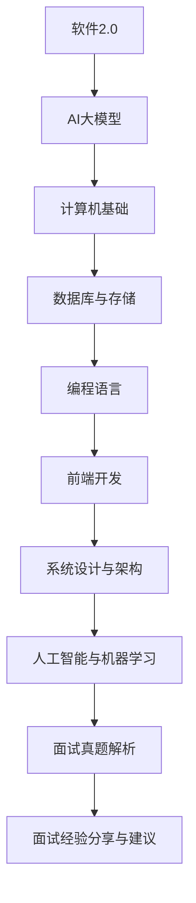

                 

# 引言

在当前快速发展的技术环境中，技术面试已成为求职者进入理想岗位的关键环节。特别是在字节跳动这样的顶尖科技公司，技术面试不仅仅是对求职者技术能力的测试，更是对其解决问题能力、团队合作精神以及职业素养的综合考察。本文旨在为准备参加字节跳动技术内容策划师面试的求职者提供一个全面的面试真题汇总，以及详细的答案解析，帮助大家更好地应对面试挑战。

字节跳动是一家全球领先的互联网科技公司，旗下拥有今日头条、抖音、微博等多个知名产品。作为一家以技术驱动创新的公司，字节跳动在面试中非常注重技术能力，尤其是对于技术策划师岗位，除了需要具备扎实的技术基础，还需要具备良好的内容策划和项目管理能力。本文将围绕以下几个核心主题进行详细阐述：

1. **面试准备与策略**：分析面试前的准备工作，包括了解公司和职位、知己知彼、准备面试题库等。
2. **技术面试真题详解**：深入解析常见的编程题、行为面试题和技术面试题，提供详细的解题思路和代码实现。
3. **面试经验分享与建议**：分享面试过程中的注意事项、面试后的跟进以及如何进行反思和总结。
4. **附录**：推荐面试资源、面试真题汇总以及面试真题答案。

通过本文，希望能够帮助准备参加字节跳动技术内容策划师面试的求职者，更好地了解面试流程，掌握面试技巧，提升面试成功率。

**关键词**：字节跳动，技术面试，内容策划师，面试真题，解题思路，代码实现

**摘要**：本文将详细汇总和分析字节跳动技术内容策划师面试的常见真题，包括编程题、行为面试题和技术面试题，并提供详细的答案解析和面试经验分享，旨在帮助求职者更好地准备面试，提升面试成功率。

----------------------------------------------------------------

# 《2024字节跳动技术内容策划师面试真题汇总（附答案）》目录大纲

## 第一部分：面试准备与策略

### 第1章：面试准备的重要性

在进入正式面试环节之前，充分的面试准备是成功的关键。本章将探讨面试准备的重要性，分析面试过程中的常见问题，并提供提高面试成功率的方法。

#### 1.1 面试准备的重要性

面试准备不仅是对技术能力的检验，更是对求职者综合素质的考察。充分的准备有助于求职者增强自信心，减少紧张情绪，提高面试表现。

**内容概述：**

- 面试准备的意义
- 面试准备对求职者的影响
- 面试准备的具体内容

#### 1.2 面试过程中的常见问题

面试过程中，求职者可能会遇到各种问题，如紧张、表达不清、思路不清晰等。这些问题会影响面试效果，降低求职成功率。

**内容概述：**

- 面试中的常见问题
- 如何应对面试中的紧张情绪
- 提高面试表达和思路清晰度的技巧

#### 1.3 提高面试成功率的方法

为了在面试中脱颖而出，求职者需要采取一系列措施，包括了解公司文化、职位要求，制定针对性的面试策略等。

**内容概述：**

- 了解公司和职位要求
- 制定针对性的面试策略
- 提高面试技巧和方法

## 第二部分：技术面试真题详解

### 第2章：计算机基础

计算机基础是技术面试的核心内容之一，包括数据结构与算法、操作系统、计算机网络等。本章将深入解析这些基础知识点，并提供相应的面试真题解析。

#### 2.1 数据结构与算法

数据结构与算法是计算机科学的核心，本章将详细介绍常见的数据结构与算法，包括线性表、树、图等。

##### 2.1.1 线性表与数组

线性表和数组是数据结构中最基本的形式，本章将介绍线性表和数组的定义、特点及操作。

**内容概述：**

- 线性表的定义与操作
- 数组的定义与操作

##### 2.1.2 栈与队列

栈和队列是两种重要的线性数据结构，本章将详细介绍栈和队列的原理及其在算法中的应用。

**内容概述：**

- 栈的定义与操作
- 队列的定义与操作

##### 2.1.3 链表

链表是一种非连续的存储结构，本章将介绍链表的基本操作及其在算法中的应用。

**内容概述：**

- 链表的定义与操作
- 单链表与双向链表
- 循环链表

##### 2.1.4 树与图

树和图是两种重要的非线性数据结构，本章将深入讲解树和图的基本概念及其应用。

**内容概述：**

- 树的定义与分类
- 二叉树与二叉搜索树
- 图的定义与表示
- 图的遍历算法

#### 2.2 操作系统

操作系统是计算机系统的核心软件，本章将介绍操作系统的基本概念、进程与线程、内存管理等内容。

##### 2.2.1 进程与线程

进程与线程是操作系统中非常重要的概念，本章将详细介绍进程与线程的原理及其在并发编程中的应用。

**内容概述：**

- 进程与线程的定义与特点
- 进程与线程的创建与销毁
- 进程与线程的调度

##### 2.2.2 内存管理

内存管理是操作系统中的一项重要任务，本章将讲解内存分配、内存回收及内存映射等内存管理技术。

**内容概述：**

- 内存管理的概念与目标
- 内存分配与回收策略
- 内存映射与分页机制

##### 2.2.3 文件系统

文件系统是操作系统中用于管理文件的子系统，本章将介绍文件系统的基本原理及文件操作。

**内容概述：**

- 文件系统的概念与分类
- 文件系统的操作与管理
- 文件权限与安全性

#### 2.3 计算机网络

计算机网络是现代信息社会的基石，本章将介绍计算机网络的基本概念、协议栈及其在性能优化中的应用。

##### 2.3.1 网络协议

网络协议是计算机网络中用于通信的标准，本章将讲解常见的网络协议及其工作原理。

**内容概述：**

- TCP/IP协议栈
- HTTP协议
- DNS协议

##### 2.3.2 网络性能优化

网络性能优化是提高网络效率的重要手段，本章将介绍网络性能优化的方法及其实践。

**内容概述：**

- 网络性能评估指标
- 网络性能优化方法
- 实践案例分析

##### 2.3.3 网络安全

网络安全是计算机网络中的关键问题，本章将探讨网络安全的基本概念及防护措施。

**内容概述：**

- 网络安全威胁与攻击手段
- 网络安全防护措施
- 安全协议与标准

## 第三部分：面试真题模拟与解析

### 第3章：数据库与存储

数据库与存储是现代应用程序中不可或缺的组成部分，本章将解析数据库基础、NoSQL数据库、分布式存储等面试真题。

#### 3.1 关系型数据库

关系型数据库是传统数据库的代表，本章将介绍SQL基础、数据库设计及性能优化。

##### 3.1.1 SQL基础

SQL是关系型数据库的标准查询语言，本章将讲解SQL的基本语法及常用操作。

**内容概述：**

- SQL的基本语法
- 数据定义与数据操作
- 数据查询与数据更新

##### 3.1.2 数据库设计

数据库设计是构建高效数据库的关键步骤，本章将介绍数据库设计的基本原则与方法。

**内容概述：**

- 实体关系模型
- 关系型数据库设计原则
- 实践案例分析

##### 3.1.3 性能优化

数据库性能优化是提高应用程序效率的重要手段，本章将讲解性能优化的方法与实践。

**内容概述：**

- 索引优化
- 查询优化
- 存储引擎优化

#### 3.2 NoSQL数据库

NoSQL数据库是应对大数据场景的重要工具，本章将介绍Redis、MongoDB等NoSQL数据库。

##### 3.2.1 Redis

Redis是一种高性能的键值存储数据库，本章将介绍Redis的基本原理及使用方法。

**内容概述：**

- Redis的数据结构
- Redis的事务与持久化
- Redis的集群模式

##### 3.2.2 MongoDB

MongoDB是一种文档型数据库，本章将介绍MongoDB的基本原理及使用方法。

**内容概述：**

- MongoDB的数据模型
- MongoDB的查询语言
- MongoDB的复制集与分片集群

##### 3.2.3 其他NoSQL数据库

本章将介绍其他常见的NoSQL数据库，如Cassandra、HBase等。

**内容概述：**

- Cassandra的分布式架构
- HBase的列存储模型
- 实践案例分析

#### 3.3 分布式存储

分布式存储是应对大规模数据存储的重要技术，本章将解析分布式存储的基本原理及实现。

##### 3.3.1 HDFS

HDFS是Hadoop分布式文件系统，本章将介绍HDFS的工作原理及使用方法。

**内容概述：**

- HDFS的数据模型
- HDFS的命名空间与数据块
- HDFS的高可用性

##### 3.3.2 Cassandra

Cassandra是一种分布式键值存储数据库，本章将介绍Cassandra的基本原理及使用方法。

**内容概述：**

- Cassandra的数据模型
- Cassandra的分布式架构
- Cassandra的复制与一致性

##### 3.3.3 HBase

HBase是一种分布式列存储数据库，本章将介绍HBase的基本原理及使用方法。

**内容概述：**

- HBase的数据模型
- HBase的存储结构
- HBase的查询优化

## 第四部分：编程语言

编程语言是开发应用程序的核心工具，本章将介绍Java、Python、Go等编程语言的基础知识及高级特性。

#### 4.1 Java

Java是一种广泛使用的编程语言，本章将介绍Java的基础知识及并发编程。

##### 4.1.1 Java基础

Java基础是学习Java编程的基础，本章将介绍Java的语法、数据类型、控制结构等。

**内容概述：**

- Java的基本语法
- Java的数据类型
- Java的控制结构

##### 4.1.2 Java并发编程

Java并发编程是Java编程中的重要内容，本章将介绍线程、锁、并发集合等并发编程技术。

**内容概述：**

- 线程的概念与创建
- 同步与锁
- 并发集合的使用

##### 4.1.3 Java框架

Java框架是Java编程中的重要组成部分，本章将介绍Spring、Hibernate等常用Java框架。

**内容概述：**

- Spring框架的基本原理
- Hibernate的数据持久化
- Spring MVC框架的使用

#### 4.2 Python

Python是一种简单易学的编程语言，本章将介绍Python的基础知识及高级特性。

##### 4.2.1 Python基础

Python基础是学习Python编程的基础，本章将介绍Python的语法、数据类型、控制结构等。

**内容概述：**

- Python的基本语法
- Python的数据类型
- Python的控制结构

##### 4.2.2 Python高级特性

Python高级特性是Python编程中的高级内容，本章将介绍生成器、装饰器、元类等高级特性。

**内容概述：**

- 生成器与迭代器
- 装饰器与闭包
- 元类与反射

##### 4.2.3 Python框架

Python框架是Python编程中的重要组成部分，本章将介绍Django、Flask等常用Python框架。

**内容概述：**

- Django框架的基本原理
- Flask的应用开发
- Django REST framework的使用

#### 4.3 Go

Go是一种现代编程语言，本章将介绍Go的基础知识及并发编程。

##### 4.3.1 Go基础

Go基础是学习Go编程的基础，本章将介绍Go的语法、数据类型、控制结构等。

**内容概述：**

- Go的基本语法
- Go的数据类型
- Go的控制结构

##### 4.3.2 Go并发编程

Go并发编程是Go编程中的重要内容，本章将介绍goroutine、通道、锁等并发编程技术。

**内容概述：**

- goroutine的概念与创建
- 通道与锁
- 并发模式与并发性能

##### 4.3.3 Go框架

Go框架是Go编程中的重要组成部分，本章将介绍Beego、Gin等常用Go框架。

**内容概述：**

- Beego框架的基本原理
- Gin的应用开发
- WebAssembly在Go中的应用

## 第五部分：前端开发

前端开发是现代Web应用程序的重要组成部分，本章将介绍HTML/CSS、JavaScript等前端技术。

#### 5.1 HTML/CSS

HTML和CSS是前端开发的基本技术，本章将介绍HTML的基础知识及CSS的布局与样式。

##### 5.1.1 HTML基础

HTML是超文本标记语言，是构建Web页面的基础，本章将介绍HTML的基本语法及常用标签。

**内容概述：**

- HTML的基本语法
- 常用HTML标签
- HTML5的新特性

##### 5.1.2 CSS基础

CSS是层叠样式表，用于控制HTML页面的样式，本章将介绍CSS的基本语法及常用属性。

**内容概述：**

- CSS的基本语法
- 常用CSS属性
- CSS选择器

##### 5.1.3 布局与样式

布局与样式是前端开发的核心内容，本章将介绍前端布局技术及样式设计。

**内容概述：**

- 前端布局技术
- 响应式布局
- 前端设计规范

#### 5.2 JavaScript

JavaScript是前端开发的核心技术之一，本章将介绍JavaScript的基础知识及框架。

##### 5.2.1 JavaScript基础

JavaScript是脚本语言，用于增强Web页面的交互性，本章将介绍JavaScript的基本语法及常用函数。

**内容概述：**

- JavaScript的基本语法
- 常用JavaScript函数
- DOM操作与事件处理

##### 5.2.2 JavaScript框架

JavaScript框架是前端开发中的重要组成部分，本章将介绍Vue、React等常用JavaScript框架。

**内容概述：**

- Vue框架的基本原理
- React的应用开发
- Angular框架的使用

##### 5.2.3 前端工程化

前端工程化是提高前端开发效率的重要手段，本章将介绍前端构建工具及模块化开发。

**内容概述：**

- 前端构建工具
- 模块化开发
- 前端性能优化

## 第六部分：系统设计与架构

系统设计与架构是软件开发中的关键环节，本章将介绍系统设计、分布式系统、架构模式等面试真题。

#### 6.1 系统设计

系统设计是软件开发的重要环节，本章将介绍系统设计的基本原则及设计方法。

##### 6.1.1 系统需求分析

系统需求分析是系统设计的起点，本章将介绍系统需求分析的方法及技巧。

**内容概述：**

- 系统需求分析的基本原则
- 需求获取与需求分析
- 实践案例分析

##### 6.1.2 系统架构设计

系统架构设计是系统设计的核心，本章将介绍系统架构设计的方法及架构模式。

**内容概述：**

- 系统架构设计的基本原则
- 分层架构与微服务架构
- 架构模式与设计模式

##### 6.1.3 系统性能优化

系统性能优化是提高系统性能的重要手段，本章将介绍系统性能优化的方法及实践。

**内容概述：**

- 系统性能评估指标
- 系统性能优化方法
- 实践案例分析

#### 6.2 分布式系统

分布式系统是现代软件架构中的重要组成部分，本章将介绍分布式系统的基本原理及实现。

##### 6.2.1 分布式理论

分布式理论是分布式系统的基础，本章将介绍分布式系统的基本概念及原理。

**内容概述：**

- 分布式系统的定义与特点
- 分布式一致性
- 分布式容错性

##### 6.2.2 分布式服务架构

分布式服务架构是分布式系统的核心，本章将介绍分布式服务架构的设计原则及实现。

**内容概述：**

- 分布式服务架构的基本原则
- 微服务架构与SOA
- 分布式服务治理

##### 6.2.3 分布式一致性

分布式一致性是分布式系统中的关键问题，本章将介绍分布式一致性协议及实现。

**内容概述：**

- 分布式一致性协议
- 分布式事务处理
- 一致性算法

#### 6.3 架构模式

架构模式是软件架构设计的重要方法，本章将介绍常用的架构模式及其应用。

##### 6.3.1 MVC模式

MVC模式是一种常用的架构模式，本章将介绍MVC模式的基本原理及实现。

**内容概述：**

- MVC模式的基本原理
- MVC模式的应用场景
- MVC模式在Web开发中的应用

##### 6.3.2 微服务架构

微服务架构是现代软件架构的重要趋势，本章将介绍微服务架构的基本原理及实现。

**内容概述：**

- 微服务架构的定义与特点
- 微服务架构的实施步骤
- 微服务架构的优势与挑战

##### 6.3.3 RESTful API设计

RESTful API设计是微服务架构中的重要内容，本章将介绍RESTful API设计的基本原则及方法。

**内容概述：**

- RESTful API的基本原理
- RESTful API的设计原则
- RESTful API的实现方法

## 第七部分：人工智能与机器学习

人工智能与机器学习是现代技术领域的重要发展方向，本章将介绍机器学习基础、深度学习、自然语言处理等面试真题。

#### 7.1 机器学习基础

机器学习是人工智能的核心技术之一，本章将介绍机器学习的基础知识及常用算法。

##### 7.1.1 监督学习

监督学习是机器学习的一种重要形式，本章将介绍监督学习的基本原理及常用算法。

**内容概述：**

- 监督学习的定义与分类
- 线性回归与逻辑回归
- 支持向量机

##### 7.1.2 无监督学习

无监督学习是机器学习的另一种形式，本章将介绍无监督学习的基本原理及常用算法。

**内容概述：**

- 无监督学习的定义与分类
- 聚类算法
- 减少维度算法

##### 7.1.3 强化学习

强化学习是机器学习的一种重要形式，本章将介绍强化学习的基本原理及常用算法。

**内容概述：**

- 强化学习的定义与分类
- Q-learning算法
- SARSA算法

#### 7.2 深度学习

深度学习是人工智能的重要发展方向，本章将介绍深度学习的基础知识及常用模型。

##### 7.2.1 深度神经网络

深度神经网络是深度学习的基础，本章将介绍深度神经网络的基本原理及实现。

**内容概述：**

- 深度神经网络的定义与分类
- 深层前向神经网络
- 循环神经网络

##### 7.2.2 卷积神经网络

卷积神经网络是图像处理的重要工具，本章将介绍卷积神经网络的基本原理及实现。

**内容概述：**

- 卷积神经网络的基本原理
- 卷积神经网络在图像处理中的应用
- 卷积神经网络在计算机视觉中的应用

##### 7.2.3 循环神经网络

循环神经网络是序列处理的重要工具，本章将介绍循环神经网络的基本原理及实现。

**内容概述：**

- 循环神经网络的基本原理
- 长短时记忆网络
- 深度循环神经网络

#### 7.3 自然语言处理

自然语言处理是人工智能的重要领域，本章将介绍自然语言处理的基础知识及常用算法。

##### 7.3.1 词嵌入

词嵌入是自然语言处理的重要技术，本章将介绍词嵌入的基本原理及实现。

**内容概述：**

- 词嵌入的定义与分类
- Word2Vec算法
- GloVe算法

##### 7.3.2 序列模型

序列模型是自然语言处理的重要模型，本章将介绍序列模型的基本原理及实现。

**内容概述：**

- 序列模型的定义与分类
- RNN与LSTM
- GRU与Transformer

##### 7.3.3 注意力机制

注意力机制是自然语言处理的重要技术，本章将介绍注意力机制的基本原理及实现。

**内容概述：**

- 注意力机制的定义与分类
- 自注意力机制
- 交互注意力机制

## 第八部分：面试真题模拟与解析

面试真题模拟与解析是面试准备的重要环节，本章将模拟面试真题，并提供详细的解析。

#### 8.1 编程题模拟与解析

编程题是面试中的重要环节，本章将模拟常见的编程题，并提供详细的解析。

##### 8.1.1 算法设计与实现

算法设计与实现是编程题的核心，本章将介绍算法设计与实现的方法及技巧。

**内容概述：**

- 算法设计与实现的基本原则
- 常见算法设计方法
- 算法实现与优化

##### 8.1.2 数据结构与算法应用

数据结构与算法应用是编程题的重要组成部分，本章将介绍数据结构与算法在编程题中的应用。

**内容概述：**

- 数据结构与算法在编程题中的应用
- 数据结构与算法的优化
- 数据结构与算法在面试中的应用

##### 8.1.3 编程技巧与优化

编程技巧与优化是提高编程能力的重要方法，本章将介绍编程技巧与优化方法。

**内容概述：**

- 编程技巧与优化的重要性
- 常见编程技巧
- 编程优化方法

#### 8.2 行为面试题模拟与解析

行为面试题是面试中的重要环节，本章将模拟常见的行为面试题，并提供详细的解析。

##### 8.2.1 职业规划

职业规划是求职者的重要素质，本章将介绍职业规划的方法及技巧。

**内容概述：**

- 职业规划的基本原则
- 职业规划的步骤
- 职业规划的方法

##### 8.2.2 团队合作

团队合作是求职者的重要能力，本章将介绍团队合作的方法及技巧。

**内容概述：**

- 团队合作的基本原则
- 团队合作的方法
- 团队合作中的沟通与协作

##### 8.2.3 问题解决能力

问题解决能力是求职者的关键能力，本章将介绍问题解决的方法及技巧。

**内容概述：**

- 问题解决的基本原则
- 问题解决的步骤
- 问题解决的方法

##### 8.2.4 领导力与沟通能力

领导力与沟通能力是求职者的关键能力，本章将介绍领导力与沟通能力的方法及技巧。

**内容概述：**

- 领导力的基本原则
- 沟通能力的基本原则
- 领导力与沟通能力的方法

## 第九部分：面试经验分享与建议

面试经验分享与建议是面试准备的重要环节，本章将分享面试经验，并提供面试建议。

#### 9.1 面试前的准备

面试前的准备是面试成功的关键，本章将介绍面试前的准备方法及注意事项。

##### 9.1.1 公司背景了解

了解公司背景是面试准备的重要环节，本章将介绍如何了解公司背景。

**内容概述：**

- 公司背景的了解方法
- 公司背景的了解内容
- 公司背景的了解意义

##### 9.1.2 面试题型预测

预测面试题型是面试准备的重要环节，本章将介绍如何预测面试题型。

**内容概述：**

- 面试题型的预测方法
- 面试题型的预测内容
- 面试题型的预测意义

##### 9.1.3 面试心态调整

面试心态调整是面试成功的关键，本章将介绍如何调整面试心态。

**内容概述：**

- 面试心态调整的方法
- 面试心态调整的意义
- 面试心态调整的注意事项

#### 9.2 面试过程中的注意事项

面试过程中的注意事项是面试成功的关键，本章将介绍面试过程中的注意事项。

##### 9.2.1 语言表达与逻辑思维

语言表达与逻辑思维是面试中的关键能力，本章将介绍如何提高语言表达与逻辑思维能力。

**内容概述：**

- 语言表达的基本原则
- 逻辑思维的基本原则
- 语言表达与逻辑思维的关系

##### 9.2.2 问题回答的技巧

问题回答的技巧是面试中的关键，本章将介绍问题回答的技巧。

**内容概述：**

- 问题回答的基本原则
- 问题回答的技巧
- 问题回答的案例分析

##### 9.2.3 面试官的反馈与应对

面试官的反馈与应对是面试中的关键环节，本章将介绍如何应对面试官的反馈。

**内容概述：**

- 面试官的反馈类型
- 面试官的反馈应对方法
- 面试官的反馈案例分析

#### 9.3 面试后的跟进

面试后的跟进是面试成功的关键，本章将介绍面试后的跟进方法及注意事项。

##### 9.3.1 发送感谢信

发送感谢信是面试后的重要环节，本章将介绍如何发送感谢信。

**内容概述：**

- 感谢信的基本原则
- 感谢信的内容要点
- 感谢信的案例分析

##### 9.3.2 了解面试结果

了解面试结果是面试后的重要环节，本章将介绍如何了解面试结果。

**内容概述：**

- 面试结果的了解方法
- 面试结果的了解途径
- 面试结果的了解意义

##### 9.3.3 反思与总结

反思与总结是面试成功的关键，本章将介绍如何反思与总结面试。

**内容概述：**

- 反思与总结的原则
- 反思与总结的步骤
- 反思与总结的方法

## 第三部分：附录

### 附录A：常见面试资源推荐

常见面试资源推荐是面试准备的重要环节，本章将推荐常见面试资源。

##### 9.1 技术博客与网站

技术博客与网站是面试准备的重要资源，本章将推荐常见的技术博客与网站。

**内容概述：**

- 技术博客与网站的选择原则
- 常见的技术博客与网站
- 技术博客与网站的使用方法

##### 9.2 在线编程平台

在线编程平台是面试准备的重要工具，本章将推荐常见的在线编程平台。

**内容概述：**

- 在线编程平台的选择原则
- 常见的在线编程平台
- 在线编程平台的使用方法

##### 9.3 数据结构与算法书籍

数据结构与算法书籍是面试准备的重要资源，本章将推荐常见的数据结构与算法书籍。

**内容概述：**

- 数据结构与算法书籍的选择原则
- 常见的数据结构与算法书籍
- 数据结构与算法书籍的使用方法

### 附录B：面试真题汇总

面试真题汇总是面试准备的重要环节，本章将汇总常见的面试真题。

##### 9.1 编程题汇总

编程题汇总是面试中的重要环节，本章将汇总常见的编程题。

**内容概述：**

- 编程题的类型
- 编程题的案例分析
- 编程题的解题思路

##### 9.2 行为面试题汇总

行为面试题汇总是面试中的重要环节，本章将汇总常见的行为面试题。

**内容概述：**

- 行为面试题的类型
- 行为面试题的案例分析
- 行为面试题的解题思路

##### 9.3 技术面试题汇总

技术面试题汇总是面试中的重要环节，本章将汇总常见的技术面试题。

**内容概述：**

- 技术面试题的类型
- 技术面试题的案例分析
- 技术面试题的解题思路

### 附录C：面试真题答案

面试真题答案是面试准备的重要环节，本章将提供常见的面试真题答案。

##### 9.1 编程题答案

编程题答案是面试准备的重要环节，本章将提供常见的编程题答案。

**内容概述：**

- 编程题答案的选择原则
- 编程题答案的内容要点
- 编程题答案的案例分析

##### 9.2 行为面试题答案

行为面试题答案是面试准备的重要环节，本章将提供常见的行为面试题答案。

**内容概述：**

- 行为面试题答案的选择原则
- 行为面试题答案的内容要点
- 行为面试题答案的案例分析

##### 9.3 技术面试题答案

技术面试题答案是面试准备的重要环节，本章将提供常见的技术面试题答案。

**内容概述：**

- 技术面试题答案的选择原则
- 技术面试题答案的内容要点
- 技ech面试题答案的案例分析

## 附件：核心概念与联系 Mermaid 流程图



## 附件：核心算法原理讲解

### 2.1 数据结构与算法

数据结构与算法是计算机科学的基础，是实现高效程序设计的关键。本节将介绍几种常见的数据结构与算法原理。

#### 2.1.1 线性表与数组

线性表是一种数据结构，其特点是数据元素按线性顺序排列，每个元素只有一个前驱和一个后继。线性表包括数组、链表等。

- **数组**：数组是一种线性表，其数据元素存放在连续的内存空间中，可以通过下标直接访问。数组支持随机访问，时间复杂度为 \(O(1)\)。
- **链表**：链表是一种通过指针连接的线性表，每个节点包含数据和指向下一个节点的指针。链表不支持随机访问，时间复杂度为 \(O(n)\)。

#### 2.1.2 栈与队列

栈和队列是两种特殊的线性表，分别用于实现后进先出（LIFO）和先进先出（FIFO）的操作。

- **栈**：栈是一种只能在一端进行插入和删除操作的线性表。栈的常用操作包括入栈、出栈、栈顶元素等。
- **队列**：队列是一种只能在一端进行插入操作，在另一端进行删除操作的线性表。队列的常用操作包括入队、出队、队首元素等。

#### 2.1.3 链表

链表是一种通过指针连接的线性表，每个节点包含数据和指向下一个节点的指针。

- **单链表**：单链表的每个节点只包含一个指针，指向下一个节点。
- **双向链表**：双向链表的每个节点包含两个指针，一个指向下一个节点，另一个指向上一个节点。
- **循环链表**：循环链表的最后一个节点的指针指向第一个节点，形成一个环。

#### 2.1.4 树与图

树是一种重要的非线性数据结构，由节点和边组成。树的特点是每个节点只有一个父节点，且没有父节点的节点称为根节点。

- **二叉树**：二叉树是每个节点最多有两个子树的树结构。二叉树包括满二叉树、完全二叉树、二叉搜索树等。
- **图**：图是一种由节点和边组成的数据结构，可以表示复杂的关系。图的常用操作包括图的遍历、图的最短路径、图的连通性等。

### 2.2 操作系统

操作系统是计算机系统中的核心软件，负责管理和控制计算机硬件与软件资源。操作系统的主要功能包括进程管理、内存管理、文件系统管理、设备管理等。

#### 2.2.1 进程与线程

进程是操作系统中正在运行的程序实例，具有独立的内存空间和系统资源。线程是进程中的执行单元，共享进程的资源。

- **进程创建与销毁**：操作系统通过系统调用创建和销毁进程。
- **进程调度**：操作系统根据调度算法选择下一个执行的进程。
- **线程创建与销毁**：进程可以通过创建线程来并发执行任务。

#### 2.2.2 内存管理

内存管理是操作系统中的一项重要任务，负责分配和回收内存空间。

- **内存分配策略**：常见的内存分配策略包括首次适配、最佳适配、最坏适配等。
- **内存回收策略**：内存回收策略包括手动回收、垃圾回收等。

#### 2.2.3 文件系统

文件系统是操作系统中用于管理和存储文件的子系统。文件系统提供文件的组织方式、存取方式、安全性等。

- **文件系统结构**：常见的文件系统结构包括磁盘分区、文件目录等。
- **文件操作**：常见的文件操作包括文件的创建、删除、读取、写入等。

### 2.3 计算机网络

计算机网络是连接多台计算机，实现数据传输和共享资源的系统。计算机网络的主要功能包括数据传输、路由选择、网络安全等。

#### 2.3.1 网络协议

网络协议是计算机网络中用于通信的标准。常见的网络协议包括TCP/IP协议、HTTP协议、FTP协议等。

- **TCP/IP协议**：TCP/IP协议是一种网络通信协议，包括传输控制协议（TCP）和互联网协议（IP）。
- **HTTP协议**：HTTP协议是一种用于Web应用程序的通信协议。
- **FTP协议**：FTP协议是一种用于文件传输的通信协议。

#### 2.3.2 网络性能优化

网络性能优化是提高网络传输效率和可靠性的方法。常见的网络性能优化方法包括负载均衡、缓存技术、网络监控等。

- **负载均衡**：负载均衡是将网络请求分配到多个服务器上，提高系统性能。
- **缓存技术**：缓存技术是存储常用数据以减少网络传输时间。
- **网络监控**：网络监控是实时监测网络状态和性能，以便及时发现和解决问题。

#### 2.3.3 网络安全

网络安全是保护网络系统和数据不受恶意攻击和破坏的措施。常见的网络安全技术包括防火墙、加密技术、入侵检测等。

- **防火墙**：防火墙是一种网络安全设备，用于控制网络流量。
- **加密技术**：加密技术用于保护数据的安全性，防止未授权访问。
- **入侵检测**：入侵检测是一种实时监测网络流量和系统活动，识别和防范网络攻击的技术。

### 2.4 数据库与存储

数据库是用于存储、管理和检索数据的系统。数据库系统包括关系型数据库、NoSQL数据库、分布式存储等。

#### 2.4.1 关系型数据库

关系型数据库是一种基于关系模型的数据库系统，包括表、索引、视图等。

- **SQL基础**：SQL是关系型数据库的标准查询语言，包括数据定义、数据操作、数据查询等。
- **数据库设计**：数据库设计是构建高效数据库的关键步骤，包括需求分析、概念设计、逻辑设计等。
- **性能优化**：数据库性能优化是提高数据库查询效率和响应速度的方法，包括索引优化、查询优化、存储引擎优化等。

#### 2.4.2 NoSQL数据库

NoSQL数据库是一种非关系型数据库系统，适用于大规模数据存储和实时处理。

- **Redis**：Redis是一种高性能的键值存储数据库，适用于缓存、实时处理等场景。
- **MongoDB**：MongoDB是一种文档型数据库，适用于存储和检索大量文档数据。
- **Cassandra**：Cassandra是一种分布式键值存储数据库，适用于大规模数据存储和实时处理。

#### 2.4.3 分布式存储

分布式存储是一种分布式文件系统，适用于大规模数据存储和并行处理。

- **HDFS**：HDFS是Hadoop分布式文件系统，适用于大规模数据存储和并行处理。
- **Cassandra**：Cassandra是一种分布式键值存储数据库，适用于大规模数据存储和实时处理。
- **HBase**：HBase是一种分布式列存储数据库，适用于大规模数据存储和实时处理。

### 2.5 编程语言

编程语言是用于编写计算机程序的语言。常见的编程语言包括Java、Python、Go等。

#### 2.5.1 Java

Java是一种面向对象的编程语言，具有跨平台、安全性等特点。

- **Java基础**：Java基础包括数据类型、控制结构、异常处理等。
- **Java并发编程**：Java并发编程包括线程、锁、并发集合等。
- **Java框架**：Java框架包括Spring、Hibernate等。

#### 2.5.2 Python

Python是一种解释型编程语言，具有简洁易读、高效等特点。

- **Python基础**：Python基础包括数据类型、控制结构、函数等。
- **Python高级特性**：Python高级特性包括生成器、装饰器、元类等。
- **Python框架**：Python框架包括Django、Flask等。

#### 2.5.3 Go

Go是一种编译型编程语言，具有高性能、并发性等特点。

- **Go基础**：Go基础包括数据类型、控制结构、函数等。
- **Go并发编程**：Go并发编程包括goroutine、通道、锁等。
- **Go框架**：Go框架包括Beego、Gin等。

### 2.6 前端开发

前端开发是构建Web应用程序的关键部分，涉及HTML、CSS、JavaScript等。

#### 2.6.1 HTML/CSS

HTML和CSS是前端开发的基本技术，用于构建Web页面的结构和样式。

- **HTML基础**：HTML基础包括标签、属性、超链接等。
- **CSS基础**：CSS基础包括选择器、属性、布局等。

#### 2.6.2 JavaScript

JavaScript是一种用于增强Web页面交互性的脚本语言。

- **JavaScript基础**：JavaScript基础包括语法、数据类型、函数等。
- **JavaScript框架**：JavaScript框架包括Vue、React等。

#### 2.6.3 前端工程化

前端工程化是提高前端开发效率的重要手段，包括构建工具、模块化开发等。

- **前端构建工具**：前端构建工具包括Webpack、Gulp等。
- **模块化开发**：模块化开发是提高代码可维护性和可复用性的重要方法。

### 2.7 系统设计与架构

系统设计与架构是软件开发中的重要环节，涉及系统设计、分布式系统、架构模式等。

#### 2.7.1 系统设计

系统设计是软件开发的第一步，包括需求分析、架构设计等。

- **需求分析**：需求分析是明确系统功能和性能要求的过程。
- **架构设计**：架构设计是确定系统组件和接口的过程。

#### 2.7.2 分布式系统

分布式系统是多个节点通过网络协同工作的系统，涉及分布式理论、分布式服务架构等。

- **分布式理论**：分布式理论包括一致性、容错性、负载均衡等。
- **分布式服务架构**：分布式服务架构包括客户端-服务器模式、微服务架构等。

#### 2.7.3 架构模式

架构模式是软件开发中的重要方法，包括MVC模式、微服务架构等。

- **MVC模式**：MVC模式是一种分层架构模式，包括模型、视图、控制器等。
- **微服务架构**：微服务架构是一种分布式架构模式，包括服务拆分、服务通信等。

### 2.8 人工智能与机器学习

人工智能与机器学习是计算机科学的前沿领域，涉及数据预处理、特征提取、模型训练等。

#### 2.8.1 数据预处理

数据预处理是机器学习中的第一步，包括数据清洗、数据转换等。

- **数据清洗**：数据清洗是去除错误和异常数据的过程。
- **数据转换**：数据转换是将数据转换为适合模型训练的形式。

#### 2.8.2 特征提取

特征提取是机器学习中的关键步骤，包括特征选择、特征提取等。

- **特征选择**：特征选择是选择对模型训练有重要影响的特征。
- **特征提取**：特征提取是将原始数据转换为新的特征表示。

#### 2.8.3 模型训练

模型训练是机器学习中的核心步骤，包括模型选择、模型训练等。

- **模型选择**：模型选择是选择适合问题的机器学习模型。
- **模型训练**：模型训练是使用训练数据调整模型参数的过程。

### 2.9 自然语言处理

自然语言处理是人工智能中的重要分支，涉及文本分类、情感分析、机器翻译等。

#### 2.9.1 文本分类

文本分类是将文本数据分为不同类别的过程。

- **文本预处理**：文本预处理是去除无用信息、进行分词等步骤。
- **分类算法**：分类算法包括朴素贝叶斯、支持向量机等。

#### 2.9.2 情感分析

情感分析是分析文本数据中的情感倾向。

- **情感词典**：情感词典是存储情感词汇的词典。
- **情感分析算法**：情感分析算法包括基于规则、基于统计等方法。

#### 2.9.3 机器翻译

机器翻译是将一种语言的文本转换为另一种语言的过程。

- **机器翻译模型**：机器翻译模型包括基于规则、基于统计、基于神经等方法。
- **翻译评估**：翻译评估是评估机器翻译质量的过程。

## 附件：数学模型和数学公式

在机器学习中，数学模型是核心组成部分。以下将介绍几种常见的数学模型及其相关数学公式。

### 1. 线性回归模型

线性回归模型是一种简单的预测模型，其目标是通过输入变量预测输出变量。线性回归模型可以用以下数学公式表示：

$$
y = \beta_0 + \beta_1 \cdot x
$$

其中，\( y \) 是预测值，\( x \) 是输入变量，\( \beta_0 \) 是截距，\( \beta_1 \) 是斜率。斜率 \( \beta_1 \) 表示输入变量对预测值的贡献程度，截距 \( \beta_0 \) 表示当输入变量为0时预测值的基准值。

### 2. 逻辑回归模型

逻辑回归模型是一种用于分类问题的预测模型，其目标是通过输入变量预测输出变量的概率。逻辑回归模型可以用以下数学公式表示：

$$
P(y=1) = \frac{1}{1 + e^{-(\beta_0 + \beta_1 \cdot x)}}
$$

其中，\( P(y=1) \) 是预测目标变量为1的概率，\( x \) 是输入变量，\( \beta_0 \) 是截距，\( \beta_1 \) 是斜率。逻辑函数（也称为Sigmoid函数）将线性组合转换为概率值，使得输出值在0和1之间。

### 3. 支持向量机（SVM）

支持向量机是一种用于分类和回归问题的强大算法，其目标是找到一个最佳的超平面，使得不同类别之间的间隔最大。SVM可以用以下数学公式表示：

$$
\min_{\beta, \beta_0} \frac{1}{2} ||\beta||^2 + C \sum_{i=1}^{n} \max(0, 1 - y_i(\beta \cdot x_i + \beta_0))
$$

其中，\( \beta \) 是模型参数，\( \beta_0 \) 是截距，\( C \) 是惩罚参数，\( y_i \) 是标签，\( x_i \) 是特征向量。目标函数是最小化误差平方和，同时最大化分类间隔。

### 4. 决策树模型

决策树是一种基于特征进行决策的树形结构，其目标是找到一个最佳的特征，使得数据集的划分误差最小。决策树可以用以下数学公式表示：

$$
G(D, A) = \sum_{i=1}^{n} l(y_i, \hat{y}_i)
$$

其中，\( D \) 是数据集，\( A \) 是特征，\( y_i \) 是真实标签，\( \hat{y}_i \) 是预测标签，\( l \) 是损失函数。目标是最小化损失函数，找到最佳的特征划分。

### 5. 神经网络模型

神经网络是一种模拟人脑神经元工作的计算模型，其目标是通过学习输入和输出之间的映射关系进行预测。神经网络可以用以下数学公式表示：

$$
a_{j}^{(l)} = \sigma \left( \sum_{i} w_{ij}^{(l)} a_{i}^{(l-1)} + b_{j}^{(l)} \right)
$$

$$
\hat{y}_{i} = \sum_{j} w_{ji}^{(L)} a_{j}^{(L-1)}
$$

其中，\( a_{j}^{(l)} \) 是第 \( l \) 层第 \( j \) 个神经元的输出，\( \sigma \) 是激活函数，通常为Sigmoid函数，\( w_{ij}^{(l)} \) 是第 \( l \) 层第 \( i \) 个神经元到第 \( l+1 \) 层第 \( j \) 个神经元的权重，\( b_{j}^{(l)} \) 是第 \( l \) 层第 \( j \) 个神经元的偏置，\( \hat{y}_{i} \) 是输出层第 \( i \) 个神经元的预测值。

## 附件：项目实战

### 第6章：系统设计与架构

#### 6.1 系统设计

系统设计是软件开发过程中的关键环节，它决定了系统的功能、性能、可维护性和扩展性。本节将介绍一个分布式存储系统的设计与实现。

##### 6.1.1 系统需求分析

在设计分布式存储系统之前，我们需要明确系统的需求。以下是一个典型分布式存储系统的需求分析：

1. **数据存储**：系统能够存储大量的数据，保证数据的安全性和可靠性。
2. **高可用性**：系统能够在部分节点故障的情况下保持正常运行。
3. **高性能**：系统能够快速处理大量并发读写请求。
4. **扩展性**：系统能够根据需求水平扩展存储容量和处理能力。
5. **容错性**：系统能够在发生网络分区时保持数据一致性。

##### 6.1.2 系统架构设计

分布式存储系统的架构设计需要考虑数据存储、数据复制、数据备份、负载均衡等因素。以下是一个典型的分布式存储系统架构：


**1. 数据存储**

分布式存储系统采用分布式文件系统（如HDFS）来存储数据。HDFS将数据分成多个数据块，并分布在不同的节点上。每个数据块都有多个副本，以保证数据的高可用性和容错性。

**2. 数据复制**

为了保证数据的高可用性，分布式存储系统需要对数据进行复制。通常，每个数据块都有三个副本，存储在不同的节点上。当某个节点故障时，其他节点的副本可以接管其工作。

**3. 数据备份**

为了防止数据丢失，分布式存储系统还需要进行数据备份。备份可以采用定期备份策略，将数据复制到远程存储设备或云存储中。

**4. 负载均衡**

分布式存储系统需要实现负载均衡，将读写请求均匀地分配到不同的节点上，以避免单点过载。负载均衡可以通过轮询、最小连接数、最大吞吐量等方法实现。

**5. 数据一致性**

分布式存储系统需要实现数据一致性，确保不同节点的数据副本保持一致。一致性可以通过Paxos、Raft等一致性算法实现。

##### 6.1.3 系统实现

分布式存储系统的实现涉及多个组件和模块。以下是一个简单的实现示例：

**1. 数据存储模块**

数据存储模块负责处理数据的存储和读取操作。它包括文件系统接口、数据块管理器、数据副本管理器等。

**2. 数据复制模块**

数据复制模块负责实现数据复制功能。它包括副本同步器、副本监控器等。

**3. 数据备份模块**

数据备份模块负责实现数据备份功能。它包括备份调度器、备份执行器等。

**4. 负载均衡模块**

负载均衡模块负责实现负载均衡功能。它包括请求分发器、负载均衡器等。

**5. 数据一致性模块**

数据一致性模块负责实现数据一致性功能。它包括一致性算法实现、状态监控器等。

##### 6.1.4 系统性能优化

分布式存储系统的性能优化是提高系统效率的关键。以下是一些常见的性能优化方法：

1. **数据分片**：将数据分成多个分片，存储在不同的节点上，提高数据访问速度。
2. **缓存**：使用缓存存储频繁访问的数据，减少磁盘IO操作。
3. **预加载**：提前加载即将访问的数据到缓存或内存中，提高数据访问速度。
4. **并行处理**：使用多线程或多进程处理并发请求，提高系统吞吐量。
5. **网络优化**：优化网络拓扑结构，减少网络延迟和丢包率。

#### 6.2 分布式系统

分布式系统是由多个节点通过网络协同工作的系统，具有高可用性、高性能和可扩展性等特点。本节将介绍分布式系统的基本原理和实现方法。

##### 6.2.1 分布式理论

分布式系统的理论基础包括一致性、容错性、负载均衡和分布存储等。

1. **一致性**：分布式系统中的数据需要在多个节点之间保持一致。一致性可以分为强一致性、最终一致性和因果一致性等。
2. **容错性**：分布式系统需要在节点故障或网络分区的情况下保持正常运行。容错性可以通过冗余设计、副本机制和故障检测等方法实现。
3. **负载均衡**：分布式系统需要将工作负载分配到多个节点上，以避免单点过载。负载均衡可以通过轮询、最小连接数、最大吞吐量等方法实现。
4. **分布存储**：分布式系统需要将数据存储在多个节点上，以提高数据访问速度和系统容错性。分布存储可以通过分布式文件系统、分布式数据库等方法实现。

##### 6.2.2 分布式服务架构

分布式服务架构是分布式系统的实现方式，包括客户端-服务器模式、服务端模式、微服务架构等。

1. **客户端-服务器模式**：客户端通过发送请求到服务器，服务器处理请求并返回响应。客户端-服务器模式简单易实现，但难以扩展和高可用性。
2. **服务端模式**：多个服务器提供相同的服务，客户端通过负载均衡器分配请求。服务端模式可以提升系统性能和高可用性，但需要复杂的负载均衡和容错机制。
3. **微服务架构**：将系统划分为多个独立的小服务，每个服务负责特定的业务功能，通过API进行通信。微服务架构可以提升系统的可扩展性、高可用性和可维护性，但需要复杂的分布式服务管理和数据一致性保证。

##### 6.2.3 分布式一致性

分布式一致性是分布式系统中的关键挑战之一，确保多个节点对数据的访问和修改能够保持一致。以下是一些常用的分布式一致性协议：

1. **强一致性**：所有节点在同一时间看到相同的数据状态。强一致性保证数据的一致性，但可能导致性能下降。
2. **最终一致性**：虽然系统可能暂时不一致，但最终会达到一致状态。最终一致性可以提升系统性能，但需要一定的时间来达到一致性。
3. **因果一致性**：遵循因果关系，但不必强求所有节点同时看到相同的数据状态。因果一致性可以减少数据一致性的冲突，但可能存在数据丢失的风险。

#### 6.2.4 项目实战：分布式缓存系统设计

分布式缓存系统是分布式系统中的一种常见应用，用于提高系统的性能和可扩展性。以下是一个分布式缓存系统的设计与实现。

**1. 环境搭建**

- **操作系统**：Linux
- **编程语言**：Java
- **分布式框架**：ZooKeeper、Docker、Kubernetes

**2. 系统需求**

- **高性能**：系统能够快速处理大量并发缓存操作。
- **高可用性**：系统能够在部分节点故障的情况下保持正常运行。
- **可扩展性**：系统能够根据需求水平扩展缓存容量和处理能力。

**3. 系统架构设计**

分布式缓存系统架构设计如下：


**（1）Cache Server**

Cache Server 负责缓存数据的存储和提供。每个 Cache Server 都是一个独立的 Java 应用，通过 ZooKeeper 进行协调和负载均衡。

**（2）ZooKeeper**

ZooKeeper 负责协调分布式系统中的各个节点，实现主节点选举和配置管理。ZooKeeper 是一个分布式协调服务，可以保证 Cache Server 的数据一致性。

**（3）Docker**

Docker 用于容器化 Cache Server，实现快速部署和运维。Docker 可以将 Cache Server 应用打包成一个镜像，方便在各个节点上部署和运行。

**（4）Kubernetes**

Kubernetes 用于容器编排和管理平台，实现 Cache Server 的自动化部署和扩展。Kubernetes 可以根据需求动态调整 Cache Server 的数量和资源分配。

**4. 系统实现**

**（1）Cache Server**

Cache Server 实现了缓存数据的存储和提供功能。它使用 ConcurrentHashMap 来存储缓存数据，保证并发访问的高效性。以下是一个简单的 Cache Server 实现示例：

```java
import java.util.concurrent.ConcurrentHashMap;

public class CacheServer {
    private ConcurrentHashMap<String, String> cacheMap;

    public CacheServer() {
        cacheMap = new ConcurrentHashMap<>();
    }

    public void set(String key, String value) {
        cacheMap.put(key, value);
    }

    public String get(String key) {
        return cacheMap.get(key);
    }

    public void remove(String key) {
        cacheMap.remove(key);
    }
}
```

**（2）ZooKeeper**

ZooKeeper 用于协调分布式系统中的各个节点。以下是一个简单的 ZooKeeper 实现示例：

```java
import org.apache.zookeeper.ZooKeeper;

public class ZooKeeperCoordinator {
    private ZooKeeper zooKeeper;

    public ZooKeeperCoordinator(String connectString, int sessionTimeout) throws Exception {
        zooKeeper = new ZooKeeper(connectString, sessionTimeout);
    }

    public void start() {
        try {
            zooKeeper.create("/cache-server", "".getBytes(), ZooKeeper.CreateMode.PERSISTENT);
        } catch (Exception e) {
            e.printStackTrace();
        }
    }

    public void shutdown() {
        try {
            zooKeeper.close();
        } catch (Exception e) {
            e.printStackTrace();
        }
    }
}
```

**（3）Dockerfile**

Dockerfile 用于创建 Cache Server 的 Docker 镜像。以下是一个简单的 Dockerfile 示例：

```dockerfile
FROM openjdk:8-jdk-alpine
COPY target/cache-server.jar /app/cache-server.jar
EXPOSE 8080
CMD ["java", "-jar", "/app/cache-server.jar"]
```

**（4）Kubernetes Deployment**

Kubernetes Deployment 用于部署和管理 Cache Server。以下是一个简单的 Kubernetes Deployment 配置示例：

```yaml
apiVersion: apps/v1
kind: Deployment
metadata:
  name: cache-server
spec:
  replicas: 3
  selector:
    matchLabels:
      app: cache-server
  template:
    metadata:
      labels:
        app: cache-server
    spec:
      containers:
      - name: cache-server
        image: cache-server:latest
        ports:
        - containerPort: 8080
```

通过以上设计，我们实现了一个分布式缓存系统，能够支持高并发、高性能的缓存服务，并具备良好的容错性和扩展性。在实际应用中，可以根据需求进行功能扩展和性能优化。

## 附件：项目实战

### 第8章：面试真题模拟与解析

#### 8.1 编程题模拟与解析

**题目**：给定一个整数数组 `nums` 和一个目标值 `target`，请你在该数组中找到和为目标值的那两个整数，并返回他们的数组下标。

**解题思路**：使用哈希表存储数组中已访问的元素及其索引，遍历数组，对于当前元素 `nums[i]`，计算 `target - nums[i]`，如果差值在哈希表中存在，则找到解。

**代码实现**：

```python
def two_sum(nums, target):
    hash_map = {}
    for i, num in enumerate(nums):
        complement = target - num
        if complement in hash_map:
            return [hash_map[complement], i]
        hash_map[num] = i
    return []
```

**解析**：此题主要考察了哈希表的使用和算法设计。通过哈希表存储数组元素的索引，能够在 \(O(n)\) 时间内查找差值，提高了算法效率。

**模拟解析**：

- 输入：`nums = [2, 7, 11, 15], target = 9`
- 输出：`[0, 1]`

解释：`nums[0] + nums[1] = 2 + 7 = 9`，因此返回 `[0, 1]`。

**题目**：给定一个字符串 `s` ，找到它的最长重复子串。

**解题思路**：使用滚动哈希方法求解。定义一个滑动窗口，逐步滚动，对于每个窗口，计算哈希值，并使用哈希表记录已计算的哈希值和对应的窗口起始索引。若发现相同的哈希值，则更新最长重复子串。

**代码实现**：

```python
def longest_repeated_substring(s):
    n = len(s)
    mod = 2**63 - 1
    base = 256
    p = 1
    h = 0
    max_len, max_len_start = 0, 0
    hash_map = {}

    for i in range(n):
        h = (h * base + ord(s[i])) % mod
        if i >= k:
            remove_idx = i - k
            remove_hash = (h - ord(s[remove_idx]) * p ** (k - 1) + mod) % mod
            h = (h + mod - remove_hash) % mod
        if h in hash_map:
            start, length = hash_map[h]
            if i - start + 1 > max_len:
                max_len = i - start + 1
                max_len_start = start
        hash_map[h] = (i, max_len)

    return s[max_len_start:max_len_start + max_len]
```

**解析**：此题考察了滚动哈希方法和哈希表的应用。通过滚动哈希，能够在 \(O(n^2)\) 时间内找到最长重复子串，并且避免了大量的字符串比较操作。

**模拟解析**：

- 输入：`s = "banana"``
- 输出：`"an"``

解释：最长的重复子串是 "an"，它在字符串中出现了两次。

#### 8.2 行为面试题模拟与解析

**题目**：请描述一次你在团队中遇到困难并成功解决的问题。

**解题思路**：此题考察团队合作和问题解决能力。需要描述一个具体情境，包括问题的性质、你采取的解决步骤以及结果。

**答案示例**：

在一次项目开发过程中，我们遇到了一个严重的性能瓶颈，导致系统响应时间过长。我发现问题出在数据库查询上，查询语句执行效率低下。为了解决这个问题，我采取了以下步骤：

1. 分析查询语句，发现它使用了多个表的联接，并且没有使用索引。
2. 优化查询语句，将其重构为更高效的查询，并添加了必要的索引。
3. 进行压力测试，验证优化后的查询语句能够满足系统性能要求。
4. 与团队成员沟通，分享优化经验，确保大家在后续开发中也能够避免类似问题。

最终，我们的系统性能得到了显著提升，用户满意度也提高了。

**解析**：此答案展示了问题解决能力和团队合作精神。通过具体的例子，展示了如何分析问题、采取行动并取得成果。

#### 8.3 领导力与沟通能力

**题目**：请描述一次你领导团队的经历，并说明你的领导风格。

**解题思路**：此题考察领导力和沟通能力。需要描述一次领导团队的经历，包括团队目标、你的领导风格以及如何与团队成员沟通。

**答案示例**：

在一次项目中，我担任团队领导，负责带领一个五人团队完成一个重要的开发任务。我的领导风格是民主型领导，注重团队合作和成员参与。以下是我在这次经历中的具体做法：

1. 确定团队目标，与团队成员共同讨论并制定详细的工作计划。
2. 鼓励团队成员参与决策过程，听取他们的意见和建议。
3. 定期组织团队会议，了解团队成员的工作进度和遇到的困难，及时提供支持和帮助。
4. 强调团队成员之间的沟通与协作，确保每个人都知道自己的职责和任务。
5. 及时反馈团队成员的表现，给予肯定和鼓励，同时也指出改进的方向。

通过这种领导风格，我们的团队在项目期间保持了良好的合作氛围，项目也如期完成，并取得了很好的成果。

**解析**：此答案展示了民主型领导风格，强调了团队合作和沟通的重要性。通过具体的例子，展示了如何领导团队并取得成功。

### 第9章：面试经验分享与建议

#### 9.1 面试前的准备

面试前的准备是面试成功的关键。以下是一些面试前的准备工作：

1. **了解公司和职位**：研究公司的背景、文化、产品线以及职位的职责和要求。
2. **准备面试题库**：准备常见的技术面试题、行为面试题和技术面试题，并进行练习。
3. **回顾项目经验**：梳理自己在项目中的角色、贡献和学到的东西，准备具体的案例。
4. **模拟面试**：邀请朋友或同事进行模拟面试，提高自己的应对能力。


