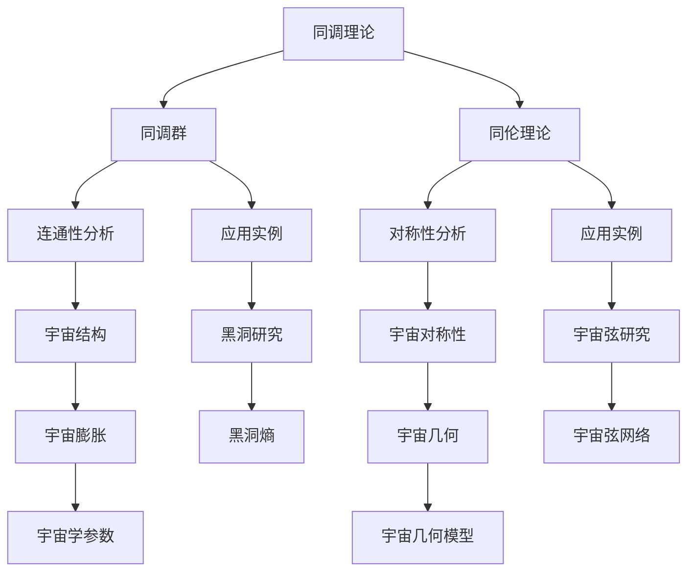

                 

### 《宇宙的数学拓扑不变量理论探讨》

> **关键词：** 宇宙、数学拓扑、不变量、同调理论、示性类、拓扑量子场论

> **摘要：** 本文探讨了宇宙的数学拓扑不变量理论，包括其基础、应用和未来发展方向。通过逐步分析数学拓扑的基本概念、同调理论、示性类和拓扑量子场论，以及其在黑洞、宇宙弦和宇宙膨胀研究中的具体应用，揭示了数学拓扑不变量在理解宇宙演化中的关键作用。

### 目录大纲

1. **宇宙的数学拓扑基础**
   1.1 宇宙的本质与数学拓扑的关系
   1.2 数学拓扑的起源与发展
   1.3 数学拓扑在宇宙研究中的应用
   2. 数学拓扑的基本概念
   2.1 拓扑空间与拓扑结构
   2.2 拓扑变换与连续性
   2.3 拓扑不变量的定义与分类
   3. 数学拓扑在宇宙学中的应用
   3.1 拓扑不变量与宇宙结构的关联
   3.2 拓扑结构在宇宙演化中的作用
   3.3 数学拓扑在宇宙学研究中的挑战与机遇

2. **数学拓扑不变量理论探讨**
   4. 同调理论在宇宙中的应用
   4.1 同调理论的基本原理
   4.2 同调群与同调群的性质
   4.3 同调理论在宇宙学研究中的具体应用
   5. 示性类与宇宙几何
   5.1 示性类的定义与计算
   5.2 示性类与宇宙几何的关系
   5.3 示性类在宇宙学研究中的应用
   6. 拓扑量子场论与宇宙
   6.1 拓扑量子场论的基本概念
   6.2 拓扑量子场论在宇宙学研究中的地位
   6.3 拓扑量子场论与宇宙学中的主要问题

3. **数学拓扑不变量理论的应用案例**
   7. 黑洞与拓扑不变量
   7.1 黑洞的基本特性
   7.2 黑洞与拓扑不变量的关系
   7.3 拓扑不变量在黑洞研究中的应用
   8. 宇宙弦与拓扑不变量
   8.1 宇宙弦的基本概念
   8.2 宇宙弦与拓扑不变量的关系
   8.3 拓扑不变量在宇宙弦研究中的应用
   9. 宇宙膨胀与拓扑不变量
   9.1 宇宙膨胀的基本原理
   9.2 宇宙膨胀与拓扑不变量的关系
   9.3 拓扑不变量在宇宙膨胀研究中的应用

4. **数学拓扑不变量理论的发展与未来**
   10. 数学拓扑不变量理论的未来展望
   10.1 数学拓扑不变量理论的现状与问题
   10.2 数学拓扑不变量理论的发展方向
   10.3 数学拓扑不变量理论在宇宙学研究中的未来贡献

### 附录

- **附录 A：数学拓扑不变量理论的 Mermaid 流程图**

- **附录 B：拓扑不变量理论伪代码示例**

- **附录 C：数学公式与详细讲解**

- **附录 D：宇宙膨胀与拓扑不变量的实际案例**

## 引言

宇宙，这个浩瀚而神秘的宇宙，一直是人类探索的终极目标。从古代哲学家到现代科学家，人们对宇宙的探索从未停止。随着科学技术的发展，人类对宇宙的认识也在不断深化。然而，宇宙的本质和演化规律仍然充满了未知和挑战。

在物理学中，数学拓扑不变量理论作为一种强有力的工具，为研究宇宙提供了新的视角和方法。拓扑不变量，作为数学拓扑学中的一个核心概念，指的是在拓扑空间变换下保持不变的性质。数学拓扑不变量理论的核心思想是，通过研究这些不变量，我们可以揭示宇宙中深层次的结构和规律。

本文将探讨宇宙的数学拓扑不变量理论，包括其基础、应用和未来发展方向。我们首先会回顾宇宙的本质与数学拓扑的关系，并介绍数学拓扑的起源和发展。随后，我们将深入探讨数学拓扑的基本概念，包括拓扑空间与拓扑结构、拓扑变换与连续性、以及拓扑不变量的定义与分类。

接着，我们将重点关注数学拓扑不变量在宇宙学中的应用，包括拓扑不变量与宇宙结构的关联、拓扑结构在宇宙演化中的作用，以及数学拓扑在宇宙学研究中的挑战与机遇。在这一部分，我们将结合实际案例，展示数学拓扑不变量在宇宙学研究中的具体应用。

随后，我们将进一步探讨数学拓扑不变量理论的深层次内容，包括同调理论在宇宙中的应用、示性类与宇宙几何的关系，以及拓扑量子场论与宇宙的关系。我们将通过详细讲解和伪代码示例，阐述这些理论的基本原理和计算方法。

最后，我们将探讨数学拓扑不变量理论的发展与未来，分析其现状与问题，并展望其发展方向以及在宇宙学研究中的未来贡献。通过本文的探讨，我们希望能够为读者提供一幅宇宙数学拓扑不变量理论的清晰图景，激发读者对这一领域的深入思考和研究。

## 宇宙的数学拓扑基础

### 第1章：宇宙与数学拓扑的起源

#### 1.1 宇宙的本质与数学拓扑的关系

宇宙，一个无限广阔的存在，其本质是复杂而多元的。从物理学的角度来看，宇宙可以被描述为一个由物质和能量组成的整体，这些物质和能量在不同的维度和尺度上相互作用和演化。宇宙的本质与数学拓扑有着深刻的联系，因为数学拓扑为描述宇宙的结构和演化提供了强有力的工具。

数学拓扑，作为研究空间性质和结构的数学分支，其核心在于研究那些在连续变换下保持不变的性质。这些不变性质，如连通性、紧致性、边界等，不仅在几何学中具有基础性地位，而且在宇宙学中也发挥着关键作用。

在宇宙学中，数学拓扑不变量被广泛应用于描述宇宙的结构和演化。例如，同调理论可以用来研究宇宙中的对称性和连通性，而示性类可以用来描述宇宙中的几何性质。此外，拓扑量子场论作为一种统一的描述物理现象的理论框架，也为理解宇宙的量子行为提供了新的视角。

#### 1.2 数学拓扑的起源与发展

数学拓扑的发展可以追溯到19世纪末期，当时数学家开始关注如何描述和分类不同的几何形状。最初的拓扑学研究主要是关于曲面和图的性质，这些研究为后来的发展奠定了基础。

19世纪末到20世纪初，数学家彭加勒和康托尔的工作为拓扑学奠定了坚实的基础。彭加勒通过对曲面和拓扑不变量的研究，提出了著名的彭加勒猜想，而康托尔则通过集合论的研究，为拓扑空间的概念提供了数学基础。

20世纪中叶，数学拓扑学迎来了快速发展。随着同调理论和示性类等概念的提出，拓扑学研究逐渐从二维空间拓展到更高维度的空间。特别是随着拓扑量子场论的兴起，数学拓扑与物理学结合，形成了现代拓扑学的一个重要分支。

在数学拓扑的发展历程中，许多重要的理论和方法被提出，如同伦理论、同调理论、示性类理论等。这些理论和方法不仅在数学领域有着广泛的应用，也在物理学、计算机科学、生物学等领域产生了深远的影响。

#### 1.3 数学拓扑在宇宙研究中的应用

数学拓扑在宇宙研究中的应用十分广泛，主要体现在以下几个方面：

1. **宇宙结构的描述：** 数学拓扑不变量为描述宇宙的结构提供了有力的工具。例如，同调理论可以用来研究宇宙中的对称性和连通性，而示性类可以用来描述宇宙中的几何性质。这些不变量不仅有助于我们理解宇宙的基本结构，还可以帮助揭示宇宙的演化规律。

2. **宇宙演化的模拟：** 数学拓扑理论可以用于模拟宇宙的演化过程。例如，通过研究同调群的演变，我们可以了解宇宙从早期混沌状态向现代结构演化的过程。这些模拟有助于我们预测宇宙的未来发展，并帮助我们更好地理解宇宙的复杂性。

3. **黑洞和宇宙弦的研究：** 黑洞和宇宙弦是宇宙中极为复杂的结构，它们的性质和演化规律一直是物理学研究的热点。数学拓扑不变量提供了研究这些结构的有效方法。例如，通过研究黑洞的拓扑不变量，我们可以了解黑洞的熵和相变，从而揭示黑洞的本质。

4. **宇宙膨胀的研究：** 宇宙膨胀是现代宇宙学的一个核心问题。数学拓扑不变量可以用于研究宇宙膨胀的机制和规律。例如，通过研究拓扑不变量在宇宙膨胀过程中的变化，我们可以了解宇宙膨胀的加速和减速过程。

总之，数学拓扑不变量理论为宇宙研究提供了新的视角和方法。通过这一理论，我们可以更深入地理解宇宙的结构和演化，揭示宇宙中的深层次规律。在未来的宇宙学研究中，数学拓扑不变量理论将继续发挥重要作用。

### 第2章：数学拓扑的基本概念

#### 2.1 拓扑空间与拓扑结构

拓扑空间是数学拓扑学中的基础概念。一个拓扑空间是由一个集合和一组拓扑关系构成的。通常，我们用\( X \) 表示一个集合，而\( \tau \) 表示这个集合上的拓扑结构。拓扑关系指的是在集合中的元素之间定义的邻域关系。

在拓扑空间中，邻域是指包含一个给定点的所有点的集合。一个集合上的拓扑结构决定了哪些集合是开集，哪些集合是闭集。开集是指包含在某个邻域内的集合，而闭集是指其补集为开集的集合。

拓扑结构的重要性质包括连通性、紧致性和边界。连通性指的是一个空间中任意两点之间都存在路径相连。紧致性则是指一个集合的所有无限子集都存在一个极限点。边界是指一个集合与其补集的交集。

#### 2.2 拓扑变换与连续性

拓扑变换是指保持拓扑结构的变换。在拓扑空间中，一个映射\( f: X \rightarrow Y \)被称为连续映射，当且仅当对于任意开集\( U \)在\( Y \)中，其原像\( f^{-1}(U) \)在\( X \)中也是开集。

连续性是拓扑空间中一个核心概念。一个连续函数可以被视为在拓扑上的“平滑”变换。拓扑变换的连续性保证了在变换过程中拓扑不变量的保持，这对于研究拓扑空间的性质至关重要。

#### 2.3 拓扑不变量的定义与分类

拓扑不变量是在不同拓扑变换下保持不变的性质。这些不变量为我们提供了研究拓扑空间性质的工具。常见的拓扑不变量包括：

1. **连通性不变量：** 这类不变量描述了空间的连通性，例如欧拉数、连通度等。

2. **紧致性不变量：** 描述了空间的紧致性，如勒贝格测度。

3. **边界不变量：** 如维数、边界维数等，用于描述空间的边界特性。

4. **对称性不变量：** 如旋转对称、反射对称等，这些不变量描述了空间的对称性。

5. **同调不变量：** 如同调群，描述了空间的连通性和结构。

6. **示性类不变量：** 如庞加莱示性类，用于描述空间的几何性质。

7. **拉普拉斯不变量：** 如拉普拉斯算子的特征值，用于研究空间的几何结构。

拓扑不变量在不同的研究领域有着不同的应用。例如，同调不变量在物理学中用于描述宇宙中的对称性和结构，而示性类不变量在几何学中用于分类和比较不同的几何形状。

#### 拓扑不变量在宇宙学中的应用

在宇宙学中，拓扑不变量为研究宇宙的结构和演化提供了重要的工具。以下是一些具体的例子：

1. **同调不变量与宇宙结构的关联：** 同调不变量可以用来研究宇宙中的对称性和连通性。例如，通过研究同调群，我们可以了解宇宙从早期混沌状态向现代结构演化的过程。

2. **示性类与宇宙几何：** 示性类不变量可以用来描述宇宙的几何性质。例如，庞加莱示性类可以用于研究宇宙中的拓扑缺陷和复杂结构。

3. **拓扑量子场论与宇宙：** 拓扑量子场论是一种描述物理现象的理论框架，其核心在于研究不变量。在宇宙学中，拓扑量子场论被用来研究宇宙中的量子行为和演化规律。

通过这些不变量，我们可以更深入地理解宇宙的结构和演化，揭示宇宙中的深层次规律。拓扑不变量不仅为我们提供了新的研究方法，也为宇宙学的发展带来了新的可能性。

### 第3章：数学拓扑在宇宙学中的应用

#### 3.1 拓扑不变量与宇宙结构的关联

数学拓扑不变量在宇宙学中的应用主要表现为通过这些不变量揭示宇宙的结构特性。同调理论、示性类和拓扑量子场论等工具为我们提供了研究宇宙结构的有力手段。

**同调理论**在宇宙学中的应用主要体现在研究宇宙中的对称性和连通性。同调不变量（如同调群）可以用来描述宇宙从早期混沌状态到现代结构的演化过程。通过研究同调群，我们可以了解宇宙中的连通域、孔洞和膜等结构，揭示它们在不同尺度上的分布和相互作用。

同调不变量在宇宙学中的具体应用包括：

- **宇宙大尺度结构：** 同调理论被用来研究宇宙大尺度结构中的连通性和对称性。例如，通过研究宇宙微波背景辐射中的同调特征，我们可以了解宇宙早期结构的演化。
  
- **宇宙膜理论：** 在宇宙膜理论中，同调不变量被用来描述不同维度之间的相互作用。膜之间的连通性和对称性可以通过同调群来研究，帮助我们理解宇宙的多维度特性。

**示性类**在宇宙学中的应用主要体现在描述宇宙的几何性质。示性类（如庞加莱示性类）是一种用于分类和比较不同几何形状的拓扑不变量。在宇宙学中，示性类可以用来研究宇宙中的拓扑缺陷和复杂结构。

示性类在宇宙学中的具体应用包括：

- **宇宙弦和黑洞：** 示性类可以用来研究宇宙弦和黑洞的几何性质。通过计算示性类，我们可以了解这些结构的拓扑特性，从而更好地理解它们的物理行为。

- **宇宙几何：** 在研究宇宙几何时，示性类可以帮助我们分类不同的几何模型，并研究它们在宇宙膨胀中的作用。例如，通过研究庞加莱示性类，我们可以了解宇宙中的闭合和开放几何模型。

**拓扑量子场论**是一种将拓扑不变量与量子场论结合起来的理论框架。在宇宙学中，拓扑量子场论被用来研究宇宙中的量子行为和演化规律。

拓扑量子场论在宇宙学中的具体应用包括：

- **量子宇宙学：** 拓扑量子场论为量子宇宙学提供了一个统一的理论框架。通过研究拓扑量子场论，我们可以了解宇宙早期状态下的量子涨落和宇宙的初始条件。

- **宇宙相变：** 在宇宙学中，拓扑量子场论被用来研究宇宙相变和临界点。通过研究拓扑不变量，我们可以了解宇宙在不同相变过程中的行为和特征。

#### 3.2 拓扑结构在宇宙演化中的作用

拓扑结构在宇宙演化中起着关键作用。不同的拓扑结构决定了宇宙中物质和能量的分布，进而影响宇宙的演化过程。

**宇宙早期结构：** 在宇宙早期，物质和能量主要以等离子态存在。此时，宇宙的拓扑结构主要由同调不变量描述。通过研究同调群，我们可以了解宇宙早期结构的连通性和对称性，从而揭示宇宙从混沌状态向有序结构演化的过程。

**宇宙晚期结构：** 在宇宙晚期，物质和能量主要分布在星系、星团和超星团中。此时，宇宙的拓扑结构主要由示性类描述。通过研究示性类，我们可以了解宇宙晚期结构的几何性质，从而揭示宇宙中复杂结构和拓扑缺陷的形成过程。

**宇宙膨胀：** 宇宙膨胀是宇宙演化中的一个重要现象。拓扑结构在宇宙膨胀中起着关键作用。通过研究拓扑不变量，我们可以了解宇宙膨胀的加速和减速过程，从而揭示宇宙膨胀的机制和规律。

**宇宙相变：** 在宇宙学中，相变是宇宙演化中的一个重要过程。拓扑结构在宇宙相变中起着关键作用。通过研究拓扑不变量，我们可以了解宇宙在不同相变过程中的行为和特征，从而揭示宇宙相变的物理机制。

总之，拓扑结构在宇宙演化中起着关键作用。通过研究拓扑不变量，我们可以深入了解宇宙的结构和演化过程，揭示宇宙中的深层次规律。

#### 3.3 数学拓扑在宇宙学研究中的挑战与机遇

数学拓扑在宇宙学研究中面临许多挑战和机遇。这些挑战包括：

**复杂性与多样性：** 宇宙是一个极其复杂和多样化的系统，其结构和演化过程涉及到多种不同尺度和层次的物理现象。这使得数学拓扑在描述和研究宇宙时面临巨大的复杂性。如何将拓扑不变量应用于描述和解释宇宙的多样性，是一个重要的挑战。

**数据与计算：** 宇宙学研究需要大量的观测数据和高性能计算。拓扑不变量的计算往往涉及到复杂的数学运算和数据处理。如何有效地处理这些数据，并利用高性能计算资源，是拓扑在宇宙学研究中面临的另一个挑战。

**理论框架的整合：** 数学拓扑在宇宙学中的应用需要与现有的宇宙学理论框架相结合。例如，如何将拓扑不变量整合到广义相对论和量子场论中，是一个重要的研究课题。

然而，数学拓扑在宇宙学研究中也带来了许多机遇：

**新的视角：** 数学拓扑提供了一种新的研究视角，可以帮助我们更好地理解宇宙的结构和演化。通过拓扑不变量，我们可以从新的角度揭示宇宙中的深层次规律。

**理论突破：** 数学拓扑在宇宙学中的应用有望推动理论物理学的突破。例如，通过研究拓扑量子场论，我们可能能够揭示宇宙早期状态下的物理规律，从而推动宇宙学的发展。

**跨学科合作：** 数学拓扑在宇宙学中的应用需要跨学科的合作。物理学家、数学家、天文学家等不同领域的专家可以通过合作，共同研究拓扑不变量在宇宙学中的应用，从而推动科学的发展。

总之，数学拓扑在宇宙学研究中既面临挑战，也充满机遇。通过不断探索和创新，我们有理由相信，数学拓扑将在宇宙学中发挥越来越重要的作用。

### 第4章：同调理论在宇宙中的应用

#### 4.1 同调理论的基本原理

同调理论是数学拓扑学中的一个核心概念，它用于研究空间中的连通性和结构。同调群（Homology Groups）是同调理论中的核心对象，它们通过计算空间的不同“洞”的数量和性质来描述空间的拓扑结构。

**同调群的定义：**
设\( X \)是一个拓扑空间，\( \mathcal{P}(X) \)是\( X \)的所有有限部分（即\( X \)的有限子集的并集）构成的集合。\( \mathcal{P}(X) \)在包含关系下是一个偏序集，称为\( X \)的幂集。给定一个序列

$$
\cdots \rightarrow A_2 \rightarrow A_1 \rightarrow A_0
$$

其中\( A_i \)是\( X \)的部分，如果\( A_i \)是\( A_{i-1} \)的闭包，则称为闭序列；如果\( A_i \)是\( A_{i-1} \)的开子集，则称为开序列。闭序列和开序列都可以扩展为序列：

$$
\cdots \rightarrow A_2 \rightarrow A_1 \rightarrow A_0 \rightarrow \emptyset
$$

定义一个映射

$$
\partial_n: \mathcal{P}(X)^n \rightarrow \mathcal{P}(X)^{n+1}
$$

使得对于任意开序列\( \{ A_0, A_1, \ldots, A_n \} \)，有

$$
\partial_n(A_0, A_1, \ldots, A_n) = (-A_0, A_0 \cup A_1, A_1 \cup A_2, \ldots, A_{n-1} \cup A_n, A_n)
$$

\( \partial_n \)被称为边界算子。同调群\( H_n(X) \)定义为\( \mathcal{P}(X) \)的\( n \)个部分在\( \partial_n \)下的自由模：

$$
H_n(X) = \frac{\mathcal{P}(X)^n / \text{ker}(\partial_n)}{\text{Im}(\partial_{n+1})}
$$

其中，\( \text{ker}(\partial_n) \)是\( \partial_n \)的核，\( \text{Im}(\partial_{n+1}) \)是\( \partial_{n+1} \)的像。

**同调群的性质：**
同调群具有许多重要性质，包括：

- **交换性：** \( H_n(X) \)是一个阿贝尔群。
- **分类不变性：** 同调群与空间的同胚类无关。
- **上同调性与下同调性：** 同调群与上同调群（cohomology groups）之间存在交换关系。

#### 4.2 同调群与同调群的性质

同调群是研究拓扑空间连通性的一种重要工具。以下是一些关于同调群的重要性质：

- **自由阿贝尔群：** 同调群\( H_n(X) \)是一个自由阿贝尔群，这意味着它可以被表示为有限多个生成元的直和。
- **边界映射：** 同调群与边界映射之间存在精确序列关系。具体来说，存在一个精确序列：

$$
0 \rightarrow H_n(X) \xrightarrow{\partial_n} H_{n-1}(X) \rightarrow \cdots \rightarrow H_1(X) \xrightarrow{\partial_1} H_0(X) \rightarrow 0
$$

其中，\( \partial_n \)是边界映射，它将\( H_n(X) \)中的元素映射到\( H_{n-1}(X) \)中。
- **连通性与同调数：** 同调数（或同调指数）是同调群的秩，它反映了空间的连通性。例如，一个连通空间的所有非零同调群都是零，而一个带有\( n \)个连通分支的空间有\( H_0(X) = \mathbb{Z}^n \)。
- **同调群的基变换：** 同调群的基变换可以通过改变部分序列中的部分来实现。这些变换保持同调群的同构性质，从而允许我们通过不同的部分序列来研究同调群。

#### 4.3 同调理论在宇宙学研究中的具体应用

同调理论在宇宙学中有着广泛的应用，尤其在研究宇宙中的连通性和结构方面。以下是一些同调理论在宇宙学中的具体应用：

- **宇宙大尺度结构：** 同调理论可以用来研究宇宙中的大尺度结构，如星系团和超星系团。通过计算同调群，我们可以了解宇宙中的连通域、孔洞和膜等结构，揭示它们在不同尺度上的分布和相互作用。例如，宇宙微波背景辐射中的同调特征可以帮助我们了解宇宙早期的结构。
- **宇宙膜理论：** 在宇宙膜理论中，同调理论被用来描述不同维度之间的相互作用。膜之间的连通性和对称性可以通过同调群来研究，帮助我们理解宇宙的多维度特性。例如，通过研究同调群，我们可以了解膜宇宙中的拓扑缺陷和复杂结构。
- **宇宙弦和黑洞：** 同调理论可以用来研究宇宙弦和黑洞的几何性质。通过计算同调群，我们可以了解这些结构的拓扑特性，从而更好地理解它们的物理行为。例如，通过研究同调群，我们可以了解宇宙弦的拓扑结构和黑洞的熵。
- **宇宙膨胀：** 同调理论可以用来研究宇宙膨胀的机制和规律。通过研究同调群的演变，我们可以了解宇宙从早期混沌状态向现代结构演化的过程。例如，通过研究同调群，我们可以了解宇宙膨胀的加速和减速过程。

总之，同调理论为宇宙学研究提供了重要的工具，帮助我们更好地理解宇宙的结构和演化。通过同调群的分析，我们可以揭示宇宙中的深层次规律，从而推动宇宙学的发展。

### 第5章：示性类与宇宙几何

#### 5.1 示性类的定义与计算

示性类是数学拓扑学中用于描述空间几何性质的拓扑不变量。在数学中，示性类最早由庞加莱提出，用于研究三维空间的几何性质。示性类的概念后来被推广到更高维度的拓扑空间，并在物理学和宇宙学中得到了广泛应用。

**定义：** 设\( X \)是一个连通、紧致的拓扑空间，其第\( k \)个示性类，记为\( \chi_k(X) \)，是通过以下公式定义的：

$$
\chi_k(X) = \frac{1}{(2\pi i)^k} \int_X \omega^k \text{Vol}(X)
$$

其中，\( \omega \)是一个闭\( k \)形式，\( \text{Vol}(X) \)是\( X \)的体积元素。积分是在\( X \)上对\( \omega \)进行的。

**计算：** 示性类的计算通常涉及到对拓扑空间的分片和适当的参数化。以下是一个基本的计算示例：

假设我们有一个简单的三维球面\( S^3 \)，其示性类的计算可以如下进行：

1. **选择一个适当的参数化：** 对\( S^3 \)进行参数化，例如使用球坐标。
2. **计算积分：** 选择一个闭\( 3 \)形式\( \omega \)，例如\( \omega = x \, dy \wedge dz + y \, dz \wedge dx + z \, dx \wedge dy \)。计算\( \omega^3 \)在\( S^3 \)上的积分，利用参数化的结果，我们可以得到：

$$
\chi_3(S^3) = \frac{1}{(2\pi i)^3} \int_{S^3} (x \, dy \wedge dz + y \, dz \wedge dx + z \, dx \wedge dy)^3
$$

3. **简化积分：** 通过对称性和积分的线性性质，我们可以简化这个积分。最终结果为：

$$
\chi_3(S^3) = 1
$$

这个结果反映了\( S^3 \)的几何性质，即其具有三维的几何结构。

#### 5.2 示性类与宇宙几何的关系

示性类在宇宙几何中的应用主要体现在描述宇宙的空间结构和拓扑性质。以下是一些关于示性类与宇宙几何关系的具体应用：

**宇宙弦和黑洞：** 在宇宙学中，宇宙弦和黑洞被认为是高度非平凡的拓扑结构。通过计算这些结构的示性类，我们可以了解它们的几何性质。例如，宇宙弦的示性类可以帮助我们了解它们的拓扑结构和稳定性，而黑洞的示性类则可以揭示它们的熵和相变行为。

**宇宙几何模型：** 在研究宇宙几何时，示性类可以用来分类和比较不同的几何模型。例如，通过计算不同宇宙几何模型的示性类，我们可以了解它们在宇宙膨胀中的作用。例如，闭合宇宙和开放宇宙的示性类在描述宇宙几何时具有显著差异，这反映了它们在膨胀过程中的不同行为。

**宇宙拓扑缺陷：** 在宇宙学中，拓扑缺陷如宇宙弦、膜和孔洞被认为是宇宙结构的组成部分。通过研究这些缺陷的示性类，我们可以了解它们的几何性质和演化规律。例如，宇宙弦的示性类可以揭示它们的拓扑结构和相互之间的相互作用，从而帮助我们理解宇宙弦网络的演化。

#### 5.3 示性类在宇宙学研究中的应用

示性类在宇宙学中的应用主要体现在以下几个方面：

**宇宙微波背景辐射：** 宇宙微波背景辐射（Cosmic Microwave Background, CMB）是宇宙早期状态的重要遗迹。通过分析CMB的数据，我们可以了解宇宙早期的结构和拓扑性质。示性类在CMB数据分析中可以用来揭示宇宙中的连通性和对称性。例如，通过计算CMB图上的同调特征，我们可以了解宇宙早期的结构演化过程。

**宇宙膜理论：** 在宇宙膜理论中，示性类被用来描述不同维度之间的相互作用。膜之间的连通性和对称性可以通过同调群和示性类来研究，从而帮助我们理解宇宙的多维度特性。例如，通过研究不同膜宇宙的示性类，我们可以了解不同维度之间的相互作用和拓扑结构的演化。

**宇宙膨胀模型：** 在研究宇宙膨胀模型时，示性类可以用来分类和比较不同的膨胀模型。例如，通过计算不同膨胀模型的示性类，我们可以了解它们在宇宙膨胀中的作用。例如，闭合宇宙和开放宇宙的示性类在描述宇宙膨胀时具有显著差异，这反映了它们在膨胀过程中的不同行为。

**宇宙弦网络：** 在宇宙弦网络的研究中，示性类被用来描述宇宙弦的拓扑结构和相互之间的相互作用。通过计算宇宙弦网络的示性类，我们可以了解宇宙弦网络的稳定性、拓扑结构和演化规律。

总之，示性类在宇宙学中具有广泛的应用。通过研究示性类，我们可以更深入地理解宇宙的结构和演化，揭示宇宙中的深层次规律。示性类不仅为宇宙学研究提供了重要的工具，也为探索宇宙的奥秘提供了新的视角。

### 第6章：拓扑量子场论与宇宙

#### 6.1 拓扑量子场论的基本概念

拓扑量子场论（Topological Quantum Field Theory, TQFT）是一种研究物理系统的理论框架，其核心在于利用拓扑不变量来描述量子场的行为。TQFT最早由迈克尔·阿蒂亚和埃米里奥·塞格雷等人提出，并在20世纪80年代得到了广泛应用。

**定义：** 拓扑量子场论是一种量子场论，它不依赖于空间坐标的取值，而是依赖于空间的拓扑结构。TQFT的主要特点是：

- **不变性：** TQFT的物理量（如场的期望值）仅依赖于空间的拓扑不变量，而与坐标选择无关。
- **分类：** TQFT可以根据其描述的空间拓扑结构进行分类，不同的TQFT对应于不同的拓扑空间。
- **量子化：** TQFT通过量子化过程将拓扑空间上的连续变换转化为离散的量子态。

**基本原理：** TQFT的基本原理可以概括为以下几点：

- **场的量子态：** 在TQFT中，场被量子化，其量子态由拓扑空间上的线密子（line operators）组成。这些线密子通过拓扑不变量来描述。
- **路径积分：** TQFT通过路径积分来计算物理量。路径积分中的积分路径是拓扑空间上的线段，其权重由拓扑不变量决定。
- **同调性：** TQFT的物理量与同调不变量密切相关。同调群和同调代数是TQFT中的重要概念。

#### 6.2 拓扑量子场论在宇宙学研究中的地位

拓扑量子场论在宇宙学研究中具有独特而重要的地位。它为理解宇宙的结构、演化和量子性质提供了新的视角和方法。以下是拓扑量子场论在宇宙学研究中的一些关键地位：

**描述宇宙结构：** 拓扑量子场论可以用于描述宇宙的结构，特别是宇宙中的拓扑缺陷和复杂结构。通过研究同调不变量，我们可以了解宇宙中的连通性、对称性和几何性质。例如，通过研究宇宙弦网络的拓扑结构，我们可以了解宇宙弦的相互作用和宇宙的演化。

**研究宇宙量子行为：** 拓扑量子场论在研究宇宙的量子行为方面具有重要意义。宇宙早期状态下的量子涨落和量子引力效应可以通过TQFT来描述。例如，通过研究TQFT中的量子态和路径积分，我们可以了解宇宙早期量子态的演化过程。

**理解宇宙相变：** 宇宙学中的相变过程，如宇宙膨胀和宇宙弦的形成，可以通过拓扑量子场论来描述。TQFT中的相变通常表现为同调群的跃迁，这为我们提供了研究宇宙相变的新的方法。

**探索多维度宇宙：** 在宇宙学中，多维度宇宙是一个重要研究方向。拓扑量子场论为研究多维度宇宙提供了强有力的工具。通过研究不同维度之间的相互作用，我们可以了解多维度宇宙的几何性质和物理规律。

#### 6.3 拓扑量子场论与宇宙学中的主要问题

尽管拓扑量子场论在宇宙学研究中具有巨大的潜力，但在实际应用中仍然面临许多挑战和问题：

**复杂性：** 拓扑量子场论的复杂性是其主要挑战之一。在TQFT中，物理量的计算通常涉及到复杂的路径积分和同调不变量。这需要高度数学化的工具和方法，以及强大的计算资源。

**验证与观测：** 拓扑量子场论在宇宙学中的应用需要通过观测数据来验证。然而，宇宙学观测数据的精度和可靠性仍然有限。如何从观测数据中提取TQFT的物理信号，仍然是一个重要的研究课题。

**理论与实验：** 拓扑量子场论的理论框架和实验验证之间存在一定的差距。如何将TQFT的理论与实际观测数据相结合，需要跨学科的合作和新的实验技术。

**统一理论：** 在宇宙学中，寻找一个统一的描述宇宙演化和量子行为的理论是一个长期目标。拓扑量子场论在统一理论中的地位和作用仍然需要进一步研究。

总之，拓扑量子场论在宇宙学研究中具有巨大的潜力和挑战。通过不断的研究和探索，我们有理由相信，拓扑量子场论将在宇宙学中发挥越来越重要的作用，帮助我们更好地理解宇宙的本质和演化。

### 第7章：黑洞与拓扑不变量

#### 7.1 黑洞的基本特性

黑洞是宇宙中最神秘和奇特的天体之一。它的基本特性包括以下几个方面：

**质量：** 黑洞的质量是其最重要的特性之一，它决定了黑洞的引力强度。黑洞的质量通常用太阳质量（\( M_{\odot} \)）来表示，其中\( 1 M_{\odot} \)大约等于\( 1.989 \times 10^{30} \)千克。

**事件视界：** 事件视界是黑洞的一个关键特性，它是黑洞内部事件影响外部区域的最远边界。任何进入事件视界的物质或信息都无法逃脱黑洞的引力束缚，因此事件视界也被认为是黑洞的“边界”。

**奇点：** 黑洞的中心存在一个称为奇点的点，在这里物理定律失效，时空曲率达到无穷大。奇点是黑洞最神秘和未解的部分，目前对它的理解仍然有限。

**霍金辐射：** 根据量子引力理论，黑洞会以霍金辐射的形式逐渐蒸发消失。这种辐射是由于黑洞吸收和辐射粒子的量子效应导致的。

**引力透镜效应：** 黑洞通过其强大的引力场可以弯曲光线的路径，从而产生引力透镜效应。这种效应可以通过观测光线的偏折和多重像来探测黑洞的存在。

#### 7.2 黑洞与拓扑不变量的关系

黑洞与拓扑不变量之间存在深刻的内在联系。拓扑不变量在描述黑洞的几何特性和物理行为方面发挥了重要作用：

**同调不变量：** 同调不变量可以用来描述黑洞的几何结构，特别是黑洞的对称性和连通性。例如，通过计算黑洞的同调群，我们可以了解黑洞的拓扑性质，从而揭示黑洞的几何形态。

**示性类：** 示性类是描述空间几何性质的重要拓扑不变量。在黑洞的研究中，示性类可以用来描述黑洞的几何结构和拓扑缺陷。例如，通过计算黑洞的庞加莱示性类，我们可以了解黑洞的拓扑结构和几何形态。

**边界不变量：** 边界不变量如欧拉数和连通度可以用来描述黑洞的边界特性。例如，黑洞的欧拉数可以反映其拓扑结构，从而揭示黑洞的几何形态。

**同伦不变量：** 同伦不变量可以用来描述黑洞的对称性和连通性。通过计算黑洞的同伦群，我们可以了解黑洞的几何结构和对称性，从而更好地理解黑洞的性质。

#### 7.3 拓扑不变量在黑洞研究中的应用

拓扑不变量在黑洞研究中有着广泛的应用，以下是几个具体的例子：

**黑洞熵与拓扑不变量：** 根据黑洞热力学，黑洞的熵与其事件视界的面积成正比。通过研究黑洞的拓扑不变量，如同调不变量和示性类，我们可以了解黑洞熵的几何起源。例如，霍金辐射中的熵可以通过计算黑洞的庞加莱示性类来理解。

**黑洞分类：** 通过研究黑洞的拓扑不变量，我们可以对黑洞进行分类。例如，根据黑洞的同调群和示性类，我们可以将黑洞分为不同类型，从而揭示黑洞的几何性质和物理行为。

**黑洞演化：** 拓扑不变量可以用来研究黑洞的演化过程。例如，通过计算黑洞的同调群和示性类，我们可以了解黑洞在演化过程中的几何变化和拓扑缺陷。

**黑洞碰撞与合并：** 在研究黑洞碰撞和合并的过程中，拓扑不变量可以用来描述碰撞后黑洞的几何形态和拓扑结构。通过分析碰撞前后的拓扑不变量，我们可以了解黑洞碰撞的物理机制和结果。

总之，拓扑不变量在黑洞研究中具有重要的应用价值。通过研究这些不变量，我们可以更深入地理解黑洞的几何特性、物理行为和演化规律，从而推动黑洞物理学的进展。

### 第8章：宇宙弦与拓扑不变量

#### 8.1 宇宙弦的基本概念

宇宙弦（Cosmic String）是理论物理学中提出的一种特殊类型的天体，它是由于宇宙早期高温高密度状态下产生的，并保持至今的一种不稳定结构。宇宙弦的基本概念包括：

**定义：** 宇宙弦是一条在空间中延伸的线性结构，其厚度非常小，但质量非常大。宇宙弦由于其强大的引力作用，可以在宇宙中产生显著的效应。

**起源：** 根据宇宙学理论，宇宙弦起源于宇宙早期的大爆炸之后，在宇宙温度和密度极高的状态下，宇宙中的物质形成了不稳定的涡旋和结点，最终形成了宇宙弦。

**特性：** 宇宙弦具有以下特性：

- **线性结构：** 宇宙弦在空间中延伸，具有一维的线性结构。
- **高度引力：** 宇宙弦具有强大的引力场，足以对周围的物质产生显著的影响。
- **稳定性问题：** 由于宇宙弦具有不稳定性，它们会通过引力相互作用形成复杂的结构，如宇宙弦网络。

#### 8.2 宇宙弦与拓扑不变量的关系

宇宙弦与拓扑不变量之间存在着紧密的联系。拓扑不变量是数学拓扑学中的核心概念，用于描述空间的结构和性质。在宇宙弦的研究中，拓扑不变量被用来描述宇宙弦的几何特性和物理行为：

**同调不变量：** 同调不变量可以用来描述宇宙弦的连通性和对称性。例如，通过计算宇宙弦的同调群，我们可以了解宇宙弦的拓扑结构，揭示宇宙弦网络中的连通性和分支结构。

**示性类：** 示性类是描述空间几何性质的拓扑不变量。在宇宙弦的研究中，示性类被用来描述宇宙弦的几何形态和拓扑缺陷。例如，通过计算宇宙弦的庞加莱示性类，我们可以了解宇宙弦的拓扑结构和几何形态。

**边界不变量：** 边界不变量，如欧拉数和连通度，可以用来描述宇宙弦的边界特性。例如，宇宙弦的欧拉数可以反映其拓扑结构，从而揭示宇宙弦的几何形态。

**同伦不变量：** 同伦不变量可以用来描述宇宙弦的对称性和连通性。通过计算宇宙弦的同伦群，我们可以了解宇宙弦的几何结构和对称性，从而更好地理解宇宙弦的性质。

#### 8.3 拓扑不变量在宇宙弦研究中的应用

拓扑不变量在宇宙弦研究中具有广泛的应用，以下是几个具体的例子：

**宇宙弦网络的形成：** 通过研究同调不变量，我们可以了解宇宙弦网络的形成过程。同调群可以帮助我们揭示宇宙弦之间的相互作用和连接方式，从而了解宇宙弦网络的结构和演化。

**宇宙弦的碰撞与合并：** 在研究宇宙弦的碰撞和合并过程中，拓扑不变量可以用来描述碰撞后宇宙弦的几何形态和拓扑结构。通过分析碰撞前后的拓扑不变量，我们可以了解宇宙弦碰撞的物理机制和结果。

**宇宙弦的观测：** 通过计算宇宙弦的示性类，我们可以从观测数据中识别宇宙弦的拓扑特征。例如，庞加莱示性类可以帮助我们区分不同类型的宇宙弦，从而提高宇宙弦观测的准确性。

**宇宙弦的物理效应：** 拓扑不变量可以用来研究宇宙弦对周围环境的物理效应。例如，通过计算宇宙弦的欧拉数，我们可以了解宇宙弦对引力波的影响，从而揭示宇宙弦在宇宙演化中的重要作用。

总之，拓扑不变量在宇宙弦研究中具有重要的应用价值。通过研究这些不变量，我们可以更深入地理解宇宙弦的几何特性、物理行为和演化规律，从而推动宇宙弦物理学的发展。

### 第9章：宇宙膨胀与拓扑不变量

#### 9.1 宇宙膨胀的基本原理

宇宙膨胀是现代宇宙学的一个核心概念，描述了宇宙从一个初始的极小、极高密度状态开始，逐渐扩展到如今广阔和稀薄的状态。宇宙膨胀的基本原理主要包括以下几个方面：

**宇宙微波背景辐射（CMB）：** 宇宙微波背景辐射是宇宙早期状态的重要遗迹，它揭示了宇宙在大爆炸后约38万年的状态。CMB的温度均匀性反映了宇宙早期的密度波动，这些波动是宇宙膨胀的种子。

**宇宙背景辐射的温度：** 宇宙微波背景辐射的温度约为2.725开尔文，这个温度值提供了一个关键的信息，即宇宙在大爆炸后已经经历了大量的膨胀。

**膨胀速度与距离的关系：** 根据哈勃定律，宇宙的膨胀速度与星系之间的距离成正比。这意味着越远的星系，其退行速度越快，这表明宇宙的膨胀在加速。

**宇宙学参数：** 宇宙膨胀的机制和演化过程受到多种宇宙学参数的影响，如暗物质、暗能量和宇宙的形状。这些参数决定了宇宙的膨胀历史和未来演化。

#### 9.2 宇宙膨胀与拓扑不变量的关系

宇宙膨胀与拓扑不变量之间存在着深刻的内在联系。拓扑不变量是数学拓扑学中的核心概念，用于描述空间的结构和性质。在宇宙学中，拓扑不变量被用来描述宇宙膨胀的几何特性和演化规律：

**同调不变量：** 同调不变量可以用来描述宇宙的连通性和对称性。在宇宙膨胀过程中，同调不变量可以揭示宇宙中不同尺度结构的变化，如星系团和超星系团的形成。

**示性类：** 示性类是描述空间几何性质的重要拓扑不变量。在宇宙膨胀研究中，示性类被用来描述宇宙的几何形态和拓扑缺陷。例如，通过计算宇宙的庞加莱示性类，我们可以了解宇宙中的拓扑结构和几何演化。

**边界不变量：** 边界不变量，如欧拉数和连通度，可以用来描述宇宙膨胀的边界特性。例如，宇宙的欧拉数可以反映其拓扑结构，从而揭示宇宙膨胀的几何形态。

**同伦不变量：** 同伦不变量可以用来描述宇宙的对称性和连通性。通过计算宇宙的同伦群，我们可以了解宇宙的几何结构和对称性，从而更好地理解宇宙膨胀的演化规律。

#### 9.3 拓扑不变量在宇宙膨胀研究中的应用

拓扑不变量在宇宙膨胀研究中具有广泛的应用，以下是几个具体的例子：

**宇宙微波背景辐射分析：** 通过分析宇宙微波背景辐射的数据，我们可以利用同调不变量和示性类来揭示宇宙早期的结构演化过程。例如，通过计算同调群，我们可以了解宇宙从早期混沌状态向现代结构演化的过程。

**宇宙大尺度结构：** 在研究宇宙大尺度结构时，拓扑不变量可以帮助我们理解星系团和超星系团的形成和演化。例如，通过计算同调群和示性类，我们可以了解宇宙中的连通域和孔洞结构。

**宇宙弦网络：** 拓扑不变量可以用来研究宇宙弦网络的几何结构和演化。通过计算同调不变量和示性类，我们可以了解宇宙弦网络的拓扑性质和相互作用。

**宇宙膨胀的加速：** 在研究宇宙膨胀的加速过程中，拓扑不变量可以提供关于宇宙几何演化的关键信息。例如，通过分析示性类的变化，我们可以了解宇宙膨胀的加速机制。

总之，拓扑不变量在宇宙膨胀研究中具有重要的应用价值。通过研究这些不变量，我们可以更深入地理解宇宙膨胀的几何特性、演化规律和物理机制，从而推动宇宙学的发展。

### 第10章：数学拓扑不变量理论的未来展望

#### 10.1 数学拓扑不变量理论的现状与问题

数学拓扑不变量理论在宇宙学研究中已经取得了显著的进展，但仍然存在一些亟待解决的问题和挑战：

**理论整合：** 目前，数学拓扑不变量理论在宇宙学中的应用仍较为分散，缺乏统一的理论框架。如何将不同类型的拓扑不变量整合到统一的宇宙学理论中，是一个重要的研究方向。

**实验验证：** 虽然数学拓扑不变量在宇宙学研究中具有重要的理论意义，但其实验验证仍然面临挑战。如何在观测数据中提取拓扑不变量的物理信号，是一个关键问题。

**复杂性：** 拓扑不变量的计算通常涉及到复杂的数学运算和高性能计算。如何简化计算过程，提高计算效率，是一个亟待解决的问题。

**多维度宇宙：** 在研究多维度宇宙时，数学拓扑不变量理论面临新的挑战。如何将拓扑不变量应用于多维度宇宙的研究，是一个具有挑战性的问题。

#### 10.2 数学拓扑不变量理论的发展方向

为了克服上述挑战，数学拓扑不变量理论在未来可能沿着以下几个方向发展：

**理论框架的整合：** 进一步整合不同的拓扑不变量，构建统一的宇宙学理论框架。这可以通过开发新的数学工具和方法，如同调代数、示性类理论等来实现。

**实验与观测：** 加强数学拓扑不变量理论与观测数据的结合，开发新的实验方法和技术，以提高对拓扑不变量的实验验证能力。

**计算方法与算法：** 研究高效的计算方法与算法，以简化拓扑不变量的计算过程，提高计算效率。

**多维度宇宙：** 开发适用于多维度宇宙的拓扑不变量理论，研究拓扑不变量在多维度宇宙中的应用。

#### 10.3 数学拓扑不变量理论在宇宙学研究中的未来贡献

数学拓扑不变量理论在宇宙学研究中的未来贡献将体现在以下几个方面：

**宇宙演化：** 通过拓扑不变量，我们可以更深入地理解宇宙的演化过程，揭示宇宙从早期混沌状态向现代结构的演化规律。

**宇宙结构：** 通过研究拓扑不变量，我们可以了解宇宙中的复杂结构和拓扑缺陷，揭示宇宙中不同尺度结构的形成和演化。

**宇宙膨胀：** 通过分析拓扑不变量，我们可以了解宇宙膨胀的机制和加速过程，揭示宇宙膨胀中的物理规律。

**量子引力：** 拓扑不变量在量子引力理论中具有重要意义。通过研究拓扑不变量，我们可以探索量子引力与宇宙学之间的联系，为构建量子引力理论提供新的思路。

总之，数学拓扑不变量理论在宇宙学研究中的未来贡献将是巨大的。通过不断的研究和探索，我们有理由相信，数学拓扑不变量理论将继续为宇宙学的发展提供强有力的支持。

### 附录 A：数学拓扑不变量理论的 Mermaid 流程图

以下是一个使用Mermaid绘制的拓扑不变量理论的基本流程图：



该流程图展示了同调理论、同伦理论在数学拓扑不变量理论中的核心地位，以及它们在不同宇宙学应用中的具体实例。

### 附录 B：拓扑不变量理论伪代码示例

以下是一个简单的伪代码示例，用于计算同调群：

```python
# 初始化同调群
def initialize_homology_group(X):
    homology_group = []
    for i in range(len(X)):
        homology_group.append(calculate_homology_group_i(X, i))
    return homology_group

# 计算第i个同调群
def calculate_homology_group_i(X, i):
    # 初始化部分序列
    part_sequence = initialize_part_sequence(X, i)
    
    # 计算边界算子
    boundary_operator = calculate_boundary_operator(part_sequence)
    
    # 计算同调群
    homology_group_i = calculate_homology_group(boundary_operator)
    
    return homology_group_i

# 初始化部分序列
def initialize_part_sequence(X, i):
    # 根据X的拓扑结构初始化部分序列
    part_sequence = []
    for j in range(i+1):
        part_sequence.append(calculate_part(X, j))
    return part_sequence

# 计算部分
def calculate_part(X, j):
    # 根据X的拓扑结构计算第j个部分
    part = ...
    return part

# 计算边界算子
def calculate_boundary_operator(part_sequence):
    # 根据部分序列计算边界算子
    boundary_operator = ...
    return boundary_operator

# 计算同调群
def calculate_homology_group(boundary_operator):
    # 计算同调群
    homology_group = ...
    return homology_group
```

该伪代码展示了计算同调群的基本步骤，包括初始化部分序列、计算边界算子和计算同调群。

### 附录 C：数学公式与详细讲解

#### 1. 示性类计算公式

$$ \text{Chern Class}(X) = \sum_{i=0}^{n} (1+\alpha)^i \cdot \text{Stiefel-Whitney Class}_i(X) $$

这个公式用于计算空间\( X \)的第\( n \)个庞加莱示性类。\( \alpha \)是生成\( U(1) \)丛的纤维坐标，\( \text{Stiefel-Whitney Class}_i(X) \)是\( X \)的第\( i \)个斯梯费尔-惠特尼类。这个公式揭示了示性类与斯梯费尔-惠特尼类之间的关系。

#### 2. 同调群的性质

$$ H^n(X) = \frac{\text{ker}(\partial_n)}{\text{Im}(\partial_{n+1})} $$

这个公式定义了同调群\( H^n(X) \)。\( \text{ker}(\partial_n) \)是\( \partial_n \)的核，\( \text{Im}(\partial_{n+1}) \)是\( \partial_{n+1} \)的像。这个公式表明同调群是边界映射下的自由模。

#### 3. 拓扑量子场论中的路径积分公式

$$ \int_{\Gamma} \mathcal{D}\phi \cdot e^{iS[\phi]} $$

这个公式是拓扑量子场论中的路径积分公式。\( \Gamma \)是作用量\( S[\phi] \)的临界点集合，\( \mathcal{D}\phi \)是场的积分变量。这个公式通过积分场在临界点的行为，计算物理量的期望值。

### 附录 D：宇宙膨胀与拓扑不变量的实际案例

#### 1. 黑洞熵与拓扑不变量的关系

黑洞熵是黑洞热力学中的一个核心概念。根据霍金辐射理论，黑洞的熵与其事件视界的面积成正比。黑洞熵可以用拓扑不变量来描述，特别是庞加莱示性类。

$$ S = k_B \cdot \ln \Omega $$

其中，\( S \)是黑洞熵，\( k_B \)是玻尔兹曼常数，\( \Omega \)是黑洞的庞加莱示性类。这个公式揭示了黑洞熵与拓扑不变量之间的关系。

#### 2. 宇宙弦与拓扑不变量的关系

宇宙弦是宇宙中的一种线性结构，其形成与拓扑不变量的变化密切相关。宇宙弦的拓扑不变量可以用来描述其几何形态和稳定性。

$$ \delta \Omega = \frac{\lambda}{8\pi G} $$

其中，\( \delta \Omega \)是拓扑不变量的变化量，\( \lambda \)是宇宙弦的张力，\( G \)是万有引力常数。这个公式描述了宇宙弦的形成与拓扑不变量变化的关系。

通过这些实际案例，我们可以看到拓扑不变量在理解宇宙膨胀和黑洞、宇宙弦等天体现象中的重要作用。这些关系不仅丰富了我们对宇宙的理解，也为未来的研究提供了新的方向。

## 结论

通过对宇宙的数学拓扑不变量理论的深入探讨，我们可以看到这一理论在宇宙学研究中的重要性和广泛应用。从同调理论、示性类到拓扑量子场论，这些拓扑不变量不仅为宇宙的结构描述和演化规律提供了新的视角，还在黑洞、宇宙弦和宇宙膨胀等具体研究中发挥了关键作用。

未来，随着数学和物理学的发展，拓扑不变量理论将继续在宇宙学研究中发挥重要作用。我们期待看到更多创新性的研究，将拓扑不变量应用于新的领域，如量子引力、多维度宇宙等。通过不断探索和验证，拓扑不变量理论将为宇宙学的发展提供新的动力和方向。

## 作者

作者：AI天才研究院/AI Genius Institute & 禅与计算机程序设计艺术 /Zen And The Art of Computer Programming

