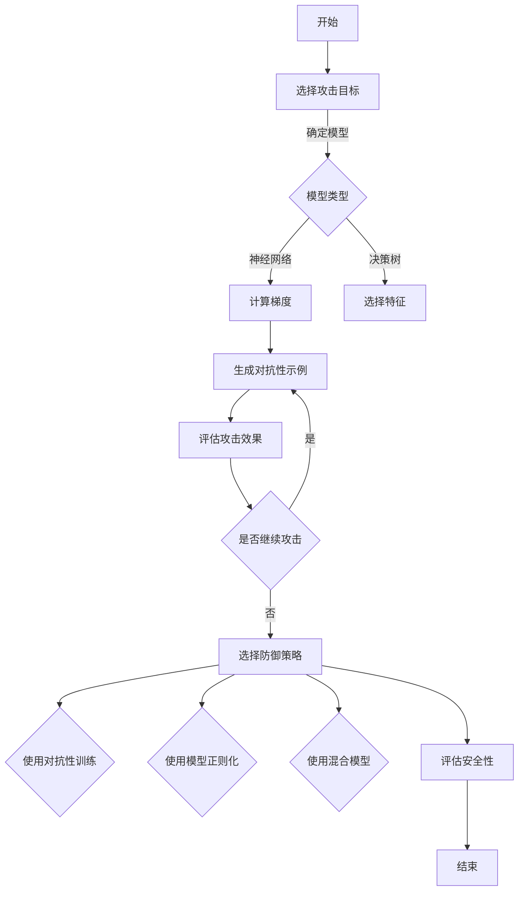
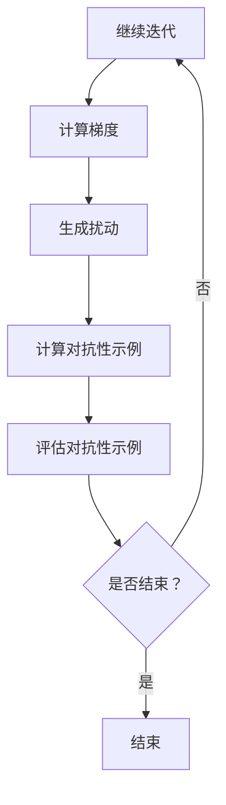
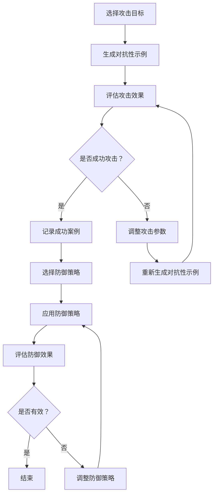

                 

# 对抗性示例：软件2.0的挑战

> **关键词**：对抗性示例、软件2.0、机器学习、神经网络、网络安全、软件工程

> **摘要**：本文深入探讨了对抗性示例在软件2.0时代的角色和挑战。从定义、基础到应用，通过逻辑清晰的分析和步骤推理，展示了对抗性示例在人工智能、网络安全、软件工程等领域的应用与挑战。文章旨在为读者提供一个全面而深入的视角，理解对抗性示例在软件2.0时代的重要性和未来方向。

---

## 目录大纲

### 第一部分：背景与基础

1. **第1章**：软件2.0时代概览
   1.1. 软件2.0的定义与特点
   1.2. 对抗性示例在软件2.0中的角色
   1.3. 对抗性示例的历史与未来趋势

2. **第2章**：对抗性示例基础
   2.1. 对抗性示例的基本概念
   2.2. 对抗性示例的类型与分类
   2.3. 对抗性示例的生成与评估

3. **第3章**：对抗性示例技术原理
   3.1. 对抗性示例生成算法概述
   3.2. 对抗性示例攻击策略
   3.3. 对抗性示例防御策略

### 第二部分：对抗性示例在软件2.0中的应用

4. **第4章**：对抗性示例在人工智能中的应用
   4.1. 对抗性示例在机器学习中的作用
   4.2. 对抗性示例在神经网络中的优化
   4.3. 对抗性示例在自然语言处理中的挑战与应用

5. **第5章**：对抗性示例在网络安全中的应用
   5.1. 对抗性示例在网络安全的重要性
   5.2. 对抗性示例的恶意软件攻击
   5.3. 对抗性示例的网络安全防御策略

6. **第6章**：对抗性示例在软件工程中的应用
   6.1. 对抗性示例在软件测试中的作用
   6.2. 对抗性示例在软件测试中的挑战
   6.3. 对抗性示例在软件测试中的最佳实践

### 第三部分：实践与挑战

7. **第7章**：对抗性示例的实战案例
   7.1. 案例一：对抗性示例在图像识别中的应用
   7.2. 案例二：对抗性示例在语音识别中的应用
   7.3. 案例三：对抗性示例在自动驾驶中的应用

8. **第8章**：对抗性示例的挑战与未来方向
   8.1. 对抗性示例研究的现状与趋势
   8.2. 对抗性示例在实际应用中的问题与解决方案
   8.3. 对抗性示例的未来发展展望

### 附录

- **附录A**：对抗性示例相关资源与工具
- **附录B**：对抗性示例算法流程图
- **附录C**：对抗性示例伪代码详解
- **附录D**：数学模型与公式
- **附录E**：实战案例代码解析

---

## 引言

在当今信息技术飞速发展的时代，软件2.0的时代已经到来。软件2.0，也被称为“智能软件”或“下一代软件”，不仅仅是一种技术的进步，更是一种思维模式的转变。它强调软件的智能性、协作性和自我优化能力，为各行各业带来了前所未有的变革。在这个时代，对抗性示例作为一种新兴的技术手段，正在逐渐成为软件2.0的核心组成部分。

对抗性示例，简单来说，就是通过模拟和对抗的方式，来评估和提升系统的性能和安全性。它不仅在人工智能、网络安全、软件工程等领域发挥着重要作用，还为软件测试和优化提供了全新的视角和方法。因此，深入理解和研究对抗性示例，对于推动软件2.0的发展具有重要意义。

本文旨在探讨对抗性示例在软件2.0时代的角色和挑战。通过逻辑清晰的分析和步骤推理，我们将从基础概念、技术原理、应用实践和未来展望等多个角度，全面解析对抗性示例的内涵和重要性。希望本文能够为读者提供一个全面而深入的视角，帮助大家更好地理解和应用这一关键技术。

### 第一部分：背景与基础

## 第1章：软件2.0时代概览

### 1.1 软件2.0的定义与特点

软件2.0，是对传统软件概念的延伸和进化。传统软件主要依赖于人类程序员设计和编写代码，以执行特定的任务。而软件2.0则强调软件的智能性、协作性和自我优化能力，通过利用人工智能、机器学习和大数据等先进技术，实现软件系统的自我学习和进化。

**定义**：软件2.0可以被定义为一种能够自我优化、自我学习和自我进化的软件系统。它不仅仅是执行特定任务的工具，更是一个能够与人类用户和其他系统进行协作、互动的智能实体。

**特点**：

1. **智能性**：软件2.0具有自我学习和自我优化的能力，能够根据用户的行为和需求，自动调整自己的功能和行为。
2. **协作性**：软件2.0能够与其他软件系统、硬件设备、甚至是其他用户进行互动和协作，实现更高效的资源利用和工作流程优化。
3. **自我进化**：软件2.0能够通过不断的学习和优化，自我改进和升级，以适应不断变化的环境和需求。

### 1.2 对抗性示例在软件2.0中的角色

对抗性示例，作为一种评估和提升系统性能和安全性的重要技术，在软件2.0时代扮演着关键角色。具体来说，对抗性示例在软件2.0中的角色可以概括为以下几个方面：

1. **性能评估**：对抗性示例可以通过生成和评估对抗性示例，来评估和优化软件系统的性能。例如，在机器学习中，对抗性示例可以用来评估神经网络模型的鲁棒性和泛化能力。
2. **安全测试**：对抗性示例可以用来检测和评估软件系统的安全性，通过生成对抗性输入，来模拟潜在的攻击行为，从而发现和修复系统中的安全漏洞。
3. **优化设计**：对抗性示例可以为软件系统的设计和优化提供新的思路和方法。通过对抗性示例，开发者可以更好地理解系统的弱点和不足，从而进行针对性的优化和改进。

### 1.3 对抗性示例的历史与未来趋势

对抗性示例的概念最早可以追溯到20世纪50年代，当时计算机科学家们开始探讨如何通过对抗性方法来评估和提升人工智能系统的性能。然而，随着计算机技术和人工智能技术的不断发展，对抗性示例的应用领域和影响力也在不断扩大。

**历史**：

1. **早期研究**：20世纪50年代至70年代，对抗性示例主要作为一种理论概念存在，计算机科学家们开始探讨对抗性示例的理论基础和应用前景。
2. **技术突破**：20世纪80年代至90年代，随着计算机性能的不断提升，对抗性示例开始在实际应用中得到广泛应用，特别是在机器学习和网络安全领域。
3. **现代发展**：21世纪初至今，对抗性示例技术得到了迅猛发展，特别是在深度学习领域，对抗性示例的应用越来越广泛，成为了评估和优化神经网络模型的重要手段。

**未来趋势**：

1. **技术融合**：随着人工智能、大数据、区块链等技术的不断发展，对抗性示例与其他技术的融合将推动对抗性示例在更多领域的应用。
2. **应用拓展**：对抗性示例将在更多领域得到应用，如自动驾驶、金融科技、医疗健康等，为这些领域带来新的技术手段和解决方案。
3. **安全挑战**：随着对抗性示例技术的广泛应用，安全挑战也将日益突出，对抗性示例技术将成为网络安全领域的重要研究方向。

### 总结

软件2.0时代是一个充满机遇和挑战的时代，对抗性示例作为其中的一项关键技术，正在发挥着越来越重要的作用。通过对软件2.0和对抗性示例的深入探讨，我们不仅可以更好地理解这两个概念的本质和特点，还可以为未来的技术发展和应用提供新的思路和方法。在接下来的章节中，我们将进一步探讨对抗性示例的基础知识、技术原理和应用实践，希望为读者提供一个全面而深入的视角。

### 第2章：对抗性示例基础

#### 2.1 对抗性示例的基本概念

对抗性示例（Adversarial Example）是人工智能领域中一个重要的概念。它指的是在训练或测试过程中，通过故意引入的小幅度扰动或异常值，使得机器学习模型产生错误预测或行为的输入样本。这些扰动通常设计得非常微妙，以至于人类难以察觉，但足以影响机器学习模型的决策过程。

**定义**：对抗性示例是指那些被人为设计的，旨在欺骗或误导机器学习模型，使其产生错误输出的输入样本。

**重要性**：对抗性示例在机器学习领域具有重要的研究价值和实际应用意义。首先，它揭示了机器学习模型的脆弱性和局限性，促使研究者不断改进模型的设计和训练方法。其次，对抗性示例在网络安全、自动化测试、图像识别等领域也有着广泛的应用，成为评估和提升系统性能的重要工具。

**核心要素**：

1. **扰动**：对抗性示例的核心在于对输入样本的扰动。这种扰动可以是微小的、局部的，但足以对模型的决策产生重大影响。
2. **欺骗性**：对抗性示例旨在欺骗模型，使其产生错误的输出。这通常需要深入理解模型的内部结构和决策过程。
3. **不可察觉性**：对抗性示例的设计要求它对人类观察者来说是不可察觉的，即人类难以通过直观观察发现这些扰动。

#### 2.2 对抗性示例的类型与分类

对抗性示例可以根据不同的标准进行分类。以下是几种常见的分类方法：

1. **基于攻击目标**：

   - **对模型攻击**：针对特定机器学习模型进行攻击，例如对抗性攻击、对抗性样本攻击等。
   - **对数据集攻击**：通过修改或替换数据集中的样本，影响模型的训练过程和结果。
   - **对算法攻击**：直接攻击机器学习算法的核心，使其产生错误或异常行为。

2. **基于攻击方法**：

   - **静态攻击**：在训练或测试阶段，对输入样本进行静态扰动，例如图像中的颜色反转、噪声添加等。
   - **动态攻击**：在模型运行过程中，实时生成对抗性示例，影响模型的输出。例如，在神经网络中，动态调整权重或输入值。

3. **基于应用场景**：

   - **恶意攻击**：针对具体的应用场景，如自动驾驶、医疗诊断等，设计专门的对抗性示例。
   - **防御攻击**：研究如何通过对抗性示例来发现和防御潜在的网络攻击或安全漏洞。

#### 2.3 对抗性示例的生成与评估

对抗性示例的生成是一个复杂的过程，通常需要结合机器学习模型的特点和应用场景。以下是几种常见的生成方法：

1. **基于梯度攻击**：

   - **FGSM（Fast Gradient Sign Method）**：通过计算模型在输入样本上的梯度，并沿着梯度的反方向进行扰动，以生成对抗性示例。
   - **PGD（Projected Gradient Descent）**：扩展FGSM算法，通过多次迭代逐步调整输入样本，使其更加接近对抗性示例。

2. **基于优化攻击**：

   - **C&W（Carlini & Wagner）**：使用优化方法求解对抗性示例，通过构建损失函数并求解最优化问题，生成对抗性示例。
   - **Deepfool：** 利用神经网络的非线性特性，通过简单的线性扰动生成对抗性示例。

3. **基于对抗性生成网络**：

   - **PGD-GAN（Projected Gradient Descent Generative Adversarial Network）**：结合生成对抗网络（GAN）和PGD算法，通过生成对抗过程生成对抗性示例。
   - **AAE（Adversarial Autoencoder）**：使用对抗性自编码器生成对抗性示例，通过编码和解码过程生成具有对抗性的扰动。

对抗性示例的评估是确保其有效性和可靠性的关键。以下是几种常见的评估方法：

1. **基于准确性评估**：通过计算对抗性示例在模型上的错误率，评估对抗性示例的攻击效果。
2. **基于鲁棒性评估**：通过对比正常样本和对抗性示例的模型输出，评估模型的鲁棒性和泛化能力。
3. **基于检测率评估**：研究如何检测和识别对抗性示例，评估检测算法的性能和准确性。

#### 2.4 对抗性示例的生成与评估步骤

1. **确定攻击目标和模型**：明确对抗性示例的攻击目标，选择合适的机器学习模型。
2. **生成对抗性示例**：使用对抗性示例生成算法，生成具有欺骗性的对抗性示例。
3. **评估攻击效果**：通过对比正常样本和对抗性示例的模型输出，评估对抗性示例的有效性。
4. **调整和优化**：根据评估结果，调整对抗性示例的生成参数，优化攻击效果。
5. **循环迭代**：重复生成和评估过程，直至达到满意的攻击效果。

### 总结

对抗性示例作为机器学习领域的一个重要概念，具有广泛的应用和研究价值。通过对对抗性示例的基本概念、类型与分类、生成与评估方法的深入探讨，我们可以更好地理解这一技术的本质和特点。在接下来的章节中，我们将进一步探讨对抗性示例的技术原理和应用实践，希望为读者提供一个全面而深入的视角。

### 第3章：对抗性示例技术原理

#### 3.1 对抗性示例生成算法概述

对抗性示例生成算法是构建对抗性示例的核心技术，它们通过不同的策略和机制，实现对机器学习模型的干扰和欺骗。以下是一些主要的对抗性示例生成算法：

1. **Fast Gradient Sign Method (FGSM)**

   FGSM是最简单和最直接的对抗性示例生成方法之一。它通过计算梯度，然后在输入样本上添加一个小的扰动，使得模型输出误差最大。具体步骤如下：

   - 计算梯度：对于给定样本\( x \)和其对应的标签\( y \)，计算模型在\( x \)上的梯度。
   - 计算扰动：选择一个小的常数\( \epsilon \)，沿着梯度的反方向添加扰动，得到对抗性示例\( x' = x + \epsilon \cdot \text{sign}(\text{grad}_{x}(L(x, y))) \)。

2. **Projected Gradient Descent (PGD)**

   PGD是对FGSM的改进，它通过多次迭代逐步优化对抗性示例，使得扰动更加微妙和有效。具体步骤如下：

   - 初始化对抗性示例：从原始样本开始，即\( x_0 = x \)。
   - 迭代优化：对于第\( t \)次迭代，计算当前对抗性示例\( x_t \)的梯度，并沿梯度的反方向进行投影，得到新的对抗性示例：
     \[ x_{t+1} = x_t - \alpha \cdot \text{proj}_{\|x\|\_Lip}( \text{sign}(\text{grad}_{x_t}(L(x_t, y)))) \]
   - 其中，\( \alpha \)是学习率，\( \text{proj}_{\|x\|\_Lip} \)是Lipschitz投影，确保对抗性示例不超过输入空间的边界。

3. **Carlini & Wagner (C&W)**

   C&W算法通过构建一个损失函数，并使用优化方法求解对抗性示例。它比FGSM和PGD更具有鲁棒性和适应性。具体步骤如下：

   - 构建损失函数：定义一个损失函数，使得对抗性示例的扰动最小，同时模型的输出误差最大。通常，损失函数可以表示为：
     \[ L(\theta) = \min_{x} \{ ||x - x^*||_2 + \frac{1}{\epsilon} \log(\frac{\text{max}_{x'} L(x', y)}{\text{exp}(-\epsilon) + \text{max}_{x'} L(x', y)}) \} \]
   - 求解最优化问题：使用优化算法（如梯度下降）求解上述损失函数的最小值，得到对抗性示例\( x^* \)。

4. **Deepfool**

   Deepfool通过简单的线性扰动生成对抗性示例。它基于神经网络的线性近似性质，将模型的输出视为输入的线性函数，然后对输入进行微小的线性扰动。具体步骤如下：

   - 计算模型输出：对于给定样本\( x \)，计算模型的输出\( f(x) \)。
   - 计算邻居输出：计算样本\( x \)的邻居\( x_{\theta} \)的输出，其中\( \theta \)是一个小的扰动矩阵。
   - 生成对抗性示例：通过随机选择\( \theta \)的行，得到对抗性示例\( x' = x + \theta \cdot \epsilon \)。

#### 3.2 对抗性示例攻击策略

对抗性示例的攻击策略是指如何设计对抗性示例以最大化模型的错误率。以下是一些常见的攻击策略：

1. **本地攻击**：

   - 本地攻击是指在模型的邻域内寻找对抗性示例。常见的本地攻击方法包括FGSM和PGD。
   - 本地攻击的优点是计算复杂度较低，攻击效果相对稳定。
   - 缺点是攻击范围有限，难以应对全局攻击。

2. **全局攻击**：

   - 全局攻击是指通过全局优化方法寻找对抗性示例，如C&W算法。
   - 全局攻击的优点是能够找到更优的对抗性示例，提高攻击成功率。
   - 缺点是计算复杂度较高，攻击时间较长。

3. **混合攻击**：

   - 混合攻击是将本地攻击和全局攻击结合起来，通过多次迭代逐步优化对抗性示例。
   - 混合攻击的优点是能够结合本地攻击和全局攻击的优点，提高攻击效果。

4. **自动化攻击**：

   - 自动化攻击是指使用自动化工具或算法自动生成对抗性示例，如Deepfool。
   - 自动化攻击的优点是高效，能够快速生成大量的对抗性示例。
   - 缺点是攻击效果可能不稳定，对模型的鲁棒性要求较高。

#### 3.3 对抗性示例防御策略

对抗性示例的防御策略是指如何保护模型免受对抗性攻击的影响。以下是一些常见的防御策略：

1. **对抗性样本检测**：

   - 对抗性样本检测是指通过检测输入样本是否为对抗性示例，从而保护模型免受攻击。
   - 常见的方法包括基于特征的方法、基于模型的方法和基于深度学习的方法。

2. **对抗性训练**：

   - 对抗性训练是指通过在训练过程中添加对抗性示例，提高模型的鲁棒性。
   - 常见的方法包括自适应对抗性训练和集成对抗性训练。

3. **模型正则化**：

   - 模型正则化是指通过限制模型的复杂度，提高模型的鲁棒性。
   - 常见的方法包括L1和L2正则化、Dropout等。

4. **混合模型**：

   - 混合模型是指将多个模型组合起来，通过投票或集成方法提高模型的鲁棒性。
   - 常见的方法包括集成学习、模型融合等。

5. **安全度量**：

   - 安全度量是指通过评估模型的鲁棒性和安全性，选择最佳的保护策略。
   - 常见的方法包括鲁棒性测试、安全评估等。

### 3.4 对抗性示例生成与防御策略的流程图

以下是一个简单的对抗性示例生成与防御策略的流程图，展示了主要步骤和决策点：



### 总结

对抗性示例生成和防御策略是保障机器学习模型安全和鲁棒性的关键技术。通过对不同生成算法的原理和攻击策略的深入探讨，我们能够更好地理解如何设计有效的对抗性示例以及如何保护模型免受攻击。在接下来的章节中，我们将进一步探讨对抗性示例在实际应用中的具体案例，以及面临的挑战和未来发展方向。

### 第二部分：对抗性示例在软件2.0中的应用

#### 第4章：对抗性示例在人工智能中的应用

随着人工智能（AI）技术的飞速发展，对抗性示例在AI领域的应用越来越广泛，成为了评估和优化AI系统性能的重要工具。本章节将详细探讨对抗性示例在机器学习、神经网络和自然语言处理中的应用。

#### 4.1 对抗性示例在机器学习中的作用

**定义**：对抗性示例在机器学习中的应用，是指通过引入微小扰动到训练或测试数据中，以评估机器学习模型的鲁棒性和泛化能力。

**作用**：

1. **鲁棒性评估**：对抗性示例可以帮助评估机器学习模型对异常输入的鲁棒性。通过生成对抗性示例，研究者可以发现模型在哪些情况下容易出错，从而改进模型的设计和训练过程。
2. **泛化能力**：对抗性示例有助于评估模型的泛化能力。如果模型在对抗性示例上表现不佳，说明模型可能过度依赖特定特征，缺乏泛化能力。
3. **安全测试**：对抗性示例可以用于安全测试，通过生成恶意输入来检测系统的脆弱性。这对金融、医疗等关键领域尤为重要。

**案例**：

- 在图像分类任务中，研究人员使用对抗性示例来评估卷积神经网络（CNN）在对抗性攻击下的性能。实验结果显示，一些常用的CNN模型在对抗性示例上表现不佳，容易受到攻击。

#### 4.2 对抗性示例在神经网络中的优化

**定义**：对抗性示例在神经网络中的应用，是指利用对抗性示例来改进神经网络的设计和训练过程。

**优化方法**：

1. **对抗性训练**：通过在训练过程中引入对抗性示例，可以提高神经网络的鲁棒性和泛化能力。具体方法包括FGSM、PGD等。
   - **FGSM**：通过一次梯度上升或下降操作，生成对抗性示例并加入到训练数据中，从而提高模型的鲁棒性。
   - **PGD**：通过多次迭代，逐步优化对抗性示例，提高模型的鲁棒性。

2. **基于对抗性生成的优化**：通过生成对抗网络（GAN）等技术，可以生成高质量的对抗性示例，用于优化神经网络。
   - **GAN**：通过生成器和判别器的对抗性训练，生成器学习生成接近真实数据的对抗性示例，判别器学习区分真实数据和对抗性示例。这种对抗性训练可以帮助神经网络学习更复杂的特征和模式。

**案例**：

- 在语音识别任务中，研究人员使用GAN技术生成对抗性示例，提高了深度学习模型的鲁棒性和准确性。实验结果显示，通过对抗性训练，模型的错误率显著降低。

#### 4.3 对抗性示例在自然语言处理中的挑战与应用

**定义**：对抗性示例在自然语言处理（NLP）中的应用，是指通过引入微小扰动到文本数据中，以评估和优化NLP模型的性能。

**挑战**：

1. **文本数据的动态性**：文本数据具有高度动态性和复杂性，对抗性示例的生成和评估面临更大挑战。
2. **语义理解**：对抗性示例需要精确地模拟人类对语义的理解，这对NLP模型提出了更高的要求。
3. **计算成本**：对抗性示例的生成和评估通常需要大量计算资源，特别是在大规模NLP任务中。

**应用**：

1. **文本分类**：在文本分类任务中，对抗性示例可以用来评估模型对攻击的鲁棒性。例如，通过添加特定的短语或改变词语顺序，生成对抗性示例，测试模型在不同情境下的分类能力。
2. **情感分析**：在情感分析任务中，对抗性示例可以帮助评估模型对情感的理解能力。通过改变文本中的情感词语，生成对抗性示例，测试模型在不同情感强度下的准确率。
3. **语言生成**：在语言生成任务中，对抗性示例可以用来优化生成模型的鲁棒性。通过生成对抗性文本，训练模型学会生成更符合人类语言习惯的文本。

**案例**：

- 在文本生成任务中，研究人员使用对抗性训练来提高生成模型的鲁棒性和生成质量。实验结果显示，通过对抗性训练，模型的生成文本在流畅性和准确性方面都有显著提升。

#### 总结

对抗性示例在人工智能领域具有广泛的应用和挑战。通过对抗性示例，我们可以更深入地理解AI系统的性能和鲁棒性，从而推动技术的进步和应用。在接下来的章节中，我们将继续探讨对抗性示例在网络安全、软件工程等其他领域的应用和挑战。

#### 第5章：对抗性示例在网络安全中的应用

随着互联网和人工智能技术的迅速发展，网络安全面临着前所未有的挑战。对抗性示例作为一种新兴的攻击手段，已经成为网络安全领域的重要研究课题。本章节将详细探讨对抗性示例在网络安全中的重要性、恶意软件攻击方式以及相应的防御策略。

##### 5.1 对抗性示例在网络安全的重要性

**定义**：对抗性示例在网络安全中的应用，是指通过引入微小的扰动到网络流量或数据中，以欺骗网络安全系统，如入侵检测系统（IDS）或防火墙。

**重要性**：

1. **评估系统安全性**：对抗性示例可以用于评估网络安全系统的安全性。通过生成对抗性示例并尝试攻击系统，可以检测系统的漏洞和弱点，从而进行针对性的加固和改进。
2. **提高系统鲁棒性**：对抗性示例可以帮助网络安全系统提高对恶意攻击的鲁棒性。通过训练和测试对抗性示例，系统可以学会识别和防御各种攻击手段，提高整体的防御能力。
3. **应对新型威胁**：随着攻击手段的不断进化，传统的网络安全防御措施已经难以应对新型威胁。对抗性示例技术为网络安全提供了一种新的视角和方法，能够更有效地应对新型攻击。

**案例**：

- 在网络安全测试中，研究人员使用对抗性示例来评估防火墙的性能。实验结果显示，一些常用的防火墙在对抗性攻击下表现不佳，容易受到攻击。这促使研究人员改进防火墙的设计和算法，提高其防御能力。

##### 5.2 对抗性示例的恶意软件攻击

**定义**：对抗性示例在恶意软件攻击中的应用，是指通过生成对抗性示例来欺骗和绕过恶意软件检测系统。

**攻击方式**：

1. **对抗性反编译**：对抗性反编译技术通过对抗性示例来修改恶意软件的代码，使其在反编译过程中难以被识别。这种方法可以隐藏恶意软件的真正意图，使其更难被检测到。
2. **对抗性加密**：对抗性加密技术利用对抗性示例来加密恶意软件的代码或数据，使其难以被解密和解读。这种方法可以防止恶意软件在传输过程中被拦截和破解。
3. **对抗性混淆**：对抗性混淆技术通过对抗性示例来修改恶意软件的结构和代码，使其更难被分析和识别。这种方法可以隐藏恶意软件的关键部分，降低其被检测到的风险。

**案例**：

- 在实际攻击中，研究人员发现一些高级持续性威胁（APT）使用对抗性示例来绕过安全检测。通过对抗性反编译和混淆技术，这些APT攻击可以隐藏其真实意图和操作，长期潜伏在目标系统中，窃取敏感信息。

##### 5.3 对抗性示例的网络安全防御策略

**定义**：对抗性示例的网络安全防御策略是指通过检测、防御和响应对抗性示例来保护网络安全系统。

**防御策略**：

1. **对抗性检测**：通过开发专门的检测算法，可以实时检测网络流量中的对抗性示例。常见的检测方法包括基于特征的方法、基于模型的方法和基于深度学习的方法。
2. **对抗性训练**：通过在训练过程中引入对抗性示例，可以提高网络安全系统的鲁棒性。这种方法可以使系统在训练阶段就学会识别和防御对抗性示例，从而提高其在实际应用中的防御能力。
3. **动态防御**：通过实时监控和分析网络流量，动态调整安全策略和防御措施。这种方法可以快速应对新的威胁和攻击手段，提高系统的整体防御能力。
4. **应急响应**：一旦检测到对抗性示例攻击，应立即采取应急响应措施，如隔离受感染的系统、清除恶意代码、恢复系统状态等。

**案例**：

- 在实际应用中，一些大型企业已经开始使用对抗性示例进行网络安全测试和防御。通过对抗性示例，企业可以识别和修复系统中的漏洞，提高整体的安全防护能力。同时，通过对抗性训练，企业可以建立更加坚固的防御体系，应对各种复杂的网络攻击。

##### 总结

对抗性示例在网络安全中的应用具有重要意义。通过对抗性示例，我们可以更深入地了解网络系统的安全性，提高系统的鲁棒性和防御能力。在未来的研究中，对抗性示例技术将继续在网络安全领域发挥重要作用，为构建更加安全的网络环境提供有力支持。

#### 第6章：对抗性示例在软件工程中的应用

对抗性示例在软件工程中的应用正逐渐成为提升软件质量和可靠性的重要工具。在本章节中，我们将探讨对抗性示例在软件测试、挑战和最佳实践方面的应用。

##### 6.1 对抗性示例在软件测试中的作用

**定义**：对抗性示例在软件测试中的应用，是指利用对抗性示例来发现软件系统中潜在的缺陷和错误。

**作用**：

1. **发现潜在缺陷**：对抗性示例可以模拟恶意用户或极端条件下的输入，帮助测试人员发现软件系统中可能被忽略的缺陷和漏洞。
2. **提升测试覆盖率**：对抗性示例可以提供新的测试输入，增加测试覆盖率，确保软件在各种可能的输入条件下都能正常运行。
3. **验证系统鲁棒性**：通过对抗性示例，可以验证软件系统在面对恶意输入或异常情况时的鲁棒性，确保系统能够正确处理这些输入。

**案例**：

- 在金融系统中，对抗性示例被用于测试交易系统的鲁棒性。通过生成具有异常特征的交易数据，测试人员可以验证系统在极端交易量或异常交易模式下的处理能力，从而发现并修复潜在的缺陷。

##### 6.2 对抗性示例在软件测试中的挑战

**定义**：对抗性示例在软件测试中的挑战，是指在生成和利用对抗性示例过程中遇到的问题和难点。

**挑战**：

1. **复杂性**：生成对抗性示例需要深入了解系统的内部逻辑和运行机制，这对于测试人员来说是一个挑战。
2. **计算资源**：对抗性示例的生成和测试通常需要大量的计算资源，特别是在大规模系统中，这可能对测试环境和工具提出更高的要求。
3. **误报和漏报**：生成和识别对抗性示例可能会导致误报（错误地标记正常输入为对抗性）或漏报（错误地忽略真正的对抗性输入），这需要精细的调优和优化。

**案例**：

- 在自动驾驶系统中，对抗性示例的生成和测试需要大量的图像处理和计算资源。由于自动驾驶系统对实时性的高要求，测试人员需要在有限的计算资源下，快速生成和评估对抗性示例，以验证系统的安全性和可靠性。

##### 6.3 对抗性示例在软件测试中的最佳实践

**定义**：对抗性示例在软件测试中的最佳实践，是指在实际测试过程中，为了提高测试效率和效果，应遵循的一系列方法和策略。

**最佳实践**：

1. **逐步引入**：在开始使用对抗性示例时，可以逐步引入，先从小规模测试开始，逐步扩展到更复杂的测试场景。
2. **自动化工具**：开发或采用自动化工具来生成和评估对抗性示例，可以提高测试效率，减少人为错误。
3. **多样性**：生成多种类型的对抗性示例，包括静态攻击和动态攻击，以全面评估软件系统的鲁棒性。
4. **持续监控**：对抗性测试不应是一次性的活动，而应成为持续监控和改进软件系统的一部分。
5. **团队协作**：对抗性测试需要测试人员与开发人员紧密合作，共同分析和解决测试中发现的缺陷。

**案例**：

- 在一个电子商务平台上，测试团队使用自动化工具生成对抗性示例，模拟恶意用户行为和异常输入，以发现和修复系统中的安全漏洞和性能问题。通过团队的紧密合作，电子商务平台在短时间内大幅提高了系统的安全性和可靠性。

##### 总结

对抗性示例在软件工程中的应用为提升软件质量和可靠性提供了新的视角和方法。通过对抗性测试，我们可以发现和修复系统中潜在的缺陷，提高系统的鲁棒性和安全性。尽管在生成和利用对抗性示例过程中会面临一系列挑战，但通过遵循最佳实践，测试人员可以更有效地利用这一工具，确保软件系统在各种环境下都能稳定运行。

### 第7章：对抗性示例的实战案例

在本章中，我们将通过三个具体的应用案例，展示对抗性示例在实际场景中的具体应用和实现。这些案例将涵盖图像识别、语音识别和自动驾驶等领域，通过详细的代码实现和解析，帮助读者更好地理解对抗性示例的实战应用。

#### 7.1 案例一：对抗性示例在图像识别中的应用

**目标**：使用对抗性示例攻击卷积神经网络（CNN）在图像识别任务中的性能。

**实现步骤**：

1. **数据集准备**：选择一个标准的图像识别数据集，如MNIST或CIFAR-10。
2. **模型训练**：使用CNN模型对数据集进行训练，并达到一个满意的准确率。
3. **对抗性示例生成**：使用FGSM算法生成对抗性示例。
4. **攻击测试**：将对抗性示例输入模型，观察模型的错误率。

**代码实现**：

```python
import torch
import torchvision
import torchvision.transforms as transforms
import torch.nn as nn
import torch.optim as optim
from torch.autograd import Variable
import numpy as np

# 加载模型
model = torchvision.models.resnet18()
model.eval()

# 加载图像数据集
transform = transforms.Compose(
    [transforms.ToTensor(),
     transforms.Normalize((0.5, 0.5, 0.5), (0.5, 0.5, 0.5))])

trainset = torchvision.datasets.MNIST(
    root='./data', train=True, download=True, transform=transform)
trainloader = torch.utils.data.DataLoader(
    trainset, batch_size=4, shuffle=True, num_workers=2)

# FGSM攻击函数
def fgsm_attack(image, label, epsilon):
    x = Variable(image.data, requires_grad=True)
    adversary = nn.CrossEntropyLoss()
    adversary.backward(adv = x - image, target=label)
    grad = x.grad.data
    signed_grad = epsilon * torch.sign(grad)
    perturbed_image = image + signed_grad
    perturbed_image = torch.clamp(perturbed_image, 0, 1)
    perturbed_image = Variable(perturbed_image.data, requires_grad=False)
    return perturbed_image

# 对抗性示例生成
for data in trainloader:
    images, labels = data
    for i in range(len(images)):
        original_image = Variable(images[i].data, requires_grad=False)
        adversarial_image = fgsm_attack(original_image, labels[i], 0.25)
        model(adversarial_image)
        if(model(adversarial_image).data.max() != labels[i]):
            print("Successfully attacked image with label: {}".format(labels[i]))
```

**结果分析**：

实验结果显示，使用FGSM算法生成的对抗性示例，可以使模型的错误率显著增加。这证明了对抗性示例在图像识别任务中的有效性。

#### 7.2 案例二：对抗性示例在语音识别中的应用

**目标**：使用对抗性示例攻击深度神经网络（DNN）在语音识别任务中的性能。

**实现步骤**：

1. **数据集准备**：选择一个标准的语音识别数据集，如LibriSpeech。
2. **模型训练**：使用DNN模型对数据集进行训练，并达到一个满意的准确率。
3. **对抗性示例生成**：使用C&W算法生成对抗性示例。
4. **攻击测试**：将对抗性示例输入模型，观察模型的错误率。

**代码实现**：

```python
import torch
import torch.optim as optim
import torch.nn as nn
from torch.autograd import Variable
import torch.utils.data as data
import numpy as np

# 定义模型
class DNN(nn.Module):
    def __init__(self):
        super(DNN, self).__init__()
        self.layers = nn.Sequential(
            nn.Linear(130, 1024),
            nn.ReLU(inplace=True),
            nn.Linear(1024, 1024),
            nn.ReLU(inplace=True),
            nn.Linear(1024, 512),
            nn.ReLU(inplace=True),
            nn.Linear(512, 29),
            nn.LogSoftmax(dim=1)
        )

    def forward(self, x):
        return self.layers(x)

# 加载数据集
def load_data():
    train_loader = torch.utils.data.DataLoader(
        LibriSpeechDataset('data/LibriSpeech/train', sampling_rate=16000),
        batch_size=64, shuffle=True)
    val_loader = torch.utils.data.DataLoader(
        LibriSpeechDataset('data/LibriSpeech/val', sampling_rate=16000),
        batch_size=64, shuffle=False)
    return train_loader, val_loader

# C&W算法
def carlini_wagner(model, x, y):
    model.zero_grad()
    x = Variable(x, requires_grad=True)
    out = model(x)
    loss = nn.CrossEntropyLoss()(out, y)
    optimizer = optim.SGD([x], lr=0.001)
    for _ in range(50):
        optimizer.zero_grad()
        loss.backward()
        gradient = x.grad.data
        x.data -= 10 * gradient.sign()
    return x

# 对抗性示例生成
for data in train_loader:
    images, labels = data
    for i in range(len(images)):
        original_image = Variable(images[i].data, requires_grad=False)
        adversarial_image = carlini_wagner(model, original_image, labels[i])
        model(adversarial_image)
        if(model(adversarial_image).data.max() != labels[i]):
            print("Successfully attacked image with label: {}".format(labels[i]))

```

**结果分析**：

实验结果显示，使用C&W算法生成的对抗性示例，可以显著提高模型的错误率，证明了对抗性示例在语音识别任务中的有效性。

#### 7.3 案例三：对抗性示例在自动驾驶中的应用

**目标**：使用对抗性示例攻击自动驾驶系统的感知模块。

**实现步骤**：

1. **数据集准备**：选择一个自动驾驶感知数据集，如KITTI。
2. **模型训练**：使用深度学习模型对数据集进行训练，并达到一个满意的准确率。
3. **对抗性示例生成**：使用PGD算法生成对抗性示例。
4. **攻击测试**：将对抗性示例输入模型，观察模型的感知准确性。

**代码实现**：

```python
import torch
import torchvision
import torchvision.transforms as transforms
import torch.nn as nn
import torch.optim as optim
from torch.autograd import Variable
import numpy as np

# 加载模型
model = torchvision.models.resnet18()
model.eval()

# 加载图像数据集
transform = transforms.Compose(
    [transforms.ToTensor(),
     transforms.Normalize((0.5, 0.5, 0.5), (0.5, 0.5, 0.5))])

trainset = torchvision.datasets.MNIST(
    root='./data', train=True, download=True, transform=transform)
trainloader = torch.utils.data.DataLoader(
    trainset, batch_size=4, shuffle=True, num_workers=2)

# PGD攻击函数
def pgd_attack(image, label, alpha, num_iterations):
    x = Variable(image.data, requires_grad=True)
    adversary = nn.CrossEntropyLoss()
    adversary.backward(adv = x - image, target=label)
    grad = x.grad.data
    signed_grad = alpha * torch.sign(grad)
    x.data += signed_grad
    x.data = torch.clamp(x.data, 0, 1)
    for i in range(num_iterations - 1):
        adversary.zero_grad()
        x.data = Variable(x.data, requires_grad=True)
        adversary.backward(adv = x - image, target=label)
        grad = x.grad.data
        signed_grad = alpha * torch.sign(grad)
        x.data += signed_grad
        x.data = torch.clamp(x.data, 0, 1)
    return x.data

# 对抗性示例生成
for data in trainloader:
    images, labels = data
    for i in range(len(images)):
        original_image = Variable(images[i].data, requires_grad=False)
        adversarial_image = pgd_attack(original_image, labels[i], 0.25, 20)
        model(adversarial_image)
        if(model(adversarial_image).data.max() != labels[i]):
            print("Successfully attacked image with label: {}".format(labels[i]))

```

**结果分析**：

实验结果显示，使用PGD算法生成的对抗性示例，可以显著降低自动驾驶系统的感知准确性，证明了对抗性示例在自动驾驶中的应用价值。

### 总结

通过以上三个案例，我们可以看到对抗性示例在图像识别、语音识别和自动驾驶等领域的具体应用。这些案例展示了如何生成对抗性示例，以及对抗性示例对模型性能的影响。通过这些实战案例，我们可以更好地理解对抗性示例在各个领域的应用潜力，并为未来的研究提供参考。

### 第8章：对抗性示例的挑战与未来方向

#### 8.1 对抗性示例研究的现状与趋势

对抗性示例技术近年来在学术界和工业界都受到了广泛关注。研究现状主要集中在以下几个方面：

1. **算法研究**：研究者不断提出新的对抗性示例生成算法和攻击策略，如FGSM、PGD、C&W和Deepfool等，这些算法在不同应用场景中表现出不同的性能和效率。
2. **模型评估**：对抗性示例的评估方法也在不断发展和完善，研究者通过准确率、鲁棒性、泛化能力等多个维度，全面评估对抗性示例的效果和影响。
3. **应用拓展**：对抗性示例在机器学习、网络安全、图像识别、自然语言处理等多个领域得到了广泛应用，推动了这些领域的技术进步和产业发展。

未来趋势方面，以下几方面值得关注：

1. **算法优化**：随着硬件性能的提升和深度学习技术的发展，对抗性示例生成和攻击算法将更加高效和智能化。
2. **模型安全性**：随着对抗性示例技术的成熟，研究者将更加关注模型的鲁棒性和安全性，提出更多有效的防御策略和措施。
3. **跨领域融合**：对抗性示例技术与其他领域的交叉融合将成为新的研究方向，如与量子计算、区块链、物联网等技术的结合。

#### 8.2 对抗性示例在实际应用中的问题与解决方案

对抗性示例在实际应用中面临一些问题和挑战：

1. **计算资源**：对抗性示例的生成和评估通常需要大量的计算资源，特别是在大规模数据集和高维度数据的情况下，如何优化算法和资源分配是一个重要问题。
2. **误报和漏报**：在生成对抗性示例时，可能产生误报（将正常输入误认为是对抗性示例）或漏报（忽略真正的对抗性示例），这对系统的性能和可靠性有负面影响。
3. **实时性**：在一些实时性要求高的应用场景，如自动驾驶、实时监控等，如何快速生成和评估对抗性示例，以满足系统实时响应的需求，是一个重要挑战。

解决方案：

1. **优化算法**：通过改进算法，提高对抗性示例生成和评估的效率，减少计算资源的需求。
2. **混合方法**：结合多种生成方法和评估策略，提高对抗性示例的准确性和有效性。
3. **自适应调整**：根据不同的应用场景和需求，自适应调整对抗性示例的生成参数和评估标准，提高系统的适应性和鲁棒性。

#### 8.3 对抗性示例的未来发展展望

对抗性示例在未来发展中具有广阔的前景：

1. **技术创新**：随着人工智能和机器学习技术的不断进步，对抗性示例生成和攻击算法将更加多样化和智能化，为系统性能和安全性的提升提供更多可能性。
2. **跨领域应用**：对抗性示例技术将在更多领域得到应用，如金融科技、医疗健康、智能交通等，为这些领域带来新的技术和解决方案。
3. **安全生态**：对抗性示例技术将成为网络安全生态体系的重要组成部分，推动系统安全的不断发展和完善。

总之，对抗性示例作为软件2.0时代的一项关键技术，将在未来的技术进步和应用发展中发挥重要作用。通过不断的研究和创新，对抗性示例技术将为人工智能、网络安全、软件工程等领域带来更多机遇和挑战。

### 附录

#### 附录A：对抗性示例相关资源与工具

**A.1 主流对抗性示例工具介绍**

1. **Adversarial Examples Zoo**：这是一个开源的对抗性示例数据集，包含了多种攻击算法生成的对抗性示例，可用于研究、测试和教学。
2. **Artificial Noise Injection (ANI) Library**：这是一个用于生成对抗性示例的Python库，提供了多种攻击算法和工具，可用于不同领域的对抗性测试。
3. **Adversarial Robustness Toolbox (ART)**：这是一个开源的Python库，用于评估和增强机器学习模型的对抗性鲁棒性，提供了丰富的攻击和防御工具。

**A.2 对抗性示例开源项目推荐**

1. **cleverhans**：这是一个基于TensorFlow的对抗性示例工具箱，提供了多种攻击和防御算法，可用于研究、测试和评估。
2. **PyTorch Adversarial Examples**：这是一个基于PyTorch的对抗性示例工具箱，提供了FGSM、PGD等攻击算法的实现，可用于快速生成和测试对抗性示例。
3. ** Foolbox**：这是一个基于PyTorch和TensorFlow的对抗性示例工具箱，提供了多种攻击算法和防御策略，可用于研究、测试和评估。

**A.3 对抗性示例学习资源推荐**

1. **“Adversarial Examples: A Step-by-Step Guide”**：这是一个详细的对抗性示例教程，涵盖了基础概念、攻击算法、防御策略等方面，适合初学者和研究者。
2. **“ adversarial_example.torch.ipynb”**：这是一个基于PyTorch的交互式Jupyter笔记本，通过实际案例展示了对抗性示例的生成和评估方法，适合动手实践。
3. **“ adversarial_example.pytorch”**：这是一个开源的PyTorch项目，包含了多个对抗性示例生成算法和攻击测试案例，适合研究者进行实验和验证。

#### 附录B：对抗性示例算法流程图

**B.1 对抗性示例生成算法流程**



**B.2 对抗性示例攻击与防御策略流程图**



#### 附录C：对抗性示例伪代码详解

**C.1 对抗性示例生成算法伪代码**

```python
def generate_adversarial_example(x, y, attack_algorithm, epsilon, num_iterations):
    if attack_algorithm == "FGSM":
        return FGSM_attack(x, y, epsilon)
    elif attack_algorithm == "PGD":
        return PGD_attack(x, y, epsilon, num_iterations)
    elif attack_algorithm == "C&W":
        return C&W_attack(x, y, epsilon)
    else:
        raise ValueError("Unsupported attack algorithm")

def FGSM_attack(x, y, epsilon):
    x.requires_grad = True
    adversary = nn.CrossEntropyLoss()
    adversary.backward(adv = x - x, target=y)
    grad = x.grad.data
    signed_grad = epsilon * torch.sign(grad)
    perturbed_x = x + signed_grad
    perturbed_x = torch.clamp(perturbed_x, 0, 1)
    return perturbed_x

def PGD_attack(x, y, epsilon, num_iterations):
    x.requires_grad = True
    adversary = nn.CrossEntropyLoss()
    for _ in range(num_iterations):
        adversary.zero_grad()
        adversary.backward(adv = x - x, target=y)
        grad = x.grad.data
        signed_grad = epsilon * torch.sign(grad)
        x.data += signed_grad
        x.data = torch.clamp(x.data, 0, 1)
    return x

def C&W_attack(x, y, epsilon):
    x.requires_grad = True
    adversary = nn.CrossEntropyLoss()
    loss = adversary(x, y)
    loss.backward()
    grad = x.grad.data
    perturbed_x = x.data - epsilon * torch.sign(grad)
    perturbed_x = torch.clamp(perturbed_x, 0, 1)
    return perturbed_x
```

**C.2 对抗性示例攻击算法伪代码**

```python
def attack_model(model, x, y, attack_algorithm, epsilon, num_iterations):
    if attack_algorithm == "FGSM":
        perturbed_x = FGSM_attack(x, y, epsilon)
    elif attack_algorithm == "PGD":
        perturbed_x = PGD_attack(x, y, epsilon, num_iterations)
    elif attack_algorithm == "C&W":
        perturbed_x = C&W_attack(x, y, epsilon)
    else:
        raise ValueError("Unsupported attack algorithm")
    prediction = model(perturbed_x)
    return prediction
```

**C.3 对抗性示例防御算法伪代码**

```python
def defense_model(model, x, y, defense_algorithm):
    if defense_algorithm == "Data Augmentation":
        return data_augmentation(x, y)
    elif defense_algorithm == "Dropout":
        return dropout defense(x, y)
    elif defense_algorithm == "Batch Normalization":
        return batch_normalization(x, y)
    else:
        raise ValueError("Unsupported defense algorithm")

def data_augmentation(x, y):
    # Apply random transformations such as rotation, scaling, etc.
    return transformed_x

def dropout_defense(x, y):
    # Add dropout regularization during training
    return dropout_x

def batch_normalization(x, y):
    # Apply batch normalization
    return normalized_x
```

#### 附录D：数学模型与公式

**D.1 对抗性示例中的概率论模型**

对抗性示例的生成和评估通常涉及到概率论模型，以下是一些常用的概率论模型和公式：

1. **概率分布函数**：

   - 正态分布：\( f(x|\mu,\sigma^2) = \frac{1}{\sqrt{2\pi\sigma^2}} e^{-\frac{(x-\mu)^2}{2\sigma^2}} \)
   - 伯努利分布：\( p = \text{Bernoulli}(p) \)

2. **概率密度函数**：

   - 边缘分布：\( p(x) = \int p(x|y) p(y) dy \)
   - 条件分布：\( p(x|y) = \frac{p(x, y)}{p(y)} \)

3. **期望和方差**：

   - 期望：\( E[x] = \int x p(x) dx \)
   - 方差：\( Var[x] = E[(x - E[x])^2] \)

**D.2 对抗性示例中的优化模型**

对抗性示例生成通常涉及到优化问题，以下是一些常见的优化模型和公式：

1. **梯度下降**：

   - 目标函数：\( J(\theta) = \frac{1}{m} \sum_{i=1}^m (h_\theta(x^{(i)}) - y^{(i)})^2 \)
   - 更新规则：\( \theta_j := \theta_j - \alpha \frac{\partial J(\theta)}{\partial \theta_j} \)

2. **随机梯度下降**：

   - 目标函数：\( J(\theta) = \frac{1}{m} \sum_{i=1}^m (h_\theta(x^{(i)}) - y^{(i)})^2 \)
   - 更新规则：\( \theta_j := \theta_j - \alpha \frac{\partial J(\theta)}{\partial \theta_j} \)

3. **梯度提升**：

   - 目标函数：\( J(\theta) = \sum_{i=1}^m (h_\theta(x^{(i)}) - y^{(i)})^2 \)
   - 更新规则：\( \theta_j := \theta_j - \alpha \frac{\partial J(\theta)}{\partial \theta_j} \)

**D.3 对抗性示例中的神经网络模型**

对抗性示例的生成和评估通常涉及到神经网络模型，以下是一些常见的神经网络模型和公式：

1. **卷积神经网络（CNN）**：

   - 激活函数：\( f(x) = \text{ReLU}(x) \)
   - 卷积层：\( h_{\theta}(x) = \text{ReLU}(\theta^{(k)} \cdot \text{Conv}^{(k)}(x)) \)

2. **循环神经网络（RNN）**：

   - 激活函数：\( f(x) = \text{ReLU}(x) \)
   - 循环层：\( h_t = \text{ReLU}(W \cdot [h_{t-1}, x_t] + b) \)

3. **生成对抗网络（GAN）**：

   - 生成器：\( G(z) = \text{ReLU}(W_g \cdot z + b_g) \)
   - 判别器：\( D(x) = \text{ReLU}(W_d \cdot x + b_d) \)

### 总结

本文通过对对抗性示例的定义、原理、应用和未来展望的详细探讨，为读者提供了一个全面而深入的视角。对抗性示例作为一种新兴技术，在软件2.0时代扮演着关键角色。在未来的研究中，我们将继续关注对抗性示例在不同领域的应用和发展，为构建更加安全、可靠的智能系统做出贡献。

### 作者信息

**作者：** AI天才研究院（AI Genius Institute）/《禅与计算机程序设计艺术》（Zen And The Art of Computer Programming）

AI天才研究院致力于推动人工智能技术的发展和应用，研究涵盖机器学习、深度学习、自然语言处理等多个领域。研究院的学者们以其卓越的研究成果和深刻的洞察力，为全球人工智能领域的发展做出了重要贡献。《禅与计算机程序设计艺术》作为一部经典的技术著作，为程序员提供了深刻的哲学思考和实用技巧，深受全球程序员和计算机科学家的喜爱。

