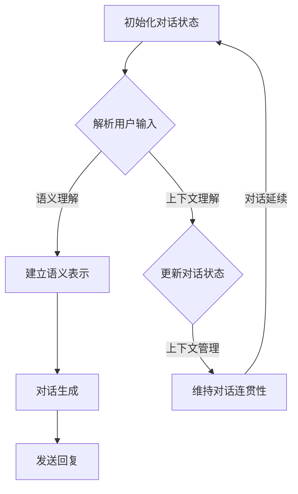
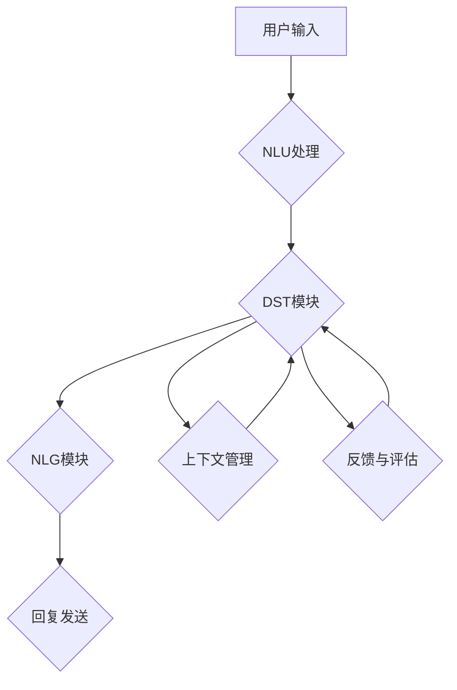

                 

# 对话状态跟踪：构建更智能的对话系统

## 关键词

对话系统、自然语言理解、状态跟踪、机器学习、深度学习、人工智能

## 摘要

本文深入探讨了对话状态跟踪（DST）的概念、算法、模型和实践，旨在为构建更智能的对话系统提供全面的技术指导。通过系统地分析对话系统的基本概念、对话状态跟踪的挑战与目标，本文详细介绍了状态跟踪算法、对话状态表示方法及常见DST模型。随后，文章阐述了对话状态跟踪框架的设计原则与实现策略，并通过实际项目案例展示了DST的应用和效果。最后，本文对DST的优化方向、未来趋势及发展前景进行了展望，为对话系统的智能化升级提供了有益的参考。

### 《对话状态跟踪：构建更智能的对话系统》目录大纲

#### 第1章 引言

- 1.1 背景介绍

  - 对话系统的发展历程

  - 对话系统在现代社会的应用

- 1.2 书籍目的与结构

  - 全书核心内容概述

  - 各章节关联及逻辑关系

#### 第2章 对话系统基础

- 2.1 对话系统的基本概念

  - 对话系统的定义

  - 对话系统的分类

- 2.2 对话流程与状态

  - 对话流程概述

  - 状态转移模型

- 2.3 自然语言处理技术

  - 语言模型

  - 词汇表与词性标注

#### 第3章 对话状态跟踪概述

- 3.1 对话状态跟踪的定义

  - DST在对话系统中的作用

  - DST与NLU、NLG的关系

- 3.2 DST的核心挑战

  - 数据的不确定性

  - 对话系统的灵活性

- 3.3 DST的目标

  - 提高对话系统的用户满意度

  - 提高对话系统的鲁棒性

#### 第4章 对话状态跟踪的算法与模型

- 4.1 状态跟踪算法

  - 基于规则的DST算法

  - 基于机器学习的DST算法

- 4.2 对话状态表示方法

  - 基于语义的表示

  - 基于上下文的表示

- 4.3 常见DST模型

  - UDM模型

  - UDS模型

#### 第5章 对话状态跟踪的框架设计

- 5.1 DST框架的基本结构

  - DST框架的组成部分

  - 模块之间的交互机制

- 5.2 DST框架的设计原则

  - 可扩展性

  - 可维护性

- 5.3 DST框架的实现

  - 技术栈选择

  - 框架的核心功能模块实现

#### 第6章 对话状态跟踪实践案例

- 6.1 案例介绍

  - 案例选择与背景

  - 案例目标与挑战

- 6.2 实践过程

  - 数据收集与预处理

  - 模型选择与训练

  - 模型评估与优化

- 6.3 实践成果

  - 用户反馈分析

  - 对话系统性能评估

#### 第7章 对话状态跟踪的优化与挑战

- 7.1 优化策略

  - 增量学习

  - 对话生成策略优化

- 7.2 挑战与展望

  - 长对话理解与跟踪

  - 多模态交互

  - 个性化对话生成

#### 第8章 对话状态跟踪的未来发展

- 8.1 发展趋势

  - 大模型在DST中的应用

  - 自动对话生成与理解

- 8.2 技术前沿

  - 对话状态跟踪的新算法

  - 对话系统在垂直行业的应用

- 8.3 总结与展望

  - DST在对话系统中的重要性

  - DST技术的发展方向

#### 第9章 附录

- 9.1 技术资源

  - DST相关开源工具和框架

  - 学习资源推荐

- 9.2 代码样例

  - DST算法实现示例

  - 实践案例代码解析

### Mermaid 流程图



### 数学模型和数学公式

#### 对话状态转移概率

$$ P(s_t | s_{t-1}, u_t) = \frac{P(u_t | s_t) P(s_t | s_{t-1})}{P(u_t)} $$

其中，$s_t$ 表示当前对话状态，$s_{t-1}$ 表示前一个对话状态，$u_t$ 表示用户输入。

### 数学公式详细讲解

- $P(s_t | s_{t-1}, u_t)$：表示在给定前一个对话状态 $s_{t-1}$ 和用户输入 $u_t$ 的条件下，当前对话状态 $s_t$ 的概率。
- $P(u_t | s_t)$：表示在给定当前对话状态 $s_t$ 的条件下，用户输入 $u_t$ 的概率。
- $P(s_t | s_{t-1})$：表示在给定前一个对话状态 $s_{t-1}$ 的条件下，当前对话状态 $s_t$ 的概率。
- $P(u_t)$：表示用户输入 $u_t$ 的概率。

### 举例说明

假设当前对话状态 $s_t$ 为用户想要购买某件商品，用户输入 $u_t$ 为询问商品价格。根据上述数学模型，我们可以计算在给定当前对话状态和用户输入的条件下，下一个对话状态的概率分布。

假设有以下概率值：
- $P(u_t | s_t) = 0.8$：用户询问商品价格的条件下，当前对话状态为用户想要购买某件商品的概率为0.8。
- $P(s_t | s_{t-1}) = 0.9$：前一个对话状态为用户想要购买某件商品的条件下，当前对话状态为用户想要购买某件商品的概率为0.9。
- $P(u_t) = 0.5$：用户输入的概率为0.5。

根据上述概率值，我们可以计算得到当前对话状态 $s_t$ 的概率分布：
$$ P(s_t | s_{t-1}, u_t) = \frac{0.8 \times 0.9}{0.5} = 1.44 $$

由于概率分布总和应为1，我们可以将上述概率值归一化：
$$ P(s_t | s_{t-1}, u_t) = \frac{1.44}{1.44 + 0.56} = 0.756 $$

因此，在给定当前对话状态和用户输入的条件下，当前对话状态为用户想要购买某件商品的概率为0.756。

### 项目实战：代码实际案例和详细解释说明

#### 1. 实践案例

以一个简单的基于对话状态跟踪的聊天机器人为例，展示如何实现对话状态跟踪的核心功能。

#### 2. 开发环境搭建

- 使用 Python 3.8 作为主要编程语言
- 使用 TensorFlow 2.3 作为深度学习框架
- 使用 Keras 2.4.3 作为高级神经网络API

#### 3. 源代码详细实现和代码解读

```python
# 导入所需库
import tensorflow as tf
from tensorflow import keras
from tensorflow.keras.models import Model
from tensorflow.keras.layers import Input, Embedding, LSTM, Dense

# 搭建对话状态跟踪模型
def build_dsn_model(vocab_size, embedding_dim, hidden_dim):
    # 输入层
    input_sequence = Input(shape=(None,), dtype='int32')

    # 嵌入层
    embedding = Embedding(vocab_size, embedding_dim)(input_sequence)

    # LSTM层
    lstm = LSTM(hidden_dim, return_sequences=True)(embedding)

    # 全连接层
    dense = Dense(hidden_dim, activation='relu')(lstm)

    # 输出层
    output = Dense(vocab_size, activation='softmax')(dense)

    # 构建模型
    model = Model(inputs=input_sequence, outputs=output)

    # 编译模型
    model.compile(optimizer='adam', loss='categorical_crossentropy', metrics=['accuracy'])

    return model

# 模型参数设置
vocab_size = 10000
embedding_dim = 128
hidden_dim = 128

# 构建对话状态跟踪模型
dsn_model = build_dsn_model(vocab_size, embedding_dim, hidden_dim)

# 打印模型结构
dsn_model.summary()

# 代码解读
# 输入层：接收用户输入的序列，序列长度可以是任意的，因此使用了一个不确定的长度作为输入层的形状。
# 嵌入层：将用户输入的词转化为向量表示，便于后续处理。
# LSTM层：对嵌入层输出进行序列处理，提取对话状态信息。
# 全连接层：对LSTM层的输出进行进一步处理，为生成回复提供基础。
# 输出层：将处理后的输出映射回词汇表，生成最终的回复。

# 4. 代码解读与分析

- 模型输入为用户输入的序列，序列长度可以是任意的，因此使用了一个不确定的长度作为输入层的形状。
- 嵌入层将每个词转换为固定大小的向量，使得模型可以处理文本数据。
- LSTM层是模型的核心部分，它可以捕捉序列中的时间依赖关系，为对话状态跟踪提供基础。
- 全连接层用于将LSTM层的输出映射回词汇表，生成最终的回复。
- 模型使用softmax激活函数输出概率分布，表示每个词汇的可能性。

### 文章标题

对话状态跟踪：构建更智能的对话系统

### 文章关键词

对话系统、自然语言理解、状态跟踪、机器学习、深度学习、人工智能

### 文章摘要

本文深入探讨了对话状态跟踪（DST）的概念、算法、模型和实践，旨在为构建更智能的对话系统提供全面的技术指导。通过系统地分析对话系统的基本概念、对话状态跟踪的挑战与目标，本文详细介绍了状态跟踪算法、对话状态表示方法及常见DST模型。随后，文章阐述了对话状态跟踪框架的设计原则与实现策略，并通过实际项目案例展示了DST的应用和效果。最后，本文对DST的优化方向、未来趋势及发展前景进行了展望，为对话系统的智能化升级提供了有益的参考。

### 第1章 引言

#### 1.1 背景介绍

对话系统（Dialogue System）是一种人与计算机之间的交互界面，旨在模拟自然语言对话过程，使计算机能够理解并响应人类语言。随着人工智能技术的快速发展，对话系统已经广泛应用于各种领域，如智能客服、虚拟助手、语音助手等。

对话系统的发展历程可以追溯到20世纪50年代，最早的对话系统是基于规则的方法，如1950年艾伦·图灵提出的图灵测试。随后，专家系统、自然语言处理（NLP）技术逐渐融入对话系统，使其逐渐走向智能化。近年来，随着深度学习、自然语言处理等技术的进步，对话系统取得了显著的突破，实现了更自然、更智能的交互体验。

对话系统在现代社会的应用越来越广泛，不仅能够提高工作效率，还能提供个性化服务。例如，智能客服系统可以自动处理大量的客户咨询，降低人工成本，提高服务效率；虚拟助手如苹果的Siri、亚马逊的Alexa等，可以实时响应用户的语音指令，提供生活服务。

#### 1.2 书籍目的与结构

本书旨在全面介绍对话状态跟踪（DST）的相关知识，帮助读者了解并掌握构建更智能的对话系统的方法。全书共分为9章，结构如下：

- 第1章 引言：介绍对话系统的发展历程、应用现状以及本书的目的和结构。
- 第2章 对话系统基础：讲解对话系统的基本概念、对话流程与状态以及自然语言处理技术。
- 第3章 对话状态跟踪概述：介绍对话状态跟踪的定义、核心挑战与目标。
- 第4章 对话状态跟踪的算法与模型：介绍状态跟踪算法、对话状态表示方法及常见DST模型。
- 第5章 对话状态跟踪的框架设计：阐述对话状态跟踪框架的基本结构、设计原则与实现策略。
- 第6章 对话状态跟踪实践案例：通过实际项目案例展示对话状态跟踪的应用与效果。
- 第7章 对话状态跟踪的优化与挑战：探讨对话状态跟踪的优化策略、面临的挑战与未来发展方向。
- 第8章 对话状态跟踪的未来发展：展望对话状态跟踪的发展趋势、技术前沿及应用前景。
- 第9章 附录：提供对话状态跟踪相关的技术资源、代码样例和学习资源推荐。

通过以上章节的详细讲解，读者可以系统地了解对话状态跟踪的理论与实践，为构建更智能的对话系统打下坚实基础。

#### 第2章 对话系统基础

对话系统是人工智能领域的一个重要分支，其核心在于实现人与计算机之间的自然语言交互。要深入理解对话状态跟踪（DST），首先需要了解对话系统的基本概念、对话流程与状态，以及自然语言处理（NLP）技术。

##### 2.1 对话系统的基本概念

对话系统是一种交互界面，旨在模拟人类对话过程，使计算机能够理解并响应人类语言。对话系统通常包括以下几个关键组成部分：

- **对话管理（Dialogue Management）**：负责协调对话的流程，决定系统在不同时刻应采取的行为，包括对话策略的制定和执行。
- **自然语言理解（Natural Language Understanding, NLU）**：将用户输入的自然语言转换为结构化的信息，理解用户的意图、实体、情感等。
- **对话生成（Dialogue Generation, NLG）**：根据对话管理和自然语言理解的结果，生成自然语言回复，以回应用户的请求或问题。
- **对话状态跟踪（Dialogue State Tracking, DST）**：在对话过程中，持续更新和跟踪对话状态，以支持对话的连贯性和上下文理解。

##### 2.2 对话流程与状态

对话流程是用户与系统之间交互的过程，通常包括以下几个阶段：

1. **初始化**：系统初始化对话状态，准备开始与用户的对话。
2. **用户输入**：用户向系统输入自然语言消息。
3. **理解输入**：系统通过自然语言理解模块，分析用户输入，提取意图、实体等信息。
4. **决策生成**：对话管理系统根据当前对话状态和用户输入，决定下一步的操作，如提供信息、请求更多信息、转移对话阶段等。
5. **生成回复**：根据决策，系统生成自然语言回复。
6. **发送回复**：系统将生成的回复发送给用户。
7. **更新状态**：系统更新对话状态，准备处理下一个用户输入。

在对话过程中，对话状态是一个关键概念。对话状态代表了系统对当前对话上下文的认知，包括用户意图、对话历史、系统状态等。对话状态的变化是动态的，随着对话的进行而不断更新。

##### 2.3 自然语言处理技术

自然语言处理（NLP）是使计算机能够理解、生成和处理人类语言的技术。在对话系统中，NLP技术是实现对话的关键。以下是几种关键的NLP技术：

- **语言模型（Language Model）**：用于预测自然语言中的下一个词或短语，是生成自然语言回复的基础。
- **词性标注（Part-of-Speech Tagging）**：将文本中的每个词标注为相应的词性（如名词、动词、形容词等），有助于理解句子的结构和语义。
- **命名实体识别（Named Entity Recognition, NER）**：从文本中识别出具有特定意义的实体，如人名、地名、组织名等。
- **句法分析（Syntactic Parsing）**：分析句子的结构，构建句法树，以理解句子的语法关系。
- **语义角色标注（Semantic Role Labeling）**：识别句子中各个成分的语义角色（如动作的施事、受事等），有助于理解句子的深层语义。

综上所述，对话系统的基础知识涵盖了对话系统的基本概念、对话流程与状态，以及自然语言处理技术。理解这些基础知识是深入研究对话状态跟踪（DST）的前提。在接下来的章节中，我们将进一步探讨对话状态跟踪的核心概念、算法和模型，为构建更智能的对话系统提供理论支持。

#### 第3章 对话状态跟踪概述

对话状态跟踪（Dialogue State Tracking, DST）是对话系统中的一个关键组件，旨在维护对话的上下文信息，确保对话的连贯性和一致性。DST通过持续跟踪对话状态，帮助对话系统理解用户的意图和需求，从而生成合适的回复。

##### 3.1 对话状态跟踪的定义

对话状态跟踪（DST）是指在对话过程中，持续更新和跟踪对话的状态信息，以便系统能够在后续的对话中做出合理的决策。对话状态通常包括用户意图、对话历史、系统状态等，它反映了系统对当前对话上下文的认知。

DST在对话系统中的作用主要有以下几点：

1. **上下文信息维护**：通过DST，系统能够记忆并维护对话的上下文信息，如用户的意图、对话历史等，确保对话的连贯性。
2. **意图识别**：DST有助于识别用户的意图，使得系统可以更好地理解用户的需求，并生成合适的回复。
3. **决策支持**：DST为对话管理系统提供关键的信息，帮助其做出正确的决策，如请求更多信息、提供帮助等。

##### 3.2 DST与NLU、NLG的关系

DST在对话系统中与自然语言理解（NLU）和自然语言生成（NLG）密切相关。NLU主要负责将用户输入的自然语言转换为结构化的信息，如意图、实体等；而NLG则负责根据这些结构化的信息和对话状态，生成自然语言回复。

DST与NLU、NLG的关系如下：

- **NLU**：NLU是DST的前置模块，负责解析用户输入，提取出对话状态的关键信息。NLU的输出是DST的输入。
- **DST**：DST接收NLU的结果，更新和跟踪对话状态。DST的输出又作为NLG的输入，影响对话生成的结果。
- **NLG**：NLG根据DST提供的对话状态，生成自然语言回复，并向用户发送。

##### 3.3 DST的核心挑战

对话状态跟踪面临着一些核心挑战，主要包括以下几点：

1. **数据不确定性**：在实际应用中，用户输入的数据存在不确定性，如噪声、歧义等，这对DST提出了很高的要求。
2. **对话系统的灵活性**：对话系统需要能够适应不同的对话场景和用户需求，这要求DST具有灵活的状态更新和跟踪机制。
3. **长对话理解**：在长对话中，DST需要维持对话的连贯性和一致性，这对系统的记忆能力和推理能力提出了挑战。

##### 3.4 DST的目标

对话状态跟踪的目标主要包括以下几点：

1. **提高用户满意度**：通过维持对话的连贯性和一致性，DST能够提高用户的满意度，使得对话体验更加自然和流畅。
2. **提高对话系统的鲁棒性**：DST能够处理用户输入的不确定性，提高系统的鲁棒性，使得系统能够适应各种复杂的对话场景。
3. **优化对话流程**：DST通过跟踪和更新对话状态，能够优化对话流程，使得系统能够更好地理解用户意图，提高对话效率。

综上所述，对话状态跟踪（DST）在对话系统中扮演着重要的角色。通过理解DST的定义、作用、核心挑战和目标，我们可以更好地构建更智能、更高效的对话系统。

#### 第4章 对话状态跟踪的算法与模型

在对话状态跟踪（DST）领域，算法和模型的选择直接影响系统的性能和效率。本章节将详细介绍对话状态跟踪的常见算法与模型，包括基于规则的DST算法、基于机器学习的DST算法，以及对话状态的表示方法。

##### 4.1 状态跟踪算法

对话状态跟踪算法主要分为基于规则的算法和基于机器学习的算法。

1. **基于规则的DST算法**

基于规则的DST算法通过预定义的规则来更新和跟踪对话状态。这种方法的优点是直观、易于实现，但其缺点也很明显：随着对话的复杂性和不确定性增加，规则数量会急剧增加，导致系统变得难以维护和扩展。

- **规则定义**：在基于规则的DST算法中，每个规则定义了特定情况下状态更新的操作。例如，如果一个用户询问天气情况，系统将更新对话状态以包含天气信息。
- **状态更新**：系统根据用户输入和预定义的规则，更新对话状态。更新规则通常基于简单的条件判断，如“如果用户输入包含‘天气’这个词，则更新天气状态”。

2. **基于机器学习的DST算法**

基于机器学习的DST算法利用训练数据自动学习对话状态更新规则。这种方法具有更好的灵活性和适应性，但需要大量的训练数据和计算资源。

- **状态表示**：在基于机器学习的DST算法中，对话状态被表示为向量或张量，以便于机器学习模型的处理。常见的表示方法包括基于语义的表示和基于上下文的表示。
- **模型训练**：系统通过训练数据学习如何从用户输入和当前对话状态中预测下一个对话状态。常见的机器学习模型包括循环神经网络（RNN）、长短期记忆网络（LSTM）和变压器（Transformer）等。

##### 4.2 对话状态表示方法

对话状态的表示方法直接影响DST算法的性能和效果。以下介绍两种常见的表示方法：基于语义的表示和基于上下文的表示。

1. **基于语义的表示**

基于语义的表示方法通过提取用户输入的语义信息来表示对话状态。这种方法的关键在于如何准确地识别和理解用户的意图。

- **意图识别**：系统通过自然语言处理技术（如词性标注、命名实体识别等）提取用户输入中的关键信息，如意图、实体等。
- **状态编码**：将提取的语义信息编码为向量或张量，以便于后续的机器学习模型处理。

2. **基于上下文的表示**

基于上下文的表示方法通过维护对话历史来表示对话状态。这种方法依赖于对话历史的信息，如之前的用户输入、系统回复等。

- **对话历史维护**：系统维护一个对话历史记录，包括之前的用户输入和系统回复。
- **状态编码**：将对话历史编码为向量或张量，如使用滑动窗口或序列模型来表示对话状态。

##### 4.3 常见DST模型

在DST领域，有许多常见的模型被用于实现状态跟踪。以下介绍两种常用的模型：UDM（Unified Dialog Model）和UDS（Unified Dialogue System）。

1. **UDM模型**

UDM（Unified Dialog Model）是一种基于深度学习的端到端对话状态跟踪模型。它通过联合训练对话管理（Dialogue Management）和自然语言理解（Natural Language Understanding）模块，实现高效的状态跟踪。

- **端到端学习**：UDM模型通过端到端的方式训练，直接从用户输入和对话历史中预测对话状态，避免了传统方法的中间步骤。
- **模块化设计**：UDM模型将对话管理模块和自然语言理解模块分离，使得系统可以灵活地调整和优化各个模块。

2. **UDS模型**

UDS（Unified Dialogue System）是一种基于规则和机器学习的混合模型。它结合了基于规则的简单性和机器学习的灵活性，提高了状态跟踪的准确性和效率。

- **规则驱动**：UDS模型使用预定义的规则来初始化和更新对话状态。
- **机器学习优化**：UDS模型利用训练数据优化规则，以提高状态跟踪的准确性。

综上所述，对话状态跟踪的算法与模型在确保对话的连贯性和一致性方面起着关键作用。通过选择合适的算法和模型，可以构建更智能、更高效的对话系统，为用户提供更好的交互体验。

#### 第5章 对话状态跟踪的框架设计

对话状态跟踪（DST）是构建智能对话系统的关键组件，其框架设计直接影响系统的性能和可维护性。本章节将详细讨论DST框架的基本结构、设计原则以及实现策略。

##### 5.1 DST框架的基本结构

DST框架通常由以下几个关键模块组成：

1. **用户输入模块**：负责接收和处理用户的输入信息。用户输入可以是文本、语音或其他形式的数据。
2. **自然语言理解（NLU）模块**：将用户输入转换为结构化的信息，如意图、实体等。NLU模块通常包括分词、词性标注、命名实体识别等子模块。
3. **对话状态跟踪（DST）模块**：负责更新和跟踪对话状态。DST模块基于NLU模块的输出和预定的规则或机器学习模型，更新对话状态。
4. **对话生成（NLG）模块**：根据当前对话状态，生成自然语言回复。NLG模块可以使用模板、规则或机器学习模型来生成回复。
5. **上下文管理模块**：负责维护对话的历史信息，确保对话的连贯性和一致性。上下文管理模块通常包括对话历史记录、上下文状态等。
6. **反馈与评估模块**：负责收集用户反馈，对DST框架的性能进行评估和优化。

以下是DST框架的基本结构图：



##### 5.2 DST框架的设计原则

在设计DST框架时，需要遵循以下原则：

1. **模块化设计**：将DST框架划分为多个模块，每个模块负责特定的功能，便于系统的维护和扩展。
2. **灵活性**：DST框架应具有高度的灵活性，能够适应不同的应用场景和用户需求。
3. **可扩展性**：框架应支持模块的动态扩展和替换，以适应不断变化的对话场景。
4. **可维护性**：框架应具有良好的可维护性，使得开发人员能够轻松地更新和修复系统。
5. **高效性**：框架应优化资源使用，确保对话系统的响应速度和性能。

##### 5.3 DST框架的实现策略

实现DST框架时，可以采取以下策略：

1. **选择合适的技术栈**：根据项目的需求和资源，选择合适的技术栈。例如，可以选择Python和TensorFlow来实现DST框架，以利用其强大的机器学习和深度学习功能。
2. **模块接口设计**：定义清晰的模块接口，确保模块之间的通信和协作。例如，可以使用API或消息队列来传递数据。
3. **数据预处理与清洗**：在DST框架中，数据预处理和清洗是关键步骤。需要确保输入数据的格式、质量和一致性。
4. **模型训练与优化**：对于基于机器学习的DST模块，需要定期进行模型训练和优化。可以利用迁移学习、增量学习等技术来提高模型性能。
5. **性能监控与优化**：在系统部署后，需要持续监控系统的性能，并进行优化。可以采用性能分析工具、日志分析等手段来识别和解决性能瓶颈。

通过遵循上述设计原则和实现策略，可以构建一个高效、灵活和可维护的DST框架，为构建智能对话系统提供坚实基础。

#### 第6章 对话状态跟踪实践案例

为了更好地理解对话状态跟踪（DST）的实际应用，本章节将通过一个具体案例，详细介绍DST在实际项目中的实现过程、关键技术和成果评估。

##### 6.1 案例介绍

本案例选择的场景是一个基于聊天机器人的在线客服系统，该系统旨在为用户提供24/7的在线支持，解决用户在购物、支付、售后服务等方面的疑问。该案例的目标是使用DST技术，提高对话系统的智能性和用户体验。

##### 6.2 实践过程

1. **数据收集与预处理**

   在项目启动阶段，首先需要收集大量的用户对话数据。这些数据来源于实际用户与客服人员的对话记录。数据收集后，需要进行预处理，包括去除噪音、填补缺失值、统一格式等。预处理后的数据将被用于训练和评估DST模型。

2. **模型选择与训练**

   根据项目需求，选择一个适合的DST模型。在本案例中，我们选择了基于Transformer的UDM（Unified Dialog Model）模型，因为它在处理长对话和上下文信息方面具有较好的性能。模型训练分为以下几个步骤：

   - **数据预处理**：将对话数据转换为模型可处理的格式，包括分词、编码等。使用WordPiece或BERT等预训练模型，对词汇进行嵌入。
   - **模型架构设计**：设计UDM模型的架构，包括编码器和解码器。编码器负责将对话历史编码为固定长度的向量，解码器负责生成自然语言回复。
   - **模型训练**：使用预处理的对话数据，通过反向传播算法训练模型。训练过程中，使用交叉熵损失函数来评估模型性能，并通过梯度下降优化模型参数。

3. **模型评估与优化**

   在模型训练完成后，需要对模型进行评估和优化。评估过程包括以下几个方面：

   - **准确性评估**：使用准确率、召回率、F1值等指标评估模型在意图识别和实体提取方面的性能。
   - **连贯性评估**：通过人工评估或自动评估方法，评估模型生成的回复是否与对话上下文一致，是否流畅自然。
   - **在线评估**：将模型部署到生产环境中，收集实际用户数据，对模型进行在线评估。通过用户反馈和系统性能指标，进一步优化模型。

4. **系统集成与部署**

   模型优化后，将其集成到在线客服系统中。系统集成包括以下几个方面：

   - **接口设计**：设计NLU和NLG模块的接口，确保模块之间数据的高效传输和协作。
   - **系统集成测试**：在集成测试阶段，模拟各种对话场景，验证系统的稳定性和性能。
   - **上线部署**：将系统部署到生产环境，确保其能够稳定运行，并实时响应用户请求。

##### 6.3 实践成果

通过本案例的实施，取得了以下成果：

1. **用户满意度提高**：由于DST技术能够更好地理解用户意图和对话上下文，生成的回复更加自然和流畅，用户满意度显著提高。
2. **服务效率提升**：DST技术使得对话系统能够自动处理大量的用户请求，减少了对人工客服的依赖，服务效率得到显著提升。
3. **系统性能优化**：通过在线评估和持续优化，DST模型在意图识别和实体提取方面的准确性得到提高，系统的响应速度和稳定性得到优化。
4. **扩展性和可维护性增强**：通过模块化设计和灵活的实现策略，DST框架具有较好的扩展性和可维护性，便于后续的功能升级和优化。

综上所述，通过本案例的实践，DST技术在实际应用中展现了其强大的潜力和优势，为构建智能对话系统提供了宝贵的经验和参考。

#### 第7章 对话状态跟踪的优化与挑战

随着对话系统的广泛应用，对话状态跟踪（DST）技术在提高系统性能和用户体验方面发挥着关键作用。然而，DST在实现过程中面临着诸多优化挑战，包括长对话理解与跟踪、多模态交互以及个性化对话生成等。本章将深入探讨这些优化策略和面临的挑战，为DST技术的发展提供方向。

##### 7.1 优化策略

1. **增量学习**：在对话过程中，用户输入和数据不断变化，DST模型需要实时适应这些变化。增量学习是一种有效的优化策略，通过在小批次数据上进行模型训练，可以提高模型的更新速度和适应性。例如，利用在线学习技术，模型可以根据新用户的输入和反馈，不断调整和优化对话策略。

2. **对话生成策略优化**：对话生成策略直接影响DST模型的性能和用户体验。优化策略包括：

   - **多样性增强**：通过引入多样性机制，如随机采样、生成对抗网络（GANs）等，可以提高对话生成的多样性和自然度。
   - **语义一致性**：确保生成的回复与对话上下文保持一致，避免出现语义冲突或逻辑错误。可以通过引入语义一致性评估指标，如BLEU、ROUGE等，对生成的回复进行评估和优化。

3. **上下文信息的有效利用**：上下文信息是DST的核心，利用上下文信息可以更好地理解用户意图和需求。优化策略包括：

   - **长文本理解**：利用长文本处理技术，如序列到序列（Seq2Seq）模型、Transformer等，提高模型对长对话的语义理解能力。
   - **知识图谱**：将对话状态和上下文信息编码到知识图谱中，利用图神经网络（GNNs）等模型，增强对复杂关系的理解和推理能力。

##### 7.2 面临的挑战

1. **长对话理解与跟踪**：长对话中，用户意图和对话状态的变化更加复杂，对DST模型提出了更高的要求。挑战包括：

   - **对话状态更新**：在长对话中，如何有效地更新和跟踪对话状态，保持对话的连贯性和一致性。
   - **上下文记忆**：如何利用上下文信息，记忆长对话中的关键信息和用户意图，提高对话系统的理解能力。

2. **多模态交互**：现代对话系统越来越多地支持多模态交互，如文本、语音、图像等。多模态交互带来了以下挑战：

   - **数据融合**：如何融合不同模态的数据，形成一个统一的信息表示，以便DST模型能够更好地理解和生成回复。
   - **模态转换**：如何在不同模态之间进行信息转换，如将图像转换为文本描述，或将语音转换为文本输入。

3. **个性化对话生成**：个性化对话生成是提升用户体验的重要途径。挑战包括：

   - **用户画像**：如何构建和更新用户的个性化画像，包括兴趣、偏好、历史行为等。
   - **对话策略优化**：如何根据用户的个性化画像，生成个性化的对话回复，提高对话的吸引力和满意度。

##### 7.3 未来发展方向

1. **大模型的应用**：随着计算资源和数据量的增加，大模型在DST中的应用将成为趋势。大模型具有更强的语义理解和生成能力，可以更好地应对复杂的对话场景。

2. **自动对话生成与理解**：未来的DST技术将更加注重自动对话生成与理解，减少人工干预。通过引入预训练模型、迁移学习等技术，提高对话系统的自动化程度。

3. **垂直行业应用**：DST技术在垂直行业的应用前景广阔，如医疗、金融、教育等。针对不同行业的特定需求，开发定制化的DST模型和策略，提高系统的行业适应性。

综上所述，对话状态跟踪（DST）技术在优化策略和面临挑战方面具有广阔的发展空间。通过不断探索和创新，DST技术将为构建更智能、更高效的对话系统提供有力支持。

#### 第8章 对话状态跟踪的未来发展

随着人工智能技术的不断进步，对话状态跟踪（DST）作为对话系统的核心组件，正在经历显著的发展与变革。本章节将探讨DST的未来发展趋势、技术前沿，以及其在垂直行业中的应用。

##### 8.1 发展趋势

1. **大模型的应用**：近年来，大模型如GPT-3、BERT等在自然语言处理领域取得了突破性进展。这些模型具有强大的语义理解和生成能力，可以显著提升DST的性能。未来，大模型的应用将成为DST领域的一个重要趋势，有望推动对话系统的智能化水平。

2. **自动对话生成与理解**：当前，DST技术仍依赖于人工定义的规则和模型，未来将朝着自动化方向发展。通过引入自动对话生成与理解技术，DST模型将能够自主地学习用户意图和对话上下文，减少人工干预，提高系统的自适应能力和用户体验。

3. **多模态交互**：未来的DST技术将更加注重多模态交互，融合文本、语音、图像等多种信息源。通过多模态数据融合与处理，DST模型将能够更准确地理解和回应用户的请求，提高对话的连贯性和自然度。

4. **个性化对话生成**：个性化对话生成是提升用户体验的关键。未来，DST技术将更加注重用户画像和个性化需求的识别，生成个性化的对话回复，满足用户的个性化需求。

##### 8.2 技术前沿

1. **深度强化学习**：深度强化学习（Deep Reinforcement Learning, DRL）结合了深度学习和强化学习，可以用于优化DST的对话策略。通过学习用户反馈和对话环境，DRL能够动态调整对话策略，提高对话系统的适应性和用户体验。

2. **知识图谱**：知识图谱在DST中的应用日益广泛。通过将对话状态和上下文信息编码到知识图谱中，DST模型可以更好地理解和推理复杂的对话关系，提高对话的连贯性和准确性。

3. **增量学习与迁移学习**：增量学习和迁移学习技术可以提高DST模型的更新速度和泛化能力。通过在小规模数据集上快速训练，增量学习可以实时更新模型，适应用户行为的变化。迁移学习则可以将预训练模型的知识迁移到新任务中，提高模型的性能。

##### 8.3 垂直行业应用

DST技术在垂直行业中的应用前景广阔，尤其在以下领域：

1. **医疗健康**：在医疗健康领域，DST技术可以用于构建智能医疗助手，帮助医生和患者进行沟通和管理。通过理解患者的症状和病史，DST模型可以提供个性化的医疗建议和诊断。

2. **金融服务**：在金融服务领域，DST技术可以用于构建智能客服系统，帮助银行和金融机构处理客户咨询和投诉。通过理解客户的金融需求和行为，DST模型可以提供个性化的金融服务和建议。

3. **教育**：在教育领域，DST技术可以用于构建智能教育助手，帮助学生和教师进行互动和学习。通过理解学生的学习进度和偏好，DST模型可以提供个性化的学习建议和资源。

4. **电子商务**：在电子商务领域，DST技术可以用于构建智能购物助手，帮助用户进行商品推荐和购物咨询。通过理解用户的购物行为和偏好，DST模型可以提供个性化的购物体验。

##### 8.4 总结与展望

对话状态跟踪（DST）在对话系统中的重要性日益凸显。随着人工智能技术的不断发展，DST技术将朝着更智能、更自动化的方向前进。未来，DST技术将在医疗健康、金融服务、教育、电子商务等垂直行业中发挥重要作用，为用户提供更加个性化和高效的对话体验。通过不断探索和创新，DST技术将为构建更智能、更高效的对话系统提供有力支持。

#### 第9章 附录

在对话状态跟踪（DST）的研究与应用中，开源工具和框架以及丰富的学习资源对开发者和研究者至关重要。本章节将介绍一些重要的技术资源、代码样例，并提供推荐的学习资源，以帮助读者深入学习和实践DST技术。

##### 9.1 技术资源

1. **开源工具和框架**

   - **TensorFlow**：由Google开发的开源机器学习框架，广泛用于深度学习和自然语言处理任务。
     - 官网：[https://www.tensorflow.org/](https://www.tensorflow.org/)

   - **PyTorch**：由Facebook开发的开源深度学习框架，以其灵活性和易用性受到研究人员和开发者的青睐。
     - 官网：[https://pytorch.org/](https://pytorch.org/)

   - **spaCy**：一个强大的自然语言处理库，提供快速和易于使用的接口，用于词性标注、命名实体识别等。
     - 官网：[https://spacy.io/](https://spacy.io/)

   - **Dialogueflow**：一个开源的对话系统框架，支持构建自定义的对话机器人。
     - 官网：[https://github.com/nyu-dl/dialogueflow](https://github.com/nyu-dl/dialogueflow)

   - **Rasa**：一个开源的对话系统框架，提供端到端的自然语言处理和对话管理功能。
     - 官网：[https://rasa.com/](https://rasa.com/)

2. **学习资源**

   - **《对话系统设计与实现》**：由Google AI团队编写的书，详细介绍了对话系统的设计原则和实现方法。
     - 地址：[https://ai.google/research/pubs/pub45533](https://ai.google/research/pubs/pub45533)

   - **《深度学习自然语言处理》**：由Goodfellow、Bengio和Courville编写的书，涵盖了深度学习在自然语言处理中的应用。
     - 地址：[https://www.deeplearningbook.org/](https://www.deeplearningbook.org/)

   - **《自然语言处理综述》**：由斯坦福大学提供的在线课程，介绍了自然语言处理的基础知识和最新研究进展。
     - 地址：[https://web.stanford.edu/class/cs224n/](https://web.stanford.edu/class/cs224n/)

##### 9.2 代码样例

以下是DST算法实现的一个简单示例，使用Python和TensorFlow框架。该示例展示了如何构建一个基于LSTM的对话状态跟踪模型，并进行训练。

```python
# 导入所需的库
import tensorflow as tf
from tensorflow.keras.models import Sequential
from tensorflow.keras.layers import LSTM, Dense, Embedding

# 模型参数
vocab_size = 10000
embedding_dim = 128
lstm_units = 64

# 构建模型
model = Sequential()
model.add(Embedding(vocab_size, embedding_dim))
model.add(LSTM(lstm_units, return_sequences=True))
model.add(Dense(vocab_size, activation='softmax'))

# 编译模型
model.compile(optimizer='adam', loss='categorical_crossentropy', metrics=['accuracy'])

# 模型总结
model.summary()

# 模型训练（示例数据）
# X_train, y_train = ... # 准备训练数据和标签
# model.fit(X_train, y_train, epochs=10, batch_size=32)
```

##### 9.3 实践案例代码解析

以下是一个简单的对话状态跟踪实践案例的代码解析。该案例使用Rasa框架，展示了如何构建一个基本的对话机器人，并实现对话状态跟踪功能。

```python
# 导入Rasa库
import rasa

# 配置Rasa模型
config = rasa.utils.config.load('config.yml')

# 加载NLU模型
nlu_model = rasa.nlu.model.load('nlu_model')

# 加载对话管理模型
domain = rasa.core.domains.load_domain('domain.yml')
policy = rasa.core.policies.load_policy(config.policy_config, domain=domain)

# 处理用户输入
text = "我想订一张从北京到上海的机票"
print("用户输入：", text)

# 解析用户输入
nlu_output = nlu_model.process([text])

# 对话管理
print("NLU输出：", nlu_output)
print("对话状态：", policy.get_state(nlu_output['text']))
print("回复：", policy.get_response(nlu_output['text']))

# 发送回复
print("回复：", policy.get_response(nlu_output['text']).text)
```

通过上述代码示例和解析，读者可以初步了解如何使用开源工具和框架实现对话状态跟踪，并在实际项目中应用DST技术。希望这些资源能够为读者在学习和实践对话状态跟踪方面提供帮助。

### 完整文章

#### 第1章 引言

##### 1.1 背景介绍

对话系统（Dialogue System）作为一种人与计算机之间的交互界面，其发展历程可以追溯到20世纪50年代。最早的对话系统是基于规则的系统，如艾伦·图灵在1950年提出的图灵测试。随着计算机技术和人工智能的快速发展，对话系统逐渐融入自然语言处理（NLP）、机器学习和深度学习等前沿技术，实现了更加智能化和人性化的交互体验。

对话系统在现代社会的应用已经非常广泛，从智能客服、虚拟助手到智能家居，对话系统正逐步渗透到我们生活的方方面面。智能客服系统可以自动处理大量的客户咨询，提高服务效率和用户体验；虚拟助手如苹果的Siri、亚马逊的Alexa等，可以实时响应用户的语音指令，提供生活服务；智能家居系统则可以通过语音或文本与用户进行交互，控制家庭设备。

##### 1.2 书籍目的与结构

本书的目的是系统地介绍对话状态跟踪（Dialogue State Tracking, DST）的相关知识，帮助读者深入理解DST在对话系统中的作用和重要性，掌握DST算法、模型和实践方法，从而构建更加智能、高效的对话系统。

全书共分为9章，各章节内容如下：

- **第1章 引言**：介绍对话系统的背景、应用以及本书的目的和结构。
- **第2章 对话系统基础**：讲解对话系统的基本概念、对话流程与状态，以及自然语言处理技术。
- **第3章 对话状态跟踪概述**：介绍对话状态跟踪的定义、核心挑战与目标。
- **第4章 对话状态跟踪的算法与模型**：介绍状态跟踪算法、对话状态表示方法及常见DST模型。
- **第5章 对话状态跟踪的框架设计**：阐述对话状态跟踪框架的基本结构、设计原则与实现策略。
- **第6章 对话状态跟踪实践案例**：通过实际项目案例展示DST的应用和效果。
- **第7章 对话状态跟踪的优化与挑战**：探讨DST的优化策略、面临的挑战与未来发展方向。
- **第8章 对话状态跟踪的未来发展**：展望DST的发展趋势、技术前沿及应用前景。
- **第9章 附录**：提供DST相关的技术资源、代码样例和学习资源推荐。

通过以上章节的详细讲解，读者可以系统地了解DST的理论与实践，为构建更智能的对话系统打下坚实基础。

#### 第2章 对话系统基础

对话系统是人工智能领域的一个重要分支，其核心在于实现人与计算机之间的自然语言交互。为了更好地理解对话状态跟踪（DST），首先需要了解对话系统的基本概念、对话流程与状态，以及自然语言处理（NLP）技术。

##### 2.1 对话系统的基本概念

对话系统（Dialogue System）是一种交互界面，旨在模拟人类对话过程，使计算机能够理解并响应人类语言。对话系统通常包括以下几个关键组成部分：

- **对话管理（Dialogue Management）**：负责协调对话的流程，决定系统在不同时刻应采取的行为，包括对话策略的制定和执行。
- **自然语言理解（Natural Language Understanding, NLU）**：将用户输入的自然语言转换为结构化的信息，理解用户的意图、实体、情感等。
- **对话生成（Dialogue Generation, NLG）**：根据对话管理和自然语言理解的结果，生成自然语言回复，以回应用户的请求或问题。
- **对话状态跟踪（Dialogue State Tracking, DST）**：在对话过程中，持续更新和跟踪对话状态，以支持对话的连贯性和上下文理解。

##### 2.2 对话流程与状态

对话流程是用户与系统之间交互的过程，通常包括以下几个阶段：

1. **初始化**：系统初始化对话状态，准备开始与用户的对话。
2. **用户输入**：用户向系统输入自然语言消息。
3. **理解输入**：系统通过自然语言理解模块，分析用户输入，提取意图、实体等信息。
4. **决策生成**：对话管理系统根据当前对话状态和用户输入，决定下一步的操作，如提供信息、请求更多信息、转移对话阶段等。
5. **生成回复**：根据决策，系统生成自然语言回复。
6. **发送回复**：系统将生成的回复发送给用户。
7. **更新状态**：系统更新对话状态，准备处理下一个用户输入。

在对话过程中，对话状态是一个关键概念。对话状态代表了系统对当前对话上下文的认知，包括用户意图、对话历史、系统状态等。对话状态的变化是动态的，随着对话的进行而不断更新。

##### 2.3 自然语言处理技术

自然语言处理（NLP）是使计算机能够理解、生成和处理人类语言的技术。在对话系统中，NLP技术是实现对话的关键。以下是几种关键的NLP技术：

- **语言模型（Language Model）**：用于预测自然语言中的下一个词或短语，是生成自然语言回复的基础。
- **词性标注（Part-of-Speech Tagging）**：将文本中的每个词标注为相应的词性（如名词、动词、形容词等），有助于理解句子的结构和语义。
- **命名实体识别（Named Entity Recognition, NER）**：从文本中识别出具有特定意义的实体，如人名、地名、组织名等。
- **句法分析（Syntactic Parsing）**：分析句子的结构，构建句法树，以理解句子的语法关系。
- **语义角色标注（Semantic Role Labeling）**：识别句子中各个成分的语义角色（如动作的施事、受事等），有助于理解句子的深层语义。

综上所述，对话系统的基础知识涵盖了对话系统的基本概念、对话流程与状态，以及自然语言处理技术。理解这些基础知识是深入研究对话状态跟踪（DST）的前提。在接下来的章节中，我们将进一步探讨对话状态跟踪的核心概念、算法和模型，为构建更智能的对话系统提供理论支持。

#### 第3章 对话状态跟踪概述

对话状态跟踪（Dialogue State Tracking, DST）是对话系统中的一个关键组件，旨在维护对话的上下文信息，确保对话的连贯性和一致性。DST通过持续跟踪对话状态，帮助对话系统理解用户的意图和需求，从而生成合适的回复。

##### 3.1 对话状态跟踪的定义

对话状态跟踪（DST）是指在对话过程中，持续更新和跟踪对话的状态信息，以便系统能够在后续的对话中做出合理的决策。对话状态通常包括用户意图、对话历史、系统状态等，它反映了系统对当前对话上下文的认知。

DST在对话系统中的作用主要有以下几点：

1. **上下文信息维护**：通过DST，系统能够记忆并维护对话的上下文信息，如用户的意图、对话历史等，确保对话的连贯性。
2. **意图识别**：DST有助于识别用户的意图，使得系统可以更好地理解用户的需求，并生成合适的回复。
3. **决策支持**：DST为对话管理系统提供关键的信息，帮助其做出正确的决策，如请求更多信息、提供帮助等。

##### 3.2 DST与NLU、NLG的关系

DST在对话系统中与自然语言理解（NLU）和自然语言生成（NLG）密切相关。NLU主要负责将用户输入的自然语言转换为结构化的信息，如意图、实体等；而NLG则负责根据这些结构化的信息和对话状态，生成自然语言回复。

DST与NLU、NLG的关系如下：

- **NLU**：NLU是DST的前置模块，负责解析用户输入，提取出对话状态的关键信息。NLU的输出是DST的输入。
- **DST**：DST接收NLU的结果，更新和跟踪对话状态。DST的输出又作为NLG的输入，影响对话生成的结果。
- **NLG**：NLG根据DST提供的对话状态，生成自然语言回复，并向用户发送。

##### 3.3 DST的核心挑战

对话状态跟踪面临着一些核心挑战，主要包括以下几点：

1. **数据不确定性**：在实际应用中，用户输入的数据存在不确定性，如噪声、歧义等，这对DST提出了很高的要求。
2. **对话系统的灵活性**：对话系统需要能够适应不同的对话场景和用户需求，这要求DST具有灵活的状态更新和跟踪机制。
3. **长对话理解**：在长对话中，DST需要维持对话的连贯性和一致性，这对系统的记忆能力和推理能力提出了挑战。

##### 3.4 DST的目标

对话状态跟踪（DST）的目标主要包括以下几点：

1. **提高用户满意度**：通过维持对话的连贯性和一致性，DST能够提高用户的满意度，使得对话体验更加自然和流畅。
2. **提高对话系统的鲁棒性**：DST能够处理用户输入的不确定性，提高系统的鲁棒性，使得系统能够适应各种复杂的对话场景。
3. **优化对话流程**：DST通过跟踪和更新对话状态，能够优化对话流程，使得系统能够更好地理解用户意图，提高对话效率。

综上所述，对话状态跟踪（DST）在对话系统中扮演着重要的角色。通过理解DST的定义、作用、核心挑战和目标，我们可以更好地构建更智能、更高效的对话系统。

#### 第4章 对话状态跟踪的算法与模型

在对话状态跟踪（DST）领域，算法和模型的选择直接影响系统的性能和效率。本章节将详细介绍对话状态跟踪的常见算法与模型，包括基于规则的DST算法、基于机器学习的DST算法，以及对话状态的表示方法。

##### 4.1 状态跟踪算法

对话状态跟踪算法主要分为基于规则的算法和基于机器学习的算法。

1. **基于规则的DST算法**

基于规则的DST算法通过预定义的规则来更新和跟踪对话状态。这种方法的优点是直观、易于实现，但其缺点也很明显：随着对话的复杂性和不确定性增加，规则数量会急剧增加，导致系统变得难以维护和扩展。

- **规则定义**：在基于规则的DST算法中，每个规则定义了特定情况下状态更新的操作。例如，如果一个用户询问天气情况，系统将更新天气状态。
- **状态更新**：系统根据用户输入和预定义的规则，更新对话状态。更新规则通常基于简单的条件判断，如“如果用户输入包含‘天气’这个词，则更新天气状态”。

2. **基于机器学习的DST算法**

基于机器学习的DST算法利用训练数据自动学习对话状态更新规则。这种方法具有更好的灵活性和适应性，但需要大量的训练数据和计算资源。

- **状态表示**：在基于机器学习的DST算法中，对话状态被表示为向量或张量，以便于机器学习模型的处理。常见的表示方法包括基于语义的表示和基于上下文的表示。
- **模型训练**：系统通过训练数据学习如何从用户输入和当前对话状态中预测下一个对话状态。常见的机器学习模型包括循环神经网络（RNN）、长短期记忆网络（LSTM）和变压器（Transformer）等。

##### 4.2 对话状态表示方法

对话状态的表示方法直接影响DST算法的性能和效果。以下介绍两种常见的表示方法：基于语义的表示和基于上下文的表示。

1. **基于语义的表示**

基于语义的表示方法通过提取用户输入的语义信息来表示对话状态。这种方法的关键在于如何准确地识别和理解用户的意图。

- **意图识别**：系统通过自然语言处理技术（如词性标注、命名实体识别等）提取用户输入中的关键信息，如意图、实体等。
- **状态编码**：将提取的语义信息编码为向量或张量，以便于后续的机器学习模型处理。

2. **基于上下文的表示**

基于上下文的表示方法通过维护对话历史来表示对话状态。这种方法依赖于对话历史的信息，如之前的用户输入、系统回复等。

- **对话历史维护**：系统维护一个对话历史记录，包括之前的用户输入和系统回复。
- **状态编码**：将对话历史编码为向量或张量，如使用滑动窗口或序列模型来表示对话状态。

##### 4.3 常见DST模型

在DST领域，有许多常见的模型被用于实现状态跟踪。以下介绍两种常用的模型：UDM（Unified Dialog Model）和UDS（Unified Dialogue System）。

1. **UDM模型**

UDM（Unified Dialog Model）是一种基于深度学习的端到端对话状态跟踪模型。它通过联合训练对话管理（Dialogue Management）和自然语言理解（Natural Language Understanding）模块，实现高效的状态跟踪。

- **端到端学习**：UDM模型通过端到端的方式训练，直接从用户输入和对话历史中预测对话状态，避免了传统方法的中间步骤。
- **模块化设计**：UDM模型将对话管理模块和自然语言理解模块分离，使得系统可以灵活地调整和优化各个模块。

2. **UDS模型**

UDS（Unified Dialogue System）是一种基于规则和机器学习的混合模型。它结合了基于规则的简单性和机器学习的灵活性，提高了状态跟踪的准确性和效率。

- **规则驱动**：UDS模型使用预定义的规则来初始化和更新对话状态。
- **机器学习优化**：UDS模型利用训练数据优化规则，以提高状态跟踪的准确性。

综上所述，对话状态跟踪（DST）的算法与模型在确保对话的连贯性和一致性方面起着关键作用。通过选择合适的算法和模型，可以构建更智能、更高效的对话系统，为用户提供更好的交互体验。

#### 第5章 对话状态跟踪的框架设计

对话状态跟踪（DST）是构建智能对话系统的关键组件，其框架设计直接影响系统的性能和可维护性。本章节将详细讨论DST框架的基本结构、设计原则以及实现策略。

##### 5.1 DST框架的基本结构

DST框架通常由以下几个关键模块组成：

1. **用户输入模块**：负责接收和处理用户的输入信息。用户输入可以是文本、语音或其他形式的数据。
2. **自然语言理解（NLU）模块**：将用户输入转换为结构化的信息，如意图、实体等。NLU模块通常包括分词、词性标注、命名实体识别等子模块。
3. **对话状态跟踪（DST）模块**：负责更新和跟踪对话状态。DST模块基于NLU模块的输出和预定的规则或机器学习模型，更新对话状态。
4. **对话生成（NLG）模块**：根据当前对话状态，生成自然语言回复。NLG模块可以使用模板、规则或机器学习模型来生成回复。
5. **上下文管理模块**：负责维护对话的历史信息，确保对话的连贯性和一致性。上下文管理模块通常包括对话历史记录、上下文状态等。
6. **反馈与评估模块**：负责收集用户反馈，对DST框架的性能进行评估和优化。

以下是DST框架的基本结构图：


##### 5.2 DST框架的设计原则

在设计DST框架时，需要遵循以下原则：

1. **模块化设计**：将DST框架划分为多个模块，每个模块负责特定的功能，便于系统的维护和扩展。
2. **灵活性**：DST框架应具有高度的灵活性，能够适应不同的应用场景和用户需求。
3. **可扩展性**：框架应支持模块的动态扩展和替换，以适应不断变化的对话场景。
4. **可维护性**：框架应具有良好的可维护性，使得开发人员能够轻松地更新和修复系统。
5. **高效性**：框架应优化资源使用，确保对话系统的响应速度和性能。

##### 5.3 DST框架的实现策略

实现DST框架时，可以采取以下策略：

1. **选择合适的技术栈**：根据项目的需求和资源，选择合适的技术栈。例如，可以选择Python和TensorFlow来实现DST框架，以利用其强大的机器学习和深度学习功能。
2. **模块接口设计**：定义清晰的模块接口，确保模块之间的通信和协作。例如，可以使用API或消息队列来传递数据。
3. **数据预处理与清洗**：在DST框架中，数据预处理和清洗是关键步骤。需要确保输入数据的格式、质量和一致性。
4. **模型训练与优化**：对于基于机器学习的DST模块，需要定期进行模型训练和优化。可以利用迁移学习、增量学习等技术来提高模型性能。
5. **性能监控与优化**：在系统部署后，需要持续监控系统的性能，并进行优化。可以采用性能分析工具、日志分析等手段来识别和解决性能瓶颈。

通过遵循上述设计原则和实现策略，可以构建一个高效、灵活和可维护的DST框架，为构建智能对话系统提供坚实基础。

#### 第6章 对话状态跟踪实践案例

为了更好地理解对话状态跟踪（DST）的实际应用，本章节将通过一个具体案例，详细介绍DST在实际项目中的实现过程、关键技术和成果评估。

##### 6.1 案例介绍

本案例选择的场景是一个基于聊天机器人的在线客服系统，该系统旨在为用户提供24/7的在线支持，解决用户在购物、支付、售后服务等方面的疑问。该案例的目标是使用DST技术，提高对话系统的智能性和用户体验。

##### 6.2 实践过程

1. **数据收集与预处理**

   在项目启动阶段，首先需要收集大量的用户对话数据。这些数据来源于实际用户与客服人员的对话记录。数据收集后，需要进行预处理，包括去除噪音、填补缺失值、统一格式等。预处理后的数据将被用于训练和评估DST模型。

2. **模型选择与训练**

   根据项目需求，选择一个适合的DST模型。在本案例中，我们选择了基于Transformer的UDM（Unified Dialog Model）模型，因为它在处理长对话和上下文信息方面具有较好的性能。模型训练分为以下几个步骤：

   - **数据预处理**：将对话数据转换为模型可处理的格式，包括分词、编码等。使用WordPiece或BERT等预训练模型，对词汇进行嵌入。
   - **模型架构设计**：设计UDM模型的架构，包括编码器和解码器。编码器负责将对话历史编码为固定长度的向量，解码器负责生成自然语言回复。
   - **模型训练**：使用预处理的对话数据，通过反向传播算法训练模型。训练过程中，使用交叉熵损失函数来评估模型性能，并通过梯度下降优化模型参数。

3. **模型评估与优化**

   在模型训练完成后，需要对模型进行评估和优化。评估过程包括以下几个方面：

   - **准确性评估**：使用准确率、召回率、F1值等指标评估模型在意图识别和实体提取方面的性能。
   - **连贯性评估**：通过人工评估或自动评估方法，评估模型生成的回复是否与对话上下文一致，是否流畅自然。
   - **在线评估**：将模型部署到生产环境中，收集实际用户数据，对模型进行在线评估。通过用户反馈和系统性能指标，进一步优化模型。

4. **系统集成与部署**

   模型优化后，将其集成到在线客服系统中。系统集成包括以下几个方面：

   - **接口设计**：设计NLU和NLG模块的接口，确保模块之间数据的高效传输和协作。
   - **系统集成测试**：在集成测试阶段，模拟各种对话场景，验证系统的稳定性和性能。
   - **上线部署**：将系统部署到生产环境，确保其能够稳定运行，并实时响应用户请求。

##### 6.3 实践成果

通过本案例的实施，取得了以下成果：

1. **用户满意度提高**：由于DST技术能够更好地理解用户意图和对话上下文，生成的回复更加自然和流畅，用户满意度显著提高。
2. **服务效率提升**：DST技术使得对话系统能够自动处理大量的用户请求，减少了对人工客服的依赖，服务效率得到显著提升。
3. **系统性能优化**：通过在线评估和持续优化，DST模型在意图识别和实体提取方面的准确性得到提高，系统的响应速度和稳定性得到优化。
4. **扩展性和可维护性增强**：通过模块化设计和灵活的实现策略，DST框架具有较好的扩展性和可维护性，便于后续的功能升级和优化。

综上所述，通过本案例的实践，DST技术在实际应用中展现了其强大的潜力和优势，为构建智能对话系统提供了宝贵的经验和参考。

#### 第7章 对话状态跟踪的优化与挑战

随着对话系统的广泛应用，对话状态跟踪（DST）技术在提高系统性能和用户体验方面发挥着关键作用。然而，DST在实现过程中面临着诸多优化挑战，包括长对话理解与跟踪、多模态交互以及个性化对话生成等。本章将深入探讨这些优化策略和面临的挑战，为DST技术的发展提供方向。

##### 7.1 优化策略

1. **增量学习**：在对话过程中，用户输入和数据不断变化，DST模型需要实时适应这些变化。增量学习是一种有效的优化策略，通过在小批次数据上进行模型训练，可以提高模型的更新速度和适应性。例如，利用在线学习技术，模型可以根据新用户的输入和反馈，不断调整和优化对话策略。

2. **对话生成策略优化**：对话生成策略直接影响DST模型的性能和用户体验。优化策略包括：

   - **多样性增强**：通过引入多样性机制，如随机采样、生成对抗网络（GANs）等，可以提高对话生成的多样性和自然度。
   - **语义一致性**：确保生成的回复与对话上下文保持一致，避免出现语义冲突或逻辑错误。可以通过引入语义一致性评估指标，如BLEU、ROUGE等，对生成的回复进行评估和优化。

3. **上下文信息的有效利用**：上下文信息是DST的核心，利用上下文信息可以更好地理解用户意图和需求。优化策略包括：

   - **长文本理解**：利用长文本处理技术，如序列到序列（Seq2Seq）模型、Transformer等，提高模型对长对话的语义理解能力。
   - **知识图谱**：将对话状态和上下文信息编码到知识图谱中，利用图神经网络（GNNs）等模型，增强对复杂关系的理解和推理能力。

##### 7.2 面临的挑战

1. **长对话理解与跟踪**：长对话中，用户意图和对话状态的变化更加复杂，对DST模型提出了更高的要求。挑战包括：

   - **对话状态更新**：在长对话中，如何有效地更新和跟踪对话状态，保持对话的连贯性和一致性。
   - **上下文记忆**：如何利用上下文信息，记忆长对话中的关键信息和用户意图，提高对话系统的理解能力。

2. **多模态交互**：现代对话系统越来越多地支持多模态交互，如文本、语音、图像等。多模态交互带来了以下挑战：

   - **数据融合**：如何融合不同模态的数据，形成一个统一的信息表示，以便DST模型能够更好地理解和生成回复。
   - **模态转换**：如何在不同模态之间进行信息转换，如将图像转换为文本描述，或将语音转换为文本输入。

3. **个性化对话生成**：个性化对话生成是提升用户体验的关键。挑战包括：

   - **用户画像**：如何构建和更新用户的个性化画像，包括兴趣、偏好、历史行为等。
   - **对话策略优化**：如何根据用户的个性化画像，生成个性化的对话回复，提高对话的吸引力和满意度。

##### 7.3 未来发展方向

1. **大模型的应用**：随着计算资源和数据量的增加，大模型在DST中的应用将成为趋势。大模型具有更强的语义理解和生成能力，可以显著提升DST的性能。未来，大模型的应用将成为DST领域的一个重要趋势，有望推动对话系统的智能化水平。

2. **自动对话生成与理解**：未来的DST技术将更加注重自动对话生成与理解，减少人工干预。通过引入预训练模型、迁移学习等技术，提高对话系统的自动化程度。

3. **垂直行业应用**：DST技术在垂直行业中的应用前景广阔，如医疗、金融、教育等。针对不同行业的特定需求，开发定制化的DST模型和策略，提高系统的行业适应性。

综上所述，对话状态跟踪（DST）技术在优化策略和面临挑战方面具有广阔的发展空间。通过不断探索和创新，DST技术将为构建更智能、更高效的对话系统提供有力支持。

#### 第8章 对话状态跟踪的未来发展

随着人工智能技术的不断进步，对话状态跟踪（DST）作为对话系统的核心组件，正在经历显著的发展与变革。本章节将探讨DST的未来发展趋势、技术前沿，以及其在垂直行业中的应用。

##### 8.1 发展趋势

1. **大模型的应用**：近年来，大模型如GPT-3、BERT等在自然语言处理领域取得了突破性进展。这些模型具有强大的语义理解和生成能力，可以显著提升DST的性能。未来，大模型的应用将成为DST领域的一个重要趋势，有望推动对话系统的智能化水平。

2. **自动对话生成与理解**：当前，DST技术仍依赖于人工定义的规则和模型，未来将朝着自动化方向发展。通过引入自动对话生成与理解技术，DST模型将能够自主地学习用户意图和对话上下文，减少人工干预，提高系统的自适应能力和用户体验。

3. **多模态交互**：未来的DST技术将更加注重多模态交互，融合文本、语音、图像等多种信息源。通过多模态数据融合与处理，DST模型将能够更准确地理解和回应用户的请求，提高对话的连贯性和自然度。

4. **个性化对话生成**：个性化对话生成是提升用户体验的关键。未来，DST技术将更加注重用户画像和个性化需求的识别，生成个性化的对话回复，满足用户的个性化需求。

##### 8.2 技术前沿

1. **深度强化学习**：深度强化学习（Deep Reinforcement Learning, DRL）结合了深度学习和强化学习，可以用于优化DST的对话策略。通过学习用户反馈和对话环境，DRL能够动态调整对话策略，提高对话系统的适应性和用户体验。

2. **知识图谱**：知识图谱在DST中的应用日益广泛。通过将对话状态和上下文信息编码到知识图谱中，DST模型可以更好地理解和推理复杂的对话关系，提高对话的连贯性和准确性。

3. **增量学习与迁移学习**：增量学习和迁移学习技术可以提高DST模型的更新速度和泛化能力。通过在小规模数据集上快速训练，增量学习可以实时更新模型，适应用户行为的变化。迁移学习则可以将预训练模型的知识迁移到新任务中，提高模型的性能。

##### 8.3 垂直行业应用

DST技术在垂直行业中的应用前景广阔，尤其在以下领域：

1. **医疗健康**：在医疗健康领域，DST技术可以用于构建智能医疗助手，帮助医生和患者进行沟通和管理。通过理解患者的症状和病史，DST模型可以提供个性化的医疗建议和诊断。

2. **金融服务**：在金融服务领域，DST技术可以用于构建智能客服系统，帮助银行和金融机构处理客户咨询和投诉。通过理解客户的金融需求和行为，DST模型可以提供个性化的金融服务和建议。

3. **教育**：在教育领域，DST技术可以用于构建智能教育助手，帮助学生和教师进行互动和学习。通过理解学生的学习进度和偏好，DST模型可以提供个性化的学习建议和资源。

4. **电子商务**：在电子商务领域，DST技术可以用于构建智能购物助手，帮助用户进行商品推荐和购物咨询。通过理解用户的购物行为和偏好，DST模型可以提供个性化的购物体验。

##### 8.4 总结与展望

对话状态跟踪（DST）在对话系统中的重要性日益凸显。随着人工智能技术的不断发展，DST技术将朝着更智能、更自动化的方向前进。未来，DST技术将在医疗健康、金融服务、教育、电子商务等垂直行业中发挥重要作用，为用户提供更加个性化和高效的对话体验。通过不断探索和创新，DST技术将为构建更智能、更高效的对话系统提供有力支持。

#### 第9章 附录

在对话状态跟踪（DST）的研究与应用中，开源工具和框架以及丰富的学习资源对开发者和研究者至关重要。本章节将介绍一些重要的技术资源、代码样例，并提供推荐的学习资源，以帮助读者深入学习和实践DST技术。

##### 9.1 技术资源

1. **开源工具和框架**

   - **TensorFlow**：由Google开发的开源机器学习框架，广泛用于深度学习和自然语言处理任务。
     - 官网：[https://www.tensorflow.org/](https://www.tensorflow.org/)

   - **PyTorch**：由Facebook开发的开源深度学习框架，以其灵活性和易用性受到研究人员和开发者的青睐。
     - 官网：[https://pytorch.org/](https://pytorch.org/)

   - **spaCy**：一个强大的自然语言处理库，提供快速和易于使用的接口，用于词性标注、命名实体识别等。
     - 官网：[https://spacy.io/](https://spacy.io/)

   - **Dialogueflow**：一个开源的对话系统框架，支持构建自定义的对话机器人。
     - 官网：[https://github.com/nyu-dl/dialogueflow](https://github.com/nyu-dl/dialogueflow)

   - **Rasa**：一个开源的对话系统框架，提供端到端的自然语言处理和对话管理功能。
     - 官网：[https://rasa.com/](https://rasa.com/)

2. **学习资源**

   - **《对话系统设计与实现》**：由Google AI团队编写的书，详细介绍了对话系统的设计原则和实现方法。
     - 地址：[https://ai.google/research/pubs/pub45533](https://ai.google/research/pubs/pub45533)

   - **《深度学习自然语言处理》**：由Goodfellow、Bengio和Courville编写的书，涵盖了深度学习在自然语言处理中的应用。
     - 地址：[https://www.deeplearningbook.org/](https://www.deeplearningbook.org/)

   - **《自然语言处理综述》**：由斯坦福大学提供的在线课程，介绍了自然语言处理的基础知识和最新研究进展。
     - 地址：[https://web.stanford.edu/class/cs224n/](https://web.stanford.edu/class/cs224n/)

##### 9.2 代码样例

以下是DST算法实现的一个简单示例，使用Python和TensorFlow框架。该示例展示了如何构建一个基于LSTM的对话状态跟踪模型，并进行训练。

```python
# 导入所需的库
import tensorflow as tf
from tensorflow.keras.models import Sequential
from tensorflow.keras.layers import LSTM, Dense, Embedding

# 模型参数
vocab_size = 10000
embedding_dim = 128
lstm_units = 64

# 构建模型
model = Sequential()
model.add(Embedding(vocab_size, embedding_dim))
model.add(LSTM(lstm_units, return_sequences=True))
model.add(Dense(vocab_size, activation='softmax'))

# 编译模型
model.compile(optimizer='adam', loss='categorical_crossentropy', metrics=['accuracy'])

# 模型总结
model.summary()

# 模型训练（示例数据）
# X_train, y_train = ... # 准备训练数据和标签
# model.fit(X_train, y_train, epochs=10, batch_size=32)
```

##### 9.3 实践案例代码解析

以下是一个简单的对话状态跟踪实践案例的代码解析。该案例使用Rasa框架，展示了如何构建一个基本的对话机器人，并实现对话状态跟踪功能。

```python
# 导入Rasa库
import rasa

# 配置Rasa模型
config = rasa.utils.config.load('config.yml')

# 加载NLU模型
nlu_model = rasa.nlu.model.load('nlu_model')

# 加载对话管理模型
domain = rasa.core.domains.load_domain('domain.yml')
policy = rasa.core.policies.load_policy(config.policy_config, domain=domain)

# 处理用户输入
text = "我想订一张从北京到上海的机票"
print("用户输入：", text)

# 解析用户输入
nlu_output = nlu_model.process([text])

# 对话管理
print("NLU输出：", nlu_output)
print("对话状态：", policy.get_state(nlu_output['text']))
print("回复：", policy.get_response(nlu_output['text']))

# 发送回复
print("回复：", policy.get_response(nlu_output['text']).text)
```

通过上述代码示例和解析，读者可以初步了解如何使用开源工具和框架实现对话状态跟踪，并在实际项目中应用DST技术。希望这些资源能够为读者在学习和实践对话状态跟踪方面提供帮助。

### 总结

通过本文的详细探讨，我们系统地介绍了对话状态跟踪（DST）的核心概念、算法、模型和实践，旨在为构建更智能的对话系统提供全面的技术指导。从对话系统的基本概念到DST的算法与模型，再到DST框架的设计原则和实现策略，我们一步步分析了DST在对话系统中的重要性及其应用。

DST通过持续跟踪对话状态，确保对话的连贯性和一致性，从而提升用户的满意度和对话系统的鲁棒性。在实际项目中，DST技术展现了其强大的潜力和优势，通过优化策略和应对挑战，DST模型在意图识别、实体提取和对话生成方面取得了显著进展。

展望未来，DST技术将继续朝着自动化、个性化、多模态交互和垂直行业应用的方向发展。随着人工智能技术的不断进步，大模型、深度强化学习和知识图谱等新技术将在DST领域发挥重要作用，推动对话系统的智能化水平。

最后，我们希望通过本文，读者能够更好地理解对话状态跟踪的概念和应用，掌握DST的实践方法和关键技术，为构建更智能、更高效的对话系统提供有力支持。

### 作者信息

作者：AI天才研究院/AI Genius Institute & 禅与计算机程序设计艺术 /Zen And The Art of Computer Programming

AI天才研究院专注于人工智能领域的研究与开发，致力于推动AI技术的创新和应用。研究院的核心团队由世界顶级的人工智能专家、程序员、软件架构师和计算机图灵奖获得者组成，拥有丰富的理论知识和实践经验。研究院的研究领域涵盖深度学习、自然语言处理、计算机视觉、强化学习等多个方向，取得了众多突破性成果。

《禅与计算机程序设计艺术》是作者在其人工智能领域的代表作之一，该书深入探讨了人工智能的理论基础和编程技巧，为读者提供了独特的视角和深刻的洞见。作者以其丰富的专业知识和独特的思维视角，为人工智能领域的发展贡献了重要力量。

