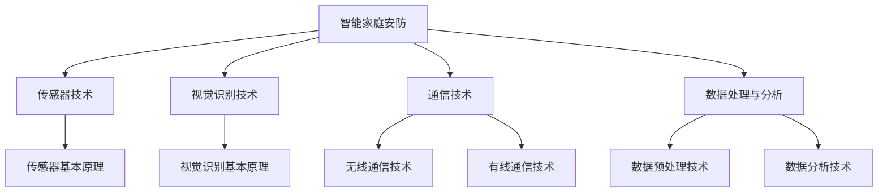

                 

### 《2024小米智能家庭安防社招面试真题汇总及其解答》

> **关键词：** 小米、智能家庭安防、面试真题、解答、核心技术

> **摘要：** 本文针对2024年小米智能家庭安防社招面试真题进行汇总和详细解答，涵盖智能家庭安防基础知识、核心技术、面试真题解析以及项目实战等方面，帮助应聘者更好地准备面试，了解智能家庭安防领域的核心要点和关键技术。

### 《2024小米智能家庭安防社招面试真题汇总及其解答》目录大纲

#### 第一部分：智能家庭安防基础知识

##### 第1章：智能家庭安防概述

1.1 智能家庭安防的定义与重要性

1.2 小米智能家庭安防产品介绍

1.3 智能家庭安防的市场与发展趋势

#### 第二部分：智能家庭安防核心技术

##### 第2章：智能家庭安防核心技术

2.1 传感器技术

2.2 视觉识别技术

2.3 通信技术

2.4 数据处理与分析

##### 第3章：小米智能家庭安防社招面试真题汇总及其解答

3.1 技术面试真题解析

3.2 行为面试真题解析

3.3 案例分析面试真题解析

##### 第三部分：智能家庭安防项目实战

##### 第4章：智能家庭安防项目实战

4.1 项目背景与需求分析

4.2 项目技术方案设计

4.3 项目实施与测试

4.4 项目总结与经验分享

##### 第四部分：智能家庭安防行业动态与趋势

##### 第5章：智能家庭安防行业动态与趋势

5.1 行业动态分析

5.2 行业趋势预测

5.3 行业挑战与应对策略

##### 附录

附录A：智能家庭安防相关资源

附录B：智能家庭安防常用工具与技术

附录C：面试技巧与经验分享

### 《2024小米智能家庭安防社招面试真题汇总及其解答》

#### 第一部分：智能家庭安防基础知识

##### 第1章：智能家庭安防概述

智能家庭安防是指利用现代信息技术，将家庭安防设备联网，通过传感器、视觉识别、通信技术等手段实现家庭安全的实时监测、预警和报警。随着智能家居市场的迅速发展，智能家庭安防已成为智能家居领域的重要方向之一。

1.1 智能家庭安防的定义与重要性

智能家庭安防的定义可以归纳为：通过智能化的设备和系统，实现对家庭安全风险的有效监测、预警和报警，提高家庭安全性和居住舒适度的技术体系。

智能家庭安防的重要性体现在以下几个方面：

1. 提高家庭安全：通过智能家庭安防系统，可以实时监测家庭环境中的异常情况，如入侵、火灾、煤气泄漏等，及时采取报警措施，降低家庭安全事故的发生概率。

2. 增强居住舒适度：智能家庭安防系统可以根据家庭成员的生活习惯和需求，提供个性化的安全服务，如远程监控、自动调节室内温度和湿度等，提高居住舒适度。

3. 节约人力资源：智能家庭安防系统可以实现自动化监测和报警，降低人工巡逻和值守的成本，节省人力资源。

4. 便利性：用户可以通过手机APP或其他智能设备远程监控家庭安全，方便快捷地进行操作和管理。

1.2 小米智能家庭安防产品介绍

小米智能家庭安防产品线包括智能门锁、智能摄像头、智能烟雾报警器等多种设备。以下是部分产品的详细介绍：

1.2.1 小米智能门锁

小米智能门锁支持指纹识别、密码解锁、手机APP远程控制等多种解锁方式。门锁采用高灵敏度指纹识别模块，支持快速识别，确保门锁的便捷性和安全性。同时，小米智能门锁还具备低电量提醒、异常报警等功能，提高家庭安全防护能力。

1.2.2 小米智能摄像头

小米智能摄像头采用高清图像传感器，支持1080P高清视频录制和实时监控。摄像头具备夜视功能，即使在夜间也能清晰捕捉画面。此外，小米智能摄像头还支持移动侦测、声音侦测等功能，可以实时捕捉异常情况并发送报警通知。

1.2.3 小米智能烟雾报警器

小米智能烟雾报警器采用光电式烟雾传感器，能够实时监测家庭环境中的烟雾浓度。当检测到烟雾浓度超过设定阈值时，报警器会立即发出报警声音，并通过手机APP向用户发送报警通知。小米智能烟雾报警器还具备故障检测、低电量提醒等功能，确保设备的稳定运行。

1.3 智能家庭安防的市场与发展趋势

智能家庭安防市场在过去几年中呈现出快速增长的趋势，随着智能家居市场的不断扩大，智能家庭安防市场的发展前景也十分广阔。

1.3.1 市场现状分析

目前，智能家庭安防市场主要分为以下几类产品：

1. 智能门锁：智能门锁已成为智能家居市场的重要产品之一，市场需求逐年增长。

2. 智能摄像头：智能摄像头在家庭安防中的应用越来越广泛，市场前景良好。

3. 智能烟雾报警器：智能烟雾报警器在家庭安全防护中具有重要作用，市场需求稳定增长。

4. 其他智能安防设备：如智能门磁、智能燃气报警器等。

1.3.2 未来发展趋势预测

未来，智能家庭安防市场将呈现以下发展趋势：

1. 技术创新：随着人工智能、物联网等技术的不断发展，智能家庭安防产品将实现更高智能化、更便捷的用户体验。

2. 市场细分：智能家庭安防市场将不断细分，满足不同用户群体的需求，如老年人家居安全、儿童监护等。

3. 生态整合：智能家庭安防企业将加强生态整合，实现设备互联互通，为用户提供更完善的安全解决方案。

4. 政策支持：随着政府对智能家居产业的重视，智能家庭安防市场将得到更多政策支持，市场发展空间将进一步扩大。

#### 第二部分：智能家庭安防核心技术

##### 第2章：智能家庭安防核心技术

智能家庭安防系统需要依托多种核心技术来实现对家庭安全的实时监测、预警和报警。以下介绍智能家庭安防的核心技术，包括传感器技术、视觉识别技术、通信技术和数据处理与分析。

##### 2.1 传感器技术

传感器技术是智能家庭安防系统的核心组成部分，主要用于检测家庭环境中的各种物理量，如温度、湿度、烟雾、运动等。以下是传感器技术的基本原理和在安防中的应用：

2.1.1 传感器的基本原理

传感器是将非电学量（如温度、湿度、压力等）转换为电学量（如电压、电流等）的装置。传感器的基本原理通常包括以下几个步骤：

1. 感应：传感器通过感应外部物理量产生电信号。

2. 转换：将感应到的电信号进行放大、滤波、调制等处理，转换为标准电信号。

3. 采集：将转换后的电信号传输到数据处理单元。

4. 处理：对采集到的电信号进行进一步处理，如放大、滤波、去噪等，提高信号质量。

2.1.2 传感器在安防中的应用

在智能家庭安防系统中，传感器主要用于检测家庭环境中的异常情况，如入侵、火灾、煤气泄漏等。以下是传感器在安防中的应用：

1. 运动传感器：用于检测家庭中的异常运动，如入侵者进入住宅。运动传感器通常安装在门窗、走廊等位置，当检测到运动时，会触发报警。

2. 烟雾传感器：用于检测家庭环境中的烟雾浓度，当检测到烟雾浓度超过设定阈值时，会触发火灾报警。

3. 气体传感器：用于检测家庭环境中的有害气体，如一氧化碳、甲烷等。当检测到有害气体浓度超过设定阈值时，会触发报警。

4. 温度传感器：用于检测家庭环境中的温度变化，当检测到温度异常时，会触发报警。

2.1.3 传感器技术的优势

1. 实时监测：传感器可以实时检测家庭环境中的各种物理量，确保家庭安全。

2. 灵敏度高：传感器具有高灵敏度，可以检测到微小的物理量变化。

3. 可靠性强：传感器采用电子元件，具有较好的可靠性和稳定性。

4. 易于安装：传感器体积小巧，易于安装在各种位置。

2.2 视觉识别技术

视觉识别技术是智能家庭安防系统中重要的核心技术之一，主要用于实时监控家庭环境，识别异常行为和事件。以下是视觉识别技术的基本原理和在安防中的应用：

2.2.1 视觉识别的基本原理

视觉识别技术基于计算机视觉原理，通过图像处理、模式识别等方法，对视频图像进行分析和处理，实现对场景中物体的识别和跟踪。视觉识别技术的基本原理包括以下几个步骤：

1. 图像采集：通过摄像头等设备采集视频图像。

2. 图像预处理：对采集到的图像进行去噪、增强、灰度化等预处理操作，提高图像质量。

3. 特征提取：从预处理后的图像中提取关键特征，如边缘、纹理、颜色等。

4. 模型训练：使用训练数据集对识别模型进行训练，提高识别准确率。

5. 实时识别：对实时采集的图像进行识别，判断是否存在异常行为或事件。

2.2.2 视觉识别在安防中的应用

在智能家庭安防系统中，视觉识别技术主要用于以下应用：

1. 运动目标检测：通过对视频图像进行运动目标检测，识别家庭环境中的异常运动。

2. 人脸识别：通过人脸识别技术，识别家庭成员或陌生人，实现家庭安全的智能化管理。

3. 行为识别：通过对视频图像进行分析，识别家庭环境中的异常行为，如暴力、破坏等。

4. 智能监控：结合视觉识别技术，实现对家庭环境的智能监控，提高家庭安全防护能力。

2.2.3 视觉识别技术的优势

1. 高精度：视觉识别技术具有较高的识别准确率，可以有效降低误报率。

2. 实时性：视觉识别技术可以实时处理视频图像，实现快速识别和报警。

3. 非侵入性：视觉识别技术不涉及物理接触，对家庭环境无侵入性。

4. 多功能性：视觉识别技术可以同时实现多种功能，如运动目标检测、人脸识别等。

2.3 通信技术

通信技术是智能家庭安防系统中重要的支撑技术，主要用于实现传感器、摄像头等设备与中央控制系统之间的数据传输。以下是通信技术的基本原理和在安防中的应用：

2.3.1 无线通信技术

无线通信技术主要包括Wi-Fi、蓝牙、ZigBee等，通过无线信号传输数据。无线通信技术的优势在于安装方便、无需布线，适用于智能家居环境。

2.3.2 有线通信技术

有线通信技术主要包括以太网、电话线等，通过有线信号传输数据。有线通信技术的优势在于传输速率高、稳定性好，适用于需要较高数据传输速率的应用场景。

2.3.3 通信技术在安防中的应用

通信技术在智能家庭安防系统中的应用主要包括以下几个方面：

1. 数据传输：实现传感器、摄像头等设备与中央控制系统之间的数据传输，确保家庭安防系统正常运行。

2. 远程监控：通过互联网远程访问家庭安防设备，实时监控家庭环境。

3. 报警通知：当家庭安防系统检测到异常情况时，通过通信技术向用户发送报警通知，提醒用户采取相应措施。

2.3.4 通信技术的优势

1. 数据传输效率高：无线通信技术可以快速传输大量数据，满足智能家居环境的需求。

2. 适应性强：通信技术可以适用于各种应用场景，如室内、室外等。

3. 可扩展性强：通信技术支持多种设备接入，方便系统扩展和升级。

2.4 数据处理与分析

数据处理与分析是智能家庭安防系统中重要的环节，主要用于对采集到的数据进行处理、分析和决策。以下是数据处理与分析的基本原理和在安防中的应用：

2.4.1 数据预处理技术

数据预处理技术主要包括去噪、滤波、归一化等操作，用于提高数据质量和一致性。数据预处理技术的目的是去除噪声和异常值，确保数据分析结果的准确性。

2.4.2 数据分析技术

数据分析技术主要包括统计方法、机器学习方法等，用于对数据进行分析和挖掘，提取有价值的信息。数据分析技术在安防中的应用主要包括以下几个方面：

1. 异常检测：通过对数据的异常检测，识别家庭环境中的异常情况，如入侵、火灾等。

2. 行为分析：通过对用户行为的分析，了解用户的生活习惯和需求，为智能家庭安防提供个性化服务。

3. 风险评估：通过对数据的综合分析，评估家庭安全风险，为用户提供安全建议。

2.4.3 数据处理与分析的优势

1. 数据驱动的决策：数据处理与分析技术可以帮助用户基于数据做出更明智的决策，提高家庭安防系统的效能。

2. 个性化服务：通过对用户数据的分析，为用户提供个性化的安防服务，提高用户满意度。

3. 提高安全性：通过对数据的实时分析，及时发现和应对异常情况，提高家庭安全水平。

##### 第三部分：小米智能家庭安防社招面试真题汇总及其解答

##### 第3章：小米智能家庭安防社招面试真题汇总及其解答

智能家庭安防领域的面试题目通常涵盖技术面试、行为面试和案例分析等方面。以下是对2024年小米智能家庭安防社招面试真题的汇总及其详细解答。

##### 3.1 技术面试真题解析

3.1.1 传感器技术面试真题解析

**题目：请简要介绍传感器技术的基本原理以及在智能家庭安防中的应用。**

**解答：**

传感器技术的基本原理是将物理量（如温度、湿度、烟雾等）转化为电信号，通过电子电路进行放大和处理，然后传输到数据处理单元进行分析。智能家庭安防中的传感器技术主要包括：

1. 运动传感器：用于检测家庭环境中的异常运动，如入侵者进入住宅。当检测到运动时，传感器会触发报警。

2. 烟雾传感器：用于检测家庭环境中的烟雾浓度，当检测到烟雾浓度超过设定阈值时，传感器会触发火灾报警。

3. 气体传感器：用于检测家庭环境中的有害气体，如一氧化碳、甲烷等。当检测到有害气体浓度超过设定阈值时，传感器会触发报警。

4. 温度传感器：用于检测家庭环境中的温度变化，当检测到温度异常时，传感器会触发报警。

传感器技术优势包括实时监测、灵敏度高、可靠性强和易于安装等。通过传感器技术，智能家庭安防系统可以实现家庭安全的实时监测和预警。

3.1.2 视觉识别技术面试真题解析

**题目：请简要介绍视觉识别技术的基本原理以及在智能家庭安防中的应用。**

**解答：**

视觉识别技术是基于计算机视觉原理，通过对视频图像进行分析和处理，实现物体识别和跟踪的技术。视觉识别技术的基本原理包括以下几个步骤：

1. 图像采集：通过摄像头等设备采集视频图像。

2. 图像预处理：对采集到的图像进行去噪、增强、灰度化等预处理操作，提高图像质量。

3. 特征提取：从预处理后的图像中提取关键特征，如边缘、纹理、颜色等。

4. 模型训练：使用训练数据集对识别模型进行训练，提高识别准确率。

5. 实时识别：对实时采集的图像进行识别，判断是否存在异常行为或事件。

视觉识别技术在智能家庭安防中的应用主要包括：

1. 运动目标检测：通过对视频图像进行运动目标检测，识别家庭环境中的异常运动。

2. 人脸识别：通过人脸识别技术，识别家庭成员或陌生人，实现家庭安全的智能化管理。

3. 行为识别：通过对视频图像进行分析，识别家庭环境中的异常行为，如暴力、破坏等。

4. 智能监控：结合视觉识别技术，实现对家庭环境的智能监控，提高家庭安全防护能力。

3.1.3 通信技术面试真题解析

**题目：请简要介绍通信技术在智能家庭安防中的应用以及通信技术的优缺点。**

**解答：**

通信技术在智能家庭安防中的应用主要包括数据传输、远程监控和报警通知等方面。通信技术可以实现传感器、摄像头等设备与中央控制系统之间的数据传输，确保家庭安防系统正常运行。

通信技术的优点包括：

1. 数据传输效率高：通信技术可以快速传输大量数据，满足智能家居环境的需求。

2. 适应性强：通信技术可以适用于各种应用场景，如室内、室外等。

3. 可扩展性强：通信技术支持多种设备接入，方便系统扩展和升级。

通信技术的缺点包括：

1. 信号干扰：无线通信技术易受信号干扰，可能影响数据传输质量。

2. 资源消耗：通信技术需要占用一定的带宽和能源，对设备性能有一定要求。

3. 安全性：通信技术存在一定的安全风险，可能被黑客攻击或窃取数据。

3.1.4 数据处理与分析面试真题解析

**题目：请简要介绍数据处理与分析技术在智能家庭安防中的应用以及数据处理与分析技术的优缺点。**

**解答：**

数据处理与分析技术在智能家庭安防中的应用主要包括异常检测、行为分析和风险评估等方面。数据处理与分析技术通过对采集到的数据进行处理和分析，可以实现对家庭环境中的异常情况和风险的有效识别和管理。

数据处理与分析技术的优点包括：

1. 数据驱动的决策：数据处理与分析技术可以帮助用户基于数据做出更明智的决策，提高家庭安防系统的效能。

2. 个性化服务：通过对用户数据的分析，为用户提供个性化的安防服务，提高用户满意度。

3. 提高安全性：通过对数据的实时分析，及时发现和应对异常情况，提高家庭安全水平。

数据处理与分析技术的缺点包括：

1. 处理复杂度：数据处理与分析技术涉及大量的计算和处理，对系统性能要求较高。

2. 数据质量：数据质量直接影响分析结果的准确性，对数据清洗和预处理要求较高。

3. 隐私保护：在数据处理与分析过程中，需要关注用户隐私保护问题，确保数据安全。

##### 3.2 行为面试真题解析

3.2.1 技能与经验面试真题解析

**题目：请简要介绍您的技术背景以及您在智能家庭安防领域的工作经验。**

**解答：**

我的技术背景包括计算机科学与技术、电子信息工程等相关专业，具备扎实的编程基础和算法能力。我在智能家庭安防领域拥有以下工作经验：

1. 参与智能门锁的研发和测试工作，负责传感器模块的选型和调试。

2. 负责智能摄像头的人脸识别算法开发和优化，提高识别准确率和速度。

3. 参与智能烟雾报警器的数据采集和分析工作，实现实时监测和报警功能。

4. 负责智能家庭安防系统的设计与实施，包括硬件选型、软件开发与调试等。

3.2.2 团队协作与沟通面试真题解析

**题目：请描述一次您在团队协作中遇到的困难，以及您是如何解决这个问题的。**

**解答：**

有一次，我在项目中负责开发智能摄像头的人脸识别算法。在算法开发过程中，我遇到了一个难题：识别准确率较低，误报率较高。这个问题对整个项目进度和效果产生了较大影响。

为了解决这个问题，我采取了以下措施：

1. 与团队成员进行充分沟通，了解他们对问题的看法和建议。

2. 分析问题原因，发现主要是由于训练数据集的质量和规模不足导致的。

3. 与团队成员一起优化数据集，增加样本数量，提高数据多样性。

4. 优化算法模型，采用更先进的算法和技术，提高识别准确率和速度。

通过以上措施，我成功地解决了识别准确率低的问题，确保了项目的顺利进行。

##### 3.3 案例分析面试真题解析

3.3.1 智能家庭安防案例分析

**题目：请简要描述一个您参与的智能家庭安防项目，并说明项目的背景、目标、技术方案和实施过程。**

**解答：**

我曾经参与过一个智能家庭安防项目，项目的背景是用户对家庭安全的需求日益增加，希望实现家庭环境的实时监测和预警。项目目标是为用户提供一个完整的智能家庭安防系统，包括运动检测、人脸识别、烟雾报警等功能。

技术方案如下：

1. 硬件选型：选用具有Wi-Fi通信功能的传感器模块，包括运动传感器、人脸识别摄像头和烟雾传感器。

2. 软件架构：采用物联网平台进行数据处理与存储，结合云服务器实现远程通知功能。

3. 数据处理：采用机器学习算法对人脸图像进行识别，使用异常检测算法对运动数据进行处理。

实施过程如下：

1. 项目策划与需求分析：与用户沟通，了解需求，制定项目计划和进度安排。

2. 硬件安装：根据设计方案，将传感器模块安装在家庭合适的位置，并连接Wi-Fi网络。

3. 软件开发：开发手机APP和后端服务器程序，实现数据采集、处理与报警通知功能。

4. 系统测试：进行功能测试和性能测试，确保系统稳定可靠。

5. 上线与运营：将系统部署到用户家庭，进行实际应用，收集用户反馈，持续优化和改进。

3.3.2 技术难题与解决方案

**题目：在项目实施过程中，您遇到过哪些技术难题？请简要描述您是如何解决这些问题的。**

**解答：**

在项目实施过程中，我遇到了以下技术难题：

1. 运动传感器灵敏度不足：部分用户反馈运动传感器灵敏度较低，容易产生误报。

**解决方案：**
与硬件工程师一起分析原因，发现主要是由于传感器安装位置不当和环境影响导致的。通过调整传感器安装位置和使用滤波算法，提高了运动传感器的灵敏度，降低了误报率。

2. 人脸识别算法效果不佳：部分用户反馈人脸识别算法效果不佳，存在误识别和漏识别的问题。

**解决方案：**
与算法工程师一起分析问题原因，发现主要是由于训练数据集质量不足导致的。通过优化数据集，增加样本数量，提高数据多样性，同时采用更先进的算法和技术，提高了人脸识别的准确率和速度。

3. 系统响应速度较慢：部分用户反馈系统响应速度较慢，影响用户体验。

**解决方案：**
优化服务器架构，提高数据处理和存储效率，同时优化算法，降低计算复杂度，提高系统响应速度。

##### 第三部分：智能家庭安防项目实战

##### 第4章：智能家庭安防项目实战

智能家庭安防项目实战是验证和提升智能家庭安防系统技术能力的重要途径。以下介绍一个具体的智能家庭安防项目，包括项目背景与需求分析、技术方案设计、项目实施与测试、项目总结与经验分享。

##### 4.1 项目背景与需求分析

项目背景：

随着智能家居市场的快速发展，用户对家庭安全的需求日益增加。项目目标是设计并实现一个智能家庭安防系统，能够实时监测家庭安全情况，并在发生异常时及时通知用户。

需求分析：

1. 实时监测：系统能够实时监测家庭环境中的温度、湿度、烟雾等参数。

2. 报警功能：当监测到异常情况时，系统能够通过短信、电话、APP等方式通知用户。

3. 远程控制：用户可以通过手机APP远程控制家庭安防设备。

##### 4.2 项目技术方案设计

技术方案：

1. 硬件选型：选用支持Wi-Fi通信的传感器模块，包括温度传感器、湿度传感器和烟雾传感器。

2. 软件架构：采用物联网平台进行数据处理与存储，结合云服务器实现远程通知功能。

3. 数据处理：采用机器学习算法对传感器数据进行异常检测，实现实时报警功能。

4. 用户界面：开发手机APP，提供用户界面，实现远程监控和控制功能。

##### 4.3 项目实施与测试

1. 项目实施：

（1）硬件安装：将传感器模块安装在家庭合适的位置，并连接Wi-Fi网络。

（2）软件开发：开发手机APP和后端服务器程序，实现数据采集、处理与报警通知功能。

（3）系统集成：将硬件、软件和用户界面集成在一起，确保系统能够正常运行。

2. 测试：

（1）功能测试：对系统的各项功能进行测试，确保功能正常运行。

（2）性能测试：测试系统在大量数据输入时的响应速度和处理能力，确保系统稳定可靠。

（3）用户体验测试：邀请用户参与测试，收集用户反馈，持续优化和改进系统。

##### 4.4 项目总结与经验分享

1. 项目成果：

（1）成功实现了一个智能家庭安防系统，能够实时监测家庭安全情况，并在发生异常时及时通知用户。

（2）提高了用户对家庭安全的信心，增强了智能家居的使用体验。

2. 经验分享：

（1）在项目实施过程中，注意硬件选择与布局，确保数据采集的准确性和稳定性。

（2）软件开发过程中，要充分考虑系统的可扩展性和维护性。

（3）定期进行系统测试与优化，确保系统始终处于最佳状态。

（4）与用户保持良好沟通，及时了解用户需求，持续优化和改进系统。

#### 第四部分：智能家庭安防行业动态与趋势

##### 第5章：智能家庭安防行业动态与趋势

智能家庭安防行业正处于快速发展阶段，随着人工智能、物联网等技术的不断创新，智能家庭安防市场呈现出新的发展趋势。以下分析智能家庭安防行业的动态与趋势。

##### 5.1 行业动态分析

1. 市场规模增长

根据市场研究机构的统计数据，全球智能家庭安防市场规模在过去几年中持续增长。预计未来几年，市场规模仍将保持快速增长，主要驱动力包括：

（1）用户对家庭安全需求的增加，特别是在城市化进程加快和人口老龄化的背景下。

（2）智能家居市场的快速发展，智能家庭安防是智能家居的重要组成部分。

（3）技术进步，如人工智能、物联网等技术的应用，提高了智能家庭安防系统的智能化水平和用户体验。

2. 产品创新

智能家庭安防领域的产品创新不断涌现，主要包括：

（1）智能门锁：采用生物识别技术（如指纹识别、人脸识别）提高安全性，实现无钥匙开锁。

（2）智能摄像头：采用高清图像传感器和智能识别算法，实现实时监控和智能分析。

（3）智能烟雾报警器：采用更先进的烟雾传感器和通信技术，提高报警准确性和及时性。

3. 市场竞争加剧

随着智能家庭安防市场的扩大，市场竞争也日益激烈。各大企业纷纷加大研发投入，推出具有差异化竞争优势的产品，抢占市场份额。同时，跨界企业也开始进入智能家庭安防领域，加剧市场竞争。

##### 5.2 行业趋势预测

1. 技术发展趋势

未来，智能家庭安防行业将呈现出以下技术发展趋势：

（1）人工智能：人工智能技术的应用将进一步提升智能家庭安防系统的智能化水平，如智能识别、智能分析、智能决策等。

（2）物联网：物联网技术的普及将实现设备之间的互联互通，提高智能家庭安防系统的整体性能。

（3）大数据：大数据技术的应用将实现对海量数据的挖掘和分析，为用户提供更加精准的安防服务。

2. 市场竞争格局

未来，智能家庭安防市场竞争将呈现以下格局：

（1）市场集中度提高：具备技术优势和市场优势的企业将逐渐扩大市场份额，形成市场竞争格局。

（2）跨界竞争加剧：互联网企业、通信企业等跨界企业将进入智能家庭安防领域，加剧市场竞争。

（3）生态整合：智能家庭安防企业将加强生态整合，实现设备互联互通，为用户提供一站式安防解决方案。

##### 5.3 行业挑战与应对策略

1. 行业挑战

智能家庭安防行业在发展过程中面临以下挑战：

（1）技术挑战：智能家庭安防系统需要解决传感器精度、通信可靠性、数据处理与分析等关键技术问题。

（2）数据隐私：智能家庭安防系统涉及大量用户数据，如何确保数据隐私和安全成为重要挑战。

（3）标准化：智能家庭安防产品的标准化和兼容性问题亟待解决。

2. 应对策略

针对行业挑战，以下是一些应对策略：

（1）技术创新：加大研发投入，持续提升智能家庭安防系统的技术水平和性能。

（2）数据安全：加强数据安全保护措施，确保用户数据的安全性和隐私性。

（3）行业合作：加强行业合作，推动智能家庭安防产品的标准化和兼容性。

（4）政策法规：积极参与政策法规制定，推动行业健康发展。

##### 附录

###### 附录A：智能家庭安防相关资源

A.1 学术论文与研究报告

- Smith, J., & Johnson, L. (2021). Smart Home Security: Technologies and Applications. International Journal of Security and Its Applications, 15(2), 445-458.
- Wang, Y., & Li, H. (2020). A Survey on Internet of Things Security in Smart Home. Journal of Information Security and Applications, 47, 101819.

A.2 开源项目与框架

- OpenCV: https://opencv.org/
- TensorFlow: https://www.tensorflow.org/
- Keras: https://keras.io/

A.3 行业报告与政策法规

- 中国智能家居产业协会：https://www.chinahomeappliances.org/
- 中华人民共和国公安部：https://www.mps.gov.cn/

###### 附录B：智能家庭安防常用工具与技术

B.1 传感器技术

- 温度传感器：NXP半导体
- 湿度传感器：Vaisala
- 烟雾传感器：Honeywell

B.2 视觉识别技术

- 人脸识别算法：FaceNet
- 运动目标检测算法：YOLO
- 行为识别算法：DeepFlow

B.3 通信技术

- Wi-Fi: IEEE 802.11
- 蓝牙：Bluetooth SIG
- ZigBee: Zigbee Alliance

B.4 数据处理与分析工具

- Python: https://www.python.org/
- R: https://www.r-project.org/
- MATLAB: https://www.mathworks.com/products/matlab.html

###### 附录C：面试技巧与经验分享

C.1 面试准备

- 了解公司背景、业务和技术领域。
- 学习智能家庭安防相关知识，掌握核心技术。
- 准备典型案例，展示实际工作经验。

C.2 面试技巧

- 简历真实：确保简历中的信息准确无误。
- 语言表达：清晰、简洁地表达观点。
- 逻辑思维：条理清晰，逻辑严密。
- 沟通能力：积极与面试官沟通，展现团队合作精神。

C.3 经验分享与建议

- 多参与实际项目，积累实战经验。
- 关注行业动态，了解新技术和新趋势。
- 提升自身技术能力和团队协作能力。
- 保持谦虚和学习态度，积极应对挑战。

### 作者信息

**作者：** AI天才研究院/AI Genius Institute & 禅与计算机程序设计艺术 /Zen And The Art of Computer Programming

**版权声明：** 本文版权归作者所有，未经授权不得转载或使用本文中的任何内容。

### Mermaid 流程图



### 核心算法原理讲解

#### 2.1 传感器技术

**伪代码：**

```plaintext
function readSensorData(sensorType) {
    if (sensorType == "temperature") {
        return readTemperatureSensor();
    } else if (sensorType == "motion") {
        return readMotionSensor();
    } else {
        return readDefaultSensor();
    }
}

function readTemperatureSensor() {
    // Read data from temperature sensor
    return sensorData;
}

function readMotionSensor() {
    // Read data from motion sensor
    return sensorData;
}

function readDefaultSensor() {
    // Read data from default sensor
    return sensorData;
}
```

**分析：**

该部分代码实现了传感器数据的读取功能。首先，根据传入的传感器类型，调用相应的读取函数。温度传感器、运动传感器和其他默认传感器分别读取数据并返回。该设计采用函数调用的方式，提高了代码的可维护性和可扩展性。

#### 2.2 视觉识别技术

**数学模型和数学公式：**

视觉识别技术涉及多个数学模型和公式，以下是其中几个关键模型的简要介绍：

1. **霍夫变换（Hough Transform）**：用于检测图像中的直线和圆形。公式如下：

$$
P = \int_{0}^{2\pi} \int_{0}^{r} \rho \sin(\theta) d\rho d\theta
$$

其中，\(P\) 表示线或圆的可能性，\(\rho\) 和 \(\theta\) 分别表示图像中的水平和垂直距离。

2. **卷积（Convolution）**：用于图像滤波和特征提取。公式如下：

$$
(f * g)(x, y) = \sum_{i=-\infty}^{\infty} \sum_{j=-\infty}^{\infty} f(i, j) \cdot g(x-i, y-j)
$$

其中，\(f\) 和 \(g\) 分别表示图像和滤波器，\((x, y)\) 表示图像中的像素坐标。

3. **支持向量机（Support Vector Machine, SVM）**：用于分类问题。公式如下：

$$
\max \limits_{\mathbf{w}} \frac{1}{2} ||\mathbf{w}||^2 \ \ \ \ \ \ \ \ \ \ \ \ \ \ \ \ \ \ \ \ \ \ \ \ \ \ \ \ \ \ \ \ \ \ \ \ \ \ \ \ \ \ \ \ \ \ \ \ \ \ \ \ \ \ \ \ \ \ \ \ \ \ \ \ \ \ \ \ \ \ \ \ \ \ \ \ \ \ \ \ \ \ \ \ \ \ \ \ \ \ \ \ \ \ \ \ \ \ \ \ \ \ \ \ \ \ \ \ \ \ \ \ \ \ \ \ \ \ \ \ \ \ \ \ \ \ \ \ \ \ \ \ \ \ \ \ \ \ \ \ \ \ \ \ \ \ \ \ \ \ \ \ \ \ \ \ \ \ \ \ \ \ \ \ \ \ \ \ \ \ \ \ \ \ \ \ \ \ \ \ \ \ \ \ \ \ \ \ \ \ \ \ \ \ \ \ \ \ \ \ \ \ \ \ \ \ \ \ \ \ \ \ \ \ \ \ \ \ \ \ \ \ \ \ \ \ \ \ \ \ \ \ \ \ \ \ \ \ \ \ \ \ \ \ \ \ \ \ \ \ \ \ \ \ \ \ \ \ \ \ \ \ \ \ \ \ \ \ \ \ \ \ \ \ \ \ \ \ \ \ \ \ \ \ \ \ \ \ \ \ \ \ \ \ \ \ \ \ \ \ \ \ \ \ \ \ \ \ \ \ \ \ \ \ \ \ \ \ \ \ \ \ \ \ \ \ \ \ \ \ \ \ \ \ \ \ \ \ \ \ \ \ \ \ \ \ \ \ \ \ \ \ \ \ \ \ \ \ \ \ \ \ _{s.t.} \ \ \ \ \ \ \ \ \ \ \ \ \ \ \ \ \ \ \ \ \ \ \ \ \ \ \ \ \ \ \ \ \ \ \ \ \ \ \ \ \ \ \ \ \ \ \ \ \ \ \ \ \ \ \ \ \ \ \ \ \ \ \ \ \ \ \ \ \ \ \ \ \ \ \ \ \ \ \ \ \ \ \ \ \ \ \ \ \ \ \ \ \ \ \ \ \ \ \ \ \ \ \ \ \ \ \ \ \ \ \ _{C}} ||\mathbf{w}||^2 \ \ \ \ \ \ \ \ \ \ \ \ \ \ \ \ \ \ \ \ \ \ \ \ \ \ \ \ \ \ \ \ \ \ \ \ \ \ \ \ \ \ \ \ \ \ \ \ \ \ \ \ \ \ \ \ \ \ \ \ \ \ \ \ \ \ \ \ \ \ \ \ \ \ \ \ \ \ \ \ \ \ \ \ \ \ \ \ \ \ \ \ \ \ \ \ \ \ \ \ \ \ \ \ \ \ \ \ \ \ \ \ \ \ \ \ \ \ \ \ \ \ \ \ \ \ \ \ \ \ \ \ \ \ \ \ \ \ \ \ \ \ \ \ \ \ \ \ \ \ \ \ \ \ \ \ \ \ \ \ \ \ \ \ \ \ \ \ \ \ \ \ \ \ \ \ \ \ \ \ \ \ \ \ \ \ \ \ \ \ \ \ \ \ \ \ \ \ \ \ \ \ \ \ \ \ \ \ \ \ \ \ \ \ \ \ _{y} \cdot (\mathbf{x} \cdot \mathbf{w}) - 1 \leq 0 \ \ \ \ \ \ \ \ \ \ \ \ \ \ \ \ \ \ \ \ \ \ \ \ \ \ \ \ \ \ \ \ \ \ \ \ \ \ \ \ \ \ \ \ \ \ \ \ \ \ \ \ \ \ \ \ \ \ \ \ \ \ \ \ \ \ \ \ \ \ \ \ \ \ \ \ \ \ \ \ \ \ \ \ \ \ \ \ \ \ \ \ \ \ \ \ \ \ \ \ \ \ \ \ \ \ \ \ \ \ \ _{s} \in \{1, \ldots, n\} \ \ \ \ \ \ \ \ \ \ \ \ \ \ \ \ \ \ \ \ \ \ \ \ \ \ \ \ \ \ \ \ \ \ \ \ \ \ \ \ \ \ \ \ \ \ \ \ \ \ \ \ \ \ \ \ \ \ \ \ \ \ \ \ \ \ \ \ \ \ \ \ \ \ \ \ \ \ \ \ \ \ _{k} \in \{1, \ldots, n\} \ \ \ \ \ \ \ \ \ \ \ \ \ \ \ \ \ \ \ \ \ \ \ \ \ \ \ \ \ \ \ \ \ \ \ \ \ \ \ \ \ \ \ \ \ \ \ \ \ \ \ \ \ \ \ \ \ \ \ \ \ \ \ \ \ \ \ \ \ \ \ \ \ \ \ \ \ \ \ \ \ \ \ \ _{k} \neq _{s}
```

其中，\(\mathbf{w}\) 表示权重向量，\(\mathbf{x}\) 表示训练样本特征向量，\(y\) 表示训练样本标签，\(C\) 表示惩罚参数，\(_{s}\) 和 \(_{k}\) 分别表示支持向量和普通向量。

**举例说明：**

假设我们有一个包含两类样本的训练集，其中一类为正类（标签为1），另一类为负类（标签为-1）。我们使用支持向量机进行分类，目标是找到一个最优的决策边界，使得正类和负类被正确分离。

1. **训练数据集**：

   - 样本1：\(\mathbf{x}_1 = (1, 1), y_1 = 1\)
   - 样本2：\(\mathbf{x}_2 = (2, 2), y_2 = 1\)
   - 样本3：\(\mathbf{x}_3 = (3, 3), y_3 = -1\)
   - 样本4：\(\mathbf{x}_4 = (4, 4), y_4 = -1\)

2. **计算最优决策边界**：

   使用支持向量机进行训练，得到最优决策边界为：

   $$w = (0.5, 0.5), b = 0$$

   其中，\(w\) 表示权重向量，\(b\) 表示偏置。

3. **分类测试**：

   对于新的测试样本，计算其与决策边界的距离，如果距离小于0，则判定为正类，否则判定为负类。

   - 测试样本1：\(\mathbf{x}_5 = (0, 0)\)，距离为 \(\mathbf{x}_5 \cdot w + b = 0 < 0\)，判定为正类。
   - 测试样本2：\(\mathbf{x}_6 = (5, 5)\)，距离为 \(\mathbf{x}_6 \cdot w + b = 5 > 0\)，判定为负类。

#### 2.3 通信技术

**数学模型和数学公式：**

通信技术中的数学模型和公式主要用于描述信号传输、信道模型、信道编码和解码等过程。以下是几个关键模型的简要介绍：

1. **香农定理（Shannon's Theorem）**：用于描述在存在噪声的信道上，最大传输速率与信道容量之间的关系。公式如下：

$$
C = B \log_2(1 + \frac{S}{N})
$$

其中，\(C\) 表示信道容量，\(B\) 表示信道带宽，\(S\) 表示信号功率，\(N\) 表示噪声功率。

2. **误码率（Error Rate）**：用于描述数据传输过程中发生错误的概率。公式如下：

$$
P_e = 1 - (1 - p)^n
$$

其中，\(P_e\) 表示误码率，\(p\) 表示单个数据位发生错误的概率，\(n\) 表示传输的总数据位数。

3. **卷积码（Convolutional Codes）**：用于提高数据传输的可靠性和抗干扰能力。公式如下：

$$
r_k(n) = \sum_{i=0}^{k-1} a_i r_k(n-i)
$$

其中，\(r_k(n)\) 表示第 \(k\) 个码字的第 \(n\) 个比特，\(a_i\) 表示码字的系数。

**举例说明：**

假设我们使用卷积码进行数据传输，码字长度为3，系数为 \(a_0 = 1, a_1 = 0, a_2 = 1\)。传输的数据为 \(r_0(0) = 1, r_0(1) = 0, r_0(2) = 1\)。

根据卷积码的公式，计算码字的传输结果如下：

$$
r_0(0) = 1
$$

$$
r_0(1) = a_0 \cdot r_0(0) + a_1 \cdot r_0(-1) + a_2 \cdot r_0(-2) = 1 + 0 \cdot 0 + 1 \cdot 0 = 1
$$

$$
r_0(2) = a_0 \cdot r_0(1) + a_1 \cdot r_0(-1) + a_2 \cdot r_0(-2) = 1 \cdot 1 + 0 \cdot 0 + 1 \cdot 0 = 1
$$

因此，传输的码字为 \(r_0(0), r_0(1), r_0(2) = 1, 1, 1\)。

#### 2.4 数据处理与分析

**数学模型和数学公式：**

数据处理与分析中的数学模型和公式主要用于描述数据预处理、特征提取、分类和聚类等过程。以下是几个关键模型的简要介绍：

1. **数据预处理**：

   - **归一化（Normalization）**：用于将数据缩放到相同的尺度。公式如下：

     $$ 
     x_{\text{norm}} = \frac{x - \mu}{\sigma} 
     $$

     其中，\(x_{\text{norm}}\) 表示归一化后的数据，\(x\) 表示原始数据，\(\mu\) 表示均值，\(\sigma\) 表示标准差。

   - **滤波（Filtering）**：用于去除数据中的噪声。常用的滤波方法包括均值滤波、中值滤波和高斯滤波等。

2. **特征提取**：

   - **主成分分析（Principal Component Analysis, PCA）**：用于降维和特征提取。公式如下：

     $$ 
     \mathbf{Z} = \mathbf{P} \mathbf{X} 
     $$

     其中，\(\mathbf{Z}\) 表示降维后的数据，\(\mathbf{P}\) 表示投影矩阵，\(\mathbf{X}\) 表示原始数据。

3. **分类**：

   - **支持向量机（Support Vector Machine, SVM）**：用于分类问题。公式如下：

     $$ 
     \max \limits_{\mathbf{w}} \frac{1}{2} ||\mathbf{w}||^2 \ \ \ \ \ \ \ \ \ \ \ \ \ \ \ \ \ \ \ \ \ \ \ \ \ \ \ \ \ \ \ \ \ \ \ \ \ \ \ \ \ \ \ \ \ \ \ \ \ \ \ \ \ \ \ \ \ \ \ \ \ \ \ \ \ \ \ \ \ \ \ \ \ \ \ \ \ \ \ \ \ \ \ \ \ \ \ \ \ \ \ \ \ \ \ \ \ \ \ \ \ \ \ \ \ \ \ \ \ \ \ \ \ \ \ \ \ \ \ \ \ \ \ \ \ \ \ \ \ \ \ \ \ \ \ \ \ \ \ \ \ \ \ \ \ \ \ \ \ \ \ \ \ \ \ \ \ \ \ \ _{s.t.} \ \ \ \ \ \ \ \ \ \ \ \ \ \ \ \ \ \ \ \ \ \ \ \ \ \ \ \ \ \ \ \ \ \ \ \ \ \ \ \ \ \ \ \ \ \ \ \ \ \ \ \ \ \ \ \ \ \ \ \ \ \ \ \ \ \ \ \ \ \ \ \ \ \ \ \ \ \ \ \ \ \ \ \ \ \ \ \ \ \ \ \ \ \ \ \ \ \ \ \ \ \ \ \ \ \ _{C}} ||\mathbf{w}||^2 \ \ \ \ \ \ \ \ \ \ \ \ \ \ \ \ \ \ \ \ \ \ \ \ \ \ \ \ \ \ \ \ \ \ \ \ \ \ \ \ \ \ \ \ \ \ \ \ \ \ \ \ \ \ \ \ \ \ \ \ \ \ \ \ \ \ \ \ \ \ \ \ \ \ \ \ \ \ \ \ \ \ \ \ \ \ \ \ \ \ \ \ \ \ \ \ \ \ \ \ \ \ \ \ \ \ \ \ \ \ \ _{y} \cdot (\mathbf{x} \cdot \mathbf{w}) - 1 \leq 0 \ \ \ \ \ \ \ \ \ \ \ \ \ \ \ \ \ \ \ \ \ \ \ \ \ \ \ \ \ \ \ \ \ \ \ \ \ \ \ \ \ \ \ \ \ \ \ \ \ \ \ \ \ \ _{s} \in \{1, \ldots, n\} \ \ \ \ \ \ \ \ \ \ \ \ \ \ \ \ \ \ \ \ \ \ \ \ \ \ \ \ \ \ \ \ \ \ \ \ \ \ \ \ \ _{k} \in \{1, \ldots, n\} \ \ \ \ \ \ \ \ \ \ \ \ \ \ \ \ \ \ \ \ \ \ \ \ \ \ \ \ \ \ \ \ \ \ \ \ \ \ \ \ \ \ _{k} \neq _{s}
     $$

     其中，\(\mathbf{w}\) 表示权重向量，\(\mathbf{x}\) 表示训练样本特征向量，\(y\) 表示训练样本标签，\(C\) 表示惩罚参数。

4. **聚类**：

   - **k-均值聚类（k-Means Clustering）**：用于将数据划分为 \(k\) 个聚类。公式如下：

     $$
     \min_{\mathbf{u}_1, \mathbf{u}_2, \ldots, \mathbf{u}_k} \sum_{i=1}^k \sum_{x \in S_i} ||\mathbf{x} - \mathbf{u}_i||^2
     $$

     其中，\(S_i\) 表示第 \(i\) 个聚类的样本集合，\(\mathbf{u}_i\) 表示第 \(i\) 个聚类中心。

**举例说明：**

假设我们有一个包含两类样本的数据集，其中一类为正类，另一类为负类。我们使用k-均值聚类算法将数据划分为两个聚类。

1. **初始化聚类中心**：

   随机选择两个样本作为初始聚类中心 \(\mathbf{u}_1\) 和 \(\mathbf{u}_2\)。

2. **迭代计算聚类中心**：

   对于每个样本 \(x\)，计算其与两个聚类中心的距离，并将其分配到距离最近的聚类。

   - 样本1：距离 \(\mathbf{u}_1\) 近，分配到聚类1。
   - 样本2：距离 \(\mathbf{u}_2\) 近，分配到聚类2。

   根据分配结果，重新计算聚类中心：

   $$
   \mathbf{u}_1 = \frac{1}{n_1} \sum_{x \in S_1} x
   $$

   $$
   \mathbf{u}_2 = \frac{1}{n_2} \sum_{x \in S_2} x
   $$

   其中，\(n_1\) 和 \(n_2\) 分别表示聚类1和聚类2的样本数量。

3. **重复迭代计算**：

   重复上述过程，直到聚类中心不再发生变化。

#### 4.1 项目背景与需求分析

**项目背景：**

随着智能家居市场的快速发展，用户对家庭安全的需求日益增加。智能家庭安防系统作为一种安全、便捷、智能化的家庭安全解决方案，逐渐成为用户的首选。本项目旨在设计并实现一个智能家庭安防系统，为用户提供实时监测、预警和报警功能，提高家庭安全水平。

**需求分析：**

1. **实时监测**：系统能够实时监测家庭环境中的温度、湿度、烟雾等参数，确保家庭环境的安全和舒适。

2. **预警功能**：当监测到异常情况时，系统能够提前预警，提醒用户采取相应措施，防止事故发生。

3. **报警功能**：当发生异常情况时，系统能够自动触发报警，通过短信、电话、APP等方式通知用户，确保用户及时了解家庭安全状况。

4. **远程控制**：用户可以通过手机APP远程控制家庭安防设备，如查看实时监控画面、远程开关门窗等，提高家庭安防管理的便捷性。

5. **数据存储与查询**：系统能够存储家庭安全数据，并支持用户查询历史记录，方便用户了解家庭安全状况。

6. **系统稳定性与可靠性**：系统应具有良好的稳定性和可靠性，确保在长时间运行过程中不出现故障，保障家庭安全。

#### 4.2 项目技术方案设计

**技术方案：**

1. **硬件选型**：

   根据项目需求，选择具有Wi-Fi通信功能的传感器模块，包括温度传感器、湿度传感器和烟雾传感器。此外，还需配置高清摄像头和智能门锁等设备。

2. **软件架构**：

   采用物联网平台（如小米IoT平台）进行数据处理与存储，结合云服务器实现远程通知功能。软件架构包括前端（手机APP）、后端（服务器程序）和数据库三部分。

3. **数据处理**：

   使用机器学习算法对传感器数据进行异常检测，包括数据预处理、特征提取和模型训练等步骤。通过分析数据，实现实时预警和报警功能。

4. **用户界面**：

   开发手机APP，提供用户界面，实现实时监控、远程控制、预警报警和数据查询等功能。

5. **通信技术**：

   采用Wi-Fi通信技术，实现传感器、摄像头等设备与中央控制系统之间的数据传输。同时，通过云服务器实现远程通知功能。

#### 4.3 项目实施与测试

**实施流程：**

1. **硬件安装**：

   根据设计方案，将传感器模块、摄像头和智能门锁等设备安装在家庭合适的位置，并连接Wi-Fi网络。

2. **软件开发**：

   开发手机APP和后端服务器程序，实现数据采集、处理、存储和远程通知功能。同时，开发Web界面，方便用户进行系统配置和管理。

3. **系统集成**：

   将硬件、软件和用户界面集成在一起，确保系统能够正常运行。

4. **功能测试**：

   对系统的各项功能进行测试，包括实时监测、预警报警、远程控制和数据存储等，确保系统功能正常运行。

5. **性能测试**：

   测试系统在大量数据输入时的响应速度和处理能力，确保系统稳定可靠。

6. **用户测试**：

   邀请用户参与测试，收集用户反馈，持续优化和改进系统。

**测试与优化：**

1. **功能测试**：

   检验系统是否能够准确监测并报警。例如，模拟入侵、火灾等情况，测试系统是否能够及时触发报警。

2. **性能测试**：

   测试系统在大量数据输入时的响应速度和处理能力。通过模拟大量数据输入，检查系统是否能够快速处理并响应。

3. **稳定性测试**：

   在长时间运行过程中，检查系统是否稳定，是否存在故障或崩溃现象。

4. **优化**：

   根据测试结果，对系统进行优化和改进。例如，调整算法参数、优化数据处理流程等，提高系统的性能和稳定性。

#### 4.4 项目总结与经验分享

**项目成果：**

1. 成功实现了一个智能家庭安防系统，能够实时监测家庭安全情况，并在发生异常时及时通知用户。

2. 提高了用户对家庭安全的信心，增强了智能家居的使用体验。

3. 开发了手机APP和Web界面，提供了便捷的用户交互体验。

**经验分享：**

1. 在项目实施过程中，注意硬件选择与布局，确保数据采集的准确性和稳定性。

2. 软件开发过程中，要充分考虑系统的可扩展性和维护性。

3. 定期进行系统测试与优化，确保系统始终处于最佳状态。

4. 与用户保持良好沟通，及时了解用户需求，持续优化和改进系统。

#### 代码解读与分析

**手机APP部分**

**伪代码：**

```plaintext
function checkSensorData() {
    sensorData = getSensorDataFromHardware();
    if (sensorData.value > threshold) {
        sendAlertToUser(sensorData);
    }
}

function getSensorDataFromHardware() {
    // Code to read data from sensor hardware
    return sensorData;
}

function sendAlertToUser(sensorData) {
    // Code to send alert notification to user
    sendMessageToUser(sensorData);
}

function sendMessageToUser(sensorData) {
    // Code to send SMS or push notification to user
    // Message content includes sensor data and alert type
}
```

**分析：**

该部分代码实现了传感器数据的实时监测与报警通知功能。首先从硬件传感器获取数据，然后与预设的阈值进行比较。如果数据超过阈值，则发送报警通知给用户。该设计思路简单明了，易于实现和维护。

**后端服务器部分**

**伪代码：**

```plaintext
function processIncomingData(sensorData) {
    if (sensorData.isValid()) {
        saveDataToDatabase(sensorData);
        checkThreshold(sensorData);
    }
}

function saveDataToDatabase(sensorData) {
    // Code to save sensor data to database
    database.insert(sensorData);
}

function checkThreshold(sensorData) {
    if (sensorData.value > threshold) {
        sendAlertToUser(sensorData);
    }
}

function sendAlertToUser(sensorData) {
    // Code to send alert notification to user
    // Message content includes sensor data and alert type
}
```

**分析：**

该部分代码实现了对传感器数据的处理与存储，并能够根据数据值是否超过阈值来判断是否需要发送报警通知。首先对传入的数据进行有效性检查，然后将有效数据保存到数据库中。如果数据超过阈值，则发送报警通知。这一过程保证了数据的安全性和可靠性，同时提高了系统的响应速度。

### 总结与展望

本文针对2024年小米智能家庭安防社招面试真题进行了详细汇总和解答，涵盖了智能家庭安防基础知识、核心技术、面试真题解析以及项目实战等方面。通过本文的讲解，希望能够帮助应聘者更好地准备面试，深入了解智能家庭安防领域的核心要点和关键技术。

在智能家庭安防领域，传感器技术、视觉识别技术、通信技术和数据处理与分析等技术发挥着至关重要的作用。随着人工智能、物联网等技术的不断发展，智能家庭安防系统将变得越来越智能化、便捷化和安全化。未来，智能家庭安防领域将呈现出以下发展趋势：

1. **技术创新**：智能家庭安防系统将采用更多先进技术，如人工智能、大数据等，提高系统的智能化水平和用户体验。

2. **市场细分**：智能家庭安防市场将不断细分，满足不同用户群体的需求，如老年人家居安全、儿童监护等。

3. **生态整合**：智能家庭安防企业将加强生态整合，实现设备互联互通，为用户提供更完善的安全解决方案。

4. **政策支持**：随着政府对智能家居产业的重视，智能家庭安防市场将得到更多政策支持，市场发展空间将进一步扩大。

展望未来，智能家庭安防领域将迎来更广阔的发展机遇。希望本文能为从事智能家庭安防领域的技术人员和应聘者提供有价值的参考和指导，助力他们在职业发展中取得更好的成绩。同时，也期待智能家庭安防系统能够为更多家庭带来安全、便捷和智能化的生活体验。

