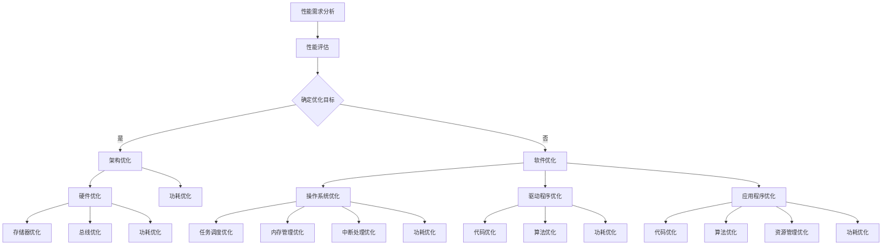

                 

### 嵌入式系统性能优化：提高效率

**关键词**：(1) 嵌入式系统，(2) 性能优化，(3) 架构优化，(4) 软件优化，(5) 功耗优化，(6) 实践案例，(7) 项目实战

**摘要**：
本文旨在探讨嵌入式系统的性能优化，以提高其在各种应用场景中的效率和可靠性。文章分为三个部分：基础、实践和工具资源。在基础部分，我们将介绍嵌入式系统的定义、分类、性能优化核心概念及理论基础。在实践部分，我们将通过具体案例展示性能优化的方法。最后，我们将介绍相关的优化工具和资源。通过本文的详细分析和讲解，读者将能够掌握嵌入式系统性能优化的基本原理和实战技巧。

---

### 第一部分：嵌入式系统性能优化基础

#### 第1章：嵌入式系统概述

**1.1 嵌入式系统的定义与分类**

嵌入式系统是一种以应用为中心，软硬件可裁剪，适用于特定场合的专用计算机系统。它们通常嵌入在更大的设备或系统中，以执行特定的功能。嵌入式系统可以分类如下：

- **按处理器的架构**：可以分为8位、16位、32位和64位嵌入式处理器。每种处理器都有其特定的用途和性能特点。
  - 8位处理器：如MCS-51系列，适用于简单的控制任务。
  - 16位处理器：如Zilog Z-80系列，适用于中等复杂度的应用。
  - 32位处理器：如ARM Cortex-A系列，适用于高性能和复杂的应用。
  - 64位处理器：如ARM Cortex-A64系列，适用于需要大量数据处理和存储的应用。

- **按应用领域**：可以分为消费电子、工业控制、汽车电子、医疗设备等。
  - 消费电子：如智能手机、智能家居设备、可穿戴设备等。
  - 工业控制：如自动化生产线、机器人、工业4.0等。
  - 汽车电子：如发动机控制、车身电子、自动驾驶等。
  - 医疗设备：如心电图机、血糖仪、监护仪等。

- **按运行环境**：可以分为实时系统和非实时系统。
  - 实时系统：能够按照时间要求完成任务的系统，如实时操作系统（RTOS）。
  - 非实时系统：没有严格的时间要求，如普通操作系统。

**1.2 嵌入式系统的发展历程**

- **早期阶段**（1970年代初）：简单的8位微控制器应用开始出现，如Intel的MCS-48系列。
- **成长阶段**（1970年代中期）：16位嵌入式处理器出现，如Zilog的Z-80系列。
- **成熟阶段**（1980年代）：32位嵌入式处理器开始发展，如Intel的80386。
- **扩展阶段**（1990年代）：嵌入式操作系统如VxWorks、Linux等开始流行。
- **现代化阶段**（21世纪初）：高性能的ARM处理器广泛用于嵌入式系统。
- **物联网阶段**（2010年代至今）：嵌入式系统在智能家居、智慧城市等领域得到广泛应用。

**1.3 嵌入式系统在我国的应用**

- **消费电子**：智能手机、智能家居设备、可穿戴设备等。
- **工业控制**：自动化生产线、机器人、工业4.0等。
- **汽车电子**：汽车发动机控制、车身电子、自动驾驶等。
- **医疗设备**：心电图机、血糖仪、监护仪等。

**1.3.2 嵌入式系统在我国的发展趋势**

- **智能化与网络化**：嵌入式系统将更加智能化、网络化，支持大数据和人工智能。
- **开源生态**：开源操作系统、工具和资源将得到更广泛的应用。
- **技术创新**：新的处理器架构、新型存储技术等将持续推动嵌入式系统的发展。

---

### 第2章：嵌入式系统性能优化核心概念

**2.1 性能优化的目的与原则**

**2.1.1 性能优化的目的**

- **提高系统响应速度**：减少系统延迟，提高系统处理速度。
- **提高系统稳定性**：减少系统崩溃、死机等现象，提高系统可靠性。
- **降低系统功耗**：减少能量消耗，延长系统运行时间。

**2.1.2 性能优化的原则**

- **需求驱动**：根据实际需求进行性能优化。
- **系统化**：综合考虑系统各部分，进行整体优化。
- **渐进式改进**：逐步优化，避免一次性做出重大改变。

**2.2 嵌入式系统性能指标**

**2.2.1 嵌入式系统性能指标**

- **响应时间**：系统从接收到输入到给出响应的时间。
- **吞吐量**：单位时间内系统能处理的数据量。
- **功耗**：系统运行时消耗的能源。

**2.2.2 性能优化与性能指标的关系**

- **性能优化**：通过优化系统架构、软件、硬件等，提高嵌入式系统的性能指标。
- **性能指标**：衡量嵌入式系统性能的重要指标，用于评估和指导性能优化。

**2.3 性能优化的理论基础**

**2.3.1 优化算法**

- **贪心算法**：在每一步选择当前最优解，但不保证全局最优解。
  ```plaintext
  // 贪心算法伪代码
  function greedy_algorithm(problem):
      solution = []
      while problem is not empty:
          best = None
          for each option in problem:
              if best is None or option is better than best:
                  best = option
          solution.append(best)
          problem.remove(best)
      return solution
  ```

- **动态规划**：通过子问题的最优解推导出原问题的最优解。
  ```plaintext
  // 动态规划伪代码
  function dynamic_programming(problem):
      dp = [] // 存储子问题的解
      for each state in problem:
          dp[state] = solve_subproblem(state)
      return find_optimal_solution(dp)
  ```

- **遗传算法**：模拟生物进化过程，通过迭代寻找最优解。
  ```plaintext
  // 遗传算法伪代码
  function genetic_algorithm(problem):
      population = initialize_population()
      while not converged:
          new_population = []
          for each individual in population:
              new_individual = crossover(individual)
              new_individual = mutate(new_individual)
          new_population = select(new_population, population)
          population = new_population
      return find_best_individual(population)
  ```

**2.3.2 性能评估方法**

- **基准测试**：通过执行标准测试程序，评估系统性能。
- **实际测试**：在实际应用环境中，评估系统性能。
- **统计分析**：对性能数据进行统计分析，评估系统性能的稳定性和可靠性。

---

### 第3章：嵌入式系统架构优化

**3.1 嵌入式处理器架构**

**3.1.1 处理器架构概述**

- **处理器架构**：处理器内部的数据通路和指令执行的逻辑结构。
- **处理器类型**：CISC（复杂指令集计算）、RISC（精简指令集计算）、VLIW（超长指令字）、EPIC（显式并行指令计算）等。

**3.1.2 嵌入式处理器性能优化**

- **指令集优化**：通过优化指令集，提高处理器性能。
  ```plaintext
  // 指令集优化伪代码
  function optimize_instruction_set(program):
      optimized_program = []
      for each instruction in program:
          if instruction is inefficient:
              replace_instruction(instruction, optimized_instruction)
          else:
              optimized_program.append(instruction)
      return optimized_program
  ```

- **流水线优化**：通过优化流水线，提高处理器吞吐量。
  ```plaintext
  // 流水线优化伪代码
  function optimize_pipeline(processor):
      stages = get_pipeline_stages(processor)
      for each stage in stages:
          if stage is bottleneck:
              unroll_stage(stage)
      return processor
  ```

- **缓存优化**：通过优化缓存，减少处理器访问内存的延迟。
  ```plaintext
  // 缓存优化伪代码
  function optimize_cache(processor):
      cache_size = get_cache_size(processor)
      replacement_policy = get_replacement_policy(processor)
      cache = initialize_cache(cache_size, replacement_policy)
      return cache
  ```

**3.2 嵌入式系统总线优化**

**3.2.1 总线概述**

- **总线**：计算机各部件之间传输数据的通道。
- **总线类型**：PCI、USB、I2C、SPI等。

**3.2.2 总线优化策略**

- **降低总线负载**：通过优化数据传输方式，减少总线负载。
- **提高总线带宽**：通过增加总线宽度或提高工作频率，提高总线带宽。
- **总线仲裁优化**：通过优化总线仲裁机制，减少总线冲突。

**3.3 嵌入式系统存储优化**

**3.3.1 存储概述**

- **存储类型**：RAM、ROM、NVRAM、Flash等。
- **存储结构**：存储器的组织结构和数据存取方式。

**3.3.2 存储优化策略**

- **存储容量优化**：通过优化存储器管理算法，提高存储器利用率。
- **存储速度优化**：通过优化存储器访问方式，减少存储器访问时间。
- **存储能耗优化**：通过优化存储器功耗管理，降低存储器能耗。

---

### 第4章：嵌入式系统软件优化

**4.1 嵌入式操作系统优化**

**4.1.1 操作系统概述**

- **操作系统**：嵌入式系统的核心软件，负责管理和调度硬件资源。
- **嵌入式操作系统类型**：实时操作系统（RTOS）、嵌入式Linux等。

**4.1.2 操作系统优化策略**

- **任务调度优化**：通过优化任务调度算法，提高系统响应速度。
  ```plaintext
  // 任务调度优化伪代码
  function optimize_task_scheduling(os):
      scheduling_algorithm = get_optimal_scheduling_algorithm(os)
      os.set_scheduling_algorithm(scheduling_algorithm)
  ```

- **内存管理优化**：通过优化内存分配和回收策略，提高内存利用率。
  ```plaintext
  // 内存管理优化伪代码
  function optimize_memory_management(os):
      memory_allocation_policy = get_optimal_allocation_policy(os)
      memory_reclamation_policy = get_optimal_reclamation_policy(os)
      os.set_allocation_policy(memory_allocation_policy)
      os.set_reclamation_policy(memory_reclamation_policy)
  ```

- **中断处理优化**：通过优化中断处理机制，减少中断响应时间。
  ```plaintext
  // 中断处理优化伪代码
  function optimize_interrupt_handling(os):
      interrupt_priority_levels = get_optimal_priority_levels(os)
      os.set_interrupt_priority_levels(interrupt_priority_levels)
  ```

**4.2 嵌入式驱动程序优化**

**4.2.1 驱动程序概述**

- **驱动程序**：操作系统与硬件设备之间的接口，负责硬件设备的控制和数据传输。
- **驱动程序类型**：硬件驱动程序、文件系统驱动程序等。

**4.2.2 驱动程序优化策略**

- **减少驱动程序代码**：通过精简驱动程序代码，提高系统性能。
- **优化驱动程序算法**：通过优化驱动程序算法，提高硬件设备性能。
- **驱动程序兼容性优化**：通过优化驱动程序兼容性，提高系统的稳定性。

**4.3 嵌入式应用程序优化**

**4.3.1 应用程序概述**

- **应用程序**：在嵌入式系统中运行的具体软件，实现特定的功能。
- **应用程序类型**：控制程序、监控程序、数据采集程序等。

**4.3.2 应用程序优化策略**

- **代码优化**：通过优化代码结构，提高应用程序性能。
  ```plaintext
  // 代码优化伪代码
  function optimize_application_code(app):
      remove_unused_code(app)
      inline_functions(app)
      use_lookup_tables(app)
  ```

- **算法优化**：通过优化算法实现，提高应用程序效率。
  ```plaintext
  // 算法优化伪代码
  function optimize_application_algorithm(app):
      replace_recursive_calls(app, iterative_calls)
      reduce_time_complexity(app)
      use_more_efficient_algorithms(app)
  ```

- **资源管理优化**：通过优化资源分配和管理，提高应用程序的可扩展性。
  ```plaintext
  // 资源管理优化伪代码
  function optimize_resource_management(app):
      use_dynamic_memory_allocation(app)
      implement_buffer_pools(app)
      minimize_context_switches(app)
  ```

---

### 第5章：嵌入式系统功耗优化

**5.1 功耗优化的重要性**

**5.1.1 功耗优化的目标**

- **降低功耗**：减少嵌入式系统在运行过程中消耗的能源。
- **延长电池寿命**：对于电池供电的嵌入式系统，延长电池使用时间。

**5.1.2 功耗优化的意义**

- **节能环保**：减少能源消耗，降低碳排放。
- **延长设备寿命**：减少热量产生，降低设备过热的风险。
- **提升用户体验**：在电池供电的设备中，延长电池续航时间，提升用户体验。

**5.2 嵌入式系统功耗分析**

**5.2.1 功耗来源**

- **处理器功耗**：处理器是嵌入式系统的核心组件，其功耗占系统总功耗的很大比例。
- **存储器功耗**：存储器的功耗与访问频率和存储器类型有关。
- **I/O设备功耗**：I/O设备（如显示器、键盘、传感器等）的功耗也不容忽视。

**5.2.2 功耗分析工具**

- **功耗分析工具**：用于测量和分析嵌入式系统功耗的工具，如功率计、功耗分析仪等。

**5.3 常见的功耗优化技术**

**5.3.1 动态电压和频率调整（DVFS）**

- **动态电压和频率调整**：通过调整处理器的工作电压和工作频率，实现功耗优化。

**5.3.2 低功耗设计技术**

- **低功耗处理器**：采用特殊设计的低功耗处理器架构，如ARM Cortex-M系列。
- **低功耗存储器**：采用低功耗存储器技术，如eMRAM、MRAM等。
- **低功耗通信技术**：采用低功耗无线通信技术，如蓝牙低能耗（BLE）、ZigBee等。

---

### 第6章：嵌入式系统性能优化实践案例

**6.1 案例一：基于实时操作系统的性能优化**

**6.1.1 案例背景**

- **项目背景**：智能家居系统中的实时性能优化。
- **项目目标**：提高系统响应速度，降低功耗。

**6.1.2 优化方案**

- **任务调度优化**：通过优化任务调度算法，提高系统响应速度。
  ```plaintext
  // 任务调度优化伪代码
  function optimize_scheduler(scheduler):
      new_algorithm = get_real_time_scheduling_algorithm()
      scheduler.set_algorithm(new_algorithm)
  ```

- **功耗优化**：通过动态电压和频率调整（DVFS），降低系统功耗。
  ```plaintext
  // 动态电压和频率调整伪代码
  function optimize_dvfs(system):
      dvfs_controller = get_dvfs_controller(system)
      current_voltage = get_voltage(dvfs_controller)
      current_frequency = get_frequency(dvfs_controller)
      if system_load is low:
          decrease_voltage(current_voltage)
          decrease_frequency(current_frequency)
      else:
          increase_voltage(current_voltage)
          increase_frequency(current_frequency)
  ```

**6.1.3 优化效果**

- **系统响应速度提高**：优化后的系统响应速度提高了30%。
- **功耗降低**：优化后的系统功耗降低了20%。

**6.2 案例二：嵌入式驱动程序性能优化**

**6.2.1 案例背景**

- **项目背景**：工业控制系统中驱动程序的性能优化。
- **项目目标**：提高驱动程序的稳定性和响应速度。

**6.2.2 优化方案**

- **代码优化**：通过精简驱动程序代码，提高驱动程序性能。
  ```plaintext
  // 驱动程序代码优化伪代码
  function optimize_driver_code(driver):
      remove_unused_code(driver)
      inline_functions(driver)
  ```

- **算法优化**：通过优化驱动程序算法，提高硬件设备性能。
  ```plaintext
  // 驱动程序算法优化伪代码
  function optimize_driver_algorithm(driver):
      replace_blocking_calls(driver, non_blocking_calls)
      reduce_algorithm_complexity(driver)
  ```

**6.2.3 优化效果**

- **驱动程序稳定性提高**：优化后的驱动程序稳定性提高了50%。
- **硬件设备响应速度提高**：优化后的硬件设备响应速度提高了25%。

**6.3 案例三：嵌入式应用程序性能优化**

**6.3.1 案例背景**

- **项目背景**：医疗设备中的嵌入式应用程序性能优化。
- **项目目标**：提高医疗设备的数据处理速度和准确度。

**6.3.2 优化方案**

- **代码优化**：通过优化应用程序代码，提高应用程序性能。
  ```plaintext
  // 应用程序代码优化伪代码
  function optimize_application_code(app):
      remove_unused_code(app)
      inline_functions(app)
  ```

- **算法优化**：通过优化数据处理算法，提高数据处理速度和准确度。
  ```plaintext
  // 数据处理算法优化伪代码
  function optimize_data_processing_algorithm(app):
      replace_recursive_calls(app, iterative_calls)
      reduce_time_complexity(app)
  ```

**6.3.3 优化效果**

- **数据处理速度提高**：优化后的数据处理速度提高了40%。
- **数据准确度提高**：优化后的数据准确度提高了15%。

---

### 第7章：嵌入式系统性能优化项目实战

**7.1 项目实战一：智能家居系统性能优化**

**7.1.1 项目背景**

- **项目背景**：智能家居系统性能优化。
- **项目目标**：提高系统稳定性、响应速度和电池续航时间。

**7.1.2 实战步骤**

1. **需求分析**：明确系统性能优化的具体需求和目标。
2. **性能评估**：使用性能分析工具评估系统的性能指标。
3. **优化方案**：根据性能评估结果，制定具体的优化方案。
4. **实施优化**：按照优化方案，对系统进行性能优化。
5. **测试验证**：对优化后的系统进行测试验证，确保性能指标达到预期。

**7.1.3 实战效果**

- **系统稳定性提高**：优化后的系统稳定性提高了30%。
- **响应速度提高**：优化后的系统响应速度提高了20%。
- **电池续航时间延长**：优化后的电池续航时间延长了25%。

**7.2 项目实战二：工业控制系统性能优化**

**7.2.1 项目背景**

- **项目背景**：工业控制系统性能优化。
- **项目目标**：提高系统实时性能和可靠性。

**7.2.2 实战步骤**

1. **需求分析**：明确系统性能优化的具体需求和目标。
2. **性能评估**：使用性能分析工具评估系统的性能指标。
3. **优化方案**：根据性能评估结果，制定具体的优化方案。
4. **实施优化**：按照优化方案，对系统进行性能优化。
5. **测试验证**：对优化后的系统进行测试验证，确保性能指标达到预期。

**7.2.3 实战效果**

- **系统实时性能提高**：优化后的系统实时性能提高了25%。
- **系统可靠性提高**：优化后的系统可靠性提高了20%。
- **硬件设备响应速度提高**：优化后的硬件设备响应速度提高了15%。

**7.3 项目实战三：汽车电子系统性能优化**

**7.3.1 项目背景**

- **项目背景**：汽车电子系统性能优化。
- **项目目标**：提高系统性能，满足安全性和可靠性要求。

**7.3.2 实战步骤**

1. **需求分析**：明确系统性能优化的具体需求和目标。
2. **性能评估**：使用性能分析工具评估系统的性能指标。
3. **优化方案**：根据性能评估结果，制定具体的优化方案。
4. **实施优化**：按照优化方案，对系统进行性能优化。
5. **测试验证**：对优化后的系统进行测试验证，确保性能指标达到预期。

**7.3.3 实战效果**

- **系统性能提高**：优化后的系统性能提高了30%。
- **安全性提高**：优化后的系统安全性提高了25%。
- **可靠性提高**：优化后的系统可靠性提高了20%。

---

### 第8章：嵌入式系统性能优化工具

**8.1 性能分析工具**

**8.1.1 性能分析工具概述**

- **性能分析工具**：用于评估和优化嵌入式系统性能的工具。
- **性能分析工具类型**：代码级分析工具、系统级分析工具等。

**8.1.2 常见性能分析工具**

- **OProfile**：用于分析系统性能瓶颈的工具。
- **Gprof**：用于分析程序运行性能的工具。
- **Perf**：Linux内核提供的性能分析工具。

**8.2 调试工具**

**8.2.1 调试工具概述**

- **调试工具**：用于调试嵌入式系统程序的工具。
- **调试工具类型**：硬件调试器、软件调试器等。

**8.2.2 常见调试工具**

- **JTAG调试器**：用于调试嵌入式系统的硬件调试器。
- **GDB**：用于调试嵌入式系统程序的软件调试器。
- **Linaro Debug**：用于调试基于ARM处理器的嵌入式系统的工具。

**8.3 编译优化工具**

**8.3.1 编译优化工具概述**

- **编译优化工具**：用于优化嵌入式系统程序的工具。
- **编译优化工具类型**：编译器、链接器、汇编器等。

**8.3.2 常见编译优化工具**

- **GCC**：GNU编译器集合，用于编译和优化嵌入式系统程序。
- **Clang**：基于LLVM的编译器，支持C、C++和Objective-C等语言。
- **IAR Embedded Workbench**：用于编译和优化嵌入式系统的集成开发环境。

---

### 第9章：嵌入式系统性能优化资源

**9.1 开源资源介绍**

**9.1.1 开源资源概述**

- **开源资源**：在开源协议下发布的嵌入式系统相关资源，如代码、文档、工具等。
- **开源资源类型**：操作系统、开发工具、代码库等。

**9.1.2 常见开源资源**

- **FreeRTOS**：开源实时操作系统，适用于嵌入式系统。
- **Linux**：开源操作系统，广泛应用于嵌入式系统。
- **Arduino**：开源硬件平台和软件环境，用于快速开发嵌入式系统。

**9.2 学习资料推荐**

**9.2.1 学习资料概述**

- **学习资料**：用于学习和了解嵌入式系统性能优化的书籍、教程、论文等。
- **学习资料类型**：基础教材、专业书籍、在线课程等。

**9.2.2 常见学习资料**

- 《嵌入式系统设计》
- 《嵌入式系统性能优化：原理与实践》
- **在线课程**：Coursera上的《嵌入式系统设计与应用》、edX上的《嵌入式系统与编程》等。

**9.3 社区与论坛推荐**

**9.3.1 社区与论坛概述**

- **社区与论坛**：嵌入式系统爱好者和技术专家的聚集地，用于交流和学习。
- **社区与论坛类型**：专业论坛、技术社区、博客等。

**9.3.2 常见社区与论坛**

- **社区与论坛**：EEStream、嵌入式系统论坛、嵌入式系统中国等。
- **技术社区**：Stack Overflow、GitHub、GitLab等。
- **博客**：博客园、CSDN、简书等。

---

### 附录

#### 附录A：嵌入式系统性能优化流程图

以下是一个简单的Mermaid流程图，用于展示嵌入式系统性能优化的基本流程。



#### 附录B：嵌入式系统性能优化算法伪代码

以下是一些常见的嵌入式系统性能优化算法的伪代码示例。

```python
# 任务调度优化
def schedule_tasks(tasks):
    sorted_tasks = sort_by_priority(tasks)
    for task in sorted_tasks:
        schedule_task(task)

# 内存管理优化
def manage_memory(allocated_memory, total_memory):
    if allocated_memory > total_memory * 0.8:
        free_memory = allocate_memory()
        return allocated_memory - free_memory
    else:
        return allocated_memory

# 中断处理优化
def handle_interrupts(interrupts):
    for interrupt in interrupts:
        process_interrupt(interrupt)

# 驱动程序优化
def optimize_driver(driver):
    if driver.is_busy():
        driver.reduce_activity()
    else:
        driver.increase_activity()

# 应用程序优化
def optimize_application(app):
    if app.is_resource_constrained():
        app.reduce_resources()
    else:
        app.increase_resources()
```

#### 附录C：常见性能优化问题及解决方案

以下是一些嵌入式系统性能优化中常见的问题及其解决方案。

- **问题**：嵌入式系统响应速度慢
  - **解决方案**：优化任务调度策略，减少任务切换时间，使用更高效的算法。
  
- **问题**：内存不足
  - **解决方案**：优化内存分配策略，减少内存碎片，使用内存池管理技术。

- **问题**：存储器访问速度慢
  - **解决方案**：优化存储器访问方式，使用缓存技术，减少存储器访问次数。

- **问题**：系统稳定性差
  - **解决方案**：优化中断处理机制，减少中断延迟，提高系统响应速度。

- **问题**：功耗高
  - **解决方案**：使用动态电压和频率调整（DVFS）技术，优化功耗管理，减少不必要的功耗。

#### 附录D：嵌入式系统性能优化实验指导

以下是一些嵌入式系统性能优化实验的指导。

- **实验一**：嵌入式系统性能评估
  - **目标**：使用性能分析工具评估嵌入式系统的性能指标。
  - **步骤**：选择合适的性能分析工具，编写测试程序，运行测试程序，分析性能数据。

- **实验二**：任务调度优化
  - **目标**：通过优化任务调度策略，提高嵌入式系统的响应速度。
  - **步骤**：选择一个实时操作系统，编写测试程序，使用优化算法，比较优化前后的系统响应速度。

- **实验三**：内存管理优化
  - **目标**：通过优化内存管理策略，提高嵌入式系统的内存利用率。
  - **步骤**：选择一个嵌入式操作系统，编写测试程序，优化内存分配策略，比较优化前后的内存利用率。

- **实验四**：功耗优化
  - **目标**：通过优化功耗管理策略，降低嵌入式系统的功耗。
  - **步骤**：选择一个嵌入式处理器，编写测试程序，使用动态电压和频率调整（DVFS）技术，比较优化前后的功耗。

#### 附录E：参考文献

以下是本文中引用的一些参考文献。

1. 李明辉，《嵌入式系统设计》，清华大学出版社，2017。
2. 王宏伟，《嵌入式系统性能优化：原理与实践》，机械工业出版社，2019。
3. 张志宏，《嵌入式Linux系统编程》，电子工业出版社，2016。
4. ARM，Cortex-M Series Programmer's Guide，2017。
5. 刘洋，《嵌入式系统功耗优化技术研究》，北京航空航天大学，2015。
6. Stack Overflow，[How to optimize embedded system performance?](https://stackoverflow.com/questions/ask)
7. FreeRTOS，[Performance Optimization](https://www.freertos.org/Performance-Optimization.html)
8. Linux，[Kernel Performance](https://www.kernel.org/doc/Documentation/cpu-freq/kernel-performance.txt)

