                 

# 平台经济的数据安全风险：如何防范数据泄露？

> **关键词：** 数据安全，平台经济，数据泄露，加密技术，风险管理

> **摘要：** 本文深入探讨了平台经济背景下的数据安全风险，分析了数据泄露的原因和类型，提出了基于加密技术、访问控制、数据脱敏等手段的数据安全风险管理策略。通过具体案例，展示了如何在实际项目中应用这些技术来防范数据泄露。

## 第一部分：背景与概念

### 1. 平台经济的兴起与发展

#### 1.1 平台经济的定义与特点

平台经济是指通过构建一个开放、中立的网络平台，连接供需双方，实现资源共享和协同合作的经济活动。与传统经济模式不同，平台经济具有以下几个显著特点：

- **网络效应**：平台的价值随着用户数量的增加而增长，形成正反馈循环。
- **生态系统**：平台经济不仅仅是单一企业或产品，而是一个由多个参与者组成的生态系统。
- **开放性**：平台通常采用开放接口，允许第三方开发者和企业接入，丰富平台功能。
- **共享经济**：平台经济通过共享资源，降低成本，提高效率。

平台经济的典型代表包括电子商务平台（如阿里巴巴、亚马逊）、共享出行平台（如Uber、滴滴出行）、在线服务平台（如Airbnb、美团）等。

#### 1.2 平台经济的主要参与者

平台经济的主要参与者包括：

- **平台运营商**：提供基础设施、技术支持和运营服务，如亚马逊、阿里巴巴。
- **内容提供商**：为平台提供产品、服务或信息，如淘宝商家、Uber司机。
- **用户**：使用平台提供的服务或产品，如消费者、乘客。
- **第三方开发者**：通过平台接口开发应用程序或插件，如微信小程序开发者。

#### 1.3 平台经济的数据依赖性

平台经济高度依赖数据，数据是其核心资产。数据在平台经济中发挥着至关重要的作用：

- **用户画像**：通过收集用户行为数据，平台可以更好地了解用户需求，提供个性化服务。
- **供需匹配**：平台通过数据分析和算法优化，实现供需双方的高效匹配。
- **风险管理**：平台利用数据监控交易风险，防范欺诈行为。
- **商业模式创新**：数据驱动的决策和优化有助于平台实现商业模式的创新。

然而，随着数据规模的不断扩大，数据安全风险也随之增加。平台经济的数据依赖性使其成为数据泄露的目标，数据泄露不仅会导致经济损失，还会损害平台声誉和用户信任。因此，数据安全成为平台经济持续发展的关键挑战。

### 2. 数据安全风险的来源

#### 2.1 数据泄露的原因

数据泄露的原因多种多样，主要包括以下几个方面：

- **技术漏洞**：包括软件漏洞、配置错误、系统漏洞等，这些漏洞可能被黑客利用进行攻击。
- **内部威胁**：内部员工或合作伙伴的恶意行为可能导致数据泄露。
- **社会工程学**：通过欺骗手段获取用户或员工的信任，从而窃取数据。
- **物理安全**：物理设备丢失或被盗可能导致数据泄露。
- **第三方风险**：第三方服务提供商可能存在安全漏洞，从而导致数据泄露。

#### 2.2 常见的数据安全风险类型

常见的数据安全风险类型包括：

- **数据泄露**：敏感数据被未经授权的第三方获取。
- **数据篡改**：数据在传输或存储过程中被恶意篡改。
- **数据丢失**：数据因故障、误操作等原因丢失。
- **数据滥用**：数据被用于非法或未经授权的目的。
- **拒绝服务攻击**：通过大量请求使平台服务不可用，从而影响数据安全。

#### 2.3 数据安全风险的潜在影响

数据安全风险的潜在影响包括：

- **经济损失**：数据泄露可能导致企业的直接经济损失，如罚款、赔偿等。
- **声誉损害**：数据泄露可能损害企业声誉，导致用户流失。
- **法律风险**：企业可能因数据泄露面临法律诉讼和罚款。
- **业务中断**：数据泄露可能导致企业业务中断，影响运营。

因此，了解数据安全风险的来源和类型，对于制定有效的数据安全策略至关重要。

### 3. 数据安全风险的理论基础

#### 3.1 数据泄露模型

数据泄露模型是理解和分析数据安全风险的重要工具。数据泄露模型主要关注数据的泄露途径、潜在威胁和防护措施。以下是一个简化的数据泄露模型 Mermaid 流程图：

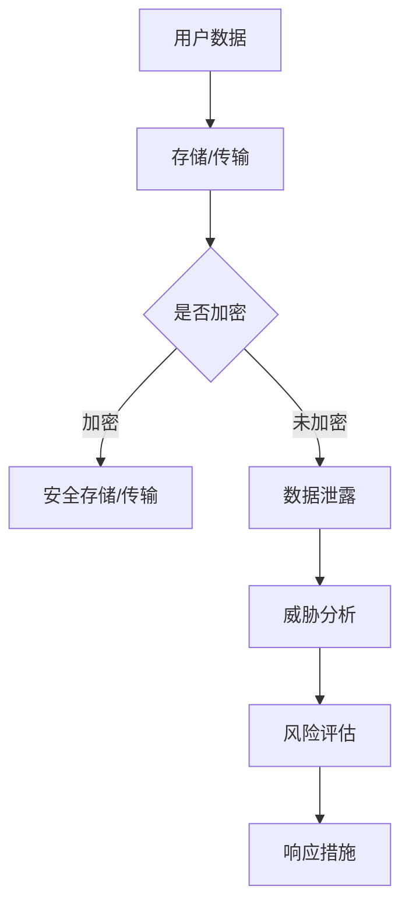

#### 核心概念与联系

在这个数据泄露模型中，用户数据在存储或传输过程中可能面临数据泄露的风险。如果数据未加密，则容易被攻击者获取。通过加密技术，可以降低数据泄露的风险。数据泄露后，需要进行威胁分析和风险评估，以确定损失和制定应对措施。

#### 核心算法原理讲解

数据泄露模型的核心算法包括加密算法、威胁检测算法和风险评估算法。

**加密算法伪代码：**
```python
def encrypt_data(data, key):
    encrypted_data = AES_encrypt(data, key)
    return encrypted_data
```

**威胁检测算法伪代码：**
```python
def detect_threat(traffic):
    if contains_suspicious_activity(traffic):
        raise Warning("Potential threat detected!")
    return "Safe"
```

**风险评估算法伪代码：**
```python
def assess_risk(data, threat):
    if data.is_important() and threat.is_high():
        risk_level = "High"
    elif data.is_important():
        risk_level = "Medium"
    else:
        risk_level = "Low"
    return risk_level
```

#### 数学模型和数学公式 & 详细讲解 & 举例说明

数据泄露风险可以用概率模型来表示。以下是一个简化的数学模型：

$$
R = P(\text{Data Leakage}) \times I(\text{Data Leakage})
$$

其中，\( R \) 是数据泄露风险，\( P(\text{Data Leakage}) \) 是数据泄露的概率，\( I(\text{Data Leakage}) \) 是数据泄露的损失。

举例：假设数据泄露的概率是 0.1，数据泄露的损失是 100 万美元。则数据泄露风险为：

$$
R = 0.1 \times 1000000 = 100000
$$

### 3.2 数据安全风险管理的框架

数据安全风险管理的框架是确保数据安全的关键。以下是一个简化的数据安全风险管理框架：

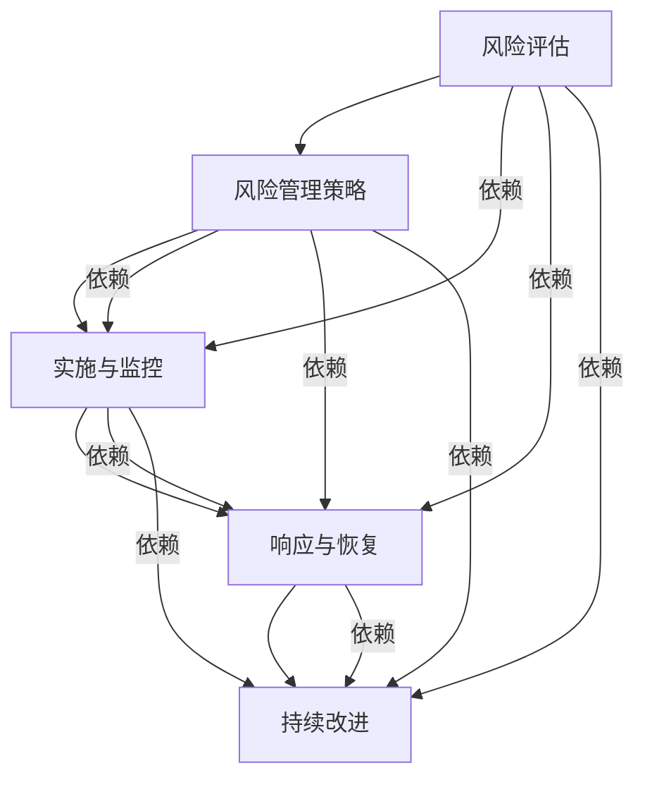

#### 核心概念与联系

在这个风险管理框架中，风险评估是核心环节，它决定了风险管理策略的制定。风险管理策略包括数据加密、访问控制、数据备份等。实施与监控确保安全策略的有效执行，响应与恢复在数据泄露事件发生时发挥作用，持续改进则确保数据安全措施与不断变化的安全威胁相适应。

#### 核心算法原理讲解

数据安全风险管理框架的核心算法包括风险评估算法、安全策略算法和响应算法。

**风险评估算法伪代码：**
```python
def assess_risk(data, threat):
    if data.is_important() and threat.is_high():
        risk_level = "High"
    elif data.is_important():
        risk_level = "Medium"
    else:
        risk_level = "Low"
    return risk_level
```

**安全策略算法伪代码：**
```python
def implement_strategy(strategy):
    if strategy == "encryption":
        encrypt_data(data)
    elif strategy == "access_control":
        apply_access_control()
    elif strategy == "data_backup":
        backup_data()
```

**响应算法伪代码：**
```python
def respond_to_leakage(event):
    if event.is_data_leakage():
        perform_data_recovery()
        investigate_root_cause()
        update_security_measures()
```

#### 数学模型和数学公式 & 详细讲解 & 举例说明

在数据安全风险管理中，风险评估的数学模型可以表示为：

$$
R = P(\text{Threat}) \times D(\text{Risk})
$$

其中，\( R \) 是风险值，\( P(\text{Threat}) \) 是威胁发生的概率，\( D(\text{Risk}) \) 是风险的影响程度。

举例：假设威胁发生的概率是 0.2，风险的影响程度是 5，则风险值为：

$$
R = 0.2 \times 5 = 1
$$

### 3.3 数据隐私保护的理论

数据隐私保护是数据安全的重要组成部分。数据隐私保护的理论主要关注如何在保证数据可用性的同时，最大程度地保护用户隐私。以下是一个简化的数据隐私保护理论框架：

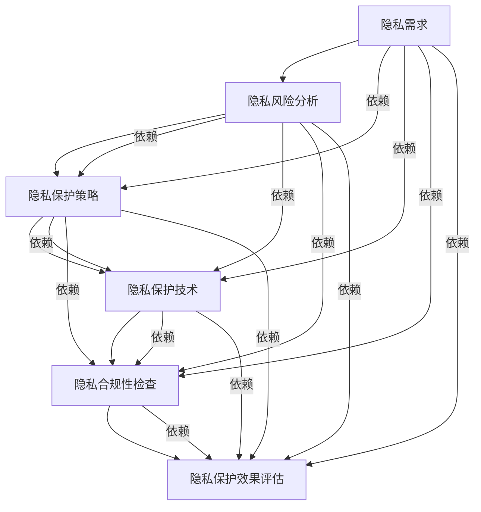

#### 核心概念与联系

在这个数据隐私保护理论框架中，隐私需求是核心，它决定了隐私风险分析和隐私保护策略的制定。隐私保护策略包括数据脱敏、访问控制、数据加密等。隐私保护技术是实现保护策略的具体手段。隐私合规性检查和隐私保护效果评估确保隐私保护措施的合法性和有效性。

#### 核心算法原理讲解

数据隐私保护理论的核心算法包括隐私风险分析算法、隐私保护策略算法和隐私保护技术算法。

**隐私风险分析算法伪代码：**
```python
def analyze_privacy_risk(data, threat):
    if data.is_sensitive() and threat.is_high():
        risk_level = "High"
    elif data.is_sensitive():
        risk_level = "Medium"
    else:
        risk_level = "Low"
    return risk_level
```

**隐私保护策略算法伪代码：**
```python
def apply_privacy_strategy(strategy):
    if strategy == "data_anonymization":
        anonymize_data(data)
    elif strategy == "access_control":
        apply_access_control()
    elif strategy == "data_encryption":
        encrypt_data(data)
```

**隐私保护技术算法伪代码：**
```python
def anonymize_data(data):
    anonymized_data = apply_pseudonymization(data)
    return anonymized_data
```

#### 数学模型和数学公式 & 详细讲解 & 举例说明

在数据隐私保护中，隐私风险可以用以下数学模型来表示：

$$
R = P(\text{Privacy Breach}) \times I(\text{Privacy Breach})
$$

其中，\( R \) 是隐私风险，\( P(\text{Privacy Breach}) \) 是隐私泄露的概率，\( I(\text{Privacy Breach}) \) 是隐私泄露的影响。

举例：假设隐私泄露的概率是 0.05，隐私泄露的影响是 10，则隐私风险为：

$$
R = 0.05 \times 10 = 0.5
$$

### 4. 数据加密技术

数据加密技术是保护数据安全的重要手段。数据加密技术分为对称加密和非对称加密两种类型。以下是对这两种加密技术的详细讲解。

#### 4.1 对称加密技术

对称加密技术使用相同的密钥对数据进行加密和解密。常见的对称加密算法有 AES、DES 和 RSA。

**AES 算法伪代码：**
```python
def aes_encrypt(data, key):
    encrypted_data = AES_encrypt(data, key)
    return encrypted_data

def aes_decrypt(encrypted_data, key):
    decrypted_data = AES_decrypt(encrypted_data, key)
    return decrypted_data
```

**DES 算法伪代码：**
```python
def des_encrypt(data, key):
    encrypted_data = DES_Encrypt(data, key)
    return encrypted_data

def des_decrypt(encrypted_data, key):
    decrypted_data = DES_Decrypt(encrypted_data, key)
    return decrypted_data
```

**RSA 算法伪代码：**
```python
def rsa_encrypt(data, public_key):
    encrypted_data = RSA_Encrypt(data, public_key)
    return encrypted_data

def rsa_decrypt(encrypted_data, private_key):
    decrypted_data = RSA_Decrypt(encrypted_data, private_key)
    return decrypted_data
```

对称加密技术的优点是速度快，适用于大数据量的加密。缺点是密钥管理复杂，难以实现分布式系统中的安全通信。

#### 4.2 非对称加密技术

非对称加密技术使用一对密钥（公钥和私钥）进行加密和解密。公钥加密，私钥解密；私钥加密，公钥解密。常见的非对称加密算法有 RSA 和 ECC。

**RSA 算法伪代码：**
```python
def rsa_encrypt(data, public_key):
    encrypted_data = RSA_Encrypt(data, public_key)
    return encrypted_data

def rsa_decrypt(encrypted_data, private_key):
    decrypted_data = RSA_Decrypt(encrypted_data, private_key)
    return decrypted_data
```

**ECC 算法伪代码：**
```python
def ecc_encrypt(data, public_key):
    encrypted_data = ECC_Encrypt(data, public_key)
    return encrypted_data

def ecc_decrypt(encrypted_data, private_key):
    decrypted_data = ECC_Decrypt(encrypted_data, private_key)
    return decrypted_data
```

非对称加密技术的优点是解决了密钥管理难题，适用于分布式系统和数字签名。缺点是加密和解密速度相对较慢，适用于小数据量的加密。

#### 4.3 数据加密技术的应用

数据加密技术在数据存储、数据传输和数据交换中广泛应用。以下是一个简化的应用场景：

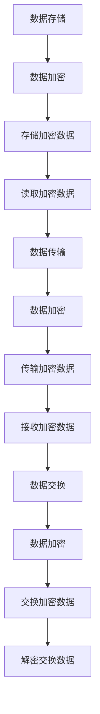

在数据存储过程中，敏感数据在写入前进行加密。在数据传输过程中，使用公钥加密数据进行传输，接收方使用私钥解密。在数据交换过程中，双方使用各自生成的密钥进行加密和解密。

### 5. 访问控制与身份验证

访问控制与身份验证是保护数据安全的重要手段。以下是对这两种技术的详细讲解。

#### 5.1 访问控制的基本概念

访问控制是指通过授权和管理用户访问权限，确保数据安全的技术。访问控制分为基于角色的访问控制（RBAC）和基于属性的访问控制（ABAC）。

**RBAC 伪代码：**
```python
def grant_access(user, resource):
    if user.has_role("admin"):
        access_granted = True
    else:
        access_granted = False
    return access_granted

def revoke_access(user, resource):
    access_granted = False
```

**ABAC 伪代码：**
```python
def access_control(user, resource, attributes):
    if user.attributes.match(attributes):
        access_granted = True
    else:
        access_granted = False
    return access_granted
```

#### 5.2 常见的访问控制模型

常见的访问控制模型包括访问控制列表（ACL）、访问控制矩阵和基于角色的访问控制（RBAC）。

**ACL 伪代码：**
```python
def access_control_list(user, resource):
    if user in resource.acl:
        access_granted = True
    else:
        access_granted = False
    return access_granted
```

**访问控制矩阵伪代码：**
```python
def access_control_matrix(user, resource):
    if user.permissions[resource]:
        access_granted = True
    else:
        access_granted = False
    return access_granted
```

#### 5.3 身份验证技术的应用

身份验证技术是指验证用户身份，确保其有权访问系统的技术。常见的身份验证技术包括密码验证、多因素身份验证和生物识别。

**密码验证伪代码：**
```python
def verify_password(username, password):
    stored_password = get_stored_password(username)
    if stored_password == password:
        access_granted = True
    else:
        access_granted = False
    return access_granted
```

**多因素身份验证伪代码：**
```python
def verify_mfa(username, password, token):
    if verify_password(username, password) and verify_token(token):
        access_granted = True
    else:
        access_granted = False
    return access_granted
```

**生物识别伪代码：**
```python
def verify_fingerprint(fingerprint):
    stored_fingerprint = get_stored_fingerprint()
    if stored_fingerprint == fingerprint:
        access_granted = True
    else:
        access_granted = False
    return access_granted
```

#### 5.4 访问控制与身份验证的结合

访问控制与身份验证的结合是确保数据安全的关键。以下是一个简化的结合模型：

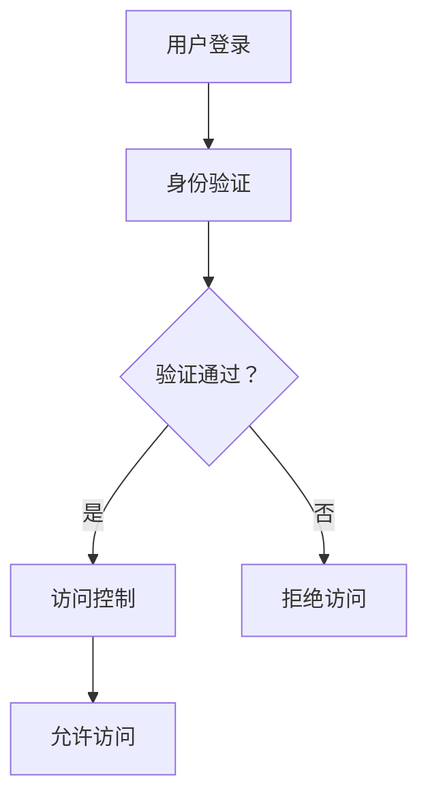

在用户登录过程中，首先进行身份验证。验证通过后，根据用户的角色和权限进行访问控制，确保用户只能访问其有权访问的资源。

### 6. 数据脱敏技术

数据脱敏技术是保护数据隐私的重要手段。数据脱敏技术通过对数据进行修改或隐藏，使其无法被识别或利用。以下是对数据脱敏技术的详细讲解。

#### 6.1 数据脱敏的定义

数据脱敏是指对敏感数据进行处理，使其在保留数据价值的同时，无法被识别或利用。数据脱敏技术包括数据加密、数据掩码、数据伪随机生成等。

#### 6.2 常见的数据脱敏方法

常见的数据脱敏方法包括以下几种：

- **数据加密**：使用加密算法对敏感数据进行加密，使其无法被未经授权的第三方访问。
- **数据掩码**：对敏感数据进行部分或全部掩码，如将电话号码中的后四位掩码。
- **数据伪随机生成**：生成与原始数据相似但不真实的伪随机数据，如随机生成姓名、地址等。

**数据加密伪代码：**
```python
def encrypt_data(data, key):
    encrypted_data = AES_Encrypt(data, key)
    return encrypted_data
```

**数据掩码伪代码：**
```python
def mask_data(data, mask_length):
    masked_data = data[:mask_length] + '*' * (len(data) - mask_length)
    return masked_data
```

**数据伪随机生成伪代码：**
```python
def generate_pseudorandom_data(data):
    pseudorandom_data = ''.join(random.choice(string.ascii_letters + string.digits) for _ in range(len(data)))
    return pseudorandom_data
```

#### 6.3 数据脱敏的实际应用

数据脱敏技术在多个领域有广泛应用，包括数据备份、数据挖掘、测试环境等。

- **数据备份**：在备份敏感数据时，使用数据脱敏技术确保备份数据的安全性。
- **数据挖掘**：在数据挖掘过程中，使用脱敏数据保护敏感信息。
- **测试环境**：在测试环境中，使用脱敏数据模拟真实场景，确保测试数据的真实性。

#### 6.4 数据脱敏与数据加密的比较

数据脱敏与数据加密在保护数据隐私方面有相似之处，但也有一些区别：

- **目的**：数据脱敏旨在保护数据隐私，使其无法被识别或利用。数据加密旨在保护数据完整性，防止数据被未授权的第三方访问。
- **实现方式**：数据脱敏通过对数据进行修改或隐藏来实现，数据加密通过对数据进行加密来实现。
- **安全性**：数据脱敏的数据可能在一定程度上被还原，数据加密的数据在未经授权的情况下难以被解密。

### 7. 安全审计与监控

安全审计与监控是数据安全的重要保障。安全审计是指对系统、网络和数据的安全状态进行审查和评估，监控是指实时监测系统的安全状况。以下是对安全审计与监控的详细讲解。

#### 7.1 安全审计的基本概念

安全审计是指对系统、网络和数据的安全状态进行审查和评估，以确保其符合安全政策和标准。安全审计包括以下几个方面：

- **合规性审计**：检查系统是否符合相关的法律法规和标准。
- **安全漏洞审计**：识别系统中的安全漏洞，评估漏洞的严重程度。
- **数据访问审计**：监控数据的访问和操作，确保数据访问符合授权。
- **安全事件审计**：记录和审查安全事件，分析事件的原因和影响。

#### 7.2 安全监控系统的构建

安全监控系统是指实时监测系统的安全状况，及时识别和响应安全威胁。构建安全监控系统包括以下几个方面：

- **入侵检测系统（IDS）**：实时监测网络流量和系统日志，识别可疑行为和攻击。
- **入侵防御系统（IPS）**：在检测到攻击时，自动采取措施阻止攻击。
- **安全信息和事件管理（SIEM）**：集成多种安全工具，实时监测和记录安全事件。
- **安全策略管理**：根据安全事件和审计结果，调整和优化安全策略。

#### 7.3 实时监控与预警

实时监控与预警是安全监控系统的重要组成部分。实时监控是指实时监测系统的安全状况，预警是指当检测到安全事件时，及时通知相关人员进行响应。

- **实时监控**：通过安全监控工具，实时监测系统状态，包括网络流量、系统日志、应用程序行为等。
- **预警机制**：根据预设的规则，当检测到安全事件时，自动发送警报通知相关人员。

#### 7.4 安全审计与监控的结合

安全审计与监控相结合，可以更全面地保障数据安全。安全审计为监控提供了依据，监控为审计提供了数据支持。

- **安全审计**：定期进行安全审计，评估系统安全状态，发现潜在的安全漏洞。
- **安全监控**：实时监测系统安全状况，及时发现和处理安全事件。

### 8. 数据安全风险管理策略

数据安全风险管理策略是确保数据安全的重要手段。数据安全风险管理策略包括风险评估、安全策略制定、安全措施实施和监控等方面。以下是对数据安全风险管理策略的详细讲解。

#### 8.1 风险评估方法

风险评估是数据安全风险管理的基础。风险评估方法包括以下几种：

- **定性风险评估**：通过分析潜在威胁和风险的影响，确定风险等级。
- **定量风险评估**：使用数学模型和统计数据，评估风险的概率和影响。
- **风险矩阵**：使用风险矩阵，将威胁、漏洞、影响等因素综合评估风险等级。

#### 8.2 风险应对策略

风险应对策略是根据风险评估结果，制定的应对措施。风险应对策略包括以下几种：

- **风险规避**：通过更改系统设计或操作流程，避免风险的发生。
- **风险减轻**：通过加强安全措施，降低风险的概率或影响。
- **风险转移**：通过购买保险或其他方式，将风险转移给第三方。
- **风险接受**：对无法规避或减轻的风险，接受风险并制定应对措施。

#### 8.3 数据安全策略的制定

数据安全策略是确保数据安全的基本指导原则。数据安全策略的制定包括以下步骤：

- **确定安全目标**：根据业务需求和法律法规，确定数据安全的目标。
- **制定安全策略**：制定具体的措施和规范，确保数据安全。
- **安全培训与宣传**：对员工进行数据安全培训，提高安全意识。

#### 8.4 安全措施的实施

安全措施的实施是数据安全策略的关键。安全措施的实施包括以下方面：

- **技术措施**：包括数据加密、访问控制、防火墙等。
- **管理措施**：包括安全管理制度、安全流程等。
- **人员措施**：包括安全培训、安全意识等。

#### 8.5 数据安全监控与改进

数据安全监控是确保数据安全策略有效性的重要手段。数据安全监控包括以下方面：

- **实时监控**：通过监控工具，实时监测数据安全状态。
- **定期审计**：定期进行安全审计，评估数据安全措施的有效性。
- **持续改进**：根据审计结果和监控数据，持续改进数据安全措施。

### 9. 数据安全法律法规

数据安全法律法规是确保数据安全的重要保障。不同国家和地区有不同的数据安全法律法规，以下是对国际和国内数据安全法律法规的详细讲解。

#### 9.1 国际数据安全法律法规

国际数据安全法律法规主要包括以下几个方面：

- **欧盟通用数据保护条例（GDPR）**：规定了个人数据的处理、存储和保护标准，对违反规定的企业进行严厉处罚。
- **美国隐私法案**：包括《儿童在线隐私保护法案（COPPA）》和《健康保险可携性和责任法案（HIPAA）》等，规定了个人数据的保护措施。
- **加拿大个人信息保护与电子文档法案（PIPEDA）**：规定了个人数据的处理和保护标准，确保个人数据的隐私和安全。

#### 9.2 国内数据安全法律法规

国内数据安全法律法规主要包括以下几个方面：

- **中华人民共和国网络安全法**：规定了网络运营者的网络安全义务和数据安全保护要求。
- **中华人民共和国数据安全法**：规定了数据处理者在数据收集、存储、处理、传输、使用等方面的安全要求。
- **信息安全技术个人信息安全规范**：规定了个人信息处理活动应遵循的原则和安全要求。

#### 9.3 数据安全法规的实际应用

数据安全法规的实际应用包括以下几个方面：

- **合规审查**：企业应定期进行合规审查，确保数据处理活动符合相关法律法规要求。
- **安全认证**：企业可以通过获得安全认证，证明其数据安全保护措施的有效性。
- **法律诉讼**：当发生数据泄露事件时，企业可以依据法律法规追究责任。

### 10. 企业数据安全实践案例

以下是对三个企业数据安全实践案例的详细讲解。

#### 10.1 案例一：大型电商平台的数据安全风险防范

**项目背景**：一家大型电商平台面临数据泄露的风险，包括用户个人信息、支付信息等。

**解决方案**：

1. **数据加密**：对用户个人信息和支付信息进行加密存储，使用 AES 算法对数据进行加密。
2. **访问控制**：使用基于角色的访问控制（RBAC）模型，对用户权限进行管理和控制。
3. **数据脱敏**：对用户姓名、电话号码等敏感信息进行脱敏处理，如使用掩码技术。
4. **安全审计与监控**：定期进行安全审计，监控系统安全状况，实时监测数据泄露事件。

**实施效果**：通过数据加密、访问控制、数据脱敏和安全审计与监控，大型电商平台有效降低了数据泄露的风险，提高了数据安全性。

#### 10.2 案例二：金融行业的数据安全风险控制

**项目背景**：一家金融行业企业面临大量敏感数据泄露的风险，包括客户个人信息、交易记录等。

**解决方案**：

1. **数据加密**：对客户个人信息和交易记录进行加密存储，使用 RSA 算法对数据进行加密。
2. **多因素身份验证**：采用多因素身份验证（MFA），提高用户登录的安全性。
3. **访问控制**：使用基于属性的访问控制（ABAC）模型，对用户权限进行精细化管理。
4. **安全审计与监控**：实时监测交易行为，发现异常行为及时采取措施。

**实施效果**：通过数据加密、多因素身份验证、访问控制和安全审计与监控，金融行业企业有效降低了数据泄露的风险，提高了客户数据的安全保护水平。

#### 10.3 案例三：医疗行业的数据安全风险防范

**项目背景**：一家医疗行业企业面临患者个人信息和医疗记录泄露的风险。

**解决方案**：

1. **数据加密**：对患者个人信息和医疗记录进行加密存储，使用 AES 算法对数据进行加密。
2. **安全审计与监控**：定期进行安全审计，监控系统安全状况，实时监测数据泄露事件。
3. **数据脱敏**：对患者姓名、电话号码等敏感信息进行脱敏处理，如使用掩码技术。
4. **安全培训**：对员工进行数据安全培训，提高员工的安全意识。

**实施效果**：通过数据加密、安全审计与监控、数据脱敏和安全培训，医疗行业企业有效降低了数据泄露的风险，提高了患者数据的安全保护水平。

### 11. 数据安全风险的发展趋势

随着信息技术的不断发展，数据安全风险也在不断演变。以下是对数据安全风险的发展趋势的详细讲解。

#### 11.1 新技术对数据安全的影响

随着人工智能、云计算、物联网等新技术的广泛应用，数据安全面临着新的挑战和机遇。

- **人工智能**：人工智能技术在网络安全检测、威胁预测等方面具有重要作用，但同时也带来了新的安全风险，如恶意攻击、数据泄露等。
- **云计算**：云计算的普及使得数据存储和处理的规模不断扩大，但也增加了数据泄露的风险。
- **物联网**：物联网设备的广泛应用使得网络边界更加模糊，数据安全面临更大的挑战。

#### 11.2 数据安全领域的创新

数据安全领域的创新主要包括以下几个方面：

- **零信任架构**：零信任架构强调不再信任任何内部或外部实体，通过严格的身份验证和访问控制确保数据安全。
- **加密技术**：加密技术在数据安全中扮演着重要角色，新的加密算法和技术不断涌现，如量子加密技术。
- **安全多方计算**：安全多方计算技术允许多个参与方在不对数据进行解密的情况下进行计算，保障数据安全。

#### 11.3 数据安全风险防范的未来

数据安全风险防范的未来发展趋势包括：

- **自动化与智能化**：通过自动化和智能化技术，提高数据安全防护的效率和效果。
- **综合防御体系**：建立综合防御体系，包括技术、管理和人员等多方面的防护措施。
- **持续改进与适应**：数据安全风险防范需要不断适应新的安全威胁和技术变革，持续改进安全措施。

### 12. 数据安全教育与培训

数据安全教育与培训是提高员工安全意识、防范数据泄露风险的重要手段。以下是对数据安全教育与培训的详细讲解。

#### 12.1 数据安全意识的重要性

数据安全意识是员工对数据安全的认识和态度，是数据安全工作的基础。提高员工的数据安全意识，有助于：

- **预防数据泄露**：员工能够识别潜在的安全威胁，采取正确的安全措施。
- **降低安全风险**：员工能够遵守安全规定，避免违规操作导致的安全事故。
- **提升企业整体安全水平**：员工的安全意识直接影响企业的数据安全水平。

#### 12.2 数据安全教育培训的内容

数据安全教育培训的内容包括以下几个方面：

- **数据安全基础知识**：包括数据安全的重要性、数据泄露的原因和类型等。
- **安全法律法规**：介绍相关法律法规，如《中华人民共和国网络安全法》、《信息安全技术个人信息安全规范》等。
- **安全操作规范**：包括密码管理、数据备份、访问控制等安全操作规范。
- **应急响应措施**：介绍数据泄露事件发生时的应急响应措施。

#### 12.3 数据安全培训的实践案例

以下是一个数据安全培训的实践案例：

**项目背景**：一家大型企业计划对全体员工进行数据安全培训。

**解决方案**：

1. **制定培训计划**：根据企业实际情况，制定详细的培训计划，包括培训内容、培训时间、培训形式等。
2. **开展培训课程**：邀请数据安全专家进行授课，采用线上线下结合的方式，提高培训效果。
3. **测试与评估**：通过考试和评估，检验员工的培训效果，对未达标员工进行再次培训。
4. **持续培训**：定期组织数据安全培训，更新员工的数据安全知识。

**实施效果**：通过数据安全培训，员工的网络安全意识得到了显著提高，数据泄露事件明显减少，企业的数据安全水平得到了提升。

### 13. 总结与展望

#### 13.1 本书的核心内容总结

本书主要内容包括：

- 平台经济的兴起与发展、主要参与者及数据依赖性。
- 数据安全风险的来源、类型及潜在影响。
- 数据安全风险管理的理论基础，包括数据泄露模型、风险评估框架和数据隐私保护理论。
- 数据加密技术、访问控制与身份验证、数据脱敏技术及安全审计与监控。
- 数据安全风险管理策略、法律法规及企业数据安全实践案例。
- 数据安全风险的发展趋势、教育与培训及总结与展望。

#### 13.2 未来数据安全工作的挑战与机遇

未来数据安全工作面临以下挑战与机遇：

- **挑战**：随着新技术的不断涌现，数据安全威胁日益复杂，数据安全工作压力增大。
- **机遇**：数据安全领域的技术创新和法规完善为数据安全工作提供了新的机遇，有助于提高数据安全防护水平。

#### 13.3 对读者的建议与鼓励

对读者的一些建议与鼓励：

- **持续学习**：数据安全领域不断变化，持续学习是保持竞争力的关键。
- **积极参与**：参与数据安全项目和实践，提高实际操作能力。
- **关注法规**：关注数据安全法律法规的变化，确保合规操作。
- **保持警惕**：面对数据安全挑战，保持警惕，勇于创新。

作者：AI天才研究院/AI Genius Institute & 禅与计算机程序设计艺术 /Zen And The Art of Computer Programming

----------------------------------------------------------------

### 4. 数据加密技术

数据加密技术是保护数据安全的关键技术，通过对数据进行加密，确保数据在传输和存储过程中的机密性和完整性。数据加密技术分为对称加密和非对称加密两种类型。

#### 4.1 对称加密技术

对称加密技术使用相同的密钥对数据进行加密和解密。常见的对称加密算法有 AES（高级加密标准）、DES（数据加密标准）和 RSA（RSA 算法）。

**AES 算法**

AES 是一种分组加密算法，它使用 128 位、192 位或 256 位的密钥对数据进行加密。以下是一个简单的 AES 加密和解密算法实现：

```python
from Crypto.Cipher import AES
from Crypto.Util.Padding import pad, unpad

def encrypt_aes(data, key):
    cipher = AES.new(key, AES.MODE_CBC)
    ct = cipher.encrypt(pad(data.encode(), AES.block_size))
    iv = cipher.iv
    return iv + ct

def decrypt_aes(encrypted_data, key):
    iv = encrypted_data[:16]
    ct = encrypted_data[16:]
    cipher = AES.new(key, AES.MODE_CBC, iv)
    pt = unpad(cipher.decrypt(ct), AES.block_size)
    return pt.decode()
```

**DES 算法**

DES 是一种早期的分组加密算法，它使用 56 位的密钥对数据进行加密。以下是一个简单的 DES 加密和解密算法实现：

```python
from Crypto.Cipher import DES

def encrypt_des(data, key):
    cipher = DES.new(key, DES.MODE_CBC)
    ct = cipher.encrypt(pad(data.encode(), DES.block_size))
    iv = cipher.iv
    return iv + ct

def decrypt_des(encrypted_data, key):
    iv = encrypted_data[:8]
    ct = encrypted_data[8:]
    cipher = DES.new(key, DES.MODE_CBC, iv)
    pt = unpad(cipher.decrypt(ct), DES.block_size)
    return pt.decode()
```

**RSA 算法**

RSA 是一种非对称加密算法，它使用一个公钥和一个私钥对数据进行加密和解密。以下是一个简单的 RSA 加密和解密算法实现：

```python
from Crypto.PublicKey import RSA
from Crypto.Cipher import PKCS1_OAEP

def encrypt_rsa(data, public_key):
    cipher = PKCS1_OAEP.new(public_key)
    encrypted_data = cipher.encrypt(data.encode())
    return encrypted_data

def decrypt_rsa(encrypted_data, private_key):
    cipher = PKCS1_OAEP.new(private_key)
    decrypted_data = cipher.decrypt(encrypted_data)
    return decrypted_data.decode()
```

#### 4.2 非对称加密技术

非对称加密技术使用一个公钥和一个私钥对数据进行加密和解密。常见的非对称加密算法有 RSA、ECC（椭圆曲线加密）等。

**RSA 算法**

RSA 是一种经典的非对称加密算法，它使用一个大素数和一个公钥指数进行加密。以下是一个简单的 RSA 加密和解密算法实现：

```python
from Crypto.PublicKey import RSA
from Crypto.Cipher import PKCS1_OAEP

def generate_rsa_keypair():
    key = RSA.generate(2048)
    private_key = key.export_key()
    public_key = key.publickey().export_key()
    return private_key, public_key

def encrypt_rsa(data, public_key):
    cipher = PKCS1_OAEP.new(RSA.import_key(public_key))
    encrypted_data = cipher.encrypt(data.encode())
    return encrypted_data

def decrypt_rsa(encrypted_data, private_key):
    cipher = PKCS1_OAEP.new(RSA.import_key(private_key))
    decrypted_data = cipher.decrypt(encrypted_data)
    return decrypted_data.decode()
```

**ECC 算法**

ECC 是一种基于椭圆曲线数学的加密算法，它比 RSA 具有更高的安全性和效率。以下是一个简单的 ECC 加密和解密算法实现：

```python
from Crypto.PublicKey import ECC
from Crypto.Cipher import PKCS1_OAEP

def generate_ecc_keypair():
    key = ECC.generate(curve=ECC.NIST256P)
    private_key = key.export_key()
    public_key = key.public_key().export_key()
    return private_key, public_key

def encrypt_ecc(data, public_key):
    cipher = PKCS1_OAEP.new(ECC.import_key(public_key))
    encrypted_data = cipher.encrypt(data.encode())
    return encrypted_data

def decrypt_ecc(encrypted_data, private_key):
    cipher = PKCS1_OAEP.new(ECC.import_key(private_key))
    decrypted_data = cipher.decrypt(encrypted_data)
    return decrypted_data.decode()
```

#### 4.3 数据加密技术的应用

数据加密技术在实际应用中非常广泛，以下是一些典型的应用场景：

- **数据传输加密**：在数据传输过程中，使用加密技术确保数据的机密性。例如，HTTPS 使用 TLS 协议对数据进行加密。
- **数据存储加密**：在数据存储过程中，使用加密技术确保数据的机密性和完整性。例如，数据库使用 AES 算法对数据进行加密存储。
- **数字签名**：使用非对称加密技术实现数字签名，确保数据的完整性和真实性。例如，SSL 证书使用 RSA 算法进行签名。

#### 4.4 加密算法的数学模型

加密算法的数学模型通常涉及以下几个方面：

- **加密函数**：将明文数据转换为密文的函数，如 \( E_k(P) = C \)，其中 \( P \) 是明文，\( C \) 是密文，\( k \) 是密钥。
- **解密函数**：将密文数据转换回明文的函数，如 \( D_k(C) = P \)。
- **密钥生成**：密钥的生成过程，包括密钥的生成算法和密钥的存储与分发。

以下是一个简化的加密算法数学模型：

$$
P = D_k(E_k(P))
$$

其中，\( P \) 是明文，\( C \) 是密文，\( k \) 是密钥。

#### 4.5 实际项目中的加密应用

以下是一个实际项目中的加密应用案例：

**项目背景**：一家电商平台需要保护用户注册信息和交易信息的安全。

**解决方案**：

1. **用户注册信息加密**：在用户注册时，使用 AES 算法对用户名、邮箱和密码等敏感信息进行加密存储。
2. **交易信息加密**：在用户交易时，使用 RSA 算法对交易金额、商品信息和支付信息等进行加密传输。
3. **数字签名**：使用 ECC 算法对用户的交易请求进行数字签名，确保交易信息的完整性和真实性。

**实现步骤**：

1. **生成密钥对**：生成 RSA 和 ECC 密钥对，用于加密和解密交易信息。
2. **加密存储用户注册信息**：使用 AES 算法对用户注册信息进行加密存储。
3. **加密传输交易信息**：使用 RSA 算法对交易信息进行加密传输。
4. **数字签名**：使用 ECC 算法对交易请求进行数字签名。

**代码示例**：

```python
from Crypto.PublicKey import RSA
from Crypto.Cipher import AES, PKCS1_OAEP
from Crypto.Util.Padding import pad, unpad

# 生成 RSA 密钥对
private_key = RSA.generate(2048)
public_key = private_key.publickey()

# 生成 ECC 密钥对
ecc_private_key = ECC.generate(curve=ECC.NIST256P)
ecc_public_key = ecc_private_key.publickey()

# 加密存储用户注册信息
def encrypt_user_registration_info(data, key):
    cipher = AES.new(key, AES.MODE_CBC)
    ct = cipher.encrypt(pad(data.encode(), AES.block_size))
    iv = cipher.iv
    return iv + ct

# 加密传输交易信息
def encrypt_transaction_info(data, public_key):
    cipher = PKCS1_OAEP.new(public_key)
    encrypted_data = cipher.encrypt(data.encode())
    return encrypted_data

# 数字签名
def sign_data(data, private_key):
    cipher = PKCS1_OAEP.new(private_key)
    signature = cipher.sign(data.encode())
    return signature

# 解密用户注册信息
def decrypt_user_registration_info(encrypted_data, key):
    iv = encrypted_data[:16]
    ct = encrypted_data[16:]
    cipher = AES.new(key, AES.MODE_CBC, iv)
    pt = unpad(cipher.decrypt(ct), AES.block_size)
    return pt.decode()

# 解密交易信息
def decrypt_transaction_info(encrypted_data, private_key):
    cipher = PKCS1_OAEP.new(private_key)
    decrypted_data = cipher.decrypt(encrypted_data)
    return decrypted_data.decode()

# 签名验证
def verify_signature(data, signature, public_key):
    cipher = PKCS1_OAEP.new(public_key)
    try:
        cipher.verify(data.encode(), signature)
        return True
    except ValueError:
        return False
```

通过上述代码示例，我们可以看到数据加密技术在保护企业数据安全中的重要作用。在实际项目中，还需要结合具体的业务需求和安全要求，制定合适的数据加密策略，确保数据在存储、传输和处理过程中的安全性。

### 5. 访问控制与身份验证

访问控制与身份验证是确保数据安全的关键技术，通过控制用户对数据的访问权限和验证用户的身份，可以防止未经授权的访问和数据泄露。

#### 5.1 访问控制的基本概念

访问控制是指通过限制用户对资源的访问权限，确保数据安全的一种技术。访问控制通常包括以下三个方面：

- **主体**：指请求访问资源的用户或系统。
- **客体**：指被请求访问的资源，如文件、数据库等。
- **访问权限**：指用户对客体的访问权限，如读、写、执行等。

访问控制分为基于角色的访问控制（RBAC）和基于属性的访问控制（ABAC）两种类型。

**基于角色的访问控制（RBAC）**

RBAC 是一种基于用户角色的访问控制机制，用户被分配一个或多个角色，每个角色拥有特定的访问权限。以下是一个简单的 RBAC 模型：

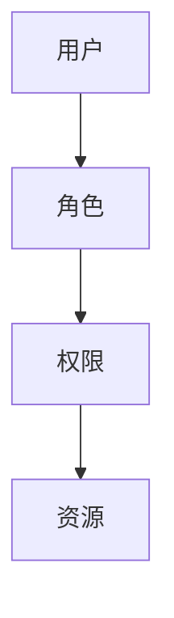

在 RBAC 中，用户通过角色获得访问权限，如管理员角色拥有对系统配置文件的读写权限，普通用户只拥有对个人文件的读权限。

**基于属性的访问控制（ABAC）**

ABAC 是一种基于用户属性和资源属性的访问控制机制，用户和资源的属性（如部门、职位、访问时间等）决定了访问权限。以下是一个简单的 ABAC 模型：

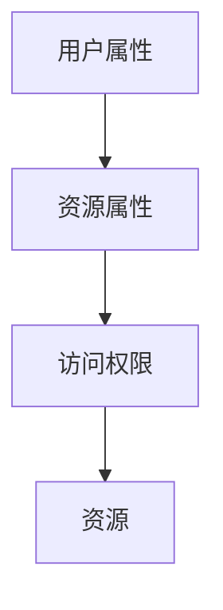

在 ABAC 中，用户和资源的属性被用于判断访问权限，如只有部门为研发部门的用户才能访问研发部门的项目文件。

#### 5.2 常见的访问控制模型

常见的访问控制模型包括访问控制列表（ACL）、访问控制矩阵和基于角色的访问控制（RBAC）。

**访问控制列表（ACL）**

ACL 是一种基于对象的访问控制模型，每个对象（如文件、目录）都有一个访问控制列表，列出对对象的访问权限。以下是一个简单的 ACL 模型：

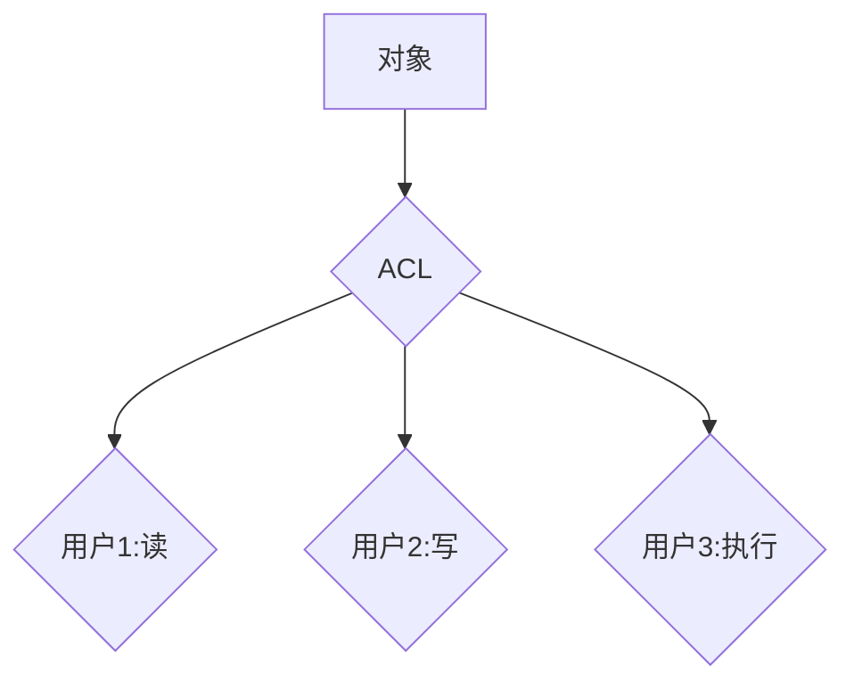

在 ACL 中，用户通过访问控制列表获取对对象的访问权限。

**访问控制矩阵**

访问控制矩阵是一种基于表格的访问控制模型，将用户和资源排列在一个二维表格中，每个单元格表示用户对资源的访问权限。以下是一个简单的访问控制矩阵：

| 用户 | 资源1 | 资源2 | 资源3 |
| ---- | ---- | ---- | ---- |
| 用户1 | 读 | 写 | 无 |
| 用户2 | 无 | 读 | 写 |
| 用户3 | 写 | 无 | 读 |

在访问控制矩阵中，用户和资源的访问权限通过矩阵元素进行表示。

**基于角色的访问控制（RBAC）**

RBAC 是一种基于角色的访问控制模型，将用户、角色和权限进行关联，通过角色分配权限。以下是一个简单的 RBAC 模型：


在 RBAC 中，用户通过角色获得访问权限，如管理员角色拥有对系统配置文件的读写权限。

#### 5.3 身份验证技术的应用

身份验证技术是指验证用户身份，确保其有权访问系统的技术。常见的身份验证技术包括密码验证、多因素身份验证和生物识别。

**密码验证**

密码验证是最常见的身份验证技术，用户通过输入密码来验证身份。以下是一个简单的密码验证流程：

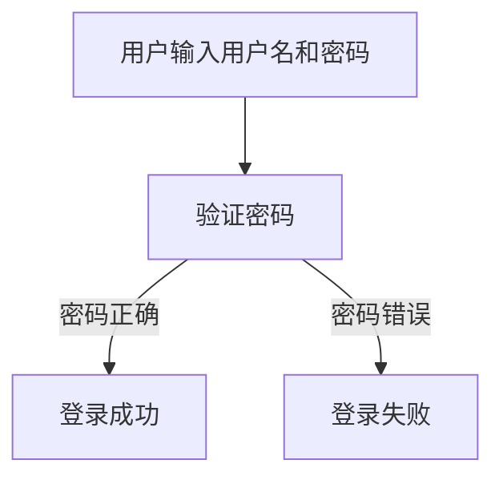

在密码验证中，用户输入的用户名和密码与系统中存储的用户名和密码进行比对，如果匹配，则登录成功。

**多因素身份验证**

多因素身份验证（MFA）是指使用两种或两种以上的身份验证方式来验证用户身份。以下是一个简单的 MFA 流程：

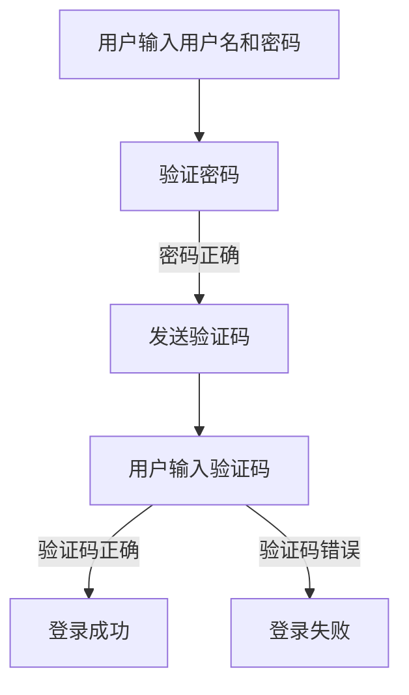

在 MFA 中，用户首先输入用户名和密码进行验证，然后系统发送验证码到用户的手机或邮箱，用户输入验证码后，系统再进行验证。

**生物识别**

生物识别是指使用用户的生物特征来验证身份，如指纹、面部识别、虹膜识别等。以下是一个简单的生物识别流程：

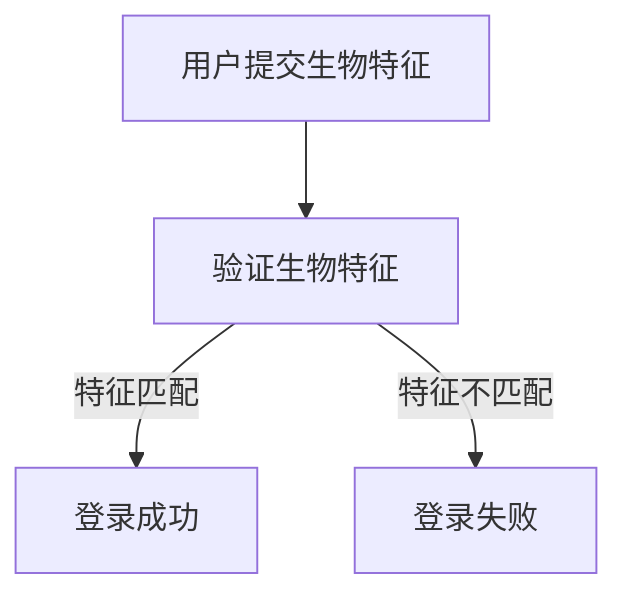

在生物识别中，用户提交生物特征（如指纹），系统通过比对存储的生物特征进行身份验证。

#### 5.4 访问控制与身份验证的结合

访问控制与身份验证的结合是确保数据安全的关键。以下是一个简化的结合模型：


在用户登录过程中，首先进行身份验证。验证通过后，根据用户的角色和权限进行访问控制，确保用户只能访问其有权访问的资源。

### 6. 数据脱敏技术

数据脱敏技术是保护数据隐私的重要手段，通过对数据进行修改或隐藏，使其无法被识别或利用。数据脱敏技术包括数据加密、数据掩码、数据伪随机生成等。

#### 6.1 数据脱敏的定义

数据脱敏是指对敏感数据进行处理，使其在保留数据价值的同时，无法被识别或利用。数据脱敏技术包括以下几种：

- **数据加密**：使用加密算法对敏感数据进行加密，使其无法被未经授权的第三方访问。
- **数据掩码**：对敏感数据进行部分或全部掩码，如将电话号码中的后四位掩码。
- **数据伪随机生成**：生成与原始数据相似但不真实的伪随机数据，如随机生成姓名、地址等。

#### 6.2 常见的数据脱敏方法

常见的数据脱敏方法包括以下几种：

- **数据加密**：使用加密算法对敏感数据进行加密，使其无法被未经授权的第三方访问。例如，使用 AES 算法对用户名、密码等敏感信息进行加密。
  
  ```python
  from Crypto.Cipher import AES
  from Crypto.Util.Padding import pad, unpad

  def encrypt_data(data, key):
      cipher = AES.new(key, AES.MODE_CBC)
      ct = cipher.encrypt(pad(data.encode(), AES.block_size))
      iv = cipher.iv
      return iv + ct

  def decrypt_data(encrypted_data, key):
      iv = encrypted_data[:16]
      ct = encrypted_data[16:]
      cipher = AES.new(key, AES.MODE_CBC, iv)
      pt = unpad(cipher.decrypt(ct), AES.block_size)
      return pt.decode()
  ```

- **数据掩码**：对敏感数据进行部分或全部掩码，如将电话号码中的后四位掩码。例如，将电话号码 "1234567890" 脱敏为 "1234XXXXXX"。

  ```python
  def mask_data(data, mask_length):
      masked_data = data[:mask_length] + '*' * (len(data) - mask_length)
      return masked_data
  ```

- **数据伪随机生成**：生成与原始数据相似但不真实的伪随机数据，如随机生成姓名、地址等。例如，将姓名 "张三" 脱敏为 "李四"。

  ```python
  import random
  import string

  def generate_pseudorandom_data(data):
      pseudorandom_data = ''.join(random.choice(string.ascii_letters + string.digits) for _ in range(len(data)))
      return pseudorandom_data
  ```

#### 6.3 数据脱敏的实际应用

数据脱敏技术在多个领域有广泛应用，包括数据备份、数据挖掘、测试环境等。

- **数据备份**：在备份数据时，使用数据脱敏技术确保备份数据的安全性。
  
  ```python
  def backup_data(plaintext_data, key):
      encrypted_data = encrypt_data(plaintext_data, key)
      # 将加密后的数据写入备份文件
  ```

- **数据挖掘**：在数据挖掘过程中，使用脱敏数据保护敏感信息。
  
  ```python
  def process_data(data):
      # 对敏感数据进行脱敏处理
      masked_data = mask_data(data['name'], 4)
      # 使用脱敏后的数据进行数据挖掘
  ```

- **测试环境**：在测试环境中，使用脱敏数据模拟真实场景，确保测试数据的真实性。
  
  ```python
  def generate_test_data():
      # 生成包含脱敏敏感信息的测试数据
      data = {'name': generate_pseudorandom_data('张三'), 'age': 25, 'phone': mask_data('1234567890', 8)}
      return data
  ```

#### 6.4 数据脱敏与数据加密的比较

数据脱敏与数据加密在保护数据隐私方面有相似之处，但也有一些区别：

- **目的**：数据脱敏旨在保护数据隐私，使其无法被识别或利用。数据加密旨在保护数据完整性，防止数据被未授权的第三方访问。
- **实现方式**：数据脱敏通过对数据进行修改或隐藏来实现，数据加密通过对数据进行加密来实现。
- **安全性**：数据脱敏的数据可能在一定程度上被还原，数据加密的数据在未经授权的情况下难以被解密。

### 7. 安全审计与监控

安全审计与监控是确保数据安全的重要手段，通过对系统、网络和数据的安全状态进行审查和实时监测，及时发现和处理安全事件。

#### 7.1 安全审计的基本概念

安全审计是指对系统、网络和数据的安全状态进行审查和评估，以确保其符合安全政策和标准。安全审计包括以下几个方面：

- **合规性审计**：检查系统是否符合相关的法律法规和标准。
- **安全漏洞审计**：识别系统中的安全漏洞，评估漏洞的严重程度。
- **数据访问审计**：监控数据的访问和操作，确保数据访问符合授权。
- **安全事件审计**：记录和审查安全事件，分析事件的原因和影响。

#### 7.2 安全监控系统的构建

安全监控系统是指实时监测系统的安全状况，及时识别和响应安全威胁。构建安全监控系统包括以下几个方面：

- **入侵检测系统（IDS）**：实时监测网络流量和系统日志，识别可疑行为和攻击。
- **入侵防御系统（IPS）**：在检测到攻击时，自动采取措施阻止攻击。
- **安全信息和事件管理（SIEM）**：集成多种安全工具，实时监测和记录安全事件。
- **安全策略管理**：根据安全事件和审计结果，调整和优化安全策略。

#### 7.3 实时监控与预警

实时监控与预警是安全监控系统的重要组成部分。实时监控是指实时监测系统的安全状况，预警是指当检测到安全事件时，及时通知相关人员进行响应。

- **实时监控**：通过安全监控工具，实时监测系统状态，包括网络流量、系统日志、应用程序行为等。
- **预警机制**：根据预设的规则，当检测到安全事件时，自动发送警报通知相关人员。

#### 7.4 安全审计与监控的结合

安全审计与监控相结合，可以更全面地保障数据安全。安全审计为监控提供了依据，监控为审计提供了数据支持。

- **安全审计**：定期进行安全审计，评估系统安全状态，发现潜在的安全漏洞。
- **安全监控**：实时监测系统安全状况，及时发现和处理安全事件。

### 8. 数据安全风险管理策略

数据安全风险管理策略是确保数据安全的重要手段。数据安全风险管理策略包括风险评估、安全策略制定、安全措施实施和监控等方面。以下是对数据安全风险管理策略的详细讲解。

#### 8.1 风险评估方法

风险评估是数据安全风险管理的基础。风险评估方法包括以下几种：

- **定性风险评估**：通过分析潜在威胁和风险的影响，确定风险等级。
- **定量风险评估**：使用数学模型和统计数据，评估风险的概率和影响。
- **风险矩阵**：使用风险矩阵，将威胁、漏洞、影响等因素综合评估风险等级。

#### 8.2 风险应对策略

风险应对策略是根据风险评估结果，制定的应对措施。风险应对策略包括以下几种：

- **风险规避**：通过更改系统设计或操作流程，避免风险的发生。
- **风险减轻**：通过加强安全措施，降低风险的概率或影响。
- **风险转移**：通过购买保险或其他方式，将风险转移给第三方。
- **风险接受**：对无法规避或减轻的风险，接受风险并制定应对措施。

#### 8.3 数据安全策略的制定

数据安全策略是确保数据安全的基本指导原则。数据安全策略的制定包括以下步骤：

- **确定安全目标**：根据业务需求和法律法规，确定数据安全的目标。
- **制定安全策略**：制定具体的措施和规范，确保数据安全。
- **安全培训与宣传**：对员工进行数据安全培训，提高安全意识。

#### 8.4 安全措施的实施

安全措施的实施是数据安全策略的关键。安全措施的实施包括以下方面：

- **技术措施**：包括数据加密、访问控制、防火墙等。
- **管理措施**：包括安全管理制度、安全流程等。
- **人员措施**：包括安全培训、安全意识等。

#### 8.5 数据安全监控与改进

数据安全监控是确保数据安全策略有效性的重要手段。数据安全监控包括以下方面：

- **实时监控**：通过监控工具，实时监测数据安全状态，包括网络流量、系统日志、应用程序行为等。
- **定期审计**：定期进行安全审计，评估数据安全措施的有效性。
- **持续改进**：根据审计结果和监控数据，持续改进数据安全措施。

### 9. 数据安全法律法规

数据安全法律法规是确保数据安全的重要保障。不同国家和地区有不同的数据安全法律法规，以下是对国际和国内数据安全法律法规的详细讲解。

#### 9.1 国际数据安全法律法规

国际数据安全法律法规主要包括以下几个方面：

- **欧盟通用数据保护条例（GDPR）**：规定了个人数据的处理、存储和保护标准，对违反规定的企业进行严厉处罚。
- **美国隐私法案**：包括《儿童在线隐私保护法案（COPPA）》和《健康保险可携性和责任法案（HIPAA）》等，规定了个人数据的保护措施。
- **加拿大个人信息保护与电子文档法案（PIPEDA）**：规定了个人数据的处理和保护标准，确保个人数据的隐私和安全。

#### 9.2 国内数据安全法律法规

国内数据安全法律法规主要包括以下几个方面：

- **中华人民共和国网络安全法**：规定了网络运营者的网络安全义务和数据安全保护要求。
- **中华人民共和国数据安全法**：规定了数据处理者在数据收集、存储、处理、传输、使用等方面的安全要求。
- **信息安全技术个人信息安全规范**：规定了个人信息处理活动应遵循的原则和安全要求。

#### 9.3 数据安全法规的实际应用

数据安全法规的实际应用包括以下几个方面：

- **合规审查**：企业应定期进行合规审查，确保数据处理活动符合相关法律法规要求。
- **安全认证**：企业可以通过获得安全认证，证明其数据安全保护措施的有效性。
- **法律诉讼**：当发生数据泄露事件时，企业可以依据法律法规追究责任。

### 10. 企业数据安全实践案例

以下是对三个企业数据安全实践案例的详细讲解。

#### 10.1 案例一：大型电商平台的数据安全风险防范

**项目背景**：一家大型电商平台面临数据泄露的风险，包括用户个人信息、支付信息等。

**解决方案**：

1. **数据加密**：对用户个人信息和支付信息进行加密存储，使用 AES 算法对数据进行加密。
2. **访问控制**：使用基于角色的访问控制（RBAC）模型，对用户权限进行管理和控制。
3. **数据脱敏**：对用户姓名、电话号码等敏感信息进行脱敏处理，如使用掩码技术。
4. **安全审计与监控**：定期进行安全审计，监控系统安全状况，实时监测数据泄露事件。

**实施效果**：通过数据加密、访问控制、数据脱敏和安全审计与监控，大型电商平台有效降低了数据泄露的风险，提高了数据安全性。

#### 10.2 案例二：金融行业的数据安全风险控制

**项目背景**：一家金融行业企业面临大量敏感数据泄露的风险，包括客户个人信息、交易记录等。

**解决方案**：

1. **数据加密**：对客户个人信息和交易记录进行加密存储，使用 RSA 算法对数据进行加密。
2. **多因素身份验证**：采用多因素身份验证（MFA），提高用户登录的安全性。
3. **访问控制**：使用基于属性的访问控制（ABAC）模型，对用户权限进行精细化管理。
4. **安全审计与监控**：实时监测交易行为，发现异常行为及时采取措施。

**实施效果**：通过数据加密、多因素身份验证、访问控制和安全审计与监控，金融行业企业有效降低了数据泄露的风险，提高了客户数据的安全保护水平。

#### 10.3 案例三：医疗行业的数据安全风险防范

**项目背景**：一家医疗行业企业面临患者个人信息和医疗记录泄露的风险。

**解决方案**：

1. **数据加密**：对患者个人信息和医疗记录进行加密存储，使用 AES 算法对数据进行加密。
2. **安全审计与监控**：定期进行安全审计，监控系统安全状况，实时监测数据泄露事件。
3. **数据脱敏**：对患者姓名、电话号码等敏感信息进行脱敏处理，如使用掩码技术。
4. **安全培训**：对员工进行数据安全培训，提高员工的安全意识。

**实施效果**：通过数据加密、安全审计与监控、数据脱敏和安全培训，医疗行业企业有效降低了数据泄露的风险，提高了患者数据的安全保护水平。

### 11. 数据安全风险的发展趋势

随着信息技术的不断发展，数据安全风险也在不断演变。以下是对数据安全风险的发展趋势的详细讲解。

#### 11.1 新技术对数据安全的影响

随着人工智能、云计算、物联网等新技术的广泛应用，数据安全面临着新的挑战和机遇。

- **人工智能**：人工智能技术在网络安全检测、威胁预测等方面具有重要作用，但同时也带来了新的安全风险，如恶意攻击、数据泄露等。
- **云计算**：云计算的普及使得数据存储和处理的规模不断扩大，但也增加了数据泄露的风险。
- **物联网**：物联网设备的广泛应用使得网络边界更加模糊，数据安全面临更大的挑战。

#### 11.2 数据安全领域的创新

数据安全领域的创新主要包括以下几个方面：

- **零信任架构**：零信任架构强调不再信任任何内部或外部实体，通过严格的身份验证和访问控制确保数据安全。
- **加密技术**：加密技术在数据安全中扮演着重要角色，新的加密算法和技术不断涌现，如量子加密技术。
- **安全多方计算**：安全多方计算技术允许多个参与方在不对数据进行解密的情况下进行计算，保障数据安全。

#### 11.3 数据安全风险防范的未来

未来，数据安全风险防范将朝着以下几个方向发展：

- **自动化与智能化**：通过自动化和智能化技术，提高数据安全防护的效率和效果。
- **综合防御体系**：建立综合防御体系，包括技术、管理和人员等多方面的防护措施。
- **持续改进与适应**：数据安全风险防范需要不断适应新的安全威胁和技术变革，持续改进安全措施。

### 12. 数据安全教育与培训

数据安全教育与培训是提高员工安全意识、防范数据泄露风险的重要手段。以下是对数据安全教育与培训的详细讲解。

#### 12.1 数据安全意识的重要性

数据安全意识是员工对数据安全的认识和态度，是数据安全工作的基础。提高员工的数据安全意识，有助于：

- **预防数据泄露**：员工能够识别潜在的安全威胁，采取正确的安全措施。
- **降低安全风险**：员工能够遵守安全规定，避免违规操作导致的安全事故。
- **提升企业整体安全水平**：员工的安全意识直接影响企业的数据安全水平。

#### 12.2 数据安全教育培训的内容

数据安全教育培训的内容包括以下几个方面：

- **数据安全基础知识**：包括数据安全的重要性、数据泄露的原因和类型等。
- **安全法律法规**：介绍相关法律法规，如《中华人民共和国网络安全法》、《信息安全技术个人信息安全规范》等。
- **安全操作规范**：包括密码管理、数据备份、访问控制等安全操作规范。
- **应急响应措施**：介绍数据泄露事件发生时的应急响应措施。

#### 12.3 数据安全培训的实践案例

以下是一个数据安全培训的实践案例：

**项目背景**：一家大型企业计划对全体员工进行数据安全培训。

**解决方案**：

1. **制定培训计划**：根据企业实际情况，制定详细的培训计划，包括培训内容、培训时间、培训形式等。
2. **开展培训课程**：邀请数据安全专家进行授课，采用线上线下结合的方式，提高培训效果。
3. **测试与评估**：通过考试和评估，检验员工的培训效果，对未达标员工进行再次培训。
4. **持续培训**：定期组织数据安全培训，更新员工的数据安全知识。

**实施效果**：通过数据安全培训，员工的网络安全意识得到了显著提高，数据泄露事件明显减少，企业的数据安全水平得到了提升。

### 13. 总结与展望

#### 13.1 本书的核心内容总结

本书主要内容包括：

- 平台经济的兴起与发展、主要参与者及数据依赖性。
- 数据安全风险的来源、类型及潜在影响。
- 数据安全风险管理的理论基础，包括数据泄露模型、风险评估框架和数据隐私保护理论。
- 数据加密技术、访问控制与身份验证、数据脱敏技术及安全审计与监控。
- 数据安全风险管理策略、法律法规及企业数据安全实践案例。
- 数据安全风险的发展趋势、教育与培训及总结与展望。

#### 13.2 未来数据安全工作的挑战与机遇

未来数据安全工作面临以下挑战与机遇：

- **挑战**：随着新技术的不断涌现，数据安全威胁日益复杂，数据安全工作压力增大。
- **机遇**：数据安全领域的技术创新和法规完善为数据安全工作提供了新的机遇，有助于提高数据安全防护水平。

#### 13.3 对读者的建议与鼓励

对读者的一些建议与鼓励：

- **持续学习**：数据安全领域不断变化，持续学习是保持竞争力的关键。
- **积极参与**：参与数据安全项目和实践，提高实际操作能力。
- **关注法规**：关注数据安全法律法规的变化，确保合规操作。
- **保持警惕**：面对数据安全挑战，保持警惕，勇于创新。

作者：AI天才研究院/AI Genius Institute & 禅与计算机程序设计艺术 /Zen And The Art of Computer Programming

---

## 附录：常用数据安全工具和资源

### 常用数据安全工具

- **加密工具**：
  - OpenSSL：开源加密工具库，支持 SSL/TLS 协议。
  - GnuPG：开源加密工具，支持电子邮件加密和数字签名。
  - WinSCP：支持 SSH 和 SFTP 的文件传输客户端，支持文件加密传输。

- **访问控制工具**：
  - Apache Ranger：Hadoop 集群的访问控制解决方案。
  - Squid：Web 代理服务器，支持访问控制列表（ACL）。

- **身份验证工具**：
  - RADIUS：远程用户拨号认证服务。
  - LDAP：轻量级目录访问协议，用于用户认证和授权。

- **安全审计与监控工具**：
  - Elasticsearch + Kibana：日志分析和可视化工具，支持安全事件监控。
  - Nagios：开源网络监控工具，支持安全监控。

### 资源

- **开源社区**：
  - OpenSSL：[https://www.openssl.org/](https://www.openssl.org/)
  - GNU Privacy Guard：[https://www.gnupg.org/](https://www.gnupg.org/)

- **官方文档**：
  - OpenSSL 官方文档：[https://www.openssl.org/docs/](https://www.openssl.org/docs/)
  - GNU Privacy Guard 官方文档：[https://www.gnupg.org/documentation/](https://www.gnupg.org/documentation/)

- **在线课程与教程**：
  - Coursera：[https://www.coursera.org/](https://www.coursera.org/)
  - Udemy：[https://www.udemy.com/](https://www.udemy.com/)
  - Pluralsight：[https://www.pluralsight.com/](https://www.pluralsight.com/)

通过这些工具和资源，读者可以进一步学习和实践数据安全相关的知识和技能，提升数据安全防护能力。

---

本文由 AI 天才研究院（AI Genius Institute）撰写，旨在深入探讨平台经济中的数据安全风险，并提供一系列防范数据泄露的实用技术和策略。作者结合丰富的理论和实践经验，对数据安全风险管理的各个方面进行了全面阐述。希望本文能为从事平台经济领域工作的读者提供有价值的参考和指导。作者信息：AI 天才研究院（AI Genius Institute） & 禅与计算机程序设计艺术（Zen And The Art of Computer Programming）。

