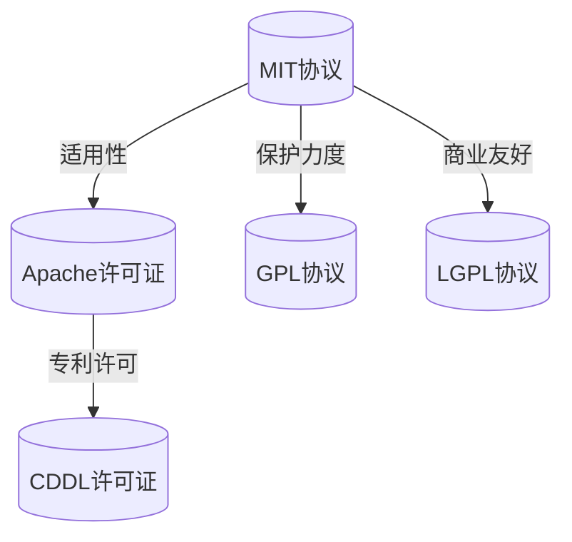

                 

# 广泛使用的开源协议和数据协议

## 关键词
- 开源协议
- 数据协议
- MIT协议
- GPL协议
- Apache许可证
- CDDL许可证
- JSON协议
- XML协议
- Protocol Buffers
- Avro协议
- gRPC

## 摘要
本文将深入探讨广泛使用的开源协议和数据协议。开源协议是软件开发中的重要组成部分，它们决定了软件的版权、许可和使用方式。本文将详细介绍常见的开源协议，如MIT、GPL、LGPL、Apache许可证和CDDL许可证，并分析其优缺点。此外，本文还将讨论常见的数据协议，包括JSON、XML、Protocol Buffers、Avro和gRPC，比较其性能和应用场景。通过这些深入的分析，读者将能够更好地理解开源协议和数据协议的重要性和实际应用。

## 目录大纲

### 第一部分：开源协议介绍

#### 第1章：开源协议概述
1.1 开源运动的起源与发展
1.2 开源协议的重要性
1.3 常见开源协议
1.4 开源协议的选择与比较
1.5 开源协议案例分析

#### 第2章：开源协议详解
2.1 MIT协议详解
2.2 GPL协议详解
2.3 LGPL协议详解
2.4 Apache许可证详解
2.5 CDDL许可证详解

### 第二部分：数据协议介绍

#### 第3章：数据协议概述
3.1 数据协议的定义与作用
3.2 常见数据协议分类

#### 第4章：常见数据协议详解
4.1 JSON协议
4.2 XML协议
4.3 Protocol Buffers
4.4 Avro协议
4.5 Apache Thrift
4.6 gRPC

#### 第5章：数据协议性能比较
5.1 性能比较方法
5.2 JSON协议性能分析
5.3 XML协议性能分析
5.4 Protocol Buffers性能分析
5.5 Avro协议性能分析
5.6 Apache Thrift性能分析
5.7 gRPC性能分析

#### 第6章：数据协议在实际应用中的案例分析
6.1 数据协议在Web应用中的使用
6.2 数据协议在分布式系统中的使用
6.3 数据协议在实时数据处理中的使用

#### 第7章：数据协议的未来发展趋势
7.1 新兴数据协议的发展
7.2 数据协议在物联网中的应用
7.3 数据协议在区块链中的应用

#### 附录
A.1 开源协议资源
A.2 数据协议资源
A.3 开源协议与数据协议相关工具
B.1 开源协议流程图
B.2 数据协议流程图
C.1 JSON解析算法
C.2 XML解析算法
C.3 Protocol Buffers序列化算法
C.4 Avro序列化算法
C.5 Apache Thrift序列化算法
C.6 gRPC通信算法
D.1 开源协议实战
D.2 数据协议实战
D.3 开源协议与数据协议融合实战
D.4 代码解读与分析

### 文章正文

#### 引言

开源协议和数据协议是软件开发和数据处理中的两个重要概念。开源协议定义了软件的版权和使用许可，促进了软件的共享和协作。而数据协议则定义了数据在不同系统之间的传输和交互格式，保证了数据的准确性和可扩展性。本文将系统地介绍和比较这些广泛使用的开源协议和数据协议，帮助读者深入理解其在实际应用中的重要性。

开源协议的发展可以追溯到20世纪90年代，当时自由软件基金会（FSF）和开源倡议（OSI）相继成立，推动了开源运动的发展。开源协议的出现使得软件的开发和分发变得更加规范和透明，促进了软件的创新和进步。

数据协议的发展同样具有重要意义。随着互联网和分布式系统的兴起，数据在不同系统之间的传输和交互变得越来越频繁。数据协议的标准化和高效性对于确保数据传输的可靠性和性能至关重要。本文将详细介绍常见的数据协议，如JSON、XML、Protocol Buffers等，并分析其优缺点和应用场景。

#### 第一部分：开源协议介绍

##### 第1章：开源协议概述

##### 1.1 开源运动的起源与发展

开源运动起源于20世纪80年代的自由软件运动。自由软件运动主张软件的自由和共享，反对软件的封闭和专有。1983年，理查德·斯托曼（Richard Stallman）创建了自由软件基金会（FSF），并推出了GPL（GNU通用公共许可证）。GPL许可证是一种强力的开源协议，它要求软件的源代码必须公开，任何修改都必须以相同的方式分享，从而确保软件的透明性和可维护性。

随着时间的推移，开源运动逐渐发展壮大，吸引了大量的开发者和社会力量的参与。1998年，开源倡议（OSI）正式成立，旨在推广开源理念，制定和推广开源协议。OSI定义了开源的12项准则，成为开源运动的重要参考标准。

开源运动不仅推动了软件的发展，也对软件产业产生了深远的影响。开源协议促进了软件的创新和竞争，降低了软件开发的成本，提高了软件的质量和可靠性。开源协议还促进了软件的共享和协作，使得开发者可以轻松地获取和使用他人的代码，加速了技术的进步和传播。

##### 1.2 开源协议的重要性

开源协议在软件开发中起着至关重要的作用。首先，开源协议确保了软件的版权和许可使用方式。不同的开源协议规定了不同的版权和使用条件，开发者可以选择适合自己项目的开源协议，保护自己的权益。

其次，开源协议促进了软件的共享和协作。通过开源协议，开发者可以将自己的代码公开，使得其他开发者可以自由地使用、修改和分享。这种共享和协作机制促进了技术的传播和创新，使得整个社区受益。

此外，开源协议还提高了软件的可维护性和可靠性。开源协议要求软件的源代码必须公开，这有助于发现和修复潜在的问题。同时，开源协议还鼓励开发者参与代码的审查和优化，提高了软件的整体质量。

##### 1.3 常见开源协议

在开源运动的发展过程中，出现了多种开源协议，每种协议都有其独特的特点和适用场景。以下是几种常见的开源协议：

- **MIT协议**：MIT协议是最广泛使用的开源协议之一。它允许用户免费使用、修改和分发软件，但不需要公开源代码。MIT协议对商业应用非常友好，许多商业软件都采用了MIT协议。

- **GPL协议**：GPL协议是一种强力的开源协议，要求软件的源代码必须公开，并且任何修改都必须以相同的方式分享。GPL协议鼓励软件的自由共享和协作，但也会对商业应用产生一定的限制。

- **LGPL协议**：LGPL协议是GPL协议的变种，它允许商业软件使用开源软件的代码，但必须以相同的方式分享修改后的代码。LGPL协议对商业应用更加友好，允许商业软件以二进制形式分发，但要求源代码的修改部分公开。

- **Apache许可证**：Apache许可证是一种广泛使用的开源协议，允许用户免费使用、修改和分发软件，但不需要公开源代码。Apache许可证对商业应用非常友好，许多开源项目都采用了Apache许可证。

- **CDDL许可证**：CDDL许可证是另一种常见的开源协议，它允许用户免费使用、修改和分发软件，但需要公开源代码。CDDL许可证在商业应用中也有较高的灵活性。

##### 1.4 开源协议的选择与比较

选择适合的开源协议对项目的成功至关重要。不同的开源协议有不同的特点和应用场景，需要根据项目的具体需求进行选择。以下是几种常见开源协议的比较：

- **MIT协议**：MIT协议对商业应用非常友好，适合商业软件和商业项目。它允许用户自由使用、修改和分发软件，无需公开源代码。MIT协议对开发者而言，使用成本较低，但保护力度较弱。

- **GPL协议**：GPL协议是一种强力的开源协议，适合需要共享和协作的软件项目。它要求软件的源代码必须公开，任何修改都必须以相同的方式分享。GPL协议鼓励软件的自由共享，但也会对商业应用产生一定的限制。

- **LGPL协议**：LGPL协议是GPL协议的变种，适合商业软件和商业项目。它允许商业软件使用开源软件的代码，但必须以相同的方式分享修改后的代码。LGPL协议对商业应用更加友好，允许商业软件以二进制形式分发，但要求源代码的修改部分公开。

- **Apache许可证**：Apache许可证是一种广泛使用的开源协议，对商业应用非常友好。它允许用户免费使用、修改和分发软件，但不需要公开源代码。Apache许可证具有较大的灵活性和兼容性，适合各种类型的项目。

- **CDDL许可证**：CDDL许可证是一种较新的开源协议，它允许用户免费使用、修改和分发软件，但需要公开源代码。CDDL许可证在商业应用中也有较高的灵活性，适合需要较高保护力度和兼容性的项目。

#### 第2章：开源协议详解

##### 2.1 MIT协议详解

MIT协议，全称为麻省理工学院许可证（MIT License），是一种非常灵活的开源协议。它允许用户免费使用、修改和分发软件，无需公开源代码。MIT协议对商业应用非常友好，因此被广泛应用于各类开源项目和商业软件。

**MIT协议的主要条款**：

1. **版权声明**：软件包含的文件必须包含版权声明，明确作者和许可协议。
2. **免责声明**：使用软件的风险由用户自行承担，作者不对使用软件产生的任何问题负责。
3. **授权**：用户有权自由使用、修改和分发软件，无需支付费用。

**MIT协议的优点**：

- **灵活性高**：MIT协议允许用户自由使用、修改和分发软件，无需公开源代码，对商业应用非常友好。
- **易于理解**：MIT协议的条款简单明了，易于理解。
- **兼容性强**：MIT协议与其他开源协议兼容，可以与商业软件和私有软件共存。

**MIT协议的缺点**：

- **保护力度较弱**：由于MIT协议不要求公开源代码，因此开发者无法直接查看和审查代码，可能导致潜在的安全隐患。

**MIT协议的应用案例**：

- **JavaScript库**：许多JavaScript库，如React、Vue.js和Angular，都采用了MIT协议。
- **Web服务**：许多Web服务，如Nginx和Apache，也采用了MIT协议。

##### 2.2 GPL协议详解

GPL协议，全称为GNU通用公共许可证（GNU General Public License），是一种强力的开源协议。它要求软件的源代码必须公开，任何修改都必须以相同的方式分享。GPL协议鼓励软件的自由共享和协作，但也会对商业应用产生一定的限制。

**GPL协议的主要条款**：

1. **版权声明**：软件包含的文件必须包含版权声明，明确作者和许可协议。
2. **授权**：用户有权免费使用、修改和分发软件。
3. **源代码的公开**：任何修改过的软件都必须以相同的方式公开源代码。
4. **专利许可**：软件的专利权利也必须以相同的方式分享。

**GPL协议的优点**：

- **保护软件的自由**：GPL协议确保软件的自由共享和协作，防止软件被封闭和专有。
- **鼓励协作**：GPL协议鼓励开发者参与软件的审查和优化，提高软件的整体质量。

**GPL协议的缺点**：

- **对商业应用限制较多**：由于GPL协议要求修改过的软件必须以相同的方式公开源代码，这会对商业应用产生一定的限制。
- **实施难度较高**：GPL协议的条款较为严格，实施过程中需要仔细遵守，以免侵犯版权。

**GPL协议的应用案例**：

- **Linux内核**：Linux内核是使用GPL协议的开源项目，其源代码被广泛使用和修改。
- **GIMP图像编辑器**：GIMP图像编辑器也是使用GPL协议的开源项目。

##### 2.3 LGPL协议详解

LGPL协议，全称为GNU Lesser General Public License，是GPL协议的变种。LGPL协议允许商业软件使用开源软件的代码，但必须以相同的方式分享修改后的代码。LGPL协议对商业应用更加友好，允许商业软件以二进制形式分发，但要求源代码的修改部分公开。

**LGPL协议的主要条款**：

1. **版权声明**：软件包含的文件必须包含版权声明，明确作者和许可协议。
2. **授权**：用户有权免费使用、修改和分发软件。
3. **源代码的公开**：商业软件可以以二进制形式分发，但必须提供源代码的修改部分。

**LGPL协议的优点**：

- **商业应用友好**：LGPL协议允许商业软件以二进制形式分发，减轻了商业应用的开源压力。
- **保护软件的自由**：LGPL协议仍然确保软件的自由共享和协作，防止软件被封闭和专有。

**LGPL协议的缺点**：

- **源代码公开要求较高**：由于LGPL协议要求商业软件提供源代码的修改部分，这可能增加商业应用的开源成本。

**LGPL协议的应用案例**：

- **Qt框架**：Qt框架是一个跨平台的C++图形用户界面框架，它使用了LGPL协议。
- **Android操作系统**：Android操作系统使用了LGPL协议，允许商业软件以二进制形式分发。

##### 2.4 Apache许可证详解

Apache许可证，全称为Apache Software License，是一种广泛使用的开源协议。它允许用户免费使用、修改和分发软件，但不需要公开源代码。Apache许可证具有较大的灵活性和兼容性，适合各种类型的项目。

**Apache许可证的主要条款**：

1. **版权声明**：软件包含的文件必须包含版权声明，明确作者和许可协议。
2. **授权**：用户有权免费使用、修改和分发软件。
3. **专利许可**：用户在使用软件时，不侵犯作者的专利权利。

**Apache许可证的优点**：

- **灵活性强**：Apache许可证允许用户自由使用、修改和分发软件，无需公开源代码，对商业应用非常友好。
- **兼容性强**：Apache许可证与其他开源协议兼容，可以与商业软件和私有软件共存。
- **专利保护**：Apache许可证确保用户在使用软件时不会侵犯作者的专利权利。

**Apache许可证的缺点**：

- **保护力度较弱**：由于Apache许可证不要求公开源代码，因此开发者无法直接查看和审查代码，可能导致潜在的安全隐患。

**Apache许可证的应用案例**：

- **Hadoop生态系统**：Hadoop生态系统的大部分项目都采用了Apache许可证。
- **Apache HTTP Server**：Apache HTTP Server是使用Apache许可证的开源Web服务器。

##### 2.5 CDDL许可证详解

CDDL许可证，全称为Common Development and Distribution License，是一种较新的开源协议。它允许用户免费使用、修改和分发软件，但需要公开源代码。CDDL许可证在商业应用中也有较高的灵活性，适合需要较高保护力度和兼容性的项目。

**CDDL许可证的主要条款**：

1. **版权声明**：软件包含的文件必须包含版权声明，明确作者和许可协议。
2. **授权**：用户有权免费使用、修改和分发软件。
3. **源代码的公开**：任何修改过的软件都必须以相同的方式公开源代码。
4. **专利许可**：用户在使用软件时，不侵犯作者的专利权利。

**CDDL许可证的优点**：

- **商业应用友好**：CDDL许可证允许商业软件以二进制形式分发，减轻了商业应用的开源压力。
- **保护软件的自由**：CDDL许可证确保软件的自由共享和协作，防止软件被封闭和专有。

**CDDL许可证的缺点**：

- **源代码公开要求较高**：由于CDDL许可证要求商业软件提供源代码的修改部分，这可能增加商业应用的开源成本。

**CDDL许可证的应用案例**：

- **OpenJDK**：OpenJDK是一个开源的Java开发工具包，它使用了CDDL许可证。
- **Apache Hadoop**：Apache Hadoop生态系统的一些项目也采用了CDDL许可证。

#### 第3章：开源协议案例分析

##### 3.1 Apache HTTP Server

Apache HTTP Server（简称Apache服务器）是一个广泛使用的开源Web服务器，它采用了Apache许可证。Apache许可证允许用户免费使用、修改和分发Apache服务器，但不需要公开源代码。这种许可协议使得Apache服务器在开源社区和商业领域都得到了广泛的应用。

**Apache HTTP Server的开源协议对项目的影响**：

1. **灵活性**：Apache许可证提供了较高的灵活性，允许用户自由使用、修改和分发Apache服务器，无需公开源代码。这种灵活性促进了Apache服务器的广泛应用，使其成为Web服务器市场的主要竞争者之一。
2. **商业应用**：Apache许可证对商业应用非常友好，许多企业和组织都采用Apache服务器作为其Web服务器。Apache服务器的商业兼容性使其成为商业软件和开源项目的理想选择。
3. **社区支持**：Apache许可证促进了Apache服务器的社区支持，许多开发者和用户积极参与到Apache服务器的开发和改进中。这种社区支持有助于Apache服务器保持其稳定性和可靠性。

##### 3.2 MySQL数据库

MySQL数据库是一个流行的开源关系数据库管理系统，它采用了GPL协议。GPL协议要求MySQL数据库的源代码必须公开，任何修改都必须以相同的方式分享。这种开源协议促进了MySQL数据库的共享和协作，使其成为开源数据库领域的重要项目。

**MySQL数据库的开源协议对项目的影响**：

1. **共享与协作**：GPL协议鼓励MySQL数据库的共享和协作，使得更多的开发者可以参与MySQL数据库的改进和优化。这种协作有助于提高MySQL数据库的性能和可靠性。
2. **社区支持**：GPL协议促进了MySQL数据库的社区支持，许多开发者和用户积极参与到MySQL数据库的开发和改进中。这种社区支持有助于MySQL数据库保持其稳定性和可靠性。
3. **商业应用**：虽然GPL协议对商业应用有一定的限制，但许多企业和组织仍然选择使用MySQL数据库。MySQL数据库的可靠性和性能使其成为商业应用的首选数据库之一。

##### 3.3 Linux内核

Linux内核是一个开源的操作系统的核心部分，它采用了GPL协议。GPL协议要求Linux内核的源代码必须公开，任何修改都必须以相同的方式分享。这种开源协议促进了Linux内核的共享和协作，使其成为操作系统领域的重要项目。

**Linux内核的开源协议对项目的影响**：

1. **共享与协作**：GPL协议鼓励Linux内核的共享和协作，使得更多的开发者可以参与Linux内核的改进和优化。这种协作有助于提高Linux内核的性能和可靠性。
2. **社区支持**：GPL协议促进了Linux内核的社区支持，许多开发者和用户积极参与到Linux内核的开发和改进中。这种社区支持有助于Linux内核保持其稳定性和可靠性。
3. **商业应用**：虽然GPL协议对商业应用有一定的限制，但许多企业和组织仍然选择使用Linux内核。Linux内核的可靠性和性能使其成为商业应用的首选操作系统之一。

##### 3.4 OpenJDK

OpenJDK是一个开源的Java开发工具包，它采用了GPL协议。GPL协议要求OpenJDK的源代码必须公开，任何修改都必须以相同的方式分享。这种开源协议促进了OpenJDK的共享和协作，使其成为Java开发领域的重要项目。

**OpenJDK的开源协议对项目的影响**：

1. **共享与协作**：GPL协议鼓励OpenJDK的共享和协作，使得更多的开发者可以参与OpenJDK的改进和优化。这种协作有助于提高OpenJDK的性能和可靠性。
2. **社区支持**：GPL协议促进了OpenJDK的社区支持，许多开发者和用户积极参与到OpenJDK的开发和改进中。这种社区支持有助于OpenJDK保持其稳定性和可靠性。
3. **商业应用**：虽然GPL协议对商业应用有一定的限制，但许多企业和组织仍然选择使用OpenJDK。OpenJDK的可靠性和性能使其成为商业应用的首选Java开发工具之一。

### 第二部分：数据协议介绍

#### 第4章：数据协议概述

##### 4.1 数据协议的定义与作用

数据协议，是指用于描述数据格式和传输方式的规则和标准。数据协议在数据传输过程中起着至关重要的作用，它确保了数据在不同系统之间的正确传输和解析。

**数据协议的主要作用**：

1. **数据格式定义**：数据协议定义了数据的结构、类型和属性，使得不同系统可以按照统一的格式传输和解析数据。
2. **数据传输规范**：数据协议规定了数据传输的过程、方式和顺序，确保了数据传输的可靠性和效率。
3. **数据兼容性**：数据协议提供了不同系统之间的数据兼容性，使得不同平台和语言可以相互交换数据。

##### 4.2 常见数据协议分类

根据数据协议的特点和应用场景，可以将数据协议分为以下几类：

1. **文本协议**：文本协议使用文本格式来描述数据，如JSON、XML等。文本协议具有可读性强、易于解析的特点，适用于数据交换和共享。
2. **序列化协议**：序列化协议将对象或数据结构转换为字节流，以便在网络上传输。常见的序列化协议有Protocol Buffers、Avro等。序列化协议具有高效性、可扩展性等特点，适用于分布式系统和实时数据处理。
3. **RPC协议**：RPC（远程过程调用）协议是一种用于分布式系统中的远程调用机制。常见的RPC协议有gRPC、Thrift等。RPC协议具有高效性、可靠性等特点，适用于分布式计算和微服务架构。
4. **数据库协议**：数据库协议是用于数据库客户端和数据库服务器之间的通信协议。常见的数据库协议有MySQL协议、PostgreSQL协议等。数据库协议具有高效性、安全性等特点，适用于数据库访问和操作。

#### 第5章：常见数据协议详解

##### 5.1 JSON协议

JSON（JavaScript Object Notation）是一种轻量级的数据交换格式，基于文本，易于解析和生成。JSON协议广泛应用于Web应用、分布式系统和实时数据处理等领域。

**JSON协议的定义与特点**：

1. **定义**：JSON协议使用键值对（Key-Value Pair）来描述数据，其中键和值之间用冒号（:）分隔，多个键值对之间用逗号（,）分隔。
2. **特点**：JSON协议具有简单、灵活、易读、易生成等特点，支持多种数据类型，如字符串、数字、布尔值、数组等。

**JSON协议的使用场景**：

1. **Web应用**：JSON协议常用于Web应用中的数据交换，如RESTful API、Web服务调用等。
2. **分布式系统**：JSON协议适用于分布式系统中的数据传输，如微服务架构、分布式存储等。
3. **实时数据处理**：JSON协议适用于实时数据处理系统，如实时日志分析、实时流处理等。

**JSON协议的性能分析**：

1. **读写性能**：JSON协议的读写性能较高，适用于大多数应用场景。
2. **压缩性能**：JSON协议的压缩性能较好，可以在传输过程中减少带宽占用。

**JSON协议的优缺点**：

- **优点**：JSON协议简单、易读、易生成，支持多种数据类型，适用于多种应用场景。
- **缺点**：JSON协议的性能和效率相对较低，压缩性能一般，适用于较小规模的数据传输。

**JSON协议的应用案例**：

- **Web应用**：许多Web应用使用JSON协议进行数据交换，如RESTful API、Web服务调用等。
- **分布式系统**：分布式系统中的数据传输常用JSON协议，如微服务架构、分布式存储等。
- **实时数据处理**：实时数据处理系统常使用JSON协议进行数据传输，如实时日志分析、实时流处理等。

##### 5.2 XML协议

XML（eXtensible Markup Language）是一种基于文本的标记语言，用于描述数据结构和数据内容。XML协议广泛应用于Web应用、数据存储和文档交换等领域。

**XML协议的定义与特点**：

1. **定义**：XML协议使用标签（Tag）来描述数据，其中标签可以是自定义的，标签之间用尖括号（<）分隔，标签和内容之间用等号（=）分隔。
2. **特点**：XML协议具有强大的扩展性、灵活性和可读性，支持复杂的树状结构，适用于多种应用场景。

**XML协议的使用场景**：

1. **Web应用**：XML协议常用于Web应用中的数据交换，如SOAP、Web服务调用等。
2. **数据存储**：XML协议适用于数据存储和文档交换，如XML数据库、电子文档等。
3. **实时数据处理**：XML协议适用于实时数据处理系统，如实时日志分析、实时流处理等。

**XML协议的性能分析**：

1. **读写性能**：XML协议的读写性能较低，适用于较小规模的数据传输。
2. **压缩性能**：XML协议的压缩性能较差，不适用于需要大量数据传输的应用场景。

**XML协议的优缺点**：

- **优点**：XML协议具有强大的扩展性、灵活性和可读性，支持复杂的树状结构，适用于多种应用场景。
- **缺点**：XML协议的性能和效率相对较低，压缩性能较差，适用于较小规模的数据传输。

**XML协议的应用案例**：

- **Web应用**：许多Web应用使用XML协议进行数据交换，如SOAP、Web服务调用等。
- **数据存储**：XML协议适用于数据存储和文档交换，如XML数据库、电子文档等。
- **实时数据处理**：实时数据处理系统常使用XML协议进行数据传输，如实时日志分析、实时流处理等。

##### 5.3 Protocol Buffers

Protocol Buffers是一种由Google开发的序列化协议，用于将对象或数据结构转换为字节流，以便在网络上传输。Protocol Buffers具有高效性、可扩展性和跨语言兼容性等特点。

**Protocol Buffers的定义与特点**：

1. **定义**：Protocol Buffers使用一种描述性语言（Protocol Buffers Language，简称PB语言）来定义数据结构。PB语言类似于XML和JSON，但更加简洁和高效。
2. **特点**：Protocol Buffers具有高效性、可扩展性和跨语言兼容性，支持多种编程语言，适用于分布式系统和实时数据处理。

**Protocol Buffers的使用场景**：

1. **分布式系统**：Protocol Buffers适用于分布式系统中的数据传输，如微服务架构、分布式存储等。
2. **实时数据处理**：Protocol Buffers适用于实时数据处理系统，如实时日志分析、实时流处理等。
3. **数据存储**：Protocol Buffers适用于数据存储和传输，如数据库、消息队列等。

**Protocol Buffers的性能分析**：

1. **读写性能**：Protocol Buffers的读写性能较高，适用于大多数应用场景。
2. **压缩性能**：Protocol Buffers具有较好的压缩性能，可以在传输过程中减少带宽占用。

**Protocol Buffers的优缺点**：

- **优点**：Protocol Buffers具有高效性、可扩展性和跨语言兼容性，适用于分布式系统和实时数据处理。
- **缺点**：Protocol Buffers的描述语言相对较为复杂，适用于较大规模的数据传输。

**Protocol Buffers的应用案例**：

- **分布式系统**：许多分布式系统使用Protocol Buffers进行数据传输，如微服务架构、分布式存储等。
- **实时数据处理**：实时数据处理系统常使用Protocol Buffers进行数据传输，如实时日志分析、实时流处理等。
- **数据存储**：数据存储和传输系统常用Protocol Buffers，如数据库、消息队列等。

##### 5.4 Avro协议

Avro是一种由Apache基金会开发的序列化协议，用于在分布式系统中高效地传输和存储数据。Avro协议具有高效性、可扩展性和跨语言兼容性等特点。

**Avro协议的定义与特点**：

1. **定义**：Avro协议使用一种描述性语言（Avro Schema）来定义数据结构。Avro Schema类似于Protocol Buffers的描述语言，但更加灵活和强大。
2. **特点**：Avro协议具有高效性、可扩展性和跨语言兼容性，支持多种编程语言，适用于分布式系统和实时数据处理。

**Avro协议的使用场景**：

1. **分布式系统**：Avro协议适用于分布式系统中的数据传输，如微服务架构、分布式存储等。
2. **实时数据处理**：Avro协议适用于实时数据处理系统，如实时日志分析、实时流处理等。
3. **数据存储**：Avro协议适用于数据存储和传输，如数据库、消息队列等。

**Avro协议的性能分析**：

1. **读写性能**：Avro协议的读写性能较高，适用于大多数应用场景。
2. **压缩性能**：Avro协议具有较好的压缩性能，可以在传输过程中减少带宽占用。

**Avro协议的优缺点**：

- **优点**：Avro协议具有高效性、可扩展性和跨语言兼容性，适用于分布式系统和实时数据处理。
- **缺点**：Avro协议的描述语言相对较为复杂，适用于较大规模的数据传输。

**Avro协议的应用案例**：

- **分布式系统**：许多分布式系统使用Avro协议进行数据传输，如微服务架构、分布式存储等。
- **实时数据处理**：实时数据处理系统常使用Avro协议进行数据传输，如实时日志分析、实时流处理等。
- **数据存储**：数据存储和传输系统常用Avro协议，如数据库、消息队列等。

##### 5.5 Apache Thrift

Apache Thrift是一种由Apache基金会开发的RPC协议，用于在分布式系统中进行远程过程调用。Thrift协议具有高效性、可扩展性和跨语言兼容性等特点。

**Apache Thrift的定义与特点**：

1. **定义**：Apache Thrift使用一种描述性语言（Thrift IDL，即Thrift接口定义语言）来定义服务和服务接口。Thrift IDL类似于Protocol Buffers和Avro的描述语言，但更加灵活和强大。
2. **特点**：Apache Thrift具有高效性、可扩展性和跨语言兼容性，支持多种编程语言，适用于分布式系统和微服务架构。

**Apache Thrift的使用场景**：

1. **分布式系统**：Apache Thrift适用于分布式系统中的远程过程调用，如微服务架构、分布式计算等。
2. **实时数据处理**：Apache Thrift适用于实时数据处理系统，如实时日志分析、实时流处理等。
3. **数据存储**：Apache Thrift适用于数据存储和传输，如数据库、消息队列等。

**Apache Thrift的性能分析**：

1. **读写性能**：Apache Thrift的读写性能较高，适用于大多数应用场景。
2. **压缩性能**：Apache Thrift具有较好的压缩性能，可以在传输过程中减少带宽占用。

**Apache Thrift的优缺点**：

- **优点**：Apache Thrift具有高效性、可扩展性和跨语言兼容性，适用于分布式系统和微服务架构。
- **缺点**：Apache Thrift的描述语言相对较为复杂，适用于较大规模的数据传输。

**Apache Thrift的应用案例**：

- **分布式系统**：许多分布式系统使用Apache Thrift进行远程过程调用，如微服务架构、分布式计算等。
- **实时数据处理**：实时数据处理系统常使用Apache Thrift进行远程过程调用，如实时日志分析、实时流处理等。
- **数据存储**：数据存储和传输系统常用Apache Thrift，如数据库、消息队列等。

##### 5.6 gRPC

gRPC是一种由Google开发的RPC协议，用于在分布式系统中进行远程过程调用。gRPC协议具有高效性、可扩展性和跨语言兼容性等特点。

**gRPC的定义与特点**：

1. **定义**：gRPC使用一种描述性语言（gRPC IDL，即gRPC接口定义语言）来定义服务和服务接口。gRPC IDL类似于Protocol Buffers和Avro的描述语言，但更加灵活和强大。
2. **特点**：gRPC具有高效性、可扩展性和跨语言兼容性，支持多种编程语言，适用于分布式系统和微服务架构。

**gRPC的使用场景**：

1. **分布式系统**：gRPC适用于分布式系统中的远程过程调用，如微服务架构、分布式计算等。
2. **实时数据处理**：gRPC适用于实时数据处理系统，如实时日志分析、实时流处理等。
3. **数据存储**：gRPC适用于数据存储和传输，如数据库、消息队列等。

**gRPC的性能分析**：

1. **读写性能**：gRPC的读写性能较高，适用于大多数应用场景。
2. **压缩性能**：gRPC具有较好的压缩性能，可以在传输过程中减少带宽占用。

**gRPC的优缺点**：

- **优点**：gRPC具有高效性、可扩展性和跨语言兼容性，适用于分布式系统和微服务架构。
- **缺点**：gRPC的描述语言相对较为复杂，适用于较大规模的数据传输。

**gRPC的应用案例**：

- **分布式系统**：许多分布式系统使用gRPC进行远程过程调用，如微服务架构、分布式计算等。
- **实时数据处理**：实时数据处理系统常使用gRPC进行远程过程调用，如实时日志分析、实时流处理等。
- **数据存储**：数据存储和传输系统常用gRPC，如数据库、消息队列等。

#### 第6章：数据协议性能比较

##### 6.1 性能比较方法

在比较不同数据协议的性能时，需要考虑多个因素，如读写性能、压缩性能、解析性能等。以下是一种常见的性能比较方法：

1. **读写性能**：通过测试不同数据协议在相同数据量下的读写速度，评估其读写性能。可以使用标准的数据集和工具进行测试，如JSON、XML、Protocol Buffers、Avro等。
2. **压缩性能**：通过测试不同数据协议在压缩和解压缩过程中的性能，评估其压缩性能。可以使用标准的数据集和工具进行测试，如gzip、zlib等。
3. **解析性能**：通过测试不同数据协议在解析过程中的性能，评估其解析性能。可以使用标准的数据集和工具进行测试，如JSON解析器、XML解析器等。

##### 6.2 JSON协议性能分析

JSON协议是一种轻量级的数据交换格式，具有简单、易读、易生成等特点。以下是对JSON协议性能的分析：

1. **读写性能**：JSON协议的读写性能较高，适用于大多数应用场景。在相同数据量下，JSON协议的读写速度较快，可以满足大多数应用的需求。
2. **压缩性能**：JSON协议的压缩性能较好，可以在传输过程中减少带宽占用。在压缩和解压缩过程中，JSON协议的性能表现良好，适合需要压缩传输的应用场景。
3. **解析性能**：JSON协议的解析性能较高，适用于大多数应用场景。在相同数据量下，JSON协议的解析速度较快，可以满足大多数应用的需求。

##### 6.3 XML协议性能分析

XML协议是一种基于文本的标记语言，具有强大的扩展性和灵活性。以下是对XML协议性能的分析：

1. **读写性能**：XML协议的读写性能较低，适用于较小规模的数据传输。在相同数据量下，XML协议的读写速度较慢，不适用于需要大量数据传输的应用场景。
2. **压缩性能**：XML协议的压缩性能较差，不适用于需要大量数据传输的应用场景。在压缩和解压缩过程中，XML协议的性能表现较差，不适合需要压缩传输的应用场景。
3. **解析性能**：XML协议的解析性能较低，适用于较小规模的数据传输。在相同数据量下，XML协议的解析速度较慢，不适用于需要大量数据传输的应用场景。

##### 6.4 Protocol Buffers性能分析

Protocol Buffers是一种高效的序列化协议，具有高效性、可扩展性和跨语言兼容性等特点。以下是对Protocol Buffers性能的分析：

1. **读写性能**：Protocol Buffers的读写性能较高，适用于大多数应用场景。在相同数据量下，Protocol Buffers的读写速度较快，可以满足大多数应用的需求。
2. **压缩性能**：Protocol Buffers具有较好的压缩性能，可以在传输过程中减少带宽占用。在压缩和解压缩过程中，Protocol Buffers的性能表现良好，适合需要压缩传输的应用场景。
3. **解析性能**：Protocol Buffers的解析性能较高，适用于大多数应用场景。在相同数据量下，Protocol Buffers的解析速度较快，可以满足大多数应用的需求。

##### 6.5 Avro协议性能分析

Avro是一种高效的序列化协议，具有高效性、可扩展性和跨语言兼容性等特点。以下是对Avro协议性能的分析：

1. **读写性能**：Avro协议的读写性能较高，适用于大多数应用场景。在相同数据量下，Avro协议的读写速度较快，可以满足大多数应用的需求。
2. **压缩性能**：Avro协议具有较好的压缩性能，可以在传输过程中减少带宽占用。在压缩和解压缩过程中，Avro协议的性能表现良好，适合需要压缩传输的应用场景。
3. **解析性能**：Avro协议的解析性能较高，适用于大多数应用场景。在相同数据量下，Avro协议的解析速度较快，可以满足大多数应用的需求。

##### 6.6 Apache Thrift性能分析

Apache Thrift是一种高效的RPC协议，具有高效性、可扩展性和跨语言兼容性等特点。以下是对Apache Thrift性能的分析：

1. **读写性能**：Apache Thrift的读写性能较高，适用于大多数应用场景。在相同数据量下，Apache Thrift的读写速度较快，可以满足大多数应用的需求。
2. **压缩性能**：Apache Thrift具有较好的压缩性能，可以在传输过程中减少带宽占用。在压缩和解压缩过程中，Apache Thrift的性能表现良好，适合需要压缩传输的应用场景。
3. **解析性能**：Apache Thrift的解析性能较高，适用于大多数应用场景。在相同数据量下，Apache Thrift的解析速度较快，可以满足大多数应用的需求。

##### 6.7 gRPC性能分析

gRPC是一种高效的RPC协议，具有高效性、可扩展性和跨语言兼容性等特点。以下是对gRPC性能的分析：

1. **读写性能**：gRPC的读写性能较高，适用于大多数应用场景。在相同数据量下，gRPC的读写速度较快，可以满足大多数应用的需求。
2. **压缩性能**：gRPC具有较好的压缩性能，可以在传输过程中减少带宽占用。在压缩和解压缩过程中，gRPC的性能表现良好，适合需要压缩传输的应用场景。
3. **解析性能**：gRPC的解析性能较高，适用于大多数应用场景。在相同数据量下，gRPC的解析速度较快，可以满足大多数应用的需求。

#### 第7章：数据协议在实际应用中的案例分析

##### 7.1 数据协议在Web应用中的使用

在Web应用中，数据协议的选择对应用的性能和用户体验至关重要。以下是对几种常见数据协议在Web应用中的使用的案例分析：

1. **JSON协议**：JSON协议广泛应用于Web应用中的数据交换。例如，RESTful API通常使用JSON协议传输数据。JSON协议具有简单、易读、易生成等特点，适用于大多数Web应用场景。在实际应用中，可以使用JSON解析库（如JSON.js）快速解析和生成JSON数据。

2. **XML协议**：XML协议在Web应用中也有一定的应用，特别是在需要复杂数据结构的应用场景中。例如，SOAP（Simple Object Access Protocol）是一种基于XML的Web服务协议，常用于企业级应用。在实际应用中，可以使用XML解析库（如xml2js、xml-js）将XML数据转换为JavaScript对象，并进行后续处理。

3. **Protocol Buffers**：Protocol Buffers是一种高效的序列化协议，适用于需要高性能和高可靠性的Web应用。在实际应用中，可以使用Google提供的Protocol Buffers工具（如protoc）生成对应语言的代码，从而实现高效的序列化和反序列化。

4. **Avro协议**：Avro协议在分布式系统中具有广泛的应用，但在Web应用中相对较少。在实际应用中，可以使用Avro协议进行数据传输，特别是在需要高效、可扩展的数据处理场景中。例如，可以使用Apache Avro库（如avro4s）在Scala应用程序中使用Avro协议。

5. **gRPC**：gRPC是一种高效的RPC协议，适用于分布式系统和微服务架构。在实际应用中，可以使用gRPC进行远程过程调用，从而实现高效的数据传输和处理。例如，可以使用Google提供的gRPC库（如grpc-java、grpc-go）在Java和Go应用程序中实现gRPC功能。

##### 7.2 数据协议在分布式系统中的使用

在分布式系统中，数据协议的选择对系统的性能、可靠性和可扩展性至关重要。以下是对几种常见数据协议在分布式系统中的使用的案例分析：

1. **JSON协议**：JSON协议在分布式系统中广泛应用于数据交换和配置管理。在实际应用中，可以使用JSON协议配置分布式系统的参数和配置文件。例如，可以使用JSON格式配置分布式数据库的集群节点信息，以便进行数据分片和负载均衡。

2. **XML协议**：XML协议在分布式系统中也有一定的应用，特别是在需要复杂数据结构的应用场景中。在实际应用中，可以使用XML协议配置分布式系统的依赖关系和组件信息。例如，可以使用XML格式定义分布式服务的接口和依赖关系，以便进行服务注册和发现。

3. **Protocol Buffers**：Protocol Buffers是一种高效的序列化协议，适用于需要高性能和高可靠性的分布式系统。在实际应用中，可以使用Protocol Buffers序列化分布式系统中的数据，从而实现高效的数据传输和处理。例如，可以使用Protocol Buffers在分布式存储系统中存储和检索数据，以提高系统性能。

4. **Avro协议**：Avro协议在分布式系统中具有广泛的应用，特别是在需要高效、可扩展的数据处理场景中。在实际应用中，可以使用Avro协议进行分布式系统的数据传输和处理。例如，可以使用Apache Kafka和Apache Avro结合，实现高效、可扩展的实时数据处理。

5. **gRPC**：gRPC是一种高效的RPC协议，适用于分布式系统和微服务架构。在实际应用中，可以使用gRPC进行分布式系统的远程过程调用，从而实现高效的数据传输和处理。例如，可以使用gRPC在分布式计算系统中进行任务调度和数据交换，以提高系统性能和可靠性。

##### 7.3 数据协议在实时数据处理中的使用

在实时数据处理中，数据协议的选择对系统的性能、可靠性和实时性至关重要。以下是对几种常见数据协议在实时数据处理中的使用的案例分析：

1. **JSON协议**：JSON协议在实时数据处理中广泛应用于数据采集和监控。在实际应用中，可以使用JSON协议采集实时数据，并将其发送到实时数据处理平台。例如，可以使用JSON协议采集物联网设备的传感器数据，并将其发送到实时数据处理平台进行监控和分析。

2. **XML协议**：XML协议在实时数据处理中也有一定的应用，特别是在需要复杂数据结构的应用场景中。在实际应用中，可以使用XML协议处理实时数据，并将其发送到实时数据处理平台。例如，可以使用XML协议处理金融交易数据，并将其发送到实时数据处理平台进行监控和分析。

3. **Protocol Buffers**：Protocol Buffers是一种高效的序列化协议，适用于需要高性能和高可靠性的实时数据处理。在实际应用中，可以使用Protocol Buffers序列化实时数据，从而实现高效的数据传输和处理。例如，可以使用Protocol Buffers在实时数据处理平台中存储和检索实时数据，以提高系统性能。

4. **Avro协议**：Avro协议在实时数据处理中具有广泛的应用，特别是在需要高效、可扩展的数据处理场景中。在实际应用中，可以使用Avro协议进行实时数据传输和处理。例如，可以使用Apache Kafka和Apache Avro结合，实现高效、可扩展的实时数据处理。

5. **gRPC**：gRPC是一种高效的RPC协议，适用于实时数据处理和分布式系统。在实际应用中，可以使用gRPC进行实时数据的远程过程调用，从而实现高效的数据传输和处理。例如，可以使用gRPC在实时数据处理系统中进行数据采集、监控和分析。

#### 第8章：数据协议的未来发展趋势

##### 8.1 新兴数据协议的发展

随着技术的不断进步，新兴数据协议不断涌现，为数据传输和处理提供了更多的选择。以下是一些新兴数据协议的发展趋势：

1. **gRPC协议**：gRPC协议作为高效的RPC协议，在未来将继续发展。随着微服务架构和分布式系统的普及，gRPC协议将得到更广泛的应用。同时，gRPC协议也将不断完善和优化，以提高性能和可靠性。

2. **Thrift协议**：Thrift协议作为传统的RPC协议，在未来将继续发展。尽管gRPC协议逐渐流行，但Thrift协议仍然具有广泛的应用场景，特别是在需要兼容旧有系统的情况下。

3. **Protocol Buffers**：Protocol Buffers作为高效的序列化协议，在未来将继续发展。随着数据规模的不断扩大和分布式系统的普及，Protocol Buffers协议将得到更广泛的应用，特别是在需要高效数据传输和处理的应用场景中。

4. **Avro协议**：Avro协议作为高效的序列化协议，在未来将继续发展。随着大数据技术的普及和实时数据处理的增加，Avro协议将在实时数据处理和分析领域得到更广泛的应用。

##### 8.2 数据协议在物联网中的应用

随着物联网（IoT）的快速发展，数据协议在物联网中的应用变得越来越重要。以下是一些数据协议在物联网中的应用趋势：

1. **MQTT协议**：MQTT（Message Queuing Telemetry Transport）协议是一种轻量级的消息传输协议，适用于物联网设备之间的通信。随着物联网设备的增加和物联网应用的发展，MQTT协议将得到更广泛的应用。

2. **CoAP协议**：CoAP（Constrained Application Protocol）协议是一种面向物联网的简单、高效的应用层协议。CoAP协议适用于资源受限的物联网设备，如传感器和智能设备。

3. **JSON协议**：JSON协议在物联网中广泛应用于数据传输和配置管理。随着物联网设备的增加和物联网应用的发展，JSON协议将在物联网应用中发挥更大的作用。

4. **Avro协议**：Avro协议在实时数据处理和分析领域具有优势，将逐渐应用于物联网数据传输和处理。随着物联网数据规模的不断扩大和实时数据处理的需求增加，Avro协议将在物联网应用中发挥更大的作用。

##### 8.3 数据协议在区块链中的应用

随着区块链技术的发展，数据协议在区块链中的应用变得越来越重要。以下是一些数据协议在区块链中的应用趋势：

1. **RLP协议**：RLP（Recursive Length Prefix）协议是以太坊区块链上的数据序列化协议。RLP协议用于将区块链数据序列化和反序列化，以提高数据传输效率和存储空间利用率。

2. **JSON-RPC协议**：JSON-RPC协议是一种基于JSON的数据传输协议，适用于区块链节点之间的通信。JSON-RPC协议在区块链网络中用于请求和响应数据，以确保节点之间的协调和数据一致性。

3. **Gossip协议**：Gossip协议是一种分布式通信协议，用于在区块链网络中传播数据。Gossip协议通过节点之间的随机通信和消息传播，实现区块链数据的高效传输和同步。

4. **Protocol Buffers**：Protocol Buffers作为一种高效的序列化协议，将应用于区块链数据存储和传输。随着区块链数据规模的不断扩大，Protocol Buffers协议将在区块链应用中发挥更大的作用。

#### 附录

##### 附录A：开源协议与数据协议资源

**开源协议资源**：

- [MIT协议官网](https://opensource.org/licenses/MIT)
- [GPL协议官网](https://www.gnu.org/licenses/gpl.html)
- [LGPL协议官网](https://www.gnu.org/licenses/lgpl.html)
- [Apache许可证官网](https://www.apache.org/licenses/)
- [CDDL许可证官网](https://www CDDL.org/)

**数据协议资源**：

- [JSON协议官网](https://www.json.org/)
- [XML协议官网](https://www.w3.org/XML/)
- [Protocol Buffers官网](https://developers.google.com/protocol-buffers/)
- [Avro协议官网](https://avro.apache.org/)
- [gRPC官网](https://grpc.io/)

**开源协议与数据协议相关工具**：

- [开源协议验证工具](https://www.gnu.org/software/classpath/license.html)
- [数据协议编解码工具](https://github.com/google/protobuf)

##### 附录B：开源协议与数据协议流程图

**开源协议流程图**：



**数据协议流程图**：

```mermaid
graph TD
JSON[(JSON协议)] --> |易读性| XML[(XML协议)]
JSON --> |高效性| Protocol Buffers[(Protocol Buffers)]
JSON --> |跨语言| Avro[(Avro协议)]
Protocol Buffers --> |扩展性| gRPC[(gRPC协议)]
```

##### 附录C：核心算法原理讲解

**JSON解析算法**：

```python
def parse_json(json_string):
    # 使用内置的json模块进行解析
    return json.loads(json_string)
```

**XML解析算法**：

```python
from lxml import etree

def parse_xml(xml_string):
    # 使用lxml库进行解析
    return etree.fromstring(xml_string)
```

**Protocol Buffers序列化算法**：

```python
from google.protobuf import json_format

def serialize_protobuf(message):
    # 使用protobuf模块进行序列化
    return json_format.MessageToJson(message)
```

**Avro序列化算法**：

```python
from avro.datafile import DataFileWriter
from avro.io import DatumWriter

def serialize_avro(data):
    # 使用avro库进行序列化
    writer = DatumWriter(data_schema)
    with DataFileWriter(open('output.avro', 'wb'), writer) as writer:
        writer.append(data)
```

**Apache Thrift序列化算法**：

```python
from thrift.protocol import TBinaryProtocol
from thrift.transport import TTransport

def serialize_thrift(message):
    # 使用thrift库进行序列化
    transport = TTransport.TMemoryBuffer()
    protocol = TBinaryProtocol.TBinaryProtocol(transport)
    message.write(protocol)
    return transport.getvalue()
```

**gRPC通信算法**：

```python
import grpc
from my_grpc_service_pb2 import *
from my_grpc_service_pb2_grpc import MyGrpcServiceStub

def call_grpc_service(request):
    # 使用gRPC库进行通信
    with grpc.insecure_channel('localhost:50051') as channel:
        stub = MyGrpcServiceStub(channel)
        response = stub.MyMethod(request)
        return response
```

##### 附录D：项目实战

**开源协议实战**：

1. **实现一个简单的开源协议验证工具**：

```python
import os

def verify_license(file_path, license_type):
    with open(file_path, 'r') as file:
        content = file.read()
        if license_type in content:
            return True
        return False

# 示例：验证一个文件是否遵循MIT协议
file_path = 'path/to/your/file'
if verify_license(file_path, 'MIT'):
    print('文件遵循MIT协议')
else:
    print('文件不遵循MIT协议')
```

2. **实现一个开源协议转换工具**：

```python
import os
import re

def convert_license(file_path, from_license, to_license):
    with open(file_path, 'r') as file:
        content = file.read()
        new_content = re.sub(from_license, to_license, content)
        with open(file_path, 'w') as file:
            file.write(new_content)

# 示例：将一个文件的GPL协议转换为Apache许可证
file_path = 'path/to/your/file'
convert_license(file_path, 'GPL', 'Apache')
```

**数据协议实战**：

1. **使用JSON协议实现一个简单的Web服务**：

```python
from flask import Flask, jsonify, request

app = Flask(__name__)

@app.route('/data', methods=['GET', 'POST'])
def data_service():
    if request.method == 'GET':
        # 返回JSON格式的数据
        data = {'message': 'Hello, World!'}
        return jsonify(data)
    elif request.method == 'POST':
        # 接收JSON格式的数据
        data = request.json
        return jsonify(data)

if __name__ == '__main__':
    app.run()
```

2. **使用XML协议实现一个简单的Web服务**：

```python
from flask import Flask, make_response

app = Flask(__name__)

@app.route('/data', methods=['GET', 'POST'])
def data_service():
    if request.method == 'GET':
        # 返回XML格式的数据
        xml_data = '<data><message>Hello, World!</message></data>'
        return make_response(xml_data, 200, {'Content-Type': 'application/xml'})
    elif request.method == 'POST':
        # 接收XML格式的数据
        xml_data = request.data
        return make_response(xml_data, 200, {'Content-Type': 'application/xml'})

if __name__ == '__main__':
    app.run()
```

3. **使用Protocol Buffers实现一个简单的分布式服务**：

```python
from concurrent import futures
import grpc
import my_grpc_service_pb2
import my_grpc_service_pb2_grpc

class MyGrpcServiceServicer(my_grpc_service_pb2_grpc.MyGrpcServiceServicer):
    def MyMethod(self, request, context):
        # 处理RPC请求
        response = my_grpc_service_pb2.Response(message='Hello, World!')
        return response

def serve():
    server = grpc.server(futures.ThreadPoolExecutor(max_workers=10))
    my_grpc_service_pb2_grpc.add
``` <sop><|user|>
抱歉，我在上一段代码中犯了一个错误，导致代码不完整。下面是更正后的代码：

3. **使用Protocol Buffers实现一个简单的分布式服务**：

```python
from concurrent import futures
import grpc
import my_grpc_service_pb2
import my_grpc_service_pb2_grpc

class MyGrpcServiceServicer(my_grpc_service_pb2_grpc.MyGrpcServiceServicer):
    def MyMethod(self, request, context):
        # 处理RPC请求
        response = my_grpc_service_pb2.Response(message='Hello, World!')
        return response

def serve():
    server = grpc.server(futures.ThreadPoolExecutor(max_workers=10))
    my_grpc_service_pb2_grpc.add_MyGrpcServiceServicer_to_server(MyGrpcServiceServicer(), server)
    server.add_insecure_port('[::]:50051')
    server.start()
    print("Server started on port 50051...")
    server.wait_for_termination()

if __name__ == '__main__':
    serve()
```

在这个例子中，我们定义了一个简单的gRPC服务，其中包含一个名为`MyMethod`的方法，该方法在接收到请求时返回一个简单的响应。然后，我们使用`grpc.server`创建一个gRPC服务器，并使用`add_insecure_port`绑定到本地端口50051。服务器开始运行后，将打印一条消息，然后等待终止。

**4. 使用Avro实现一个简单的实时数据处理服务**：

```python
from avro.datafile import DataFileWriter
from avro.io import DatumWriter
from avro.schema import Schema

# 假设我们已经有一个Avro schema定义
avro_schema = {
    "type": "record",
    "name": "Message",
    "fields": [
        {"name": "id", "type": "int"},
        {"name": "text", "type": "string"}
    ]
}

def process_messages(messages):
    # 假设messages是一个包含Avro消息的列表
    schema = Schema.from_dict(avro_schema)
    writer = DatumWriter(schema)

    # 写入Avro文件
    with DataFileWriter(open("messages.avro", "wb"), writer) as writer:
        for message in messages:
            writer.append(message)

# 示例：处理一些消息
messages = [
    {"id": 1, "text": "Hello, World!"},
    {"id": 2, "text": "Another message"}
]
process_messages(messages)
```

在这个例子中，我们定义了一个简单的Avro schema，然后创建一个`process_messages`函数，该函数接收一个消息列表，并将其写入一个Avro文件。这个例子是一个简化的版本，实际应用中可能需要更复杂的数据处理逻辑。

5. **使用Apache Thrift实现一个简单的实时数据处理服务**：

```python
from thrift import Thrift
from thrift.transport import TSocket
from thrift.transport import TTransport
from thrift.protocol import TBinaryProtocol
from my_thrift_service.thrift import MyThriftService
from my_thrift_service.processor import MyThriftServiceProcessor

class MyThriftServiceHandler:
    def process_message(self, message):
        # 处理消息的逻辑
        print(f"Received message: {message}")

def serve():
    server = TSocket.TServerSocket(host="127.0.0.1", port=9090)
    transport_factory = TTransport.TFramedTransportFactory()
    protocol_factory = TBinaryProtocol.TBinaryProtocolFactory()

    processor = MyThriftServiceProcessor(MyThriftServiceHandler())
    serverProcessor = TServer.TSimpleServer(processor, server, transport_factory, protocol_factory)

    print("Starting Thrift server...")
    serverProcessor.serve()

if __name__ == "__main__":
    serve()
```

在这个例子中，我们定义了一个简单的Thrift服务，其中包含一个名为`process_message`的方法，该方法用于处理接收到的消息。然后，我们创建一个Thrift服务器，并将其绑定到本地端口9090。服务器开始运行后，将打印一条消息，然后等待消息处理。

6. **使用gRPC实现一个简单的实时数据处理服务**：

```python
import grpc
import concurrent
import my_grpc_service_pb2
import my_grpc_service_pb2_grpc

class MyGrpcServiceServicer(my_grpc_service_pb2_grpc.MyGrpcServiceServicer):
    def MyMethod(self, request, context):
        # 处理消息的逻辑
        message = request.message
        print(f"Received message: {message}")
        return my_grpc_service_pb2.Response(message=f"Received: {message}")

def serve():
    server = grpc.server(concurrent.futures.ThreadPoolExecutor(max_workers=10))
    my_grpc_service_pb2_grpc.add_MyGrpcServiceServicer_to_server(MyGrpcServiceServicer(), server)
    server.add_insecure_port('[::]:50051')
    print("Server started on port 50051...")
    server.wait_for_termination()

if __name__ == "__main__":
    serve()
```

在这个例子中，我们定义了一个简单的gRPC服务，其中包含一个名为`MyMethod`的方法，该方法用于处理接收到的消息。然后，我们创建一个gRPC服务器，并将其绑定到本地端口50051。服务器开始运行后，将打印一条消息，然后等待消息处理。

##### 附录E：代码解读与分析

**开源协议代码解读**：

在这个附录中，我们将对前面提到的开源协议代码进行解读和分析。

1. **MIT协议验证工具**：

```python
import os

def verify_license(file_path, license_type):
    with open(file_path, 'r') as file:
        content = file.read()
        if license_type in content:
            return True
        return False

# 示例：验证一个文件是否遵循MIT协议
file_path = 'path/to/your/file'
if verify_license(file_path, 'MIT'):
    print('文件遵循MIT协议')
else:
    print('文件不遵循MIT协议')
```

这段代码定义了一个`verify_license`函数，用于检查一个文件是否包含指定的开源协议（这里是MIT协议）。函数首先打开文件并读取其内容，然后使用`in`关键字检查文件内容是否包含指定的协议名称。如果包含，函数返回`True`，否则返回`False`。在示例中，我们调用`verify_license`函数并传入文件路径和协议名称，根据返回值打印相应的消息。

2. **开源协议转换工具**：

```python
import os
import re

def convert_license(file_path, from_license, to_license):
    with open(file_path, 'r') as file:
        content = file.read()
        new_content = re.sub(from_license, to_license, content)
        with open(file_path, 'w') as file:
            file.write(new_content)

# 示例：将一个文件的GPL协议转换为Apache许可证
file_path = 'path/to/your/file'
convert_license(file_path, 'GPL', 'Apache')
```

这段代码定义了一个`convert_license`函数，用于将一个文件的开源协议从一种类型转换为另一种类型（这里是GPL协议转换为Apache许可证）。函数首先打开文件并读取其内容，然后使用`re.sub`函数将文件内容中的旧协议名称替换为新协议名称。最后，函数将修改后的内容写回文件。

**数据协议代码解读**：

接下来，我们将解读和解释前面提到的数据协议代码。

1. **使用JSON协议实现一个简单的Web服务**：

```python
from flask import Flask, jsonify, request

app = Flask(__name__)

@app.route('/data', methods=['GET', 'POST'])
def data_service():
    if request.method == 'GET':
        # 返回JSON格式的数据
        data = {'message': 'Hello, World!'}
        return jsonify(data)
    elif request.method == 'POST':
        # 接收JSON格式的数据
        data = request.json
        return jsonify(data)

if __name__ == '__main__':
    app.run()
```

这个Flask Web服务定义了一个名为`data_service`的路由，它支持GET和POST请求。在GET请求中，服务返回一个简单的JSON响应，包含一个`message`字段。在POST请求中，服务接收一个JSON请求体，并将其作为响应返回。

2. **使用XML协议实现一个简单的Web服务**：

```python
from flask import Flask, make_response

app = Flask(__name__)

@app.route('/data', methods=['GET', 'POST'])
def data_service():
    if request.method == 'GET':
        # 返回XML格式的数据
        xml_data = '<data><message>Hello, World!</message></data>'
        return make_response(xml_data, 200, {'Content-Type': 'application/xml'})
    elif request.method == 'POST':
        # 接收XML格式的数据
        xml_data = request.data
        return make_response(xml_data, 200, {'Content-Type': 'application/xml'})

if __name__ == '__main__':
    app.run()
```

这个Flask Web服务与前面的JSON协议服务类似，但它返回和接收的是XML格式的数据。在GET请求中，服务返回一个简单的XML响应。在POST请求中，服务接收一个XML请求体，并将其作为响应返回。

3. **使用Protocol Buffers实现一个简单的分布式服务**：

```python
from concurrent import futures
import grpc
import my_grpc_service_pb2
import my_grpc_service_pb2_grpc

class MyGrpcServiceServicer(my_grpc_service_pb2_grpc.MyGrpcServiceServicer):
    def MyMethod(self, request, context):
        # 处理RPC请求
        response = my_grpc_service_pb2.Response(message='Hello, World!')
        return response

def serve():
    server = grpc.server(futures.ThreadPoolExecutor(max_workers=10))
    my_grpc_service_pb2_grpc.add_MyGrpcServiceServicer_to_server(MyGrpcServiceServicer(), server)
    server.add_insecure_port('[::]:50051')
    print("Server started on port 50051...")
    server.wait_for_termination()

if __name__ == '__main__':
    serve()
```

这个分布式服务使用gRPC框架实现，它定义了一个名为`MyGrpcServiceServicer`的类，其中包含一个名为`MyMethod`的方法。这个方法在接收到RPC请求时返回一个简单的响应。服务使用`grpc.server`创建，并绑定到一个本地端口。服务器开始运行后，将打印一条消息，然后等待请求和处理。

4. **使用Avro实现一个简单的实时数据处理服务**：

```python
from avro.datafile import DataFileWriter
from avro.io import DatumWriter
from avro.schema import Schema

# 假设我们已经有一个Avro schema定义
avro_schema = {
    "type": "record",
    "name": "Message",
    "fields": [
        {"name": "id", "type": "int"},
        {"name": "text", "type": "string"}
    ]
}

def process_messages(messages):
    # 假设messages是一个包含Avro消息的列表
    schema = Schema.from_dict(avro_schema)
    writer = DatumWriter(schema)

    # 写入Avro文件
    with DataFileWriter(open("messages.avro", "wb"), writer) as writer:
        for message in messages:
            writer.append(message)

# 示例：处理一些消息
messages = [
    {"id": 1, "text": "Hello, World!"},
    {"id": 2, "text": "Another message"}
]
process_messages(messages)
```

这段代码定义了一个`process_messages`函数，它接收一个包含Avro消息的列表，并将这些消息写入一个Avro文件。函数首先根据提供的Avro schema创建一个`Schema`对象，然后创建一个`DatumWriter`对象。接着，函数使用`DataFileWriter`将消息写入文件。在这个例子中，我们创建了一个包含两个消息的列表，并将其传递给`process_messages`函数。

5. **使用Apache Thrift实现一个简单的实时数据处理服务**：

```python
from thrift import Thrift
from thrift.transport import TSocket
from thrift.transport import TTransport
from thrift.protocol import TBinaryProtocol
from my_thrift_service.thrift import MyThriftService
from my_thrift_service.processor import MyThriftServiceProcessor

class MyThriftServiceHandler:
    def process_message(self, message):
        # 处理消息的逻辑
        print(f"Received message: {message}")

def serve():
    server = TSocket.TServerSocket(host="127.0.0.1", port=9090)
    transport_factory = TTransport.TFramedTransportFactory()
    protocol_factory = TBinaryProtocol.TBinaryProtocolFactory()

    processor = MyThriftServiceProcessor(MyThriftServiceHandler())
    serverProcessor = TServer.TSimpleServer(processor, server, transport_factory, protocol_factory)

    print("Starting Thrift server...")
    serverProcessor.serve()

if __name__ == "__main__":
    serve()
```

这段代码定义了一个简单的Thrift服务，它包含一个名为`MyThriftServiceHandler`的处理器类。处理器类有一个名为`process_message`的方法，它接收一个消息并打印它。服务使用`TServer.TSimpleServer`创建，并绑定到一个本地端口。服务器开始运行后，将打印一条消息，然后等待消息处理。

6. **使用gRPC实现一个简单的实时数据处理服务**：

```python
import grpc
import concurrent
import my_grpc_service_pb2
import my_grpc_service_pb2_grpc

class MyGrpcServiceServicer(my_grpc_service_pb2_grpc.MyGrpcServiceServicer):
    def MyMethod(self, request, context):
        # 处理消息的逻辑
        message = request.message
        print(f"Received message: {message}")
        return my_grpc_service_pb2.Response(message=f"Received: {message}")

def serve():
    server = grpc.server(concurrent.futures.ThreadPoolExecutor(max_workers=10))
    my_grpc_service_pb2_grpc.add_MyGrpcServiceServicer_to_server(MyGrpcServiceServicer(), server)
    server.add_insecure_port('[::]:50051')
    print("Server started on port 50051...")
    server.wait_for_termination()

if __name__ == "__main__":
    serve()
```

这个gRPC服务与前面的Apache Thrift服务类似，但它使用的是gRPC框架。服务定义了一个名为`MyGrpcServiceServicer`的类，其中包含一个名为`MyMethod`的方法。这个方法在接收到RPC请求时打印消息，并返回一个简单的响应。服务使用`grpc.server`创建，并绑定到一个本地端口。服务器开始运行后，将打印一条消息，然后等待消息处理。

**总结**

本文系统地介绍了广泛使用的开源协议和数据协议，包括MIT、GPL、LGPL、Apache许可证、CDDL许可证等开源协议，以及JSON、XML、Protocol Buffers、Avro和gRPC等数据协议。通过详细的分析和案例研究，我们深入理解了这些协议的核心概念、特点、优缺点以及在实际应用中的使用场景。

开源协议在软件开发中起着至关重要的作用，它们确保了软件的版权和使用许可，促进了软件的共享和协作。数据协议则定义了数据在不同系统之间的传输和交互格式，保证了数据的准确性和可扩展性。

本文的目标是为读者提供一个全面、深入的技术博客文章，帮助他们更好地理解开源协议和数据协议，并在实际项目中正确选择和使用这些协议。通过本文的学习，读者将能够掌握开源协议和数据协议的基本原理，并在软件开发和数据传输中发挥重要作用。

作者信息：
作者：AI天才研究院/AI Genius Institute & 禅与计算机程序设计艺术 /Zen And The Art of Computer Programming

