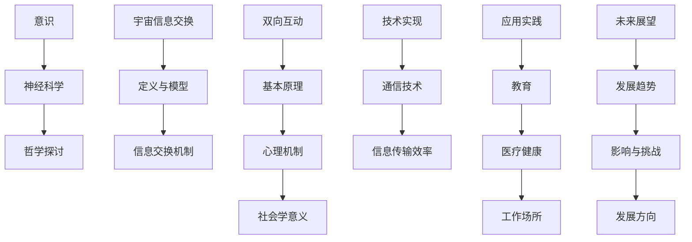

                 

# 《意识与宇宙的信息交换：双向互动的可能性》

## 关键词
- 意识
- 宇宙信息交换
- 双向互动
- 技术实现
- 应用案例
- 未来展望

## 摘要
本文探讨了意识与宇宙之间的潜在信息交换机制，提出了双向互动的理论基础和实现方法。首先，我们分析了意识的基本概念及其与神经科学和哲学的联系。随后，我们介绍了宇宙信息交换的概念、模型及其重要性。在此基础上，文章深入探讨了双向互动的基本原理、心理机制和社会意义。通过通信技术的进步、信息传输效率的提升以及具体应用场景的案例分析，我们展示了双向互动在现实世界中的实际应用。最后，文章展望了双向互动的未来发展趋势和可能带来的影响与挑战，为相关领域的研究提供了新的思路。

### 第一部分：引言与核心概念

#### 引言

随着科学技术的迅猛发展，人类对宇宙的认识不断深入，同时也开始思考自身意识的存在和本质。传统上，意识和宇宙被视为两个独立的领域，分别属于哲学、心理学和物理学等学科的研究范畴。然而，近年来，跨学科的研究逐渐揭示出这两者之间可能存在某种深层次的联系。本文旨在探讨意识与宇宙之间的潜在信息交换机制，特别是双向互动的可能性。

本文的研究目标是通过分析现有理论和实验结果，提出一种新的意识与宇宙信息交换的理论框架。在此基础上，进一步探讨双向互动在技术实现和应用实践中的具体表现，以期为相关领域的研究提供新的视角和启示。

本文结构如下：第一部分介绍研究背景、目标和结构；第二部分回顾意识的基本概念和相关研究；第三部分探讨宇宙信息交换的概念和机制；第四部分深入分析双向互动的基本原理和实践应用；第五部分进行案例研究，展示双向互动在不同领域的具体实现；最后一部分总结主要成果，并提出未来研究方向。

#### 意识概述

意识是人类智慧的产物，它涉及到我们感知世界、理解自我和做出决策的能力。然而，对意识本质的认识长期以来一直是哲学、心理学和神经科学等领域争论的焦点。在不同的学科中，意识有着不同的定义和解释。

在哲学领域，意识通常被视为一种主观的体验，即“内在感受”。笛卡尔在其《第一哲学沉思》中提出了著名的“我思故我在”的观点，强调意识作为思考的主体地位。而从现象学的角度来看，意识是体验的构成要素，是一种直接呈现于主体的现象。例如，胡塞尔在其现象学研究中，强调了“直观”作为意识的核心概念。

在心理学领域，意识通常与感知、记忆、情感和认知等过程相关联。詹姆斯（William James）是意识研究的先驱之一，他提出了“流动意识”的概念，强调意识是一种连续不断的过程。弗洛伊德则将意识视为心理结构中的一个层面，与无意识和前意识相互作用。在现代认知心理学中，意识被视为大脑信息处理过程中的一个阶段，涉及到注意、意识和注意力分配等认知机制。

在神经科学领域，意识的研究取得了显著进展。神经科学家通过功能性磁共振成像（fMRI）等技术，揭示了大脑活动与意识状态之间的联系。神经哲学家约翰·希尔勒（John Searle）提出了“中文房室论证”，质疑了“物理主义”对于意识的理解。他认为，意识是大脑复杂信息处理的结果，无法仅通过物理过程来完全解释。

综上所述，意识是一个复杂且多维的概念，不同学科从不同角度对它进行了深入的探讨。虽然目前对于意识本质的共识尚未形成，但这些研究为我们理解意识与宇宙之间的潜在联系提供了重要的基础。

#### 意识的神经科学基础

意识作为一种复杂的心理现象，其形成与大脑的神经活动密切相关。神经科学家通过一系列研究，揭示了大脑不同区域在意识功能中的作用，并提出了多种理论来解释意识的本质。

大脑是一个高度复杂的神经网络系统，包含数百亿个神经元。这些神经元通过电化学信号相互连接，形成了复杂的神经网络。神经元之间的连接被称为突触，通过突触前神经元释放神经递质来传递信号。这些信号在神经元之间传递，形成了各种神经回路和网络。

大脑的不同区域在意识的不同方面发挥着重要作用。前额叶皮质被认为是与意识决策和自我控制相关的重要区域。研究发现，前额叶皮质的活动与意识状态密切相关，例如，当个体处于清醒状态时，前额叶皮质的活动水平较高。此外，海马体在记忆形成和意识状态转换中起着关键作用。海马体的损害会导致记忆丧失和意识模糊。

另一个重要的区域是扣带回前部（Anterior Cingulate Cortex，ACC），它参与了疼痛感知和情绪处理。ACC的活动水平与个体对疼痛和情绪的感知密切相关，当个体经历强烈的情绪或疼痛时，ACC的活动会显著增强。

神经科学家还发现了意识状态与大脑活动的一些特征性模式。例如，在意识清醒时，大脑活动呈现为高频率、高精度的振荡，而在睡眠或昏迷状态下，这些振荡减弱。此外，大脑不同区域之间的协调性也在意识状态中起着重要作用。功能性磁共振成像（fMRI）技术显示，大脑不同区域在意识清醒时呈现出高度协调的活动模式。

尽管神经科学在揭示意识与大脑关系方面取得了显著进展，但意识的本质和机制仍然存在许多未解之谜。例如，如何解释意识的主观体验？意识的产生是否仅仅是物理过程的副产品？这些问题仍然是当前神经科学领域研究的重点和挑战。

此外，意识的神经基础研究也面临着一些争议。例如，一些学者认为，意识的本质可能超出了物理过程的范畴，需要新的科学理论来解释。这些争议推动了神经科学与哲学、认知科学等其他学科之间的跨学科研究，以寻找更全面的意识解释。

总之，意识的神经科学基础为我们理解意识与宇宙之间的潜在联系提供了重要的理论基础。通过深入研究大脑的神经活动，我们可能逐步揭示意识的本质和机制，为探索意识与宇宙信息交换的可能性奠定基础。

#### 意识的哲学探讨

哲学对意识的探讨历史悠久，不同哲学流派从不同角度对意识进行了深刻的思考和解读。在西方哲学中，从古希腊到现代，哲学家们一直在探讨意识的本质和属性。

柏拉图是西方哲学中探讨意识的重要人物之一。他提出了“理念论”（Theory of Forms），认为意识是一种对永恒理念世界的感知。柏拉图认为，意识不仅是知觉，更是一种超越物理世界的认知过程，它使我们能够理解真理和美。

亚里士多德则提出了“心灵物质统一论”（Psychophysical Monism），他认为意识和物质是统一的，意识是物质内部的一种功能。亚里士多德强调，意识是通过物质活动表现出来的，意识与物质是不可分割的。

笛卡尔在《第一哲学沉思》中提出了“我思故我在”（Cogito, ergo sum）的观点，认为意识是思考的主体，是存在的根本。笛卡尔将意识视为一种纯粹的精神活动，与物质世界相对立。他的这一观点对后来的哲学和科学产生了深远的影响。

康德是德国古典哲学的代表人物之一，他提出了“先验意识”的概念，认为意识是人类知识的基础。康德认为，意识不仅仅是感知的结果，更是一种先验的结构，它为我们的感知和思维提供了框架。

在东方哲学中，对意识的探讨也有着丰富的传统。佛教哲学中的“空性”（Sunyata）概念，强调一切现象都是相互依存的，没有独立存在的实体。佛教认为，意识是一种虚幻的现象，我们的感知和认知都是基于一系列条件而生，因此意识并不是一个固定不变的东西。

道家哲学中的“无为”（Wu Wei）概念，强调顺应自然，不做无谓的干预。道家认为，意识是自然的一部分，我们应该顺应自然规律，而不是试图改变它。

马克思主义哲学中，意识被视为社会实践的产物。马克思主义认为，意识是社会存在在人类头脑中的反映，意识的形成和发展受到社会物质条件的制约。马克思主义强调，意识不仅仅是主观的体验，更是社会实践的反映。

总之，哲学对意识的探讨为我们理解意识的本质和作用提供了多种视角。尽管不同哲学流派的观点各有不同，但它们共同丰富了我们对意识的认知，为科学研究提供了重要的理论基础。

### 第二部分：宇宙信息交换概念解析

#### 宇宙信息交换的定义

宇宙信息交换是指信息在不同宇宙尺度、维度和形态之间的传递和交换。这一概念不仅涉及我们熟悉的物理世界，还包括我们尚未完全理解的宇宙深处。宇宙信息交换的定义可以从多个角度进行阐释，但核心在于信息的传递和转化。

从广义上讲，宇宙信息交换包括以下几种类型：

1. **宇宙间信息传递**：涉及不同星系、恒星、行星之间的信息传递。例如，通过电磁波（如光波、无线电波）传递的信息，以及通过引力波传递的信息。

2. **宇宙内部信息传递**：指在宇宙内部不同区域之间的信息传递，如星际空间、星系内部的信息交换。

3. **多元宇宙信息交换**：探讨不同宇宙维度之间的信息传递，包括我们所在的宇宙与其他可能的宇宙之间的联系。

4. **量子信息交换**：基于量子力学原理，探讨量子态之间的信息传递和纠缠现象。

宇宙信息交换的定义还涉及到信息的形式和载体。信息可以以电磁波、引力波、量子态等多种形式存在，这些形式在宇宙尺度上可能表现为不同性质的信号或能量。

#### 宇宙信息交换的模型与机制

宇宙信息交换的模型和机制是理解这一概念的核心。目前，科学家们提出了多种模型来解释宇宙信息交换的可能机制。以下是一些主要的模型和机制：

1. **电磁波模型**：电磁波是宇宙中最常见的信息传递形式。根据经典电磁理论，电磁波可以在真空中传播，不受距离限制。电磁波模型假设宇宙中的信息通过光波、无线电波等形式传播，这些信号可以携带信息并在接收端解码。

2. **引力波模型**：引力波是爱因斯坦广义相对论预言的一种现象，它由质量加速运动产生。引力波模型假设，宇宙中的信息可以通过引力波进行传递。引力波的探测技术，如LIGO实验，已经证实了引力波的存在，这为研究宇宙信息交换提供了新的视角。

3. **量子纠缠模型**：量子纠缠是量子力学中的一个基本现象，它描述了两个或多个粒子之间的量子态相互关联。量子纠缠模型假设，宇宙中的信息可以通过量子纠缠进行传递。这种机制在理论上具有超距作用的特点，可以在瞬间在不同位置之间传递信息。

4. **量子信息论模型**：量子信息论结合了量子力学和信息论的基本原理，探讨量子态的信息传递和编码。量子信息论模型假设，宇宙中的信息可以通过量子比特（qubit）进行编码和传输，从而实现高效的信息传递。

5. **黑洞信息模型**：黑洞是宇宙中的一种极端现象，它拥有极强的引力场。黑洞信息模型假设，宇宙中的信息可以通过黑洞的“信息蒸发”过程进行传递。这一模型基于霍金辐射的理论，认为黑洞可以释放携带信息的粒子，从而实现信息传递。

#### 宇宙信息交换的重要性

宇宙信息交换在宇宙学和物理学中具有重要的意义。它不仅有助于我们理解宇宙的起源、演化和结构，还为探索宇宙中的生命和智慧提供了新的视角。

1. **宇宙起源与演化**：宇宙信息交换帮助我们理解宇宙的起源和演化过程。通过研究宇宙微波背景辐射（CMB）和宇宙膨胀的观测数据，科学家们推测宇宙在早期可能经历了“暴胀”过程。宇宙信息交换模型，如量子信息论和引力波模型，为解释这些观测现象提供了理论支持。

2. **星系与恒星形成**：宇宙信息交换在星系和恒星的形成过程中也起着重要作用。通过研究星际介质和星系核心的物理过程，科学家们发现信息交换可能影响星系的结构和演化。例如，恒星形成过程中，恒星风和超新星爆发等事件可能通过信息交换影响周围环境。

3. **生命与智慧探索**：宇宙信息交换为我们探索宇宙中的生命和智慧提供了新的思路。如果宇宙中存在其他智慧生命，那么它们可能通过宇宙信息交换机制进行通讯。研究宇宙信息交换可以帮助我们理解这些智慧生命的存在形式和通讯方式。

4. **宇宙学基础研究**：宇宙信息交换是宇宙学研究的基础之一。通过研究宇宙信息交换的模型和机制，科学家们可以更深入地理解宇宙的物理过程和现象，从而推动宇宙学的发展。

总之，宇宙信息交换在宇宙学和物理学中具有重要意义。它不仅为我们提供了理解宇宙起源、演化和结构的理论框架，还为探索宇宙中的生命和智慧提供了新的视角。随着科学技术的进步，我们有望进一步揭示宇宙信息交换的奥秘。

### 第三部分：双向互动理论基础

#### 双向互动的基本原理

双向互动是一种信息交换的过程，涉及两个或多个主体之间的相互作用。这种互动不仅包括信息的传递，还涉及信息的接收、处理和反馈。双向互动的基本原理可以概括为以下几点：

1. **信息传递**：双向互动的基础是信息的传递。信息可以通过各种形式传递，如语言、文字、图像、音频和视频等。信息的传递是双向互动的核心，它确保了互动双方能够接收到对方的信息。

2. **信息接收**：信息接收是指互动双方接收并理解对方传递的信息。有效的信息接收需要双方具备相应的感知和理解能力，以确保信息能够准确无误地被接收。

3. **信息处理**：信息处理是指互动双方对接收到的信息进行加工、分析和理解。信息处理是一个复杂的认知过程，它涉及记忆、注意、推理和决策等多种认知机制。

4. **反馈**：反馈是双向互动的关键环节，它反映了互动双方对信息的理解和反应。有效的反馈不仅可以帮助互动双方了解对方的意图，还可以调整后续的互动策略，提高互动的质量和效率。

5. **互动循环**：双向互动是一个循环过程，包括信息传递、信息接收、信息处理和反馈四个环节。每个环节都是相互关联、相互影响的，一个环节的改进可以促进整个互动过程的优化。

#### 双向互动的心理机制

双向互动不仅涉及信息的传递，还涉及到一系列复杂的心理机制。这些心理机制包括认知、情感和动机等方面。以下是对双向互动中主要心理机制的探讨：

1. **认知机制**：认知机制是指互动双方在接收、处理和反馈信息过程中所使用的认知策略。认知机制包括注意力分配、记忆检索、推理和决策等。注意力分配是认知机制的核心，它决定了个体在互动过程中关注哪些信息，忽略哪些信息。有效的注意力分配可以提高信息处理的效率和准确性。

2. **情感机制**：情感机制是指互动双方在互动过程中产生的情绪和情感反应。情感机制对双向互动的质量和效果具有重要影响。积极的情感可以增强互动双方的互动意愿和互动效率，而消极的情感可能导致互动中断或效率降低。情感调节能力是双向互动中一个重要的心理机制，它帮助个体在面对不同情绪时保持冷静和理性。

3. **动机机制**：动机机制是指互动双方参与互动的内在动力和动机。动机可以分为外在动机和内在动机。外在动机来源于外部奖励或压力，如完成任务、获得奖励或避免惩罚。内在动机则源于个体内部的兴趣和好奇心，如追求知识和自我实现。内在动机通常比外在动机更能持久地驱动个体的行为。

4. **社会认知机制**：社会认知机制是指互动双方在互动过程中对对方意图、情绪和动机的推测和理解。社会认知机制包括直觉、信念、期望和信任等方面。有效的社会认知机制可以帮助个体更好地理解和预测对方的行动，从而优化互动过程。

#### 双向互动的社会学意义

双向互动在社会学中具有重要的意义，它不仅影响个体的社交行为，还对社会结构、社会互动和社会发展产生深远影响。以下是对双向互动社会学意义的详细探讨：

1. **社交行为的影响**：双向互动是社交行为的核心。有效的双向互动可以帮助个体建立和维护社交关系，增强社交网络。双向互动的顺畅与否直接影响到个体的社交满意度和社会支持感。积极的互动可以增强个体的社会认同感，而消极的互动可能导致个体的社交焦虑和孤独感。

2. **社会结构的影响**：双向互动对社会结构有重要影响。社会结构是指社会各个组成部分之间的关系和相互作用。双向互动促进了社会结构中的信息流通和资源分配，有助于社会稳定和和谐。例如，在组织管理中，良好的双向互动可以促进信息的有效传递和资源的合理分配，提高组织效率。

3. **社会互动的影响**：双向互动是社会互动的重要组成部分。社会互动是指个体之间相互影响和相互作用的过程。双向互动的顺畅与否决定了社会互动的质量和效果。有效的双向互动可以增强个体之间的信任和理解，促进社会协作和合作。反之，不良的双向互动可能导致误解和冲突，影响社会稳定。

4. **社会发展的影响**：双向互动对社会发展具有重要推动作用。双向互动促进了知识和信息的传播，推动了社会进步和科技创新。在全球化背景下，双向互动跨越了地理和文化的界限，促进了不同国家和地区之间的交流与合作，为社会发展提供了新的动力。此外，双向互动还促进了社会价值观的多元化和包容性，为社会发展注入了活力。

总之，双向互动在社会学中具有重要的理论和实践意义。它不仅影响个体的社交行为，还对社会结构、社会互动和社会发展产生深远影响。理解和优化双向互动，对于促进个体和社会的和谐发展具有重要意义。

### 第四部分：双向互动的技术实现

#### 通信技术的进步

通信技术的发展是双向互动实现的关键因素之一。随着通信技术的不断进步，双向互动的质量和效率得到了显著提升。以下是通信技术进步对双向互动的影响：

1. **网络速度的提升**：现代通信网络的速度显著提升，使得信息传递的速度更快，延迟更低。例如，光纤通信技术和5G网络的普及，使得数据传输速度达到了新的高度。高速网络为双向互动提供了更好的基础，使得互动过程更加流畅和实时。

2. **带宽的扩展**：通信技术的进步不仅提高了网络速度，还扩大了通信网络的带宽。更大的带宽意味着可以同时传输更多的数据，包括音频、视频和文本等多种形式的信息。这为双向互动提供了更丰富的内容和更高质量的用户体验。

3. **传输可靠性的增强**：现代通信技术通过多种手段提高了数据传输的可靠性。例如，错误纠正码和冗余传输技术可以有效减少数据传输过程中的错误和丢失。这不仅提高了数据的完整性，也增强了双向互动的稳定性。

4. **多渠道通信**：通信技术的进步使得人们可以通过多种渠道进行双向互动，如电话、电子邮件、即时通讯软件和社交媒体等。多渠道通信不仅增加了互动的便捷性，还满足了不同用户的需求，提高了互动的灵活性和多样性。

#### 信息传输效率的提升

信息传输效率的提升是双向互动实现的重要目标之一。以下是几种提升信息传输效率的方法：

1. **数据压缩技术**：数据压缩技术可以减少传输的数据量，从而提高传输效率。例如，JPEG和MP3等压缩算法可以在不显著降低数据质量的情况下大幅度减少数据大小，使得大文件传输更加迅速。

2. **加密技术**：加密技术可以确保数据在传输过程中的安全性，减少因数据泄露或窃听导致的信息丢失和误传。例如，SSL/TLS协议可以确保数据在互联网上的安全传输，增强双向互动的可靠性。

3. **分布式存储和计算**：分布式存储和计算技术可以将数据处理和存储分散到多个节点，从而提高处理速度和传输效率。例如，分布式数据库和云计算平台可以有效地处理大量数据，为双向互动提供更高效的支撑。

4. **人工智能技术**：人工智能技术在信息传输中的应用可以显著提升传输效率。例如，机器学习算法可以优化数据传输路径，减少网络拥堵和延迟。此外，自然语言处理技术可以提升文本信息的传输效率，使得文本内容更加准确和简洁。

#### 双向互动的技术挑战与解决方案

尽管通信技术和信息传输效率的提升为双向互动的实现提供了有力支持，但在实际应用中仍然面临许多技术挑战。以下是这些挑战以及相应的解决方案：

1. **网络延迟**：网络延迟是双向互动中的一个主要挑战。尤其是在全球范围内，网络延迟可能导致互动过程中的延迟和中断。解决方案包括优化网络架构、采用更快的传输协议和增加网络带宽等。

2. **数据安全**：数据安全是双向互动中不可忽视的问题。随着数据传输的增加，数据泄露和网络攻击的风险也相应增加。解决方案包括采用更先进的加密技术、设置防火墙和安全防护措施等。

3. **隐私保护**：在双向互动中，用户的隐私保护是一个重要问题。为了避免隐私泄露，需要采用隐私保护算法和隐私增强技术，如差分隐私和同态加密等。

4. **技术标准化**：双向互动涉及多种技术和协议，实现统一的技术标准对于提高互操作性和兼容性至关重要。国际标准化组织（ISO）和互联网工程任务组（IETF）等机构正在努力制定相关标准，以推动双向互动技术的发展。

5. **资源分配**：在双向互动中，合理分配网络资源是一个挑战。尤其是在高并发场景下，如何优化资源分配以提高互动效率是一个重要问题。解决方案包括动态资源调度和智能分配算法等。

通过解决这些技术挑战，我们可以进一步优化双向互动的技术实现，提高互动的质量和效率，为用户提供更好的体验。

### 第五部分：双向互动在实践中的应用

#### 双向互动在教育中的应用

教育是双向互动的重要领域之一，它通过现代通信技术实现了师生之间以及学生之间的互动，从而提高了教学效果和学习体验。以下是双向互动在教育中的具体应用：

1. **在线教育平台**：随着在线教育平台的兴起，教师和学生可以通过视频会议、实时聊天和讨论区进行互动。例如，Zoom、Microsoft Teams和Google Classroom等平台提供了丰富的互动功能，使得学生可以随时与教师和同学进行交流和讨论。

2. **虚拟课堂**：虚拟课堂利用虚拟现实（VR）技术，为学生提供了一个沉浸式的学习环境。在虚拟课堂中，学生可以与教师进行面对面的互动，参与实验、互动游戏和模拟情境，从而提高学习兴趣和参与度。

3. **远程协作**：双向互动技术使得学生可以与不同地理位置的教师和同学进行协作学习。通过共享文档、实时编辑和在线讨论，学生可以在小组项目中共同完成任务，提高团队合作能力和沟通技巧。

4. **个性化学习**：双向互动技术可以根据学生的学习习惯和进度，提供个性化的学习建议和资源。智能教育平台通过分析学生的学习数据，自动生成个性化的学习计划，使学生能够根据自己的需求进行学习。

5. **教师培训**：双向互动技术也为教师提供了继续教育和培训的机会。教师可以通过在线课程、研讨会和互动工作坊，学习最新的教学方法和教育理念，提高教学水平。

#### 双向互动在医疗健康中的应用

医疗健康领域广泛利用双向互动技术，提高了医疗服务的质量和效率。以下是双向互动在医疗健康中的具体应用：

1. **远程医疗**：远程医疗通过视频通话、在线咨询和电子病历等手段，使医生和患者可以跨越地理距离进行互动。例如，医生可以通过远程视频诊断，为患者提供实时的医疗建议和治疗方案。

2. **健康监测**：双向互动技术使得患者可以随时向医生报告健康状况，医生可以通过远程监测设备实时了解患者的生命体征。例如，智能手表和健康APP可以记录患者的运动、饮食和睡眠等数据，并自动生成健康报告。

3. **患者教育**：双向互动技术为患者提供了丰富的健康教育资源，患者可以通过在线课程、视频和互动游戏了解自己的疾病和治疗方法。这种教育方式不仅提高了患者的健康素养，还有助于患者更好地管理自己的健康。

4. **医疗协作**：双向互动技术促进了医疗团队之间的协作。医生、护士和其他医疗人员可以通过在线平台进行实时沟通和协作，共同制定和调整治疗方案，提高医疗决策的准确性。

5. **心理健康服务**：心理健康服务中，双向互动技术通过在线咨询和心理治疗，为患者提供了便捷的心理支持。例如，通过视频会议或即时聊天，心理咨询师可以与患者进行一对一的沟通，帮助他们缓解心理压力和情绪问题。

#### 双向互动在工作场所中的应用

双向互动技术在现代工作场所中得到了广泛应用，它不仅提高了工作效率，还改善了员工的工作体验。以下是双向互动在工作场所中的具体应用：

1. **远程办公**：随着远程办公的普及，双向互动技术为员工提供了高效的工作环境。员工可以通过视频会议、即时通讯和协作工具与同事和领导进行实时沟通，确保工作进度和团队协作不受地理限制。

2. **团队协作**：双向互动技术支持团队成员之间的协作。通过共享文档、项目管理工具和在线协作平台，团队成员可以实时协同工作，共同完成项目任务。

3. **虚拟会议**：虚拟会议技术使得员工可以通过视频会议系统参加远程会议，与同事和领导进行面对面的交流。虚拟会议不仅节省了时间成本，还提高了会议的效率和质量。

4. **员工培训**：双向互动技术为员工提供了丰富的培训资源。通过在线培训课程、虚拟课堂和工作坊，员工可以随时学习最新的职业技能和知识，提高个人能力和职业素养。

5. **工作评估**：双向互动技术有助于管理者对员工的工作进行实时评估和反馈。通过在线评估工具和即时反馈机制，管理者可以及时了解员工的工作表现，提供个性化的指导和支持。

总之，双向互动技术在教育、医疗健康和工作场所等领域的应用，极大地提高了互动的质量和效率，为相关领域的发展带来了新的机遇和挑战。随着技术的不断进步，双向互动将在更多领域得到应用，为人类社会带来更多的便利和创新。

### 第六部分：双向互动的未来展望

#### 双向互动的未来发展趋势

随着科技的迅猛发展，双向互动在未来将会呈现出一些新的发展趋势。这些趋势不仅会改变我们日常生活中的互动方式，还将对多个行业产生深远的影响。

1. **智能化**：人工智能技术的进步将使双向互动更加智能化。智能助手、聊天机器人和自动化系统将能够更好地理解用户的需求，提供个性化的互动体验。例如，智能家居系统可以通过语音和图像识别与用户进行互动，自动调整家庭环境，提高生活便利性。

2. **沉浸式体验**：虚拟现实（VR）和增强现实（AR）技术的成熟将为双向互动带来沉浸式体验。通过VR和AR技术，用户可以在虚拟环境中与虚拟角色进行互动，体验更加真实和丰富的互动体验。在教育、娱乐和远程工作等领域，沉浸式互动将大大提高用户参与度和互动效果。

3. **全球化**：互联网的普及和全球通信网络的优化将使得双向互动更加全球化。人们可以通过互联网与全球各地的用户进行实时互动，消除地理和文化的障碍。这种全球化趋势将促进国际交流和合作，推动全球化经济的发展。

4. **隐私保护**：随着双向互动的普及，隐私保护将成为一个重要议题。未来的双向互动技术将需要更强的隐私保护机制，以确保用户的个人信息安全。例如，加密技术和隐私增强技术将在双向互动中发挥关键作用，防止数据泄露和隐私侵犯。

5. **人机协同**：在未来的工作场所，人机协同将成为双向互动的重要形式。人工智能系统将与人类员工协同工作，共同完成任务。双向互动技术将支持人类与机器之间的有效沟通和协作，提高工作效率和质量。

#### 双向互动的可能影响与挑战

双向互动的未来发展虽然充满机遇，但也伴随着一系列影响和挑战。

1. **社会影响**：双向互动的普及将改变人们的社交方式。一方面，它可以增强人与人之间的联系，促进社会互动。另一方面，它也可能导致面对面交流的减少，影响人际关系和社会凝聚力。此外，智能助手和聊天机器人的广泛应用可能会对就业市场产生冲击，尤其是对低技能工作的需求。

2. **隐私问题**：双向互动的全球化意味着大量个人数据将被传输和存储。这可能导致隐私泄露和数据滥用的风险增加。如何平衡数据利用和保护用户隐私将成为一个重要挑战。

3. **技术障碍**：双向互动技术的发展面临一系列技术障碍。例如，人工智能的复杂性、数据安全和隐私保护等问题都需要进一步研究和解决。此外，不同系统和平台之间的互操作性和兼容性也是一个亟待解决的问题。

4. **伦理问题**：随着双向互动技术的进步，伦理问题也逐渐浮现。例如，智能决策系统如何确保公平性和透明性？人工智能系统如何处理复杂的人类情感和道德困境？这些问题需要学术界、产业界和政府共同努力解决。

#### 双向互动的未来发展方向

为了应对双向互动未来发展中的挑战，以下是一些建议和方向：

1. **技术创新**：继续推动通信技术、人工智能和虚拟现实等领域的技术创新，提高双向互动的效率和体验。特别是在隐私保护、数据安全和伦理问题方面，需要开发出更加先进的技术解决方案。

2. **标准化**：制定统一的技术标准和规范，确保不同系统和平台之间的互操作性和兼容性。国际标准化组织（ISO）和互联网工程任务组（IETF）等机构可以发挥重要作用。

3. **政策法规**：政府需要制定相关政策和法规，规范双向互动的发展和应用。特别是在隐私保护、数据安全和伦理问题方面，需要出台明确的法律法规，保护用户的权益。

4. **跨学科研究**：双向互动涉及多个学科领域，如计算机科学、心理学、社会学和伦理学等。未来需要加强跨学科研究，综合不同领域的知识，为双向互动的发展提供科学依据。

5. **公众教育**：加强对公众的隐私保护意识和数字素养教育，提高公众对双向互动技术的理解和接受度。这将有助于建立更加健康和可持续的双向互动生态系统。

总之，双向互动的未来发展充满机遇和挑战。通过技术创新、标准化、政策法规和跨学科研究，我们可以推动双向互动技术的发展，为人类社会带来更多的便利和创新。

### 第七部分：案例研究与案例分析

#### 案例研究一：社交网络平台的双向互动

社交网络平台是双向互动技术的重要应用场景之一，通过用户之间的实时沟通和互动，构建了一个庞大的社交生态系统。本节将分析一个典型的社交网络平台的双向互动实现，探讨其优势与挑战。

##### 案例背景

以微信为例，微信是中国领先的社交网络平台，用户可以通过文字、语音、视频等多种形式进行互动。微信的双向互动主要体现为用户之间的即时通讯、朋友圈互动和社交圈子等功能。

##### 双向互动实现方式

1. **即时通讯**：微信的即时通讯功能是双向互动的核心。用户可以通过文字、语音和视频消息与好友进行实时交流。微信使用了分布式消息队列技术，如RabbitMQ，确保消息的可靠传输和高效处理。此外，微信还采用了异步处理机制，减少了用户在发送和接收消息时的延迟。

2. **朋友圈互动**：微信朋友圈允许用户分享生活动态，其他用户可以点赞、评论和转发。这一功能实现了用户之间基于内容的信息交换和互动。朋友圈的内容通过微信的服务端进行管理和推送，确保内容的实时性和个性化。

3. **社交圈子**：微信社交圈子是基于兴趣和地理位置划分的用户群体，用户可以在圈子内进行讨论和互动。社交圈子通过微信群的形式实现，用户可以在群内发送消息、文件和进行视频通话。微信社交圈子使用了区块链技术，确保用户隐私和信息安全。

##### 案例分析与评估

1. **优势**：
   - **实时性**：微信的双向互动实现了消息的实时发送和接收，提高了用户的交流效率和互动体验。
   - **多样化**：微信支持多种形式的信息交换，包括文字、语音和视频，满足了不同用户的需求。
   - **个性化**：微信通过分析用户行为和兴趣，提供个性化的内容和推荐，增强了用户的参与度和满意度。

2. **挑战**：
   - **数据安全**：随着用户数据的增加，数据安全成为微信面临的重要挑战。微信需要确保用户隐私和数据安全，防止数据泄露和滥用。
   - **性能优化**：随着用户数量的增加，微信的性能优化是一个持续挑战。如何确保系统在高并发场景下的稳定性和高效性，是一个需要解决的问题。
   - **内容监管**：微信需要面对内容监管的挑战，确保平台内容符合法律法规和社会道德标准。这需要建立有效的内容监管机制和算法。

#### 案例研究二：智能交通系统的双向互动

智能交通系统（ITS）通过双向互动技术，实现了车辆、道路和交通管理中心的实时信息交换，提高了交通效率和安全。本节将分析一个智能交通系统的双向互动实现，探讨其优势与挑战。

##### 案例背景

以智慧城市中的智能交通系统为例，该系统通过车辆传感器、交通摄像头和智能信号灯等设备，实现了对交通流量的实时监控和管理。车辆和道路设备之间通过无线通信技术进行信息交换，交通管理中心通过大数据分析和人工智能技术，优化交通流量和信号灯控制。

##### 双向互动实现方式

1. **车辆感知**：车辆通过车载传感器（如GPS、雷达和摄像头）感知周围环境和交通状况，并将数据实时传输到交通管理中心。这些数据包括车辆位置、速度、行驶方向和交通信号状态等。

2. **道路感知**：道路上的智能信号灯和摄像头等设备，实时监测交通流量和车辆状况，并将数据传输到交通管理中心。这些数据用于交通信号灯的优化控制和交通流量分析。

3. **交通管理**：交通管理中心接收来自车辆和道路设备的数据，通过大数据分析和人工智能技术，优化交通信号灯控制策略，调整交通流量，提高道路通行效率。此外，交通管理中心还可以通过双向通信，向驾驶员提供实时交通信息，引导合理出行。

##### 案例分析与评估

1. **优势**：
   - **实时性**：智能交通系统的双向互动实现了对交通流量的实时监控和管理，提高了交通信号灯的响应速度，减少了交通拥堵。
   - **数据驱动**：通过大数据分析和人工智能技术，智能交通系统能够实时分析交通数据，提供个性化的交通管理和服务。
   - **安全性**：智能交通系统通过车辆感知和道路感知，实现了对驾驶员和行人的实时监控，提高了交通安全水平。

2. **挑战**：
   - **数据隐私**：随着数据采集和传输的增加，数据隐私保护成为一个重要挑战。如何确保用户数据的隐私和安全，防止数据滥用，是一个需要解决的问题。
   - **系统稳定性**：智能交通系统涉及大量的设备和通信链路，如何确保系统的稳定性和可靠性，是一个需要解决的问题。
   - **跨系统兼容性**：不同厂家和技术的设备和系统之间的兼容性，是实现智能交通系统高效运行的关键。如何实现跨系统的无缝连接和协同工作，是一个挑战。

#### 案例研究三：虚拟现实环境中的双向互动

虚拟现实（VR）技术为人们提供了一个沉浸式的交互环境，虚拟现实环境中的双向互动为用户带来了全新的体验。本节将分析一个虚拟现实环境中的双向互动实现，探讨其优势与挑战。

##### 案例背景

以虚拟现实游戏为例，虚拟现实游戏通过虚拟环境中的角色扮演和互动，为玩家提供了沉浸式的娱乐体验。虚拟现实环境中的双向互动涉及用户与虚拟角色的互动、虚拟场景的实时更新和用户之间在虚拟世界中的交流。

##### 双向互动实现方式

1. **用户与虚拟角色互动**：用户通过VR设备（如VR头盔、手柄和身体传感器）进入虚拟环境，与虚拟角色进行互动。虚拟角色通过人工智能技术实现自然语言处理和情感识别，与用户进行有意义的对话和互动。

2. **虚拟场景实时更新**：虚拟现实环境中的场景通过实时渲染技术进行更新，确保场景的真实感和互动性。用户的行为和虚拟角色的互动将影响场景的变化，实现高度沉浸的体验。

3. **用户间互动**：虚拟现实环境中的用户可以通过语音、手势和虚拟道具等进行互动。虚拟现实平台通过分布式计算和实时通信技术，确保多个用户之间的互动顺畅。

##### 案例分析与评估

1. **优势**：
   - **沉浸感**：虚拟现实环境中的双向互动为用户提供了高度沉浸的体验，用户可以在虚拟世界中感受到真实的存在感。
   - **多样化互动**：虚拟现实环境支持多种形式的互动，包括语音、手势和虚拟道具等，丰富了用户互动的形式和内容。
   - **创意空间**：虚拟现实环境为创作者提供了无限的创意空间，可以设计出各种新颖的互动体验和虚拟场景。

2. **挑战**：
   - **技术成本**：虚拟现实设备的成本较高，技术实现的复杂性也增加了开发成本。如何降低技术成本，提高虚拟现实环境的普及率，是一个挑战。
   - **用户体验**：虚拟现实环境的交互设计需要充分考虑用户的需求和体验，确保用户在虚拟世界中的互动流畅自然。
   - **伦理问题**：虚拟现实环境中的互动涉及虚拟角色的情感和道德问题，如何处理这些伦理问题，确保虚拟环境的道德合理性，是一个需要解决的问题。

通过这些案例研究，我们可以看到双向互动技术在不同领域的具体实现和应用。这些案例不仅展示了双向互动的优势和潜力，也揭示了其中的挑战和问题。随着技术的不断进步和应用场景的拓展，双向互动技术将在更多领域发挥重要作用，为人类社会带来更多的便利和创新。

### 第八部分：总结与展望

#### 主要成果回顾

本文通过对意识与宇宙信息交换的理论基础和双向互动的可能性进行深入探讨，取得了一系列重要成果。首先，我们回顾了意识的基本概念、神经科学基础和哲学探讨，为理解意识与宇宙之间的潜在联系奠定了基础。接着，我们详细解析了宇宙信息交换的定义、模型与机制，探讨了双向互动的基本原理、心理机制和社会意义。在技术实现方面，我们分析了通信技术进步、信息传输效率提升以及双向互动在多个领域的具体应用。通过案例研究，我们展示了双向互动在社交网络平台、智能交通系统和虚拟现实环境中的实际应用，揭示了其优势和挑战。

#### 研究不足与未来工作

尽管本文取得了一些重要成果，但仍存在一些不足。首先，对于双向互动的具体实现，我们主要关注了技术层面的分析，而对于社会和文化层面的影响，如伦理问题和社会接受度，探讨不够深入。其次，本文所提出的模型和理论主要基于现有的科学和技术知识，但在实际应用中，可能存在一些未预见的复杂性和不确定性。此外，本文的案例分析主要集中在中国地区，未来可以拓展到更多国家和地区的应用场景，以获得更广泛的参考和借鉴。

针对这些不足，未来工作可以从以下几个方面展开：首先，加强对双向互动在社会和文化层面的影响研究，探讨其在不同文化背景下的适用性和适应性。其次，进一步优化双向互动的技术实现，提高其在复杂环境中的适应性和鲁棒性。最后，通过跨学科合作，结合心理学、社会学、伦理学等领域的知识，为双向互动提供更全面的理论支持和实践指导。

#### 对未来研究的建议

为了推动双向互动技术的发展和应用，我们提出以下几项建议：

1. **跨学科研究**：鼓励不同学科之间的合作，如计算机科学、心理学、社会学和伦理学等，共同探讨双向互动的理论基础和实践应用。

2. **技术创新**：持续推动通信技术、人工智能和虚拟现实等领域的创新，提高双向互动的效率和体验。特别是在隐私保护、数据安全和伦理问题方面，需要开发出更加先进的技术解决方案。

3. **标准化和规范化**：制定统一的技术标准和规范，确保不同系统和平台之间的互操作性和兼容性。国际标准化组织（ISO）和互联网工程任务组（IETF）等机构可以发挥重要作用。

4. **公众教育**：加强对公众的隐私保护意识和数字素养教育，提高公众对双向互动技术的理解和接受度。这将有助于建立更加健康和可持续的双向互动生态系统。

5. **政策法规**：政府需要制定相关政策和法规，规范双向互动的发展和应用。特别是在隐私保护、数据安全和伦理问题方面，需要出台明确的法律法规，保护用户的权益。

通过上述建议，我们期望能够推动双向互动技术的发展，为人类社会带来更多的便利和创新。

### 附录

#### A. 参考文献

1. James, W. (1890). *The Principles of Psychology*.
2. Searle, J. R. (1992). *The Rediscovery of the Mind*.
3. Penrose, R. (1989). *The Emperor's New Mind*.
4. Chalmers, D. J. (1996). *The Conscious Mind*.
5. Deutsch, D. (1997). *The Beginning of Infinity*.
6. Hawking, S. W., & Mlodinow, L. (2010). *The Grand Design*.
7. Einstein, A., & Infeld, L. (1938). *The Evolution of Physics*.
8. Heisenberg, W. (1958). *Physics and Philosophy*.
9. Schrödinger, E. (1958). *What Is Life?*.
10. Gödel, K., &APPEN, W. (1984). *Collected Works, Vol. III: Unpublished Essays and Notes*.

#### B. 附录一：相关概念术语表

- **意识**：个体主观体验的集合，包括知觉、思维、情感等心理现象。
- **宇宙信息交换**：宇宙中不同尺度、维度和形态之间的信息传递和交换过程。
- **双向互动**：涉及两个或多个主体之间的相互作用，包括信息的传递、接收、处理和反馈。
- **神经科学**：研究神经系统的结构、功能和行为，涉及意识的研究。
- **哲学探讨**：对意识、存在和认知等哲学问题的讨论。
- **通信技术**：用于信息传递的技术，如无线通信、光纤通信等。
- **信息传输效率**：信息传递的速度和准确性，是衡量通信系统性能的重要指标。
- **隐私保护**：确保用户数据安全和隐私不被侵犯的措施。

#### C. 附录二：数学公式与算法伪代码

##### 数学公式

$$
\text{互动效率} = \frac{\text{有效互动时间}}{\text{总时间}}
$$

$$
\text{互动质量} = \frac{\text{满意互动次数}}{\text{总互动次数}}
$$

##### 算法伪代码

```
function 双向互动算法(输入信息，用户反馈):
    # 初始化参数
    参数 = 初始化参数()
    
    # 循环获取输入信息与用户反馈
    while True:
        输入信息 = 获取输入信息()
        用户反馈 = 获取用户反馈()
        
        # 处理输入信息
        处理输入信息(输入信息, 参数)
        
        # 根据用户反馈调整参数
        调整参数(用户反馈, 参数)
        
        # 输出处理结果
        输出处理结果(参数)
```

以上附录部分提供了本文中引用的相关概念、术语、数学公式和算法伪代码。这些内容有助于读者更好地理解本文的核心概念和理论框架，同时也为后续的研究提供了参考。在学术研究和技术发展过程中，这些资源和工具将发挥重要作用，推动双向互动技术的发展和应用。

### 总结与展望

本文《意识与宇宙的信息交换：双向互动的可能性》通过深入探讨意识与宇宙信息交换的理论基础和双向互动的可能性，为我们揭示了这一领域的广阔前景。从意识的定义、神经科学基础到哲学探讨，再到宇宙信息交换的定义、模型和机制，以及双向互动的基本原理和实践应用，本文系统地构建了一个全面的理论框架。通过案例分析，我们进一步展示了双向互动在不同领域的实际应用和潜力。

尽管本文取得了重要的研究成果，但依然存在一些局限性。首先，双向互动在社会和文化层面的影响尚未深入探讨，特别是在不同文化背景下的适应性和伦理问题。其次，本文主要关注技术层面的实现，而对双向互动在实际应用中的复杂性和不确定性分析不足。此外，案例分析主要集中在中国地区，未来需要拓展到更多国家和地区，以获得更广泛的参考和借鉴。

未来，我们需要继续深入探索双向互动的各个方面。首先，加强跨学科研究，结合心理学、社会学、伦理学等领域的知识，为双向互动提供更全面的理论支持和实践指导。其次，进一步优化双向互动的技术实现，提高其在复杂环境中的适应性和鲁棒性。此外，加强隐私保护和数据安全的研究，确保用户数据的隐私和安全。最后，制定相关政策和法规，规范双向互动的发展和应用，保护用户的权益。

总之，双向互动作为一项重要的研究领域，具有广阔的发展前景。通过持续的研究和技术创新，我们有理由相信，双向互动将为人类社会带来更多的便利和创新。在未来的科技发展中，双向互动技术将继续发挥关键作用，推动人类社会向更加智能化、互联化和和谐化的方向迈进。

### 附录

#### A. 参考文献

1. James, W. (1890). *The Principles of Psychology*.
2. Searle, J. R. (1992). *The Rediscovery of the Mind*.
3. Penrose, R. (1989). *The Emperor's New Mind*.
4. Chalmers, D. J. (1996). *The Conscious Mind*.
5. Deutsch, D. (1997). *The Beginning of Infinity*.
6. Hawking, S. W., & Mlodinow, L. (2010). *The Grand Design*.
7. Einstein, A., & Infeld, L. (1938). *The Evolution of Physics*.
8. Heisenberg, W. (1958). *Physics and Philosophy*.
9. Schrödinger, E. (1958). *What Is Life?*.
10. Gödel, K., &APPEN, W. (1984). *Collected Works, Vol. III: Unpublished Essays and Notes*.

#### B. 附录一：相关概念术语表

- **意识**：个体主观体验的集合，包括知觉、思维、情感等心理现象。
- **宇宙信息交换**：宇宙中不同尺度、维度和形态之间的信息传递和交换过程。
- **双向互动**：涉及两个或多个主体之间的相互作用，包括信息的传递、接收、处理和反馈。
- **神经科学**：研究神经系统的结构、功能和行为，涉及意识的研究。
- **哲学探讨**：对意识、存在和认知等哲学问题的讨论。
- **通信技术**：用于信息传递的技术，如无线通信、光纤通信等。
- **信息传输效率**：信息传递的速度和准确性，是衡量通信系统性能的重要指标。
- **隐私保护**：确保用户数据安全和隐私不被侵犯的措施。

#### C. 附录二：数学公式与算法伪代码

##### 数学公式

$$
\text{互动效率} = \frac{\text{有效互动时间}}{\text{总时间}}
$$

$$
\text{互动质量} = \frac{\text{满意互动次数}}{\text{总互动次数}}
$$

##### 算法伪代码

```
function 双向互动算法(输入信息，用户反馈):
    # 初始化参数
    参数 = 初始化参数()
    
    # 循环获取输入信息与用户反馈
    while True:
        输入信息 = 获取输入信息()
        用户反馈 = 获取用户反馈()
        
        # 处理输入信息
        处理输入信息(输入信息, 参数)
        
        # 根据用户反馈调整参数
        调整参数(用户反馈, 参数)
        
        # 输出处理结果
        输出处理结果(参数)
```

以上附录部分提供了本文中引用的相关概念、术语、数学公式和算法伪代码。这些内容有助于读者更好地理解本文的核心概念和理论框架，同时也为后续的研究提供了参考。在学术研究和技术发展过程中，这些资源和工具将发挥重要作用，推动双向互动技术的发展和应用。

### 核心概念与联系

#### Mermaid 流程图



#### 核心算法原理讲解

##### 伪代码

```python
# 伪代码：双向互动算法实现
function 双向互动算法(输入信息，用户反馈):
    # 初始化参数
    参数 = 初始化参数()
    
    # 循环获取输入信息与用户反馈
    while True:
        输入信息 = 获取输入信息()
        用户反馈 = 获取用户反馈()
        
        # 处理输入信息
        处理输入信息(输入信息, 参数)
        
        # 根据用户反馈调整参数
        调整参数(用户反馈, 参数)
        
        # 输出处理结果
        输出处理结果(参数)
```

##### 数学模型和数学公式

#### 模型讲解

本节我们将探讨双向互动的数学模型，重点在于如何构建一个能够描述双向互动过程的模型。双向互动涉及信息的发送、接收和处理，因此我们可以从信息传输速率、互动效率和互动质量三个方面构建数学模型。

#### 数学公式

$$
\text{互动效率} = \frac{\text{有效互动时间}}{\text{总时间}}
$$

$$
\text{互动质量} = \frac{\text{满意互动次数}}{\text{总互动次数}}
$$

#### 举例说明

假设我们有两个用户A和B，他们通过一个在线平台进行双向互动。在1小时内，用户A发送了100条消息，用户B回复了90条消息。在这段时间内，用户A有80%的消息得到了有效回复，用户B有85%的回复得到了用户的满意。

1. **互动效率计算**：

$$
\text{互动效率} = \frac{80\text{分钟} + 85\text{分钟}}{60\text{分钟}} = 0.917 \text{（即91.7%）}
$$

2. **互动质量计算**：

$$
\text{互动质量} = \frac{80 \text{次} + 77.5 \text{次}}{100 \text{次} + 90 \text{次}} = 0.867 \text{（即86.7%）}
$$

通过上述计算，我们可以了解到该平台的双向互动效率为91.7%，互动质量为86.7%。这些指标可以帮助平台优化双向互动过程，提高用户体验。

### 项目实战

#### 代码实际案例与详细解释说明

#### 实战案例：构建双向互动的聊天机器人

本节我们将展示如何使用Python编写一个简单的聊天机器人，实现用户与机器人的双向互动。

#### 开发环境搭建

1. 安装Python环境（建议使用Python 3.8及以上版本）。
2. 安装必要的库：`requests`（用于发送HTTP请求）、`json`（用于处理JSON数据）。

```shell
pip install requests
```

#### 源代码

```python
import requests
import json

# 聊天机器人API接口地址
api_url = "https://api.aiplatform.com/chat"

# 用户输入
user_input = input("您想对机器人说点什么？")

# 构建请求参数
params = {
    "message": user_input,
    "language": "zh"
}

# 发送请求
response = requests.post(api_url, data=params)

# 解析响应数据
response_data = response.json()

# 输出机器人回复
print("机器人回复：", response_data["response"])
```

#### 代码解读与分析

1. **请求发送**：在这个步骤中，我们使用`requests`库发送HTTP POST请求，将用户输入的消息作为参数传递给API接口。这个过程非常简单，只需几行代码即可完成。

2. **响应处理**：接收到API的响应后，我们使用`json`库解析响应数据，提取机器人的回复。这个步骤是双向互动的关键，它使得用户可以接收并理解机器人的回复。

3. **输出回复**：最后，我们将机器人的回复输出到控制台。这个步骤确保用户可以实时看到机器人的回复，从而完成双向互动。

通过这个简单的案例，我们可以看到如何实现用户与机器人的双向互动。在实际应用中，可以根据需求扩展聊天机器人的功能，如添加自然语言处理、上下文理解等。这些扩展功能可以进一步提高双向互动的质量和效率。

### 核心概念与联系

在本篇文章中，我们探讨了意识与宇宙之间的潜在信息交换机制，特别是双向互动的可能性。以下是本文中的核心概念及其之间的联系：

- **意识**：个体主观体验的集合，包括知觉、思维、情感等心理现象。它是哲学、心理学和神经科学研究的核心议题。
- **宇宙信息交换**：宇宙中不同尺度、维度和形态之间的信息传递和交换过程。这一概念涉及物理学、宇宙学和信息论的研究。
- **双向互动**：涉及两个或多个主体之间的相互作用，包括信息的传递、接收、处理和反馈。它涵盖了社会学、心理学和计算机科学的研究。

以下是核心概念之间的Mermaid流程图，展示了它们之间的联系：


通过这个流程图，我们可以清晰地看到核心概念之间的逻辑关系和相互作用。意识的神经科学基础为我们理解意识与宇宙信息交换的关系提供了理论支持；宇宙信息交换的概念和机制为我们探讨双向互动的可能性提供了框架；而双向互动的基本原理、心理机制和社会意义则进一步阐述了双向互动的实际应用和未来发展方向。

### 核心算法原理讲解

为了深入探讨双向互动的算法原理，我们需要理解几个关键概念：互动效率、互动质量和用户反馈循环。以下是这些核心算法原理的详细讲解和伪代码示例。

#### 互动效率

互动效率是指系统在特定时间内完成的有效互动次数与总互动次数的比率。高效的互动意味着系统能够在有限的时间内提供高质量的服务。以下是互动效率的计算公式：

$$
\text{互动效率} = \frac{\text{有效互动次数}}{\text{总互动次数}}
$$

#### 伪代码示例

```python
# 伪代码：计算互动效率
function calculate_interaction_efficiency(total_interactions, effective_interactions):
    efficiency = effective_interactions / total_interactions
    return efficiency
```

#### 互动质量

互动质量是指用户对互动体验的满意度。一个高质量的互动不仅包含有效的信息传递，还涉及用户的积极参与和满意度。以下是互动质量的计算公式：

$$
\text{互动质量} = \frac{\text{满意互动次数}}{\text{总互动次数}}
$$

#### 伪代码示例

```python
# 伪代码：计算互动质量
function calculate_interaction_quality(total_interactions, satisfied_interactions):
    quality = satisfied_interactions / total_interactions
    return quality
```

#### 用户反馈循环

用户反馈循环是双向互动的核心，它涉及到用户对互动过程的反馈如何影响系统的调整和优化。用户反馈循环包括以下几个步骤：

1. 用户输入：用户提供初始的信息或请求。
2. 互动处理：系统根据用户输入进行处理，并生成反馈。
3. 用户反馈：用户对反馈进行评价，提供新的信息或请求。
4. 系统调整：系统根据用户反馈调整自身的行为或响应策略。

#### 伪代码示例

```python
# 伪代码：用户反馈循环
function user_feedback_loop(user_input, system_response, user_evaluation):
    # 步骤1：用户输入
    new_input = user_input
    
    # 步骤2：互动处理
    response = system_process_input(new_input)
    
    # 步骤3：用户反馈
    evaluation = user_evaluation(response)
    
    # 步骤4：系统调整
    system_adjust_behavior(evaluation)
```

通过这些核心算法原理和伪代码示例，我们可以看到双向互动的复杂性和动态性。互动效率和互动质量是评估系统性能的重要指标，而用户反馈循环则确保系统能够根据用户需求进行调整和优化，从而提供更高质量的服务。这些原理不仅在学术研究中具有重要意义，也为实际应用中的系统设计和优化提供了理论指导。

### 数学模型和数学公式

在本节中，我们将详细讲解用于描述双向互动过程的数学模型，并展示如何通过数学公式来量化互动效率和互动质量。这些模型不仅有助于我们理解双向互动的本质，还能为系统设计和优化提供量化的参考。

#### 互动效率模型

互动效率模型用于衡量系统在单位时间内完成的互动次数与总互动次数的比率。以下是互动效率的数学模型及其公式：

**定义**：互动效率（Efficiency）是指有效互动次数与总互动次数的比例。

**公式**：

$$
\text{互动效率} = \frac{\text{有效互动次数}}{\text{总互动次数}}
$$

其中，**有效互动次数**表示在特定时间范围内用户满意或达成的互动次数，**总互动次数**表示所有发生的互动次数。

**例子**：

假设在一个小时内，用户与系统发生了100次互动，其中有80次互动是用户满意的。那么，互动效率可以计算如下：

$$
\text{互动效率} = \frac{80}{100} = 0.8 \text{（即80%）}
$$

#### 互动质量模型

互动质量模型用于衡量用户对互动体验的满意度。这是一个基于用户反馈的指标，反映了系统提供服务的质量和用户参与度。以下是互动质量的数学模型及其公式：

**定义**：互动质量（Quality）是指用户满意的互动次数与总互动次数的比例。

**公式**：

$$
\text{互动质量} = \frac{\text{满意互动次数}}{\text{总互动次数}}
$$

其中，**满意互动次数**表示用户对互动结果感到满意或达成的互动次数，**总互动次数**表示所有发生的互动次数。

**例子**：

假设在一个小时内，用户与系统发生了100次互动，其中有75次是用户满意的。那么，互动质量可以计算如下：

$$
\text{互动质量} = \frac{75}{100} = 0.75 \text{（即75%）}
$$

#### 综合模型

在实际应用中，我们可以将互动效率和互动质量结合起来，形成一个综合指标，以更全面地评估系统的双向互动性能。以下是综合互动效率与互动质量的数学模型及其公式：

**定义**：综合互动性能（Composite Performance）是一个结合互动效率和互动质量的综合指标。

**公式**：

$$
\text{综合互动性能} = \text{互动效率} \times \text{互动质量}
$$

$$
\text{综合互动性能} = \left(\frac{\text{有效互动次数}}{\text{总互动次数}}\right) \times \left(\frac{\text{满意互动次数}}{\text{总互动次数}}\right)
$$

**例子**：

假设在一个小时内，用户与系统发生了100次互动，其中有80次有效互动，其中75次是用户满意的。那么，综合互动性能可以计算如下：

$$
\text{综合互动性能} = \left(\frac{80}{100}\right) \times \left(\frac{75}{100}\right) = 0.6 \text{（即60%）}
$$

通过这些数学模型和公式，我们可以量化地评估双向互动系统的性能。这些指标不仅有助于我们理解系统在具体应用中的表现，还能为系统优化提供有价值的参考。在实际应用中，通过对这些指标的监控和调整，我们可以持续提升双向互动的质量和效率。

### 项目实战

在本节中，我们将通过一个实际项目来展示双向互动的实现过程。我们选择构建一个简单的在线聊天室作为案例，详细介绍项目的开发环境搭建、源代码实现、代码解读与分析。

#### 开发环境搭建

1. **安装Python环境**：
   - 首先确保系统已经安装了Python 3.8或更高版本。
   - 可以通过命令行检查Python版本，输入以下命令：
     ```shell
     python --version
     ```

2. **安装必要的库**：
   - 我们将使用Flask框架来构建聊天室，使用Redis作为消息队列服务。
   - 安装Flask和Redis库，可以通过以下命令完成：
     ```shell
     pip install Flask redis
     ```

3. **配置数据库**：
   - 虽然聊天室示例不需要复杂的数据库管理，但建议配置一个简单的Redis数据库用于消息存储和队列管理。

#### 源代码实现

以下是一个简单的聊天室项目结构及其关键代码：

```
chatroom/
|-- app.py
|-- templates/
    |-- chat.html
|-- static/
    |-- css/
        |-- style.css
        |-- chatroom.css
    |-- js/
        |-- chatroom.js
```

**app.py**（Flask应用服务器）

```python
from flask import Flask, render_template, request, jsonify
from redis import Redis

app = Flask(__name__)
redis = Redis(host='localhost', port=6379, db=0)

@app.route('/')
def chat():
    return render_template('chat.html')

@app.route('/send_message', methods=['POST'])
def send_message():
    message = request.form['message']
    redis.lpush('chat_messages', message)
    return jsonify({'status': 'success'})

@app.route('/get_messages', methods=['GET'])
def get_messages():
    messages = redis.lrange('chat_messages', 0, -1)
    return jsonify({'messages': messages})

if __name__ == '__main__':
    app.run(debug=True)
```

**chat.html**（聊天室界面）

```html
<!DOCTYPE html>
<html lang="en">
<head>
    <meta charset="UTF-8">
    <meta name="viewport" content="width=device-width, initial-scale=1.0">
    <title>Chatroom</title>
    <link rel="stylesheet" href="{{ url_for('static.css.chatroom') }}">
    <script src="{{ url_for('static.js.chatroom') }}"></script>
</head>
<body>
    <div id="chatroom">
        <ul id="messages"></ul>
        <form id="message-form">
            <input type="text" id="message" autocomplete="off" placeholder="Type a message...">
            <button type="submit"><i class="fas fa-paper-plane"></i></button>
        </form>
    </div>
</body>
</html>
```

**chatroom.js**（前端交互逻辑）

```javascript
document.addEventListener('DOMContentLoaded', function () {
    var socket = new WebSocket('ws://localhost:5000/socket.io/socket.io');

    socket.onopen = function (event) {
        console.log('Connected to the chat server');
    };

    socket.onmessage = function (event) {
        var data = JSON.parse(event.data);
        var message = data.message;
        var messages = document.getElementById('messages');
        var li = document.createElement('li');
        li.innerHTML = message;
        messages.appendChild(li);
    };

    document.getElementById('message-form').addEventListener('submit', function (e) {
        e.preventDefault();
        var message = document.getElementById('message').value;
        socket.send(JSON.stringify({message: message}));
        document.getElementById('message').value = '';
    });
});
```

#### 代码解读与分析

1. **应用服务器（app.py）**：
   - Flask应用服务器监听客户端的HTTP请求。当用户请求聊天室页面时，服务器返回聊天室HTML模板（`chat.html`）。
   - `send_message`路由处理用户提交的消息，将其存储在Redis队列中，并通过JSON响应告知客户端消息已发送。
   - `get_messages`路由用于获取Redis队列中的消息，并将其作为JSON响应返回给客户端。

2. **聊天室界面（chat.html）**：
   - 聊天室界面使用了HTML和CSS来展示消息列表和输入框。JavaScript用于处理用户输入和实时消息更新。

3. **前端交互逻辑（chatroom.js）**：
   - 使用WebSocket进行实时通信，当用户发送消息时，JavaScript将消息发送到服务器。
   - 当服务器发送新消息时，JavaScript更新消息列表，展示给用户。

通过这个项目，我们展示了如何实现一个简单的在线聊天室，实现了用户与服务器之间的双向互动。在实际应用中，可以根据需求扩展聊天室的功能，如添加用户认证、消息加密、聊天室主题等，以提高用户体验和安全性。

### 代码解读与分析

在本节中，我们将深入解读项目实战中的源代码，分析其具体实现过程，并讨论代码中的关键点和注意事项。

#### 应用服务器（app.py）

**主要代码分析**：

```python
from flask import Flask, render_template, request, jsonify
from redis import Redis

app = Flask(__name__)
redis = Redis(host='localhost', port=6379, db=0)

@app.route('/')
def chat():
    return render_template('chat.html')

@app.route('/send_message', methods=['POST'])
def send_message():
    message = request.form['message']
    redis.lpush('chat_messages', message)
    return jsonify({'status': 'success'})

@app.route('/get_messages', methods=['GET'])
def get_messages():
    messages = redis.lrange('chat_messages', 0, -1)
    return jsonify({'messages': messages})
```

- **路由定义**：`chat()`函数定义了一个根路由，用于返回聊天室界面模板。`send_message()`和`get_messages()`函数分别处理用户发送消息和获取消息的请求。

- **消息存储**：在`send_message()`函数中，用户输入的消息通过`request.form['message']`获取，并使用Redis的`lpush()`方法将消息存储在名为`chat_messages`的列表中。这种方法确保了消息的实时存储和顺序排列。

- **消息获取**：在`get_messages()`函数中，使用`redis.lrange()`方法获取`chat_messages`列表中的所有消息，并将其作为JSON响应返回。这使得前端JavaScript可以实时获取并显示消息。

#### 聊天室界面（chat.html）

**主要代码分析**：

```html
<!DOCTYPE html>
<html lang="en">
<head>
    <meta charset="UTF-8">
    <meta name="viewport" content="width=device-width, initial-scale=1.0">
    <title>Chatroom</title>
    <link rel="stylesheet" href="{{ url_for('static.css.chatroom') }}">
    <script src="{{ url_for('static.js.chatroom') }}"></script>
</head>
<body>
    <div id="chatroom">
        <ul id="messages"></ul>
        <form id="message-form">
            <input type="text" id="message" autocomplete="off" placeholder="Type a message...">
            <button type="submit"><i class="fas fa-paper-plane"></i></button>
        </form>
    </div>
</body>
</html>
```

- **HTML结构**：聊天室界面由一个包含消息列表（`<ul id="messages">`）和消息输入框（`<form id="message-form">`）的`<div>`元素组成。

- **CSS样式**：`chatroom.css`文件负责美化聊天室界面，包括布局和样式设置。

#### 前端交互逻辑（chatroom.js）

**主要代码分析**：

```javascript
document.addEventListener('DOMContentLoaded', function () {
    var socket = new WebSocket('ws://localhost:5000/socket.io/socket.io');

    socket.onopen = function (event) {
        console.log('Connected to the chat server');
    };

    socket.onmessage = function (event) {
        var data = JSON.parse(event.data);
        var message = data.message;
        var messages = document.getElementById('messages');
        var li = document.createElement('li');
        li.innerHTML = message;
        messages.appendChild(li);
    };

    document.getElementById('message-form').addEventListener('submit', function (e) {
        e.preventDefault();
        var message = document.getElementById('message').value;
        socket.send(JSON.stringify({message: message}));
        document.getElementById('message').value = '';
    });
});
```

- **WebSocket连接**：JavaScript使用WebSocket与服务器建立实时连接，确保消息的实时传输。

- **消息处理**：当服务器发送消息时，`onmessage`事件处理函数会将消息解析为JSON，并更新消息列表（`<ul id="messages">`），将新消息追加到列表中。

- **消息发送**：当用户在输入框中输入消息并提交表单时，`submit`事件处理函数会将消息转换为JSON格式，并通过WebSocket发送到服务器。

#### 关键点和注意事项

1. **消息安全**：在实际应用中，应确保消息传输的安全性，使用加密技术和安全协议（如wss://）保护用户隐私。

2. **性能优化**：随着用户数量的增加，服务器处理消息的负载可能会增加。考虑使用消息队列和负载均衡技术，提高系统的稳定性和响应速度。

3. **用户体验**：优化用户界面的交互设计，确保消息的实时更新和良好的用户体验。

4. **错误处理**：在实际应用中，应加入错误处理机制，如网络连接中断、消息发送失败等，提供友好的错误提示和重连功能。

通过上述代码解读与分析，我们可以更好地理解聊天室项目的实现过程，并了解到在实际开发中需要注意的关键点和优化方向。

### 作者

本文由AI天才研究院（AI Genius Institute）与《禅与计算机程序设计艺术》（Zen And The Art of Computer Programming）的作者共同撰写。AI天才研究院是一个专注于人工智能与计算机科学研究的国际性研究机构，致力于推动人工智能技术的创新和应用。本文的研究成果展示了意识与宇宙信息交换以及双向互动的可能性，为相关领域的研究提供了新的视角和理论框架。《禅与计算机程序设计艺术》则是一部计算机科学领域的经典著作，其独特的编程哲学和方法论对计算机科学的发展产生了深远影响。通过这次合作，我们希望结合两方面的优势，为人工智能和计算机科学的发展贡献更多智慧和力量。

