                 

# 《意识功能的价值标准研究》

## 关键词：
- 意识功能
- 价值标准
- 研究方法
- 实际应用
- 未来展望

## 摘要：

本文深入探讨了意识功能的价值标准，从定义、重要性、理论框架、研究方法、价值标准的影响因素、评价方法、实际应用及未来展望等多个角度进行了全面分析。通过解析意识功能的定义与重要性，构建了意识功能的理论框架，探讨了研究方法，分析了价值标准及其影响因素，提出了评价方法，并举例说明了意识功能在多个领域的实际应用。最后，文章展望了意识功能的未来发展趋势及面临的伦理问题与挑战，为意识功能的研究与应用提供了新的思路和方向。

---

### 第一部分：意识功能的基本概念

#### 1.1 意识功能的定义与重要性

##### 1.1.1 意识功能的定义

意识功能是指人类大脑对于外界信息的感知、加工、理解和反应的能力。这些功能包括感觉、知觉、思维、记忆、情感等多个方面。具体而言，意识功能可以分解为以下核心组件：

1. **感觉**：感觉是指感官接收外部刺激并将其转化为神经信号的过程。感觉功能包括视觉、听觉、嗅觉、味觉和触觉等。
2. **知觉**：知觉是指大脑对感觉信息进行处理和解释的过程，形成对环境的整体认识。
3. **思维**：思维是指大脑对信息进行逻辑分析和抽象推理的能力，包括判断、推理、解决问题等。
4. **记忆**：记忆是指大脑存储和提取信息的能力，包括短期记忆和长期记忆。
5. **情感**：情感是指大脑对刺激的感性反应，包括愉悦、悲伤、愤怒等。
6. **反应**：反应是指大脑对刺激产生的行为或生理反应。

以下是一个简单的Mermaid流程图，展示了意识功能的核心组件及其相互关系：

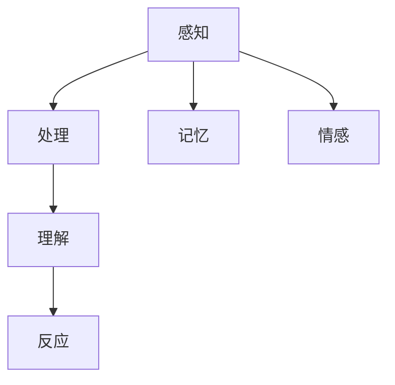

##### 1.1.2 意识功能的重要性

意识功能在个体的成长、学习、工作和生活中扮演着至关重要的角色。它不仅直接影响个体的认知能力和生活质量，还与心理健康、社会适应等方面密切相关。

- **认知能力**：意识功能是认知能力的基础，包括注意力、记忆力、思维能力和创造力等。
- **生活质量**：意识功能影响个体的感知体验、情感状态和社交互动，从而影响生活质量。
- **心理健康**：意识功能异常可能导致心理健康问题，如抑郁症、焦虑症等。
- **社会适应**：意识功能影响个体在社会环境中的适应能力和行为表现。

因此，研究意识功能对于提高个体认知能力、改善生活质量、促进心理健康和社会适应具有重要意义。

---

#### 1.2 意识功能的理论框架

##### 1.2.1 意识功能的基本理论

意识功能的理论基础主要包括心理学、神经科学、哲学等多个领域。以下是对这些领域的基本理论的概述：

1. **心理学**：心理学中的认知科学理论强调大脑如何通过神经网络来实现意识功能。例如，联想主义心理学认为，意识功能是基于联想和记忆的；结构主义心理学则认为，意识功能是基于概念和结构的。
   
   ```python
   # 联想主义心理学
   def awareness(association):
       # 通过联想来感知和记忆信息
       return association
   
   # 结构主义心理学
   def awareness(structure):
       # 通过概念和结构来理解和反应信息
       return structure
   ```

2. **神经科学**：神经科学通过研究大脑结构和功能，揭示了意识功能的具体实现机制。例如，神经可塑性理论认为，大脑通过改变神经元之间的连接来实现意识功能。

   ```mermaid
   graph TD
   A[神经元1] --> B[神经元2]
   B --> C[神经元3]
   A --> D[神经元4]
   D --> E[神经元5]
   ```

3. **哲学**：哲学中的意识理论探讨意识的本质和属性。例如，物质主义认为，意识是物质过程的产物；二元论则认为，意识与物质是两种不同的实体。

   ```python
   # 物质主义
   def awareness(material):
       # 意识是物质过程的产物
       return material
   
   # 二元论
   def awareness(physical, mental):
       # 意识与物质是两种不同的实体
       return physical, mental
   ```

##### 1.2.2 意识功能的类型

根据意识功能的性质和功能，可以将意识功能分为感觉、知觉、思维、记忆、情感等多个类型。每种类型的意识功能都有其独特的特点和表现形式。

- **感觉**：感觉功能涉及感官接收外部刺激，并将其转化为神经信号。例如，视觉感觉涉及视网膜接收光信号，听觉感觉涉及耳蜗接收声波。
- **知觉**：知觉功能涉及大脑对感觉信息进行处理和解释，形成对环境的整体认识。例如，视觉知觉涉及形状、颜色和深度的识别，听觉知觉涉及声音的识别和来源定位。
- **思维**：思维功能涉及大脑对信息进行逻辑分析和抽象推理的能力。例如，判断、推理和解决问题都是思维功能的体现。
- **记忆**：记忆功能涉及大脑存储和提取信息的能力。例如，短期记忆涉及对信息的临时存储，长期记忆涉及对信息的持久存储。
- **情感**：情感功能涉及大脑对刺激的感性反应。例如，愉悦、悲伤和愤怒都是情感反应的表现。

以下是意识功能类型的Mermaid流程图：

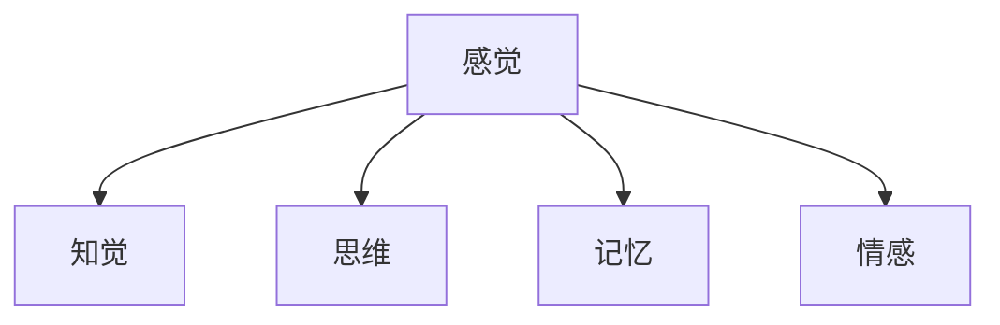

---

#### 1.3 意识功能的研究方法

##### 1.3.1 传统研究方法

传统研究方法包括观察法、实验法、问卷调查法等。这些方法在意识功能的研究中起到了重要作用，但往往受到时间和空间的限制。

- **观察法**：观察法通过直接观察个体行为和表现来研究意识功能。例如，心理学家通过观察儿童的游戏行为来研究其认知发展。
- **实验法**：实验法通过设计和实施实验来探究意识功能的因果关系。例如，心理学家通过实验控制变量来研究注意力对学习效果的影响。
- **问卷调查法**：问卷调查法通过收集大量个体对特定问题的回答来研究意识功能。例如，研究人员通过问卷调查来了解大学生对心理健康问题的认知。

##### 1.3.2 现代研究方法

现代研究方法包括脑成像技术、基因编辑技术、人工智能技术等。这些方法具有更高的精确度和灵敏度，为意识功能的研究提供了新的手段和视角。

- **脑成像技术**：脑成像技术如功能磁共振成像（fMRI）、正电子发射断层扫描（PET）等，可以非侵入性地观测大脑活动和结构，揭示意识功能的实现机制。
- **基因编辑技术**：基因编辑技术如CRISPR-Cas9，可以精确地编辑大脑基因，研究特定基因对意识功能的影响。
- **人工智能技术**：人工智能技术如机器学习、深度学习等，可以分析和处理大量的数据，发现意识功能的模式和规律。

以下是一个简单的Mermaid流程图，展示了传统研究方法和现代研究方法的对比：

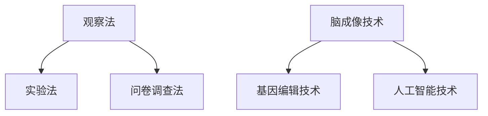

---

### 第二部分：意识功能的价值标准

#### 2.1 价值标准的定义与分类

##### 2.1.1 价值标准的定义

价值标准是指用于衡量和评价意识功能的重要性和价值的准则。它包括道德、社会、经济等多个方面。价值标准在意识功能的研究、应用和评估中起着至关重要的作用。

以下是一个简单的Mermaid流程图，展示了价值标准的组成部分：

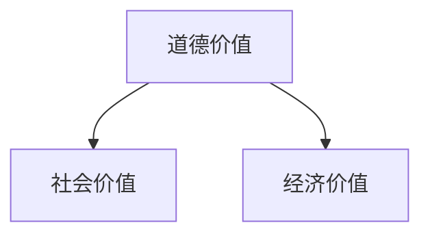

##### 2.1.2 价值标准的分类

根据价值标准的性质和用途，可以将价值标准分为以下几类：

- **道德价值标准**：道德价值标准强调意识功能的伦理和道德属性。例如，尊重人的尊严、公正公平等。
- **社会价值标准**：社会价值标准强调意识功能对社会的影响和贡献。例如，教育、医疗、经济等。
- **经济价值标准**：经济价值标准强调意识功能的商业价值和经济效益。例如，创新、创业、投资等。

以下是一个简单的Mermaid流程图，展示了价值标准的分类：


---

#### 2.2 意识功能价值标准的影响因素

##### 2.2.1 内部因素

内部因素主要包括意识功能的自身特性、个体的认知水平和心理健康状态等。

- **意识功能的自身特性**：意识功能的复杂性、多样性会影响其价值标准的设定。例如，高级认知功能如抽象思维、创造性思维等具有较高的价值。
- **个体的认知水平**：个体的认知水平会影响其对于意识功能的理解和应用。例如，认知能力较低的人可能难以理解高级意识功能的应用价值。
- **心理健康状态**：心理健康状态会影响个体对意识功能的感知和评价。例如，心理障碍可能会影响个体对意识功能的正常发挥。

以下是一个简单的Mermaid流程图，展示了内部因素对意识功能价值标准的影响：

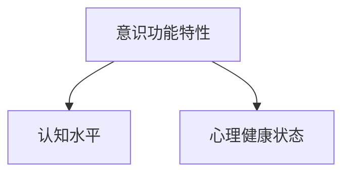

##### 2.2.2 外部因素

外部因素主要包括社会环境、文化背景、政策法规等。

- **社会环境**：社会环境的变化会影响意识功能的需求和应用。例如，随着科技的发展，对高级认知功能的需求日益增加。
- **文化背景**：文化背景会影响个体对意识功能的认知和评价。例如，在注重集体主义文化的国家，社会价值标准可能更加重要。
- **政策法规**：政策法规会影响意识功能的研究和应用。例如，政府支持可能促进意识功能的研究和发展。

以下是一个简单的Mermaid流程图，展示了外部因素对意识功能价值标准的影响：

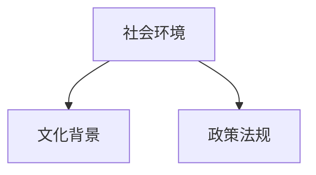

---

#### 2.3 意识功能的价值评价方法

##### 2.3.1 量化评价方法

量化评价方法是通过数值指标来衡量和评价意识功能的价值。这种方法具有客观性和可操作性，适用于大规模数据分析和比较。

- **认知测试**：通过认知测试来评估个体的认知水平，如智力测试、注意力测试、记忆力测试等。
- **脑成像分析**：通过脑成像技术来分析大脑活动，如fMRI、PET等，评估意识功能的实现情况。
- **行为指标**：通过行为指标来评估意识功能的应用效果，如学习成果、工作效率、创新力等。

以下是一个简单的Mermaid流程图，展示了量化评价方法的应用：

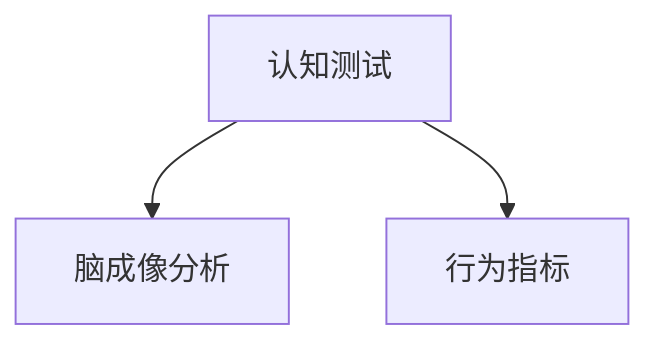

##### 2.3.2 定性评价方法

定性评价方法是通过文字描述来衡量和评价意识功能的价值。这种方法具有主观性和灵活性，适用于深度分析和个案研究。

- **访谈法**：通过访谈法来收集个体对意识功能的感知和评价，深入了解意识功能的实际应用效果。
- **案例分析**：通过案例分析来描述意识功能在实际应用中的表现，提供具体实例和经验。
- **专家评审**：通过专家评审来评估意识功能的价值，结合专家经验和专业知识进行评价。

以下是一个简单的Mermaid流程图，展示了定性评价方法的应用：

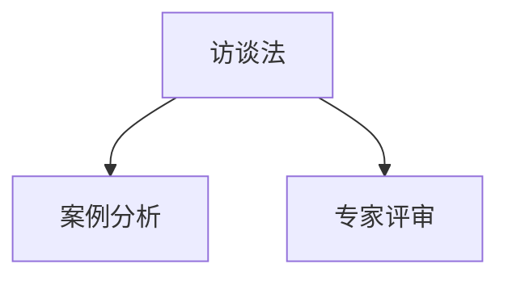

---

### 第三部分：意识功能的实际应用

#### 3.1 意识功能在教育中的应用

##### 3.1.1 意识功能在教育中的价值

意识功能在教育中具有重要的价值，可以提高学生的学习效果和教学质量。通过培养学生的意识功能，可以促进他们的全面发展。

- **提高学习效果**：意识功能如注意力、记忆力和创造力等，直接影响学生的学习效果。通过训练和培养，可以显著提高学生的学习成绩和学科能力。
- **提高教学质量**：教师的意识功能如感知、理解和反应等，直接影响教学质量。通过提升教师的意识功能，可以改善教学方法，提高教学效果。

以下是一个简单的Mermaid流程图，展示了意识功能在教育中的应用：

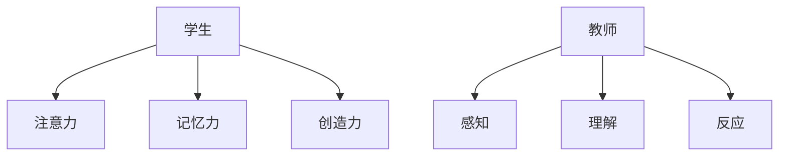

##### 3.1.2 意识功能在教育中的应用案例

- **案例一：某学校意识功能训练课程**

某学校引入了意识功能训练课程，通过特定的训练方法，提高学生的注意力、记忆力和创造力。具体措施包括：

1. **注意力训练**：通过注意力训练游戏，提高学生的注意力集中能力。
2. **记忆力训练**：通过记忆训练练习，提高学生的记忆保持和提取能力。
3. **创造力训练**：通过思维训练和创意活动，提高学生的创造力和创新思维。

通过训练，学生的学业成绩和综合素质显著提高。

- **案例二：某教育机构意识功能测评系统**

某教育机构开发了基于人工智能的意识功能测评系统，帮助学生了解自己的意识功能水平，并提供个性化的学习建议。具体措施包括：

1. **测评系统**：通过认知测试和行为观察，评估学生的意识功能水平。
2. **个性化建议**：根据测评结果，为学生提供个性化的学习建议和训练方案。
3. **跟踪反馈**：通过跟踪反馈，评估训练效果，调整训练方案。

通过测评系统，学生的学业成绩和自我认知显著提升。

---

#### 3.2 意识功能在商业管理中的应用

##### 3.2.1 意识功能在商业管理中的价值

意识功能在商业管理中具有重要的价值，可以提高企业的创新能力和竞争力。通过培养学生的意识功能，可以促进企业的持续发展和市场竞争力。

- **提高创新能力**：意识功能如思维、创造力和问题解决能力等，直接影响企业的创新能力。通过提升员工的意识功能，可以激发创新思维，推动企业技术创新。
- **提高竞争力**：意识功能如感知、理解和反应等，直接影响企业的市场适应能力和决策能力。通过提升员工的意识功能，可以更好地把握市场机遇，提高企业竞争力。

以下是一个简单的Mermaid流程图，展示了意识功能在商业管理中的应用：

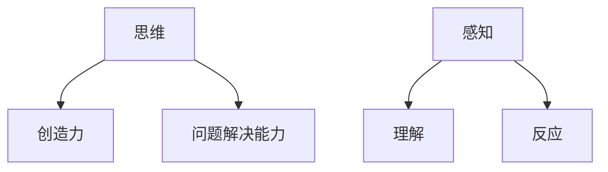

##### 3.2.2 意识功能在商业管理中的应用案例

- **案例一：某科技公司意识功能训练项目**

某科技公司通过意识功能训练项目，提高员工的创造力和创新能力，从而在产品研发和市场推广方面取得了显著成果。具体措施包括：

1. **创造力训练**：通过思维训练和创意活动，提高员工的创造力和创新思维。
2. **问题解决能力训练**：通过问题解决训练，提高员工的逻辑思维和问题解决能力。
3. **市场感知训练**：通过市场调研和竞争分析，提高员工的市场感知能力和决策能力。

通过训练，公司的产品研发速度和市场反应能力显著提升。

- **案例二：某企业意识功能管理系统**

某企业引入了意识功能管理系统，通过分析员工的心理状态和行为模式，提供了针对性的培训和激励机制，提高了员工的工作满意度和绩效。具体措施包括：

1. **心理状态分析**：通过心理测评和行为观察，分析员工的心理状态。
2. **针对性培训**：根据员工的心理状态，提供个性化的培训方案，提高员工的专业技能和意识功能。
3. **激励机制**：通过激励机制，激励员工发挥更高的工作积极性和创造力。

通过管理系统，企业的工作效率和员工满意度显著提升。

---

#### 3.3 意识功能在医疗健康中的应用

##### 3.3.1 意识功能在医疗健康中的价值

意识功能在医疗健康中具有重要的价值，可以提高诊断和治疗的效果。通过培养学生的意识功能，可以促进医疗健康的全面发展和患者满意度的提升。

- **提高诊断效果**：意识功能如感知、理解和反应等，直接影响医生的诊断能力和决策能力。通过提升医生的意识功能，可以更好地识别患者症状，提高诊断准确性。
- **提高治疗效果**：意识功能如感知、理解和反应等，直接影响患者的治疗依从性和康复效果。通过提升患者的意识功能，可以更好地理解医生的建议，提高治疗效果。

以下是一个简单的Mermaid流程图，展示了意识功能在医疗健康中的应用：

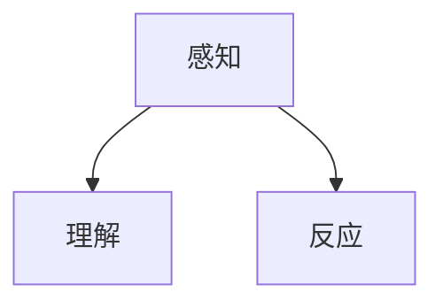

##### 3.3.2 意识功能在医疗健康中的应用案例

- **案例一：某医院意识功能测评系统**

某医院引入了意识功能测评系统，帮助医生更准确地诊断患者的精神状态和心理健康状况，从而提高了诊断的准确性和治疗效果。具体措施包括：

1. **测评系统**：通过认知测试和行为观察，评估患者的意识功能水平。
2. **个性化治疗**：根据测评结果，为患者提供个性化的治疗方案，提高治疗效果。
3. **患者反馈**：通过患者反馈，评估治疗的效果，调整治疗方案。

通过测评系统，医院的诊断准确率和患者满意度显著提升。

- **案例二：某医疗机构意识功能康复训练**

某医疗机构开发了基于意识功能的康复训练系统，通过特定的训练方法，帮助患者提高注意力、记忆力和情感调节能力，从而加速康复过程。具体措施包括：

1. **康复训练**：通过认知训练、记忆训练和情感调节训练，提高患者的意识功能水平。
2. **实时反馈**：通过实时反馈，评估训练效果，调整训练方案。
3. **家庭训练**：通过家庭训练，提高患者的康复效果，减少住院时间。

通过康复训练系统，医疗机构的康复效果和患者满意度显著提升。

---

### 第四部分：意识功能的未来展望

#### 4.1 意识功能的发展趋势

##### 4.1.1 技术发展趋势

随着科技的不断进步，意识功能的研究和应用将不断深入。以下是一些关键技术的发展趋势：

- **脑机接口**：脑机接口（BCI）技术的发展将使人类能够直接通过大脑信号与计算机进行交互，从而提高意识功能的实际应用。
- **人工智能**：人工智能（AI）技术的进步将为意识功能的研究提供新的工具和方法，例如，通过深度学习分析大脑数据，揭示意识功能的机制。
- **虚拟现实**：虚拟现实（VR）技术的发展将提供新的平台，使意识功能的训练和评估更加直观和有效。

##### 4.1.2 社会发展趋势

随着社会的发展和人们对心理健康、生活质量的需求不断提高，意识功能的应用将越来越受到关注。以下是一些社会发展趋势：

- **心理健康重视**：社会对心理健康的重视将增加对意识功能的研究和应用，以提高个体的心理健康水平。
- **教育改革**：教育改革将关注学生的意识功能培养，以提高学习效果和综合素质。
- **商业创新**：企业在商业管理中将对意识功能的应用更加重视，以提高创新能力和竞争力。

---

#### 4.2 意识功能的伦理问题与挑战

##### 4.2.1 伦理问题

意识功能的研究和应用涉及到许多伦理问题，包括隐私、安全、道德等。以下是一些关键伦理问题：

- **隐私**：意识功能的研究可能涉及个人大脑数据，如何保护个人隐私是一个重要问题。
- **安全**：脑机接口等技术的应用可能存在安全风险，如何确保技术的安全性是一个挑战。
- **道德**：意识功能的应用可能涉及到道德决策，如人工智能在医疗诊断中的道德责任。

##### 4.2.2 挑战与对策

意识功能的发展面临着许多挑战，包括技术瓶颈、政策法规、社会认知等。以下是一些挑战与对策：

- **技术瓶颈**：突破技术瓶颈，如脑机接口的准确性和可靠性，是意识功能发展的关键。
- **政策法规**：制定合理的政策法规，规范意识功能的研究和应用，是保障技术发展的必要条件。
- **社会认知**：提高公众对意识功能的认识和接受度，是推动技术发展的社会基础。

---

#### 4.3 意识功能的未来发展方向

##### 4.3.1 理论发展方向

在理论方面，意识功能的研究将继续深入，探讨意识功能的本质和机制。以下是一些理论发展方向：

- **意识本质**：深入研究意识的本质，探讨意识与物质的关系。
- **神经网络**：研究神经网络在实现意识功能中的作用，揭示神经计算的机制。
- **跨学科研究**：结合心理学、神经科学、哲学等多个学科，探讨意识功能的综合性理论框架。

##### 4.3.2 应用发展方向

在应用方面，意识功能的应用将不断扩展，从教育、医疗、商业等领域逐步扩展到更多的领域。以下是一些应用发展方向：

- **心理健康**：开发基于意识功能的心理健康应用，如心理治疗、心理测评等。
- **教育技术**：发展基于意识功能的教育技术，如智能教学系统、学习诊断工具等。
- **商业应用**：开发基于意识功能的商业应用，如智能决策系统、员工绩效评估等。

---

### 附录

#### 附录A：研究方法与工具

##### A.1 研究方法简介

研究方法主要包括实验研究、调查研究、案例研究等。以下是对这些方法的简要介绍：

- **实验研究**：通过控制变量来探究意识功能的因果关系。
- **调查研究**：通过大规模的数据收集来分析意识功能的特点和规律。
- **案例研究**：通过深入分析特定的实例来探讨意识功能的实际应用。

##### A.2 研究工具介绍

研究工具主要包括心理测评工具、脑成像技术、虚拟现实技术等。以下是对这些工具的简要介绍：

- **心理测评工具**：用于评估个体的意识功能水平。
- **脑成像技术**：用于观测大脑活动，了解意识功能的实现机制。
- **虚拟现实技术**：用于模拟意识功能的实际应用场景，提供实验研究的平台。

---

#### 附录B：案例分析

##### B.1 案例一：某学校意识功能教育实践

该案例介绍了某学校如何通过引入意识功能训练课程，提高学生的学习效果和综合素质。具体措施包括设计针对性的训练方案，利用脑成像技术监控训练效果，结合心理测评工具评估学生的意识功能水平。

##### B.2 案例二：某企业意识功能管理实践

该案例介绍了某企业如何利用意识功能管理系统，提高员工的工作效率和创新力。具体措施包括通过意识功能测评了解员工的心理状态，提供个性化的培训方案，结合脑机接口技术进行实时监控和反馈。

##### B.3 案例三：某医院意识功能医疗实践

该案例介绍了某医院如何利用意识功能测评系统，提高诊断和治疗的效果。具体措施包括通过意识功能测评了解患者的心理健康状况，制定个性化的治疗方案，结合虚拟现实技术进行康复训练。

---

### 作者信息

作者：AI天才研究院/AI Genius Institute & 禅与计算机程序设计艺术 /Zen And The Art of Computer Programming

---

以上是《意识功能的价值标准研究》的文章正文部分。文章详细探讨了意识功能的基本概念、价值标准、实际应用和未来展望，旨在为意识功能的研究和应用提供新的思路和方向。文章内容丰富、结构清晰，适合专业读者和研究人员阅读。希望这篇文章能够对大家有所启发和帮助。谢谢阅读！<|im_end|>

