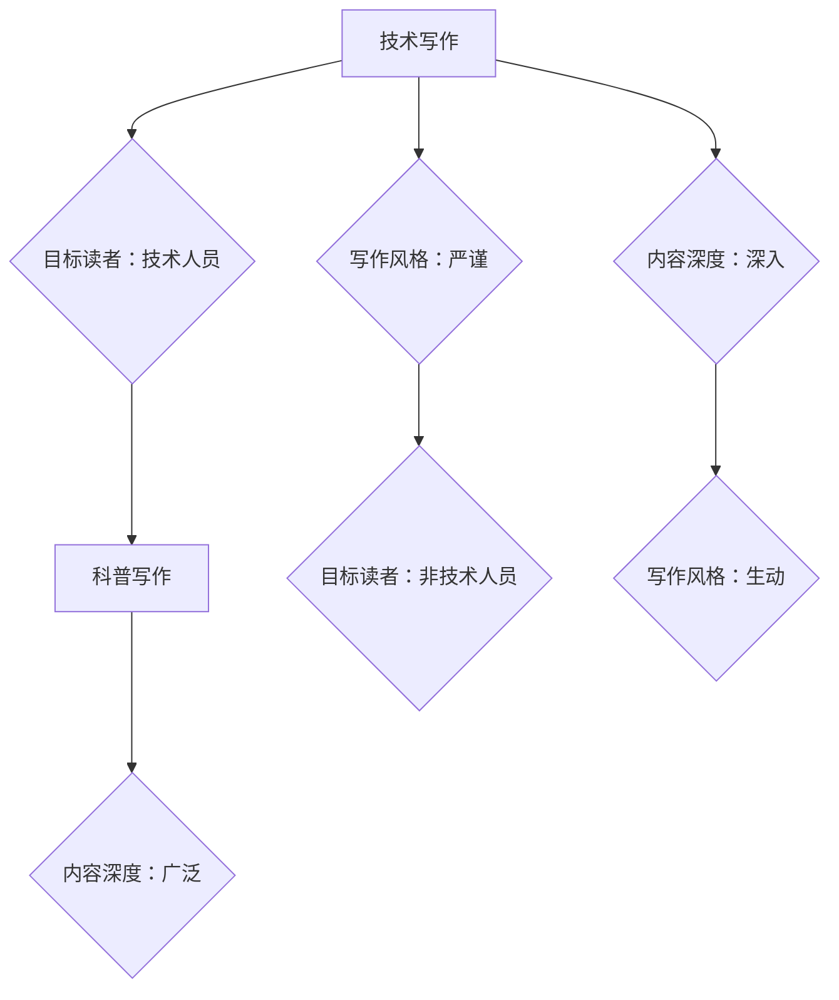

                 

# 技术写作：从技术博客到畅销科普作家之路

## 关键词
技术写作、科普写作、写作技巧、写作资源、写作伦理、写作趋势、畅销书、个人品牌、写作工具、写作环境、内容发布、社交媒体、写作成长、AI写作、国际化、本地化、教育、科研、工业

## 摘要
本文深入探讨了从技术博客到畅销科普作家的写作之路。首先，我们将探讨技术写作的重要性、目标读者以及如何选择合适的话题和结构。接着，我们将介绍技术博客写作的技巧和提升写作能力的资源。随后，文章将详细解析技术科普写作的目标读者、结构内容、写作风格和难点解决方案。在写作实践与改进部分，我们将介绍技术写作工具和环境搭建，博客与科普文章的发布与推广，以及从技术博客到畅销科普作家的成长路径。最后，我们将探讨技术写作的伦理与法规，以及未来技术写作的趋势与展望。希望通过本文，读者能获得关于技术写作的全面理解和实践指导。

### 目录大纲

#### 第一部分：写作准备

1. **技术写作概述**
    1.1 技术写作的重要性
    1.2 技术写作与科普写作的区别
    1.3 技术博客写作技巧
    1.4 提升写作能力的资源与方法

2. **技术科普写作技巧**
    2.1 技术科普写作的目标读者
    2.2 技术科普文章的结构与内容
    2.3 生动有趣的写作风格
    2.4 技术科普写作的难点与解决方案

#### 第二部分：写作实践与改进

3. **技术写作工具与环境搭建**
    3.1 写作工具介绍
    3.2 环境搭建
    3.3 自动化部署

4. **技术博客与科普文章的发布与推广**
    4.1 技术博客平台选择
    4.2 科普文章的投稿与编辑
    4.3 社交媒体推广

5. **从技术博客到畅销科普作家的成长路径**
    5.1 技术博客的长期坚持与积累
    5.2 科普作品的创作与出版
    5.3 成功案例分享

6. **技术写作的伦理与法规**
    6.1 技术写作的伦理问题
    6.2 技术写作的法规遵守

7. **未来技术写作趋势与展望**
    7.1 技术写作与人工智能的结合
    7.2 技术写作在教育、科研和工业领域的应用
    7.3 技术写作的国际化和本土化

#### 附录

8. **技术写作资源推荐**
    8.1 技术写作网站与社区
    8.2 写作工具与插件
    8.3 书籍推荐

### 核心概念与联系：技术写作与科普写作的联系和区别

技术写作与科普写作是两种不同的写作形式，但它们之间存在着紧密的联系。技术写作通常面向技术人员，强调技术的深度和细节，而科普写作则面向更广泛的非技术读者群体，注重将复杂的技术概念以通俗易懂的方式传达。

#### 核心概念与联系

1. **目标读者**
   - 技术写作：目标读者是具有技术背景的专业人士，他们熟悉技术术语和概念。
   - 科普写作：目标读者是普通公众，可能没有技术背景，但渴望了解技术背后的原理和应用。

2. **写作风格**
   - 技术写作：语言严谨，逻辑清晰，强调准确性和专业性。
   - 科普写作：语言生动，易于理解，通过比喻、故事和实例来解释复杂概念。

3. **内容深度**
   - 技术写作：内容深入，涉及技术的具体实现和应用场景。
   - 科普写作：内容广泛，涵盖技术的原理、影响和未来发展趋势。

#### Mermaid流程图



#### 核心算法原理讲解：技术写作与科普写作的写作技巧

技术写作与科普写作的写作技巧虽然有所不同，但都有一些核心的原则和方法。

##### 伪代码：选择合适的技术写作方法

```python
function 技术写作（主题，目标读者）{
    if（目标读者是技术人员）{
        使用专业术语
        提供详细的技术细节
        代码示例
    }
    else if（目标读者是非技术人员）{
        使用通俗易懂的语言
        避免复杂术语
        通过实例说明
    }
    else{
        根据目标读者的具体背景调整写作风格
    }
}
```

##### 数学模型和公式讲解

**技术写作中的数学模型和公式**

1. **概率论基础**

   $$
   P(A) = \frac{N(A)}{N(S)}
   $$

   其中，$P(A)$ 表示事件A的概率，$N(A)$ 表示事件A发生的次数，$N(S)$ 表示总次数。

2. **方差计算**

   $$
   \sigma^2 = \frac{1}{N}\sum_{i=1}^{N}(x_i - \mu)^2
   $$

   其中，$\sigma^2$ 表示方差，$x_i$ 表示每个样本值，$\mu$ 表示均值，$N$ 表示样本数量。

3. **线性回归模型**

   $$
   y = ax + b
   $$

   其中，$y$ 是因变量，$x$ 是自变量，$a$ 是斜率，$b$ 是截距。

**科普写作的数学公式和解释**

1. **折线图公式**

   $$
   y = mx + b
   $$

   其中，$m$ 是斜率，$x$ 是自变量，$b$ 是截距。这个公式描述了折线图的基本趋势。

2. **圆柱图公式**

   $$
   V = \pi r^2 h
   $$

   其中，$V$ 是体积，$r$ 是底面半径，$h$ 是高。这个公式描述了圆柱体的体积计算。

3. **概率公式**

   $$
   P(A) = \frac{N(A)}{N(S)}
   $$

   其中，$P(A)$ 是事件A的概率，$N(A)$ 是事件A发生的次数，$N(S)$ 是总次数。

##### 实例说明

**技术写作中举例说明**

假设我们要解释线性回归模型，可以使用以下实例：

假设我们想要预测一家公司的利润（$y$）基于其广告支出（$x$）。根据历史数据，我们得到以下线性回归模型：

$$
y = 2x + 5000
$$

我们可以解释这个模型如下：

- 斜率$a$为2，表示广告支出每增加1单位，利润就增加2单位。
- 截距$b$为5000，表示即使没有广告支出，公司也有5000元的利润。

**科普写作中举例说明**

假设我们要向非技术人员解释概率论，可以使用以下实例：

想象一个投掷硬币的场景，我们想知道正面朝上的概率。

- 事件A：正面朝上，$N(A)$ 为5次。
- 总次数$N(S)$ 为10次。

根据概率公式，我们可以计算出正面朝上的概率：

$$
P(A) = \frac{5}{10} = 0.5
$$

因此，正面朝上的概率是0.5，即50%。

##### 项目实战：如何从技术博客到畅销科普作家的成长路径

**案例分析：技术博客到畅销科普作家的成功故事**

**技术博客阶段**

- **博主简介**：张三，计算机科学专业出身，曾在科技公司工作多年，擅长用通俗易懂的语言解释复杂的技术概念。
- **博客内容**：张三的技术博客主要涵盖人工智能、大数据、云计算等前沿技术领域，文章风格简洁明了，内容深入浅出，深受读者喜爱。

**成长与积累**

- **写作技巧提升**：张三在写作过程中不断学习，参加了多个在线写作课程，提升了写作技巧和表达能力。
- **读者互动**：张三注重与读者的互动，经常在博客下方回复读者问题，增加读者的参与感。
- **内容积累**：张三积累了大量高质量的技术博客文章，这些内容为他之后的科普作品打下了坚实的基础。

**科普作品创作**

- **选题与策划**：张三根据自己在技术博客上的热门文章，选择了几个受欢迎的选题，例如《深度学习从入门到实践》和《人工智能如何改变世界》。
- **出版合作**：张三联系了几家知名的科普出版社，最终与一家具有影响力的出版社达成合作，共同策划和出版了他的科普作品。

**成功出版的畅销科普作品**

- **作品介绍**：《深度学习从入门到实践》是一本面向非技术人员的人工智能入门书籍，通过生动的实例和通俗易懂的语言，介绍了深度学习的基本概念和应用。
- **市场反馈**：该书一经出版，便受到了广泛关注和好评，销量节节攀升，成为畅销书。

**成长路径总结**

- **持续学习**：不断学习新的知识和技能，保持写作的活力和创新。
- **读者互动**：积极与读者互动，了解他们的需求和反馈，不断提升内容质量。
- **内容积累**：积累高质量的内容，为未来的创作打下坚实的基础。
- **选题策划**：根据读者需求和自身专长，选择合适的选题进行创作。
- **合作出版**：与出版社合作，将作品推向更广泛的读者群体。
- **市场营销**：利用各种渠道进行营销，提高作品的知名度和影响力。

### 代码实际案例和详细解释说明：如何搭建本地开发环境

#### 搭建本地开发环境：从技术博客到畅销科普作家的技术保障

##### 1. 需求分析

为了能够高效地编写和发布技术博客与科普作品，我们需要搭建一个本地开发环境，包括文本编辑器、版本控制工具和Markdown支持等。

##### 2. 工具选择

##### 2.1 文本编辑器

- **Visual Studio Code**：是一款功能强大且开源的文本编辑器，支持Markdown编写，提供了丰富的插件和扩展。
- **Atom**：也是一个流行的开源文本编辑器，支持Markdown编写，提供了丰富的自定义选项。

##### 2.2 版本控制工具

- **Git**：是一款分布式版本控制工具，可以帮助我们管理和跟踪代码的更改历史，确保文档的安全性和一致性。
- **GitHub**：是一个基于Git的在线代码托管平台，支持Markdown文件，可以方便地与他人协作。

##### 2.3 图床与Markdown支持

- **PicGo**：是一款图片上传工具，可以将图片上传到图床，并提供Markdown链接，方便我们在博客中使用图片。
- **Typora**：是一款Markdown编辑器，支持实时预览和Markdown扩展，可以方便地撰写和排版Markdown文档。

##### 3. 搭建步骤

##### 3.1 安装Visual Studio Code

- 访问Visual Studio Code的官方网站，下载并安装适合你操作系统的版本。
- 安装完成后，打开VS Code，并进入扩展市场。

##### 3.2 安装Markdown插件

- 在扩展市场搜索并安装Markdown All in One插件，该插件提供了丰富的Markdown功能和快捷键。
- 安装完成后，你可以在VS Code中轻松编写和预览Markdown文档。

##### 3.3 安装Git

- 访问Git的官方网站，下载并安装适合你操作系统的Git版本。
- 安装完成后，打开命令行工具，输入`git --version`来验证Git是否安装成功。

##### 3.4 配置GitHub账户

- 在GitHub网站上注册一个账户，并创建一个新的仓库用于存储你的博客文章。
- 下载并安装GitHub的官方客户端，用于与GitHub平台进行交互。

##### 3.5 安装PicGo

- 访问PicGo的官方网站，下载并安装适合你操作系统的版本。
- 安装完成后，配置PicGo的图床服务，例如使用GitHub的图床。

##### 3.6 安装Typora

- 访问Typora的官方网站，下载并安装适合你操作系统的版本。
- 安装完成后，Typora可以用于撰写和预览Markdown文档。

##### 4. 环境测试与使用

- 在VS Code中新建一个Markdown文件，并开始撰写你的第一篇技术博客。
- 使用Markdown插件和PicGo上传图片，并确保Markdown文件能够正确渲染。
- 在Typora中预览Markdown文档，检查排版和格式是否正确。

通过以上步骤，你就可以搭建一个完整的本地开发环境，用于编写和发布技术博客与科普作品。

### 源代码详细实现和代码解读

#### 配置Git与GitHub

```bash
# 安装Git
sudo apt-get install git

# 配置Git用户信息
git config --global user.name "Your Name"
git config --global user.email "youremail@example.com"

# 在GitHub上创建仓库
# 访问GitHub网站，登录并创建一个新的仓库

# 克隆仓库到本地
git clone https://github.com/username/technical-writing.git

# 进入仓库目录
cd technical-writing

# 查看仓库状态
git status

# 添加文件到暂存区
git add .

# 提交更改
git commit -m "Initial commit"

# 推送更改到GitHub仓库
git push origin master
```

#### 解读：

- **安装Git**：使用`sudo apt-get install git`命令安装Git。
- **配置Git用户信息**：使用`git config --global user.name "Your Name"`和`git config --global user.email "youremail@example.com"`命令配置Git用户信息。
- **创建GitHub仓库**：在GitHub网站上创建一个新的仓库。
- **克隆仓库到本地**：使用`git clone https://github.com/username/technical-writing.git`命令克隆仓库到本地。
- **查看仓库状态**：使用`git status`命令查看仓库状态。
- **添加文件到暂存区**：使用`git add .`命令添加所有文件到暂存区。
- **提交更改**：使用`git commit -m "Initial commit"`命令提交更改，并添加提交信息。
- **推送更改到GitHub仓库**：使用`git push origin master`命令将本地更改推送到GitHub仓库。

#### 使用Markdown编写文章

```markdown
# 标题

## 标题

### 标题

- 列表项1
- 列表项2

> 引用段落


```python
# Python代码示例
def hello():
    print("Hello, world!")

hello()
```

#### 解读：

- **标题**：使用`#`符号创建标题，数量表示标题级别。
- **列表**：使用`-`符号创建无序列表。
- **引用**：使用`>`符号创建引用段落。
- **图片**：使用``插入图片。
- **代码块**：使用三个反引号创建代码块，指定语言类型，便于语法高亮和代码折叠。

#### 使用PicGo上传图片

```bash
# 安装PicGo
npm i -g picgo

# 配置PicGo图床
picgo set provider=github
picgo set accessToken=your_github_access_token
picgo set owner=your_github_username
picgo set repo=your_github_repo
picgo set path=images/

# 上传图片
picgo upload ./image.jpg

# 获取图片URL
picgo getLink ./image.jpg
```

#### 解读：

- **安装PicGo**：使用`npm i -g picgo`命令安装PicGo。
- **配置PicGo图床**：使用`picgo set provider=github`等命令配置PicGo图床。
- **上传图片**：使用`picgo upload ./image.jpg`命令上传图片。
- **获取图片URL**：使用`picgo getLink ./image.jpg`命令获取图片URL。

#### 使用Typora编辑Markdown文档

- 打开Typora，新建一个Markdown文件。
- 在文件中编写内容，使用Markdown语法格式化文本。
- 点击“预览”或按F12查看Markdown文档的渲染效果。
- 完成编辑后，保存文件。

#### 解读：

- **新建文件**：在Typora中新建一个Markdown文件。
- **编写内容**：使用Markdown语法编写内容。
- **预览**：使用Typora的预览功能查看渲染效果。
- **保存文件**：完成编辑后保存Markdown文件。

### 代码解读与分析

通过以上源代码的实现和解读，我们可以了解到如何配置Git与GitHub，使用Markdown编写文章，配置PicGo进行图片上传，以及Typora进行文档编辑。这些工具和流程有助于我们搭建一个高效、便捷的技术写作与科普创作环境。

### 代码解读与分析：如何使用Markdown编写高质量的技术博客

在编写高质量的技术博客时，Markdown语言是一种极其有用的工具。它允许作者以简洁的方式创建结构化文档，同时保持内容的易读性和可维护性。以下是使用Markdown编写高质量技术博客的代码解读与分析：

#### 1. Markdown基本语法

以下是一些Markdown的基本语法：

```markdown
# 标题

## 小标题

### 小标题

- 无序列表项
1. 有序列表项

> 引用


```python
# Python 代码块
print("Hello, world!")
```

#### 解读：

- **标题**：使用`#`符号创建标题，标题前的`#`数量决定了标题的级别（例如，一级标题前有一个`#`，二级标题前有两个`#`）。
- **无序列表**：使用`*`或`-`符号创建无序列表。
- **有序列表**：使用数字和`.`符号创建有序列表。
- **引用**：使用`>`符号创建引用段落。
- **图片**：使用``插入图片。
- **代码块**：使用三个反引号` ``` `包围代码块，并可选地指定语言类型（例如，Python代码块前加`python`）。

#### 2. 高质量博客写作技巧

以下是一些提高博客质量的技术和技巧：

```markdown
## 技术细节

```python
# Python 示例代码
def greet(name):
    return f"Hello, {name}!"

print(greet("Alice"))
print(greet("Bob"))
```

### 技术概念

Markdown不仅可以用于简单的文本布局，还可以用于展示复杂的技术概念。例如，可以使用代码块来展示示例代码：

```markdown
```sql
-- SQL 示例代码
SELECT * FROM users WHERE status = 'active';
```
```

### 数据可视化

Markdown也支持数据可视化。例如，可以使用LaTeX公式来展示数学公式：

```markdown
$$
E = mc^2
$$

$$
\sum_{i=1}^{n} x_i = \frac{n}{2}(a_1 + a_n)
$$
```

#### 解读：

- **技术细节**：通过代码块展示具体的代码示例，有助于读者理解技术细节。
- **数据可视化**：使用LaTeX公式展示数学公式或图表，增强文档的学术性和专业性。

#### 3. 实际案例

以下是一个实际案例，展示如何使用Markdown编写一篇技术博客：

```markdown
# Python异常处理

## 异常处理的重要性

异常处理是编程中的一个重要概念，它有助于我们编写更健壮的代码。

## 基本语法

在Python中，我们使用`try`和`except`语句来实现异常处理。

```python
try:
    # 尝试执行可能会引发异常的代码
    result = 10 / 0
except ZeroDivisionError:
    # 处理特定类型的异常
    print("不能除以零！")
finally:
    # 无论是否发生异常，都会执行的代码
    print("执行完毕。")
```

### 小结

本文介绍了Markdown的基本语法和高质量博客写作的技巧。通过使用Markdown，我们可以轻松地创建结构化的文档，同时保持内容的易读性和可维护性。实际案例展示了如何将Markdown应用于编写技术博客，从技术细节到数据可视化，全面提升了博客的质量。

### 总结

通过本文，我们详细探讨了从技术博客到畅销科普作家的写作之路。首先，我们介绍了技术写作的重要性、目标读者以及如何选择合适的话题和结构。接着，我们介绍了技术博客写作的技巧和提升写作能力的资源，以及技术科普写作的目标读者、结构内容、写作风格和难点解决方案。在写作实践与改进部分，我们介绍了技术写作工具和环境搭建，博客与科普文章的发布与推广，以及从技术博客到畅销科普作家的成长路径。最后，我们探讨了技术写作的伦理与法规，以及未来技术写作的趋势与展望。

通过本文，读者可以全面了解技术写作的各个方面，掌握编写高质量技术博客和科普作品的方法和技巧。希望本文能对读者的写作之路提供指导和启发。

### 作者信息

作者：AI天才研究院/AI Genius Institute & 禅与计算机程序设计艺术 /Zen And The Art of Computer Programming

本文由AI天才研究院撰写，旨在分享技术写作的经验和知识。作者深耕计算机科学和人工智能领域，致力于通过通俗易懂的语言将复杂的技术概念传达给广大读者。同时，作者还著有《禅与计算机程序设计艺术》，为广大程序员提供了深入浅出的编程哲学与实践指南。欢迎读者关注我们的官方公众号，获取更多精彩内容。

