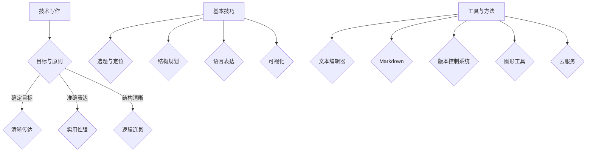
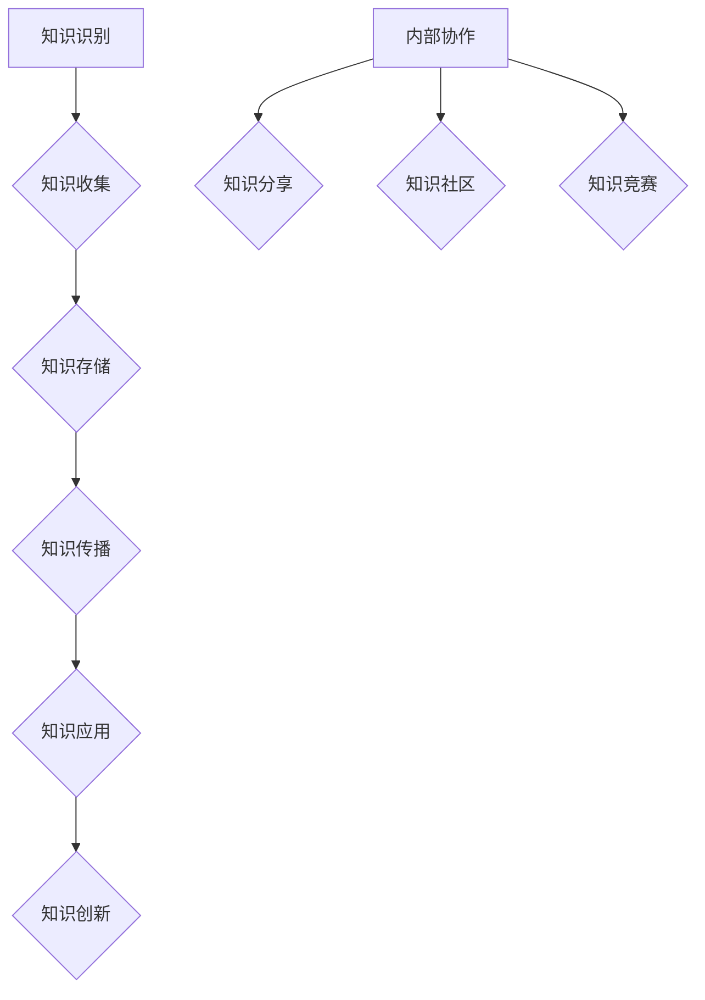
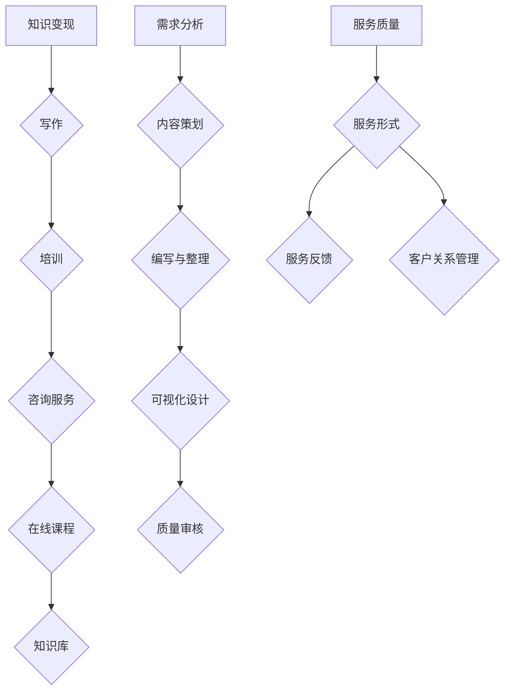
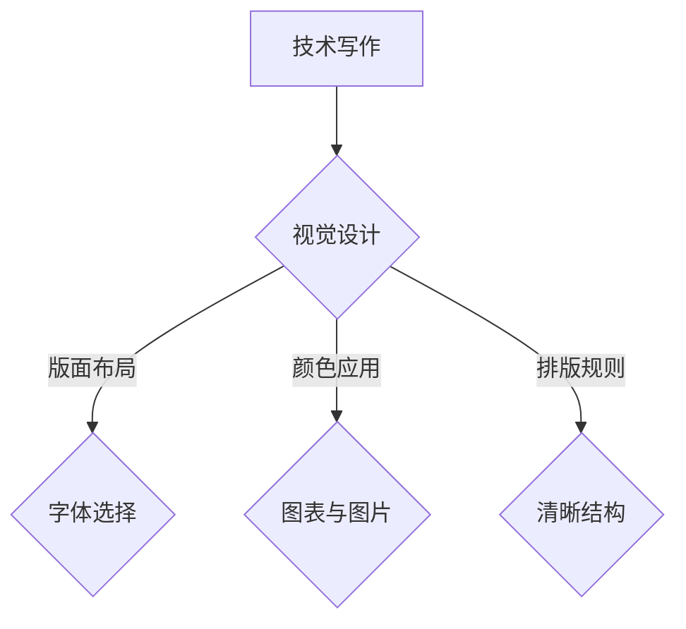
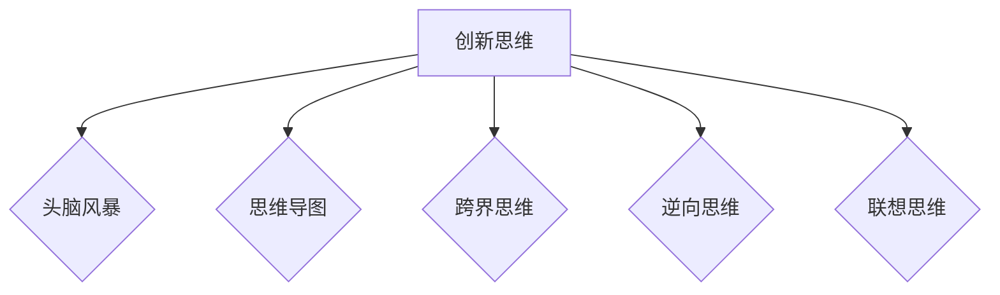

                 

### 文章标题

# 《技术写作：程序员的知识变现之路》

---

> **关键词**：技术写作、知识变现、文档编写、博客撰写、知识管理、职业规划

> **摘要**：本文深入探讨了技术写作的重要性及其在程序员职业发展中的作用。通过详细阐述技术写作的基础知识、实战技巧、以及知识变现策略，本文为程序员提供了一条将自身知识转化为实际收益的有效途径。

## 第一部分：技术写作基础

### 第1章：技术写作概述

#### 1.1 技术写作的重要性

技术写作作为连接技术领域和普通用户的桥梁，具有不可忽视的重要性。首先，技术写作能够有效传达复杂的技术概念，使得非专业人士也能理解并应用这些知识。其次，优秀的文档和博客能够提升程序员的工作效率，减少重复性劳动，促进知识的传播和共享。最后，技术写作是个人品牌建设的重要手段，能够帮助程序员在职业道路上脱颖而出。

#### 1.2 技术写作的目标与原则

技术写作的主要目标是清晰、准确地传达技术知识，让读者能够轻松理解和掌握。为实现这一目标，技术写作应遵循以下原则：

1. **简洁性**：避免冗长的描述，使用简洁明了的语言。
2. **逻辑性**：确保文章结构清晰，逻辑连贯，便于读者阅读。
3. **实用性**：提供实际操作步骤和示例，帮助读者应用所学知识。
4. **准确性**：确保信息准确无误，避免误导读者。

#### 1.3 技术写作的基本技巧

1. **选题与定位**：选择具有实际意义和技术含量的主题，明确文章的受众群体。
2. **结构规划**：合理划分章节，确保文章条理清晰。
3. **语言表达**：使用专业术语，同时注重可读性，避免过于晦涩。
4. **可视化**：适当使用图表、代码示例等，增强文章的直观性。

#### 1.4 技术写作的工具与方法

技术写作需要借助各种工具和方法来提高效率和质量。以下是一些常用的工具和方法：

1. **文本编辑器**：如Visual Studio Code、Sublime Text等，提供丰富的编程功能和插件支持。
2. **Markdown**：一种轻量级标记语言，便于快速编写和格式化文档。
3. **版本控制系统**：如Git，用于管理文档的版本和变更。
4. **图形工具**：如Mermaid，用于绘制流程图和UML图。
5. **云服务**：如GitHub、GitLab等，提供代码托管和协作平台。

---

**Mermaid 流程图示例**：



---

### 第2章：技术文档编写

#### 2.1 技术文档的种类与结构

技术文档可以分为多种类型，如用户手册、开发文档、API文档、技术博客等。每种文档都有其独特的结构和内容要求。

1. **用户手册**：用于指导用户如何使用软件或系统，通常包括安装、配置、使用方法、常见问题等。
2. **开发文档**：为开发者提供项目背景、设计思路、代码结构等信息，便于后续开发和维护。
3. **API文档**：详细介绍API接口的使用方法、参数定义、返回值说明等，便于开发者调用和整合。
4. **技术博客**：分享技术见解、实践经验、技术趋势等，有助于提升个人品牌和影响力。

#### 2.2 编写技术文档的步骤

编写技术文档通常包括以下步骤：

1. **需求分析**：明确文档的目标受众、用途和内容要求。
2. **内容规划**：根据需求分析，制定文档的结构和内容大纲。
3. **撰写初稿**：按照大纲逐步撰写文档，注意保持逻辑连贯和语言简洁。
4. **审阅与修改**：邀请同事或专家对文档进行审阅，提出修改意见并进行调整。
5. **发布与更新**：将文档发布到合适的平台，定期更新以保持内容的有效性和准确性。

#### 2.3 使用Markdown编写文档

Markdown是一种轻量级标记语言，易于学习，且与HTML有很好的兼容性。以下是一些常用的Markdown语法：

1. **标题**：使用`#`标记，`#`越多，标题级别越低。
    - # 一级标题
    - ## 二级标题
    - ### 三级标题
    - #### 四级标题

2. **段落**：直接输入文本，无需特殊格式。
3. **列表**：使用`*`、`-`或`+`标记，表示无序列表；使用`>`标记，表示有序列表。
    - * 无序列表项1
    - - 无序列表项2
    - + 无序列表项3
    - 1 有序列表项1
    - 2 有序列表项2

4. **引用**：使用`>`标记，表示引用内容。
    - > 引用一段文字

5. **代码块**：使用` ``` `标记，表示代码块。
    ```python
    print("Hello, World!")
    ```

6. **链接**：使用`[]()`标记，表示链接。
    - [Google](https://www.google.com)

7. **图片**：使用``标记，表示图片。
    - 

#### 2.4 技术文档的版本控制

版本控制是技术文档管理的重要一环。使用版本控制系统（如Git），可以方便地管理文档的版本和变更。

1. **初始化仓库**：在项目目录中运行`git init`，初始化Git仓库。
2. **添加文件**：将文档文件添加到Git仓库，使用`git add`命令。
3. **提交变更**：提交文件变更，使用`git commit -m "提交说明"`。
4. **分支管理**：创建分支，进行独立开发，避免影响主分支。
5. **合并分支**：完成开发后，将分支合并到主分支。
6. **发布版本**：将更新后的文档发布到指定平台，如GitHub或GitLab。

---

**伪代码示例**：

```python
# 初始化Git仓库
git init

# 添加文件
git add 文件名

# 提交变更
git commit -m "提交说明"

# 创建分支
git checkout -b 分支名

# 进行开发

# 合并分支
git merge 分支名

# 发布版本
git push
```

---

通过以上步骤，程序员可以有效地编写、管理和发布技术文档，为项目的成功实施提供有力支持。

### 第3章：技术博客撰写

#### 3.1 技术博客的目的与定位

技术博客是程序员分享技术见解、经验和学习的平台。其主要目的是：

1. **知识分享**：将个人或团队的技术经验、解决方案、最佳实践等分享给读者。
2. **学习交流**：通过博客，读者可以提出疑问，作者也可以解答，促进技术交流与进步。
3. **个人品牌**：持续撰写高质量的技术博客，有助于提升个人在技术领域的知名度和影响力。

#### 3.2 技术博客的写作风格与结构

技术博客的写作风格应注重以下方面：

1. **专业性**：使用专业的术语和表达方式，确保内容的准确性和权威性。
2. **易懂性**：尽量使用简洁明了的语言，避免过于晦涩难懂的表述。
3. **条理性**：合理划分章节，确保文章条理清晰，便于读者阅读。

技术博客的基本结构包括：

1. **标题**：简洁明了，能准确传达文章主题。
2. **摘要**：简要介绍文章内容和目的，吸引读者阅读。
3. **正文**：按照逻辑顺序，逐步阐述主题，包含具体的例子和解释。
4. **结论**：总结文章的主要观点，提出建议或展望。
5. **参考文献**：列出文章中引用的参考资料，确保信息的来源可靠。

#### 3.3 技术博客的内容策划

技术博客的内容策划应考虑以下因素：

1. **选题**：选择具有实际意义、有价值的主题，避免重复性内容。
2. **受众**：明确文章的目标读者，确保内容能够满足他们的需求。
3. **形式**：根据内容特点，选择合适的表达形式，如文章、案例、教程等。

#### 3.4 技术博客的推广与运营

技术博客的推广与运营是提升文章影响力的关键。以下是一些推广和运营策略：

1. **SEO优化**：使用合适的关键词，提高文章在搜索引擎中的排名。
2. **社交媒体**：通过微博、知乎、Twitter等平台，分享文章链接，吸引更多读者。
3. **互动交流**：积极回复读者的评论和提问，建立良好的互动关系。
4. **合作与互推**：与其他技术博客作者合作，互相推荐，扩大影响力。
5. **定期更新**：保持博客的活跃度，定期发布新文章。

---

**Markdown 文章结构示例**：

```markdown
# 技术博客文章标题

## 摘要

本文将探讨...

## 引言

技术博客的目的是...

## 正文

### 第1部分

内容1...

### 第2部分

内容2...

## 结论

总结观点...

## 参考文献

[参考文献1](链接1)

[参考文献2](链接2)
```

---

通过以上步骤和策略，程序员可以有效地撰写和推广技术博客，提升个人品牌和技术影响力。

### 第4章：知识管理体系

#### 4.1 知识管理的基本概念

知识管理是一种系统化地识别、组织、传播和应用知识的活动，旨在最大化知识的价值和效率。其基本概念包括：

1. **知识**：指信息、经验、见解、技能等可传递的知识资产。
2. **知识管理**：指通过有效的方法和技术，对知识进行识别、收集、存储、传播和应用的过程。
3. **知识资产**：指组织内外的知识资源，包括文档、数据、经验、人脉等。

#### 4.2 知识管理的流程与方法

知识管理的流程通常包括以下步骤：

1. **知识识别**：识别组织内部和外部的知识资源，确定知识管理的重点领域。
2. **知识收集**：通过文献调研、访谈、观察等方式，收集与知识管理相关的信息和资料。
3. **知识存储**：将收集到的知识存储在数据库、知识库、文档管理系统等工具中，方便检索和应用。
4. **知识传播**：通过培训、讲座、会议、内部通讯等方式，将知识传递给组织内的成员。
5. **知识应用**：将知识应用到实际工作中，提高工作效率和质量。
6. **知识创新**：在知识传播和应用的基础上，通过创新思维和协作，产生新的知识和价值。

#### 4.3 知识库的构建与应用

知识库是知识管理的重要工具，用于存储和管理各种知识资源。构建知识库的方法包括：

1. **内容收集**：从内部文档、外部资料、员工经验等渠道收集知识内容。
2. **结构设计**：根据知识类型和用途，设计知识库的结构和分类体系。
3. **内容整理**：对收集到的知识内容进行整理、提炼和规范化，确保其可读性和可用性。
4. **内容存储**：将整理后的知识内容存储在数据库或文档管理系统中，便于检索和应用。

知识库的应用包括：

1. **知识共享**：员工可以在知识库中查找所需的知识资源，提高工作效率。
2. **知识传承**：通过知识库，将资深员工的经验和知识传承给新员工，降低离职风险。
3. **知识创新**：在知识库的基础上，开展知识创新活动，产生新的知识和成果。

#### 4.4 知识共享与知识创新

知识共享是知识管理的重要目标之一，通过以下方式实现：

1. **内部协作**：通过团队会议、头脑风暴、项目讨论等方式，促进员工之间的知识交流。
2. **知识分享**：通过内部通讯、知识库、培训等渠道，分享员工的知识和经验。
3. **知识社区**：建立知识社区，鼓励员工参与讨论、提问和解答问题，营造良好的知识共享氛围。

知识创新是在知识共享的基础上，通过以下方式实现的：

1. **创新思维**：培养员工的创新思维，鼓励提出新的想法和解决方案。
2. **跨部门协作**：通过跨部门项目，促进不同领域的知识融合和创新。
3. **知识竞赛**：举办知识竞赛，激发员工的创新热情，挖掘潜在的创新人才。

---

**知识管理流程图示例**：



---

通过以上知识管理体系，组织可以有效地管理知识资源，提升知识传播和应用的效果，实现知识共享和创新，为组织的持续发展提供有力支持。

### 第5章：知识变现策略

#### 5.1 知识变现的途径与模式

知识变现是指将个人或团队的专业知识和经验，通过写作、培训、咨询服务等形式转化为经济收益的过程。以下是几种常见的知识变现途径和模式：

1. **写作**：通过撰写技术博客、出版书籍、发表文章等方式，将自己的知识和见解分享给读者，获取稿费或版权收益。
2. **培训**：为企业或个人提供技术培训、讲座、研讨会等服务，通过授课费用实现知识变现。
3. **咨询服务**：利用自身的技术专长，为企业提供咨询服务，如软件开发、系统优化、技术支持等。
4. **在线课程**：制作并销售在线课程，将自己多年的技术经验和知识传授给更多学习者。
5. **知识库**：构建并运营知识库，提供付费订阅服务，为企业和个人提供专业的知识资源和解决方案。

#### 5.2 知识产品的设计与开发

知识产品的设计应充分考虑目标受众的需求和偏好，确保产品的实用性和吸引力。以下是知识产品设计与开发的关键步骤：

1. **需求分析**：调研目标受众的需求，了解他们关注的技术领域和问题。
2. **内容策划**：根据需求分析，制定知识产品的大纲和内容框架。
3. **编写与整理**：撰写和整理知识内容，确保逻辑清晰、语言简洁。
4. **可视化设计**：使用图表、代码示例、动画等可视化元素，增强知识产品的直观性。
5. **质量审核**：邀请专业人士对知识产品进行审核，确保内容准确无误。

#### 5.3 知识服务的提供与优化

知识服务的提供与优化是确保知识变现效果的关键。以下是几个方面的策略：

1. **服务质量**：确保知识服务的质量，包括内容的准确性、实用性、易懂性等。
2. **服务形式**：根据客户需求，提供多样化的服务形式，如在线咨询、远程辅导、现场培训等。
3. **服务反馈**：收集客户对知识服务的反馈，及时进行调整和优化。
4. **客户关系管理**：建立良好的客户关系，提供优质的客户体验，增强客户忠诚度。

#### 5.4 知识变现的案例与实践

以下是几个知识变现的成功案例：

1. **案例一**：某知名程序员通过撰写技术博客和出版书籍，积累了大量读者和粉丝，实现了稿费和版权收益的双丰收。
2. **案例二**：某企业通过提供技术咨询服务，为企业解决了一系列技术难题，获得了丰厚的咨询费用。
3. **案例三**：某团队通过制作在线课程，将多年的技术经验和知识传授给更多学习者，实现了知识变现和品牌推广的双赢。

通过以上案例，可以看出知识变现的关键在于充分利用自身的专业知识和经验，不断创新和优化服务形式，满足市场需求。

---

**Mermaid 知识变现流程图示例**：



---

通过以上策略和实践，个人或团队可以有效地实现知识变现，将自身的专业知识和经验转化为实际的经济收益。

## 第二部分：实战篇

### 第6章：技术写作实战案例

#### 6.1 项目背景与目标

为了更好地理解技术写作的实战应用，我们以下通过一个实际项目案例来进行分析和讲解。该项目是一个名为“AI智能推荐系统”的开发项目，旨在为企业提供定制化的智能推荐服务，提升用户体验和满意度。

项目目标包括：
1. **文档编写**：为项目团队成员和外部用户提供详细的项目文档，确保项目顺利进行。
2. **博客撰写**：分享项目开发过程中的技术见解、挑战和解决方案，提升个人品牌和项目知名度。
3. **知识管理**：构建知识库，收集和整理项目过程中的知识资源，为后续项目提供参考。

#### 6.2 案例分析：技术文档的编写

**1. 需求分析**：
在项目初期，我们识别了以下主要需求：
- **用户手册**：为用户提供系统使用说明。
- **开发文档**：为开发人员提供项目背景、设计思路和代码结构。
- **API文档**：为第三方开发者提供接口使用指南。

**2. 内容规划**：
根据需求分析，我们制定了以下文档结构：
- **用户手册**：包括安装、配置、使用方法和常见问题。
- **开发文档**：包括项目背景、设计思路、架构图、模块划分和详细代码说明。
- **API文档**：包括接口定义、参数说明、返回值描述和示例代码。

**3. 撰写初稿**：
在撰写初稿时，我们遵循了以下原则：
- **简洁性**：避免冗长的描述，使用简洁明了的语言。
- **逻辑性**：确保文章结构清晰，逻辑连贯。
- **实用性**：提供实际操作步骤和示例。

**4. 审阅与修改**：
初稿完成后，我们邀请了团队成员和外部专家进行审阅，提出修改意见，并进行调整。

**5. 发布与更新**：
将文档发布到GitHub仓库，并定期更新，确保内容的时效性和准确性。

#### 6.3 案例分析：技术博客的撰写

**1. 选题与定位**：
我们选择在项目开发过程中遇到的技术难题和解决方案作为博客主题，目标读者为技术同行。

**2. 写作风格与结构**：
博客的写作风格注重专业性和易懂性，结构包括：
- **标题**：简洁明了，准确传达主题。
- **摘要**：简要介绍文章内容和目的。
- **正文**：逐步阐述主题，包含具体的例子和解释。
- **结论**：总结主要观点，提出建议或展望。

**3. 内容策划**：
我们根据项目开发进度和读者需求，策划了以下博客主题：
- **项目背景与设计思路**。
- **技术难题与解决方案**。
- **性能优化与实践**。

**4. 推广与运营**：
我们通过以下策略推广博客：
- **SEO优化**：使用关键词，提高文章在搜索引擎中的排名。
- **社交媒体**：在微博、知乎等平台分享文章链接。
- **互动交流**：积极回复读者的评论和提问。

#### 6.4 案例分析：知识管理与变现

**1. 知识库构建**：
我们利用GitLab构建了知识库，收集和整理了以下知识资源：
- **项目文档**：包括用户手册、开发文档和API文档。
- **技术文档**：包括技术博客、教程和参考资料。
- **代码库**：包括项目源代码和相关工具。

**2. 知识共享**：
我们通过以下方式实现知识共享：
- **内部协作**：在团队内部定期举行知识分享会。
- **知识社区**：在GitHub上建立项目知识库，鼓励团队成员贡献内容。

**3. 知识变现**：
我们通过以下方式实现知识变现：
- **技术咨询服务**：为企业提供定制化的技术解决方案。
- **在线课程**：制作并销售项目相关的在线课程。
- **知识库订阅**：为企业和个人提供付费的知识库订阅服务。

通过以上实战案例，我们可以看到技术写作在项目开发、知识传播和变现中的重要作用。通过撰写技术文档、博客和构建知识库，程序员不仅能够提升自身的技术水平，还能实现知识变现，创造实际的经济收益。

## 第7章：技术写作工具与平台

#### 7.1 技术写作常用的工具

技术写作需要使用多种工具来提高效率和质量。以下是几种常用的技术写作工具：

1. **文本编辑器**：如Visual Studio Code、Sublime Text等，提供丰富的编程功能和插件支持，适合编写代码、文档和博客。
2. **Markdown编辑器**：如Typora、Marktext等，支持Markdown语法，便于快速编写和格式化文档。
3. **版本控制系统**：如Git，用于管理文档的版本和变更，确保文档的完整性和一致性。
4. **图形工具**：如Mermaid、D3.js等，用于绘制流程图、图表和可视化数据。
5. **协作平台**：如GitHub、GitLab等，提供代码托管和协作功能，便于团队成员共同编辑和审查文档。

#### 7.2 技术博客的平台选择

选择合适的技术博客平台对于提升文章的传播效果和个人品牌至关重要。以下是几种常用的技术博客平台：

1. **GitHub Pages**：利用GitHub仓库中的Markdown文件，自动生成静态网站，支持自定义域名和扩展功能。
2. **WordPress**：一款开源的博客平台，功能强大，支持插件扩展和丰富的主题设计。
3. **WordPress.com**：WordPress的商业版本，提供专业的博客托管服务，无需自行维护。
4. **Medium**：一个面向专业读者的博客平台，注重内容质量和用户体验。
5. **简书**：一个中文博客平台，用户较多，适合分享技术见解和经验。

#### 7.3 知识管理系统的搭建

知识管理系统是组织和存储知识资源的重要工具。以下是几种常用的知识管理系统：

1. **Confluence**：一款企业级的协作平台，支持文档编写、知识共享和项目管理。
2. **Trello**：一款基于看板的任务管理工具，适用于团队协作和知识管理。
3. **Notion**：一款多功能的知识管理系统，支持笔记、数据库、看板等多种功能。
4. **Microsoft OneNote**：一款笔记应用，适用于个人和团队的知识整理和记录。
5. **Evernote**：一款跨平台的笔记应用，支持文本、图片、音频等多种笔记形式，适合个人和团队的知识管理。

#### 7.4 知识变现平台的构建

知识变现平台是个人或团队实现知识变现的关键。以下是几种常用的知识变现平台：

1. **Udemy**：一个全球性的在线学习平台，提供课程销售、课程管理和学员管理等功能。
2. **Teachable**：一款简单易用的在线教育平台，支持课程创建、销售和营销。
3. **LinkedIn Learning**：LinkedIn的在线教育平台，提供专业的课程和学习资源。
4. **Coursera**：一个全球性的在线教育平台，提供大学课程、专业证书和技能培训。
5. **EduCBA**：一个提供各类在线课程的平台，涵盖IT、数据分析、项目管理等多个领域。

通过以上工具和平台的选择和配置，程序员可以更高效地开展技术写作、知识管理和知识变现工作，实现个人和团队的价值最大化。

### 第8章：技术写作职业规划

#### 8.1 技术写作职业发展路径

技术写作作为IT领域的重要职业之一，具有广阔的发展前景。以下是技术写作职业的发展路径：

1. **初级技术文档撰写员**：负责编写技术文档，如用户手册、API文档等。
2. **中级技术文档撰写员**：负责撰写更复杂的技术文档，参与技术博客撰写和知识管理。
3. **高级技术文档撰写员**：具备丰富的技术写作经验，能独立完成大型项目的技术文档编写，指导团队成员。
4. **技术文档主管**：负责团队管理，协调项目进度，制定技术文档策略。
5. **技术写作顾问**：为企业提供技术写作咨询服务，参与企业级技术文档的编写和优化。
6. **技术内容经理**：负责内容规划、创作和发布，提升企业技术品牌和影响力。

#### 8.2 技术写作的职场竞争力

在技术写作职业中，以下因素是提升职场竞争力的关键：

1. **专业素养**：具备扎实的技术背景和专业知识，能够准确、清晰地表达技术概念。
2. **沟通能力**：具备良好的沟通能力，能够与团队成员、读者和客户有效沟通。
3. **写作技能**：具备出色的写作能力，能够使用简洁、易懂的语言撰写高质量的技术文档。
4. **学习能力**：能够快速学习新技术和写作工具，适应不断变化的技术环境。
5. **团队协作**：具备良好的团队合作精神，能够在团队中发挥积极作用。
6. **持续创新**：具备创新思维，能够不断提出新的写作方法和策略，提升写作质量。

#### 8.3 技术写作的职业机会与挑战

技术写作职业具有以下机会和挑战：

**机会**：
1. **市场需求**：随着信息化进程的加速，技术文档和博客的需求日益增长。
2. **职业发展**：技术写作职业具有较高的成长空间和多样化的职业路径。
3. **知识变现**：通过技术写作，程序员可以将自身知识转化为实际经济收益。
4. **个人品牌**：持续撰写高质量的技术博客，有助于提升个人在技术领域的知名度和影响力。

**挑战**：
1. **技术更新**：技术领域发展迅速，技术文档撰写员需要不断学习新技术。
2. **竞争压力**：技术写作市场竞争激烈，需要不断提升写作技能和职业素养。
3. **内容质量**：高质量的技术文档和博客是建立个人品牌的关键，需要投入大量时间和精力。
4. **版权风险**：技术文档和博客涉及版权问题，需要遵守相关法律法规，避免侵权行为。

#### 8.4 技术写作者的成长策略

以下策略有助于技术写作者提升职业素养和写作能力：

1. **深入学习**：持续学习新技术和知识，保持专业素养。
2. **练习写作**：多写多练，提高写作技能，注重语言表达和逻辑结构。
3. **积累经验**：参与实际项目，积累编写技术文档的经验。
4. **交流互动**：积极参与技术社区和论坛，与同行交流学习，获取反馈和指导。
5. **拓展视野**：关注行业动态和技术趋势，拓宽知识面。
6. **不断优化**：分析自己的写作成果，总结经验教训，持续改进。

通过以上策略，技术写作者可以不断提升自身的能力和职业素养，在技术写作职业道路上取得更好的成绩。

### 第9章：高级技术写作技巧

#### 9.1 技术写作中的视觉设计

视觉设计在技术写作中起着至关重要的作用，能够增强文章的可读性和吸引力。以下是一些视觉设计的技巧：

1. **版面布局**：合理规划版面布局，使文章结构清晰，便于阅读。
2. **字体选择**：选择合适的字体，确保文章的可读性。一般建议使用简洁、易读的字体，如宋体、微软雅黑等。
3. **颜色应用**：使用适当的颜色来突出重点，区分不同部分。但需注意颜色搭配，避免过于刺眼或过于单调。
4. **图表与图片**：适当使用图表、图片和插图，使文章更具直观性。确保图表和图片清晰、准确，并配有简明扼要的说明。
5. **排版规则**：遵循良好的排版规则，如段落缩进、行距、字间距等，使文章整洁有序。

**Mermaid 流程图示例**：



#### 9.2 技术写作中的互动与参与

互动与参与是提升技术写作效果的重要手段。以下是一些互动与参与的技巧：

1. **读者反馈**：鼓励读者在文章下方留言，获取反馈和建议，改进文章质量。
2. **问卷调查**：通过问卷调查了解读者需求，为后续文章选题和内容提供参考。
3. **在线讨论**：在技术社区、论坛等平台上参与讨论，与读者互动，扩大影响力。
4. **直播分享**：通过直播形式，与读者面对面交流，解答疑问，增加互动性。
5. **互动式内容**：结合互动元素，如投票、问答、小游戏等，增加文章的趣味性和参与度。

**Markdown 表格示例**：

```markdown
| 技术写作中的互动与参与 | 描述 |
| --------------------- | ---- |
| 读者反馈             | 获取反馈和建议 |
| 问卷调查             | 了解读者需求 |
| 在线讨论             | 参与技术社区讨论 |
| 直播分享             | 面对面交流 |
| 互动式内容           | 增加文章趣味性 |
```

#### 9.3 技术写作中的数据分析与利用

数据分析在技术写作中具有重要意义，能够帮助作者更准确地传达信息，提升文章质量。以下是一些数据分析与利用的技巧：

1. **数据收集**：通过调查、实验、文献调研等方式收集数据，确保数据的可靠性和准确性。
2. **数据分析**：运用统计分析、数据可视化等方法，对数据进行处理和分析，提取有价值的信息。
3. **数据展示**：使用图表、图形等可视化工具展示数据，使读者更直观地理解信息。
4. **数据引用**：引用权威数据来源，增强文章的可信度和权威性。
5. **数据分析工具**：使用Python、R、Excel等数据分析工具，提高数据处理和分析的效率。

**LaTeX 数学公式示例**：

$$
E = mc^2
$$

$$
\sum_{i=1}^{n} x_i = \frac{1}{n}\sum_{i=1}^{n} x_i^2
$$

#### 9.4 技术写作中的创新思维

创新思维是技术写作中的关键要素，能够帮助作者提出新颖的观点和解决方案。以下是一些创新思维的技巧：

1. **头脑风暴**：通过集体讨论，激发创意，产生新的想法。
2. **思维导图**：使用思维导图工具，梳理思路，发现潜在关联。
3. **跨界思维**：借鉴其他领域的方法和理念，进行跨领域创新。
4. **逆向思维**：从相反的角度思考问题，寻找创新的解决方案。
5. **联想思维**：通过联想和类比，发现新的创意和思路。

**Mermaid 思维导图示例**：



通过以上高级技术写作技巧，作者可以提升文章的质量和影响力，为技术写作事业的成功奠定基础。

### 第10章：跨界合作与知识变现

#### 10.1 跨界合作的概念与价值

跨界合作是指不同领域、不同行业的企业或个人之间，通过资源共享、优势互补、合作共赢的方式，实现共同发展的合作模式。在技术写作领域，跨界合作具有以下概念与价值：

**概念**：
- 跨界合作：指技术写作者与其他领域专家、机构、企业等进行合作，共同开展写作、知识传播、知识变现等活动。
- 跨界合作的目标：通过合作，实现资源共享、知识传播、品牌推广、经济效益等多方面的提升。

**价值**：
1. **资源整合**：跨界合作可以整合不同领域的资源，如技术、市场、人脉等，提升整体竞争力。
2. **知识互补**：通过与不同领域的专家合作，可以获取新的知识和见解，丰富自己的写作内容。
3. **品牌推广**：跨界合作有助于扩大个人或企业的品牌影响力，提升知名度。
4. **经济效益**：跨界合作可以创造新的商业机会，实现知识变现，提高经济效益。

#### 10.2 跨界合作的策略与模式

为了实现跨界合作的价值，技术写作者可以采取以下策略与模式：

**策略**：
1. **寻找合作伙伴**：通过行业会议、研讨会、社交媒体等渠道，寻找有合作意向的合作伙伴。
2. **明确合作目标**：在合作初期，明确双方的合作目标和期望，确保合作方向一致。
3. **资源共享**：通过资源共享，如知识、资源、技术等，实现优势互补，提高整体效益。
4. **共赢机制**：建立共赢机制，确保合作双方在合作过程中都能获得利益，增强合作稳定性。

**模式**：
1. **联合出版**：与出版机构合作，共同出版书籍、文章等，实现知识传播和变现。
2. **知识共享平台**：与技术社区、论坛等平台合作，共同构建知识共享平台，为用户提供专业的知识资源。
3. **线上课程**：与在线教育平台合作，共同开发并销售在线课程，实现知识变现。
4. **技术咨询**：与咨询公司、企业合作，提供技术咨询服务，为企业解决实际问题，实现知识变现。
5. **联合活动**：与行业组织、企业合作，共同举办研讨会、讲座等活动，扩大影响力。

#### 10.3 知识变现的新途径

跨界合作为技术写作者提供了新的知识变现途径，以下是一些新途径的介绍：

1. **版权合作**：通过与出版社、影视公司等合作，将原创作品转化为图书、电影、电视剧等形式，实现版权收益。
2. **知识付费**：通过知识共享平台，提供付费内容，如专栏、课程、问答等，实现知识变现。
3. **技术咨询**：为企业提供技术咨询、技术支持等服务，通过咨询服务费实现知识变现。
4. **品牌代言**：作为行业专家，为企业或产品代言，通过品牌推广实现收益。
5. **知识付费课程**：开发并销售在线课程，通过课程销售实现知识变现。

#### 10.4 知识变现案例解析

以下是一个跨界合作与知识变现的案例解析：

**案例背景**：
某技术写作者（A）是一位专注于云计算领域的研究者，他在技术社区和博客上发表了多篇关于云计算的原创文章，积累了大量读者和粉丝。

**跨界合作**：
A与一家云计算服务提供商（B）合作，共同构建了一个云计算知识共享平台。B提供技术支持和资源，A负责撰写和更新平台上的文章和课程。

**知识变现**：
1. **知识付费**：平台上的文章和课程均为付费内容，用户需购买后才能阅读和学习。
2. **广告收入**：平台引入广告合作伙伴，通过广告收入实现变现。
3. **技术咨询**：平台提供技术咨询服务，为企业解决实际问题，A作为专家团队的一员，通过咨询服务费实现知识变现。

**案例分析**：
通过跨界合作，A不仅扩大了个人品牌影响力，还实现了知识变现。同时，B通过合作，提升了品牌知名度和市场竞争力，实现了双赢。

通过以上案例，我们可以看到跨界合作与知识变现的重要性，以及如何通过合作实现知识传播和经济效益的双重提升。

### 第11章：技术写作中的道德与法律

#### 11.1 技术写作的道德规范

技术写作作为信息传播的重要途径，需要遵循一系列道德规范，以确保内容的准确性和公正性。以下是一些关键道德规范：

1. **真实性**：技术写作应当基于真实的数据和信息，避免编造、歪曲事实，确保内容的真实性。
2. **客观性**：在描述技术问题或解决方案时，应保持客观中立，避免偏见和误导读者。
3. **透明性**：在引用他人研究成果或观点时，应明确标注出处，避免抄袭和剽窃。
4. **责任感**：作为技术写作者，应对所写内容负责，确保内容的专业性和实用性，避免给读者带来负面影响。

#### 11.2 技术写作的版权法律问题

技术写作涉及大量的知识产权问题，了解和遵守版权法律至关重要。以下是一些关键版权法律问题：

1. **著作权**：技术写作作品的著作权归作者所有，未经授权，他人不得复制、传播、改编等。
2. **版权声明**：作者应在作品中明确声明版权信息，如版权所有、版权年限等。
3. **授权使用**：若需引用他人作品，应事先获得授权，并注明引用来源。
4. **侵权责任**：未经授权擅自使用他人作品，构成侵权行为，需承担相应的法律责任。

#### 11.3 技术写作的隐私保护

技术写作中经常涉及个人隐私和数据保护问题，以下是一些隐私保护的关键点：

1. **隐私原则**：遵循隐私保护的基本原则，如目的明确、最小化收集、安全存储等。
2. **数据收集**：仅收集为实现特定目的所必需的个人信息，避免过度收集。
3. **数据安全**：采取适当的安全措施，如加密、访问控制等，确保个人信息的安全。
4. **用户知情**：在收集和使用用户个人信息时，明确告知用户，并获取用户同意。

#### 11.4 技术写作的伦理挑战

技术写作在发展过程中面临一系列伦理挑战，以下是一些主要伦理问题：

1. **算法偏见**：技术写作中使用的算法和数据可能存在偏见，导致不公平的结果，需采取措施减少偏见。
2. **信息安全**：技术写作涉及的信息安全风险，如数据泄露、网络攻击等，需加强安全防护。
3. **内容责任**：技术写作内容可能对用户、社会产生负面影响，需承担相应的社会责任。
4. **数据伦理**：在处理个人数据时，需遵循数据伦理原则，保护用户隐私和权益。

通过遵守道德规范、版权法律和隐私保护原则，技术写作者可以确保作品的质量和合法性，为社会创造有价值的内容。

## 附录

### 附录 A：技术写作资源与工具列表

1. **文本编辑器**：
   - Visual Studio Code
   - Sublime Text
   - Atom

2. **Markdown 编辑器**：
   - Typora
   - Marktext
   - MacDown

3. **版本控制系统**：
   - Git
   - GitHub
   - GitLab

4. **图形工具**：
   - Mermaid
   - D3.js
   - Graphviz

5. **协作平台**：
   - GitHub
   - GitLab
   - Bitbucket

6. **技术博客平台**：
   - GitHub Pages
   - WordPress
   - Medium
   - 简书

7. **知识管理系统**：
   - Confluence
   - Trello
   - Notion
   - Microsoft OneNote
   - Evernote

8. **知识变现平台**：
   - Udemy
   - Teachable
   - LinkedIn Learning
   - Coursera
   - EduCBA

### 附录 B：技术写作相关书籍推荐

1. 《技术写作：策略与实践》
2. 《编程美好时光：技术写作与博客技巧》
3. 《Markdown 入门与实践》
4. 《GitHub 入门与实践》
5. 《Python数据分析》
6. 《数据可视化：使用Python和Matplotlib进行交互式探索》
7. 《Confluence 实战：团队协作与知识管理》

### 附录 C：技术写作实践项目指南

1. **项目背景**：明确项目目标和预期成果。
2. **需求分析**：调研目标受众，确定内容需求。
3. **内容规划**：制定文档、博客、知识库等内容的结构和大纲。
4. **编写与审核**：撰写初稿，邀请专家审核和修改。
5. **发布与推广**：发布到合适平台，进行SEO优化和推广。
6. **持续更新**：定期更新内容，确保时效性和准确性。

### 附录 D：技术写作常用术语解释

1. **Markdown**：一种轻量级标记语言，用于快速创建网页、文档等。
2. **Git**：一款分布式版本控制系统，用于跟踪代码版本和变更。
3. **GitHub**：一个基于Git的代码托管和协作平台。
4. **GitLab**：一个基于Git的代码托管和协作平台。
5. **知识库**：用于存储、管理和共享知识资源的系统。
6. **知识管理**：通过系统化地识别、收集、存储、传播和应用知识，提升知识价值的活动。
7. **知识变现**：将知识和经验转化为经济收益的过程。
8. **SEO**：搜索引擎优化，用于提高网页在搜索引擎中的排名。
9. **内容策划**：制定内容主题、结构和风格的过程。
10. **版本控制**：跟踪和管理文件版本和变更的过程。

---

通过以上资源、书籍、指南和术语解释，读者可以更深入地了解技术写作的相关知识和实践方法，为自身的技术写作事业奠定坚实基础。

### 作者信息

**作者**：AI天才研究院/AI Genius Institute & 禅与计算机程序设计艺术 /Zen And The Art of Computer Programming

AI天才研究院（AI Genius Institute）致力于推动人工智能领域的科技创新和人才培养。研究院拥有一支由世界顶级人工智能专家组成的团队，在自然语言处理、机器学习、深度学习等领域取得了显著的成果。同时，研究院也积极参与国际人工智能合作与交流，为全球人工智能事业的发展贡献力量。

禅与计算机程序设计艺术（Zen And The Art of Computer Programming）是一本深受程序员喜爱的经典著作，由著名计算机科学家唐纳德·克努特（Donald E. Knuth）所著。本书以禅宗思想为指导，阐述了计算机程序设计的哲学和艺术，为程序员提供了深刻的启示和思考。

作为本书的作者，我衷心希望本书能为读者提供有益的指导和启示，帮助大家更好地理解技术写作的重要性和实践方法，在技术写作的道路上取得更大的成就。感谢各位读者对本书的关注和支持，期待与大家在技术写作的旅程中相遇。

