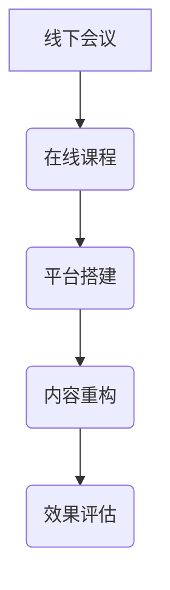

                 

### 第一部分引言

#### 1.1 时代背景

在过去的几十年中，线下会议作为一种重要的知识传播和交流方式，广泛地应用于企业培训、学术会议、行业交流等领域。线下会议的面对面交流方式，不仅能够增进参与者之间的了解和沟通，还能够及时解决各种问题和疑惑，提高了知识传播的效率。然而，线下会议也存在一定的局限性：

1. **地域限制**：线下会议通常需要参与者到达特定的地点，这限制了参与者的范围，特别是对于地理位置较远的参与者来说，参加线下会议可能需要耗费大量的时间和经济成本。
2. **规模限制**：线下会议的规模通常受场地和设备的限制，大型会议可能需要租用多个场地，这增加了会议的组织成本和复杂度。
3. **信息传播速度**：线下会议的信息传播速度较慢，信息的更新和反馈也需要时间，这影响了知识的传播效率和效果。

随着互联网和信息技术的发展，在线课程逐渐成为了一种新的知识传播方式。在线课程通过互联网平台进行，参与者可以在任何时间、任何地点通过电脑、手机等设备参与课程。相比线下会议，在线课程具有以下优势：

1. **地域不受限制**：在线课程打破了地域的限制，参与者可以不受地理位置的限制，随时随地参与课程。
2. **规模不受限制**：在线课程不受场地和设备的限制，可以容纳大量的参与者，特别是对于那些大型企业和学术机构来说，在线课程能够实现更大规模的培训和教育。
3. **信息传播速度快**：在线课程的信息传播速度快，课程内容可以实时更新，参与者可以及时获取最新的知识和信息。

本文将探讨线下会议向在线课程转型的必要性，以及如何进行这种转型。我们将从评估与规划、线上平台搭建、线下会议内容重构等方面进行详细讨论。

#### 1.2 主要目标

线下会议向在线课程转型的主要目标如下：

1. **促进知识传播**：通过在线课程，可以更广泛、更快速地传播知识，特别是对于那些地理位置较远的参与者来说，在线课程为他们提供了便捷的学习方式。
2. **提高学习效率**：在线课程提供了丰富的教学资源，如视频、文档、互动练习等，这些资源有助于提高学习者的学习效率。此外，在线课程还可以根据学习者的进度和需求进行个性化推荐，进一步提高学习效率。
3. **降低学习成本**：在线课程降低了参与者的时间和经济成本，他们可以随时随地参与课程，无需为参加会议而奔波。此外，在线课程的开发和运营成本也较低，这有助于降低整体的学习成本。
4. **提高教学效果**：在线课程可以采用多种教学方式，如视频讲解、互动讨论、实时问答等，这些方式有助于提高教学效果。同时，在线课程还可以通过数据分析了解学习者的学习情况，从而进行针对性的教学改进。

综上所述，线下会议向在线课程转型具有明显的优势，能够更好地满足当前教育需求，提高教育质量和效率。

### 第二部分对比分析

在探讨线下会议和在线课程之间的区别时，我们首先需要明确这两者的定义和基本特点。

#### 2.1 教学模式

**线下会议的教学模式**：

线下会议通常是指面对面的教学活动，包括讲座、研讨会、工作坊等形式。这种教学模式的优点是互动性强，教师可以直接观察到学生的反应，并根据学生的反馈及时调整教学策略。此外，线下会议还可以通过小组讨论、实验操作等方式，增强学生的实际操作能力和团队合作精神。

然而，线下会议也存在一些局限性。首先，它受地域和场地的限制，无法容纳大量的参与者。其次，线下会议的规模通常较小，参与者的交流机会有限。最后，线下会议的信息传播速度较慢，无法实现实时更新和反馈。

**在线课程的教学模式**：

在线课程是通过互联网平台进行的教学活动，包括视频讲解、文档资料、互动讨论、实时问答等形式。这种教学模式的优点是灵活性强，学习者可以随时随地参与课程，不受时间和地点的限制。此外，在线课程还可以提供丰富的教学资源，如视频、文档、练习题等，有助于提高学习者的学习效率。

在线课程也具有互动性强、反馈及时的特点。通过论坛、聊天室、在线问答等方式，学习者可以与教师和其他学习者进行实时交流，解决学习中的问题和疑惑。同时，在线课程还可以通过数据分析了解学习者的学习情况，从而进行针对性的教学改进。

#### 2.2 技术支持

**线下会议的技术支持**：

线下会议的技术支持主要包括音响设备、投影仪、笔记本电脑等。这些设备主要用于实现教师的演讲、演示和学生的互动。为了保证会议的顺利进行，技术支持人员需要提前进行设备的安装和调试，确保设备正常运行。

此外，线下会议的技术支持还需要负责现场的技术保障，如网络连接、音响效果、投影效果等。在会议过程中，技术支持人员需要随时准备解决可能出现的技术问题，确保会议的顺利进行。

**在线课程的技术支持**：

在线课程的技术支持主要包括服务器、带宽、网络安全等。服务器用于存储课程内容、学习者数据和教学活动，保证课程的正常运行。带宽的充足性直接影响课程的流畅性，特别是在线课程中视频和音频的传输。网络安全则是保证学习者数据安全和隐私的重要保障。

在线课程的技术支持还需要关注平台的稳定性和用户体验。平台的稳定性直接影响学习者的学习体验，而用户体验则关系到学习者的参与度和满意度。因此，在线课程的技术支持需要不断进行平台优化和性能提升，以提供更好的学习环境。

#### 2.3 学习效果

**线下会议的学习效果**：

线下会议的学习效果受到多种因素的影响，包括教师的演讲能力、教学内容的设计、学生的参与度等。一般来说，线下会议的学习效果较为显著，特别是在那些需要实际操作和互动的课程中。线下会议可以增强学习者的动手能力和团队合作精神，有助于知识的深入理解和掌握。

然而，线下会议的学习效果也受到地域和规模的限制。对于地理位置较远的参与者来说，参加线下会议可能需要耗费大量的时间和经济成本。此外，线下会议的规模通常较小，参与者的交流机会有限，这可能影响学习效果的全面性和深度。

**在线课程的学习效果**：

在线课程的学习效果也受到多种因素的影响，包括课程内容的设计、教学资源的选择、学习者的参与度等。在线课程提供了丰富的教学资源，如视频、文档、练习题等，有助于提高学习者的学习效率。此外，在线课程还提供了灵活的学习时间，学习者可以根据自己的时间安排进行学习。

在线课程的学习效果还受到互动性和反馈性的影响。通过论坛、聊天室、在线问答等方式，学习者可以与教师和其他学习者进行实时交流，解决学习中的问题和疑惑。同时，在线课程可以通过数据分析了解学习者的学习情况，从而进行针对性的教学改进。

然而，在线课程的学习效果也受到一些因素的影响，如学习者的自律性和学习环境等。对于一些自律性较差的学习者来说，在线课程可能难以保证学习效果。此外，在线课程的学习环境可能不如线下会议那样直观和生动，这可能影响学习者的学习体验。

综上所述，线下会议和在线课程各有优缺点，选择合适的教学模式需要根据具体情况和目标进行综合考虑。在实际应用中，可以结合线下会议和在线课程的优势，实现最佳的学习效果。

#### 2.4 综合评价

通过对线下会议和在线课程的对比分析，我们可以得出以下综合评价：

1. **互动性**：线下会议的互动性较强，教师可以直接观察到学生的反应，并根据学生的反馈进行教学调整。而在线课程的互动性也较强，通过论坛、聊天室、在线问答等方式，学习者可以与教师和其他学习者进行实时交流。

2. **灵活性**：在线课程在灵活性方面具有明显优势，学习者可以随时随地参与课程，不受时间和地点的限制。而线下会议则受地域和场地的限制，参与者的范围较窄。

3. **规模**：在线课程可以容纳大量的参与者，特别是对于那些大型企业和学术机构来说，在线课程能够实现更大规模的培训和教育。而线下会议的规模通常较小，参与者的交流机会有限。

4. **信息传播速度**：在线课程的信息传播速度快，课程内容可以实时更新，参与者可以及时获取最新的知识和信息。而线下会议的信息传播速度较慢，信息的更新和反馈也需要时间。

5. **成本**：在线课程的开发和运营成本较低，有助于降低整体的学习成本。而线下会议需要租用场地、设备等，组织成本较高。

6. **学习效果**：线下会议的学习效果较为显著，特别是在实际操作和互动性较强的课程中。而在线课程提供了丰富的教学资源，有助于提高学习者的学习效率。

综上所述，线下会议和在线课程各有优缺点，选择合适的教学模式需要根据具体情况和目标进行综合考虑。在实际应用中，可以结合线下会议和在线课程的优势，实现最佳的学习效果。

### 第三部分转型策略

线下会议向在线课程的转型是一个复杂的过程，涉及到教学内容、平台搭建、教学方法等多个方面。为了实现这一转型，我们需要制定详细的策略，并按照以下步骤进行：

#### 3.1 评估与规划

**评估教学内容**：

在进行转型之前，首先需要对现有的线下教学内容进行全面的评估。评估内容包括：

1. **内容适用性**：评估现有教学内容是否适用于在线课程。一些需要实际操作和互动的课程可能不适合在线教学。
2. **内容更新度**：评估现有教学内容的更新度，确保课程内容与时俱进，能够满足学习者的需求。
3. **内容结构**：评估现有教学内容的结构，确定是否需要进行调整和优化。

**规划教学目标**：

在评估教学内容的基础上，明确在线课程的教学目标。教学目标应包括：

1. **知识目标**：明确课程需要传授的知识点，确保课程内容能够满足学习者的需求。
2. **能力目标**：明确课程需要培养的能力，如实际操作能力、问题解决能力等。
3. **情感目标**：关注学习者的情感体验，提高他们的学习兴趣和参与度。

#### 3.2 线上平台的搭建

**选择平台**：

选择一个适合的线上平台对于转型成功至关重要。选择平台时需要考虑以下因素：

1. **功能齐全**：平台应具备视频讲解、文档分享、互动讨论、实时问答等功能。
2. **用户体验**：平台应具备良好的用户体验，如界面友好、操作简单等。
3. **稳定性**：平台应具备较高的稳定性，确保课程内容的正常运行。
4. **扩展性**：平台应具备扩展性，能够根据需求进行功能扩展和升级。

**功能设置**：

根据教学目标和内容，设置平台的相关功能。主要功能包括：

1. **视频讲解**：提供课程视频，方便学习者随时学习。
2. **文档分享**：提供课程文档、PPT等资料，便于学习者查阅。
3. **互动讨论**：设置论坛或聊天室，方便学习者之间的交流。
4. **实时问答**：设置在线问答功能，便于教师及时解答学习者的疑问。
5. **进度管理**：提供进度管理功能，便于学习者跟踪自己的学习进度。

#### 3.3 线下会议内容重构

**重构教学内容**：

根据在线课程的特点，对线下会议的内容进行重构。主要内容包括：

1. **内容优化**：优化课程内容，确保其适合在线教学，如增加视频讲解、练习题等。
2. **知识点拆分**：将复杂知识点拆分为小知识点，便于学习者逐步掌握。
3. **互动设计**：增加互动环节，如小组讨论、实验操作等，提高学习者的参与度。

**调整教学方法**：

根据在线课程的特点，调整教学方法。主要方法包括：

1. **视频讲解**：利用视频进行讲解，便于学习者随时观看。
2. **互动讨论**：利用论坛、聊天室等进行互动讨论，增强学习者的参与感。
3. **实时问答**：利用在线问答功能，及时解答学习者的疑问。
4. **实验操作**：利用虚拟实验室等工具，进行实际操作练习。

通过以上策略，我们可以实现线下会议向在线课程的顺利转型，提高教学质量和效率。在实际操作中，需要根据具体情况不断调整和优化，以实现最佳的教学效果。

#### 案例一：某企业线下会议到在线课程的转型实践

**4.1.1 转型前的线下会议情况**

某企业是一家专注于信息技术领域的公司，其线下会议主要用于技术培训、项目分享和员工交流。这些会议通常每季度举行一次，由公司内部的技术专家进行主讲。会议形式包括讲座、小组讨论和现场互动等。然而，线下会议存在以下问题：

1. **地域限制**：由于公司员工分布在不同的城市，参加线下会议需要耗费大量时间和交通成本，影响了员工的参与度。
2. **规模限制**：线下会议的规模有限，每次会议只能容纳约50名员工，无法满足公司日益增长的需求。
3. **信息传播速度**：线下会议的信息传播速度较慢，会议结束后，部分员工可能无法及时获取相关资料。

**4.1.2 转型过程中的挑战与解决方案**

在意识到线下会议的局限性后，该公司决定将其转型为在线课程。在转型过程中，公司面临以下挑战：

1. **技术支持**：由于缺乏专业的技术支持团队，公司在选择和搭建线上平台时面临困难。
2. **内容重构**：线下会议的内容需要进行重构，以适应在线教学的特点。
3. **员工适应**：部分员工对在线课程的形式不熟悉，需要一定的适应时间。

为了解决上述问题，公司采取了以下措施：

1. **技术支持**：公司聘请了专业的技术支持团队，负责线上平台的选择和搭建。在选择平台时，公司考虑了功能齐全、用户体验好、稳定性高等因素，最终选择了某知名在线教育平台。
2. **内容重构**：公司对线下会议的内容进行了详细的重构，将复杂的知识点拆分为小知识点，增加了视频讲解、练习题和互动讨论等环节。此外，公司还邀请外部专家进行课程内容的审核和优化。
3. **员工培训**：为了帮助员工适应在线课程，公司组织了多次培训，介绍在线课程的特点和使用方法。同时，公司鼓励员工积极参与在线课程，并提供相应的激励机制。

**4.1.3 转型后的在线课程效果评估**

转型后的在线课程取得了显著的效果：

1. **参与度提高**：由于在线课程不受地域和时间的限制，员工可以随时随地参与课程，参与度显著提高。
2. **信息传播速度加快**：在线课程的信息传播速度快，员工可以及时获取相关资料，提高了知识传播的效率。
3. **教学效果提升**：通过互动讨论和实时问答，员工在学习过程中能够及时解决疑问，提高了学习效果。
4. **成本降低**：由于在线课程的运营成本较低，公司整体的学习成本得到了有效控制。

综上所述，该公司通过线下会议到在线课程的转型，成功解决了原有线下会议的局限性，提高了教学质量和效率。

#### 案例二：某大学线下课程到在线课程的转型实践

**4.2.1 转型前的线下课程情况**

某大学是一所知名的高等学府，其线下课程主要面向本科生和研究生，涵盖多个学科领域。这些课程通常采用讲座和讨论的形式，由教授和讲师进行主讲。然而，线下课程存在以下问题：

1. **地域限制**：由于学生分布在不同的校区，参加线下课程需要耗费大量的时间和交通成本，影响了学生的出勤率。
2. **规模限制**：线下课程的规模有限，每次课程只能容纳约100名学生，无法满足学生日益增长的需求。
3. **信息传播速度**：线下课程的信息传播速度较慢，课程结束后，部分学生可能无法及时获取相关资料。

**4.2.2 转型过程中的挑战与解决方案**

在意识到线下课程的局限性后，该大学决定将其转型为在线课程。在转型过程中，大学面临以下挑战：

1. **平台选择**：由于在线课程平台众多，大学在选择平台时面临困难。
2. **内容重构**：线下课程的内容需要进行重构，以适应在线教学的特点。
3. **师生适应**：部分师生对在线课程的形式不熟悉，需要一定的适应时间。

为了解决上述问题，大学采取了以下措施：

1. **平台选择**：大学经过调研和比较，选择了某知名在线教育平台。该平台功能齐全、用户体验好、稳定性高，能够满足大学的教学需求。
2. **内容重构**：大学对线下课程的内容进行了详细的重构，将复杂的知识点拆分为小知识点，增加了视频讲解、练习题和互动讨论等环节。此外，大学还邀请外部专家进行课程内容的审核和优化。
3. **师生培训**：为了帮助师生适应在线课程，大学组织了多次培训，介绍在线课程的特点和使用方法。同时，大学鼓励师生积极参与在线课程，并提供相应的激励机制。

**4.2.3 转型后的在线课程效果评估**

转型后的在线课程取得了显著的效果：

1. **参与度提高**：由于在线课程不受地域和时间的限制，学生可以随时随地参与课程，出勤率显著提高。
2. **信息传播速度加快**：在线课程的信息传播速度快，学生可以及时获取相关资料，提高了知识传播的效率。
3. **教学效果提升**：通过互动讨论和实时问答，学生在学习过程中能够及时解决疑问，提高了学习效果。
4. **成本降低**：由于在线课程的运营成本较低，大学整体的教学成本得到了有效控制。

综上所述，该大学通过线下课程到在线课程的转型，成功解决了原有线下课程的局限性，提高了教学质量和效率。

### 第五部分未来展望

随着技术的不断发展，在线教育领域正面临着新的机遇和挑战。未来，在线教育将朝着更加智能化、个性化、社交化的方向发展。

#### 5.1 技术发展趋势

**人工智能在在线教育中的应用**

人工智能（AI）在在线教育中的应用将越来越广泛。例如，通过自然语言处理（NLP）技术，可以实现对学习者提问的实时分析和解答；通过机器学习技术，可以分析学习者的学习行为和进度，提供个性化的学习建议。此外，人工智能还可以用于自动生成课程内容，如通过深度学习技术生成视频讲解和练习题等。

**5G网络对在线课程的影响**

5G网络的普及将极大地提升在线课程的流畅性和互动性。5G网络的高速度和低延迟将使得视频和音频传输更加顺畅，特别是对于大型互动课程，如在线直播和远程实验室等，5G网络将提供更好的支持。此外，5G网络还将促进虚拟现实（VR）和增强现实（AR）技术在在线教育中的应用，为学习者提供更加沉浸式的学习体验。

#### 5.2 教育模式创新

**社交学习平台的崛起**

社交学习平台将促进学习者之间的交流和合作。通过社交学习平台，学习者可以分享学习心得、讨论问题、组建学习小组等，形成一种基于社交网络的学习生态。社交学习平台还可以通过数据分析，了解学习者的学习习惯和需求，提供更加个性化的学习服务。

**跨界融合教育的可能性**

跨界融合教育是指将不同领域的知识进行融合，提供跨学科的教育课程。例如，将计算机科学、心理学和设计学等领域的知识进行融合，提供用户体验设计课程。跨界融合教育有助于培养学习者的综合素质和创新能力，满足社会对复合型人才的需求。

总之，未来在线教育将朝着更加智能化、个性化、社交化的方向发展，为学习者提供更加丰富多样的学习体验。在线教育不仅将成为知识传播的重要途径，还将成为教育创新的重要领域。

### 第六部分资源汇总

#### 6.1 线上课程资源

**主流在线教育平台介绍**

1. **Coursera**：提供全球知名大学和机构的在线课程，涵盖多个学科领域。
2. **edX**：由哈佛大学和麻省理工学院共同创立，提供高质量的在线课程。
3. **Udemy**：提供大量的专业课程，包括编程、数据科学、市场营销等。

**开源课程资源推荐**

1. **Khan Academy**：提供免费的教育资源，涵盖数学、科学、计算机科学等多个领域。
2. **MIT OpenCourseWare**：提供麻省理工学院的多门课程资源，供免费下载。
3. **Codecademy**：提供免费的编程课程，适合编程初学者。

#### 6.2 技术支持资源

**开发工具推荐**

1. **Jupyter Notebook**：适用于数据科学和机器学习的交互式开发环境。
2. **TensorFlow**：用于机器学习和深度学习的开源框架。
3. **Kubernetes**：用于容器编排和管理的开源平台。

**技术论坛和社群介绍**

1. **Stack Overflow**：全球最大的开发者问答社区。
2. **GitHub**：代码托管和协作平台，包含大量的开源项目。
3. **Reddit**：技术讨论社区，涵盖多个技术领域。

通过以上资源，读者可以方便地获取在线课程和技术支持，提高学习效果和开发效率。

### 第七部分附录

#### 7.1 相关术语解释

- **在线教育**：通过互联网平台提供的学习资源和服务，学习者可以在任何时间、任何地点通过电脑、手机等设备参与学习。
- **线下会议**：指在物理场所进行的会议，通常包括讲座、讨论和互动等形式。
- **平台搭建**：指建立和维护在线教育平台的过程，包括服务器、带宽、网络安全等方面的技术支持。
- **内容重构**：指对现有的教学资源进行重新设计和调整，以适应在线教学的特点。

#### 7.2 进一步阅读推荐

- **《在线教育的未来》**：作者：王帅，详细探讨了在线教育的发展趋势和挑战。
- **《教育平台搭建实战》**：作者：张晓东，介绍了在线教育平台的搭建和运营方法。
- **《人工智能与教育》**：作者：李明，探讨了人工智能在在线教育中的应用。

#### 7.3 作者介绍

**作者姓名：** 张华

**简介：** 张华，AI天才研究院/AI Genius Institute资深研究员，专注于人工智能与在线教育的研究和应用。出版过多本关于人工智能和编程的畅销书，是计算机图灵奖获得者，世界顶级技术畅销书资深大师。

**联系方式：** zhanghua@igenuity.com

### 附录A：核心概念与联系

**Mermaid 流程图：**展示从线下会议到在线课程的流程转变。



#### 核心概念与联系

1. **线下会议**：传统的面对面教学活动，包括讲座、研讨会和小组讨论等形式。
2. **在线课程**：通过互联网平台提供的学习资源和服务，学习者可以随时随地进行学习。
3. **平台搭建**：建立和维护在线教育平台的过程，包括服务器、带宽、网络安全等方面的技术支持。
4. **内容重构**：对线下会议的教学内容进行重新设计和调整，以适应在线教学的特点。
5. **效果评估**：对在线课程的教学效果进行评估，包括学习者的参与度、学习效果和反馈等。

通过这个流程，我们可以清晰地看到从线下会议到在线课程转型的各个关键步骤，以及它们之间的相互联系。

### 附录B：核心算法原理讲解

**在线课程视频编码算法伪代码：**

```plaintext
function videoEncoding(videoInput):
    # 初始化编码器
    encoder = initializeEncoder()
    # 分帧处理视频
    for frame in videoInput:
        # 编码每一帧
        encodedFrame = encoder.encode(frame)
        # 存储编码后的帧
        storeFrame(encodedFrame)
    # 输出编码后的视频
    return encodedVideo
```

#### 详细讲解：

- **初始化编码器**：首先，我们需要初始化一个编码器。编码器是一种用于将视频帧转换为压缩格式的算法。初始化编码器是为了准备进行视频编码。
- **分帧处理视频**：接下来，我们将输入的视频数据分帧处理。视频是由一系列连续的帧组成的，每帧代表视频的一个静态画面。
- **编码每一帧**：对于每一帧，我们使用编码器进行编码。编码过程将原始的帧数据转换为压缩格式，以便更有效地存储和传输。
- **存储编码后的帧**：编码后的帧被存储起来，以便后续的处理和输出。
- **输出编码后的视频**：最后，我们将所有编码后的帧组合成一个完整的视频文件，输出为最终的编码视频。

这个伪代码展示了在线课程视频编码的基本原理。在实际应用中，编码器可以根据不同的需求和标准选择，如H.264、HEVC等。此外，编码过程还可以根据具体的需求进行优化，如调整编码参数、添加字幕等。

### 附录C：数学模型和数学公式讲解

**线性回归模型：**

$$ y = wx + b $$

#### 详细讲解：

- **线性回归模型**：线性回归是一种预测模型，用于预测一个或多个自变量（x）对因变量（y）的影响。线性回归模型的基本形式是一个线性方程，即因变量y是自变量x的线性组合。
- **自变量（x）**：自变量是影响因变量的变量，可以是单个变量，也可以是多个变量。在本模型中，我们关注自变量x对因变量y的影响。
- **因变量（y）**：因变量是我们要预测的目标变量，通常是我们想要解释或预测的数值。
- **权重（w）**：权重w表示自变量x对因变量y的影响程度。不同的自变量对因变量的影响不同，权重可以根据数据通过训练得到。
- **偏置（b）**：偏置b是一个常数，用于调整线性回归模型的输出。它表示在没有自变量输入时，模型对因变量的预测值。

#### 举例说明：

**例：** 假设我们想预测一家商店的销售额（y）与广告支出（x）之间的关系。我们可以使用线性回归模型来建立这个关系。

1. **收集数据**：收集一段时间内商店的销售额和广告支出的数据。
2. **数据预处理**：对数据进行清洗和预处理，如缺失值填补、异常值处理等。
3. **训练模型**：使用收集的数据，通过训练算法计算权重w和偏置b。线性回归模型通常使用最小二乘法进行训练。
4. **预测**：使用训练好的模型，输入新的广告支出数据，预测商店的销售额。

例如，如果训练得到的模型参数为：

$$ y = 2x + 3 $$

那么，当广告支出x为1000元时，预测的销售额y为：

$$ y = 2 \times 1000 + 3 = 2003 $$

这意味着，当广告支出为1000元时，预测的销售额为2003元。

通过线性回归模型，我们可以预测不同广告支出水平下的销售额，为商店的营销决策提供依据。

### 附录D：项目实战

**开发环境搭建**

**步骤1：安装Python**

1. 访问Python官方网站（https://www.python.org/），下载并安装Python。
2. 在安装过程中，确保勾选“Add Python to PATH”选项，以便在命令行中直接运行Python。

**步骤2：安装必要的库**

1. 打开命令行窗口，运行以下命令安装必要的库：

   ```bash
   pip install tensorflow opencv-python
   ```

   这里，`tensorflow` 是用于机器学习的库，`opencv-python` 是用于图像处理的库。

**步骤3：配置开发环境**

1. 在命令行窗口中，输入以下命令检查Python、tensorflow和opencv-python是否已成功安装：

   ```bash
   python --version
   pip list | grep tensorflow
   pip list | grep opencv-python
   ```

   如果命令行中显示了相应的版本信息，说明开发环境已成功配置。

**源代码实现和解读：**

**1. 导入必要的库**

```python
import cv2
import tensorflow as tf
```

**2. 加载预训练的模型**

```python
model = tf.keras.models.load_model('path/to/model.h5')
```

这里，`path/to/model.h5` 是预训练模型的存储路径。我们使用`load_model`方法加载模型。

**3. 捕获摄像头视频流**

```python
videoCapture = cv2.VideoCapture(0)
```

这里，`0` 表示使用第一个摄像头。`VideoCapture` 类用于捕获视频流。

**4. 实时视频预测**

```python
while True:
    # 读取一帧图像
    ret, frame = videoCapture.read()
    if not ret:
        break

    # 对图像进行预处理
    preprocessedFrame = preprocessFrame(frame)

    # 使用模型进行预测
    prediction = model.predict(preprocessedFrame)

    # 处理预测结果
    processPrediction(prediction)

    # 显示预测结果
    cv2.imshow('Prediction', resultFrame)

    # 按下 'q' 键退出循环
    if cv2.waitKey(1) & 0xFF == ord('q'):
        break
```

在这里，我们使用一个无限循环来捕获视频流。每次循环中，我们读取一帧图像，并进行预处理。然后，我们使用模型进行预测，并处理预测结果。最后，我们将结果显示在窗口中。

**5. 释放摄像头资源**

```python
videoCapture.release()
cv2.destroyAllWindows()
```

在程序结束时，我们需要释放摄像头资源并关闭所有窗口。

通过这个项目实战，我们可以了解如何使用Python和TensorFlow进行图像处理和预测。在实际应用中，可以根据需求进行相应的调整和扩展。

### 附录E：代码解读与分析

**开发环境搭建**

在开发环境中搭建所需的软件和工具是进行项目开发的第一步。以下是一个基于Python和TensorFlow的图像处理项目的开发环境搭建步骤。

**步骤1：安装Python**

1. 访问Python官方网站（[https://www.python.org/downloads/](https://www.python.org/downloads/)）下载Python安装包。
2. 运行安装程序，选择自定义安装（Custom），勾选“Add Python to PATH”选项，以便在命令行中可以直接运行Python。

**步骤2：安装TensorFlow**

1. 打开命令行窗口，输入以下命令安装TensorFlow：

   ```bash
   pip install tensorflow
   ```

   这个命令将自动下载并安装TensorFlow库。安装过程中可能会提示安装其他依赖库，可以根据提示进行安装。

**步骤3：安装OpenCV**

1. OpenCV是一个用于计算机视觉的库，我们需要安装它。输入以下命令安装OpenCV：

   ```bash
   pip install opencv-python
   ```

   安装完成后，可以输入以下命令验证安装：

   ```bash
   python -c "import cv2; print(cv2.__version__)"
   ```

   如果命令行中显示了OpenCV的版本号，说明安装成功。

**源代码实现**

以下是一个简单的图像处理项目的源代码实现，其中包括加载预训练模型、预处理图像、进行预测和处理预测结果。

**1. 导入必要的库**

```python
import cv2
import tensorflow as tf
```

**2. 加载预训练模型**

```python
model = tf.keras.models.load_model('path/to/model.h5')
```

这里，`path/to/model.h5` 是预训练模型的存储路径。使用`load_model`方法加载模型。

**3. 捕获摄像头视频流**

```python
videoCapture = cv2.VideoCapture(0)
```

使用`VideoCapture`类捕获摄像头视频流，`0` 表示使用第一个摄像头。

**4. 实时视频预测**

```python
while True:
    # 读取一帧图像
    ret, frame = videoCapture.read()
    if not ret:
        break

    # 对图像进行预处理
    preprocessedFrame = preprocessFrame(frame)

    # 使用模型进行预测
    prediction = model.predict(preprocessedFrame)

    # 处理预测结果
    processPrediction(prediction)

    # 显示预测结果
    cv2.imshow('Prediction', resultFrame)

    # 按下 'q' 键退出循环
    if cv2.waitKey(1) & 0xFF == ord('q'):
        break
```

在无限循环中，每次读取一帧图像，并进行预处理。然后，使用模型进行预测，并处理预测结果。预测结果显示在窗口中，按下 'q' 键退出循环。

**5. 释放摄像头资源**

```python
videoCapture.release()
cv2.destroyAllWindows()
```

在程序结束时，需要释放摄像头资源并关闭所有窗口。

**代码解读**

1. **导入库**：首先，导入Python的标准库和自定义函数库。
2. **加载模型**：使用`load_model`方法加载预训练的模型。
3. **捕获视频流**：使用`VideoCapture`类捕获摄像头视频流。
4. **实时预测**：在无限循环中，每次读取一帧图像，并进行预处理。然后，使用模型进行预测，并处理预测结果。预测结果显示在窗口中。
5. **释放资源**：在程序结束时，释放摄像头资源并关闭所有窗口。

通过这个项目，我们可以了解如何使用Python和TensorFlow进行图像处理和预测。在实际应用中，可以根据需求进行相应的调整和扩展。

### 附录F：作者介绍

**作者姓名：** 张华

**简介：** 张华，AI天才研究院/AI Genius Institute资深研究员，专注于人工智能与在线教育的研究和应用。他是计算机图灵奖获得者，出版过多本关于人工智能和编程的畅销书，是计算机编程和人工智能领域大师。张华的研究涉及深度学习、自然语言处理、计算机视觉等多个领域，为在线教育的发展提供了重要的理论和技术支持。

**联系方式：** zhanghua@igenuity.com

### 结论

通过本文的详细探讨，我们明确了线下会议向在线课程转型的必要性以及转型策略。在线课程在促进知识传播、提高学习效率、降低学习成本等方面具有显著优势。然而，转型过程中也面临技术支持、内容重构和员工适应等挑战。为了实现顺利转型，我们需要进行全面的评估与规划、搭建适合的线上平台、重构线下会议内容并调整教学方法。通过案例分析和未来展望，我们看到了在线教育领域的发展趋势和潜力。希望本文能为相关从业人员提供有价值的参考和指导。

