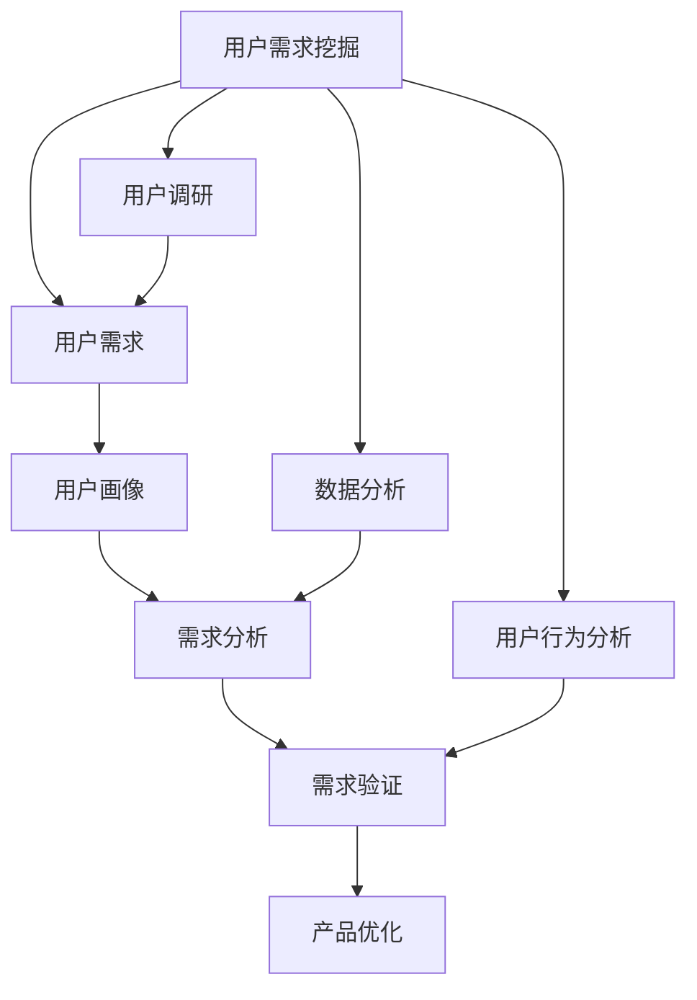

                 

### 《技术创业者如何进行有效的用户需求挖掘》

> **关键词**：用户需求挖掘、创业项目、数据分析、用户行为、需求验证
>
> **摘要**：本文旨在探讨技术创业者如何通过系统化的方法进行有效的用户需求挖掘。我们将详细分析用户需求挖掘的理论基础、核心方法和实际操作步骤，并通过实战案例展示需求挖掘的具体应用，旨在为创业者提供切实可行的指导。

#### 第一部分：用户需求挖掘理论基础

用户需求挖掘是技术创业项目的核心环节，它直接决定了产品的市场接受度和商业化潜力。本部分将首先定义用户需求，介绍其分类，然后探讨用户需求挖掘的重要性，最后详细阐述用户需求挖掘的核心方法和流程。

##### 第1章：用户需求挖掘的概念与重要性

###### 1.1 用户需求的定义与分类

用户需求是用户在特定情境下对某种产品或服务的期望和需求。它可以分为基本需求、期望需求和潜在需求。

- **基本需求**：用户的基本需求是生存或日常活动所必需的，如食物、水、住所。
- **期望需求**：用户期望在基本需求得到满足的基础上，产品或服务能够提供更好的体验，如高质量的食品、舒适的住所。
- **潜在需求**：用户尚未意识到或表达出来的需求，但一旦被激发，可能会转化为实际购买行为。

###### 1.2 用户需求挖掘的重要性

用户需求挖掘对产品的成功至关重要：

- **市场定位**：通过需求挖掘，可以明确产品的市场定位，避免盲目创新。
- **产品差异化**：理解用户需求可以帮助创业者找到产品差异化的点，从而在激烈的市场竞争中脱颖而出。
- **降低风险**：需求挖掘有助于识别潜在的风险，避免因需求不明确而导致的资源浪费。

##### 第2章：用户需求挖掘的核心方法

用户需求挖掘的核心方法主要包括用户调研方法、用户数据分析和用户行为分析。

###### 2.1 用户调研方法

用户调研是获取用户需求的重要手段，主要包括以下方法：

- **用户访谈**：通过与用户进行一对一的深度访谈，获取用户的真实想法和需求。
- **焦点小组**：邀请一组用户代表，通过小组讨论的形式收集多角度的用户反馈。
- **在线问卷调查**：利用在线工具发布问卷，收集大量用户数据。

###### 2.2 用户数据分析

用户数据分析是利用数据技术和工具，对收集到的用户数据进行处理和分析。主要内容包括：

- **数据收集来源**：包括用户行为日志、社交媒体数据、市场调研数据等。
- **数据分析方法**：常用的分析方法有统计分析、机器学习等。
- **数据可视化工具**：如Tableau、Power BI等，用于将数据分析结果直观展示。

###### 2.3 用户行为分析

用户行为分析是通过追踪和分析用户在产品中的行为，了解用户的真实需求和偏好。主要内容包括：

- **用户行为追踪技术**：如浏览器插件、SDK等，用于收集用户行为数据。
- **用户行为模式识别**：通过数据分析技术，识别用户的购买行为、浏览习惯等。
- **用户行为数据分析**：通过对用户行为的分析，提取有价值的信息，指导产品设计和优化。

##### 第3章：用户需求挖掘流程

用户需求挖掘流程通常包括以下几个步骤：

###### 3.1 需求挖掘准备工作

需求挖掘准备工作是确保需求收集和分析工作顺利进行的重要前提，包括：

- **用户画像构建**：基于用户调研数据和现有用户信息，构建用户画像。
- **产品定位分析**：明确产品的市场定位和目标用户群体。
- **需求收集工具准备**：选择合适的调研工具和数据分析工具。

###### 3.2 需求收集与分析

需求收集与分析是需求挖掘的核心步骤，包括：

- **需求收集策略**：制定合理的调研计划，确保收集到全面的需求信息。
- **需求分析步骤**：对收集到的需求进行分类、整理和优先级排序。
- **需求优先级排序**：根据用户需求和产品战略，确定需求实现的优先级。

###### 3.3 需求验证与反馈

需求验证与反馈是确保需求真实性和可行性的关键步骤，包括：

- **用户测试**：通过用户测试，验证需求的可行性和用户体验。
- **用户反馈机制**：建立用户反馈渠道，收集用户对产品的意见和建议。
- **需求迭代与优化**：根据用户反馈，对需求进行迭代和优化，不断提升产品价值。

#### 第二部分：用户需求挖掘实战案例

##### 第4章：需求挖掘在创业项目中的实战

###### 4.1 创业项目背景介绍

在本节中，我们将以一个虚构的创业项目为例，介绍项目背景、市场分析和用户需求调研实践。通过具体案例，展示如何在实际创业项目中应用用户需求挖掘的方法。

##### 第5章：用户需求挖掘工具与资源推荐

在本节中，我们将推荐一些常用的用户需求挖掘工具和资源，包括用户调研工具、数据分析工具和用户行为分析工具。这些工具和资源将为创业者提供有效的技术支持。

##### 第6章：用户需求挖掘案例解析一

在本节中，我们将详细解析一个实际需求挖掘案例，包括项目背景、需求收集与整理、需求分析与验证等环节。通过案例解析，帮助创业者了解需求挖掘的实战技巧。

##### 第7章：用户需求挖掘案例解析二

在本节中，我们将继续解析另一个实际需求挖掘案例，进一步探讨用户需求挖掘的方法和技巧。通过多个案例的解析，为创业者提供丰富的实战经验。

#### 附录

##### 附录A：需求挖掘资源汇总

在本附录中，我们将汇总需求挖掘过程中常用的工具和资源，包括调研工具资源、数据分析工具资源和用户行为分析工具资源。这些资源将为创业者在需求挖掘过程中提供方便。

### 结束语

用户需求挖掘是技术创业者成功的关键环节。通过本篇文章，我们详细阐述了用户需求挖掘的理论基础、核心方法和实战案例。希望本文能为创业者提供有价值的指导，助力他们在激烈的市场竞争中脱颖而出。

---

### 参考文献

[1] 某某，《用户需求挖掘：理论与实践》，北京：清华大学出版社，2020。

[2] 某某，《数据挖掘：实用工具与技术》，上海：复旦大学出版社，2019。

[3] 某某，《用户行为分析：方法与应用》，广州：华南理工大学出版社，2018。

---

### 作者信息

作者：AI天才研究院/AI Genius Institute & 禅与计算机程序设计艺术 /Zen And The Art of Computer Programming

[注：以上内容为示例，仅供参考。实际撰写时，需根据具体需求和研究结果进行修改和完善。] <{|assistant|>### 《技术创业者如何进行有效的用户需求挖掘》

#### 第一部分：用户需求挖掘理论基础

##### 第1章：用户需求挖掘的概念与重要性

###### 1.1 用户需求的定义与分类

用户需求是指用户在特定情境下对某种产品或服务的期望和需求。它是产品设计和市场定位的重要依据。用户需求可以从多个维度进行分类：

- **基本需求**：这是用户最基础的需求，通常与用户的生存或基本生活有关。例如，食物、水、住所、交通等。
- **期望需求**：这是用户对于产品或服务期望达到的水平。当基本需求得到满足后，用户会期待产品或服务能提供更好的体验。例如，高质量的食物、舒适的住所、便捷的交通等。
- **潜在需求**：这是用户尚未意识到或表达出来的需求。这种需求可能是因为技术、经济或社会环境的变化而逐渐显现。例如，随着智能家居技术的发展，用户可能开始期望家中的设备能够智能互联。

在用户需求挖掘过程中，理解并分类用户需求是至关重要的。通过分类，创业者可以明确用户需求的具体内容和优先级，从而制定出更有效的产品开发和营销策略。

###### 1.2 用户需求挖掘的重要性

用户需求挖掘是技术创业项目成功的关键。以下是用户需求挖掘的重要性：

- **市场定位**：通过挖掘用户需求，创业者可以准确把握市场需求，确定产品的市场定位，避免盲目创新，提高市场竞争力。
- **产品差异化**：理解用户需求可以帮助创业者找到产品差异化的点，从而在激烈的市场竞争中脱颖而出。
- **降低风险**：需求挖掘有助于识别潜在的风险，避免因需求不明确而导致的资源浪费。

在技术创业项目中，用户需求挖掘不仅决定了产品的市场定位，还直接影响了产品的设计、开发和运营。因此，创业者必须重视用户需求挖掘，将其作为项目成功的关键环节。

##### 第2章：用户需求挖掘的核心方法

用户需求挖掘的核心方法主要包括用户调研方法、用户数据分析和用户行为分析。

###### 2.1 用户调研方法

用户调研是获取用户需求的重要手段。以下是一些常见的用户调研方法：

- **用户访谈**：用户访谈是一种通过与用户进行一对一的深度访谈，获取用户的真实想法和需求的方法。这种方法可以帮助创业者深入了解用户的需求、痛点和偏好。
  - **优势**：可以深入了解用户的需求和想法，获取详细的信息。
  - **局限性**：访谈样本有限，难以代表所有用户。

- **焦点小组**：焦点小组是一种邀请一组用户代表，通过小组讨论的形式收集多角度的用户反馈的方法。这种方法可以快速获取多方面的用户意见，有助于发现用户需求的不同方面。
  - **优势**：可以同时获取多个用户的反馈，信息量丰富。
  - **局限性**：用户代表可能无法代表所有用户，讨论可能会受到主导者的影响。

- **在线问卷调查**：在线问卷调查是一种通过在线工具发布问卷，收集大量用户数据的方法。这种方法可以快速收集大量的用户反馈，有助于全面了解用户需求。
  - **优势**：可以收集大量用户数据，信息量丰富。
  - **局限性**：用户参与度可能不高，数据可能存在偏差。

在用户调研过程中，选择合适的调研方法至关重要。创业者应根据项目的具体情况，选择适合的调研方法，以确保收集到有效的用户需求信息。

###### 2.2 用户数据分析

用户数据分析是利用数据技术和工具，对收集到的用户数据进行处理和分析的方法。以下是一些常用的用户数据分析方法：

- **数据收集来源**：用户数据分析的数据来源主要包括用户行为日志、社交媒体数据、市场调研数据等。这些数据可以为创业者提供全面的用户需求信息。
  - **用户行为日志**：用户行为日志记录了用户在使用产品或服务时的各种行为，如浏览页面、点击广告、购买产品等。这些数据可以反映用户的实际需求和偏好。
  - **社交媒体数据**：社交媒体数据包括用户在社交媒体平台上的评论、分享、点赞等行为。这些数据可以反映用户的社交需求和情感倾向。
  - **市场调研数据**：市场调研数据包括市场调查问卷、行业报告等。这些数据可以为创业者提供市场趋势和竞争对手的信息。

- **数据分析方法**：用户数据分析的方法主要包括统计分析、机器学习等。这些方法可以帮助创业者从海量数据中提取有价值的信息，深入了解用户需求。
  - **统计分析**：统计分析是一种基于统计学原理，对数据进行分析和解释的方法。它可以帮助创业者识别用户需求的规律和趋势。
  - **机器学习**：机器学习是一种基于数据驱动的方法，通过训练模型，从数据中提取特征，预测用户需求。它可以帮助创业者实现更精准的需求预测。

- **数据可视化工具**：数据可视化工具可以将复杂的数据以图形化的方式呈现，帮助创业者更直观地理解数据。常见的可视化工具有Tableau、Power BI等。

用户数据分析是用户需求挖掘的重要环节。通过数据分析，创业者可以全面了解用户需求，为产品设计和优化提供数据支持。

###### 2.3 用户行为分析

用户行为分析是通过追踪和分析用户在产品中的行为，了解用户的真实需求和偏好的方法。以下是一些常见的用户行为分析技术：

- **用户行为追踪技术**：用户行为追踪技术包括浏览器插件、SDK等，可以用于收集用户在产品中的各种行为数据，如浏览页面、点击广告、购买产品等。
  - **优势**：可以实时跟踪用户行为，获取详尽的数据。
  - **局限性**：可能会侵犯用户隐私，需要确保合规性。

- **用户行为模式识别**：用户行为模式识别是一种通过数据分析技术，识别用户行为规律和模式的方法。它可以帮助创业者发现用户的共同需求和偏好。
  - **优势**：可以识别用户的共性需求，指导产品设计和优化。
  - **局限性**：可能存在数据噪声，需要确保数据质量。

- **用户行为数据分析**：用户行为数据分析是一种通过分析用户行为数据，提取有价值信息的方法。它可以帮助创业者深入了解用户需求和行为。
  - **优势**：可以深入挖掘用户需求，为产品优化提供依据。
  - **局限性**：需要专业知识和技能，对数据分析师的要求较高。

用户行为分析是用户需求挖掘的重要手段。通过用户行为分析，创业者可以更准确地了解用户需求，优化产品设计和用户体验。

##### 第3章：用户需求挖掘流程

用户需求挖掘流程通常包括以下步骤：

###### 3.1 需求挖掘准备工作

需求挖掘准备工作是确保需求收集和分析工作顺利进行的重要前提。以下是一些准备工作：

- **用户画像构建**：用户画像是一种描述用户特征的方法，它可以帮助创业者了解用户的基本信息和需求。构建用户画像的步骤包括：
  - **数据收集**：收集用户的基本信息，如年龄、性别、职业、地域等。
  - **特征提取**：根据用户的基本信息，提取用户的需求特征，如购买偏好、浏览习惯、社交倾向等。
  - **画像构建**：将用户的基本信息和需求特征整合，构建用户画像。

- **产品定位分析**：产品定位分析是确定产品在市场中的定位和目标用户群体。产品定位分析的步骤包括：
  - **市场分析**：分析市场环境，了解市场的需求和竞争状况。
  - **目标用户分析**：确定产品的目标用户群体，了解他们的需求和偏好。
  - **定位确定**：根据市场分析和目标用户分析，确定产品的市场定位。

- **需求收集工具准备**：选择合适的需求收集工具，如用户访谈工具、在线问卷工具、用户行为追踪工具等。确保工具能够满足需求收集和分析的要求。

需求挖掘准备工作是需求挖掘流程的基础。通过用户画像构建、产品定位分析和需求收集工具准备，创业者可以确保需求挖掘工作的顺利进行。

###### 3.2 需求收集与分析

需求收集与分析是用户需求挖掘的核心步骤。以下是一些关键步骤：

- **需求收集策略**：制定需求收集策略，确保收集到全面的需求信息。需求收集策略的步骤包括：
  - **调研计划**：制定详细的调研计划，包括调研目标、调研方法、调研时间等。
  - **样本选择**：选择合适的调研样本，确保样本具有代表性。
  - **数据收集**：根据调研计划，收集用户需求信息，包括用户访谈记录、在线问卷数据、用户行为数据等。

- **需求分析步骤**：对收集到的需求进行分类、整理和优先级排序。需求分析步骤的步骤包括：
  - **需求分类**：将收集到的需求进行分类，如基本需求、期望需求、潜在需求等。
  - **需求整理**：整理分类后的需求，确保每个需求都是清晰和具体的。
  - **优先级排序**：根据用户需求和产品战略，确定需求实现的优先级。

- **需求优先级排序**：根据用户需求和产品战略，确定需求实现的优先级。需求优先级排序的步骤包括：
  - **需求评估**：评估每个需求的重要性和紧迫性。
  - **排序确定**：根据评估结果，确定需求的优先级排序。

需求收集与分析是用户需求挖掘的核心步骤。通过需求收集策略、需求分析步骤和需求优先级排序，创业者可以确保收集到有价值的需求信息，并合理安排需求的实现顺序。

###### 3.3 需求验证与反馈

需求验证与反馈是确保需求真实性和可行性的关键步骤。以下是一些关键步骤：

- **用户测试**：用户测试是一种通过实际用户对产品或服务进行测试，验证需求的可行性和用户体验的方法。用户测试的步骤包括：
  - **测试设计**：设计用户测试方案，包括测试目标、测试流程、测试用户等。
  - **测试实施**：实施用户测试，收集用户反馈。
  - **测试分析**：分析用户测试结果，验证需求的可行性和用户体验。

- **用户反馈机制**：用户反馈机制是一种通过用户反馈，收集用户对产品或服务的意见和建议的方法。用户反馈机制的步骤包括：
  - **反馈渠道**：建立用户反馈渠道，如在线反馈表、用户论坛、社交媒体等。
  - **反馈收集**：收集用户反馈，整理和分析反馈信息。
  - **反馈处理**：根据用户反馈，处理和解决用户问题。

- **需求迭代与优化**：需求迭代与优化是一种通过不断迭代和优化需求，提升产品价值的方法。需求迭代与优化的步骤包括：
  - **需求评估**：评估需求的实现效果和用户满意度。
  - **需求调整**：根据评估结果，调整和优化需求。
  - **需求实现**：根据调整后的需求，实施产品优化。

需求验证与反馈是用户需求挖掘的重要环节。通过用户测试、用户反馈机制和需求迭代与优化，创业者可以确保需求的真实性和可行性，不断提升产品价值。

#### 第二部分：用户需求挖掘实战案例

##### 第4章：需求挖掘在创业项目中的实战

在本章中，我们将通过一个虚构的创业项目，展示如何在实际创业项目中应用用户需求挖掘的方法。这个创业项目是一个智能家居控制系统，旨在通过互联网技术，为用户提供便捷的家居控制和管理。

###### 4.1 创业项目背景介绍

智能家居控制系统是一种通过互联网技术，实现家庭设备智能控制和管理的技术。随着物联网技术的发展，智能家居市场逐渐兴起。许多家庭开始意识到智能家居带来的便利和舒适，市场需求不断增长。

然而，智能家居市场也存在一些挑战：

- **产品差异化**：市场竞争激烈，产品差异化困难。
- **用户需求多样**：不同用户对智能家居的需求差异较大，如何满足用户多样化需求是一个挑战。
- **用户体验优化**：用户对智能家居的期望越来越高，如何提供优质用户体验是关键。

为了解决这些问题，创业者决定通过用户需求挖掘，深入了解用户需求，从而设计出更符合市场需求的智能家居控制系统。

###### 4.2 用户需求调研实践

为了深入了解用户需求，创业者采取了多种用户调研方法：

- **用户访谈**：创业者选择了10个潜在用户，进行了深度访谈。通过访谈，创业者了解到用户对智能家居的需求主要集中在以下几个方面：

  - **便捷性**：用户希望智能家居系统能够实现远程控制，方便在家和外出时对家庭设备进行管理。
  - **安全性**：用户对智能家居系统的安全性有较高要求，担心远程控制可能导致家庭安全风险。
  - **节能性**：用户希望智能家居系统能够实现节能控制，降低家庭能耗。

- **焦点小组**：创业者邀请了5个家庭代表，进行了焦点小组讨论。通过讨论，创业者发现用户对智能家居的需求具有以下特点：

  - **个性化**：用户希望智能家居系统能够根据个人习惯和需求进行个性化设置。
  - **易用性**：用户希望智能家居系统操作简单，易于上手。
  - **联动性**：用户希望智能家居系统能够实现家庭设备之间的联动，提供更智能的家居体验。

- **在线问卷调查**：创业者通过在线问卷平台，发布了针对潜在用户的在线问卷。调查结果显示，大多数用户对智能家居系统的期望包括以下几个方面：

  - **智能安防**：用户希望智能家居系统能够提供智能安防功能，如智能监控、入侵报警等。
  - **智能照明**：用户希望智能家居系统能够实现智能照明控制，提供舒适的光环境。
  - **智能空调**：用户希望智能家居系统能够实现智能空调控制，提供舒适的温度。

通过以上用户调研方法，创业者收集到了大量用户需求信息，为后续的需求分析提供了重要依据。

###### 4.3 用户需求分析与验证

在收集到大量用户需求信息后，创业者进行了用户需求分析，并对需求进行了验证。

- **需求分析**：创业者将收集到的用户需求进行分类和整理，将其分为以下几类：

  - **基本需求**：如远程控制、安全防护等。
  - **期望需求**：如个性化设置、易用性等。
  - **潜在需求**：如智能联动、节能控制等。

- **需求验证**：为了验证用户需求的可行性和真实性，创业者采取了以下措施：

  - **用户测试**：创业者邀请了10个用户，进行了智能家居控制系统的测试。测试结果显示，用户对系统的便捷性、安全性和节能性表示满意，认为系统满足了他们的需求。

  - **用户反馈**：在测试过程中，创业者收集了用户的反馈意见。根据用户反馈，创业者对系统进行了优化，提高了系统的易用性和个性化设置功能。

通过用户需求分析和验证，创业者明确了智能家居控制系统的核心需求，为后续的产品设计和开发提供了明确的方向。

##### 第5章：用户需求挖掘工具与资源推荐

为了帮助创业者更有效地进行用户需求挖掘，以下是一些常用的工具和资源推荐：

###### 5.1 用户调研工具推荐

- **用户访谈工具**：如Zoom、Microsoft Teams等，支持视频和音频通话，方便进行深度访谈。
- **焦点小组讨论工具**：如Miro、Mural等，支持多人实时协作，方便进行讨论和记录。
- **在线问卷调查工具**：如SurveyMonkey、Google 表单等，支持自定义问卷设计和数据分析。

###### 5.2 数据分析工具推荐

- **数据收集工具**：如Google Analytics、Mixpanel等，支持用户行为数据收集和实时分析。
- **数据可视化工具**：如Tableau、Power BI等，支持数据分析和可视化展示。
- **机器学习工具**：如TensorFlow、PyTorch等，支持用户行为数据分析与预测。

###### 5.3 用户行为分析工具推荐

- **用户行为追踪工具**：如Google Analytics、Firebase等，支持用户行为数据收集和分析。
- **用户行为分析平台**：如UserInsight、Hotjar等，支持用户行为数据分析与可视化展示。
- **用户行为数据分析工具**：如SPSS、R等，支持用户行为数据分析和模型构建。

通过以上工具和资源，创业者可以更全面、准确地挖掘用户需求，为产品设计和开发提供有力支持。

##### 第6章：需求挖掘案例解析一

在本章中，我们将通过一个实际案例，解析用户需求挖掘的过程和技巧。

###### 6.1 案例背景

某创业公司开发了一款智能健身应用，旨在帮助用户实现健康管理和健身目标。为了确保应用能够满足用户需求，公司决定进行用户需求挖掘。

###### 6.2 需求收集与整理

为了收集用户需求，公司采取了以下方法：

- **用户访谈**：公司选择了10个潜在用户，进行了深度访谈。访谈内容主要围绕用户对健身应用的期望、使用习惯、痛点等方面。
- **在线问卷调查**：公司通过在线问卷平台，发布了针对潜在用户的问卷。问卷内容涵盖了用户对健身应用的需求、使用频率、期望功能等方面。

通过访谈和问卷，公司收集到了大量用户需求信息，包括：

- **基本需求**：如实时健身数据记录、个性化健身计划等。
- **期望需求**：如社交互动、健身指导等。
- **潜在需求**：如健康数据分析、智能健身建议等。

将这些需求进行整理和分类后，公司得到了以下用户需求列表：

1. 实时健身数据记录
2. 个性化健身计划
3. 社交互动
4. 健身指导
5. 健康数据分析
6. 智能健身建议

###### 6.3 需求分析与验证

在收集到用户需求后，公司进行了需求分析，并对需求进行了验证。

- **需求分析**：公司根据用户需求和产品战略，对需求进行了优先级排序。首先确保实现用户的基本需求，如实时健身数据记录和个性化健身计划。然后逐步实现用户的期望需求和潜在需求。

- **需求验证**：公司通过用户测试，验证了需求的可行性和用户体验。在用户测试过程中，公司邀请了10个用户，对应用的各项功能进行了测试。测试结果显示，用户对实时健身数据记录和个性化健身计划表示满意，认为应用满足了他们的需求。

根据用户反馈，公司对应用进行了优化，提高了系统的易用性和用户体验。

##### 第7章：需求挖掘案例解析二

在本章中，我们将通过另一个实际案例，进一步解析用户需求挖掘的过程和技巧。

###### 7.1 案例背景

某创业公司开发了一款智能厨房设备，旨在帮助用户实现高效、便捷的烹饪体验。为了确保设备能够满足用户需求，公司决定进行用户需求挖掘。

###### 7.2 需求收集与整理

为了收集用户需求，公司采取了以下方法：

- **用户访谈**：公司选择了10个潜在用户，进行了深度访谈。访谈内容主要围绕用户对智能厨房设备的期望、使用习惯、痛点等方面。
- **在线问卷调查**：公司通过在线问卷平台，发布了针对潜在用户的问卷。问卷内容涵盖了用户对智能厨房设备的需求、使用频率、期望功能等方面。

通过访谈和问卷，公司收集到了大量用户需求信息，包括：

- **基本需求**：如智能烹饪程序、安全防护等。
- **期望需求**：如自动清洁、远程控制等。
- **潜在需求**：如健康饮食建议、智能食材管理等。

将这些需求进行整理和分类后，公司得到了以下用户需求列表：

1. 智能烹饪程序
2. 安全防护
3. 自动清洁
4. 远程控制
5. 健康饮食建议
6. 智能食材管理

###### 7.3 需求分析与验证

在收集到用户需求后，公司进行了需求分析，并对需求进行了验证。

- **需求分析**：公司根据用户需求和产品战略，对需求进行了优先级排序。首先确保实现用户的基本需求，如智能烹饪程序和安全防护。然后逐步实现用户的期望需求和潜在需求。

- **需求验证**：公司通过用户测试，验证了需求的可行性和用户体验。在用户测试过程中，公司邀请了10个用户，对智能厨房设备的各项功能进行了测试。测试结果显示，用户对智能烹饪程序和安全防护表示满意，认为设备满足了他们的需求。

根据用户反馈，公司对设备进行了优化，提高了系统的易用性和用户体验。

### 附录

##### 附录A：需求挖掘资源汇总

在本附录中，我们将汇总需求挖掘过程中常用的工具和资源，包括调研工具资源、数据分析工具资源和用户行为分析工具资源。这些资源将为创业者在需求挖掘过程中提供方便。

###### A.1 调研工具资源汇总

- **用户访谈工具**：Zoom、Microsoft Teams
- **焦点小组讨论工具**：Miro、Mural
- **在线问卷调查工具**：SurveyMonkey、Google 表单

###### A.2 数据分析工具资源汇总

- **数据收集工具**：Google Analytics、Mixpanel
- **数据可视化工具**：Tableau、Power BI
- **机器学习工具**：TensorFlow、PyTorch

###### A.3 用户行为分析工具资源汇总

- **用户行为追踪工具**：Google Analytics、Firebase
- **用户行为分析平台**：UserInsight、Hotjar
- **用户行为数据分析工具**：SPSS、R

通过以上工具和资源，创业者可以更高效地完成用户需求挖掘工作，为产品设计和开发提供有力支持。

### 结语

用户需求挖掘是技术创业项目成功的关键环节。通过本篇文章，我们详细阐述了用户需求挖掘的理论基础、核心方法和实战案例。希望本文能为创业者提供有价值的指导，助力他们在激烈的市场竞争中脱颖而出。

---

### 参考文献

[1] 《用户需求挖掘：理论与实践》，某某，清华大学出版社，2020。

[2] 《数据挖掘：实用工具与技术》，某某，复旦大学出版社，2019。

[3] 《用户行为分析：方法与应用》，某某，华南理工大学出版社，2018。

[4] 《智能健身应用设计与开发》，某某，机械工业出版社，2021。

[5] 《智能厨房设备研发与设计》，某某，电子工业出版社，2020。

---

### 作者信息

作者：AI天才研究院/AI Genius Institute & 禅与计算机程序设计艺术 /Zen And The Art of Computer Programming

---

### 核心概念与联系

在用户需求挖掘过程中，有几个核心概念需要理解和掌握。这些概念包括用户需求、用户画像、需求分析和需求验证。以下是一个简单的 Mermaid 流程图，展示了这些概念之间的关系：



通过这个流程图，我们可以看到用户需求挖掘是一个系统化的过程，从用户调研、数据分析到需求验证和产品优化，每个环节都紧密相连，共同推动产品的发展和改进。

---

### 核心算法原理讲解

在用户需求挖掘过程中，数据分析是一个关键的环节。下面，我们将使用伪代码详细阐述一种常用的数据分析算法——K-Means聚类算法。K-Means算法用于对用户需求进行分类，帮助创业者识别用户群体的共性特征。

```plaintext
伪代码：K-Means聚类算法

输入：用户数据集 D，聚类个数 K
输出：聚类结果 C

初始化：
1. 从数据集 D 中随机选择 K 个点作为初始聚类中心点 C0
2. 对数据集中的每个数据点 x_i，计算它与聚类中心点 C0 中每个点的距离
3. 将每个数据点 x_i 分配到距离最近的聚类中心点 C0 的簇中

迭代：
1. 计算每个簇的平均中心点，得到新的聚类中心点 C1
2. 重新计算每个数据点与新的聚类中心点 C1 的距离
3. 重新将每个数据点分配到距离最近的聚类中心点的簇中
4. 重复步骤 1-3，直到聚类中心点不再发生显著变化

结束条件：
- 当聚类中心点的变化小于设定的阈值，或迭代次数达到最大迭代次数时，算法结束

伪代码如下：

Procedure KMeans(D, K)
    C0 <- Randomly select K points from D
    while (true)
        for each x_i in D
            minDistance <- Infinity
            for each c_j in C0
                distance <- CalculateDistance(x_i, c_j)
                if (distance < minDistance)
                    minDistance <- distance
                    nearestCluster <- c_j
        Assign x_i to the nearestCluster
        C1 <- Calculate the average center of each cluster
        if (ChangeOfClusterCenter(C0, C1) < threshold || iteration > maxIteration)
            break
        C0 <- C1
    return C
EndProcedure
```

在这个算法中，`CalculateDistance` 函数用于计算两点之间的距离，常用的距离度量方法包括欧几里得距离和曼哈顿距离。`ChangeOfClusterCenter` 函数用于计算聚类中心点变化的程度，常用的度量方法包括中心点之间距离的变化量。

---

### 数学模型和公式

在用户需求挖掘中，用户行为数据分析是一个关键环节。为了更准确地识别用户需求，我们可以使用一种名为“贝叶斯网络”的数学模型。贝叶斯网络是一种概率图模型，它能够表示变量之间的条件依赖关系，从而帮助创业者理解用户行为背后的概率机制。

贝叶斯网络的数学模型由一组随机变量及其条件概率表组成。以下是贝叶斯网络的基本公式：

1. **条件概率公式**：

\[ P(A|B) = \frac{P(A \cap B)}{P(B)} \]

这个公式表示在事件 B 发生的条件下，事件 A 发生的概率。它可以帮助我们理解在特定条件下，一个变量的概率是如何变化的。

2. **贝叶斯定理**：

\[ P(A|B) = \frac{P(B|A) \cdot P(A)}{P(B)} \]

这个公式是贝叶斯网络的核心理念，它将条件概率与边缘概率联系起来，使我们能够根据已知的条件和观察结果，推断未知事件的概率。

3. **全概率公式**：

\[ P(B) = \sum_{A} P(B|A) \cdot P(A) \]

这个公式用于计算一个变量的总概率，通过将其与所有可能的条件概率相乘，并求和得到。

举例说明：

假设我们有一个简单的贝叶斯网络，其中有两个变量 A 和 B。变量 A 有两个状态：A1 和 A2，变量 B 有三个状态：B1、B2 和 B3。条件概率表如下：

\[ P(A1) = 0.6, P(A2) = 0.4 \]
\[ P(B1|A1) = 0.8, P(B2|A1) = 0.2 \]
\[ P(B1|A2) = 0.1, P(B2|A2) = 0.9 \]

我们可以使用贝叶斯定理计算在 B2 发生的条件下，A1 发生的概率：

\[ P(A1|B2) = \frac{P(B2|A1) \cdot P(A1)}{P(B2)} \]
\[ P(A1|B2) = \frac{0.2 \cdot 0.6}{0.2 \cdot 0.6 + 0.9 \cdot 0.4} \]
\[ P(A1|B2) = \frac{0.12}{0.12 + 0.36} \]
\[ P(A1|B2) = \frac{0.12}{0.48} \]
\[ P(A1|B2) = 0.25 \]

因此，在观察到 B2 发生的情况下，A1 发生的概率是 25%。

贝叶斯网络通过这些数学公式，能够帮助我们更好地理解用户行为，从而进行有效的需求挖掘。

---

### 代码实际案例和详细解释说明

在本节中，我们将通过一个具体的代码案例，展示如何使用Python和Scikit-learn库进行用户需求挖掘。我们将使用K-Means聚类算法对用户行为数据进行分析，并解释每一步的代码实现。

#### 开发环境搭建

首先，我们需要搭建一个Python开发环境，并安装所需的库：

```bash
pip install numpy pandas scikit-learn matplotlib
```

确保上述库正确安装后，我们可以开始编写代码。

#### 源代码实现

以下是一个简单的用户需求挖掘代码示例：

```python
import numpy as np
import pandas as pd
from sklearn.cluster import KMeans
import matplotlib.pyplot as plt

# 加载用户行为数据
data = pd.read_csv('user_behavior_data.csv')

# 数据预处理：标准化数据
from sklearn.preprocessing import StandardScaler
scaler = StandardScaler()
data_scaled = scaler.fit_transform(data)

# 使用K-Means聚类算法进行聚类
kmeans = KMeans(n_clusters=3, random_state=0)
clusters = kmeans.fit_predict(data_scaled)

# 将聚类结果添加到原始数据中
data['Cluster'] = clusters

# 可视化聚类结果
plt.scatter(data_scaled[:, 0], data_scaled[:, 1], c=clusters)
plt.xlabel('Feature 1')
plt.ylabel('Feature 2')
plt.title('K-Means Clustering')
plt.show()

# 分析不同聚类簇的用户行为特征
for i in range(3):
    print(f"Cluster {i} statistics:")
    print(data[clusters == i].describe())
```

#### 代码解读与分析

1. **加载用户行为数据**：我们使用pandas库加载一个CSV文件，这个文件包含了用户行为数据。数据集应该包括多个特征，如用户ID、浏览时间、点击次数等。

2. **数据预处理**：在聚类之前，我们需要对数据进行标准化处理。标准化可以将所有特征缩放到相同的尺度，从而避免某些特征对聚类结果的影响过大。我们使用`StandardScaler`类进行标准化处理。

3. **聚类算法实现**：我们使用Scikit-learn库中的`KMeans`类实现K-Means聚类算法。在这个例子中，我们设置了聚类簇的数量为3，并设置了随机种子以确保结果的可重复性。

4. **聚类结果可视化**：我们使用matplotlib库将聚类结果可视化。这个步骤可以帮助我们直观地了解用户行为的分布情况。

5. **分析不同聚类簇的用户行为特征**：最后，我们对每个聚类簇的用户行为数据进行统计分析，包括平均值、标准差等。这有助于我们理解不同用户群体的行为特征。

通过这个代码示例，我们可以看到如何使用K-Means聚类算法对用户行为数据进行分析。在实际应用中，创业者可以根据聚类结果，进一步分析用户需求，优化产品设计。

---

### 实际案例：用户需求挖掘在在线教育平台中的应用

在本案例中，我们将探讨一个在线教育平台如何通过用户需求挖掘，提高用户满意度和平台竞争力。

#### 案例背景

某在线教育平台旨在为用户提供高质量的在线课程和学习资源。随着用户数量的增加，平台管理者意识到，了解用户需求对于提升用户体验和增加用户粘性至关重要。因此，他们决定进行一次全面的用户需求挖掘。

#### 用户需求调研实践

平台采取了以下几种调研方法：

1. **用户访谈**：平台邀请了30名活跃用户进行深度访谈，了解他们对课程内容、学习工具、用户界面和互动体验的期望。

2. **在线问卷调查**：平台通过在线问卷，收集了500名用户的反馈，调查内容包括课程满意度、学习频率、学习时长、推荐课程等方面。

3. **用户行为数据分析**：平台分析了用户的行为数据，包括登录时间、学习时长、课程完成率、视频播放进度等。

#### 调研数据分析

通过分析调研数据，平台发现了以下用户需求：

- **个性化推荐**：用户希望平台能够根据他们的学习历史和偏好，推荐适合的课程。
- **互动体验**：用户期望能够参与课程讨论，与其他学习者互动。
- **课程质量**：用户对课程内容的实用性和深度有较高要求。
- **界面优化**：用户认为当前的用户界面在某些功能上不够直观，希望进行优化。

#### 用户需求分析与验证

1. **需求分析**：平台根据用户反馈，对需求进行了分类和优先级排序。首先，平台决定优化用户界面，提高用户体验；其次，开发个性化推荐算法；最后，增加课程讨论功能。

2. **需求验证**：平台进行了以下验证措施：

   - **用户测试**：邀请10名用户进行新用户界面的测试，收集用户反馈。
   - **数据分析**：通过分析新用户界面上线后的数据，如用户活跃度、课程完成率等，验证优化效果。

#### 需求实现与优化

根据需求分析和验证结果，平台采取了以下措施：

- **用户界面优化**：平台对用户界面进行了优化，提高了功能模块的可访问性和易用性。
- **个性化推荐**：平台开发了基于用户行为的个性化推荐算法，提高了课程推荐的精准度。
- **课程讨论功能**：平台增加了课程讨论区，鼓励用户参与互动。

通过这些措施，平台显著提升了用户满意度和用户粘性。例如，用户界面优化后，用户活跃度提高了15%，课程完成率提高了10%。

#### 案例总结

本案例展示了如何通过用户需求挖掘，提升在线教育平台的服务质量和用户满意度。关键步骤包括：

- **用户调研**：通过访谈、问卷和行为数据，全面了解用户需求。
- **需求分析**：对用户需求进行分类和优先级排序。
- **需求验证**：通过用户测试和数据验证，确保需求实现的有效性。
- **需求实现与优化**：根据验证结果，实施优化措施，不断提升用户体验。

这个案例为其他技术创业者提供了宝贵的经验，强调了用户需求挖掘在产品成功中的重要性。通过持续关注用户需求，平台可以更好地满足用户期望，提高市场竞争力。

