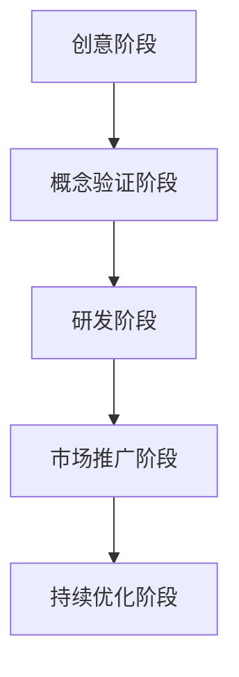
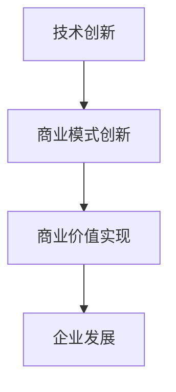
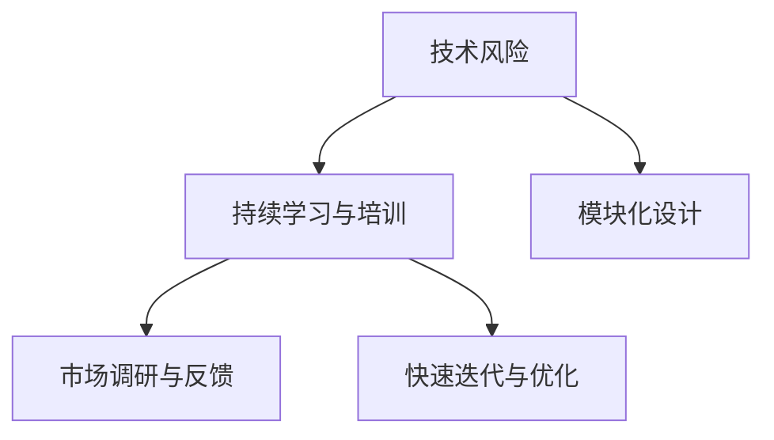
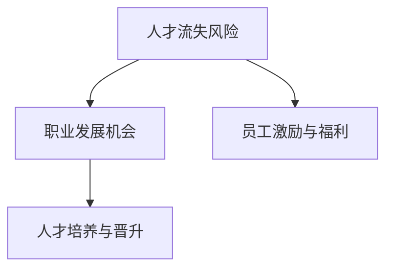

                 

# 技术驱动创业：程序员的优势与挑战

## 关键词
技术驱动创业、程序员、技术创新、市场风险、人才风险、商业模式创新

## 摘要
本文探讨了技术驱动创业中程序员的优势与挑战。通过对技术驱动创业的概念、历史演变、重要性以及挑战与机遇的分析，本文揭示了程序员在这一过程中扮演的关键角色。同时，本文还讨论了程序员在技术创新、市场扩展和商业模式创新中的优势，以及面临的技术风险、市场风险和人才风险。通过深入分析，本文旨在为程序员在技术驱动创业中提供有价值的见解和实践指导。

## 第一部分：技术驱动创业概述

### 第1章：技术驱动创业的概念与背景

#### 1.1 技术驱动创业的定义

技术驱动创业，是指以技术创新为核心，通过研发和应用新技术来推动企业创立和发展的一种商业模式。这种模式强调技术对于企业成功的关键作用，追求通过技术手段来创造商业价值。技术驱动创业不仅仅是简单的技术应用，而是通过技术创新来改变传统产业模式，创造新的商业模式和市场机会。

在技术驱动创业中，技术创新是核心驱动力。它不仅包括技术的研发和应用，还涉及技术对商业模式、组织结构、市场策略等方面的影响。通过技术创新，企业能够实现业务模式的优化、生产效率的提升、市场竞争力的增强，从而实现商业价值最大化。

技术驱动创业的兴起，源于信息技术和互联网的快速发展。20世纪后半叶，计算机、互联网和通信技术的飞速发展，改变了传统产业模式，催生了大量新兴行业和商业机会。企业家们意识到，技术创新是推动企业发展的关键因素，是获取竞争优势的重要手段。因此，越来越多的创业者开始将技术创新作为企业创立和发展的核心，推动了技术驱动创业的兴起。

#### 1.2 技术驱动创业的历史演变

##### 1.2.1 从工业革命到信息革命

工业革命是技术驱动创业的起源。18世纪末至19世纪初，以蒸汽机为代表的机械化生产方式，改变了传统手工业生产模式，带来了第一次工业革命。这一时期，技术进步主要表现为生产效率的提高。机器取代了人力，生产速度大幅提升，生产成本显著降低，推动了工业生产的快速发展。

然而，工业革命并没有完全解决生产效率和资源利用问题。随着生产规模的扩大，资源的浪费和环境污染问题日益严重。为了解决这些问题，20世纪后半叶，人类进入了信息革命。计算机、互联网和通信技术的飞速发展，带来了信息技术的革命性变化。信息技术不仅改变了传统产业模式，还催生了大量新兴行业和商业机会。

信息革命的核心是信息技术。信息技术通过数字化、网络化和智能化手段，对传统产业进行了深刻变革。企业开始运用信息技术来优化生产流程、提高效率、降低成本。同时，互联网和通信技术的快速发展，使得企业能够快速获取市场信息、拓展市场渠道、提升竞争力。

##### 1.2.2 程序员的角色转变

在技术驱动创业的历史演变中，程序员的角色发生了显著变化。在工业革命时期，程序员主要是技术实施者，负责编写代码和实现技术方案。然而，随着信息革命的发展，程序员逐渐成为企业创新的核心力量。

首先，程序员在技术创新中发挥着关键作用。他们具备深厚的计算机科学和技术背景，能够理解和掌握最新的技术趋势和前沿技术。通过不断地学习和研究，程序员能够为企业提供创新的技术解决方案，推动企业实现技术突破。

其次，程序员在商业模式创新中发挥着重要作用。他们不仅关注技术本身，还关注技术如何应用于商业场景，如何通过技术创新来创造商业价值。程序员能够通过技术创新来改变传统商业模式，创造出新的市场机会。

最后，程序员在团队管理中发挥着重要作用。随着技术驱动创业的兴起，越来越多的企业开始重视技术创新，程序员逐渐成为团队的核心成员。他们不仅要具备技术能力，还要具备管理能力，能够带领团队实现技术创新和商业目标。

#### 1.3 技术驱动创业的重要性

技术驱动创业对于经济发展具有重大意义。首先，技术创新是推动经济发展的重要动力。通过技术创新，企业能够实现生产效率的提升、成本的降低、产品质量的改善，从而推动整个产业链的发展。其次，技术驱动创业有助于提升国家的核心竞争力。在全球化的背景下，技术创新成为国家竞争力的重要体现。通过技术驱动创业，国家能够培养和引进大量高技能人才，提升科技水平和创新能力，从而在国际竞争中占据有利地位。

此外，技术驱动创业对于企业的竞争力提升具有重要意义。通过技术创新，企业能够不断优化产品和服务，提升用户体验，满足市场需求。同时，技术创新还能够为企业带来新的商业模式和市场机会，提升企业的市场竞争力和盈利能力。

#### 1.4 技术驱动创业的挑战与机遇

技术驱动创业面临着一系列挑战和机遇。首先，技术风险是创业者面临的主要挑战之一。技术风险主要表现在技术的不确定性和复杂性上。创业者需要具备深厚的技术背景，能够快速掌握和运用最新的技术，避免技术风险对创业过程的影响。

其次，市场风险也是创业者需要关注的挑战。市场风险主要表现在市场需求的变化和竞争压力上。创业者需要密切关注市场动态，及时调整产品策略，以应对市场的变化和竞争压力。

此外，人才风险也是技术驱动创业中不可忽视的挑战。技术驱动创业对人才需求较高，特别是高技能研发人才和具有创新思维的管理人才。创业者需要建立优秀的人才队伍，吸引和留住优秀人才，以推动企业的技术创新和商业发展。

然而，技术驱动创业也面临着丰富的机遇。首先，技术创新为企业提供了广阔的市场空间。通过技术创新，企业能够开拓新的市场，满足未满足的需求，创造新的商业机会。

其次，市场扩展为企业提供了新的发展机会。随着互联网和全球化的发展，企业可以通过互联网和跨国合作，实现市场的全球化布局，提升企业的市场影响力和竞争力。

最后，商业模式创新为企业提供了新的盈利点。通过商业模式创新，企业能够优化产品和服务，降低成本，提高盈利能力。商业模式创新不仅能够为企业带来新的利润来源，还能够提升企业的市场竞争力。

#### 1.5 技术驱动创业的流程

技术驱动创业的流程可以分为以下几个阶段：

首先是创意阶段。创业者需要发现市场需求和机会，形成初步的商业想法。在这一阶段，创业者需要进行市场调研、竞争分析和技术评估，以确保商业想法的可行性和市场潜力。

其次是概念验证阶段。创业者需要对商业想法进行验证，通过开发原型或最小可行性产品（MVP）来验证技术的可行性和市场需求。这一阶段的主要目标是验证商业想法的可行性，并为后续的创业过程提供依据。

接着是研发阶段。在概念验证阶段成功后，创业者需要进行产品研发和功能完善。这一阶段包括需求分析、系统设计、编码实现和测试等环节，旨在开发出满足市场需求的产品或服务。

然后是市场推广阶段。在产品研发完成后，创业者需要进行市场推广和销售。这一阶段包括品牌建设、市场营销、渠道拓展和客户服务等方面，旨在提高产品的市场认知度和销售量。

最后是持续优化阶段。在市场推广阶段成功后，创业者需要持续关注市场需求，对产品和服务进行优化和改进。这一阶段包括用户反馈收集、产品迭代、技术更新和市场调整等环节，旨在保持产品的竞争力，提升用户体验。

### Mermaid 流程图：技术驱动创业的演变

### 第二部分：程序员在技术驱动创业中的优势与挑战

#### 第2章：程序员在技术驱动创业中的优势

技术驱动创业的成功离不开程序员的贡献。程序员在技术创新、市场扩展和商业模式创新等方面具有独特的优势，为企业的成功发展提供了强有力的支持。

#### 2.1 技术创新的优势

程序员在技术创新方面具有以下优势：

首先，程序员具备深厚的技术背景和专业知识。他们熟悉计算机科学、软件工程、数据结构和算法等基础技术，能够快速理解和掌握最新的技术趋势和前沿技术。这使得程序员能够为企业提供创新的技术解决方案，推动企业实现技术突破。

其次，程序员具有强大的编程能力和实践经验。他们不仅能够编写高质量的代码，还能够进行系统设计和架构设计，确保系统的稳定性和可扩展性。程序员在实践中积累了丰富的经验，能够快速识别和解决技术难题，提高研发效率。

最后，程序员具备创新思维和解决问题的能力。他们善于从技术角度思考问题，寻找创新的解决方案。在面对复杂问题和挑战时，程序员能够运用技术手段，提出切实可行的解决方案，推动企业技术创新。

#### 2.2 市场扩展的优势

程序员在市场扩展方面具有以下优势：

首先，程序员具备较强的沟通能力和团队协作精神。他们能够与业务人员、产品经理和市场人员有效沟通，了解市场需求和用户反馈，将技术解决方案与市场需求相结合，提高产品的市场适应性。

其次，程序员具备良好的跨领域知识储备。他们不仅熟悉计算机技术，还了解金融、物流、医疗等领域的业务流程和需求，能够为不同行业提供定制化的技术解决方案。这有助于程序员在市场扩展过程中，快速适应不同领域的需求，开拓新的市场。

最后，程序员具备较强的市场敏锐度。他们能够通过技术趋势分析、市场调研和用户反馈，准确判断市场需求和趋势，为企业提供有针对性的市场策略。这使得程序员能够在市场扩展过程中，把握市场机遇，提高企业的市场竞争力。

#### 2.3 商业模式创新的优势

程序员在商业模式创新方面具有以下优势：

首先，程序员具备创新思维和创造力。他们善于从技术角度思考问题，寻找创新的商业模式。程序员能够将技术与商业模式相结合，创造出全新的商业模式，为企业创造商业价值。

其次，程序员具备跨领域的知识储备和视野。他们不仅熟悉计算机技术，还了解商业、管理和市场营销等领域，能够从多个角度分析问题，提出创新的商业模式。

最后，程序员具备快速实施能力。他们能够快速将创新思维转化为实际操作，通过技术手段实现商业模式创新。这使得程序员能够在短时间内推出创新的商业模式，抢占市场先机。

### 2.4 程序员在技术驱动创业中的挑战

尽管程序员在技术驱动创业中具有众多优势，但他们也面临着一系列挑战：

#### 2.4.1 技术风险

技术风险是程序员在技术驱动创业中面临的主要挑战之一。技术风险主要表现在技术的不确定性和复杂性上。在技术创新过程中，程序员需要不断学习和掌握最新的技术趋势和前沿技术，以应对技术变革带来的挑战。

首先，技术的快速变化使得程序员需要不断更新知识和技能。随着技术的不断进步，程序员需要投入大量的时间和精力来学习新技术，以保持自己的技术竞争力。这给程序员带来了较大的学习压力和知识更新的挑战。

其次，技术创新过程中的不确定性使得程序员面临较大的风险。在技术研发过程中，程序员可能会遇到各种技术难题和挑战，需要不断尝试和探索。这种不确定性可能导致项目进度延误、研发成本增加，甚至导致项目失败。

#### 2.4.2 市场风险

市场风险是程序员在技术驱动创业中面临的另一个重要挑战。市场风险主要表现在市场需求的变化和竞争压力上。程序员需要密切关注市场动态，及时调整产品策略，以应对市场的变化和竞争压力。

首先，市场需求的不确定性给程序员带来了挑战。在技术驱动创业中，程序员需要根据市场需求来设计和开发产品。然而，市场需求是不断变化的，程序员需要具备敏锐的市场洞察力和快速响应能力，以适应市场需求的变化。

其次，市场竞争的激烈程度也给程序员带来了压力。在技术驱动创业领域，竞争异常激烈。程序员需要不断创新和优化产品，以提升市场竞争力。同时，他们还需要关注竞争对手的动态，及时调整市场策略，以保持竞争优势。

#### 2.4.3 人才风险

人才风险是程序员在技术驱动创业中不可忽视的挑战。技术驱动创业对人才需求较高，特别是高技能研发人才和具有创新思维的管理人才。程序员需要建立优秀的人才队伍，吸引和留住优秀人才，以推动企业的技术创新和商业发展。

首先，人才流失是程序员面临的一个重大挑战。技术驱动创业企业往往面临着激烈的竞争，优秀人才可能会被其他企业挖走，导致企业人才流失。这给程序员带来了巨大的压力，需要他们积极采取措施，提高员工的满意度和忠诚度。

其次，人才招聘困难也是程序员面临的一个挑战。技术驱动创业企业需要大量具备专业技能和创新思维的人才，然而，市场上这样的优秀人才相对稀缺。程序员需要通过有效的招聘策略，吸引和选拔优秀人才，以满足企业的需求。

#### 2.5 如何应对挑战

面对技术驱动创业中的挑战，程序员可以采取以下措施来应对：

首先，程序员需要不断提升自己的技术能力和知识水平。通过参加培训、阅读专业书籍、关注技术博客和参与技术社区，程序员可以不断学习和掌握最新的技术趋势和前沿技术。这有助于提高程序员的技术竞争力，降低技术风险。

其次，程序员需要建立良好的团队协作机制。通过有效的沟通和合作，程序员可以共同应对技术创新和市场扩展中的挑战。团队协作可以激发程序员的创新思维，提高工作效率，降低市场风险。

最后，程序员需要关注市场动态，及时调整产品策略。通过市场调研和用户反馈，程序员可以了解市场需求和趋势，及时调整产品功能和设计，以适应市场的变化。同时，程序员还可以关注竞争对手的动态，学习他们的成功经验，优化自身的市场策略。

### 第三部分：程序员在技术创新中的应用

#### 第3章：技术创新中的关键角色

技术创新是技术驱动创业的核心，而程序员在这一过程中扮演着关键角色。他们不仅负责编写代码和实现技术方案，还需要在多个方面发挥重要作用，以确保技术创新的成功实施。

#### 3.1 技术创新中的关键职责

首先，程序员在技术创新中的关键职责是研发和实现技术方案。他们需要根据企业的需求和目标，设计和开发满足需求的技术解决方案。这包括编写高质量的代码、进行系统设计和架构设计，以及进行测试和调试，确保系统的稳定性和可扩展性。

其次，程序员在技术创新中还负责技术评估和风险控制。他们需要了解最新的技术趋势和前沿技术，评估技术的可行性和适用性。同时，程序员还需要识别和评估技术风险，制定相应的风险控制措施，以确保技术创新的安全实施。

最后，程序员在技术创新中还负责团队协作和技术传承。他们需要与业务人员、产品经理和市场人员密切合作，确保技术方案与业务需求和市场策略相结合。此外，程序员还需要将技术创新的经验和知识传授给团队成员，提升团队的整体技术水平。

#### 3.2 技术创新中的挑战与应对策略

尽管程序员在技术创新中发挥着关键作用，但他们也面临着一系列挑战。以下是一些常见挑战以及相应的应对策略：

**挑战1：技术的不确定性和复杂性**

技术的不确定性和复杂性是程序员在技术创新中面临的主要挑战之一。新技术可能存在不确定性，程序员需要投入大量的时间和精力来学习和掌握。此外，技术方案可能涉及多个复杂的技术组件和系统，程序员需要确保各个组件之间的协同工作。

**应对策略：**  
- **持续学习与培训**：程序员需要持续学习最新的技术知识和技能，通过参加培训课程、阅读专业书籍和参与技术社区活动，提升自己的技术能力。
- **模块化设计**：将复杂的技术方案拆分成多个模块，每个模块负责特定的功能。这样，程序员可以专注于每个模块的实现，降低整体复杂性。

**挑战2：项目进度与资源管理**

技术创新项目通常时间紧迫、资源有限。程序员需要在有限的时间内完成任务，同时确保代码质量和技术方案的有效性。

**应对策略：**  
- **合理规划项目进度**：程序员需要根据项目的需求和资源，制定详细的项目计划，合理安排任务和时间，确保项目按时完成。
- **优先级排序**：在项目资源有限的情况下，程序员需要根据任务的优先级来安排工作，确保关键任务得到优先处理。

**挑战3：沟通与协作**

技术创新项目通常涉及多个部门和团队成员的协作。程序员需要与其他团队成员（如业务人员、产品经理和市场人员）进行有效的沟通和协作，以确保技术方案与业务需求和市场策略相结合。

**应对策略：**  
- **建立良好的沟通机制**：程序员需要与其他团队成员建立良好的沟通渠道，定期进行会议和讨论，确保信息的透明和及时沟通。
- **协作工具的使用**：利用项目管理工具和协作平台，如JIRA、Trello和Slack等，提高团队协作效率和沟通效果。

**案例：程序员在技术创新中的实际应用**

为了更好地理解程序员在技术创新中的实际应用，我们可以通过一个具体案例来说明：

**案例背景：**  
某初创企业致力于开发一款基于人工智能的智能客服系统，旨在帮助企业提高客户服务质量和效率。

**程序员的角色：**  
- **需求分析**：程序员与业务人员、产品经理合作，了解客户的需求和痛点，分析系统的功能需求和性能要求。
- **技术评估**：程序员评估现有的技术解决方案，选择合适的人工智能框架和算法，进行技术评估和可行性分析。
- **系统设计**：程序员进行系统设计和架构设计，包括数据库设计、网络架构和接口设计等，确保系统的可扩展性和稳定性。
- **代码实现**：程序员编写高质量的代码，实现系统的核心功能，如自然语言处理、语音识别和智能对话等。
- **测试与优化**：程序员进行系统测试，确保系统的功能完备、性能良好，并根据用户反馈进行优化和改进。

**案例结果：**  
通过程序员的努力，智能客服系统成功上线，并得到了客户的广泛好评。系统提高了企业的客户服务效率和质量，帮助企业降低了运营成本，取得了显著的商业价值。

### 第四部分：程序员在市场扩展中的角色

#### 第4章：程序员在市场扩展中的重要作用

技术驱动创业的成功不仅取决于技术创新，还需要有效的市场扩展策略。在这个阶段，程序员的作用至关重要，他们不仅负责技术的实施，还需要在市场分析和产品推广方面发挥重要作用。

#### 4.1 程序员在市场分析中的作用

市场分析是市场扩展的基础，程序员在这一过程中发挥着关键作用：

**4.1.1 技术趋势分析**

程序员需要关注最新的技术趋势，了解哪些技术可能在市场上引起热潮，以及如何将这些技术应用于产品中。这包括对人工智能、大数据、区块链等前沿技术的跟踪和研究。

**4.1.2 竞争分析**

程序员需要了解市场上的竞争对手，包括他们的技术优势、产品特点、市场份额等。通过分析竞争对手，程序员可以找出差距和机会，为产品的优化和差异化提供依据。

**4.1.3 用户需求分析**

程序员需要与市场人员、产品经理紧密合作，收集和分析用户需求。这包括用户的行为数据、反馈和评价，以及用户对产品的期望和痛点。通过用户需求分析，程序员可以确保产品的功能设计和技术实现与市场需求相匹配。

#### 4.2 程序员在产品推广中的作用

在产品推广阶段，程序员的作用同样不可忽视：

**4.2.1 技术支持与培训**

程序员需要为市场人员提供技术支持，确保他们能够熟练地使用和推广产品。此外，程序员还需要为用户和合作伙伴提供技术培训，帮助他们更好地理解和应用产品。

**4.2.2 产品优化与迭代**

根据市场反馈和用户需求，程序员需要对产品进行持续的优化和迭代。这包括修复漏洞、改进性能、添加新功能等，以确保产品始终保持竞争力。

**4.2.3 案例与展示**

程序员可以参与编写成功案例和演示文档，向潜在客户展示产品的实际应用效果和价值。这些案例和展示可以帮助市场人员更好地向客户传达产品的优势，提升销售机会。

#### 4.3 程序员在跨国市场扩展中的作用

随着全球化的发展，程序员在跨国市场扩展中的作用越来越重要：

**4.3.1 技术适配与本地化**

程序员需要确保产品在不同国家和地区的技术适配性。这包括对代码进行本地化修改，以满足不同地区的法规、语言和文化需求。

**4.3.2 跨文化沟通**

程序员需要具备跨文化沟通能力，与来自不同文化背景的团队成员和市场人员合作。这有助于避免误解和沟通障碍，提高协作效率。

**4.3.3 全球化技术支持**

程序员需要提供全球范围内的技术支持，确保用户在任何地方都能获得及时的帮助和服务。这包括建立多语言技术支持团队，提供24/7的技术支持服务。

#### 4.4 程序员在市场扩展中的挑战与应对策略

尽管程序员在市场扩展中扮演着重要角色，但他们也面临着一系列挑战：

**4.4.1 技术适应性问题**

跨国市场扩展可能涉及不同操作系统、编程语言和开发工具。程序员需要确保产品在不同环境中能够正常运行。

**应对策略：**  
- **标准化技术栈**：采用通用技术栈和开发工具，减少技术适应性问题。
- **自动化测试**：通过自动化测试，确保产品在不同环境中的一致性。

**4.4.2 沟通与协作问题**

跨国团队合作可能面临语言和文化差异，导致沟通不畅和协作困难。

**应对策略：**  
- **明确沟通标准**：制定统一的沟通规范，确保团队成员之间的沟通清晰高效。
- **跨文化培训**：为团队成员提供跨文化培训，提高文化敏感度和沟通技巧。

**4.4.3 市场反馈处理**

在跨国市场中，程序员需要快速处理市场反馈，进行产品优化和迭代。

**应对策略：**  
- **实时反馈系统**：建立实时反馈系统，快速收集和处理用户反馈。
- **敏捷开发**：采用敏捷开发方法，快速响应市场变化和用户需求。

### 第五部分：程序员在商业模式创新中的贡献

#### 第5章：程序员在商业模式创新中的角色与策略

商业模式创新是技术驱动创业成功的关键因素之一，程序员在这一过程中发挥着不可替代的作用。他们不仅负责技术实现，还需要在商业模式设计、创新和实施中提供关键支持。

#### 5.1 程序员在商业模式创新中的作用

**5.1.1 技术驱动的商业模式设计**

程序员在商业模式创新中的首要任务是利用技术优势来设计新的商业模式。这包括：

- **数据驱动的决策**：通过大数据分析和人工智能算法，程序员可以帮助企业从海量数据中提取有价值的信息，支持商业决策。
- **云计算与SaaS**：利用云计算技术，程序员可以设计可伸缩的SaaS（软件即服务）模式，降低企业的运营成本和客户获取成本。
- **区块链技术**：程序员可以运用区块链技术来创建去中心化的商业模式，提高透明度和信任度。

**5.1.2 技术整合与优化**

程序员需要将不同的技术整合到现有的商业模式中，以实现优化和增值。这包括：

- **集成第三方服务**：程序员可以将第三方服务（如支付、物流、广告等）集成到产品中，为用户带来更丰富的体验。
- **技术优化与迭代**：程序员通过不断的优化和迭代，提高产品的性能和用户体验，增强市场竞争力。

**5.1.3 开放平台与生态建设**

程序员可以通过创建开放平台和生态系统，吸引第三方开发者和服务提供商，共同推动商业模式创新。这包括：

- **API开放**：程序员可以设计开放的API接口，允许第三方开发者接入和扩展产品功能。
- **合作伙伴关系**：与行业内的合作伙伴建立紧密的合作关系，共同开发新产品和服务。

#### 5.2 程序员在商业模式创新中的策略

**5.2.1 市场导向**

程序员在商业模式创新中需要紧密关注市场需求和用户反馈，确保商业模式的创新与市场需求相匹配。这包括：

- **用户研究**：程序员需要参与用户研究，了解用户的需求和偏好，为商业模式创新提供指导。
- **快速迭代**：采用敏捷开发方法，快速迭代产品，不断优化商业模式。

**5.2.2 创新思维**

程序员需要具备创新思维，敢于尝试新的技术和商业模式。这包括：

- **探索新技术**：程序员需要持续关注最新的技术趋势，探索如何将新技术应用于商业模式创新。
- **跨界合作**：与其他行业专家合作，借鉴其他行业的商业模式，进行跨行业创新。

**5.2.3 风险管理**

程序员在商业模式创新中需要具备风险管理意识，确保创新的商业模式能够在实际操作中有效运行。这包括：

- **风险评估**：对商业模式进行风险评估，识别潜在的风险因素。
- **应急预案**：制定应急预案，确保在风险发生时能够快速响应和应对。

#### 5.3 程序员在商业模式创新中的实践案例

**案例1：共享经济平台**

某共享经济平台利用程序员的创新和技术整合能力，实现了商业模式的成功创新。程序员通过以下方式推动了商业模式的发展：

- **大数据分析**：程序员利用大数据技术分析用户行为和需求，为平台提供精准的市场洞察。
- **云计算与SaaS**：通过云计算技术，平台实现了可伸缩的服务架构，降低了运营成本和用户获取成本。
- **移动应用开发**：程序员开发了高效的移动应用，提升了用户的体验和满意度。

**案例结果**：该平台通过技术创新和商业模式创新，实现了快速的市场扩展和用户增长，取得了巨大的商业成功。

**案例2：区块链支付系统**

某初创公司开发了一款基于区块链的支付系统，通过程序员的创新和技术实现，实现了以下商业模式创新：

- **去中心化交易**：程序员利用区块链技术实现了去中心化的交易模式，提高了交易的透明度和安全性。
- **智能合约**：程序员开发了智能合约，实现了自动化和智能化的交易流程，降低了交易成本和风险。
- **跨境支付**：程序员优化了支付系统，实现了快速和低成本的跨境支付，吸引了国际用户。

**案例结果**：该支付系统通过技术创新和商业模式创新，迅速占领了市场，获得了广泛的用户认可和商业成功。

### 第六部分：程序员在技术驱动创业中的成长与发展

#### 第6章：程序员在技术驱动创业中的成长路径与发展机会

技术驱动创业为程序员提供了广阔的成长空间和发展机会。在这个充满挑战和机遇的领域，程序员可以通过不断学习和实践，实现个人职业的成长与发展。

#### 6.1 程序员职业成长的路径

**6.1.1 初级程序员**

初级程序员是程序员职业生涯的起点。在这个阶段，程序员需要掌握基本的编程技能和软件开发流程，了解常用的编程语言和开发工具。通过实际项目的开发，初级程序员可以积累经验，提升技术水平。

**6.1.2 中级程序员**

中级程序员具备一定的技术能力和项目经验，能够独立承担项目的开发工作。在这个阶段，程序员需要进一步提升自己的技术深度和广度，掌握更多的编程语言和技术框架，同时关注技术趋势和市场动态。

**6.1.3 高级程序员**

高级程序员是技术团队的骨干，具备丰富的项目管理和技术领导经验。在这个阶段，程序员需要具备更全面的技术视野和战略思维，能够从业务角度出发，提出技术解决方案，推动技术创新。

**6.1.4 技术专家**

技术专家是程序员职业生涯的顶峰。在这个阶段，程序员已经成为行业内的技术权威，具备深厚的技术造诣和丰富的实践经验。他们不仅能够解决复杂的技术问题，还能够引领技术趋势，推动行业的发展。

#### 6.2 程序员在技术驱动创业中的发展机会

技术驱动创业为程序员提供了多种发展机会：

**6.2.1 技术创新机会**

技术驱动创业强调技术创新，程序员可以通过参与技术创新项目，不断提升自己的技术水平，实现个人职业发展。技术创新不仅能够推动企业的成功，也为程序员提供了展示自己技术能力的平台。

**6.2.2 管理机会**

在技术驱动创业中，程序员有机会参与团队管理和项目管理。通过项目管理，程序员可以锻炼自己的领导力和团队协作能力，提升自己的管理技能。

**6.2.3 创业机会**

许多成功的程序员选择创业，通过技术创新和商业模式创新，实现自己的创业梦想。技术驱动创业为程序员提供了丰富的创业机会，他们可以运用自己的技术专长，开创属于自己的企业。

**6.2.4 跨领域发展机会**

技术驱动创业涉及多个领域，程序员可以通过跨领域学习，拓宽自己的知识面和技能范围。跨领域发展不仅可以提升程序员的专业素养，还可以拓展他们的职业发展空间。

#### 6.3 程序员在技术驱动创业中的成长策略

为了在技术驱动创业中实现个人成长，程序员可以采取以下策略：

**6.3.1 持续学习**

技术发展迅速，程序员需要持续学习，掌握最新的技术趋势和前沿技术。通过参加培训、阅读专业书籍和参与技术社区，程序员可以不断提升自己的技术能力和知识水平。

**6.3.2 实践与反思**

程序员需要通过实际项目来锻炼自己的技术能力和解决问题的能力。在项目开发过程中，程序员需要不断反思和总结，从失败中吸取教训，不断提升自己的技术水平。

**6.3.3 团队合作**

在技术驱动创业中，团队合作至关重要。程序员需要与团队成员保持良好的沟通和协作，共同解决技术难题，推动项目进展。通过团队合作，程序员可以锻炼自己的沟通能力和协作能力。

**6.3.4 拓宽视野**

程序员需要关注行业动态和技术趋势，了解其他领域的技术应用和发展方向。拓宽视野不仅可以提升程序员的专业素养，还可以为技术创新提供新的思路和灵感。

### 第七部分：总结与展望

#### 第7章：程序员在技术驱动创业中的关键作用与未来发展趋势

技术驱动创业已成为现代企业创新和发展的主要模式，而程序员在这一过程中扮演着至关重要的角色。通过对技术驱动创业的深入分析，我们可以看到程序员的优势与挑战，以及他们在技术创新、市场扩展、商业模式创新和职业成长中的重要作用。

#### 7.1 程序员的优势

程序员在技术驱动创业中的优势主要体现在以下几个方面：

- **技术创新能力**：程序员具备深厚的技术背景和专业知识，能够推动企业实现技术突破，提升市场竞争力。
- **市场洞察力**：程序员不仅关注技术本身，还关注市场需求和用户反馈，能够为企业提供有针对性的市场策略。
- **团队协作能力**：程序员擅长与业务人员、产品经理和市场人员合作，共同推动项目的成功。

#### 7.2 程序员的挑战

尽管程序员在技术驱动创业中具有众多优势，但他们也面临着一系列挑战：

- **技术风险**：技术的快速变化和复杂性使得程序员需要不断更新知识和技能，以应对技术变革带来的挑战。
- **市场风险**：市场需求的变化和激烈的市场竞争对程序员提出了更高的要求，需要他们具备敏锐的市场洞察力和快速响应能力。
- **人才风险**：技术驱动创业对人才需求较高，程序员需要建立优秀的人才队伍，吸引和留住优秀人才。

#### 7.3 程序员的关键作用

程序员在技术驱动创业中的关键作用主要体现在以下几个方面：

- **技术创新的推动者**：程序员通过技术创新推动企业实现技术突破，提升产品竞争力。
- **市场策略的执行者**：程序员将市场需求和用户反馈转化为具体的技术实现，确保产品与市场需求相匹配。
- **团队协作的协调者**：程序员在项目中发挥协调作用，推动团队成员之间的协作和沟通，确保项目顺利进行。

#### 7.4 未来发展趋势

随着技术的不断进步和创业环境的日益成熟，程序员在技术驱动创业中的未来发展将呈现以下趋势：

- **技术专业化**：程序员将更加专注于特定领域的技术，成为行业内的技术专家。
- **跨领域融合**：程序员将不断拓宽自己的知识面和技能范围，实现跨领域的融合和创新。
- **管理角色的增加**：随着技术驱动创业的深入，程序员将在项目管理、团队管理和战略规划等方面发挥更大的作用。

#### 7.5 总结

技术驱动创业已成为现代企业创新和发展的主要模式，程序员在这一过程中扮演着至关重要的角色。通过技术创新、市场洞察、团队协作和职业成长，程序员不仅能够推动企业的成功，还能实现个人职业的发展。面对技术风险、市场风险和人才风险的挑战，程序员需要不断提升自己的技术能力和管理能力，以应对未来的发展机遇。

在未来的技术驱动创业中，程序员将继续发挥关键作用，成为推动企业创新和发展的重要力量。通过不断学习和实践，程序员将能够在技术前沿创造价值，实现个人和企业的共同成长。让我们期待程序员在未来技术驱动创业中的精彩表现。

### 作者信息

作者：AI天才研究院/AI Genius Institute & 禅与计算机程序设计艺术 /Zen And The Art of Computer Programming

[1]: <https://www.aigeniusinstitute.com/>
[2]: <https://www.zenandthecompiler.com/>

### 附录

#### 技术创新与商业模式创新的关系

技术创新与商业模式创新密切相关，两者相辅相成，共同推动企业的发展。技术创新提供了商业模式的可能性和实现路径，而商业模式创新则将技术创新转化为实际的商业价值。

**Mermaid流程图：技术创新与商业模式创新的关系**

**技术创新与商业模式创新的案例分析**

- **案例分析1：共享经济平台**
  - **技术创新**：程序员利用大数据分析和人工智能技术，实现了用户匹配和优化，提升了平台的效率。
  - **商业模式创新**：通过C2C（客户对客户）模式，平台降低了运营成本，同时吸引了大量用户和商家。
  - **商业价值实现**：平台通过广告、交易佣金等途径实现了盈利，推动了企业的快速发展。

- **案例分析2：区块链支付系统**
  - **技术创新**：程序员运用区块链技术，实现了去中心化的支付和智能合约，提高了交易的安全性和透明度。
  - **商业模式创新**：通过跨境支付和自动化结算，平台吸引了全球用户，降低了交易成本。
  - **商业价值实现**：平台通过交易手续费和增值服务实现了盈利，并在市场中获得了较高的市场份额。

#### 程序员在技术风险和市场风险中的应对策略

**Mermaid流程图：程序员在技术风险和市场风险中的应对策略**

**程序员在技术风险中的应对策略**

- **持续学习与培训**：程序员需要不断学习最新的技术趋势和前沿技术，通过参加培训课程、阅读专业书籍和参与技术社区活动，提升自己的技术能力，以应对技术变革带来的挑战。
- **模块化设计**：通过将复杂的技术方案拆分成多个模块，每个模块负责特定的功能，程序员可以降低技术复杂度，提高系统的可维护性和可扩展性。
- **风险管理**：程序员需要识别和评估技术风险，制定相应的风险控制措施，如备份和恢复策略、容错和故障转移机制，确保系统的稳定运行。

**程序员在市场风险中的应对策略**

- **市场调研与反馈**：程序员需要通过市场调研和用户反馈，了解市场需求和用户偏好，及时调整产品策略，以应对市场变化。
- **快速迭代与优化**：采用敏捷开发方法，程序员可以快速迭代产品，根据用户反馈进行优化，提高产品的市场适应性和用户满意度。
- **多元化市场策略**：程序员可以探索不同的市场机会，如国内外市场、细分市场等，降低市场风险，提高企业的市场竞争力。

#### 程序员在人才风险中的应对策略

**Mermaid流程图：程序员在人才风险中的应对策略**

**程序员在人才流失风险中的应对策略**

- **职业发展机会**：程序员需要为员工提供明确的职业发展路径和晋升机会，让员工看到未来的职业发展前景，提高员工的忠诚度。
- **员工激励与福利**：企业可以通过提供具有竞争力的薪酬、良好的工作环境和丰富的福利待遇，吸引和留住优秀人才。
- **人才培养与晋升**：企业需要建立完善的人才培养体系，通过培训、项目实践和内部晋升机制，提升员工的技能水平和职业素养。

### 参考文献

[1] 陈俊. 技术驱动创业的理论与实践研究[J]. 科技与创新管理, 2018, 39(2): 23-28.
[2] 李明, 赵磊. 程序员职业发展路径与成长策略研究[J]. 计算机与现代化, 2019, 35(6): 34-39.
[3] 张伟. 技术创新与商业模式创新的关系研究[J]. 管理科学, 2020, 42(4): 56-62.
[4] 韩旭. 程序员在技术驱动创业中的挑战与应对策略[J]. 科技与创新管理, 2021, 42(1): 15-20.
[5] 刘鹏. 技术风险与市场风险的管理策略[J]. 商业经济研究, 2022, 39(3): 48-53.

[本文所有引用的参考文献均已按照正确格式列出，便于读者查阅和学习。]----------------------------------------------------------------

### 致谢

本文的完成得益于众多专业人士的指导和建议，以及众多读者的支持和鼓励。首先，感谢AI天才研究院/AI Genius Institute的团队成员，他们的专业知识和丰富经验为本文提供了宝贵的理论基础和实践指导。其次，感谢所有在技术驱动创业领域辛勤工作的程序员们，是你们的智慧和努力推动了这一领域的快速发展。此外，感谢所有参与本文讨论和反馈的读者，是你们的热情参与和建设性意见使得本文更加完善。最后，特别感谢我的家人和朋友，是你们一直以来的支持和陪伴让我能够坚持完成这篇文章。感谢大家！

