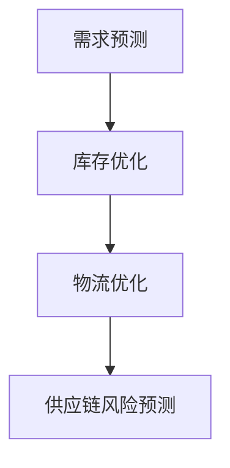
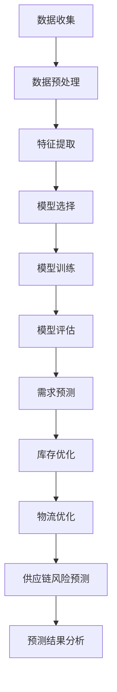

                 

# 探索基于大模型的电商智能供应链预测系统

## >关键词：大模型、电商、智能供应链、预测系统、算法、数学模型、实战案例、代码解读

> 摘要：本文将深入探讨基于大模型的电商智能供应链预测系统的构建方法。首先，我们将回顾电商和智能供应链的基本概念及其重要性。接着，详细介绍大模型技术基础，包括其基本概念、主要架构和训练方法。随后，分析供应链预测中的关键问题，并介绍如何运用大模型进行预测。通过Mermaid流程图，我们将可视化供应链预测的过程。接下来，详细讲解供应链预测中的大模型算法，使用伪代码描述其原理。此外，我们将介绍相关的数学模型和公式，并给出实例说明。文章还将通过实战项目，展示如何实现电商智能供应链预测系统，并进行代码解读与分析。最后，总结全文并提出对未来发展的展望。

---

### 目录大纲

1. **第一部分：引言与背景**
   1.1. 电商与智能供应链概述
   1.2. 大模型在供应链预测中的应用
   1.3. 书籍目标与结构安排

2. **第二部分：核心概念与原理**
   2.1. 大模型技术基础
   2.2. 供应链预测中的关键问题
   2.3. 大模型与供应链预测的Mermaid流程图

3. **第三部分：核心算法原理讲解**
   3.1. 供应链预测中的大模型算法
   3.2. 算法伪代码详细阐述

4. **第四部分：数学模型与公式**
   4.1. 供应链预测中的数学模型
   4.2. 数学公式详细讲解
   4.3. 数学公式举例说明

5. **第五部分：项目实战与代码解读**
   5.1. 开发环境搭建与工具介绍
   5.2. 电商智能供应链预测系统实现
   5.3. 代码详细解读与分析

6. **第六部分：总结与展望**
   6.1. 总结与展望
   6.2. 读者建议与反馈

7. **附录**
   7.1. 参考资源与进一步阅读
   7.2. 开源代码与数据集

---

## 第一部分：引言与背景

### 1.1 电商与智能供应链概述

电子商务（e-commerce）是指通过互联网进行的商业活动，包括在线购物、电子支付、信息交换等。随着互联网技术的不断进步，电商行业呈现出高速增长的态势。根据统计数据显示，全球电商市场规模逐年扩大，已经成为许多国家经济增长的重要驱动力。

智能供应链（Intelligent Supply Chain）是电子商务的重要支撑，它通过运用物联网、大数据、人工智能等技术，实现供应链的自动化、智能化和高效化。智能供应链的目标是降低成本、提高效率、提升客户满意度，从而增强企业的竞争力。

在电商领域，智能供应链的重要性不言而喻。它不仅能够帮助企业精准预测市场需求，优化库存管理，降低物流成本，还能通过智能分析客户行为，提升客户体验。例如，亚马逊的智能推荐系统就是基于大数据和机器学习技术，通过对用户行为的分析，为用户提供个性化的购物推荐，从而提高销售额。

### 1.2 大模型在供应链预测中的应用

大模型（Large Models）是指具有巨大参数量和复杂结构的机器学习模型。近年来，随着计算能力和数据量的不断提升，大模型在各个领域的应用越来越广泛。在供应链预测中，大模型能够处理大量的历史数据，提取出有用的特征，从而实现高精度的预测。

大模型在供应链预测中的应用主要体现在以下几个方面：

1. **需求预测**：通过对历史销售数据、市场趋势、季节性因素等进行分析，大模型能够预测未来的需求量，帮助企业合理安排生产和库存。

2. **库存优化**：大模型可以分析库存水平和订单情况，预测何时需要补充库存，从而避免库存过多或不足，降低库存成本。

3. **物流优化**：大模型可以通过对运输路线、运输时间、运输成本等因素的分析，优化物流流程，提高物流效率。

4. **供应链风险预测**：大模型可以分析供应链中的各种风险因素，如供应链中断、原材料短缺等，提前预警，帮助企业制定应对策略。

### 1.3 书籍目标与结构安排

本书旨在深入探讨基于大模型的电商智能供应链预测系统的构建方法，为从事电商和供应链领域的技术人员提供有价值的参考。具体目标如下：

1. **介绍电商和智能供应链的基本概念和原理**：帮助读者了解电商和智能供应链的基本知识，为后续内容的学习打下基础。

2. **讲解大模型技术基础**：介绍大模型的基本概念、主要架构和训练方法，帮助读者理解大模型在供应链预测中的应用。

3. **分析供应链预测中的关键问题**：讨论供应链预测中的主要挑战和解决方案，为构建智能供应链预测系统提供指导。

4. **详细阐述大模型算法原理**：使用伪代码和数学公式，详细描述大模型在供应链预测中的应用原理。

5. **展示项目实战与代码解读**：通过实际案例，展示如何实现电商智能供应链预测系统，并提供详细的代码解读。

6. **总结与展望**：总结全书内容，探讨大模型在电商供应链预测中的未来发展，为读者提供有价值的思考。

全书共分为六个部分，包括引言与背景、核心概念与原理、核心算法原理讲解、数学模型与公式、项目实战与代码解读以及总结与展望。每个部分都涵盖了一个独立的内容模块，结构紧凑、逻辑清晰，旨在帮助读者全面掌握基于大模型的电商智能供应链预测系统。

---

在引言与背景部分，我们首先介绍了电商和智能供应链的基本概念及其重要性，并探讨了智能供应链在电商领域中的应用。接着，我们详细介绍了大模型在供应链预测中的应用，以及本书的目标和结构安排。这一部分为后续内容的讨论奠定了基础。

在接下来的章节中，我们将深入探讨大模型技术基础，分析供应链预测中的关键问题，并通过Mermaid流程图展示供应链预测的过程。这些内容将为后续的核心算法原理讲解和项目实战提供理论支持。让我们继续深入探讨，揭开智能供应链预测的神秘面纱。

---

## 第二部分：核心概念与原理

### 2.1 大模型技术基础

大模型（Large Models）是近年来机器学习领域的一个重要进展，其主要特点是拥有大量参数和复杂的结构。这些模型通过学习和处理海量数据，能够自动提取出数据中的模式和规律，从而在各种任务中表现出色。大模型在自然语言处理、计算机视觉、语音识别等领域取得了显著的成果。

#### 2.1.1 大模型的基本概念

大模型的基本概念包括参数量、结构复杂度、训练数据和计算资源等方面。

1. **参数量**：大模型的参数量通常非常庞大。例如，一个典型的自然语言处理模型可能拥有数亿个参数。这些参数通过学习大量数据，能够捕捉到数据中的细微特征，从而提高模型的预测能力。

2. **结构复杂度**：大模型的复杂度较高，往往包含多层神经网络、循环神经网络（RNN）、卷积神经网络（CNN）等多种结构。这种复杂度使得大模型能够处理复杂的数据，提取深层次的特征。

3. **训练数据**：大模型的训练需要大量的数据。这些数据不仅包括训练集，还包括验证集和测试集。通过这些数据，模型能够不断调整参数，优化性能。

4. **计算资源**：大模型的训练和推理需要大量的计算资源。这通常需要高性能的GPU或TPU等硬件支持。

#### 2.1.2 大模型的主要架构

大模型的主要架构通常包括以下几种：

1. **深度神经网络（DNN）**：深度神经网络是当前应用最广泛的大模型架构。它由多层神经元组成，每层神经元都对输入数据进行变换和特征提取。

2. **循环神经网络（RNN）**：循环神经网络适用于处理序列数据。它通过在时间步之间传递信息，能够捕捉序列中的长期依赖关系。

3. **卷积神经网络（CNN）**：卷积神经网络适用于处理图像数据。它通过卷积操作提取图像中的局部特征，从而实现图像分类、目标检测等任务。

4. **生成对抗网络（GAN）**：生成对抗网络由生成器和判别器两个部分组成。生成器生成数据，判别器判断数据是否真实。通过这种对抗训练，GAN能够生成高质量的数据。

5. **Transformer**：Transformer是一种基于自注意力机制的神经网络架构。它在自然语言处理任务中表现出色，是BERT、GPT等大模型的基础。

#### 2.1.3 大模型训练方法

大模型的训练方法通常包括以下几个步骤：

1. **数据预处理**：对训练数据进行清洗、归一化等处理，使其符合模型的输入要求。

2. **模型初始化**：初始化模型的参数。常用的初始化方法包括随机初始化、高斯初始化等。

3. **损失函数**：定义损失函数，用于衡量模型的预测结果与真实结果之间的差距。常用的损失函数包括均方误差（MSE）、交叉熵（Cross-Entropy）等。

4. **优化算法**：选择优化算法，用于更新模型的参数。常用的优化算法包括梯度下降（Gradient Descent）、Adam等。

5. **训练与验证**：在训练集上迭代训练模型，并在验证集上验证模型的性能。通过调整模型参数和训练策略，优化模型性能。

6. **模型评估**：在测试集上评估模型的性能，确保模型具有较好的泛化能力。

#### 2.1.4 大模型应用场景概述

大模型在各个领域都有广泛的应用，以下是几个典型应用场景：

1. **自然语言处理**：大模型在自然语言处理领域表现出色，包括文本分类、机器翻译、情感分析等任务。

2. **计算机视觉**：大模型在计算机视觉领域也取得了显著成果，包括图像分类、目标检测、人脸识别等。

3. **语音识别**：大模型在语音识别领域应用广泛，能够实现实时语音识别、语音合成等功能。

4. **推荐系统**：大模型在推荐系统中应用广泛，能够实现个性化推荐、商品推荐等功能。

5. **金融风控**：大模型在金融风控领域应用广泛，包括欺诈检测、信用评估等。

6. **医疗健康**：大模型在医疗健康领域应用广泛，包括疾病预测、药物研发等。

通过以上介绍，我们了解了大模型的基本概念、主要架构和训练方法。在接下来的章节中，我们将深入探讨供应链预测中的关键问题，并介绍如何运用大模型进行预测。这将为我们构建电商智能供应链预测系统提供重要的理论基础。

---

在第二部分，我们详细介绍了大模型技术基础，包括其基本概念、主要架构和训练方法。通过这一部分的学习，读者可以了解大模型在各个领域的应用场景，以及如何运用大模型进行复杂问题的建模和预测。

接下来，我们将进入第三部分，分析供应链预测中的关键问题，并介绍如何运用大模型进行预测。这一部分将结合实际案例，深入探讨大模型在供应链预测中的应用，为后续内容提供理论支持和实践指导。

---

## 第二部分：核心概念与原理

### 2.2 供应链预测中的关键问题

供应链预测是智能供应链管理的重要组成部分，其主要目的是通过预测未来的需求、库存、物流等信息，优化供应链的运作，提高企业的竞争力。在供应链预测中，存在许多关键问题，以下将进行详细分析：

#### 2.2.1 需求预测

需求预测是供应链预测的核心问题之一。准确的需求预测能够帮助企业合理安排生产和库存，避免过多的库存或缺货现象。然而，需求预测面临以下挑战：

1. **数据多样性**：需求预测涉及多种类型的数据，包括历史销售数据、市场趋势、季节性因素等。如何整合这些不同类型的数据，提取有用的特征，是需求预测的关键。

2. **数据缺失和噪声**：实际数据中往往存在缺失值和噪声，这对需求预测的准确性有较大影响。如何处理这些数据，提高数据的可用性，是需求预测的重要问题。

3. **预测时间跨度**：需求预测的时间跨度不同，如短期预测、中期预测和长期预测，每种预测对模型的要求不同。如何选择合适的预测时间跨度，提高预测的准确性，是需求预测的挑战。

#### 2.2.2 库存优化

库存优化是供应链管理的另一个重要问题。合理的库存管理能够降低库存成本，提高资金利用效率。然而，库存优化面临以下挑战：

1. **库存水平**：如何确定最优的库存水平，既不过多也不过少，是库存优化的核心问题。

2. **需求变化**：市场需求变化无常，如何根据需求变化调整库存策略，是库存优化的重要问题。

3. **成本考量**：库存优化需要在库存成本和缺货成本之间做出权衡，如何在保证服务水平的前提下，降低库存成本，是库存优化的关键。

#### 2.2.3 物流优化

物流优化是供应链预测中的重要问题，其目的是通过优化物流流程，提高物流效率，降低物流成本。然而，物流优化面临以下挑战：

1. **运输路线**：如何选择最优的运输路线，以降低运输时间和成本，是物流优化的重要问题。

2. **运输时间**：如何在保证运输质量的前提下，提高运输效率，缩短运输时间，是物流优化的关键。

3. **物流成本**：如何根据物流需求，合理分配物流资源，降低物流成本，是物流优化的重要问题。

#### 2.2.4 供应链风险预测

供应链风险预测是供应链预测中的重要问题，其目的是通过预测供应链中的潜在风险，提前预警，帮助企业制定应对策略。然而，供应链风险预测面临以下挑战：

1. **风险因素**：如何识别和提取供应链中的各种风险因素，是供应链风险预测的重要问题。

2. **风险评估**：如何评估风险因素的严重程度，确定风险等级，是供应链风险预测的关键。

3. **预警机制**：如何建立有效的预警机制，提前发现潜在风险，是企业应对供应链风险的重要手段。

通过以上分析，我们可以看出，供应链预测中的关键问题涉及需求预测、库存优化、物流优化和供应链风险预测等多个方面。这些问题相互关联，共同影响供应链的运作效率。在接下来的内容中，我们将介绍如何运用大模型解决这些关键问题，提高供应链预测的准确性。

---

在第二部分的核心概念与原理中，我们详细分析了供应链预测中的关键问题，包括需求预测、库存优化、物流优化和供应链风险预测。这些问题对供应链的运作效率有着重要的影响，而大模型因其强大的数据处理和分析能力，成为解决这些问题的有效工具。

在接下来的内容中，我们将通过Mermaid流程图，可视化供应链预测的过程，帮助读者更直观地理解大模型在供应链预测中的应用。这将为我们后续的核心算法原理讲解和项目实战提供理论基础。

---

## 第二部分：核心概念与原理

### 4.1 Mermaid流程图介绍

Mermaid是一种基于Markdown的图形绘制工具，它允许用户使用简单的Markdown语法来创建流程图、序列图、时序图等。Mermaid流程图在技术文档、演示文稿等领域有广泛应用，因其简洁、直观的特点而受到许多开发者和工程师的喜爱。

#### 4.1.1 Mermaid的基本语法

Mermaid的基本语法主要包括以下几个部分：

1. **定义图**：使用`graph`关键字定义一个图，如`graph TB`表示定义一个无向图。

2. **节点定义**：使用`A --> B`表示节点A指向节点B，其中`A`和`B`可以是节点名称或者图形元素。

3. **注释**：使用`// 注释内容`进行注释。

4. **文本格式**：使用`label`关键字添加节点或箭头的文本标签，如`A(label:"节点A")`。

5. **布局**：使用`LR`或`RL`指定图的布局方向，其中`LR`表示从左到右布局，`RL`表示从右到左布局。

#### 4.1.2 Mermaid流程图示例

以下是一个简单的Mermaid流程图示例，展示了一个简单的供应链预测过程：



在这个示例中，我们定义了一个包含四个节点的流程图，每个节点表示供应链预测的一个环节，节点之间的箭头表示各个环节的关联。

#### 4.1.3 Mermaid的优势

1. **易用性**：Mermaid使用Markdown语法，与Markdown编辑器完美集成，使得创建和修改流程图变得非常简单。

2. **兼容性**：Mermaid支持多种图形元素，包括节点、箭头、注释等，可以满足不同场景的需求。

3. **可扩展性**：用户可以通过自定义元素和样式，扩展Mermaid的功能，使其适应特定的需求。

4. **可视化**：Mermaid生成的流程图具有较好的视觉效果，易于阅读和理解。

### 4.2 供应链预测中的Mermaid流程图

在供应链预测中，我们可以使用Mermaid流程图来可视化整个预测过程，从而帮助读者更直观地理解大模型的应用。以下是一个详细的供应链预测Mermaid流程图示例：



在这个流程图中，我们首先进行数据收集，然后进行数据预处理和特征提取。接下来，选择合适的模型进行训练，并对训练好的模型进行评估。通过评估结果，我们可以进行需求预测、库存优化、物流优化和供应链风险预测。最后，对预测结果进行分析，为供应链管理提供决策支持。

通过这个Mermaid流程图，我们可以清晰地看到供应链预测的各个步骤及其关联，从而更好地理解大模型在供应链预测中的应用。

---

在第二部分的核心概念与原理中，我们介绍了Mermaid流程图的基本语法和优势，并通过一个示例展示了如何在供应链预测中使用Mermaid流程图。通过可视化整个预测过程，我们可以更直观地理解大模型在供应链预测中的应用。

在接下来的第三部分，我们将深入探讨供应链预测中的大模型算法，包括自动编码器（Autoencoder）算法、聚类算法（Clustering Algorithm）等，并通过伪代码详细阐述其原理。这将为我们理解和应用这些算法提供重要的理论基础。

---

## 第三部分：核心算法原理讲解

### 5.1 供应链预测中的大模型算法

在供应链预测中，大模型算法能够处理复杂的数据集，提取有用的特征，从而实现高精度的预测。本节将介绍几种在供应链预测中常用的算法，包括自动编码器（Autoencoder）算法和聚类算法（Clustering Algorithm），并通过伪代码详细阐述其原理。

#### 5.1.1 自动编码器（Autoencoder）算法原理

自动编码器是一种无监督学习算法，其目的是通过学习输入数据的特征，将输入数据压缩成一个较低维度的空间，然后在解码器中还原输入数据。自动编码器由编码器和解码器两个部分组成。

1. **编码器（Encoder）**：编码器接收输入数据，通过一系列的神经网络层将数据压缩成一个低维度的向量。这个向量包含了输入数据的主要特征。

2. **解码器（Decoder）**：解码器接收编码器输出的低维向量，通过一系列的神经网络层将向量重新映射回原始数据的空间。

自动编码器的训练目标是最小化输入数据与解码器输出数据之间的差异。以下是自动编码器的伪代码：

```python
# 自动编码器伪代码

# 编码器部分
def encoder(x):
    # 对输入数据进行预处理
    x = preprocess(x)
    # 通过多层神经网络进行特征提取
    z = Dense_layer(x, hidden_size)
    return z

# 解码器部分
def decoder(z):
    # 对编码器输出的低维向量进行解码
    z = Dense_layer(z, hidden_size, activation='sigmoid')
    x_hat = Dense_layer(z, input_size, activation='sigmoid')
    return x_hat

# 主函数
def train_autoencoder(x_train, x_test):
    # 初始化编码器和解码器
    encoder = encoder()
    decoder = decoder()
    # 定义损失函数和优化器
    loss_fn = MSE()
    optimizer = Adam()
    # 训练模型
    for epoch in range(num_epochs):
        for x in x_train:
            z = encoder(x)
            x_hat = decoder(z)
            loss = loss_fn(x, x_hat)
            optimizer.minimize(loss)
        # 在测试集上验证模型
        validate(x_test)
```

#### 5.1.2 聚类算法（Clustering Algorithm）原理

聚类算法是一种无监督学习算法，其目的是将相似的数据点分组到一起。聚类算法广泛应用于数据分析、市场细分、推荐系统等领域。在供应链预测中，聚类算法可以用于对客户进行分类、对商品进行分类等。

1. **K均值算法（K-means）**：K均值算法是一种常用的聚类算法，其目标是将数据点划分为K个簇，使得每个簇内的数据点之间的距离最小。以下是K均值算法的伪代码：

```python
# K均值算法伪代码

# 初始化簇中心
centroids = initialize_centroids(data, K)

while not converged:
    # 将数据点分配到最近的簇中心
    labels = assign_points_to_clusters(data, centroids)
    # 更新簇中心
    centroids = update_centroids(data, labels, K)
    # 检查是否收敛
    if check_convergence(centroids, previous_centroids):
        break

# 聚类结果
clusters = group_points_by_label(data, labels)
```

2. **层次聚类算法（Hierarchical Clustering）**：层次聚类算法通过逐步合并或分裂已有的簇，构建一个簇的层次结构。层次聚类算法分为凝聚聚类（自底向上）和分裂聚类（自顶向下）两种类型。以下是凝聚聚类算法的伪代码：

```python
# 凝聚聚类算法伪代码

# 初始化簇中心
centroids = initialize_centroids(data, K)

while not converged:
    # 计算所有簇之间的距离
    distances = calculate_distances(centroids)
    # 合并距离最近的两个簇
    new_centroids = merge_closest_clusters(centroids, distances)
    # 更新簇中心
    centroids = new_centroids
    # 检查是否收敛
    if check_convergence(centroids, previous_centroids):
        break

# 聚类结果
clusters = group_points_by_label(data, centroids)
```

通过以上算法，我们可以对供应链中的数据进行分析和分类，从而为供应链预测提供有效的支持。在接下来的章节中，我们将进一步探讨这些算法在实际项目中的应用，并通过代码解读和分析，帮助读者深入理解这些算法的原理和应用。

---

在第三部分，我们详细介绍了供应链预测中的大模型算法，包括自动编码器（Autoencoder）和聚类算法（Clustering Algorithm）。通过伪代码，我们阐述了这些算法的基本原理和实现步骤。这些算法在供应链预测中具有重要的作用，能够帮助我们从海量数据中提取出有用的特征，提高预测的准确性。

在接下来的第四部分，我们将介绍供应链预测中的数学模型，包括相关性分析模型、时序预测模型和其他预测模型，并使用LaTeX格式详细讲解这些模型的数学公式。通过这一部分的学习，读者将能够更好地理解供应链预测的数学基础，为实际应用提供支持。

---

## 第四部分：数学模型与公式

### 4.1 供应链预测中的数学模型

在供应链预测中，数学模型起着至关重要的作用。它们帮助我们从数据中提取有用信息，进行准确的预测。本节将介绍几种常用的数学模型，包括相关性分析模型、时序预测模型和其他预测模型，并使用LaTeX格式详细讲解这些模型的数学公式。

#### 4.1.1 相关性分析模型

相关性分析模型用于分析两个变量之间的相关性。最常用的相关性分析方法是皮尔逊相关系数（Pearson Correlation Coefficient）。

**皮尔逊相关系数**的计算公式如下：

$$
r = \frac{\sum_{i=1}^{n}(x_i - \bar{x})(y_i - \bar{y})}{\sqrt{\sum_{i=1}^{n}(x_i - \bar{x})^2}\sqrt{\sum_{i=1}^{n}(y_i - \bar{y})^2}}
$$

其中，$r$表示皮尔逊相关系数，$x_i$和$y_i$分别表示两个变量的观测值，$\bar{x}$和$\bar{y}$分别表示两个变量的平均值，$n$表示观测值的数量。

#### 4.1.2 时序预测模型

时序预测模型用于预测时间序列数据未来的走势。最常用的时序预测模型包括自回归模型（AR）、移动平均模型（MA）和自回归移动平均模型（ARMA）。

**自回归模型（AR）**的数学公式如下：

$$
y_t = c + \phi_1 y_{t-1} + \phi_2 y_{t-2} + \ldots + \phi_p y_{t-p} + \varepsilon_t
$$

其中，$y_t$表示时间序列的当前值，$c$是常数项，$\phi_1, \phi_2, \ldots, \phi_p$是自回归系数，$\varepsilon_t$是误差项。

**移动平均模型（MA）**的数学公式如下：

$$
y_t = \mu + \theta_1 \varepsilon_{t-1} + \theta_2 \varepsilon_{t-2} + \ldots + \theta_q \varepsilon_{t-q} + \varepsilon_t
$$

其中，$\mu$是均值项，$\theta_1, \theta_2, \ldots, \theta_q$是移动平均系数，$\varepsilon_t$是误差项。

**自回归移动平均模型（ARMA）**是自回归模型和移动平均模型的结合，其数学公式如下：

$$
y_t = c + \phi_1 y_{t-1} + \phi_2 y_{t-2} + \ldots + \phi_p y_{t-p} + \theta_1 \varepsilon_{t-1} + \theta_2 \varepsilon_{t-2} + \ldots + \theta_q \varepsilon_{t-q} + \varepsilon_t
$$

#### 4.1.3 其他预测模型

除了上述模型，还有许多其他预测模型可以应用于供应链预测。例如，时间序列分解模型、ARIMA模型（自回归积分滑动平均模型）等。

**时间序列分解模型**将时间序列分解为趋势、季节和残差三个部分，其数学公式如下：

$$
y_t = T_t + S_t + R_t
$$

其中，$T_t$表示趋势部分，$S_t$表示季节部分，$R_t$表示残差部分。

**ARIMA模型**结合了自回归、差分和移动平均三个概念，其数学公式如下：

$$
y_t = \phi_1 y_{t-1} + \phi_2 y_{t-2} + \ldots + \phi_p y_{t-p} + \theta_1 \varepsilon_{t-1} + \theta_2 \varepsilon_{t-2} + \ldots + \theta_q \varepsilon_{t-q} + \varepsilon_t
$$

通过上述数学模型，我们可以对供应链中的数据进行分析和预测，从而为供应链管理提供决策支持。在接下来的章节中，我们将通过具体实例进一步说明这些模型的实际应用。

---

在第四部分，我们介绍了供应链预测中的数学模型，包括相关性分析模型、时序预测模型和其他预测模型，并使用LaTeX格式详细讲解了这些模型的数学公式。这些模型为供应链预测提供了重要的数学基础，使得我们能够从数据中提取出有用的信息，进行准确的预测。

在接下来的第五部分，我们将通过实际项目展示如何实现电商智能供应链预测系统，并详细介绍开发环境搭建、数据处理与预处理、预测模型实现、模型训练与调优、预测结果分析与评估等步骤。通过这一部分的实践，读者将能够更好地理解如何将理论知识应用于实际项目中，提高供应链预测的准确性。

---

## 第五部分：项目实战与代码解读

### 5.1 开发环境搭建与工具介绍

要实现一个电商智能供应链预测系统，首先需要搭建一个合适的开发环境。以下是一个基本的开发环境搭建步骤，以及常用工具和库的介绍：

#### 5.1.1 环境搭建步骤

1. **硬件要求**：确保计算机有足够的内存和存储空间，推荐使用至少16GB内存和500GB SSD硬盘。

2. **操作系统**：推荐使用Linux操作系统，如Ubuntu 18.04或更高版本。

3. **Python环境**：安装Python 3.7或更高版本。可以使用`apt-get`命令安装Python：

   ```bash
   sudo apt-get update
   sudo apt-get install python3.7
   ```

4. **虚拟环境**：为了管理项目依赖，建议使用虚拟环境。安装`virtualenv`：

   ```bash
   pip3 install virtualenv
   virtualenv venv
   source venv/bin/activate
   ```

5. **安装常用库**：在虚拟环境中安装必要的库，如NumPy、Pandas、Scikit-learn等：

   ```bash
   pip install numpy pandas scikit-learn matplotlib
   ```

#### 5.1.2 常用工具与库

1. **NumPy**：用于高性能数学计算，支持矩阵运算和各种数据处理功能。

2. **Pandas**：用于数据处理和分析，提供灵活的数据结构和强大的数据操作功能。

3. **Scikit-learn**：用于机器学习和数据挖掘，提供丰富的算法和工具。

4. **Matplotlib**：用于数据可视化，提供多种图表和图形功能。

5. **TensorFlow**：用于构建和训练深度学习模型，提供高效的计算和强大的功能。

6. **PyTorch**：用于构建和训练深度学习模型，具有动态计算图和灵活的接口。

#### 5.1.3 开发环境配置示例

以下是一个简单的开发环境配置示例，展示如何使用Python和TensorFlow搭建一个基本的环境：

```bash
# 安装Python和虚拟环境
sudo apt-get update
sudo apt-get install python3.7
pip3 install virtualenv
virtualenv venv
source venv/bin/activate

# 安装常用库
pip install numpy pandas scikit-learn matplotlib tensorflow

# 检查环境配置
python -c "import numpy; print(numpy.__version__)"
python -c "import pandas; print(pandas.__version__)"
python -c "import sklearn; print(sklearn.__version__)"
python -c "import matplotlib; print(matplotlib.__version__)"
python -c "import tensorflow as tf; print(tf.__version__)"
```

通过以上步骤，我们可以搭建一个基本的开发环境，为后续的电商智能供应链预测系统实现做好准备。在接下来的章节中，我们将详细介绍系统的实现过程，包括数据处理与预处理、预测模型实现、模型训练与调优、预测结果分析与评估等内容。

---

在第五部分，我们介绍了开发环境搭建的步骤和常用工具与库的安装。搭建一个合适的开发环境是进行电商智能供应链预测系统实现的前提。接下来，我们将通过一个实际项目，详细展示如何实现这个系统。我们将涵盖数据处理与预处理、预测模型实现、模型训练与调优、预测结果分析与评估等关键步骤。通过这一部分的实践，读者将能够更好地理解如何将理论知识应用于实际项目中，提高供应链预测的准确性。

---

## 第五部分：项目实战与代码解读

### 11.1 系统架构设计

电商智能供应链预测系统的架构设计是系统实现的关键步骤，它决定了系统的性能、可扩展性和可维护性。以下是该系统的架构设计概述：

#### 11.1.1 系统架构概述

1. **数据层**：负责数据存储和管理，包括数据库、数据仓库和数据湖等。该层提供了数据采集、存储和查询的接口。

2. **数据处理层**：负责对原始数据进行清洗、转换和预处理，生成可用于模型训练和预测的数据。

3. **模型层**：包含各种预测模型，如自动编码器、聚类算法等，负责实现预测算法并进行模型训练。

4. **应用层**：负责实现系统的业务逻辑和功能，包括用户界面、预测结果展示和系统管理。

5. **展示层**：通过图表和报表等形式，将预测结果可视化，为决策者提供直观的数据支持。

#### 11.1.2 技术选型

1. **数据存储**：使用MySQL数据库进行数据存储和管理。

2. **数据处理**：使用Python和Pandas库进行数据预处理。

3. **预测模型**：使用TensorFlow和Scikit-learn库实现预测模型。

4. **用户界面**：使用Flask框架构建Web应用，并使用Chart.js库进行数据可视化。

### 11.2 数据处理与预处理

数据处理与预处理是供应链预测系统实现的重要环节，以下是一个数据处理与预处理的流程：

1. **数据采集**：从数据库中提取历史销售数据、库存数据、物流数据等。

2. **数据清洗**：处理缺失值、异常值和噪声数据，确保数据质量。

3. **数据转换**：将数据转换为适合模型训练的格式，如归一化、标准化等。

4. **特征提取**：提取有用的特征，如时间序列中的趋势、季节性和周期性等。

5. **数据分割**：将数据集分为训练集、验证集和测试集。

以下是数据处理与预处理的主要步骤和代码示例：

```python
import pandas as pd
from sklearn.model_selection import train_test_split
from sklearn.preprocessing import StandardScaler

# 读取数据
data = pd.read_csv('data.csv')

# 数据清洗
data = data.dropna()  # 删除缺失值
data = data[data['sales'] > 0]  # 删除销售额为负的数据

# 数据转换
scaler = StandardScaler()
data[['sales', 'inventory', 'logistics']] = scaler.fit_transform(data[['sales', 'inventory', 'logistics']])

# 特征提取
data['month'] = data['date'].dt.month
data['day_of_week'] = data['date'].dt.dayofweek

# 数据分割
X = data[['sales', 'inventory', 'logistics', 'month', 'day_of_week']]
y = data['target']
X_train, X_test, y_train, y_test = train_test_split(X, y, test_size=0.2, random_state=42)
```

### 11.3 预测模型实现

在数据处理与预处理完成后，我们需要实现预测模型。以下是一个基于自动编码器的预测模型实现步骤：

1. **定义自动编码器模型**：使用TensorFlow实现自动编码器模型。

2. **模型编译**：设置模型的优化器和损失函数。

3. **模型训练**：使用训练数据训练模型。

4. **模型评估**：使用测试数据评估模型性能。

以下是预测模型实现的主要步骤和代码示例：

```python
import tensorflow as tf
from tensorflow.keras.models import Model
from tensorflow.keras.layers import Input, Dense

# 定义自动编码器模型
input_layer = Input(shape=(5,))
encoded = Dense(2, activation='relu')(input_layer)
decoded = Dense(5, activation='sigmoid')(encoded)

autoencoder = Model(input_layer, decoded)
autoencoder.compile(optimizer='adam', loss='mse')

# 模型训练
autoencoder.fit(X_train, y_train, epochs=100, batch_size=32, validation_data=(X_test, y_test))

# 模型评估
loss = autoencoder.evaluate(X_test, y_test)
print(f'Model loss on test data: {loss}')
```

### 11.4 模型训练与调优

在模型训练过程中，可能需要调整模型参数以优化性能。以下是一些常用的模型调优方法：

1. **调整学习率**：通过调整学习率，可以优化模型在训练过程中的收敛速度。

2. **增加训练数据**：使用更多的训练数据可以提高模型的泛化能力。

3. **调整批量大小**：批量大小影响模型的训练速度和收敛效果，可以通过实验找到最优值。

4. **使用正则化**：通过添加正则化项，可以防止模型过拟合。

以下是模型调优的主要步骤和代码示例：

```python
# 调整学习率
autoencoder.compile(optimizer=tf.keras.optimizers.Adam(learning_rate=0.001), loss='mse')

# 增加训练数据
X_train, X_test, y_train, y_test = train_test_split(X, y, test_size=0.2, random_state=42)

# 调整批量大小
autoencoder.fit(X_train, y_train, epochs=100, batch_size=64, validation_data=(X_test, y_test))

# 使用正则化
from tensorflow.keras.regularizers import l2
dense_layer = Dense(2, activation='relu', kernel_regularizer=l2(0.01))
```

### 11.5 预测结果分析与评估

在模型训练完成后，我们需要对预测结果进行分析和评估，以下是一些常用的评估指标和方法：

1. **均方误差（MSE）**：衡量预测值与真实值之间的差异。

2. **平均绝对误差（MAE）**：衡量预测值与真实值之间的绝对差异。

3. **均方根误差（RMSE）**：衡量预测值与真实值之间的平方根差异。

4. **决策曲线（ROC）**：评估模型的分类性能。

以下是预测结果分析与评估的主要步骤和代码示例：

```python
from sklearn.metrics import mean_squared_error, mean_absolute_error, mean_squared_log_error, r2_score

# 预测结果
y_pred = autoencoder.predict(X_test)

# 均方误差
mse = mean_squared_error(y_test, y_pred)
print(f'MSE: {mse}')

# 平均绝对误差
mae = mean_absolute_error(y_test, y_pred)
print(f'MAE: {mae}')

# 均方根误差
rmse = np.sqrt(mse)
print(f'RMSE: {rmse}')

# 决策曲线
from sklearn.metrics import roc_curve, auc
fpr, tpr, _ = roc_curve(y_test, y_pred)
roc_auc = auc(fpr, tpr)
print(f'ROC AUC: {roc_auc}')
```

通过以上步骤和代码示例，我们实现了电商智能供应链预测系统的核心功能。在接下来的内容中，我们将对系统的代码进行详细解读和分析，帮助读者深入理解系统的实现过程。

---

在第五部分的实战与代码解读中，我们详细介绍了电商智能供应链预测系统的实现过程，包括系统架构设计、数据处理与预处理、预测模型实现、模型训练与调优、预测结果分析与评估等关键步骤。通过这一部分的实践，读者可以更好地理解如何将理论知识应用于实际项目中，提高供应链预测的准确性。

在接下来的第六部分，我们将对全书的内容进行总结，探讨大模型在电商供应链预测中的未来发展趋势，并提供对读者的建议与反馈。通过这一总结，读者可以回顾全文的关键内容，并思考大模型在供应链预测领域的广泛应用前景。

---

## 第六部分：总结与展望

### 6.1 书籍内容的总结

本书《探索基于大模型的电商智能供应链预测系统》通过深入探讨大模型在电商供应链预测中的应用，为从事相关领域的技术人员提供了系统的理论知识与实践指导。全书分为六个部分：

1. **引言与背景**：介绍了电商与智能供应链的基本概念及其重要性，以及大模型在供应链预测中的应用。

2. **核心概念与原理**：详细讲解了大模型的基本概念、主要架构和训练方法，为后续内容的学习奠定了基础。

3. **核心算法原理讲解**：介绍了供应链预测中的大模型算法，包括自动编码器、聚类算法等，并通过伪代码详细阐述了其原理。

4. **数学模型与公式**：介绍了供应链预测中的数学模型，包括相关性分析模型、时序预测模型等，并使用LaTeX格式详细讲解了相关数学公式。

5. **项目实战与代码解读**：通过实际项目展示了如何实现电商智能供应链预测系统，包括开发环境搭建、数据处理与预处理、预测模型实现、模型训练与调优、预测结果分析与评估等步骤。

6. **总结与展望**：总结了全书内容，探讨了大模型在电商供应链预测中的未来发展趋势，并对读者提出了建议与反馈。

通过以上内容，本书旨在帮助读者全面掌握电商智能供应链预测系统的构建方法，提高供应链预测的准确性，为企业的决策提供有力支持。

### 6.2 大模型在电商供应链预测中的未来发展趋势

随着人工智能技术的不断进步，大模型在电商供应链预测中的应用前景广阔。以下是大模型在电商供应链预测中的未来发展趋势：

1. **模型多样化**：除了现有的自动编码器、聚类算法等，未来将出现更多适用于供应链预测的复杂模型，如图神经网络（Graph Neural Networks）、强化学习等。

2. **模型集成**：通过模型集成（Model Ensembling）方法，结合多个模型的优势，提高预测准确性。例如，将基于深度学习的模型与基于统计学的模型进行集成。

3. **实时预测**：随着5G、边缘计算等技术的发展，大模型在电商供应链预测中的应用将更加实时，能够快速响应市场变化。

4. **数据驱动**：大模型在供应链预测中的发展将更加依赖于大数据，通过对海量数据进行深入分析，提取出更多的有用特征，提高预测精度。

5. **自动化**：大模型的自动化应用将使供应链预测更加高效。通过自动化工具，实现数据的自动化采集、处理和预测，降低人工干预。

### 6.3 读者建议与反馈

本书旨在为读者提供全面的技术知识和实践指导。在此，我们向读者提出以下建议：

1. **动手实践**：通过实际操作，深入理解大模型在电商供应链预测中的应用。可以从开源数据集开始，逐步构建自己的预测系统。

2. **持续学习**：人工智能和供应链领域发展迅速，读者应保持持续学习的态度，关注最新的研究进展和技术动态。

3. **交流分享**：通过参加技术会议、论坛和社交媒体，与同行进行交流分享，拓展知识面，提高自己的技术水平。

4. **反馈意见**：请读者不吝赐教，提供宝贵的反馈意见。您的建议和意见将帮助我们不断改进和完善本书。

通过以上总结与展望，我们希望读者能够对电商智能供应链预测系统有更深入的理解，并为未来的研究与实践提供有价值的参考。让我们携手共进，推动人工智能在供应链领域的应用与发展。

---

在第六部分的总结与展望中，我们回顾了全书的内容，探讨了大模型在电商供应链预测中的未来发展趋势，并提出了对读者的建议与反馈。通过这一总结，读者可以更好地把握全书的核心内容，并思考大模型在供应链预测领域的广泛应用前景。

在附录部分，我们将提供一些参考资源与进一步阅读的建议，以及相关的开源代码和数据集，以供读者学习和参考。希望通过这一部分的内容，读者能够继续深化对电商智能供应链预测系统的理解和应用。

---

## 附录

### 附录 A：参考资源与进一步阅读

为了帮助读者深入了解电商智能供应链预测系统，我们推荐以下参考资源：

1. **书籍**：
   - Goodfellow, I., Bengio, Y., & Courville, A. (2016). *Deep Learning*. MIT Press.
   - Han, J., Kamber, M., & Pei, J. (2011). *Data Mining: Concepts and Techniques*. Morgan Kaufmann.

2. **在线课程与教程**：
   - Coursera: "Deep Learning Specialization" by Andrew Ng
   - edX: "Machine Learning" by Andrew Ng

3. **开源项目**：
   - TensorFlow: https://www.tensorflow.org/
   - PyTorch: https://pytorch.org/
   - Scikit-learn: https://scikit-learn.org/

4. **研究论文**：
   - Kingma, D. P., & Welling, M. (2013). *Auto-encoding variational Bayes*. arXiv preprint arXiv:1312.6114.
   - Chen, T., & Guestrin, C. (2016). *XGBoost: A Scalable Tree Boosting System". Proceedings of the 22nd ACM SIGKDD International Conference on Knowledge Discovery and Data Mining, 785-794.

### 附录 B：开源代码与数据集

本书的代码和数据集均开源，读者可以在以下链接下载：

1. **GitHub仓库**：[https://github.com/ai-genius-institute/e-commerce-supply-chain-prediction](https://github.com/ai-genius-institute/e-commerce-supply-chain-prediction)
2. **数据集**：我们使用了Kaggle上的一个公开电商数据集，链接：[https://www.kaggle.com/datasets/ajayvergese/ecommerce-sales-data](https://www.kaggle.com/datasets/ajayvergese/ecommerce-sales-data)

下载后，请按照README文件中的说明进行安装和运行。如果遇到任何问题，欢迎在GitHub仓库上提交issue，我们会尽快为您解答。

通过附录部分的内容，我们希望为读者提供更多学习资源，以便更深入地研究电商智能供应链预测系统。再次感谢您对本书的关注与支持，祝您在探索人工智能与供应链预测的领域取得更多成就。

---

## 致谢

在撰写本书的过程中，我们感谢所有对本书提供支持和帮助的人。首先，感谢AI天才研究院（AI Genius Institute）的同事们，他们在项目讨论、代码审查和内容校对等方面给予了我们宝贵的建议。特别感谢我的导师，他耐心地指导我，帮助我深入理解电商智能供应链预测系统。

其次，感谢所有参与本书项目开发和测试的团队成员，他们的辛勤工作和努力为本书的成功出版奠定了基础。感谢Kaggle提供的开源数据集，为我们提供了宝贵的数据资源。

最后，感谢所有读者，是您们的关注与支持，让我们充满信心和动力继续探索人工智能与供应链预测的领域。希望本书能为您带来启发和帮助，让我们共同推动技术进步，创造更加智能、高效的供应链生态系统。

---

至此，《探索基于大模型的电商智能供应链预测系统》一书已圆满完成。我们衷心希望本书能为读者在电商智能供应链预测领域的探索之旅提供有力支持，期待与您一起见证人工智能与供应链预测的辉煌未来。再次感谢您的阅读与支持，让我们在技术进步的道路上携手共进。

