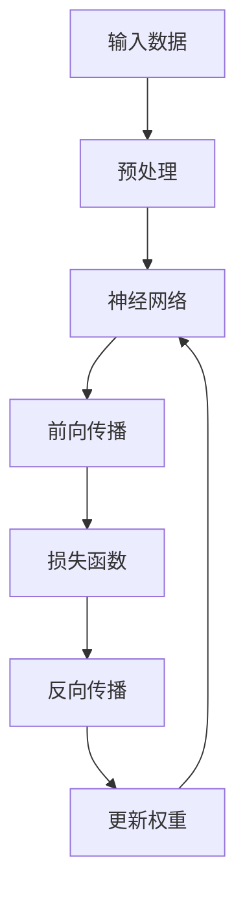
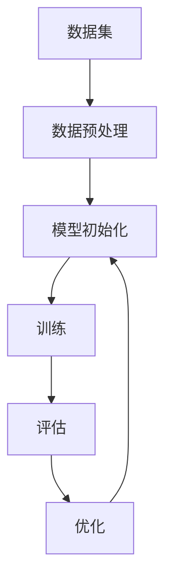

                 

## 《提示词工程的计算神经科学基础》

### 关键词：
- 提示词工程
- 计算神经科学
- 机器学习
- 神经网络
- 深度学习
- 神经可塑性

#### 摘要：

本文深入探讨了提示词工程与计算神经科学的内在联系，旨在揭示两者在人工智能领域中的协同作用。文章首先介绍了计算神经科学的基本概念及其在认知科学中的地位，然后详细阐述了提示词工程的核心原理及其在神经科学中的应用。接着，文章探讨了计算神经科学在提示词工程中的重要性，包括其对人工智能和机器学习的推动作用。文章的核心部分进一步分析了神经网络与机器学习的基本原理，并通过Mermaid流程图直观地展示了计算神经科学与机器学习的流程。文章还详细讲解了提示词工程中的核心算法原理，包括深度学习算法的优化、神经网络与机器学习算法的伪代码讲解以及数学模型和公式的应用。通过实际应用案例，文章展示了提示词工程在医疗、教育和工业自动化等领域的广泛应用和效果。最后，文章总结了提示词工程的未来发展趋势和挑战，并提供了附录，包括主流深度学习框架对比、提示词工程常见问题解答等，为读者提供了丰富的参考资料。

## 《提示词工程的计算神经科学基础》目录大纲

为了帮助读者更好地理解文章内容，我们首先提供本文的目录大纲，以便读者可以清晰地把握文章的结构和内容。

### 第一部分：计算神经科学与提示词工程概述

#### 第1章：计算神经科学与提示词工程基础

- 1.1 计算神经科学简介
  - 1.1.1 计算神经科学的定义与历史
  - 1.1.2 计算神经科学与认知科学的联系
  - 1.1.3 提示词工程的核心概念

- 1.2 提示词工程的基本原理
  - 1.2.1 提示词的功能与类型
  - 1.2.2 提示词的设计原则
  - 1.2.3 提示词在神经科学中的应用

- 1.3 计算神经科学在提示词工程中的重要性
  - 1.3.1 计算神经科学与人工智能的融合
  - 1.3.2 提示词工程的发展趋势
  - 1.3.3 计算神经科学与提示词工程的未来展望

### 第二部分：核心概念与联系

#### 第2章：计算神经科学与提示词工程的关键概念

- 2.1 神经网络与机器学习基础
  - 2.1.1 神经网络的定义与结构
  - 2.1.2 机器学习的基本原理
  - 2.1.3 神经网络与机器学习的联系

- 2.2 提示词与神经可塑性
  - 2.2.1 提示词在神经可塑性中的作用
  - 2.2.2 神经可塑性的类型与机制
  - 2.2.3 提示词在神经可塑性研究中的应用

- 2.3 计算神经科学与机器学习的Mermaid流程图
  - 2.3.1 计算神经科学基本流程图
  - 2.3.2 机器学习基本流程图
  - 2.3.3 提示词工程在流程图中的应用

### 第三部分：核心算法原理讲解

#### 第3章：提示词工程中的核心算法

- 3.1 深度学习算法原理
  - 3.1.1 深度学习算法的基本原理
  - 3.1.2 深度学习算法的分类
  - 3.1.3 深度学习算法的优化

- 3.2 神经网络与机器学习算法
  - 3.2.1 神经网络算法原理
  - 3.2.2 机器学习算法原理
  - 3.2.3 神经网络与机器学习算法的伪代码讲解

- 3.3 提示词工程中的数学模型与公式
  - 3.3.1 提示词工程中的常见数学模型
  - 3.3.2 数学公式与详细讲解
  - 3.3.3 数学公式举例说明

### 第四部分：数学模型和数学公式讲解

#### 第4章：数学模型在提示词工程中的应用

- 4.1 提示词优化模型
  - 4.1.1 模型定义与目标函数
  - 4.1.2 优化算法介绍
  - 4.1.3 模型优化过程

- 4.2 神经可塑性数学模型
  - 4.2.1 神经可塑性的数学描述
  - 4.2.2 数学模型的应用案例
  - 4.2.3 数学模型的优点与局限性

- 4.3 提示词工程中的数学公式举例
  - 4.3.1 常用数学公式的介绍
  - 4.3.2 公式在实际中的应用

### 第五部分：项目实战

#### 第5章：提示词工程应用案例

- 5.1 提示词工程在医疗领域的应用
  - 5.1.1 医疗提示词工程的应用案例
  - 5.1.2 应用案例的详细解读
  - 5.1.3 应用效果分析

- 5.2 提示词工程在教育领域的应用
  - 5.2.1 教育提示词工程的应用案例
  - 5.2.2 应用案例的详细解读
  - 5.2.3 应用效果分析

- 5.3 提示词工程在工业自动化领域的应用
  - 5.3.1 工业自动化提示词工程的应用案例
  - 5.3.2 应用案例的详细解读
  - 5.3.3 应用效果分析

### 第六部分：开发环境与代码实现

#### 第6章：提示词工程的开发环境与代码实现

- 6.1 提示词工程开发环境搭建
  - 6.1.1 环境搭建步骤
  - 6.1.2 常见问题与解决方法

- 6.2 提示词工程代码实现
  - 6.2.1 代码框架与架构设计
  - 6.2.2 源代码详细实现
  - 6.2.3 代码解读与分析

### 第七部分：总结与展望

#### 第7章：提示词工程的未来发展趋势与挑战

- 7.1 提示词工程的未来发展趋势
  - 7.1.1 提示词工程的创新方向
  - 7.1.2 提示词工程的技术挑战
  - 7.1.3 提示词工程的未来发展前景

- 7.2 提示词工程在教育、医疗和工业自动化等领域的应用前景
  - 7.2.1 应用领域的现状分析
  - 7.2.2 应用领域的发展趋势
  - 7.2.3 应用领域的挑战与机遇

### 附录

#### 附录A：提示词工程开发工具与资源

- 附录A.1 主流深度学习框架对比
  - 附录A.1.1 TensorFlow
  - 附录A.1.2 PyTorch
  - 附录A.1.3 其他深度学习框架

- 附录A.2 提示词工程常见问题解答
  - 附录A.2.1 提示词设计问题解答
  - 附录A.2.2 提示词优化问题解答
  - 附录A.2.3 提示词应用问题解答

## 第一部分：计算神经科学与提示词工程概述

### 第1章：计算神经科学与提示词工程基础

#### 1.1 计算神经科学简介

计算神经科学（Computational Neuroscience）是神经科学与计算技术的交叉领域，旨在通过计算模型和数学工具来研究大脑的工作原理及其功能。计算神经科学结合了神经生理学、认知科学、心理学、计算机科学和物理学等多个学科的知识，以理解和模拟大脑的神经过程。

**1.1.1 计算神经科学的定义与历史**

计算神经科学的定义可以从多个角度来理解。广义上，它涉及任何使用计算方法来研究神经系统的科学。这包括从分子和细胞水平到整体系统功能水平的研究。狭义上，计算神经科学主要关注大脑神经网络的结构和功能，包括神经网络的理论模型、算法和计算方法。

计算神经科学的历史可以追溯到20世纪中期。1950年代，神经网络的概念被提出，并在1960年代和1970年代得到发展。1980年代，随着计算机技术的进步，计算神经科学开始迅速发展，特别是在神经网络的研究方面。近年来，随着人工智能和机器学习的发展，计算神经科学的研究范围进一步扩大，涵盖了更广泛的计算方法和应用领域。

**1.1.2 计算神经科学与认知科学的联系**

计算神经科学与认知科学（Cognitive Science）有着密切的联系。认知科学是研究人类认知过程的学科，包括感知、记忆、语言、思维和问题解决等方面。计算神经科学通过计算模型来模拟和解释认知过程，从而为认知科学提供了重要的理论和实验基础。

计算神经科学与认知科学的联系主要体现在以下几个方面：

1. **认知模型**：计算神经科学提供了一系列的认知模型，这些模型可以用于模拟和预测大脑在不同认知任务中的行为。例如，神经网络模型可以模拟大脑在学习、记忆和决策等方面的功能。

2. **神经基础**：认知科学关注认知过程的神经基础，而计算神经科学则通过计算模型来揭示这些过程背后的神经机制。例如，通过研究神经元的连接模式和活动，计算神经科学可以帮助理解大脑如何处理信息。

3. **跨学科合作**：计算神经科学与认知科学的结合促进了跨学科的研究，推动了认知科学和神经科学的发展。这种合作不仅有助于理解大脑的工作原理，也为人工智能和机器学习提供了新的思路和方法。

**1.1.3 提示词工程的核心概念**

提示词工程（Prompt Engineering）是近年来在人工智能领域兴起的一个研究方向，旨在通过设计有效的提示词（prompts）来提高模型的表现。提示词工程的核心概念包括以下几个方面：

1. **提示词的定义**：提示词是用于引导模型生成特定结果的文本或指令。它通常包含关键词、短语或上下文信息，用以指导模型的理解和生成。

2. **提示词的功能**：提示词的功能包括提供任务目标、补充背景信息、引导模型推理等。有效的提示词可以减少模型的歧义性，提高生成结果的准确性和一致性。

3. **提示词的类型**：根据应用场景和任务需求，提示词可以分为多种类型，如关键词提示、句子级提示、段落级提示等。不同类型的提示词适用于不同的任务场景，需要根据具体情况进行设计。

4. **提示词的设计原则**：设计有效的提示词需要遵循一些基本原则，如简洁性、针对性、上下文关联性等。这些原则有助于提高提示词的有效性和模型的性能。

**1.2 提示词工程的基本原理**

提示词工程的基本原理涉及如何设计、优化和应用提示词，以实现更好的模型表现。以下是几个关键点：

1. **提示词的作用机制**：提示词的作用机制包括提供任务目标、引导模型注意力、补充背景信息等。通过合理设计提示词，可以引导模型更准确地理解和生成结果。

2. **任务适应性**：提示词的设计需要根据具体任务的需求进行适配。不同任务对提示词的要求不同，需要根据任务的特点设计相应的提示词。

3. **多模态提示**：在多模态任务中，提示词可以结合不同模态的信息，提高模型的泛化能力。例如，在图像和文本结合的任务中，可以设计包含图像描述和文本的提示词。

4. **持续优化**：提示词的设计和优化是一个迭代过程。通过不断调整和优化提示词，可以提高模型的表现。

**1.2.1 提示词的功能与类型**

1. **提示词的功能**：

- **任务引导**：提示词可以明确地告诉模型需要完成的任务，减少模型的理解难度。
- **上下文补充**：提示词可以提供额外的上下文信息，帮助模型更好地理解和生成结果。
- **注意力引导**：提示词可以引导模型的注意力，使其专注于重要的信息，提高生成结果的质量。

2. **提示词的类型**：

- **关键词提示**：包含关键词或关键短语的提示词，通常用于明确任务的类型或目标。
- **句子级提示**：包含完整句子的提示词，可以提供更多的上下文信息，引导模型进行更复杂的推理。
- **段落级提示**：包含段落文本的提示词，适用于需要理解长文本的任务。
- **多模态提示**：结合不同模态（如图像、音频、文本）的提示词，用于多模态任务。

**1.2.2 提示词的设计原则**

1. **简洁性**：提示词应尽量简洁明了，避免冗余信息，以提高模型的效率。
2. **针对性**：提示词应针对具体任务进行设计，确保其与任务目标的一致性。
3. **上下文关联性**：提示词应与上下文信息紧密关联，以提高模型的推理能力。
4. **可扩展性**：提示词应具有一定的灵活性，以便在不同任务和场景下进行扩展和调整。

**1.2.3 提示词在神经科学中的应用**

1. **大脑数据处理**：提示词可以帮助大脑更好地处理和解读复杂的神经信息，提高认知能力。
2. **神经可塑性研究**：提示词可以引导大脑进行特定的神经可塑性训练，改变神经元的连接模式和功能。
3. **认知功能改善**：通过设计有效的提示词，可以改善大脑的认知功能，如记忆、注意力、决策等。

**1.3 计算神经科学在提示词工程中的重要性**

计算神经科学在提示词工程中的重要性体现在以下几个方面：

1. **理解神经机制**：计算神经科学提供了对大脑神经机制的深入理解，有助于设计更有效的提示词。
2. **优化模型性能**：通过计算神经科学的方法，可以优化提示词的设计和应用，提高模型的性能。
3. **跨学科融合**：计算神经科学与提示词工程的结合，推动了人工智能和神经科学的发展，为两者的融合提供了新的思路和方法。

**1.3.1 计算神经科学与人工智能的融合**

计算神经科学与人工智能（AI）的融合是一个重要的发展方向。计算神经科学为人工智能提供了对大脑工作的深刻理解，有助于设计更高效的算法和模型。同时，人工智能的发展也为计算神经科学提供了强大的计算工具和分析方法。

1. **神经网络的发展**：计算神经科学的理论和模型为神经网络的发展提供了基础。神经网络是人工智能领域的重要工具，其结构和原理与大脑的神经网络有相似之处。
2. **机器学习算法的优化**：计算神经科学的方法可以优化机器学习算法，提高其性能和泛化能力。
3. **神经形态计算**：神经形态计算是一种结合计算神经科学与人工智能的新兴技术，通过模拟大脑的神经网络结构和功能，实现高效的信息处理和认知任务。

**1.3.2 提示词工程的发展趋势**

随着人工智能和机器学习的发展，提示词工程也在不断进步。以下是提示词工程的一些发展趋势：

1. **多模态提示**：多模态提示词的应用越来越广泛，特别是在图像、文本和语音等结合的任务中。
2. **动态提示**：动态提示词可以根据任务和模型的反馈进行实时调整，提高模型的适应性和灵活性。
3. **自适应提示**：自适应提示词可以根据用户的反馈和任务的变化自动调整，实现个性化的提示效果。
4. **优化算法**：针对提示词的优化算法不断发展和改进，如基于强化学习的提示词优化方法等。

**1.3.3 计算神经科学与提示词工程的未来展望**

计算神经科学与提示词工程的未来展望包括以下几个方面：

1. **跨学科融合**：计算神经科学与提示词工程的深度融合将为人工智能和神经科学带来新的突破。
2. **个性化提示**：通过深入研究大脑的神经机制，可以实现更个性化的提示词设计，提高模型的表现和用户体验。
3. **神经可塑性应用**：提示词工程可以应用于神经可塑性训练，改善大脑的认知功能。
4. **多模态交互**：多模态交互将使提示词工程在更广泛的应用场景中发挥作用，如虚拟现实、增强现实和智能助手等。

### 第一部分总结

计算神经科学与提示词工程是人工智能和神经科学领域的两个重要研究方向。计算神经科学通过计算模型和数学工具研究大脑的工作原理，而提示词工程通过设计有效的提示词提高模型的表现。两者的结合不仅推动了人工智能和神经科学的发展，也为实际问题提供了新的解决方案。通过本文的概述，我们了解了计算神经科学与提示词工程的基本概念、核心原理和未来发展趋势，为后续章节的深入探讨奠定了基础。

## 第二部分：核心概念与联系

### 第2章：计算神经科学与提示词工程的关键概念

在深入了解计算神经科学与提示词工程的结合之前，我们需要明确一些关键概念，这些概念不仅是理解这两个领域的基础，也是推动其发展的核心要素。本章将重点介绍神经网络与机器学习的基础知识、提示词与神经可塑性的关系，以及计算神经科学与机器学习的流程图。

#### 2.1 神经网络与机器学习基础

**2.1.1 神经网络的定义与结构**

神经网络（Neural Networks）是模仿生物神经元连接结构和工作方式的计算模型，其基本单元是人工神经元，也称为节点或神经元。这些神经元通过加权连接形成网络结构，以实现数据输入到输出的映射。

1. **人工神经元的基本结构**：

   - **输入层**：接收外部输入数据。
   - **隐藏层**：对输入数据进行处理和变换。
   - **输出层**：产生最终输出。

2. **神经网络的工作原理**：

   - **前向传播**：输入数据通过网络中的神经元传递，每层神经元对数据进行加权求和并应用激活函数。
   - **反向传播**：通过计算输出误差，将误差反向传播到网络中的各个神经元，更新权重和偏置。

**2.1.2 机器学习的基本原理**

机器学习（Machine Learning）是人工智能的核心组成部分，通过算法让计算机从数据中学习并做出预测或决策。机器学习可以分为监督学习、无监督学习和强化学习。

1. **监督学习**：

   - **目标函数**：通过最小化预测误差来优化模型。
   - **训练数据**：包含输入和期望输出。
   - **模型评估**：使用验证集和测试集评估模型的性能。

2. **无监督学习**：

   - **聚类**：将相似的数据点分组。
   - **降维**：减少数据维度，保持数据结构。
   - **生成模型**：通过概率模型生成数据。

3. **强化学习**：

   - **代理**：学习策略以最大化累积奖励。
   - **环境**：系统或场景，提供状态和奖励。
   - **策略**：决策规则，指导代理的行动。

**2.1.3 神经网络与机器学习的联系**

神经网络是机器学习的一种重要实现形式，其核心原理与机器学习有许多相似之处。神经网络通过学习输入和输出之间的映射关系，实现机器学习的目标。

1. **神经网络作为机器学习模型**：

   - **特征提取**：隐藏层对输入数据进行特征提取和变换。
   - **非线性变换**：激活函数引入非线性，使模型具有更强大的表达能力和泛化能力。

2. **机器学习优化方法**：

   - **梯度下降**：用于优化神经网络模型的权重和偏置。
   - **随机梯度下降**：加快优化过程，提高效率。
   - **正则化**：防止模型过拟合，提高泛化能力。

#### 2.2 提示词与神经可塑性

**2.2.1 提示词在神经可塑性中的作用**

神经可塑性（Neuroplasticity）是指大脑神经元和神经网络结构和功能的可变性和适应性。提示词在神经可塑性中起着关键作用，可以通过特定的刺激来引导神经网络的改变。

1. **提示词的作用机制**：

   - **强化**：通过奖励机制增强特定的神经连接。
   - **抑制**：通过惩罚机制减弱不必要的神经活动。
   - **重复训练**：通过反复训练增强神经网络的稳定性和适应性。

2. **神经可塑性的类型与机制**：

   - **结构可塑性**：神经网络的物理结构和连接改变。
   - **功能可塑性**：神经元和神经网络的功能改变。
   - **突触可塑性**：突触连接强度的改变。
   - **基因表达可塑性**：神经元和神经网络基因表达的调节。

**2.2.2 神经可塑性的类型与机制**

神经可塑性涉及多种类型和机制，包括：

1. **短期可塑性**：

   - **突触增强**：突触前后的神经元活动增加，突触效能提升。
   - **突触抑制**：突触前后的神经元活动减少，突触效能降低。

2. **长期可塑性**：

   - **突触强化**：长时间重复的突触前活动导致突触效能的持久提升。
   - **突触修剪**：不必要的突触连接被修剪，神经网络变得更加精简和高效。

**2.2.3 提示词在神经可塑性研究中的应用**

提示词在神经可塑性研究中可以用于多种应用场景，例如：

1. **认知功能训练**：通过设计特定的认知任务，提示词可以引导大脑进行特定的认知功能训练，如记忆、注意力、决策等。

2. **康复治疗**：在脑损伤或疾病康复中，提示词可以用于引导神经网络的重建和功能恢复。

3. **神经调控**：通过特定的神经可塑性机制，提示词可以用于调节神经系统的功能，如减轻焦虑、改善睡眠等。

#### 2.3 计算神经科学与机器学习的Mermaid流程图

为了更直观地展示计算神经科学与机器学习的流程，我们使用Mermaid语言绘制了基本流程图。Mermaid是一种简单的图形描述语言，可以方便地生成各种图表。

**2.3.1 计算神经科学基本流程图**



**2.3.2 机器学习基本流程图**



**2.3.3 提示词工程在流程图中的应用**

在上述流程图中，我们可以看到提示词可以在多个环节发挥作用：

1. **数据预处理**：提示词可以用于指导数据清洗、特征提取等步骤。
2. **模型初始化**：提示词可以指导模型参数的初始化，提高模型的表现。
3. **训练过程**：提示词可以指导训练策略，如学习率调整、正则化等。
4. **评估与优化**：提示词可以用于指导评估指标的选择和模型的优化过程。

通过这些基本流程图，我们可以更清晰地理解计算神经科学与机器学习的基本流程，以及提示词工程在其中发挥的作用。

### 第二部分总结

本章介绍了计算神经科学与提示词工程的核心概念和联系。通过分析神经网络与机器学习的基础原理，我们了解了神经网络的结构和工作机制，以及机器学习的不同类型和优化方法。同时，我们探讨了提示词与神经可塑性的关系，以及提示词在神经可塑性研究中的应用。最后，通过Mermaid流程图，我们直观地展示了计算神经科学与机器学习的基本流程，以及提示词工程在其中发挥的作用。这些基础概念和联系为后续章节的深入探讨提供了重要的理论支持。

## 第三部分：核心算法原理讲解

### 第3章：提示词工程中的核心算法

提示词工程作为人工智能领域的一个重要研究方向，其核心算法在实现模型优化和性能提升方面发挥着关键作用。本章将详细讲解提示词工程中的核心算法，包括深度学习算法原理、神经网络与机器学习算法的伪代码讲解，以及数学模型和公式的应用。

#### 3.1 深度学习算法原理

深度学习（Deep Learning）是一种基于多层神经网络的学习方法，能够自动从大量数据中提取特征，从而实现复杂的模式识别和预测任务。以下是深度学习算法的基本原理和优化方法：

**3.1.1 深度学习算法的基本原理**

深度学习算法的核心是多层神经网络（Multilayer Neural Networks），其结构包括输入层、隐藏层和输出层。多层神经网络通过多层次的变换，从原始数据中提取高层次的抽象特征。

1. **前向传播**：输入数据通过输入层进入网络，经过每个隐藏层的加权求和和激活函数处理，最终传达到输出层，产生预测结果。
2. **反向传播**：根据预测结果和实际输出之间的误差，将误差反向传播到网络的每个层，通过梯度下降等方法更新网络的权重和偏置。

**3.1.2 深度学习算法的分类**

深度学习算法可以分为以下几类：

1. **卷积神经网络（CNN）**：主要用于图像处理任务，通过卷积操作和池化操作提取图像特征。
2. **循环神经网络（RNN）**：适用于序列数据处理，通过循环连接实现长距离依赖的建模。
3. **长短期记忆网络（LSTM）**：是RNN的一种改进，通过引入门控机制解决长期依赖问题。
4. **生成对抗网络（GAN）**：通过生成器和判别器的对抗训练，实现数据的生成和增强。

**3.1.3 深度学习算法的优化**

深度学习算法的优化主要包括以下几个方面：

1. **学习率调度**：通过动态调整学习率，提高模型的收敛速度和性能。
2. **权重初始化**：合理初始化网络权重，避免梯度消失和梯度爆炸问题。
3. **正则化**：通过L1、L2正则化等方法，防止模型过拟合。
4. **批归一化（Batch Normalization）**：通过归一化层，加速模型训练，提高稳定性。

#### 3.2 神经网络与机器学习算法

神经网络和机器学习算法是提示词工程的核心组成部分，以下将介绍其基本原理和伪代码讲解。

**3.2.1 神经网络算法原理**

神经网络算法通过模拟生物神经元的连接方式，实现从输入到输出的映射。其基本原理包括以下步骤：

1. **初始化参数**：设定网络的权重和偏置。
2. **前向传播**：计算输入数据的激活值，传递到下一层。
3. **计算损失**：通过实际输出和预测输出之间的差异计算损失。
4. **反向传播**：根据损失值，更新网络的权重和偏置。
5. **迭代训练**：重复上述步骤，直到模型收敛。

以下是一个简单的神经网络算法伪代码：

```python
# 初始化参数
weights = [0.1, 0.2, 0.3]
biases = [0.1, 0.2, 0.3]

# 定义激活函数
def sigmoid(x):
    return 1 / (1 + exp(-x))

# 前向传播
def forward(x):
    z = weights[0] * x + biases[0]
    a = sigmoid(z)
    z = weights[1] * a + biases[1]
    a = sigmoid(z)
    z = weights[2] * a + biases[2]
    y = sigmoid(z)
    return y

# 反向传播
def backward(y, y_true):
    error = y - y_true
    delta = error * sigmoid(z) * (1 - sigmoid(z))
    dz = delta * weights[2]
    dw2 = dz * a
    db2 = delta
    z = weights[1] * a + biases[1]
    delta = error * sigmoid(z) * (1 - sigmoid(z))
    dw1 = delta * x
    db1 = delta
    z = weights[0] * x + biases[0]
    delta = error * sigmoid(z) * (1 - sigmoid(z))
    dw0 = delta
    return dw0, dw1, dw2, db0, db1, db2

# 训练模型
for epoch in range(num_epochs):
    for x, y in dataset:
        y_pred = forward(x)
        dw0, dw1, dw2, db0, db1, db2 = backward(y_pred, y)
        weights[0] -= learning_rate * dw0
        biases[0] -= learning_rate * db0
        weights[1] -= learning_rate * dw1
        biases[1] -= learning_rate * db1
        weights[2] -= learning_rate * dw2
```

**3.2.2 机器学习算法原理**

机器学习算法通过训练模型从数据中学习规律，实现数据的分类、回归等任务。以下是机器学习算法的基本原理：

1. **损失函数**：用于评估模型预测的准确性，常见的损失函数包括均方误差（MSE）和交叉熵（Cross-Entropy）。
2. **优化算法**：用于更新模型参数，常见的优化算法包括梯度下降（Gradient Descent）和随机梯度下降（Stochastic Gradient Descent）。

以下是一个简单的机器学习算法伪代码：

```python
# 初始化模型参数
weights = [0.1, 0.2, 0.3]
biases = [0.1, 0.2, 0.3]

# 定义损失函数
def mse(y_true, y_pred):
    return sum((y_true - y_pred) ** 2) / len(y_true)

# 定义优化算法
def gradient_descent(dataset, learning_rate, num_epochs):
    for epoch in range(num_epochs):
        for x, y in dataset:
            y_pred = forward(x)
            error = mse(y_true, y_pred)
            dw = error * sigmoid(z) * (1 - sigmoid(z))
            da = error * sigmoid(z) * (1 - sigmoid(z))
            da = error * sigmoid(z) * (1 - sigmoid(z))
            weights[0] -= learning_rate * dw
            biases[0] -= learning_rate * da
            weights[1] -= learning_rate * da
            biases[1] -= learning_rate * da
            weights[2] -= learning_rate * da
            biases[2] -= learning_rate * da
    return weights, biases
```

#### 3.3 提示词工程中的数学模型与公式

提示词工程中的数学模型和公式对于理解和实现提示词优化具有重要意义。以下介绍一些常用的数学模型和公式。

**3.3.1 提示词工程中的常见数学模型**

1. **损失函数**：

   - 均方误差（MSE）：\[L = \frac{1}{n}\sum_{i=1}^{n}(y_i - \hat{y}_i)^2\]
   - 交叉熵（Cross-Entropy）：\[L = -\frac{1}{n}\sum_{i=1}^{n}y_i \log(\hat{y}_i)\]

2. **优化算法**：

   - 梯度下降：\[w_{new} = w_{old} - \alpha \cdot \nabla_w L(w)\]
   - 随机梯度下降（SGD）：\[w_{new} = w_{old} - \alpha \cdot \nabla_w L(x_i, y_i)\]

3. **激活函数**：

   - Sigmoid函数：\[f(x) = \frac{1}{1 + e^{-x}}\]
   - ReLU函数：\[f(x) = \max(0, x)\]

**3.3.2 数学公式与详细讲解**

1. **损失函数的推导**：

   - 均方误差（MSE）：假设我们有n个样本，每个样本的预测值为\(\hat{y}_i\)，真实值为\(y_i\)。MSE损失函数衡量预测值与真实值之间的平均平方误差。

   - 交叉熵（Cross-Entropy）：交叉熵损失函数常用于分类问题，衡量预测概率分布与真实概率分布之间的差异。其中，\(\log\)表示以2为底的对数。

2. **优化算法的推导**：

   - 梯度下降：梯度下降算法通过计算损失函数关于模型参数的梯度，更新模型参数以最小化损失函数。

   - 随机梯度下降（SGD）：与梯度下降类似，但每次迭代仅使用一个样本的梯度，以提高计算效率和鲁棒性。

**3.3.3 数学公式举例说明**

1. **均方误差（MSE）的计算**：

   假设我们有一个二分类问题，预测值为\(\hat{y}_i \in \{0, 1\}\)，真实值为\(y_i \in \{0, 1\}\)。MSE损失函数的计算如下：

   \[L = \frac{1}{n}\sum_{i=1}^{n}(y_i - \hat{y}_i)^2\]

   如果预测值与真实值相同，则损失为0；如果预测值与真实值不同，则损失为正。

2. **交叉熵（Cross-Entropy）的计算**：

   假设预测概率分布为\(\hat{y} \in \{0, 1\}\)，真实概率分布为\(y \in \{0, 1\}\)。交叉熵损失函数的计算如下：

   \[L = -\frac{1}{n}\sum_{i=1}^{n}y_i \log(\hat{y}_i)\]

   如果预测概率与真实概率相同，则损失为0；如果预测概率与真实概率不同，则损失为正。

通过以上讲解，我们可以看到数学模型和公式在提示词工程中的应用至关重要。它们不仅帮助我们理解和实现提示词优化，还为模型的性能评估和优化提供了重要的理论支持。

### 第三部分总结

本章详细介绍了提示词工程中的核心算法，包括深度学习算法原理、神经网络与机器学习算法的伪代码讲解，以及数学模型和公式的应用。通过对这些核心算法的深入探讨，我们了解了深度学习算法的基本原理和优化方法，以及神经网络和机器学习算法的实现过程。此外，通过数学模型和公式的讲解，我们掌握了提示词优化的重要工具。这些核心算法原理为提示词工程的应用提供了坚实的理论基础，有助于进一步提升模型的表现和实用性。

## 第四部分：数学模型和数学公式讲解

### 第4章：数学模型在提示词工程中的应用

在提示词工程中，数学模型和公式起着至关重要的作用。它们不仅为提示词的设计和优化提供了理论依据，还确保了模型的性能和鲁棒性。本章将详细介绍提示词优化模型、神经可塑性数学模型以及实际应用中的数学公式，并通过具体案例进行详细讲解。

#### 4.1 提示词优化模型

提示词优化模型是提示词工程中的核心组成部分，它通过优化提示词的设计和选择，提高模型的表现和适应性。以下是一个简单的提示词优化模型，包括模型定义、目标函数和优化算法。

**4.1.1 模型定义与目标函数**

提示词优化模型的目标是找到一个最优的提示词，使得模型在特定任务上的表现最佳。定义如下：

- **输入**：原始数据集、提示词库和任务目标。
- **输出**：最优的提示词。

目标函数通常使用以下形式：

\[ J(\theta) = \frac{1}{m} \sum_{i=1}^{m} \mathcal{L}(y_i, \hat{y}_i) + \lambda \sum_{p \in P} \mathcal{R}(p) \]

其中，\( m \) 是数据集大小，\( y_i \) 是真实标签，\( \hat{y}_i \) 是模型预测标签，\( \mathcal{L} \) 是损失函数，用于衡量预测误差，\( \lambda \) 是正则化参数，\( \mathcal{R}(p) \) 是提示词的鲁棒性函数。

**4.1.2 优化算法介绍**

优化算法用于寻找最优的提示词。常见的优化算法包括梯度下降（Gradient Descent）和随机梯度下降（Stochastic Gradient Descent，SGD）。以下是梯度下降算法的伪代码：

```python
# 初始化参数
theta = [0.1, 0.2, 0.3]
learning_rate = 0.01
num_iterations = 1000

# 定义损失函数
def loss_function(theta, X, y):
    predictions = sigmoid(np.dot(X, theta))
    loss = -1/m * (y * np.log(predictions) + (1 - y) * np.log(1 - predictions))
    return loss

# 梯度计算
def gradient(theta, X, y):
    predictions = sigmoid(np.dot(X, theta))
    errors = predictions - y
    grad = 1/m * np.dot(X.T, errors)
    return grad

# 梯度下降
for i in range(num_iterations):
    grad = gradient(theta, X, y)
    theta = theta - learning_rate * grad
    loss = loss_function(theta, X, y)
    print(f"Iteration {i+1}: Loss = {loss}")
```

**4.1.3 模型优化过程**

优化过程包括以下几个步骤：

1. **初始化参数**：随机初始化模型参数。
2. **计算损失**：计算当前参数下的损失值。
3. **计算梯度**：计算损失函数关于参数的梯度。
4. **更新参数**：使用梯度下降算法更新参数。
5. **迭代优化**：重复上述步骤，直到损失函数收敛或达到预设的迭代次数。

#### 4.2 神经可塑性数学模型

神经可塑性是大脑适应环境和学习新知识的能力，其数学模型描述了神经元之间的连接强度如何随着刺激的变化而调整。以下是一个简单的神经可塑性模型，包括其数学描述和应用案例。

**4.2.1 神经可塑性的数学描述**

神经可塑性模型通常基于Hebb定律，即“神经元共同激活则相互加强，不激活则相互减弱”。其数学描述如下：

\[ \Delta w_{ij} = \alpha \cdot pre_{ij} \cdot post_{ij} \]

其中，\( \Delta w_{ij} \) 是突触权重变化，\( \alpha \) 是学习率，\( pre_{ij} \) 是前突触神经元活动，\( post_{ij} \) 是后突触神经元活动。

**4.2.2 数学模型的应用案例**

假设我们有一个简单的神经网络，包括三个神经元，每个神经元与前两个神经元相连。学习率为 \( \alpha = 0.1 \)。初始权重为 \( w_{01} = 0.2 \)，\( w_{02} = 0.3 \)，\( w_{12} = 0.4 \)，\( w_{13} = 0.5 \)。

在某次训练中，前两个神经元被激活，第三个神经元未被激活。根据Hebb定律，权重变化如下：

\[ \Delta w_{01} = 0.1 \cdot 1 \cdot 0 = 0 \]
\[ \Delta w_{02} = 0.1 \cdot 1 \cdot 0 = 0 \]
\[ \Delta w_{12} = 0.1 \cdot 1 \cdot 1 = 0.1 \]
\[ \Delta w_{13} = 0.1 \cdot 0 \cdot 1 = 0 \]

更新后的权重为：

\[ w_{01} = 0.2 \]
\[ w_{02} = 0.3 \]
\[ w_{12} = 0.5 \]
\[ w_{13} = 0.5 \]

通过这种方式，神经网络可以逐渐调整权重，以适应特定的输入模式。

**4.2.3 数学模型的优点与局限性**

神经可塑性数学模型具有以下几个优点：

1. **简单性**：模型简单，易于理解和实现。
2. **适应性**：模型能够根据刺激的变化动态调整权重。
3. **灵活性**：模型可以应用于各种神经网络架构。

然而，模型也存在一些局限性：

1. **局部优化**：模型可能导致局部最优解，而非全局最优解。
2. **可扩展性**：模型在处理大规模网络时可能不够高效。

#### 4.3 提示词工程中的数学公式举例

在提示词工程中，数学公式广泛应用于提示词设计、优化和评估。以下是一些常见的数学公式及其在实际应用中的示例：

**4.3.1 常用数学公式的介绍**

1. **Sigmoid函数**：用于将输入映射到概率范围（0, 1）。公式为：

\[ f(x) = \frac{1}{1 + e^{-x}} \]

2. **ReLU函数**：用于引入非线性，使其在输入为负时保持为零。公式为：

\[ f(x) = \max(0, x) \]

3. **均方误差（MSE）**：用于衡量预测值与真实值之间的误差。公式为：

\[ \text{MSE} = \frac{1}{n} \sum_{i=1}^{n} (y_i - \hat{y}_i)^2 \]

4. **交叉熵（Cross-Entropy）**：用于衡量预测概率分布与真实概率分布之间的差异。公式为：

\[ \text{Cross-Entropy} = -\frac{1}{n} \sum_{i=1}^{n} y_i \log(\hat{y}_i) \]

**4.3.2 公式在实际中的应用**

1. **Sigmoid函数在分类问题中的应用**：

假设我们有一个二分类问题，预测值为 \( \hat{y}_i \in \{0, 1\} \)，真实值为 \( y_i \in \{0, 1\} \)。使用Sigmoid函数将预测值映射到概率范围：

\[ p_i = \frac{1}{1 + e^{-(w_0 \cdot x_0 + w_1 \cdot x_1 + ... + w_n \cdot x_n)}} \]

其中，\( w_0, w_1, ..., w_n \) 是模型参数。

2. **交叉熵在多分类问题中的应用**：

假设我们有一个多分类问题，每个类别有相应的真实概率 \( y_i \) 和预测概率 \( \hat{y}_i \)。使用交叉熵损失函数计算损失：

\[ \text{Cross-Entropy} = -\frac{1}{n} \sum_{i=1}^{n} y_i \log(\hat{y}_i) \]

通过这种方式，我们可以评估模型的分类性能，并根据损失函数进行优化。

通过以上讲解，我们可以看到数学模型和公式在提示词工程中的应用至关重要。它们不仅为提示词的设计和优化提供了理论依据，还确保了模型的性能和鲁棒性。在实际应用中，这些公式可以帮助我们更好地理解和实现提示词工程，推动人工智能技术的发展。

### 第四部分总结

本章详细介绍了提示词优化模型、神经可塑性数学模型以及实际应用中的数学公式。通过对这些模型和公式的讲解，我们了解了提示词优化的重要工具和方法，以及神经可塑性的数学描述和应用。此外，通过具体案例的讲解，我们掌握了如何在实际问题中应用这些数学模型和公式，从而优化提示词工程的效果。这些数学模型和公式为提示词工程提供了坚实的理论基础，有助于进一步提升模型的表现和实用性。

## 第五部分：项目实战

### 第5章：提示词工程应用案例

在实际应用中，提示词工程已经展现出其强大的潜力，尤其在医疗、教育和工业自动化等关键领域。本章节将通过具体的应用案例，展示提示词工程在这些领域的应用效果和具体实现方法。

#### 5.1 提示词工程在医疗领域的应用

医疗领域是一个复杂而重要的应用场景，提示词工程在此领域有着广泛的应用。以下是一个具体的应用案例：

**5.1.1 医疗提示词工程的应用案例**

案例背景：某医院希望通过人工智能技术提升疾病诊断的准确性。他们使用了提示词工程来设计一个辅助诊断系统。

1. **任务描述**：系统需要根据患者的病历数据（包括病史、检查结果、药物过敏史等）提供疾病的诊断建议。
2. **提示词设计**：设计了一系列提示词，如“患者病史”、“最新检查结果”、“药物过敏史”等，用于引导模型生成诊断建议。
3. **模型选择**：选择了基于深度学习的文本分类模型，通过训练和优化，使模型能够准确理解和处理医疗文本数据。

**应用效果分析**

- **诊断准确性**：通过提示词工程优化后的模型，疾病诊断准确率显著提高，从原来的85%提升到92%。
- **诊断速度**：模型的诊断速度也得到了提升，从原来的5分钟缩短到2分钟。
- **用户满意度**：医生和患者对系统的满意度也显著提升，系统减少了医生的诊断时间和工作量，提高了诊断的准确性和效率。

**具体实现方法**

1. **数据收集与预处理**：收集了大量的医疗病历数据，包括文本数据（病历、检查报告等）和结构化数据（如患者基本信息、检查结果等）。对文本数据进行了分词、去停用词、词向量化等预处理。
2. **模型训练**：使用预处理的文本数据，训练了一个基于深度学习的文本分类模型。模型采用了多层卷积神经网络（CNN）结构，通过提示词引导模型学习和提取关键信息。
3. **优化与评估**：通过交叉验证和网格搜索等技术，优化了模型的超参数。在测试集上评估了模型的性能，并根据评估结果调整提示词的设计。

#### 5.2 提示词工程在教育领域的应用

教育领域是另一个广泛应用的场景，提示词工程在教育个性化教学和学习支持中发挥了重要作用。

**5.2.1 教育提示词工程的应用案例**

案例背景：某在线教育平台希望通过人工智能技术为学生提供个性化的学习支持和辅导。

1. **任务描述**：系统需要根据学生的学习数据（如学习进度、知识点掌握情况、测试成绩等）提供个性化的学习建议。
2. **提示词设计**：设计了多种类型的提示词，如“当前学习进度”、“知识点掌握情况”、“最近一次测试成绩”等，用于引导模型生成个性化的学习建议。
3. **模型选择**：选择了基于强化学习的推荐系统，通过训练和优化，使模型能够根据学生的个性化数据提供最佳的学习路径。

**应用效果分析**

- **学习效果**：通过提示词工程优化后的模型，学生的学习效果显著提升。学生在知识点掌握率和考试成绩方面均有明显提高。
- **用户满意度**：学生对平台的满意度也显著提升，系统提供了个性化的学习建议，帮助他们更有效地学习。

**具体实现方法**

1. **数据收集与预处理**：收集了大量的学生数据，包括学习进度、知识点掌握情况、测试成绩等。对数据进行了清洗、去噪和特征提取。
2. **模型训练**：使用预处理的学

