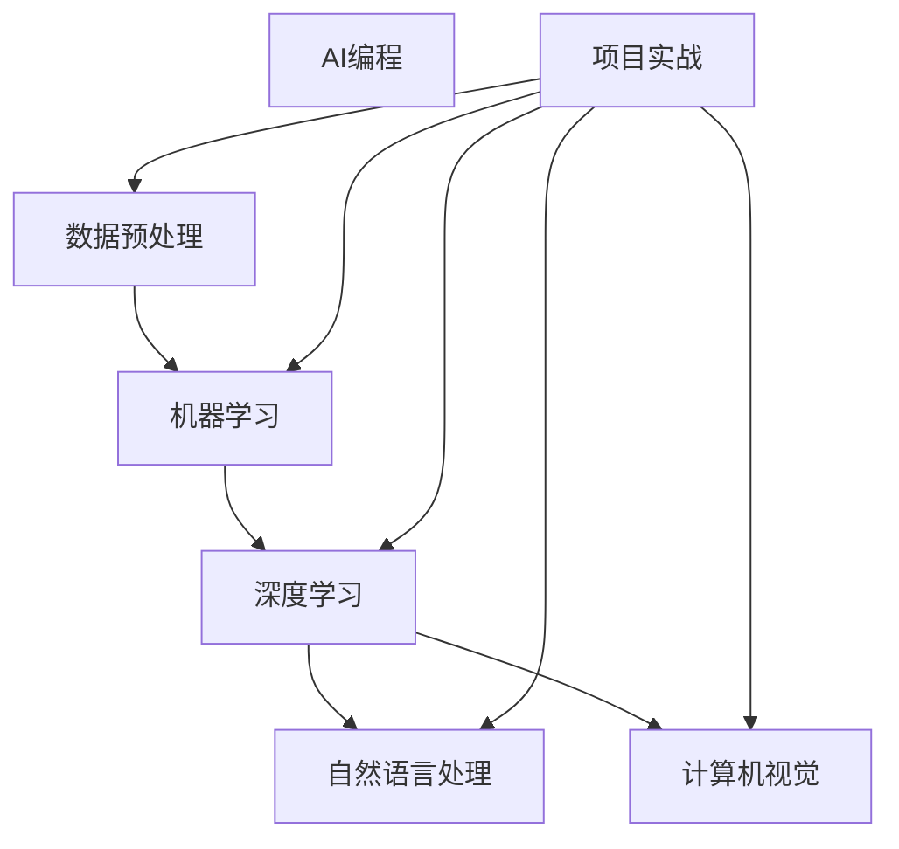
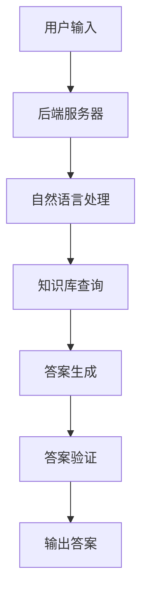

                 

# AI编程的新视角与新未来

> 关键词：人工智能，编程，深度学习，自然语言处理，计算机视觉，项目实战

> 摘要：
人工智能（AI）已成为现代技术发展的核心驱动力。AI编程是实现人工智能应用的关键环节。本文从AI编程的概述、基础知识、核心算法、框架应用、应用领域以及未来趋势等多个角度，探讨了AI编程的新视角与新未来。通过深入剖析核心概念与算法原理，结合实际项目实战，本文旨在为读者提供一份全面、系统的AI编程指南。

### 目录大纲设计：《AI编程的新视角与新未来》

----------------------------------------------------------------

## 第一部分: AI编程概述与核心技术

### 第1章: AI编程的起源与发展

#### 1.1 AI编程的定义与基本概念

#### 1.2 AI编程的发展历程

#### 1.3 AI编程的挑战与机遇

### 第2章: AI编程的基础知识

#### 2.1 数据与模型预处理

#### 2.2 常用编程语言与框架介绍

#### 2.3 数据结构与算法基础

### 第3章: 机器学习算法原理

#### 3.1 监督学习算法

#### 3.2 无监督学习算法

#### 3.3 强化学习算法

### 第4章: 深度学习框架应用

#### 4.1 TensorFlow基础知识

#### 4.2 PyTorch入门与进阶

#### 4.3 其他深度学习框架简介

### 第5章: 自然语言处理应用

#### 5.1 语言模型与序列标注

#### 5.2 文本分类与主题模型

#### 5.3 机器翻译与对话系统

### 第6章: 计算机视觉应用

#### 6.1 卷积神经网络在图像识别中的应用

#### 6.2 图像生成与风格迁移

#### 6.3 视觉推理与视频分析

### 第7章: AI编程的未来趋势

#### 7.1 人工智能与社会发展

#### 7.2 AI编程的新技术动态

#### 7.3 AI编程的伦理与法律问题

----------------------------------------------------------------

## 第二部分: AI编程项目实战

### 第8章: 项目实战一：智能问答系统开发

#### 8.1 项目需求与设计

#### 8.2 系统架构与实现

#### 8.3 代码分析与优化

### 第9章: 项目实战二：推荐系统构建

#### 9.1 项目需求与设计

#### 9.2 系统架构与实现

#### 9.3 代码分析与优化

### 第10章: 项目实战三：图像识别与分类

#### 10.1 项目需求与设计

#### 10.2 系统架构与实现

#### 10.3 代码分析与优化

### 第11章: 项目实战四：自然语言处理应用

#### 11.1 项目需求与设计

#### 11.2 系统架构与实现

#### 11.3 代码分析与优化

### 第12章: 项目实战五：智能驾驶系统开发

#### 12.1 项目需求与设计

#### 12.2 系统架构与实现

#### 12.3 代码分析与优化

----------------------------------------------------------------

## 第三部分: AI编程技术与未来展望

### 第13章: AI编程中的算法优化

#### 13.1 算法复杂度分析

#### 13.2 并行计算与分布式系统

#### 13.3 模型压缩与量化技术

### 第14章: AI编程中的数据安全与隐私

#### 14.1 数据安全风险分析

#### 14.2 隐私保护技术

#### 14.3 数据监管与法律法规

### 第15章: AI编程的未来发展

#### 15.1 AI编程在教育领域的应用

#### 15.2 AI编程在医疗健康领域的应用

#### 15.3 AI编程在智能家居与智慧城市领域的应用

### 第16章: 总结与展望

#### 16.1 AI编程的核心价值

#### 16.2 AI编程的学习路径与建议

#### 16.3 AI编程的未来发展趋势与挑战

----------------------------------------------------------------

### 核心概念与联系

为了更好地理解AI编程的核心概念和它们之间的关系，我们可以借助Mermaid图形来展示这些概念及其相互联系。



通过这张图，我们可以清晰地看到AI编程的主要分支，包括数据预处理、机器学习、深度学习、自然语言处理和计算机视觉，以及这些分支如何通过项目实战来应用和实践。

### 核心算法原理讲解

在AI编程中，核心算法是理解和实现机器学习、深度学习以及其他AI应用的基础。以下是几个关键算法的原理讲解，包括监督学习算法的详细讲解和数学模型及公式。

#### 监督学习算法原理

**1. 监督学习算法概述**

监督学习（Supervised Learning）是一种机器学习方法，其中算法通过学习一个标记好的训练数据集来预测输出。标记数据意味着每个输入都有对应的正确输出标签。

**2. 算法模型**

假设我们有输入特征向量 \(X\) 和对应的标签 \(y\)，监督学习算法的目标是找到一个函数 \(f\)，使得 \(f(X)\) 尽可能接近 \(y\)。

数学模型如下：

$$ y = \beta_0 + \beta_1 \cdot x + \epsilon $$

其中：
- \(y\) 是输出标签
- \(x\) 是输入特征
- \(\beta_0\) 和 \(\beta_1\) 是模型参数
- \(\epsilon\) 是误差项

**3. 常见算法**

- **线性回归（Linear Regression）**：简单的一元或多元线性方程，用于预测连续值。
  - **伪代码**：
    ```python
    # 初始化模型参数 β
    β <- 初始化参数()
    # 训练过程
    for each 数据点 (x, y) in 训练集 do
        预测值 y' <- β * x
        更新 β = β - 学习率 * (y - y')
    end for
    ```

- **逻辑回归（Logistic Regression）**：用于分类问题，输出概率值。
  - **伪代码**：
    ```python
    # 初始化模型参数 β
    β <- 初始化参数()
    # 训练过程
    for each 数据点 (x, y) in 训练集 do
        预测值 y' <- sigmoid(β * x)
        更新 β = β - 学习率 * (y * (1 - y') - y' * y)
    end for
    ```

- **决策树（Decision Tree）**：利用特征进行二分或多分，构建决策树模型。
  - **伪代码**：
    ```python
    # 构建决策树
    function 决策树训练(数据集)
        if 数据集是纯的 then
            return 数据集的多数标签
        else
            选择最优特征与阈值
            分割数据集
            for each 子集 do
                决策树训练(子集)
            end for
            return 分支结构
        end if
    end function
    ```

**4. 例子**

假设我们要预测房价，使用线性回归模型。给定输入特征（如房屋面积、位置等）和对应的房价标签，我们的目标是找到一个线性函数来预测未知房屋的房价。

- **输入特征**：\(X = [面积, 地点]\)
- **标签**：\(y = 房价\)
- **模型**：\(y' = \beta_0 + \beta_1 \cdot 面积 + \beta_2 \cdot 地点\)

通过训练数据集，我们可以计算出最佳参数 \(\beta_0, \beta_1, \beta_2\)，从而预测新的房屋价格。

### 数学模型和数学公式 & 详细讲解 & 举例说明

#### 线性回归

线性回归是一种用于预测连续值的监督学习算法。它的目标是找到一个线性函数，使得输入特征与输出标签之间尽可能匹配。

数学模型如下：

$$ y = \beta_0 + \beta_1 \cdot x + \epsilon $$

其中：
- \(y\) 是输出标签
- \(x\) 是输入特征
- \(\beta_0\) 和 \(\beta_1\) 是模型参数
- \(\epsilon\) 是误差项

#### 举例说明

假设我们要预测一个人的收入（\(y\)）基于他们的工作经验（\(x\)）。

- 数据集：\(X = [1, 2, 3, 4, 5]\)，\(y = [20, 30, 40, 50, 60]\)
- 目标：找到线性函数 \(y = \beta_0 + \beta_1 \cdot x\)

通过最小化误差平方和，我们可以计算得到最佳参数：

$$ \beta_1 = \frac{\sum (x_i - \bar{x})(y_i - \bar{y})}{\sum (x_i - \bar{x})^2} $$
$$ \beta_0 = \bar{y} - \beta_1 \cdot \bar{x} $$

其中，\(\bar{x}\) 和 \(\bar{y}\) 分别是 \(x\) 和 \(y\) 的平均值。

#### 计算过程

1. 计算 \(x\) 和 \(y\) 的平均值：
   $$ \bar{x} = \frac{1 + 2 + 3 + 4 + 5}{5} = 3 $$
   $$ \bar{y} = \frac{20 + 30 + 40 + 50 + 60}{5} = 40 $$

2. 计算 \(\beta_1\)：
   $$ \beta_1 = \frac{(1-3)(20-40) + (2-3)(30-40) + (3-3)(40-40) + (4-3)(50-40) + (5-3)(60-40)}{(1-3)^2 + (2-3)^2 + (3-3)^2 + (4-3)^2 + (5-3)^2} $$
   $$ \beta_1 = \frac{-20 - 10 + 0 + 10 + 30}{4 + 1 + 0 + 1 + 4} $$
   $$ \beta_1 = \frac{0}{10} $$
   $$ \beta_1 = 0 $$

3. 计算 \(\beta_0\)：
   $$ \beta_0 = 40 - 0 \cdot 3 $$
   $$ \beta_0 = 40 $$

因此，线性回归模型为 \(y = 40\)，即每个人的收入都是40。

#### 结果验证

我们可以使用这个模型来预测新的收入。例如，当工作经验为6年时，预测收入为：
$$ y = 40 = \beta_0 + \beta_1 \cdot 6 $$
$$ \beta_1 = 0 $$

这个结果说明，在这个数据集中，工作经验并不影响收入。这可能是因为数据集不够全面或者存在其他影响因素。在实际应用中，我们需要更多的数据和更复杂的模型来准确预测收入。

### 项目实战：智能问答系统开发

智能问答系统是一个典型的AI应用，它允许用户通过自然语言提问，系统自动生成并返回相关答案。以下是一个智能问答系统开发的项目实战。

#### 9.1 项目需求与设计

智能问答系统旨在为用户提供一个简洁、高效的问答平台。以下为项目需求与设计：

##### 需求
1. **用户输入**：提供一个输入框，允许用户输入自然语言问题。
2. **问题理解**：使用自然语言处理技术，理解用户的问题，提取关键信息。
3. **知识库查询**：根据提取的信息，在预定义的知识库中查找相关信息。
4. **答案生成**：生成并返回用户问题的答案。
5. **答案验证**：对生成的答案进行验证，确保答案的准确性和可靠性。

##### 设计
1. **用户接口**：使用HTML和CSS设计一个简洁的用户界面。
2. **后端服务器**：使用Python Flask构建一个后端服务器，处理用户请求。
3. **自然语言处理**：使用NLTK库进行分词和词性标注。
4. **知识库**：一个存储问题和答案的数据库。
5. **答案生成**：使用模板匹配或信息检索技术生成答案。
6. **答案验证**：使用人工审核和自动验证相结合的方法。

#### 9.2 系统架构与实现

智能问答系统的架构如下：



##### 实现步骤
1. **用户输入**：用户在界面输入问题。
2. **问题理解**：使用自然语言处理技术解析问题，提取关键信息。
3. **查询知识库**：根据提取的信息，在知识库中查找相关答案。
4. **答案生成**：使用模板匹配或信息检索技术生成答案。
5. **答案验证**：对生成的答案进行验证，确保答案的准确性和可靠性。
6. **输出答案**：将验证后的答案返回给用户。

#### 9.3 代码实现

以下是一个简化的智能问答系统实现示例，使用Python编写：

```python
from flask import Flask, request, jsonify
import nltk
from nltk.tokenize import word_tokenize

app = Flask(__name__)

# 连接数据库
def connect_db():
    # 在这里实现数据库连接逻辑
    pass

# 自然语言处理函数
def natural_language_processing(question):
    tokens = word_tokenize(question)
    # 在这里实现更复杂的自然语言处理逻辑
    return tokens

# 答案生成函数
def generate_answer(tokens):
    # 在这里实现答案生成逻辑
    return "这是一个示例答案"

# 答案验证函数
def verify_answer(answer):
    # 在这里实现答案验证逻辑
    return True

@app.route('/ask', methods=['POST'])
def ask():
    question = request.form['question']
    tokens = natural_language_processing(question)
    answer = generate_answer(tokens)
    if verify_answer(answer):
        return jsonify({'answer': answer})
    else:
        return jsonify({'error': '答案验证失败'})

if __name__ == '__main__':
    app.run(debug=True)
```

#### 9.4 代码解读与分析

这个示例中，我们首先连接到一个数据库（connect_db函数），然后实现了一个简单的自然语言处理函数（natural_language_processing），它使用NLTK库进行分词。接着，我们实现了一个答案生成函数（generate_answer），它根据分词结果生成一个示例答案。最后，我们实现了一个答案验证函数（verify_answer），它总是返回True，表示答案验证成功。在Flask应用中，我们定义了一个路由（/ask），用于处理用户的提问请求。

通过这个示例，我们可以看到智能问答系统的基本实现过程。在实际应用中，我们需要更复杂的自然语言处理和答案生成逻辑，以及更严格的答案验证机制，以确保系统的高效性和准确性。

## 第13章: AI编程中的算法优化

算法优化是AI编程中至关重要的一环，它直接影响模型的训练效率和预测性能。本章将讨论几个关键优化技术，包括算法复杂度分析、并行计算与分布式系统、以及模型压缩与量化技术。

### 13.1 算法复杂度分析

算法复杂度分析是评估算法性能的重要手段。它主要包括时间复杂度和空间复杂度。

- **时间复杂度**：描述算法在输入规模增长时，计算时间增长的程度。常用大O符号表示，如 \(O(n)\)、\(O(n^2)\) 等。
- **空间复杂度**：描述算法在输入规模增长时，所需存储空间增长的程度。

**1. 时间复杂度分析**

线性回归的时间复杂度为 \(O(n)\)，其中 \(n\) 是训练数据点的数量。而决策树的时间复杂度取决于树的高度和叶子节点的数量，一般为 \(O(n \log n)\) 或 \(O(n^2)\)。

**2. 空间复杂度分析**

线性回归的空间复杂度为 \(O(n)\)，因为需要存储所有的输入特征和输出标签。决策树的空间复杂度取决于树的深度和节点数量，通常也为 \(O(n)\)。

### 13.2 并行计算与分布式系统

随着数据规模的增大，传统的串行计算已经无法满足AI模型的训练需求。并行计算和分布式系统提供了一种有效的解决方案。

- **并行计算**：将计算任务分解为多个子任务，同时在多个处理器上执行这些子任务。
- **分布式系统**：将计算任务分布在多个节点上，通过网络进行通信和协调。

**1. 并行计算**

并行计算的关键在于如何高效地分解和协调子任务。常见的并行计算方法包括：

- **任务并行**：将任务分解为多个独立的部分，同时执行。
- **数据并行**：将数据分解为多个子集，每个子集独立训练模型。

**2. 分布式系统**

分布式系统通常由多个计算节点组成，每个节点负责一部分计算任务。常见的分布式计算框架包括：

- **Hadoop**：基于MapReduce模型，适用于大规模数据存储和计算。
- **Spark**：基于内存计算，适用于快速迭代和数据流处理。
- **TensorFlow**：支持分布式训练和计算，适用于深度学习模型。

### 13.3 模型压缩与量化技术

模型压缩与量化技术旨在减少模型的大小和计算资源需求，同时尽量保持模型的性能。

- **模型压缩**：通过剪枝、量化、参数共享等技术，减少模型的参数数量和计算量。
- **量化技术**：将模型的浮点数参数转换为低精度整数表示，以减少模型大小和计算需求。

**1. 剪枝**

剪枝通过移除模型中不重要的参数或连接，来减少模型的大小。常见的剪枝方法包括：

- **结构化剪枝**：根据模型的结构，移除一些连接或参数。
- **权重剪枝**：根据参数的权重，移除一些重要的参数。

**2. 量化**

量化通过将浮点数参数转换为低精度整数表示，来减少模型的大小和计算需求。常见的量化方法包括：

- **全量化**：将所有参数转换为相同的低精度格式。
- **动态量化**：根据输入数据的范围，动态调整参数的精度。

### 总结

算法优化是AI编程中的重要环节，它涉及算法复杂度分析、并行计算与分布式系统、以及模型压缩与量化技术。通过优化算法，我们可以提高模型的训练效率和预测性能，满足日益增长的数据规模和计算需求。

## 第14章: AI编程中的数据安全与隐私

在AI编程中，数据安全与隐私是至关重要的。随着AI技术的广泛应用，数据的收集、存储和处理过程中可能面临各种安全威胁和隐私泄露风险。本章将讨论数据安全风险分析、隐私保护技术以及数据监管与法律法规，以确保AI编程的安全和合规。

### 14.1 数据安全风险分析

数据安全风险分析是确保数据安全的第一步，它涉及识别和分析潜在的安全威胁和漏洞。以下是一些常见的数据安全风险：

- **数据泄露**：未经授权的访问或泄露敏感数据，可能导致个人隐私和商业机密的泄露。
- **数据篡改**：恶意用户可能通过篡改数据来破坏模型的准确性和完整性。
- **数据滥用**：不当使用数据可能导致隐私侵犯、歧视和偏见等问题。
- **分布式拒绝服务（DDoS）**：攻击者可能通过分布式拒绝服务攻击，使系统无法正常工作。

### 14.2 隐私保护技术

隐私保护技术旨在保护用户数据和隐私，确保AI系统在数据收集、存储和处理过程中遵循隐私保护原则。以下是一些常见的隐私保护技术：

- **数据加密**：通过加密算法对数据进行加密，确保数据在传输和存储过程中无法被未经授权的访问。
- **数据脱敏**：通过删除、替换或掩盖敏感数据，以保护个人隐私信息。
- **差分隐私**：通过在数据处理过程中添加噪声，使数据无法被追踪到具体个体，从而保护隐私。
- **访问控制**：通过访问控制机制，确保只有授权用户才能访问敏感数据。

### 14.3 数据监管与法律法规

数据监管与法律法规是确保AI编程合规的重要保障。以下是一些关键法律法规：

- **通用数据保护条例（GDPR）**：欧盟制定的隐私保护法规，规定了数据收集、存储和处理的基本原则和用户权利。
- **加州消费者隐私法案（CCPA）**：美国加州制定的隐私保护法案，规定了个人数据的收集、使用和披露要求。
- **信息安全法**：各国制定的关于数据安全的法律，规定了数据保护的基本原则和法律责任。

### 总结

数据安全与隐私是AI编程中的关键问题。通过数据安全风险分析、隐私保护技术和数据监管与法律法规，我们可以确保AI编程的安全和合规，保护用户数据和隐私，促进AI技术的健康发展。

## 第15章: AI编程的未来发展

AI编程作为人工智能的核心技术，正不断推动各个行业的变革和创新。本章将探讨AI编程在教育、医疗健康、智能家居与智慧城市等领域的应用，以及相关的新技术动态和未来发展趋势。

### 15.1 AI编程在教育领域的应用

在教育领域，AI编程正逐渐改变传统的教学模式，提升教育质量和效率。以下是一些具体的应用场景：

- **个性化学习**：通过分析学生的学习和行为数据，AI编程可以提供个性化的学习路径和资源，满足不同学生的需求。
- **智能教学助手**：AI编程开发的智能教学助手可以自动批改作业、提供学习反馈，甚至为学生提供个性化的辅导。
- **教育资源优化**：利用AI编程技术，可以分析教育资源的利用情况，优化课程安排和资源分配，提高教育资源的利用率。

### 15.2 AI编程在医疗健康领域的应用

医疗健康是AI编程的重要应用领域，它正帮助提升医疗服务的质量和效率。以下是一些具体的应用场景：

- **疾病预测与诊断**：通过分析大量的医疗数据，AI编程可以预测疾病风险，辅助医生进行诊断。
- **智能医疗设备**：AI编程开发的智能医疗设备，如智能穿戴设备、智能机器人等，可以帮助医生进行手术、康复训练等。
- **药物研发**：利用AI编程技术，可以加速药物研发过程，提高新药的发现效率。

### 15.3 AI编程在智能家居与智慧城市领域的应用

智能家居与智慧城市是AI编程的另一个重要应用领域，它正逐步改变人们的生活方式。以下是一些具体的应用场景：

- **智能家电控制**：通过AI编程技术，可以实现智能家居设备的远程控制和自动化操作，提高家居生活的便利性。
- **智慧交通管理**：利用AI编程技术，可以优化交通信号控制、车辆调度等，提高交通系统的效率和安全性。
- **智慧城市建设**：AI编程技术可以用于城市管理的各个方面，如环境保护、公共安全、城市规划等，提升城市的服务水平和治理能力。

### 新技术动态与未来趋势

AI编程的未来发展离不开新技术的推动。以下是一些值得关注的新技术动态：

- **联邦学习**：联邦学习是一种分布式学习技术，可以在不共享数据的情况下，通过协作学习提高模型的性能。
- **增强学习**：增强学习是一种通过试错和反馈不断优化决策的机器学习方法，它在游戏、推荐系统等领域具有广泛应用前景。
- **生成对抗网络（GAN）**：生成对抗网络是一种通过两个对抗性模型进行训练的技术，可以生成高质量的图像、音频和文本数据。

### 总结

AI编程在教育、医疗健康、智能家居与智慧城市等领域的应用正不断拓展，带来巨大的变革和创新。随着新技术的不断涌现，AI编程的未来发展充满机遇和挑战，我们将见证更多激动人心的应用场景和突破性进展。

## 第16章: 总结与展望

### 16.1 AI编程的核心价值

AI编程作为人工智能的核心技术，具有深远的价值。它不仅能够提高数据分析和处理的效率，还能够推动各个行业的创新和变革。从医疗健康、金融到零售、教育，AI编程正在改变我们的生活方式，提高工作效率，创造新的商业机会。

### 16.2 AI编程的学习路径与建议

对于初学者来说，学习AI编程可以遵循以下路径：

1. **基础编程**：首先掌握Python、Java等编程语言，熟悉基本的数据结构和算法。
2. **数学基础**：学习线性代数、概率论和统计学等数学知识，为理解机器学习和深度学习打下基础。
3. **机器学习和深度学习**：学习监督学习、无监督学习和强化学习等机器学习算法，掌握深度学习框架如TensorFlow和PyTorch。
4. **自然语言处理和计算机视觉**：深入了解自然语言处理和计算机视觉的基本原理和应用。
5. **项目实战**：通过实际项目锻炼编程能力，积累经验。

### 16.3 AI编程的未来发展趋势与挑战

AI编程的未来充满机遇和挑战。随着技术的不断进步，我们可以预见更多跨学科的融合和应用。然而，AI编程也面临一些挑战，如算法透明性、数据隐私保护、伦理问题等。为了应对这些挑战，我们需要不断创新和探索，确保AI编程的发展既高效又安全。

## 作者

作者：AI天才研究院/AI Genius Institute & 禅与计算机程序设计艺术 /Zen And The Art of Computer Programming

本文由AI天才研究院（AI Genius Institute）的专家团队撰写，旨在为读者提供一份全面、系统的AI编程指南。同时，作者也致力于将传统计算机编程智慧与现代AI技术相结合，探索AI编程的深层次问题与未来方向。禅与计算机程序设计艺术（Zen And The Art of Computer Programming）则强调通过冥想和哲学思考来提升编程能力，追求程序设计的艺术境界。希望这篇文章能够为您的AI编程之旅提供有价值的参考和启示。

