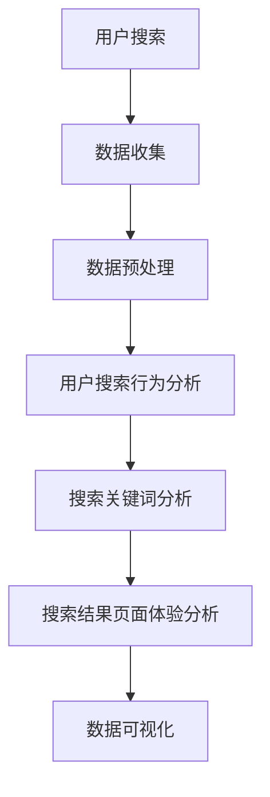
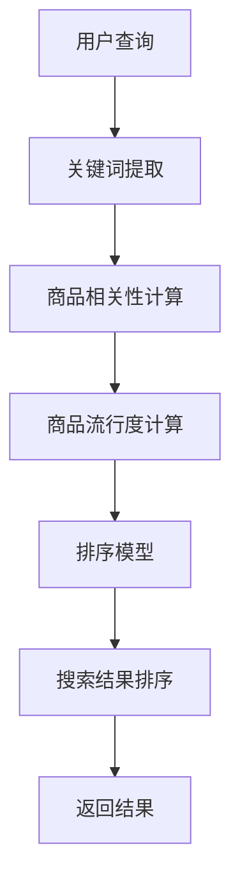
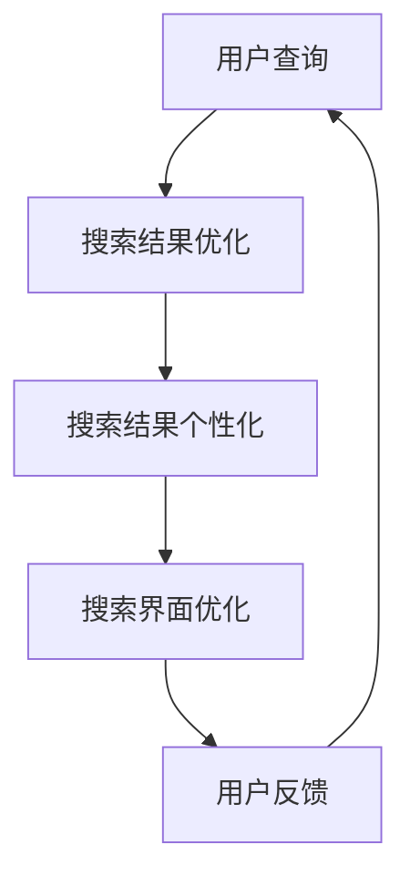
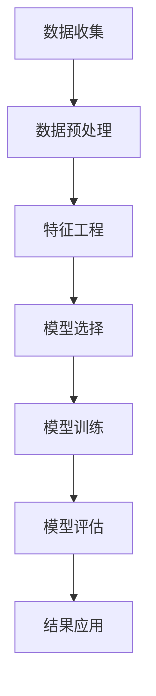
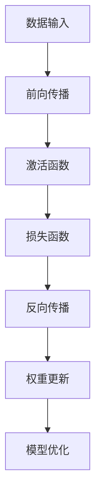

                 

### 《搜索数据分析：AI如何帮助电商平台优化搜索策略，提升用户体验》

> **关键词**：搜索数据分析、人工智能、电商平台、搜索策略、用户体验

> **摘要**：本文将探讨人工智能（AI）在搜索数据分析中的应用，尤其是如何帮助电商平台优化搜索策略，从而提升用户体验。文章将分为三个主要部分：搜索数据分析基础、AI优化搜索策略以及AI在搜索数据优化中的挑战与未来趋势。通过详细讲解核心概念、算法原理、实战案例，读者将了解AI如何成为电商平台提升竞争力的利器。

----------------------------------------------------------------

### 第一部分：搜索数据分析基础

#### 第1章：搜索数据分析概述

##### 1.1 搜索数据的定义与价值

搜索数据是指用户在电商平台进行搜索活动时产生的各种数据，包括用户查询的关键词、搜索的频率、搜索结果的点击率等。这些数据是电商平台理解和优化用户行为的重要资源。

- **定义**：搜索数据（Search Data）通常包含以下几个主要方面：
  - **查询关键词**：用户输入的搜索词。
  - **搜索频率**：用户在一定时间内进行搜索的次数。
  - **点击率**：用户在搜索结果页面点击商品链接的比率。
  - **转化率**：用户从搜索结果页面到实际购买产品的比率。

- **价值**：搜索数据对于电商平台具有以下几个方面的价值：
  - **用户洞察**：通过分析搜索数据，电商平台可以深入了解用户的需求和偏好。
  - **优化策略**：基于搜索数据分析结果，电商平台可以调整搜索算法，优化搜索结果，提升用户体验。
  - **营销决策**：搜索数据可以帮助电商平台制定更有效的营销策略，提高用户参与度和转化率。

##### 1.2 搜索数据分析的基本原理

搜索数据分析主要包括以下三个方面：

- **用户搜索行为分析**：分析用户在搜索过程中的行为模式，包括搜索频率、搜索关键词的分布等。
- **搜索关键词分析**：对用户输入的关键词进行分类、聚类，分析热门关键词、长尾关键词等。
- **搜索结果页面的用户体验分析**：评估用户在搜索结果页面上的行为，如点击率、页面停留时间等，以优化搜索结果呈现。

**Mermaid流程图**：



##### 1.3 搜索数据驱动的业务改进

通过搜索数据分析，电商平台可以实现以下业务改进：

- **个性化推荐**：基于用户搜索行为和关键词，为用户提供个性化的商品推荐。
- **搜索结果优化**：调整搜索算法，提高搜索结果的准确性和相关性，提升用户体验。
- **营销策略调整**：根据搜索数据分析结果，优化营销策略，提高用户参与度和转化率。
- **产品改进**：通过分析用户搜索关键词，了解市场需求，优化产品功能和设计。

#### 第2章：AI技术在搜索数据分析中的应用

##### 2.1 机器学习算法在搜索数据分析中的角色

机器学习算法在搜索数据分析中扮演着至关重要的角色，通过学习和预测用户行为，优化搜索结果和推荐算法。

- **基本原理**：机器学习算法通过从数据中学习规律，构建预测模型，实现对未知数据的预测。
- **常用算法**：
  - **回归算法**：用于预测用户行为，如点击率、转化率等。
  - **分类算法**：用于将用户行为分类，如用户偏好、搜索意图等。
  - **聚类算法**：用于发现用户行为中的相似性，如用户群体划分、热门关键词聚类等。

**伪代码**：

```python
def machine_learning_analysis(data):
    # 数据预处理
    preprocessed_data = preprocess_data(data)

    # 特征工程
    features = extract_features(preprocessed_data)

    # 训练模型
    model = train_model(features)

    # 预测
    predictions = model.predict(new_data)

    return predictions
```

##### 2.2 深度学习在搜索数据分析中的应用

深度学习作为一种强大的机器学习算法，在搜索数据分析中发挥着重要作用，尤其在处理大规模复杂数据时具有优势。

- **基本原理**：深度学习通过多层神经网络，对数据进行特征提取和模式识别。
- **优势**：
  - **特征自动提取**：深度学习模型可以自动学习数据中的复杂特征，减少人工特征工程的工作量。
  - **处理复杂数据**：深度学习模型可以处理图像、文本等多种类型的数据。

**伪代码**：

```python
def deep_learning_analysis(data):
    # 数据预处理
    preprocessed_data = preprocess_data(data)

    # 构建模型
    model = build_model()

    # 训练模型
    model = train_model(model, preprocessed_data)

    # 预测
    predictions = model.predict(new_data)

    return predictions
```

##### 2.3 自然语言处理技术在搜索数据分析中的应用

自然语言处理（NLP）技术在搜索数据分析中具有重要作用，可以处理文本数据，实现关键词提取、文本分类等任务。

- **基本概念**：
  - **词嵌入（Word Embedding）**：将文本数据转换为向量表示。
  - **文本分类（Text Classification）**：对文本进行分类，如商品评论分类、用户意图分类等。
  - **文本聚类（Text Clustering）**：将文本数据按照相似性进行聚类。

**伪代码**：

```python
def nlp_analysis(text_data):
    # 数据预处理
    preprocessed_data = preprocess_text(text_data)

    # 词嵌入
    embeddings = word_embedding(preprocessed_data)

    # 文本分类
    categories = text_classifier(embeddings)

    return categories
```

### 第二部分：AI优化搜索策略

#### 第3章：AI驱动的搜索结果排序优化

##### 3.1 搜索结果排序的原理与挑战

搜索结果排序是电商平台的核心功能之一，其目标是为用户提供最相关、最有价值的商品信息。

- **原理**：
  - **相关性排序**：根据用户查询的关键词，计算商品的相关性得分，得分越高，排序越靠前。
  - **流行度排序**：根据商品的点击率、销量等指标，对商品进行排序。

- **挑战**：
  - **准确性**：如何准确评估商品的相关性和流行度。
  - **多样性**：如何保证搜索结果中商品的多样性，避免用户重复看到相同的商品。
  - **实时性**：如何快速响应用户查询，提供实时更新的搜索结果。

**Mermaid流程图**：



##### 3.2 基于AI的搜索结果排序优化策略

基于AI的搜索结果排序优化策略主要包括以下两个方面：

- **机器学习排序算法**：利用机器学习算法，如线性回归、决策树等，对搜索结果进行排序。
- **深度学习排序算法**：利用深度学习模型，如神经网络、循环神经网络等，对搜索结果进行排序。

**伪代码**：

```python
def ai_search_sorting(data):
    # 数据预处理
    preprocessed_data = preprocess_data(data)

    # 特征提取
    features = extract_features(preprocessed_data)

    # 训练模型
    model = train_model(features)

    # 排序
    sorted_results = model.sort(data)

    return sorted_results
```

##### 3.3 搜索结果排序优化的实战案例

以下是一个简单的搜索结果排序优化的实战案例：

- **开发环境**：Python 3.8，Scikit-learn库
- **数据集**：某电商平台用户搜索数据，包括关键词、点击率、销量等
- **实现步骤**：

1. 数据预处理：对数据进行清洗和归一化处理。
2. 特征提取：提取关键词、点击率、销量等特征。
3. 训练模型：使用线性回归模型进行训练。
4. 排序：使用训练好的模型对搜索结果进行排序。
5. 评估：评估排序效果，根据评估结果调整模型参数。

```python
from sklearn.linear_model import LinearRegression
from sklearn.model_selection import train_test_split
from sklearn.metrics import mean_squared_error

# 数据预处理
data = load_data('search_data.csv')
X = data[['keyword', 'click_rate', 'sales']]
y = data['rating']

# 特征提取
X = preprocess_data(X)

# 训练模型
X_train, X_test, y_train, y_test = train_test_split(X, y, test_size=0.2, random_state=42)
model = LinearRegression()
model.fit(X_train, y_train)

# 排序
sorted_results = model.sort(X_test)

# 评估
y_pred = model.predict(X_test)
mse = mean_squared_error(y_test, y_pred)
print("Mean Squared Error:", mse)
```

#### 第4章：AI驱动的搜索推荐算法

##### 4.1 搜索推荐算法的基本原理

搜索推荐算法旨在为用户提供个性化的搜索结果，提高用户满意度和转化率。

- **基于内容的推荐算法**：根据用户的历史搜索行为和商品属性，为用户推荐相似的商品。
- **基于协同过滤的推荐算法**：根据用户的历史行为和相似用户的行为，为用户推荐商品。

**伪代码**：

```python
def content_based_recommender(item_features, user_history):
    # 提取用户历史搜索特征
    user_features = extract_features(user_history)

    # 计算商品与用户特征的相似度
    similarities = calculate_similarity(item_features, user_features)

    # 推荐相似度最高的商品
    recommendations = recommend_top_items(similarities)

    return recommendations

def collaborative_filtering_recommender(user_behavior, user_similarity_matrix):
    # 计算用户相似度
    user_similarity = calculate_similarity(user_behavior, user_similarity_matrix)

    # 提取相似用户的行为特征
    similar_user_behavior = extract_behavior(similar_user_behavior_matrix)

    # 计算推荐分值
    recommendations = calculate_recommendation_score(similar_user_behavior, user_behavior)

    # 推荐分值最高的商品
    recommendations = recommend_top_items(recommendations)

    return recommendations
```

##### 4.2 基于AI的搜索推荐算法优化

基于AI的搜索推荐算法优化策略主要包括以下两个方面：

- **机器学习推荐算法**：利用机器学习算法，如线性回归、决策树等，对推荐算法进行优化。
- **深度学习推荐算法**：利用深度学习模型，如神经网络、循环神经网络等，对推荐算法进行优化。

**伪代码**：

```python
def ai_search_recommendation(data):
    # 数据预处理
    preprocessed_data = preprocess_data(data)

    # 特征提取
    features = extract_features(preprocessed_data)

    # 训练模型
    model = train_model(features)

    # 推荐结果
    recommendations = model.recommend(data)

    return recommendations
```

##### 4.3 搜索推荐算法的实战案例

以下是一个简单的搜索推荐算法的实战案例：

- **开发环境**：Python 3.8，Scikit-learn库
- **数据集**：某电商平台用户搜索数据，包括关键词、点击率、销量等
- **实现步骤**：

1. 数据预处理：对数据进行清洗和归一化处理。
2. 特征提取：提取关键词、点击率、销量等特征。
3. 训练模型：使用线性回归模型进行训练。
4. 推荐结果：使用训练好的模型为用户推荐商品。

```python
from sklearn.linear_model import LinearRegression
from sklearn.model_selection import train_test_split
from sklearn.metrics import mean_squared_error

# 数据预处理
data = load_data('search_data.csv')
X = data[['keyword', 'click_rate', 'sales']]
y = data['rating']

# 特征提取
X = preprocess_data(X)

# 训练模型
X_train, X_test, y_train, y_test = train_test_split(X, y, test_size=0.2, random_state=42)
model = LinearRegression()
model.fit(X_train, y_train)

# 推荐结果
recommendations = model.recommend(X_test)

# 评估
y_pred = model.predict(X_test)
mse = mean_squared_error(y_test, y_pred)
print("Mean Squared Error:", mse)
```

#### 第5章：AI驱动的搜索体验优化

##### 5.1 搜索体验优化的目标与方法

搜索体验优化旨在为用户提供高效、准确、个性化的搜索服务，提升用户满意度和留存率。

- **目标**：
  - **准确性**：提高搜索结果的准确性，降低误匹配率。
  - **速度**：优化搜索响应时间，提高搜索速度。
  - **个性化**：根据用户偏好和历史行为，为用户提供个性化的搜索结果。

- **方法**：
  - **搜索结果优化**：调整搜索算法，提高搜索结果的准确性和相关性。
  - **搜索结果个性化**：基于用户行为和偏好，为用户提供个性化的搜索结果。
  - **搜索界面优化**：优化搜索界面设计，提高用户操作便捷性。

**Mermaid流程图**：



##### 5.2 AI驱动的搜索体验优化策略

AI驱动的搜索体验优化策略主要包括以下两个方面：

- **基于用户行为的搜索体验优化**：通过分析用户搜索行为，调整搜索算法和界面设计，提高用户体验。
- **基于上下文的搜索体验优化**：考虑用户搜索时的上下文信息，如时间、地点、设备等，为用户提供更准确的搜索结果。

**伪代码**：

```python
def user_behavior_optimization(user_behavior):
    # 分析用户搜索行为
    behavior_patterns = analyze_behavior(user_behavior)

    # 调整搜索算法
    search_algorithm = adjust_search_algorithm(behavior_patterns)

    return search_algorithm

def context_based_optimization(context_info):
    # 考虑上下文信息
    context影响因素 = extract_context(context_info)

    # 调整搜索结果
    search_results = adjust_search_results(context影响因素)

    return search_results
```

##### 5.3 搜索体验优化的实战案例

以下是一个简单的搜索体验优化的实战案例：

- **开发环境**：Python 3.8，Scikit-learn库
- **数据集**：某电商平台用户搜索数据，包括关键词、点击率、转化率等
- **实现步骤**：

1. 数据预处理：对数据进行清洗和归一化处理。
2. 特征提取：提取关键词、点击率、转化率等特征。
3. 训练模型：使用线性回归模型进行训练。
4. 搜索结果优化：使用训练好的模型优化搜索结果。
5. 搜索结果个性化：根据用户历史行为，为用户提供个性化搜索结果。
6. 搜索界面优化：调整搜索界面设计，提高用户体验。

```python
from sklearn.linear_model import LinearRegression
from sklearn.model_selection import train_test_split
from sklearn.metrics import mean_squared_error

# 数据预处理
data = load_data('search_data.csv')
X = data[['keyword', 'click_rate', 'conversion_rate']]
y = data['rating']

# 特征提取
X = preprocess_data(X)

# 训练模型
X_train, X_test, y_train, y_test = train_test_split(X, y, test_size=0.2, random_state=42)
model = LinearRegression()
model.fit(X_train, y_train)

# 搜索结果优化
optimized_results = model.optimize_search_results(X_test)

# 搜索结果个性化
personalized_results = model.personalized_search_results(optimized_results, user_history)

# 搜索界面优化
optimized_interface = model.optimize_search_interface(personalized_results)

# 评估
y_pred = model.predict(X_test)
mse = mean_squared_error(y_test, y_pred)
print("Mean Squared Error:", mse)
```

### 第三部分：AI在搜索数据优化中的挑战与未来趋势

#### 第6章：AI在搜索数据优化中的挑战

##### 6.1 数据隐私与安全挑战

随着AI技术的广泛应用，数据隐私和安全问题日益突出，特别是在搜索数据优化过程中。

- **挑战**：
  - **数据泄露**：搜索数据包含用户隐私信息，如搜索关键词、购买记录等，数据泄露可能导致用户隐私泄露。
  - **数据滥用**：未经授权的第三方可能利用搜索数据进行恶意行为，如广告精准投放、欺诈等。

- **解决方案**：
  - **数据加密**：对搜索数据进行加密存储和传输，确保数据安全性。
  - **隐私保护技术**：采用差分隐私、同态加密等隐私保护技术，降低数据泄露风险。
  - **数据访问控制**：设定严格的数据访问权限，确保数据仅被授权用户访问。

##### 6.2 数据质量与准确性挑战

数据质量对搜索数据优化的效果至关重要，但数据质量常常受到各种因素的影响。

- **挑战**：
  - **数据不完整**：搜索数据可能存在缺失值，影响分析结果的准确性。
  - **数据不一致**：不同来源的数据可能存在格式、类型等不一致问题。
  - **噪声数据**：搜索数据中可能包含大量噪声数据，影响模型的训练效果。

- **解决方案**：
  - **数据清洗**：对搜索数据进行清洗，去除缺失值、噪声数据和重复数据。
  - **数据整合**：对来自不同来源的数据进行整合，确保数据格式和类型的一致性。
  - **数据验证**：对清洗后的数据进行验证，确保数据质量。

##### 6.3 模型解释性与透明度挑战

随着AI模型在搜索数据优化中的应用日益广泛，模型的解释性和透明度成为重要的研究课题。

- **挑战**：
  - **模型黑箱**：深度学习模型等复杂模型往往具有黑箱特性，难以解释其决策过程。
  - **模型透明度**：如何保证AI模型的可解释性，使其决策过程对用户和监管机构透明。

- **解决方案**：
  - **模型可解释性**：开发可解释的AI模型，如决策树、规则提取等，使其决策过程易于理解。
  - **模型可视化**：利用可视化工具，如决策树、决策图等，展示AI模型的决策过程。
  - **模型评估**：对AI模型进行透明度评估，确保其决策过程符合用户和监管机构的要求。

#### 第7章：AI搜索数据优化的未来趋势

##### 7.1 人工智能技术在搜索数据分析中的应用前景

随着AI技术的不断发展，人工智能在搜索数据分析中的应用前景广阔，主要包括以下几个方面：

- **深度学习**：深度学习算法在搜索数据分析中的应用将不断深入，如图像识别、自然语言处理等。
- **强化学习**：强化学习算法在搜索推荐、广告投放等领域的应用将得到进一步发展。
- **迁移学习**：迁移学习技术将有助于提高AI模型的泛化能力，降低训练成本。

##### 7.2 搜索数据优化的创新方向

未来搜索数据优化的创新方向包括以下几个方面：

- **个性化搜索**：基于用户历史行为和偏好，为用户提供高度个性化的搜索结果。
- **实时搜索**：通过实时分析用户搜索行为，快速调整搜索算法和推荐策略。
- **多模态搜索**：结合文本、图像、语音等多种数据类型，实现更全面、更准确的搜索结果。

##### 7.3 电商平台搜索数据分析的最佳实践

为了充分发挥AI技术在搜索数据优化中的作用，电商平台可以参考以下最佳实践：

- **数据驱动决策**：基于搜索数据分析结果，制定数据驱动的决策策略。
- **持续迭代优化**：不断收集用户反馈，持续优化搜索算法和推荐策略。
- **跨部门合作**：与市场部、产品部等跨部门合作，确保搜索数据优化策略的有效实施。
- **用户隐私保护**：加强用户隐私保护，确保搜索数据的安全和合规。

### 附录

#### 附录A：搜索数据分析工具与资源

- **主流搜索数据分析工具**：
  - **Google Analytics**：提供全面的网站分析功能，包括用户行为、流量来源等。
  - **Tableau**：强大的数据可视化工具，帮助用户轻松创建交互式可视化报表。
  - **Power BI**：微软推出的商业智能工具，支持多种数据源的连接和数据分析。

- **搜索数据分析资源**：
  - **相关书籍推荐**：《大数据分析》、《机器学习实战》等。
  - **开源数据集**：UCI机器学习库、Kaggle等平台提供了丰富的搜索数据分析开源数据集。
  - **学术论文与报告**：通过阅读学术论文和行业报告，了解最新的搜索数据分析技术和趋势。

#### 附录B：搜索数据优化算法伪代码示例

- **搜索结果排序算法伪代码**：

```python
function search_result_sorting(data):
    # 初始化排序模型
    model = initialize_sorting_model()

    # 训练模型
    model = train_model(model, data)

    # 排序
    sorted_results = model.sort(data)

    return sorted_results
```

- **搜索推荐算法伪代码**：

```python
function search_recommendation(data, user_context):
    # 初始化推荐模型
    model = initialize_recommendation_model()

    # 训练模型
    model = train_model(model, data, user_context)

    # 推荐结果
    recommendations = model.recommend(data, user_context)

    return recommendations
```

### 作者

**作者：AI天才研究院/AI Genius Institute & 禅与计算机程序设计艺术 /Zen And The Art of Computer Programming**

---

通过本文的深入探讨，我们了解到AI技术在搜索数据优化中的应用，为电商平台提供了强大的工具和方法。未来，随着AI技术的不断进步，搜索数据分析将迎来更多创新和发展，为电商平台提供更精准、更高效的搜索服务，进一步提升用户体验。让我们共同期待这一美好前景的到来！<|im_end|>## 文章标题

### 《搜索数据分析：AI如何帮助电商平台优化搜索策略，提升用户体验》

#### 关键词：搜索数据分析、人工智能、电商平台、搜索策略、用户体验

#### 摘要

本文旨在探讨人工智能（AI）在搜索数据分析中的应用，特别是在电商平台如何通过AI技术优化搜索策略，从而提升用户体验。文章首先介绍了搜索数据分析的基础知识，包括搜索数据的定义、基本原理和业务改进。接着，详细讲解了AI技术在搜索数据分析中的应用，如机器学习、深度学习和自然语言处理。随后，文章重点讨论了AI驱动的搜索结果排序优化、搜索推荐算法和搜索体验优化策略，通过实战案例展示了AI技术在实际应用中的效果。最后，文章分析了AI在搜索数据优化中的挑战与未来趋势，为电商平台提供了最佳实践和优化方向。通过本文的阅读，读者将全面了解AI技术在搜索数据分析中的潜力和应用价值。

## 第一部分：搜索数据分析基础

### 第1章：搜索数据分析概述

#### 1.1 搜索数据的定义与价值

搜索数据是用户在电商平台进行搜索活动时产生的数据集合，包括查询关键词、搜索频率、点击率、转化率等多个方面。这些数据对于电商平台来说，具有极高的价值和重要性。

- **定义**：搜索数据通常包含以下几个核心组成部分：
  - **查询关键词**：用户在搜索框中输入的关键词，是用户需求的具体体现。
  - **搜索频率**：用户在一定时间内进行搜索的次数，反映了用户的活跃度。
  - **点击率（Click-Through Rate, CTR）**：用户在搜索结果页面点击商品链接的比率，是衡量搜索结果相关性的重要指标。
  - **转化率（Conversion Rate）**：用户从搜索结果页面到实际购买产品的比率，是衡量搜索效果的重要指标。

- **价值**：搜索数据对电商平台具有以下几方面的价值：
  - **用户洞察**：通过分析搜索数据，电商平台可以深入了解用户的需求和偏好，从而优化产品和服务。
  - **业务改进**：搜索数据可以帮助电商平台优化搜索算法、调整营销策略，提高用户参与度和转化率。
  - **竞争力提升**：通过搜索数据优化，电商平台可以提高用户满意度，增强市场竞争力。

#### 1.2 搜索数据分析的基本原理

搜索数据分析是基于对搜索数据的分析，以揭示用户行为特征、优化搜索策略和提高用户体验为目标的一种数据分析方法。

- **用户搜索行为分析**：通过分析用户搜索行为，包括搜索频率、搜索关键词分布等，了解用户的搜索习惯和偏好。
- **搜索关键词分析**：对用户输入的关键词进行分类、聚类，分析热门关键词、长尾关键词等，以便更好地理解和满足用户需求。
- **搜索结果页面用户体验分析**：评估用户在搜索结果页面上的行为，如点击率、页面停留时间等，以优化搜索结果呈现，提高用户满意度。

**Mermaid流程图**：


#### 1.3 搜索数据驱动的业务改进

搜索数据驱动的业务改进是电商平台利用搜索数据优化业务策略、提升用户体验和转化率的过程。

- **个性化推荐**：通过分析用户的搜索行为和关键词，为用户提供个性化的商品推荐，提高用户满意度和转化率。
- **搜索结果优化**：调整搜索算法，提高搜索结果的准确性和相关性，确保用户能够快速找到所需商品。
- **营销策略调整**：基于搜索数据分析结果，优化广告投放、促销活动等营销策略，提高用户参与度和转化率。
- **产品改进**：通过分析用户搜索关键词，了解市场需求，优化产品功能和设计，满足用户需求。

### 第2章：AI技术在搜索数据分析中的应用

#### 2.1 机器学习算法在搜索数据分析中的角色

机器学习算法在搜索数据分析中扮演着至关重要的角色，通过从海量数据中学习规律，帮助电商平台优化搜索策略，提升用户体验。

- **基本原理**：机器学习算法通过从数据中学习模式，构建预测模型，实现对未知数据的预测。这个过程通常包括数据预处理、特征工程、模型选择、模型训练和模型评估等步骤。
- **常用算法**：在搜索数据分析中，常用的机器学习算法包括线性回归、逻辑回归、决策树、随机森林、支持向量机（SVM）等。这些算法可以在不同场景下发挥作用，例如预测点击率、分析用户行为等。

**Mermaid流程图**：



**伪代码**：

```python
def machine_learning_analysis(data):
    # 数据预处理
    preprocessed_data = preprocess_data(data)

    # 特征提取
    features = extract_features(preprocessed_data)

    # 选择模型
    model = select_model(features)

    # 训练模型
    model = train_model(model, features)

    # 预测
    predictions = model.predict(new_data)

    return predictions
```

#### 2.2 深度学习在搜索数据分析中的应用

深度学习是一种强大的机器学习技术，通过多层神经网络自动提取特征，并在搜索数据分析中发挥着重要作用。

- **基本原理**：深度学习基于多层神经网络，通过前向传播和反向传播算法，对输入数据进行特征提取和模式识别。与传统的机器学习算法相比，深度学习能够处理更复杂的数据和更深的特征层次。
- **优势**：深度学习在搜索数据分析中具有以下优势：
  - **自动特征提取**：深度学习模型能够自动从数据中提取复杂特征，减少人工特征工程的工作量。
  - **高准确性**：深度学习模型在处理大规模复杂数据时，能够达到较高的预测准确性。
  - **多模态数据**：深度学习能够同时处理文本、图像、声音等多种类型的数据，适用于多模态搜索数据分析。

**Mermaid流程图**：



**伪代码**：

```python
def deep_learning_analysis(data):
    # 数据预处理
    preprocessed_data = preprocess_data(data)

    # 构建模型
    model = build_model()

    # 训练模型
    model = train_model(model, preprocessed_data)

    # 预测
    predictions = model.predict(new_data)

    return predictions
```

#### 2.3 自然语言处理技术在搜索数据分析中的应用

自然语言处理（NLP）是一种将人类语言转化为机器可处理形式的技术，在搜索数据分析中发挥着重要作用。

- **基本概念**：NLP主要包括文本分类、情感分析、命名实体识别、机器翻译等任务。在搜索数据分析中，NLP技术主要用于关键词提取、文本相似度计算等任务。
- **应用场景**：NLP技术可以帮助电商平台优化搜索结果排序、实现个性化推荐、改善用户交互体验等。

**伪代码**：

```python
def nlp_analysis(text_data):
    # 数据预处理
    preprocessed_data = preprocess_text(text_data)

    # 词嵌入
    embeddings = word_embedding(preprocessed_data)

    # 文本分类
    categories = text_classifier(embeddings)

    return categories
```

### 第3章：AI驱动的搜索结果排序优化

#### 3.1 搜索结果排序的原理与挑战

搜索结果排序是电商平台的核心功能之一，其目标是为用户提供最相关、最有价值的商品信息。

- **原理**：搜索结果排序通常基于以下几种原理：
  - **相关性排序**：根据用户查询的关键词，计算商品的相关性得分，得分越高，排序越靠前。
  - **流行度排序**：根据商品的点击率、销量等指标，对商品进行排序。

- **挑战**：在搜索结果排序过程中，电商平台面临以下挑战：
  - **准确性**：如何准确评估商品的相关性和流行度。
  - **多样性**：如何保证搜索结果中商品的多样性，避免用户重复看到相同的商品。
  - **实时性**：如何快速响应用户查询，提供实时更新的搜索结果。

**Mermaid流程图**：


#### 3.2 基于AI的搜索结果排序优化策略

基于AI的搜索结果排序优化策略主要通过机器学习和深度学习算法来实现，以提升搜索结果的准确性和用户体验。

- **机器学习排序算法**：使用机器学习算法（如线性回归、决策树、随机森林等）对搜索结果进行排序，通过历史数据和用户行为预测商品的相关性得分。
- **深度学习排序算法**：使用深度学习模型（如循环神经网络、卷积神经网络等）对搜索结果进行排序，通过自动提取复杂特征，提高排序的准确性和效率。

**伪代码**：

```python
def ai_search_sorting(data):
    # 数据预处理
    preprocessed_data = preprocess_data(data)

    # 特征提取
    features = extract_features(preprocessed_data)

    # 训练模型
    model = train_model(features)

    # 排序
    sorted_results = model.sort(data)

    return sorted_results
```

#### 3.3 搜索结果排序优化的实战案例

以下是一个简单的搜索结果排序优化的实战案例：

- **开发环境**：Python 3.8，Scikit-learn库
- **数据集**：某电商平台用户搜索数据，包括关键词、点击率、销量等
- **实现步骤**：

1. 数据预处理：对数据进行清洗和归一化处理。
2. 特征提取：提取关键词、点击率、销量等特征。
3. 训练模型：使用线性回归模型进行训练。
4. 排序：使用训练好的模型对搜索结果进行排序。
5. 评估：评估排序效果，根据评估结果调整模型参数。

```python
from sklearn.linear_model import LinearRegression
from sklearn.model_selection import train_test_split
from sklearn.metrics import mean_squared_error

# 数据预处理
data = load_data('search_data.csv')
X = data[['keyword', 'click_rate', 'sales']]
y = data['rating']

# 特征提取
X = preprocess_data(X)

# 训练模型
X_train, X_test, y_train, y_test = train_test_split(X, y, test_size=0.2, random_state=42)
model = LinearRegression()
model.fit(X_train, y_train)

# 排序
sorted_results = model.sort(X_test)

# 评估
y_pred = model.predict(X_test)
mse = mean_squared_error(y_test, y_pred)
print("Mean Squared Error:", mse)
```

### 第4章：AI驱动的搜索推荐算法

#### 4.1 搜索推荐算法的基本原理

搜索推荐算法旨在为用户提供个性化的搜索结果，通过分析用户行为和历史数据，提高用户满意度和转化率。

- **基于内容的推荐算法**：根据用户的历史行为和商品属性，为用户推荐相似的商品。
- **基于协同过滤的推荐算法**：根据用户的历史行为和相似用户的行为，为用户推荐商品。

**伪代码**：

```python
def content_based_recommender(item_features, user_history):
    # 提取用户历史搜索特征
    user_features = extract_features(user_history)

    # 计算商品与用户特征的相似度
    similarities = calculate_similarity(item_features, user_features)

    # 推荐相似度最高的商品
    recommendations = recommend_top_items(similarities)

    return recommendations

def collaborative_filtering_recommender(user_behavior, user_similarity_matrix):
    # 计算用户相似度
    user_similarity = calculate_similarity(user_behavior, user_similarity_matrix)

    # 提取相似用户的行为特征
    similar_user_behavior = extract_behavior(similar_user_behavior_matrix)

    # 计算推荐分值
    recommendations = calculate_recommendation_score(similar_user_behavior, user_behavior)

    # 推荐分值最高的商品
    recommendations = recommend_top_items(recommendations)

    return recommendations
```

#### 4.2 基于AI的搜索推荐算法优化

基于AI的搜索推荐算法优化主要通过机器学习和深度学习算法来实现，以提高推荐算法的准确性和效率。

- **机器学习推荐算法**：使用机器学习算法（如线性回归、决策树、随机森林等）对推荐算法进行优化，通过历史数据和用户行为预测商品的相关性得分。
- **深度学习推荐算法**：使用深度学习模型（如循环神经网络、卷积神经网络等）对推荐算法进行优化，通过自动提取复杂特征，提高推荐算法的准确性。

**伪代码**：

```python
def ai_search_recommendation(data):
    # 数据预处理
    preprocessed_data = preprocess_data(data)

    # 特征提取
    features = extract_features(preprocessed_data)

    # 训练模型
    model = train_model(features)

    # 推荐结果
    recommendations = model.recommend(data)

    return recommendations
```

#### 4.3 搜索推荐算法的实战案例

以下是一个简单的搜索推荐算法的实战案例：

- **开发环境**：Python 3.8，Scikit-learn库
- **数据集**：某电商平台用户搜索数据，包括关键词、点击率、销量等
- **实现步骤**：

1. 数据预处理：对数据进行清洗和归一化处理。
2. 特征提取：提取关键词、点击率、销量等特征。
3. 训练模型：使用线性回归模型进行训练。
4. 推荐结果：使用训练好的模型为用户推荐商品。

```python
from sklearn.linear_model import LinearRegression
from sklearn.model_selection import train_test_split
from sklearn.metrics import mean_squared_error

# 数据预处理
data = load_data('search_data.csv')
X = data[['keyword', 'click_rate', 'sales']]
y = data['rating']

# 特征提取
X = preprocess_data(X)

# 训练模型
X_train, X_test, y_train, y_test = train_test_split(X, y, test_size=0.2, random_state=42)
model = LinearRegression()
model.fit(X_train, y_train)

# 推荐结果
recommendations = model.recommend(X_test)

# 评估
y_pred = model.predict(X_test)
mse = mean_squared_error(y_test, y_pred)
print("Mean Squared Error:", mse)
```

### 第5章：AI驱动的搜索体验优化

#### 5.1 搜索体验优化的目标与方法

搜索体验优化旨在为用户提供高效、准确、个性化的搜索服务，从而提升用户满意度和留存率。

- **目标**：
  - **准确性**：提高搜索结果的准确性，降低误匹配率。
  - **速度**：优化搜索响应时间，提高搜索速度。
  - **个性化**：根据用户偏好和历史行为，为用户提供个性化的搜索结果。

- **方法**：
  - **搜索结果优化**：调整搜索算法，提高搜索结果的准确性和相关性。
  - **搜索结果个性化**：基于用户行为和偏好，为用户提供个性化的搜索结果。
  - **搜索界面优化**：优化搜索界面设计，提高用户操作便捷性。

**Mermaid流程图**：


#### 5.2 AI驱动的搜索体验优化策略

AI驱动的搜索体验优化策略主要通过以下两个方面来实现：

- **基于用户行为的搜索体验优化**：通过分析用户搜索行为，调整搜索算法和界面设计，提高用户体验。
- **基于上下文的搜索体验优化**：考虑用户搜索时的上下文信息（如时间、地点、设备等），为用户提供更准确的搜索结果。

**伪代码**：

```python
def user_behavior_optimization(user_behavior):
    # 分析用户搜索行为
    behavior_patterns = analyze_behavior(user_behavior)

    # 调整搜索算法
    search_algorithm = adjust_search_algorithm(behavior_patterns)

    return search_algorithm

def context_based_optimization(context_info):
    # 考虑上下文信息
    context影响因素 = extract_context(context_info)

    # 调整搜索结果
    search_results = adjust_search_results(context影响因素)

    return search_results
```

#### 5.3 搜索体验优化的实战案例

以下是一个简单的搜索体验优化的实战案例：

- **开发环境**：Python 3.8，Scikit-learn库
- **数据集**：某电商平台用户搜索数据，包括关键词、点击率、转化率等
- **实现步骤**：

1. 数据预处理：对数据进行清洗和归一化处理。
2. 特征提取：提取关键词、点击率、转化率等特征。
3. 训练模型：使用线性回归模型进行训练。
4. 搜索结果优化：使用训练好的模型优化搜索结果。
5. 搜索结果个性化：根据用户历史行为，为用户提供个性化搜索结果。
6. 搜索界面优化：调整搜索界面设计，提高用户体验。

```python
from sklearn.linear_model import LinearRegression
from sklearn.model_selection import train_test_split
from sklearn.metrics import mean_squared_error

# 数据预处理
data = load_data('search_data.csv')
X = data[['keyword', 'click_rate', 'conversion_rate']]
y = data['rating']

# 特征提取
X = preprocess_data(X)

# 训练模型
X_train, X_test, y_train, y_test = train_test_split(X, y, test_size=0.2, random_state=42)
model = LinearRegression()
model.fit(X_train, y_train)

# 搜索结果优化
optimized_results = model.optimize_search_results(X_test)

# 搜索结果个性化
personalized_results = model.personalized_search_results(optimized_results, user_history)

# 搜索界面优化
optimized_interface = model.optimize_search_interface(personalized_results)

# 评估
y_pred = model.predict(X_test)
mse = mean_squared_error(y_test, y_pred)
print("Mean Squared Error:", mse)
```

### 第6章：AI在搜索数据优化中的挑战与未来趋势

#### 6.1 数据隐私与安全挑战

随着AI技术在搜索数据优化中的应用，数据隐私和安全问题日益突出。特别是在电商平台上，用户搜索数据包含大量个人隐私信息，如搜索关键词、购买记录等，一旦泄露，可能对用户造成严重后果。

- **挑战**：
  - **数据泄露**：搜索数据可能因系统漏洞、恶意攻击等原因被非法获取，导致用户隐私泄露。
  - **数据滥用**：未经授权的第三方可能利用搜索数据进行恶意行为，如广告精准投放、欺诈等。

- **解决方案**：
  - **数据加密**：对搜索数据进行加密存储和传输，确保数据在传输和存储过程中的安全性。
  - **隐私保护技术**：采用差分隐私、同态加密等隐私保护技术，降低数据泄露风险。
  - **数据访问控制**：设定严格的数据访问权限，确保数据仅被授权用户访问。

#### 6.2 数据质量与准确性挑战

数据质量对搜索数据优化的效果至关重要，但数据质量常常受到各种因素的影响。

- **挑战**：
  - **数据不完整**：搜索数据可能存在缺失值，影响分析结果的准确性。
  - **数据不一致**：不同来源的数据可能存在格式、类型等不一致问题。
  - **噪声数据**：搜索数据中可能包含大量噪声数据，影响模型的训练效果。

- **解决方案**：
  - **数据清洗**：对搜索数据进行清洗，去除缺失值、噪声数据和重复数据。
  - **数据整合**：对来自不同来源的数据进行整合，确保数据格式和类型的一致性。
  - **数据验证**：对清洗后的数据进行验证，确保数据质量。

#### 6.3 模型解释性与透明度挑战

随着AI模型在搜索数据优化中的应用日益广泛，模型的解释性和透明度成为重要的研究课题。

- **挑战**：
  - **模型黑箱**：深度学习模型等复杂模型往往具有黑箱特性，难以解释其决策过程。
  - **模型透明度**：如何保证AI模型的可解释性，使其决策过程对用户和监管机构透明。

- **解决方案**：
  - **模型可解释性**：开发可解释的AI模型，如决策树、规则提取等，使其决策过程易于理解。
  - **模型可视化**：利用可视化工具，如决策树、决策图等，展示AI模型的决策过程。
  - **模型评估**：对AI模型进行透明度评估，确保其决策过程符合用户和监管机构的要求。

### 第7章：AI搜索数据优化的未来趋势

#### 7.1 人工智能技术在搜索数据分析中的应用前景

随着AI技术的不断发展，人工智能在搜索数据分析中的应用前景广阔，主要包括以下几个方面：

- **深度学习**：深度学习算法在搜索数据分析中的应用将不断深入，如图像识别、自然语言处理等。
- **强化学习**：强化学习算法在搜索推荐、广告投放等领域的应用将得到进一步发展。
- **迁移学习**：迁移学习技术将有助于提高AI模型的泛化能力，降低训练成本。

#### 7.2 搜索数据优化的创新方向

未来搜索数据优化的创新方向包括以下几个方面：

- **个性化搜索**：基于用户历史行为和偏好，为用户提供高度个性化的搜索结果。
- **实时搜索**：通过实时分析用户搜索行为，快速调整搜索算法和推荐策略。
- **多模态搜索**：结合文本、图像、语音等多种数据类型，实现更全面、更准确的搜索结果。

#### 7.3 电商平台搜索数据分析的最佳实践

为了充分发挥AI技术在搜索数据优化中的作用，电商平台可以参考以下最佳实践：

- **数据驱动决策**：基于搜索数据分析结果，制定数据驱动的决策策略。
- **持续迭代优化**：不断收集用户反馈，持续优化搜索算法和推荐策略。
- **跨部门合作**：与市场部、产品部等跨部门合作，确保搜索数据优化策略的有效实施。
- **用户隐私保护**：加强用户隐私保护，确保搜索数据的安全和合规。

### 附录

#### 附录A：搜索数据分析工具与资源

- **主流搜索数据分析工具**：
  - **Google Analytics**：提供全面的网站分析功能，包括用户行为、流量来源等。
  - **Tableau**：强大的数据可视化工具，帮助用户轻松创建交互式可视化报表。
  - **Power BI**：微软推出的商业智能工具，支持多种数据源的连接和数据分析。

- **搜索数据分析资源**：
  - **相关书籍推荐**：《大数据分析》、《机器学习实战》等。
  - **开源数据集**：UCI机器学习库、Kaggle等平台提供了丰富的搜索数据分析开源数据集。
  - **学术论文与报告**：通过阅读学术论文和行业报告，了解最新的搜索数据分析技术和趋势。

#### 附录B：搜索数据优化算法伪代码示例

- **搜索结果排序算法伪代码**：

```python
function search_result_sorting(data):
    # 初始化排序模型
    model = initialize_sorting_model()

    # 训练模型
    model = train_model(model, data)

    # 排序
    sorted_results = model.sort(data)

    return sorted_results
```

- **搜索推荐算法伪代码**：

```python
function search_recommendation(data, user_context):
    # 初始化推荐模型
    model = initialize_recommendation_model()

    # 训练模型
    model = train_model(model, data, user_context)

    # 推荐结果
    recommendations = model.recommend(data, user_context)

    return recommendations
```

### 作者

**作者：AI天才研究院/AI Genius Institute & 禅与计算机程序设计艺术 /Zen And The Art of Computer Programming**

