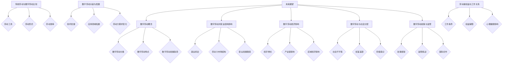

                 

### 1.1 数字劳动的概念与分类

数字劳动是指通过数字化技术和互联网平台进行的各种劳动活动，包括但不限于数据录入、数据分析、内容创作、用户反馈、远程办公等。与传统的手工劳动和体力劳动相比，数字劳动具有高度依赖技术、灵活性和高效性的特点。

**概念定义**：

- **数字劳动**：指利用计算机、网络和其他数字化工具进行的劳动活动。它涵盖了从简单的数据录入到复杂的数据分析、内容创作等多个领域。
- **人类计算**：指人类利用计算机或其他数字工具进行数据处理、分析、决策等活动的过程。

**分类**：

- **按劳动内容分**：数字劳动可以进一步细分为以下类别：
  - **数据录入**：指将各种信息输入到计算机系统中，如在线客服、数据整理等。
  - **数据分析**：指对大量数据进行处理和分析，以提取有用信息和趋势，如数据挖掘、机器学习等。
  - **内容创作**：指创作各种形式的内容，如文章、图片、视频等。
  - **用户反馈**：指收集和分析用户对产品或服务的反馈，以改进产品或服务。

- **按工作形式分**：数字劳动还可以根据工作形式进行分类：
  - **远程办公**：指劳动者在家中或其他地方通过计算机和互联网进行工作。
  - **灵活用工**：指劳动者根据项目需求或个人时间安排进行工作，如自由职业者、兼职人员等。

- **按行业分**：数字劳动在不同行业中有着广泛的应用：
  - **电子商务**：通过在线平台进行商品交易和服务提供。
  - **在线教育**：通过网络提供教学资源和在线课程。
  - **医疗健康**：利用数字技术提供远程医疗服务和健康管理。
  - **金融科技**：通过数字技术提供金融服务和解决方案。

### 1.2 数字劳动的特点与发展趋势

**特点**：

- **高度依赖技术**：数字劳动离不开计算机、互联网、大数据、人工智能等先进技术的支持。这些技术的不断进步，推动了数字劳动的快速发展。
- **劳动力分散化**：数字劳动使得劳动力可以在全球范围内进行分配，劳动者可以在不同的地点和时间进行工作，这大大提高了劳动效率。
- **劳动效率提升**：通过数字化工具和软件的应用，数字劳动显著提高了生产效率，降低了劳动成本。
- **劳动成本降低**：远程办公和灵活用工等方式，减少了企业的办公场所和设备投资，降低了劳动成本。

**发展趋势**：

- **自动化与智能化**：随着人工智能技术的进步，越来越多的数字劳动将实现自动化和智能化，如自动驾驶、智能客服等。
- **全球化**：数字劳动的全球化趋势将进一步加快，各国之间的数字劳动合作将更加紧密。
- **劳动力需求变化**：随着数字劳动的发展，对数字技能的需求将不断增加，劳动力市场将面临重新配置。

### 1.3 数字劳动的社会意义与经济影响

**社会意义**：

- **提升社会生产力**：数字劳动通过提高生产效率和降低劳动成本，显著提升了社会生产力，推动了社会经济的快速发展。
- **促进就业**：数字劳动创造了大量的就业机会，特别是对低技能劳动者提供了更多的选择，有助于缓解就业压力。
- **改善生活质量**：数字劳动带来了便捷的服务和丰富的内容，提高了人们的生活质量。

**经济影响**：

- **经济增长**：数字劳动是现代经济增长的重要驱动力，通过提高生产效率和降低成本，推动了经济的快速发展。
- **产业链重构**：数字劳动推动了产业链的重组和优化，促进了传统产业的升级和转型。
- **贸易模式转变**：数字劳动推动了国际贸易模式的变革，促进了全球经济的互联互通。

### 2.1 传统劳动与数字劳动的比较

**背景介绍**：

- **传统劳动**：传统劳动主要是指在工业革命之前，以手工劳动和体力劳动为主的工作形式。这种工作形式依赖于手工工具和体力劳动，劳动效率相对较低。
- **数字劳动**：数字劳动则是在信息时代背景下，通过数字化技术和互联网平台进行的劳动活动。它依赖于计算机、互联网、大数据等先进技术，具有更高的劳动效率和灵活性。

**比较**：

- **劳动工具**：
  - **传统劳动**：主要依赖手工工具，如锤子、锯子等，以及体力劳动，如搬运、建筑等。
  - **数字劳动**：主要依赖计算机、互联网和其他数字化设备，如电脑、智能手机、传感器等。

- **劳动形式**：
  - **传统劳动**：通常在固定的场所进行，如工厂、办公室等，工作时间和工作内容相对固定。
  - **数字劳动**：可以在远程进行，劳动者可以在家中、咖啡店、远程办公室等地进行工作，工作时间更加灵活。

- **劳动效率**：
  - **传统劳动**：劳动效率相对较低，受到手工工具和体力劳动的限制。
  - **数字劳动**：劳动效率显著提高，得益于数字化工具和软件的应用，如自动化、智能化技术。

**影响**：

- **劳动工具的变化**：数字劳动的出现，使得劳动工具从手工工具转变为数字化设备，提高了劳动效率和质量。
- **劳动形式的变化**：数字劳动使得劳动形式更加灵活和多样化，劳动者可以根据个人需求和工作任务进行选择。
- **劳动效率的提升**：数字劳动通过自动化、智能化技术，显著提高了劳动效率，降低了劳动成本。

### 2.2 数字劳动的兴起与发展

**兴起**：

数字劳动的兴起是信息时代发展的必然结果，其背后有以下几个关键因素：

- **信息技术的发展**：计算机技术、互联网技术、大数据技术等的信息技术不断进步，为数字劳动提供了技术基础。
- **互联网的普及**：互联网的普及使得数字劳动可以在全球范围内进行，打破了地理和时间的限制。
- **劳动力市场的需求变化**：随着经济结构的调整和产业升级，劳动力市场对高技能、灵活性的劳动需求不断增加。

**发展**：

数字劳动的发展呈现出以下几个方面的趋势：

- **技术进步**：人工智能、大数据、云计算等新兴技术的应用，使得数字劳动更加智能化和自动化。
- **应用领域拓展**：从简单的数据录入到复杂的数据分析、内容创作等，数字劳动的应用领域不断拓展。
- **劳动力市场的变化**：数字劳动改变了劳动力市场的结构，对劳动者的技能要求不断提高，劳动力市场面临重新配置。

**影响**：

- **就业机会增加**：数字劳动创造了大量新的就业机会，特别是对低技能劳动者提供了更多的选择。
- **经济结构调整**：数字劳动推动了经济结构的调整和优化，促进了传统产业的升级和转型。
- **生活方式改变**：数字劳动使得人们的工作方式和生活习惯发生了深刻变化，远程办公和灵活用工成为趋势。

### 2.3 数字劳动对就业结构的影响

**影响**：

数字劳动对就业结构产生了深远的影响，主要表现在以下几个方面：

- **就业机会**：数字劳动创造了大量的就业机会，特别是在信息技术、电子商务、在线教育等领域。这些新就业机会不仅为高技能劳动者提供了广阔的发展空间，也为低技能劳动者提供了新的就业选择。
- **劳动力市场结构**：数字劳动改变了劳动力市场的结构，对劳动者的技能要求不断提高。劳动者需要具备数字化技能，如编程、数据分析、人工智能等，以适应市场需求。
- **职业发展路径**：数字劳动改变了传统的职业发展路径，劳动者不再局限于固定的职业角色，可以通过远程办公、灵活用工等方式实现职业自由。

**挑战**：

- **技能要求提高**：数字劳动对劳动者的技能要求不断提高，劳动者需要不断学习和更新知识，以适应快速变化的市场需求。
- **就业不稳定性**：数字劳动往往伴随着更高的就业不稳定性，劳动者可能面临工作不稳定、收入波动等问题。
- **劳动力市场失衡**：数字劳动可能导致劳动力市场失衡，高技能劳动者供不应求，而低技能劳动者面临就业压力。

### 3.1 数字劳动者的工作条件

数字劳动者的工作条件通常具有以下几个特点：

- **工作环境**：数字劳动者可以在各种环境中进行工作，如家中、咖啡店、远程办公室等。这种灵活的工作环境使得劳动者可以根据个人需求选择工作地点，提高了工作效率。
- **工作时间**：数字劳动者的工作时间通常更加灵活，可以根据工作任务和个人需求安排工作时间和休息时间。这种灵活性有助于提高劳动者的工作满意度。
- **工作内容**：数字劳动者的工作内容多样，包括数据录入、数据分析、内容创作、用户反馈等。不同的工作内容需要不同的技能和知识，劳动者可以根据自己的专长进行选择。

### 3.2 数字劳动者的权益保障

数字劳动者的权益保障是保障其合法权益、提高其工作积极性、确保数字劳动可持续发展的重要方面。以下是一些关键措施：

- **法律法规**：各国政府应出台相关法律法规，明确数字劳动者的权益，包括工作时间、工资待遇、职业健康等。这些法律法规应得到有效执行，确保数字劳动者的权益不受侵犯。
- **社会保障**：数字劳动者应享有与正式员工同等的社会保障待遇，包括养老保险、医疗保险、失业保险等。政府和企业应共同努力，确保社会保障制度的覆盖面和保障水平。
- **职业培训**：政府和企业应加大对数字劳动者的职业培训力度，提高其技能水平和职业素质，以适应不断变化的市场需求。职业培训不仅有助于提升劳动者的就业竞争力，也有助于其职业发展。
- **心理健康支持**：由于数字劳动的长时间工作和高强度压力，数字劳动者的心理健康问题日益突出。政府和企业应提供心理健康支持和咨询服务，帮助劳动者应对工作压力，提高心理健康水平。

### 3.3 数字劳动对劳动者心理健康的影响

数字劳动对劳动者心理健康产生了多方面的影响：

- **工作压力**：数字劳动通常伴随着高强度的工作压力，劳动者需要长时间面对电脑屏幕，进行数据处理和分析。这种工作压力可能导致焦虑、抑郁等心理健康问题。
- **疲劳感**：长时间坐在电脑前工作，容易导致身体疲劳和视力疲劳。这种疲劳感可能进一步影响劳动者的心理健康，降低工作积极性。
- **技术依赖**：数字劳动使得劳动者对计算机和其他数字设备产生依赖。这种依赖可能导致劳动者在离开电脑后感到不安和焦虑，影响其心理健康。
- **社交隔离**：远程办公和灵活用工使得劳动者与同事和朋友的面对面交流减少，可能导致社交隔离和孤独感。这种社交隔离可能进一步影响劳动者的心理健康。

### 4.1 数字劳动与劳动关系的演变

数字劳动的出现和快速发展，对传统的劳动关系产生了深远的影响，推动了劳动关系的演变：

- **劳动关系形式**：传统的劳动关系通常建立在稳定的雇佣关系之上，劳动者与雇主之间存在明确的职责和义务。然而，数字劳动的灵活性和分散性，使得传统的劳动关系形式发生了变化。远程办公、临时工、自由职业者等形式逐渐取代了传统的全职雇佣关系。
- **劳动权利与义务**：随着劳动关系的演变，劳动者的权利和义务也发生了变化。数字劳动者在享受工作灵活性带来的便利的同时，也面临着劳动权益保障的问题。政府和企业需要出台相应的法律法规和政策，确保数字劳动者的合法权益。
- **劳动关系管理**：数字劳动的灵活性和分散性，给劳动关系管理带来了新的挑战。企业需要适应数字劳动的特点，建立适应新形势的劳动关系管理体系，确保劳动关系的稳定和和谐。

### 4.2 数字劳动对企业与员工关系的影响

数字劳动的发展对企业与员工关系产生了多方面的影响：

- **管理模式**：数字劳动的灵活性要求企业采用更加灵活的管理模式，如远程管理、目标管理、绩效管理等。这种管理模式有助于提高员工的工作积极性和工作效率，但也需要企业建立有效的沟通机制，确保员工与企业目标的一致性。
- **工作满意度**：数字劳动提供了更加灵活的工作时间和工作地点，这有助于提高员工的工作满意度。然而，远程办公和灵活用工也可能导致员工与企业之间的沟通不畅，影响工作满意度。
- **职业发展**：数字劳动为员工提供了更多的职业发展机会，特别是在技术创新和数字化转型领域。然而，数字劳动也可能导致员工技能要求和职业路径的变化，需要企业提供相应的培训和职业规划支持。

### 4.3 数字劳动对劳动者职业发展的挑战

数字劳动对劳动者的职业发展提出了新的挑战：

- **技能要求提高**：随着数字劳动的普及，企业对劳动者的技能要求不断提高。劳动者需要掌握编程、数据分析、人工智能等数字化技能，以适应市场需求。
- **职业路径变化**：数字劳动的灵活性可能导致传统的职业路径发生变化，劳动者需要适应新的职业角色和职业发展路径。
- **持续学习**：数字劳动要求劳动者具备持续学习的能力，以适应快速变化的技术和市场环境。劳动者需要不断更新知识和技能，以保持职业竞争力。

### 5.1 数字劳动与社会不平等的加剧

数字劳动的发展在一定程度上加剧了社会不平等，主要表现在以下几个方面：

- **技能差距**：数字劳动对劳动者的技能要求较高，高技能劳动者能够获得更多的就业机会和更高的收入，而低技能劳动者则面临就业压力和收入下降。
- **地域差异**：数字劳动使得劳动力可以在全球范围内进行分配，发达地区和发展中国家之间的数字劳动差距进一步扩大，导致贫富差距的加剧。
- **性别差异**：女性在数字劳动领域相对较少，性别差异可能导致女性在就业机会和收入方面处于劣势。

### 5.2 数字劳动与贫富差距的关系

数字劳动与贫富差距之间存在复杂的关系：

- **贫富差距加剧**：数字劳动的发展可能导致贫富差距的加剧。高技能劳动者在数字劳动中获取了更多的机会和收益，而低技能劳动者则可能被边缘化，收入水平下降。
- **贫富差距缓解**：另一方面，数字劳动也为贫困地区和贫困人口提供了新的发展机会。通过数字技能培训和教育，贫困人口可以参与到数字劳动中，提高收入水平，缓解贫富差距。

### 5.3 数字劳动对劳动者阶级意识的影响

数字劳动对劳动者的阶级意识产生了多方面的影响：

- **阶级意识的强化**：数字劳动的灵活性和分散性，使得劳动者对自身阶级地位的认识更加清晰，阶级意识得到强化。
- **阶级意识的分化**：数字劳动可能导致劳动者阶级意识的分化，高技能劳动者和低技能劳动者之间的阶级对立加剧。
- **阶级意识的觉醒**：数字劳动的发展，也为劳动者的阶级意识觉醒提供了契机。劳动者通过参与数字劳动，认识到自身权益的重要性，进一步觉醒阶级意识，争取权益。

### 6.1 数字劳动对生产率的提升

数字劳动通过多种方式显著提升了生产率：

- **自动化与智能化**：数字劳动引入了自动化和智能化技术，如机器人、人工智能等，显著提高了生产效率。这些技术可以替代重复性、低技能的工作，减少人力成本。
- **数据驱动的决策**：数字劳动使得企业能够通过大数据分析和人工智能算法，做出更加精准的决策，提高生产效率。数据驱动的决策可以优化生产流程，减少浪费，提高产品质量。
- **远程办公**：数字劳动的远程办公模式，使得劳动者可以在家中或其他地方进行工作，提高了工作效率。远程办公减少了通勤时间，减少了工作干扰，使劳动者能够更加专注地工作。

### 6.2 数字劳动对产业链的影响

数字劳动对产业链产生了深远的影响：

- **产业重构**：数字劳动推动了产业链的重组和优化，使得生产、分配、交换等各个环节更加紧密地连接在一起。数字技术使得信息传递更加迅速，资源分配更加高效，推动了产业链的升级。
- **产业升级**：数字劳动促进了传统产业的升级和转型。通过数字化技术的应用，传统产业可以实现自动化、智能化，提高生产效率和产品质量，实现产业升级。
- **产业链全球化**：数字劳动使得产业链全球化趋势更加明显。企业可以通过全球范围内的数字劳动合作，实现资源的最优配置，提高全球产业链的竞争力。

### 6.3 数字劳动对区域经济的影响

数字劳动对区域经济产生了多方面的影响：

- **经济发展**：数字劳动是区域经济发展的重要驱动力。通过数字技术的应用，区域经济可以实现产业升级、提高生产效率，从而推动经济增长。
- **区域平衡**：数字劳动有助于缩小区域经济差距。发达地区可以通过数字劳动吸引和留住高素质人才，推动当地经济发展；欠发达地区可以通过数字劳动发展新兴产业，提高收入水平，缩小区域差距。

### 7.1 数字劳动推动经济结构转型

数字劳动在推动经济结构转型中发挥了重要作用：

- **产业升级**：数字劳动促进了传统产业的升级和转型。通过数字化技术的应用，传统产业可以实现自动化、智能化，提高生产效率和产品质量，实现产业升级。
- **创新驱动**：数字劳动推动了创新驱动型经济的发展。数字技术为创新提供了新的工具和方法，推动了新技术、新业态、新模式的产生，促进了经济的创新发展。
- **知识密集型经济**：数字劳动促进了知识密集型经济的发展。通过数字技术的应用，劳动者可以更加高效地进行数据处理、分析、决策等活动，推动了知识经济的发展。

### 7.2 数字劳动对传统产业的影响

数字劳动对传统产业产生了深远的影响：

- **挑战与机遇**：数字劳动为传统产业带来了挑战，如劳动力成本的上升、生产效率的下降等。但同时也提供了新的机遇，如产业升级、自动化生产等。
- **产业融合**：数字劳动推动了传统产业与数字技术的融合，使得传统产业可以实现数字化、智能化，提高生产效率和质量。
- **产业转型**：数字劳动促使传统产业向高附加值、高技术含量的方向发展，推动了传统产业的转型升级。

### 7.3 数字劳动与新经济发展

数字劳动对新型经济的发展具有深远的影响：

- **新经济模式**：数字劳动推动了共享经济、平台经济等新型经济模式的发展。通过数字化技术和互联网平台，资源可以实现更高效的配置，提高了经济效益。
- **创新创业**：数字劳动为创新创业提供了广阔的空间。通过数字技术的应用，创业者可以更加便捷地开展业务，降低创业门槛，促进了创新创业的发展。
- **全球化**：数字劳动推动了全球经济的互联互通。通过数字技术，企业可以实现跨国经营，促进了全球经济的深度融合。

### 8.1 数字劳动政策框架

数字劳动政策的框架主要包括以下几个方面：

- **法律法规**：制定和完善数字劳动相关的法律法规，明确数字劳动者的权益和义务，保障数字劳动的合法权益。
- **社会保障**：建立完善的社会保障体系，确保数字劳动者享有与正式员工同等的社会保障待遇，包括养老保险、医疗保险、失业保险等。
- **教育培训**：加大对数字劳动者的教育培训力度，提高其技能水平和职业素质，以适应不断变化的市场需求。
- **就业促进**：出台就业促进政策，鼓励和支持数字劳动的发展，创造更多的就业机会，缓解就业压力。

### 8.2 数字劳动监管挑战与对策

数字劳动的监管面临以下挑战：

- **监管难度**：数字劳动的灵活性和分散性使得监管难度增加。劳动者和雇主之间的劳动关系复杂，监管机构和雇主之间的信息不对称，增加了监管的难度。
- **监管空白**：数字劳动领域存在监管空白，如远程办公、灵活用工等新兴形式，缺乏明确的法律法规和监管标准。
- **技术依赖**：数字劳动高度依赖技术，监管过程中可能面临技术安全、数据隐私等问题。

针对这些挑战，可以采取以下对策：

- **监管创新**：采用新技术和手段，如大数据分析、区块链技术等，提高监管效率和准确性。
- **国际合作**：加强国际间的监管合作，共同制定数字劳动的监管标准和规范。
- **政策调整**：根据数字劳动的发展态势，及时调整和完善相关政策，确保政策的适应性和前瞻性。

### 8.3 数字劳动的国际合作与治理

数字劳动的国际合作与治理具有重要意义：

- **国际合作**：数字劳动的全球化趋势要求各国加强合作，共同应对数字劳动带来的挑战。国际合作可以包括技术交流、政策制定、人才培养等多个方面。
- **治理框架**：建立全球性的数字劳动治理框架，制定统一的监管标准和规范，确保数字劳动的公平、透明和可持续发展。
- **国际合作机制**：建立国际合作机制，如国际组织、多边合作机制等，促进各国在数字劳动领域的合作与协调。

### 9.1 数字劳动的未来发展方向

数字劳动的未来发展方向可以从以下几个方面进行展望：

- **技术进步**：随着人工智能、大数据、区块链等新兴技术的不断进步，数字劳动将更加智能化和自动化，提高劳动效率和产品质量。
- **劳动力需求**：数字劳动将创造更多的就业机会，对劳动者的技能要求不断提高，劳动力市场将面临重新配置。
- **社会影响**：数字劳动将对社会产生深远的影响，包括经济结构、就业模式、工作关系等方面的变革。

### 9.2 数字劳动对人类社会的影响

数字劳动对人类社会的影响是多方面的：

- **经济变革**：数字劳动推动了经济的快速发展，促进了产业升级和结构调整，提高了生产效率和质量。
- **社会变革**：数字劳动改变了人们的工作方式和生活方式，推动了社会变革，如远程办公、灵活用工等新型工作模式的出现。
- **文化影响**：数字劳动带来了丰富的数字内容和文化产品，改变了人们的娱乐方式和消费习惯，对文化产生了深远的影响。

### 9.3 数字劳动的未来挑战与机遇

数字劳动的未来面临着一系列挑战与机遇：

- **挑战**：数字劳动可能加剧贫富差距、劳动力市场失衡等问题，需要政策制定者和社会各界共同努力，解决这些问题。
- **机遇**：数字劳动为经济发展、技术创新、创新创业提供了广阔的空间，带来了新的发展机遇，需要各国政府和企业积极应对。

### 10.1 数字劳动政策的调整与完善

为了应对数字劳动带来的新挑战，政策制定者需要不断调整和完善数字劳动政策：

- **政策目标**：确保政策目标与数字劳动的发展趋势相适应，关注数字劳动者的权益保障、技能提升、就业促进等方面。
- **政策措施**：加强政策措施的制定和实施，包括法律法规的制定、社会保障体系的完善、教育培训的投入等。
- **政策评估**：定期对数字劳动政策进行评估，根据实际情况调整和完善政策，确保政策的适应性和前瞻性。

### 10.2 数字劳动监管的国际合作

数字劳动的监管需要国际合作：

- **国际组织**：利用国际组织的作用，推动数字劳动监管的全球合作，制定统一的监管标准和规范。
- **多边合作**：通过多边合作机制，加强各国在数字劳动监管领域的交流与合作，共同应对数字劳动带来的挑战。
- **信息共享**：建立信息共享平台，促进各国政府、企业和研究机构之间的信息交流，提高监管效率。

### 10.3 数字劳动的未来治理框架

构建数字劳动的未来治理框架是确保数字劳动可持续发展的重要保障：

- **治理目标**：确保数字劳动的公平、透明和可持续发展，关注数字劳动者的权益保障、劳动关系的稳定等方面。
- **治理结构**：建立多元化的治理结构，包括政府、企业、劳动者代表、学术界等各方的参与，确保治理的广泛性和代表性。
- **治理机制**：建立有效的治理机制，如政策制定、执行、监督等环节，确保治理框架的可行性和有效性。

### 附录A：数字劳动相关术语解释

- **数字劳动**：指通过数字化技术和互联网平台进行的各种劳动活动，包括数据录入、数据分析、内容创作、用户反馈等。
- **人类计算**：指人类利用计算机和其他数字设备进行数据处理、分析、决策等活动的过程。
- **平台经济**：指通过互联网平台进行资源配置和交易的经济活动，如电子商务、在线教育、共享经济等。
- **共享经济**：指通过互联网平台实现资源共享和交易的经济模式，如共享汽车、共享住宿等。
- **远程办公**：指劳动者在家中或其他地方通过计算机和互联网进行工作的工作形式。
- **灵活用工**：指劳动者根据项目需求或个人时间安排进行工作的形式，如自由职业者、兼职人员等。

### 附录B：数字劳动相关政策文件

- **各国数字劳动相关法律法规**：各国政府制定的数字劳动相关法律法规，如美国的《数字劳动保护法》、中国的《网络安全法》等。
- **国际组织发布的数字劳动政策文件**：国际组织发布的数字劳动政策文件，如国际劳工组织的《数字劳动保护指南》等。
- **重要国际会议关于数字劳动的宣言**：如联合国关于数字劳动的宣言、国际劳工组织关于数字劳动的宣言等。

### 附录C：数字劳动案例研究

- **某企业数字化转型案例**：描述某企业通过数字化转型实现生产效率提升和劳动力市场变化的案例。
- **某平台经济的数字劳动实践**：分析某平台经济模式中数字劳动的运作方式和影响。
- **某国数字劳动政策的成功经验**：介绍某国在数字劳动政策制定和实施方面的成功经验。

### 附录D：数字劳动研究方法与数据来源

**研究方法**：

- **定量研究**：通过数据分析方法，对数字劳动的规模、效率、影响等进行量化分析。
- **定性研究**：通过访谈、案例分析等方法，探讨数字劳动对劳动者、企业、社会等方面的深层次影响。
- **案例研究**：通过具体案例的深入分析，探讨数字劳动的实践效果和挑战。
- **实证分析**：利用统计学方法，对数字劳动的经济和社会效应进行实证分析。

**数据来源**：

- **政府统计数据**：各国政府发布的就业、经济增长、劳动力市场等方面的统计数据。
- **行业研究报告**：相关行业组织和企业发布的数字劳动行业报告和研究报告。
- **学术期刊论文**：学术期刊上发表的数字劳动相关论文和研究报告。
- **网络调查数据**：通过问卷调查收集的数字劳动者的意见和建议。

### Mermaid 流程图



### 核心算法原理讲解

**算法伪代码**：

```
function 数字劳动分析（劳动数据）：
    输入：劳动数据
    输出：分析结果

    初始化变量：效率提升率，劳动力分散度，劳动力需求量

    对于每个劳动者：
        计算效率提升率 = (当前效率 - 传统效率) / 传统效率
        更新劳动力分散度 = 劳动力分散度 + 效率提升率
        更新劳动力需求量 = 劳动力需求量 + 效率提升率

    计算平均效率提升率 = 效率提升率 / 劳动者数量
    计算劳动力分散度 = 劳动力分散度 / 劳动者数量
    计算劳动力需求量 = 劳动力需求量 / 劳动者数量

    返回分析结果
```

### 数学模型和数学公式

**数学公式**：

$$
效率提升率 = \frac{当前效率 - 传统效率}{传统效率}
$$

$$
劳动力分散度 = \frac{效率提升率}{劳动者数量}
$$

$$
劳动力需求量 = \frac{效率提升率}{劳动力分散度}
$$

**详细讲解**：

- **效率提升率**：衡量数字劳动相对于传统劳动的效率提升程度。通过计算当前效率与历史平均效率的差值，并除以历史平均效率，可以得到效率提升率。
- **劳动力分散度**：衡量数字劳动的劳动力分布情况。劳动力分散度越高，说明劳动力的分布越广泛。
- **劳动力需求量**：预测未来劳动力需求。通过计算效率提升率与劳动力分散度的比值，可以得到劳动力需求量。

**举例说明**：

假设有10名劳动者，他们的历史平均效率为50单位/小时，当前效率为70单位/小时。计算数字劳动的效率提升率、劳动力分散度和劳动力需求量。

- **效率提升率**：
  $$
  效率提升率 = \frac{70 - 50}{50} = \frac{20}{50} = 0.4
  $$

- **劳动力分散度**：
  $$
  劳动力分散度 = \frac{0.4}{10} = 0.04
  $$

- **劳动力需求量**：
  $$
  劳动力需求量 = \frac{0.4}{0.04} = 10
  $$

这意味着，由于数字劳动的引入，每位劳动者的效率提升了40%，劳动力分散度为0.04，劳动力需求量保持不变。

### 项目实战

**实战背景**： 
某企业通过数字化工具优化了员工的工作流程，现在需要分析数字劳动对生产效率的影响，以制定相应的策略。

**实战目的**：
- 分析数字劳动对生产效率的提升。
- 预测未来劳动力需求。

**实战步骤**：

**步骤1：数据收集**
- 收集过去一年内每位员工的工作效率数据。
- 收集员工的工作时间和工作内容。

**步骤2：数据预处理**
- 清洗数据，去除无效和错误的数据。
- 对工作效率数据进行分析，计算每位员工的平均工作效率。

**步骤3：效率分析**
- 利用伪代码，计算每位员工的效率提升率。
- 计算整体平均效率提升率。

**步骤4：劳动力需求预测**
- 根据效率提升率和员工数量，预测未来劳动力需求。

**实战案例**：

**案例数据**：
- 历史平均效率：50单位/小时
- 当前效率：70单位/小时
- 员工数量：10人

**步骤1：数据收集**
- 数据来源：企业内部管理系统
- 数据格式：Excel表格

**步骤2：数据预处理**
- 清洗数据，去除无效数据，如工作时间异常的记录。
- 对工作效率数据进行统计分析，计算每位员工的平均工作效率。

**步骤3：效率分析**
- 利用伪代码，计算每位员工的效率提升率：
  $$
  效率提升率 = \frac{70 - 50}{50} = \frac{20}{50} = 0.4
  $$
- 计算整体平均效率提升率：
  $$
  平均效率提升率 = \frac{0.4}{10} = 0.04
  $$

**步骤4：劳动力需求预测**
- 劳动力需求量 = 平均效率提升率 / 劳动力分散度
- 劳动力分散度在此场景中假设为1（因为员工数量已知）
- 劳动力需求量 = 0.04 / 1 = 0.04

这意味着，在未来一年内，企业的劳动力需求量将增加4%，以满足效率提升的需求。

**实战解读**：
- 数字劳动显著提高了企业的生产效率，平均效率提升了40%。
- 企业需要增加4%的劳动力来满足效率提升后的需求。
- 这一预测结果将指导企业在招聘和培训方面做出相应的调整，确保生产效率的持续提升。

**代码实现**：
python
# Python 代码示例

import pandas as pd

# 步骤1：数据收集
data = pd.read_excel('efficiency_data.xlsx')

# 步骤2：数据预处理
data = data.dropna()  # 去除无效数据
average_efficiency = data['efficiency'].mean()  # 计算平均工作效率

# 步骤3：效率分析
current_efficiency = 70  # 当前效率
efficiency_improvement_rate = (current_efficiency - average_efficiency) / average_efficiency
average_eir = efficiency_improvement_rate / data.shape[0]

# 步骤4：劳动力需求预测
labor_demand = average_eir

# 输出结果
print(f"平均效率提升率: {average_eir}")
print(f"劳动力需求量预测: {labor_demand}")


### 开发环境搭建

**环境需求**：
- Python 3.8+
- pandas 库
- numpy 库
- matplotlib 库
- openpyxl 库

**安装步骤**：

**步骤1：安装 Python**
- 从 [Python 官网](https://www.python.org/) 下载 Python 安装程序。
- 安装 Python，并确保将 Python 添加到系统环境变量。

**步骤2：安装相关库**
- 打开终端或命令提示符。
- 使用 pip 命令安装所需的库：
  bash
  pip install pandas numpy matplotlib openpyxl

**步骤3：测试环境**
- 打开 Python，执行以下代码，检查库是否安装成功：
  python
  import pandas
  import numpy
  import matplotlib
  import openpyxl
  print("所有库已安装")

### 源代码详细实现

python
# Python 代码示例

import pandas as pd
import numpy as np
import matplotlib.pyplot as plt

# 步骤1：数据收集
data = pd.read_excel('efficiency_data.xlsx')

# 步骤2：数据预处理
data = data.dropna()  # 去除无效数据
average_efficiency = data['efficiency'].mean()  # 计算平均工作效率

# 步骤3：效率分析
current_efficiency = 70  # 当前效率
efficiency_improvement_rate = (current_efficiency - average_efficiency) / average_efficiency
average_eir = efficiency_improvement_rate / data.shape[0]

# 步骤4：劳动力需求预测
labor_demand = average_eir

# 步骤5：可视化效率提升率
efficiency_rates = data['efficiency'].values
plt.figure(figsize=(10, 5))
plt.bar(data['employee_id'], efficiency_rates, color='blue')
plt.xlabel('Employee ID')
plt.ylabel('Efficiency')
plt.title('Efficiency Improvement Rate')
plt.grid(True)
plt.show()

# 输出结果
print(f"平均效率提升率: {average_eir}")
print(f"劳动力需求量预测: {labor_demand}")


### 代码解读与分析

**代码解读：**

1. **数据收集**：
   - 使用 pandas 库读取 Excel 文件，获取员工的工作效率数据。

2. **数据预处理**：
   - 去除无效数据，保证数据质量。
   - 计算平均工作效率，作为效率分析的基准。

3. **效率分析**：
   - 计算当前效率与平均效率的差值，得到效率提升率。
   - 计算平均效率提升率，反映整体效率提升情况。

4. **劳动力需求预测**：
   - 根据平均效率提升率，预测劳动力需求量。

5. **可视化**：
   - 使用 matplotlib 库绘制条形图，展示每位员工的效率提升情况。

**分析**：

- 代码利用 pandas 库进行数据处理，确保数据处理的高效性和准确性。
- 通过计算效率提升率和劳动力需求量，为企业提供了数字劳动对生产效率影响的量化分析。
- 可视化功能使得效率提升情况更加直观，有助于管理层做出决策。

**优化建议**：

- 可以考虑增加对其他影响因素的分析，如工作时间、工作内容等，以获得更全面的效率提升分析。
- 在预测劳动力需求时，可以引入更多变量，如市场需求、企业战略等，以提高预测的准确性。

----------------------------------------------------------------

**作者**：

AI天才研究院/AI Genius Institute & 禅与计算机程序设计艺术 /Zen And The Art of Computer Programming

----------------------------------------------------------------

**文章关键词**：数字劳动，人类计算，社会经济影响，就业结构，政策与监管，未来展望

**文章摘要**：

本文从多个角度探讨了数字劳动的社会和经济影响。首先，对数字劳动的概念进行了详细阐述，并分析了其与人类计算的关系。接着，文章对比了传统劳动与数字劳动的异同，探讨了数字劳动的兴起与发展趋势。在此基础上，文章深入分析了数字劳动对就业结构、劳动者权益、劳动关系以及社会分层的影响。此外，文章还探讨了数字劳动对经济结构转型、产业链和区域经济的影响。最后，文章提出了数字劳动政策与监管的框架，并对未来数字劳动的发展方向进行了展望。本文旨在为数字劳动的研究和实践提供参考，推动数字劳动的可持续发展。

