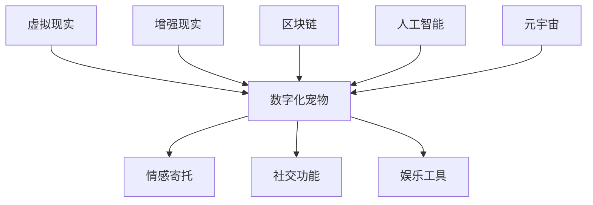

                 

# 《数字化宠物：元宇宙中的情感寄托》

> **关键词：** 数字化宠物、元宇宙、情感寄托、虚拟现实、增强现实、区块链、人工智能。

> **摘要：** 本文探讨了数字化宠物这一新兴概念，分析了其在元宇宙中的角色与地位，以及数字化宠物背后的技术基础。本文还深入探讨了数字化宠物如何成为人们的情感寄托，并展望了其未来的发展趋势。

### 《数字化宠物：元宇宙中的情感寄托》目录大纲

#### 第一部分：数字化宠物的定义与重要性

1. **数字化宠物的定义与特点**
2. **数字化宠物在元宇宙中的角色与地位**
3. **元宇宙的发展与数字化宠物的前景**

#### 第二部分：数字化宠物的技术基础

1. **虚拟现实技术基础**
2. **增强现实技术基础**
3. **区块链技术基础**
4. **人工智能在数字化宠物中的应用**

#### 第三部分：情感寄托与数字化宠物

1. **情感寄托的概念与类型**
2. **数字化宠物与情感寄托**
3. **数字化宠物的社交功能**

#### 第四部分：案例研究与未来展望

1. **数字化宠物案例研究**
2. **数字化宠物的未来展望**

#### 附录

1. **数字化宠物的开发工具与资源**

### 第一部分：数字化宠物的定义与重要性

#### 1. 数字化宠物的定义与特点

**数字化宠物**，是指通过虚拟现实（VR）、增强现实（AR）、区块链和人工智能（AI）等技术手段，创建出的虚拟生物实体，这些实体可以在元宇宙中进行互动、交流和成长。数字化宠物具有以下特点：

1. **虚拟性**：数字化宠物是虚拟的，不存在于现实世界中，它们存在于数字世界之中。
2. **互动性**：数字化宠物可以与用户进行实时互动，满足用户的情感需求。
3. **个性化**：数字化宠物可以根据用户的喜好、习惯和行为进行定制，具有高度的个性化。
4. **成长性**：数字化宠物可以随着时间成长，具备成长和学习的能力。

**数字化宠物与实体宠物的区别**：

1. **存在形式**：实体宠物存在于现实世界中，而数字化宠物存在于虚拟世界中。
2. **互动方式**：实体宠物与用户之间的互动是直接且实时的，而数字化宠物与用户之间的互动是通过数字技术和网络实现的。
3. **维护成本**：实体宠物的维护成本较高，包括食物、医疗、保健等方面，而数字化宠物的维护成本较低。

#### 2. 数字化宠物在元宇宙中的角色与地位

**数字化宠物在虚拟世界中的角色**：

1. **情感寄托**：数字化宠物可以成为用户的情感寄托，给予用户陪伴和关爱。
2. **社交伙伴**：数字化宠物可以作为用户的社交伙伴，帮助用户拓展社交圈。
3. **娱乐工具**：数字化宠物可以提供娱乐功能，如游戏、互动等。

**数字化宠物在元宇宙中的重要性**：

1. **元宇宙的构成要素**：数字化宠物是元宇宙中不可或缺的一部分，为元宇宙增添了丰富的情感元素。
2. **用户体验的提升**：数字化宠物为用户提供了全新的互动体验，提升了用户的参与感和沉浸感。
3. **商业价值的挖掘**：数字化宠物具有商业价值，可以应用于广告、游戏、社交等多个领域。

#### 3. 元宇宙的发展与数字化宠物的前景

**元宇宙的兴起**：

元宇宙是指一个虚拟的、三维的、沉浸式的数字世界，用户可以在其中进行各种活动。元宇宙的概念起源于1992年，经过数十年的发展，如今已经逐渐兴起。

**数字化宠物的发展趋势**：

1. **技术的进步**：随着虚拟现实、增强现实、区块链和人工智能等技术的不断进步，数字化宠物将更加智能化、个性化。
2. **市场的扩大**：随着元宇宙的兴起，数字化宠物的市场需求将不断扩大。
3. **应用的拓展**：数字化宠物将在元宇宙中发挥更多的作用，如教育、医疗、艺术等。

**数字化宠物的潜在市场**：

1. **年轻一代**：年轻一代对数字化宠物有较高的接受度，是数字化宠物的主要消费群体。
2. **虚拟现实用户**：虚拟现实用户是数字化宠物的主要目标用户，他们的需求将推动数字化宠物的发展。
3. **元宇宙建设者**：元宇宙的建设者需要数字化宠物来丰富元宇宙的生态，因此也是数字化宠物的重要市场。

### 总结

数字化宠物是元宇宙中不可或缺的一部分，它们为用户提供了情感寄托、社交伙伴和娱乐工具。随着元宇宙的兴起和数字化宠物技术的不断发展，数字化宠物将在元宇宙中发挥越来越重要的作用。未来，数字化宠物将具有更高的智能化、个性化，成为元宇宙中不可或缺的元素。数字化宠物的前景广阔，将为相关领域带来巨大的商业价值。

---

**核心概念与联系：**

**虚拟现实技术基础**

虚拟现实（Virtual Reality，VR）是一种通过电脑模拟产生三维空间的视觉、听觉、触觉等感知，使用户沉浸其中的一种技术。VR技术的基本原理是通过头戴式显示器（HMD）、传感器等设备，将用户的视角和动作实时传递给电脑，电脑再根据用户的视角和动作生成相应的三维图像，通过HMD显示给用户。

**虚拟现实技术的应用**

1. **游戏**：VR游戏是VR技术最直接的应用，通过VR游戏，用户可以体验到身临其境的游戏体验。
2. **教育**：VR技术可以用于模拟实验、历史事件重现、医学教学等，为学生提供更直观、生动的学习体验。
3. **旅游**：通过VR技术，用户可以虚拟游览世界各地，体验不同文化、风光。
4. **房地产**：VR技术可以用于房地产销售，用户可以在虚拟世界中浏览房屋内部结构，体验居住环境。
5. **医疗**：VR技术可以用于手术模拟、心理治疗等，为医疗行业提供新的解决方案。

**虚拟现实技术的未来发展趋势**

1. **更高分辨率**：随着显示技术的进步，VR设备的分辨率将不断提高，提供更加清晰的视觉体验。
2. **更广视野**：未来VR设备的视野范围将更广，提供更真实的沉浸感。
3. **更轻便**：随着硬件技术的发展，VR设备的重量和体积将不断减小，便于用户携带和使用。
4. **更智能**：通过人工智能技术，VR设备将能够更好地理解用户的动作和需求，提供更加个性化的服务。

**增强现实技术基础**

增强现实（Augmented Reality，AR）是一种通过电脑技术将虚拟信息与现实世界叠加的技术。AR技术的基本原理是通过摄像头捕捉现实世界的图像，然后通过电脑处理将这些图像与虚拟信息叠加，通过显示器呈现给用户。

**增强现实技术的应用**

1. **导航**：通过AR技术，用户可以在现实世界中看到导航信息，提高导航的准确性和便利性。
2. **购物**：通过AR技术，用户可以虚拟试穿衣物、查看商品细节，提高购物体验。
3. **教育**：AR技术可以用于教育领域，如通过AR技术展示历史事件、生物结构等，提高学生的学习兴趣。
4. **娱乐**：AR技术可以用于娱乐领域，如通过AR技术制作电影、游戏等，提供更丰富的娱乐体验。
5. **医疗**：AR技术可以用于医疗领域，如通过AR技术进行手术导航、医学教学等。

**增强现实技术的未来发展趋势**

1. **更高分辨率**：随着显示技术的进步，AR设备的分辨率将不断提高，提供更加清晰的视觉体验。
2. **更广视野**：未来AR设备的视野范围将更广，提供更真实的沉浸感。
3. **更智能**：通过人工智能技术，AR设备将能够更好地理解用户的动作和需求，提供更加个性化的服务。
4. **更便捷**：随着硬件技术的发展，AR设备的重量和体积将不断减小，便于用户携带和使用。

**区块链技术基础**

区块链（Blockchain）是一种分布式数据库技术，通过密码学保证数据的安全和不可篡改。区块链的基本原理是将数据分散存储在多个节点上，每个节点都保存了一份完整的数据库，并通过密码学算法保证数据的真实性和安全性。

**区块链技术在宠物领域的应用**

1. **宠物身份认证**：通过区块链技术，可以为宠物建立唯一的身份认证，确保宠物的身份信息真实可靠。
2. **宠物健康档案**：通过区块链技术，可以为宠物建立健康档案，记录宠物的健康状况、疫苗接种记录等信息。
3. **宠物交易**：通过区块链技术，可以建立安全的宠物交易平台，确保交易过程透明、可追溯。
4. **宠物保险**：通过区块链技术，可以为宠物保险提供可靠的记录和验证，提高保险的效率和准确性。

**区块链技术的未来发展趋势**

1. **更高效**：随着区块链技术的不断进步，其处理速度和效率将不断提高。
2. **更安全**：随着密码学算法的不断进步，区块链的安全性将得到进一步提升。
3. **更多应用场景**：随着区块链技术的普及，其在各个领域的应用场景将不断拓展。

**人工智能在数字化宠物中的应用**

人工智能（Artificial Intelligence，AI）是一种模拟人类智能的技术，通过机器学习、深度学习等算法，使计算机具备智能行为。人工智能在数字化宠物中的应用包括：

1. **行为预测**：通过分析宠物的行为数据，AI可以预测宠物的行为趋势，帮助用户更好地理解宠物的需求。
2. **情感分析**：通过分析宠物的表情、动作等数据，AI可以判断宠物的情感状态，为用户提供更个性化的服务。
3. **医疗诊断**：通过分析宠物的健康数据，AI可以提供更准确的医疗诊断，提高宠物的健康水平。
4. **智能训练**：通过AI技术，可以开发出智能化的宠物训练工具，提高宠物训练的效率。

**情感寄托的概念与类型**

情感寄托是指个体将自己的情感、情绪和精力投入到某个对象或个体中，从而获得心理满足和安全感。情感寄托的类型包括：

1. **亲情寄托**：个体将自己的情感投入到亲人、朋友或家人中，获得亲情、友情或家庭的安全感。
2. **爱情寄托**：个体将自己的情感投入到恋人或配偶中，获得爱情的安全感。
3. **事业寄托**：个体将自己的情感投入到事业或工作中，获得成就感、事业成功的安全感。
4. **宠物寄托**：个体将自己的情感投入到宠物中，获得陪伴、关爱和依赖的安全感。

**情感寄托与心理健康的关系**

情感寄托对心理健康有重要影响：

1. **积极作用**：适当的情感寄托可以帮助个体缓解压力、调节情绪，提高心理健康水平。
2. **消极作用**：过度的情感寄托可能导致个体对他人或宠物产生依赖，影响其独立性和自我发展。

**数字化宠物如何成为情感寄托**

数字化宠物成为情感寄托的原因：

1. **互动性**：数字化宠物可以与用户进行实时互动，满足用户的情感需求。
2. **个性化**：数字化宠物可以根据用户的喜好、习惯和行为进行定制，成为用户的情感寄托。
3. **陪伴性**：数字化宠物可以随时陪伴用户，为用户提供情感支持。

**数字化宠物在情感寄托中的优势**

1. **灵活性**：数字化宠物不受时间和地点的限制，可以随时陪伴用户。
2. **个性化**：数字化宠物可以根据用户的喜好进行定制，满足用户的个性化需求。
3. **安全**：数字化宠物不会像实体宠物一样生病、受伤，对用户的安全没有影响。

**数字化宠物在情感寄托中的挑战**

1. **真实感**：虽然数字化宠物可以模拟实体宠物的行为，但仍然无法完全替代实体宠物的真实感。
2. **孤独感**：过度的依赖数字化宠物可能导致用户对现实生活中的社交互动产生抵触。
3. **情感转移**：用户可能会将情感从现实生活中的亲人、朋友转移到数字化宠物上，影响现实生活中的社交关系。

**数字化宠物的社交功能**

1. **概念**：数字化宠物的社交功能是指数字化宠物在元宇宙中与其他用户进行互动、交流和合作的能力。
2. **优势**：
   - **丰富社交体验**：数字化宠物可以与其他用户共同参与元宇宙中的活动，丰富用户的社交体验。
   - **降低社交压力**：数字化宠物可以代替用户进行一些社交活动，降低用户的社交压力。
   - **拓展社交圈**：数字化宠物可以帮助用户结识新的朋友，拓展社交圈。
3. **功能**：
   - **互动交流**：用户可以通过语音、文字、表情等方式与数字化宠物进行互动交流。
   - **活动参与**：用户可以与数字化宠物共同参与元宇宙中的各种活动，如游戏、音乐会、电影等。
   - **合作任务**：用户可以与数字化宠物合作完成任务，共同进步。

**数字化宠物社交的案例分析**

1. **案例一**：某元宇宙中的数字化宠物社交平台，用户可以通过创建自己的数字化宠物，与其他用户互动，参与各种社交活动。该平台提供了丰富的社交功能，如语音聊天、视频通话、共同游戏等，大大丰富了用户的社交体验。
2. **案例二**：某虚拟现实游戏中的数字化宠物，玩家可以创建自己的数字化宠物，与其他玩家合作完成任务，共同战斗。这种社交模式不仅增加了游戏的趣味性，还增强了玩家之间的互动和合作。

**数字化宠物案例研究**

1. **成功的数字化宠物案例**：

   - **NUSOFT**：NUSOFT是一家专注于虚拟宠物开发和运营的公司，其虚拟宠物产品Nuffy受到了广大用户的喜爱。Nuffy具有丰富的表情和动作，可以与用户进行实时互动，用户可以通过购买虚拟货币来购买食物、玩具等，与Nuffy建立深厚的情感联系。

   - **PETPEP**：PETPEP是一个基于区块链技术的虚拟宠物平台，用户可以通过PETPEP购买、交易和孵化虚拟宠物。PETPEP采用了去中心化的技术，确保了虚拟宠物的所有权和安全性，用户可以自由地交易和共享自己的虚拟宠物。

2. **失败的数字化宠物案例**：

   - **PET town**：PET town是一款早期的虚拟宠物游戏，由于游戏设计不够完善，用户互动体验差，导致用户流失严重。此外，PET town的虚拟宠物定价过高，让很多用户望而却步。

   - **Petting Zoo**：Petting Zoo是一款虚拟农场游戏，玩家可以在游戏中饲养和繁殖动物。然而，由于游戏中的动物缺乏互动性和成长性，用户对游戏的兴趣逐渐减弱，导致游戏最终失败。

**案例中的关键要素与教训**

1. **成功的关键要素**：

   - **用户体验**：成功的数字化宠物案例都注重用户体验，提供丰富的互动功能和个性化的服务。

   - **社交功能**：成功的数字化宠物案例都具备良好的社交功能，让用户可以与其他用户互动，建立深厚的情感联系。

   - **经济体系**：成功的数字化宠物案例都建立了完善的经济体系，用户可以通过购买、交易和孵化虚拟宠物获得收益。

2. **失败的教训**：

   - **用户体验不足**：失败的数字化宠物案例往往忽视了用户体验，导致用户流失。

   - **社交功能欠缺**：失败的数字化宠物案例往往缺乏良好的社交功能，用户难以与其他用户建立联系。

   - **经济体系不合理**：失败的数字化宠物案例往往经济体系不合理，导致用户难以盈利，失去游戏的兴趣。

**数字化宠物的未来展望**

1. **技术发展**：

   - **虚拟现实与增强现实**：随着虚拟现实和增强现实技术的不断进步，数字化宠物将提供更加真实的互动体验。

   - **人工智能**：人工智能技术的发展将使数字化宠物具备更高的智能化水平，能够更好地理解用户需求。

   - **区块链**：区块链技术的应用将提高数字化宠物的安全性，建立完善的经济体系。

2. **角色变化**：

   - **情感寄托**：数字化宠物将继续作为用户的情感寄托，提供陪伴和支持。

   - **社交伙伴**：数字化宠物将成为用户的社交伙伴，帮助用户拓展社交圈。

   - **娱乐工具**：数字化宠物将继续作为用户的娱乐工具，提供丰富的互动体验。

3. **社会影响**：

   - **心理健康**：数字化宠物有助于缓解用户的压力和焦虑，提高心理健康水平。

   - **社交互动**：数字化宠物将促进用户之间的互动和合作，提高社交技能。

   - **经济价值**：数字化宠物将成为一个新的经济增长点，带动相关产业的发展。

### 附录：数字化宠物的开发工具与资源

1. **开发工具介绍**：

   - **Unity**：Unity是一款强大的游戏引擎，可以用于开发虚拟现实和增强现实应用。它提供了丰富的开发工具和资源，支持多种编程语言，如C#和JavaScript。

   - **Unreal Engine**：Unreal Engine是一款功能强大的游戏引擎，适用于开发高质量的虚拟现实和增强现实应用。它提供了丰富的可视化编辑工具和高质量的图形效果。

   - **Unity Analytics**：Unity Analytics是一款数据分析工具，可以帮助开发者了解用户行为，优化数字化宠物的开发。

2. **资源链接与推荐**：

   - **Unity官方文档**：https://docs.unity3d.com/
   - **Unreal Engine官方文档**：https://docs.unrealengine.com/
   - **ARCore官方文档**：https://developers.google.com/ar/
   - **ARKit官方文档**：https://developer.apple.com/documentation/arkit

3. **开发工具的未来发展趋势**：

   - **更高效**：随着技术的发展，开发工具将提供更高效、更便捷的开发体验。
   - **更智能化**：开发工具将具备更智能的功能，如自动化代码生成、智能调试等。
   - **跨平台**：开发工具将支持更多平台，如移动设备、智能家居等。

---

**作者：AI天才研究院/AI Genius Institute & 禅与计算机程序设计艺术 /Zen And The Art of Computer Programming**

