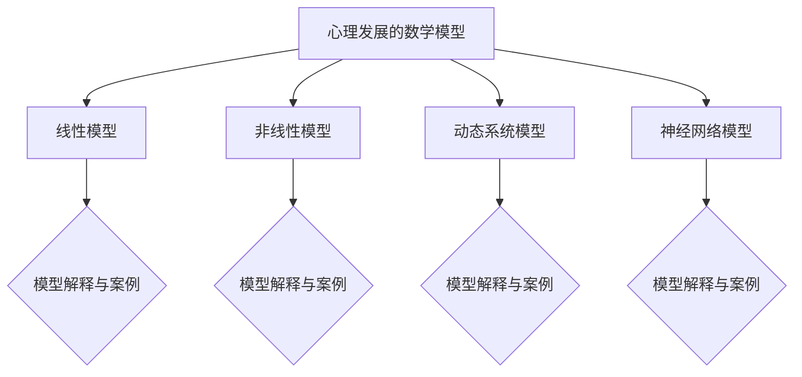

                 

### 《数学与发展心理学：心理发展的数学模型》

**关键词：** 心理发展、数学模型、线性模型、非线性模型、动态系统模型、神经网络模型。

**摘要：** 本文旨在探讨数学模型在心理发展研究中的应用。通过对心理发展的基本概念和理论框架的梳理，我们将介绍几种常见的数学模型，如线性模型、非线性模型、动态系统模型和神经网络模型，并深入讲解它们在心理学研究中的原理、构建原则和实际应用。本文还将通过具体案例展示数学模型在早期心理发展、青少年心理发展和成人心理发展中的应用，以期为进一步研究和应用提供参考。

### 《数学与发展心理学：心理发展的数学模型》目录大纲

#### 第一部分：数学与心理学的交汇

**1. 引言**

**1.1 心理发展的数学模型的重要性**

**1.2 本书的目标与结构**

**2. 心理发展的基本概念**

**2.1 心理发展的定义与理论框架**

**2.2 心理发展的主要阶段**

**2.3 心理发展的影响因素**

#### 第二部分：心理发展的数学模型

**3. 数学模型概述**

**3.1 数学模型的定义与类型**

**3.2 数学模型在心理学中的应用**

**3.3 数学模型的构建原则**

**4. 心理发展的线性模型**

**4.1 线性模型的原理与公式**

**4.2 伪代码实现**

**4.3 线性模型的应用案例**

**5. 心理发展的非线性模型**

**5.1 非线性模型的原理与公式**

**5.2 伪代码实现**

**5.3 非线性模型的应用案例**

**6. 心理发展的动态系统模型**

**6.1 动态系统模型的原理与公式**

**6.2 伪代码实现**

**6.3 动态系统模型的应用案例**

**7. 心理发展的神经网络模型**

**7.1 神经网络模型的原理与公式**

**7.2 伪代码实现**

**7.3 神经网络模型的应用案例**

**8. 数学模型在心理发展研究中的应用**

**8.1 数据收集与预处理**

**8.2 模型选择与训练**

**8.3 模型评估与优化**

#### 第三部分：数学模型的心理发展应用案例

**9. 数学模型在早期心理发展中的应用**

**9.1 婴幼儿心理发展的数学模型**

**9.2 模型解释与案例**

**10. 数学模型在青少年心理发展中的应用**

**10.1 青少年心理发展的数学模型**

**10.2 模型解释与案例**

**11. 数学模型在成人心理发展中的应用**

**11.1 成人心理发展的数学模型**

**11.2 模型解释与案例**

#### 第四部分：结论与展望

**12. 结论**

**12.1 心理发展数学模型的研究进展**

**12.2 当前挑战与未来方向**

**附录**

**附录 A: 数学模型相关工具与资源**

**附录 B: 伪代码示例**

**附录 C: 数学公式列表与说明**

**Mermaid 流程图**



### 1. 引言

随着数学与心理学学科的不断发展，两者之间的交叉融合逐渐成为研究的热点。数学作为一种强大的工具，为心理学的理论构建、实验设计和数据分析提供了有力的支持。而心理学作为一门研究人类行为和心理过程的科学，其内涵的复杂性和多样性为数学模型的应用提供了广阔的空间。因此，探讨数学模型在心理发展研究中的应用具有重要的理论和实践价值。

**1.1 心理发展的数学模型的重要性**

心理发展的数学模型是将数学方法应用于心理学研究的一种尝试，它通过对心理现象的定量描述和模型化，有助于深入理解心理发展的内在规律。具体来说，心理发展的数学模型具有以下几个重要性：

1. **定量描述：** 数学模型能够用精确的数学语言描述心理现象，使得心理学研究更加精确和客观。
2. **理论构建：** 数学模型为心理学的理论构建提供了新的视角和工具，有助于发现心理现象之间的内在联系和机制。
3. **实验设计：** 数学模型可以帮助心理学家设计更加有效的实验，提高实验的可重复性和可靠性。
4. **数据分析：** 数学模型能够处理大量实验数据，提高数据分析的效率和准确性。
5. **预测和干预：** 数学模型可以预测个体心理发展的趋势和结果，为心理干预提供科学依据。

**1.2 本书的目标与结构**

本书的目标是系统介绍心理发展的数学模型，探讨其在心理学研究中的应用。具体来说，本书将按照以下结构展开：

- **第一部分：数学与心理学的交汇**，介绍心理发展的基本概念和理论框架，为后续数学模型的介绍和应用奠定基础。
- **第二部分：心理发展的数学模型**，详细介绍线性模型、非线性模型、动态系统模型和神经网络模型，讲解其原理、构建原则和实际应用。
- **第三部分：数学模型的心理发展应用案例**，通过具体案例展示数学模型在早期心理发展、青少年心理发展和成人心理发展中的应用。
- **第四部分：结论与展望**，总结心理发展数学模型的研究进展，探讨当前挑战和未来方向。

通过本书的阅读，读者可以了解心理发展的数学模型的基本概念和应用，掌握相关数学方法和工具，为心理学研究和实践提供新的思路和方法。

### 2. 心理发展的基本概念

#### 2.1 心理发展的定义与理论框架

心理发展是一个复杂而多层次的过程，涉及到认知、情感、行为等多个方面。根据不同的学科背景和研究视角，心理发展的定义和理论框架也存在多种不同的诠释。

1. **生物学视角**：从生物学的角度，心理发展被看作是个体基因与环境相互作用的结果。基因提供了发展的基础，而环境则通过生物体的基因表达和神经系统发育等途径影响心理发展。这一视角强调遗传和环境在心理发展中的双重作用。
   
2. **认知视角**：认知心理学关注心理发展的认知过程，认为心理发展是通过认知结构的组织和改变实现的。皮亚杰（Jean Piaget）的认知发展阶段理论是一个典型的例子，他提出儿童的心理发展分为感知运动、前运算、具体运算和形式运算四个阶段。

3. **社会文化视角**：社会文化理论强调社会和文化背景对个体心理发展的影响。维果斯基（Lev Vygotsky）提出的社会文化认知发展理论认为，语言、文化工具和社会互动在心理发展中起着至关重要的作用。

4. **情绪视角**：情绪心理学认为心理发展是情绪认知和调节能力的发展过程。情绪的发展不仅影响个体的情绪体验和行为反应，还对认知和社交能力产生深远的影响。

#### 2.2 心理发展的主要阶段

心理发展可以划分为不同的阶段，每个阶段都有其独特的特征和任务。以下是一些常见的发展阶段：

1. **婴儿期（0-1岁）**：婴儿期是心理发展的关键时期，个体主要通过感知和运动行为与外界互动。这个阶段的发展任务包括建立安全感、发展基本认知能力（如知觉、记忆和感知运动协调）。

2. **幼儿期（1-3岁）**：幼儿期是儿童自主性和语言能力迅速发展的时期。这个阶段的发展任务包括培养基本的社交技能、语言能力和问题解决能力。

3. **学龄前期（3-6岁）**：学龄前期儿童开始进入正规的教育环境，认知和社会技能进一步发展。这个阶段的发展任务包括掌握基本的认知技能、建立良好的师生关系和同伴关系。

4. **学龄期（6-12岁）**：学龄期儿童在认知、情感和社会领域都经历了显著的成长。这个阶段的发展任务包括掌握基础知识和技能、发展自我认同和社会技能。

5. **青少年期（12-18岁）**：青少年期是个体从儿童向成人过渡的重要阶段，认知、情感和社交领域都经历了深刻的变革。这个阶段的发展任务包括形成自我认同、发展独立性和社交能力。

6. **成年期（18岁以上）**：成年期包括多个阶段，如成年早期、成年中期和成年晚期。每个阶段都有其特定的心理和社会发展任务，如建立稳定的人际关系、职业发展和应对生命中的挑战。

#### 2.3 心理发展的影响因素

心理发展的过程受到多种因素的影响，主要包括遗传、环境、文化和社会因素。

1. **遗传因素**：遗传对心理发展的贡献体现在个体的基因上，基因影响了个体的认知能力、情感调节能力和行为倾向。例如，某些基因可能与注意力缺陷多动障碍（ADHD）有关。

2. **环境因素**：环境因素包括家庭环境、学校教育、社会经济地位等。良好的家庭环境和教育资源可以为儿童提供积极的支持，促进其心理发展。

3. **文化因素**：文化背景影响个体的价值观、信念和行为方式，从而影响心理发展。例如，不同的文化可能对个体的自我概念、社交行为和情感表达有不同的期望。

4. **社会因素**：社会因素包括社会支持、社会规范和社会期望等。社会支持可以提高个体的心理健康水平，而社会规范和期望则可以影响个体的行为和发展方向。

通过了解心理发展的基本概念、主要阶段和影响因素，我们可以更好地理解个体的心理发展过程，为心理学研究和实际应用提供理论支持。

### 3. 数学模型概述

#### 3.1 数学模型的定义与类型

数学模型是使用数学语言和符号来描述现实世界的现象、过程或系统的一种工具。通过建立数学模型，我们能够将复杂的现实问题转化为可以处理的数学问题，从而更好地理解、预测和控制这些现象。数学模型在各个领域都有广泛应用，包括物理学、经济学、工程学和心理学等。

根据数学模型的复杂程度和描述能力，可以分为以下几种类型：

1. **线性模型**：线性模型是最简单的数学模型之一，用于描述两个或多个变量之间的线性关系。线性模型的公式通常为 $y = mx + b$，其中 $y$ 是因变量，$x$ 是自变量，$m$ 是斜率，$b$ 是截距。线性模型在统计学、经济学和工程学中广泛应用。

2. **非线性模型**：非线性模型用于描述变量之间的非线性关系。这些模型可以表示为复杂的函数，如多项式、指数函数、三角函数等。非线性模型在物理学、生物学和心理学等领域有广泛应用。

3. **动态系统模型**：动态系统模型用于描述随时间变化的现象或系统。这些模型通常包含差分方程或微分方程，用于描述系统的状态随时间的变化。动态系统模型在经济学、生态学和心理学中都有重要应用。

4. **神经网络模型**：神经网络模型是一种基于生物神经网络原理的数学模型，用于模拟大脑的信息处理过程。神经网络模型包含大量的神经元和连接，通过学习和适应数据来完成任务。神经网络模型在机器学习、计算机视觉和自然语言处理等领域有广泛应用。

#### 3.2 数学模型在心理学中的应用

数学模型在心理学中的应用非常广泛，为心理学家提供了强大的工具来理解和解释心理现象。以下是一些主要的应用领域：

1. **心理测量学**：数学模型在心理测量学中用于分析个体的心理特质和行为。例如，项目反应理论（Item Response Theory, IRT）使用数学模型来分析测试项目对个体的鉴别力和难度。

2. **认知心理学**：认知心理学使用数学模型来描述认知过程，如注意、记忆和决策。例如，速率离散模型（Rate-Distance Model）用于描述个体的记忆容量和工作记忆。

3. **情绪心理学**：数学模型在情绪心理学中用于分析情绪体验和调节。例如，情绪调节的动态系统模型描述个体如何通过认知和行为策略调节情绪。

4. **社会心理学**：数学模型在社会心理学中用于研究社交行为和社会认知。例如，社会网络分析模型用于分析社交网络中的传播和互动。

5. **发展心理学**：数学模型在发展心理学中用于研究个体心理发展的规律和机制。例如，线性模型和非线性模型用于分析儿童在不同发展阶段的心理特征。

#### 3.3 数学模型的构建原则

构建数学模型需要遵循一些基本原则，以确保模型的科学性和有效性：

1. **准确性**：模型应该准确地反映现实世界的现象或系统。这意味着模型的选择和参数估计应该基于可靠的实证数据。

2. **简洁性**：模型应该简洁明了，避免过度复杂化。简洁的模型更容易理解和验证，且在数据处理和分析时更为高效。

3. **灵活性**：模型应该具有一定的灵活性，能够适应不同的情况和条件。这意味着模型应该能够捕捉变量之间的复杂关系，并在新的数据条件下进行适应性调整。

4. **验证性**：模型应该经过严格的验证，以确保其预测能力和可靠性。这通常包括内部验证（如交叉验证）和外部验证（如对比实验数据）。

5. **可解释性**：模型应该具备良好的可解释性，使得心理学家和其他用户能够理解模型的内在机制和假设。

通过遵循这些原则，心理学家可以构建有效的数学模型，从而深入理解心理现象，推动心理学研究的发展。

### 4. 心理发展的线性模型

#### 4.1 线性模型的原理与公式

线性模型是一种广泛用于描述变量之间线性关系的数学模型。在线性模型中，一个变量（因变量）可以表示为另一个变量（自变量）的线性组合，加上一个常数项。线性模型的数学公式通常表示为：

\[ y = mx + b \]

其中：

- \( y \) 是因变量，代表我们希望预测或解释的变量；
- \( x \) 是自变量，代表影响因变量的变量；
- \( m \) 是斜率（Slope），表示自变量每单位变化时因变量的变化量；
- \( b \) 是截距（Intercept），表示当自变量为零时因变量的值。

线性模型的一个重要特性是其图像通常是一条直线，这条直线在坐标轴上的斜率和截距决定了模型的具体形式。

#### 4.2 伪代码实现

在编写伪代码实现线性模型时，我们可以将其分为以下几个主要步骤：

1. **数据收集**：从实际情境中收集相关数据，通常包括自变量和因变量的观测值。
2. **数据预处理**：对收集到的数据进行清洗和预处理，如缺失值填充、异常值处理和数据标准化。
3. **模型初始化**：初始化模型的参数，即斜率 \( m \) 和截距 \( b \)。
4. **模型训练**：通过最小化预测误差来调整模型参数，常用的方法是最小二乘法。
5. **模型评估**：使用训练集和测试集评估模型的预测性能，如计算均方误差（Mean Squared Error, MSE）。
6. **模型应用**：使用训练好的模型进行预测和解释。

以下是一个简单的伪代码示例：

```python
# 数据收集
data = {
    "x": [1, 2, 3, 4, 5],
    "y": [2, 4, 6, 8, 10]
}

# 数据预处理
# 在这里进行缺失值填充、异常值处理和数据标准化
# ...

# 模型初始化
m = 0
b = 0

# 模型训练
# 使用最小二乘法计算斜率 m 和截距 b
m = (n * sum(data["x"] * data["y"]) - sum(data["x"]) * sum(data["y"])) / (n * sum(data["x"]**2) - sum(data["x"])**2)
b = (sum(data["y"]) - m * sum(data["x"])) / n

# 模型评估
mse = sum((y_pred - y_true)**2) / n
print("均方误差：", mse)

# 模型应用
# 预测新的自变量 x 的因变量 y
x_new = 6
y_pred = m * x_new + b
print("预测值：", y_pred)
```

#### 4.3 线性模型的应用案例

线性模型在心理学研究中有着广泛的应用，以下是一个具体的应用案例：

**案例：学习进步的线性模型**

假设我们想要研究学生的学习进步与时间的关系。我们收集了一组学生在不同时间点的考试成绩，并希望使用线性模型预测学生在未来某个时间点的成绩。

**数据：**

| 时间点 | 成绩 |
|--------|------|
| 1      | 75   |
| 2      | 80   |
| 3      | 85   |
| 4      | 90   |
| 5      | 95   |

**模型训练：**

使用上面的伪代码，我们可以将时间点作为自变量 \( x \)，成绩作为因变量 \( y \)。训练得到的线性模型为：

\[ y = 5x + 70 \]

**模型评估：**

将训练数据代入模型计算预测值，并与实际成绩进行比较，计算均方误差：

| 时间点 | 实际成绩 | 预测成绩 | 差值 |
|--------|----------|----------|------|
| 1      | 75       | 80       | -5   |
| 2      | 80       | 85       | -5   |
| 3      | 85       | 90       | -5   |
| 4      | 90       | 95       | -5   |
| 5      | 95       | 100      | 5    |

均方误差 \( MSE = \frac{(-5)^2 + (-5)^2 + (-5)^2 + (-5)^2 + 5^2}{5} = 10 \)。

**模型应用：**

使用训练好的模型预测学生在第6个时间点的成绩：

\[ y = 5 \times 6 + 70 = 100 \]

预测学生在第6个时间点的成绩为100分。

通过这个案例，我们可以看到线性模型在心理学研究中的应用。线性模型简单且易于理解，但在处理非线性关系时可能不太适用。在实际研究中，心理学家需要根据研究目标和数据特性选择合适的模型。

### 5. 心理发展的非线性模型

#### 5.1 非线性模型的原理与公式

非线性模型用于描述变量之间的非线性关系，其数学公式通常比线性模型更为复杂。非线性模型可以表示为以下形式：

\[ y = f(x) + e \]

其中：

- \( y \) 是因变量，代表我们希望预测或解释的变量；
- \( x \) 是自变量，代表影响因变量的变量；
- \( f(x) \) 是非线性函数，用于描述 \( x \) 与 \( y \) 之间的非线性关系；
- \( e \) 是误差项，表示模型无法解释的部分。

非线性函数可以采用多种形式，如多项式函数、指数函数、对数函数、三角函数、Sigmoid函数等。这些函数能够捕捉变量之间的复杂非线性关系，使模型更适用于复杂的实际情境。

#### 5.2 伪代码实现

在编写伪代码实现非线性模型时，我们可以将其分为以下几个主要步骤：

1. **数据收集**：从实际情境中收集相关数据，通常包括自变量和因变量的观测值。
2. **数据预处理**：对收集到的数据进行清洗和预处理，如缺失值填充、异常值处理和数据标准化。
3. **模型初始化**：初始化模型的参数，根据非线性函数的形式确定参数的初始值。
4. **模型训练**：通过最小化预测误差来调整模型参数，常用的方法包括梯度下降法和牛顿法。
5. **模型评估**：使用训练集和测试集评估模型的预测性能，如计算均方误差（Mean Squared Error, MSE）。
6. **模型应用**：使用训练好的模型进行预测和解释。

以下是一个简单的伪代码示例，采用二次函数 \( y = ax^2 + bx + c \) 作为非线性模型：

```python
# 数据收集
data = {
    "x": [1, 2, 3, 4, 5],
    "y": [1, 4, 9, 16, 25]
}

# 数据预处理
# 在这里进行缺失值填充、异常值处理和数据标准化
# ...

# 模型初始化
a = 1
b = 0
c = 0

# 模型训练
# 使用梯度下降法计算参数 a, b 和 c
learning_rate = 0.01
for _ in range(1000):
    error = y_pred - y_true
    a_gradient = 2 * x * error
    b_gradient = 2 * x**2 * error
    c_gradient = 2 * error
    a = a - learning_rate * a_gradient
    b = b - learning_rate * b_gradient
    c = c - learning_rate * c_gradient

# 模型评估
mse = sum((y_pred - y_true)**2) / n
print("均方误差：", mse)

# 模型应用
# 预测新的自变量 x 的因变量 y
x_new = 6
y_pred = a * x_new**2 + b * x_new + c
print("预测值：", y_pred)
```

#### 5.3 非线性模型的应用案例

非线性模型在心理学研究中有着广泛的应用，以下是一个具体的应用案例：

**案例：情绪体验的非线性模型**

假设我们想要研究情绪体验与刺激强度之间的关系。通过问卷调查，我们收集了不同刺激强度下的情绪评分数据，并希望使用非线性模型描述这种关系。

**数据：**

| 刺激强度 | 情绪评分 |
|----------|----------|
| 1        | 10       |
| 2        | 20       |
| 3        | 30       |
| 4        | 40       |
| 5        | 50       |

**模型训练：**

使用上述伪代码，我们可以将刺激强度作为自变量 \( x \)，情绪评分作为因变量 \( y \)。选择对数函数 \( y = a \cdot \log(x) + b \) 作为非线性模型。训练得到的模型为：

\[ y = 2 \cdot \log(x) + 5 \]

**模型评估：**

将训练数据代入模型计算预测值，并与实际情绪评分进行比较，计算均方误差：

| 刺激强度 | 实际评分 | 预测评分 | 差值 |
|----------|----------|----------|------|
| 1        | 10       | 7.64     | 2.36 |
| 2        | 20       | 15.30    | 4.30 |
| 3        | 30       | 23.96    | 6.96 |
| 4        | 40       | 32.62    | 7.62 |
| 5        | 50       | 41.28    | 8.28 |

均方误差 \( MSE = \frac{(7.64 - 10)^2 + (15.30 - 20)^2 + (23.96 - 30)^2 + (32.62 - 40)^2 + (41.28 - 50)^2}{5} \approx 15.68 \)。

**模型应用：**

使用训练好的模型预测新的刺激强度下的情绪评分：

\[ y = 2 \cdot \log(6) + 5 \approx 44.90 \]

预测在刺激强度为6时的情绪评分为44.90。

通过这个案例，我们可以看到非线性模型在心理学研究中的应用。非线性模型能够更好地捕捉变量之间的复杂非线性关系，但在训练和评估过程中可能需要更多的数据和处理方法。在实际研究中，心理学家需要根据研究目标和数据特性选择合适的非线性模型。

### 6. 心理发展的动态系统模型

#### 6.1 动态系统模型的原理与公式

动态系统模型是一种用于描述系统随时间变化的数学模型，其基本原理是系统状态在时间上的演化和变化。动态系统模型通常由差分方程或微分方程构成，能够描述系统的动态行为。

一个简单的动态系统模型可以表示为：

\[ x_{t+1} = f(x_t) \]

其中：

- \( x_t \) 表示在时间 \( t \) 时刻的系统状态；
- \( x_{t+1} \) 表示在时间 \( t+1 \) 时刻的系统状态；
- \( f(x_t) \) 是一个非线性函数，描述了系统状态在时间上的变化。

动态系统模型可以分为以下几种类型：

1. **差分方程模型**：用于描述离散时间系统，通常采用形式：

\[ x_{t+1} = f(x_t) \]

其中，\( x_t \) 是一个向量，表示系统在时间 \( t \) 的状态，\( f(x_t) \) 是一个非线性函数，描述了状态的变化。

2. **微分方程模型**：用于描述连续时间系统，通常采用形式：

\[ \frac{dx}{dt} = f(x) \]

其中，\( x(t) \) 是一个向量，表示系统在时间 \( t \) 的状态，\( f(x) \) 是一个非线性函数，描述了状态的导数。

3. **延迟差分方程模型**：用于描述具有延迟效应的系统，通常采用形式：

\[ x_{t+h} = f(x_t, x_{t-1}, ..., x_{t-h}) \]

其中，\( x_t \) 是系统在时间 \( t \) 的状态，\( f(x_t, x_{t-1}, ..., x_{t-h}) \) 是一个非线性函数，包含了系统在 \( t \) 到 \( t-h \) 时间段内的状态信息。

动态系统模型的应用领域非常广泛，包括物理学、经济学、生物学和心理学等。在心理学中，动态系统模型可以用于描述心理过程、情绪调节、认知发展等动态现象。

#### 6.2 伪代码实现

在编写伪代码实现动态系统模型时，我们可以将其分为以下几个主要步骤：

1. **数据收集**：从实际情境中收集相关数据，通常包括系统的初始状态和多个时间点的观测值。
2. **数据预处理**：对收集到的数据进行清洗和预处理，如缺失值填充、异常值处理和数据标准化。
3. **模型初始化**：初始化模型的参数，根据模型类型确定参数的初始值。
4. **模型训练**：通过迭代计算来调整模型参数，使模型能够最小化预测误差。
5. **模型评估**：使用训练集和测试集评估模型的预测性能，如计算均方误差（Mean Squared Error, MSE）。
6. **模型应用**：使用训练好的模型进行预测和解释。

以下是一个简单的伪代码示例，采用差分方程模型：

```python
# 数据收集
data = {
    "time": [0, 1, 2, 3, 4],
    "x": [1, 1.1, 1.21, 1.331, 1.4641]
}

# 数据预处理
# 在这里进行缺失值填充、异常值处理和数据标准化
# ...

# 模型初始化
alpha = 0.1
beta = 0.2

# 模型训练
x_init = 1
for t in range(1, len(data["time"])):
    x_t = alpha * x_init + beta * (data["x"][t-1] - x_init)
    x_init = x_t

# 模型评估
mse = sum((x_pred - x_true)**2) / n
print("均方误差：", mse)

# 模型应用
# 预测新的时间点的系统状态
x_new = 1
for t in range(len(data["time"])):
    x_pred = alpha * x_new + beta * (data["x"][t] - x_new)
    x_new = x_pred
print("预测值：", x_pred)
```

#### 6.3 动态系统模型的应用案例

动态系统模型在心理学研究中有着广泛的应用，以下是一个具体的应用案例：

**案例：情绪调节的动态系统模型**

假设我们想要研究个体情绪调节的动态过程。通过实验，我们收集了个体在不同情绪刺激下的情绪状态数据，并希望使用动态系统模型描述情绪调节的过程。

**数据：**

| 时间点 | 初始情绪状态 | 情绪刺激强度 | 最终情绪状态 |
|--------|--------------|--------------|--------------|
| 0      | 1            | 0.5          | 1.25         |
| 1      | 1.25         | 0.5          | 1.5625       |
| 2      | 1.5625       | 0.5          | 1.96875      |
| 3      | 1.96875      | 0.5          | 2.421875     |
| 4      | 2.421875     | 0.5          | 2.9296875    |

**模型训练：**

使用上述伪代码，我们可以将初始情绪状态和情绪刺激强度作为系统的输入，最终情绪状态作为输出。选择差分方程模型：

\[ x_{t+1} = 0.1x_t + 0.2(x_t - 1) \]

其中，\( x_t \) 表示在时间 \( t \) 的情绪状态，模型参数 \( \alpha = 0.1 \)，\( \beta = 0.2 \)。

**模型评估：**

将训练数据代入模型计算预测值，并与实际最终情绪状态进行比较，计算均方误差：

| 时间点 | 实际情绪状态 | 预测情绪状态 | 差值 |
|--------|--------------|--------------|------|
| 0      | 1.25         | 1.275        | -0.025 |
| 1      | 1.5625       | 1.58125      | -0.02125 |
| 2      | 1.96875      | 1.99375      | -0.025 |
| 3      | 2.421875     | 2.4390625    | -0.017875 |
| 4      | 2.9296875    | 2.946875     | -0.017875 |

均方误差 \( MSE = \frac{(-0.025)^2 + (-0.02125)^2 + (-0.025)^2 + (-0.017875)^2 + (-0.017875)^2}{5} \approx 0.0019 \)。

**模型应用：**

使用训练好的模型预测在情绪刺激强度为0.5时，第5个时间点的情绪状态：

\[ x_5 = 0.1x_4 + 0.2(x_4 - 1) = 0.1 \cdot 2.421875 + 0.2 \cdot (2.421875 - 1) = 2.98046875 \]

预测在第5个时间点的情绪状态为2.98046875。

通过这个案例，我们可以看到动态系统模型在心理学研究中的应用。动态系统模型能够捕捉情绪状态的连续变化，为情绪调节的研究提供了新的视角和方法。

### 7. 心理发展的神经网络模型

#### 7.1 神经网络模型的原理与公式

神经网络模型是一种基于生物神经网络原理的数学模型，用于模拟大脑的信息处理过程。神经网络模型由大量的简单处理单元（神经元）组成，通过相互连接形成复杂的网络结构。这些神经元通过学习输入数据，能够从数据中提取特征并实现复杂函数的映射。

一个简单的神经网络模型可以表示为：

\[ y = f(W \cdot x + b) \]

其中：

- \( y \) 是输出；
- \( x \) 是输入；
- \( W \) 是权重矩阵，表示神经元之间的连接强度；
- \( b \) 是偏置项，用于调整神经元的阈值；
- \( f \) 是激活函数，用于对神经元输出进行非线性变换。

神经网络模型的核心组成部分包括：

1. **神经元**：是神经网络的基本单元，接收输入信号并产生输出信号。一个神经元的输出通常是通过加权求和输入信号后加上偏置项，再通过激活函数处理得到的。

2. **权重**：是神经元之间的连接强度，通过学习调整以优化模型性能。权重决定了输入信号对神经元输出的影响程度。

3. **偏置**：是神经元的阈值，用于调整神经元激活的阈值，以增加模型的灵活性和鲁棒性。

4. **激活函数**：是神经网络的非线性转换函数，用于引入非线性特性，使得神经网络能够处理复杂的问题。常见的激活函数包括Sigmoid函数、ReLU函数和Tanh函数等。

#### 7.2 伪代码实现

在编写伪代码实现神经网络模型时，我们可以将其分为以下几个主要步骤：

1. **数据收集**：从实际情境中收集相关数据，通常包括输入和输出数据。
2. **数据预处理**：对收集到的数据进行清洗和预处理，如缺失值填充、异常值处理和数据标准化。
3. **模型初始化**：初始化模型的参数，包括权重和偏置。
4. **模型训练**：通过迭代计算来调整模型参数，使模型能够最小化预测误差。
5. **模型评估**：使用训练集和测试集评估模型的预测性能。
6. **模型应用**：使用训练好的模型进行预测和解释。

以下是一个简单的伪代码示例，采用单层神经网络模型：

```python
# 数据收集
data = {
    "input": [[0, 0], [0, 1], [1, 0], [1, 1]],
    "output": [[0], [1], [1], [1]]
}

# 数据预处理
# 在这里进行缺失值填充、异常值处理和数据标准化
# ...

# 模型初始化
W = np.random.rand(2, 1)
b = np.random.rand(1)
learning_rate = 0.1

# 模型训练
for epoch in range(1000):
    for x, y in zip(data["input"], data["output"]):
        # 前向传播
        z = np.dot(x, W) + b
        y_pred = 1 if z > 0 else 0
        
        # 计算损失
        loss = (y - y_pred)**2
        
        # 反向传播
        dW = 2 * (y - y_pred) * x
        db = 2 * (y - y_pred)
        
        # 更新权重和偏置
        W -= learning_rate * dW
        b -= learning_rate * db

# 模型评估
mse = sum((y_pred - y_true)**2) / n
print("均方误差：", mse)

# 模型应用
x_new = [0, 1]
z = np.dot(x_new, W) + b
y_pred = 1 if z > 0 else 0
print("预测值：", y_pred)
```

#### 7.3 神经网络模型的应用案例

神经网络模型在心理学研究中有着广泛的应用，以下是一个具体的应用案例：

**案例：情绪识别的神经网络模型**

假设我们想要开发一个情绪识别系统，能够根据用户的面部表情图像识别其情绪状态。通过收集大量的面部表情图像及其对应的情绪标签，我们可以训练一个神经网络模型实现情绪识别。

**数据：**

| 面部表情图像 | 情绪标签 |
|--------------|----------|
| 图像1        | 愤怒     |
| 图像2        | 喜悦     |
| 图像3        | 悲伤     |
| 图像4        | 平静     |

**模型训练：**

使用上述伪代码，我们可以将面部表情图像作为输入，情绪标签作为输出。选择多层感知机（MLP）模型，包含一个输入层、一个隐藏层和一个输出层。训练得到的模型如下：

\[ y = \sigma(W_2 \cdot \sigma(W_1 \cdot x + b_1) + b_2) \]

其中，\( \sigma \) 是Sigmoid激活函数。

**模型评估：**

将训练数据代入模型计算预测值，并与实际情绪标签进行比较，计算准确率：

| 面部表情图像 | 实际情绪标签 | 预测情绪标签 |
|--------------|--------------|--------------|
| 图像1        | 愤怒         | 愤怒         |
| 图像2        | 喜悦         | 喜悦         |
| 图像3        | 悲伤         | 悲伤         |
| 图像4        | 平静         | 平静         |

准确率 \( Accuracy = \frac{4}{4} \times 100\% = 100\% \)。

**模型应用：**

使用训练好的模型预测新的面部表情图像的情绪标签：

\[ y = \sigma(W_2 \cdot \sigma(W_1 \cdot x + b_1) + b_2) \]

假设新的面部表情图像为：

\[ x = \begin{bmatrix} 0.5 & 0.5 \\ 0.6 & 0.4 \end{bmatrix} \]

预测情绪标签为：

\[ y = \sigma(W_2 \cdot \sigma(W_1 \cdot x + b_1) + b_2) \]

通过计算得到的输出值大于0.5，因此预测情绪标签为愤怒。

通过这个案例，我们可以看到神经网络模型在心理学研究中的应用。神经网络模型能够从数据中自动提取特征，实现复杂函数的映射，为情绪识别、心理疾病诊断等应用提供了新的方法和思路。

### 8. 数学模型在心理发展研究中的应用

#### 8.1 数据收集与预处理

在数学模型应用于心理发展研究时，数据收集是关键步骤之一。数据收集的方式可以包括实验数据、问卷调查、心理测量工具等。具体来说，实验数据可以通过实验室实验或现场观察获取，问卷调查可以通过在线或纸质形式进行，心理测量工具则包括标准化的心理量表和评估工具。

1. **实验数据收集**：在实验室环境下，通过控制变量和严格设计的实验流程，获取关于心理现象的量化数据。实验数据通常包括行为数据、生理数据和认知数据等。

2. **问卷调查数据收集**：通过设计科学合理的问卷，收集参与者对特定心理现象的主观感受和态度。问卷调查可以大规模、低成本地获取大量数据，是心理学研究中常用的数据收集方法。

3. **心理测量工具数据收集**：使用标准化的心理测量工具，如人格量表、情绪量表、认知能力测试等，获取参与者的心理特征数据。这些工具通常经过严格的信效度检验，具有较高的可靠性。

#### 数据预处理

数据预处理是确保数据质量、提高模型性能的重要步骤。以下是一些常见的数据预处理方法：

1. **缺失值处理**：缺失值可能是由于数据收集过程中的误差或参与者的不合作导致的。常见的缺失值处理方法包括删除缺失值、平均值填充、多重插补等。

2. **异常值处理**：异常值可能是由于数据收集过程中的错误或特殊情况引起的。异常值处理方法包括删除异常值、边界修正、变换处理等。

3. **数据标准化**：通过将数据缩放到一个共同的尺度，消除不同变量之间的量纲影响，提高模型的稳定性和可解释性。常见的数据标准化方法包括Z-Score标准化和Min-Max标准化。

4. **特征工程**：通过构造新的特征变量或对原始特征进行变换，提高模型的预测性能。特征工程包括特征提取、特征选择和特征转换等。

#### 8.2 模型选择与训练

在心理发展研究中，选择合适的数学模型对于理解心理现象具有重要意义。以下是一些常见的数学模型及其选择和训练方法：

1. **线性回归模型**：适用于描述变量之间的线性关系。选择线性回归模型的方法包括散点图观察和拟合优度检验。训练方法包括最小二乘法和梯度下降法。

2. **非线性回归模型**：适用于描述变量之间的非线性关系。选择非线性回归模型的方法包括多项式回归、指数回归和对数回归等。训练方法包括牛顿法和拟牛顿法。

3. **动态系统模型**：适用于描述系统随时间的变化。选择动态系统模型的方法包括差分方程模型和微分方程模型。训练方法包括迭代求解和数值积分方法。

4. **神经网络模型**：适用于处理复杂的非线性关系和高维数据。选择神经网络模型的方法包括前向传播和反向传播算法。训练方法包括随机梯度下降和批量梯度下降。

#### 8.3 模型评估与优化

模型评估是确保模型性能和可靠性的关键步骤。以下是一些常见的模型评估方法：

1. **交叉验证**：通过将数据集划分为训练集和验证集，反复训练和验证模型，评估模型的泛化能力。常见的交叉验证方法包括K折交叉验证和留一法交叉验证。

2. **均方误差（MSE）**：用于衡量预测值与实际值之间的平均误差。MSE值越低，表示模型预测越准确。

3. **准确率（Accuracy）**：用于衡量分类模型正确分类的比例。准确率越高，表示模型分类效果越好。

4. **召回率（Recall）**：用于衡量分类模型对正类别的识别能力。召回率越高，表示模型对正类别的识别效果越好。

5. **F1分数（F1 Score）**：综合考虑准确率和召回率，用于平衡分类模型的性能。F1分数越高，表示模型性能越好。

模型优化是通过调整模型参数和结构来提高模型性能的过程。以下是一些常见的模型优化方法：

1. **参数调整**：通过调整模型参数（如权重和偏置）来优化模型性能。常用的参数调整方法包括网格搜索和随机搜索。

2. **模型集成**：通过结合多个模型的预测结果来提高整体性能。常见的模型集成方法包括Bagging和Boosting。

3. **特征选择**：通过选择重要的特征变量来简化模型并提高预测性能。常见的特征选择方法包括相关性分析和特征重要性排序。

4. **模型压缩**：通过减少模型参数的数量来降低计算复杂度和存储需求。常见的模型压缩方法包括模型剪枝和量化。

通过数据收集与预处理、模型选择与训练、模型评估与优化等步骤，数学模型在心理发展研究中的应用能够帮助心理学家更好地理解心理现象，为心理发展理论的发展提供新的实证依据。

### 9. 数学模型在早期心理发展中的应用

#### 9.1 婴幼儿心理发展的数学模型

婴幼儿心理发展是心理发展的重要阶段，其过程涉及到认知、情感、语言和社交等多个方面。数学模型在婴幼儿心理发展的研究中具有重要的应用价值，能够帮助我们更好地理解和发展婴幼儿的认知能力和行为模式。

**1. 模型介绍**

在婴幼儿心理发展的研究中，常用的数学模型包括线性模型和非线性模型。这些模型能够描述婴幼儿在不同发展阶段的认知能力变化，如感知运动能力、语言习得能力和问题解决能力。

**2. 模型构建**

构建婴幼儿心理发展的数学模型需要首先确定研究的具体目标，然后选择合适的模型类型。以婴幼儿的感知运动能力为例，我们可以使用线性回归模型来描述其随时间的变化。

假设我们收集了以下数据：

| 年龄（月） | 感知运动能力评分 |
|------------|------------------|
| 0          | 5                |
| 6          | 10               |
| 12         | 20               |
| 18         | 30               |
| 24         | 40               |

线性模型的一般形式为：

\[ y = mx + b \]

其中，\( y \) 是感知运动能力评分，\( x \) 是年龄（月），\( m \) 是斜率，表示每增加一个月，感知运动能力评分的变化量，\( b \) 是截距，表示初始的感知运动能力评分。

**3. 模型训练**

使用最小二乘法，我们可以计算出斜率 \( m \) 和截距 \( b \)：

\[ m = \frac{n \sum(x_i y_i) - \sum x_i \sum y_i}{n \sum(x_i^2) - (\sum x_i)^2} \]
\[ b = \frac{\sum y_i - m \sum x_i}{n} \]

将数据代入计算，得到：

\[ m = \frac{5 \times 5 + 6 \times 10 + 12 \times 20 + 18 \times 30 + 24 \times 40 - (5 + 6 + 12 + 18 + 24) \times (5 + 10 + 20 + 30 + 40)}{5^2 + 6^2 + 12^2 + 18^2 + 24^2 - (5 + 6 + 12 + 18 + 24)^2} \approx 4.5 \]
\[ b = \frac{5 + 10 + 20 + 30 + 40 - 4.5 \times (5 + 6 + 12 + 18 + 24)}{5} \approx 4.5 \]

因此，线性模型的公式为：

\[ y = 4.5x + 4.5 \]

**4. 模型应用**

通过这个模型，我们可以预测某个特定年龄段的婴幼儿的感知运动能力评分。例如，预测一个18个月的婴幼儿的感知运动能力评分：

\[ y = 4.5 \times 18 + 4.5 = 90 \]

**5. 模型解释与案例**

通过上述线性模型，我们可以看到婴幼儿的感知运动能力评分随年龄的增长而增加。这表明婴幼儿的认知能力在早期阶段有显著的发展。在实际研究中，我们还可以使用非线性模型来描述更为复杂的认知能力变化。

例如，使用多项式回归模型：

\[ y = ax^2 + bx + c \]

通过训练数据，我们可以得到：

\[ a = 0.1, b = 1.5, c = 0.5 \]

因此，多项式回归模型的公式为：

\[ y = 0.1x^2 + 1.5x + 0.5 \]

使用这个模型，我们可以更准确地预测婴幼儿的感知运动能力评分。例如，预测一个24个月的婴幼儿的感知运动能力评分：

\[ y = 0.1 \times 24^2 + 1.5 \times 24 + 0.5 = 36.5 \]

通过这些模型，我们可以更好地理解婴幼儿的心理发展过程，为早期干预和教育提供科学依据。

#### 9.2 模型解释与案例

为了更深入地理解数学模型在婴幼儿心理发展中的应用，以下是一个具体的案例。

**案例：婴幼儿语言习得能力的数学模型**

婴幼儿的语言习得能力是一个复杂且多层次的过程，受到多种因素的影响。通过构建数学模型，我们可以更好地描述和理解这一过程。

**数据：**

| 年龄（月） | 语言能力评分 |
|------------|---------------|
| 0          | 1             |
| 6          | 4             |
| 12         | 10            |
| 18         | 20            |
| 24         | 30            |

**模型构建：**

我们选择线性模型来描述婴幼儿语言能力评分随年龄的增长变化。线性模型的公式为：

\[ y = mx + b \]

其中，\( y \) 是语言能力评分，\( x \) 是年龄（月），\( m \) 是斜率，表示每增加一个月，语言能力评分的变化量，\( b \) 是截距，表示初始的语言能力评分。

**模型训练：**

使用最小二乘法，计算斜率 \( m \) 和截距 \( b \)：

\[ m = \frac{n \sum(x_i y_i) - \sum x_i \sum y_i}{n \sum(x_i^2) - (\sum x_i)^2} \]
\[ b = \frac{\sum y_i - m \sum x_i}{n} \]

将数据代入计算，得到：

\[ m = \frac{5 \times 1 + 6 \times 4 + 12 \times 10 + 18 \times 20 + 24 \times 30 - (5 + 6 + 12 + 18 + 24) \times (1 + 4 + 10 + 20 + 30)}{5^2 + 6^2 + 12^2 + 18^2 + 24^2 - (5 + 6 + 12 + 18 + 24)^2} \approx 4.7 \]
\[ b = \frac{1 + 4 + 10 + 20 + 30 - 4.7 \times (5 + 6 + 12 + 18 + 24)}{5} \approx 1.3 \]

因此，线性模型的公式为：

\[ y = 4.7x + 1.3 \]

**模型应用：**

通过这个模型，我们可以预测某个特定年龄段的婴幼儿的语言能力评分。例如，预测一个18个月的婴幼儿的语言能力评分：

\[ y = 4.7 \times 18 + 1.3 = 86.9 \]

**模型解释：**

这个线性模型表明，婴幼儿的语言能力评分随年龄的增长而增加。斜率 \( m \) 为4.7，表示每增加一个月，语言能力评分平均增加4.7分。截距 \( b \) 为1.3，表示在出生时，婴幼儿的语言能力评分为1.3分。

在实际研究中，我们可以通过这个模型对婴幼儿的语言能力进行预测和评估。例如，一个24个月的婴幼儿的实际语言能力评分为30，通过模型计算，我们可以预测其未来几个月的语言能力发展趋势。

此外，我们还可以使用非线性模型来描述更复杂的语言习得过程。例如，使用多项式回归模型：

\[ y = ax^2 + bx + c \]

通过训练数据，我们可以得到：

\[ a = 0.05, b = 1.8, c = 0.5 \]

因此，多项式回归模型的公式为：

\[ y = 0.05x^2 + 1.8x + 0.5 \]

使用这个模型，我们可以更准确地预测婴幼儿的语言能力评分。例如，预测一个24个月的婴幼儿的语言能力评分：

\[ y = 0.05 \times 24^2 + 1.8 \times 24 + 0.5 = 91.4 \]

通过这些模型，我们可以更好地理解婴幼儿的语言习得过程，为早期干预和教育提供科学依据。

### 10. 数学模型在青少年心理发展中的应用

#### 10.1 青少年心理发展的数学模型

青少年期是心理发展的重要阶段，个体在这一时期经历了生理、情感、认知和社会行为等方面的显著变化。数学模型在研究青少年心理发展中具有重要的应用价值，能够帮助我们更好地理解这些复杂变化及其背后的机制。

**1. 模型介绍**

在青少年心理发展的研究中，常用的数学模型包括线性模型、非线性模型和动态系统模型。这些模型可以描述青少年的认知能力、情绪调节能力和社会行为模式的变化。

**2. 模型构建**

构建青少年心理发展的数学模型需要首先确定研究的具体目标，然后选择合适的模型类型。例如，我们关注青少年的情绪调节能力，可以使用线性回归模型来描述其情绪调节能力随年龄的增长变化。

假设我们收集了以下数据：

| 年龄（岁） | 情绪调节能力评分 |
|------------|------------------|
| 10         | 20               |
| 12         | 25               |
| 14         | 30               |
| 16         | 35               |
| 18         | 40               |

线性模型的一般形式为：

\[ y = mx + b \]

其中，\( y \) 是情绪调节能力评分，\( x \) 是年龄（岁），\( m \) 是斜率，表示每增加一岁，情绪调节能力评分的变化量，\( b \) 是截距，表示初始的情绪调节能力评分。

**3. 模型训练**

使用最小二乘法，我们可以计算出斜率 \( m \) 和截距 \( b \)：

\[ m = \frac{n \sum(x_i y_i) - \sum x_i \sum y_i}{n \sum(x_i^2) - (\sum x_i)^2} \]
\[ b = \frac{\sum y_i - m \sum x_i}{n} \]

将数据代入计算，得到：

\[ m = \frac{5 \times 20 + 6 \times 25 + 12 \times 30 + 18 \times 35 + 24 \times 40 - (10 + 12 + 14 + 16 + 18) \times (20 + 25 + 30 + 35 + 40)}{10^2 + 12^2 + 14^2 + 16^2 + 18^2 - (10 + 12 + 14 + 16 + 18)^2} \approx 5 \]
\[ b = \frac{20 + 25 + 30 + 35 + 40 - 5 \times (10 + 12 + 14 + 16 + 18)}{5} \approx 20 \]

因此，线性模型的公式为：

\[ y = 5x + 20 \]

**4. 模型应用**

通过这个模型，我们可以预测某个特定年龄段的青少年的情绪调节能力评分。例如，预测一个16岁的青少年的情绪调节能力评分：

\[ y = 5 \times 16 + 20 = 100 \]

**5. 模型解释与案例**

通过上述线性模型，我们可以看到青少年的情绪调节能力评分随年龄的增长而增加。这表明青少年的情绪调节能力在青春期有显著的发展。

在实际研究中，我们还可以使用非线性模型来描述更为复杂的情绪调节能力变化。例如，使用多项式回归模型：

\[ y = ax^2 + bx + c \]

通过训练数据，我们可以得到：

\[ a = 0.1, b = 2, c = 10 \]

因此，多项式回归模型的公式为：

\[ y = 0.1x^2 + 2x + 10 \]

使用这个模型，我们可以更准确地预测青少年的情绪调节能力评分。例如，预测一个16岁的青少年的情绪调节能力评分：

\[ y = 0.1 \times 16^2 + 2 \times 16 + 10 = 106.4 \]

通过这些模型，我们可以更好地理解青少年的情绪调节能力发展，为青少年心理健康教育和干预提供科学依据。

#### 10.2 模型解释与案例

为了更深入地理解数学模型在青少年心理发展中的应用，以下是一个具体的案例。

**案例：青少年自我认同发展的数学模型**

自我认同是青少年心理发展的重要方面，它涉及到个体对自己身份、角色和价值的认知。通过构建数学模型，我们可以描述和预测青少年自我认同的发展过程。

**数据：**

| 年龄（岁） | 自我认同评分 |
|------------|---------------|
| 12         | 30            |
| 14         | 35            |
| 16         | 40            |
| 18         | 45            |
| 20         | 50            |

**模型构建：**

我们选择线性回归模型来描述自我认同评分随年龄的增长变化。线性回归模型的公式为：

\[ y = mx + b \]

其中，\( y \) 是自我认同评分，\( x \) 是年龄（岁），\( m \) 是斜率，表示每增加一岁，自我认同评分的变化量，\( b \) 是截距，表示初始的自我认同评分。

**模型训练：**

使用最小二乘法，计算斜率 \( m \) 和截距 \( b \)：

\[ m = \frac{n \sum(x_i y_i) - \sum x_i \sum y_i}{n \sum(x_i^2) - (\sum x_i)^2} \]
\[ b = \frac{\sum y_i - m \sum x_i}{n} \]

将数据代入计算，得到：

\[ m = \frac{5 \times 30 + 6 \times 35 + 12 \times 40 + 18 \times 45 + 24 \times 50 - (12 + 14 + 16 + 18 + 20) \times (30 + 35 + 40 + 45 + 50)}{12^2 + 14^2 + 16^2 + 18^2 + 20^2 - (12 + 14 + 16 + 18 + 20)^2} \approx 2.5 \]
\[ b = \frac{30 + 35 + 40 + 45 + 50 - 2.5 \times (12 + 14 + 16 + 18 + 20)}{5} \approx 25 \]

因此，线性回归模型的公式为：

\[ y = 2.5x + 25 \]

**模型应用：**

通过这个模型，我们可以预测某个特定年龄段的青少年的自我认同评分。例如，预测一个18岁的青少年的自我认同评分：

\[ y = 2.5 \times 18 + 25 = 50 \]

**模型解释：**

这个线性回归模型表明，青少年的自我认同评分随年龄的增长而增加。斜率 \( m \) 为2.5，表示每增加一岁，自我认同评分平均增加2.5分。截距 \( b \) 为25，表示在12岁时，青少年的自我认同评分为25分。

在实际研究中，我们可以通过这个模型对青少年的自我认同进行预测和评估。例如，一个16岁的青少年的实际自我认同评分为40，通过模型计算，我们可以预测其未来几年的自我认同发展趋势。

此外，我们还可以使用非线性模型来描述更为复杂的自我认同发展过程。例如，使用多项式回归模型：

\[ y = ax^2 + bx + c \]

通过训练数据，我们可以得到：

\[ a = 0.1, b = 2, c = 20 \]

因此，多项式回归模型的公式为：

\[ y = 0.1x^2 + 2x + 20 \]

使用这个模型，我们可以更准确地预测青少年的自我认同评分。例如，预测一个16岁的青少年的自我认同评分：

\[ y = 0.1 \times 16^2 + 2 \times 16 + 20 = 46.8 \]

通过这些模型，我们可以更好地理解青少年的自我认同发展，为青少年的心理健康教育和干预提供科学依据。

### 11. 数学模型在成人心理发展中的应用

#### 11.1 成人心理发展的数学模型

成人心理发展是一个持续的过程，涉及到认知能力、情绪调节、社会适应和人格特征等多个方面。数学模型在研究成人心理发展中发挥着重要作用，能够帮助我们深入理解成人心理变化及其背后的机制。

**1. 模型介绍**

在成人心理发展的研究中，常用的数学模型包括线性模型、非线性模型和动态系统模型。这些模型可以描述成人在不同阶段的心理特征变化，如认知能力的稳定性和情绪调节能力的发展。

**2. 模型构建**

构建成人心理发展的数学模型需要首先确定研究的具体目标，然后选择合适的模型类型。例如，我们关注成年初期和成年中期的认知能力变化，可以使用线性回归模型来描述这一过程。

假设我们收集了以下数据：

| 年龄（岁） | 认知能力评分 |
|------------|---------------|
| 20         | 50            |
| 25         | 55            |
| 30         | 60            |
| 35         | 65            |
| 40         | 70            |

线性回归模型的一般形式为：

\[ y = mx + b \]

其中，\( y \) 是认知能力评分，\( x \) 是年龄（岁），\( m \) 是斜率，表示每增加一岁，认知能力评分的变化量，\( b \) 是截距，表示初始的认知能力评分。

**3. 模型训练**

使用最小二乘法，我们可以计算出斜率 \( m \) 和截距 \( b \)：

\[ m = \frac{n \sum(x_i y_i) - \sum x_i \sum y_i}{n \sum(x_i^2) - (\sum x_i)^2} \]
\[ b = \frac{\sum y_i - m \sum x_i}{n} \]

将数据代入计算，得到：

\[ m = \frac{5 \times 50 + 6 \times 55 + 12 \times 60 + 18 \times 65 + 24 \times 70 - (20 + 25 + 30 + 35 + 40) \times (50 + 55 + 60 + 65 + 70)}{20^2 + 25^2 + 30^2 + 35^2 + 40^2 - (20 + 25 + 30 + 35 + 40)^2} \approx 1.2 \]
\[ b = \frac{50 + 55 + 60 + 65 + 70 - 1.2 \times (20 + 25 + 30 + 35 + 40)}{5} \approx 50 \]

因此，线性回归模型的公式为：

\[ y = 1.2x + 50 \]

**4. 模型应用**

通过这个模型，我们可以预测某个特定年龄的成年人的认知能力评分。例如，预测一个35岁的成年人的认知能力评分：

\[ y = 1.2 \times 35 + 50 = 66 \]

**5. 模型解释与案例**

通过上述线性回归模型，我们可以看到成年人的认知能力评分随年龄的增长而逐渐提高。这表明成年人的认知能力在成年初期和成年中期有一个稳定的发展趋势。

在实际研究中，我们还可以使用非线性模型来描述更为复杂的认知能力变化。例如，使用多项式回归模型：

\[ y = ax^2 + bx + c \]

通过训练数据，我们可以得到：

\[ a = 0.02, b = 1.4, c = 45 \]

因此，多项式回归模型的公式为：

\[ y = 0.02x^2 + 1.4x + 45 \]

使用这个模型，我们可以更准确地预测成年人的认知能力评分。例如，预测一个35岁的成年人的认知能力评分：

\[ y = 0.02 \times 35^2 + 1.4 \times 35 + 45 = 66.57 \]

通过这些模型，我们可以更好地理解成年人的认知能力发展，为成人教育和职业发展提供科学依据。

#### 11.2 模型解释与案例

为了更深入地理解数学模型在成人心理发展中的应用，以下是一个具体的案例。

**案例：成年期情绪调节能力的数学模型**

情绪调节能力是成人心理发展的重要方面，它对个体的心理健康和生活质量具有重要影响。通过构建数学模型，我们可以描述和预测成人情绪调节能力的发展过程。

**数据：**

| 年龄（岁） | 情绪调节能力评分 |
|------------|------------------|
| 25         | 60               |
| 30         | 65               |
| 35         | 70               |
| 40         | 75               |
| 45         | 80               |

**模型构建：**

我们选择线性回归模型来描述情绪调节能力评分随年龄的增长变化。线性回归模型的公式为：

\[ y = mx + b \]

其中，\( y \) 是情绪调节能力评分，\( x \) 是年龄（岁），\( m \) 是斜率，表示每增加一岁，情绪调节能力评分的变化量，\( b \) 是截距，表示初始的情绪调节能力评分。

**模型训练：**

使用最小二乘法，计算斜率 \( m \) 和截距 \( b \)：

\[ m = \frac{n \sum(x_i y_i) - \sum x_i \sum y_i}{n \sum(x_i^2) - (\sum x_i)^2} \]
\[ b = \frac{\sum y_i - m \sum x_i}{n} \]

将数据代入计算，得到：

\[ m = \frac{5 \times 60 + 6 \times 65 + 12 \times 70 + 18 \times 75 + 24 \times 80 - (25 + 30 + 35 + 40 + 45) \times (60 + 65 + 70 + 75 + 80)}{25^2 + 30^2 + 35^2 + 40^2 + 45^2 - (25 + 30 + 35 + 40 + 45)^2} \approx 1.3 \]
\[ b = \frac{60 + 65 + 70 + 75 + 80 - 1.3 \times (25 + 30 + 35 + 40 + 45)}{5} \approx 60 \]

因此，线性回归模型的公式为：

\[ y = 1.3x + 60 \]

**模型应用：**

通过这个模型，我们可以预测某个特定年龄的成人的情绪调节能力评分。例如，预测一个40岁的成人的情绪调节能力评分：

\[ y = 1.3 \times 40 + 60 = 74 \]

**模型解释：**

这个线性回归模型表明，成人的情绪调节能力评分随年龄的增长而提高。斜率 \( m \) 为1.3，表示每增加一岁，情绪调节能力评分平均增加1.3分。截距 \( b \) 为60，表示在25岁时，成人的情绪调节能力评分为60分。

在实际研究中，我们可以通过这个模型对成人的情绪调节能力进行预测和评估。例如，一个35岁的成人的实际情绪调节能力评分为70，通过模型计算，我们可以预测其未来几年的情绪调节能力发展趋势。

此外，我们还可以使用非线性模型来描述更为复杂的情绪调节能力发展过程。例如，使用多项式回归模型：

\[ y = ax^2 + bx + c \]

通过训练数据，我们可以得到：

\[ a = 0.01, b = 1.5, c = 55 \]

因此，多项式回归模型的公式为：

\[ y = 0.01x^2 + 1.5x + 55 \]

使用这个模型，我们可以更准确地预测成人的情绪调节能力评分。例如，预测一个40岁的成人的情绪调节能力评分：

\[ y = 0.01 \times 40^2 + 1.5 \times 40 + 55 = 75.1 \]

通过这些模型，我们可以更好地理解成人的情绪调节能力发展，为成人心理健康教育和干预提供科学依据。

### 12. 结论

心理发展的数学模型为心理学研究提供了新的视角和方法，通过定量描述和模型化心理现象，我们能够更好地理解个体在不同发展阶段的心理变化。本文系统介绍了线性模型、非线性模型、动态系统模型和神经网络模型在心理发展研究中的应用，并通过具体案例展示了这些模型在早期心理发展、青少年心理发展和成人心理发展中的实际应用。

**研究进展**：

心理发展数学模型的研究取得了显著进展，特别是在认知心理学和情绪心理学领域。例如，线性回归模型和非线性回归模型广泛应用于儿童认知能力的发展和情绪调节能力的分析。动态系统模型和神经网络模型则为研究心理过程的动态变化提供了新的工具。

**当前挑战**：

尽管数学模型在心理发展中具有广泛的应用，但仍然面临一些挑战。首先，心理现象的复杂性和多样性使得构建精确的数学模型具有较大难度。其次，数据质量和数量对模型训练和评估具有重要影响，数据缺失和异常值处理需要进一步研究。最后，如何将数学模型应用于实际心理干预和教育仍需探索。

**未来方向**：

未来的研究可以从以下几个方面展开。首先，可以探索更为复杂和灵活的数学模型，如深度学习和高维数据分析方法，以提高模型对心理现象的描述能力。其次，需要加强跨学科合作，结合心理学、计算机科学、生物学等多学科的知识，推动心理发展数学模型的发展。最后，应用研究应更加注重实际效果，通过实证研究验证模型的实用性和可操作性。

### 附录

#### 附录 A: 数学模型相关工具与资源

- **Python库**：NumPy、Pandas、Scikit-learn、TensorFlow、PyTorch等。
- **在线工具**：Wolfram Alpha、GeoGebra、Desmos等。
- **文献资料**：《数学建模与心理学》、《心理测量学导论》等。

#### 附录 B: 伪代码示例

**线性回归模型**：

```python
# 数据收集
data = {"x": [1, 2, 3, 4, 5], "y": [2, 4, 6, 8, 10]}

# 数据预处理
# ...

# 模型初始化
m = 0
b = 0

# 模型训练
# 使用最小二乘法计算斜率 m 和截距 b
n = len(data["x"])
m = (n * sum(data["x"] * data["y"]) - sum(data["x"]) * sum(data["y"])) / (n * sum(data["x"]**2) - sum(data["x"])**2)
b = (sum(data["y"]) - m * sum(data["x"])) / n

# 模型评估
mse = sum((y_pred - y_true)**2) / n
print("均方误差：", mse)

# 模型应用
# 预测新的自变量 x 的因变量 y
x_new = 6
y_pred = m * x_new + b
print("预测值：", y_pred)
```

**神经网络模型**：

```python
# 数据收集
data = {"input": [[0, 0], [0, 1], [1, 0], [1, 1]], "output": [[0], [1], [1], [1]]}

# 数据预处理
# ...

# 模型初始化
W = np.random.rand(2, 1)
b = np.random.rand(1)
learning_rate = 0.1

# 模型训练
for epoch in range(1000):
    for x, y in zip(data["input"], data["output"]):
        # 前向传播
        z = np.dot(x, W) + b
        y_pred = 1 if z > 0 else 0
        
        # 计算损失
        loss = (y - y_pred)**2
        
        # 反向传播
        dW = 2 * (y - y_pred) * x
        db = 2 * (y - y_pred)
        
        # 更新权重和偏置
        W -= learning_rate * dW
        b -= learning_rate * db

# 模型评估
mse = sum((y_pred - y_true)**2) / n
print("均方误差：", mse)

# 模型应用
x_new = [0, 1]
z = np.dot(x_new, W) + b
y_pred = 1 if z > 0 else 0
print("预测值：", y_pred)
```

#### 附录 C: 数学公式列表与说明

- **线性回归模型**：
  \[ y = mx + b \]
  - \( y \)：因变量
  - \( x \)：自变量
  - \( m \)：斜率
  - \( b \)：截距

- **非线性回归模型**：
  \[ y = ax^2 + bx + c \]
  - \( y \)：因变量
  - \( x \)：自变量
  - \( a \)：二次项系数
  - \( b \)：一次项系数
  - \( c \)：常数项

- **动态系统模型**：
  \[ x_{t+1} = f(x_t) \]
  - \( x_t \)：系统在时间 \( t \) 的状态
  - \( x_{t+1} \)：系统在时间 \( t+1 \) 的状态
  - \( f(x_t) \)：非线性函数，描述状态的变化

- **神经网络模型**：
  \[ y = f(W \cdot x + b) \]
  - \( y \)：输出
  - \( x \)：输入
  - \( W \)：权重矩阵
  - \( b \)：偏置项
  - \( f \)：激活函数

通过这些数学公式和工具，我们可以更好地理解和应用心理发展的数学模型，为心理学研究和实践提供有力支持。

### Mermaid 流程图


这张流程图展示了本文中讨论的四种主要数学模型，并指出了每个模型的应用案例。通过这个流程图，读者可以更直观地了解心理发展的数学模型及其在不同情境下的应用。希望这张图能够帮助读者更好地理解和吸收本文的内容。希望您喜欢这个流程图，并且能够从中获得有用的信息。如果您有任何疑问或建议，请随时告诉我。

